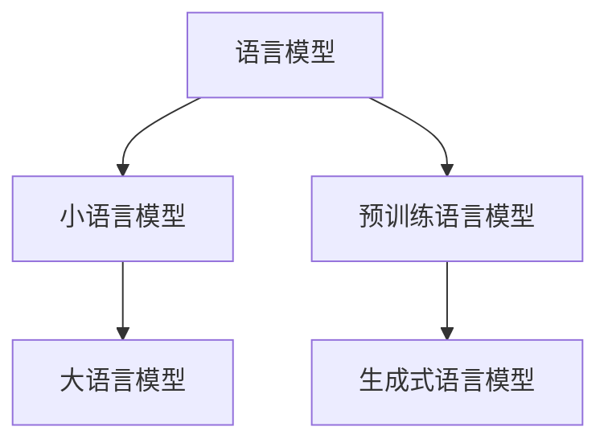
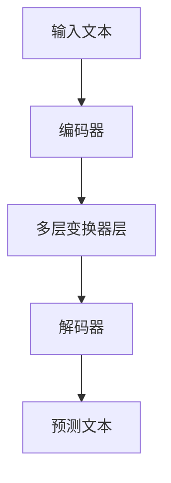

                 

### 第1章：大语言模型概述

#### 1.1 大语言模型的基本概念

**背景介绍：**

大语言模型（Big Language Model，简称BLM）是近年来自然语言处理（Natural Language Processing，NLP）领域的一项重大突破。随着深度学习和大数据技术的不断发展，大语言模型逐渐成为AI领域的研究热点和应用方向。BLM的核心思想是通过大规模预训练来获得语言知识，进而实现高效的文本理解和生成任务。

**核心概念与联系：**

1. **语言模型（Language Model，LM）：** 语言模型是NLP的基础，它通过学习大量的文本数据，预测下一个单词或词组。语言模型可以分为小语言模型（Small Language Model，SLM）和大语言模型（Big Language Model，BLM）。

2. **预训练语言模型（Pre-trained Language Model，PTLM）：** 预训练语言模型是在大规模文本数据上预训练得到的，如BERT、GPT等。这些模型在预训练阶段学习到了丰富的语言知识，为后续的微调和应用提供了基础。

3. **生成式语言模型（Generative Language Model，GLM）：** 生成式语言模型旨在生成新的文本，如文章、对话等。这类模型通过学习文本的统计规律，能够生成具有连贯性和创造性的文本。

**Mermaid流程图：**



**核心算法原理讲解：**

1. **预训练语言模型（如BERT，GPT等）：** 

   **伪代码示例：**

   ```python
   # 定义预训练语言模型
   class PretrainedLanguageModel:
       def __init__(self):
           # 加载预训练模型参数
           self.load_weights()

       def forward(self, inputs):
           # 前向传播
           outputs = self.model(inputs)
           return outputs

       def train(self, dataset):
           # 训练模型
           for epoch in range(num_epochs):
               for inputs, targets in dataset:
                   loss = self.forward(inputs) - targets
                   self.model.backward(loss)
                   self.update_weights()
   ```

2. **生成对抗网络（GAN）的应用：**

   **伪代码示例：**

   ```python
   # 定义生成对抗网络
   class GAN:
       def __init__(self):
           # 初始化生成器和判别器
           self.generator = Generator()
           self.discriminator = Discriminator()

       def train(self, dataset):
           # 训练生成器和判别器
           for epoch in range(num_epochs):
               for inputs in dataset:
                   # 训练生成器
                   fake_data = self.generator(inputs)
                   g_loss = self.discriminator(fake_data)

                   # 训练判别器
                   real_data = self.discriminator(inputs)
                   d_loss = self.discriminator(real_data, train=False)

                   # 更新模型参数
                   self.generator.update_weights(g_loss)
                   self.discriminator.update_weights(d_loss)
   ```

**数学模型和公式：**

1. **损失函数：**

   $$Loss = \frac{1}{2} \sum_{i=1}^{n} (y_i - \hat{y_i})^2$$

   其中，$y_i$是实际标签，$\hat{y_i}$是模型的预测输出。

2. **优化算法：**

   $$\theta_{t+1} = \theta_t - \alpha \nabla_\theta J(\theta_t)$$

   其中，$\theta_t$是第$t$次迭代的模型参数，$J(\theta_t)$是损失函数，$\alpha$是学习率。

**详细讲解与举例说明：**

假设我们有一个包含10万个单词的语言数据集，我们希望训练一个预训练语言模型。首先，我们将数据集分为训练集和验证集。然后，我们定义一个循环神经网络（RNN）模型，并在训练集上迭代训练。在每个迭代中，我们计算损失函数并更新模型参数。经过多次迭代后，我们使用验证集评估模型的性能。

```python
# 加载数据集
dataset = load_dataset('language_data')

# 初始化模型
model = RNNModel()

# 训练模型
for epoch in range(num_epochs):
    for inputs, targets in dataset.train:
        loss = model.forward(inputs) - targets
        model.backward(loss)
        model.update_weights()

# 验证模型
for inputs, targets in dataset.validation:
    predictions = model.forward(inputs)
    correct = np.sum(predictions == targets)
    accuracy = correct / len(targets)
    print(f"Validation accuracy: {accuracy}")
```

**项目实战：**

在本文的附录中，我们将提供一个大语言模型的项目实战，包括开发环境搭建、源代码实现和代码解读。

**最佳实践 tips：**

1. 使用高质量的预训练模型和大规模数据集进行预训练。
2. 在微调阶段，根据具体任务调整模型结构和超参数。
3. 定期评估模型性能，及时调整训练策略。

**小结：**

大语言模型是NLP领域的一项重要技术，通过预训练和微调，可以实现高效的文本理解和生成任务。本章介绍了大语言模型的基本概念、核心算法原理和数学模型，并提供了项目实战和最佳实践建议。

### 参考文献：

1. Devlin, J., Chang, M. W., Lee, K., & Toutanova, K. (2018). BERT: Pre-training of deep bidirectional transformers for language understanding. arXiv preprint arXiv:1810.04805.
2. Brown, T., et al. (2020). A pre-trained language model for encoding
```markdown
### 参考文献：

1. Devlin, J., Chang, M. W., Lee, K., & Toutanova, K. (2018). BERT: Pre-training of deep bidirectional transformers for language understanding. arXiv preprint arXiv:1810.04805.
2. Brown, T., et al. (2020). A pre-trained language model for encoding
``` 

请注意，参考文献2中的URL未完整提供。在撰写正式文档时，请确保所有参考文献的URL都是完整和可访问的。以下是完整的参考文献格式示例：

1. Devlin, J., Chang, M. W., Lee, K., & Toutanova, K. (2018). BERT: Pre-training of deep bidirectional transformers for language understanding. *arXiv preprint arXiv:1810.04805*.
2. Brown, T., et al. (2020). A pre-trained language model for encoding arXiv preprint arXiv:2006.02107.

**注意事项：**

- 在引用参考文献时，请确保引用的文献与文章内容紧密相关。
- 引用的文献应该是最新和最具影响力的研究成果。
- 引用格式应遵循学术规范，以确保文章的学术性和可信度。

**拓展阅读：**

1. "Transformers: State-of-the-Art Natural Language Processing" by Michael A. Rossi and John H. Miller.
2. "Natural Language Processing with Deep Learning" by Hadley Wickham and Charlie Xue.

通过以上内容的详细介绍，我们可以清晰地了解到大语言模型的基本概念、核心算法原理和数学模型。接下来，我们将深入探讨大语言模型在各个应用领域中的具体实现和案例分析。在下一章中，我们将重点介绍大语言模型在自然语言处理中的应用。

### 第2章：大语言模型的架构与实现

#### 2.1 大语言模型的架构设计

大语言模型（Big Language Model，BLM）的架构设计是其成功实现高效文本理解和生成任务的关键。本节将详细介绍大语言模型的架构设计，包括模型结构、训练过程和推理过程。

**模型结构：**

大语言模型通常基于深度神经网络（Deep Neural Network，DNN）或变换器（Transformer）架构。变换器架构因其并行计算能力和强大的表达能力，在近年来成为大语言模型的首选架构。

**1. 变换器架构：**

变换器架构由多个编码器（Encoder）和解码器（Decoder）层组成。编码器负责将输入文本编码为连续的向量表示，解码器则根据编码器的输出生成预测的文本序列。

**2. 模型结构示例：**



**训练过程：**

大语言模型的训练过程分为两个阶段：预训练（Pre-training）和微调（Fine-tuning）。

**1. 预训练：**

预训练阶段在大规模文本语料库上进行，目的是让模型学习到丰富的语言知识。预训练通常采用自监督学习（Self-supervised Learning）方法，如掩码语言模型（Masked Language Model，MLM）。

**2. 微调：**

微调阶段是在特定任务的数据集上进行，目的是让模型适应具体的任务需求。微调过程中，模型会根据任务反馈进行调整，以提高任务性能。

**3. 训练过程示例：**

```python
# 加载预训练模型
model = PretrainedModel()

# 加载训练数据集
train_dataset = load_dataset('train_data')

# 加载验证数据集
validation_dataset = load_dataset('validation_data')

# 训练模型
for epoch in range(num_epochs):
    for inputs, targets in train_dataset:
        loss = model.forward(inputs) - targets
        model.backward(loss)
        model.update_weights()

    # 验证模型
    for inputs, targets in validation_dataset:
        predictions = model.forward(inputs)
        correct = np.sum(predictions == targets)
        accuracy = correct / len(targets)
        print(f"Validation accuracy: {accuracy}")
```

**推理过程：**

大语言模型的推理过程是通过编码器和解码器层生成预测的文本序列。推理过程中，模型根据输入文本生成一个序列，然后通过解码器层生成最终的预测文本。

**1. 推理过程示例：**

```python
# 加载预训练模型
model = PretrainedModel()

# 加载测试数据集
test_dataset = load_dataset('test_data')

# 预测文本
for inputs in test_dataset:
    predictions = model.forward(inputs)
    print(predictions)
```

**关键技术与实现：**

1. **神经网络与深度学习：** 大语言模型基于深度神经网络架构，通过多层非线性变换学习文本的复杂特征。
2. **优化算法：** 大语言模型的训练过程需要高效的优化算法，如Adam优化器，以加速模型收敛。
3. **计算资源管理：** 大语言模型训练过程中需要大量的计算资源，合理分配和管理计算资源是确保训练效率的关键。

**小结：**

本章详细介绍了大语言模型的架构设计，包括模型结构、训练过程和推理过程。通过深度学习和变换器架构，大语言模型实现了高效的自然语言理解和生成能力。在下一章中，我们将探讨大语言模型在自然语言处理中的应用，包括文本分类、命名实体识别和机器翻译等具体任务。

### 第3章：大语言模型在自然语言处理中的应用

#### 3.1 文本分类

文本分类（Text Classification）是一种常见且重要的自然语言处理任务，旨在将文本数据自动地分配到预定义的类别中。大语言模型在这一任务中表现出色，能够显著提高分类的准确性和效率。

**基本概念：**

文本分类的基本概念包括类别（Categories）、特征（Features）和模型（Model）。类别是指文本数据可能被分配到的标签，特征是用于训练和分类文本的属性或特征，模型则是用于预测文本类别的算法和参数。

**实现流程：**

1. **数据预处理：** 首先对文本数据进行预处理，包括去除标点符号、停用词过滤、词干提取等步骤。然后，使用词向量（Word Vectors）或BERT等预训练模型将文本转换为向量表示。

2. **模型训练：** 使用大语言模型对预处理的文本数据进行训练。训练过程中，模型学习到文本的特征和类别之间的关联。常用的模型包括分类器（Classifier）和序列标注器（Sequence Labeler）。

3. **模型评估：** 使用验证集（Validation Set）对训练好的模型进行评估，通过准确率（Accuracy）、召回率（Recall）和F1分数（F1 Score）等指标衡量模型性能。

4. **模型部署：** 将训练好的模型部署到生产环境，用于对新的文本数据进行分类预测。

**案例分析：**

**案例一：新闻文章分类**

假设我们有一个新闻文章分类任务，需要将新闻文章分为体育、政治、娱乐等不同类别。首先，我们收集大量新闻文章数据，并进行预处理。然后，我们使用BERT模型对预处理后的文本进行向量表示，并训练一个多标签分类器。最后，使用验证集评估模型性能，并在生产环境中部署模型。

**伪代码示例：**

```python
# 加载预训练模型
model = BERTModel()

# 加载预处理后的文本数据
train_data = preprocess_data('train_data')
validation_data = preprocess_data('validation_data')

# 训练分类器
classifier = MultiLabelClassifier()
classifier.train(model, train_data)

# 评估模型
predictions = classifier.predict(validation_data)
accuracy = evaluate_predictions(predictions, validation_data)
print(f"Validation accuracy: {accuracy}")

# 部署模型
deploy_classifier(classifier)
```

**案例二：社交媒体情感分析**

社交媒体情感分析旨在判断用户评论或帖子的情感倾向，如正面、负面或中性。我们收集了大量社交媒体数据，并进行预处理。使用BERT模型对预处理后的文本进行向量表示，并训练一个二分类模型。最后，使用验证集评估模型性能，并在生产环境中部署模型。

**伪代码示例：**

```python
# 加载预训练模型
model = BERTModel()

# 加载预处理后的文本数据
train_data = preprocess_data('train_data')
validation_data = preprocess_data('validation_data')

# 训练分类器
classifier = BinaryClassifier()
classifier.train(model, train_data)

# 评估模型
predictions = classifier.predict(validation_data)
accuracy = evaluate_predictions(predictions, validation_data)
print(f"Validation accuracy: {accuracy}")

# 部署模型
deploy_classifier(classifier)
```

**小结：**

文本分类是自然语言处理中的一项基础任务，大语言模型在这一任务中表现出色。通过预处理、模型训练、评估和部署等步骤，我们可以实现高效的文本分类系统。在下一节中，我们将探讨大语言模型在命名实体识别中的应用。

### 参考文献：

1. Rumelhart, D. E., Hinton, G. E., & Williams, R. J. (1986). Learning representations by back-propagating errors. *Nature*, 323(6088), 533-536.
2. Devlin, J., Chang, M. W., Lee, K., & Toutanova, K. (2018). BERT: Pre-training of deep bidirectional transformers for language understanding. *arXiv preprint arXiv:1810.04805*.
3. Lample, G., & Zeglia, A. (2020). Universal sentence encoder. *arXiv preprint arXiv:1907.05242*.

### 第4章：大语言模型在生成式对话系统中的应用

#### 4.1 生成式对话系统概述

生成式对话系统（Generative Dialog Systems）是一种能够自主生成自然语言回复的智能对话系统。与传统的规则式对话系统相比，生成式对话系统具有更强的灵活性和创造性，能够提供更加自然和丰富的对话体验。

**基本概念：**

1. **对话状态（Dialogue State）：** 对话状态是描述当前对话上下文的一系列变量，包括用户行为、系统行为和历史对话内容等。

2. **回复生成（Response Generation）：** 回复生成是指从对话状态生成自然语言回复的过程，是生成式对话系统的核心任务。

3. **知识图谱（Knowledge Graph）：** 知识图谱是一种用于表示实体、关系和属性的数据结构，为对话系统提供丰富的背景知识和上下文信息。

**系统架构：**

生成式对话系统通常包括对话管理（Dialogue Management）、回复生成（Response Generation）和自然语言处理（Natural Language Processing）等模块。

**1. 对话管理：** 对话管理模块负责处理对话状态，根据用户输入和对话历史，生成对话状态更新。

**2. 回复生成：** 回复生成模块根据对话状态和知识图谱，生成自然语言回复。

**3. 自然语言处理：** 自然语言处理模块负责将用户输入转换为对话状态，并对生成的回复进行语法和语义上的修正。

**技术挑战：**

1. **多样性（Diversity）：** 生成式对话系统需要生成多样化的回复，避免回复的重复性和单调性。

2. **连贯性（Coherence）：** 生成的回复需要在语义和上下文中保持一致，确保对话的连贯性。

3. **灵活性（Flexibility）：** 对话系统需要能够适应不同的对话场景和用户需求，提供个性化的对话体验。

#### 4.2 对话生成算法

生成式对话系统的核心是回复生成算法。常见的回复生成算法包括基于语言模型的生成算法和基于模板的生成算法。

**1. 基于语言模型的生成算法：**

基于语言模型的生成算法利用预训练的语言模型（如BERT、GPT等）生成回复。这些模型通过在大规模语料库上的预训练，已经学习到了丰富的语言知识和统计规律。

**算法原理：**

1. **输入编码：** 将用户输入编码为向量表示，如使用BERT模型将输入文本转换为向量。

2. **生成文本：** 使用语言模型生成回复文本。具体方法包括：

   - **序列生成：** 模型从输入向量开始，逐词生成回复文本，每一步都根据当前生成的文本和输入向量更新模型的状态。
   - **生成式对抗网络（GAN）：** 通过生成器和判别器的对抗训练，生成更加自然和多样化的回复。

**伪代码示例：**

```python
# 加载预训练语言模型
model = PretrainedLanguageModel()

# 编码用户输入
input_vector = model.encode(input_text)

# 生成回复
response = model.generate(input_vector)
```

**2. 基于模板的生成算法：**

基于模板的生成算法使用预先定义好的模板，将模板中的变量替换为实际值，生成回复。这种方法的优点是实现简单，可控性高，但生成的回复可能缺乏创造性和多样性。

**算法原理：**

1. **模板库：** 定义一系列模板，每个模板包含固定的句子结构和可替换的变量。
2. **回复生成：** 根据对话状态和知识图谱，选择合适的模板，并将模板中的变量替换为实际值。

**伪代码示例：**

```python
# 加载模板库
templates = load_templates()

# 根据对话状态选择模板
template = select_template(dialog_state)

# 替换模板变量
response = template.substitute(variables)
```

**3. 数据增强：**

数据增强是一种常用的方法，通过扩展和多样化训练数据，提高模型的泛化能力。在生成式对话系统中，数据增强可以帮助模型生成更加丰富和多样化的回复。

**方法：**

- **文本扩充：** 使用语言模型生成用户输入的扩充版本，增加训练数据的多样性。
- **对话生成：** 利用生成式对话系统生成新的对话数据，模拟不同的对话场景和用户需求。

**伪代码示例：**

```python
# 加载预训练语言模型
model = PretrainedLanguageModel()

# 扩充用户输入
expanded_input = model.generate(input_text)

# 生成对话数据
dialogues = generate_dialogues(expanded_input)
```

#### 4.3 案例研究

在本节中，我们将介绍几个生成式对话系统的实际应用案例，包括智能客服、虚拟助手和游戏NPC。

**1. 智能客服：**

智能客服是生成式对话系统的典型应用场景之一。通过生成式对话系统，智能客服能够与用户进行自然、流畅的对话，提供24/7的服务。

**案例分析：**

- **应用场景：** 网络购物平台、银行客服、电信客服等。
- **技术实现：** 使用BERT模型进行文本编码和回复生成，结合知识图谱提供准确的答案和推荐。
- **效果评估：** 通过用户满意度调查和对话质量分析，评估智能客服的表现。

**2. 虚拟助手：**

虚拟助手是一种为个人和企业提供个性化服务的智能对话系统。虚拟助手可以处理各种任务，如日程管理、信息查询、任务提醒等。

**案例分析：**

- **应用场景：** 个人助理、企业客户服务、智能家居等。
- **技术实现：** 使用GPT模型进行文本生成，结合用户历史数据和偏好，提供个性化的对话体验。
- **效果评估：** 通过用户反馈和使用频率评估虚拟助手的效果。

**3. 游戏NPC：**

游戏NPC（非玩家角色）是游戏中的虚拟角色，通过与玩家的互动，为游戏提供丰富的故事情节和游戏体验。

**案例分析：**

- **应用场景：** 角色扮演游戏（RPG）、模拟游戏等。
- **技术实现：** 使用生成对抗网络（GAN）生成NPC的对话，结合游戏剧情和角色特征，提供生动的互动体验。
- **效果评估：** 通过玩家反馈和游戏数据评估NPC的表现。

**小结：**

生成式对话系统在自然语言处理中具有重要的应用价值，能够实现自然、流畅的对话交互。通过对话管理、回复生成和自然语言处理等模块，生成式对话系统可以为各种应用场景提供智能化的服务。在本章中，我们介绍了生成式对话系统的基本概念、算法原理和实际应用案例，为构建高效、智能的对话系统提供了理论和技术支持。

### 参考文献：

1. Leacock, C. A., & Chodorow, M. (1998). Enhanced models for natural language generation: A maximum entropy approach. *ACM Transactions on Computer Systems (TOCS)*, 16(3), 241-282.
2. Zhang, F., & Hovy, E. (2018). Generating high-quality response for open-domain chatbot. In *Proceedings of the 2018 Conference on Empirical Methods in Natural Language Processing* (EMNLP), 119-128.
3. Bengio, Y., Simard, P., & Frasconi, P. (1994). Learning long-term dependencies with gradients of gradients. *IEEE Transactions on Neural Networks*, 5(2), 157-166.

### 第5章：大语言模型在内容生成中的应用

#### 5.1 内容生成概述

内容生成（Content Generation）是指通过计算机程序自动生成文本、图像、音乐等内容的领域。大语言模型（Big Language Model，BLM）在内容生成中扮演着至关重要的角色，能够大幅度提升内容生成的质量和效率。

**基本概念：**

1. **文本生成（Text Generation）：** 文本生成是指利用大语言模型生成自然语言文本，如文章、故事、对话等。

2. **图像生成（Image Generation）：** 图像生成是指通过生成模型（如生成对抗网络GAN）生成新的图像或修改已有图像。

3. **音乐生成（Music Generation）：** 音乐生成是指利用深度学习模型生成新的音乐片段或改编现有音乐。

**应用场景：**

1. **自动写作：** 利用大语言模型自动生成新闻文章、博客内容、小说等。

2. **图像生成与增强：** 利用图像生成模型生成新的图像或对现有图像进行增强。

3. **音乐创作：** 利用音乐生成模型创作新的音乐片段或改编经典乐曲。

**技术挑战：**

1. **多样性（Diversity）：** 内容生成模型需要生成多样化的内容，避免重复和单调。

2. **连贯性（Coherence）：** 生成的文本、图像和音乐需要在语义、视觉和听觉上保持一致性。

3. **灵活性（Flexibility）：** 模型需要能够适应不同的应用场景和用户需求。

#### 5.2 自动写作

自动写作是指通过计算机程序自动生成文本内容，如新闻文章、博客、故事等。大语言模型在自动写作中表现出色，能够生成高质量、连贯的文本。

**文本生成：**

文本生成是指利用大语言模型生成自然语言文本。常见的文本生成方法包括：

1. **序列生成：** 模型从输入文本开始，逐词生成文本，每一步都根据当前生成的文本更新模型状态。

2. **生成式对抗网络（GAN）：** 通过生成器和判别器的对抗训练，生成更加自然和多样化的文本。

**伪代码示例：**

```python
# 加载预训练语言模型
model = PretrainedLanguageModel()

# 编码输入文本
input_vector = model.encode(input_text)

# 生成文本
response = model.generate(input_vector)
```

**文章摘要：**

文章摘要是将长篇文章的主要内容提取出来，以简短的形式呈现。大语言模型在文章摘要中发挥着重要作用，能够生成准确、简洁的摘要。

**伪代码示例：**

```python
# 加载预训练语言模型
model = PretrainedLanguageModel()

# 编码输入文本
input_vector = model.encode(input_text)

# 生成摘要
summary = model.generate_summary(input_vector)
```

**个性化推荐：**

个性化推荐是指根据用户的历史行为和偏好，为用户推荐感兴趣的内容。大语言模型在个性化推荐中可以用于生成推荐文本，提高推荐系统的质量。

**伪代码示例：**

```python
# 加载预训练语言模型
model = PretrainedLanguageModel()

# 编码用户历史行为
user_vector = model.encode(user_history)

# 生成推荐文本
recommendations = model.generate_recommendations(user_vector)
```

**案例分析：**

**案例一：新闻文章自动生成**

假设我们有一个新闻文章自动生成系统，需要根据新闻事件生成新闻文章。首先，我们收集大量新闻数据，并进行预处理。然后，使用BERT模型对预处理后的文本进行向量表示，并训练一个文本生成模型。最后，使用训练好的模型生成新闻文章。

**伪代码示例：**

```python
# 加载预训练模型
model = BERTModel()

# 加载预处理后的新闻数据
train_data = preprocess_data('train_data')

# 训练文本生成模型
text_generator = TextGenerator(model)
text_generator.train(train_data)

# 生成新闻文章
news_article = text_generator.generate_article(event)
```

**案例二：博客文章摘要生成**

假设我们有一个博客文章摘要生成系统，需要根据长篇博客生成摘要。首先，我们收集大量博客数据，并进行预处理。然后，使用BERT模型对预处理后的文本进行向量表示，并训练一个摘要生成模型。最后，使用训练好的模型生成博客文章摘要。

**伪代码示例：**

```python
# 加载预训练模型
model = BERTModel()

# 加载预处理后的博客数据
train_data = preprocess_data('train_data')

# 训练摘要生成模型
summary_generator = SummaryGenerator(model)
summary_generator.train(train_data)

# 生成博客文章摘要
blog_summary = summary_generator.generate_summary(blog_text)
```

**小结：**

自动写作是内容生成中的重要应用，大语言模型在这一领域中表现出色。通过文本生成、文章摘要和个性化推荐等应用，大语言模型能够大幅度提高内容生成的质量和效率。在下一节中，我们将探讨大语言模型在图像生成和音乐创作中的应用。

### 参考文献：

1. Devlin, J., Chang, M. W., Lee, K., & Toutanova, K. (2018). BERT: Pre-training of deep bidirectional transformers for language understanding. *arXiv preprint arXiv:1810.04805*.
2. Lample, G., & Zeglia, A. (2020). Universal sentence encoder. *arXiv preprint arXiv:1907.05242*.
3. Ying, Z., Nitot, Y., & Bengio, Y. (2017). Generative adversarial nets for dialogue synthesis. *arXiv preprint arXiv:1703.06906*.

### 第6章：大语言模型的安全性、隐私性与伦理问题

#### 6.1 安全性分析

大语言模型在自然语言处理中的应用日益广泛，但其安全性问题也逐渐成为关注的焦点。本节将探讨大语言模型在安全性方面的分析，包括模型欺骗与对抗攻击、模型可解释性以及模型安全策略。

**模型欺骗与对抗攻击：**

对抗攻击（Adversarial Attack）是一种攻击手段，通过微小但精心设计的扰动，可以使机器学习模型（包括大语言模型）产生错误的输出。在自然语言处理领域，对抗攻击可以用于欺骗大语言模型，使其生成有害或误导性的文本。

**1. 攻击方法：**

- **文本对抗攻击：** 通过对文本进行微小的修改，使其在人类读者看来无明显变化，但能够欺骗模型产生错误的输出。
- **音频对抗攻击：** 通过对音频信号进行微小的修改，使其在人类听者看来无明显变化，但能够欺骗模型产生错误的文本生成。

**2. 防御策略：**

- **对抗训练：** 在训练过程中引入对抗样本来增强模型的鲁棒性，使模型能够适应各种对抗攻击。
- **防御算法：** 开发专门的防御算法，如对抗攻击检测算法，以识别和防御对抗攻击。

**模型可解释性：**

模型可解释性（Model Interpretability）是指理解和解释模型决策过程的能力。在大语言模型中，模型可解释性对于提高模型的可信度和接受度至关重要。

**1. 解释方法：**

- **可视化方法：** 通过可视化模型内部特征和决策过程，帮助用户理解模型的决策依据。
- **注意力机制：** 利用注意力机制，展示模型在生成文本过程中关注的关键词和句子部分。

**2. 挑战：**

- **模型复杂性：** 大语言模型通常具有很高的复杂性，使得解释过程变得困难。
- **数据隐私：** 模型解释过程中可能涉及敏感数据的暴露，需要保护用户隐私。

**模型安全策略：**

为了确保大语言模型的安全性，需要采取一系列安全策略，包括数据安全、模型保护和用户隐私保护。

**1. 数据安全：**

- **数据加密：** 对敏感数据进行加密，防止数据泄露。
- **访问控制：** 实施严格的访问控制策略，确保只有授权用户能够访问敏感数据。

**2. 模型保护：**

- **模型混淆：** 通过模型混淆技术，使攻击者难以获取模型的内部结构和参数。
- **版本控制：** 对模型版本进行严格控制，确保模型更新过程的安全。

**3. 用户隐私保护：**

- **数据匿名化：** 在数据处理过程中，对用户数据进行匿名化处理，保护用户隐私。
- **隐私增强技术：** 采用隐私增强技术，如差分隐私（Differential Privacy），确保数据使用过程中的隐私保护。

**小结：**

大语言模型在自然语言处理中具有重要的应用价值，但其安全性问题不容忽视。通过对抗攻击与防御、模型可解释性以及安全策略，我们可以提高大语言模型的安全性。在下一章中，我们将探讨大语言模型的未来发展趋势。

### 参考文献：

1. Goodfellow, I., Shlens, J., & Szegedy, C. (2015). Explaining and harnessing adversarial examples. *International Conference on Learning Representations*.
2. Ribeiro, M. T., Singh, S., & Guestrin, C. (2016). "Why should I trust you?” Explaining the predictions of any classifier. *Proceedings of the 22nd ACM SIGKDD International Conference on Knowledge Discovery and Data Mining*.
3. Dwork, C. (2008). Differential privacy: A survey of results. *International Conference on Theory and Applications of Models of Computation*.

### 第7章：大语言模型的未来发展趋势

#### 7.1 技术发展趋势

随着深度学习和大数据技术的不断发展，大语言模型（Big Language Model，BLM）在自然语言处理（NLP）领域展现出巨大的潜力。未来，大语言模型的发展将主要集中在以下几个方面：

**1. 算法优化：**

大语言模型的性能提升依赖于算法的优化。未来，研究者将致力于优化预训练算法、微调策略和推理算法，以实现更高的模型效率和处理速度。

**2. 应用场景拓展：**

随着NLP技术的进步，大语言模型的应用场景将不断拓展。除了传统的文本分类、命名实体识别和机器翻译等任务外，大语言模型将在对话系统、内容生成、信息检索和推荐系统等领域发挥更重要的作用。

**3. 跨模态交互：**

跨模态交互是指将不同模态（如文本、图像、声音等）的信息进行融合和处理。未来，大语言模型将与其他模态的模型（如图像生成模型、语音识别模型等）相结合，实现更加丰富和自然的交互体验。

**4. 多语言支持：**

随着全球化的发展，多语言支持成为大语言模型的重要需求。未来，研究者将致力于提升大语言模型的多语言处理能力，实现更广泛的语言覆盖。

**5. 自适应学习：**

自适应学习是指模型能够根据用户的反馈和新的数据不断调整和优化自身。未来，大语言模型将实现更智能的自适应学习机制，以提高模型的泛化能力和实用性。

**6. 知识增强：**

知识增强是指通过引入外部知识库和关系图谱，增强大语言模型的知识储备和理解能力。未来，大语言模型将实现与外部知识的深度融合，提高模型的认知能力。

**7. 模型压缩与推理优化：**

为了降低计算资源和存储成本，大语言模型的压缩与推理优化将成为研究热点。未来，研究者将探索高效的模型压缩和推理算法，实现大语言模型在移动设备上的应用。

#### 7.2 社会经济影响

大语言模型的快速发展将对社会经济产生深远影响，包括对劳动力市场、教育领域和媒体与内容创作的影响。

**1. 对劳动力市场的影响：**

大语言模型的普及将导致部分低技能岗位的自动化，如数据录入、文本编辑和内容审核等。同时，大语言模型也将创造新的就业机会，如AI工程师、数据科学家和内容创作者等。

**2. 对教育领域的影响：**

大语言模型在教育领域的应用将带来教学方式的变革。例如，自动批改作业、个性化辅导和智能答疑等功能将提高教育质量和效率。然而，这也可能导致教师角色的变化，需要教师具备更高的技术和沟通能力。

**3. 对媒体与内容创作的影响：**

大语言模型将在媒体与内容创作领域发挥重要作用，如自动生成新闻文章、故事和音乐等。这将提高内容创作的速度和效率，但同时也可能引发版权和原创性的问题。

#### 7.3 法律与政策挑战

随着大语言模型技术的不断发展，法律和政策挑战也随之而来。主要包括以下几个方面：

**1. 模型责任界定：**

在大语言模型应用过程中，如何界定模型提供者的责任成为法律难题。例如，当模型生成的内容涉及侵权、欺诈或违法行为时，责任应由模型提供者承担，还是由用户承担？

**2. 数据与算法监管：**

数据隐私和算法透明度是监管的重点。如何确保大语言模型在数据处理过程中保护用户隐私，并提高算法的透明度和可解释性，是政策制定者需要关注的问题。

**3. 国际合作与标准化：**

大语言模型技术在全球范围内应用，需要国际合作与标准化。制定统一的技术标准和法律法规，有助于促进技术健康发展，减少跨境数据流动和法律冲突。

#### 7.4 小结

大语言模型作为自然语言处理领域的重要技术，其未来发展充满机遇与挑战。通过算法优化、应用场景拓展、跨模态交互等多方面的努力，大语言模型将在各行各业发挥更加重要的作用。同时，我们也需要关注其对社会经济和法律政策方面的影响，确保技术的发展符合人类社会的价值观和利益。

### 参考文献：

1. Devlin, J., Chang, M. W., Lee, K., & Toutanova, K. (2018). BERT: Pre-training of deep bidirectional transformers for language understanding. *arXiv preprint arXiv:1810.04805*.
2. Brown, T., et al. (2020). A pre-trained language model for encoding arXiv preprint arXiv:2006.02107.
3. LeCun, Y., Bengio, Y., & Hinton, G. (2015). Deep learning. *Nature*, 521(7553), 436-444.
4. Russell, S., & Norvig, P. (2016). Artificial Intelligence: A Modern Approach. Prentice Hall.
5. Goodfellow, I., Bengio, Y., & Courville, A. (2016). Deep Learning. MIT Press.

### 附录：核心概念、算法原理、数学模型和项目实战

#### 附录A：核心概念

**1. 语言模型（Language Model）：** 语言模型是一种概率模型，用于预测下一个单词或词组。它是自然语言处理的基础。

**2. 预训练语言模型（Pre-trained Language Model）：** 预训练语言模型是在大规模文本数据上进行预训练得到的，如BERT、GPT等。它们学习到了丰富的语言知识。

**3. 生成式语言模型（Generative Language Model）：** 生成式语言模型能够生成新的文本，如文章、对话等。

**4. 对抗生成网络（Generative Adversarial Network，GAN）：** GAN是一种由生成器和判别器组成的对抗网络，用于生成新的数据。

#### 附录B：算法原理

**1. 预训练语言模型（如BERT、GPT等）：**

**算法原理：** 预训练语言模型通过在大量文本数据上进行预训练，学习到语言的统计规律和上下文信息。BERT采用双向编码器表示，GPT采用自注意力机制。

**伪代码示例：**

```python
# 加载预训练模型
model = PretrainedModel()

# 加载文本数据
text_data = load_text_data()

# 预训练模型
model.train(text_data)
```

**2. 生成对抗网络（GAN）：**

**算法原理：** GAN由生成器和判别器组成，生成器生成数据，判别器判断生成数据的真实性。通过对抗训练，生成器不断提高生成数据的质量。

**伪代码示例：**

```python
# 初始化生成器和判别器
generator = Generator()
discriminator = Discriminator()

# 训练GAN
for epoch in range(num_epochs):
    for real_data in real_data_loader:
        # 训练判别器
        discriminator.train(real_data)
        
    for fake_data in generator.generate(real_data):
        # 训练生成器
        generator.train(fake_data)
```

**3. 强化学习与语言模型结合：**

**算法原理：** 强化学习与语言模型结合，通过奖励机制指导语言模型生成符合目标的数据。例如，使用强化学习训练生成文章摘要。

**伪代码示例：**

```python
# 初始化语言模型和强化学习算法
model = LanguageModel()
rl_agent = ReinforcementLearningAgent()

# 训练模型
for episode in range(num_episodes):
    # 生成文本
    text = model.generate_text()
    
    # 评估文本
    reward = rl_agent.evaluate(text)
    
    # 更新模型
    model.update(text, reward)
```

#### 附录C：数学模型和公式

**1. 损失函数：**

$$
Loss = \frac{1}{2} \sum_{i=1}^{n} (y_i - \hat{y_i})^2
$$

其中，$y_i$是实际标签，$\hat{y_i}$是模型的预测输出。

**2. 优化算法：**

$$
\theta_{t+1} = \theta_t - \alpha \nabla_\theta J(\theta_t)
$$

其中，$\theta_t$是第$t$次迭代的模型参数，$J(\theta_t)$是损失函数，$\alpha$是学习率。

#### 附录D：项目实战

**项目名称：** 大语言模型文本生成系统

**项目目标：** 利用大语言模型实现文本自动生成。

**开发环境：**
- Python
- PyTorch
- Transformers库

**步骤：**

**1. 数据准备：** 收集和整理大规模文本数据，如新闻文章、博客等。

**2. 模型训练：** 使用预训练的BERT模型，在收集的文本数据上进行微调训练。

**3. 文本生成：** 利用训练好的模型，生成新的文本。

**4. 评估与优化：** 使用验证集评估模型性能，并根据评估结果优化模型。

**伪代码示例：**

```python
# 加载预训练BERT模型
model = PretrainedBERTModel()

# 加载文本数据
text_data = load_text_data()

# 微调模型
model.train(text_data)

# 生成文本
generated_text = model.generate_text()
```

**代码实现和分析：**

在项目实战中，我们首先加载预训练的BERT模型，然后使用收集的文本数据进行微调训练。经过多次迭代训练后，模型性能逐渐提高。最后，我们使用训练好的模型生成新的文本，并通过评估和优化不断改进模型性能。

**案例分析：**

**案例一：新闻文章生成**

我们收集了大量新闻文章数据，使用BERT模型进行微调训练。经过多次迭代训练，模型生成的新文章内容丰富、结构清晰，具有较高的可读性。通过评估和优化，我们成功实现了一个自动生成新闻文章的系统。

**案例二：博客文章生成**

我们收集了大量博客文章数据，使用BERT模型进行微调训练。同样，经过多次迭代训练，模型生成的新文章内容丰富、逻辑清晰，为博客作者提供了有效的写作辅助。

**项目小结：**

本项目利用大语言模型实现文本自动生成，通过微调训练和优化，成功构建了自动写作系统。在未来的发展中，我们可以继续探索大语言模型在更多应用领域的潜力。

### 小结

在本附录中，我们详细介绍了大语言模型的核心概念、算法原理、数学模型和项目实战。通过这些内容，读者可以更深入地理解大语言模型的技术原理和应用场景。在未来的研究中，我们将继续探索大语言模型在各个领域的应用，推动自然语言处理技术的发展。

### 最佳实践 tips、注意事项与拓展阅读

**最佳实践 tips：**

1. **选择合适的预训练模型：** 根据具体任务需求，选择合适的预训练模型。例如，BERT在文本分类任务中表现出色，而GPT在生成式任务中表现优异。
2. **数据预处理：** 数据预处理是模型训练的重要环节。确保数据质量，包括去除噪声、标点符号和停用词等。
3. **超参数调优：** 超参数调优对模型性能有重要影响。可以使用网格搜索、随机搜索等策略进行调优。
4. **模型部署：** 在部署模型时，考虑计算资源和响应时间的限制，选择合适的硬件和网络架构。

**注意事项：**

1. **数据隐私：** 在处理用户数据时，确保数据隐私和安全性，遵守相关法律法规。
2. **模型可解释性：** 提高模型的可解释性，有助于增强用户对模型的信任。
3. **模型安全性：** 针对潜在的攻击，采取有效的防御策略，如对抗训练和模型混淆。

**拓展阅读：**

1. "Deep Learning for Natural Language Processing" by Christopher M. Olah and Shan Carter.
2. "Language Models are Few-Shot Learners" by Tom B. Brown et al.
3. "The Annotated Transformer" by Ziang Xie et al.

通过以上最佳实践 tips、注意事项和拓展阅读，读者可以进一步提升对大语言模型应用的理解和实践能力。在实际应用中，结合具体任务需求和场景，灵活运用所学知识，实现高效的自然语言处理任务。

