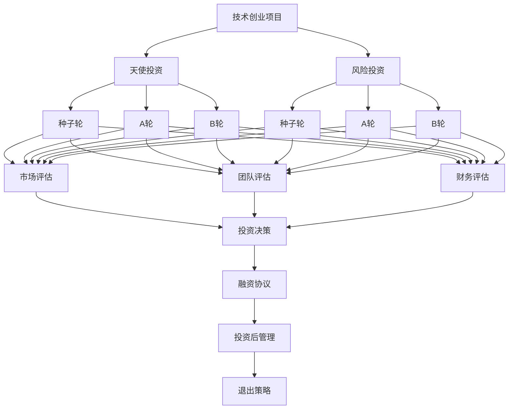

                 

# 天使投资与风险投资：技术创业项目的融资渠道

> 关键词：天使投资、风险投资、技术创业、融资渠道、股权融资、债务融资

> 摘要：本文旨在探讨天使投资与风险投资在技术创业项目融资中的重要作用，分析两者的定义、特点、发展历程及其在技术创业项目融资策略中的应用。文章通过具体案例解析，为创业者提供有效的融资策略，并探讨相关法律法规与政策对天使投资与风险投资的影响。

### 目录大纲

## 第一部分：天使投资与风险投资概述

### 第1章：天使投资与风险投资的定义与角色
- 1.1 天使投资与风险投资的基本概念
- 1.2 投资者与创业者的关系
- 1.3 天使投资与风险投资的主要区别

### 第2章：天使投资与风险投资的发展历程
- 2.1 天使投资的起源与发展
- 2.2 风险投资市场的演变
- 2.3 中国天使投资与风险投资的发展现状

### 第3章：天使投资与风险投资的特点
- 3.1 高风险与高回报
- 3.2 资金支持与战略支持
- 3.3 投资决策的灵活性与专业性

## 第二部分：技术创业项目的融资策略

### 第4章：技术创业项目的评估
- 4.1 技术创业项目的市场评估
- 4.2 技术创业项目的团队评估
- 4.3 技术创业项目的财务评估

### 第5章：融资渠道选择
- 5.1 天使投资与风险投资的优点与局限
- 5.2 股权融资与债务融资的比较
- 5.3 不同融资方式的选择策略

### 第6章：融资谈判与合同条款
- 6.1 融资谈判的策略与技巧
- 6.2 常见的融资合同条款
- 6.3 融资协议的风险与防范

### 第7章：天使投资与风险投资案例分析
- 7.1 成功的天使投资与风险投资案例
- 7.2 失败的天使投资与风险投资案例
- 7.3 案例中的经验与教训

## 第三部分：天使投资与风险投资的实践

### 第8章：天使投资与风险投资的流程
- 8.1 投资前期的准备工作
- 8.2 投资决策过程
- 8.3 投资后的管理与退出

### 第9章：天使投资与风险投资的实践技巧
- 9.1 市场研究与行业分析
- 9.2 项目评估与投资决策
- 9.3 投资后的管理与风险控制

### 第10章：天使投资与风险投资的法律法规与政策
- 10.1 中国天使投资与风险投资的法律法规
- 10.2 政府支持政策对天使投资与风险投资的影响
- 10.3 国际天使投资与风险投资法规对比

## 附录

### 附录A：常用融资工具与平台
- A.1 股权融资工具
- A.2 债务融资工具
- A.3 融资平台介绍

### 附录B：天使投资与风险投资术语解释
- B.1 天使投资人
- B.2 风险投资公司
- B.3 创投基金
- B.4 种子轮、A轮、B轮等投资阶段

## Mermaid 流程图

## 第一部分：天使投资与风险投资概述

### 第1章：天使投资与风险投资的定义与角色

#### 1.1 天使投资与风险投资的基本概念

天使投资（Angel Investment）通常是指个人投资者或机构投资者对初创企业或小型企业的早期投资，旨在获取股权收益。天使投资人通常是成功的企业家、高级管理人员或其他有实力的个人。

风险投资（Venture Capital，简称VC）则是指专业投资机构对处于成长期的初创企业或小型企业的投资，旨在帮助企业快速发展并实现规模效应。风险投资公司（Venture Capital Firm）是专门从事风险投资的机构，它们通常有专业的投资团队，对多个行业和项目进行投资。

#### 1.2 投资者与创业者的关系

天使投资人和风险投资公司与创业者的关系主要表现为：

- **资金支持**：投资者提供资金支持，帮助创业者实现商业计划。
- **战略指导**：投资者基于自身经验和专业知识，为创业者提供战略指导和商业建议。
- **资源整合**：投资者利用自身资源和人脉，帮助创业者获得更多的市场机会和资源。

#### 1.3 天使投资与风险投资的主要区别

- **投资阶段**：天使投资主要面向初创企业，风险投资则更多面向已经有一定市场规模和成长潜力的企业。
- **投资额度**：天使投资通常金额较小，风险投资则额度较大，可以覆盖企业的更大规模发展需求。
- **投资策略**：天使投资更注重个人的信任和关系，风险投资则更注重专业的分析和评估。
- **回报预期**：天使投资的风险较高，但潜在的回报也较高；风险投资的回报相对稳定，但回报率通常低于天使投资。

### 第2章：天使投资与风险投资的发展历程

#### 2.1 天使投资的起源与发展

天使投资的概念起源于19世纪末，当时一些成功的企业家和个人投资者开始对新兴企业进行投资。随着20世纪初科技和经济的快速发展，天使投资逐渐成为一种重要的创业融资方式。

#### 2.2 风险投资市场的演变

风险投资作为一种专业的投资形式，起源于20世纪40年代的美国。随着科技产业的兴起，风险投资市场在20世纪60年代至70年代迅速发展，80年代和90年代达到高峰。在全球化和互联网的推动下，风险投资市场继续扩大和深化。

#### 2.3 中国天使投资与风险投资的发展现状

中国天使投资与风险投资市场起步较晚，但发展迅速。随着中国经济的发展和创新创业环境的改善，越来越多的天使投资人和风险投资公司进入市场。政府也通过一系列政策支持，推动天使投资和风险投资的发展。

### 第3章：天使投资与风险投资的特点

#### 3.1 高风险与高回报

天使投资和风险投资都面临较高的风险，但潜在的回报也非常高。投资的成功往往依赖于创业项目的市场潜力、团队实力和商业模式。

#### 3.2 资金支持与战略支持

天使投资人和风险投资公司不仅提供资金支持，还通过提供战略指导和资源整合，帮助创业者更好地实现商业目标。

#### 3.3 投资决策的灵活性与专业性

天使投资人和风险投资公司通常具有灵活的投资决策机制，能够快速响应市场变化。同时，它们也具备专业的投资能力和经验，能够进行有效的项目评估和投资决策。

## 第二部分：技术创业项目的融资策略

### 第4章：技术创业项目的评估

#### 4.1 技术创业项目的市场评估

市场评估是技术创业项目融资的关键步骤。投资者需要分析市场的规模、增长潜力、竞争对手和潜在客户，以确定项目的市场前景。

#### 4.2 技术创业项目的团队评估

团队评估主要关注创业团队的背景、经验、技能和协作能力。投资者需要评估团队的领导能力和执行力，以确保项目能够顺利推进。

#### 4.3 技术创业项目的财务评估

财务评估包括对项目的收入模型、成本结构、盈利能力和现金流预测的分析。投资者需要评估项目的财务健康和可持续发展能力。

### 第5章：融资渠道选择

#### 5.1 天使投资与风险投资的优点与局限

天使投资和风险投资各有其优点和局限。天使投资通常更注重个人信任和关系，风险投资则更注重专业的分析和评估。

#### 5.2 股权融资与债务融资的比较

股权融资和债务融资是两种常见的融资方式。股权融资可以获得资金支持，但需要放弃部分股权；债务融资则需要偿还本金和利息，但不会影响公司股权结构。

#### 5.3 不同融资方式的选择策略

投资者应根据项目的具体情况和市场环境，选择合适的融资方式。对于初创企业，天使投资和种子轮融资可能更为合适；对于有一定市场基础的企业，风险投资和股权融资可能更为适用。

### 第6章：融资谈判与合同条款

#### 6.1 融资谈判的策略与技巧

融资谈判是技术创业项目成功融资的关键环节。投资者需要了解谈判策略和技巧，以获取更好的融资条件。

#### 6.2 常见的融资合同条款

融资合同条款包括股权比例、投资额度、投资阶段、估值调整、优先股权、反稀释条款等。投资者需要熟悉这些条款，以保护自身权益。

#### 6.3 融资协议的风险与防范

融资协议存在一定的风险，如估值风险、条款陷阱等。投资者需要充分了解风险，并采取相应的防范措施。

### 第7章：天使投资与风险投资案例分析

#### 7.1 成功的天使投资与风险投资案例

通过分析成功的天使投资和风险投资案例，可以了解投资者在项目选择、投资决策和投资管理方面的成功经验。

#### 7.2 失败的天使投资与风险投资案例

失败的天使投资和风险投资案例可以为创业者提供教训，帮助他们在融资过程中避免重复错误。

#### 7.3 案例中的经验与教训

从案例中总结经验教训，可以为技术创业项目的融资提供有益的指导。

## 第三部分：天使投资与风险投资的实践

### 第8章：天使投资与风险投资的流程

#### 8.1 投资前期的准备工作

投资前期的准备工作包括市场研究、项目评估、融资策略制定等。投资者需要全面了解项目和市场，制定合理的投资策略。

#### 8.2 投资决策过程

投资决策过程包括项目筛选、尽职调查、投资谈判和投资决策。投资者需要通过专业分析和评估，做出科学合理的投资决策。

#### 8.3 投资后的管理与退出

投资后的管理包括项目跟踪、资源支持、风险管理等。投资者需要确保项目顺利推进，同时关注投资回报和退出策略。

### 第9章：天使投资与风险投资的实践技巧

#### 9.1 市场研究与行业分析

市场研究和行业分析是投资者进行投资决策的基础。投资者需要了解市场趋势、行业动态和竞争对手，以把握投资机会。

#### 9.2 项目评估与投资决策

项目评估与投资决策是投资者的核心工作。投资者需要通过专业的评估方法和工具，对项目进行科学评估，做出合理的投资决策。

#### 9.3 投资后的管理与风险控制

投资后的管理与风险控制是投资者确保投资回报的重要环节。投资者需要关注项目的进展情况，及时发现和解决风险问题。

### 第10章：天使投资与风险投资的法律法规与政策

#### 10.1 中国天使投资与风险投资的法律法规

了解中国天使投资与风险投资的法律法规，是投资者进行投资决策的重要依据。投资者需要熟悉相关法律法规，以遵守法律规定。

#### 10.2 政府支持政策对天使投资与风险投资的影响

政府支持政策对天使投资与风险投资的发展具有重要影响。投资者需要关注政府支持政策的变化，充分利用政策优势。

#### 10.3 国际天使投资与风险投资法规对比

国际天使投资与风险投资法规存在一定的差异。投资者需要了解不同国家的法律法规，以适应国际市场的投资需求。

## 附录

### 附录A：常用融资工具与平台

- **股权融资工具**：股权融资是技术创业项目常见的融资方式，包括种子轮、A轮、B轮等。
- **债务融资工具**：债务融资包括银行贷款、债券发行等。
- **融资平台介绍**：如天使投资平台、风险投资平台等，为创业者提供融资机会。

### 附录B：天使投资与风险投资术语解释

- **天使投资人**：对初创企业进行投资的个人投资者。
- **风险投资公司**：专门从事风险投资的机构。
- **创投基金**：由多个投资者组成的基金，专门用于风险投资。
- **种子轮**：初创企业早期的融资阶段。
- **A轮**：企业进入快速发展阶段的融资阶段。
- **B轮**：企业在进一步扩张阶段的融资阶段。

## 结论

本文系统地介绍了天使投资与风险投资在技术创业项目融资中的重要作用，分析了两者的定义、特点、发展历程及其在技术创业项目融资策略中的应用。通过具体案例解析，为创业者提供了有效的融资策略，并探讨了相关法律法规与政策对天使投资与风险投资的影响。希望本文能为创业者提供有益的参考和指导。

