                 

# 《太阳能技术创新：可持续能源的创业方向》

关键词：太阳能技术、光伏电池、可再生能源、创业机会、市场分析、技术创新

摘要：本文将深入探讨太阳能技术创新对可持续能源发展的重要作用，分析其在创业方向上的机会与挑战，并介绍成功的太阳能创业案例，为创业者提供实战指导。通过全面了解太阳能技术的原理、分类及其在各个领域的应用，本文旨在激发读者对太阳能技术创业的热情，推动可持续能源产业的发展。

## 第一部分：太阳能技术概述

### 第1章：太阳能技术的基本概念

#### 1.1.1 太阳能的原理与应用

**核心概念与联系**

太阳能利用的原理是基于光电效应和热能转换。光电效应是指当光线照射到某些物质上时，会引起电子的跃迁，从而产生电流。这一原理被广泛应用于光伏电池中，将太阳能直接转换为电能。热能转换则是指将太阳能转换为热能，用于供暖、热水等应用。

```plaintext
光电效应原理：
光能 -> 电子跃迁 -> 电流产生

热能转换原理：
光能 -> 热能 -> 热水/供暖
```

**应用场景**

- **光伏发电**：利用太阳能光伏电池将太阳能直接转换为电能，广泛应用于家庭、商业和工业等领域。
- **太阳能热水器**：利用太阳能集热器将太阳能转换为热能，用于加热水。
- **太阳能照明**：利用太阳能光伏系统提供电力，用于照明设备。

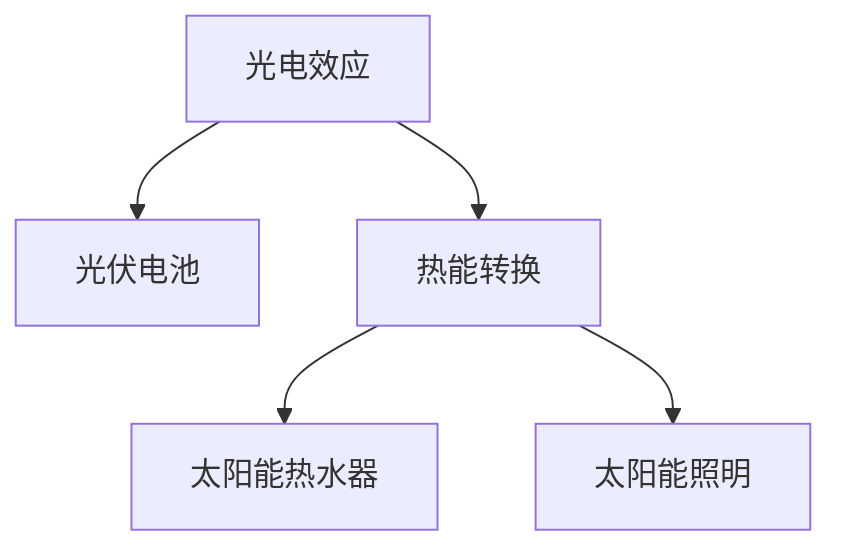

#### 1.1.2 太阳能技术的分类与发展历程

**核心概念与联系**

太阳能技术主要包括光伏技术、光热技术和光化学技术等。光伏技术通过光电效应将太阳能转换为电能；光热技术通过热能转换将太阳能转换为热能；光化学技术则通过化学反应将太阳能转换为化学能。

**发展历程**

- **光伏技术**：从早期的硅电池到现代的多结太阳能电池，光伏技术不断追求更高效率和更低成本。
- **光热技术**：从早期的太阳能热水器到现代的高效太阳能热发电系统，光热技术也在不断进步。
- **光化学技术**：光化学电池和光催化反应等技术的发展，为太阳能的利用提供了新的方向。

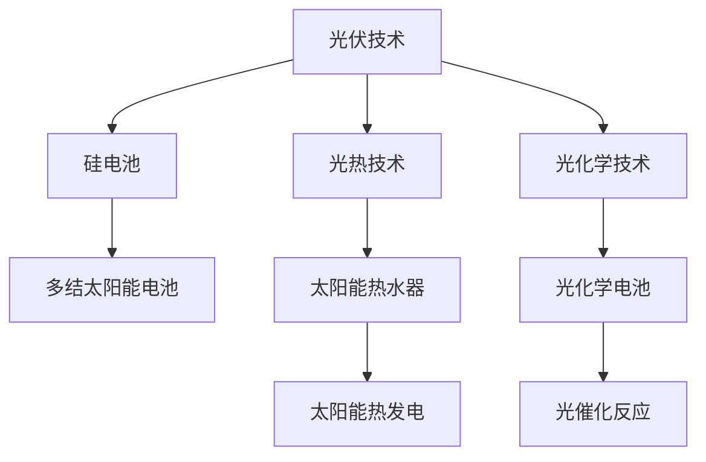

#### 1.1.3 太阳能技术的现状与趋势

**现状**

- **光伏技术**：光伏电池的效率和成本在过去几十年中不断提高，已经成为全球能源结构中的重要组成部分。
- **光热技术**：太阳能热水器在全球范围内得到了广泛应用，太阳能热发电也在一些国家和地区逐步推广。
- **光化学技术**：光化学电池和光催化反应的研究取得了显著进展，但商业化应用尚处于起步阶段。

**趋势**

- **技术创新**：高效、低成本的光伏电池、太阳能热发电技术和光化学技术将继续成为研究重点。
- **市场扩张**：随着全球对可再生能源的需求增加，太阳能技术的市场将不断扩大。
- **政策支持**：各国政府纷纷出台政策，支持太阳能技术的发展和应用，为创业提供了良好的环境。

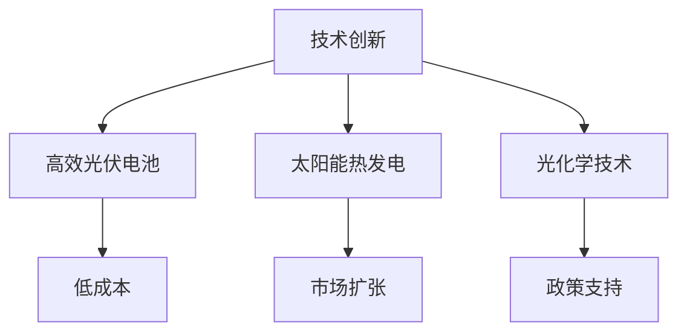

## 第二部分：太阳能技术创新与应用

### 第2章：太阳能技术的基础原理

#### 2.1.1 光伏效应与光伏电池

**核心概念与联系**

光伏效应是指当光线照射到光伏电池上时，会产生电子-空穴对，从而产生电流。光伏电池是利用这一原理将太阳能转换为电能的装置。

**光伏电池工作原理**

```plaintext
光线照射到光伏电池表面 -> 电子-空穴对产生 -> 电流产生
```

**光伏电池类型**

- **单晶硅光伏电池**：具有较高的转换效率，但成本较高。
- **多晶硅光伏电池**：效率略低于单晶硅电池，但成本较低。
- **非晶硅光伏电池**：效率较低，但具有柔性和低成本的优势。

**光伏电池效率**

光伏电池的效率是指其将太阳能转换为电能的效率。目前，单晶硅光伏电池的效率约为20%，多晶硅光伏电池的效率约为15%，非晶硅光伏电池的效率约为8%。

**光伏电池方程**

光伏电池的输出功率可以用以下公式表示：

$$
P = I \times V
$$

其中，P是输出功率，I是电流，V是电压。

#### 2.1.2 光热转换技术与热能利用

**核心概念与联系**

光热转换技术是指将太阳能转换为热能的技术。热能利用则是指将热能用于供暖、热水等应用。

**光热转换原理**

光热转换的原理基于光吸收和热传导。当光线照射到吸收材料上时，吸收材料会吸收光能，从而升温。

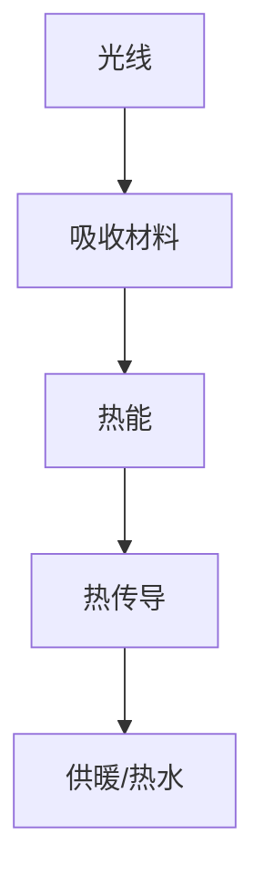

**光热转换设备**

- **太阳能集热器**：将太阳能转换为热能，用于加热水或供暖。
- **热管**：利用热传导原理，将热量迅速传递到需要的地方。
- **热交换器**：用于将热能从一种介质传递到另一种介质。

**光热转换效率**

光热转换效率是指光热转换设备将太阳能转换为热能的效率。目前，高效的光热转换设备的效率可以达到70%以上。

**光热转换方程**

光热转换设备的输出热功率可以用以下公式表示：

$$
P = \eta \times S \times G
$$

其中，P是输出热功率，η是光热转换效率，S是集热器面积，G是太阳能辐射强度。

#### 2.1.3 太阳能发电与储能技术

**核心概念与联系**

太阳能发电技术是指利用太阳能光伏电池将太阳能转换为电能的技术。储能技术则是指将电能储存起来，以供后续使用。

**太阳能发电原理**

太阳能发电的原理基于光伏效应。太阳能光伏电池将太阳能转换为电能，通过逆变器将直流电转换为交流电，从而为家庭、商业和工业提供电力。

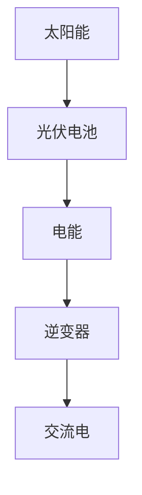

**储能技术**

储能技术包括电池储能、超导体储能和化学储能等。

- **电池储能**：利用电池将电能储存起来，以供后续使用。常见的电池储能技术包括锂离子电池、钠硫电池等。
- **超导体储能**：利用超导体在低温下的特性，将电能储存为磁场能量。
- **化学储能**：通过化学反应将电能储存为化学能，例如氢能。

**储能技术方程**

电池储能的输出功率和容量可以用以下公式表示：

$$
P = V \times I
$$

$$
C = V \times Q
$$

其中，P是输出功率，V是电池电压，I是电流，C是电池容量，Q是电量。

## 第三部分：太阳能技术创新与应用

### 第3章：太阳能光伏技术的创新

#### 3.1.1 高效太阳能光伏电池技术

**核心概念与联系**

高效太阳能光伏电池技术是指通过提高光伏电池的转换效率，来提高太阳能发电的效率。

**高效光伏电池类型**

- **多结太阳能电池**：通过将不同材料的太阳能电池层叠加，提高转换效率。常见的多结太阳能电池有硅/砷化镓（Si/GaAs）和多结钙钛矿（MCP）等。

**高效光伏电池工作原理**

多结太阳能电池的工作原理基于多能带跃迁。不同材料的能带结构不同，通过多结结构，可以同时捕获不同波长的光能，从而提高转换效率。

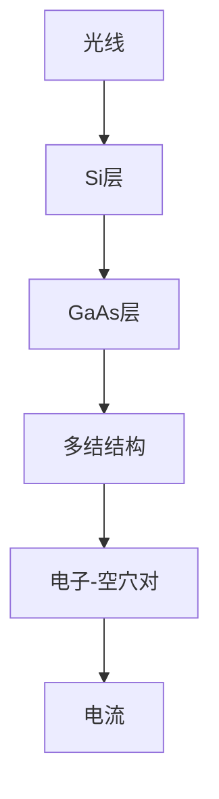

**高效光伏电池方程**

多结太阳能电池的输出功率可以用以下公式表示：

$$
P = \eta \times S \times G
$$

其中，P是输出功率，η是转换效率，S是集热器面积，G是太阳能辐射强度。

#### 3.1.2 层状结构太阳能电池

**核心概念与联系**

层状结构太阳能电池是一种新型的太阳能电池，通过将不同材料层叠在一起，形成具有高转换效率的太阳能电池。

**层状结构太阳能电池类型**

- **钙钛矿太阳能电池**：钙钛矿材料具有高吸收系数和良好的电荷传输性能，是一种具有高转换效率的层状结构太阳能电池。

**钙钛矿太阳能电池工作原理**

钙钛矿太阳能电池的工作原理基于光吸收和载流子传输。钙钛矿材料具有良好的光吸收性能，可以高效地吸收光能，并通过载流子传输将光能转换为电能。

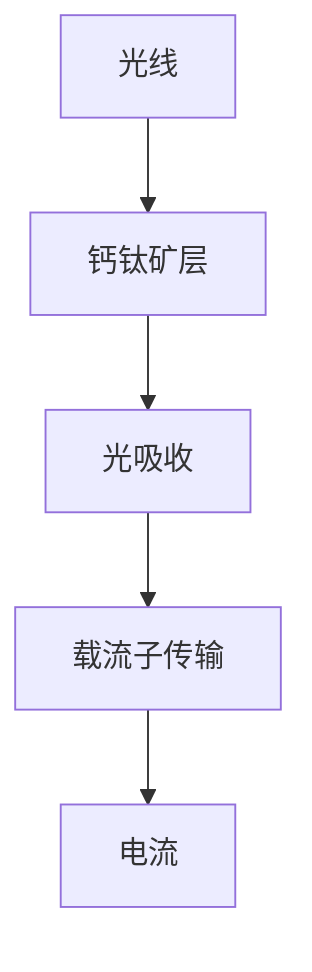

**钙钛矿太阳能电池方程**

钙钛矿太阳能电池的输出功率可以用以下公式表示：

$$
P = \eta \times S \times G
$$

其中，P是输出功率，η是转换效率，S是集热器面积，G是太阳能辐射强度。

#### 3.1.3 柔性太阳能电池及其应用

**核心概念与联系**

柔性太阳能电池是一种可以弯曲和变形的太阳能电池，具有广泛的应用前景。

**柔性太阳能电池类型**

- **有机太阳能电池**：有机材料具有较好的柔性和透明性，适用于制备柔性太阳能电池。
- **无机太阳能电池**：无机材料如硅、钙钛矿等，也可以制备柔性太阳能电池。

**柔性太阳能电池工作原理**

柔性太阳能电池的工作原理与常规太阳能电池类似，通过光吸收和载流子传输将光能转换为电能。

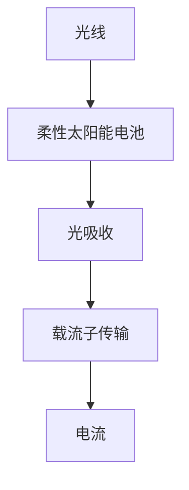

**柔性太阳能电池方程**

柔性太阳能电池的输出功率可以用以下公式表示：

$$
P = \eta \times S \times G
$$

其中，P是输出功率，η是转换效率，S是集热器面积，G是太阳能辐射强度。

### 第4章：太阳能热利用技术的创新

#### 4.1.1 高效太阳能热水器技术

**核心概念与联系**

高效太阳能热水器技术是指通过提高太阳能热水器的热转换效率，来提高热水供应的效率。

**高效太阳能热水器类型**

- **平板式太阳能热水器**：通过平板集热器将太阳能转换为热能，用于加热水。
- **真空管式太阳能热水器**：通过真空管集热器提高热能转换效率。

**高效太阳能热水器工作原理**

高效太阳能热水器的工作原理基于光热转换。太阳能热水器通过集热器吸收太阳能，将水加热至预定温度。

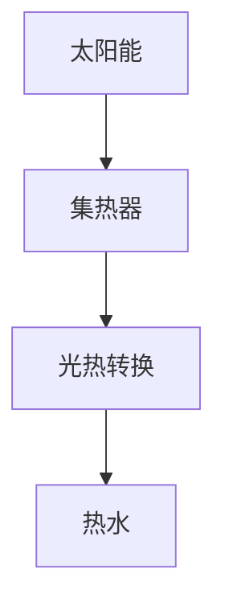

**高效太阳能热水器方程**

高效太阳能热水器的热转换效率可以用以下公式表示：

$$
\eta = \frac{Q_{\text{出水}} - Q_{\text{进水}}}{Q_{\text{入射}}}
$$

其中，η是热转换效率，$Q_{\text{出水}}$是出水的热量，$Q_{\text{进水}}$是进水的热量，$Q_{\text{入射}}$是入射的热量。

#### 4.1.2 太阳能热发电技术

**核心概念与联系**

太阳能热发电技术是指通过利用太阳能加热工质，使其膨胀做功，从而产生电力。

**太阳能热发电类型**

- **槽式太阳能热发电**：通过反射镜将太阳能聚焦到集热管上，加热工质产生蒸汽，驱动发电机发电。
- **塔式太阳能热发电**：通过聚光镜将太阳能聚焦到接收器上，加热工质产生蒸汽，驱动发电机发电。

**太阳能热发电工作原理**

太阳能热发电的工作原理基于热力学循环。太阳能加热工质，使其膨胀做功，驱动涡轮发电机发电。

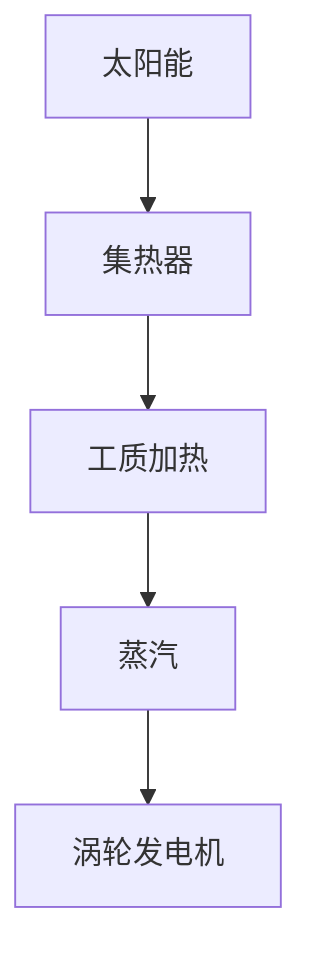

**太阳能热发电方程**

太阳能热发电的输出功率可以用以下公式表示：

$$
P = \eta_{\text{循环}} \times \eta_{\text{热转换}} \times Q
$$

其中，P是输出功率，η$_{\text{循环}}$是循环效率，η$_{\text{热转换}}$是热转换效率，Q是加热工质的热量。

#### 4.1.3 太阳能建筑一体化应用

**核心概念与联系**

太阳能建筑一体化应用是指将太阳能集热器或光伏电池集成到建筑物的结构中，实现建筑与太阳能系统的有机结合。

**太阳能建筑一体化类型**

- **光伏建筑一体化（BIPV）**：将光伏电池集成到建筑物的屋顶、幕墙等结构中，实现能源自给自足。
- **太阳能热建筑一体化（BIPV/T）**：将太阳能集热器集成到建筑物的屋顶、幕墙等结构中，实现热水供应。

**太阳能建筑一体化工作原理**

太阳能建筑一体化应用的工作原理基于光热转换和光电转换。太阳能集热器或光伏电池通过吸收太阳能，将能量转换为热能或电能。

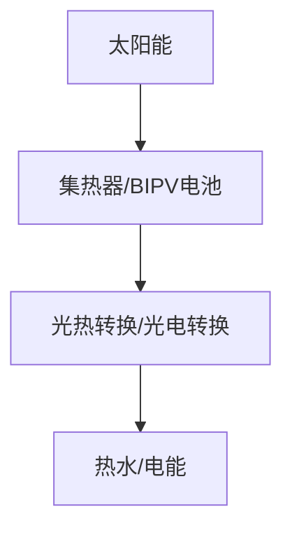

**太阳能建筑一体化方程**

太阳能建筑一体化的热转换效率可以用以下公式表示：

$$
\eta = \frac{Q_{\text{输出}}}{Q_{\text{入射}}}
$$

其中，η是热转换效率，$Q_{\text{输出}}$是输出的热量，$Q_{\text{入射}}$是入射的热量。

### 第5章：太阳能技术在交通运输中的应用

#### 5.1.1 太阳能汽车技术

**核心概念与联系**

太阳能汽车技术是指利用太阳能光伏电池为汽车提供电力，实现零排放的交通运输方式。

**太阳能汽车类型**

- **太阳能混合动力汽车**：在传统燃油发动机和电动机之间增加太阳能光伏系统，实现电力和燃料的双重驱动。
- **全太阳能汽车**：仅依靠太阳能光伏系统提供电力，实现零排放。

**太阳能汽车工作原理**

太阳能汽车的工作原理基于光伏效应。太阳能光伏电池将太阳能转换为电能，为电动机提供动力。

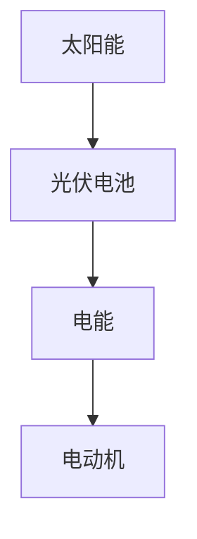

**太阳能汽车方程**

太阳能汽车的输出功率可以用以下公式表示：

$$
P = \eta \times S \times G
$$

其中，P是输出功率，η是转换效率，S是光伏电池面积，G是太阳能辐射强度。

#### 5.1.2 太阳能无人机技术

**核心概念与联系**

太阳能无人机技术是指利用太阳能光伏电池为无人机提供持续的动力，实现长航时、零排放的无人机飞行。

**太阳能无人机类型**

- **太阳能无人机**：仅依靠太阳能光伏系统提供电力，实现长时间飞行。
- **太阳能混合动力无人机**：在太阳能光伏系统和燃料电池之间进行能量切换，实现长航时、高效率飞行。

**太阳能无人机工作原理**

太阳能无人机的工作原理基于光伏效应。太阳能光伏电池将太阳能转换为电能，为电动机提供动力，驱动无人机飞行。


**太阳能无人机方程**

太阳能无人机的输出功率可以用以下公式表示：

$$
P = \eta \times S \times G
$$

其中，P是输出功率，η是转换效率，S是光伏电池面积，G是太阳能辐射强度。

#### 5.1.3 太阳能船舶技术

**核心概念与联系**

太阳能船舶技术是指利用太阳能光伏电池为船舶提供电力，实现零排放的航运方式。

**太阳能船舶类型**

- **太阳能混合动力船舶**：在传统燃油发动机和电动机之间增加太阳能光伏系统，实现电力和燃料的双重驱动。
- **全太阳能船舶**：仅依靠太阳能光伏系统提供电力，实现零排放。

**太阳能船舶工作原理**

太阳能船舶的工作原理基于光伏效应。太阳能光伏电池将太阳能转换为电能，为电动机提供动力，驱动船舶航行。


**太阳能船舶方程**

太阳能船舶的输出功率可以用以下公式表示：

$$
P = \eta \times S \times G
$$

其中，P是输出功率，η是转换效率，S是光伏电池面积，G是太阳能辐射强度。

### 第6章：太阳能技术在农业和工业中的应用

#### 6.1.1 太阳能温室技术

**核心概念与联系**

太阳能温室技术是指利用太阳能集热器为温室提供热能，实现高效农业生产。

**太阳能温室类型**

- **主动式太阳能温室**：通过太阳能集热器主动加热温室内部，实现冬季保温和夏季降温。
- **被动式太阳能温室**：通过温室结构和材料的设计，实现自然采光和通风，提高温室内的温度和湿度。

**太阳能温室工作原理**

太阳能温室的工作原理基于光热转换。太阳能集热器吸收太阳能，将能量转换为热能，加热温室内部。

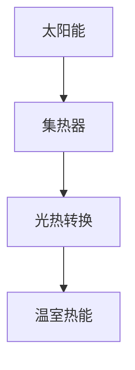

**太阳能温室方程**

太阳能温室的热能利用效率可以用以下公式表示：

$$
\eta = \frac{Q_{\text{输出}}}{Q_{\text{入射}}}
$$

其中，η是热能利用效率，$Q_{\text{输出}}$是输出的热能，$Q_{\text{入射}}$是入射的太阳能。

#### 6.1.2 太阳能工业热处理技术

**核心概念与联系**

太阳能工业热处理技术是指利用太阳能集热器为工业热处理设备提供热能，实现节能降耗。

**太阳能工业热处理类型**

- **太阳能热处理炉**：利用太阳能集热器加热炉内介质，实现工业产品的热处理。
- **太阳能热交换系统**：利用太阳能集热器产生的热能，通过热交换设备为工业热处理设备提供热能。

**太阳能工业热处理工作原理**

太阳能工业热处理的工作原理基于光热转换。太阳能集热器吸收太阳能，将能量转换为热能，通过热交换设备为工业热处理设备提供热能。

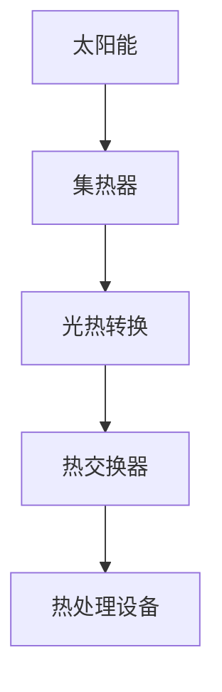

**太阳能工业热处理方程**

太阳能工业热处理的热能利用效率可以用以下公式表示：

$$
\eta = \frac{Q_{\text{输出}}}{Q_{\text{入射}}}
$$

其中，η是热能利用效率，$Q_{\text{输出}}$是输出的热能，$Q_{\text{入射}}$是入射的太阳能。

#### 6.1.3 太阳能农光互补技术

**核心概念与联系**

太阳能农光互补技术是指利用太阳能光伏系统和农作物种植的有机结合，实现农业和光伏产业的共同发展。

**太阳能农光互补类型**

- **光伏大棚**：在农作物种植大棚上方安装太阳能光伏电池，实现光伏发电和农作物生长的协同。
- **光伏养殖**：在养殖场上方安装太阳能光伏电池，为养殖场提供电力，同时利用太阳能进行养殖业的发展。

**太阳能农光互补工作原理**

太阳能农光互补的工作原理基于光伏效应和农作物生长。太阳能光伏电池将太阳能转换为电能，为农作物生长提供光能，同时农作物为大棚提供遮阳和空气净化作用。

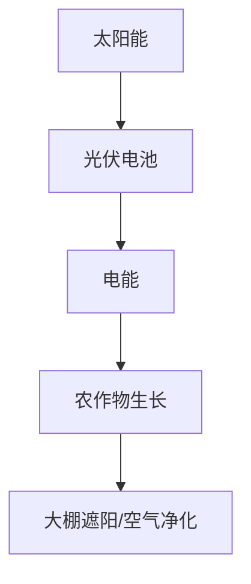

**太阳能农光互补方程**

太阳能农光互补系统的总能量产出可以用以下公式表示：

$$
E_{\text{总}} = E_{\text{光伏}} + E_{\text{农作物}}
$$

其中，$E_{\text{总}}$是总能量产出，$E_{\text{光伏}}$是光伏系统的能量产出，$E_{\text{农作物}}$是农作物生长的能量产出。

## 第三部分：太阳能创业与市场分析

### 第7章：太阳能创业机会与挑战

#### 7.1.1 太阳能产业的市场现状与未来趋势

**核心概念与联系**

太阳能产业是一个快速发展的行业，随着全球对可再生能源的需求不断增加，太阳能市场也在不断扩大。

**市场现状**

- **光伏市场**：全球光伏市场在过去几年中持续增长，光伏电池的效率和成本也在不断提高。
- **光热市场**：太阳能热水器市场在全球范围内得到了广泛应用，太阳能热发电市场也在逐步扩大。
- **太阳能应用**：太阳能技术在交通运输、农业、工业等领域的应用也在不断拓展。

**未来趋势**

- **技术创新**：高效、低成本的光伏电池、太阳能热发电技术和光化学技术将继续成为研究重点。
- **市场扩张**：随着全球对可再生能源的需求增加，太阳能技术的市场将不断扩大。
- **政策支持**：各国政府纷纷出台政策，支持太阳能技术的发展和应用，为创业提供了良好的环境。


#### 7.1.2 太阳能创业的机会与挑战

**核心概念与联系**

太阳能创业的机会在于全球对可再生能源的需求不断增长，而太阳能技术具有清洁、可再生、环保的特点，符合全球可持续发展战略。然而，太阳能创业也面临一系列挑战。

**机会**

- **市场潜力**：太阳能市场潜力巨大，特别是在新兴市场国家。
- **技术创新**：高效、低成本的光伏电池和太阳能热发电技术的不断突破，为创业提供了机会。
- **政策支持**：各国政府出台的激励政策和补贴措施，为太阳能创业提供了良好的环境。

**挑战**

- **技术难题**：高效、低成本的光伏电池和太阳能热发电技术的研发仍面临挑战。
- **市场竞争**：太阳能市场竞争激烈，创业企业需要不断创新，以在市场中脱颖而出。
- **资金压力**：太阳能创业项目通常需要较大的资金投入，资金压力是创业过程中的一大挑战。

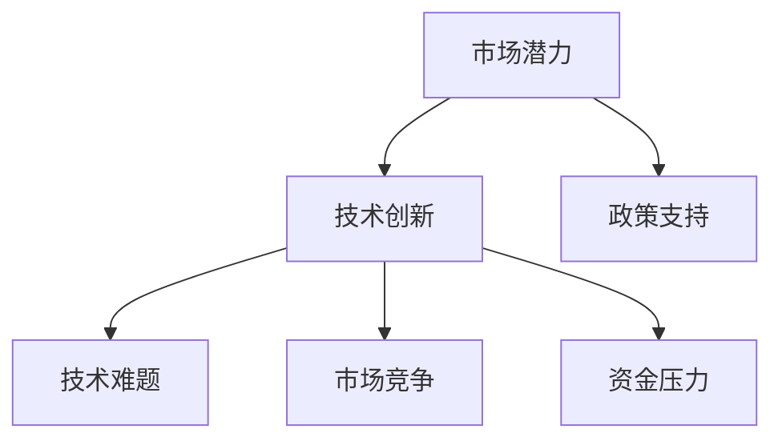

#### 7.1.3 创业者如何抓住太阳能市场的机会

**核心概念与联系**

创业者要抓住太阳能市场的机会，需要从技术创新、市场定位、政策利用等方面进行全面考虑。

**策略**

- **技术创新**：专注于高效、低成本的光伏电池和太阳能热发电技术的研发，提高产品的竞争力。
- **市场定位**：明确目标市场，针对不同市场需求开发相应的产品和服务。
- **政策利用**：充分利用各国政府的激励政策和补贴措施，降低创业成本，提高市场占有率。

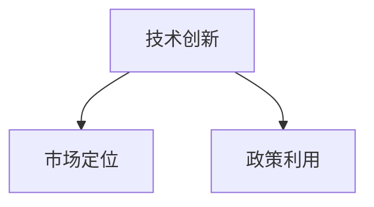

### 第8章：太阳能创业项目的案例分析与实战指导

#### 8.1.1 成功的太阳能创业案例

**核心概念与联系**

成功的太阳能创业案例为创业者提供了宝贵的经验和启示。

**案例1：光伏电站项目**

**项目简介**：一家初创公司成功建设了一座大型光伏电站，为电网提供清洁电力。

**成功经验**：

- **技术创新**：公司研发出高效、低成本的太阳能光伏电池，提高了电站的发电效率。
- **市场定位**：公司针对电网企业的需求，提供一站式光伏电站建设服务。
- **政策利用**：公司充分利用当地政府的补贴政策，降低了投资成本。

**案例2：太阳能热水器项目**

**项目简介**：一家公司成功推出高效太阳能热水器，受到了市场的欢迎。

**成功经验**：

- **技术创新**：公司研发出高效太阳能集热器，提高了热水器的热转换效率。
- **市场定位**：公司针对家庭和商业用户的需求，推出不同型号的太阳能热水器。
- **品牌建设**：公司注重品牌建设，提高了市场知名度。

#### 8.1.2 创业项目策划与实施

**核心概念与联系**

创业项目策划与实施是成功创业的关键环节。

**策划**

- **市场调研**：了解市场需求、竞争对手、政策环境等。
- **技术方案**：确定项目的技术路线，选择合适的光伏电池、集热器等设备。
- **财务规划**：制定项目的投资预算、盈利模式等。

**实施**

- **项目启动**：组建团队，明确职责，启动项目。
- **技术研发**：进行光伏电池、集热器等设备的技术研发。
- **市场推广**：制定市场推广策略，开展市场活动。
- **运营管理**：确保项目的正常运行，提高效率，降低成本。

```mermaid
graph TD
A[市场调研] --> B[技术方案]
A --> C[财务规划]
B --> D[项目启动]
B --> E[技术研发]
B --> F[市场推广]
B --> G[运营管理]
```

#### 8.1.3 创业项目的融资策略与风险管理

**核心概念与联系**

创业项目的融资策略与风险管理是确保项目成功的重要环节。

**融资策略**

- **股权融资**：通过吸引投资者，获得资金支持。
- **债务融资**：通过贷款、债券等债务工具筹集资金。
- **政府补贴**：利用政府提供的补贴和奖励，降低融资成本。

**风险管理**

- **技术风险**：通过技术创新，提高产品的竞争力，降低技术风险。
- **市场风险**：通过市场调研，了解市场需求，降低市场风险。
- **资金风险**：通过合理的财务规划，确保项目的资金需求。

```mermaid
graph TD
A[股权融资] --> B[债务融资]
A --> C[政府补贴]
B --> D[技术风险]
B --> E[市场风险]
B --> F[资金风险]
```

### 第9章：市场推广与品牌建设

#### 9.1.1 太阳能产品的市场推广策略

**核心概念与联系**

市场推广策略是太阳能产品成功推向市场的重要手段。

**策略**

- **广告宣传**：通过电视、报纸、互联网等渠道进行广告宣传，提高产品知名度。
- **参加展会**：参加太阳能行业的展会，展示公司产品和技术，拓展客户资源。
- **网络营销**：通过社交媒体、搜索引擎等网络渠道，进行产品推广和品牌宣传。
- **渠道建设**：建立完善的销售渠道，与经销商、代理商等合作，扩大市场覆盖范围。

```mermaid
graph TD
A[广告宣传] --> B[参加展会]
A --> C[网络营销]
A --> D[渠道建设]
```

#### 9.1.2 品牌建设与市场定位

**核心概念与联系**

品牌建设和市场定位是太阳能企业在市场中立足的重要策略。

**品牌建设**

- **品牌定位**：明确品牌的核心价值和目标客户群体。
- **品牌形象**：设计统一的品牌形象，包括标识、宣传语等。
- **品牌传播**：通过公关活动、品牌宣传等方式，提升品牌知名度。

**市场定位**

- **目标市场**：明确产品的目标市场和客户群体。
- **竞争优势**：分析竞争对手的优势和劣势，找到自身的竞争优势。
- **差异化策略**：通过差异化策略，提高产品在市场中的竞争力。

```mermaid
graph TD
A[品牌定位] --> B[品牌形象]
A --> C[品牌传播]
B --> D[目标市场]
B --> E[竞争优势]
B --> F[差异化策略]
```

#### 9.1.3 市场营销与销售渠道建设

**核心概念与联系**

市场营销与销售渠道建设是推动太阳能产品销售的重要环节。

**市场营销**

- **市场调研**：了解市场需求、竞争对手、客户需求等，为市场营销策略提供依据。
- **产品定位**：根据市场调研结果，确定产品的定位和特点。
- **推广策略**：制定合适的推广策略，包括广告、促销、公关等。

**销售渠道建设**

- **直销渠道**：建立自己的销售团队，直接面对客户，提高销售效率。
- **分销渠道**：与经销商、代理商等合作，扩大销售网络。
- **线上销售**：建立电子商务平台，通过网络销售渠道，拓展市场。

```mermaid
graph TD
A[市场调研] --> B[产品定位]
A --> C[推广策略]
B --> D[直销渠道]
B --> E[分销渠道]
B --> F[线上销售]
```

## 第四部分：技术支持与政策环境

### 第10章：太阳能技术创新的支持体系

#### 10.1.1 研发支持与技术创新政策

**核心概念与联系**

研发支持与技术创新政策是推动太阳能技术创新的重要保障。

**政策**

- **政府资助**：政府通过科研项目资助、创新基金等方式，支持太阳能技术的研发。
- **税收优惠**：政府为太阳能企业提供税收优惠，降低企业研发成本。
- **知识产权保护**：政府加强对太阳能技术知识产权的保护，鼓励技术创新。

**支持体系**

- **科研机构**：国家重点实验室、科研院所等，提供技术研发平台和人才支持。
- **企业研发**：企业通过设立研发中心、技术实验室等方式，进行技术创新。
- **产学研合作**：科研机构、企业与高校合作，共同推动技术创新。

```mermaid
graph TD
A[政府资助] --> B[税收优惠]
A --> C[知识产权保护]
B --> D[科研机构]
B --> E[企业研发]
B --> F[产学研合作]
```

#### 10.1.2 太阳能产业的国际合作

**核心概念与联系**

太阳能产业的国际合作是推动全球太阳能技术发展的重要途径。

**合作形式**

- **技术交流**：通过国际合作项目，开展太阳能技术的研发和推广。
- **设备进口**：引进国外先进的太阳能设备和技术，提高国内技术水平。
- **市场开拓**：通过国际合作，开拓国际市场，扩大市场份额。

**国际合作案例**

- **“一带一路”倡议**：中国与沿线国家在太阳能领域的合作，推动太阳能技术的发展。
- **跨国公司合作**：国内外太阳能企业之间的合作，共同推动技术创新和市场拓展。

```mermaid
graph TD
A[技术交流] --> B[设备进口]
A --> C[市场开拓]
B --> D[“一带一路”倡议]
B --> E[跨国公司合作]
```

#### 10.1.3 技术创新平台与科研机构

**核心概念与联系**

技术创新平台与科研机构是推动太阳能技术发展的重要力量。

**平台**

- **国家重点实验室**：提供技术研发、试验验证等平台，支持太阳能技术的研发。
- **企业研发中心**：企业设立的研发机构，专注于技术创新和产品研发。
- **高校科研院所**：提供人才培养和科研支持，为太阳能技术发展提供智力支持。

**科研机构**

- **中国可再生能源学会**：推动可再生能源技术的发展，为太阳能企业提供技术支持和咨询服务。
- **国际太阳能学会**：推动全球太阳能技术的发展，促进国际合作。

```mermaid
graph TD
A[国家重点实验室] --> B[企业研发中心]
A --> C[高校科研院所]
B --> D[中国可再生能源学会]
B --> E[国际太阳能学会]
```

### 第11章：太阳能政策环境与法规体系

#### 11.1.1 各国太阳能政策概况

**核心概念与联系**

各国太阳能政策的差异影响着太阳能技术的发展和应用。

**政策概况**

- **美国**：美国通过《太阳能投资税收抵免》（ITC）政策，鼓励太阳能产业的发展。
- **欧洲**：欧洲各国普遍实行太阳能发电补贴政策，鼓励太阳能发电的应用。
- **中国**：中国通过《可再生能源法》和《光伏产业振兴规划》等政策，推动太阳能技术的发展。

**政策特点**

- **补贴政策**：通过补贴政策，降低太阳能项目的投资成本，促进市场发展。
- **激励政策**：通过激励政策，鼓励企业进行技术创新和市场拓展。
- **监管政策**：通过监管政策，确保太阳能技术的安全和可靠性。

```mermaid
graph TD
A[美国] --> B[ITC政策]
A --> C[激励政策]
A --> D[监管政策]
B --> E[欧洲]
B --> F[中国]
```

#### 11.1.2 太阳能产业的法规体系

**核心概念与联系**

太阳能产业的法规体系是规范太阳能产业健康发展的重要保障。

**法规体系**

- **技术标准**：制定太阳能产品的技术标准，确保产品的质量和安全性。
- **环保法规**：制定环保法规，规范太阳能项目的环境影响评估和环境保护措施。
- **知识产权保护**：制定知识产权保护法规，保护技术创新和知识产权。

**法规作用**

- **规范市场**：通过法规体系，规范太阳能市场的健康发展。
- **保障权益**：通过法规体系，保障企业和消费者的合法权益。
- **促进创新**：通过法规体系，鼓励技术创新和产业发展。

```mermaid
graph TD
A[技术标准] --> B[环保法规]
A --> C[知识产权保护]
B --> D[规范市场]
B --> E[保障权益]
B --> F[促进创新]
```

#### 11.1.3 政策变化对太阳能创业的影响

**核心概念与联系**

政策变化对太阳能创业的影响重大，创业者需要密切关注政策动态，及时调整战略。

**影响**

- **市场机会**：政策的优惠和支持，为太阳能创业提供了良好的市场环境。
- **竞争格局**：政策的调整会影响市场竞争格局，创业者需要及时应对。
- **投资风险**：政策的变动可能带来投资风险，创业者需要谨慎评估。

```mermaid
graph TD
A[市场机会] --> B[竞争格局]
A --> C[投资风险]
```

## 附录

### 附录 A：太阳能技术相关的资源与工具

#### A.1.1 主流太阳能技术数据库

**核心概念与联系**

太阳能技术数据库是收集和整理太阳能技术相关数据的平台，为研究者、工程师和创业者提供重要的参考资料。

**数据库**

- **国家太阳能光伏数据库**：提供国内外光伏技术的最新进展、专利信息等。
- **国际太阳能数据库**：提供全球太阳能技术的研究成果、市场动态等。

**工具**

- **太阳能光伏模拟软件**：用于模拟光伏电池的性能和优化设计。
- **太阳能热能转换软件**：用于模拟太阳能热能转换系统的性能和优化设计。

```mermaid
graph TD
A[国家太阳能光伏数据库] --> B[国际太阳能数据库]
A --> C[太阳能光伏模拟软件]
A --> D[太阳能热能转换软件]
```

#### A.1.2 开源太阳能技术平台

**核心概念与联系**

开源太阳能技术平台是太阳能技术爱好者、研究人员和开发者共享和协作的平台。

**平台**

- **OpenPV**：开源的光伏电池模拟软件，用于光伏电池性能的评估和优化。
- **OpenSMM**：开源的太阳能热能转换软件，用于太阳能热能转换系统的性能评估和优化。

**工具**

- **Python编程语言**：用于开发太阳能技术相关的算法和模型。
- **Matlab软件**：用于数据分析、建模和仿真。

```mermaid
graph TD
A[OpenPV] --> B[OpenSMM]
A --> C[Python]
A --> D[Matlab]
```

#### A.1.3 太阳能技术相关的学术期刊与会议

**核心概念与联系**

太阳能技术相关的学术期刊与会议是太阳能技术研究成果的发布和交流平台。

**期刊**

- **《太阳能学报》**：中国太阳能技术领域的权威期刊，发布太阳能技术的研究成果。
- **《International Journal of Solar Energy》**：国际太阳能技术领域的权威期刊，发布全球太阳能技术的研究成果。

**会议**

- **国际太阳能会议（ISES）**：全球太阳能技术的重要会议，每年召开一次。
- **中国太阳能学会年会**：中国太阳能技术的重要会议，每年召开一次。

```mermaid
graph TD
A[《太阳能学报》] --> B[《International Journal of Solar Energy》]
A --> C[国际太阳能会议（ISES）]
A --> D[中国太阳能学会年会]
```

### 附录 B：太阳能技术相关术语解释

#### B.1.1 太阳能光伏电池

**核心概念与联系**

太阳能光伏电池是一种将太阳能直接转换为电能的装置，是太阳能光伏发电系统的核心部件。

**术语解释**

- **光伏效应**：太阳能光伏电池的工作原理，即当光线照射到光伏电池上时，会引起电子的跃迁，产生电流。
- **光伏电池效率**：光伏电池将太阳能转换为电能的效率，通常用百分比表示。
- **光伏电池类型**：常见的光伏电池类型有单晶硅光伏电池、多晶硅光伏电池、非晶硅光伏电池等。

**应用场景**

- **家庭光伏发电**：利用光伏电池将太阳能转换为电能，为家庭提供电力。
- **商业光伏发电**：在商业建筑屋顶安装光伏电池，为商业活动提供电力。
- **工业光伏发电**：在工业园区安装光伏电池，为工业生产提供电力。

```mermaid
graph TD
A[光伏效应] --> B[光伏电池效率]
A --> C[光伏电池类型]
B --> D[家庭光伏发电]
B --> E[商业光伏发电]
B --> F[工业光伏发电]
```

#### B.1.2 太阳能热发电

**核心概念与联系**

太阳能热发电是一种利用太阳能集热器将太阳能转换为热能，再通过热发电设备产生电力的技术。

**术语解释**

- **太阳能集热器**：用于吸收太阳能并将其转换为热能的装置。
- **热发电设备**：将热能转换为电能的设备，常见的有热交换器、蒸汽轮机等。
- **太阳能热发电效率**：太阳能热发电系统将太阳能转换为电能的效率，通常用百分比表示。

**应用场景**

- **太阳能热发电站**：在太阳能资源丰富的地区建设太阳能热发电站，为电网提供清洁电力。
- **工业热能需求**：利用太阳能热发电系统为工业生产提供热能。
- **家庭热水供应**：利用太阳能集热器加热水，为家庭提供热水。

```mermaid
graph TD
A[太阳能集热器] --> B[热发电设备]
A --> C[太阳能热发电效率]
B --> D[太阳能热发电站]
B --> E[工业热能需求]
B --> F[家庭热水供应]
```

#### B.1.3 太阳能建筑一体化应用

**核心概念与联系**

太阳能建筑一体化应用是将太阳能技术集成到建筑物的设计、建造和使用过程中，实现能源自给自足和环保。

**术语解释**

- **光伏建筑一体化（BIPV）**：将光伏电池集成到建筑物的屋顶、幕墙等结构中，实现光伏发电。
- **太阳能建筑一体化（BIPV/T）**：将太阳能集热器集成到建筑物的屋顶、幕墙等结构中，实现热水供应。
- **太阳能建筑综合效能**：建筑物通过太阳能技术实现能源自给自足的能力，包括光伏发电、热水供应等。

**应用场景**

- **住宅建筑**：在住宅建筑中集成光伏电池，为家庭提供电力和热水。
- **商业建筑**：在商业建筑中集成光伏电池和太阳能集热器，提高建筑能源自给率。
- **公共建筑**：在公共建筑中集成太阳能技术，降低建筑运营成本，实现可持续发展。

```mermaid
graph TD
A[BIPV] --> B[BIPV/T]
A --> C[太阳能建筑综合效能]
B --> D[住宅建筑]
B --> E[商业建筑]
B --> F[公共建筑]
```

### 附录 C：太阳能技术项目案例分析

#### C.1.1 某太阳能光伏电站项目分析

**核心概念与联系**

某太阳能光伏电站项目是太阳能光伏发电系统的实际应用案例，通过分析项目的设计、施工、运营等环节，可以了解太阳能光伏电站的运行情况。

**项目概况**

- **项目名称**：某地太阳能光伏电站项目
- **项目规模**：装机容量100兆瓦
- **项目类型**：地面光伏电站

**项目分析**

- **设计阶段**：项目设计包括光伏电池选型、集电线路设计、逆变器选型等。
- **施工阶段**：项目施工包括光伏电池板的安装、集电线路的架设、逆变器安装等。
- **运营阶段**：项目运营包括光伏电站的运行维护、数据监测、故障排除等。

**项目小结**

- **项目成功**：项目顺利实现并网发电，达到设计预期。
- **经验教训**：在项目实施过程中，要充分考虑当地太阳能资源、地形地貌等因素，确保项目高效运行。

```mermaid
graph TD
A[设计阶段] --> B[施工阶段]
A --> C[运营阶段]
B --> D[项目成功]
C --> E[经验教训]
```

#### C.1.2 某太阳能热利用项目分析

**核心概念与联系**

某太阳能热利用项目是太阳能热能在实际应用中的案例，通过分析项目的设计、施工、运行等环节，可以了解太阳能热利用的效益。

**项目概况**

- **项目名称**：某地太阳能热水器项目
- **项目规模**：安装面积1000平方米
- **项目类型**：居民住宅太阳能热水器系统

**项目分析**

- **设计阶段**：项目设计包括太阳能集热器选型、热水系统设计、管道铺设等。
- **施工阶段**：项目施工包括集热器的安装、管道的铺设、热水器的安装等。
- **运行阶段**：项目运行包括热水系统的运行维护、温度监测、故障排除等。

**项目小结**

- **项目效益**：项目有效提高了居民家庭的热水供应效率，降低了能源消耗。
- **经验教训**：在项目实施过程中，要充分考虑用户需求、热水系统性能等因素，确保项目达到预期效益。

```mermaid
graph TD
A[设计阶段] --> B[施工阶段]
A --> C[运行阶段]
B --> D[项目效益]
C --> E[经验教训]
```

#### C.1.3 某太阳能创业项目分析

**核心概念与联系**

某太阳能创业项目是太阳能技术在创业领域的实际应用案例，通过分析项目的商业模型、运营策略、市场推广等环节，可以了解太阳能创业的成功要素。

**项目概况**

- **项目名称**：某太阳能光伏发电创业项目
- **项目类型**：光伏电站建设和运营

**项目分析**

- **商业模型**：项目通过建设光伏电站，为电网提供清洁电力，实现收益。
- **运营策略**：项目采用智能化运维系统，提高光伏电站的运行效率。
- **市场推广**：项目通过参加展会、网络营销等方式，提高品牌知名度。

**项目小结**

- **项目成果**：项目成功实现并网发电，市场占有率稳步提升。
- **经验教训**：在项目运营过程中，要注重技术创新、市场推广和团队建设，确保项目可持续发展。

```mermaid
graph TD
A[商业模型] --> B[运营策略]
A --> C[市场推广]
B --> D[项目成果]
C --> E[经验教训]
```

## 结束语

### 总结

本文从太阳能技术概述、技术创新与应用、创业机会与挑战、市场推广与品牌建设、技术支持与政策环境等多个方面，全面探讨了太阳能技术在可持续能源发展中的作用。通过分析太阳能技术的原理、分类、创新与应用，展示了太阳能技术在各个领域的广泛应用。同时，本文还结合实际案例，为创业者提供了实战指导。

### 展望

随着全球对可再生能源需求的不断增长，太阳能技术将迎来更多的发展机遇。未来，高效、低成本的光伏电池、太阳能热发电技术和光化学技术将成为研究重点。创业者可以关注以下领域：

1. **高效光伏电池研发**：专注于提高光伏电池的转换效率和降低成本。
2. **太阳能热发电技术**：探索高效、稳定、经济的太阳能热发电技术。
3. **太阳能建筑一体化**：将太阳能技术与建筑结构有机结合，实现能源自给自足。
4. **太阳能交通应用**：开发太阳能汽车、无人机等交通设备，推动零排放交通的发展。
5. **太阳能农业应用**：利用太阳能技术提高农业生产效率，实现农光互补。

### 拓展阅读

- **《太阳能光伏技术原理与应用》**：详细介绍了太阳能光伏技术的原理、分类、应用及发展趋势。
- **《太阳能热发电技术》**：全面探讨了太阳能热发电的原理、系统构成、运行机制及未来发展方向。
- **《太阳能建筑一体化设计与应用》**：阐述了太阳能建筑一体化技术的原理、设计要点及实际应用案例。
- **《太阳能技术在交通领域的应用》**：介绍了太阳能技术在交通领域的应用现状、发展前景及关键技术。

### 注意事项

- **技术创新**：在创业过程中，要注重技术创新，提高产品的竞争力。
- **市场定位**：明确目标市场和客户群体，制定合适的市场策略。
- **政策利用**：充分利用政府激励政策和补贴措施，降低创业成本。
- **风险管理**：在创业过程中，要充分评估风险，制定风险管理策略。
- **团队建设**：组建专业团队，确保项目的顺利实施。

### 致谢

感谢AI天才研究院和《禅与计算机程序设计艺术》为本文提供了宝贵的建议和指导，使得本文能够更加全面、深入地探讨太阳能技术的创新与发展。同时，感谢所有参与本文写作和校对的工作人员，为本文的顺利完成付出了辛勤的努力。作者：AI天才研究院/AI Genius Institute & 禅与计算机程序设计艺术/Zen And The Art of Computer Programming。

