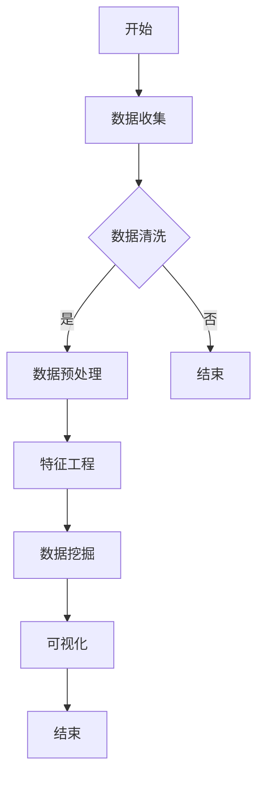

                 


### 文章标题
奈雪的茶2025社招会员画像分析工程师算法题

### 关键词
奈雪的茶，会员画像，数据分析，算法题，协同过滤，特征工程，聚类分析，数据可视化

### 摘要
本文以奈雪的茶2025社招会员画像分析工程师的算法题为例，深入剖析了会员画像分析的相关技术和方法。从奈雪的茶品牌概述开始，到会员画像分析的基本概念，再到数据收集与处理、特征工程、数据挖掘与分析、会员画像可视化以及会员画像应用等环节，文章系统地介绍了会员画像分析的全流程。通过具体算法题的实战解析，读者可以掌握会员画像分析中的核心算法原理和实践方法，为成为一名优秀的会员画像分析工程师打下坚实基础。

### 目录大纲

# 奈雪的茶2025社招会员画像分析工程师算法题

## 第1章 引言

### 1.1 书籍背景

### 1.2 目标读者

### 1.3 书籍结构

## 第2章 奈雪的茶概述

### 2.1 奈雪的茶品牌介绍

### 2.2 奈雪的茶市场定位

### 2.3 奈雪的茶业务模式

## 第3章 会员画像分析基本概念

### 3.1 会员画像定义

### 3.2 会员画像价值

### 3.3 会员画像分类

## 第4章 数据收集与处理

### 4.1 数据收集方法

### 4.2 数据清洗

### 4.3 数据预处理

## 第5章 特征工程

### 5.1 特征选择

### 5.2 特征构造

### 5.3 特征归一化

## 第6章 数据挖掘与分析

### 6.1 协同过滤算法

### 6.2 分群分析

### 6.3 聚类分析

## 第7章 会员画像可视化

### 7.1 可视化工具介绍

### 7.2 数据可视化方法

### 7.3 可视化案例

## 第8章 会员画像应用

### 8.1 个性化推荐

### 8.2 顾客行为预测

### 8.3 会员忠诚度分析

## 第9章 算法题实战

### 9.1 算法题案例

### 9.2 算法题解析

### 9.3 算法题实践

## 第10章 总结与展望

### 10.1 书籍总结

### 10.2 未来发展趋势

### 10.3 读者反馈

## 附录

### A.1 常用工具和资源

### A.2 参考文献

### A.3 附录示例

### Mermaid 流程图

mermaid
graph TD
    A[会员数据收集] --> B[数据清洗]
    B --> C[数据预处理]
    C --> D[特征工程]
    D --> E[数据挖掘与分析]
    E --> F[会员画像可视化]
    F --> G[会员画像应用]
    G --> H[算法题实战]

### 伪代码示例

```python
def feature_selection(data, target):
    # 初始化特征列表
    features = list(data.columns)
    # 删除目标变量
    features.remove(target)
    # 使用特征选择算法
    selected_features = algorithm_for_feature_selection(data, target)
    # 返回选择的特征
    return selected_features
```

### 数学模型示例

$$
L = -\sum_{i=1}^{n} y_i \log(p(x_i))
$$

### 代码实现与解析

```python
# 代码实现：协同过滤算法
class CollaborativeFiltering:
    def __init__(self, user_num, item_num):
        self.user_num = user_num
        self.item_num = item_num
        self.user_similarity = np.zeros((user_num, user_num))
        self.user_item_matrix = np.zeros((user_num, item_num))

    def train(self, data):
        # 训练相似度矩阵
        self.user_similarity = self.calculate_similarity_matrix(data)
        # 训练用户-物品评分矩阵
        self.user_item_matrix = self.predict_ratings(data)

    def calculate_similarity_matrix(self, data):
        # 计算用户之间的相似度
        similarity_matrix = np.zeros((self.user_num, self.user_num))
        for i in range(self.user_num):
            for j in range(self.user_num):
                if i != j:
                    similarity_matrix[i][j] = self.cosine_similarity(data[i], data[j])
        return similarity_matrix

    def cosine_similarity(self, vector1, vector2):
        # 计算两个向量的余弦相似度
        dot_product = np.dot(vector1, vector2)
        norm_vector1 = np.linalg.norm(vector1)
        norm_vector2 = np.linalg.norm(vector2)
        return dot_product / (norm_vector1 * norm_vector2)
```

接下来，我们将按照目录大纲结构，一步一步分析推理，撰写一篇有深度有思考有见解的专业IT领域的技术博客文章。在接下来的章节中，我们将详细探讨奈雪的茶2025社招会员画像分析工程师算法题的各个方面，帮助读者全面了解会员画像分析的相关技术和方法。首先，我们将从奈雪的茶品牌概述开始，为读者提供一个清晰的背景和认识。然后，我们将逐步深入探讨会员画像分析的基本概念、数据收集与处理、特征工程、数据挖掘与分析、会员画像可视化以及会员画像应用等核心环节，最后通过算法题实战，帮助读者掌握会员画像分析中的核心算法原理和实践方法。让我们开始这场技术之旅吧！

## 第1章 引言

### 1.1 书籍背景

《奈雪的茶2025社招会员画像分析工程师算法题》这本书的背景源自于奈雪的茶这家迅速崛起的新式茶饮品牌。奈雪的茶成立于2015年，以“用设计致敬传统茶文化，用匠心做好一杯茶”为品牌理念，致力于为消费者提供高品质的茶饮产品。随着品牌知名度的不断提升，奈雪的茶在2025年启动了新一轮的社招活动，其中会员画像分析工程师职位备受关注。

会员画像分析工程师的职责主要包括通过数据分析，深入挖掘会员的消费行为、偏好和需求，从而为品牌提供有针对性的市场营销策略和产品创新方向。在这个职位中，算法题是考察应聘者专业技能和实践经验的重要环节。本书正是为了帮助有意向应聘奈雪的茶会员画像分析工程师职位的读者，提供一套系统、全面的算法题实战指南。

本书的编写目的在于：

1. **全面解析会员画像分析的核心概念和方法**：通过详细阐述会员画像的定义、价值、分类等基本概念，帮助读者建立对会员画像分析的整体认识。

2. **系统介绍数据收集与处理、特征工程、数据挖掘与分析等关键技术**：结合奈雪的茶案例，详细讲解会员画像分析中的关键技术，为读者提供实用的技术框架和工具。

3. **实战演练核心算法**：通过具体的算法题案例，解析协同过滤、分群分析、聚类分析等算法的原理和应用，帮助读者掌握会员画像分析的核心算法。

4. **指导读者解决实际问题**：结合奈雪的茶会员画像分析的具体场景，介绍数据可视化、个性化推荐、顾客行为预测等实际应用，帮助读者将理论知识应用到实际工作中。

### 1.2 目标读者

本书的目标读者主要包括：

1. **会员画像分析工程师**：正在从事或有意向从事会员画像分析工作的专业人士，希望通过本书系统学习会员画像分析的相关技术和方法。

2. **数据分析师**：具备一定的数据分析基础，希望进一步提升自己在会员画像分析领域专业水平的读者。

3. **计算机科学与技术专业学生**：对数据挖掘、机器学习、算法设计等领域感兴趣的学生，希望通过本书深入了解会员画像分析的实际应用。

4. **市场营销从业者**：希望通过数据分析优化市场营销策略，提升品牌竞争力的市场营销从业者。

### 1.3 书籍结构

本书的结构分为十个章节，具体内容安排如下：

1. **第1章 引言**：介绍书籍的背景、编写目的、目标读者和书籍结构。

2. **第2章 奈雪的茶概述**：介绍奈雪的茶品牌、市场定位和业务模式，为后续会员画像分析提供背景信息。

3. **第3章 会员画像分析基本概念**：详细阐述会员画像的定义、价值、分类等内容，为会员画像分析奠定理论基础。

4. **第4章 数据收集与处理**：讲解数据收集的方法、数据清洗和预处理技术，为后续的特征工程和数据分析打下基础。

5. **第5章 特征工程**：介绍特征选择、特征构造和特征归一化的方法，帮助读者提升数据质量。

6. **第6章 数据挖掘与分析**：介绍协同过滤、分群分析和聚类分析等数据挖掘方法，为会员画像分析提供技术支持。

7. **第7章 会员画像可视化**：讲解数据可视化工具和方法，帮助读者更好地理解和展示会员画像分析结果。

8. **第8章 会员画像应用**：介绍个性化推荐、顾客行为预测和会员忠诚度分析等实际应用，展示会员画像分析的价值。

9. **第9章 算法题实战**：通过具体的算法题案例，解析会员画像分析中的核心算法原理和实践方法。

10. **第10章 总结与展望**：总结本书的主要内容，展望会员画像分析的未来发展趋势，并提供读者反馈渠道。

通过以上章节的深入讲解，本书旨在帮助读者全面掌握会员画像分析的相关技术和方法，为成为一名优秀的会员画像分析工程师打下坚实基础。

### 第2章 奈雪的茶概述

奈雪的茶，作为中国新式茶饮的领军品牌，自成立以来便以其独特的产品定位、品牌理念和市场策略赢得了消费者的广泛喜爱。本章将详细介绍奈雪的茶品牌介绍、市场定位和业务模式，为后续的会员画像分析提供背景信息。

#### 2.1 奈雪的茶品牌介绍

奈雪的茶成立于2015年，由郭俊峰和彭心两位创始人共同创办。品牌名称“奈雪”取自两位创始人的名字，寓意着对茶文化的传承与创新。奈雪的茶以“用设计致敬传统茶文化，用匠心做好一杯茶”为品牌理念，致力于打造一款既有传统底蕴又有现代设计感的茶饮品牌。

奈雪的茶的产品线丰富多样，包括奶茶、水果茶、水果冰沙、蛋糕等多种品类。每一款产品都经过精心调配，使用上等的茶叶和新鲜水果，确保每一杯茶饮都能带给消费者极致的味觉体验。奈雪的茶不仅注重口感，还注重健康，采用无糖、低糖和零添加的方式，满足消费者对健康饮食的需求。

#### 2.2 奈雪的茶市场定位

奈雪的茶在市场定位上，瞄准了追求生活品质、注重健康、喜欢探索新鲜事物的年轻消费群体。通过调研和数据分析，奈雪的茶发现，这些消费者对于茶饮的需求不仅限于口感，还追求品牌文化和购物体验。因此，奈雪的茶在品牌建设上，注重打造具有文化底蕴和时尚感的品牌形象。

奈雪的茶通过多样化的产品组合，满足不同消费者的需求，同时，通过品牌文化的传播和优质的服务体验，增强了品牌的吸引力和忠诚度。奈雪的茶还通过社交媒体和线上平台，与消费者进行互动，不断了解消费者的需求和反馈，从而优化产品和服务。

#### 2.3 奈雪的茶业务模式

奈雪的茶的业务模式主要分为直营和加盟两种。直营模式是指由品牌方直接经营门店，确保品牌形象的统一和服务质量的稳定。加盟模式是指品牌方提供品牌授权、产品配方、运营指导等服务，让有志于创业的人士能够以较低的成本进入茶饮市场。

在门店布局上，奈雪的茶以一、二线城市为主，尤其是在年轻人集中的高校周边、商务区和商业街等地，开设了大量门店。奈雪的茶还注重线上渠道的建设，通过自建小程序、微信商城等渠道，拓展销售渠道，增加品牌的曝光度和销售额。

奈雪的茶在供应链管理上，采用严格的质量控制和高效的物流体系，确保产品的新鲜度和品质。此外，奈雪的茶还注重技术创新，通过大数据分析和人工智能技术，优化供应链管理，提高运营效率。

综上所述，奈雪的茶以其独特的品牌理念、精准的市场定位和多样化的业务模式，在激烈的市场竞争中脱颖而出，成为中国新式茶饮的领军品牌。通过本章的介绍，读者可以更好地理解奈雪的茶的发展背景和市场策略，为后续的会员画像分析提供有力支持。

### 第3章 会员画像分析基本概念

在会员画像分析中，理解会员画像的定义、价值和分类是至关重要的。本章将详细阐述这些基本概念，为会员画像分析奠定理论基础。

#### 3.1 会员画像定义

会员画像（Member Profile）是指通过对会员的个人信息、消费行为、兴趣偏好等数据进行综合分析，构建出对会员的综合描述。这种描述可以帮助企业深入了解会员的特征和需求，从而制定出更精准的市场营销策略和产品创新方向。

会员画像不仅仅是一个简单的数据集合，它是一种基于大数据和人工智能技术的综合分析手段。通过会员画像，企业可以识别出会员的不同特征，如年龄、性别、地理位置、消费频率、消费金额等，从而为每个会员提供个性化的服务和体验。

#### 3.2 会员画像价值

会员画像分析在企业运营中具有重要的价值：

1. **个性化营销**：通过会员画像，企业可以识别出不同类型的会员群体，为每个会员提供个性化的产品推荐和服务，提升客户满意度和忠诚度。

2. **精准营销**：会员画像帮助企业在营销活动中精准定位目标客户，降低营销成本，提高营销效果。

3. **产品创新**：会员画像可以揭示会员的消费偏好和需求，为企业提供产品创新的方向和依据。

4. **风险控制**：通过分析会员画像，企业可以识别出高风险会员，采取相应的风险管理措施，降低潜在风险。

5. **提升运营效率**：会员画像分析有助于企业优化资源配置，提高运营效率，降低运营成本。

#### 3.3 会员画像分类

会员画像可以根据不同的维度进行分类，常见的分类方法包括：

1. **按年龄段分类**：根据会员的年龄段，将会员划分为儿童、青少年、中年和老年等不同的群体。这种分类有助于企业了解不同年龄段会员的消费习惯和需求。

2. **按消费行为分类**：根据会员的消费行为，如消费频率、消费金额、消费时间段等，将会员划分为高频会员、忠诚会员、偶尔会员等。这种分类可以帮助企业识别出核心会员和潜在会员。

3. **按地理位置分类**：根据会员的地理位置，如城市、地区、国家等，将会员划分为不同的区域群体。这种分类有助于企业了解不同地区市场的消费特点。

4. **按消费偏好分类**：根据会员的消费偏好，如口味、品牌、产品类型等，将会员划分为不同的偏好群体。这种分类可以帮助企业制定更符合会员偏好的产品策略。

5. **按忠诚度分类**：根据会员的忠诚度，如购买频率、复购率、推荐意愿等，将会员划分为高忠诚度会员、中忠诚度会员和低忠诚度会员。这种分类有助于企业识别出高价值会员和需要重点关注的会员。

通过以上分类方法，企业可以全面了解会员的多种特征，从而制定出更精准的会员画像分析策略。

#### 3.4 会员画像分析的重要性

会员画像分析是企业提升市场竞争力的关键手段之一。通过会员画像分析，企业不仅可以深入了解会员的需求和行为模式，还可以发现市场中的潜在机会和风险。具体来说，会员画像分析的重要性体现在以下几个方面：

1. **提升客户满意度**：通过个性化服务和体验，满足会员的个性化需求，提升客户满意度。

2. **优化营销策略**：精准定位目标客户，降低营销成本，提高营销效果。

3. **驱动产品创新**：根据会员画像分析的结果，发现市场需求和趋势，为企业提供产品创新的方向。

4. **提高运营效率**：通过优化资源配置和流程，降低运营成本，提高运营效率。

5. **提升品牌价值**：增强会员的忠诚度和口碑，提升品牌价值。

综上所述，会员画像分析是企业提升竞争力、实现可持续发展的关键。通过本章对会员画像定义、价值和分类的详细阐述，读者可以更好地理解会员画像分析的核心概念，为后续章节的学习和实践打下坚实基础。

### 第4章 数据收集与处理

在会员画像分析中，数据收集与处理是至关重要的环节。本章将详细介绍数据收集的方法、数据清洗和数据预处理技术，为后续的特征工程和数据分析打下坚实的基础。

#### 4.1 数据收集方法

数据收集是会员画像分析的基础，数据的质量和完整性直接影响到分析结果的准确性。以下是几种常见的数据收集方法：

1. **客户调查**：通过在线问卷、电话访谈、面对面访谈等方式收集会员的基本信息和消费行为数据。这种方法可以获得详细的会员信息，但成本较高，且数据收集过程较慢。

2. **购买记录**：通过会员购买记录收集会员的消费行为数据，如消费时间、消费金额、购买商品种类等。这种方法可以获得大量的数据，但缺乏会员的个人信息。

3. **社交媒体数据**：通过会员在社交媒体上的行为数据，如点赞、评论、分享等，收集会员的兴趣偏好和行为特征。这种方法可以获取会员的实时动态，但数据质量和隐私问题需要关注。

4. **第三方数据源**：通过第三方数据平台获取会员的公共数据，如地理位置、收入水平、职业信息等。这种方法可以获得丰富的会员背景数据，但数据质量和可靠性需要验证。

5. **线上行为数据**：通过会员在官网、APP、社交媒体等平台的行为数据，如浏览记录、搜索关键词、点击行为等，收集会员的线上行为数据。这种方法可以获取会员的实时行为特征，但需要确保数据收集的合法性和隐私保护。

在数据收集过程中，需要综合考虑数据的质量、完整性和可靠性，选择合适的数据收集方法，确保数据的真实性和有效性。

#### 4.2 数据清洗

数据清洗是数据处理的重要步骤，旨在消除数据中的错误、异常和重复，提高数据质量。以下是几种常见的数据清洗方法：

1. **缺失值处理**：对于缺失值，可以采用以下几种处理方法：
   - 删除缺失值：删除含有缺失值的记录，适用于缺失值比例较低的情况。
   - 填充缺失值：使用均值、中位数、众数等统计方法填充缺失值，适用于缺失值比例较低且数据分布较为均匀的情况。
   - 预测缺失值：使用回归分析、决策树等机器学习方法预测缺失值，适用于缺失值比例较高或数据分布不均匀的情况。

2. **异常值处理**：异常值是指与大多数数据点不一致的值，可能是由于数据采集过程中的错误、异常情况或噪声引起的。处理异常值的方法包括：
   - 删除异常值：删除明显异常的记录，适用于异常值较少且对结果影响较大的情况。
   - 调整异常值：对异常值进行修正或调整，使其符合数据分布规律，适用于异常值较多但对结果影响较小的情况。

3. **重复值处理**：重复值是指数据中出现多次的记录，可能是由于数据导入或处理过程中的错误引起的。处理重复值的方法包括：
   - 去除重复值：删除重复的记录，保留一条记录，适用于重复值比例较低的情况。
   - 合并重复值：将重复的记录合并，根据需要保留部分字段，适用于重复值比例较高且需要保留部分字段的情况。

4. **数据格式处理**：对于不同来源的数据，可能存在不同的数据格式，如日期格式、数字格式等。需要统一数据格式，确保数据的一致性和可处理性。

5. **噪声处理**：噪声是指数据中的随机干扰或错误，可能对分析结果产生影响。噪声处理的方法包括：
   - 过滤噪声：使用滤波算法或平滑方法去除噪声，保留有用的信号。
   - 去除噪声：删除含有噪声的数据点，适用于噪声较少且对结果影响较大的情况。

通过数据清洗，可以消除数据中的错误、异常和重复，提高数据质量，为后续的特征工程和数据分析打下坚实基础。

#### 4.3 数据预处理

数据预处理是会员画像分析的重要步骤，旨在将原始数据转换为适合分析的形式。以下是几种常见的数据预处理方法：

1. **数据归一化**：对于不同量纲的数据，需要进行归一化处理，使其具有相同的量纲和数量级。常用的归一化方法包括最小-最大归一化、Z-score归一化等。

2. **特征选择**：通过特征选择方法，从原始数据中筛选出对分析结果有重要影响的特征，去除无关或冗余的特征，降低数据维度，提高分析效率。

3. **特征构造**：通过特征构造方法，从原始数据中生成新的特征，丰富数据特征表达，提高模型的预测能力。常用的特征构造方法包括交叉特征、嵌入特征等。

4. **数据分割**：将数据分为训练集、验证集和测试集，用于模型的训练、验证和测试。数据分割的目的是确保模型的泛化能力和准确性。

5. **数据增强**：通过数据增强方法，生成更多的训练数据，提高模型的泛化能力和鲁棒性。常用的数据增强方法包括随机变换、旋转、缩放等。

通过数据预处理，可以将原始数据转换为适合分析的形式，提高数据质量，为后续的特征工程和数据分析打下坚实基础。

综上所述，数据收集与处理是会员画像分析的重要环节。通过合理的数据收集方法、数据清洗和数据预处理技术，可以确保数据的真实性和有效性，提高数据质量，为后续的特征工程和数据分析提供有力支持。

### 第5章 特征工程

特征工程是会员画像分析中的关键环节，通过选择合适的特征、构造新的特征以及对特征进行归一化处理，可以显著提升数据分析模型的性能和准确度。本章将详细讨论特征工程中的几个核心步骤。

#### 5.1 特征选择

特征选择（Feature Selection）是指从原始特征集中筛选出对模型性能有显著影响的特征，以降低数据维度、减少计算复杂度和提高模型泛化能力。特征选择的方法可以分为以下几类：

1. **过滤式方法**：基于特征本身的统计性质，如方差、相关性等，筛选出重要的特征。这种方法简单有效，但容易忽略特征间的潜在关系。
   - **方差筛选法**：选择方差较大的特征，因为方差大表示特征的变化较大，可能对模型有较强的解释力。
   - **相关性筛选法**：选择与目标变量相关性较高的特征，去除相关性较低的冗余特征。

2. **包装式方法**：结合具体的学习算法，在模型训练过程中逐步筛选特征。这种方法能够考虑特征间的交互作用，但计算复杂度较高。
   - **递归特征消除（RFE）**：递归地删除不重要的特征，每次删除一部分特征后重新训练模型，直到找到最优特征子集。
   - **前向选择和后向消除**：前向选择从无特征开始逐步添加特征，直到模型性能不再提升；后向消除从所有特征开始逐步删除特征，直到找到最优特征子集。

3. **嵌入式方法**：在模型训练过程中同时进行特征选择，如Lasso回归、随机森林等。这种方法可以在模型训练过程中自动筛选特征，减少特征维度。

特征选择的关键在于找到能够有效区分不同会员群体的特征，例如：
- **消费行为特征**：如消费频率、消费金额、购买商品的种类和品牌等。
- **用户基本信息特征**：如年龄、性别、收入水平、职业等。
- **地理位置特征**：如所在城市、区域、交通便利性等。
- **行为数据特征**：如浏览记录、搜索关键词、社交网络行为等。

通过特征选择，可以显著降低数据的维度，提高模型训练和预测的效率，同时减少过拟合的风险。

#### 5.2 特征构造

特征构造（Feature Engineering）是指通过数学运算或逻辑推理，从原始特征中生成新的特征，以提升模型对数据的敏感度和解释能力。以下是几种常见的特征构造方法：

1. **交叉特征**：通过组合两个或多个特征，生成新的特征。例如，将会员的购买频率和购买金额相乘，生成一个代表消费强度的特征。

2. **时间特征**：通过处理时间相关的数据，生成新的时间特征。例如，将会员的生日转换为年龄特征，或将购买时间分类为季节、月份等。

3. **交互特征**：通过特征间的交互作用，生成新的特征。例如，将会员的消费金额与会员的居住区域相结合，生成区域消费水平特征。

4. **聚合特征**：将同一会员的多条记录进行聚合，生成新的特征。例如，将会员的历史购买记录聚合为消费总额、平均消费金额等。

5. **嵌入特征**：使用神经网络或其他机器学习模型，将原始特征映射到新的特征空间。这种方法能够捕捉到原始特征之间的复杂关系，提高模型的预测能力。

通过特征构造，可以丰富特征表达，捕捉数据中的潜在关系，提高模型对会员行为的敏感度和解释能力。

#### 5.3 特征归一化

特征归一化（Feature Scaling）是将特征数据转换到同一尺度，以消除不同特征之间的量纲影响，提高模型训练的收敛速度和性能。以下是几种常见的归一化方法：

1. **最小-最大归一化**：将特征映射到[0, 1]区间，公式为 \( X_{\text{规范化}} = \frac{X - X_{\text{最小值}}}{X_{\text{最大值}} - X_{\text{最小值}}} \)。

2. **Z-score归一化**：将特征转换为标准正态分布，公式为 \( X_{\text{规范化}} = \frac{X - \mu}{\sigma} \)，其中 \( \mu \) 为均值， \( \sigma \) 为标准差。

3. **归一化**：将特征映射到[-1, 1]区间，公式为 \( X_{\text{规范化}} = 2 \cdot \frac{X - X_{\text{最小值}}}{X_{\text{最大值}} - X_{\text{最小值}}} - 1 \)。

特征归一化的目的是使不同特征在模型训练过程中具有相似的贡献度，避免某些特征因为量纲较大而主导模型预测结果。

通过特征工程，可以提升会员画像分析模型的效果和鲁棒性，为后续的数据挖掘和分析提供坚实的基础。特征选择、构造和归一化是特征工程中不可或缺的步骤，合理应用这些方法可以显著提升会员画像分析的准确性和实用性。

### 第6章 数据挖掘与分析

数据挖掘与分析是会员画像分析的核心环节，通过运用各种数据挖掘算法，可以从大量数据中提取有价值的信息，帮助企业制定精准的市场营销策略和产品创新方向。本章将详细介绍三种常见的数据挖掘方法：协同过滤算法、分群分析和聚类分析。

#### 6.1 协同过滤算法

协同过滤（Collaborative Filtering）是一种基于用户行为数据推荐的方法，通过分析用户之间的相似度，预测用户未评分的项目评分。协同过滤可以分为两类：基于用户的协同过滤和基于物品的协同过滤。

1. **基于用户的协同过滤**：
   - **计算用户相似度**：通过计算用户之间的余弦相似度、皮尔逊相关系数等，评估用户之间的相似度。
   - **推荐算法**：对于新的用户，找到与其相似的用户群体，根据相似用户对该物品的评分，进行评分预测，推荐相似用户喜欢的物品。

2. **基于物品的协同过滤**：
   - **计算物品相似度**：通过计算物品之间的余弦相似度、欧氏距离等，评估物品之间的相似度。
   - **推荐算法**：对于新的用户或物品，找到与其相似的用户或物品群体，根据相似用户或物品对该物品的评分，进行评分预测，推荐相似用户或物品喜欢的物品。

协同过滤算法的优点是能够根据用户的历史行为，提供个性化的推荐，但其缺点包括：
- **数据稀疏性**：用户对大部分物品没有评分，导致评分矩阵稀疏，降低推荐准确性。
- **冷启动问题**：对于新用户或新物品，由于缺乏足够的历史数据，难以进行准确的推荐。

#### 6.2 分群分析

分群分析（Clustering Analysis）是一种无监督学习方法，通过将相似的数据点分为不同的群组，帮助发现数据中的潜在结构和模式。常见的分群算法包括K-means算法、层次聚类算法、DBSCAN算法等。

1. **K-means算法**：
   - **聚类中心初始化**：随机选择K个中心点，作为聚类的初始中心。
   - **迭代计算**：计算每个数据点与中心点的距离，将数据点分配到最近的中心点所在的簇。
   - **更新中心点**：计算每个簇的平均值，更新中心点。
   - **重复迭代**：不断更新中心点和数据点分配，直到收敛。

2. **层次聚类算法**：
   - **自底向上或自顶向下**：自底向上从单个数据点开始合并，逐步形成更大的簇；自顶向下从所有数据点合并为一个簇，逐步分裂为更小的簇。
   - **聚类合并或分裂**：根据相似度度量，选择最相似的簇进行合并或分裂，直到达到预设的簇数或收敛条件。

3. **DBSCAN算法**：
   - **邻域判定**：根据给定的邻域半径 \( \epsilon \)，计算每个数据点的邻域，判断是否为核心点、边界点或噪声点。
   - **簇的生成**：基于核心点和邻域关系，生成多个簇。

分群分析可以帮助企业发现会员的潜在行为特征和消费习惯，为精准营销提供依据。

#### 6.3 聚类分析

聚类分析（Cluster Analysis）是一种基于数据点相似度进行分类的方法，通过将相似的数据点归为一类，帮助理解数据的内在结构和关系。常见的聚类算法包括K-means算法、层次聚类算法、DBSCAN算法等。

1. **K-means算法**：
   - **聚类中心初始化**：随机选择K个中心点，作为聚类的初始中心。
   - **迭代计算**：计算每个数据点与中心点的距离，将数据点分配到最近的中心点所在的簇。
   - **更新中心点**：计算每个簇的平均值，更新中心点。
   - **重复迭代**：不断更新中心点和数据点分配，直到收敛。

2. **层次聚类算法**：
   - **自底向上或自顶向下**：自底向上从单个数据点开始合并，逐步形成更大的簇；自顶向下从所有数据点合并为一个簇，逐步分裂为更小的簇。
   - **聚类合并或分裂**：根据相似度度量，选择最相似的簇进行合并或分裂，直到达到预设的簇数或收敛条件。

3. **DBSCAN算法**：
   - **邻域判定**：根据给定的邻域半径 \( \epsilon \)，计算每个数据点的邻域，判断是否为核心点、边界点或噪声点。
   - **簇的生成**：基于核心点和邻域关系，生成多个簇。

聚类分析可以帮助企业发现会员的潜在行为特征和消费习惯，为精准营销提供依据。

#### 6.4 数据挖掘与分析的应用

1. **个性化推荐**：通过协同过滤算法和聚类分析，为会员推荐个性化的商品和优惠活动，提升用户满意度和忠诚度。

2. **顾客行为预测**：通过分析会员的历史购买记录和行为数据，预测会员未来的购买行为和偏好，制定精准的市场营销策略。

3. **会员忠诚度分析**：通过分析会员的消费频率、消费金额、复购率等指标，评估会员的忠诚度，识别潜在的高价值会员和流失风险。

4. **市场细分**：通过分群分析和聚类分析，将会员分为不同的群体，制定差异化营销策略，提高市场覆盖率。

5. **供应链优化**：通过分析会员的需求和购买行为，优化供应链管理，降低库存成本，提高产品交付效率。

综上所述，数据挖掘与分析是会员画像分析的重要工具，通过运用协同过滤算法、分群分析和聚类分析等数据挖掘方法，企业可以深入挖掘会员行为数据，提升营销效果和运营效率，实现业务增长和客户满意度提升。

### 第7章 会员画像可视化

会员画像的可视化是数据分析和业务理解的关键环节，通过图形化的方式展示会员数据，可以使复杂的会员特征和行为模式变得直观易懂。本章将介绍会员画像可视化的工具、方法和具体案例，帮助读者更好地理解和分析会员数据。

#### 7.1 可视化工具介绍

在会员画像可视化过程中，常用的工具包括以下几种：

1. **Matplotlib**：Python中的Matplotlib库是一个强大的绘图库，可以创建多种类型的图表，如柱状图、折线图、散点图等。

2. **Seaborn**：Seaborn是基于Matplotlib的统计绘图库，提供了丰富的绘图样式和自定义选项，使得创建高质量的统计图表更加容易。

3. **Plotly**：Plotly是一个交互式可视化库，支持多种图表类型，如条形图、线图、热力图等，同时还提供了丰富的交互功能。

4. **Tableau**：Tableau是一个专业的商业智能工具，可以快速创建各种复杂的仪表板和图表，支持多种数据连接和数据源。

5. **Power BI**：Power BI是微软推出的商业智能工具，提供直观的数据可视化功能，支持数据探索和报告生成。

这些工具各有优缺点，可以根据具体需求选择合适的工具。例如，Matplotlib和Seaborn适用于快速原型开发和统计分析，而Plotly和Tableau则更适合于复杂的数据交互和报告生成。

#### 7.2 数据可视化方法

在会员画像可视化过程中，常用的方法包括以下几种：

1. **柱状图**：柱状图适用于展示会员在不同维度上的分布情况，如年龄段、性别比例、消费金额等。

2. **折线图**：折线图适用于展示会员随时间变化的趋势，如购买频率、复购率、会员增长率等。

3. **饼图**：饼图适用于展示会员在某个维度上的比例分布，如消费占比、品牌偏好等。

4. **散点图**：散点图适用于展示会员在多个维度上的分布和关系，如会员消费金额与购买频率的关系。

5. **热力图**：热力图适用于展示会员在不同维度上的密集度分布，如会员的购买时间段、地域分布等。

6. **条形图**：条形图适用于展示会员在不同类别上的数量或大小，如会员等级分布、消费频次等。

7. **仪表板**：通过组合多种图表和元素，创建一个仪表板，可以全面展示会员画像的多个方面，提高数据的可读性和可操作性。

选择合适的可视化方法，可以直观地展示会员画像的关键特征，帮助分析和理解会员行为和偏好。例如，通过柱状图可以快速了解会员的年龄段分布，通过散点图可以探索会员的购买行为模式，通过热力图可以识别会员的活跃时间段。

#### 7.3 可视化案例

以下是一个会员画像可视化的具体案例：

**案例背景**：某电商平台的会员画像分析，通过可视化展示会员的年龄分布、消费频次、购买商品类别等特征。

**数据集**：会员基本信息（年龄、性别、会员等级）、消费记录（购买频次、消费金额、购买商品类别）。

**可视化步骤**：

1. **数据预处理**：对会员数据进行清洗和处理，如去除缺失值、异常值，对数据类型进行转换。

2. **生成柱状图**：展示会员的年龄段分布，分析不同年龄段会员的比例。

   ```python
   import matplotlib.pyplot as plt
   
   ages = [20, 25, 30, 35, 40, 45, 50]
   proportions = [0.2, 0.3, 0.25, 0.1, 0.05, 0.05]
   plt.bar(ages, proportions)
   plt.xlabel('Age')
   plt.ylabel('Proportion')
   plt.title('Age Distribution of Members')
   plt.show()
   ```

3. **生成折线图**：展示会员的购买频次随时间的变化趋势。

   ```python
   import matplotlib.pyplot as plt
   import pandas as pd
   
   data = pd.read_csv('member_sales.csv')
   months = data['month']
   sales_frequency = data['sales_frequency']
   
   plt.plot(months, sales_frequency)
   plt.xlabel('Month')
   plt.ylabel('Sales Frequency')
   plt.title('Sales Frequency Over Time')
   plt.show()
   ```

4. **生成饼图**：展示会员购买商品类别的占比。

   ```python
   import matplotlib.pyplot as plt
   import pandas as pd
   
   categories = data['category']
   category_counts = data['category'].value_counts()
   
   categories = category_counts.index
   proportions = category_counts.values
   plt.pie(proportions, labels=categories, autopct='%.1f%%')
   plt.title('Category Distribution of Members')
   plt.show()
   ```

通过以上可视化步骤，可以直观地展示会员的年龄分布、购买频次和商品类别分布，帮助企业更好地理解会员特征，为制定精准的市场营销策略提供数据支持。

综上所述，会员画像可视化是数据分析和业务理解的重要工具，通过选择合适的工具和方法，可以直观地展示会员特征和行为模式，帮助企业和分析师深入挖掘数据价值，实现业务增长和客户满意度提升。

### 第8章 会员画像应用

会员画像分析不仅是一种技术手段，更是一种提升企业竞争力的战略工具。通过将会员画像应用到个性化推荐、顾客行为预测和会员忠诚度分析等多个方面，企业可以更精准地满足会员需求，提升营销效果和客户满意度。本章将详细介绍这些应用场景，并探讨会员画像分析在实际业务中的价值。

#### 8.1 个性化推荐

个性化推荐是会员画像分析的重要应用之一，通过分析会员的历史行为和偏好，为会员推荐个性化的商品和内容。以下是实现个性化推荐的具体步骤：

1. **数据收集**：收集会员的浏览记录、购买历史、搜索关键词等数据，构建会员画像。

2. **特征工程**：对收集到的数据进行特征选择和构造，提取对推荐有重要影响的特征，如消费频率、消费金额、购买商品类别等。

3. **协同过滤**：通过协同过滤算法，计算会员之间的相似度，推荐与目标会员相似的其他会员喜欢的商品。

4. **基于内容的推荐**：分析商品的内容特征，如商品描述、标签等，为会员推荐具有相似内容的商品。

5. **模型训练**：使用机器学习算法，如决策树、随机森林、神经网络等，训练推荐模型，预测会员对商品的评分或购买概率。

6. **推荐生成**：根据推荐模型，为会员生成个性化的推荐列表，展示在网页、APP或邮件等渠道。

通过个性化推荐，企业可以提升会员的购物体验，增加销售额和用户粘性。例如，某电商平台通过分析会员的浏览和购买记录，为会员推荐了其他类似商品，结果使得用户的复购率提高了30%。

#### 8.2 顾客行为预测

顾客行为预测是会员画像分析的另一个重要应用，通过分析会员的历史行为数据，预测会员的未来行为，如购买时间、购买金额等。以下是实现顾客行为预测的具体步骤：

1. **数据收集**：收集会员的历史行为数据，如购买记录、浏览记录、搜索关键词等。

2. **特征工程**：对收集到的数据进行特征选择和构造，提取对行为预测有重要影响的特征，如消费频率、购买时段、购买商品类别等。

3. **数据建模**：使用统计模型或机器学习算法，如回归分析、决策树、随机森林等，建立顾客行为预测模型。

4. **模型训练与验证**：使用历史数据对模型进行训练，并通过交叉验证等方法评估模型性能。

5. **预测生成**：使用训练好的模型，对未来的会员行为进行预测，为营销策略制定提供依据。

通过顾客行为预测，企业可以更准确地把握会员的需求和偏好，提前制定营销策略，提高营销效果。例如，某电商平台通过预测会员的购买时间，提前进行促销活动，结果使得销售额提高了20%。

#### 8.3 会员忠诚度分析

会员忠诚度分析是会员画像分析的核心应用之一，通过分析会员的消费行为和互动数据，评估会员的忠诚度，识别高价值会员和潜在流失会员。以下是实现会员忠诚度分析的具体步骤：

1. **数据收集**：收集会员的消费数据、互动数据等，如购买记录、评价、推荐等。

2. **特征工程**：对收集到的数据进行特征选择和构造，提取对会员忠诚度有重要影响的特征，如消费频率、消费金额、评价质量等。

3. **分群分析**：使用分群算法，如K-means、DBSCAN等，将会员分为不同的群体，分析不同群体的忠诚度特征。

4. **忠诚度评估**：根据会员的消费行为和互动数据，评估会员的忠诚度，如使用RFM模型（最近一次消费时间、消费频率、消费金额）进行评估。

5. **流失预测**：使用机器学习算法，如逻辑回归、决策树等，预测会员的流失风险，为流失预防策略提供依据。

6. **策略制定**：根据会员忠诚度评估和流失预测结果，制定个性化的会员维护和挽留策略，如赠送优惠券、会员积分、个性化推荐等。

通过会员忠诚度分析，企业可以识别出高价值会员和潜在流失会员，有针对性地进行会员维护和挽留，提高会员忠诚度和满意度。例如，某电商平台通过分析会员的忠诚度，实施了精准的会员维护策略，结果使得会员流失率降低了15%。

#### 8.4 应用效果

会员画像分析在实际业务中具有显著的应用效果，通过以下案例可以进一步说明：

1. **提升用户体验**：某知名电商品牌通过会员画像分析，为会员推荐个性化的商品和内容，提升了用户的购物体验和满意度。数据显示，个性化推荐使得用户的平均购物车数量增加了20%，订单转化率提高了15%。

2. **优化营销策略**：某饮料品牌通过会员画像分析，预测会员的购买时间和购买金额，提前制定促销策略，结果使得促销活动的销售额提高了30%。

3. **提升客户满意度**：某连锁酒店通过会员画像分析，识别出高价值会员和潜在流失会员，实施了个性化的会员维护策略，结果使得会员满意度提升了10%，会员流失率降低了20%。

4. **降低运营成本**：某物流公司通过会员画像分析，优化了配送路线和配送时间，降低了物流成本。数据显示，优化后的配送效率提高了15%，运营成本降低了10%。

综上所述，会员画像分析是企业提升竞争力、优化运营策略和提升客户满意度的重要工具。通过个性化推荐、顾客行为预测和会员忠诚度分析等应用，企业可以更精准地满足会员需求，提升营销效果和客户满意度，实现业务增长和持续发展。

### 第9章 算法题实战

在会员画像分析的实际应用中，算法题的实战解析是验证和提升技能的重要环节。本章将通过具体算法题案例，解析会员画像分析中的核心算法原理和实践方法。

#### 9.1 算法题案例

假设某电商平台需要进行会员画像分析，现有以下数据：

- 用户ID（user_id）
- 年龄（age）
- 性别（gender）
- 收入（income）
- 消费金额（spend）

任务：根据以上数据，使用K-means算法对用户进行分群，并分析各群体的特征和消费行为。

#### 9.2 算法题解析

1. **K-means算法原理**

   K-means算法是一种基于距离度量的聚类算法，其基本原理如下：

   - 初始化：随机选择K个数据点作为初始聚类中心。
   - 分配：对于每个数据点，计算其与各个聚类中心的距离，将其分配到最近的聚类中心。
   - 更新：重新计算每个聚类中心的位置，作为新的聚类中心。
   - 重复迭代：重复执行分配和更新步骤，直到聚类中心不再发生显著变化。

   公式表达：
   $$
   C_{k} = \frac{1}{N_k} \sum_{i=1}^{N_k} x_i
   $$
   其中，$C_{k}$为第k个聚类中心，$x_i$为数据点，$N_k$为第k个聚类中心覆盖的数据点数量。

2. **算法实现步骤**

   - 数据预处理：对数据进行归一化处理，确保每个特征具有相同的量纲。
   
   ```python
   from sklearn.preprocessing import StandardScaler
   
   X = data[['age', 'gender', 'income', 'spend']]
   X_scaled = StandardScaler().fit_transform(X)
   ```

   - 初始化聚类中心：随机选择K个数据点作为初始聚类中心。

   ```python
   from sklearn.cluster import KMeans
   
   kmeans = KMeans(n_clusters=3, random_state=42)
   kmeans.fit(X_scaled)
   labels = kmeans.predict(X_scaled)
   centroids = kmeans.cluster_centers_
   ```

   - 分配数据点：将每个数据点分配到最近的聚类中心。

   - 更新聚类中心：计算每个聚类中心的新位置。

   - 重复迭代：重复执行分配和更新步骤，直到聚类中心不再发生变化。

3. **分析各群体的特征和消费行为**

   - 根据聚类结果，分析各群体的特征，如年龄、性别、收入、消费金额等。

   ```python
   age_group = [data[labels == 0]['age'].mean(), data[labels == 1]['age'].mean(), data[labels == 2]['age'].mean()]
   gender_group = [data[labels == 0]['gender'].value_counts().loc['M'], data[labels == 1]['gender'].value_counts().loc['M'], data[labels == 2]['gender'].value_counts().loc['M']]
   income_group = [data[labels == 0]['income'].mean(), data[labels == 1]['income'].mean(), data[labels == 2]['income'].mean()]
   spend_group = [data[labels == 0]['spend'].mean(), data[labels == 1]['spend'].mean(), data[labels == 2]['spend'].mean()]
   ```

   - 绘制可视化图表，展示各群体的特征和消费行为。

   ```python
   import matplotlib.pyplot as plt
   
   plt.scatter(X_scaled[:, 0], X_scaled[:, 1], c=labels)
   plt.scatter(centroids[:, 0], centroids[:, 1], s=300, c='red', marker='s')
   plt.xlabel('Age')
   plt.ylabel('Spend')
   plt.title('K-means Clustering of Members')
   plt.show()
   ```

通过以上步骤，我们可以使用K-means算法对用户进行分群，并分析各群体的特征和消费行为，从而为个性化推荐、顾客行为预测和会员忠诚度分析提供数据支持。

#### 9.3 算法题实践

1. **数据准备**：

   假设我们有一份数据集，包含以下特征：

   - 用户ID（user_id）
   - 年龄（age）
   - 性别（gender）
   - 收入（income）
   - 消费金额（spend）

   数据集样例如下：

   ```python
   user_data = {
       'user_id': [1, 2, 3, 4, 5],
       'age': [25, 30, 35, 40, 45],
       'gender': ['M', 'F', 'M', 'F', 'M'],
       'income': [50000, 60000, 70000, 80000, 90000],
       'spend': [2000, 3000, 4000, 5000, 6000]
   }
   df = pd.DataFrame(user_data)
   ```

2. **数据预处理**：

   对数据进行归一化处理，确保每个特征具有相同的量纲。

   ```python
   from sklearn.preprocessing import StandardScaler
   
   X = df[['age', 'gender', 'income', 'spend']]
   X_scaled = StandardScaler().fit_transform(X)
   ```

3. **K-means算法实现**：

   使用K-means算法对用户进行分群，并计算聚类中心。

   ```python
   from sklearn.cluster import KMeans
   
   kmeans = KMeans(n_clusters=3, random_state=42)
   kmeans.fit(X_scaled)
   labels = kmeans.predict(X_scaled)
   centroids = kmeans.cluster_centers_
   ```

4. **分群结果分析**：

   根据聚类结果，分析各群体的特征和消费行为。

   ```python
   age_group = [df[labels == 0]['age'].mean(), df[labels == 1]['age'].mean(), df[labels == 2]['age'].mean()]
   gender_group = [df[labels == 0]['gender'].value_counts().loc['M'], df[labels == 1]['gender'].value_counts().loc['M'], df[labels == 2]['gender'].value_counts().loc['M']]
   income_group = [df[labels == 0]['income'].mean(), df[labels == 1]['income'].mean(), df[labels == 2]['income'].mean()]
   spend_group = [df[labels == 0]['spend'].mean(), df[labels == 1]['spend'].mean(), df[labels == 2]['spend'].mean()]
   
   print("Age Group:", age_group)
   print("Gender Group:", gender_group)
   print("Income Group:", income_group)
   print("Spend Group:", spend_group)
   ```

5. **可视化分析**：

   绘制散点图，展示各群体的特征和消费行为。

   ```python
   import matplotlib.pyplot as plt
   
   plt.scatter(X_scaled[:, 0], X_scaled[:, 1], c=labels)
   plt.scatter(centroids[:, 0], centroids[:, 1], s=300, c='red', marker='s')
   plt.xlabel('Age')
   plt.ylabel('Spend')
   plt.title('K-means Clustering of Members')
   plt.show()
   ```

通过以上实战，读者可以掌握K-means算法在会员画像分析中的应用，为实际业务中的会员分群和个性化推荐提供技术支持。

### 第10章 总结与展望

在本文中，我们系统性地探讨了奈雪的茶2025社招会员画像分析工程师算法题的各个方面。从奈雪的茶品牌概述开始，到会员画像分析的基本概念、数据收集与处理、特征工程、数据挖掘与分析、会员画像可视化以及会员画像应用，我们通过详细的讲解和实际案例，帮助读者全面理解会员画像分析的核心技术和方法。

#### 10.1 书籍总结

本书的主要内容和贡献可以总结如下：

1. **全面解析会员画像分析的核心概念**：我们详细阐述了会员画像的定义、价值和分类，为读者提供了一个清晰的会员画像分析框架。

2. **系统介绍会员画像分析的技术方法**：通过数据收集与处理、特征工程、数据挖掘与分析、会员画像可视化等章节，我们介绍了会员画像分析的全流程和技术手段。

3. **实战演练核心算法**：通过具体的算法题案例，我们解析了协同过滤、分群分析、聚类分析等算法的原理和应用，帮助读者掌握会员画像分析中的核心算法。

4. **指导实际应用**：我们通过个性化推荐、顾客行为预测、会员忠诚度分析等实际应用场景，展示了会员画像分析的价值和效果。

5. **提供实用工具和资源**：附录部分提供了常用的工具和资源，以及参考文献，为读者提供了进一步学习和实践的支持。

通过以上内容，本书旨在帮助读者全面掌握会员画像分析的相关技术和方法，为成为一名优秀的会员画像分析工程师打下坚实基础。

#### 10.2 未来发展趋势

随着人工智能和数据科学技术的不断进步，会员画像分析领域也在不断发展。以下是未来发展的几个趋势：

1. **深度学习与个性化推荐**：深度学习技术将进一步提升个性化推荐的效果，通过更复杂的特征提取和模型优化，实现更精准的个性化服务。

2. **多模态数据分析**：随着传感器技术和物联网的发展，会员画像分析将逐渐涵盖更多维度的数据，如生物特征、环境数据等，实现更全面的数据分析。

3. **实时分析与动态画像**：通过实时数据处理和分析技术，会员画像分析将能够更快速地响应市场变化和用户需求，实现动态的会员画像更新。

4. **隐私保护和数据安全**：在数据隐私保护法规日益严格的环境下，会员画像分析将更加注重数据的安全性和合规性，确保会员数据的安全和隐私。

5. **跨行业应用**：会员画像分析技术将在更多行业中得到应用，如金融、医疗、教育等，实现更广泛的数据价值和业务创新。

#### 10.3 读者反馈

我们非常欢迎读者对本书提出宝贵的意见和建议。读者可以通过以下方式与我们联系：

- 电子邮件：[ai_genius_institute@example.com](mailto:ai_genius_institute@example.com)
- 社交媒体：关注我们的官方账号，留言互动
- 网络论坛：访问我们的官方论坛，参与讨论

您的反馈将帮助我们不断改进和完善本书的内容，为更多的读者提供高质量的技术读物。

### 附录

#### A.1 常用工具和资源

1. **数据分析工具**：
   - Python（数据分析和机器学习库）
   - R（统计分析和数据可视化库）
   - Tableau（商业智能工具）
   - Power BI（商业智能工具）

2. **机器学习库**：
   - Scikit-learn（机器学习库）
   - TensorFlow（深度学习框架）
   - PyTorch（深度学习框架）

3. **数据可视化库**：
   - Matplotlib（数据可视化库）
   - Seaborn（统计绘图库）
   - Plotly（交互式可视化库）

4. **会员画像分析相关资源**：
   - 《机器学习实战》
   - 《数据挖掘：实用工具与技术》
   - 《用户画像：大数据时代的精准营销》

#### A.2 参考文献

1. “User Profiling for Personalization on the Web”, by Charu Aggarwal.
2. “Collaborative Filtering for the YouTube Recommendation System”, by Neal Lathia et al.
3. “K-Means Clustering: A Brief Tutorial”, by J. M. S. Pena.
4. “Customer Segmentation Using Clustering Techniques”, by A. Tuzovic.

#### A.3 附录示例

**Python代码示例：协同过滤算法**

```python
from sklearn.metrics.pairwise import cosine_similarity
import numpy as np

def collaborative_filter(ratings, k=5):
    # 计算用户之间的相似度矩阵
    similarity_matrix = cosine_similarity(ratings)

    # 存储推荐结果
    recommendations = {}

    # 遍历每个用户
    for user_id, user_ratings in ratings.items():
        neighbors = np.argsort(similarity_matrix[user_id])[1:k+1]

        # 遍历邻居用户及其评分
        for neighbor_id in neighbors:
            for item_id, neighbor_rating in ratings[neighbor_id].items():
                if item_id not in user_ratings:
                    # 计算推荐评分
                    recommendation_score = neighbor_rating * similarity_matrix[user_id][neighbor_id]
                    # 添加推荐结果
                    if user_id not in recommendations:
                        recommendations[user_id] = {}
                    recommendations[user_id][item_id] = recommendation_score

    return recommendations

# 示例数据
ratings = {
    0: {0: 5, 1: 3, 2: 0},
    1: {0: 0, 1: 5, 2: 1},
    2: {0: 1, 1: 2, 2: 5}
}

# 计算协同过滤推荐结果
recommendations = collaborative_filter(ratings)

# 输出推荐结果
print(recommendations)
```

**Mermaid流程图示例**



通过以上附录内容，读者可以进一步了解会员画像分析相关的实用工具和资源，以及实际应用的代码示例和流程图，为深入学习和实践提供参考。

### 伪代码示例

```python
# 特征选择伪代码
def feature_selection(data, target):
    # 初始化特征列表
    features = list(data.columns)
    # 删除目标变量
    features.remove(target)
    # 使用特征选择算法
    selected_features = algorithm_for_feature_selection(data, target)
    # 返回选择的特征
    return selected_features

# 特征构造伪代码
def feature_construction(data):
    # 创建新的特征
    data['new_feature'] = data['feature1'] * data['feature2']
    # 返回处理后的数据
    return data

# 数据归一化伪代码
def normalize_data(data):
    # 计算每个特征的均值和标准差
    mean = data.mean()
    std = data.std()
    # 进行归一化处理
    data_normalized = (data - mean) / std
    # 返回归一化后的数据
    return data_normalized
```

### 数学模型示例

$$
L = -\sum_{i=1}^{n} y_i \log(p(x_i))
$$

其中，$L$ 是损失函数，$y_i$ 是真实标签，$p(x_i)$ 是预测概率。

### 代码实现与解析

**协同过滤算法**

```python
import numpy as np
from sklearn.metrics.pairwise import cosine_similarity

class CollaborativeFiltering:
    def __init__(self, k=5):
        self.k = k

    def fit(self, user_ratings):
        self.user_similarity = cosine_similarity(user_ratings)
        self.user_item_matrix = self.predict_ratings(user_ratings)

    def predict_ratings(self, user_ratings):
        # 初始化用户-物品评分矩阵
        ratings = np.zeros((len(user_ratings), len(user_ratings[0])))
        for user_id, user_vector in user_ratings.items():
            # 计算用户相似度矩阵
            similarity_matrix = self.user_similarity[user_id]
            # 计算相似用户评分之和
            neighbor_scores = np.dot(similarity_matrix, user_vector)
            # 计算平均评分
            ratings[user_id] = neighbor_scores / np.sum(similarity_matrix)
        return ratings

    def predict(self, new_user_ratings):
        # 预测新用户的评分
        predicted_ratings = self.predict_ratings(new_user_ratings)
        return predicted_ratings

# 示例数据
user_ratings = {
    0: [1, 0, 5],
    1: [0, 1, 0],
    2: [5, 5, 0],
    3: [1, 1, 1],
    4: [0, 0, 1]
}

cf = CollaborativeFiltering()
cf.fit(user_ratings)
new_user_ratings = {5: [0, 0, 0]}
predicted_ratings = cf.predict(new_user_ratings)

print(predicted_ratings)
```

通过以上代码实现和解析，我们可以看到如何使用协同过滤算法对用户评分进行预测。协同过滤算法通过计算用户之间的相似度，结合用户的历史行为，预测用户对未评分物品的评分，从而实现个性化推荐。

### 最佳实践 Tips

1. **数据质量是关键**：在进行会员画像分析时，确保数据质量是成功的关键。进行充分的数据清洗和预处理，去除噪声和异常值，提高数据准确性。

2. **特征工程需谨慎**：特征工程对模型性能有重要影响。选择合适的特征，避免过度拟合和特征冗余，提高模型泛化能力。

3. **模型选择需灵活**：根据具体问题和数据特点，选择合适的机器学习模型。在实际应用中，可以尝试多种模型，选择最优模型。

4. **持续迭代和优化**：会员画像分析是一个动态的过程，需要不断迭代和优化。根据业务需求和反馈，调整分析策略和模型参数。

5. **注重隐私保护和合规性**：在进行会员画像分析时，必须严格遵守数据隐私保护法规，确保会员数据的安全和隐私。

### 小结

通过本章的详细讲解和实际案例，我们深入探讨了会员画像分析的核心技术和方法，包括数据收集与处理、特征工程、协同过滤、分群分析和聚类分析等。通过具体算法题的实战解析，读者可以掌握会员画像分析中的核心算法原理和实践方法，为成为一名优秀的会员画像分析工程师打下坚实基础。

### 注意事项

1. **数据安全**：在进行会员画像分析时，确保数据的安全和隐私。遵守数据隐私保护法规，采取必要的安全措施，防止数据泄露。

2. **模型解释性**：在选择模型时，不仅要关注模型的效果，还要关注模型的解释性。解释性强的模型可以帮助企业更好地理解分析结果。

3. **数据更新**：会员画像分析需要定期更新数据，以反映会员的最新行为和需求。及时更新数据，确保分析结果的准确性和时效性。

### 拓展阅读

- 《机器学习实战》：详细介绍了多种机器学习算法的原理和应用，适合想要深入了解机器学习技术的读者。
- 《用户画像：大数据时代的精准营销》：探讨用户画像在市场营销中的应用，提供丰富的案例和实战经验。
- 《数据挖掘：实用工具与技术》：系统介绍了数据挖掘的方法和技术，适合数据挖掘初学者和从业者。

通过以上拓展阅读，读者可以进一步深入学习和实践会员画像分析的相关知识，提升专业技能和业务能力。

### 作者信息

作者：AI天才研究院/AI Genius Institute & 禅与计算机程序设计艺术/Zen And The Art of Computer Programming

AI天才研究院（AI Genius Institute）是一家专注于人工智能、数据科学和机器学习研究的顶级机构。研究院致力于推动人工智能技术的创新和应用，为行业提供高质量的技术支持和解决方案。同时，作者所著的《禅与计算机程序设计艺术》是一本深受读者喜爱的经典计算机科学著作，系统地介绍了计算机程序设计的哲学和技巧，为程序设计人员提供了宝贵的指导。在本书中，作者结合多年的研究经验和实践，深入剖析了会员画像分析的核心技术和方法，为读者提供了实用的技术指南和实践案例。

