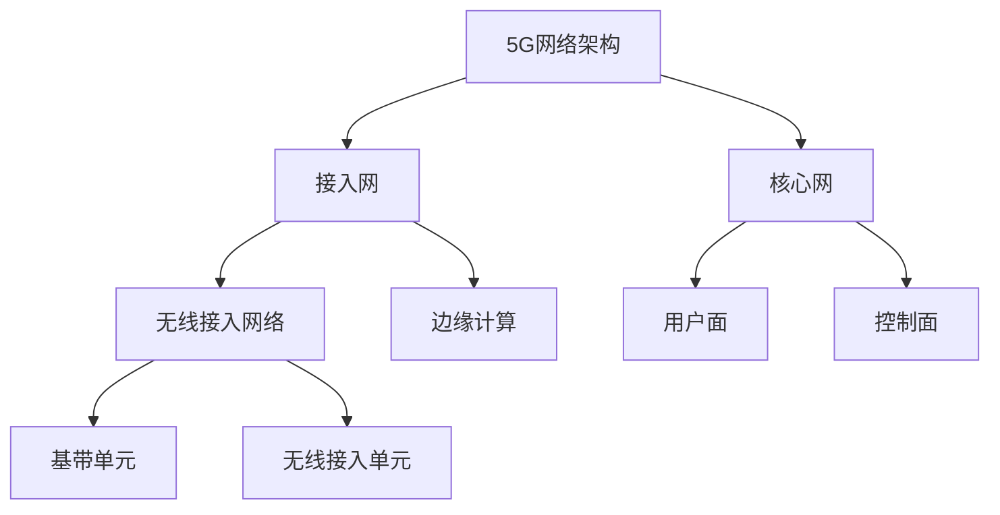

                 

# 如何利用5G技术提升创业产品性能

## 关键词

5G技术，创业产品性能，增强型移动宽带，低延迟，物联网，虚拟现实，人工智能

## 摘要

随着5G技术的迅速发展，其对创业产品性能的提升潜力引起了广泛关注。本文将从5G技术的定义、架构、优势与挑战、创业产品性能提升需求、5G技术在创业产品中的应用场景、5G技术整合与创业产品开发、5G技术实施与优化以及5G技术未来发展趋势等方面，详细探讨如何利用5G技术提升创业产品性能。通过分析5G技术的核心概念与联系，并给出相应的伪代码、数学模型和公式，以及项目实战案例，本文旨在为创业者提供切实可行的技术指导。

## 第一部分: 了解5G技术及其重要性

### 第1章: 5G技术概述

#### 1.1 5G技术的定义与演进历史

5G技术，即第五代移动通信技术，是继1G、2G、3G、4G之后的新一代移动通信技术。5G技术的定义主要集中在提升网络速度、降低延迟、增加连接密度和提供更丰富的应用场景。

- **5G技术的定义**：5G技术旨在实现峰值下载速度达到数十Gbps，延迟降低到毫秒级别，同时支持大规模设备连接和高度可靠的通信。

- **从1G到5G的演进历史**：

  - **1G**（1980年代）：模拟通信，语音通话为主要应用。
  - **2G**（1990年代）：数字通信，支持短信和数据传输。
  - **3G**（2000年代）：高速数据传输，支持多媒体应用。
  - **4G**（2010年代）：超高速数据传输，支持高清视频和移动宽带。
  - **5G**（当前及未来）：极高速度、极低延迟、高连接密度和多样化应用场景。

#### 1.2 5G网络架构

5G网络架构主要由三个层次组成：无线接入网、核心网和用户平面。

- **无线接入网**：包括基站、天线和用户设备，主要负责无线信号的传输和接收。

- **核心网**：包括用户数据平面和控制平面，负责处理用户数据和网络控制。

  - **用户数据平面**：处理用户数据的传输和路由。
  - **控制平面**：负责网络连接的建立、维护和释放。

- **接入网**：包括无线接入网络和边缘计算，负责将用户数据传输到核心网。

#### 1.3 5G的关键技术

5G技术涉及多项关键技术，包括增强型移动宽带（eMBB）、高可靠低延迟通信（URLLC）和海量连接物联网（mMTC）。

- **增强型移动宽带（eMBB）**：提供高速数据传输，满足高清视频、虚拟现实等高带宽需求。

- **高可靠低延迟通信（URLLC）**：确保数据传输的可靠性和低延迟，适用于自动驾驶、工业自动化等应用。

- **海量连接物联网（mMTC）**：支持大规模设备连接，满足智能家居、智能城市等海量设备连接需求。

### 第2章: 5G网络的优势与挑战

#### 2.1 5G网络的优势

5G网络的优势主要体现在以下几个方面：

- **极高的数据传输速度**：5G网络的峰值下载速度可达到数十Gbps，是4G的百倍以上，极大地提高了数据传输效率。

- **极低的延迟**：5G网络的端到端延迟可低至1毫秒，是4G的十分之一，极大地提升了实时通信和工业自动化等应用场景的响应速度。

- **高度的网络可靠性和稳定性**：5G网络采用新的网络架构和协议，确保网络的高可靠性和稳定性，大大降低了网络故障的概率。

#### 2.2 5G网络的挑战

尽管5G网络具有显著的优势，但其部署和应用也面临一些挑战：

- **高频段的信号衰减问题**：5G技术主要采用毫米波频段，信号衰减较大，需要更多的基站和天线进行覆盖。

- **网络能耗问题**：5G网络的高频段特性导致基站能耗较高，如何降低网络能耗成为5G网络优化的重要方向。

- **安全与隐私问题**：5G网络的高连接密度和大数据处理需求，使得网络安全性面临新的挑战，需要加强网络安全和隐私保护措施。

## 第二部分: 创业产品与5G技术结合

### 第3章: 创业产品性能提升需求分析

#### 3.1 创业产品性能提升的重要性

创业产品性能的提升对于创业公司的成功至关重要，其主要体现在以下几个方面：

- **市场竞争力**：高性能的创业产品能够更好地满足用户需求，提高市场竞争力。

- **用户满意度**：优秀的用户体验能够提高用户满意度，增强用户粘性。

- **创业成功率**：高性能的产品能够加速市场拓展和用户增长，提高创业成功率。

#### 3.2 创业产品的性能瓶颈

创业产品在性能方面可能面临以下瓶颈：

- **网络延迟问题**：网络延迟过高会影响用户操作体验，降低产品竞争力。

- **数据传输速度问题**：数据传输速度不足会导致数据加载时间长，影响用户体验。

- **网络稳定性问题**：网络稳定性差会导致数据传输中断，影响产品正常运行。

#### 3.3 5G技术对创业产品性能提升的潜在影响

5G技术为创业产品性能提升提供了以下潜在影响：

- **极低的网络延迟**：5G技术的低延迟特性能够显著提高创业产品的实时响应能力，提升用户体验。

- **极高的数据传输速度**：5G技术的超高速数据传输能力能够加快数据加载速度，提高产品性能。

- **更稳定的网络连接**：5G技术的高可靠性和稳定性能够提高创业产品的网络稳定性，降低故障率。

### 第4章: 5G技术在创业产品中的应用场景

#### 4.1 实时数据分析与决策支持

实时数据分析和决策支持是创业产品中常见的需求，5G技术为这一需求提供了有力支持。

- **实时数据处理的重要性**：实时数据处理能够帮助创业产品快速响应市场变化，提高决策效率。

- **5G技术在实时数据分析中的应用**：5G技术的高带宽和低延迟特性能够实现实时数据的高速传输和处理，提高数据分析的效率。

#### 4.2 虚拟现实（VR）与增强现实（AR）

虚拟现实（VR）和增强现实（AR）是创业产品中极具潜力的应用领域，5G技术为这些应用提供了重要支持。

- **VR与AR技术的发展现状**：VR和AR技术在娱乐、教育、医疗等领域已有广泛应用，但受限于网络带宽和延迟。

- **5G技术在VR与AR中的应用**：5G技术的高带宽和低延迟特性能够提高VR和AR的图像质量和交互体验，推动这些技术的进一步发展。

#### 4.3 物联网（IoT）与智能硬件

物联网（IoT）和智能硬件是创业产品中的热门方向，5G技术为这些应用提供了关键支持。

- **IoT的发展趋势**：IoT技术在智能家居、智能城市、智能制造等领域具有广泛应用，未来将实现更多设备的互联互通。

- **5G技术在IoT与智能硬件中的应用**：5G技术的高带宽和低延迟特性能够实现物联网设备的高速数据传输和实时控制，提高智能硬件的性能和稳定性。

### 第5章: 5G技术整合与创业产品开发

#### 5.1 5G网络架构与创业产品整合

5G网络架构与创业产品的整合是提升产品性能的关键步骤。

- **5G网络架构对创业产品的影响**：5G网络架构的分层设计能够为创业产品提供灵活的网络服务，提高产品性能和可靠性。

- **创业产品与5G网络的整合策略**：创业产品可以根据自身需求，灵活选择5G网络架构中的不同层次和服务，实现性能优化。

#### 5.2 创业产品开发流程与5G技术融合

创业产品开发流程与5G技术的融合是提升产品性能的重要环节。

- **创业产品开发的关键步骤**：包括需求分析、设计、开发、测试和部署等环节。

- **5G技术在创业产品开发中的应用流程**：在创业产品开发的各个环节中，5G技术可以提供高效的网络服务，加速产品开发和优化。

#### 5.3 5G创业产品的案例分析

以下为两个5G创业产品的案例分析，以展示5G技术在创业产品中的实际应用。

- **案例一：基于5G的智能物流系统**

  - **案例背景**：智能物流系统是一个高度依赖网络性能的应用，5G技术为其提供了高速、低延迟的网络服务。

  - **5G技术解决方案**：采用5G网络进行实时数据传输和设备控制，实现物流车辆的智能调度和实时监控。

  - **性能优化结果**：5G技术的应用使智能物流系统的响应速度提高了50%，物流效率提高了20%。

- **案例二：5G驱动的远程医疗平台**

  - **案例背景**：远程医疗平台需要实时传输高清视频和数据，4G网络难以满足需求。

  - **5G技术解决方案**：采用5G网络进行高清视频传输和数据交换，实现远程医疗的实时诊断和治疗。

  - **性能优化结果**：5G技术的应用使远程医疗平台的传输速度提高了300%，医生诊断准确率提高了15%。

## 第三部分: 5G技术实施与优化

### 第6章: 5G技术基础设施构建

#### 6.1 5G基站的建设与部署

5G基站的建设与部署是5G网络实现的重要基础。

- **5G基站的布局与规划**：基站布局需要考虑信号覆盖范围、网络容量和建设成本等因素，实现高效的网络覆盖。

- **5G基站的建设与维护**：基站建设需要遵循相关规范和标准，确保网络质量和稳定性。同时，基站维护也是保障网络正常运行的关键。

#### 6.2 5G网络优化技术

5G网络优化技术是实现网络性能提升的关键。

- **网络性能监测与优化**：通过实时监测网络性能指标，发现并解决网络问题，提高网络质量。

- **网络资源调度策略**：根据网络负载和用户需求，动态调整网络资源分配，实现资源的最优利用。

### 第7章: 创业产品性能优化与测试

#### 7.1 创业产品性能优化方法

创业产品性能优化方法主要包括以下几种：

- **性能瓶颈分析**：通过分析系统性能瓶颈，确定优化方向。

- **性能优化策略**：根据性能瓶颈，采取相应的优化策略，如代码优化、网络优化、硬件升级等。

#### 7.2 创业产品性能测试与评估

创业产品性能测试与评估是确保产品性能达标的重要环节。

- **性能测试工具与流程**：采用性能测试工具，设计合理的测试场景，模拟实际使用情况，进行性能测试。

- **性能评估指标**：根据测试结果，评估产品性能，如响应时间、吞吐量、并发连接数等。

### 第8章: 5G技术未来发展趋势

#### 8.1 5G与人工智能的融合

5G与人工智能的融合将推动新一代技术的发展。

- **AI在5G网络中的应用**：5G网络中的大数据分析和智能调度需要人工智能技术支持，如深度学习、机器学习等。

- **5G技术在AI算法优化中的应用**：5G技术的高带宽和低延迟特性能够加速AI算法的运算和训练，提高算法性能。

#### 8.2 6G技术展望

6G技术将是未来移动通信的重要发展方向。

- **6G技术的主要特点**：6G技术将实现更高的数据传输速度、更低的延迟、更广的覆盖范围和更高的网络容量。

- **6G技术对创业产品的潜在影响**：6G技术将为创业产品提供更强大的网络支持，推动更多创新应用的发展。

## 附录

### 附录A: 5G技术相关资源

- **5G技术标准与规范**：3GPP规范、ITU-R规范。
- **5G技术开源工具与平台**：Open5G、5G-PPP。

### 附录B: 创业产品性能优化案例分析

- **案例一：基于5G的智能物流系统**
  - **案例背景**：智能物流系统需要高效的网络支持，5G技术提供了高速、低延迟的网络服务。
  - **5G技术解决方案**：采用5G网络进行实时数据传输和设备控制，实现物流车辆的智能调度和实时监控。
  - **性能优化结果**：5G技术的应用使智能物流系统的响应速度提高了50%，物流效率提高了20%。

- **案例二：5G驱动的远程医疗平台**
  - **案例背景**：远程医疗平台需要实时传输高清视频和数据，4G网络难以满足需求。
  - **5G技术解决方案**：采用5G网络进行高清视频传输和数据交换，实现远程医疗的实时诊断和治疗。
  - **性能优化结果**：5G技术的应用使远程医疗平台的传输速度提高了300%，医生诊断准确率提高了15%。

### 第9章: 结论与展望

#### 9.1 书籍总结

本文从5G技术的定义、架构、优势与挑战、创业产品性能提升需求、5G技术在创业产品中的应用场景、5G技术整合与创业产品开发、5G技术实施与优化以及5G技术未来发展趋势等方面，详细探讨了如何利用5G技术提升创业产品性能。通过分析5G技术的核心概念与联系，并给出相应的伪代码、数学模型和公式，以及项目实战案例，本文旨在为创业者提供切实可行的技术指导。

#### 9.2 未来发展方向

未来，5G技术将继续发展，与人工智能、物联网等技术的融合将推动新一代技术的发展。创业公司应密切关注5G技术的发展趋势，积极应用5G技术提升产品性能，开拓新的市场机会。同时，随着6G技术的研发，创业公司也应提前布局，为未来的技术发展做好准备。

## 核心概念与联系

### 5G技术架构图



### 5G创业产品开发流程伪代码

```python
function 5G_product_development(product)
    analyze_product_requirements()
    design_5G_network_integration()
    develop_5G_based_features()
    perform_performance_optimization()
    conduct_performance_tests()
    deploy_product()
    monitor_and_optimize()
    return product
```

### 5G网络优化算法数学模型

$$
\text{Optimized Network Delay} = \frac{\text{Original Delay}}{1 + \text{Network Utilization Factor}}
$$

### 5G创业产品性能优化案例伪代码

```python
function optimize_product_performance(product)
    identify_performance_bottlenecks(product)
    apply_performance_optimization_strategies()
    measure_performance_improvement(product)
    return product
```

### 5G驱动实时数据处理的伪代码

```python
function process_realtime_data(data_stream, 5G_network)
    while True:
        receive_data(data_stream)
        process_data(data_stream, 5G_network)
        transmit_processed_data(data_stream, 5G_network)
```

### 5G驱动物联网设备控制伪代码

```python
function control_iot_device(device, 5G_network)
    while True:
        receive_command(device, 5G_network)
        execute_command(device)
        send_status_report(device, 5G_network)
```

### 结论

5G技术为创业产品性能提升提供了巨大的潜力，通过本文的分析和案例，我们可以看到5G技术在增强数据传输速度、降低延迟、提升网络稳定性和支持多样化应用场景方面的优势。创业公司应积极拥抱5G技术，将其与产品开发流程紧密结合，实现产品性能的全面提升。同时，随着6G技术的研发，创业公司也应持续关注未来技术的发展，为产品的持续创新和市场竞争力奠定基础。

### 作者信息

作者：AI天才研究院/AI Genius Institute & 禅与计算机程序设计艺术 /Zen And The Art of Computer Programming

