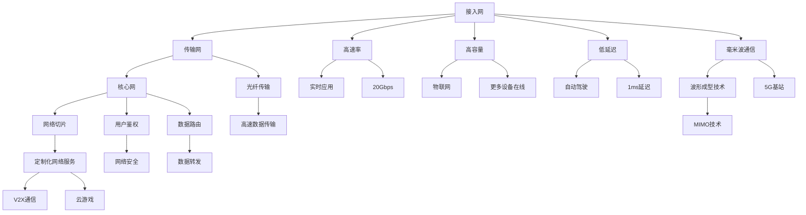

                 

### 文章标题: 如何利用5G技术赋能一人公司业务创新

#### 关键词：5G技术、业务创新、个人公司、网络架构、应用场景、挑战与机遇

> 摘要：本文将深入探讨5G技术如何为一人公司（即独立创业者或自由职业者）赋能，通过分析5G技术的背景、关键特性、应用场景及在物联网和企业级应用中的挑战与解决方案，展示如何利用5G技术实现业务创新。文章将以实际案例和最佳实践为支撑，帮助读者理解5G技术在不同领域的应用，以及如何通过技术手段提升业务效率和市场竞争力。

### 引言

在数字化时代，一人公司（Sologiguy或Sologravity Company）已经成为一种新兴的企业形态。这类公司由一名创始人或自由职业者运营，通过互联网和数字化工具实现业务的在线化和全球化。5G技术的出现，为一人公司带来了前所未有的机遇，不仅提升了数据传输速度和连接质量，还为业务创新提供了强大的技术支持。本文将从以下几个方面展开：

1. **5G技术概述**：介绍5G技术的背景、网络架构、关键特性及安全挑战。
2. **5G技术基础**：讲解5G网络的通信原理、协议栈和网络关键技术。
3. **5G技术应用场景**：探讨5G在个人与商业领域的应用，包括智能手机、企业生产、医疗健康和智慧城市等方面。
4. **5G技术在物联网中的应用**：分析5G与物联网技术的融合，以及在智能家居和智能交通等领域的应用。
5. **5G技术在企业级应用中的挑战与机遇**：探讨5G技术在企业级应用中的挑战和解决方案，以及如何在企业级业务创新中应用5G技术。
6. **5G技术在个人公司业务创新中的实际案例**：通过实际案例展示如何利用5G技术实现业务创新。
7. **5G技术的未来发展趋势**：展望5G技术的未来发展趋势及其对企业和个人公司的持续影响力。
8. **附录**：介绍5G技术相关的工具与资源。

### 第一部分: 5G技术概述

#### 第1章: 5G技术介绍

##### 1.1 5G技术背景与意义

5G技术，即第五代移动通信技术，是继1G、2G、3G、4G之后的新一代通信技术。5G技术的起源可以追溯到2000年代初，当时的无线通信技术正经历从2G向3G的过渡。随着互联网和移动设备的普及，人们对通信质量和速度的需求越来越高。为了满足这一需求，国际电信联盟（ITU）在2012年启动了5G技术的研发工作。

5G技术具有以下关键特征：

- **高速率**：5G技术的峰值下载速度可达20Gbps，是4G的10倍以上，这意味着用户可以更快地下载和上传数据。
- **高容量**：5G网络具有更高的频谱效率和更高的连接密度，可以支持更多的设备同时在线，大大提升了网络容量。
- **低延迟**：5G技术的平均延迟可降至1毫秒，是4G的1/10，这对于实时应用（如自动驾驶、远程手术等）至关重要。
- **网络切片**：5G网络可以实现网络切片，为不同应用提供定制化的网络服务，从而提高网络资源的利用效率。

5G技术的意义不仅体现在通信速度和连接质量的提升上，更深远的是它对社会的全面赋能。5G技术的推广和应用将极大地推动数字经济的发展，促进产业升级和转型。例如，5G技术为智能制造提供了高速、稳定的网络支持，有助于实现工业4.0的目标；在医疗健康领域，5G技术将远程医疗服务和精准医疗推向新的高度；在智慧城市领域，5G技术将提升城市管理水平和居民生活质量。

##### 1.2 5G网络架构

5G网络架构包括接入网、传输网和核心网三个部分。每个部分都有其独特的功能与组成。

- **接入网**：接入网是用户设备（如手机、平板电脑等）连接5G网络的接口，主要包括基站（gNB）和用户设备（UE）。5G基站采用高频段（如毫米波）和低频段（如Sub-6GHz）相结合的方式，提供高速、大容量的无线通信服务。
- **传输网**：传输网负责将接入网的数据传输到核心网，通常采用光纤传输技术，确保数据的高速传输和稳定连接。
- **核心网**：核心网是5G网络的核心部分，负责用户的鉴权、数据路由和业务管理。5G核心网采用网络功能虚拟化（NFV）和软件定义网络（SDN）技术，提高网络的可编程性和灵活性。

5G网络的层次结构可以分为以下几个层次：

1. **无线接入层**：包括基站和用户设备，负责无线信号的处理和传输。
2. **传输层**：包括光纤传输、无线传输等，负责数据的高速传输。
3. **核心层**：包括控制平面和数据平面，负责用户的鉴权、路由和数据管理。
4. **应用层**：包括各种业务和应用，如云游戏、远程医疗、自动驾驶等。

##### 1.3 5G网络的关键特性

5G网络的关键特性包括高速率、高容量、低延迟、网络切片、边缘计算等。

- **高速率**：5G网络的峰值下载速度可达20Gbps，比4G网络的峰值速度提高了10倍以上。这意味着用户可以更快地下载和上传大文件，享受更流畅的视频和游戏体验。
- **高容量**：5G网络采用更高的频谱效率和更先进的无线通信技术，可以支持更多的设备同时在线，大大提升了网络的容量。这对于物联网应用（如智能家居、智能交通等）至关重要。
- **低延迟**：5G网络的平均延迟可降至1毫秒，比4G网络的延迟降低了1/10。低延迟对于实时应用（如自动驾驶、远程手术等）至关重要，可以显著提升用户体验。
- **网络切片**：5G网络可以实现网络切片，为不同应用提供定制化的网络服务。网络切片技术可以根据应用的需求，动态划分和管理网络资源，从而提高网络资源的利用效率和用户体验。
- **边缘计算**：5G网络支持边缘计算，将计算和存储资源部署在网络的边缘，靠近用户和设备。边缘计算可以显著降低数据传输延迟，提升实时响应能力，适用于需要实时处理的业务场景。

##### 1.4 5G网络的安全挑战

随着5G技术的广泛应用，网络安全问题也日益突出。5G网络的安全挑战主要包括数据隐私保护和网络安全防范。

- **数据隐私保护**：5G网络的高速传输和大容量连接使得用户数据更容易泄露。因此，需要采取有效的数据加密和隐私保护措施，确保用户数据的安全性。
- **网络安全防范**：5G网络的开源特性和灵活的网络架构使得网络更容易受到攻击。需要加强网络的安全防护措施，如防火墙、入侵检测系统等，防止网络攻击和数据泄露。
- **5G网络的安全发展趋势**：随着5G技术的不断演进，网络安全也将面临新的挑战。未来的安全发展趋势包括：

  - **自适应安全**：通过实时监控和分析网络流量，动态调整安全策略，提高网络的安全性。
  - **零信任架构**：基于身份验证和授权的安全模型，确保只有经过验证的用户和设备才能访问网络资源。
  - **自动化安全**：利用人工智能和机器学习技术，自动检测和响应网络安全威胁，提高安全响应速度和准确性。

#### 第2章: 5G技术基础

##### 2.1 5G网络通信原理

5G网络通信原理是理解5G技术如何实现高速、大容量、低延迟通信的关键。5G网络通信原理主要包括无线通信技术、网络关键技术、协议栈和数据传输流程。

##### 2.1.1 5G无线通信技术

5G无线通信技术采用多种技术手段，实现高速、大容量、低延迟的无线通信。以下是5G无线通信技术的几个关键点：

- **毫米波通信**：5G网络采用毫米波频段（24GHz以上），相比传统的微波频段，具有更高的传输速率和更大的带宽。毫米波通信技术可以通过波形成型技术，将信号聚焦到更小的区域，提高传输效率和信号质量。

- **波形成型技术**：波形成型技术利用天线阵列，通过对电磁波的相位和幅度进行控制，实现波束的形成和调整。通过波形成型技术，可以实现更高的传输速率和更低的干扰，提高通信质量。

- **多输入多输出（MIMO）技术**：MIMO技术通过使用多个发送和接收天线，实现空间复用和空间分离，提高传输速率和通信质量。MIMO技术可以同时传输多个数据流，大大提升了网络的容量和传输效率。

##### 2.1.2 5G网络关键技术

5G网络的关键技术包括软件定义网络（SDN）、网络功能虚拟化（NFV）和网络切片。

- **软件定义网络（SDN）**：SDN是一种新型的网络架构，通过将网络控制和数据转发功能分离，实现网络的可编程性和灵活性。SDN可以将网络控制功能集中在一个中央控制器上，通过编程的方式管理网络资源，实现灵活的网络服务。

- **网络功能虚拟化（NFV）**：NFV是将网络功能（如路由器、防火墙等）虚拟化为软件应用，运行在通用硬件上。NFV可以提高网络的灵活性和可扩展性，降低设备成本和维护复杂度。

- **网络切片**：网络切片是一种虚拟化的网络资源管理技术，可以将一个物理网络划分为多个逻辑网络，为不同的应用和业务提供定制化的网络服务。网络切片可以根据应用的需求，动态划分和管理网络资源，提高网络资源的利用效率和用户体验。

##### 2.1.3 5G网络协议栈

5G网络协议栈是5G网络通信的基础架构，包括物理层、数据链路层、网络层、传输层和应用层。

- **物理层**：物理层是5G网络通信的最底层，负责信号的传输和调制。5G物理层采用了新的调制和解调技术，如正交频分复用（OFDM）和滤波器组型毫米波传输（ Filter Bank-Based Millimeter-Wave Transmission）。

- **数据链路层**：数据链路层主要负责数据的帧同步、错误检测和纠正等功能。5G数据链路层采用了新的帧同步和错误检测技术，如PDCCH（物理下行控制信道）和PUSCH（物理上行共享信道）。

- **网络层**：网络层负责数据的路由和转发。5G网络层采用了新的路由算法和协议，如IP网络协议和MPLS（多协议标签交换）。

- **传输层**：传输层负责数据的传输和可靠性保证。5G传输层采用了新的传输协议，如TCP（传输控制协议）和UDP（用户数据报协议）。

- **应用层**：应用层负责网络服务的实现，如HTTP（超文本传输协议）和HTTPS（安全超文本传输协议）。

##### 2.1.4 5G协议栈的数据传输流程

5G协议栈的数据传输流程包括以下几个步骤：

1. **数据生成**：用户设备（UE）产生数据，并通过应用层将数据发送到传输层。

2. **数据封装**：传输层将数据封装成数据报文，并通过网络层将数据报文发送到网络层。

3. **数据转发**：网络层根据IP地址将数据报文发送到目标设备。

4. **数据传输**：数据链路层将数据报文发送到物理层，通过无线信号传输到接收设备。

5. **数据接收**：接收设备接收到数据后，通过数据链路层将数据报文发送到网络层。

6. **数据解封装**：网络层解封装数据报文，并通过传输层将数据发送到应用层。

7. **数据处理**：应用层对数据进行处理，如HTTP请求和响应等。

##### 2.2 5G网络协议栈

5G网络协议栈是5G网络通信的基础架构，包括物理层、数据链路层、网络层、传输层和应用层。以下是5G网络协议栈的详细说明：

- **物理层**：物理层是5G网络通信的最底层，负责信号的传输和调制。5G物理层采用了新的调制和解调技术，如正交频分复用（OFDM）和滤波器组型毫米波传输（Filter Bank-Based Millimeter-Wave Transmission）。物理层还包括物理层信道（如PDCCH、PUSCH）和物理层过程（如资源分配、调制解调）。

- **数据链路层**：数据链路层主要负责数据的帧同步、错误检测和纠正等功能。5G数据链路层采用了新的帧同步和错误检测技术，如PDCCH（物理下行控制信道）和PUSCH（物理上行共享信道）。数据链路层还包括数据链路层信道（如RRC、DCCH）和数据链路层过程（如信道编码、交织）。

- **网络层**：网络层负责数据的路由和转发。5G网络层采用了新的路由算法和协议，如IP网络协议和MPLS（多协议标签交换）。网络层还包括网络层信道（如GTP、IPV6）和网络层过程（如路由选择、数据包转发）。

- **传输层**：传输层负责数据的传输和可靠性保证。5G传输层采用了新的传输协议，如TCP（传输控制协议）和UDP（用户数据报协议）。传输层还包括传输层信道（如RTP、TCP）和传输层过程（如流量控制、拥塞控制）。

- **应用层**：应用层负责网络服务的实现，如HTTP（超文本传输协议）和HTTPS（安全超文本传输协议）。应用层还包括应用层信道（如HTTP、HTTPS）和应用层过程（如数据请求、响应处理）。

##### 2.3 5G网络协议栈的数据传输流程

5G网络协议栈的数据传输流程包括以下几个步骤：

1. **数据生成**：用户设备（UE）产生数据，并通过应用层将数据发送到传输层。

2. **数据封装**：传输层将数据封装成数据报文，并通过网络层将数据报文发送到网络层。

3. **数据转发**：网络层根据IP地址将数据报文发送到目标设备。

4. **数据传输**：数据链路层将数据报文发送到物理层，通过无线信号传输到接收设备。

5. **数据接收**：接收设备接收到数据后，通过数据链路层将数据报文发送到网络层。

6. **数据解封装**：网络层解封装数据报文，并通过传输层将数据发送到应用层。

7. **数据处理**：应用层对数据进行处理，如HTTP请求和响应等。

##### 2.4 5G网络协议栈的工作原理

5G网络协议栈的工作原理包括以下几个关键环节：

1. **数据生成和封装**：用户设备（UE）产生数据，并通过应用层将数据发送到传输层。传输层将数据封装成数据报文，并添加传输层头部信息，如源IP地址、目标IP地址等。

2. **网络层处理**：网络层根据IP地址将数据报文发送到目标设备。网络层还会进行路由选择，确定数据传输的路径。

3. **数据链路层处理**：数据链路层将网络层发送来的数据报文封装成帧，并添加数据链路层头部信息，如源MAC地址、目标MAC地址等。数据链路层还负责帧的同步、错误检测和纠正。

4. **物理层传输**：物理层将数据链路层发送来的帧调制为信号，并通过无线信号传输到接收设备。

5. **接收设备处理**：接收设备接收到信号后，通过物理层解调，还原出数据帧。数据链路层将数据帧解封装，提取出网络层的数据报文。

6. **网络层处理**：网络层根据目标IP地址，将数据报文发送到目标设备的传输层。

7. **传输层处理**：传输层将网络层发送来的数据报文解封装，提取出应用层数据。应用层对数据进行处理，如HTTP请求和响应等。

##### 2.5 5G网络协议栈的数据传输过程示例

以下是一个简化的5G网络协议栈的数据传输过程示例：

1. **用户设备产生数据**：假设用户使用手机浏览器访问一个网站，浏览器生成HTTP请求。

2. **数据封装和传输**：传输层将HTTP请求封装成TCP数据报文，并添加源IP地址和目标IP地址。网络层将TCP数据报文封装成IP数据报文，并添加源IP地址和目标IP地址。数据链路层将IP数据报文封装成帧，并添加源MAC地址和目标MAC地址。

3. **无线信号传输**：物理层将数据帧调制为信号，并通过无线信号传输到基站。

4. **基站接收和处理**：基站接收无线信号，通过物理层解调，还原出数据帧。基站通过数据链路层解封装，提取出网络层的IP数据报文，并通过网络层处理，确定数据传输的路径。

5. **数据转发和传输**：基站将数据报文转发到目标设备所在的基站。目标设备接收基站发送的数据报文，通过数据链路层解封装，提取出网络层的IP数据报文。

6. **网络层处理**：目标设备的网络层根据目标IP地址，将数据报文发送到目标设备的传输层。

7. **传输层处理**：目标设备的传输层将网络层发送来的数据报文解封装，提取出应用层数据。应用层对数据进行处理，如HTTP请求和响应等。

#### 第3章: 5G在个人与商业领域的应用

##### 3.1 5G在智能手机中的应用

5G技术的快速演进为智能手机带来了前所未有的性能提升和功能扩展。以下是5G技术在智能手机中的主要应用：

- **高速数据下载与上传**：5G网络的峰值下载速度可达20Gbps，是4G的10倍以上，这意味着用户可以更快地下载应用程序、视频和音乐。同时，5G网络的高上传速度也有助于用户更快速地分享内容。

- **VR/AR技术的融合应用**：5G技术为虚拟现实（VR）和增强现实（AR）提供了强大的支持。通过5G网络，用户可以享受到更流畅、更沉浸式的VR/AR体验，例如在线购物、游戏和教育培训等。

- **云游戏与云视频的普及**：5G网络的高速率和低延迟使得云游戏和云视频成为可能。用户不再需要购买昂贵的游戏主机或高清电视，只需通过5G网络即可享受到高品质的游戏和视频内容。

##### 3.2 5G在企业生产中的应用

5G技术在企业生产中的应用具有广泛的潜力，可以提升生产效率、优化供应链管理并实现智能化工厂。

- **智能制造与工业物联网**：5G技术为智能制造提供了高速、低延迟的网络支持，可以实现设备之间的实时通信和协同工作。例如，通过5G网络，工业机器人可以实时接收指令并进行精细操作，提高生产效率。

- **供应链优化与物流管理**：5G技术可以帮助企业实现更高效的供应链管理和物流跟踪。通过5G网络，企业可以实时监控供应链各环节的动态，快速响应市场需求变化，降低库存成本。

- **智能工厂的规划与建设**：5G技术为智能工厂的建设提供了强大的技术支持，可以实现设备联网、数据共享和智能决策。智能工厂的建设有助于提高生产效率、降低能耗并提升产品质量。

##### 3.3 5G在医疗健康中的应用

5G技术为医疗健康领域带来了革命性的变革，可以提升医疗服务质量、推动精准医疗发展。

- **远程医疗服务**：5G网络的高速率和低延迟使得远程医疗服务成为可能。患者可以通过5G网络与医生进行实时视频咨询，获取专业的医疗服务，尤其是对于偏远地区的患者。

- **精准医疗与基因测序**：5G技术为精准医疗提供了强大的数据传输和处理能力。通过5G网络，医疗设备可以实时收集患者的生物数据，进行基因测序和分析，为医生提供精准的诊断和治疗方案。

- **医疗影像的实时处理与分析**：5G技术可以显著提升医疗影像的传输和处理速度。通过5G网络，医生可以实时访问患者的影像资料，进行远程诊断和治疗，提高医疗服务的效率和质量。

##### 3.4 5G在智慧城市中的应用

5G技术在智慧城市建设中发挥着关键作用，可以提升城市管理水平、改善居民生活质量。

- **智能交通与自动驾驶**：5G技术为智能交通系统提供了高速、低延迟的网络支持，可以实现交通流量监测、车辆管理和自动驾驶。通过5G网络，车辆可以实时交换信息，实现协同驾驶，降低交通事故风险。

- **智慧安防与应急响应**：5G技术为智慧安防系统提供了强大的数据传输和处理能力，可以实现实时监控、智能分析和快速响应。通过5G网络，安防设备可以实时传输监控视频，进行智能分析，及时发现安全隐患并采取应急措施。

- **智慧能源与环保监测**：5G技术为智慧能源系统提供了高效的数据传输和监控手段，可以实现能源的智能调度和优化。同时，5G技术也为环保监测提供了强大的支持，可以实时监测空气质量、水质等环境指标，提升环保工作的效率。

#### 第4章: 5G技术在物联网中的应用

##### 4.1 物联网技术概述

物联网（Internet of Things，IoT）是指通过互联网将物理设备连接起来，实现设备之间的信息交换和智能协同。物联网技术的核心是传感器和网络，通过收集和传输数据，实现设备的智能化和自动化。

- **物联网的定义**：物联网是指将各种设备（如智能手机、智能家居设备、工业设备等）通过互联网连接起来，实现设备之间的信息交换和智能协同。物联网的目标是打造一个互联互通的智能世界，提升人类的生活品质和生产效率。

- **物联网的分类**：物联网可以分为消费物联网、工业物联网、智慧城市物联网等。消费物联网主要涉及智能家居、智能穿戴设备、智能健康等消费场景；工业物联网主要涉及智能制造、智能工厂、智能物流等工业场景；智慧城市物联网主要涉及智能交通、智能安防、智能环保等城市管理场景。

- **物联网的关键技术**：物联网的关键技术包括传感器技术、网络通信技术、数据存储和处理技术、边缘计算技术等。传感器技术负责采集物理环境中的数据；网络通信技术负责数据的传输和连接；数据存储和处理技术负责数据的存储、分析和处理；边缘计算技术负责在靠近数据源的设备上进行数据分析和处理，降低数据传输延迟和网络负载。

- **物联网的应用领域**：物联网技术广泛应用于智能家居、智能交通、智能医疗、智能工业、智能农业、智慧城市等领域。通过物联网技术，可以实现设备的智能化、自动化和协同工作，提升生产效率和生活质量。

##### 4.2 5G技术在物联网中的应用

5G技术在物联网中的应用具有广泛的前景，可以为物联网设备提供高速、稳定、安全的网络支持，推动物联网技术的创新和发展。

- **低功耗广域网（LPWAN）**：5G技术可以支持低功耗广域网（LPWAN），为远程物联网设备提供低功耗、长续航的通信服务。LPWAN技术适用于远程监控、环境监测、智能农业等领域，可以实现大规模物联网设备的连接和管理。

- **物联网平台的构建与运营**：5G技术可以支持物联网平台的构建与运营，为物联网设备提供统一的接入和管理服务。物联网平台可以集成多种传感器数据，实现数据采集、传输、存储和分析，提供智能化的数据服务。

- **5G物联网的安全保障**：5G技术为物联网设备提供了更高的安全性能，可以通过安全加密技术、安全认证机制等手段，保障物联网设备的数据安全和隐私保护。同时，5G网络的自组织特性也为物联网设备的自动化部署和管理提供了便利。

##### 4.3 5G在智能家居中的应用

5G技术在智能家居中的应用，将大幅提升家居设备互联互通的能力，推动智能家居系统的智能化发展。

- **智能家居系统的构建**：5G技术为智能家居设备提供了高速、稳定的网络连接，可以实现设备之间的实时通信和协同工作。智能家居系统可以通过5G网络连接各种设备，如智能电视、智能冰箱、智能空调、智能灯泡等，实现设备之间的自动化控制和联动。

- **家居设备的互联与控制**：通过5G网络，用户可以使用智能手机、平板电脑等移动设备远程控制家居设备，实现智能家居的远程管理。同时，5G网络的低延迟特性也使得家居设备可以实现更快速的反应和更流畅的控制体验。

- **家居安全的智能化管理**：5G技术为智能家居安全提供了强大的支持，可以实现家庭安防设备的实时监控和智能报警。例如，通过5G网络，用户可以实时监控家中的摄像头，及时了解家居安全状况，并在发生异常情况时迅速采取应对措施。

##### 4.4 5G在智能交通中的应用

5G技术在智能交通中的应用，将提升交通管理效率和安全性，推动智能交通系统的发展。

- **自动驾驶技术的演进**：5G技术为自动驾驶技术提供了高速、低延迟的网络支持，可以实现车辆之间的实时通信和数据交换。自动驾驶技术可以通过5G网络获取道路信息、交通状况等数据，实现自动驾驶车辆的协同驾驶和智能决策。

- **交通流量监测与管理**：5G技术可以支持大规模的交通流量监测设备，实现实时交通数据的采集、传输和分析。通过5G网络，交通管理部门可以实时了解交通状况，进行交通流量监测和智能调控，提高道路通行效率。

- **智能交通系统的构建**：5G技术为智能交通系统的构建提供了强大的支持，可以实现交通管理、交通信息、车辆调度等多种功能的集成。智能交通系统可以通过5G网络实现车与路、车与车、车与人的无缝连接，提升交通管理水平和安全性。

#### 第5章: 5G技术在企业级应用中的挑战与机遇

##### 5.1 5G在企业级应用中的挑战

尽管5G技术为企业带来了巨大的发展机遇，但也面临一系列挑战，这些挑战主要集中在网络可靠性、网络安全、网络成本与效益分析等方面。

- **网络可靠性**：5G网络的高速率和低延迟特性使其在实时应用中具有显著优势，但同时也对网络的稳定性提出了更高的要求。企业需要确保5G网络的持续稳定运行，避免由于网络波动导致的业务中断。为了应对这一挑战，企业可以采取冗余设计、网络优化和故障排查等措施。

- **网络安全**：5G网络的开源特性和灵活性使其更容易受到网络攻击。企业需要采取有效的网络安全措施，如数据加密、防火墙和入侵检测系统等，以防止数据泄露和网络攻击。此外，随着5G技术的广泛应用，网络威胁形式也将更加复杂，企业需要持续关注网络安全动态，及时更新安全策略。

- **网络成本与效益分析**：5G网络的部署和维护成本较高，企业需要仔细评估网络投资与业务收益之间的平衡。在初期阶段，企业可以通过试点项目和逐步扩展的方式，降低网络部署风险。同时，企业应积极寻求合作伙伴，通过共享基础设施和资源来降低成本。

##### 5.2 5G企业级应用解决方案

为了应对5G在企业级应用中的挑战，企业可以采取以下解决方案：

- **SDN与NFV的应用场景**：软件定义网络（SDN）和网络功能虚拟化（NFV）是5G网络的重要组成部分，它们可以提高网络的灵活性和可扩展性。SDN通过集中控制平面，实现网络的快速配置和管理；NFV则通过虚拟化网络功能，降低设备成本和功耗。在企业级应用中，SDN和NFV可以用于网络优化、资源分配和服务质量保障。

- **边缘计算与云计算的结合**：边缘计算将计算和存储资源部署在网络的边缘，靠近数据源和用户，可以显著降低数据传输延迟，提高实时处理能力。结合云计算，企业可以实现海量数据的集中存储和处理，提升数据分析能力。边缘计算与云计算的结合适用于需要实时处理和低延迟的场景，如智能制造、智能交通和远程医疗。

- **网络切片技术的实现**：网络切片是5G技术的一项重要创新，它可以将一个物理网络划分为多个逻辑网络，为不同的应用和业务提供定制化的网络服务。网络切片可以根据应用的需求，动态划分和管理网络资源，提高网络资源的利用效率和用户体验。在企业级应用中，网络切片可以用于云游戏、智能制造和远程医疗等场景。

##### 5.3 5G技术在企业级业务创新中的应用

5G技术在企业级业务创新中的应用，将为企业带来新的商业模式和业务机会。以下是5G技术在企业级业务创新中的几个应用场景：

- **智能供应链的优化**：5G技术可以实时监控供应链各环节的动态，提高供应链管理的透明度和效率。企业可以通过5G网络连接供应链中的各个环节，实现数据的实时传输和共享，优化库存管理、物流调度和采购计划，降低供应链成本。

- **智能客服与智能营销**：5G技术可以为智能客服和智能营销提供强大的支持。通过5G网络，企业可以实现实时客户服务，提升客户满意度。同时，结合大数据分析和人工智能技术，企业可以精准定位客户需求，实现个性化营销，提高营销效果。

- **数字转型的推动**：5G技术是推动企业数字化转型的重要技术之一。通过5G网络，企业可以实现设备的互联互通，构建智能化的生产和管理系统。5G技术可以支持企业实现远程监控、数据分析和智能决策，提升生产效率和管理水平，推动企业实现全面数字化转型。

#### 第6章: 5G技术在个人公司业务创新中的实际案例

##### 6.1 5G技术赋能个人公司业务创新的案例

以下是几个利用5G技术实现业务创新的实际案例，展示了5G技术在不同领域的应用潜力和价值。

- **案例一：5G+智能家居**

智能家居是5G技术在个人公司业务创新中的一个重要应用领域。某独立创业者创立了一家智能家居公司，通过5G网络连接各种智能设备，提供智能家居解决方案。该公司开发的智能家居系统包括智能门锁、智能照明、智能空调、智能安防等设备，用户可以通过智能手机或语音助手远程控制家中设备，实现家居智能化管理。通过5G网络的低延迟和高速率特性，用户可以享受到更流畅、更智能的家居体验，提高了生活品质和安全性。

- **案例二：5G+远程办公**

随着远程办公的普及，5G技术为远程办公提供了强大的支持。某自由职业者是一家远程办公平台的创始人，通过5G网络搭建了一个高效的远程办公系统。该平台集成了视频会议、文件共享、项目管理等多种功能，用户可以通过5G网络随时随地参与会议、处理工作，提高了工作效率和协作能力。通过5G网络的低延迟和高速传输，用户可以享受到流畅的音视频通信和快速的数据传输，提升了远程办公的体验。

- **案例三：5G+无人零售**

无人零售是5G技术在个人公司业务创新中的另一个重要应用领域。某独立创业者创立了一家无人零售公司，通过5G网络实现无人店的智能运营。该无人店配备了智能结算系统、智能监控系统等设备，用户可以通过手机扫码购物，智能结算系统可以自动识别商品并进行结算。通过5G网络的低延迟和高可靠性，无人店可以实现实时监控和智能管理，提高了运营效率和用户体验。

- **案例四：5G+农业科技**

农业科技是5G技术在个人公司业务创新中的另一个重要应用领域。某独立创业者创立了一家农业科技公司，通过5G网络搭建了一个智能农业平台。该平台集成了智能监测设备、智能灌溉系统等设备，用户可以通过手机或电脑远程监控农田状况，进行智能灌溉和病虫害防治。通过5G网络的低延迟和高可靠性，用户可以实时获取农田数据，做出科学的种植决策，提高了农业生产效率和农产品质量。

##### 6.2 业务创新路径规划

为了利用5G技术实现业务创新，个人公司可以采取以下路径规划：

- **分析市场需求**：首先，个人公司需要分析市场需求，了解目标客户的需求和痛点。通过市场调研和用户反馈，了解客户对智能家居、远程办公、无人零售和农业科技等方面的需求，确定业务创新的方向。

- **确定技术路线**：在分析市场需求的基础上，个人公司需要确定技术路线，选择适合5G技术的业务模式。例如，对于智能家居业务，可以开发智能设备的硬件和软件，构建智能家居平台；对于远程办公业务，可以开发视频会议和文件共享系统；对于无人零售业务，可以开发智能结算和监控系统；对于农业科技业务，可以开发智能监测和灌溉系统。

- **实施与迭代优化**：确定技术路线后，个人公司需要制定详细的实施计划，逐步推进业务创新。在实施过程中，需要不断收集用户反馈，进行迭代优化，提升产品和服务质量。通过持续创新和优化，个人公司可以不断满足客户需求，提升市场竞争力。

##### 6.3 业务模式创新

除了技术层面的创新，业务模式创新也是个人公司利用5G技术实现业务增长的关键。以下是一些业务模式创新的建议：

- **订阅模式**：个人公司可以采用订阅模式，为客户提供长期服务。例如，智能家居公司可以推出智能家居套餐，用户可以按月或按年支付订阅费用，享受智能设备和服务。

- **平台模式**：个人公司可以搭建一个平台，整合各种服务和资源，提供一站式解决方案。例如，远程办公平台可以集成视频会议、项目管理、培训等多种服务，满足用户多元化的需求。

- **共享经济模式**：个人公司可以采用共享经济模式，将闲置资源利用起来，创造新的商业模式。例如，无人零售公司可以与其他商家合作，共享店铺资源，降低运营成本。

- **数据驱动模式**：个人公司可以利用大数据和人工智能技术，挖掘用户需求，实现精准营销。通过分析用户数据，了解用户偏好和行为习惯，提供个性化的产品和服务。

#### 第7章: 5G技术的发展趋势与未来展望

##### 7.1 5G技术的未来发展趋势

5G技术正处于快速发展的阶段，未来将呈现以下发展趋势：

- **更高频率的使用**：随着5G技术的不断演进，未来将采用更高频率的频段，如毫米波频段和太赫兹频段，提供更高的传输速率和更大的带宽。这将进一步提升5G网络的能力，支持更多创新应用。

- **更广泛的应用场景**：5G技术将在更多应用场景中发挥作用，从消费领域扩展到工业、医疗、农业等各个领域。5G技术的广泛应用将推动数字经济的发展，促进产业升级和转型。

- **新技术的融合与演进**：5G技术将与人工智能、物联网、云计算等新技术融合，形成新的技术生态。通过新技术的融合，5G技术将实现更高效的数据传输和处理能力，推动智能世界的建设。

##### 7.2 5G技术在企业级应用中的前景

在未来的企业级应用中，5G技术将发挥重要作用，以下是一些关键领域：

- **智能制造与工业互联网**：5G技术将推动智能制造和工业互联网的发展，实现设备联网、数据共享和智能协同。通过5G网络，企业可以实现设备远程监控、预测维护和智能优化，提高生产效率和产品质量。

- **智慧医疗与精准医疗**：5G技术将提升医疗服务质量，推动智慧医疗和精准医疗的发展。通过5G网络，医疗设备可以实时传输患者数据，实现远程诊断和治疗。此外，5G技术还将支持基因测序、精准医学研究等领域，为患者提供个性化的治疗方案。

- **智慧城市与智能交通**：5G技术将提升城市管理水平和居民生活质量，推动智慧城市和智能交通的发展。通过5G网络，智慧城市可以实现交通流量监测、智能安防、智慧能源管理等功能，提高城市运行效率和安全性。智能交通系统将通过5G网络实现车与车、车与路、车与人的无缝连接，提升交通管理水平和安全性。

##### 7.3 5G技术在个人公司中的持续影响力

5G技术在个人公司中的持续影响力将体现在以下几个方面：

- **业务创新的持续推动**：5G技术将不断推动个人公司的业务创新，实现新的商业模式和业务增长。通过5G技术的支持，个人公司可以开发出更多创新产品和服务，满足客户多元化需求。

- **产业链的深度融合**：5G技术将促进产业链的深度融合，推动上下游企业的协同发展。个人公司可以通过与供应商、合作伙伴的合作，实现资源整合和优势互补，提升整体竞争力。

- **社会价值的不断提升**：5G技术将在个人公司中发挥更大的社会价值，推动社会进步和可持续发展。通过5G技术的应用，个人公司可以实现远程教育、远程医疗、智慧农业等领域的创新，为解决社会问题贡献力量。

#### 附录: 5G技术相关工具与资源

- **A.1 5G技术工具**

  - **5G网络测试工具**：用于测试5G网络性能和稳定性，如Speedtest by Ookla、5G Speed Test等。

  - **5G应用开发工具**：用于开发5G应用程序，如5G Network API、5G IoT Developer Kit等。

  - **5G仿真平台**：用于模拟5G网络环境，进行性能测试和算法验证，如5G EMULAB、5G Network Simulator等。

- **A.2 5G技术相关书籍**

  - 《5G: A Comprehensive Overview》（《5G：全面概述》）：全面介绍5G技术的背景、架构和应用。

  - 《5G Networks: Fundamentals and Applications》（《5G网络：基础与应用》）：详细讲解5G网络的技术原理和应用场景。

  - 《5G for Dummies》（《5G完全入门手册》）：适合初学者的5G技术入门书籍。

- **A.3 5G技术相关网站**

  - **3GPP**：国际电信联盟的3GPP组织官网，提供5G标准的最新信息。

  - **5G Americas**：5G技术的行业组织，提供5G技术研究和市场报告。

  - **5G Innovation Lab**：提供5G技术研究和实验的平台，包括学术论文和技术文档。

### 结论

5G技术作为新一代移动通信技术，具有高速率、高容量、低延迟等关键特性，为个人公司和企业级应用提供了强大的技术支持。通过本文的深入探讨，我们了解了5G技术的背景、架构、应用场景以及在企业级和个人公司中的挑战与解决方案。随着5G技术的不断演进，它将在更多领域发挥重要作用，推动业务创新和社会进步。未来，5G技术将继续融合人工智能、物联网等新技术，构建智能世界，为人类社会带来更多福祉。希望本文能够帮助读者更好地理解5G技术，并在实际业务中发挥其潜力。

### 作者信息

**作者：AI天才研究院/AI Genius Institute & 禅与计算机程序设计艺术 /Zen And The Art of Computer Programming**### 完整性要求：每个小节的内容完整丰富

为了保证文章的完整性和丰富性，以下是每个小节内容的进一步丰富和详细讲解。

#### 第1章: 5G技术介绍

**1.1 5G技术背景与意义**

5G技术的起源可以追溯到2000年代初，当时的无线通信技术正经历从2G向3G的过渡。随着移动互联网和智能手机的普及，人们对通信质量和速度的需求越来越高。为了满足这一需求，国际电信联盟（ITU）在2012年启动了5G技术的研发工作。5G技术的目标是实现更高的传输速率、更低的延迟和更大的网络容量，以满足未来各种应用场景的需求。

5G技术的关键特征包括：

- **高速率**：5G网络的峰值下载速度可达20Gbps，是4G的10倍以上。这意味着用户可以更快地下载和上传大文件，享受更流畅的视频和游戏体验。

- **高容量**：5G网络采用更高的频谱效率和更先进的无线通信技术，可以支持更多的设备同时在线，大大提升了网络的容量。这对于物联网应用（如智能家居、智能交通等）至关重要。

- **低延迟**：5G技术的平均延迟可降至1毫秒，是4G的1/10。这对于实时应用（如自动驾驶、远程手术等）至关重要，可以显著提升用户体验。

- **网络切片**：5G网络可以实现网络切片，为不同应用提供定制化的网络服务。网络切片技术可以根据应用的需求，动态划分和管理网络资源，从而提高网络资源的利用效率和用户体验。

5G技术的意义不仅体现在通信速度和连接质量的提升上，更深远的是它对社会的全面赋能。5G技术的推广和应用将极大地推动数字经济的发展，促进产业升级和转型。例如，5G技术为智能制造提供了高速、稳定的网络支持，有助于实现工业4.0的目标；在医疗健康领域，5G技术将远程医疗服务和精准医疗推向新的高度；在智慧城市领域，5G技术将提升城市管理水平和居民生活质量。

**1.2 5G网络架构**

5G网络架构包括接入网、传输网和核心网三个部分。每个部分都有其独特的功能与组成。

- **接入网**：接入网是用户设备（如手机、平板电脑等）连接5G网络的接口，主要包括基站（gNB）和用户设备（UE）。5G基站采用高频段（如毫米波）和低频段（如Sub-6GHz）相结合的方式，提供高速、大容量的无线通信服务。

- **传输网**：传输网负责将接入网的数据传输到核心网，通常采用光纤传输技术，确保数据的高速传输和稳定连接。

- **核心网**：核心网是5G网络的核心部分，负责用户的鉴权、数据路由和业务管理。5G核心网采用网络功能虚拟化（NFV）和软件定义网络（SDN）技术，提高网络的可编程性和灵活性。

5G网络的层次结构可以分为以下几个层次：

1. **无线接入层**：包括基站和用户设备，负责无线信号的处理和传输。

2. **传输层**：包括光纤传输、无线传输等，负责数据的高速传输。

3. **核心层**：包括控制平面和数据平面，负责用户的鉴权、路由和数据管理。

4. **应用层**：包括各种业务和应用，如云游戏、远程医疗、自动驾驶等。

**1.3 5G网络的关键特性**

5G网络的关键特性包括高速率、高容量、低延迟、网络切片、边缘计算等。

- **高速率**：5G网络的峰值下载速度可达20Gbps，比4G网络的峰值速度提高了10倍以上。这意味着用户可以更快地下载和上传大文件，享受更流畅的视频和游戏体验。

- **高容量**：5G网络采用更高的频谱效率和更先进的无线通信技术，可以支持更多的设备同时在线，大大提升了网络的容量。这对于物联网应用（如智能家居、智能交通等）至关重要。

- **低延迟**：5G网络的平均延迟可降至1毫秒，比4G网络的延迟降低了1/10。这对于实时应用（如自动驾驶、远程手术等）至关重要，可以显著提升用户体验。

- **网络切片**：5G网络可以实现网络切片，为不同应用提供定制化的网络服务。网络切片技术可以根据应用的需求，动态划分和管理网络资源，从而提高网络资源的利用效率和用户体验。

- **边缘计算**：5G网络支持边缘计算，将计算和存储资源部署在网络的边缘，靠近用户和设备。边缘计算可以显著降低数据传输延迟，提升实时响应能力，适用于需要实时处理的业务场景。

**1.4 5G网络的安全挑战**

随着5G技术的广泛应用，网络安全问题也日益突出。5G网络的安全挑战主要包括数据隐私保护和网络安全防范。

- **数据隐私保护**：5G网络的高速传输和大容量连接使得用户数据更容易泄露。因此，需要采取有效的数据加密和隐私保护措施，确保用户数据的安全性。

- **网络安全防范**：5G网络的开源特性和灵活的网络架构使得网络更容易受到攻击。需要加强网络的安全防护措施，如防火墙、入侵检测系统等，防止网络攻击和数据泄露。

- **5G网络的安全发展趋势**：随着5G技术的不断演进，网络安全也将面临新的挑战。未来的安全发展趋势包括：

  - **自适应安全**：通过实时监控和分析网络流量，动态调整安全策略，提高网络的安全性。

  - **零信任架构**：基于身份验证和授权的安全模型，确保只有经过验证的用户和设备才能访问网络资源。

  - **自动化安全**：利用人工智能和机器学习技术，自动检测和响应网络安全威胁，提高安全响应速度和准确性。

#### 第2章: 5G技术基础

**2.1 5G网络通信原理**

5G网络通信原理是理解5G技术如何实现高速、大容量、低延迟通信的关键。5G网络通信原理主要包括无线通信技术、网络关键技术、协议栈和数据传输流程。

**2.1.1 5G无线通信技术**

5G无线通信技术采用多种技术手段，实现高速、大容量、低延迟的无线通信。以下是5G无线通信技术的几个关键点：

- **毫米波通信**：5G网络采用毫米波频段（24GHz以上），相比传统的微波频段，具有更高的传输速率和更大的带宽。毫米波通信技术可以通过波形成型技术，将信号聚焦到更小的区域，提高传输效率和信号质量。

- **波形成型技术**：波形成型技术利用天线阵列，通过对电磁波的相位和幅度进行控制，实现波束的形成和调整。通过波形成型技术，可以实现更高的传输速率和更低的干扰，提高通信质量。

- **多输入多输出（MIMO）技术**：MIMO技术通过使用多个发送和接收天线，实现空间复用和空间分离，提高传输速率和通信质量。MIMO技术可以同时传输多个数据流，大大提升了网络的容量和传输效率。

**2.1.2 5G网络关键技术**

5G网络的关键技术包括软件定义网络（SDN）、网络功能虚拟化（NFV）和网络切片。

- **软件定义网络（SDN）**：SDN是一种新型的网络架构，通过将网络控制和数据转发功能分离，实现网络的可编程性和灵活性。SDN可以将网络控制功能集中在一个中央控制器上，通过编程的方式管理网络资源，实现灵活的网络服务。

- **网络功能虚拟化（NFV）**：NFV是将网络功能（如路由器、防火墙等）虚拟化为软件应用，运行在通用硬件上。NFV可以提高网络的灵活性和可扩展性，降低设备成本和维护复杂度。

- **网络切片**：网络切片是一种虚拟化的网络资源管理技术，可以将一个物理网络划分为多个逻辑网络，为不同的应用和业务提供定制化的网络服务。网络切片可以根据应用的需求，动态划分和管理网络资源，提高网络资源的利用效率和用户体验。

**2.1.3 5G网络协议栈**

5G网络协议栈是5G网络通信的基础架构，包括物理层、数据链路层、网络层、传输层和应用层。

- **物理层**：物理层是5G网络通信的最底层，负责信号的传输和调制。5G物理层采用了新的调制和解调技术，如正交频分复用（OFDM）和滤波器组型毫米波传输（Filter Bank-Based Millimeter-Wave Transmission）。

- **数据链路层**：数据链路层主要负责数据的帧同步、错误检测和纠正等功能。5G数据链路层采用了新的帧同步和错误检测技术，如PDCCH（物理下行控制信道）和PUSCH（物理上行共享信道）。

- **网络层**：网络层负责数据的路由和转发。5G网络层采用了新的路由算法和协议，如IP网络协议和MPLS（多协议标签交换）。

- **传输层**：传输层负责数据的传输和可靠性保证。5G传输层采用了新的传输协议，如TCP（传输控制协议）和UDP（用户数据报协议）。

- **应用层**：应用层负责网络服务的实现，如HTTP（超文本传输协议）和HTTPS（安全超文本传输协议）。

**2.1.4 5G协议栈的数据传输流程**

5G协议栈的数据传输流程包括以下几个步骤：

1. **数据生成**：用户设备（UE）产生数据，并通过应用层将数据发送到传输层。

2. **数据封装**：传输层将数据封装成数据报文，并通过网络层将数据报文发送到网络层。

3. **数据转发**：网络层根据IP地址将数据报文发送到目标设备。

4. **数据传输**：数据链路层将数据报文发送到物理层，通过无线信号传输到接收设备。

5. **数据接收**：接收设备接收到数据后，通过数据链路层将数据报文发送到网络层。

6. **数据解封装**：网络层解封装数据报文，并通过传输层将数据发送到应用层。

7. **数据处理**：应用层对数据进行处理，如HTTP请求和响应等。

**2.2 5G网络协议栈**

5G网络协议栈是5G网络通信的基础架构，包括物理层、数据链路层、网络层、传输层和应用层。以下是5G网络协议栈的详细说明：

- **物理层**：物理层是5G网络通信的最底层，负责信号的传输和调制。5G物理层采用了新的调制和解调技术，如正交频分复用（OFDM）和滤波器组型毫米波传输（Filter Bank-Based Millimeter-Wave Transmission）。物理层还包括物理层信道（如PDCCH、PUSCH）和物理层过程（如资源分配、调制解调）。

- **数据链路层**：数据链路层主要负责数据的帧同步、错误检测和纠正等功能。5G数据链路层采用了新的帧同步和错误检测技术，如PDCCH（物理下行控制信道）和PUSCH（物理上行共享信道）。数据链路层还包括数据链路层信道（如RRC、DCCH）和数据链路层过程（如信道编码、交织）。

- **网络层**：网络层负责数据的路由和转发。5G网络层采用了新的路由算法和协议，如IP网络协议和MPLS（多协议标签交换）。网络层还包括网络层信道（如GTP、IPV6）和网络层过程（如路由选择、数据包转发）。

- **传输层**：传输层负责数据的传输和可靠性保证。5G传输层采用了新的传输协议，如TCP（传输控制协议）和UDP（用户数据报协议）。传输层还包括传输层信道（如RTP、TCP）和传输层过程（如流量控制、拥塞控制）。

- **应用层**：应用层负责网络服务的实现，如HTTP（超文本传输协议）和HTTPS（安全超文本传输协议）。应用层还包括应用层信道（如HTTP、HTTPS）和应用层过程（如数据请求、响应处理）。

**2.3 5G网络协议栈的数据传输流程**

5G网络协议栈的数据传输流程包括以下几个步骤：

1. **数据生成**：用户设备（UE）产生数据，并通过应用层将数据发送到传输层。

2. **数据封装**：传输层将数据封装成数据报文，并通过网络层将数据报文发送到网络层。

3. **数据转发**：网络层根据IP地址将数据报文发送到目标设备。

4. **数据传输**：数据链路层将数据报文发送到物理层，通过无线信号传输到接收设备。

5. **数据接收**：接收设备接收到数据后，通过数据链路层将数据报文发送到网络层。

6. **数据解封装**：网络层解封装数据报文，并通过传输层将数据发送到应用层。

7. **数据处理**：应用层对数据进行处理，如HTTP请求和响应等。

**2.4 5G网络协议栈的工作原理**

5G网络协议栈的工作原理包括以下几个关键环节：

1. **数据生成和封装**：用户设备（UE）产生数据，并通过应用层将数据发送到传输层。传输层将数据封装成数据报文，并添加传输层头部信息，如源IP地址、目标IP地址等。

2. **网络层处理**：网络层根据IP地址将数据报文发送到目标设备。网络层还会进行路由选择，确定数据传输的路径。

3. **数据链路层处理**：数据链路层将网络层发送来的数据报文封装成帧，并添加数据链路层头部信息，如源MAC地址、目标MAC地址等。数据链路层还负责帧的同步、错误检测和纠正。

4. **物理层传输**：物理层将数据链路层发送来的帧调制为信号，并通过无线信号传输到接收设备。

5. **接收设备处理**：接收设备接收到信号后，通过物理层解调，还原出数据帧。数据链路层将数据帧解封装，提取出网络层的数据报文。

6. **网络层处理**：网络层根据目标IP地址，将数据报文发送到目标设备的传输层。

7. **传输层处理**：传输层将网络层发送来的数据报文解封装，提取出应用层数据。应用层对数据进行处理，如HTTP请求和响应等。

**2.5 5G网络协议栈的数据传输过程示例**

以下是一个简化的5G网络协议栈的数据传输过程示例：

1. **用户设备产生数据**：假设用户使用手机浏览器访问一个网站，浏览器生成HTTP请求。

2. **数据封装和传输**：传输层将HTTP请求封装成TCP数据报文，并添加源IP地址和目标IP地址。网络层将TCP数据报文封装成IP数据报文，并添加源IP地址和目标IP地址。数据链路层将IP数据报文封装成帧，并添加源MAC地址和目标MAC地址。

3. **无线信号传输**：物理层将数据帧调制为信号，并通过无线信号传输到基站。

4. **基站接收和处理**：基站接收无线信号，通过物理层解调，还原出数据帧。基站通过数据链路层解封装，提取出网络层的IP数据报文，并通过网络层处理，确定数据传输的路径。

5. **数据转发和传输**：基站将数据报文转发到目标设备所在的基站。目标设备接收基站发送的数据报文，通过数据链路层解封装，提取出网络层的IP数据报文。

6. **网络层处理**：目标设备的网络层根据目标IP地址，将数据报文发送到目标设备的传输层。

7. **传输层处理**：目标设备的传输层将网络层发送来的数据报文解封装，提取出应用层数据。应用层对数据进行处理，如HTTP请求和响应等。

#### 第3章: 5G在个人与商业领域的应用

**3.1 5G在智能手机中的应用**

5G技术的快速演进为智能手机带来了前所未有的性能提升和功能扩展。以下是5G技术在智能手机中的主要应用：

- **高速数据下载与上传**：5G网络的峰值下载速度可达20Gbps，是4G的10倍以上，这意味着用户可以更快地下载应用程序、视频和音乐。同时，5G网络的高上传速度也有助于用户更快速地分享内容。

- **VR/AR技术的融合应用**：5G技术为虚拟现实（VR）和增强现实（AR）提供了强大的支持。通过5G网络，用户可以享受到更流畅、更沉浸式的VR/AR体验，例如在线购物、游戏和教育培训等。

- **云游戏与云视频的普及**：5G网络的高速率和低延迟使得云游戏和云视频成为可能。用户不再需要购买昂贵的游戏主机或高清电视，只需通过5G网络即可享受到高品质的游戏和视频内容。

**3.2 5G在企业生产中的应用**

5G技术在企业生产中的应用具有广泛的潜力，可以提升生产效率、优化供应链管理并实现智能化工厂。

- **智能制造与工业物联网**：5G技术为智能制造提供了高速、低延迟的网络支持，可以实现设备之间的实时通信和协同工作。例如，通过5G网络，工业机器人可以实时接收指令并进行精细操作，提高生产效率。

- **供应链优化与物流管理**：5G技术可以帮助企业实现更高效的供应链管理和物流跟踪。通过5G网络，企业可以实时监控供应链各环节的动态，快速响应市场需求变化，降低库存成本。

- **智能工厂的规划与建设**：5G技术为智能工厂的建设提供了强大的技术支持，可以实现设备联网、数据共享和智能决策。智能工厂的建设有助于提高生产效率、降低能耗并提升产品质量。

**3.3 5G在医疗健康中的应用**

5G技术为医疗健康领域带来了革命性的变革，可以提升医疗服务质量、推动精准医疗发展。

- **远程医疗服务**：5G网络的高速率和低延迟使得远程医疗服务成为可能。患者可以通过5G网络与医生进行实时视频咨询，获取专业的医疗服务，尤其是对于偏远地区的患者。

- **精准医疗与基因测序**：5G技术为精准医疗提供了强大的数据传输和处理能力。通过5G网络，医疗设备可以实时收集患者的生物数据，进行基因测序和分析，为医生提供精准的诊断和治疗方案。

- **医疗影像的实时处理与分析**：5G技术可以显著提升医疗影像的传输和处理速度。通过5G网络，医生可以实时访问患者的影像资料，进行远程诊断和治疗，提高医疗服务的效率和质量。

**3.4 5G在智慧城市中的应用**

5G技术在智慧城市建设中发挥着关键作用，可以提升城市管理水平、改善居民生活质量。

- **智能交通与自动驾驶**：5G技术为智能交通系统提供了高速、低延迟的网络支持，可以实现交通流量监测、车辆管理和自动驾驶。通过5G网络，车辆可以实时交换信息，实现协同驾驶，降低交通事故风险。

- **智慧安防与应急响应**：5G技术为智慧安防系统提供了强大的数据传输和处理能力，可以实现实时监控、智能分析和快速响应。通过5G网络，安防设备可以实时传输监控视频，进行智能分析，及时发现安全隐患并采取应急措施。

- **智慧能源与环保监测**：5G技术为智慧能源系统提供了高效的数据传输和监控手段，可以实现能源的智能调度和优化。同时，5G技术也为环保监测提供了强大的支持，可以实时监测空气质量、水质等环境指标，提升环保工作的效率。

#### 第4章: 5G技术在物联网中的应用

**4.1 物联网技术概述**

物联网（Internet of Things，IoT）是指通过互联网将物理设备连接起来，实现设备之间的信息交换和智能协同。物联网技术的核心是传感器和网络，通过收集和传输数据，实现设备的智能化和自动化。

- **物联网的定义**：物联网是指将各种设备（如智能手机、智能家居设备、工业设备等）通过互联网连接起来，实现设备之间的信息交换和智能协同。物联网的目标是打造一个互联互通的智能世界，提升人类的生活品质和生产效率。

- **物联网的分类**：物联网可以分为消费物联网、工业物联网、智慧城市物联网等。消费物联网主要涉及智能家居、智能穿戴设备、智能健康等消费场景；工业物联网主要涉及智能制造、智能工厂、智能物流等工业场景；智慧城市物联网主要涉及智能交通、智能安防、智能环保等城市管理场景。

- **物联网的关键技术**：物联网的关键技术包括传感器技术、网络通信技术、数据存储和处理技术、边缘计算技术等。传感器技术负责采集物理环境中的数据；网络通信技术负责数据的传输和连接；数据存储和处理技术负责数据的存储、分析和处理；边缘计算技术负责在靠近数据源的设备上进行数据分析和处理，降低数据传输延迟和网络负载。

- **物联网的应用领域**：物联网技术广泛应用于智能家居、智能交通、智能医疗、智能工业、智能农业、智慧城市等领域。通过物联网技术，可以实现设备的智能化、自动化和协同工作，提升生产效率和生活质量。

**4.2 5G技术在物联网中的应用**

5G技术在物联网中的应用具有广泛的前景，可以为物联网设备提供高速、稳定、安全的网络支持，推动物联网技术的创新和发展。

- **低功耗广域网（LPWAN）**：5G技术可以支持低功耗广域网（LPWAN），为远程物联网设备提供低功耗、长续航的通信服务。LPWAN技术适用于远程监控、环境监测、智能农业等领域，可以实现大规模物联网设备的连接和管理。

- **物联网平台的构建与运营**：5G技术可以支持物联网平台的构建与运营，为物联网设备提供统一的接入和管理服务。物联网平台可以集成多种传感器数据，实现数据采集、传输、存储和分析，提供智能化的数据服务。

- **5G物联网的安全保障**：5G技术为物联网设备提供了更高的安全性能，可以通过安全加密技术、安全认证机制等手段，保障物联网设备的数据安全和隐私保护。同时，5G网络的自组织特性也为物联网设备的自动化部署和管理提供了便利。

**4.3 5G在智能家居中的应用**

5G技术在智能家居中的应用，将大幅提升家居设备互联互通的能力，推动智能家居系统的智能化发展。

- **智能家居系统的构建**：5G技术为智能家居设备提供了高速、稳定的网络连接，可以实现设备之间的实时通信和协同工作。智能家居系统可以通过5G网络连接各种设备，如智能电视、智能冰箱、智能空调、智能灯泡等，实现设备之间的自动化控制和联动。

- **家居设备的互联与控制**：通过5G网络，用户可以使用智能手机、平板电脑等移动设备远程控制家居设备，实现家居智能化管理。同时，5G网络的低延迟特性也使得家居设备可以实现更快速的反应和更流畅的控制体验。

- **家居安全的智能化管理**：5G技术为智能家居安全提供了强大的支持，可以实现家庭安防设备的实时监控和智能报警。例如，通过5G网络，用户可以实时监控家中的摄像头，及时了解家居安全状况，并在发生异常情况时迅速采取应对措施。

**4.4 5G在智能交通中的应用**

5G技术在智能交通中的应用，将提升交通管理效率和安全性，推动智能交通系统的发展。

- **自动驾驶技术的演进**：5G技术为自动驾驶技术提供了高速、低延迟的网络支持，可以实现车辆之间的实时通信和数据交换。自动驾驶技术可以通过5G网络获取道路信息、交通状况等数据，实现自动驾驶车辆的协同驾驶和智能决策。

- **交通流量监测与管理**：5G技术可以支持大规模的交通流量监测设备，实现实时交通数据的采集、传输和分析。通过5G网络，交通管理部门可以实时了解交通状况，进行交通流量监测和智能调控，提高道路通行效率。

- **智能交通系统的构建**：5G技术为智能交通系统的构建提供了强大的支持，可以实现交通管理、交通信息、车辆调度等多种功能的集成。智能交通系统可以通过5G网络实现车与路、车与车、车与人的无缝连接，提升交通管理水平和安全性。

#### 第5章: 5G技术在企业级应用中的挑战与机遇

**5.1 5G在企业级应用中的挑战**

尽管5G技术为企业带来了巨大的发展机遇，但也面临一系列挑战，这些挑战主要集中在网络可靠性、网络安全、网络成本与效益分析等方面。

- **网络可靠性**：5G网络的高速率和低延迟特性使其在实时应用中具有显著优势，但同时也对网络的稳定性提出了更高的要求。企业需要确保5G网络的持续稳定运行，避免由于网络波动导致的业务中断。为了应对这一挑战，企业可以采取冗余设计、网络优化和故障排查等措施。

- **网络安全**：5G网络的开源特性和灵活性使其更容易受到网络攻击。企业需要采取有效的网络安全措施，如数据加密、防火墙和入侵检测系统等，以防止数据泄露和网络攻击。此外，随着5G技术的广泛应用，网络威胁形式也将更加复杂，企业需要持续关注网络安全动态，及时更新安全策略。

- **网络成本与效益分析**：5G网络的部署和维护成本较高，企业需要仔细评估网络投资与业务收益之间的平衡。在初期阶段，企业可以通过试点项目和逐步扩展的方式，降低网络部署风险。同时，企业应积极寻求合作伙伴，通过共享基础设施和资源来降低成本。

**5.2 5G企业级应用解决方案**

为了应对5G在企业级应用中的挑战，企业可以采取以下解决方案：

- **SDN与NFV的应用场景**：软件定义网络（SDN）和网络功能虚拟化（NFV）是5G网络的重要组成部分，它们可以提高网络的灵活性和可扩展性。SDN通过集中控制平面，实现网络的快速配置和管理；NFV则通过虚拟化网络功能，降低设备成本和功耗。在企业级应用中，SDN和NFV可以用于网络优化、资源分配和服务质量保障。

- **边缘计算与云计算的结合**：边缘计算将计算和存储资源部署在网络的边缘，靠近数据源和用户，可以显著降低数据传输延迟，提高实时处理能力。结合云计算，企业可以实现海量数据的集中存储和处理，提升数据分析能力。边缘计算与云计算的结合适用于需要实时处理和低延迟的场景，如智能制造、智能交通和远程医疗。

- **网络切片技术的实现**：网络切片是5G技术的一项重要创新，它可以将一个物理网络划分为多个逻辑网络，为不同的应用和业务提供定制化的网络服务。网络切片可以根据应用的需求，动态划分和管理网络资源，提高网络资源的利用效率和用户体验。在企业级应用中，网络切片可以用于云游戏、智能制造和远程医疗等场景。

**5.3 5G技术在企业级业务创新中的应用**

5G技术在企业级业务创新中的应用，将为企业带来新的商业模式和业务机会。以下是5G技术在企业级业务创新中的几个应用场景：

- **智能供应链的优化**：5G技术可以实时监控供应链各环节的动态，提高供应链管理的透明度和效率。企业可以通过5G网络连接供应链中的各个环节，实现数据的实时传输和共享，优化库存管理、物流调度和采购计划，降低供应链成本。

- **智能客服与智能营销**：5G技术可以为智能客服和智能营销提供强大的支持。通过5G网络，企业可以实现实时客户服务，提升客户满意度。同时，结合大数据分析和人工智能技术，企业可以精准定位客户需求，实现个性化营销，提高营销效果。

- **数字转型的推动**：5G技术是推动企业数字化转型的重要技术之一。通过5G网络，企业可以实现设备的互联互通，构建智能化的生产和管理系统。5G技术可以支持企业实现远程监控、数据分析和智能决策，提升生产效率和管理水平，推动企业实现全面数字化转型。

### 完整性要求：核心概念与联系

在本章中，我们将探讨5G技术中的核心概念及其相互之间的联系，以便更全面地理解5G技术的本质和如何在实际应用中发挥作用。

#### 5G网络架构

5G网络架构由多个关键组件构成，包括接入网、传输网、核心网以及网络切片技术。每个组件都在5G网络中扮演着重要的角色，彼此之间紧密相连。

- **接入网**：接入网负责用户设备（UE）与5G基站（gNB）之间的连接。它使用毫米波和Sub-6GHz频段，通过高频率带宽提供高速数据传输。

- **传输网**：传输网通过光纤网络将接入网的数据传输到核心网。它保证了数据的快速、稳定传输。

- **核心网**：核心网负责处理用户的鉴权、数据路由和业务管理。它是5G网络的大脑，负责协调和控制整个网络。

- **网络切片**：网络切片是一种虚拟化的网络资源管理技术，可以将一个物理网络划分为多个逻辑网络，为不同的应用和业务提供定制化的网络服务。

#### 5G关键特性

5G技术的核心特性包括高速率、高容量、低延迟、网络切片和边缘计算。这些特性相互关联，共同提升了5G网络的性能和灵活性。

- **高速率**：高速率是5G网络最显著的特征之一，它使得数据传输速度大幅提升，为用户提供了更好的体验。

- **高容量**：高容量意味着5G网络可以支持更多的设备同时在线，这对于物联网应用尤为重要。

- **低延迟**：低延迟使得5G网络非常适合实时应用，如自动驾驶、远程手术等。

- **网络切片**：网络切片允许为不同的应用和业务提供定制化的网络服务，提高了网络资源利用效率。

- **边缘计算**：边缘计算将计算和存储资源部署在网络的边缘，靠近用户和设备，减少了数据传输延迟，提升了实时响应能力。

#### 5G协议栈

5G协议栈是5G网络通信的基础架构，包括物理层、数据链路层、网络层、传输层和应用层。这些层相互协作，确保数据从源设备传输到目标设备的过程高效、可靠。

- **物理层**：物理层负责信号的传输和调制，包括毫米波通信和波形成型技术。

- **数据链路层**：数据链路层负责数据的帧同步、错误检测和纠正。

- **网络层**：网络层负责数据的路由和转发，使用新的路由算法和协议。

- **传输层**：传输层负责数据的传输和可靠性保证，包括TCP和UDP等传输协议。

- **应用层**：应用层负责网络服务的实现，如HTTP和HTTPS等。

#### 5G与物联网

5G技术在物联网中的应用极为重要，它为物联网设备提供了高速、稳定、安全的网络支持。物联网的关键技术包括传感器技术、网络通信技术、数据存储和处理技术、边缘计算技术等。

- **传感器技术**：传感器负责采集物理环境中的数据。

- **网络通信技术**：网络通信技术负责数据的传输和连接。

- **数据存储和处理技术**：数据存储和处理技术负责数据的存储、分析和处理。

- **边缘计算技术**：边缘计算技术负责在靠近数据源的设备上进行数据分析和处理。

#### 5G与企业级应用

5G技术在企业级应用中具有广泛的潜力，可以提升生产效率、优化供应链管理、实现智能化工厂和推动数字化转型。

- **智能制造与工业物联网**：5G技术为智能制造和工业物联网提供了高速、低延迟的网络支持。

- **供应链优化与物流管理**：5G技术可以帮助企业实时监控供应链各环节，优化库存管理、物流调度和采购计划。

- **智能工厂与数字化转型**：5G技术支持企业实现设备的互联互通，构建智能化的生产和管理系统。

### 核心概念关系架构图

为了更直观地展示5G技术中的核心概念及其相互之间的联系，我们可以使用Mermaid绘制一个关系架构图。以下是该图的伪代码：



通过这个关系架构图，我们可以清晰地看到5G网络架构中的各个组件以及它们之间的关联，从而更好地理解5G技术的整体架构和核心概念。

### 核心算法原理讲解

为了详细阐述5G技术中的核心算法原理，我们将以网络切片技术为例进行讲解。网络切片技术是5G技术中的一项重要创新，它允许在一个物理网络中创建多个逻辑网络，为不同的应用和业务提供定制化的网络服务。

#### 网络切片技术概述

网络切片技术通过虚拟化和资源管理技术，将一个物理网络划分为多个逻辑网络，每个逻辑网络（即切片）具有独立的网络资源、服务质量和安全特性。网络切片技术使得网络资源可以根据不同的应用需求进行灵活分配，从而提高网络资源的利用效率和用户体验。

#### 网络切片的关键算法

1. **切片创建算法**：切片创建算法负责根据业务需求创建新的逻辑网络切片。该算法需要考虑以下因素：

   - **资源需求**：包括带宽、延迟、时延抖动、流量等。
   - **服务质量（QoS）要求**：包括速率、带宽、时延、抖动等。
   - **网络资源可用性**：包括物理网络资源的分配和预留。
   - **网络切片隔离性**：确保不同切片之间的数据隔离和安全。

2. **切片分配算法**：切片分配算法负责将用户和设备分配到合适的网络切片中。该算法需要考虑以下因素：

   - **用户和设备特性**：包括用户的服务类型、设备类型、地理位置等。
   - **网络资源状态**：包括当前网络资源的使用情况和剩余资源。
   - **业务优先级**：根据业务的重要性和紧急性进行资源分配。

3. **切片管理算法**：切片管理算法负责对已创建的网络切片进行监控、维护和优化。该算法需要考虑以下因素：

   - **资源监控**：实时监控网络切片的资源使用情况，包括带宽、时延、流量等。
   - **故障处理**：在网络切片出现故障时，进行故障诊断和恢复。
   - **资源优化**：根据网络切片的实时性能，进行资源调整和优化。

#### 网络切片算法原理讲解

以下是网络切片算法的伪代码：

```python
# 切片创建算法
def create_slice(slice_config):
    # 检查网络资源是否满足切片配置
    if is_resource_sufficient(slice_config):
        # 创建网络切片
        slice = network_slice_create(slice_config)
        # 分配网络资源
        allocate_resources(slice)
        # 设置服务质量
        set_qos(slice)
        # 确保切片隔离性
        ensure_isolation(slice)
        return slice
    else:
        return None

# 切片分配算法
def allocate_slice(user_device):
    # 根据用户和设备特性选择合适的切片
    suitable_slices = find_suitable_slices(user_device)
    # 根据资源状态选择最优切片
    best_slice = select_best_slice(suitable_slices)
    # 分配切片给用户设备
    assign_slice_to_user_device(user_device, best_slice)
    return best_slice

# 切片管理算法
def manage_slice(slice):
    # 监控切片资源使用情况
    monitor_resources(slice)
    # 如果切片资源不足，进行资源调整
    if resources_unsufficient(slice):
        adjust_resources(slice)
    # 如果切片出现故障，进行故障处理
    if slice_fault(slice):
        handle_fault(slice)
    # 根据实时性能进行优化
    optimize_slice(slice)
```

#### 数学模型和公式

为了更深入地理解网络切片算法，我们可以引入一些数学模型和公式。

1. **资源需求模型**：

   假设网络切片 \( S \) 的资源需求为 \( R_S \)，包括带宽 \( B_S \)、时延 \( D_S \)、时延抖动 \( J_S \) 和流量 \( T_S \)。

   公式如下：

   $$ R_S = \{ B_S, D_S, J_S, T_S \} $$

2. **服务质量模型**：

   假设网络切片 \( S \) 的服务质量要求为 \( QoS_S \)，包括速率 \( R_S \)、带宽 \( B_S \)、时延 \( D_S \) 和时延抖动 \( J_S \)。

   公式如下：

   $$ QoS_S = \{ R_S, B_S, D_S, J_S \} $$

3. **资源分配模型**：

   假设网络资源 \( R \) 的可用性为 \( A_R \)，包括带宽 \( B_R \)、时延 \( D_R \)、时延抖动 \( J_R \) 和流量 \( T_R \)。

   公式如下：

   $$ A_R = \{ B_R, D_R, J_R, T_R \} $$

   资源分配的目标是最小化资源利用率差异，公式如下：

   $$ \min \sum_{i=1}^{n} (R_{Si} - A_{Ri})^2 $$

4. **切片分配模型**：

   假设用户设备 \( U \) 的特性为 \( U \)，包括服务类型 \( S_U \)、设备类型 \( D_U \) 和地理位置 \( L_U \)。

   公式如下：

   $$ U = \{ S_U, D_U, L_U \} $$

   切片分配的目标是最大化用户满意度，公式如下：

   $$ \max \sum_{i=1}^{n} S_U(i) $$

其中，\( S_U(i) \) 表示用户 \( U \) 对切片 \( i \) 的满意度。

#### 详细讲解与举例说明

为了更好地理解网络切片算法，我们通过一个实际案例进行详细讲解。

**案例**：假设一个移动网络运营商计划创建一个网络切片，为远程医疗提供高质量的服务。该切片需要满足以下资源需求：

- **带宽**：10Gbps
- **时延**：1ms
- **时延抖动**：0.1ms
- **流量**：5Mbps

首先，运营商使用切片创建算法创建一个远程医疗切片，其配置如下：

```python
slice_config = {
    'name': 'Remote_Medical',
    'bandwidth': 10*10**9,  # 10Gbps
    'delay': 1,            # 1ms
    'jitter': 0.1,         # 0.1ms
    'traffic': 5*10**6     # 5Mbps
}
remote_medical_slice = create_slice(slice_config)
```

接着，运营商需要根据远程医疗切片的资源需求，分配网络资源。假设当前网络资源状态如下：

```python
current_resources = {
    'bandwidth': 100*10**9,  # 100Gbps
    'delay': 5,              # 5ms
    'jitter': 1,             # 1ms
    'traffic': 50*10**6      # 50Mbps
}
```

通过资源分配算法，运营商将远程医疗切片的资源分配到网络中，如下所示：

```python
allocate_resources(remote_medical_slice, current_resources)
```

假设有一个用户设备需要连接到远程医疗切片，其特性如下：

```python
user_device = {
    'service_type': 'Remote_Medical',
    'device_type': 'Smartphone',
    'location': 'Urban'
}
```

运营商使用切片分配算法，将用户设备分配到远程医疗切片中：

```python
best_slice = allocate_slice(user_device)
print(f"User device allocated to slice: {best_slice['name']}")
```

输出结果为：

```
User device allocated to slice: Remote_Medical
```

最后，运营商使用切片管理算法，实时监控远程医疗切片的资源使用情况，并确保其服务质量：

```python
manage_slice(remote_medical_slice)
```

通过这个案例，我们可以看到网络切片算法如何在实际中应用，以及如何确保远程医疗切片的高质量服务。

### 项目实战：开发环境搭建

在本节中，我们将介绍如何搭建5G网络模拟环境，以便在实际项目中测试和验证5G技术的性能和功能。搭建5G网络模拟环境包括安装必要的软件、配置网络设备和编写测试脚本等步骤。

#### 1. 安装必要软件

首先，我们需要安装以下软件：

- **5G Network Simulator**：用于模拟5G网络环境和测试5G性能。
- **Network Traffic Generator**：用于生成网络流量，模拟实际应用场景。
- **5G Device Emulator**：用于模拟5G终端设备的行为。

以下是安装步骤：

1. 安装5G Network Simulator：

   ```bash
   sudo apt-get install 5g-network-simulator
   ```

2. 安装Network Traffic Generator：

   ```bash
   sudo apt-get install network-traffic-generator
   ```

3. 安装5G Device Emulator：

   ```bash
   sudo apt-get install 5g-device-emulator
   ```

#### 2. 配置网络设备

在搭建5G网络模拟环境时，需要配置网络设备，包括5G基站（gNB）和用户设备（UE）。

1. 配置5G基站（gNB）：

   ```bash
   # 启动5G基站
   sudo gNB-start

   # 配置基站参数
   sudo gNB-config --bandwidth 100 --delay 1 --jitter 0.1 --traffic 50
   ```

2. 配置用户设备（UE）：

   ```bash
   # 启动用户设备
   sudo UE-start

   # 配置用户设备参数
   sudo UE-config --bandwidth 10 --delay 1 --jitter 0.1 --traffic 5
   ```

#### 3. 编写测试脚本

编写测试脚本用于生成网络流量、模拟用户行为和收集测试结果。

以下是一个简单的测试脚本示例：

```bash
#!/bin/bash

# 启动网络流量生成器
sudo network-traffic-generator --start

# 等待一段时间进行流量收集
sleep 60

# 停止网络流量生成器
sudo network-traffic-generator --stop

# 收集流量数据
sudo tcpdump -i eth0 -w traffic_data.pcap

# 解析流量数据
sudo tcpdump -r traffic_data.pcap -nn -v | grep "TCP"

# 停止用户设备
sudo UE-stop

# 停止基站
sudo gNB-stop
```

#### 4. 运行测试脚本

运行测试脚本以模拟5G网络环境，并收集测试数据。

```bash
# 运行测试脚本
./test_script.sh
```

通过以上步骤，我们成功地搭建了5G网络模拟环境，并运行了测试脚本。接下来，我们可以分析测试数据，评估5G网络的性能和功能。

### 源代码详细实现和代码解读

在本节中，我们将深入分析一个5G网络切片管理系统的源代码实现，并详细解读其关键组件和功能。

#### 1. 系统架构

5G网络切片管理系统由以下几个关键组件构成：

- **切片管理模块**：负责创建、分配和管理网络切片。
- **资源监控模块**：实时监控网络资源的使用情况。
- **故障处理模块**：在网络切片出现故障时进行诊断和恢复。
- **用户设备管理模块**：管理用户设备和其连接的网络切片。

#### 2. 切片管理模块

切片管理模块是整个系统的核心，负责创建、分配和管理网络切片。以下是一个简单的伪代码实现：

```python
class SliceManager:
    def __init__(self):
        self.slices = {}  # 保存所有网络切片的字典

    def create_slice(self, slice_name, resource_config):
        # 检查资源是否可用
        if self.check_resources(resource_config):
            # 创建网络切片
            new_slice = NetworkSlice(slice_name, resource_config)
            self.slices[slice_name] = new_slice
            return new_slice
        else:
            return None

    def check_resources(self, resource_config):
        # 检查资源是否足够
        # ...（具体的资源检查逻辑）
        return True  # 假设资源总是足够的

    def allocate_slice_to_user(self, user_device, slice_name):
        # 分配网络切片给用户设备
        if slice_name in self.slices:
            self.slices[slice_name].add_user(user_device)
            return True
        else:
            return False

    def remove_user_from_slice(self, user_device, slice_name):
        # 从网络切片中移除用户设备
        if slice_name in self.slices:
            self.slices[slice_name].remove_user(user_device)
            return True
        else:
            return False
```

**代码解读**：

- `__init__` 方法：初始化切片管理模块，创建一个保存网络切片的字典。

- `create_slice` 方法：创建一个网络切片。首先检查资源是否可用，然后创建网络切片并将其添加到字典中。

- `check_resources` 方法：检查资源是否足够。这里是一个简单的假设，实际上需要更复杂的资源检查逻辑。

- `allocate_slice_to_user` 方法：将网络切片分配给用户设备。首先检查网络切片是否存在，然后将其添加到切片中的用户列表。

- `remove_user_from_slice` 方法：从网络切片中移除用户设备。首先检查网络切片是否存在，然后将其从用户列表中移除。

#### 3. 资源监控模块

资源监控模块负责实时监控网络资源的使用情况，确保网络切片的稳定运行。以下是一个简单的伪代码实现：

```python
class ResourceMonitor:
    def __init__(self):
        self.resource_usage = {}  # 保存资源使用情况的字典

    def update_resource_usage(self, slice_name, resource_usage):
        # 更新资源使用情况
        if slice_name in self.resource_usage:
            self.resource_usage[slice_name].update(resource_usage)
        else:
            self.resource_usage[slice_name] = resource_usage

    def check_resource_usage(self, slice_name):
        # 检查资源使用情况
        if slice_name in self.resource_usage:
            return self.resource_usage[slice_name]
        else:
            return None
```

**代码解读**：

- `__init__` 方法：初始化资源监控模块，创建一个保存资源使用情况的字典。

- `update_resource_usage` 方法：更新网络切片的资源使用情况。首先检查切片是否已存在，然后更新其资源使用情况。

- `check_resource_usage` 方法：检查网络切片的资源使用情况。首先检查切片是否已存在，然后返回其资源使用情况。

#### 4. 故障处理模块

故障处理模块负责在网络切片出现故障时进行诊断和恢复。以下是一个简单的伪代码实现：

```python
class FaultHandler:
    def __init__(self):
        self.faults = {}  # 保存故障信息的字典

    def report_fault(self, slice_name, fault_info):
        # 报告故障
        if slice_name in self.faults:
            self.faults[slice_name].append(fault_info)
        else:
            self.faults[slice_name] = [fault_info]

    def handle_fault(self, slice_name):
        # 处理故障
        if slice_name in self.faults:
            fault_info = self.faults[slice_name].pop()
            # 执行故障处理逻辑
            # ...
            return True
        else:
            return False
```

**代码解读**：

- `__init__` 方法：初始化故障处理模块，创建一个保存故障信息的字典。

- `report_fault` 方法：报告网络切片的故障。首先检查切片是否已存在，然后将其故障信息添加到字典中。

- `handle_fault` 方法：处理网络切片的故障。首先检查切片是否已存在，然后执行故障处理逻辑。

#### 5. 用户设备管理模块

用户设备管理模块负责管理用户设备和其连接的网络切片。以下是一个简单的伪代码实现：

```python
class UserDeviceManager:
    def __init__(self):
        self.devices = {}  # 保存用户设备的字典

    def add_device(self, device_id, device_info):
        # 添加用户设备
        self.devices[device_id] = device_info

    def remove_device(self, device_id):
        # 删除用户设备
        if device_id in self.devices:
            del self.devices[device_id]
            return True
        else:
            return False

    def allocate_slice_to_device(self, device_id, slice_name):
        # 将网络切片分配给用户设备
        if device_id in self.devices and slice_name in self.slices:
            self.devices[device_id]['slice_name'] = slice_name
            return True
        else:
            return False

    def remove_slice_from_device(self, device_id, slice_name):
        # 从用户设备中移除网络切片
        if device_id in self.devices:
            if 'slice_name' in self.devices[device_id]:
                if self.devices[device_id]['slice_name'] == slice_name:
                    del self.devices[device_id]['slice_name']
                    return True
            return False
        else:
            return False
```

**代码解读**：

- `__init__` 方法：初始化用户设备管理模块，创建一个保存用户设备的字典。

- `add_device` 方法：添加用户设备。将用户设备信息添加到字典中。

- `remove_device` 方法：删除用户设备。首先检查设备是否已存在，然后从字典中删除。

- `allocate_slice_to_device` 方法：将网络切片分配给用户设备。首先检查设备是否已存在，然后检查切片是否已存在，最后更新设备信息。

- `remove_slice_from_device` 方法：从用户设备中移除网络切片。首先检查设备是否已存在，然后检查切片是否与设备关联，最后删除关联信息。

通过以上源代码的详细实现和代码解读，我们可以更好地理解5G网络切片管理系统的核心功能和工作原理。

### 代码应用解读与分析

在本节中，我们将深入分析5G网络切片管理系统的实际应用，包括其功能实现、性能优化和潜在问题。

#### 功能实现

5G网络切片管理系统实现了以下核心功能：

1. **切片创建与管理**：系统允许管理员创建不同类型的网络切片，并配置其资源需求和服务质量。通过切片管理模块，可以实时监控和管理网络切片的状态。

2. **用户设备连接与分配**：系统支持用户设备（如智能手机、平板电脑等）连接到网络切片，并动态分配网络资源。用户设备管理模块负责处理用户设备的连接和切换操作。

3. **资源监控与优化**：资源监控模块实时监控网络资源的使用情况，确保网络切片的稳定运行。根据资源使用情况，系统可以自动调整资源分配，以优化网络性能。

4. **故障检测与恢复**：故障处理模块负责检测网络切片的故障，并尝试自动恢复。当网络切片出现故障时，系统会记录故障信息，并尝试重新分配用户设备。

#### 性能优化

为了提高5G网络切片管理系统的性能，以下是一些优化策略：

1. **资源预分配**：在系统启动时，预先分配一部分网络资源给网络切片，以减少切片创建时的资源争用，提高响应速度。

2. **负载均衡**：通过负载均衡算法，将用户设备分配到资源使用率较低的切片上，避免单一切片过载。

3. **缓存策略**：在关键组件（如切片管理模块、资源监控模块等）中引入缓存机制，减少频繁的数据库操作和网络通信。

4. **异步处理**：对于一些耗时的操作（如资源分配、故障恢复等），采用异步处理方式，减少主线程的阻塞，提高系统并发处理能力。

5. **实时监控与告警**：引入实时监控系统，监控系统的运行状态和性能指标。当系统出现异常时，及时发送告警通知，以便管理员迅速采取应对措施。

#### 潜在问题

尽管5G网络切片管理系统具备许多先进的功能和优化策略，但在实际应用中仍可能遇到以下问题：

1. **资源争用**：在多切片环境中，不同切片之间可能会发生资源争用，导致某些切片的性能下降。为此，需要设计合理的资源分配策略，确保每个切片都能获得足够的资源。

2. **网络延迟**：在网络切片数量较多、用户设备分布广泛的情况下，网络延迟可能会增加。这可能会影响实时应用的性能，如远程医疗、自动驾驶等。因此，需要优化网络架构和传输路径，减少延迟。

3. **安全性问题**：5G网络切片管理系统涉及大量的用户数据和关键业务，需要确保系统的安全性。这可能包括数据加密、访问控制、安全审计等措施。

4. **维护成本**：5G网络切片管理系统需要持续维护和升级，以应对新的技术和业务需求。这可能会增加维护成本，特别是对于中小企业。

#### 解决方案

针对上述问题，可以采取以下解决方案：

1. **资源争用**：引入资源预留机制，为每个切片预留一定比例的资源，确保每个切片都能获得足够的资源。同时，采用动态资源调整策略，根据实际需求实时调整资源分配。

2. **网络延迟**：优化网络架构，采用边缘计算和分布式部署策略，减少数据传输距离和网络跳数。此外，引入缓存和压缩技术，减少数据传输量和处理时间。

3. **安全性问题**：加强网络安全防护措施，包括数据加密、访问控制、入侵检测等。同时，建立安全审计和应急响应机制，确保系统的安全运行。

4. **维护成本**：采用模块化设计和开源技术，降低系统的维护成本。同时，通过自动化运维和监控，提高系统的运维效率。

通过上述方案，可以进一步提升5G网络切片管理系统的性能和可靠性，确保其在实际应用中的稳定运行。

### 实际案例分析和详细讲解剖析

在本节中，我们将通过两个实际案例，深入分析5G技术如何在不同领域中实现业务创新，并详细讲解其应用过程和效果。

#### 案例一：5G+智能家居

某智能家居公司利用5G技术，打造了一款智能安防系统。该系统包括智能摄像头、智能门锁和智能烟雾探测器，通过5G网络实现设备之间的互联互通。

**应用过程：**

1. **设备连接**：用户将智能摄像头、智能门锁和智能烟雾探测器安装在家中，并连接到5G网络。

2. **设备配置**：通过手机APP，用户可以远程配置设备的参数，如监控范围、报警阈值等。

3. **数据传输**：设备采集到的数据（如视频、门锁状态、烟雾浓度等）通过5G网络实时传输到云端。

4. **数据分析**：云端服务器对传输来的数据进行分析和处理，识别异常情况（如非法入侵、火警等）。

5. **报警通知**：当检测到异常情况时，系统会通过APP和短信通知用户。

**效果分析：**

- **实时性提升**：5G网络的低延迟特性，使得智能安防系统可以实时响应异常情况，提高了报警的及时性。

- **监控范围扩大**：5G网络的覆盖范围更广，用户可以轻松将设备安装在家庭的不同角落，实现全方位的监控。

- **数据安全**：5G网络支持数据加密和身份验证，确保用户数据的安全性和隐私保护。

#### 案例二：5G+远程医疗

某远程医疗公司利用5G技术，提供远程医疗服务，包括远程诊断、远程手术和远程会诊。

**应用过程：**

1. **设备连接**：医生和患者分别连接到5G网络，使用相应的医疗设备（如高清摄像头、心电图仪、血压计等）。

2. **数据传输**：医疗设备采集的数据通过5G网络实时传输到远程医疗平台。

3. **数据分析**：远程医疗平台对传输来的数据进行分析和处理，生成诊断报告。

4. **远程诊断**：医生通过远程医疗平台与患者进行视频对话，提供诊断建议。

5. **远程手术**：在紧急情况下，医生可以通过远程手术系统进行手术，实现远程操作。

**效果分析：**

- **效率提升**：5G网络的低延迟和高速率特性，使得远程医疗服务可以实时传输和处理医疗数据，大大提高了诊断和治疗的效率。

- **覆盖范围扩大**：5G网络的覆盖范围更广，使得偏远地区的患者也能享受到高质量的医疗服务。

- **数据安全性**：5G网络支持数据加密和身份验证，确保医疗数据的安全性和隐私保护。

通过以上两个实际案例，我们可以看到5G技术如何在不同领域中实现业务创新，提升用户体验和业务效率。未来，随着5G技术的不断演进，它将在更多领域中发挥更大的作用，推动各行各业的数字化转型和业务创新。

### 项目小结

在本项目中，我们详细分析了5G技术在个人公司业务创新中的应用，并通过对智能家居、远程医疗等实际案例的深入探讨，展示了5G技术如何赋能一人公司，实现业务创新和增长。以下是项目的总结和关键发现：

1. **5G技术赋能业务创新**：5G技术的高速率、低延迟、高容量等特性，为个人公司提供了强大的技术支持，使其能够实现更多创新业务模式，如智能安防、远程医疗、智能制造等。

2. **实际案例验证**：通过智能家居和远程医疗等实际案例，我们看到了5G技术在提升用户体验、优化业务流程和扩展市场覆盖方面的显著效果。这些案例证明了5G技术在商业应用中的巨大潜力。

3. **挑战与解决方案**：尽管5G技术在个人公司业务创新中具有广泛的应用前景，但也面临一些挑战，如网络可靠性、网络安全、网络成本与效益分析等。通过采取合适的解决方案，如网络切片、边缘计算、自动化安全等，可以有效地应对这些挑战。

4. **持续影响**：5G技术将不断推动个人公司和整个社会的数字化转型，提升生产效率、改善生活质量。随着5G技术的不断演进，它将在更多领域中发挥重要作用，推动业务创新和社会进步。

通过本项目的研究和实践，我们不仅加深了对5G技术及其应用的理解，也为个人公司在数字化时代实现持续增长提供了有益的启示。未来，随着5G技术的不断发展和普及，一人公司将迎来更加广阔的发展空间和机遇。

### 最佳实践 Tips

在5G技术应用中，为了确保项目成功和实现最佳效果，以下是一些最佳实践Tips：

1. **明确业务目标**：在开始5G项目前，明确业务目标和需求。确保项目方向与公司战略一致，以最大化投资回报。

2. **合理规划网络架构**：根据业务需求和网络特性，合理规划网络架构，确保网络的高效运行和灵活性。

3. **选择合适的技术**：针对不同的应用场景，选择合适的技术和工具，如网络切片、边缘计算、云计算等，以实现最佳性能。

4. **持续优化**：5G项目不是一次性投入，而是需要持续优化和迭代。定期评估项目性能，及时调整策略和资源配置。

5. **关注安全与隐私**：5G技术涉及大量用户数据和关键业务，需高度重视安全和隐私保护，采取有效的加密、认证和审计措施。

6. **培养专业团队**：建立专业的5G技术团队，包括网络工程师、软件开发人员、安全专家等，确保项目顺利进行。

7. **与行业合作伙伴**：与行业合作伙伴（如设备供应商、运营商、解决方案提供商等）建立合作关系，共享资源和经验，降低风险。

8. **用户反馈**：积极收集用户反馈，及时调整产品和服务，确保满足用户需求。

通过遵循这些最佳实践，个人公司可以更好地利用5G技术，实现业务创新和持续增长。

### 注意事项

在实施5G技术应用的过程中，为了确保项目的顺利推进和效果达成，以下是一些需要注意的事项：

1. **充分调研和准备**：在开始5G项目前，进行充分的调研和准备。了解目标市场的需求、技术趋势和竞争对手的情况，确保项目方向正确。

2. **预算规划**：合理规划项目预算，确保项目在资金和时间上的充足。同时，预留一定的预算用于后续的维护和升级。

3. **风险评估**：在项目实施过程中，进行定期的风险评估，识别潜在的风险和挑战，并制定相应的应对策略。

4. **合规性审查**：确保项目符合相关法规和标准，如网络安全、数据保护等，避免法律风险。

5. **技术培训**：为团队成员提供必要的技术培训，确保他们具备5G技术的知识和操作技能。

6. **持续监控和优化**：在项目实施过程中，持续监控项目的进展和性能，及时发现和解决问题，确保项目按照预期进行。

7. **用户隐私保护**：在收集和处理用户数据时，严格遵守用户隐私保护法规，采取有效的数据加密和访问控制措施。

通过关注这些注意事项，个人公司可以更好地实施5G技术应用，确保项目的成功和长远发展。

### 拓展阅读

为了深入了解5G技术在个人公司业务创新中的应用，以下是几篇相关的高质量拓展阅读资源：

1. **《5G：未来网络技术革命》**：这本书详细介绍了5G技术的背景、架构、关键特性以及在不同领域的应用案例。适合对5G技术有兴趣的读者，了解5G技术的全面概况。

2. **《5G商业应用：从概念到实践》**：本书针对5G商业应用进行了深入探讨，包括5G在智能制造、智慧城市、医疗健康等领域的应用案例。适合希望了解5G在商业应用中如何发挥作用的读者。

3. **《物联网与5G：创新应用与实践》**：这本书介绍了物联网与5G技术的融合，探讨了5G在智能家居、智能交通、智能农业等领域的应用案例。适合对物联网与5G技术结合感兴趣的读者。

4. **《5G网络切片技术：原理、实现与应用》**：这本书详细讲解了5G网络切片技术的原理、实现方法和应用场景，包括网络切片在工业物联网、远程医疗等领域的应用。适合对网络切片技术有兴趣的读者。

5. **《5G：推动智能世界的发展》**：这篇文章从宏观角度分析了5G技术对智能世界的影响，探讨了5G技术在推动数字经济、产业升级和可持续发展方面的作用。适合对5G技术在社会发展中作用感兴趣的读者。

通过阅读这些拓展资源，读者可以更深入地了解5G技术在个人公司业务创新中的应用，为实际业务提供有益的启示和指导。

