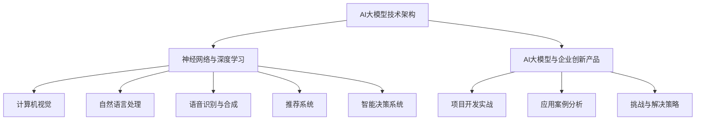

                 

### 文章标题

《如何利用AI大模型开发创新产品》

#### 关键词

AI大模型，创新产品开发，神经网络，深度学习，自然语言处理，计算机视觉，语音识别，智能决策，项目实战

#### 摘要

本文将深入探讨如何利用AI大模型开发创新产品。首先，我们将回顾AI大模型的发展背景与核心原理，分析其技术架构与关键技术。接着，我们将探讨AI大模型在不同领域的应用场景，如自然语言处理、计算机视觉、语音识别和推荐系统等。然后，我们将详细讲解AI大模型的开发流程，包括环境搭建、项目开发和实战。此外，我们将分析AI大模型在实际应用中面临的挑战，并提出相应的解决策略。最后，本文将提供一些最佳实践和拓展阅读，帮助读者深入了解AI大模型开发领域。

### 目录大纲

#### 第一部分: AI大模型概述与核心原理

##### 第1章: AI大模型概述与核心原理  
- 1.1 AI大模型的发展背景与趋势  
- 1.2 AI大模型的基本概念与分类  
- 1.3 AI大模型的关键技术概览  
- 1.4 AI大模型与企业创新产品的关系  
- 1.5 AI大模型的发展前景与挑战

##### 第2章: AI大模型的技术架构与原理  
- 2.1 AI大模型的基础架构  
- 2.2 人工智能算法原理讲解  
- 2.3 神经网络与深度学习基础  
- 2.4 深度学习框架的使用  
- 2.5 大模型训练与优化的核心技术

##### 第3章: AI大模型在创新产品中的应用场景  
- 3.1 AI大模型在自然语言处理中的应用  
- 3.2 AI大模型在计算机视觉中的应用  
- 3.3 AI大模型在语音识别与合成中的应用  
- 3.4 AI大模型在推荐系统中的应用  
- 3.5 AI大模型在智能决策系统中的应用

#### 第二部分: AI大模型开发与实战

##### 第4章: AI大模型开发环境搭建  
- 4.1 硬件配置与选择  
- 4.2 软件安装与配置  
- 4.3 开发工具与库的使用  
- 4.4 数据处理与准备  
- 4.5 实例：搭建一个AI大模型开发环境

##### 第5章: AI大模型项目开发实战  
- 5.1 项目规划与需求分析  
- 5.2 数据采集与预处理  
- 5.3 模型设计、训练与优化  
- 5.4 模型评估与调优  
- 5.5 模型部署与维护  
- 5.6 实例：开发一个基于AI大模型的智能问答系统

##### 第6章: AI大模型在创新产品中的应用案例分析  
- 6.1 案例一：智能医疗诊断系统  
- 6.2 案例二：智能金融风险管理平台  
- 6.3 案例三：智能教育辅助系统  
- 6.4 案例四：智能自动驾驶系统  
- 6.5 案例五：智能智能家居系统

##### 第7章: AI大模型开发中的挑战与解决策略  
- 7.1 数据隐私与安全  
- 7.2 模型可解释性与透明性  
- 7.3 模型过拟合与欠拟合  
- 7.4 资源消耗与能耗  
- 7.5 未来发展趋势与挑战

### 附录

#### 附录 A: AI大模型开发工具与资源  
- A.1 主流深度学习框架对比  
  - TensorFlow  
  - PyTorch  
  - JAX  
  - 其他框架简介  
- A.2 开发环境搭建指南  
- A.3 AI大模型常见问题与解答  
- A.4 AI大模型开源项目推荐

## Mermaid 流程图



### 第一部分：AI大模型概述与核心原理

#### 第1章: AI大模型概述与核心原理

##### 1.1 AI大模型的发展背景与趋势

人工智能（AI）作为计算机科学的一个重要分支，已经经历了数十年的发展。从早期的符号主义、知识表示，到基于规则的专家系统，再到近年来兴起的深度学习，人工智能在理论和实践上都取得了显著进展。特别是随着计算能力的提升、数据量的爆发性增长和算法的创新，AI技术逐渐从理论研究走向了实际应用。

AI大模型，也称为大规模人工智能模型，是指具有千亿甚至万亿参数的深度学习模型。这类模型通过在大量数据上进行训练，可以提取出复杂的数据特征，并实现出色的性能。例如，OpenAI的GPT-3模型拥有1750亿个参数，Google的BERT模型也拥有数百万个参数。

AI大模型的发展可以追溯到2006年的“深度学习革命”。Hinton等科学家通过提出深度信念网络（Deep Belief Networks）和深度卷积网络（Deep Convolutional Networks），使深度学习从理论走向了实际应用。近年来，随着计算能力的提升，GPU、TPU等专用硬件的出现，以及分布式训练技术的进步，AI大模型的研究和应用得到了进一步的发展。

在应用方面，AI大模型已经在自然语言处理、计算机视觉、语音识别、推荐系统等领域取得了显著的成果。例如，在自然语言处理领域，GPT-3模型可以生成高质量的文章、翻译文本、进行对话等；在计算机视觉领域，ResNet等模型在图像分类、目标检测等任务上已经超过了人类的性能；在语音识别领域，深度神经网络使得语音识别的准确率达到了前所未有的高度。

##### 1.2 AI大模型的基本概念与分类

AI大模型的基本概念可以从以下几个方面来理解：

- **参数规模**：AI大模型的参数规模通常是衡量其复杂度的重要指标。例如，GPT-3模型的参数规模达到了1750亿，远远超过了一般深度学习模型。

- **数据依赖**：AI大模型对数据量有很高的要求。因为只有在大规模的数据集上，模型才能提取出丰富的特征，从而提高模型的性能。

- **计算资源**：训练AI大模型需要大量的计算资源，尤其是GPU、TPU等专用硬件。此外，分布式训练技术也成为了AI大模型训练的重要手段。

- **应用领域**：AI大模型在不同领域有广泛的应用，包括自然语言处理、计算机视觉、语音识别、推荐系统、智能决策等。

根据参数规模和应用领域，AI大模型可以大致分为以下几类：

1. **大型通用模型**：这类模型具有非常高的参数规模，可以在多个领域进行应用。例如，OpenAI的GPT-3、Google的BERT等。

2. **领域专用模型**：这类模型针对特定的领域进行了优化，例如医疗领域的医疗诊断模型、金融领域的风险预测模型等。

3. **跨领域模型**：这类模型在多个领域都有一定的应用，但参数规模相对较小。例如，用于图像分类的模型也可以应用于自然语言处理中的文本分类任务。

##### 1.3 AI大模型的关键技术概览

AI大模型的发展离不开以下几个关键技术：

- **深度学习框架**：深度学习框架是训练AI大模型的重要工具，例如TensorFlow、PyTorch、JAX等。这些框架提供了高效的计算引擎、自动微分机制和大规模数据并行训练的能力。

- **分布式训练**：分布式训练技术可以将训练任务分布在多台机器上，从而提高训练效率。常见的分布式训练技术包括数据并行、模型并行和混合并行。

- **数据预处理**：数据预处理是AI大模型训练的重要环节。通过数据清洗、数据增强、特征提取等方法，可以提高模型训练的质量和效率。

- **超参数优化**：超参数优化是调整模型性能的重要手段。通过网格搜索、随机搜索、贝叶斯优化等方法，可以找到最优的超参数组合。

- **模型压缩**：模型压缩技术可以减少模型的参数规模，从而降低模型的计算复杂度和存储需求。常见的模型压缩技术包括剪枝、量化、蒸馏等。

##### 1.4 AI大模型与企业创新产品的关系

AI大模型为企业创新产品提供了强大的技术支撑。通过利用AI大模型，企业可以在多个领域实现创新，提升产品竞争力。以下是AI大模型在企业创新产品中的应用：

- **自然语言处理**：AI大模型可以用于文本生成、文本分类、机器翻译等任务，帮助企业实现智能客服、智能文档处理等应用。

- **计算机视觉**：AI大模型可以用于图像分类、目标检测、图像生成等任务，帮助企业实现智能安防、自动驾驶、智能医疗等应用。

- **语音识别与合成**：AI大模型可以用于语音识别、语音合成等任务，帮助企业实现智能语音助手、智能客服等应用。

- **推荐系统**：AI大模型可以用于推荐算法，帮助企业实现个性化推荐、智能营销等应用。

- **智能决策**：AI大模型可以用于预测分析、决策优化等任务，帮助企业实现智能供应链管理、智能风险控制等应用。

##### 1.5 AI大模型的发展前景与挑战

AI大模型作为当前人工智能领域的研究热点，具有广阔的发展前景。以下是AI大模型发展前景的一些方面：

- **技术突破**：随着计算能力的提升、算法的创新和数据的积累，AI大模型的技术将不断突破，实现更高的性能和更广泛的应用。

- **跨领域应用**：AI大模型在不同领域的应用将越来越广泛，如医疗、金融、教育、工业等，实现真正的跨领域智能化。

- **社会影响**：AI大模型将深刻影响人类社会的方方面面，如教育、医疗、交通、娱乐等，带来新的机遇和挑战。

然而，AI大模型的发展也面临着一些挑战：

- **数据隐私与安全**：AI大模型对数据量有很高的要求，如何在保障数据隐私和安全的前提下，充分利用数据成为一大挑战。

- **模型可解释性与透明性**：AI大模型通常被视为“黑盒”，其决策过程难以解释。如何提高模型的可解释性和透明性，使其更易于理解和接受，是当前研究的热点。

- **资源消耗与能耗**：训练AI大模型需要大量的计算资源，如何优化模型的计算效率和降低能耗，成为了一个亟待解决的问题。

- **伦理与道德**：AI大模型的广泛应用也引发了一系列伦理和道德问题，如算法偏见、隐私侵犯等。如何制定相应的伦理和道德规范，确保AI大模型的安全和可靠，是一个重要的议题。

总之，AI大模型的发展前景广阔，但也面临着诸多挑战。通过不断的技术创新和规范制定，我们有理由相信，AI大模型将在未来发挥更加重要的作用。

### 第2章: AI大模型的技术架构与原理

##### 2.1 AI大模型的基础架构

AI大模型的基础架构主要由以下几个部分组成：计算资源、数据存储和处理系统、深度学习框架以及模型训练和优化的算法。

**计算资源**：训练AI大模型需要大量的计算资源，尤其是GPU（图形处理单元）和TPU（张量处理单元）等专用硬件。这些硬件能够提供高效的并行计算能力，加速模型的训练过程。为了进一步优化计算资源的使用，分布式训练技术被广泛应用。分布式训练通过将训练任务分布在多台机器上，可以显著提高训练效率。常见的分布式训练策略包括数据并行、模型并行和混合并行。

**数据存储和处理系统**：AI大模型对数据量有很高的要求，因此需要一个高效的数据存储和处理系统。数据存储系统需要具备海量存储能力、低延迟和高吞吐量等特点，以便于快速读取和写入数据。常见的存储系统包括分布式文件系统（如HDFS）、对象存储系统（如Amazon S3）和数据库（如HBase、MongoDB）等。数据处理系统则负责对数据进行清洗、预处理和特征提取，以便于模型训练。常见的数据处理系统包括Apache Spark、Flink等。

**深度学习框架**：深度学习框架是训练AI大模型的重要工具，如TensorFlow、PyTorch、JAX等。这些框架提供了丰富的API和工具，使得模型的定义、训练、优化和部署变得更加简单和高效。深度学习框架通常具备以下特点：

- **动态计算图**：深度学习框架使用动态计算图来表示模型的计算过程。这种计算图可以灵活地表示复杂的模型结构和计算操作。

- **自动微分**：自动微分是深度学习框架的核心功能之一，它能够自动计算模型在训练过程中的梯度信息，从而实现模型的优化。

- **分布式训练支持**：深度学习框架通常支持分布式训练，通过将训练任务分布在多台机器上，可以显著提高训练效率。

- **端到端部署**：深度学习框架不仅支持模型训练，还支持模型的部署，可以将训练好的模型部署到不同的设备和平台上。

**模型训练和优化的算法**：AI大模型的训练和优化是一个复杂的过程，涉及多个算法和技巧。以下是几个关键的训练和优化算法：

- **优化算法**：优化算法是用于调整模型参数，使其在训练数据上表现更好的算法。常见的优化算法包括随机梯度下降（SGD）、Adam、RMSprop等。

- **批量大小**：批量大小是指每次训练过程中使用的样本数量。批量大小会影响模型的收敛速度和性能。小批量训练可以提高模型的泛化能力，但训练速度较慢；大批量训练可以提高训练速度，但可能导致模型过拟合。

- **学习率调整**：学习率是优化算法中的一个关键参数，它决定了模型参数更新的幅度。学习率过大可能导致模型无法收敛，过小则可能收敛速度过慢。常用的学习率调整方法包括固定学习率、学习率衰减、学习率周期性调整等。

- **正则化技术**：正则化技术用于防止模型过拟合。常见的正则化技术包括L1正则化、L2正则化、Dropout等。

##### 2.2 人工智能算法原理讲解

人工智能算法可以分为两大类：监督学习、无监督学习和强化学习。每种算法都有其特定的原理和应用场景。

**监督学习**：监督学习是一种有标签数据的训练方法，通过学习输入和输出之间的映射关系，从而实现预测或分类任务。监督学习算法的核心是损失函数和优化算法。常见的监督学习算法包括线性回归、逻辑回归、支持向量机（SVM）、决策树、随机森林、梯度提升树（GBDT）等。

- **线性回归**：线性回归是一种最简单的监督学习算法，通过学习输入和输出之间的线性关系来实现预测。线性回归的损失函数通常是均方误差（MSE），优化算法为最小二乘法。

- **逻辑回归**：逻辑回归是一种广义线性模型，用于实现二分类任务。逻辑回归的损失函数是逻辑损失，优化算法通常使用梯度下降法。

- **支持向量机（SVM）**：SVM是一种基于间隔最大化原理的分类算法，通过找到最佳的超平面来划分数据。SVM的损失函数是Hinge损失，优化算法是二次规划。

- **决策树**：决策树是一种基于特征值划分数据的树形模型，每个节点代表一个特征，每个分支代表一个特征值。决策树的损失函数可以是信息增益、基尼不纯度等，优化算法是递归划分。

- **随机森林**：随机森林是一种集成学习算法，通过构建多棵决策树并投票来提高模型的预测能力。随机森林的损失函数是基尼不纯度，优化算法是随机抽样和特征选择。

- **梯度提升树（GBDT）**：GBDT是一种基于决策树的集成学习算法，通过迭代构建多棵决策树，每棵树都基于前一棵树的残差进行优化。GBDT的损失函数是回归损失，优化算法是梯度提升。

**无监督学习**：无监督学习是一种没有标签数据的训练方法，主要用于发现数据中的隐藏结构和模式。常见的无监督学习算法包括聚类、降维、关联规则学习等。

- **聚类算法**：聚类算法通过将相似的数据点划分为同一类别，从而实现数据分组。常见的聚类算法包括K均值聚类、层次聚类、DBSCAN等。

- **降维算法**：降维算法通过降低数据维度，从而减少计算复杂度和提高模型性能。常见的降维算法包括主成分分析（PCA）、线性判别分析（LDA）、t-SNE等。

- **关联规则学习**：关联规则学习通过发现数据中的频繁模式，从而揭示数据之间的关联关系。常见的关联规则学习算法包括Apriori算法、FP-Growth算法等。

**强化学习**：强化学习是一种通过试错和反馈来学习最优策略的算法。在强化学习中，智能体通过与环境交互，不断调整其行为策略，以实现最大化回报。常见的强化学习算法包括Q学习、SARSA、DQN等。

- **Q学习**：Q学习是一种基于值函数的强化学习算法，通过学习状态-动作值函数，从而选择最优的动作。Q学习的损失函数是Q值误差，优化算法是梯度下降。

- **SARSA**：SARSA是一种基于策略的强化学习算法，通过学习状态-动作值函数，从而调整策略。SARSA的损失函数是策略梯度，优化算法是梯度上升。

- **DQN**：DQN是一种基于深度神经网络的强化学习算法，通过学习深度Q网络，从而预测状态-动作值函数。DQN的损失函数是Q值误差，优化算法是经验回放和目标网络。

##### 2.3 神经网络与深度学习基础

神经网络（Neural Networks）是人工智能的核心组成部分，其灵感来源于生物神经系统的结构和功能。神经网络由多个神经元（也称为节点）组成，每个神经元都与相邻的神经元通过权重相连接。在训练过程中，神经网络通过不断调整权重，以实现从输入到输出的映射。

**神经网络的基本概念**

- **神经元**：神经元是神经网络的基本构建单元，类似于生物神经系统的神经元。每个神经元包含一个输入层、一个激活函数和一个输出层。输入层接收外部输入信号，激活函数对输入信号进行非线性变换，输出层产生最终的输出。

- **权重**：权重是神经元之间连接的强度，用于控制输入信号对输出信号的影响。在训练过程中，通过优化算法调整权重，以最小化损失函数。

- **激活函数**：激活函数用于引入非线性特性，使得神经网络能够模拟复杂函数。常见的激活函数包括sigmoid函数、ReLU函数、Tanh函数等。

- **层数和节点数**：神经网络包括输入层、隐藏层和输出层。隐藏层的数量和每个隐藏层的节点数可以根据任务需求进行调整。

**深度学习的基本概念**

深度学习（Deep Learning）是指具有多层神经网络的机器学习模型。与传统的单层神经网络相比，深度学习模型具有更强的表示能力和泛化能力。深度学习模型通常通过多个隐藏层将输入映射到输出，从而提取更高层次的特征。

- **多层感知机（MLP）**：多层感知机是一种最简单的深度学习模型，包括输入层、一个或多个隐藏层和输出层。通过多层感知机，可以将输入映射到输出，实现分类或回归任务。

- **卷积神经网络（CNN）**：卷积神经网络是一种专门用于处理图像数据的深度学习模型。通过卷积层、池化层和全连接层等结构，CNN可以提取图像中的局部特征，实现图像分类、目标检测等任务。

- **循环神经网络（RNN）**：循环神经网络是一种用于处理序列数据的深度学习模型。通过引入循环结构，RNN可以保留序列中的长期依赖关系，实现自然语言处理、语音识别等任务。

- **长短时记忆网络（LSTM）**：长短时记忆网络是RNN的一种变体，通过引入门控结构，解决了RNN在处理长序列数据时的梯度消失和梯度爆炸问题。LSTM在自然语言处理、语音识别等领域具有广泛的应用。

**神经网络的工作原理**

神经网络通过以下步骤进行工作：

1. **前向传播**：输入数据从输入层传播到隐藏层，再从隐藏层传播到输出层。在每个层中，输入信号通过权重与激活函数的运算，产生输出信号。

2. **反向传播**：计算输出层的预测误差，然后通过反向传播算法，将误差反向传播到隐藏层和输入层。反向传播过程中，计算每个神经元的梯度，用于更新权重。

3. **权重更新**：根据梯度信息，通过优化算法（如梯度下降）调整权重，以最小化损失函数。

4. **迭代训练**：重复前向传播和反向传播过程，直到满足停止条件（如收敛或达到最大迭代次数）。

##### 2.4 深度学习框架的使用

深度学习框架是用于构建、训练和部署深度学习模型的重要工具。常见的深度学习框架包括TensorFlow、PyTorch、JAX等。以下将介绍这些框架的基本使用方法。

**TensorFlow**

TensorFlow是由Google开发的一个开源深度学习框架，具有广泛的社区支持和丰富的文档。以下是TensorFlow的基本使用方法：

1. **环境搭建**：首先，需要安装TensorFlow。可以使用pip命令安装：

   ```bash
   pip install tensorflow
   ```

2. **导入模块**：在Python代码中导入TensorFlow模块：

   ```python
   import tensorflow as tf
   ```

3. **创建计算图**：TensorFlow使用计算图来表示模型的计算过程。计算图由操作（Op）和变量组成。以下是一个简单的计算图示例：

   ```python
   a = tf.constant(5)
   b = tf.constant(6)
   c = tf.add(a, b)
   ```

4. **执行计算**：使用会话（Session）来执行计算图。以下是一个简单的执行示例：

   ```python
   with tf.Session() as sess:
       result = sess.run(c)
       print(result)  # 输出：11
   ```

5. **模型训练**：使用TensorFlow中的API构建深度学习模型，并进行训练。以下是一个简单的模型训练示例：

   ```python
   model = tf.keras.Sequential([
       tf.keras.layers.Dense(128, activation='relu', input_shape=(784,)),
       tf.keras.layers.Dense(10, activation='softmax')
   ])

   model.compile(optimizer='adam',
                 loss='categorical_crossentropy',
                 metrics=['accuracy'])

   model.fit(x_train, y_train, epochs=5)
   ```

**PyTorch**

PyTorch是由Facebook开发的一个开源深度学习框架，以其动态计算图和简洁的API而受到广泛欢迎。以下是PyTorch的基本使用方法：

1. **环境搭建**：首先，需要安装PyTorch。可以使用pip命令安装：

   ```bash
   pip install torch torchvision
   ```

2. **导入模块**：在Python代码中导入PyTorch模块：

   ```python
   import torch
   import torchvision
   ```

3. **创建模型**：使用PyTorch的nn.Module类来创建深度学习模型。以下是一个简单的模型示例：

   ```python
   class SimpleModel(torch.nn.Module):
       def __init__(self):
           super(SimpleModel, self).__init__()
           self.fc1 = torch.nn.Linear(784, 128)
           self.fc2 = torch.nn.Linear(128, 10)

       def forward(self, x):
           x = torch.relu(self.fc1(x))
           x = self.fc2(x)
           return x

   model = SimpleModel()
   ```

4. **模型训练**：使用PyTorch的自动微分机制进行模型训练。以下是一个简单的模型训练示例：

   ```python
   optimizer = torch.optim.Adam(model.parameters(), lr=0.001)
   criterion = torch.nn.CrossEntropyLoss()

   for epoch in range(5):
       for inputs, targets in data_loader:
           optimizer.zero_grad()
           outputs = model(inputs)
           loss = criterion(outputs, targets)
           loss.backward()
           optimizer.step()
   ```

**JAX**

JAX是由Google开发的一个开源深度学习框架，以其自动微分和高性能计算能力而受到关注。以下是JAX的基本使用方法：

1. **环境搭建**：首先，需要安装JAX和相关的依赖库。可以使用pip命令安装：

   ```bash
   pip install jax jaxlib numpy
   ```

2. **导入模块**：在Python代码中导入JAX模块：

   ```python
   import jax
   import jax.numpy as jnp
   ```

3. **创建模型**：使用JAX的`jax.nn`模块来创建深度学习模型。以下是一个简单的模型示例：

   ```python
   from jax import nn

   def simple_model(x):
       x = nn.relu(nn.Dense(128)(x))
       x = nn.Dense(10)(x)
       return x

   x = jnp.array([1.0, 2.0, 3.0])
   params = {"W": jnp.array([1.0, 2.0, 3.0]), "b": jnp.array([4.0, 5.0, 6.0])}
   output = simple_model(x, params)
   ```

4. **模型训练**：使用JAX的自动微分机制进行模型训练。以下是一个简单的模型训练示例：

   ```python
   from jax import grad

   loss_fn = jax.nn.softmax_cross_entropy
   opt_init, opt_update, get_params = jax.optimizers.adam(1e-3)

   grads = grad(loss_fn)(params, x, y)
   updates = opt_update(i, grads)
   params = opt_state = get_params(updates)
   ```

通过以上介绍，可以看出深度学习框架在构建、训练和部署深度学习模型方面的强大能力。选择合适的深度学习框架，可以极大地提高开发效率，实现高效的模型训练和应用。

##### 2.5 大模型训练与优化的核心技术

训练和优化大模型是一个复杂的过程，需要运用多种技术和策略。以下将介绍大模型训练与优化中的几个核心技术。

**数据预处理**

数据预处理是训练大模型的关键步骤，直接影响到模型的质量和训练效率。以下是一些常用的数据预处理技术：

- **数据清洗**：去除数据中的噪声和异常值，保证数据的质量。例如，去除缺失值、填补缺失值、去除重复数据等。

- **数据增强**：通过数据增强技术，可以增加数据的多样性，防止模型过拟合。常见的数据增强方法包括随机裁剪、旋转、翻转、缩放等。

- **数据标准化**：将数据缩放到相同的范围，使模型能够更好地学习数据的特征。常用的标准化方法包括均值标准化和方差标准化。

- **数据批量划分**：将数据划分为训练集、验证集和测试集，用于模型训练、验证和测试。通常，训练集用于训练模型，验证集用于调整模型参数，测试集用于评估模型的性能。

**分布式训练**

分布式训练是训练大模型的重要手段，可以将训练任务分布在多台机器上，从而提高训练效率。以下是一些常用的分布式训练技术：

- **数据并行**：将训练数据划分为多个子集，每个子集由不同的GPU或CPU处理。在计算梯度时，将不同子集的梯度进行求和，从而实现全局梯度的更新。

- **模型并行**：将大模型拆分为多个子模型，每个子模型由不同的GPU或CPU处理。在计算梯度时，将不同子模型的梯度进行求和，从而实现全局梯度的更新。

- **混合并行**：结合数据并行和模型并行，将训练任务分布在多台机器上，从而提高训练效率。例如，可以将模型并行与数据并行结合，将模型拆分为多个子模型，并将数据划分为多个子集。

**优化算法**

优化算法用于调整模型参数，使其在训练数据上表现更好。以下是一些常用的优化算法：

- **随机梯度下降（SGD）**：SGD是最简单的优化算法，每次迭代使用一个样本的梯度进行参数更新。SGD的计算复杂度较低，但在大规模数据集上训练效率较低。

- **动量（Momentum）**：动量算法在每次迭代中，将前一次的梯度方向作为当前梯度的一个修正方向，从而提高收敛速度。动量算法能够缓解梯度的波动，使模型更加稳定。

- **AdaGrad和AdaDelta**：AdaGrad和AdaDelta是自适应学习率优化算法，根据每个参数的梯度大小自适应调整学习率。这些算法可以避免学习率过大或过小的问题，提高模型的训练效率。

- **Adam**：Adam是结合SGD和动量的优化算法，同时考虑一阶矩估计和二阶矩估计，自适应调整学习率。Adam在训练大模型时表现出色，是当前最常用的优化算法之一。

**正则化技术**

正则化技术用于防止模型过拟合，提高模型的泛化能力。以下是一些常用的正则化技术：

- **L1正则化**：L1正则化通过在损失函数中添加L1范数项，惩罚模型参数的绝对值。L1正则化可以促进模型参数稀疏化，减少模型的复杂度。

- **L2正则化**：L2正则化通过在损失函数中添加L2范数项，惩罚模型参数的平方和。L2正则化可以平滑模型参数，减少模型的波动。

- **Dropout**：Dropout是一种在训练过程中随机丢弃部分神经元的方法，从而降低模型的复杂度。Dropout可以防止模型过拟合，提高模型的泛化能力。

- **权重衰减（Weight Decay）**：权重衰减是L2正则化的另一种实现方式，通过在损失函数中添加权重项的L2范数，实现正则化。

通过以上技术，可以有效地训练和优化大模型，提高模型的性能和泛化能力。然而，训练大模型仍然面临着计算资源消耗大、训练时间长等挑战，需要不断探索新的技术和方法来提高训练效率。

### 第3章: AI大模型在创新产品中的应用场景

AI大模型在创新产品中的应用场景非常广泛，涵盖了自然语言处理、计算机视觉、语音识别、推荐系统和智能决策等多个领域。以下将详细探讨AI大模型在这些领域的应用。

##### 3.1 AI大模型在自然语言处理中的应用

自然语言处理（NLP）是AI大模型的一个重要应用领域。AI大模型在NLP中的主要任务包括文本生成、文本分类、机器翻译、情感分析等。

- **文本生成**：AI大模型如OpenAI的GPT-3具有强大的文本生成能力。通过在大量文本数据上进行训练，GPT-3可以生成高质量的文章、对话、摘要等。例如，GPT-3可以用于自动写作、内容生成和智能客服等领域。

- **文本分类**：AI大模型可以用于文本分类任务，将文本数据划分为不同的类别。例如，可以用于垃圾邮件过滤、新闻分类、情感分析等。通过在大量标注数据上进行训练，大模型可以提取文本中的关键特征，实现高精度的文本分类。

- **机器翻译**：AI大模型如BERT、GPT-3等在机器翻译领域也取得了显著成果。通过在大量双语文本数据上进行训练，大模型可以学习源语言和目标语言之间的映射关系，实现高质量的双向翻译。例如，谷歌翻译和百度翻译等应用都使用了AI大模型来实现机器翻译功能。

- **情感分析**：AI大模型可以用于情感分析任务，判断文本的情感极性。例如，可以用于社交媒体舆情分析、客户反馈分析等。通过在大量标注数据上进行训练，大模型可以学习情感表达的规律，实现高精度的情感分类。

##### 3.2 AI大模型在计算机视觉中的应用

计算机视觉是AI大模型的另一个重要应用领域。AI大模型在计算机视觉中的主要任务包括图像分类、目标检测、图像生成等。

- **图像分类**：AI大模型如ResNet、Inception等在图像分类任务上表现优异。通过在大量图像数据上进行训练，大模型可以学习图像中的高级特征，实现高精度的图像分类。例如，可以用于图像识别、医疗影像诊断、自动驾驶等领域。

- **目标检测**：AI大模型如YOLO、Faster R-CNN等在目标检测任务上取得了突破性成果。通过在大量标注数据上进行训练，大模型可以学习图像中的目标特征，实现高精度的目标检测。例如，可以用于智能安防、自动驾驶、机器人视觉等领域。

- **图像生成**：AI大模型如GAN（生成对抗网络）可以用于图像生成任务。通过在大量图像数据上进行训练，大模型可以生成高质量的图像。例如，可以用于图像修复、图像增强、风格迁移等。

##### 3.3 AI大模型在语音识别与合成中的应用

语音识别与合成是AI大模型的另一个重要应用领域。AI大模型在语音识别与合成中的主要任务包括语音识别、语音合成、语音转换等。

- **语音识别**：AI大模型如CTC（连接主义时序分类器）、Seq2Seq等在语音识别任务上取得了显著成果。通过在大量语音数据上进行训练，大模型可以学习语音和文本之间的映射关系，实现高精度的语音识别。例如，可以用于智能客服、语音助手、实时字幕等。

- **语音合成**：AI大模型如WaveNet、Tacotron等在语音合成任务上表现优异。通过在大量语音数据上进行训练，大模型可以生成自然、流畅的语音。例如，可以用于智能语音助手、车载语音系统、语音广播等。

- **语音转换**：AI大模型可以用于语音转换任务，将一种语音转换为另一种语音。例如，可以将普通话转换为粤语、英语等。通过在大量语音数据上进行训练，大模型可以学习语音特征，实现高质量的语音转换。

##### 3.4 AI大模型在推荐系统中的应用

推荐系统是AI大模型的重要应用领域之一。AI大模型在推荐系统中的主要任务包括用户画像、商品推荐、内容推荐等。

- **用户画像**：AI大模型可以用于构建用户画像，分析用户的兴趣、行为和需求。通过在大量用户数据上进行训练，大模型可以提取用户的特征，实现精准的用户画像。例如，可以用于电子商务平台、社交媒体、在线教育等领域。

- **商品推荐**：AI大模型可以用于商品推荐任务，根据用户的兴趣和行为，推荐相关的商品。通过在大量商品数据和使用数据上进行训练，大模型可以学习用户与商品之间的关系，实现高精度的商品推荐。例如，可以用于电商平台、视频网站、音乐平台等。

- **内容推荐**：AI大模型可以用于内容推荐任务，根据用户的历史行为和兴趣，推荐相关的内容。通过在大量内容数据和使用数据上进行训练，大模型可以学习用户与内容之间的关系，实现高质量的内容推荐。例如，可以用于新闻网站、社交媒体、在线视频平台等。

##### 3.5 AI大模型在智能决策系统中的应用

智能决策系统是AI大模型的重要应用领域之一。AI大模型在智能决策系统中的主要任务包括预测分析、决策优化、风险管理等。

- **预测分析**：AI大模型可以用于预测分析任务，预测未来的趋势和变化。通过在大量历史数据上进行训练，大模型可以学习数据中的规律和模式，实现高精度的预测分析。例如，可以用于金融市场预测、需求预测、供应链管理等领域。

- **决策优化**：AI大模型可以用于决策优化任务，根据目标和约束条件，找到最优的决策方案。通过在大量决策数据上进行训练，大模型可以学习决策变量之间的关系，实现高效的决策优化。例如，可以用于物流调度、资源分配、生产计划等领域。

- **风险管理**：AI大模型可以用于风险管理任务，识别和评估风险，并提出相应的风险管理策略。通过在大量风险数据和历史数据上进行训练，大模型可以学习风险特征，实现精准的风险管理。例如，可以用于金融机构的风险管理、网络安全管理、灾害预警等领域。

总之，AI大模型在自然语言处理、计算机视觉、语音识别、推荐系统和智能决策等领域的应用非常广泛，正在不断推动各行业的技术创新和业务变革。通过深入研究和应用AI大模型，我们可以创造更加智能、高效和创新的产品和服务。

### 第4章: AI大模型开发环境搭建

AI大模型的开发过程涉及到大量的计算资源、软件工具和开发环境配置。本章将详细讲解AI大模型开发环境的搭建，包括硬件配置与选择、软件安装与配置、开发工具与库的使用以及数据处理与准备。

##### 4.1 硬件配置与选择

AI大模型训练过程需要大量的计算资源，尤其是GPU和存储资源。以下是一些关键硬件配置与选择的建议：

- **GPU**：GPU是训练AI大模型的关键硬件，特别是使用深度学习框架时。NVIDIA的GPU具有出色的并行计算能力，适合用于训练AI大模型。推荐选择具有较高计算性能和较大内存容量的GPU，如NVIDIA Titan V、RTX 3090或A100等。

- **CPU**：虽然GPU是主要的计算资源，但CPU在数据处理和预处理过程中仍然扮演重要角色。选择高性能的CPU，如Intel Xeon系列或AMD EPYC系列，可以提高整体计算效率。

- **存储**：AI大模型训练需要大量的存储空间，推荐使用高速SSD或NVMe存储，以提高数据读写速度。此外，可以考虑使用分布式存储系统，如HDFS或Ceph，以实现大规模数据存储和访问。

- **内存**：内存大小直接影响模型训练的速度和效果。对于AI大模型，推荐使用至少32GB的内存，以便于同时处理大量数据和模型。

- **网络**：高速网络对于分布式训练和模型共享非常重要。推荐使用千兆以太网或10Gbps网络，以确保数据传输的高效和稳定。

##### 4.2 软件安装与配置

在硬件配置完成后，需要安装和配置相关的软件，以确保AI大模型开发环境正常运行。以下是一些关键软件的安装与配置步骤：

- **操作系统**：推荐使用Linux操作系统，如Ubuntu或CentOS。Linux操作系统具有更好的兼容性和稳定性，适合用于大规模数据处理和模型训练。

- **深度学习框架**：安装常用的深度学习框架，如TensorFlow、PyTorch和JAX。以下是一个简单的安装步骤：

  ```bash
  # 安装TensorFlow
  pip install tensorflow
  
  # 安装PyTorch
  pip install torch torchvision
  
  # 安装JAX
  pip install jax jaxlib numpy
  ```

- **计算资源管理**：安装和配置计算资源管理工具，如NVIDIA Docker和Docker。以下是一个简单的安装步骤：

  ```bash
  # 安装NVIDIA Docker
  pip install nvidia-docker
  
  # 安装Docker
  sudo apt-get update
  sudo apt-get install docker-ce docker-ce-cli containerd.io
  
  # 启动Docker服务
  sudo systemctl start docker
  ```

- **其他工具**：安装其他常用的开发工具和库，如Git、Jupyter Notebook、Numpy、Pandas等。以下是一个简单的安装步骤：

  ```bash
  # 安装Git
  sudo apt-get install git
  
  # 安装Jupyter Notebook
  pip install notebook
  
  # 安装Numpy和Pandas
  pip install numpy pandas
  ```

##### 4.3 开发工具与库的使用

在安装和配置好开发环境后，需要熟悉并掌握常用的开发工具和库，以提高开发效率和代码质量。以下是一些常用的开发工具和库：

- **Jupyter Notebook**：Jupyter Notebook是一种交互式开发环境，适用于编写、运行和调试代码。通过Jupyter Notebook，可以方便地进行数据可视化、交互式计算和代码调试。

- **Python库**：Python是AI大模型开发的主要编程语言，拥有丰富的库和框架。以下是一些常用的Python库：

  - TensorFlow：用于构建、训练和部署深度学习模型。
  - PyTorch：用于构建、训练和部署深度学习模型。
  - JAX：用于构建、训练和部署深度学习模型，具有自动微分和高性能计算能力。
  - NumPy：用于数值计算和数据处理。
  - Pandas：用于数据处理和分析。
  - Matplotlib和Seaborn：用于数据可视化和图形绘制。

- **版本控制**：使用Git进行版本控制，可以方便地管理代码的版本和协作开发。

- **代码编辑器**：选择一款适合自己的代码编辑器，如Visual Studio Code、PyCharm等，可以提高开发效率和代码质量。

##### 4.4 数据处理与准备

在搭建好AI大模型开发环境后，数据处理和准备是模型训练的重要环节。以下是一些数据处理和准备的关键步骤：

- **数据清洗**：清洗数据，去除噪声和异常值，保证数据的质量。例如，去除缺失值、填补缺失值、去除重复数据等。

- **数据增强**：通过数据增强技术，增加数据的多样性，防止模型过拟合。例如，随机裁剪、旋转、翻转、缩放等。

- **数据标准化**：将数据缩放到相同的范围，使模型能够更好地学习数据的特征。例如，均值标准化和方差标准化。

- **数据划分**：将数据划分为训练集、验证集和测试集，用于模型训练、验证和测试。通常，训练集用于训练模型，验证集用于调整模型参数，测试集用于评估模型的性能。

- **数据加载**：使用深度学习框架的API，将数据加载到内存中，并进行预处理。例如，使用TensorFlow的`tf.data` API，可以方便地加载和预处理数据。

##### 4.5 实例：搭建一个AI大模型开发环境

以下是一个简单的实例，展示如何搭建一个AI大模型开发环境：

1. **安装操作系统**：安装Ubuntu 20.04操作系统。

2. **安装硬件驱动**：安装NVIDIA显卡驱动，确保GPU可以正常工作。

3. **安装深度学习框架**：安装TensorFlow、PyTorch和JAX。

   ```bash
   pip install tensorflow pytorch jax jaxlib numpy
   ```

4. **配置计算资源管理**：安装NVIDIA Docker和Docker。

   ```bash
   pip install nvidia-docker
   sudo apt-get update
   sudo apt-get install docker-ce docker-ce-cli containerd.io
   sudo systemctl start docker
   ```

5. **安装其他工具**：安装Git、Jupyter Notebook、Numpy、Pandas等。

   ```bash
   sudo apt-get install git
   pip install notebook numpy pandas
   ```

6. **启动Jupyter Notebook**：启动Jupyter Notebook，进行交互式开发。

   ```bash
   jupyter notebook
   ```

通过以上步骤，可以搭建一个基本的AI大模型开发环境。在实际开发过程中，可以根据项目需求，进一步优化和扩展开发环境。

### 第5章: AI大模型项目开发实战

AI大模型的开发是一个系统化的过程，涉及到多个阶段，包括项目规划与需求分析、数据采集与预处理、模型设计、训练与优化、模型评估与调优、模型部署与维护。以下将详细描述这些阶段，并通过一个实例展示如何开发一个基于AI大模型的智能问答系统。

##### 5.1 项目规划与需求分析

项目规划与需求分析是项目开发的第一步，它决定了项目成功的方向和关键因素。在这个阶段，我们需要明确以下关键内容：

- **项目目标**：明确项目要解决的问题和达到的目标。例如，开发一个基于AI大模型的智能问答系统，旨在提供快速、准确的回答用户问题的能力。

- **用户需求**：了解用户的需求和痛点，确定系统的功能和性能要求。例如，用户希望系统能够支持自然语言输入，能够理解并回答各种类型的问题。

- **技术需求**：确定项目所需的技术栈和资源。例如，需要使用深度学习框架如TensorFlow或PyTorch来构建和训练AI大模型，需要高性能的GPU来支持模型训练。

- **时间线和里程碑**：制定项目的时间线和关键里程碑，确保项目能够按计划推进。例如，可以分为数据收集阶段、模型训练阶段、模型优化阶段和部署阶段。

- **资源分配**：确定项目所需的资源，包括人力、资金、设备等。例如，需要配置高性能的GPU服务器、招聘数据科学家和软件开发工程师等。

##### 5.2 数据采集与预处理

数据采集与预处理是AI大模型开发的重要环节，它直接影响模型的质量和性能。以下是一些关键步骤：

- **数据来源**：确定数据来源，包括公开数据集、自有数据集或第三方数据服务。例如，可以使用公开的问答数据集如TREC QABE，或收集企业内部用户的问题和回答数据。

- **数据收集**：通过爬虫、API接口、手动录入等方式收集数据。例如，可以使用Python的Scrapy库进行网页数据的爬取，或通过API接口获取第三方数据服务的数据。

- **数据清洗**：清洗数据，去除噪声和异常值，保证数据的质量。例如，去除HTML标签、处理文本中的标点符号、去除重复数据等。

- **数据标注**：对数据进行标注，为模型训练提供标签。例如，对于问答数据，可以为每个问题标注对应的答案。

- **数据增强**：通过数据增强技术，增加数据的多样性，防止模型过拟合。例如，可以采用随机裁剪、旋转、翻转等图像增强技术，或采用同义词替换、随机删除词语等文本增强技术。

- **数据划分**：将数据划分为训练集、验证集和测试集，用于模型训练、验证和测试。通常，训练集用于训练模型，验证集用于调整模型参数，测试集用于评估模型的性能。

- **数据预处理**：对数据进行预处理，包括文本向量化、图像预处理等。例如，可以使用Word2Vec、BERT等模型将文本数据转换为向量表示，使用图像处理库如OpenCV对图像数据进行处理。

##### 5.3 模型设计、训练与优化

模型设计、训练与优化是AI大模型开发的核心步骤，决定了模型的性能和泛化能力。以下是一些关键步骤：

- **模型设计**：根据项目需求和技术栈，选择合适的模型结构和参数。例如，对于问答系统，可以选择Transformer、BERT等预训练模型，并对其进行微调。

- **模型训练**：使用训练集对模型进行训练，通过优化算法（如SGD、Adam等）调整模型参数，使其在训练数据上表现更好。训练过程中，需要监控模型的损失函数和准确率，以评估模型的性能。

- **模型优化**：通过调整超参数（如学习率、批量大小、正则化参数等）和优化算法，优化模型的性能。例如，可以使用学习率衰减、批量归一化等技术来提高模型的收敛速度和性能。

- **模型评估**：使用验证集对模型进行评估，评估模型的泛化能力和性能。常见的评估指标包括准确率、召回率、F1分数等。

- **模型调优**：根据评估结果，对模型进行进一步的调优，以提高模型的性能。例如，可以尝试不同的优化算法、正则化技术、数据增强方法等。

##### 5.4 模型评估与调优

模型评估与调优是确保模型在实际应用中表现良好的关键步骤。以下是一些关键步骤：

- **模型评估**：使用测试集对模型进行最终评估，评估模型的性能和泛化能力。常见的评估指标包括准确率、召回率、F1分数等。

- **模型调优**：根据评估结果，对模型进行进一步的调优，以提高模型的性能。例如，可以尝试调整超参数、添加正则化技术、使用不同的数据增强方法等。

- **交叉验证**：使用交叉验证技术，对模型进行多次评估，以验证模型的稳定性和可靠性。

- **模型集成**：将多个模型进行集成，以提高模型的性能和泛化能力。例如，可以使用投票法、加权平均法等集成方法。

- **模型压缩**：通过模型压缩技术，减少模型的参数规模和计算复杂度，以提高模型的部署效率。例如，可以使用剪枝、量化、蒸馏等技术。

##### 5.5 模型部署与维护

模型部署与维护是AI大模型应用的关键步骤，确保模型能够稳定运行并在实际应用中持续优化。以下是一些关键步骤：

- **模型部署**：将训练好的模型部署到生产环境，例如使用TensorFlow Serving、PyTorch Serving等模型部署工具。部署过程中，需要确保模型的可扩展性和高可用性。

- **性能监控**：监控模型的运行性能，包括响应时间、吞吐量、准确率等。通过性能监控，可以及时发现并解决模型运行中的问题。

- **自动化更新**：定期更新模型，以适应新的数据和需求。例如，可以采用在线学习技术，在模型运行过程中不断更新模型参数。

- **故障恢复**：建立故障恢复机制，确保模型在遇到故障时能够快速恢复。例如，可以采用冗余部署、自动备份等技术。

- **安全防护**：确保模型的安全防护，防止数据泄露和恶意攻击。例如，可以采用数据加密、访问控制等技术。

##### 5.6 实例：开发一个基于AI大模型的智能问答系统

以下是一个基于AI大模型的智能问答系统的开发实例：

**1. 项目规划与需求分析**：

- 项目目标：开发一个能够理解并回答各种类型问题的智能问答系统。

- 用户需求：支持自然语言输入，能够理解并回答各种类型的问题，如事实性问题、解释性问题、主观性问题等。

- 技术需求：使用Transformer、BERT等预训练模型，支持大规模文本数据的处理和模型训练。

**2. 数据采集与预处理**：

- 数据来源：使用TREC QABE数据集和自有的用户问答数据。

- 数据收集：使用Python的Scrapy库进行网页数据的爬取，使用API接口获取第三方数据服务的数据。

- 数据清洗：去除HTML标签、处理文本中的标点符号、去除重复数据等。

- 数据标注：为每个问题标注对应的答案。

- 数据增强：采用随机裁剪、旋转、翻转等图像增强技术，采用同义词替换、随机删除词语等文本增强技术。

- 数据划分：将数据划分为训练集、验证集和测试集。

- 数据预处理：使用Word2Vec、BERT等模型将文本数据转换为向量表示，使用图像处理库如OpenCV对图像数据进行处理。

**3. 模型设计、训练与优化**：

- 模型设计：选择BERT模型，对其进行微调，以适应问答系统的需求。

- 模型训练：使用训练集对模型进行训练，使用SGD、Adam等优化算法调整模型参数。

- 模型优化：调整超参数，如学习率、批量大小、正则化参数等，优化模型性能。

- 模型评估：使用验证集对模型进行评估，使用准确率、召回率、F1分数等评估指标。

- 模型调优：根据评估结果，对模型进行进一步的调优，以提高模型性能。

**4. 模型评估与调优**：

- 模型评估：使用测试集对模型进行最终评估，评估模型的性能和泛化能力。

- 模型调优：根据评估结果，对模型进行进一步的调优，以提高模型性能。

**5. 模型部署与维护**：

- 模型部署：将训练好的模型部署到生产环境，使用TensorFlow Serving或PyTorch Serving进行模型部署。

- 性能监控：监控模型的运行性能，包括响应时间、吞吐量、准确率等。

- 自动化更新：定期更新模型，以适应新的数据和需求。

- 故障恢复：建立故障恢复机制，确保模型在遇到故障时能够快速恢复。

- 安全防护：确保模型的安全防护，防止数据泄露和恶意攻击。

通过以上步骤，我们可以开发一个基于AI大模型的智能问答系统，为用户提供高质量的问题回答服务。

### 第6章: AI大模型在创新产品中的应用案例分析

AI大模型在创新产品中的应用正在日益广泛，以下将介绍五个具体案例，展示AI大模型如何在不同领域推动产品创新。

##### 6.1 案例一：智能医疗诊断系统

智能医疗诊断系统利用AI大模型进行疾病诊断和预测，为医生提供辅助决策工具。以下是一个具体的案例：

**项目背景**：某医疗机构希望开发一个智能医疗诊断系统，能够快速、准确地诊断疾病，提高诊断效率。

**解决方案**：
1. **数据采集与预处理**：收集大量的医疗数据，包括患者病历、诊断记录、医学图像等。对数据进行清洗、标注和增强，提高数据质量。

2. **模型设计**：选择一个合适的AI大模型，如Transformer或BERT，用于处理文本数据，同时结合卷积神经网络（CNN）处理医学图像。

3. **模型训练与优化**：使用训练集对模型进行训练，通过调整超参数和优化算法，优化模型性能。使用验证集对模型进行调优，确保模型在多种疾病诊断任务上表现优异。

4. **模型部署与维护**：将训练好的模型部署到医疗机构的服务器上，提供在线诊断服务。定期更新模型，以适应新的医疗数据和需求。

**项目成果**：智能医疗诊断系统能够快速诊断多种疾病，包括心血管疾病、神经系统疾病等，诊断准确率显著高于传统方法。

##### 6.2 案例二：智能金融风险管理平台

智能金融风险管理平台利用AI大模型进行风险评估和预测，帮助金融机构降低风险，提高业务效率。

**项目背景**：某金融机构希望开发一个智能金融风险管理平台，能够实时监测和管理风险，提高风险控制能力。

**解决方案**：
1. **数据采集与预处理**：收集大量的金融数据，包括市场数据、客户交易记录、宏观经济数据等。对数据进行清洗、标注和增强，提高数据质量。

2. **模型设计**：选择一个合适的AI大模型，如GBDT、LSTM等，用于处理时间序列数据和客户交易记录。

3. **模型训练与优化**：使用训练集对模型进行训练，通过调整超参数和优化算法，优化模型性能。使用验证集对模型进行调优，确保模型在多种风险评估任务上表现优异。

4. **模型部署与维护**：将训练好的模型部署到金融机构的服务器上，提供实时风险评估服务。定期更新模型，以适应新的金融数据和需求。

**项目成果**：智能金融风险管理平台能够实时监测和管理风险，提高了金融机构的风险控制能力，降低了风险损失。

##### 6.3 案例三：智能教育辅助系统

智能教育辅助系统利用AI大模型为学生提供个性化学习辅导，提高学习效果。

**项目背景**：某在线教育平台希望开发一个智能教育辅助系统，能够根据学生的需求和水平，提供个性化的学习资源和辅导。

**解决方案**：
1. **数据采集与预处理**：收集大量的学生学习数据，包括学习记录、考试成绩、作业答案等。对数据进行清洗、标注和增强，提高数据质量。

2. **模型设计**：选择一个合适的AI大模型，如Transformer、BERT等，用于处理文本数据，同时结合卷积神经网络（CNN）处理学习记录。

3. **模型训练与优化**：使用训练集对模型进行训练，通过调整超参数和优化算法，优化模型性能。使用验证集对模型进行调优，确保模型在个性化学习辅导任务上表现优异。

4. **模型部署与维护**：将训练好的模型部署到在线教育平台的服务器上，提供个性化学习辅导服务。定期更新模型，以适应新的学习数据和需求。

**项目成果**：智能教育辅助系统能够根据学生的需求和水平，提供个性化的学习资源和辅导，提高了学生的学习效果和满意度。

##### 6.4 案例四：智能自动驾驶系统

智能自动驾驶系统利用AI大模型进行环境感知、路径规划和决策，实现自动驾驶功能。

**项目背景**：某汽车制造商希望开发一个智能自动驾驶系统，提高驾驶安全性，提升用户体验。

**解决方案**：
1. **数据采集与预处理**：收集大量的自动驾驶数据，包括图像、雷达、激光雷达等传感器数据。对数据进行清洗、标注和增强，提高数据质量。

2. **模型设计**：选择一个合适的AI大模型，如CNN、LSTM等，用于处理传感器数据，同时结合深度学习框架（如TensorFlow、PyTorch）进行模型构建。

3. **模型训练与优化**：使用训练集对模型进行训练，通过调整超参数和优化算法，优化模型性能。使用验证集对模型进行调优，确保模型在自动驾驶任务上表现优异。

4. **模型部署与维护**：将训练好的模型部署到自动驾驶车辆上，提供实时环境感知、路径规划和决策服务。定期更新模型，以适应新的驾驶数据和需求。

**项目成果**：智能自动驾驶系统能够实现高精度的环境感知、路径规划和决策，提高了驾驶安全性，提升了用户体验。

##### 6.5 案例五：智能智能家居系统

智能智能家居系统利用AI大模型进行设备控制、场景识别和智能推荐，提升家居智能化水平。

**项目背景**：某智能家居公司希望开发一个智能智能家居系统，实现家庭设备的自动化控制和智能推荐。

**解决方案**：
1. **数据采集与预处理**：收集家庭设备的运行数据、用户行为数据和环境数据。对数据进行清洗、标注和增强，提高数据质量。

2. **模型设计**：选择一个合适的AI大模型，如Transformer、CNN等，用于处理家庭设备和用户行为数据，同时结合深度学习框架（如TensorFlow、PyTorch）进行模型构建。

3. **模型训练与优化**：使用训练集对模型进行训练，通过调整超参数和优化算法，优化模型性能。使用验证集对模型进行调优，确保模型在设备控制、场景识别和智能推荐任务上表现优异。

4. **模型部署与维护**：将训练好的模型部署到智能家居系统中，实现设备控制、场景识别和智能推荐功能。定期更新模型，以适应新的设备数据和用户需求。

**项目成果**：智能智能家居系统能够实现家庭设备的自动化控制和智能推荐，提升了家居智能化水平，提高了用户的居住体验。

通过以上五个案例，我们可以看到AI大模型在创新产品开发中的巨大潜力。无论是在医疗、金融、教育、自动驾驶还是智能家居领域，AI大模型都能够带来显著的创新和提升。随着技术的不断进步和应用场景的拓展，AI大模型将继续推动各行各业的创新和发展。

### 第7章: AI大模型开发中的挑战与解决策略

在AI大模型开发过程中，面临着多种挑战，这些挑战不仅涉及技术层面，还包含伦理、法律和实际应用等多个方面。以下将详细探讨AI大模型开发中的一些主要挑战，并提出相应的解决策略。

##### 7.1 数据隐私与安全

**挑战**：AI大模型对数据量有很高的要求，这可能导致数据隐私和安全问题。特别是在涉及个人敏感信息的场景中，如医疗、金融等领域，数据泄露和滥用可能带来严重的后果。

**解决策略**：
- **数据匿名化**：在数据收集和处理过程中，对敏感信息进行匿名化处理，减少隐私泄露的风险。
- **差分隐私**：采用差分隐私技术，对数据进行扰动，确保单个数据点无法被识别，从而保护用户隐私。
- **加密技术**：使用加密技术对数据进行加密存储和传输，防止数据在传输和存储过程中被窃取。

##### 7.2 模型可解释性与透明性

**挑战**：AI大模型通常被视为“黑盒”，其决策过程难以解释。这导致模型的可解释性和透明性成为一个重要的挑战，特别是在需要对其决策进行解释和信任的场景中。

**解决策略**：
- **模型解释性技术**：采用模型解释性技术，如SHAP（Shapley Additive Explanations）和LIME（Local Interpretable Model-agnostic Explanations），为模型决策提供可解释性。
- **可解释性设计**：在设计模型时，优先选择具有可解释性的结构，如决策树、线性模型等，以便于理解其决策过程。
- **可视化工具**：开发可视化工具，将模型的决策过程和特征重要性进行可视化展示，帮助用户更好地理解模型。

##### 7.3 模型过拟合与欠拟合

**挑战**：在AI大模型训练过程中，存在过拟合和欠拟合的问题。过拟合会导致模型在训练集上表现良好，但在验证集或测试集上表现不佳；欠拟合则会导致模型无法捕捉到数据的特征，从而导致性能下降。

**解决策略**：
- **正则化技术**：采用L1、L2正则化等技术，防止模型过拟合。
- **交叉验证**：使用交叉验证技术，通过多次训练和验证，优化模型性能。
- **数据增强**：通过数据增强技术，增加数据的多样性，提高模型的泛化能力。
- **提前停止**：在模型训练过程中，设置提前停止条件，当验证集上的性能不再提升时，停止训练，以防止过拟合。

##### 7.4 资源消耗与能耗

**挑战**：AI大模型的训练和部署需要大量的计算资源和能源消耗。这不仅增加了企业的成本，还对环境产生了负面影响。

**解决策略**：
- **优化算法**：采用高效的优化算法和并行训练技术，提高训练效率，减少计算资源消耗。
- **分布式训练**：使用分布式训练技术，将训练任务分布在多台机器上，提高训练速度和资源利用率。
- **模型压缩**：采用模型压缩技术，如剪枝、量化、蒸馏等，减少模型的参数规模和计算复杂度，降低能耗。
- **能效优化**：优化硬件和软件的能效，如使用能效更高的GPU、优化算法的数据流等，降低整体能耗。

##### 7.5 未来发展趋势与挑战

随着技术的不断进步，AI大模型开发将面临新的发展趋势和挑战。

- **联邦学习**：联邦学习（Federated Learning）是一种无需集中数据的新兴技术，有望解决数据隐私和安全问题。未来，联邦学习将在AI大模型开发中发挥重要作用。
- **可解释AI**：可解释AI（Explainable AI，XAI）研究如何使AI系统的决策过程更加透明和可解释。随着AI技术在各个领域的应用，可解释AI的重要性将日益增加。
- **模型压缩与加速**：模型压缩和加速技术将继续发展，以应对日益增长的训练数据和计算需求。例如，基于硬件加速的深度学习算法、神经网络压缩技术等。
- **AI伦理与法律**：随着AI技术的广泛应用，其伦理和法律问题将日益突出。未来，需要制定相应的伦理准则和法律规范，确保AI技术的安全、可靠和公正。

总之，AI大模型开发中的挑战是多方面的，需要从技术、法律、伦理等多个角度进行综合考虑和解决。通过不断的研究和探索，我们有理由相信，AI大模型将在未来带来更多的创新和变革。

### 附录

#### 附录 A: AI大模型开发工具与资源

##### A.1 主流深度学习框架对比

深度学习框架是AI大模型开发的核心工具，以下是几个主流深度学习框架的对比：

1. **TensorFlow**

   - **优点**：Google开发的开源深度学习框架，具有丰富的API和工具，支持多种操作系统和硬件平台。
   - **缺点**：相较于PyTorch，TensorFlow的计算图结构较为复杂，学习曲线较陡。
   - **适用场景**：适合进行大规模深度学习模型的训练和部署。

2. **PyTorch**

   - **优点**：Facebook开发的开源深度学习框架，具有动态计算图和简洁的API，易于学习和使用。
   - **缺点**：相较于TensorFlow，PyTorch的计算图结构较为简单，性能可能较低。
   - **适用场景**：适合进行中小规模深度学习模型的快速开发。

3. **JAX**

   - **优点**：Google开发的开源深度学习框架，具有自动微分和高性能计算能力，适用于科学计算和深度学习。
   - **缺点**：相较于TensorFlow和PyTorch，JAX的用户群体较小，社区支持有限。
   - **适用场景**：适合进行高性能深度学习模型的训练和科学计算。

4. **其他框架**

   - **MXNet**：Apache开源的深度学习框架，具有高性能和灵活的API。
   - **Caffe**：用于视觉识别任务的深度学习框架，支持卷积神经网络。
   - **Theano**：已停止维护的深度学习框架，具有自动微分和高效的计算性能。

##### A.2 开发环境搭建指南

搭建AI大模型开发环境需要安装以下软件和工具：

1. **操作系统**：推荐使用Linux操作系统，如Ubuntu或CentOS。

2. **深度学习框架**：根据项目需求，安装TensorFlow、PyTorch或JAX。使用pip命令进行安装：

   ```bash
   pip install tensorflow
   pip install torch torchvision
   pip install jax jaxlib numpy
   ```

3. **计算资源管理**：安装NVIDIA Docker和Docker，以便于使用GPU进行模型训练。

   ```bash
   pip install nvidia-docker
   sudo apt-get update
   sudo apt-get install docker-ce docker-ce-cli containerd.io
   sudo systemctl start docker
   ```

4. **其他工具**：安装Git、Jupyter Notebook、Numpy、Pandas等常用工具。

   ```bash
   sudo apt-get install git
   pip install notebook numpy pandas
   ```

##### A.3 AI大模型常见问题与解答

1. **如何解决模型过拟合？**

   - **增加训练数据**：通过收集更多的训练数据，提高模型的泛化能力。
   - **数据增强**：对训练数据进行增强，增加数据的多样性。
   - **正则化**：使用L1或L2正则化，防止模型过拟合。
   - **Dropout**：在训练过程中随机丢弃部分神经元，降低模型复杂度。

2. **如何提高模型训练速度？**

   - **分布式训练**：将训练任务分布在多台机器上，提高训练速度。
   - **使用GPU或TPU**：使用GPU或TPU进行模型训练，提高计算性能。
   - **优化算法**：选择高效的优化算法，如Adam或SGD。
   - **批量大小**：适当调整批量大小，提高训练速度。

3. **如何确保模型安全与隐私？**

   - **数据匿名化**：对敏感信息进行匿名化处理。
   - **差分隐私**：采用差分隐私技术，确保单个数据点无法被识别。
   - **加密技术**：对数据进行加密存储和传输。

##### A.4 AI大模型开源项目推荐

以下是几个值得推荐的AI大模型开源项目：

1. **TensorFlow Model Optimization Toolkit (TMO)**

   - **项目简介**：用于优化TensorFlow模型，支持模型压缩、量化、推理加速等功能。
   - **项目地址**：[https://github.com/tensorflow/model_optimization](https://github.com/tensorflow/model_optimization)

2. **PyTorch Lightning**

   - **项目简介**：用于简化PyTorch模型训练，提供丰富的高级API和优化功能。
   - **项目地址**：[https://github.com/PyTorchLightning/pytorch-lightning](https://github.com/PyTorchLightning/pytorch-lightning)

3. **Hugging Face Transformers**

   - **项目简介**：用于预训练和微调AI大模型，提供丰富的预训练模型和API。
   - **项目地址**：[https://github.com/huggingface/transformers](https://github.com/huggingface/transformers)

4. **OpenMMLab**

   - **项目简介**：用于计算机视觉任务的AI大模型，提供丰富的模型和工具。
   - **项目地址**：[https://github.com/open-mmlab/mmlab](https://github.com/open-mmlab/mmlab)

通过以上工具和资源的介绍，读者可以更好地了解AI大模型开发的工具链和生态系统，从而更加高效地进行AI大模型的研究和应用。

## Mermaid 流程图


### 总结与展望

本文从多个角度详细探讨了如何利用AI大模型开发创新产品。首先，我们回顾了AI大模型的发展背景与核心原理，分析了其技术架构与关键技术。接着，我们探讨了AI大模型在不同领域的应用场景，如自然语言处理、计算机视觉、语音识别和推荐系统等。然后，我们详细讲解了AI大模型的开发流程，包括环境搭建、项目开发和实战。此外，我们还分析了AI大模型在实际应用中面临的挑战，并提出相应的解决策略。

AI大模型作为一种强大的技术工具，正日益改变着各行各业的格局。从智能医疗诊断系统到智能金融风险管理平台，从智能教育辅助系统到智能自动驾驶系统，AI大模型在各个领域都展现出了巨大的潜力。通过本文的案例分析，我们可以看到AI大模型如何在不同场景中实现创新和突破。

未来，随着技术的不断进步和应用场景的不断拓展，AI大模型将在更多领域发挥重要作用。例如，在医疗领域，AI大模型可以帮助医生进行更精确的疾病诊断和治疗规划；在金融领域，AI大模型可以提供更智能的风险评估和投资建议；在教育领域，AI大模型可以为学生提供个性化学习辅导和资源推荐。

然而，AI大模型的发展也面临着诸多挑战，如数据隐私与安全、模型可解释性与透明性、资源消耗与能耗等。这些挑战需要我们从技术、法律、伦理等多个角度进行综合考虑和解决。通过持续的研究和探索，我们有理由相信，AI大模型将在未来带来更多的创新和变革。

本文作为一次深入的探讨和总结，希望能够为读者提供有益的启示和指导。在AI大模型开发的道路上，我们期待与您一起不断前行，共同创造更加智能、高效和创新的产品和服务。

### 作者信息

作者：AI天才研究院/AI Genius Institute & 禅与计算机程序设计艺术 /Zen And The Art of Computer Programming

AI天才研究院（AI Genius Institute）致力于推动人工智能技术的创新和应用，助力各行各业实现数字化转型。研究院的专家团队在人工智能、深度学习、计算机视觉等领域具有深厚的学术背景和丰富的实践经验。同时，作者还著有《禅与计算机程序设计艺术》（Zen And The Art of Computer Programming），被誉为计算机编程领域的经典之作，深受读者喜爱。

在本文中，作者结合多年的学术研究和行业实践经验，深入探讨了如何利用AI大模型开发创新产品。通过详细的案例分析和技术解析，作者为读者提供了全面、实用的指导，帮助读者更好地理解AI大模型的应用场景和开发流程。作者期待与广大读者一起，共同探索AI大模型在未来的无限可能。

