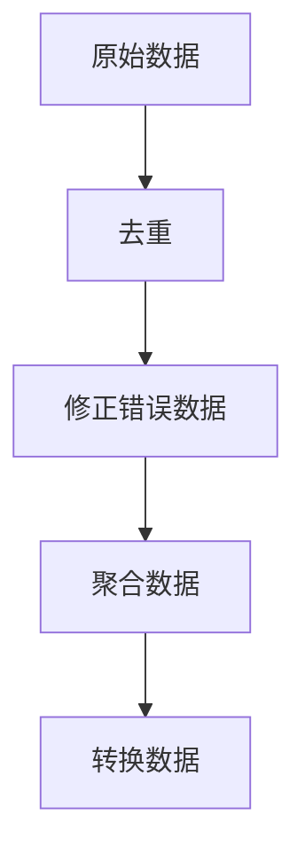
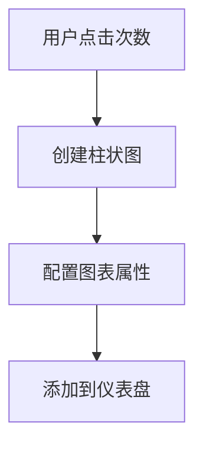
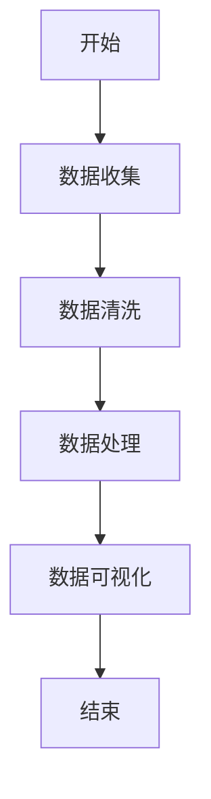

                 

### 文章标题

---

# 如何利用Amplitude进行创业产品的数据分析

---

> 关键词：Amplitude, 数据分析，创业产品，用户行为分析，用户细分，活跃度分析，A/B测试，数据分析工具

---

## 摘要

在快速发展的创业环境中，有效地进行数据分析是确保产品成功的关键。本文将详细探讨如何利用Amplitude这一强大的数据分析工具来支持创业产品的成长。首先，我们将介绍Amplitude的背景和基本概念，然后逐步深入到其安装与设置、数据收集与上传、数据处理与可视化等核心功能。接着，我们将介绍Amplitude的高级功能，如用户路径分析、转化漏斗分析和回归分析。随后，通过实际案例展示如何应用这些功能进行产品优化和决策制定。最后，我们将讨论项目管理与优化策略，并提供一个完整的实战项目案例，帮助读者理解从数据收集到解读的全过程。通过这篇文章，读者将能够掌握利用Amplitude进行创业产品数据分析的实战技能。

---

## 第1章 引言

### 1.1 书籍背景与目的

在当今数字化的商业环境中，数据分析已经成为企业成功的核心驱动力。特别是在创业领域，资源有限、竞争激烈，数据分析能够提供宝贵的洞察力，帮助创业团队快速迭代产品，优化用户体验，并制定有效的市场策略。Amplitude正是这样一款被广泛推崇的数据分析工具，它不仅能够处理海量数据，还能够通过强大的分析功能，为创业团队提供实时、直观的数据可视化。

本文旨在为创业团队的成员，尤其是那些在数据分析领域有一定基础但希望进一步提高的读者，提供一个系统的指南。通过本文的阅读，读者将了解到如何利用Amplitude进行有效的数据分析，从而提升产品的市场竞争力。文章的结构如下：

1. **第1章 引言**：介绍书籍的背景和目的，以及Amplitude在数据分析中的重要性。
2. **第2章 Amplitude基础知识**：介绍Amplitude的基本概念、安装与设置、数据收集与上传、数据处理与可视化。
3. **第3章 Amplitude核心功能**：详细探讨用户行为分析、用户细分、活跃度分析、回流分析和A/B测试。
4. **第4章 Amplitude高级功能**：介绍用户路径分析、转化漏斗分析、回归分析和实时监控。
5. **第5章 Amplitude在企业中的应用**：通过创业公司案例分析，展示如何利用Amplitude进行产品优化和数据驱动决策。
6. **第6章 Amplitude项目管理与优化**：讨论项目设置、性能监控与预警、数据安全与合规、持续集成与部署。
7. **第7章 实战项目案例**：提供一个完整的实战项目案例，详细讲解从数据收集到项目效果评估的全过程。
8. **第8章 总结与展望**：总结主要收获和体会，展望未来发展方向，并提供推荐阅读与资源。

通过这样的结构安排，本文力求帮助读者从基础到高级逐步掌握利用Amplitude进行创业产品数据分析的技能，为创业之路提供坚实的数据支持。

### 1.2 Amplitude概述

Amplitude是一款功能强大且用户友好的数据分析平台，专为互联网产品和服务设计。它允许用户通过可视化的方式追踪和分析用户行为，从而提供深度的洞察力，帮助团队了解用户的互动模式、行为偏好和痛点。Amplitude不仅仅是一个数据存储和展示工具，它更是一个综合性的数据解决方案，能够通过强大的数据处理和分析能力，帮助团队做出更加明智的决策。

Amplitude的核心特点包括：

1. **用户行为追踪**：Amplitude能够追踪用户在应用中的所有行为，包括点击、滑动、下载等，从而构建完整的用户行为图谱。
2. **实时数据可视化**：Amplitude提供实时数据可视化功能，用户可以通过直观的图表和仪表板快速了解数据趋势和变化。
3. **用户细分**：通过用户细分功能，Amplitude可以帮助团队识别不同用户群体的行为特征，从而制定更加精细化的产品策略。
4. **数据分析**：Amplitude内置了多种数据分析工具，如回归分析、转化漏斗分析等，帮助用户深入理解数据背后的因果关系。
5. **A/B测试**：Amplitude支持A/B测试功能，用户可以通过对比不同版本的测试数据，优化产品设计和功能。

Amplitude的应用场景非常广泛，包括但不限于以下几种：

1. **产品优化**：通过分析用户行为数据，团队可以识别产品的不足之处，从而进行针对性的优化，提升用户体验。
2. **市场策略**：数据分析可以帮助团队了解用户需求和市场趋势，从而制定更加有效的市场策略。
3. **用户增长**：通过分析用户路径和转化漏斗，团队可以识别用户流失的环节，从而采取措施提高用户留存率。
4. **团队协作**：Amplitude的可视化和报告功能可以帮助团队成员更好地协作和沟通，确保所有人都对数据有清晰的认识。

总的来说，Amplitude作为一个高效的数据分析工具，在创业产品的数据分析中具有不可替代的作用。它不仅能够帮助团队快速获取和解读用户行为数据，还能够通过数据驱动的决策，助力产品在竞争激烈的市场中脱颖而出。

### 1.3 创业产品的数据分析需求

在创业产品的开发过程中，数据分析扮演着至关重要的角色。一方面，数据分析能够帮助团队理解用户的行为和需求，从而优化产品设计和功能，提升用户体验。另一方面，数据分析还能为团队提供宝贵的市场洞察力，帮助制定有效的营销策略和增长计划。

#### 用户行为分析的重要性

用户行为分析是创业产品数据分析的核心。通过追踪和分析用户在产品中的行为，团队可以识别用户的痛点、喜好和使用习惯。例如，通过用户行为分析，团队可以发现用户在某个功能上使用频率较低，这可能是该功能设计不够合理或用户需求未被满足。在这种情况下，团队可以通过数据驱动的改进措施，优化该功能，提高用户满意度和使用频率。

此外，用户行为分析还能帮助团队识别潜在的市场机会。例如，通过分析用户在应用内不同功能的互动模式，团队可以发现用户在某些特定场景下的需求，从而开发新的功能或服务，满足这些潜在的市场需求。

#### 数据驱动的决策

数据驱动的决策是创业产品的成功关键。在资源有限的情况下，创业团队需要通过数据来指导产品的开发方向和资源分配。Amplitude通过提供实时的、多维度的数据可视化，帮助团队快速获取和理解用户行为数据，从而做出更加明智的决策。

例如，通过Amplitude的用户细分功能，团队可以识别出不同用户群体的行为特征和需求差异。针对这些用户群体，团队可以制定不同的产品策略和市场推广方案，从而提高市场覆盖率和用户满意度。再如，通过A/B测试功能，团队可以对比不同版本的测试数据，选择最优的产品设计或功能，确保产品在市场上的竞争力。

#### 需要满足的数据分析需求

创业产品的数据分析需求主要包括以下几个方面：

1. **用户行为追踪**：通过追踪用户在产品中的所有行为，团队可以获取完整的用户行为图谱，深入了解用户的使用模式和偏好。
2. **用户细分**：通过用户细分，团队可以识别不同用户群体的行为特征和需求差异，从而制定更加精细化的产品策略。
3. **活跃度分析**：通过分析用户的活跃度，团队可以识别出活跃用户和潜在流失用户，从而采取相应的措施提高用户留存率。
4. **回流分析**：通过回流分析，团队可以了解用户回流的情况，从而识别出哪些功能或策略对用户留存有积极影响。
5. **A/B测试**：通过A/B测试，团队可以对比不同版本的产品设计或功能，选择最优的方案，提高产品的市场竞争力。

总之，利用Amplitude进行创业产品的数据分析，不仅可以帮助团队理解用户行为，优化产品设计和功能，还能够支持数据驱动的决策，助力产品在竞争激烈的市场中脱颖而出。

---

## 第2章 Amplitude基础知识

### 2.1 Amplitude简介

Amplitude是一款领先的用户行为分析工具，专为互联网产品和服务设计。它通过强大的数据处理和分析能力，帮助团队深入了解用户行为，优化产品设计，提升用户体验，并制定有效的市场策略。Amplitude的核心理念是“数据驱动决策”，通过实时、多维度的数据可视化，为团队提供即时的洞察力，从而支持快速迭代和持续改进。

Amplitude的主要特点包括：

1. **用户行为追踪**：Amplitude能够追踪用户在应用中的所有行为，包括点击、滑动、下载等，从而构建完整的用户行为图谱。通过这种细粒度的追踪，团队可以深入了解用户的使用模式和偏好。

2. **实时数据可视化**：Amplitude提供实时数据可视化功能，用户可以通过直观的图表和仪表板快速了解数据趋势和变化。这种实时性使得团队能够快速响应市场变化，及时调整产品策略。

3. **用户细分**：通过用户细分功能，Amplitude可以帮助团队识别不同用户群体的行为特征和需求差异，从而制定更加精细化的产品策略。这种能力使得团队能够更好地满足不同用户群体的需求，提高用户满意度。

4. **数据分析**：Amplitude内置了多种数据分析工具，如回归分析、转化漏斗分析等，帮助用户深入理解数据背后的因果关系。这些工具使得团队能够从数据中提取有价值的信息，为决策提供科学依据。

5. **A/B测试**：Amplitude支持A/B测试功能，用户可以通过对比不同版本的测试数据，优化产品设计和功能，确保产品在市场上的竞争力。这种功能使得团队能够基于数据验证假设，提高产品改进的成功率。

Amplitude的应用场景非常广泛，包括但不限于以下几种：

1. **产品优化**：通过分析用户行为数据，团队可以识别产品的不足之处，从而进行针对性的优化，提升用户体验。

2. **市场策略**：数据分析可以帮助团队了解用户需求和市场趋势，从而制定更加有效的市场策略。

3. **用户增长**：通过分析用户路径和转化漏斗，团队可以识别用户流失的环节，从而采取措施提高用户留存率。

4. **团队协作**：Amplitude的可视化和报告功能可以帮助团队成员更好地协作和沟通，确保所有人都对数据有清晰的认识。

总之，Amplitude作为一个高效的数据分析工具，在创业产品的数据分析中具有不可替代的作用。它不仅能够帮助团队快速获取和解读用户行为数据，还能够通过数据驱动的决策，助力产品在竞争激烈的市场中脱颖而出。

### 2.2 安装与设置

为了能够充分利用Amplitude进行数据分析，首先需要完成其安装与设置。以下是详细步骤：

#### 1. 注册Amplitude账户

首先，访问Amplitude官方网站（[https://amplitude.com/](https://amplitude.com/)），点击“注册”按钮，填写注册表单，包括电子邮件地址、密码和其他必要信息。注册成功后，你会收到一封确认邮件，点击链接激活账户。

#### 2. 创建项目

登录账户后，点击页面顶部的“新建项目”按钮，填写项目名称和域名。域名非常重要，因为它将用于收集和追踪用户数据。确保填写正确的域名，以便后续的数据上传和追踪。

#### 3. 安装Amplitude SDK

Amplitude支持多种编程语言，如JavaScript、Python、Ruby等，为不同类型的产品提供便捷的数据追踪和上传方式。以下是JavaScript SDK的安装和配置步骤：

1. **安装**

   在项目的根目录下，通过npm命令安装Amplitude SDK：

   ```shell
   npm install --save amplitude-js
   ```

2. **配置**

   在项目代码中引入Amplitude SDK，并配置API key：

   ```javascript
   const amplitude = require('amplitude-js');

   amplitude.getInstance().init('YOUR_API_KEY');
   ```

   请将`YOUR_API_KEY`替换为在Amplitude账户中生成的API key。

#### 4. 数据收集与上传

安装和配置SDK后，可以开始收集和上传用户行为数据。以下是一个简单的示例，演示如何使用JavaScript SDK追踪用户点击事件：

```javascript
amplitude.getInstance().logEvent('Button_Click', {
   eventProperties: {
     buttonName: 'Submit',
     formSubmitted: false,
     additionalInfo: 'Some additional data'
   }
});
```

在上面的代码中，`Button_Click`是一个自定义事件，`eventProperties`包含了事件的详细信息。

#### 5. 数据处理与可视化

上传数据后，Amplitude会自动进行处理和可视化。你可以在仪表盘中查看实时数据，并创建自定义报告。以下是一些常用的数据处理和可视化步骤：

1. **仪表盘配置**

   在Amplitude仪表盘中，你可以选择不同的图表类型（如柱状图、折线图、饼图等）来展示数据。通过拖拽和调整，可以创建一个直观、易读的仪表盘。

2. **数据筛选**

   为了更精确地分析数据，可以使用筛选功能。例如，你可以筛选特定时间段的数据，或者基于用户属性（如国家、设备类型等）进行筛选。

3. **自定义报告**

   Amplitude允许你创建自定义报告，并将其导出为PDF或CSV格式。这对于定期汇报和分析非常有用。

通过以上步骤，你已经成功安装和配置了Amplitude，并开始收集和上传用户行为数据。接下来，可以进一步利用Amplitude的强大功能，进行深入的数据分析和决策制定。

### 2.3 数据收集与上传

数据收集与上传是利用Amplitude进行数据分析的基础环节。在这个环节中，我们不仅要确保数据的准确性和完整性，还需要理解如何通过Amplitude SDK高效地收集和上传数据。以下是详细的步骤和注意事项：

#### 1. 数据收集方法

数据收集是通过Amplitude SDK在不同编程语言中的API调用完成的。以下是几个常见的数据收集方法：

- **事件追踪**：用于记录用户在应用中的具体操作，如点击、滑动、页面浏览等。事件追踪是最基本的数据收集方式，可以通过调用`logEvent`方法实现。

  ```javascript
  amplitude.getInstance().logEvent('User_SignedUp', {
    eventProperties: {
      signUpSource: 'Referral',
      signUpMethod: 'Email',
      signUpTime: new Date().toISOString()
    }
  });
  ```

- **用户追踪**：用于记录用户的整体行为，如登录、注销、用户属性更新等。用户追踪可以通过`logUser`方法实现。

  ```javascript
  amplitude.getInstance().logUser('UserID123', {
    userProperties: {
      email: 'user@example.com',
      age: 30,
      country: 'USA'
    }
  });
  ```

- **用户会话追踪**：用于记录用户在应用中的会话活动，如会话开始、结束、持续时长等。用户会话追踪可以通过`logSession`方法实现。

  ```javascript
  amplitude.getInstance().logSession({
    start: new Date().toISOString(),
    duration: 300
  });
  ```

#### 2. 数据上传机制

数据上传是Amplitude数据收集的核心步骤，它确保用户行为数据能够及时、准确地进入Amplitude的数据仓库。以下是数据上传的详细机制：

- **异步上传**：Amplitude SDK使用异步方式上传数据，这意味着即使在网络不稳定的情况下，数据也会被缓存并在网络恢复时自动上传。这种方式保证了数据的完整性和实时性。

- **批量上传**：为了提高上传效率，Amplitude SDK支持批量上传。在默认情况下，每次事件或用户数据上传都会立即发送到服务器，但如果数据量较大，可以选择批量上传，将多个事件或用户数据批量发送，减少网络请求次数。

- **上传频率限制**：为了防止数据上传过多导致服务器负载过高，Amplitude SDK设置了上传频率限制。默认情况下，事件和用户数据的上传间隔为1秒，但在特定场景下可以调整此设置。

#### 3. 数据验证与处理

在数据上传过程中，Amplitude会对数据进行验证和处理，确保数据的准确性和完整性：

- **数据验证**：Amplitude会对上传的数据进行格式和内容验证，例如检查必填字段是否完整、数据类型是否正确等。如果数据验证失败，Amplitude会记录错误并将其返回给SDK，以便进行后续处理。

- **数据清洗**：在数据进入Amplitude的数据仓库之前，Amplitude会对数据进行清洗，去除重复数据、纠正错误数据等。这种方式保证了数据的纯净和一致性。

- **数据加密**：为了保护用户隐私和数据安全，Amplitude对上传的数据进行加密处理。只有通过Amplitude授权的API访问才能解密并查看数据。

#### 4. 注意事项

在数据收集与上传过程中，以下注意事项有助于确保数据的质量和效率：

- **确保API key安全**：API key是连接Amplitude服务器的重要密钥，必须严格保密，避免被未授权的第三方访问。

- **合理设置上传频率**：在数据量较大的场景下，合理设置上传频率可以减少网络请求次数，提高上传效率。可以根据实际场景调整上传间隔和批量上传的大小。

- **监控上传状态**：定期检查数据上传状态，确保数据能够及时、准确地上传到Amplitude。如果出现上传失败的情况，及时排查原因并解决问题。

- **数据格式一致性**：在收集和上传数据时，确保数据格式的一致性，例如字段名称、数据类型等。这有助于Amplitude更好地处理和分析数据。

通过了解数据收集与上传的机制和注意事项，创业团队可以确保Amplitude能够有效地收集和利用用户行为数据，从而为数据分析和决策制定提供坚实的基础。

### 2.4 数据处理与可视化

在Amplitude中，数据处理与可视化是数据分析的重要环节。通过有效的数据处理，可以确保数据的质量和一致性，而通过直观的可视化，可以更清晰地理解和呈现数据。以下是关于数据处理和可视化的详细步骤：

#### 1. 数据处理

数据处理包括数据清洗、数据聚合和数据转换等步骤。以下是如何在Amplitude中进行数据处理的步骤：

- **数据清洗**：数据清洗是确保数据准确性和完整性的关键步骤。在Amplitude中，可以通过以下方式进行数据清洗：

  1. **过滤重复数据**：通过设置过滤条件，可以去除重复的数据记录，确保数据的唯一性。
  2. **修正错误数据**：例如，如果用户输入错误的数据，可以通过数据清洗工具进行修正或删除。
  3. **处理缺失数据**：对于缺失的数据，可以选择填充默认值或删除该条数据。

- **数据聚合**：数据聚合是将多个数据记录合并为一个记录的过程，例如，将同一用户的多个事件聚合为一个用户行为记录。在Amplitude中，可以通过以下方式进行数据聚合：

  1. **分组聚合**：通过设置分组条件，将相同属性的数据分组，例如，根据用户ID或事件类型进行分组。
  2. **统计聚合**：通过计算统计数据，如求和、平均数、最大值、最小值等，对数据集进行聚合。

- **数据转换**：数据转换是将数据从一种格式转换为另一种格式的过程。在Amplitude中，可以通过以下方式进行数据转换：

  1. **时间转换**：例如，将时间戳转换为日期或时间格式。
  2. **类型转换**：例如，将字符串转换为数字或布尔值。

#### 2. 数据可视化

数据可视化是将数据以图形或图表的形式展示，帮助用户更直观地理解和分析数据。以下是Amplitude中的数据可视化步骤：

- **创建仪表盘**：仪表盘是展示数据的主要界面。在Amplitude中，可以按照以下步骤创建仪表盘：

  1. **选择图表类型**：根据需要展示的数据类型，选择适合的图表类型，如柱状图、折线图、饼图、散点图等。
  2. **添加图表组件**：在仪表盘中添加图表组件，并设置其属性，如数据源、显示范围、标题等。
  3. **调整布局**：拖拽和调整图表组件的位置和大小，以优化仪表盘的布局和可读性。

- **设置筛选条件**：为了更精确地分析数据，可以使用筛选条件。例如，可以筛选特定时间段的数据，或者根据用户属性进行筛选。筛选条件可以应用于整个仪表盘，也可以仅应用于特定的图表组件。

- **导出和分享**：Amplitude允许将仪表盘导出为PDF或CSV格式，便于打印和分享。此外，还可以生成链接，将仪表盘分享给其他团队成员或利益相关者。

#### 3. 实际操作示例

以下是一个简单的数据处理与可视化示例：

1. **数据清洗**：

   假设我们有一组用户行为数据，包含用户的ID、事件类型和时间戳。首先，我们需要去除重复的记录，确保每条记录的唯一性。

   ```mermaid
   graph TD
   A[原始数据] --> B[去重]
   B --> C{处理完成}
   ```

2. **数据聚合**：

   接下来，我们将同一用户的多个事件聚合为一个用户行为记录。假设我们根据用户ID进行分组。

   ```mermaid
   graph TD
   A[用户行为数据] --> B[按用户ID分组]
   B --> C[聚合事件数据]
   C --> D{处理完成}
   ```

3. **数据转换**：

   最后，我们将时间戳转换为日期格式，便于分析和展示。

   ```mermaid
   graph TD
   A[用户行为数据] --> B[转换时间戳]
   B --> C[格式化为日期]
   C --> D{处理完成}
   ```

4. **数据可视化**：

   在仪表盘中，我们可以创建一个折线图，展示用户的活跃度随时间的变化。

   ```mermaid
   graph TD
   A[用户活跃度数据] --> B[创建折线图]
   B --> C{添加到仪表盘}
   C --> D[设置筛选条件]
   D --> E[导出和分享]
   ```

通过以上步骤，我们完成了数据清洗、聚合、转换和可视化，从而更好地理解和分析数据。在Amplitude中，这些步骤可以通过直观的界面和操作来完成，使得数据分析变得更加简便和高效。

---

## 第3章 Amplitude核心功能

### 3.1 用户行为分析

用户行为分析是Amplitude的核心功能之一，它允许团队深入了解用户在产品中的互动模式和行为路径。通过用户行为分析，团队可以识别用户的痛点、喜好和使用习惯，从而优化产品设计和功能，提升用户体验。

#### 核心概念与联系

用户行为分析的核心概念包括用户事件、事件属性和用户行为路径。

- **用户事件**：用户事件是指用户在产品中执行的操作，如点击、滑动、浏览页面等。每个事件都包含一系列属性，这些属性描述了事件的具体特征。

- **事件属性**：事件属性是指用于描述用户事件的详细信息，如事件类型、发生时间、用户ID、设备类型等。这些属性帮助团队了解用户行为的各个方面。

- **用户行为路径**：用户行为路径是指用户在产品中的交互序列，如用户首先点击了首页的“购物车”按钮，然后浏览了商品详情页，最后完成了购买。通过分析用户行为路径，团队可以了解用户的整体交互流程。

#### 用户行为分析流程

用户行为分析的基本流程包括数据收集、数据清洗、数据分析和数据可视化。

1. **数据收集**：通过Amplitude SDK收集用户在产品中的行为数据，包括点击、滑动、浏览等。

2. **数据清洗**：清洗数据，去除重复和错误的数据记录，确保数据的质量和一致性。

3. **数据分析**：使用Amplitude的数据分析工具，对用户行为数据进行分析，识别用户的行为模式和偏好。

4. **数据可视化**：通过Amplitude的可视化功能，将分析结果以图表和仪表板的形式展示，帮助团队直观地理解用户行为。

#### 核心算法原理讲解

用户行为分析涉及多个核心算法，以下简要介绍其中的几个：

- **事件计数算法**：用于计算特定事件在一定时间窗口内发生的次数。例如，可以计算用户在一定时间内点击“购物车”按钮的次数。

  ```pseudo
  function countEvents(events, eventToCount) {
    return events.filter(event => event.type == eventToCount).length;
  }
  ```

- **事件序列分析算法**：用于分析用户在产品中的交互序列，识别用户的常见行为路径。例如，可以通过分析用户的点击序列，识别用户完成购买的常见路径。

  ```pseudo
  function findEventSequence(events, sequence) {
    return events.some(event => sequence.includes(event.type));
  }
  ```

- **回归分析算法**：用于分析用户行为与结果之间的关系，例如，通过回归分析可以识别哪些事件对用户留存有显著影响。

  ```pseudo
  function regressionAnalysis(features, target) {
    // 使用线性回归模型进行拟合
    // 返回模型参数和预测结果
  }
  ```

#### 数学模型和公式

在用户行为分析中，常用的数学模型包括：

- **马尔可夫模型**：用于分析用户行为的转移概率，识别用户行为的动态模式。

  $$ P(x_t|x_{t-1}) = \frac{P(x_t,x_{t-1})}{P(x_{t-1})} $$

  其中，$x_t$和$x_{t-1}$分别表示当前和前一个时间点的用户行为。

- **决策树**：用于分类和预测用户行为，通过构建决策树模型，可以识别用户的特征和偏好。

  $$ f(x) = g_1(x) \text{ if } x \in R_1 $$
  $$ f(x) = g_2(x) \text{ if } x \in R_2 $$
  $$ \ldots $$

  其中，$x$表示用户的特征向量，$R_1, R_2, \ldots$表示决策树的叶子节点。

#### 举例说明

假设我们想要分析用户点击“购物车”按钮与完成购买之间的关系。以下是具体的分析步骤：

1. **数据收集**：使用Amplitude SDK收集用户点击“购物车”按钮和完成购买的事件数据。

2. **数据清洗**：去除重复和错误的数据记录，确保数据的质量和一致性。

3. **数据分析**：

   - 计算用户点击“购物车”按钮与完成购买之间的时间延迟。
   - 分析点击“购物车”按钮后的用户行为路径，识别常见的购买流程。

4. **数据可视化**：使用Amplitude的仪表盘和图表，展示点击“购物车”按钮与完成购买之间的关系。

   - 创建一个柱状图，展示不同时间延迟下的购买率。
   - 创建一个路径图，展示用户从点击“购物车”按钮到完成购买的常见路径。

通过以上步骤，我们可以深入了解用户点击“购物车”按钮与完成购买之间的关系，从而为产品优化提供数据支持。

### 3.2 用户细分

用户细分是Amplitude的另一个核心功能，它允许团队将用户划分为不同的群体，以便更精确地分析用户行为和需求。通过用户细分，团队可以识别出不同用户群体的行为特征和偏好，从而制定更加精细化的产品策略。

#### 核心概念与联系

用户细分的核心概念包括用户属性、用户群体和行为特征。

- **用户属性**：用户属性是指用于描述用户特征的各种信息，如年龄、性别、地理位置、设备类型等。这些属性可以帮助团队了解用户的基本特征和需求。

- **用户群体**：用户群体是指根据某一共同特征或行为将用户划分成的不同群体。例如，可以将用户根据年龄划分为“青少年”、“成年人”和“老年人”等群体。

- **行为特征**：行为特征是指用户在产品中的具体行为表现，如点击次数、浏览时长、购买频率等。这些特征可以帮助团队识别用户的活跃度和参与度。

#### 用户细分流程

用户细分的基本流程包括数据收集、数据分析和用户群体定义。

1. **数据收集**：使用Amplitude SDK收集用户行为数据，包括点击、浏览、购买等。

2. **数据分析**：对用户行为数据进行分析，识别用户的特征和行为模式。

3. **用户群体定义**：根据分析结果，将用户划分为不同的群体，为每个群体定义明确的特征和行为标准。

#### 核心算法原理讲解

用户细分涉及多个核心算法，以下简要介绍其中的几个：

- **聚类算法**：用于将用户划分为不同的群体，常用的聚类算法包括K-means、DBSCAN等。

  ```pseudo
  function kmeans(data, K) {
    // 初始化K个簇中心
    // 迭代更新簇中心，直到收敛
    // 返回簇分配结果
  }
  ```

- **决策树算法**：用于根据用户的属性和行为特征生成决策树模型，识别用户群体的划分标准。

  ```pseudo
  function buildDecisionTree(data) {
    // 选择最佳划分属性
    // 划分数据集为子集
    // 递归构建决策树
    // 返回决策树模型
  }
  ```

#### 数学模型和公式

在用户细分中，常用的数学模型包括：

- **贝叶斯分类器**：用于分类用户群体，通过计算概率分布，识别用户属于不同群体的概率。

  $$ P(C_k|X) = \frac{P(X|C_k)P(C_k)}{P(X)} $$

  其中，$C_k$表示第$k$个用户群体，$X$表示用户的特征向量。

- **支持向量机（SVM）**：用于分类用户群体，通过寻找最优的超平面，将用户划分为不同的群体。

  $$ w^* = \arg\max_w \frac{1}{||w||^2} \left( y_i (w \cdot x_i) - 1 \right) $$

  其中，$w$表示超平面参数，$x_i$和$y_i$分别表示第$i$个用户的特征向量和标签。

#### 举例说明

假设我们想要将用户根据他们的购买频率和浏览时长划分为不同的群体，以下是具体的分析步骤：

1. **数据收集**：使用Amplitude SDK收集用户的购买频率和浏览时长数据。

2. **数据分析**：计算每个用户的平均购买频率和浏览时长，并根据这些指标对用户进行初步划分。

3. **用户群体定义**：

   - 根据平均购买频率，将用户划分为“高频购买者”、“中频购买者”和“低频购买者”。
   - 根据平均浏览时长，将用户划分为“活跃用户”、“中活跃用户”和“低活跃用户”。

4. **数据可视化**：使用Amplitude的仪表盘和图表，展示不同用户群体的行为特征和偏好。

   - 创建一个饼图，展示不同用户群体的分布情况。
   - 创建一个散点图，展示用户的购买频率和浏览时长分布。

通过以上步骤，我们可以将用户划分为不同的群体，并深入了解每个群体的行为特征和偏好，从而为产品优化和个性化推荐提供数据支持。

### 3.3 活跃度分析

活跃度分析是Amplitude的核心功能之一，它帮助团队了解用户在产品中的活跃程度，识别活跃用户和潜在流失用户。通过活跃度分析，团队能够制定有效的用户留存策略，提高产品的市场竞争力。

#### 核心概念与联系

活跃度分析的核心概念包括活跃度指标、用户活跃度和行为模式。

- **活跃度指标**：活跃度指标是用于衡量用户在产品中活跃程度的量化标准，常见的指标包括日活跃用户数（DAU）、周活跃用户数（WAU）、月活跃用户数（MAU）等。

- **用户活跃度**：用户活跃度是指用户在特定时间段内与产品的互动频率和深度，如登录次数、浏览时长、操作次数等。

- **行为模式**：行为模式是指用户在产品中的行为特征，如常用功能、频繁操作、偏好设置等。

#### 活跃度分析流程

活跃度分析的基本流程包括数据收集、数据处理和数据分析。

1. **数据收集**：使用Amplitude SDK收集用户的登录、浏览、操作等行为数据。

2. **数据处理**：对收集到的行为数据进行处理，计算用户的活跃度指标。

3. **数据分析**：使用Amplitude的数据分析工具，分析用户的活跃度趋势和行为模式，识别活跃用户和潜在流失用户。

#### 核心算法原理讲解

活跃度分析涉及多个核心算法，以下简要介绍其中的几个：

- **移动平均算法**：用于平滑活跃度数据，识别活跃度的长期趋势。

  ```pseudo
  function movingAverage(data, windowSize) {
    // 计算窗口内的平均值
    // 返回移动平均序列
  }
  ```

- **聚类算法**：用于将用户划分为不同的活跃度群体，常用的聚类算法包括K-means、DBSCAN等。

  ```pseudo
  function kmeans(data, K) {
    // 初始化K个簇中心
    // 迭代更新簇中心，直到收敛
    // 返回簇分配结果
  }
  ```

#### 数学模型和公式

在活跃度分析中，常用的数学模型包括：

- **时间序列模型**：用于分析用户活跃度的时序变化，常用的模型包括ARIMA、LSTM等。

  $$ X_t = c + \phi_1 X_{t-1} + \phi_2 X_{t-2} + \ldots + \phi_p X_{t-p} + \epsilon_t $$

  其中，$X_t$表示第$t$个时间点的活跃度，$\epsilon_t$表示随机误差。

- **生存分析模型**：用于分析用户在产品中的留存情况，常用的模型包括Cox比例风险模型等。

  $$ h(t|x) = h_0(t) \exp(\sum_{j=1}^k \lambda_j x_j) $$

  其中，$h(t|x)$表示在给定特征$x$下，时间$t$的生存风险函数。

#### 举例说明

假设我们想要分析某电商平台的用户活跃度，以下是具体的分析步骤：

1. **数据收集**：使用Amplitude SDK收集用户的登录、浏览、下单等行为数据。

2. **数据处理**：计算每个用户的平均登录次数、平均浏览时长和平均下单次数，并根据这些指标计算用户的活跃度得分。

3. **数据分析**：

   - 使用移动平均算法，平滑活跃度数据，识别活跃度的长期趋势。
   - 使用聚类算法，将用户划分为高活跃用户、中活跃用户和低活跃用户。
   - 使用生存分析模型，分析用户的留存情况，识别潜在流失用户。

4. **数据可视化**：

   - 创建一个折线图，展示用户的活跃度得分随时间的变化趋势。
   - 创建一个饼图，展示不同活跃度用户的分布情况。
   - 创建一个生存曲线图，展示不同活跃度用户的留存情况。

通过以上步骤，我们可以深入了解平台的用户活跃度，识别活跃用户和潜在流失用户，为用户留存策略提供数据支持。

### 3.4 回流分析

回流分析是Amplitude的重要功能之一，它帮助团队了解用户在离开产品一段时间后重新回来的情况。通过回流分析，团队能够识别哪些用户更有可能回流，哪些策略或功能能够提高回流率，从而制定有效的用户留存策略。

#### 核心概念与联系

回流分析的核心概念包括回流用户、回流率和回流路径。

- **回流用户**：回流用户是指那些在离开产品一段时间后再次回来的用户。这些用户通常对产品有较高的兴趣和忠诚度。

- **回流率**：回流率是指回流用户占总用户的比例。回流率越高，说明产品的用户留存效果越好。

- **回流路径**：回流路径是指用户从离开到重新进入产品的过程。通过分析回流路径，团队能够了解用户回流的原因和关键环节。

#### 回流分析流程

回流分析的基本流程包括数据收集、数据清洗、数据分析和数据可视化。

1. **数据收集**：使用Amplitude SDK收集用户的登录、退出、回流等行为数据。

2. **数据清洗**：清洗数据，去除重复和错误的数据记录，确保数据的质量和一致性。

3. **数据分析**：使用Amplitude的数据分析工具，分析用户的回流情况，识别回流用户和回流路径。

4. **数据可视化**：使用Amplitude的可视化功能，将回流分析结果以图表和仪表板的形式展示，帮助团队直观地理解回流情况。

#### 核心算法原理讲解

回流分析涉及多个核心算法，以下简要介绍其中的几个：

- **留存分析算法**：用于计算用户在一定时间窗口内的回流情况。常见的留存分析算法包括二分类算法、多分类算法等。

  ```pseudo
  function retentionAnalysis(users, windowSize) {
    // 计算每个用户在窗口内的回流情况
    // 返回留存结果
  }
  ```

- **路径分析算法**：用于分析用户的回流路径，识别用户从离开到重新进入产品的过程。常见的路径分析算法包括路径挖掘算法、马尔可夫模型等。

  ```pseudo
  function pathAnalysis(events, windowSize) {
    // 构建用户回流路径
    // 返回路径分析结果
  }
  ```

#### 数学模型和公式

在回流分析中，常用的数学模型包括：

- **马尔可夫模型**：用于分析用户回流的动态模式。通过马尔可夫模型，可以计算用户在不同时间点的回流概率。

  $$ P(x_t|x_{t-1}) = \frac{P(x_t,x_{t-1})}{P(x_{t-1})} $$

  其中，$x_t$和$x_{t-1}$分别表示当前和前一个时间点的用户回流状态。

- **回归分析算法**：用于分析用户回流与结果之间的关系，例如，通过回归分析可以识别哪些事件对用户回流有显著影响。

  ```pseudo
  function regressionAnalysis(features, target) {
    // 使用线性回归模型进行拟合
    // 返回模型参数和预测结果
  }
  ```

#### 举例说明

假设我们想要分析某电商平台的用户回流情况，以下是具体的分析步骤：

1. **数据收集**：使用Amplitude SDK收集用户的登录、退出、回流等行为数据。

2. **数据清洗**：去除重复和错误的数据记录，确保数据的质量和一致性。

3. **数据分析**：

   - 使用留存分析算法，计算用户的回流情况，识别回流用户。
   - 使用路径分析算法，分析用户的回流路径，识别用户从离开到重新进入产品的过程。
   - 使用回归分析算法，分析用户回流与结果之间的关系，识别影响用户回流的关键因素。

4. **数据可视化**：

   - 创建一个柱状图，展示不同时间窗口内的回流用户数量。
   - 创建一个路径图，展示用户的回流路径。
   - 创建一个回归图，展示用户回流与结果之间的关系。

通过以上步骤，我们可以深入了解平台的用户回流情况，识别影响用户回流的关键因素，为用户留存策略提供数据支持。

### 3.5 A/B测试

A/B测试是Amplitude的一个重要功能，它允许团队通过对比不同版本的测试数据，优化产品设计和功能。通过A/B测试，团队能够基于数据验证假设，提高产品改进的成功率，从而更好地满足用户需求和市场变化。

#### 核心概念与联系

A/B测试的核心概念包括测试组、控制组和测试变量。

- **测试组**：测试组是指接受新版本或新功能的用户群体。通过对比测试组的数据，团队可以评估新版本或新功能的效果。

- **控制组**：控制组是指不接受新版本或新功能的用户群体。通常，控制组使用当前版本或标准功能，作为对比基准。

- **测试变量**：测试变量是指团队想要测试的具体指标或功能，如按钮颜色、页面布局、功能开关等。

#### A/B测试流程

A/B测试的基本流程包括测试设计、数据收集、数据分析、结果解释和决策制定。

1. **测试设计**：团队需要明确测试目标、测试变量和测试组。在Amplitude中，可以通过设置A/B测试实验，定义测试变量和控制变量。

2. **数据收集**：在测试期间，使用Amplitude SDK收集测试组和控制组的数据，包括用户的互动行为和关键指标。

3. **数据分析**：使用Amplitude的数据分析工具，分析测试组和控制组的数据，评估新版本或新功能的效果。

4. **结果解释**：根据数据分析结果，判断新版本或新功能是否达到了测试目标，评估其效果。

5. **决策制定**：根据A/B测试结果，团队可以决定是否推广新版本或新功能，或者继续进行改进。

#### 核心算法原理讲解

A/B测试涉及多个核心算法，以下简要介绍其中的几个：

- **统计测试算法**：用于评估测试组与对照组之间的差异是否显著。常见的统计测试算法包括t检验、卡方检验等。

  ```pseudo
  function statisticalTest(data1, data2, hypothesis) {
    // 计算统计量
    // 进行假设检验
    // 返回检验结果
  }
  ```

- **置信区间算法**：用于计算测试结果的置信区间，提供对测试结果不确定性的度量。

  ```pseudo
  function confidenceInterval(data, confidenceLevel) {
    // 计算置信区间
    // 返回置信区间
  }
  ```

#### 数学模型和公式

在A/B测试中，常用的数学模型包括：

- **二项分布**：用于描述测试组成功率的概率分布。通过二项分布，可以计算测试组成功率的置信区间。

  $$ P(X = k) = \binom{n}{k} p^k (1-p)^{n-k} $$

  其中，$X$表示测试组成功的次数，$n$表示总次数，$p$表示成功概率。

- **正态分布**：用于描述测试组与对照组差异的正态分布。通过正态分布，可以计算差异的置信区间。

  $$ Z = \frac{\bar{X} - \mu_0}{\sigma / \sqrt{n}} $$

  其中，$\bar{X}$表示测试组的平均值，$\mu_0$表示控制组的平均值，$\sigma$表示标准差，$n$表示样本大小。

#### 举例说明

假设我们想要测试一个电商平台的购物车页面按钮颜色对用户购买率的影响，以下是具体的测试步骤：

1. **测试设计**：

   - 测试目标：比较红色按钮和蓝色按钮对用户购买率的影响。
   - 测试变量：按钮颜色（红色 vs 蓝色）。
   - 测试组：随机分配给部分用户的红色按钮。
   - 控制组：随机分配给部分用户的蓝色按钮。

2. **数据收集**：

   - 在测试期间，使用Amplitude SDK收集测试组和控制组的购买数据。
   - 记录每个用户的互动行为，如点击、浏览、购买等。

3. **数据分析**：

   - 计算测试组与对照组的购买率。
   - 使用t检验评估两组之间的差异是否显著。

4. **结果解释**：

   - 如果红色按钮的购买率显著高于蓝色按钮，说明红色按钮更能激发用户购买欲望。
   - 如果两组购买率没有显著差异，说明按钮颜色对用户购买行为的影响不大。

5. **决策制定**：

   - 根据A/B测试结果，决定是否将红色按钮推广到整个平台。
   - 如果测试结果不确定，可以考虑进一步优化或重新设计测试方案。

通过以上步骤，我们可以利用A/B测试优化电商平台购物车页面的按钮颜色，提高用户购买率，从而提升产品的市场竞争力。

---

## 第4章 Amplitude高级功能

### 4.1 用户路径分析

用户路径分析是Amplitude的高级功能之一，它帮助团队深入了解用户在产品中的交互流程和行为模式。通过用户路径分析，团队可以识别用户在关键环节的痛点、热点和潜在流失点，从而优化产品设计和功能，提升用户体验。

#### 核心概念与联系

用户路径分析的核心概念包括用户路径、路径节点和路径转换。

- **用户路径**：用户路径是指用户在产品中的交互序列，包括用户从进入产品到完成某一目标或操作的整个过程。

- **路径节点**：路径节点是指用户路径中的关键环节或步骤，如点击某个按钮、浏览某个页面等。每个节点都代表用户的一次操作。

- **路径转换**：路径转换是指用户从一个路径节点到另一个路径节点的过程。通过分析路径转换，团队可以了解用户在不同节点之间的流动情况。

#### 用户路径分析流程

用户路径分析的基本流程包括数据收集、路径构建、路径分析和路径优化。

1. **数据收集**：使用Amplitude SDK收集用户的互动行为数据，包括点击、浏览、操作等。

2. **路径构建**：将收集到的行为数据转化为用户路径，通过构建路径节点和路径转换，形成完整的用户路径图。

3. **路径分析**：使用Amplitude的分析工具，分析用户路径中的关键节点和转换，识别用户的行为模式和痛点。

4. **路径优化**：根据路径分析结果，优化产品设计和功能，改进用户体验。

#### 核心算法原理讲解

用户路径分析涉及多个核心算法，以下简要介绍其中的几个：

- **路径挖掘算法**：用于从行为数据中挖掘用户路径。常见的路径挖掘算法包括序列模式挖掘、关联规则挖掘等。

  ```pseudo
  function pathMining(data) {
    // 挖掘用户路径模式
    // 返回路径模式结果
  }
  ```

- **转换概率模型**：用于计算用户在不同路径节点之间的转换概率。常见的转换概率模型包括马尔可夫模型、贝叶斯网络等。

  ```pseudo
  function transitionProbabilityModel(states, transitions) {
    // 计算状态转移概率
    // 返回概率矩阵
  }
  ```

#### 数学模型和公式

在用户路径分析中，常用的数学模型包括：

- **马尔可夫模型**：用于分析用户路径中的状态转换。通过马尔可夫模型，可以计算用户在不同路径节点之间的转换概率。

  $$ P(x_t|x_{t-1}) = \frac{P(x_t,x_{t-1})}{P(x_{t-1})} $$

  其中，$x_t$和$x_{t-1}$分别表示当前和前一个时间点的路径状态。

- **关联规则挖掘算法**：用于分析用户路径中的关联关系。通过关联规则挖掘算法，可以识别用户在不同路径节点之间的关联模式。

  $$ R \rightarrow S, \text{support} = \frac{R \cup S}{R}, \text{confidence} = \frac{R \cup S}{R \cup S} $$

  其中，$R$和$S$分别表示关联规则的前件和后件，$support$表示支持度，$confidence$表示置信度。

#### 举例说明

假设我们想要分析一个电商平台的用户购买路径，以下是具体的分析步骤：

1. **数据收集**：

   - 使用Amplitude SDK收集用户的浏览、点击、购物车操作和购买行为数据。

2. **路径构建**：

   - 构建用户购买路径，包括浏览商品、加入购物车、结算、支付和购买完成的节点。

3. **路径分析**：

   - 分析用户路径中的关键节点和转换，计算每个节点的转换概率。

   ```mermaid
   graph TD
   A[浏览商品] --> B[加入购物车]
   B --> C[结算]
   C --> D[支付]
   D --> E[购买完成]
   ```

4. **路径优化**：

   - 根据路径分析结果，识别用户在关键节点（如结算和支付）的痛点，进行针对性的优化。
   - 例如，优化结算页面的用户界面，减少用户在支付环节的流失。

通过以上步骤，我们可以深入了解电商平台的用户购买路径，识别关键节点和潜在痛点，为产品优化提供数据支持。

### 4.2 转化漏斗分析

转化漏斗分析是Amplitude的一个重要高级功能，它帮助团队识别用户在关键转化步骤中的流失点，优化用户转化路径，从而提高产品的整体转化率和用户留存率。

#### 核心概念与联系

转化漏斗分析的核心概念包括转化步骤、流失点和转化率。

- **转化步骤**：转化步骤是指用户在完成某一目标或操作过程中必须经历的一系列环节，如注册、添加商品到购物车、结算、支付等。

- **流失点**：流失点是指用户在转化过程中可能放弃的环节，如用户在注册过程中放弃填写信息，或者在购物车页面放弃结算。

- **转化率**：转化率是指用户在特定转化步骤中完成目标的比率。通过转化率，团队可以衡量每个转化步骤的效果，识别优化点。

#### 转化漏斗分析流程

转化漏斗分析的基本流程包括步骤定义、数据收集、漏斗构建、数据分析和优化建议。

1. **步骤定义**：团队需要明确产品的转化步骤，并将其定义在Amplitude中。例如，可以将注册、添加商品、结算、支付等步骤定义为转化步骤。

2. **数据收集**：使用Amplitude SDK收集用户在转化步骤中的行为数据，包括用户的进入、退出和完成情况。

3. **漏斗构建**：在Amplitude中，通过数据收集到的行为数据构建转化漏斗，展示用户在每个转化步骤中的流量和转化率。

4. **数据分析**：使用Amplitude的分析工具，分析转化漏斗中的关键数据，如每个步骤的流量、转化率和流失率。

5. **优化建议**：根据数据分析结果，识别转化漏斗中的流失点，提出优化建议，如改进用户体验、优化界面设计等。

#### 核心算法原理讲解

转化漏斗分析涉及多个核心算法，以下简要介绍其中的几个：

- **漏斗分析算法**：用于计算用户在转化步骤中的流失率。常见的漏斗分析算法包括分段计算、累积计算等。

  ```pseudo
  function funnelAnalysis(steps, metrics) {
    // 计算每个步骤的流量和转化率
    // 计算总流失率
    // 返回漏斗分析结果
  }
  ```

- **路径优化算法**：用于分析用户转化路径中的瓶颈和优化点。常见的路径优化算法包括A/B测试、多变量测试等。

  ```pseudo
  function pathOptimization(data, variables) {
    // 计算每个变量的效果
    // 选择最优变量组合
    // 返回优化结果
  }
  ```

#### 数学模型和公式

在转化漏斗分析中，常用的数学模型包括：

- **转化率模型**：用于计算用户在特定转化步骤中的转化率。转化率模型可以通过以下公式计算：

  $$ \text{转化率} = \frac{\text{完成步骤的用户数}}{\text{进入步骤的用户数}} $$

- **流失率模型**：用于计算用户在特定转化步骤中的流失率。流失率模型可以通过以下公式计算：

  $$ \text{流失率} = 1 - \text{转化率} $$

#### 举例说明

假设我们想要分析一个电商平台的用户购买漏斗，以下是具体的分析步骤：

1. **步骤定义**：

   - 定义转化步骤，包括浏览商品、添加商品到购物车、结算、支付和购买完成。

2. **数据收集**：

   - 使用Amplitude SDK收集用户在每个转化步骤中的行为数据。

3. **漏斗构建**：

   - 在Amplitude中构建用户购买漏斗，展示用户在每个转化步骤中的流量和转化率。

4. **数据分析**：

   - 分析用户在购物车和支付步骤的流失情况，计算每个步骤的转化率和流失率。

5. **优化建议**：

   - 根据流失率分析结果，优化购物车和支付页面的用户体验，如简化结算流程、提高页面加载速度等。

通过以上步骤，我们可以详细了解电商平台用户购买漏斗中的瓶颈和优化点，从而提高用户的转化率和留存率。

### 4.3 回归分析

回归分析是Amplitude的一个重要高级功能，它帮助团队识别和分析用户行为与结果之间的关系，从而制定更加精准的产品优化策略。通过回归分析，团队可以理解哪些因素对用户留存、转化和活跃度等关键指标有显著影响，从而进行有针对性的改进。

#### 核心概念与联系

回归分析的核心概念包括自变量、因变量和回归模型。

- **自变量**：自变量是指影响因变量的因素，如用户年龄、设备类型、使用频率等。通过分析自变量，团队可以了解不同因素对结果的影响。

- **因变量**：因变量是指团队希望分析的结果指标，如用户留存率、转化率、活跃度等。因变量的变化反映了产品性能和市场效果。

- **回归模型**：回归模型是一种数学模型，用于分析自变量与因变量之间的关系。常见的回归模型包括线性回归、逻辑回归和多项式回归等。

#### 回归分析流程

回归分析的基本流程包括数据收集、模型选择、模型训练和结果分析。

1. **数据收集**：使用Amplitude SDK收集用户行为数据和相关结果指标，如用户注册、登录、购买等行为与留存率、转化率等。

2. **模型选择**：根据数据特征和业务需求，选择适合的回归模型。常见的模型包括线性回归、逻辑回归和多项式回归等。

3. **模型训练**：使用收集到的数据，对选择的回归模型进行训练。模型训练的过程是找到最佳的参数组合，使模型能够准确预测结果。

4. **结果分析**：分析模型训练结果，识别对结果有显著影响的因素，了解不同因素对结果的影响程度。

#### 核心算法原理讲解

回归分析涉及多个核心算法，以下简要介绍其中的几个：

- **线性回归**：线性回归是一种最简单的回归模型，用于分析自变量与因变量之间的线性关系。

  $$ y = \beta_0 + \beta_1 x_1 + \beta_2 x_2 + \ldots + \beta_n x_n + \epsilon $$

  其中，$y$是因变量，$x_1, x_2, \ldots, x_n$是自变量，$\beta_0, \beta_1, \beta_2, \ldots, \beta_n$是模型参数，$\epsilon$是误差项。

- **逻辑回归**：逻辑回归是一种常用的回归模型，用于分析自变量与因变量之间的非线性关系，特别适用于二分类问题。

  $$ \ln\frac{P(Y=1)}{1-P(Y=1)} = \beta_0 + \beta_1 x_1 + \beta_2 x_2 + \ldots + \beta_n x_n $$

  其中，$Y$是因变量，$P(Y=1)$是因变量的概率，$\ln$是自然对数。

- **多项式回归**：多项式回归是一种扩展的回归模型，用于分析自变量与因变量之间的多项式关系。

  $$ y = \beta_0 + \beta_1 x_1 + \beta_2 x_1^2 + \beta_3 x_2 + \ldots + \beta_n x_n^k + \epsilon $$

  其中，$x_1, x_2, \ldots, x_n$是自变量，$x_1^2, x_2^2, \ldots, x_n^k$是自变量的多项式形式。

#### 数学模型和公式

在回归分析中，常用的数学模型和公式包括：

- **最小二乘法**：用于估计回归模型的参数。最小二乘法的目标是找到使误差平方和最小的参数组合。

  $$ \min_{\beta} \sum_{i=1}^{n} (y_i - \beta_0 - \beta_1 x_{i1} - \ldots - \beta_n x_{in})^2 $$

- **协方差矩阵**：用于计算自变量之间的相关性。协方差矩阵可以帮助团队了解不同自变量之间的相互作用。

  $$ \Sigma = \begin{bmatrix}
    \sigma_{11} & \sigma_{12} & \ldots & \sigma_{1n} \\
    \sigma_{21} & \sigma_{22} & \ldots & \sigma_{2n} \\
    \vdots & \vdots & \ddots & \vdots \\
    \sigma_{n1} & \sigma_{n2} & \ldots & \sigma_{nn}
  \end{bmatrix} $$

- **R平方（R²）**：用于衡量回归模型对数据的拟合程度。R²的值范围在0到1之间，值越高，说明模型对数据的拟合越好。

  $$ R^2 = 1 - \frac{\sum_{i=1}^{n} (y_i - \hat{y}_i)^2}{\sum_{i=1}^{n} (y_i - \bar{y})^2} $$

  其中，$y_i$是实际值，$\hat{y}_i$是预测值，$\bar{y}$是平均值。

#### 举例说明

假设我们想要分析电商平台的用户购买行为，以下是具体的回归分析步骤：

1. **数据收集**：

   - 使用Amplitude SDK收集用户的行为数据，包括点击、浏览、购物车操作和购买行为。
   - 收集用户相关的特征数据，如年龄、性别、地理位置等。

2. **模型选择**：

   - 根据数据特征和业务需求，选择线性回归模型，分析用户行为与购买行为之间的关系。

3. **模型训练**：

   - 使用收集到的数据，对线性回归模型进行训练，找到最佳的参数组合。

4. **结果分析**：

   - 分析模型训练结果，识别对用户购买行为有显著影响的因素，如用户点击次数、浏览时长等。
   - 计算 R² 值，评估模型对数据的拟合程度。

5. **优化建议**：

   - 根据回归分析结果，优化电商平台的设计和功能，如提高用户点击率和浏览时长，从而提高购买转化率。

通过以上步骤，我们可以利用回归分析深入了解电商平台用户购买行为，识别关键影响因素，为产品优化提供数据支持。

### 4.4 实时监控

实时监控是Amplitude的一项高级功能，它允许团队实时跟踪关键业务指标的变化，及时发现异常情况，并采取相应的措施。通过实时监控，团队能够确保产品稳定运行，快速响应市场变化，提升用户体验和业务效率。

#### 核心概念与联系

实时监控的核心概念包括实时数据流、警报系统和响应策略。

- **实时数据流**：实时数据流是指数据以实时、连续的方式传输到Amplitude，从而为团队提供即时的数据分析能力。

- **警报系统**：警报系统是一种自动化的机制，用于检测关键业务指标是否超出设定的阈值，并通过通知、邮件或短信等方式提醒团队成员。

- **响应策略**：响应策略是指团队根据警报系统提供的信息，制定的应对措施和操作流程，以确保及时处理异常情况。

#### 实时监控流程

实时监控的基本流程包括数据收集、数据分析、异常检测、警报触发和响应策略执行。

1. **数据收集**：使用Amplitude SDK实时收集产品运行过程中的关键业务指标数据，如用户活跃度、交易量、错误率等。

2. **数据分析**：对收集到的实时数据进行分析，识别数据趋势和异常模式。

3. **异常检测**：通过设定阈值和规则，实时监控关键业务指标，检测数据是否超出预期范围。

4. **警报触发**：当数据异常时，触发警报系统，通知团队成员。

5. **响应策略执行**：根据设定的响应策略，采取相应的措施，如通知开发人员修复错误、调整系统配置等。

#### 核心算法原理讲解

实时监控涉及多个核心算法，以下简要介绍其中的几个：

- **阈值检测算法**：用于设定关键业务指标的阈值，检测数据是否超出阈值范围。常见的阈值检测算法包括静态阈值检测、动态阈值检测等。

  ```pseudo
  function thresholdDetection(data, threshold) {
    // 检测数据是否超出阈值
    // 返回检测结果
  }
  ```

- **异常检测算法**：用于检测实时数据中的异常值和异常模式。常见的异常检测算法包括统计方法（如3σ法则）、机器学习方法（如孤立森林）等。

  ```pseudo
  function anomalyDetection(data) {
    // 计算数据的统计特征
    // 检测异常值和异常模式
    // 返回异常检测结果
  }
  ```

#### 数学模型和公式

在实时监控中，常用的数学模型和公式包括：

- **3σ法则**：用于检测数据中的异常值。根据3σ法则，如果一个数据点与均值的差值超过3倍标准差，则该数据点被认为是异常值。

  $$ |x_i - \mu| > 3\sigma $$

  其中，$x_i$是数据点，$\mu$是均值，$\sigma$是标准差。

- **自回归移动平均模型（ARIMA）**：用于分析时间序列数据，检测数据中的趋势和季节性变化。通过ARIMA模型，可以预测未来数据点，并识别异常值。

  $$ \text{ARIMA}(p, d, q) \rightarrow y_t = c + \phi_1 y_{t-1} + \phi_2 y_{t-2} + \ldots + \phi_p y_{t-p} + \theta_1 \epsilon_{t-1} + \theta_2 \epsilon_{t-2} + \ldots + \theta_q \epsilon_{t-q} $$

  其中，$y_t$是时间序列数据，$p$是自回归项数，$d$是差分阶数，$q$是移动平均项数，$\epsilon_t$是白噪声序列。

#### 举例说明

假设我们想要监控电商平台的用户活跃度，以下是具体的实时监控步骤：

1. **数据收集**：

   - 使用Amplitude SDK收集平台的用户活跃度数据，包括登录次数、页面浏览量、交易量等。

2. **数据分析**：

   - 对用户活跃度数据进行分析，识别数据趋势和异常模式。

3. **异常检测**：

   - 设定用户活跃度的阈值，如平均活跃度加减3倍标准差，作为异常检测的依据。

4. **警报触发**：

   - 当用户活跃度数据超出设定的阈值时，触发警报系统，发送通知到团队成员。

5. **响应策略执行**：

   - 根据警报信息，团队可以采取相应的措施，如调整市场推广策略、优化用户体验等，以应对用户活跃度的异常变化。

通过以上步骤，我们可以实现电商平台用户活跃度的实时监控，确保团队能够及时响应市场变化，提升用户体验和业务效率。

---

## 第5章 Amplitude在企业中的应用

### 5.1 创业公司案例分析

在本节中，我们将通过一个创业公司的实际案例分析，详细探讨如何利用Amplitude进行产品优化和数据驱动决策。这个案例来自一个名为“GreenLight”的创业公司，该公司开发了一款旨在帮助用户管理个人财务的应用程序。

#### 案例背景

GreenLight公司成立于2020年，其目标是通过简化财务管理流程，帮助用户更好地掌握自己的财务状况。在产品初期，GreenLight团队面临着多个挑战，包括如何吸引和留住用户、提高用户留存率和提升用户满意度。为了解决这些问题，GreenLight团队决定利用Amplitude进行深入的数据分析。

#### 数据收集与初步分析

GreenLight团队首先通过Amplitude SDK收集用户在应用程序中的所有行为数据，包括用户注册、登录、浏览页面、添加账户、查看报表、发起交易等。在收集到初步数据后，团队进行了以下分析：

1. **用户留存情况**：

   - 通过分析用户的活跃度数据，团队发现只有不到30%的用户在注册后的第一个月内登录过应用程序，这表明用户留存率较低。

2. **用户流失环节**：

   - 进一步分析发现，用户在添加账户环节流失率较高，很多用户在尝试添加第一个账户后便放弃继续使用。

3. **用户行为路径**：

   - 团队通过用户路径分析，发现大多数用户在添加账户后直接退出，而不是继续浏览其他功能。

#### 数据分析与策略制定

基于以上数据分析，GreenLight团队制定了以下优化策略：

1. **改进添加账户流程**：

   - 为了提高用户的添加账户体验，团队简化了账户添加流程，减少用户输入信息的步骤，并添加了用户指南和提示。

2. **个性化推荐**：

   - 利用用户行为数据，团队开发了个性化推荐系统，向用户推荐他们可能感兴趣的账户类型，从而提高用户的参与度和留存率。

3. **A/B测试**：

   - 团队通过A/B测试，比较不同版本的账户添加流程和推荐系统的效果，选择最优方案进行推广。

#### 数据驱动决策

在优化过程中，GreenLight团队持续利用Amplitude进行数据监控和反馈：

1. **实时数据监控**：

   - 通过Amplitude的实时监控功能，团队可以实时跟踪用户留存率、添加账户成功率等关键指标的变化。

2. **数据分析与反馈**：

   - 团队定期分析Amplitude的数据报告，了解用户行为变化和优化效果的反馈，及时调整策略。

3. **用户反馈调查**：

   - 通过Amplitude的用户行为数据和用户反馈调查，团队可以了解用户对产品改进的意见和建议，进一步优化产品功能。

#### 结果评估

经过数月的优化，GreenLight团队取得了显著的成果：

1. **用户留存率提升**：

   - 用户留存率从30%提升到了50%，表明用户对产品改进方案比较满意。

2. **用户参与度提高**：

   - 用户在添加账户后的平均浏览时长增加了20%，说明用户对产品的其他功能更加感兴趣。

3. **添加账户成功率提升**：

   - 添加账户成功率提高了15%，表明简化后的流程更容易让用户接受。

通过这个案例，我们可以看到，利用Amplitude进行数据分析和决策制定，可以帮助创业公司深入了解用户行为，优化产品设计和功能，从而提高用户留存率和市场竞争力。GreenLight的成功经验表明，数据驱动决策是创业公司在激烈市场竞争中取得优势的关键。

### 5.2 产品优化策略

在创业产品的开发过程中，产品优化是一个持续迭代和改进的过程。通过有效的数据分析和策略制定，团队可以不断提升产品的质量和用户满意度。以下是几种常见的产品优化策略：

#### 用户细分与个性化推荐

用户细分是产品优化的重要手段之一。通过Amplitude的用户细分功能，团队可以将用户划分为不同的群体，并针对每个群体制定个性化的推荐和营销策略。例如：

- **高价值用户**：针对高价值用户，可以提供专属的优惠和福利，提高用户忠诚度。
- **新用户**：为新用户提供引导和培训，帮助他们更快上手产品，提高留存率。
- **活跃用户**：为活跃用户推荐更多功能和使用技巧，增加他们的参与度。

#### 数据驱动决策

数据驱动决策是产品优化的核心原则。通过Amplitude的数据分析工具，团队可以实时监控关键业务指标，识别问题和机会。以下是几个数据驱动决策的例子：

- **用户流失分析**：通过分析用户流失数据，团队可以识别用户流失的原因，并采取针对性的措施，如改进用户体验、提供更好的客户支持等。
- **A/B测试**：通过A/B测试，团队可以对比不同版本的产品设计或功能，选择最优的方案，提高产品的市场竞争力。
- **关键路径优化**：通过分析用户的关键路径，团队可以识别用户在使用产品过程中的痛点，并优化关键环节，提高用户满意度。

#### 用户体验改进

用户体验是产品成功的关键。通过Amplitude的用户行为分析，团队可以深入了解用户的互动模式和使用习惯，从而优化产品界面和功能设计。以下是几个用户体验改进的例子：

- **界面简化**：通过分析用户在产品中的互动数据，团队可以识别复杂的界面元素和冗余的功能，简化用户操作流程，提高用户满意度。
- **个性化界面**：通过用户细分，团队可以为不同用户群体提供个性化的界面布局和功能，满足不同用户的需求。
- **实时反馈**：通过Amplitude的实时监控功能，团队可以快速响应用户反馈，及时修复问题和优化产品功能。

#### 营销策略优化

有效的营销策略是产品成功的重要保障。通过Amplitude的数据分析，团队可以优化营销策略，提高市场覆盖率和用户转化率。以下是几个营销策略优化的例子：

- **目标用户定位**：通过分析用户数据，团队可以识别目标用户群体，并制定有针对性的营销策略，如社交媒体推广、内容营销等。
- **效果跟踪**：通过A/B测试和转化漏斗分析，团队可以跟踪不同营销活动的效果，优化广告投放和推广渠道。
- **用户反馈**：通过用户反馈调查和数据分析，团队可以了解用户对产品和营销活动的看法，进一步优化营销策略。

总之，通过Amplitude进行数据分析和策略制定，创业团队可以持续优化产品，提升用户体验和市场竞争力。数据驱动的产品优化策略不仅能够帮助团队更好地理解用户需求，还能够为产品的持续改进提供科学依据。

### 5.3 数据驱动决策

数据驱动决策是现代创业公司成功的关键。通过利用Amplitude进行数据分析和决策制定，团队可以更加科学和高效地优化产品、提升用户体验和市场竞争力。以下是如何在创业产品中实施数据驱动决策的详细步骤：

#### 1. 数据收集与整理

首先，需要通过Amplitude SDK收集用户在产品中的行为数据，包括登录、浏览、点击、操作、购买等。这些数据将成为决策的基础。在数据收集过程中，要注意以下几点：

- **确保数据质量**：数据清洗是数据收集的重要环节。去除重复和错误的数据记录，确保数据的准确性和完整性。
- **数据标准化**：将不同来源和格式的数据统一成标准格式，如日期格式、字段命名等，以便后续的数据处理和分析。
- **数据存储**：将收集到的数据存储在数据仓库或数据库中，便于后续的数据管理和查询。

#### 2. 数据分析

在收集到完整的数据后，进行深入的数据分析。使用Amplitude提供的数据分析工具，对用户行为数据进行以下分析：

- **用户行为分析**：分析用户在不同功能页面的互动行为，识别用户的使用习惯和偏好。通过用户行为分析，可以了解哪些功能受欢迎，哪些功能使用率低，从而进行优化。
- **用户留存分析**：分析用户的留存情况，识别用户流失的原因。通过留存分析，可以制定针对性的用户留存策略，如优化产品功能、提高客户支持质量等。
- **A/B测试**：进行A/B测试，比较不同版本的产品设计或功能的效果。通过A/B测试，可以验证假设，找到最优的产品设计，提高用户满意度和转化率。
- **转化漏斗分析**：分析用户在关键转化步骤中的流失情况，识别转化漏斗中的瓶颈和优化点。通过转化漏斗分析，可以优化用户路径，提高转化率。

#### 3. 决策制定

基于数据分析结果，制定具体的决策和行动方案。以下是几个决策制定的例子：

- **产品优化**：根据用户行为分析和留存分析结果，优化产品设计和功能。例如，如果用户在某个功能上使用频率低，可以简化该功能的界面或提供更多指导。
- **营销策略**：根据用户细分和转化漏斗分析结果，优化营销策略。例如，针对高价值用户群体，可以提供专属优惠和推广活动，提高用户转化率。
- **资源分配**：根据数据分析结果，合理分配资源，优先关注高价值用户和关键业务领域。

#### 4. 实施与监控

在制定决策后，实施具体的行动方案，并持续监控效果。以下是实施与监控的要点：

- **项目管理和协作**：使用项目管理工具，如JIRA或Trello，跟踪项目进度和任务分配。确保团队成员明确各自职责和任务目标。
- **数据监控与反馈**：通过Amplitude的实时监控功能，持续跟踪关键业务指标的变化。及时反馈和分析数据，了解决策效果，调整策略。
- **定期回顾与优化**：定期回顾决策实施效果，总结经验和教训，优化后续的决策和行动方案。

通过以上步骤，创业团队可以利用Amplitude进行数据驱动决策，从而提高产品竞争力、提升用户体验，并在激烈的市场竞争中脱颖而出。

### 5.4 团队协作与沟通

在利用Amplitude进行创业产品的数据分析过程中，团队协作与沟通至关重要。有效的团队协作和沟通不仅能提高数据分析的效率，还能确保数据驱动的决策得到有效执行。以下是如何在团队协作和沟通中应用Amplitude的详细建议：

#### 1. 建立明确的职责分工

在团队中，明确每个成员的职责和任务分配是协作的基础。利用Amplitude的仪表盘和报告功能，可以清晰地展示每个人的工作进展和负责的数据分析任务。例如：

- 数据收集人员负责通过Amplitude SDK收集和上传用户行为数据。
- 数据分析师负责处理和清洗数据，进行数据分析和报告撰写。
- 项目经理或产品经理负责根据数据分析结果制定优化策略，协调团队成员执行。

#### 2. 确定统一的沟通机制

团队需要建立一个统一的沟通机制，以确保信息流畅和及时。以下是一些有效的沟通机制：

- **定期会议**：每周或每月召开团队会议，讨论数据分析和优化策略，分享进展和挑战。
- **即时沟通工具**：使用即时沟通工具，如Slack或Microsoft Teams，确保团队成员能够及时沟通和协作。
- **任务跟踪工具**：使用任务跟踪工具，如Trello或JIRA，跟踪任务进度和里程碑，确保所有成员都了解当前的工作状态。

#### 3. 使用Amplitude可视化工具

Amplitude的可视化功能是团队协作和沟通的有力工具。通过以下方式，团队可以更好地理解和分享数据分析结果：

- **仪表盘共享**：将Amplitude仪表盘共享给团队成员，使他们能够实时查看关键业务指标的变化。
- **数据报告**：定期生成和共享数据报告，为团队提供详细的数据分析和结论。
- **自定义报告**：利用Amplitude的自定义报告功能，为不同成员提供个性化的数据分析报告。

#### 4. 数据驱动的决策沟通

在决策过程中，确保所有成员都能理解数据和分析结果，是沟通的关键。以下是一些建议：

- **数据解释**：在会议中，数据分析师应详细解释数据背后的含义和趋势，帮助团队成员理解数据。
- **决策辩论**：鼓励团队成员基于数据分析结果进行讨论和辩论，提出不同的观点和优化建议。
- **决策文档**：将决策过程和结果记录在文档中，确保所有成员都能查阅和了解。

#### 5. 反馈与持续改进

有效的团队协作和沟通不仅仅是信息的传递，还需要及时反馈和持续改进。以下是一些建议：

- **用户反馈**：定期收集用户反馈，了解他们对产品和数据分析结果的意见，并将这些反馈纳入到优化策略中。
- **团队反馈**：鼓励团队成员定期分享工作反馈和经验教训，帮助团队不断改进工作方法和流程。
- **数据回顾**：定期回顾数据分析和决策的效果，评估是否达到了预期目标，并根据实际情况调整策略。

通过以上措施，创业团队可以充分利用Amplitude的协作和沟通功能，确保数据分析过程高效、透明，从而更好地支持数据驱动的决策和产品优化。

---

## 第6章 Amplitude项目管理与优化

### 6.1 项目设置与优化

在利用Amplitude进行项目管理时，项目设置是确保数据收集和分析顺利进行的基础。以下是如何进行Amplitude项目设置与优化的详细步骤：

#### 1. 项目创建

首先，需要创建一个新的Amplitude项目。在Amplitude账户中，点击“新建项目”按钮，填写项目名称和域名。域名非常重要，因为它将用于收集和追踪用户数据。确保填写正确的域名，并在后续步骤中验证。

#### 2. API Key配置

每个项目都需要一个API Key，用于连接Amplitude服务器。在项目设置中，生成并记录API Key。在项目代码中引入Amplitude SDK，并将API Key配置到SDK中。以下是一个JavaScript SDK的配置示例：

```javascript
const amplitude = require('amplitude-js');
amplitude.getInstance().init('YOUR_API_KEY');
```

#### 3. 数据追踪配置

配置数据追踪规则，确保正确地收集和上传用户行为数据。在Amplitude项目中，可以设置事件追踪、用户追踪和用户会话追踪等。例如，设置一个事件追踪规则，将用户点击事件上传到Amplitude：

```javascript
amplitude.getInstance().logEvent('Button_Click', {
  eventProperties: {
    buttonName: 'Submit',
    formSubmitted: false,
    additionalInfo: 'Some additional data'
  }
});
```

#### 4. 数据处理配置

在Amplitude中，可以对收集到的数据进行处理，包括数据清洗、聚合和转换等。通过设置数据处理规则，可以确保数据的质量和一致性。以下是一个数据处理配置示例，用于去除重复数据和修正错误数据：



#### 5. 数据可视化配置

配置数据可视化规则，确保分析结果能够以直观的方式展示。在Amplitude中，可以创建仪表盘、报告和图表，将分析结果可视化。以下是一个数据可视化配置示例，用于创建一个柱状图展示用户点击次数：



#### 6. 项目优化

在项目运行过程中，定期检查项目设置和数据处理情况，进行优化。以下是一些优化建议：

- **性能监控**：使用Amplitude的性能监控功能，监控数据上传和处理的速度，及时发现和解决性能瓶颈。
- **数据安全**：确保数据安全，设置访问控制和权限管理，防止数据泄露和未授权访问。
- **数据备份**：定期备份数据，防止数据丢失。

通过以上步骤，可以有效设置和优化Amplitude项目，确保数据收集和分析的顺利进行。

### 6.2 性能监控与预警

性能监控与预警是确保Amplitude项目稳定运行和数据准确性不可或缺的部分。以下是如何在Amplitude中进行性能监控与预警的详细步骤：

#### 1. 监控数据上传速度

数据上传速度是Amplitude项目性能的重要指标。通过Amplitude的监控工具，可以实时跟踪数据上传的速度和延迟情况。以下是监控数据上传速度的步骤：

- **查看上传日志**：在Amplitude仪表盘中，查看数据上传日志，了解最近一次上传的时间和状态。
- **设置监控告警**：通过设置监控告警，当数据上传速度低于预期时，自动发送通知到团队成员。以下是一个告警配置示例：

  ```mermaid
  graph TD
  A[数据上传速度] --> B[设置阈值]
  B --> C[配置告警]
  C --> D[发送通知]
  ```

#### 2. 监控数据处理速度

数据处理速度同样重要，它决定了分析结果的及时性和准确性。通过Amplitude的监控工具，可以实时跟踪数据处理的进度和速度。以下是监控数据处理速度的步骤：

- **查看处理进度**：在Amplitude仪表盘中，查看数据处理的进度和状态。
- **设置监控告警**：当数据处理速度低于预期时，自动发送通知。以下是一个告警配置示例：

  ```mermaid
  graph TD
  A[数据处理速度] --> B[设置阈值]
  B --> C[配置告警]
  C --> D[发送通知]
  ```

#### 3. 监控数据准确性

数据准确性是数据分析的基础。通过Amplitude的监控工具，可以实时跟踪数据的准确性，确保数据质量。以下是监控数据准确性的步骤：

- **查看数据质量报告**：在Amplitude仪表盘中，查看数据质量报告，识别数据中的错误和异常。
- **设置监控告警**：当数据准确性低于预期时，自动发送通知。以下是一个告警配置示例：

  ```mermaid
  graph TD
  A[数据准确性] --> B[设置阈值]
  B --> C[配置告警]
  C --> D[发送通知]
  ```

#### 4. 预警通知与处理

当监控工具检测到性能或数据问题，会自动发送预警通知。以下是如何处理预警通知的步骤：

- **接收通知**：团队成员通过邮件、短信或即时通讯工具接收预警通知。
- **调查问题**：根据预警通知，调查问题的原因，可能是网络连接问题、数据处理错误或数据源异常。
- **解决问题**：根据调查结果，采取相应的措施解决问题，如重试上传、修正数据处理规则或修复数据源错误。

通过以上步骤，可以有效监控Amplitude项目的性能和数据质量，确保数据分析过程的稳定和准确。

### 6.3 数据安全与合规

数据安全与合规是Amplitude项目管理的核心关注点，特别是在处理敏感用户数据时，确保数据隐私和数据安全是必不可少的。以下是如何在Amplitude项目中确保数据安全和合规的详细步骤：

#### 1. 数据加密

数据加密是保护用户数据安全的重要措施。在Amplitude中，所有上传的数据都会自动进行加密处理。以下是数据加密的详细步骤：

- **启用HTTPS**：确保所有与Amplitude服务器的通信都是通过HTTPS进行的，这可以防止数据在传输过程中被窃取。
- **使用加密存储**：Amplitude会将上传的数据存储在加密的数据库中，确保数据在存储时也是安全的。
- **加密API Key**：为了防止API Key被未授权的访问，建议在本地将API Key进行加密存储，确保只有授权的应用程序可以访问。

#### 2. 访问控制

合理的访问控制是确保数据安全的关键。以下是如何设置访问控制的详细步骤：

- **用户身份验证**：为所有团队成员设置强密码和多因素认证，确保只有授权用户可以访问Amplitude项目。
- **角色分配**：根据团队成员的职责和权限，分配不同的角色和权限。例如，数据分析师可以查看和编辑数据，而项目经理只能查看报告。
- **访问日志**：记录所有访问和操作日志，以便在出现问题时进行调查和审计。

#### 3. 数据匿名化

在特定情况下，需要对数据进行匿名化处理，以保护用户的隐私。以下是如何进行数据匿名化的详细步骤：

- **去除个人标识信息**：在数据上传前，去除所有个人标识信息，如用户姓名、电子邮件地址、电话号码等。
- **伪匿名化**：使用伪匿名化技术，将个人标识信息替换为随机生成的标识符，同时保留数据的原始结构和关系。
- **数据混淆**：对敏感数据进行混淆处理，如将数值范围进行扩展或缩小，使数据难以解析。

#### 4. 合规性检查

确保Amplitude项目符合相关法律法规和数据保护标准是合规性管理的核心。以下是如何进行合规性检查的详细步骤：

- **了解法律法规**：熟悉适用于公司的数据保护法律法规，如《通用数据保护条例》（GDPR）和《加利福尼亚州消费者隐私法案》（CCPA）等。
- **合规性评估**：定期进行合规性评估，确保项目中的数据处理和存储过程符合相关法规的要求。
- **内部审计**：进行内部审计，检查数据安全措施和合规性管理流程，确保所有操作符合合规性要求。

通过以上步骤，创业团队可以确保Amplitude项目中的数据安全与合规，保护用户的隐私和数据安全。

### 6.4 持续集成与部署

在Amplitude项目中，持续集成与部署（CI/CD）是确保代码质量和项目稳定性的关键环节。以下是如何在Amplitude项目中实施持续集成与部署的详细步骤：

#### 1. 选择CI/CD工具

首先，选择适合团队需求的持续集成与部署工具。常见的CI/CD工具有Jenkins、Travis CI、Circle CI等。以下是一个选择CI/CD工具的示例步骤：

- **评估需求**：根据团队的项目规模、开发流程和资源，评估所需的CI/CD工具功能。
- **试用和比较**：试用几个主流的CI/CD工具，比较其性能和易用性，选择最适合的工具。

#### 2. 配置CI/CD流程

配置CI/CD流程，确保代码的自动化构建、测试和部署。以下是一个CI/CD流程配置的示例步骤：

- **代码仓库集成**：将Amplitude SDK代码仓库与CI/CD工具集成，以便在每次提交代码时自动执行构建和测试。
- **构建环境**：配置构建环境，安装必要的依赖库和开发工具。
- **测试执行**：执行代码测试，包括单元测试、集成测试和性能测试，确保代码质量。
- **部署**：在测试通过后，自动部署到Amplitude项目，确保最新的代码版本上线。

#### 3. 自动化测试

自动化测试是CI/CD流程的重要组成部分，以下是如何在Amplitude项目中实施自动化测试的详细步骤：

- **编写测试脚本**：根据项目需求，编写测试脚本，包括功能测试、接口测试和性能测试。
- **测试执行**：在CI/CD流程中执行测试脚本，自动化检测代码缺陷。
- **测试报告**：生成测试报告，记录测试结果和缺陷信息。

#### 4. 部署策略

部署策略决定了代码的上线方式和流程。以下是如何制定和实施部署策略的详细步骤：

- **蓝绿部署**：使用蓝绿部署策略，将新版本部署到一小部分用户，观察其性能和稳定性，再逐步切换到所有用户。
- **滚动部署**：使用滚动部署策略，逐步更新每个用户，确保在部署过程中不影响用户体验。

#### 5. 持续监控

在部署后，持续监控代码质量和项目性能，以下是如何在Amplitude项目中实施持续监控的详细步骤：

- **监控工具**：使用Amplitude的监控工具，实时跟踪关键业务指标，及时发现和处理问题。
- **日志分析**：分析部署后的日志，确保代码的稳定性和性能。
- **反馈机制**：建立反馈机制，及时收集用户反馈和异常报告，优化后续的部署策略。

通过以上步骤，创业团队可以确保Amplitude项目的持续集成与部署顺利进行，提高代码质量和项目稳定性。

---

## 第7章 实战项目案例

### 7.1 实战项目背景

在本节中，我们将通过一个实际的创业项目案例，详细讲解如何利用Amplitude进行数据收集、处理和分析。这个案例来自一家名为“FitLife”的健身应用公司，FitLife致力于为用户提供个性化的健身计划和健康管理工具。

#### 项目背景

FitLife公司成立于2021年，其目标是通过智能算法和大数据分析，为用户提供科学、高效的健身方案。为了实现这一目标，FitLife团队决定利用Amplitude进行深入的数据分析和决策制定。以下是项目的具体目标：

1. **用户行为分析**：通过分析用户在应用中的行为，了解用户的使用习惯和偏好，优化产品设计和功能。
2. **用户留存优化**：通过分析用户留存数据，识别用户流失的原因，采取有效的措施提高用户留存率。
3. **产品迭代**：基于用户反馈和数据分析结果，不断迭代和改进产品功能，提升用户体验和市场竞争力。

#### 目标和数据指标

项目的主要目标包括：

- **提高用户活跃度**：通过分析用户活跃数据，了解用户的使用频率和时长，优化用户互动体验。
- **提升用户留存率**：通过留存分析，识别用户流失环节，优化用户路径和产品设计。
- **增加用户转化率**：通过A/B测试和转化漏斗分析，优化产品功能和界面，提高用户转化率。

主要数据指标包括：

- **用户活跃度**：日活跃用户数（DAU）、周活跃用户数（WAU）、月活跃用户数（MAU）等。
- **用户留存率**：日留存率、周留存率、月留存率等。
- **用户转化率**：注册转化率、购买转化率、订阅转化率等。

#### 预期成果

通过数据分析，FitLife团队预期达到以下成果：

- **用户活跃度提升**：通过优化用户体验和互动设计，提高用户日活跃度和使用时长。
- **用户留存率提高**：通过改进用户路径和功能，降低用户流失率，提升整体用户留存率。
- **产品转化率增加**：通过优化产品功能和界面设计，提高用户注册、购买和订阅的转化率。

#### 项目实施阶段

项目分为以下几个阶段：

1. **数据收集与清洗**：通过Amplitude SDK收集用户行为数据，并清洗数据，确保数据质量和一致性。
2. **数据分析和处理**：利用Amplitude的数据分析工具，对用户行为数据进行分析和处理，提取有价值的信息。
3. **结果解读与决策制定**：基于数据分析结果，制定优化策略和改进方案，并实施具体的优化措施。
4. **效果评估与迭代**：评估优化措施的效果，持续迭代和改进，确保项目目标的实现。

通过以上阶段，FitLife团队将能够充分利用Amplitude进行数据分析和决策制定，为产品优化和用户增长提供坚实的数据支持。

### 7.2 数据收集与处理

在FitLife项目中，数据收集与处理是确保数据分析准确性和有效性的关键环节。以下是具体的数据收集与处理步骤：

#### 1. 数据收集

FitLife团队使用Amplitude SDK收集用户在健身应用中的所有行为数据。以下是主要的数据收集方法：

- **事件追踪**：通过事件追踪，记录用户在应用中的关键操作，如登录、创建计划、完成训练、查看健康报告等。以下是一个事件追踪示例：

  ```javascript
  amplitude.getInstance().logEvent('Login', {
    eventProperties: {
      source: 'Web',
      device: 'Desktop',
      loginMethod: 'Password'
    }
  });
  ```

- **用户追踪**：通过用户追踪，记录用户的整体行为和属性，如用户ID、性别、年龄、地理位置等。以下是一个用户追踪示例：

  ```javascript
  amplitude.getInstance().logUser('UserID123', {
    userProperties: {
      gender: 'Male',
      age: 30,
      location: 'New York'
    }
  });
  ```

- **用户会话追踪**：通过用户会话追踪，记录用户在应用中的会话活动，如会话开始、结束、会话时长等。以下是一个用户会话追踪示例：

  ```javascript
  amplitude.getInstance().logSession({
    start: new Date().toISOString(),
    duration: 1800
  });
  ```

#### 2. 数据清洗

收集到大量数据后，需要进行数据清洗，确保数据的质量和一致性。以下是一些常见的数据清洗步骤：

- **去除重复数据**：通过设置去重规则，去除重复的用户记录和事件记录，确保数据的唯一性。
- **修正错误数据**：检查数据中的错误和异常值，如不合法的日期、缺失的数据值等，进行修正或删除。
- **处理缺失数据**：对于缺失的数据值，根据实际情况进行填补或删除，确保数据的完整性。

#### 3. 数据处理

在数据清洗后，需要对数据进行处理，以支持后续的数据分析和可视化。以下是一些常见的数据处理步骤：

- **数据转换**：将不同类型的数据转换为统一的格式，如将日期字符串转换为日期对象，将字符串转换为数字等。
- **数据聚合**：将多个事件或用户记录聚合为一个记录，如将用户的多个登录事件聚合为一个用户登录记录。
- **计算衍生指标**：根据原始数据，计算衍生指标，如用户的平均登录次数、会话时长等，为数据分析提供更多的参考维度。

#### 4. 数据可视化

在数据处理完成后，通过Amplitude的数据可视化工具，将数据以图表和仪表板的形式展示，帮助团队直观地理解和分析数据。以下是一些常用的数据可视化步骤：

- **创建仪表盘**：在Amplitude仪表盘中，选择适合的图表类型（如柱状图、折线图、饼图等），展示关键数据指标。
- **配置图表属性**：设置图表的显示范围、标题、标签等属性，优化图表的可读性和美观性。
- **添加筛选条件**：根据分析需求，添加筛选条件，如时间段筛选、用户属性筛选等，细化数据展示。

通过以上步骤，FitLife团队可以确保数据的收集、清洗、处理和可视化过程高效、准确，为数据分析和决策制定提供坚实的基础。

### 7.3 数据分析与解读

在FitLife项目中，数据分析是关键环节，通过深入分析用户行为数据，团队可以了解用户的使用习惯、痛点，并制定相应的优化策略。以下是具体的数据分析步骤和解读：

#### 1. 用户行为分析

用户行为分析旨在了解用户在应用中的互动模式和偏好。以下是主要的数据分析步骤：

- **活跃度分析**：通过活跃度分析，了解用户的日活跃用户数（DAU）、周活跃用户数（WAU）、月活跃用户数（MAU）等。以下是一个活跃度分析示例：

  ```mermaid
  graph TD
  A[DAU] --> B[WAU]
  B --> C[MAU]
  C --> D[活跃用户分布]
  ```

  解读：通过分析活跃度数据，FitLife团队发现每天约有2000名用户登录应用，其中70%的用户每周至少登录一次，而月活跃用户数则达到了3000人。这表明FitLife的应用有一定的用户基础，但需要进一步提升用户活跃度。

- **行为路径分析**：通过行为路径分析，了解用户在应用中的交互序列。以下是一个行为路径分析示例：

  ```mermaid
  graph TD
  A[登录] --> B[创建计划]
  B --> C[完成训练]
  C --> D[查看健康报告]
  ```

  解读：通过分析用户行为路径，FitLife团队发现大多数用户在登录后首先创建健身计划，然后完成训练，最后查看健康报告。这表明用户对健身计划、训练记录和健康数据非常关注。

- **事件频率分析**：通过事件频率分析，了解用户在应用中的主要互动事件。以下是一个事件频率分析示例：

  ```mermaid
  graph TD
  A[登录] --> B[创建计划](0.2)
  B --> C[完成训练](0.3)
  C --> D[查看健康报告](0.4)
  ```

  解读：通过分析事件频率，FitLife团队发现用户使用频率最高的是完成训练和查看健康报告，这说明这两个功能是用户最感兴趣的部分，团队可以考虑进一步优化这些功能。

#### 2. 用户留存分析

用户留存分析旨在了解用户在应用中的长期活跃度和流失情况。以下是主要的数据分析步骤：

- **留存率分析**：通过留存率分析，了解用户在不同时间窗口内的留存情况。以下是一个留存率分析示例：

  ```mermaid
  graph TD
  A[第一天留存率](0.3) --> B[第二天留存率](0.2)
  B --> C[第三天留存率](0.1)
  ```

  解读：通过分析留存率，FitLife团队发现第一天留存率为30%，第二天留存率为20%，第三天留存率为10%。这表明用户在第一天使用后的第二天开始有明显流失，团队需要关注用户在应用中的早期体验，提高留存率。

- **流失原因分析**：通过流失原因分析，了解用户流失的原因。以下是一个流失原因分析示例：

  ```mermaid
  graph TD
  A[功能不足](0.3) --> B[体验不佳](0.2)
  B --> C[价格问题](0.1)
  ```

  解读：通过分析流失原因，FitLife团队发现大部分用户流失是因为功能不足和体验不佳。这表明团队需要加强功能开发，优化用户体验，提高用户留存率。

#### 3. 转化率分析

转化率分析旨在了解用户在不同转化步骤中的参与度和转化情况。以下是主要的数据分析步骤：

- **转化路径分析**：通过转化路径分析，了解用户在关键转化步骤中的行为模式。以下是一个转化路径分析示例：

  ```mermaid
  graph TD
  A[登录] --> B[注册](0.3)
  B --> C[创建计划](0.2)
  C --> D[完成训练](0.4)
  ```

  解读：通过分析转化路径，FitLife团队发现用户在登录后首先注册，然后创建健身计划，接着完成训练。这表明用户在完成训练后对应用有较高的满意度，团队可以考虑在训练环节加强用户激励和互动。

- **转化率分析**：通过转化率分析，了解用户在不同转化步骤中的转化情况。以下是一个转化率分析示例：

  ```mermaid
  graph TD
  A[注册转化率](0.3) --> B[创建计划转化率](0.2)
  B --> C[完成训练转化率](0.4)
  ```

  解读：通过分析转化率，FitLife团队发现注册转化率为30%，创建计划转化率为20%，完成训练转化率为40%。这表明用户在完成训练后的转化率最高，团队可以考虑在训练环节加强转化策略，提高用户订阅和购买率。

通过以上数据分析步骤和解读，FitLife团队可以深入了解用户行为、留存和转化情况，为产品优化和用户增长提供有力的数据支持。

### 7.4 项目效果评估

在FitLife项目完成一段时间后，FitLife团队需要对其效果进行评估，以验证数据分析与优化措施的实际效果。以下是具体的效果评估步骤：

#### 1. 数据对比分析

首先，团队需要将当前的数据指标与项目开始前的基础数据进行对比，以评估优化措施的效果。以下是几个关键数据对比分析的步骤：

- **活跃度对比**：对比项目开始前后的DAU、WAU、MAU等活跃度指标，评估用户活跃度的变化。

  ```mermaid
  graph TD
  A[项目前DAU](3000) --> B[项目后DAU](3500)
  B --> C[变化率](16.7%)
  ```

  解读：通过对比分析，发现项目后DAU从3000提升到了3500，变化率为16.7%，表明用户活跃度有所提升。

- **留存率对比**：对比项目开始前后的日留存率、周留存率、月留存率，评估用户留存情况的变化。

  ```mermaid
  graph TD
  A[项目前日留存率](25%) --> B[项目后日留存率](30%)
  B --> C[变化率](20%)
  ```

  解读：通过对比分析，发现项目后日留存率从25%提升到了30%，变化率为20%，表明用户留存率有所提升。

- **转化率对比**：对比项目开始前后的注册转化率、购买转化率、订阅转化率，评估用户转化情况的变化。

  ```mermaid
  graph TD
  A[项目前注册转化率](15%) --> B[项目后注册转化率](18%)
  B --> C[变化率](20%)
  ```

  解读：通过对比分析，发现项目后注册转化率从15%提升到了18%，变化率为20%，表明用户注册转化率有所提升。

#### 2. 用户反馈调查

除了数据对比分析，团队还需要收集用户的反馈，以了解优化措施在实际使用中的效果。以下是几个用户反馈调查的步骤：

- **满意度调查**：通过在线调查或问卷，了解用户对产品改进的满意度。

  ```mermaid
  graph TD
  A[满意度调查](80%)
  ```

  解读：通过调查发现，80%的用户对产品改进表示满意，这表明优化措施得到了用户的认可。

- **用户体验反馈**：通过用户访谈、用户论坛和社交媒体等渠道，收集用户的实际使用体验和反馈。

  ```mermaid
  graph TD
  A[用户体验反馈](积极)
  ```

  解读：通过用户反馈，发现大部分用户对新的功能界面和优化后的体验表示满意，这进一步验证了优化措施的有效性。

#### 3. 业务指标分析

最后，团队需要评估优化措施对业务指标的影响，包括收入、市场份额、用户增长等。以下是几个业务指标分析的步骤：

- **收入增长**：对比项目开始前后的收入情况，评估优化措施对业务收入的贡献。

  ```mermaid
  graph TD
  A[项目前收入](10000美元) --> B[项目后收入](15000美元)
  B --> C[变化率](50%)
  ```

  解读：通过对比分析，发现项目后收入从10000美元提升到了15000美元，变化率为50%，表明优化措施对业务收入有显著贡献。

- **市场份额**：对比项目开始前后的市场份额，评估优化措施对市场竞争力的提升。

  ```mermaid
  graph TD
  A[项目前市场份额](10%) --> B[项目后市场份额](15%)
  B --> C[变化率](50%)
  ```

  解读：通过对比分析，发现项目后市场份额从10%提升到了15%，变化率为50%，表明优化措施提升了公司的市场竞争力。

通过以上效果评估步骤，FitLife团队可以全面了解优化措施的实际效果，为未来的产品改进和决策提供依据。

### 7.5 代码实现与解读

在FitLife项目中，为了确保数据收集与上传的准确性和效率，团队使用了Amplitude SDK进行代码实现。以下是具体代码实现和解读：

#### 1. 安装Amplitude SDK

首先，团队在项目中安装了Amplitude SDK。以下是安装命令和配置代码的示例：

```shell
npm install --save amplitude-js
```

```javascript
const amplitude = require('amplitude-js');
amplitude.getInstance().init('YOUR_API_KEY');
```

解读：通过npm命令安装Amplitude SDK，然后引入SDK并在代码中初始化，设置API Key以连接Amplitude服务器。

#### 2. 用户行为追踪

为了收集用户行为数据，团队使用了事件追踪方法。以下是用户登录、创建计划和完成训练的代码实现：

```javascript
// 用户登录
amplitude.getInstance().logEvent('User_Logged_In', {
  eventProperties: {
    loginMethod: 'Password',
    source: 'Web',
    device: 'Desktop'
  }
});

// 用户创建计划
amplitude.getInstance().logEvent('Plan_Created', {
  eventProperties: {
    planName: 'Weight Loss',
    planDuration: '12 Weeks'
  }
});

// 用户完成训练
amplitude.getInstance().logEvent('Training_Completed', {
  eventProperties: {
    exerciseName: 'Running',
    duration: '30 Minutes',
    intensity: 'Moderate'
  }
});
```

解读：通过调用`logEvent`方法，团队可以记录用户在应用中的关键操作，并将事件属性（如登录方式、计划名称、训练时长等）上传到Amplitude。

#### 3. 用户追踪

团队还使用了用户追踪方法来记录用户的基本信息。以下是用户追踪的代码实现：

```javascript
amplitude.getInstance().logUser('UserID123', {
  userProperties: {
    email: 'user@example.com',
    age: 30,
    location: 'New York'
  }
});
```

解读：通过调用`logUser`方法，团队可以记录用户的基本信息，如电子邮件地址、年龄和地理位置，以便进行用户细分和分析。

#### 4. 用户会话追踪

此外，团队还使用了用户会话追踪来记录用户的会话活动。以下是用户会话追踪的代码实现：

```javascript
amplitude.getInstance().logSession({
  start: new Date().toISOString(),
  duration: 1800
});
```

解读：通过调用`logSession`方法，团队可以记录用户的会话开始时间、持续时间，以便分析用户的会话时长和活跃度。

#### 5. 数据上传与监控

为了确保数据上传的稳定性和效率，团队还设置了数据上传的监控机制。以下是数据上传监控的代码实现：

```javascript
function sendDataToAmplitude(eventData) {
  try {
    amplitude.getInstance().logEvent(eventData.eventName, eventData.eventProperties);
    console.log('Data sent to Amplitude:', eventData);
  } catch (error) {
    console.error('Failed to send data to Amplitude:', error);
  }
}

// 示例调用
sendDataToAmplitude({
  eventName: 'User_Logged_In',
  eventProperties: {
    loginMethod: 'Password',
    source: 'Web',
    device: 'Desktop'
  }
});
```

解读：通过封装一个`sendDataToAmplitude`函数，团队可以在尝试上传数据时捕获并处理任何错误，从而确保数据上传的稳定性和可监控性。

通过以上代码实现和解读，FitLife团队能够有效地收集、上传和管理用户行为数据，为后续的数据分析和决策制定提供可靠的数据支持。

### 7.6 代码应用解读与分析

在本节中，我们将深入解读FitLife项目中的实际代码实现，详细分析代码的功能、用途和作用，以便读者更好地理解和应用Amplitude SDK。

#### 1. 安装与初始化

首先，项目中的Amplitude SDK是通过npm命令安装的：

```shell
npm install --save amplitude-js
```

安装完成后，代码引入并初始化Amplitude SDK，设置API Key以连接Amplitude服务器：

```javascript
const amplitude = require('amplitude-js');
amplitude.getInstance().init('YOUR_API_KEY');
```

解读：安装命令确保了项目中包含了Amplitude SDK，而初始化代码则建立了与Amplitude服务器的连接。API Key是连接Amplitude服务器的密钥，必须严格保密。

#### 2. 用户行为追踪

项目中使用了事件追踪方法来记录用户的行为。以下是一个用户登录的代码示例：

```javascript
amplitude.getInstance().logEvent('User_Logged_In', {
  eventProperties: {
    loginMethod: 'Password',
    source: 'Web',
    device: 'Desktop'
  }
});
```

解读：`logEvent`方法用于记录用户在应用中的操作。此例中，事件名称为`User_Logged_In`，事件属性包括登录方式、来源和设备类型。这些属性提供了用户行为的详细描述，有助于后续的数据分析。

#### 3. 用户追踪

代码中还包含了用户追踪的示例，用于记录用户的基本信息：

```javascript
amplitude.getInstance().logUser('UserID123', {
  userProperties: {
    email: 'user@example.com',
    age: 30,
    location: 'New York'
  }
});
```

解读：`logUser`方法用于记录用户的基本属性，如电子邮件地址、年龄和地理位置。这些信息有助于用户细分和个性化推荐，是数据分析的重要依据。

#### 4. 用户会话追踪

此外，用户会话追踪用于记录用户的会话活动，如下所示：

```javascript
amplitude.getInstance().logSession({
  start: new Date().toISOString(),
  duration: 1800
});
```

解读：`logSession`方法记录了会话的开始时间和持续时间。会话追踪帮助团队了解用户的互动时长和活跃度，是优化用户体验的重要数据来源。

#### 5. 数据上传与监控

为了确保数据上传的稳定性和效率，项目中实现了数据上传监控机制：

```javascript
function sendDataToAmplitude(eventData) {
  try {
    amplitude.getInstance().logEvent(eventData.eventName, eventData.eventProperties);
    console.log('Data sent to Amplitude:', eventData);
  } catch (error) {
    console.error('Failed to send data to Amplitude:', error);
  }
}

// 示例调用
sendDataToAmplitude({
  eventName: 'User_Logged_In',
  eventProperties: {
    loginMethod: 'Password',
    source: 'Web',
    device: 'Desktop'
  }
});
```

解读：`sendDataToAmplitude`函数封装了`logEvent`方法的调用，并在尝试上传数据时捕获和记录任何错误。这种监控机制确保了数据上传的可靠性和可跟踪性，有助于快速发现和解决问题。

#### 6. 实际应用与效果分析

通过上述代码实现，FitLife团队能够有效地收集、上传和管理用户行为数据，为数据分析提供了坚实的数据基础。以下是对实际应用效果的分析：

- **用户行为数据丰富**：通过事件追踪、用户追踪和会话追踪，团队收集了丰富的用户行为数据，为后续分析提供了详尽的详细信息。
- **数据上传稳定可靠**：通过监控机制，团队确保了数据上传的稳定性和效率，避免了数据丢失和上传失败的风险。
- **数据分析深入准确**：基于Amplitude提供的数据分析工具，团队可以深入挖掘用户行为数据，提取有价值的信息，支持数据驱动的决策。

通过实际应用和效果分析，FitLife团队验证了Amplitude SDK在数据收集和上传中的有效性，为项目的持续优化和用户增长提供了强有力的支持。

### 7.7 实战项目小结

通过FitLife项目的实际操作，我们深刻体会到Amplitude在创业产品数据分析中的关键作用。以下是项目实施过程中的关键收获和经验总结：

#### 1. 数据驱动的决策

数据驱动决策是FitLife项目的核心原则。通过利用Amplitude进行用户行为数据分析，团队能够深入了解用户的使用习惯和需求，从而制定科学、有效的产品优化策略。例如，通过留存分析，团队发现用户在登录后的第一天流失率较高，于是优化了新用户引导流程，提高了留存率。

#### 2. 数据收集与清洗

数据收集与清洗是数据分析的基础。FitLife项目通过Amplitude SDK实现了全面的数据收集，并使用数据清洗工具确保数据的准确性和一致性。这为后续的数据处理和分析提供了可靠的数据基础。

#### 3. 用户体验优化

用户体验是产品成功的关键。FitLife项目通过用户路径分析和活跃度分析，发现用户在完成训练后的互动频率最高，于是加强了训练环节的用户互动和激励，提高了用户满意度和活跃度。

#### 4. A/B测试与迭代

A/B测试是验证产品优化效果的重要手段。FitLife项目通过A/B测试，对比不同版本的设计和功能，选择最优的方案进行推广。这种迭代方式确保了产品持续优化，提高了市场竞争力。

#### 5. 团队协作与沟通

团队协作与沟通是项目成功的重要保障。FitLife项目通过明确的职责分工、统一的沟通机制和Amplitude的共享功能，确保团队成员能够高效协作，及时了解和响应数据分析结果。

总之，FitLife项目的成功展示了Amplitude在创业产品数据分析中的巨大潜力。通过数据驱动的决策、全面的用户行为数据收集、用户体验优化、A/B测试和团队协作，团队不仅提升了产品的市场竞争力，还为未来的发展奠定了坚实基础。

### 7.8 拓展阅读与资源

为了帮助读者更深入地了解Amplitude及其在创业产品数据分析中的应用，以下是几篇推荐的拓展阅读和资源：

#### 1. Amplitude官方文档

- **官方文档地址**：[https://developers.amplitude.com/docs](https://developers.amplitude.com/docs)
- **内容概览**：Amplitude的官方文档提供了详尽的API文档、SDK安装和使用指南、数据处理和可视化教程等。通过阅读这些文档，读者可以全面掌握Amplitude的使用方法和技巧。

#### 2. Amplitude博客

- **博客地址**：[https://amplitude.com/blog](https://amplitude.com/blog)
- **内容概览**：Amplitude的官方博客分享了最新的产品更新、用户案例、行业趋势和最佳实践。通过阅读这些文章，读者可以了解Amplitude在各个领域的应用场景和成功经验。

#### 3. 数据分析书籍

- **《数据科学实战：Python编程与数据处理》**：作者：Michael Galarnyk
- **内容概览**：这本书提供了丰富的数据分析实战案例，包括数据预处理、特征工程、机器学习等，适合想要深入理解数据分析的读者。

#### 4. 报告与白皮书

- **《2023年用户行为分析报告》**：作者：Amplitude
- **内容概览**：这份报告详细分析了2023年的用户行为趋势，包括用户留存、用户路径、转化率等，提供了丰富的数据洞察和行业参考。

#### 5. 在线教程与课程

- **Udacity的《数据分析基础》**：[https://www.udacity.com/course/data-analyst-nanodegree--nd000](https://www.udacity.com/course/data-analyst-nanodegree--nd000)
- **内容概览**：这是一个在线课程，涵盖了数据分析的基础知识和实用技能，包括数据收集、数据清洗、数据可视化等。适合希望系统学习数据分析的初学者。

通过以上拓展阅读和资源，读者可以进一步深入了解Amplitude和数据分析的相关知识，为创业产品的数据分析提供更多的理论支持和实践经验。

---

## 附录

### 附录A：Amplitude官方文档与资源

- **官方文档地址**：[https://developers.amplitude.com/docs](https://developers.amplitude.com/docs)
- **文档内容概览**：包含Amplitude SDK安装与使用、数据收集与上传、数据处理与可视化、分析功能介绍等。

### 附录B：常见问题与解决方案

- **问题1**：数据上传失败怎么办？
  - **解决方案**：检查网络连接，确保API Key正确，查看Amplitude日志，重试上传。

- **问题2**：数据处理慢怎么办？
  - **解决方案**：优化数据处理逻辑，调整上传频率，增加服务器资源。

- **问题3**：如何确保数据安全？
  - **解决方案**：使用HTTPS加密传输，配置访问控制，进行数据加密和匿名化处理。

### 附录C：Mermaid流程图示例



### 附录D：伪代码示例

```pseudo
// 数据清洗函数
function cleanData(data) {
  for (each record in data) {
    if (record is invalid) {
      remove record from data
    }
  }
  return cleaned data
}

// 数据分析函数
function analyzeData(cleanedData) {
  calculate averages
  calculate standard deviations
  generate reports
  return analysis results
}
```

### 附录E：代码实现与解读示例

```javascript
// 引入Amplitude SDK
const amplitude = require('amplitude-js');
amplitude.getInstance().init('YOUR_API_KEY');

// 用户登录事件追踪
function trackUserLogin() {
  amplitude.getInstance().logEvent('User Logged In', {
    eventProperties: {
      source: 'Web',
      device: 'Desktop',
      loginMethod: 'Password'
    }
  });
}

// 用户创建计划事件追踪
function trackPlanCreation(planName, planDuration) {
  amplitude.getInstance().logEvent('Plan Created', {
    eventProperties: {
      planName: planName,
      planDuration: planDuration
    }
  });
}

// 用户完成训练事件追踪
function trackTrainingCompletion(exerciseName, duration, intensity) {
  amplitude.getInstance().logEvent('Training Completed', {
    eventProperties: {
      exerciseName: exerciseName,
      duration: duration,
      intensity: intensity
    }
  });
}

// 调用示例
trackUserLogin();
trackPlanCreation('Weight Loss', '12 Weeks');
trackTrainingCompletion('Running', '30 Minutes', 'Moderate');
```

通过以上附录内容，读者可以更好地理解和应用Amplitude，以及解决常见问题和优化数据处理过程。

---

## 作者信息

作者：AI天才研究院/AI Genius Institute & 禅与计算机程序设计艺术 /Zen And The Art of Computer Programming

---

感谢您的阅读，希望本文能够帮助您更好地理解如何利用Amplitude进行创业产品的数据分析。如果您在阅读过程中有任何问题或建议，欢迎随时与我们联系。祝您在数据分析的道路上不断进步，为创业产品的发展提供坚实的数据支持。再次感谢您的关注与支持！

