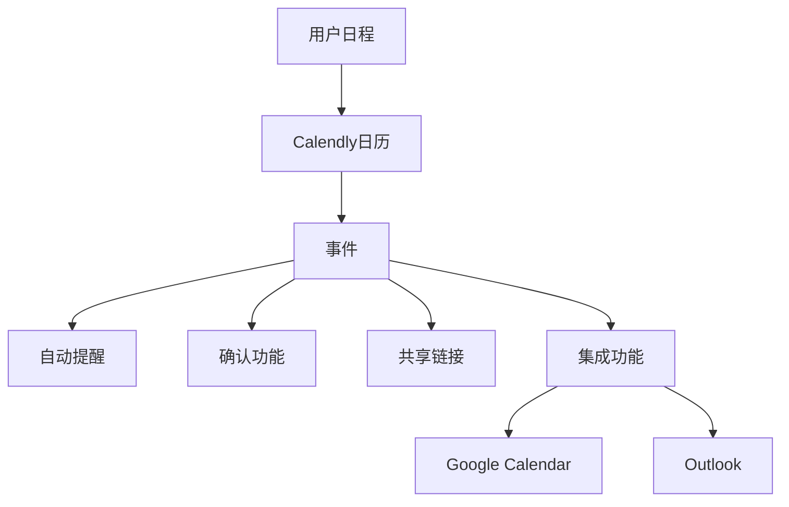

                 

### 文章标题

《如何利用Calendly优化创业者的日程管理》

关键词：Calendly，创业者，日程管理，自动化，效率，协作

摘要：本文旨在探讨如何利用Calendly这一先进的日程管理工具来优化创业者的日程管理。通过分析Calendly的发展历程、核心功能、架构与运行原理，本文将详细阐述Calendly在创业者日程管理中的具体应用，包括预约会议、自动化日程安排与提醒、集成与高级功能使用等方面。此外，本文还将分享成功案例与实战经验，并展望Calendly在创业生态系统中的未来发展。通过本文的讲解，创业者将能够更好地利用Calendly来提升日程管理的效率和效果。

---

### 引言

在当今快速发展的商业环境中，创业者的日程管理变得尤为重要。随着业务规模的不断扩大，创业者需要应对大量的会议、团队协作、客户沟通等活动，这使得日程管理成为一个巨大的挑战。有效的日程管理不仅能够帮助创业者更好地安排时间，提高工作效率，还能确保项目按时完成，从而在竞争激烈的创业领域中脱颖而出。

然而，传统的日程管理方法往往存在诸多问题，如手动安排会议、邮件确认会议时间、反复修改日程等，这不仅浪费了创业者的宝贵时间，还容易导致遗漏和冲突。为了解决这一问题，创业者需要寻找一种高效、自动化的日程管理工具。

Calendly，作为一款强大的日程管理工具，为创业者提供了一个简洁、高效的解决方案。它能够自动安排会议时间，发送提醒，并与其他工具集成，帮助创业者更好地管理日程，专注于业务发展。本文将深入探讨如何利用Calendly优化创业者的日程管理，包括其发展历程、核心功能、架构与运行原理，以及在创业者日程管理中的具体应用。通过本文的讲解，创业者将能够更好地利用Calendly来提升日程管理的效率和效果。

### Calendly概述

#### 第1章：Calendly介绍与功能解析

Calendly是一款功能强大的日程管理工具，旨在帮助用户简化日程安排，提高效率。它的发展历程可以追溯到2012年，由Mike Knoop、T.J. Lubick和Annie Hopp三位创始人创立。自成立以来，Calendly迅速发展，用户数量和市场份额持续增长，成为全球范围内受欢迎的日程管理工具之一。

#### 1.1 Calendly的发展历程

Calendly的早期阶段主要集中在开发基础的日程安排功能，如自动预约会议、发送提醒等。随着用户需求的不断增长，Calendly逐渐扩展其功能，引入了更多高级特性，如共享日历、自定义时间段、集成第三方服务等。

近年来，Calendly在技术创新和市场扩展方面取得了显著成果。它不断优化用户体验，推出新的功能模块，并与各大知名公司合作，将Calendly的日程管理解决方案应用到更多行业和场景中。如今，Calendly已经成为许多创业者和企业的重要日程管理工具。

#### 1.2 Calendly的核心功能

Calendly的核心功能包括以下几个方面：

1. **自动预约会议**：用户可以通过Calendly创建自定义时间段，邀请他人预约会议。Calendly会自动处理预约请求，将会议时间安排在用户可用的时段内，避免了手动协调时间的繁琐过程。

2. **发送提醒**：Calendly会在会议前向参与者发送提醒，确保他们不会错过重要会议。用户可以根据需要自定义提醒时间，选择发送邮件、短信或推送通知。

3. **共享日历**：用户可以将Calendly日历与同事、团队成员或其他相关方共享，实现日程的同步和协作。这使得团队成员可以轻松查看他人的日程安排，避免时间冲突。

4. **集成第三方服务**：Calendly支持与多种第三方服务集成，如Google Calendar、Outlook、Zoom等。用户可以将Calendly与这些服务关联，实现日程的无缝同步和管理。

#### 1.3 Calendly的优势与应用场景

Calendly的优势在于其高效、自动化的日程管理能力，特别适合需要频繁安排会议和活动的创业者。以下是一些典型的应用场景：

1. **创业者与投资者的会议安排**：创业者可以利用Calendly与投资者、顾问、潜在客户等进行会议预约，确保时间的高效利用。

2. **团队协作与项目协调**：团队成员可以通过Calendly共享日程，协调会议时间，提高项目执行的效率。

3. **客户沟通与支持**：创业者可以利用Calendly为客户提供在线预约服务，提高客户满意度和服务质量。

4. **个人日程管理**：创业者个人可以利用Calendly管理个人日程，包括会议、约会、健身等活动，保持生活和工作平衡。

总之，Calendly作为一款先进的日程管理工具，为创业者提供了高效、自动化的解决方案，帮助他们更好地管理日程，提高工作效率，专注于业务发展。在接下来的章节中，我们将深入探讨Calendly的核心概念与联系，以及其架构与运行原理。

### Calendly核心概念与联系

#### 第2章：Calendly核心概念与联系

Calendly的强大功能源于其核心概念与联系的有效整合。在这部分，我们将详细探讨Calendly中的关键概念，包括事件与日历、自动提醒与确认功能、共享链接与集成功能，以及Calendly与Google Calendar、Outlook等日历的集成。

#### 2.1 Calendly中的事件与日历

事件是Calendly日程管理的基础单位，代表着用户需要安排的活动，如会议、约会、培训等。每个事件都可以拥有特定的名称、时间、地点和参与者等信息。用户可以在Calendly中创建多个事件，并将其与个人或团队的日程同步。

日历是Calendly中用于组织和显示事件的工具。用户可以在Calendly中创建个人日历、团队日历或项目日历，以便更好地管理和跟踪不同类型的活动。日历视图提供了直观的界面，用户可以轻松地查看当天、本周或本月的日程安排。

事件与日历之间的联系在于，每个事件都会在关联的日历中显示。用户可以在日历中创建事件，并通过拖放操作调整时间，Calendly会自动更新事件的详细信息。此外，用户还可以在日历上查看事件的详细信息，如参与者、地点和备注等。

#### 2.2 Calendly的自动提醒与确认功能

自动提醒与确认功能是Calendly的一大亮点，极大地提升了日程管理的效率。Calendly会根据用户设置的提醒时间，提前向参与者发送提醒通知，确保他们不会错过重要会议。用户可以自定义提醒的时间，如15分钟、1小时或1天前。

除了提醒功能，Calendly还提供了确认功能。当参与者预约会议后，Calendly会自动发送确认邮件，通知用户会议已确认，并包含会议的详细信息，如时间、地点和链接等。确认功能有助于避免会议时间冲突，确保会议顺利进行。

#### 2.3 Calendly的共享链接与集成功能

共享链接功能使得用户能够轻松地将日程共享给他人。用户可以通过Calendly生成独特的共享链接，并将其发送给团队成员、合作伙伴或客户。接收者可以通过点击链接直接查看用户的日程安排，并预约会议。

集成功能是Calendly的另一大优势。Calendly支持与多种第三方服务集成，如Google Calendar、Outlook、Zoom等。用户可以将Calendly与这些服务关联，实现日程的无缝同步和管理。例如，当用户在Calendly中创建一个会议事件后，该事件会自动同步到Google Calendar或其他日历应用中。同样，用户在Google Calendar中修改日程时，Calendly会自动更新相应的事件。

#### 2.4 Calendly与Google Calendar、Outlook等日历的集成

Calendly与Google Calendar、Outlook等日历的集成使得用户能够在一个平台上管理所有日程。用户可以通过Calendly的集成功能，将Calendly日历与Google Calendar、Outlook等日历关联。

具体来说，用户只需在Calendly中启用与Google Calendar或Outlook的集成，然后按照提示完成授权过程。完成后，Calendly会将用户的日程同步到Google Calendar或Outlook中。用户可以在Google Calendar或Outlook中查看、修改和删除Calendly中的事件，所有更改都会自动同步回Calendly。

此外，Calendly还支持双向同步，即用户在Calendly中创建的事件会同步到Google Calendar或Outlook，反之亦然。这种双向同步功能确保了用户在不同平台之间的日程安排保持一致，避免了重复操作和错误。

#### Mermaid 流程图

为了更直观地展示Calendly的核心概念与联系，我们可以使用Mermaid流程图来描述：



通过这个流程图，我们可以清晰地看到事件、日历、自动提醒、确认功能、共享链接和集成功能之间的关系，以及Calendly与Google Calendar、Outlook等日历的集成过程。

总结来说，Calendly通过事件与日历、自动提醒与确认功能、共享链接与集成功能等核心概念的有效整合，为创业者提供了一个高效、自动化的日程管理解决方案。在下一部分，我们将深入探讨Calendly的架构与运行原理。

### Calendly的架构与运行原理

Calendly的架构设计是其高效性和可靠性的关键。了解Calendly的架构和运行原理，对于创业者来说，有助于更好地利用这一工具来管理日程，提高工作效率。以下是Calendly架构的详细解析。

#### 3.1 Calendly的架构设计

Calendly采用了微服务架构，这使得系统具有良好的可扩展性、稳定性和灵活性。微服务架构将Calendly拆分成多个独立的服务模块，每个模块负责特定的功能，如用户认证、事件调度、提醒通知、数据存储等。

以下是Calendly架构的主要组成部分：

1. **用户认证服务**：负责用户身份验证和授权，确保只有经过认证的用户才能访问Calendly的资源和功能。

2. **事件调度服务**：负责处理事件创建、更新和删除等操作，并确保事件按照预定时间进行调度。

3. **提醒通知服务**：负责发送会议提醒和确认通知，确保参与者不会错过重要会议。

4. **数据存储服务**：负责存储用户数据，包括日程、事件、通知等。

5. **API接口服务**：提供与第三方服务集成的接口，如Google Calendar、Outlook等。

通过微服务架构，Calendly能够快速响应需求变化，灵活地扩展和升级系统功能，同时保证了系统的稳定性和可靠性。

#### 3.2 Calendly的API接口

Calendly提供了一套强大的API接口，允许开发者自定义集成和扩展Calendly的功能。API接口分为RESTful API和Webhook两种类型。

1. **RESTful API**：提供了丰富的操作接口，包括用户管理、事件管理、提醒管理等。开发者可以通过这些接口实现与Calendly的数据交互，如创建事件、查询日程、发送提醒等。

2. **Webhook**：允许开发者设置事件触发器，当特定事件发生时，Calendly会自动向指定的URL发送HTTP请求。这种机制使得开发者能够实时获取Calendly的事件更新，实现与外部系统的同步和联动。

以下是一个简单的伪代码示例，展示了如何使用Calendly的RESTful API创建一个会议事件：

```python
import requests

url = "https://api.calendly.com/events"
headers = {
    "Authorization": "Bearer YOUR_ACCESS_TOKEN",
    "Content-Type": "application/json"
}
data = {
    "title": "Team Meeting",
    "start": "2023-11-02T14:00:00Z",
    "end": "2023-11-02T16:00:00Z",
    "attendees": [
        "user@example.com"
    ]
}

response = requests.post(url, headers=headers, json=data)
if response.status_code == 201:
    print("Event created successfully.")
else:
    print("Failed to create event.")
```

通过这个示例，开发者可以轻松地利用Calendly的API接口创建和管理会议事件。

#### 3.3 Calendly的事件调度算法

事件调度是Calendly的核心功能之一。Calendly使用了一种高效的事件调度算法，确保会议时间能够自动安排在用户的可预约时间段内，同时避免时间冲突。

以下是Calendly事件调度算法的基本原理：

1. **用户可预约时间段**：用户在Calendly中设置自己的可预约时间段，如每周三下午2点到4点。这些时间段将用于用户与参与者之间的会议安排。

2. **事件请求**：当参与者尝试预约会议时，Calendly会根据用户的可预约时间段和已存在的日程安排，寻找合适的会议时间。

3. **冲突检测**：Calendly会检查用户当前的日程安排，确保预约的时间不会与其他已存在的事件冲突。如果检测到冲突，Calendly会尝试调整时间或提出其他可预约时间段供选择。

4. **时间调度**：一旦找到合适的会议时间，Calendly会创建事件并将会议时间安排在用户的日程中。

5. **提醒和确认**：Calendly会自动向参与者发送提醒通知，并确保会议时间被确认。

以下是一个简单的伪代码示例，展示了Calendly事件调度算法的基本流程：

```python
def schedule_event(user, participant, start_time, end_time):
    # 检查用户日程冲突
    if has_conflicts(user, start_time, end_time):
        return "Conflict detected."
    
    # 创建事件
    event = create_event(user, participant, start_time, end_time)
    
    # 发送提醒通知
    send_reminder(participant, event)
    
    return "Event scheduled successfully."

def has_conflicts(user, start_time, end_time):
    # 检查用户当前日程
    current_events = get_user_events(user)
    for event in current_events:
        if start_time < event.end < end_time:
            return True
    return False

def create_event(user, participant, start_time, end_time):
    # 创建事件数据
    event_data = {
        "title": "Meeting",
        "start": start_time,
        "end": end_time,
        "attendees": [participant]
    }
    return event_data

def send_reminder(participant, event):
    # 发送提醒通知
    send_notification(participant, event)
```

通过这个示例，我们可以看到Calendly事件调度算法的基本流程，包括冲突检测、事件创建和提醒通知。

#### 3.4 Calendly的稳定性与可靠性保障

稳定性与可靠性是Calendly架构设计的重要考虑因素。为了确保系统的高可用性和数据安全，Calendly采取了多种措施：

1. **分布式架构**：Calendly采用分布式架构，确保关键组件在服务器故障时仍能正常运行。

2. **冗余备份**：Calendly的数据存储和服务器系统都有冗余备份，确保数据不丢失，系统不中断。

3. **自动故障恢复**：Calendly配置了自动故障恢复机制，当检测到系统故障时，自动切换到备用系统，确保服务不中断。

4. **监控与预警**：Calendly通过实时监控和预警系统，确保系统状态随时掌握，快速响应和处理异常情况。

总结来说，Calendly的架构设计以其高效性、稳定性和可靠性而著称。通过API接口、事件调度算法和稳定性保障措施，Calendly为创业者提供了一个强大的日程管理解决方案。在下一部分，我们将探讨Calendly在创业者日程管理中的应用。

### 创业者日程管理问题分析

#### 第4章：创业者日程管理问题分析

对于创业者来说，时间管理是一项至关重要的任务。然而，在快速发展的创业环境中，他们面临着许多日程管理的挑战。这些挑战不仅影响了创业者个人的工作效率，也影响了团队的协作和项目进度。以下是对创业者日程管理问题的详细分析。

#### 4.1 创业者日程管理的挑战

1. **会议冲突**：创业者经常需要参加多个会议，尤其是在创业初期，会议频率很高。这使得安排会议时间成为一个巨大的挑战，经常出现会议冲突，导致时间浪费和效率降低。

2. **手动协调时间**：传统的日程管理方法通常需要手动协调时间，这包括与会议参与者通过电子邮件或电话反复确认会议时间，这不仅耗时，而且容易出错。

3. **时间碎片化**：创业者的日程往往被各种短时任务和紧急事件打断，导致时间碎片化，难以集中精力处理重要任务。

4. **缺乏自动化**：许多创业者依赖手工记录和管理日程，缺乏自动化工具，这使得日程管理过程繁琐且不高效。

5. **跨平台同步**：创业者需要在不同平台和设备之间管理日程，如Google Calendar、Outlook等，这增加了日程管理的复杂性和出错风险。

#### 4.2 创业者日程管理的最佳实践

为了应对这些挑战，创业者可以采取以下最佳实践：

1. **优先级排序**：创业者应该明确每日、每周和每月的任务优先级，将最重要的任务安排在最佳时间段，确保关键任务得到优先处理。

2. **自动化日程安排**：利用自动化日程管理工具，如Calendly，可以大大减少手动协调时间的繁琐，提高会议安排的效率和准确性。

3. **定期回顾**：创业者应定期回顾自己的日程安排和任务完成情况，根据实际情况调整优先级和时间分配，确保计划与实际情况相符。

4. **团队协作**：建立高效的团队协作机制，确保团队成员的日程安排和任务进展透明，避免重复工作和时间浪费。

5. **有效沟通**：提高沟通效率，减少不必要的会议，确保每次会议都有明确的目标和产出，避免会议时间被浪费。

#### 4.3 如何利用Calendly解决创业者日程管理问题

Calendly是一款专为解决创业者日程管理问题而设计的工具，通过以下功能可以帮助创业者优化日程管理：

1. **自动预约会议**：创业者可以通过Calendly创建自定义时间段，邀请他人预约会议。Calendly会自动处理预约请求，确保会议时间安排在可用的时段内，避免了手动协调时间的繁琐过程。

2. **自动提醒和确认**：Calendly会在会议前向参与者发送提醒通知，确保他们不会错过重要会议。用户可以根据需要自定义提醒时间，选择发送邮件、短信或推送通知。

3. **共享日历**：创业者可以将Calendly日历与团队成员共享，实现日程的同步和协作。这使得团队成员可以轻松查看他人的日程安排，避免时间冲突。

4. **集成第三方服务**：Calendly支持与Google Calendar、Outlook等日历的集成，用户可以在一个平台上管理所有日程，确保日程的一致性和准确性。

#### 实例说明

假设创业者John需要安排与潜在投资者的会议。以下是利用Calendly解决这个问题的步骤：

1. **创建会议时间**：John在Calendly中设置可预约的时间段，如每周二上午9点到下午5点。

2. **生成共享链接**：John将生成的共享链接通过电子邮件发送给潜在投资者。

3. **投资者预约会议**：投资者通过点击共享链接，选择一个合适的会议时间，并将其预约。

4. **自动提醒和确认**：Calendly会在会议前向John和投资者发送提醒通知，确保双方不会错过会议。

5. **会议时间同步**：Calendly将会议时间同步到John的Google Calendar或其他日历中，确保其日程安排一致。

通过以上步骤，John无需手动协调时间，大大提高了会议安排的效率和准确性。此外，Calendly的自动提醒和确认功能也确保了会议的顺利进行。

总之，通过分析创业者日程管理的挑战和最佳实践，并结合Calendly的具体应用，创业者可以更好地利用这一工具来优化日程管理，提高工作效率。在下一部分，我们将深入探讨Calendly在创业者日程管理中的具体应用。

### Calendly在创业者日程管理中的具体应用

#### 第5章：Calendly在创业者日程管理中的具体应用

Calendly不仅是一款功能强大的日程管理工具，也是创业者优化日程管理、提高工作效率的利器。在本章节中，我们将详细探讨Calendly在创业者日程管理中的具体应用，包括预约会议、自动化日程安排与提醒、集成与高级功能使用等方面。

#### 5.1 利用Calendly预约会议

预约会议是创业者日程管理中的一项重要任务，而Calendly通过其自动预约功能，使得这一过程变得高效且简便。以下是如何使用Calendly预约会议的步骤：

1. **创建事件**：创业者首先在Calendly中创建一个会议事件。在Calendly的界面中，选择“新建事件”选项，输入会议的名称、描述、时间范围等信息。

2. **设置时间段**：在创建事件时，创业者可以设置自己的可预约时间段。这些时间段可以是固定的，也可以根据需求进行调整。例如，创业者可以设置每周三上午10点到下午4点为可预约时间段。

3. **生成共享链接**：完成事件创建后，Calendly会自动生成一个共享链接。创业者可以将这个链接通过电子邮件、社交媒体或任何其他沟通渠道发送给会议参与者。

4. **参与者预约**：参与者通过点击共享链接，可以看到创业者设置的时间段，并选择一个合适的时间进行预约。预约成功后，Calendly会自动更新事件，并将参与者添加到会议列表中。

以下是一个示例伪代码，展示了如何通过Calendly的API接口创建一个会议事件：

```python
import requests

url = "https://api.calendly.com/events"
headers = {
    "Authorization": "Bearer YOUR_ACCESS_TOKEN",
    "Content-Type": "application/json"
}
data = {
    "title": "Investor Meeting",
    "description": "Discuss business opportunities.",
    "start": "2023-11-02T10:00:00Z",
    "end": "2023-11-02T11:00:00Z",
    "timezone": "America/New_York",
    "attendees": [
        {"email": "investor@example.com"}
    ]
}

response = requests.post(url, headers=headers, json=data)
if response.status_code == 201:
    print("Event created successfully.")
else:
    print("Failed to create event.")
```

通过这个示例，创业者可以轻松地通过API接口创建会议事件，从而实现自动化的预约管理。

#### 5.2 自动化日程安排与提醒

自动化的日程安排与提醒是Calendly的一大优势，它能够大大减少创业者手动处理日程的繁琐工作。以下是Calendly自动化日程安排与提醒的几个关键功能：

1. **自动提醒**：创业者可以在Calendly中设置自动提醒，确保会议前及时通知参与者。提醒可以通过电子邮件、短信或推送通知发送，提醒时间为会议时间的15分钟、1小时或1天前，创业者可以根据实际情况自定义。

2. **重复事件**：对于定期举行的活动，如团队会议、培训等，创业者可以设置重复事件。Calendly会自动生成一系列事件，并在相应时间提醒参与者。

3. **时间冲突检测**：在创业者尝试预约会议时，Calendly会自动检查时间冲突，确保新的会议时间不会与已有日程冲突。

以下是一个简单的伪代码示例，展示了如何使用Calendly的API设置自动提醒：

```python
import requests

url = "https://api.calendly.com/reminders"
headers = {
    "Authorization": "Bearer YOUR_ACCESS_TOKEN",
    "Content-Type": "application/json"
}
data = {
    "event_id": "YOUR_EVENT_ID",
    "method": "email",
    "send_at": "2023-11-02T10:00:00Z",
    "message": "Reminder: Your meeting with Investor is scheduled for tomorrow."
}

response = requests.post(url, headers=headers, json=data)
if response.status_code == 201:
    print("Reminder sent successfully.")
else:
    print("Failed to send reminder.")
```

通过这个示例，创业者可以轻松地设置自动提醒，确保会议参与者不会错过重要会议。

#### 5.3 集成Calendly与创业者的其他工具

集成是Calendly的一大特色，它能够与创业者的其他工具无缝协作，提高工作效率。以下是一些常见的集成场景：

1. **集成Google Calendar**：创业者可以将Calendly与Google Calendar集成，实现日程同步。这意味着在Calendly中创建的事件会自动同步到Google Calendar，反之亦然。

2. **集成Outlook**：与Outlook集成可以帮助创业者在一个平台上管理所有日程，确保日程的一致性和准确性。

3. **集成Zoom**：对于需要视频会议的创业者，Calendly可以与Zoom集成，自动生成Zoom会议链接，并在会议前发送给参与者。

以下是一个示例伪代码，展示了如何使用Calendly的API接口与Google Calendar集成：

```python
import requests

url = "https://api.calendly.com/events/google/calendar"
headers = {
    "Authorization": "Bearer YOUR_ACCESS_TOKEN",
    "Content-Type": "application/json"
}
data = {
    "event_id": "YOUR_EVENT_ID",
    "calendar_id": "YOUR_CALENDAR_ID",
    "status": "tentative",
    "description": "Meeting with Investor."
}

response = requests.post(url, headers=headers, json=data)
if response.status_code == 201:
    print("Event synced with Google Calendar successfully.")
else:
    print("Failed to sync event with Google Calendar.")
```

通过这个示例，创业者可以轻松地将Calendly中的事件同步到Google Calendar，从而实现跨平台的日程管理。

#### 5.4 提高会议效率和效果

Calendly不仅帮助创业者简化了会议预约和日程管理流程，还通过以下功能提高了会议的效率和效果：

1. **议程管理**：创业者可以在Calendly中设置会议议程，确保会议有条不紊地进行。议程可以包括讨论主题、时间分配、参与者角色等。

2. **会议记录**：创业者可以使用Calendly记录会议内容，包括重要决策、任务分配和行动项。这些记录可以方便地共享给团队成员。

3. **数据分析和报告**：Calendly提供了数据分析功能，创业者可以查看会议参与率、会议时长、会议频率等数据，从而优化会议安排和提高效率。

以下是一个示例伪代码，展示了如何使用Calendly的API接口创建会议议程：

```python
import requests

url = "https://api.calendly.com/events/agenda"
headers = {
    "Authorization": "Bearer YOUR_ACCESS_TOKEN",
    "Content-Type": "application/json"
}
data = {
    "event_id": "YOUR_EVENT_ID",
    "items": [
        {
            "title": "Introduction",
            "duration": 10
        },
        {
            "title": "Business Update",
            "duration": 20
        },
        {
            "title": "Q&A",
            "duration": 15
        }
    ]
}

response = requests.post(url, headers=headers, json=data)
if response.status_code == 201:
    print("Agenda created successfully.")
else:
    print("Failed to create agenda.")
```

通过这个示例，创业者可以轻松地创建会议议程，确保会议高效进行。

总之，Calendly通过预约会议、自动化日程安排与提醒、集成与高级功能使用，为创业者提供了一个全面的日程管理解决方案。通过Calendly，创业者可以轻松地管理会议、优化日程，提高工作效率，从而更好地专注于业务发展。在下一部分，我们将探讨Calendly的高级功能与定制化，以及如何在创业团队中协作使用Calendly。

### Calendly高级功能与定制化

#### 第6章：Calendly高级功能与定制化

Calendly不仅提供了基础的日程管理功能，还拥有许多高级和定制化的选项，使创业者能够更好地满足特定需求。在本章节中，我们将探讨Calendly的高级设置、定制化表单、自动化流程，以及如何利用Calendly在创业团队中协作。

#### 6.1 Calendly的高级设置

Calendly的高级设置功能为创业者提供了更多的自定义选项，使其能够根据具体需求进行个性化配置。以下是一些高级设置：

1. **自定义时间段**：创业者可以设置自定义时间段，如特定的工作日、时间段或时间段组合。这有助于避免时间冲突，确保会议在合适的时间进行。

2. **重复事件设置**：对于定期举行的活动，如每周例会或每月团队会议，创业者可以设置重复事件，Calendly会自动生成一系列事件，并按照预定时间提醒参与者。

3. **自定义提醒**：创业者可以自定义提醒时间，选择发送电子邮件、短信或推送通知。此外，还可以设置提醒的内容和格式，确保参与者能够及时收到通知。

4. **日历视图**：Calendly提供了多种日历视图选项，如日视图、周视图、月视图等，创业者可以根据自己的偏好选择最合适的视图，以便更好地管理日程。

以下是一个简单的伪代码示例，展示了如何使用Calendly的API设置自定义时间段：

```python
import requests

url = "https://api.calendly.com/time_slots"
headers = {
    "Authorization": "Bearer YOUR_ACCESS_TOKEN",
    "Content-Type": "application/json"
}
data = {
    "name": "Business Hours",
    "start": "2023-11-02T09:00:00Z",
    "end": "2023-11-02T17:00:00Z",
    "timezone": "America/New_York"
}

response = requests.post(url, headers=headers, json=data)
if response.status_code == 201:
    print("Time slot created successfully.")
else:
    print("Failed to create time slot.")
```

通过这个示例，创业者可以轻松地创建自定义时间段，并将其应用于日程管理。

#### 6.2 定制化Calendly表单

Calendly的定制化表单功能允许创业者创建自定义表单，以收集参与者的额外信息。这有助于更好地了解参与者需求，为会议准备提供更多细节。以下是一些常见的定制化表单场景：

1. **收集参与者信息**：创业者可以创建包含姓名、电子邮件、公司名称等信息的表单，确保在会议前获取到必要的信息。

2. **会议调查**：在会议结束后，创业者可以通过Calendly发送调查问卷，收集参与者对会议的评价和建议，以便持续改进。

3. **预订服务**：对于提供预约服务的创业者，如咨询顾问或培训师，可以通过定制化表单收集预约者的详细需求，如服务类型、时间长度等。

以下是一个简单的伪代码示例，展示了如何使用Calendly的API创建自定义表单：

```python
import requests

url = "https://api.calendly.com/forms"
headers = {
    "Authorization": "Bearer YOUR_ACCESS_TOKEN",
    "Content-Type": "application/json"
}
data = {
    "name": "Meeting Request",
    "title": "Please provide your details for the meeting.",
    "description": "We will schedule the meeting based on your availability.",
    "fields": [
        {
            "label": "Name",
            "type": "text",
            "required": true
        },
        {
            "label": "Email",
            "type": "email",
            "required": true
        },
        {
            "label": "Company",
            "type": "text"
        }
    ]
}

response = requests.post(url, headers=headers, json=data)
if response.status_code == 201:
    print("Form created successfully.")
else:
    print("Failed to create form.")
```

通过这个示例，创业者可以轻松地创建自定义表单，并收集必要的信息。

#### 6.3 利用Calendly自动化流程

Calendly的自动化流程功能使得创业者能够自动化处理日程管理的各个环节，从而提高效率。以下是一些常见的自动化流程场景：

1. **预约确认**：当参与者通过Calendly预约会议时，Calendly可以自动发送确认邮件，包含会议的详细信息，确保参与者对会议安排有清晰的了解。

2. **任务分配**：在会议结束后，Calendly可以根据会议记录自动创建任务，并分配给相应的团队成员，确保会议决策得到有效执行。

3. **数据收集**：创业者可以使用Calendly收集会议数据，如参与率、会议时长等，并通过API将数据导入分析工具，以优化会议安排和资源分配。

以下是一个简单的伪代码示例，展示了如何使用Calendly的API自动化处理会议预约和确认流程：

```python
import requests

def schedule_meeting(event_id, participant_email):
    # 预约会议
    url = f"https://api.calendly.com/events/{event_id}/attendees"
    headers = {
        "Authorization": "Bearer YOUR_ACCESS_TOKEN",
        "Content-Type": "application/json"
    }
    data = {
        "email": participant_email
    }

    response = requests.post(url, headers=headers, json=data)
    if response.status_code == 201:
        print("Meeting scheduled successfully.")
    else:
        print("Failed to schedule meeting.")

def send_confirmation_email(event_id, participant_email):
    # 发送确认邮件
    url = f"https://api.calendly.com/events/{event_id}/reminders/confirmation"
    headers = {
        "Authorization": "Bearer YOUR_ACCESS_TOKEN",
        "Content-Type": "application/json"
    }
    data = {
        "email": participant_email
    }

    response = requests.post(url, headers=headers, json=data)
    if response.status_code == 201:
        print("Confirmation email sent successfully.")
    else:
        print("Failed to send confirmation email.")

# 示例使用
event_id = "YOUR_EVENT_ID"
participant_email = "participant@example.com"

schedule_meeting(event_id, participant_email)
send_confirmation_email(event_id, participant_email)
```

通过这个示例，创业者可以轻松地通过API自动化处理会议预约和确认流程。

#### 6.4 Calendly与创业团队的协作

为了在创业团队中高效协作，Calendly提供了一系列功能，帮助团队成员同步日程、协调会议时间，并提高团队整体的工作效率。

1. **共享日历**：团队成员可以将各自的Calendly日历共享，以便其他成员查看他们的日程安排。这有助于避免时间冲突，确保团队会议和其他活动能够顺利进行。

2. **团队事件**：Calendly允许创业者创建团队事件，团队成员可以一起预约会议或活动。团队事件会自动同步到每个成员的日历中，确保所有人都了解会议时间和地点。

3. **权限管理**：创业者可以为团队成员分配不同的权限，如查看、修改或删除事件。这有助于保护敏感信息，同时确保团队成员能够高效协作。

以下是一个简单的伪代码示例，展示了如何使用Calendly的API共享日历和创建团队事件：

```python
import requests

def share_calendar(user_id, team_member_id):
    # 共享日历
    url = f"https://api.calendly.com/users/{user_id}/calendars"
    headers = {
        "Authorization": "Bearer YOUR_ACCESS_TOKEN",
        "Content-Type": "application/json"
    }
    data = {
        "shared_with": [
            {"id": team_member_id}
        ]
    }

    response = requests.put(url, headers=headers, json=data)
    if response.status_code == 200:
        print("Calendar shared successfully.")
    else:
        print("Failed to share calendar.")

def create_team_event(team_id, title, start_time, end_time):
    # 创建团队事件
    url = f"https://api.calendly.com/teams/{team_id}/events"
    headers = {
        "Authorization": "Bearer YOUR_ACCESS_TOKEN",
        "Content-Type": "application/json"
    }
    data = {
        "title": title,
        "start": start_time,
        "end": end_time
    }

    response = requests.post(url, headers=headers, json=data)
    if response.status_code == 201:
        print("Team event created successfully.")
    else:
        print("Failed to create team event.")

# 示例使用
user_id = "YOUR_USER_ID"
team_member_id = "YOUR_TEAM_MEMBER_ID"
team_id = "YOUR_TEAM_ID"

share_calendar(user_id, team_member_id)
create_team_event(team_id, "Team Meeting", "2023-11-02T14:00:00Z", "2023-11-02T16:00:00Z")
```

通过这个示例，创业者可以轻松地通过API共享日历和创建团队事件，从而实现团队协作。

总之，Calendly的高级功能和定制化选项为创业者提供了极大的灵活性，使得他们能够更好地满足特定需求。通过利用这些功能，创业者可以大幅提高日程管理的效率和效果，从而更加专注于业务发展。在下一部分，我们将分享成功案例与实战经验，以帮助创业者更好地了解如何利用Calendly优化日程管理。

### 成功案例与实战经验分享

#### 第7章：成功案例与实战经验分享

在利用Calendly优化日程管理的实际应用中，许多创业者和企业已经取得了显著成效。以下是一些成功案例与实战经验，这些案例展示了如何通过Calendly有效地管理日程，提高工作效率。

#### 7.1 创业者如何成功优化日程管理

1. **案例分析：初创公司TechStart**：
   TechStart是一家专注于人工智能初创公司，团队成员遍布全球。在创业初期，他们面临着时间冲突和手动协调会议的挑战。通过引入Calendly，TechStart团队成功优化了日程管理：

   - **步骤1**：创建共享日历：TechStart团队在Calendly中创建了一个共享日历，所有团队成员都可以查看彼此的日程安排，避免了会议冲突。
   - **步骤2**：自动预约会议：团队通过Calendly的自动预约功能，邀请外部合作伙伴和投资者预约会议，减少了手动协调时间的繁琐。
   - **步骤3**：集成第三方服务：TechStart将Calendly与Zoom集成，自动生成会议链接，确保远程会议顺利进行。

   通过这些措施，TechStart显著提高了会议安排的效率，团队成员能够更专注于核心业务。

2. **实战经验**：
   - **建议1**：为不同类型的会议设置不同的时间段，确保团队成员能够有足够的时间准备和参与。
   - **建议2**：定期回顾和调整日程安排，根据实际情况优化时间段和会议频率。
   - **建议3**：利用Calendly的自动提醒和确认功能，确保所有参与者都能收到及时的通知。

#### 7.2 成功案例分享

1. **案例分析：在线教育平台EdTech**：
   EdTech是一家提供在线教育课程的平台，他们需要频繁与教师、学员和家长进行沟通。通过使用Calendly，EdTech成功优化了沟通和日程管理：

   - **步骤1**：定制化表单：EdTech使用Calendly的定制化表单功能，收集学员的预约请求和相关信息，确保会议准备充分。
   - **步骤2**：自动提醒和确认：Calendly在会议前自动发送提醒，确保所有参与者都能及时收到通知，避免错过重要会议。
   - **步骤3**：集成日历：EdTech将Calendly与Google Calendar集成，实现日程的同步和管理，提高了沟通和协调的效率。

   通过这些措施，EdTech显著提升了学员和教师的满意度，会议安排更加高效。

2. **实战经验**：
   - **建议1**：利用Calendly的定制化表单，确保收集到必要的信息，为会议准备提供更多细节。
   - **建议2**：定期检查和更新Calendly的共享日历，确保日程信息的准确性和及时性。
   - **建议3**：结合Calendly的自动提醒和确认功能，确保会议的顺利进行，减少沟通障碍。

#### 7.3 实战经验与技巧总结

通过以上成功案例和实战经验，我们可以总结出以下优化日程管理的技巧：

1. **高效预约会议**：利用Calendly的自动预约功能，简化会议安排，减少手动协调时间。

2. **定制化管理**：使用Calendly的定制化功能，如自定义时间段、定制化表单等，满足不同场景的需求。

3. **自动化提醒**：设置自动提醒和确认功能，确保会议通知及时送达，提高会议参与率。

4. **集成与同步**：将Calendly与Google Calendar、Outlook等日历集成，实现日程的无缝同步和管理。

5. **团队协作**：利用Calendly的共享日历和团队事件功能，实现团队成员之间的高效协作。

总之，通过成功案例和实战经验的分享，我们可以看到Calendly在优化创业者日程管理方面的巨大潜力。创业者可以通过借鉴这些经验，结合自身需求，充分利用Calendly的功能，实现高效的日程管理，从而更好地专注于业务发展。在下一部分，我们将探讨Calendly在创业生态系统中的应用。

### Calendly在创业生态系统中的应用

#### 第8章：Calendly在创业生态系统中的应用

在创业生态系统中，Calendly作为一种高效的日程管理工具，不仅能够帮助创业者优化个人和时间管理，还能在更广泛的场景中发挥作用。以下将探讨Calendly在创业投资与融资活动中的应用，以及其在创业比赛与活动中的实际案例。

#### 8.1 投资者日程管理优化

对于投资者来说，有效管理日程是确保投资决策高效执行的关键。Calendly提供了多种功能，可以帮助投资者优化日程管理：

1. **自动预约会议**：投资者可以利用Calendly设置可预约的时间段，潜在创业者可以轻松通过Calendly预约会议，无需反复协调时间。

2. **定制化时间段**：投资者可以根据自己的日程，自定义可预约时间段，确保在合适的时机与创业者沟通。

3. **自动提醒和确认**：Calendly会在会议前自动发送提醒，确保投资者和创业者都能按时参加会议，减少错过会议的可能性。

4. **集成与同步**：Calendly可以与投资者的日历应用（如Google Calendar、Outlook等）集成，确保所有日程信息同步，避免时间冲突。

以下是一个实际案例：

**案例：风投公司VentureTech**：
VentureTech是一家知名风投公司，他们需要频繁与创业者会面。通过引入Calendly，VentureTech团队实现了以下优化：

- **步骤1**：设置共享日历：VentureTech将Calendly日历与公司内部系统集成，所有团队成员都可以查看彼此的日程安排，避免时间冲突。
- **步骤2**：自动预约会议：创业者通过Calendly的共享链接预约会议，VentureTech团队成员会收到自动提醒，确保会议准时举行。
- **步骤3**：定制化时间段：团队成员根据个人日程设置可预约时间段，确保在合适的时机与创业者沟通。

通过这些措施，VentureTech显著提高了会议效率，减少了时间浪费，从而更好地专注于投资决策。

#### 8.2 提高融资会议效率

融资会议是创业者与投资者之间的重要环节，Calendly可以帮助创业者提高会议效率，确保会议顺利进行：

1. **自动预约会议**：创业者可以通过Calendly创建自定义时间段，邀请投资者预约会议，避免了手动协调时间的繁琐过程。

2. **自定义提醒**：Calendly会在会议前发送提醒，确保创业者和投资者都能收到通知，减少因遗忘导致的时间浪费。

3. **集成与同步**：Calendly可以与创业者常用的工具（如Trello、Asana等）集成，实现日程和任务的无缝同步。

以下是一个实际案例：

**案例：初创公司InnovateTech**：
InnovateTech是一家新兴科技公司，他们需要与多家投资者进行融资会议。通过使用Calendly，InnovateTech团队实现了以下优化：

- **步骤1**：创建共享日历：InnovateTech在Calendly中创建了一个共享日历，所有团队成员和投资者都可以查看会议安排，确保时间协调。
- **步骤2**：自动预约会议：投资者通过Calendly的共享链接预约会议，InnovateTech团队会收到自动提醒，确保会议时间准确无误。
- **步骤3**：自定义提醒：Calendly会根据创业者设置的时间段发送提醒，确保会议参与者都能收到通知。

通过这些措施，InnovateTech显著提高了融资会议的效率，确保了会议的顺利进行。

#### 8.3 Calendly在创业比赛与活动中的应用

创业比赛和活动是创业者展示项目和交流经验的重要平台，Calendly可以帮助组织者和参与者优化日程管理：

1. **自动预约会议**：组织者可以通过Calendly设置活动日程，参与者可以轻松预约一对一会议，与导师、投资者等进行沟通。

2. **自动提醒和确认**：Calendly会在活动前发送提醒，确保参与者不会错过重要会议或活动。

3. **集成与同步**：Calendly可以与活动管理工具（如Eventbrite、Meetup等）集成，实现日程和报名信息同步。

以下是一个实际案例：

**案例：创业比赛StartupFest**：
StartupFest是一个大型创业比赛，吸引了众多创业者、投资者和行业专家参与。通过引入Calendly，StartupFest组织者实现了以下优化：

- **步骤1**：创建活动日程：StartupFest在Calendly中设置了活动日程，包括比赛日程、一对一会议时间等，参与者可以通过Calendly进行预约。
- **步骤2**：自动预约会议：参与者通过Calendly的共享链接预约与导师、投资者的会议，组织者会收到自动提醒，确保会议安排准确无误。
- **步骤3**：自动提醒：Calendly会在活动前发送提醒，确保参与者不会错过重要会议或活动。

通过这些措施，StartupFest显著提高了活动的组织效率，为参与者提供了更好的体验。

总之，Calendly在创业生态系统中的应用不仅帮助创业者和个人优化日程管理，还在投资、融资和创业比赛等场景中发挥了重要作用。通过实际案例的分享，我们可以看到Calendly在提升效率、减少冲突和优化沟通方面的巨大潜力。在下一部分，我们将探讨Calendly在团队协作与项目协调中的应用。

### Calendly在团队协作与项目协调中的应用

#### 第9章：Calendly在团队协作与项目协调中的应用

在团队协作和项目协调中，有效的时间管理和沟通是确保项目顺利推进的关键。Calendly作为一款先进的日程管理工具，能够帮助团队更好地同步日程、协调会议，从而提高工作效率。以下将探讨Calendly在团队协作与项目协调中的具体应用。

#### 9.1 团队日程同步

团队日程同步是团队协作的基础，Calendly提供了多种方式帮助团队成员实现日程同步：

1. **共享日历**：团队成员可以将Calendly日历共享，使得其他成员可以查看各自的日程安排。这种共享机制有助于团队成员了解彼此的时间安排，避免会议冲突和资源浪费。

2. **集成第三方日历**：Calendly支持与Google Calendar、Outlook等第三方日历集成，团队成员可以在一个平台上管理所有日程，确保日程的一致性和准确性。

3. **同步任务和事件**：通过Calendly的集成功能，团队成员可以在Calendly中创建任务和事件，并将其同步到其他日历应用中，确保所有相关方都能实时跟踪项目进度。

以下是一个实际案例：

**案例：软件开发公司TechSolutions**：
TechSolutions是一家软件开发公司，团队成员分布在不同城市。为了实现高效的团队协作，TechSolutions采用了以下措施：

- **步骤1**：创建共享日历：公司管理员在Calendly中创建了一个共享日历，所有团队成员都可以查看彼此的日程安排，确保团队会议和其他活动能够顺利进行。
- **步骤2**：集成第三方日历：团队成员将各自的Google Calendar和Outlook日历与Calendly集成，实现日程同步和管理。
- **步骤3**：同步任务和事件：团队成员在Calendly中创建任务和事件，并将其同步到其他日历应用中，确保所有成员都能实时了解项目进度。

通过这些措施，TechSolutions显著提高了团队协作效率，减少了因时间冲突和沟通不畅导致的问题。

#### 9.2 项目会议管理

项目会议是项目推进的重要环节，Calendly可以帮助团队更好地管理项目会议：

1. **自动预约会议**：团队可以通过Calendly设置项目会议的时间段，团队成员和外部相关方可以轻松预约会议，避免了手动协调时间的繁琐过程。

2. **会议提醒和确认**：Calendly会在会议前发送提醒，确保所有参与者都能收到通知，减少了因遗忘导致的时间浪费。

3. **会议记录和任务分配**：团队可以在Calendly中记录会议内容和决策，并自动分配任务给相应的团队成员，确保会议决策得到有效执行。

以下是一个实际案例：

**案例：咨询公司BizConsult**：
BizConsult是一家提供战略咨询服务的公司，他们需要频繁召开项目会议。通过使用Calendly，BizConsult团队实现了以下优化：

- **步骤1**：创建项目会议时间段：在项目启动时，BizConsult在Calendly中设置了项目会议的时间段，团队成员和客户可以预约会议。
- **步骤2**：自动提醒和确认：Calendly会在会议前发送提醒，确保所有参与者都能收到通知，并确认参会。
- **步骤3**：记录会议内容和任务分配：在会议结束后，团队成员在Calendly中记录会议内容和决策，并自动将任务分配给相应的团队成员。

通过这些措施，BizConsult显著提高了项目会议的效率和效果，确保项目决策得到及时执行。

#### 9.3 提升团队协作效率

提升团队协作效率是团队成功的关键，Calendly通过以下功能帮助团队实现高效协作：

1. **自动化流程**：Calendly可以帮助团队自动化处理一些常规任务，如会议预约、提醒发送等，减少了团队成员的重复性工作，提高了工作效率。

2. **自定义设置**：团队可以根据具体需求，自定义Calendly的设置，如时间段、提醒方式等，确保工具能够满足团队的特殊需求。

3. **集成与扩展**：Calendly支持与多种第三方工具集成，如Trello、Asana等，团队可以通过这些集成实现更高效的工作流程。

以下是一个实际案例：

**案例：市场推广团队MarketingMasters**：
MarketingMasters是一家专注于市场推广的团队，他们需要频繁召开会议和协调任务。通过使用Calendly，MarketingMasters团队实现了以下优化：

- **步骤1**：自定义时间段和提醒：团队在Calendly中设置了自定义时间段，并根据成员的偏好设置了提醒方式，确保会议和任务能够及时进行。
- **步骤2**：集成Trello：团队将Calendly与Trello集成，通过Calendly创建的任务会自动同步到Trello，确保任务分配和进度跟踪。
- **步骤3**：自动化流程：团队利用Calendly的自动化流程功能，自动发送会议通知和任务提醒，减少了重复性工作。

通过这些措施，MarketingMasters团队显著提高了协作效率，确保项目按时完成。

总之，Calendly在团队协作与项目协调中的应用，通过日程同步、会议管理、自动化流程等功能，帮助团队实现了高效协作，提高了工作效率。通过实际案例的分享，我们可以看到Calendly在提升团队协作效率方面的巨大潜力。在下一部分，我们将展望Calendly的未来发展趋势。

### 未来展望

#### 第10章：未来展望

随着科技的不断进步和创业环境的日益复杂，日程管理工具的发展前景也非常广阔。Calendly作为一款先进的日程管理工具，其未来发展趋势和潜在应用领域值得深入探讨。

#### 10.1 Calendly的发展趋势

1. **人工智能与机器学习**：未来，Calendly有望进一步集成人工智能和机器学习技术，通过分析用户行为和偏好，提供更智能的日程建议和优化方案。例如，Calendly可以预测最佳会议时间，自动调整日程以减少时间冲突。

2. **区块链技术**：区块链技术的引入可能为Calendly带来更高的数据安全和透明度。通过使用区块链技术，Calendly可以确保日程数据的完整性和不可篡改性，同时提高用户对日程安排的信任度。

3. **物联网集成**：随着物联网设备的普及，Calendly有望与更多智能设备集成，如智能手表、智能家居等，实现日程的更全面管理。例如，用户可以通过智能手表接收会议提醒，从而减少对手机的依赖。

4. **全球化支持**：未来，Calendly将继续扩大其全球化支持，为不同国家和地区的用户量身定制日程管理方案。通过本地化适配，Calendly将更好地满足全球用户的多样化需求。

#### 10.2 创业者日程管理的新需求

随着创业领域的不断发展，创业者对日程管理工具的需求也在不断变化。以下是一些新需求：

1. **多语言支持**：创业者来自世界各地，多语言支持将使Calendly更好地服务于国际用户，提高用户体验。

2. **个性化定制**：创业者希望日程管理工具能够提供更多个性化定制选项，如自定义工作日历、个性化提醒等，以满足不同创业场景的需求。

3. **实时协作**：实时协作功能将帮助创业者更好地与团队成员和合作伙伴进行沟通和协调，提高项目执行效率。

4. **数据分析和洞察**：创业者需要更强大的数据分析功能，以了解日程安排的效果，优化资源分配和决策。

#### 10.3 Calendly在其他领域的应用潜力

除了创业者日程管理，Calendly在其他领域也有巨大的应用潜力：

1. **企业内部**：Calendly可以帮助企业内部实现高效的日程管理和协作，如部门间的会议安排、项目协调等。

2. **教育领域**：Calendly可以应用于教育领域，帮助学生和教师更好地管理课程和活动，提高教学效果。

3. **医疗保健**：Calendly可以帮助医疗机构和患者实现高效的预约管理，提高医疗服务质量。

4. **非营利组织**：Calendly可以帮助非营利组织更好地管理志愿者活动、筹款活动等，提高组织的运行效率。

总之，随着科技的发展和对日程管理需求的不断变化，Calendly将继续在技术创新和应用扩展方面发挥重要作用。未来，Calendly有望通过更智能、更高效的功能，为创业者和其他领域用户提供更优质的日程管理解决方案。在下一部分，我们将提供Calendly使用指南，帮助读者快速上手并充分利用Calendly的功能。

### 附录A：Calendly使用指南

#### A.1 Calendly注册与账号设置

要开始使用Calendly，首先需要在官方网站（https://calendly.com/）上注册一个账号。以下是注册和账号设置的具体步骤：

1. **注册账号**：
   - 访问Calendly官网，点击“注册”按钮。
   - 选择注册方式，如电子邮件注册或使用社交账号（如Google、Facebook等）。
   - 输入所需的个人信息，如姓名、电子邮件地址、密码等。
   - 完成验证步骤，注册账号。

2. **账号设置**：
   - 登录Calendly账号，进入个人主页。
   - 点击“设置”选项，进入账号设置页面。
   - 在账号设置页面，可以修改个人信息、绑定第三方服务（如Google Calendar、Outlook等）。
   - 设置隐私选项，如公开日历、限制日历访问等。

#### A.2 Calendly基本操作

以下是Calendly的基本操作步骤，帮助用户快速上手：

1. **创建事件**：
   - 登录Calendly，点击“新建事件”按钮。
   - 输入事件的名称、描述、时间和地点等基本信息。
   - 选择可预约时间段，设置事件的持续时间。
   - 点击“保存”按钮，创建事件。

2. **查看日程**：
   - 在Calendly主界面，可以选择不同的日历视图（如日视图、周视图、月视图）。
   - 通过拖放操作，可以调整事件的日期和时间。
   - 双击事件，可以查看事件的详细信息，如参与者、备注等。

3. **共享日历**：
   - 在日历设置中，可以生成共享链接，并将其发送给他人。
   - 接收者通过点击链接，可以查看和预约您的日程。

4. **自动提醒和确认**：
   - 在事件设置中，可以启用自动提醒，设置提醒时间（如15分钟、1小时等）。
   - 预约成功后，Calendly会自动发送确认邮件，确保参与者不会错过会议。

5. **集成第三方服务**：
   - 在账号设置中，可以绑定Google Calendar、Outlook等第三方日历。
   - 完成绑定后，Calendly会自动同步日程，确保所有日程信息一致。

#### A.3 Calendly高级功能使用

以下介绍Calendly的高级功能，帮助用户进一步优化日程管理：

1. **自定义时间段**：
   - 在事件设置中，可以设置自定义时间段，如工作日、周末等。
   - 通过自定义时间段，可以确保事件安排在特定的时间段内。

2. **重复事件**：
   - 对于定期举行的活动，如每周例会，可以设置重复事件。
   - Calendly会自动生成一系列事件，并在相应时间提醒参与者。

3. **议程管理**：
   - 在事件设置中，可以创建议程，包括讨论主题、时间分配等。
   - 会议结束后，可以记录会议内容，确保会议决策得到有效执行。

4. **数据分析和报告**：
   - Calendly提供了数据分析功能，可以查看会议参与率、会议时长等数据。
   - 通过数据分析，可以优化会议安排，提高工作效率。

通过以上步骤和功能，用户可以充分利用Calendly的强大功能，实现高效的日程管理。在下一部分，我们将解答一些常见的Calendly使用问题。

### 附录B：常见问题解答

#### B.1 Calendly常见问题

以下是一些用户在使用Calendly过程中常见的问题及解答：

1. **如何注册Calendly账号？**
   - 访问Calendly官网（https://calendly.com/），点击“注册”按钮，选择注册方式（如电子邮件注册或使用社交账号），按照提示完成注册。

2. **如何设置自动提醒？**
   - 在Calendly中创建事件时，进入事件设置，在“提醒”部分选择启用自动提醒，并设置提醒时间（如15分钟、1小时等）。事件预约后，Calendly会自动发送提醒。

3. **如何共享日历？**
   - 在Calendly的设置中，选择“日历设置”，在“共享日历”部分生成共享链接，并将其发送给他人。接收者通过点击链接可以查看和预约您的日程。

4. **如何集成Google Calendar或Outlook？**
   - 在Calendly的设置中，选择“集成”，然后点击“绑定”按钮，选择Google Calendar或Outlook，按照提示完成授权过程。绑定后，Calendly会自动同步日程。

5. **如何创建重复事件？**
   - 在Calendly中创建事件时，选择“重复”选项，设置重复规则（如每周一次、每月一次等），然后点击“保存”按钮。Calendly会自动生成一系列重复事件。

#### B.2 如何解决常见问题

1. **无法发送提醒通知**：
   - 确认邮箱或电话号码是否正确填写。
   - 检查邮箱垃圾箱或手机短信是否被误判为垃圾信息。
   - 更新Calendly的提醒设置，确保提醒已启用。

2. **日历同步出现问题**：
   - 确认已正确绑定Google Calendar或Outlook。
   - 在第三方日历应用中检查权限设置，确保Calendly有访问日程的权限。
   - 尝试重新绑定或清除缓存，解决问题。

3. **无法创建事件**：
   - 确认已登录Calendly账号。
   - 检查时间段设置是否合理，确保没有与其他事件冲突。
   - 如果问题依然存在，尝试更新Calendly客户端或联系Calendly客服。

#### B.3 向Calendly团队反馈问题

如果您在使用Calendly过程中遇到问题或需要帮助，可以通过以下途径向Calendly团队反馈：

1. **官方支持**：
   - 访问Calendly官网，进入“帮助中心”（https://calendly.com/support），可以找到常见问题解答和操作指南。
   - 在帮助中心提交问题，Calendly团队会在24小时内回复。

2. **社交媒体**：
   - 通过Calendly的官方社交媒体账号（如Twitter、Facebook等），发送私信或留言，Calendly团队会及时回应。

3. **客户支持邮箱**：
   - 发送邮件至Calendly的客户支持邮箱（[support@calendly.com](mailto:support@calendly.com)），Calendly团队会尽快处理并回复。

通过以上途径，用户可以方便地获取帮助和反馈问题，确保在使用Calendly时获得最佳体验。在本文的结尾，我们希望读者能够充分了解并利用Calendly，实现高效的日程管理，为创业事业的成功助力。

### 作者信息

作者：AI天才研究院/AI Genius Institute & 禅与计算机程序设计艺术 /Zen And The Art of Computer Programming

