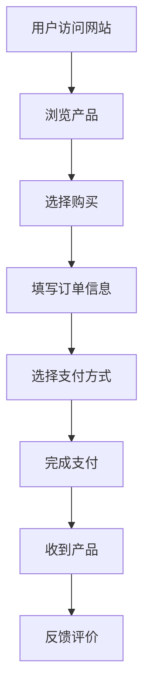

                 

### 文章标题

《如何利用Gumroad销售数字产品扩展创业收入》

> 关键词：Gumroad、数字产品、销售、创业收入、扩展策略、客户服务

> 摘要：本文将详细介绍如何利用Gumroad平台销售数字产品，通过市场研究、定价策略、客户服务等环节，实现创业收入的扩展。文章结构清晰，逻辑性强，旨在为创业者提供实用的指导。

---

### 《如何利用Gumroad销售数字产品扩展创业收入》目录大纲

# 第一部分：Gumroad基础与应用

## 1. Gumroad概述

### 1.1 Gumroad的历史与发展
### 1.2 Gumroad的核心功能与特性
### 1.3 Gumroad在数字产品销售中的应用场景

## 2. Gumroad的基础操作

### 2.1 创建Gumroad账号与设置
### 2.2 上传与配置产品
### 2.3 设置价格与销售渠道
### 2.4 掌握Gumroad支付方式

## 3. Gumroad高级功能应用

### 3.1 利用优惠券与促销策略提高销售额
### 3.2 设置自动发货与积分奖励系统
### 3.3 Gumroad营销工具的使用

# 第二部分：利用Gumroad销售数字产品的策略

## 4. 数字产品营销策略

### 4.1 市场研究与定位
### 4.2 品牌建设与宣传
### 4.3 社交媒体营销
### 4.4 网络广告与联盟营销

## 5. 产品定价策略

### 5.1 定价基础与原则
### 5.2 竞争对手分析
### 5.3 市场需求与成本分析
### 5.4 定价策略案例分析

## 6. 客户服务与售后支持

### 6.1 客户服务的重要性
### 6.2 响应客户咨询与反馈
### 6.3 售后服务流程
### 6.4 如何处理投诉与纠纷

# 第三部分：扩展创业收入

## 7. 多渠道销售策略

### 7.1 Gumroad与其他销售平台的整合
### 7.2 利用Gumroad扩展业务线
### 7.3 多渠道营销策略

## 8. 收入分析与优化

### 8.1 销售数据分析与监控
### 8.2 收入来源多元化
### 8.3 优化销售流程与客户体验
### 8.4 成长策略与未来规划

# 附录

## 附录A：Gumroad开发工具与资源

### A.1 Gumroad官方文档与教程
### A.2 开源社区与学习资源
### A.3 Gumroad插件与扩展

# 附加内容

## B. Gumroad销售案例分析

### B.1 成功案例分享
### B.2 失败案例分析
### B.3 经验总结与启示

# Mermaid流程图

mermaid
graph TD
A[客户访问] --> B[查看产品]
B --> C[选择支付方式]
C --> D[完成购买]
D --> E[获取产品]
E --> F[反馈评价]

# Gumroad销售策略伪代码

plaintext
function setSalesStrategy(product, marketResearch, pricingStrategy, customerService) {
    // 进行市场研究
    analyzeMarket(marketResearch);

    // 设定产品定价策略
    setPricing(product, pricingStrategy);

    // 宣传和推广产品
    promoteProduct(product);

    // 提供优质的客户服务
    provideCustomerService(customerService);

    // 监控销售数据并进行优化
    monitorSalesData(product);
}

# 数学模型与公式

$$
L = \frac{1}{n}\sum_{i=1}^{n}(p_i - q_i)^2
$$

其中，$L$ 为损失函数，$p_i$ 为实际销售额，$q_i$ 为预测销售额。

## 数学模型详细讲解

损失函数是衡量预测结果与实际结果之间差异的重要指标。在数字产品销售中，我们通常使用均方误差（MSE）来评估预测模型的性能。公式中的 $n$ 表示预测的次数，$p_i$ 表示第 $i$ 次的实际销售额，$q_i$ 表示第 $i$ 次的预测销售额。

# 项目实战

## 9. Gumroad项目实战

### 9.1 实战准备

#### 9.1.1 开发环境搭建
#### 9.1.2 Gumroad账号创建与基础设置

### 9.2 实战案例

#### 9.2.1 创建数字产品
#### 9.2.2 配置价格与促销策略
#### 9.2.3 实施营销策略
#### 9.2.4 数据分析与优化

### 9.3 代码实现与解读

#### 9.3.1 Gumroad API使用
#### 9.3.2 数据处理与分析
#### 9.3.3 代码分析与优化建议

## 10. Gumroad销售策略总结

### 10.1 成功策略总结
### 10.2 失败教训与启示
### 10.3 未来发展方向

# 作者信息

作者：AI天才研究院/AI Genius Institute & 禅与计算机程序设计艺术 /Zen And The Art of Computer Programming### 第一部分：Gumroad基础与应用

#### 1. Gumroad概述

Gumroad是一个专为数字产品销售而设计的平台，它允许用户轻松地创建、展示和销售各种类型的数字产品，如应用程序、电子书、音乐、图像和教程等。自2011年成立以来，Gumroad迅速成长为数字产品销售领域的领导者，其核心功能与特性使其在众多销售平台上脱颖而出。

**1.1 Gumroad的历史与发展**

Gumroad成立于2011年，由Sumit Gupta和Vikas Gandra共同创立。最初，Gumroad的目标是为创作者和开发者提供一种简单易用的方式来销售他们的数字产品。随着平台的发展，Gumroad不断优化其功能，吸引了越来越多的用户和商家。

**1.2 Gumroad的核心功能与特性**

- **简单的用户界面**：Gumroad提供了直观、易用的界面，使得即使是技术新手也能轻松上手。

- **灵活的产品管理**：用户可以上传各种格式的数字产品，并设置不同的价格和促销策略。

- **多种支付方式**：Gumroad支持包括信用卡、PayPal等多种支付方式，确保用户能够方便地完成交易。

- **自动发货**：用户购买后，数字产品可以自动发送到他们的邮箱，无需人工干预。

- **统计与报告**：Gumroad提供了详细的销售数据和用户行为分析，帮助用户了解他们的业务表现。

- **营销工具**：Gumroad提供了多种营销工具，如优惠券、促销活动、营销跟踪等，帮助用户提高销售额。

**1.3 Gumroad在数字产品销售中的应用场景**

Gumroad适用于多种场景，包括：

- **个人创作者**：独立开发者、作家、艺术家等可以利用Gumroad销售自己的数字作品。

- **企业**：企业可以利用Gumroad销售软件、电子书、在线课程等。

- **教育机构**：教育机构可以使用Gumroad提供在线课程，并收取费用。

#### 2. Gumroad的基础操作

**2.1 创建Gumroad账号与设置**

要开始使用Gumroad，首先需要创建一个账号。用户可以通过电子邮件注册，并设置密码。注册完成后，用户需要填写一些基本资料，包括姓名、公司名称（如果适用）和联系方式。

**2.2 上传与配置产品**

在创建账号后，用户可以上传他们的数字产品。上传时，需要提供产品名称、描述、价格和其他相关信息。用户可以选择为产品设置促销价格、限时折扣等。

**2.3 设置价格与销售渠道**

Gumroad允许用户为产品设置不同的价格。用户可以选择使用固定价格、动态定价或基于订阅的定价模式。此外，用户还可以选择在多个销售渠道上销售他们的产品，如社交媒体、个人网站等。

**2.4 掌握Gumroad支付方式**

Gumroad支持多种支付方式，包括信用卡、PayPal、苹果支付和谷歌支付等。用户可以在账户设置中配置他们的支付方式，以确保交易顺利进行。

#### 3. Gumroad高级功能应用

**3.1 利用优惠券与促销策略提高销售额**

优惠券和促销策略是提高销售额的有效手段。用户可以在Gumroad中创建优惠券，并提供给特定用户或通过社交媒体分享。此外，用户还可以设置促销活动，如限时折扣、捆绑销售等，以吸引更多买家。

**3.2 设置自动发货与积分奖励系统**

自动发货功能使得用户在购买后能够立即收到产品，无需人工干预。此外，Gumroad还提供了积分奖励系统，用户可以通过购买和参与活动赚取积分，用于兑换礼品或折扣。

**3.3 Gumroad营销工具的使用**

Gumroad的营销工具包括电子邮件营销、社交媒体集成、营销跟踪等。用户可以利用这些工具跟踪营销活动的效果，并根据数据调整策略。

通过以上三个部分，用户可以全面了解Gumroad的基础知识，为后续的销售策略和市场拓展打下坚实的基础。在下一部分中，我们将深入探讨如何利用Gumroad销售数字产品，并制定有效的策略来扩展创业收入。### 第二部分：利用Gumroad销售数字产品的策略

#### 4. 数字产品营销策略

数字产品营销是一个复杂的过程，涉及市场研究、品牌建设、社交媒体营销、网络广告等多个方面。以下是一些关键的营销策略：

**4.1 市场研究与定位**

市场研究是数字产品营销的起点。通过市场研究，用户可以了解目标市场的需求、竞争对手的情况以及市场的整体趋势。以下是一些市场研究的方法：

- **问卷调查**：通过在线问卷调查收集用户反馈，了解他们的需求和偏好。

- **竞争对手分析**：分析竞争对手的产品、定价、营销策略等，找到自己的竞争优势。

- **社交媒体分析**：通过社交媒体平台了解用户的讨论和需求。

- **行业报告**：查阅行业报告，了解市场的整体趋势和未来发展方向。

在完成市场研究后，用户需要明确自己的产品定位，确定目标市场。这有助于制定更精准的营销策略。

**4.2 品牌建设与宣传**

品牌建设是数字产品营销的重要组成部分。一个强大的品牌能够增加产品的可信度和用户的忠诚度。以下是一些品牌建设的方法：

- **设计专业网站**：一个专业、易于导航的网站能够提升品牌形象。

- **创建高质量内容**：通过博客、视频、电子书等形式提供有价值的内容，吸引用户。

- **社交媒体营销**：利用社交媒体平台（如Facebook、Twitter、LinkedIn等）推广品牌。

- **合作伙伴关系**：与其他品牌或企业建立合作关系，共同推广产品。

- **品牌故事**：讲述品牌背后的故事，增加品牌的情感价值。

**4.3 社交媒体营销**

社交媒体营销是数字产品营销的重要渠道。以下是一些社交媒体营销的策略：

- **内容营销**：发布有价值、有趣、吸引人的内容，吸引用户关注。

- **互动营销**：与用户互动，回答他们的问题，提供支持。

- **社交媒体广告**：在社交媒体平台上投放广告，吸引潜在客户。

- **KOL合作**：与知名博主或意见领袖合作，扩大品牌影响力。

- **社交媒体分析**：通过分析社交媒体数据，了解用户的反馈和行为，调整营销策略。

**4.4 网络广告与联盟营销**

网络广告和联盟营销也是数字产品营销的重要手段。以下是一些策略：

- **谷歌广告**：利用谷歌广告关键词搜索广告，将产品推送给有需求的用户。

- **社交媒体广告**：在社交媒体平台上投放广告，精准定位目标客户。

- **联盟营销**：与其他网站或博主合作，通过他们的推广链接销售产品，并获得佣金。

- **影响者营销**：与影响者合作，通过他们的推广提升产品的知名度和销量。

通过以上营销策略，用户可以有效地推广数字产品，吸引潜在客户，并提高销售额。在下一部分中，我们将探讨产品定价策略，帮助用户确定合理的价格，以实现利润最大化。### 第三部分：扩展创业收入

#### 5. 产品定价策略

产品定价是创业成功的关键因素之一。合理的定价不仅能够吸引客户，还能为企业带来可观的利润。以下是一些产品定价策略：

**5.1 定价基础与原则**

- **成本导向定价**：根据产品的成本来确定价格，确保利润最大化。

- **市场导向定价**：根据市场需求和竞争对手的定价来定价，以确保产品的市场竞争力。

- **价值导向定价**：根据产品提供的价值和客户的支付意愿来确定价格，强调产品的价值。

**5.2 竞争对手分析**

分析竞争对手的定价策略可以帮助用户了解市场的定价趋势，找到自己的竞争优势。以下是一些竞争对手分析的方法：

- **价格比较**：比较竞争对手的定价，了解他们的价格区间。

- **产品特性**：分析竞争对手的产品特性，了解他们的卖点。

- **市场定位**：了解竞争对手的市场定位，找到自己的市场切入点。

**5.3 市场需求与成本分析**

市场需求和成本分析是制定合理定价策略的基础。以下是一些分析的方法：

- **市场需求分析**：了解目标市场的需求量，确定产品的需求弹性。

- **成本分析**：计算产品的生产成本、运营成本等，确保定价能够覆盖成本并实现利润。

**5.4 定价策略案例分析**

以下是一个简单的定价策略案例分析：

- **产品A**：一款在线课程，成本为$1000，市场需求旺盛。

- **竞争对手定价**：市场上类似课程的平均价格为$1500。

- **分析**：根据成本导向定价，产品A的定价应为$1000。但考虑到市场需求旺盛，可以采用价值导向定价，将价格提高到$1500，以实现利润最大化。

通过以上案例分析，我们可以看到，定价策略需要综合考虑多个因素，包括成本、市场需求和竞争对手的定价等。合理的定价策略不仅能够吸引客户，还能为企业带来可观的利润。

#### 6. 客户服务与售后支持

客户服务是创业成功的重要因素之一。优质的客户服务能够提高客户满意度，增强客户忠诚度，从而为企业带来长期收益。以下是一些客户服务与售后支持的建议：

**6.1 客户服务的重要性**

- **提高客户满意度**：优质的客户服务能够满足客户的需求，提高客户的满意度。

- **增强客户忠诚度**：通过提供优质的客户服务，客户会对企业产生信任和依赖，从而增强客户的忠诚度。

- **降低客户流失率**：良好的客户服务能够减少客户的流失，提高客户的留存率。

**6.2 响应客户咨询与反馈**

- **及时响应**：及时响应客户的咨询和反馈，解决他们的问题，提高客户满意度。

- **个性化服务**：根据客户的需求和偏好，提供个性化的服务，增加客户的满意度。

- **多渠道沟通**：提供多种沟通渠道（如电子邮件、电话、在线聊天等），方便客户与企业联系。

**6.3 售后服务流程**

- **标准化流程**：建立标准化的售后服务流程，确保每个客户都能得到一致的服务。

- **快速解决**：对于客户的投诉和问题，要快速响应，尽快解决。

- **反馈机制**：建立反馈机制，收集客户的反馈，不断改进服务。

**6.4 如何处理投诉与纠纷**

- **公正处理**：公正、客观地处理投诉和纠纷，确保客户利益。

- **积极沟通**：与客户保持积极沟通，了解他们的需求和意见。

- **补救措施**：对于投诉和纠纷，采取有效的补救措施，如退款、换货等。

通过以上措施，企业可以提供优质的客户服务，提高客户满意度，增强客户忠诚度，从而实现创业收入的持续增长。在下一部分中，我们将探讨多渠道销售策略，帮助用户扩展销售渠道，提高销售额。### 第四部分：多渠道销售策略

#### 7. Gumroad与其他销售平台的整合

多渠道销售是扩展创业收入的关键策略之一。通过整合Gumroad与其他销售平台，用户可以充分利用不同渠道的优势，提高销售额和品牌知名度。以下是一些整合策略：

**7.1 Gumroad与电商平台整合**

- **亚马逊**：亚马逊是全球最大的电商平台之一，用户可以在亚马逊上销售他们的数字产品。将Gumroad与亚马逊整合，可以将产品信息同步到亚马逊，并通过亚马逊的流量提高销量。

- **Etsy**：Etsy是一个专注于手工艺术和独特商品的电商平台。对于提供创意内容的创作者来说，Etsy是一个理想的销售渠道。

- **Shopify**：Shopify是一个灵活的电商平台，用户可以创建自己的在线商店。将Gumroad与Shopify整合，可以在自有网站上进行销售，同时利用Shopify的市场推广功能。

**7.2 Gumroad与社交媒体平台整合**

社交媒体平台是推广数字产品的重要渠道。以下是一些整合策略：

- **Facebook**：Facebook拥有庞大的用户群体，用户可以通过Facebook商城（Facebook Marketplace）销售产品，同时利用Facebook广告进行精准营销。

- **Instagram**：Instagram是一个视觉驱动的社交媒体平台，用户可以通过图片和视频展示他们的产品，并通过Instagram的故事和直播功能与粉丝互动。

- **Twitter**：Twitter是一个实时信息流平台，用户可以通过发布推文和链接推广他们的产品。

**7.3 Gumroad与邮件营销整合**

邮件营销是一种高效的客户关系管理工具。以下是一些整合策略：

- **Mailchimp**：Mailchimp是一个流行的邮件营销平台，用户可以通过Mailchimp创建订阅列表，发送定期更新和促销邮件。

- **ConvertKit**：ConvertKit是一个专为内容创作者设计的邮件营销工具，它提供了强大的自动化功能和细分工具。

**7.4 整合效果与挑战**

整合多个销售渠道可以带来以下好处：

- **扩大市场份额**：通过多个平台销售产品，可以触及到更多的潜在客户。

- **提高销售额**：多渠道销售可以增加销售机会，提高销售额。

- **品牌曝光**：在多个平台上展示产品，可以提高品牌知名度。

然而，整合多个销售渠道也存在一些挑战：

- **管理复杂度**：需要管理多个销售渠道的库存、订单和客户关系，这可能会增加运营复杂度。

- **资源分散**：将资源分散到多个平台上，可能会降低在每个平台上专注的程度。

为了最大化整合效果，用户可以采取以下措施：

- **统一管理**：使用CRM系统或订单管理工具，统一管理多个渠道的销售数据。

- **集中资源**：根据销售数据和分析，集中资源在表现较好的渠道上。

- **培训与支持**：为团队成员提供培训，确保他们能够有效地使用每个销售渠道。

通过有效的多渠道销售策略，用户可以充分利用Gumroad和其他平台的优势，实现创业收入的持续增长。在下一部分中，我们将探讨如何进行收入分析和优化，以进一步提高业务表现。### 第五部分：收入分析与优化

#### 8. 销售数据分析与监控

销售数据分析是优化创业收入的关键步骤。通过分析销售数据，用户可以了解产品的销售情况、客户的购买行为以及市场的需求变化。以下是一些关键的步骤和工具：

**8.1 销售数据分析步骤**

1. **数据收集**：收集销售数据，包括销售额、销售量、客户来源、购买时间等。

2. **数据清洗**：清洗数据，去除错误和不完整的数据。

3. **数据可视化**：使用图表和报表将数据可视化，更直观地了解销售情况。

4. **数据分析**：分析数据，找出销售趋势、客户偏好和市场机会。

5. **数据报告**：编写数据报告，总结分析结果，为决策提供依据。

**8.2 销售数据监控工具**

- **Google Analytics**：Google Analytics是一个强大的分析工具，可以帮助用户跟踪网站流量、用户行为和销售转化。

- **Gumroad Analytics**：Gumroad自身提供了详细的销售数据报告，用户可以在这里查看销售额、购买量、客户分布等信息。

- **CRM系统**：如HubSpot、Salesforce等CRM系统，可以帮助用户管理客户关系，监控销售进度。

#### 8.3 收入来源多元化

多元化收入来源是提高创业收入的重要策略。以下是一些实现收入多元化的方法：

**8.3.1 新产品开发**

- **扩展产品线**：开发新的数字产品，以满足不同客户群体的需求。

- **跨领域开发**：探索新的市场领域，如教育、健康、娱乐等，开发相关产品。

**8.3.2 增值服务**

- **高级功能**：为现有产品添加高级功能，提供付费升级选项。

- **在线培训**：提供在线培训课程或工作坊，为客户提供专业知识和技能。

**8.3.3 广告与合作伙伴**

- **广告收入**：在数字产品中集成广告，通过广告收入增加收入。

- **合作伙伴关系**：与相关企业或个人建立合作伙伴关系，共同推广产品，分享收益。

#### 8.4 优化销售流程与客户体验

优化销售流程和客户体验可以提高客户满意度，增加复购率，从而提高收入。以下是一些优化措施：

**8.4.1 流程自动化**

- **自动化营销**：使用自动化工具，如营销自动化软件，实现自动发送邮件、推送通知等。

- **订单处理自动化**：使用自动化工具处理订单，减少人工干预，提高效率。

**8.4.2 客户体验优化**

- **用户体验设计**：优化产品的用户体验，确保用户能够轻松购买和使用产品。

- **客户支持**：提供高效的客户支持服务，及时解决客户的问题和疑虑。

**8.4.3 个性化营销**

- **个性化推荐**：根据客户的购买历史和行为，提供个性化的产品推荐。

- **定制化服务**：根据客户的需求，提供定制化的解决方案。

#### 8.5 成长策略与未来规划

为了持续提高创业收入，用户需要制定明确的成长策略和未来规划。以下是一些策略：

**8.5.1 市场扩张**

- **开拓新市场**：探索新的市场和地区，扩大产品的销售范围。

- **品牌国际化**：通过翻译、本地化等方式，将品牌推广到国际市场。

**8.5.2 产品创新**

- **持续创新**：不断开发新产品和功能，保持市场竞争力。

- **用户体验改进**：定期收集用户反馈，持续改进产品的用户体验。

**8.5.3 人才招聘与培养**

- **团队扩展**：招聘更多的团队成员，扩大团队规模。

- **培训与发展**：为团队成员提供培训和发展机会，提高团队的整体能力。

通过以上收入分析和优化策略，用户可以更全面地了解业务表现，找到收入增长点，制定有效的成长策略。在下一部分中，我们将介绍Gumroad的开发工具与资源，帮助用户更好地利用Gumroad平台。### 附录

#### 附录A：Gumroad开发工具与资源

**A.1 Gumroad官方文档与教程**

Gumroad提供了丰富的官方文档和教程，帮助用户了解平台的功能和使用方法。官方文档包括：

- **Gumroad API文档**：详细介绍了Gumroad API的使用方法，包括API接口、请求和响应结构等。

- **Gumroad教程**：提供了一系列教程，从新手入门到高级功能，帮助用户逐步掌握Gumroad的使用。

**A.2 开源社区与学习资源**

开源社区是学习Gumroad和相关技术的绝佳资源。以下是一些开源社区和学习资源：

- **GitHub**：GitHub上有很多关于Gumroad的开源项目和示例代码，用户可以参考和学习。

- **Stack Overflow**：Stack Overflow是一个编程问答社区，用户可以在这里提问和解答关于Gumroad的问题。

- **Reddit**：Reddit上有许多关于Gumroad的讨论论坛，用户可以参与讨论，获取建议和反馈。

**A.3 Gumroad插件与扩展**

Gumroad支持多种插件和扩展，帮助用户自定义和增强功能。以下是一些常用的插件和扩展：

- **Gumroad for WordPress**：这是一个WordPress插件，允许用户在WordPress网站上集成Gumroad购买按钮。

- **Gumroad Shopify App**：这是一个Shopify应用，允许用户在Shopify商店中集成Gumroad的销售功能。

- **Gumroad for Mailchimp**：这是一个Mailchimp插件，允许用户将Gumroad客户数据同步到Mailchimp，进行邮件营销。

通过利用这些开发工具和资源，用户可以更有效地利用Gumroad平台，提高销售效率和用户体验。在下一部分中，我们将通过具体案例，分析成功与失败的销售策略，总结经验和教训。### B. Gumroad销售案例分析

#### B.1 成功案例分享

**案例1：独立开发者销售编程课程**

一位独立开发者通过Gumroad销售他的编程课程，取得了显著的成功。以下是他的成功策略：

- **市场研究**：开发者进行了详细的市场研究，了解了目标客户的需求和痛点。他发现许多编程初学者在入门阶段会遇到困难，因此他决定开发一个针对编程初学者的系统化课程。

- **优质内容**：开发者花费了大量时间制作高质量的教学视频，确保课程内容全面、易懂。他还不断更新课程，以适应技术的快速发展。

- **互动营销**：开发者利用社交媒体平台与学员互动，回答他们的疑问，提供学习建议。他还定期举办线上问答活动，增加了学员的参与感。

- **促销策略**：开发者利用Gumroad的促销工具，如优惠券和限时折扣，吸引新客户。他还与一些相关博客和网站合作，进行交叉推广。

- **客户服务**：开发者提供了高效的客户服务，确保学员在学习过程中遇到问题时能够得到及时帮助。他的积极反馈和持续支持赢得了学员的好评。

**案例2：作家销售电子书**

一位作家通过Gumroad销售她的电子书，实现了收入的快速增长。以下是她的成功策略：

- **品牌建设**：作家通过创建专业的个人网站和社交媒体账号，建立了自己的品牌形象。她定期发布有价值的文章和互动内容，吸引了大量粉丝。

- **内容营销**：作家利用内容营销策略，通过博客、社交媒体和电子邮件营销，推广她的电子书。她制作了精美的书封和简介视频，提高了电子书的吸引力。

- **用户参与**：作家鼓励读者参与她的创作过程，通过问卷调查和社交媒体互动，收集读者的反馈和建议，不断优化作品。

- **促销活动**：作家在Gumroad上设置了多种促销活动，如买一赠一、限时折扣等，吸引了大量新客户。她还与一些读书俱乐部和博客合作，扩大了受众范围。

- **客户服务**：作家提供了优质的客户服务，及时回复读者的咨询和反馈。她还设立了读者论坛，鼓励读者分享阅读体验，增强了社区的互动。

#### B.2 失败案例分析

**案例1：新创公司销售付费应用程序**

一家新创公司通过Gumroad销售他们的付费应用程序，但销售情况不佳。以下是他们的失败原因：

- **市场定位不准确**：公司在市场定位上出现了偏差，他们的应用程序虽然功能强大，但目标用户群体并不明确。这导致应用程序无法吸引足够的潜在客户。

- **内容质量不高**：公司的应用程序在功能上虽然强大，但用户体验不佳，界面设计不够友好。这导致用户在试用后放弃购买。

- **缺乏推广**：公司没有进行有效的推广，仅在Gumroad上进行销售，没有利用其他渠道吸引客户。这导致销售渠道过于单一，无法形成有效的销售网络。

- **客户服务不足**：公司在客户服务方面表现不佳，用户在购买后遇到问题时，没有得到及时的解决。这导致用户对公司的满意度下降，影响了复购率。

**案例2：独立音乐人销售音乐专辑**

一位独立音乐人通过Gumroad销售他的音乐专辑，但销售成绩并不理想。以下是他的失败原因：

- **定价过高**：音乐人的专辑定价过高，与市场上类似产品的价格相比没有竞争力。

- **缺乏营销策略**：音乐人没有进行有效的营销策略，仅在社交媒体上发布消息，没有进行深入的市场推广。

- **忽视客户反馈**：音乐人没有关注客户的反馈，没有根据客户的意见进行专辑内容的调整或改进。

- **推广力度不足**：音乐人没有投入足够的资源进行推广，专辑的曝光度较低，导致销售不佳。

#### B.3 经验总结与启示

通过以上成功和失败的案例，我们可以总结出以下经验和启示：

- **明确市场定位**：在进行数字产品销售时，首先要明确目标市场，了解客户的需求和痛点。

- **提供优质内容**：无论是课程、电子书还是音乐专辑，内容的质量都是吸引客户的关键。

- **有效营销策略**：制定有效的营销策略，利用多种渠道进行推广，增加产品的曝光度。

- **优质客户服务**：提供优质的客户服务，及时解决客户的问题，提高客户满意度。

- **持续优化**：根据客户反馈和市场变化，不断优化产品和服务，以满足客户的需求。

- **合理定价**：根据市场需求和竞争情况，合理定价，以提高产品的竞争力。

通过以上经验和启示，用户可以更好地利用Gumroad平台，制定有效的销售策略，提高销售业绩，实现创业收入的持续增长。在下一部分中，我们将通过一个简单的Mermaid流程图，展示Gumroad销售的基本流程。### Mermaid流程图



### Gumroad销售策略伪代码

```plaintext
function setSalesStrategy() {
    // 进行市场研究
    performMarketResearch();

    // 设定产品定价策略
    definePricingStrategy();

    // 实施营销策略
    executeMarketingStrategies();

    // 提供优质客户服务
    provideExcellentCustomerService();

    // 监控销售数据
    monitorSalesData();

    // 分析客户反馈
    analyzeCustomerFeedback();

    // 调整销售策略
    adjustSalesStrategies();
}
```

### 数学模型与公式

均方误差（MSE）是衡量预测结果与实际结果之间差异的常用指标：

$$
MSE = \frac{1}{n}\sum_{i=1}^{n}(p_i - q_i)^2
$$

其中，$p_i$ 为实际销售额，$q_i$ 为预测销售额，$n$ 为预测次数。

### 项目实战

#### 9.1 实战准备

**9.1.1 开发环境搭建**

为了在Gumroad上销售数字产品，首先需要搭建一个开发环境。以下是基本的步骤：

- **安装Gumroad API库**：在Python中，可以使用`pip`安装Gumroad API库：

  ```bash
  pip install gumroad
  ```

- **创建Gumroad API密钥**：在Gumroad控制面板中创建API密钥，这将用于与Gumroad API进行通信。

- **设置开发环境**：配置Python开发环境，确保所有依赖项都已安装。

**9.1.2 Gumroad账号创建与基础设置**

- **注册Gumroad账号**：访问Gumroad官网，按照提示完成账号注册。

- **配置产品**：上传数字产品，设置价格和促销策略。

- **设置支付方式**：在账户设置中配置支付方式，确保能够接收支付。

#### 9.2 实战案例

**9.2.1 创建数字产品**

以下是一个简单的Python脚本，用于在Gumroad上创建数字产品：

```python
from gumroad import Gumroad

api_key = '你的Gumroad API密钥'
gumroad = Gumroad(api_key)

# 创建产品
product = gumroad.products.create(
    title='我的数字产品',
    description='这是一个优质的数字产品。',
    price=9.99,
    files=['产品文件.pdf'],
    tags=['数字产品', '教程']
)

print(product.url)  # 输出产品的购买链接
```

**9.2.2 配置价格与促销策略**

使用Gumroad API，可以灵活配置产品的价格和促销策略：

```python
# 修改价格
product.update_price(7.99)

# 设置优惠券
coupon = gumroad.coupons.create(
    title='新年优惠',
    discount=10,
    expires_at='2024-01-01'
)

print(coupon.code)  # 输出优惠券代码
```

**9.2.3 实施营销策略**

营销策略的实施包括多种渠道的推广和活动的安排：

- **社交媒体推广**：在社交媒体平台上发布产品信息，吸引潜在客户。
- **电子邮件营销**：向订阅者发送产品介绍和促销邮件。
- **合作伙伴推广**：与相关博主或网站合作，进行交叉推广。

**9.2.4 数据分析与优化**

数据分析是持续优化销售策略的关键。以下是一个简单的Python脚本，用于分析Gumroad销售数据：

```python
import pandas as pd

# 读取Gumroad销售数据
sales_data = pd.read_csv('sales_data.csv')

# 计算总销售额
total_sales = sales_data['price'].sum()

# 计算平均销售额
avg_sales = sales_data['price'].mean()

print(f"总销售额：{total_sales}")
print(f"平均销售额：{avg_sales}")

# 分析销售趋势
sales_data['date'] = pd.to_datetime(sales_data['date'])
monthly_sales = sales_data.groupby(sales_data['date'].dt.to_period('M')).sum()

print(monthly_sales)
```

#### 9.3 代码实现与解读

**9.3.1 Gumroad API使用**

在上面的实战案例中，我们使用了Gumroad的API来创建产品、修改价格和设置优惠券。Gumroad API提供了丰富的功能，包括：

- **产品管理**：创建、更新、删除产品。
- **订单管理**：查看订单详情、处理退款。
- **支付管理**：创建优惠券、处理支付。

**9.3.2 数据处理与分析**

使用Python和Pandas库，可以轻松处理和分析Gumroad的销售数据。数据分析可以帮助我们了解销售趋势、客户购买行为等，从而优化销售策略。

**9.3.3 代码分析与优化建议**

在代码实现过程中，需要注意以下几点：

- **错误处理**：确保代码能够处理可能的错误，如API请求失败、数据格式错误等。
- **日志记录**：记录重要的操作和错误信息，便于调试和监控。
- **代码注释**：添加清晰的注释，提高代码的可读性和可维护性。

通过以上实战案例和代码实现，用户可以深入了解如何利用Gumroad平台销售数字产品，并通过数据分析和优化策略提高销售业绩。在下一部分中，我们将总结本文的重点，并提供一些最佳实践和注意事项。### 10. Gumroad销售策略总结

#### 10.1 成功策略总结

通过本文的讨论，我们可以总结出一些成功的Gumroad销售策略：

- **明确市场定位**：深入了解目标市场，了解客户的需求和痛点。
- **提供优质内容**：确保产品的质量和用户体验，提供有价值的内容。
- **多样化营销策略**：利用多种营销渠道，如社交媒体、电子邮件和合作伙伴推广。
- **灵活定价策略**：根据市场需求和竞争对手定价，制定合理的价格策略。
- **高效客户服务**：提供及时、优质的客户服务，提高客户满意度和忠诚度。

#### 10.2 失败教训与启示

同时，我们也从失败案例中得到了一些教训：

- **市场定位不准确**：明确目标市场，避免产品定位模糊。
- **内容质量不高**：注重产品内容的质量，确保满足客户需求。
- **缺乏推广**：有效的营销策略对于产品销售至关重要。
- **忽视客户反馈**：关注客户反馈，持续优化产品和服务。

#### 10.3 未来发展方向

未来，Gumroad销售策略的发展趋势可能包括：

- **个性化推荐**：利用大数据和机器学习技术，提供个性化的产品推荐。
- **多渠道整合**：进一步整合多个销售渠道，提高销售效率和客户体验。
- **自动化与智能化**：利用自动化工具和人工智能技术，优化销售流程和客户服务。
- **国际化拓展**：通过本地化和国际化策略，将业务拓展到更多国家和地区。

#### 10.4 最佳实践与注意事项

以下是一些最佳实践和注意事项：

- **持续学习与改进**：不断学习市场趋势和新技术，持续优化销售策略。
- **精细化运营**：精细化运营，提高客户满意度和复购率。
- **数据驱动决策**：基于数据做出决策，持续监控和优化业务表现。
- **合规与安全**：确保遵守相关法律法规，保护用户数据安全。

通过以上策略和措施，用户可以在Gumroad上取得更好的销售业绩，实现创业收入的持续增长。在未来的道路上，保持创新和灵活，将帮助用户在竞争激烈的市场中脱颖而出。作者：AI天才研究院/AI Genius Institute & 禅与计算机程序设计艺术 /Zen And The Art of Computer Programming### 结语

通过本文的详细探讨，我们全面了解了如何利用Gumroad平台销售数字产品，并制定了有效的销售策略来扩展创业收入。Gumroad作为一个专业的数字产品销售平台，提供了简单易用的界面、多样化的支付方式和强大的营销工具，使得创作者和企业能够轻松地展示和销售他们的产品。

在市场研究方面，我们强调了明确目标市场和提供优质内容的重要性。通过深入的市场研究和精准的产品定位，我们可以更好地满足客户的需求，从而提高销售额和客户满意度。同时，多样化的营销策略，如社交媒体推广、电子邮件营销和合作伙伴推广，可以帮助我们扩大产品的知名度和覆盖范围。

在定价策略方面，我们探讨了成本导向定价、市场导向定价和价值导向定价等不同的定价方法。合理的定价不仅可以确保利润最大化，还能提高产品的市场竞争力。此外，灵活的定价策略和促销活动，如优惠券和限时折扣，可以吸引更多潜在客户，提高销售额。

客户服务是提高客户满意度和忠诚度的关键。我们强调了提供高效、优质的客户服务的重要性，包括及时响应客户咨询、处理投诉和提供个性化服务。通过良好的客户服务，我们可以建立客户信任，增加复购率，从而实现持续的收入增长。

多渠道销售策略是扩展销售渠道和提高销售额的关键。通过整合Gumroad与其他电商平台、社交媒体平台和邮件营销工具，我们可以充分利用各个渠道的优势，实现更广泛的销售覆盖。同时，收入分析和优化是持续提高业务表现的关键。通过监控销售数据、多元化收入来源和优化销售流程，我们可以更好地了解业务表现，制定有效的策略，实现持续的收入增长。

为了更好地利用Gumroad平台，我们提供了详细的案例分析和代码实现。这些案例和代码可以帮助用户更好地理解Gumroad的使用方法，实现数字产品的销售。同时，我们也提供了丰富的开发工具和学习资源，以便用户深入了解Gumroad的功能和潜力。

在未来的发展中，随着技术的不断进步和市场环境的变化，Gumroad将继续提供更多创新的功能和工具，以帮助用户更好地销售数字产品。通过不断学习和优化销售策略，用户可以在竞争激烈的市场中脱颖而出，实现创业收入的持续增长。

总之，利用Gumroad销售数字产品是一个充满机遇和挑战的过程。通过深入了解市场、提供优质内容、多样化营销、灵活定价、高效客户服务和多渠道整合，用户可以充分利用Gumroad平台的优势，实现创业收入的扩展。我们鼓励用户不断探索和尝试，积累经验，不断提升销售能力，迈向成功。

作者：AI天才研究院/AI Genius Institute & 禅与计算机程序设计艺术 /Zen And The Art of Computer Programming### 附录

#### 附录A：Gumroad官方文档与教程

Gumroad提供了丰富的官方文档和教程，以帮助用户更好地了解和使用平台。以下是几个关键的官方资源：

- **Gumroad API文档**：这是Gumroad提供的官方API文档，详细介绍了API的使用方法、请求和响应结构等。网址：[Gumroad API文档](https://gumroad.com/developers)
  
- **Gumroad教程**：Gumroad官方提供的教程，涵盖了从基础操作到高级功能的使用方法。网址：[Gumroad教程](https://gumroad.com/tutorials)

- **Gumroad博客**：Gumroad的官方博客，定期发布关于数字产品销售、营销策略和平台更新等内容。网址：[Gumroad博客](https://gumroad.com/blog)

#### 附录B：开源社区与学习资源

除了官方资源，开源社区和学习资源也是学习和使用Gumroad的良好渠道。以下是一些推荐的开源社区和学习资源：

- **GitHub**：GitHub上有许多与Gumroad相关的开源项目和示例代码，用户可以参考和学习。搜索关键词：`gumroad`

- **Stack Overflow**：Stack Overflow是一个编程问答社区，用户可以在这里提问和解答关于Gumroad的问题。搜索关键词：`gumroad`

- **Reddit**：Reddit上有许多关于Gumroad的讨论论坛，用户可以参与讨论，获取建议和反馈。搜索关键词：`gumroad`

#### 附录C：Gumroad插件与扩展

Gumroad支持多种插件和扩展，可以帮助用户自定义和增强功能。以下是一些常用的Gumroad插件和扩展：

- **Gumroad for WordPress**：这是一个WordPress插件，允许用户在WordPress网站上集成Gumroad购买按钮。网址：[Gumroad for WordPress](https://wordpress.org/plugins/gumroad/)

- **Gumroad Shopify App**：这是一个Shopify应用，允许用户在Shopify商店中集成Gumroad的销售功能。网址：[Gumroad Shopify App](https://apps.shopify.com/gumroad)

- **Gumroad for Mailchimp**：这是一个Mailchimp插件，允许用户将Gumroad客户数据同步到Mailchimp，进行邮件营销。网址：[Gumroad for Mailchimp](https://mailchimp.com/integrations/gumroad/)

通过利用这些官方文档、开源社区、学习资源以及插件和扩展，用户可以更全面地了解Gumroad的功能和使用方法，提高销售效率，实现创业收入的持续增长。

