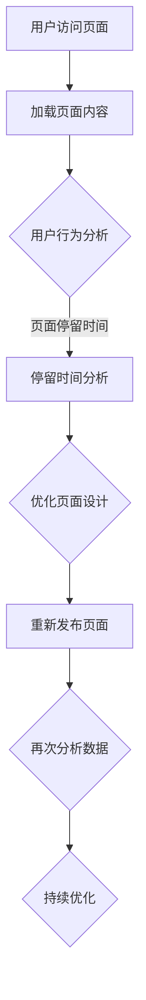

                 

### 文章标题

# 如何利用Leadpages创建创业项目的营销页面

> 关键词：Leadpages、创业项目、营销页面、用户体验、数据分析

> 摘要：本文将深入探讨如何利用Leadpages这款强大的营销工具创建创业项目的营销页面。我们将从Leadpages的概述、营销页面设计原则、创建与优化流程、效果分析与实战指导等多个方面展开讨论，帮助创业者有效地搭建和提升营销页面，提高转化率和用户满意度。

---

#### 目录大纲

1. **第一部分：Leadpages概述**
   - 第1章：Leadpages基础
     - 1.1 Leadpages简介
     - 1.2 Leadpages的核心功能
     - 1.3 Leadpages在创业项目中的应用
   - 第2章：营销页面设计原则
     - 2.1 营销页面目标
     - 2.2 营销页面布局
     - 2.3 营销文案撰写技巧
   - 第3章：使用Leadpages创建营销页面
     - 3.1 Leadpages用户指南
     - 3.2 营销页面创建流程
     - 3.3 高级功能应用
   - 第4章：营销页面效果分析与优化
     - 4.1 用户行为分析
     - 4.2 营销效果评估
     - 4.3 营销页面优化
   - 第5章：案例研究与实战指导
     - 5.1 创业项目营销案例
     - 5.2 面临挑战的案例
   - 第6章：营销页面的持续改进
     - 6.1 数据驱动决策
     - 6.2 营销策略更新
     - 6.3 跨部门协作与资源整合
   - 第7章：附录
     - 7.1 Leadpages常用工具与资源
     - 7.2 案例研究资料

2. **第二部分：营销页面设计**
3. **第三部分：创建与优化营销页面**
4. **第四部分：营销页面效果分析与优化**
5. **第五部分：案例研究与实战指导**
6. **第六部分：营销页面的持续改进**
7. **第七部分：附录**

---

### 第一部分：Leadpages概述

#### 第1章：Leadpages基础

#### 1.1 Leadpages简介

Leadpages是一款专注于营销页面创建和优化的在线工具，它通过直观的用户界面和丰富的模板库，帮助用户快速搭建出具有高度转化率的营销页面。Leadpages最早成立于2012年，总部位于美国科罗拉多州，其创始人为血红（Travis Totz）和克里斯·奥哈拉（Chris Orwig）。自成立以来，Leadpages一直致力于帮助企业和个人通过在线营销实现业务增长。

#### 1.1.1 什么是Leadpages？

Leadpages是一款基于云端的营销页面创建工具，用户无需具备编程或设计技能，即可利用其提供的各种模板和功能快速搭建出专业的营销页面。Leadpages的主要功能包括：

1. **页面创建**：提供多种类型的营销页面模板，如销售页面、注册页面、下载页面等，用户可以根据自己的需求进行选择和定制。
2. **表单创建**：用户可以轻松创建各种类型的表单，用于收集用户信息和潜在客户的联系方式。
3. **营销自动化**：集成多种营销自动化工具，如Mailchimp、ConvertKit等，实现潜在客户的自动跟进和转化。
4. **用户行为分析**：提供详细的用户行为数据，帮助用户了解页面访问情况和用户互动行为，从而优化页面设计。
5. **营销工具集成**：支持与多种第三方营销工具的集成，如社交媒体、电子邮件营销平台等，实现一站式营销管理。

#### 1.1.2 Leadpages的历史与发展

自成立以来，Leadpages经历了多次重要的产品更新和功能扩展。以下是其发展历程的简要概述：

- **2012年**：Leadpages成立，并推出了第一款基于模板的营销页面创建工具。
- **2014年**：推出了营销自动化功能，用户可以更有效地跟进潜在客户。
- **2016年**：推出Leadpages Pro版本，为高级用户提供更多定制选项和高级功能。
- **2018年**：收购了Salesfunnel，进一步扩展了其营销工具集成能力。
- **2020年**：推出Leadpages Analytics，提供更详细的用户行为数据分析。

如今，Leadpages已成为在线营销领域的重要工具之一，为数以万计的企业和个人提供了强大的营销解决方案。

#### 1.2 Leadpages的核心功能

Leadpages的核心功能是其丰富的模板库、用户行为跟踪与分析以及营销工具集成。

**1.2.1 模板库介绍**

Leadpages提供了数百种专业的营销页面模板，包括销售页面、注册页面、下载页面、直播预约页面等。这些模板涵盖了各种行业和业务场景，用户可以根据自己的需求进行选择和定制。模板库的分类清晰，用户可以轻松找到适合自己的模板。此外，Leadpages还提供了模板市场，用户可以在这里购买和销售自定义模板，进一步丰富自己的设计选择。

**1.2.2 营销工具集成**

Leadpages集成了多种营销工具，如邮件营销平台、自动化营销工具、社交媒体平台等。用户可以在Leadpages中直接集成这些工具，实现一站式营销管理。例如，用户可以将Leadpages与Mailchimp集成，将表单收集到的潜在客户信息自动导入到Mailchimp中，进行后续的邮件营销。这种集成不仅提高了营销效率，还确保了数据的一致性和准确性。

**1.2.3 用户行为跟踪与分析**

Leadpages提供了强大的用户行为跟踪和分析功能，用户可以详细了解页面访问情况、用户互动行为等关键数据。通过这些数据，用户可以优化页面设计，提高页面转化率。例如，用户可以分析用户在页面上的停留时间、点击行为、转化路径等，从而找出页面的优化点。此外，Leadpages还提供了A/B测试功能，用户可以创建多个页面版本，并进行对比测试，找出最优的页面设计。

#### 1.3 Leadpages在创业项目中的应用

对于创业项目来说，Leadpages是一个不可或缺的营销工具。以下是Leadpages在创业项目中的应用场景：

**1.3.1 创业项目中的营销需求**

创业项目通常面临着有限的资源和时间，需要高效、低成本地开展营销活动。营销页面的设计、创建和优化是创业项目成功的关键。Leadpages提供了丰富的模板库、强大的功能和易于使用的界面，可以帮助创业者快速搭建出专业的营销页面。

**1.3.2 Leadpages的优势与挑战**

优势：

- **快速搭建**：无需编程或设计技能，用户可以快速搭建出专业的营销页面。
- **高度定制**：提供多种模板和定制选项，用户可以根据自己的需求进行个性化设计。
- **集成营销工具**：与多种第三方营销工具集成，实现一站式营销管理。
- **数据驱动**：提供详细的用户行为数据，帮助用户优化页面设计，提高转化率。

挑战：

- **模板限制**：虽然Leadpages提供了丰富的模板库，但某些行业或特定需求的模板可能不足。
- **高级功能费用**：部分高级功能需要付费订阅，对于预算有限的创业者可能造成一定压力。

#### 第2章：营销页面设计原则

#### 2.1 营销页面目标

营销页面的目标直接影响到页面的设计、内容和功能。一个明确的营销目标可以帮助用户更好地聚焦设计思路，确保页面内容的有效传达和用户行为的引导。

**2.1.1 转化率与目标用户匹配**

转化率是衡量营销页面效果的重要指标，直接决定了营销活动的成败。提高转化率的关键在于了解并匹配目标用户的需求。以下是一些提高转化率的策略：

1. **精准定位目标用户**：了解目标用户的需求、兴趣和行为习惯，确保营销页面的内容和设计能够吸引并满足他们的需求。
2. **简化页面设计**：避免过多的干扰元素，将用户注意力集中在关键信息和转化按钮上，提高转化率。
3. **优化页面加载速度**：页面加载速度直接影响用户的体验和满意度，优化页面加载速度可以提高转化率。

**2.1.2 页面目标设定与评估**

设定明确的页面目标是营销页面设计的第一步。以下是一些常见的目标类型：

1. **收集潜在客户信息**：通过表单收集用户姓名、邮箱、电话等联系方式，实现潜在客户的转化。
2. **产品销售**：直接引导用户购买产品，通过产品展示、优惠信息和购买按钮实现销售转化。
3. **内容下载**：提供有价值的内容（如白皮书、报告等），引导用户填写表单以获取下载权限。

评估页面目标的效果是优化页面的关键。以下是一些评估方法：

1. **数据分析**：利用Leadpages提供的用户行为数据，分析页面访问量、转化率等指标，找出优化点。
2. **用户反馈**：收集用户对页面的反馈，了解他们的体验和需求，为页面优化提供参考。
3. **A/B测试**：创建多个页面版本，通过对比测试找出最优的页面设计。

#### 2.2 营销页面布局

营销页面的布局直接影响用户的浏览体验和互动行为。一个良好的布局能够引导用户完成预期的操作，提高页面转化率。

**2.2.1 页面元素设计**

页面元素设计包括文字、图片、按钮、视频等。以下是一些关键的设计原则：

1. **简洁明了**：避免过多的文字和元素，确保页面内容简洁、易于理解。
2. **排版整齐**：合理使用段落和标题，提高文字的可读性。
3. **图片使用**：选择高质量的图片，确保图片与页面内容相关，增强视觉效果。
4. **按钮设计**：按钮应醒目、易于点击，按钮颜色与页面色调相协调。

**2.2.2 用户体验与交互设计**

用户体验和交互设计是营销页面成功的重要因素。以下是一些关键的设计策略：

1. **引导性设计**：通过视觉引导和提示，引导用户完成预期的操作，如填写表单、点击按钮等。
2. **响应式设计**：确保页面在不同设备和屏幕尺寸上都能良好展示，提高用户访问体验。
3. **加载速度优化**：优化页面加载速度，提高用户满意度，减少跳失率。

**2.2.3 色彩与字体选择**

色彩和字体选择直接影响页面的视觉感受和信息传达效果。以下是一些选择原则：

1. **色彩搭配**：选择和谐、易于区分的色彩搭配，确保页面整体视觉效果统一。
2. **字体选择**：选择清晰易读的字体，避免使用过多不同的字体，确保信息传达的一致性。

#### 2.3 营销文案撰写技巧

营销文案是营销页面的核心，直接影响到用户的阅读兴趣和转化行为。以下是一些撰写技巧：

**2.3.1 标题与副标题**

标题和副标题是吸引用户注意的重要元素。以下是一些撰写技巧：

1. **简洁有力**：标题应简洁明了，突出产品或服务的核心价值。
2. **引人入胜**：使用引人入胜的词汇和短语，激发用户的阅读兴趣。
3. **明确目标**：标题应明确传达页面目标，引导用户理解页面内容。

**2.3.2 引导性文案**

引导性文案是引导用户完成预期操作的关键。以下是一些撰写技巧：

1. **直接了当**：文案应直接、简洁，避免使用复杂的句子结构。
2. **情感共鸣**：通过情感共鸣的语句，激发用户的兴趣和参与度。
3. **行动呼吁**：明确地告诉用户下一步该怎么做，提高转化率。

**2.3.3 调动情感共鸣**

调动情感共鸣是提升用户转化率的有效策略。以下是一些技巧：

1. **故事叙述**：通过故事叙述，让用户产生共鸣，提高用户参与度。
2. **使用数据**：使用数据和事实支持观点，增强文案的说服力。
3. **个性化**：针对不同用户群体，定制化文案，提高用户认同感。

#### 第3章：使用Leadpages创建营销页面

#### 3.1 Leadpages用户指南

Leadpages提供了直观的用户界面和丰富的功能，用户可以轻松创建和管理营销页面。以下是使用Leadpages的基本指南：

**3.1.1 注册与登录**

1. **注册**：用户可以通过官方网站（[www.leadpages.com](https://www.leadpages.com/)）或应用程序商店下载Leadpages应用程序进行注册。
2. **登录**：注册后，用户可以使用用户名和密码登录Leadpages平台。

**3.1.2 基础操作介绍**

1. **创建新页面**：登录后，用户可以在“我的页面”中创建新页面。选择所需的模板，并进行内容编辑。
2. **页面编辑**：在页面编辑模式下，用户可以添加、删除和调整页面元素，如文本、图片、视频等。
3. **保存与发布**：编辑完成后，用户可以保存页面草稿，并选择发布时间。发布后，用户可以在“我的页面”中查看和管理已发布的页面。

#### 3.2 营销页面创建流程

创建营销页面是Leadpages的核心功能。以下是详细的创建流程：

**3.2.1 选择模板**

1. **模板分类**：Leadpages提供了多种类型的模板，包括销售页面、注册页面、下载页面等。用户可以根据自己的需求选择合适的模板。
2. **模板预览**：在模板选择页面，用户可以预览模板的样式和布局，确保模板符合需求。

**3.2.2 页面内容定制**

1. **添加元素**：选择模板后，用户可以在页面编辑模式下添加各种元素，如文本、图片、视频、表单等。
2. **自定义样式**：用户可以自定义页面元素的样式，包括颜色、字体、大小等，确保页面整体视觉效果一致。

**3.2.3 页面发布与测试**

1. **保存草稿**：在编辑过程中，用户可以随时保存草稿，防止数据丢失。
2. **发布页面**：编辑完成后，用户可以选择发布时间，并将页面发布到自己的网站或社交媒体平台上。
3. **页面测试**：发布后，用户可以对页面进行测试，确保页面在各种设备和浏览器上都能良好展示。

#### 3.3 高级功能应用

Leadpages提供了多种高级功能，用户可以利用这些功能提高营销页面的效果和用户体验。以下是一些高级功能的应用：

**3.3.1 表单与数据收集**

1. **表单创建**：用户可以创建自定义表单，用于收集用户信息、联系方式等。
2. **数据收集与整合**：收集到的数据可以自动整合到用户数据库中，实现后续的自动化营销。

**3.3.2 营销自动化流程**

1. **自动化触发**：用户可以设置自动化触发条件，如用户填写表单后，自动发送感谢邮件。
2. **自动化跟进**：用户可以设置自动化跟进流程，如定期发送邮件、提醒用户完成购买等。

**3.3.3 跨平台营销策略**

1. **社交媒体集成**：用户可以将营销页面发布到社交媒体平台上，如Facebook、Instagram等。
2. **多渠道营销**：用户可以利用Leadpages的跨平台功能，实现多渠道营销，提高品牌曝光度和用户参与度。

#### 第4章：营销页面效果分析与优化

#### 4.1 用户行为分析

用户行为分析是优化营销页面的重要环节。通过分析用户行为数据，用户可以深入了解页面访问情况、用户互动行为等，从而找出优化点。以下是用户行为分析的关键指标：

**4.1.1 用户访问路径分析**

用户访问路径分析可以帮助用户了解用户在页面上的浏览轨迹，找出用户关注的重点和页面瓶颈。以下是一些关键指标：

1. **页面停留时间**：用户在页面上的停留时间可以反映页面的吸引力。过短的停留时间可能意味着页面内容不够吸引人，需要优化。
2. **跳失率**：用户在访问页面后直接离开的比率，可以反映页面的用户体验和内容质量。
3. **浏览路径**：用户在页面上的浏览路径，可以帮助用户了解用户的兴趣点和行为模式。

**4.1.2 转化率优化策略**

转化率是衡量营销页面效果的重要指标。以下是一些提高转化率的策略：

1. **优化页面加载速度**：过长的页面加载时间会降低用户体验和转化率。用户可以通过压缩图片、优化代码等方式提高页面加载速度。
2. **简化页面设计**：过多的干扰元素会分散用户的注意力，降低转化率。用户可以简化页面设计，突出关键信息和转化按钮。
3. **引导性设计**：通过视觉引导和提示，引导用户完成预期的操作，如填写表单、点击按钮等。

#### 4.2 营销效果评估

营销效果评估是确保营销活动达到预期目标的重要环节。以下是一些常用的营销效果评估指标：

**4.2.1 营销ROI计算方法**

营销ROI（投资回报率）是衡量营销活动效果的关键指标。以下是一个简单的营销ROI计算公式：

$$ ROI = \frac{（销售额 - 投资成本）}{投资成本} $$

**4.2.2 营销效果指标**

以下是一些常用的营销效果指标：

1. **点击率（CTR）**：页面中某个元素（如按钮、图片等）被点击的比率，可以反映元素的吸引力和用户兴趣。
2. **转化率**：用户完成预期操作（如填写表单、购买产品等）的比率，是衡量营销页面效果的重要指标。
3. **访客来源**：用户访问页面的来源，如搜索引擎、社交媒体、直接访问等，可以帮助用户了解营销渠道的效果。

**4.2.3 数据可视化工具**

数据可视化工具可以将复杂的用户行为数据以图形化的形式展示，帮助用户更直观地了解页面效果。以下是一些常用的数据可视化工具：

1. **Google Analytics**：Google Analytics是一款功能强大的数据分析工具，可以提供详细的用户行为数据。
2. **Tableau**：Tableau是一款专业的数据可视化工具，可以将数据以图表、仪表板等形式展示，帮助用户更好地理解数据。

#### 4.3 营销页面优化

营销页面优化是提高页面效果和用户体验的关键。以下是一些常用的优化策略：

**4.3.1 页面速度优化**

1. **优化图片**：图片是页面加载速度的关键因素，用户可以通过压缩图片、使用WebP格式等方式优化图片加载速度。
2. **代码优化**：优化HTML、CSS和JavaScript代码，减少冗余代码和请求，提高页面加载速度。

**4.3.2 界面用户体验提升**

1. **简化设计**：避免过多的干扰元素，确保页面内容简洁、易于理解。
2. **优化导航**：提供清晰的导航结构，帮助用户快速找到所需信息。
3. **响应式设计**：确保页面在不同设备和屏幕尺寸上都能良好展示，提高用户体验。

**4.3.3 营销文案与内容的迭代**

1. **测试与优化**：通过A/B测试，不断优化营销文案和内容，找出最佳的表达方式。
2. **用户反馈**：收集用户对页面的反馈，了解他们的需求和建议，为页面优化提供参考。

#### 第5章：案例研究与实战指导

#### 5.1 创业项目营销案例

**5.1.1 案例介绍**

该案例是一家初创公司，专注于提供智能健身解决方案。该公司希望通过创建一个营销页面，提高品牌知名度和产品销售。

**5.1.2 案例分析与解读**

1. **目标设定**：该公司的营销目标是提高产品销售，并收集潜在客户的信息。
2. **页面设计**：公司选择了Leadpages的一个智能健身模板，根据产品特点和目标用户进行了一定的定制。页面设计简洁明了，突出产品功能和优势。
3. **效果评估**：通过Leadpages的用户行为分析工具，公司发现页面停留时间较长，但转化率较低。通过进一步分析，发现用户对产品价格有疑虑。
4. **优化策略**：公司通过A/B测试，调整了页面上的价格描述和优惠信息。同时，优化了引导性文案，明确了用户的下一步操作。经过优化，转化率显著提高。

**5.1.3 总结**

该案例展示了如何通过Leadpages创建和优化营销页面，提高转化率和用户满意度。关键在于明确目标、合理设计、持续优化。

#### 5.2 面临挑战的案例

**5.2.1 案例背景**

该案例是一家提供在线教育课程的平台，希望通过营销页面提高课程注册率和用户参与度。

**5.2.2 问题分析**

1. **页面加载速度慢**：由于课程内容和多媒体资源的加载，页面加载速度较慢，影响了用户体验。
2. **内容过多**：页面内容过于复杂，用户难以快速找到所需信息。
3. **互动性不足**：页面缺乏与用户的互动，导致用户参与度较低。

**5.2.3 解决方案与效果**

1. **优化页面速度**：公司对页面进行代码优化，减少冗余代码和请求，提高页面加载速度。
2. **简化页面设计**：删除不必要的元素，突出关键信息，提高页面清晰度。
3. **增加互动元素**：添加互动模块，如问答、评论区等，提高用户参与度。

经过优化，页面加载速度显著提高，用户参与度也有所提升，课程注册率有所增加。

**5.2.4 总结**

该案例展示了在面临挑战时，如何通过优化页面速度、简化页面设计和增加互动元素，提高营销页面的效果。

#### 第6章：营销页面的持续改进

#### 6.1 数据驱动决策

在营销页面持续改进过程中，数据驱动决策至关重要。以下是一些关键步骤：

**6.1.1 数据收集与分析**

1. **用户行为数据**：通过Leadpages的用户行为分析工具，收集用户访问、互动等数据。
2. **营销效果数据**：收集页面转化率、点击率等营销效果数据。
3. **竞争分析**：分析竞争对手的营销页面和策略，了解市场趋势。

**6.1.2 数据驱动的迭代策略**

1. **定期数据审查**：定期审查数据，找出优化点。
2. **A/B测试**：通过A/B测试，验证不同设计对用户行为的影响。
3. **数据驱动决策**：根据数据分析结果，制定优化策略，持续改进营销页面。

#### 6.2 营销策略更新

营销策略的持续更新是确保营销活动效果的关键。以下是一些策略更新建议：

**6.2.1 定期审查与调整**

1. **营销目标审查**：定期审查营销目标，确保与公司整体战略一致。
2. **营销渠道调整**：根据用户行为数据和效果评估，调整营销渠道，优化资源配置。

**6.2.2 趋势预测与前瞻性策略**

1. **市场趋势分析**：分析行业趋势和市场变化，提前布局。
2. **创新策略**：尝试新的营销渠道和策略，如社交媒体广告、内容营销等。

#### 6.3 跨部门协作与资源整合

跨部门协作与资源整合是确保营销活动顺利执行的关键。以下是一些关键步骤：

**6.3.1 营销与产品团队合作**

1. **需求沟通**：营销团队和产品团队定期沟通，确保营销目标与产品功能一致。
2. **资源协调**：合理分配资源，确保营销活动的顺利进行。

**6.3.2 跨部门沟通与协作**

1. **建立沟通机制**：建立跨部门沟通机制，确保信息畅通。
2. **共享资源**：跨部门共享资源，如用户数据、营销材料等，提高整体效率。

#### 第7章：附录

#### 7.1 Leadpages常用工具与资源

**7.1.1 插件与扩展**

Leadpages提供了多种插件和扩展，用户可以将其集成到自己的网站中，提高营销效果。以下是一些常用插件：

1. **WordPress插件**：用户可以在WordPress网站上直接集成Leadpages功能，创建和管理营销页面。
2. **Google Analytics集成**：将Leadpages与Google Analytics集成，获取详细的用户行为数据。
3. **Mailchimp集成**：将Leadpages与Mailchimp集成，实现潜在客户的自动跟进和邮件营销。

**7.1.2 在线教程与社区**

Leadpages提供了丰富的在线教程和社区资源，用户可以学习如何使用Leadpages，解决遇到的问题。以下是一些资源：

1. **在线教程**：Leadpages官方网站提供了详细的在线教程，涵盖创建营销页面、用户行为分析等。
2. **用户社区**：Leadpages的用户社区是用户交流经验和解决问题的平台，用户可以在这里找到答案。

#### 7.2 案例研究资料

以下是一些Leadpages的案例研究资料，供用户参考：

1. **案例研究1**：一家在线教育平台通过Leadpages创建营销页面，提高了课程注册率和用户参与度。
2. **案例研究2**：一家初创公司通过Leadpages优化营销页面，提高了产品销售和品牌知名度。
3. **案例研究3**：一家电子商务公司通过Leadpages实现多渠道营销，提高了销售额和用户满意度。

#### 附录：常用Mermaid流程图和伪代码示例

**附录 A：营销页面流程图**



**附录 B：用户行为分析伪代码**

```python
# 用户行为分析伪代码

# 收集用户数据
user_data = get_user_data()

# 分析页面停留时间
page停留时间 = analyze_page_stay_time(user_data)

# 分析点击行为
click_behavior = analyze_click_behavior(user_data)

# 分析转化路径
conversion_path = analyze_conversion_path(user_data)

# 生成报告
report = generate_report(page停留时间, click_behavior, conversion_path)
```

### 总结与展望

本文详细介绍了如何利用Leadpages创建创业项目的营销页面。从Leadpages的概述、营销页面设计原则、创建与优化流程、效果分析与实战指导等方面进行了深入探讨。通过本文，读者可以了解如何利用Leadpages这款强大的工具，搭建和优化营销页面，提高转化率和用户满意度。

展望未来，营销页面的技术和策略将不断更新和进步。随着人工智能和大数据技术的发展，营销页面的个性化、智能化和自动化水平将不断提升。创业者和营销人员需要紧跟市场趋势，持续学习和实践，才能在竞争激烈的市场中脱颖而出。

最后，感谢您的阅读。如果您有任何问题或建议，欢迎在评论区留言。期待与您共同探索营销页面的奥秘。作者：AI天才研究院/AI Genius Institute & 禅与计算机程序设计艺术 /Zen And The Art of Computer Programming。

