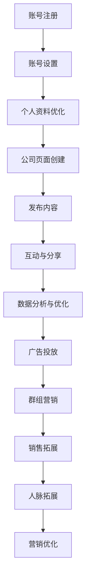

                 

### 文章标题

# 《如何利用LinkedIn进行B2B营销与人脉拓展》

### 关键词

- LinkedIn B2B营销
- 账号优化
- 内容营销
- 销售拓展
- 人脉管理
- 营销案例分析

### 摘要

本文旨在深入探讨如何利用LinkedIn这个全球领先的职业社交平台进行B2B营销与人脉拓展。文章首先介绍了LinkedIn的背景和发展，以及其在B2B营销中的独特优势。接着，详细讲解了如何优化LinkedIn账号，利用LinkedIn广告和群组等营销工具进行有效的B2B营销。随后，文章探讨了目标市场定位、内容营销策略和LinkedIn销售拓展的相关技巧。最后，通过实战案例分析和营销优化方法，为读者提供了实用的LinkedIn营销策略。

## 第一部分：LinkedIn B2B营销基础

### 第1章：LinkedIn概述

#### 1.1 LinkedIn的背景与发展

LinkedIn作为全球最大的职业社交网络平台，成立于2003年，总部位于美国加利福尼亚州。LinkedIn的创立初衷是帮助专业人士建立职业关系、分享行业知识和寻找商业机会。随着社交媒体的兴起，LinkedIn逐渐成为企业和专业人士进行网络营销的重要渠道。

LinkedIn的发展历程可以概括为以下几个重要阶段：

1. **起步阶段（2003-2006年）**：LinkedIn成立初期，主要以职业社交为主，用户群体相对较小，但逐步吸引了大量专业人士的加入。
   
2. **成长阶段（2006-2010年）**：随着用户数量的增长，LinkedIn开始拓展功能，增加了公司页面、职业介绍和职位发布等功能。

3. **成熟阶段（2010-2015年）**：LinkedIn实现了上市，并且继续扩大其用户基础和功能，包括LinkedIn Ads、LinkedIn Talent等。

4. **拓展阶段（2015年至今）**：LinkedIn进一步扩大其全球影响力，推出了多个新产品和服务，如LinkedIn Learning、LinkedIn Sales Navigator等，以满足企业和专业人士的不同需求。

#### 1.2 LinkedIn的B2B营销优势

LinkedIn在B2B营销中具有以下几大优势：

1. **精准定位**：LinkedIn用户主要为企业专业人士，这为B2B营销提供了精准的受众群体。

2. **丰富的数据资源**：LinkedIn拥有大量的用户数据，包括职业、公司、地理位置等信息，可以帮助企业进行精准营销。

3. **高效的营销工具**：LinkedIn提供了多种营销工具，如广告、群组、发布内容等，企业可以根据自己的需求选择合适的营销策略。

4. **专业信任度**：LinkedIn作为一个专业的职业社交平台，用户对其内容具有较高的信任度，这有助于提高营销效果。

5. **全球覆盖**：LinkedIn在全球范围内拥有广泛的用户基础，企业可以通过LinkedIn进入国际市场。

#### 1.3 LinkedIn的B2B营销与社交网络的区别

虽然LinkedIn和Facebook、Twitter等社交网络有相似之处，但它们在B2B营销中的应用和效果存在明显差异：

1. **用户群体**：LinkedIn用户主要是专业人士，而Facebook、Twitter等社交网络则更偏向于普通用户。

2. **营销目标**：LinkedIn的营销目标主要是B2B，注重建立商业关系和提升品牌知名度；而Facebook、Twitter等社交网络则更注重个人互动和娱乐。

3. **内容形式**：LinkedIn的内容形式以专业文章、行业报告、产品信息等为主；而Facebook、Twitter等社交网络则更偏向于图片、视频、动态更新等。

4. **营销效果**：LinkedIn的用户对专业内容具有较高的信任度，营销效果往往更为显著；而Facebook、Twitter等社交网络则更注重用户互动和传播效果。

通过以上对LinkedIn背景与发展、B2B营销优势和与社交网络区别的介绍，我们可以初步认识到LinkedIn在B2B营销中的重要性和独特价值。

### 第2章：LinkedIn账号优化

#### 2.1 LinkedIn账号注册与设置

要有效地利用LinkedIn进行B2B营销，首先需要拥有一个完善的个人账号。以下步骤可以帮助你完成LinkedIn账号的注册和设置：

1. **注册账号**：在LinkedIn官网上点击“注册”按钮，选择“使用邮箱地址注册”或“使用手机号注册”，并填写相应的个人信息。

2. **完善资料**：注册完成后，登录账号，完善个人资料，包括姓名、职业、所在公司、联系方式等。这些信息将有助于其他用户了解你的背景和业务。

3. **设置隐私**：根据个人需求，设置隐私选项。例如，你可以选择公开自己的联系信息，或者仅对LinkedIn好友可见。

4. **上传头像**：上传一张专业的头像，这有助于树立良好的个人形象。建议使用清晰的头像，避免使用模糊或与个人职业不相关的图片。

5. **填写详细经历**：在个人资料中详细填写你的职业经历，包括职位、公司、工作内容和成就等。这有助于提高你在LinkedIn上的可见度和可信度。

6. **定制个人简介**：撰写一段简明扼要的个人简介，介绍你的职业背景、专业领域和业务目标。确保这段简介能够吸引潜在客户的注意，并突出你的独特优势。

7. **优化联系方式**：在个人资料中提供多个联系方式，如电话、邮箱、社交媒体账号等。这有助于潜在客户更容易地与你建立联系。

#### 2.2 LinkedIn个人资料优化

一个优化的LinkedIn个人资料可以显著提高你的专业形象和营销效果。以下是一些优化个人资料的技巧：

1. **关键词优化**：在个人资料中合理使用关键词，这些关键词应与你所从事的行业、职位和业务领域相关。例如，如果你是一名市场营销专家，可以包含“市场营销”、“品牌推广”、“数字营销”等关键词。

2. **展示成就**：在个人资料中突出你的职业成就和业绩，例如曾获得过的奖项、成功案例、项目经验等。这些成就将增加你的专业可信度。

3. **引用推荐**：在个人资料中引用来自同事、上级或客户的推荐，这些推荐可以帮助你树立良好的口碑和信誉。

4. **更新动态**：定期更新你的LinkedIn动态，分享行业见解、专业文章、公司新闻等。这有助于保持你的活跃度和关注度。

5. **互动与分享**：积极参与LinkedIn的讨论和分享，与其他用户互动，扩大你的社交圈和影响力。

6. **使用专业语言**：在个人资料中使用专业、简洁、准确的语句，避免使用非正式或模糊的表达。

#### 2.3 LinkedIn公司页面创建与优化

除了个人账号，LinkedIn公司页面也是B2B营销的重要工具。以下步骤可以帮助你创建和优化LinkedIn公司页面：

1. **创建公司页面**：登录你的个人账号，点击“公司页面”选项，按照提示步骤创建公司页面。

2. **完善公司资料**：填写公司名称、地址、电话、邮箱等基本信息。确保这些信息准确无误，有助于潜在客户找到你的公司。

3. **上传公司标志**：上传一张清晰、专业的公司标志，这有助于树立良好的公司形象。

4. **编写公司简介**：撰写一段简明扼要的公司简介，介绍你的业务范围、核心价值、公司愿景等。确保这段简介能够吸引潜在客户的注意。

5. **发布内容**：定期在公司页面上发布专业内容，如行业动态、公司新闻、产品信息等。这些内容可以帮助提升公司的曝光度和专业形象。

6. **互动与分享**：积极参与LinkedIn的讨论和分享，扩大公司的社交圈和影响力。

7. **跟踪分析**：利用LinkedIn提供的数据分析工具，跟踪公司页面的访问量、互动率和转化率等指标，以便优化营销策略。

通过以上对LinkedIn账号注册与设置、个人资料优化和公司页面创建与优化的介绍，我们可以更好地利用LinkedIn进行B2B营销和人脉拓展。

### 第3章：LinkedIn营销工具

#### 3.1 LinkedIn广告介绍

LinkedIn广告是一种高度定制化的营销工具，可以帮助企业在LinkedIn平台上精准地触达潜在客户。以下是LinkedIn广告的主要特点：

1. **定位精准**：LinkedIn广告可以根据用户的职业、公司、地理位置、行业等信息进行精准定位，确保广告能够触达目标受众。

2. **多种广告形式**：LinkedIn提供了多种广告形式，包括文本广告、图像广告、视频广告等，企业可以根据自己的需求和预算选择合适的广告形式。

3. **优化效果**：LinkedIn广告系统可以根据广告效果自动调整投放策略，提高广告的点击率和转化率。

4. **高效管理**：LinkedIn广告平台提供了便捷的广告管理工具，企业可以轻松创建、发布、调整和监控广告。

以下是LinkedIn广告的基本投放流程：

1. **设定广告目标**：明确广告的目标，例如提升品牌知名度、增加网站访问量、提高销售转化率等。

2. **选择广告形式**：根据广告目标和预算选择合适的广告形式，如文本广告、图像广告、视频广告等。

3. **设定广告预算**：根据企业的预算设定广告投放的预算，包括每日预算和总预算。

4. **创建广告内容**：撰写吸引人的广告文案，设计吸引眼球的广告图像或视频，确保广告内容与目标受众相关。

5. **选择广告定位**：根据目标受众的特点，设置广告的定位条件，如职业、公司、地理位置等。

6. **发布广告**：提交广告内容，等待LinkedIn审核通过后，广告将开始投放。

7. **监控广告效果**：通过LinkedIn广告平台监控广告的表现，包括点击率、转化率、花费等指标，及时调整广告策略。

#### 3.2 LinkedIn群组营销

LinkedIn群组是另一个强大的营销工具，可以帮助企业建立专业社区、吸引目标客户、提升品牌影响力。以下是LinkedIn群组营销的关键要点：

1. **创建群组**：根据企业的业务领域和目标受众，创建相关的LinkedIn群组。群组名称应简洁明了，易于搜索。

2. **设定群组规则**：为群组设定明确的规则，如允许成员发布的内容类型、讨论的话题范围等，确保群组的秩序和相关性。

3. **吸引成员加入**：通过LinkedIn个人账号和专业资料吸引潜在客户加入群组。同时，可以在其他社交媒体平台和公司网站上宣传群组。

4. **发布有价值内容**：定期在群组内发布专业内容，如行业新闻、分析报告、产品介绍等，提供有价值的信息，吸引成员参与讨论。

5. **互动与参与**：积极参与群组的讨论，回复成员的问题，分享专业见解，提升群组的活跃度和影响力。

6. **推广群组内容**：将群组内的优秀内容分享到其他社交媒体平台和公司网站上，扩大内容的传播范围。

7. **监控群组表现**：通过LinkedIn群组分析工具监控群组的活跃度、成员参与度等指标，及时调整群组策略。

#### 3.3 LinkedIn发布内容策略

在LinkedIn上进行内容发布是吸引潜在客户、提升品牌知名度的重要手段。以下是LinkedIn发布内容策略的关键要点：

1. **明确目标**：在发布内容前，明确内容的目标，如提高品牌知名度、增加网站访问量、促进销售转化等。

2. **内容形式**：根据目标受众的兴趣和需求，选择合适的发布内容形式，如文章、视频、图片、海报等。

3. **内容质量**：确保发布的内容具有高质量，提供有价值的信息，解决目标受众的问题或需求。内容应简洁明了、通俗易懂。

4. **发布频率**：制定合理的发布频率，如每周发布1-3篇内容。过于频繁的发布可能会引起用户反感，而发布频率过低则可能降低用户粘性。

5. **互动与反馈**：在发布内容后，积极与用户互动，回复用户的评论和提问，提升用户的参与度和满意度。

6. **分享与推广**：将LinkedIn上的内容分享到其他社交媒体平台和公司网站上，扩大内容的传播范围。

7. **分析效果**：通过LinkedIn数据分析工具监控发布内容的效果，包括阅读量、点赞数、评论数等指标，及时调整发布策略。

通过以上对LinkedIn广告、群组营销和发布内容策略的详细介绍，我们可以更好地利用LinkedIn的营销工具，实现B2B营销与人脉拓展的目标。

## 第二部分：B2B营销策略

### 第4章：目标市场定位

在B2B营销中，准确的目标市场定位是成功的基础。一个清晰的目标市场定位能够帮助企业在竞争中脱颖而出，最大限度地提高营销效果和资源利用率。

#### 4.1 B2B市场分析

进行B2B市场分析是目标市场定位的第一步，它涉及到对行业、竞争者和潜在客户的研究。以下是B2B市场分析的关键步骤：

1. **行业研究**：深入了解所在行业的市场趋势、增长潜力、市场规模和主要参与者。分析行业的痛点、需求和发展方向，为后续的目标市场定位提供依据。

2. **竞争者分析**：识别和分析主要竞争者，包括其市场份额、产品特点、营销策略等。通过比较竞争对手的优势和劣势，找出自身的差异化竞争点。

3. **潜在客户分析**：研究目标客户的需求、偏好和行为模式。通过数据分析、客户调研和用户访谈等方式，了解客户在购买过程中关注的关键因素，如价格、质量、服务、品牌等。

#### 4.2 目标客户画像

创建目标客户画像（Buyer Persona）是一个将市场分析结果具体化的过程，它可以帮助企业更好地理解目标客户，从而制定更加精准的营销策略。以下是创建目标客户画像的关键步骤：

1. **基本信息**：包括客户的姓名、年龄、性别、教育背景、职业等基本信息。

2. **需求与痛点**：描述客户在业务中面临的主要挑战和需求，了解客户在购买过程中最关注的问题和痛点。

3. **行为模式**：分析客户的行为习惯、购买决策过程和购买渠道，了解客户是如何接触和评估产品的。

4. **价值观与态度**：了解客户的价值观、态度和偏好，这有助于制定更具针对性的营销内容和沟通策略。

5. **场景与情境**：描述客户在不同场景下的需求和期望，如工作场景、社交场景等。

通过创建详细的目标客户画像，企业可以更好地了解目标客户，从而在营销活动中提供更加个性化的服务和解决方案。

#### 4.3 竞争对手分析

竞争对手分析是目标市场定位的重要环节，它有助于企业识别自身的竞争优势和潜在的市场机会。以下是竞争对手分析的关键步骤：

1. **定位和品牌**：分析竞争对手的市场定位和品牌形象，了解其如何满足目标客户的需求。

2. **产品与服务**：研究竞争对手的产品和服务，了解其独特卖点、质量、价格、性能等。

3. **营销策略**：分析竞争对手的营销策略，包括广告投放、社交媒体活动、内容营销、销售渠道等。

4. **市场表现**：通过数据分析，了解竞争对手的市场份额、增长率和客户满意度等关键指标。

5. **优势和劣势**：识别竞争对手的优势和劣势，找出自身可以借鉴和超越的地方。

通过深入分析竞争对手，企业可以制定更有针对性的营销策略，避免与竞争对手在低端市场进行价格战，而是通过提供独特价值和差异化服务来吸引目标客户。

总之，通过B2B市场分析、目标客户画像创建和竞争对手分析，企业可以构建一个清晰的目标市场定位，从而在激烈的竞争中找到自己的立足点，实现B2B营销的成功。

### 第5章：内容营销策略

内容营销是B2B营销中至关重要的一部分，通过提供有价值的信息和内容，企业可以吸引潜在客户，建立品牌信任，并最终实现销售转化。以下是如何制定和实施有效的LinkedIn内容营销策略的关键步骤：

#### 5.1 内容营销概述

内容营销的目标是通过创作和分发有价值的内容，吸引并留住目标受众，从而实现业务增长。LinkedIn作为一个专业的职业社交平台，为内容营销提供了广泛的渠道和工具。以下是LinkedIn内容营销的核心要素：

1. **内容类型**：LinkedIn上的内容类型多种多样，包括文章、视频、图片、海报等。企业可以根据自己的需求和目标受众的偏好选择合适的类型。

2. **目标受众**：明确目标受众的需求和兴趣，确保内容能够解决他们的实际问题，提供价值。

3. **内容质量**：高质量的内容是内容营销成功的关键。内容应具有独特的见解、深度的分析和实用的信息。

4. **内容推广**：除了在LinkedIn上发布内容外，还可以通过社交媒体、电子邮件和公司网站等渠道进行推广，扩大内容的传播范围。

5. **互动与反馈**：积极与受众互动，回复评论和提问，提高用户的参与度和忠诚度。

#### 5.2 内容创作与发布

内容创作和发布是LinkedIn内容营销的核心环节。以下是详细的创作和发布步骤：

1. **确定内容主题**：根据目标受众的需求和兴趣，选择与业务相关的主题。主题应具有针对性，能够吸引目标受众的关注。

2. **撰写内容**：撰写高质量的内容，确保内容具有独特性和深度。以下是一些撰写技巧：

   - 使用简洁明了的语言。
   - 结合实际案例和数据支持观点。
   - 避免过度使用营销术语，保持内容的专业性和可读性。
   - 遵循逻辑结构，确保内容的连贯性和可读性。

3. **编辑和校对**：在发布内容前，进行仔细的编辑和校对，确保内容的语法、拼写和格式无误。

4. **发布内容**：在LinkedIn上发布内容时，选择合适的时间段和频率。以下是一些发布技巧：

   - 选择在受众活跃的时间段发布内容，如工作日的早上和下午。
   - 保持一定的发布频率，避免过度发布引起用户反感，但也不应过于稀疏。
   - 分享多种类型的内容，如文字、图片、视频等，以吸引不同类型的受众。

5. **使用标签和关键词**：合理使用标签和关键词，提高内容在LinkedIn搜索结果中的可见度。标签应与内容主题相关，避免滥用关键词。

6. **内容优化**：发布后，通过数据分析优化内容。分析内容的阅读量、点赞数、分享数等指标，了解哪些类型的内容更受欢迎，从而调整内容策略。

#### 5.3 内容互动与优化

内容互动和优化是内容营销的重要环节，以下是如何提高内容互动率和优化内容的表现：

1. **互动与反馈**：积极与受众互动，回复评论和提问。这不仅有助于提高用户的参与度，还可以增加内容在LinkedIn上的可见度。

2. **鼓励分享**：在内容中鼓励用户分享，可以使用以下技巧：

   - 提供有价值的信息或见解。
   - 引导用户发表评论或讨论。
   - 使用挑战性问题或观点，激发用户参与。

3. **优化标题和摘要**：标题和摘要对内容的点击率有很大影响。确保标题吸引人，摘要能够概括内容的主要观点，提高用户的点击意愿。

4. **利用多媒体**：使用图片、视频等多媒体元素，提高内容的吸引力和可读性。

5. **持续更新**：定期更新内容，保持内容的时效性和相关性。针对过时的内容，可以重新编辑和发布，以提升内容的互动率。

6. **分析数据**：通过LinkedIn的分析工具，监控内容的性能指标，包括阅读量、点赞数、分享数等。根据数据反馈，优化内容策略。

通过以上对内容营销策略的详细讲解，企业可以制定和实施有效的LinkedIn内容营销策略，吸引目标客户，提升品牌知名度，并最终实现销售增长。

### 第6章：LinkedIn销售拓展

在LinkedIn平台上，销售拓展是B2B营销的关键环节。通过有效的销售策略和技巧，企业可以与潜在客户建立联系，推动销售转化。以下是如何在LinkedIn上进行销售拓展的详细步骤：

#### 6.1 销售代表的角色

销售代表在LinkedIn销售拓展中扮演着至关重要的角色。以下是销售代表的主要职责和角色：

1. **市场调研**：销售代表需要深入了解市场和目标客户，包括客户的需求、行业趋势和竞争对手的信息。

2. **客户开发**：通过LinkedIn搜索功能，识别潜在客户，建立联系，并进行初步沟通，了解客户的需求和兴趣。

3. **关系建立**：通过持续互动和分享有价值的内容，与潜在客户建立良好的关系，增强信任。

4. **销售转化**：通过有效沟通和跟进，推动潜在客户转化为实际客户，实现销售目标。

5. **业绩管理**：监控个人业绩，根据销售数据调整销售策略和目标。

#### 6.2 销售开发流程

销售开发流程是LinkedIn销售拓展的核心。以下是一个典型的销售开发流程：

1. **定位目标客户**：根据市场调研和客户画像，确定目标客户群体。这些客户应具有高潜力，符合企业的业务需求。

2. **搜索与筛选**：在LinkedIn上使用关键词和筛选条件，搜索符合条件的潜在客户。筛选条件包括职位、公司、行业等。

3. **建立联系**：向筛选出的潜在客户发送连接请求，请求中应简要介绍自己、公司及联系意图。

4. **初步沟通**：接受连接请求后，通过LinkedIn消息或电话进行初步沟通，了解客户的需求和兴趣，确定进一步沟通的时间。

5. **需求分析**：通过深入沟通，了解客户的具体需求，分析客户可能面临的问题和挑战。

6. **解决方案提供**：根据客户的需求和问题，提供相应的解决方案，展示企业的专业能力和产品优势。

7. **跟进与持续沟通**：在提供解决方案后，定期跟进客户，了解客户的反馈和需求变化，保持良好的沟通。

8. **促成销售**：通过持续跟进和有效沟通，推动潜在客户转化为实际客户，完成销售目标。

#### 6.3 LinkedIn销售技巧

在LinkedIn上进行销售拓展，需要掌握一些关键的销售技巧，以下是一些实用的技巧：

1. **个性化沟通**：在发送连接请求和消息时，尽量做到个性化，避免使用模板化的内容。了解客户的基本信息，如职位、公司、关注领域等，使沟通更加有针对性。

2. **提供价值**：在沟通过程中，始终关注客户的需求，提供有价值的信息和资源，如行业报告、解决方案等。这有助于建立信任，提高客户的满意度。

3. **利用LinkedIn工具**：充分利用LinkedIn提供的销售工具，如LinkedIn Sales Navigator、LinkedIn Ads等，提高销售效率和效果。

4. **跟进策略**：制定合理的跟进策略，确保及时与客户保持联系。跟进不应过于频繁，以免引起客户反感，但也不能过于稀疏，影响销售进度。

5. **建立客户关系**：与客户建立长期的关系，通过持续互动和沟通，保持良好的客户关系。这有助于增加客户忠诚度，提高复购率。

6. **数据驱动**：通过数据分析，了解销售表现和客户反馈，及时调整销售策略和目标，优化销售过程。

通过以上对LinkedIn销售代表的角色、销售开发流程和销售技巧的详细介绍，企业可以更有效地进行LinkedIn销售拓展，实现业务增长。

### 第7章：人脉拓展与管理

在LinkedIn平台上，人脉拓展与管理是B2B营销中的重要环节。通过有效的人脉拓展策略和管理技巧，企业可以建立强大的职业网络，从而促进业务发展和市场拓展。以下是如何在LinkedIn上进行人脉拓展与管理的详细步骤：

#### 7.1 人脉拓展策略

1. **定位目标人脉**：明确你的人脉拓展目标，包括行业、职位、公司规模等。这将帮助你集中精力拓展最有价值的人脉。

2. **建立初步联系**：通过LinkedIn搜索功能，找到潜在的人脉目标，向他们发送连接请求。在请求中，简要介绍自己、公司以及联系意图。

3. **互动与参与**：积极参与LinkedIn上的讨论和分享，与其他用户互动。这不仅可以扩大你的人脉圈，还可以提升你的专业形象和知名度。

4. **分享有价值内容**：定期分享专业文章、行业报告、公司新闻等有价值的内容，吸引目标人脉关注并参与讨论。

5. **参加活动**：参加LinkedIn举办的线上和线下活动，如行业论坛、网络研讨会等，与他人建立更深层次的联系。

6. **利用推荐**：利用LinkedIn的推荐功能，请求现有的人脉为你引荐新的潜在人脉。

#### 7.2 人脉连接技巧

1. **个性化请求**：在发送连接请求时，尽量做到个性化，避免使用模板化的内容。了解对方的基本信息，如职位、公司、关注领域等，使请求更加有针对性。

2. **提供价值**：在连接请求中，明确表示你愿意为对方提供哪些帮助，例如资源共享、信息交流、业务合作等。

3. **跟进与沟通**：在对方接受连接请求后，及时发送欢迎消息，并保持定期沟通。在沟通中，了解对方的需求和兴趣，提供有价值的信息和支持。

4. **建立互信**：通过持续互动和分享有价值的内容，建立与对方的信任关系。信任是长期合作的基础，有助于深化人脉关系。

5. **保持活跃**：定期更新你的LinkedIn动态，分享行业见解、公司新闻等，保持人脉的关注度。

#### 7.3 人脉关系维护

1. **定期沟通**：定期与重要的人脉保持联系，可以通过LinkedIn消息、电话或线下会面等方式。

2. **提供帮助**：在你的人脉遇到困难或需要帮助时，主动伸出援手。这不仅可以加深你的人脉关系，还可以树立良好的口碑。

3. **分享机会**：在你的人脉有机会时，主动推荐给他们。这种互惠互助的关系有助于巩固人脉网络。

4. **关注人脉动态**：定期关注你人脉的LinkedIn动态，了解他们的职业发展和兴趣爱好，及时给予支持。

5. **组织活动**：定期组织线上或线下的聚会、研讨会等活动，邀请人脉参加。这不仅可以加深人脉关系，还可以扩展人脉网络。

通过以上对LinkedIn人脉拓展策略、连接技巧和关系维护的详细介绍，企业可以更有效地进行人脉拓展与管理，从而促进业务发展和市场拓展。

## 第三部分：实战案例与优化

### 第8章：LinkedIn营销案例分析

#### 8.1 成功案例分享

在这个部分，我们将分享一些成功的LinkedIn营销案例，通过分析这些案例，我们可以了解LinkedIn营销的最佳实践，并从中汲取经验教训。

**案例1：技术公司通过LinkedIn Ads扩大市场**

某技术公司是一家专注于企业级解决方案的提供商。他们利用LinkedIn Ads进行推广，通过精准定位和高效的内容策略，成功吸引了大量潜在客户。

**案例分析**：

1. **精准定位**：公司根据目标客户的行业、职位和地理位置等信息，进行精准定位。这种高度定制化的广告投放策略，使得广告能够有效触达目标受众。

2. **高质量内容**：公司发布了一系列高质量的博客文章和视频，这些内容不仅展示了公司的技术实力，还提供了行业见解和解决方案。这种有价值的内容吸引了目标客户的关注。

3. **互动与分享**：公司积极与用户互动，回复评论和提问，分享行业动态和公司新闻。这种互动不仅提高了用户的参与度，还增强了公司的品牌形象。

**经验教训**：

- 精准定位是成功的关键。
- 高质量内容能够吸引目标客户。
- 互动与分享有助于建立品牌信任。

**案例2：咨询公司通过LinkedIn群组建立专业社区**

一家咨询公司通过创建和运营LinkedIn群组，建立了专业的社区，吸引了大量行业专家和潜在客户。

**案例分析**：

1. **创建专业群组**：公司创建了一个专注于某一行业的LinkedIn群组，群组名称简洁明了，易于搜索。

2. **制定规则**：公司为群组制定了明确的规则，确保讨论内容的专业性和相关性。

3. **发布高质量内容**：公司定期在群组内发布专业文章、行业报告和案例分析，为群组成员提供有价值的信息。

4. **互动与参与**：公司积极参与群组内的讨论，回复成员的问题，分享专业见解。这种积极参与的态度，提升了群组的活跃度和专业形象。

**经验教训**：

- 创建专业群组有助于建立品牌影响力。
- 制定明确的规则是群组成功的关键。
- 发布高质量内容能够吸引目标客户。
- 互动与参与有助于提升群组活跃度。

#### 8.2 案例分析

通过对上述案例的分析，我们可以总结出以下LinkedIn营销策略：

1. **精准定位**：通过精确的定位，确保广告和内容能够触达目标受众。
2. **高质量内容**：提供有价值的内容，吸引目标客户的关注和参与。
3. **互动与分享**：积极互动和分享，建立与用户的信任关系。
4. **专业群组**：建立专业社区，提升品牌形象和知名度。

#### 8.3 案例启示

从这些成功案例中，我们可以得到以下启示：

1. **明确目标**：在开始LinkedIn营销前，明确目标受众和营销目标。
2. **精准定位**：利用LinkedIn的数据和工具，进行精准定位，确保广告和内容能够触达目标受众。
3. **高质量内容**：提供有价值的内容，解决目标客户的问题和需求。
4. **互动与分享**：积极与用户互动，分享专业见解，建立品牌信任。
5. **持续优化**：根据数据反馈和用户反馈，持续优化营销策略，提高营销效果。

通过以上实战案例的分析和启示，企业可以更好地制定和实施LinkedIn营销策略，实现业务增长。

### 第9章：LinkedIn营销优化

在LinkedIn上进行营销时，优化策略至关重要。通过不断分析和调整，企业可以提升营销效果，实现更高的投资回报率（ROI）。以下是如何对LinkedIn营销进行优化的详细步骤：

#### 9.1 数据分析与评估

数据分析是LinkedIn营销优化的重要基础。通过分析关键指标，企业可以了解营销活动的效果，并找到优化方向。以下是关键的数据分析步骤：

1. **了解关键指标**：了解并跟踪以下关键指标，如点击率（CTR）、转化率（CVR）、花费/点击（CPC）、花费/转化（CPA）等。这些指标有助于评估营销活动的整体效果。

2. **监控广告表现**：利用LinkedIn广告平台提供的分析工具，监控广告的点击率、转化率和花费等指标。通过对比不同广告的绩效，识别高绩效广告和低绩效广告。

3. **分析受众行为**：分析目标受众的行为模式，如点击时间、设备类型、地理位置等。了解这些信息可以帮助企业优化广告投放策略，提高广告的触达率和效果。

4. **评估内容质量**：通过分析内容的阅读量、点赞数、分享数和评论数等指标，评估不同类型内容的受欢迎程度。根据数据反馈，优化内容策略，提升内容质量。

5. **定期报告**：定期生成营销报告，总结分析结果，为后续的营销策略调整提供依据。报告应包括关键指标、优劣势分析和优化建议。

#### 9.2 营销策略调整

基于数据分析的结果，企业可以针对性地调整营销策略，以提高营销效果。以下是几个关键策略调整步骤：

1. **优化广告定位**：根据受众行为分析，调整广告的定位条件，如地理位置、兴趣、行业等。通过精准定位，提高广告的触达率和相关性。

2. **调整广告内容**：根据内容质量分析结果，优化广告的文案、图像和视频。确保广告内容具有吸引力，能够有效吸引目标受众的注意力。

3. **优化广告投放时间**：分析受众的活跃时间，优化广告的投放时间段。通过在受众活跃时段投放广告，提高广告的曝光率和点击率。

4. **测试不同广告形式**：尝试不同的广告形式，如文本广告、图像广告、视频广告等。通过A/B测试，找出最佳广告形式，提高广告效果。

5. **调整预算和分配**：根据广告表现和ROI，调整广告预算和分配。将更多的预算和资源投入到高绩效广告上，降低低绩效广告的预算。

#### 9.3 营销效果提升

在调整营销策略后，企业应持续监控和优化，以实现营销效果的最大化。以下是几个提升营销效果的关键步骤：

1. **持续优化内容**：根据用户反馈和数据分析，持续优化内容，确保内容质量不断提高。定期更新和发布高质量的内容，保持用户的关注度和活跃度。

2. **加强互动与参与**：积极与用户互动，回复评论和提问，增强用户的参与感和忠诚度。通过互动，建立与用户的信任关系，提高营销效果。

3. **利用LinkedIn工具**：充分利用LinkedIn提供的营销工具，如LinkedIn Ads Manager、LinkedIn Sales Navigator等。这些工具可以帮助企业更有效地管理和优化营销活动。

4. **扩大社交网络**：通过参与LinkedIn群组、分享有价值的内容、邀请人脉等，扩大社交网络。强大的社交网络有助于提升品牌知名度，吸引更多潜在客户。

5. **跟踪和评估**：定期跟踪和评估营销活动的效果，根据数据反馈及时调整策略。通过持续优化，实现营销效果的最大化。

通过以上对LinkedIn营销优化的详细步骤，企业可以不断改进营销策略，提高营销效果，实现业务增长。

### 第10章：LinkedIn营销工具高级使用

在LinkedIn营销中，高级工具和功能可以帮助企业更精准地定位目标客户，提高营销效率。以下是对LinkedIn Analytics、LinkedIn Sales Navigator和LinkedIn Campaign Manager等高级工具的介绍和使用方法。

#### 10.1 LinkedIn Analytics介绍

LinkedIn Analytics是一个强大的数据分析工具，帮助企业深入理解营销效果和用户行为。以下是LinkedIn Analytics的关键功能和使用方法：

1. **了解关键指标**：LinkedIn Analytics提供了丰富的关键指标，如广告点击率、转化率、花费等。通过这些指标，企业可以评估营销活动的效果。

2. **追踪广告表现**：利用Analytics追踪不同广告的表现，识别高绩效广告和低绩效广告。这有助于优化广告策略，提高广告效果。

3. **分析受众行为**：通过分析受众的地理位置、设备类型、活跃时间等信息，了解目标客户的行为模式。这有助于更精准地定位广告，提高广告触达率。

4. **创建自定义报告**：利用Analytics创建自定义报告，总结关键指标和趋势。这些报告可以帮助企业制定更有效的营销策略。

5. **整合第三方工具**：LinkedIn Analytics可以与第三方分析工具（如Google Analytics）整合，实现更全面的营销数据追踪和分析。

#### 10.2 LinkedIn Sales Navigator功能

LinkedIn Sales Navigator是一款专业的销售工具，帮助企业更有效地进行客户开发和销售拓展。以下是LinkedIn Sales Navigator的主要功能和用法：

1. **高级搜索功能**：使用Sales Navigator的高级搜索功能，根据职位、公司、行业、地理位置等信息，精准定位潜在客户。这有助于企业找到最适合的潜在客户。

2. **CRM集成**：将Sales Navigator与CRM系统（如Salesforce、Microsoft Dynamics等）集成，实现潜在客户的同步和跟进。这有助于企业更高效地管理销售流程。

3. **销售线索生成**：利用Sales Navigator的智能推荐功能，识别高潜力销售线索。通过分析用户行为和公司信息，Sales Navigator可以帮助企业找到最有价值的潜在客户。

4. **个性化邮件模板**：使用Sales Navigator提供的个性化邮件模板，撰写专业且吸引人的邮件，提高邮件的打开率和回复率。

5. **跟进和提醒功能**：设置跟进和提醒功能，确保及时与潜在客户保持联系。通过定期跟进，维护客户关系，提高销售转化率。

#### 10.3 LinkedIn Campaign Manager策略

LinkedIn Campaign Manager是LinkedIn的一款广告管理工具，帮助企业创建、管理和优化广告活动。以下是LinkedIn Campaign Manager的主要功能和使用策略：

1. **广告创建和管理**：使用Campaign Manager创建多种广告形式，如文本广告、图像广告、视频广告等。通过直观的界面，轻松管理广告活动和预算。

2. **目标受众定位**：根据目标受众的职位、公司、行业、地理位置等信息，精准定位广告受众。通过精确的受众定位，提高广告的触达率和效果。

3. **优化广告投放**：利用Campaign Manager的优化功能，根据广告表现自动调整投放策略。通过持续优化，提高广告的点击率和转化率。

4. **数据分析和报告**：通过Campaign Manager的详细数据分析功能，监控广告的表现和效果。根据数据反馈，调整广告策略，提高营销效果。

5. **测试和A/B测试**：利用A/B测试功能，测试不同广告文案、图像和定位策略的效果。通过对比测试结果，找出最佳广告组合，提高广告效果。

通过以上对LinkedIn Analytics、LinkedIn Sales Navigator和LinkedIn Campaign Manager等高级工具的介绍和使用策略，企业可以更有效地进行LinkedIn营销，实现业务增长。

## 附录

### 附录A：LinkedIn营销资源

为了帮助读者更好地理解LinkedIn营销，以下是一些LinkedIn营销相关的资源：

1. **LinkedIn官方指南**：访问LinkedIn官网，查找“营销”或“商家资源”部分，获取最新的营销指南和最佳实践。

2. **LinkedIn营销工具推荐**：LinkedIn官网提供了一系列营销工具，包括LinkedIn Ads Manager、LinkedIn Sales Navigator等。详细了解这些工具的功能和使用方法，有助于提高营销效果。

3. **相关书籍与课程推荐**：

   - 《LinkedIn营销实战：如何利用LinkedIn进行B2B营销与人脉拓展》
   - 《LinkedIn营销圣经：如何利用LinkedIn打造成功的B2B营销策略》
   - LinkedIn营销在线课程（例如Coursera、Udemy等平台上的课程）

通过这些资源，读者可以更深入地了解LinkedIn营销的理论和实践，提升营销技能。

### 附录B：Mermaid流程图

以下是一个简单的Mermaid流程图，展示LinkedIn B2B营销的主要步骤：



### 附录C：伪代码示例

以下是一个伪代码示例，描述LinkedIn广告投放策略的步骤：

```python
# 伪代码：LinkedIn广告投放策略
def ad_campaign_strategy():
    # 设定广告目标
    set_ad_goals()

    # 创建广告组
    create_ad_groups()

    # 设计广告创意
    design_ad_creatives()

    # 定位目标受众
    target_audience()

    # 设置广告预算
    set_ad_budget()

    # 监控广告效果
    monitor_ad_performance()

    # 调整广告策略
    adjust_ad_strategy()
```

### 附录D：数学模型与公式

以下是一个社交网络影响力模型的数学公式，用于评估用户在LinkedIn上的影响力：

$$
I = \alpha \cdot E + \beta \cdot \frac{1}{\sqrt{N}} + \gamma \cdot \frac{D^2}{N}
$$

其中：

- \( I \) 是社交网络的影响力。
- \( \alpha \) 是用户的内容质量因子。
- \( \beta \) 是用户的社会网络密度因子。
- \( \gamma \) 是用户的网络多样性因子。
- \( E \) 是用户内容的影响力。
- \( D \) 是用户的社会网络直径。
- \( N \) 是用户的社会网络规模。

### 附录E：实战案例代码解读

以下是一个使用LinkedIn广告API进行广告投放的Python代码示例：

```python
import json
import requests

# 设置LinkedIn OAuth 2.0凭证
client_id = "YOUR_CLIENT_ID"
client_secret = "YOUR_CLIENT_SECRET"
redirect_uri = "YOUR_REDIRECT_URI"

# 获取访问令牌
def get_access_token():
    auth_url = f"https://www.linkedin.com/oauth/v2/authorization?response_type=code&client_id={client_id}&redirect_uri={redirect_uri}&scope=r_liteprofile%20w_share%20r_ads_read"
    print(f"请访问以下链接并授权：{auth_url}")
    code = input("输入授权码：")
    
    token_url = "https://www.linkedin.com/oauth/v2/accessToken"
    token_data = {
        "grant_type": "authorization_code",
        "code": code,
        "redirect_uri": redirect_uri,
        "client_id": client_id,
        "client_secret": client_secret
    }
    response = requests.post(token_url, data=token_data)
    token = json.loads(response.text)["access_token"]
    return token

# 创建广告
def create_ad(access_token):
    ad_data = {
        "ad creatives": [
            {
                "text": "Our latest product is now available!",
                "image_url": "https://example.com/product_image.jpg"
            }
        ],
        "objective": "CONVERSIONS",
        "audience": {
            "targeting_option": "TARGET_AUCTION",
            "custom_audience": {
                "key": "AUDIENCE_KEY",
                "values": ["INDUSTRY1", "INDUSTRY2"]
            }
        },
        "budget": 1000,
        "duration": 30
    }
    headers = {
        "Authorization": f"Bearer {access_token}",
        "Content-Type": "application/json"
    }
    response = requests.post("https://www.linkedin.com/campus-v2/ads", json=ad_data, headers=headers)
    ad = json.loads(response.text)
    return ad

# 获取访问令牌
access_token = get_access_token()

# 创建广告
ad = create_ad(access_token)
print("广告创建成功：", ad)
```

### 实战案例代码解读

以上代码示例展示了如何使用LinkedIn广告API创建一个广告。以下是对代码的详细解读：

1. **导入库和设置凭证**：
   - 导入`json`和`requests`库，用于处理JSON数据和发起HTTP请求。
   - 设置LinkedIn OAuth 2.0凭证，包括`client_id`、`client_secret`和`redirect_uri`。

2. **获取访问令牌**：
   - 定义`get_access_token`函数，用于获取LinkedIn访问令牌。
   - 访问LinkedIn OAuth 2.0认证页面，并引导用户进行授权。
   - 发起POST请求获取访问令牌，并返回令牌字符串。

3. **创建广告**：
   - 定义`create_ad`函数，用于创建LinkedIn广告。
   - 准备广告数据，包括广告创意、目标、预算和持续时间。
   - 设置HTTP请求头，包括访问令牌和内容类型。
   - 发起POST请求创建广告，并返回广告详情。

4. **调用函数并打印结果**：
   - 获取访问令牌。
   - 调用`create_ad`函数创建广告，并打印广告详情。

通过以上代码示例，企业可以轻松使用LinkedIn广告API进行广告投放，实现自动化和高效的营销策略。

### 最佳实践 Tips

1. **内容质量优先**：在LinkedIn上发布高质量的内容，是吸引目标客户和建立品牌信任的关键。确保内容具有独特的见解和实用价值。

2. **定期互动**：定期与用户互动，回复评论和提问，提高用户的参与度和忠诚度。这有助于提升品牌形象和用户满意度。

3. **精准定位**：利用LinkedIn的数据和工具，进行精准的目标客户定位。这有助于提高广告的触达率和转化率。

4. **测试与优化**：通过A/B测试和数据分析，不断优化广告内容和策略。根据数据反馈调整营销活动，提高投资回报率。

5. **持续学习**：关注LinkedIn的最新动态和营销趋势，持续学习和实践，保持营销策略的前沿性。

通过以上最佳实践，企业可以更有效地利用LinkedIn进行B2B营销，实现业务增长。

### 小结

本文详细介绍了如何利用LinkedIn进行B2B营销与人脉拓展。首先，我们了解了LinkedIn的背景与发展、B2B营销优势以及与社交网络的区别。接着，我们探讨了如何优化LinkedIn账号、使用LinkedIn广告和群组等营销工具。然后，我们讨论了B2B市场定位、内容营销策略和LinkedIn销售拓展的相关技巧。最后，通过实战案例分析和营销优化方法，为读者提供了实用的LinkedIn营销策略。

通过本文的学习，企业可以更系统地了解LinkedIn营销的各个方面，从而制定和实施有效的营销策略，实现业务增长。

### 注意事项

1. **合规性**：在进行LinkedIn营销时，确保遵守LinkedIn的营销政策和法律法规，避免违规行为。

2. **数据保护**：在收集和使用用户数据时，严格遵守数据保护法规，确保用户隐私和安全。

3. **内容质量**：发布高质量的内容是LinkedIn营销的关键，避免发布低质量或垃圾信息。

4. **个性化**：在营销活动中，尽量做到个性化，避免使用模板化的内容，以吸引目标客户的注意。

5. **持续优化**：定期分析营销数据，根据反馈调整营销策略，提高营销效果。

通过注意以上事项，企业可以更好地利用LinkedIn进行B2B营销，实现业务目标。

### 拓展阅读

1. **《LinkedIn营销实战》**：该书详细介绍了如何利用LinkedIn进行B2B营销，包括账号优化、广告投放、内容营销等。

2. **《数字营销概论》**：该书介绍了数字营销的基本概念、策略和方法，包括社交媒体营销、搜索引擎优化等。

3. **LinkedIn官网营销指南**：访问LinkedIn官网，查看最新的营销指南和最佳实践，获取更多营销策略和建议。

通过阅读以上书籍和指南，读者可以更深入地了解LinkedIn营销的理论和实践，提升营销技能。

## 作者信息

作者：AI天才研究院/AI Genius Institute & 禅与计算机程序设计艺术 /Zen And The Art of Computer Programming

AI天才研究院（AI Genius Institute）是一家专注于人工智能和计算机科学研究的国际顶尖机构。研究院致力于推动人工智能技术的发展，为全球企业提供创新的人工智能解决方案。同时，研究院也培养了一批具有国际一流水平的人工智能专家和程序员。

《禅与计算机程序设计艺术》是作者在计算机科学领域的经典著作，深入探讨了计算机程序设计的哲学和艺术。该书以其深刻的见解和独特的风格，影响了无数计算机科学工作者和爱好者。

本文旨在通过系统地介绍LinkedIn B2B营销的策略和方法，帮助读者掌握LinkedIn营销的核心技巧，实现业务增长。希望本文能够为读者提供有价值的指导，助力他们在职业发展和业务拓展中取得成功。

