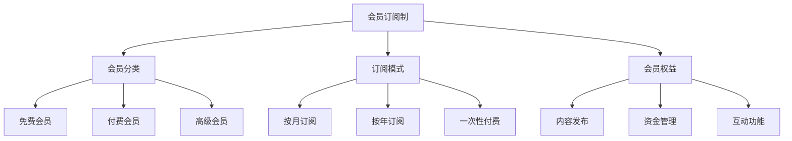

                 

### 第一部分：会员订阅制的核心概念与联系

在《如何利用Patreon建立创业项目的会员订阅制》的第一部分，我们将探讨会员订阅制的核心概念以及这些概念之间的联系。会员订阅制作为一种商业模式，其重要性在当今的数字化时代日益凸显。以下是对核心概念和联系的详细探讨：

#### 第1章：会员订阅制概述

##### 1.1 会员订阅制的定义与特点

会员订阅制是指消费者通过定期支付订阅费用来获得持续服务或产品的一种商业模式。它具有以下几个显著特点：

- **长期性**：会员订阅是一种长期的业务模式，消费者通常承诺在一段时间内持续支付费用。
- **可预测性**：订阅收入相对于一次性销售更为稳定和可预测，为创业项目提供了稳定的现金流。
- **重复性**：会员订阅制意味着消费者会定期支付费用，这为创业项目带来了持续的收益。
- **高频互动**：订阅制通常伴随着频繁的互动，如会员社区、内容更新、产品迭代等。

##### 1.2 会员订阅制的架构

会员订阅制的架构包括以下几个关键组成部分：

- **会员分类**：根据会员的订阅费用和参与度，可以将会员分为免费会员、付费会员和高级会员等不同等级。
- **订阅模式**：创业项目可以根据需求设置多种订阅模式，如按月订阅、按年订阅或一次性付费等。
- **会员权益**：不同等级的会员可以享受不同的权益，如免费内容、独家内容、会员互动等。

##### 1.3 会员订阅制与传统销售模式的区别

传统销售模式通常是一次性销售，缺乏持续性和互动性。而会员订阅制则通过提供持续服务和互动，增强了用户粘性，具体区别如下：

- **销售模式**：传统销售是一次性交易，而订阅制是持续的服务或产品提供。
- **用户关系**：传统销售结束后，用户关系通常终止，而订阅制则建立了长期的用户关系。
- **收入模式**：传统销售依赖一次性收入，而订阅制提供了持续的、可预测的收入。

##### 1.4 会员订阅制在创业项目中的应用

会员订阅制在多种创业项目中有着广泛的应用，以下是几个典型的应用场景：

- **内容创作**：如YouTube创作者、博客作者等，通过会员订阅获取持续收入。
- **软件服务**：如SaaS公司，通过订阅模式提供持续更新的软件服务。
- **电商**：如订阅电商，用户通过订阅获取定期配送的商品。

会员订阅制的优势在于其稳定的现金流、降低的营销成本和提升的用户忠诚度，这些优势使其成为创业项目的重要选择。

#### 第2章：Patreon平台介绍

在第二部分，我们将详细介绍Patreon平台的基本功能、会员管理、盈利模式以及案例分析。Patreon作为一个专为创作者设计的会员订阅平台，为创业项目提供了一个强大的工具，以下是对其详细介绍的目录：

##### 2.1 Patreon平台的基本功能

Patreon平台为创作者提供了多种基本功能，以下是其主要功能：

- **内容发布**：创作者可以在Patreon上发布文字、图片、视频等多种形式的内容。
- **资金管理**：Patreon提供了一套完善的资金管理工具，创作者可以设置不同的订阅费用和奖励机制。
- **互动功能**：Patreon允许创作者与会员进行互动，如评论、私信和会员互动等。

##### 2.2 Patreon平台的会员管理

会员管理是Patreon平台的核心功能之一，以下是其主要特点：

- **会员分类**：Patreon根据会员的订阅费用和贡献度对会员进行分类，不同分类的会员享受不同的权益。
- **会员权益**：创作者可以为不同会员等级设置不同的权益，如免费内容、独家内容等。
- **会员动态**：Patreon提供了会员订阅和取消情况的实时跟踪功能，帮助创作者了解会员动态。

##### 2.3 Patreon平台的盈利模式

Patreon平台的盈利模式主要包括以下几个方面：

- **订阅收入**：创作者根据设置的订阅费用和订阅人数计算收入。
- **平台分成**：Patreon从订阅收入中提取一定比例作为平台费用，剩余部分归创作者所有。
- **奖励机制**：Patreon通过奖励机制提高会员的参与度和忠诚度，这有助于增加会员数量和订阅收入。

##### 2.4 Patreon平台的案例分析

Patreon平台上有着许多成功的案例，以下是几个典型的案例分析：

- **成功案例**：分析一些在Patreon上取得成功的创业项目，了解其成功的原因和策略。
- **失败案例**：探讨一些在Patreon上失败的创业项目及其原因，提供宝贵的经验教训。

通过这一部分的内容，读者将全面了解Patreon平台的功能、会员管理、盈利模式以及成功和失败的案例分析。这将为他们提供宝贵的参考和启示，帮助他们更好地利用Patreon平台建立自己的会员订阅制。

### Mermaid 流程图

以下是会员订阅制的概念架构Mermaid流程图：

通过这个流程图，读者可以直观地理解会员订阅制的各个核心概念及其相互联系。在接下来的部分，我们将深入探讨会员订阅制的运营策略和实施细节，帮助读者更好地理解和应用这一商业模式。

### 第二部分：会员订阅制的运营策略与实施细节

在《如何利用Patreon建立创业项目的会员订阅制》的第二部分，我们将深入探讨会员订阅制的运营策略与实施细节。这部分内容将帮助读者了解如何通过有效的市场研究、内容策略和互动管理，将会员订阅制成功应用于创业项目。

#### 第3章：市场研究与定位

市场研究和定位是会员订阅制成功实施的基础。以下是对市场调研、项目定位和市场细分策略的详细探讨。

##### 3.1 市场调研

市场调研是了解目标市场和潜在用户的重要手段。以下步骤有助于进行有效的市场调研：

1. **目标用户群体分析**：
   - **特点**：分析目标用户的行为习惯、消费偏好和需求。
   - **需求**：了解用户对产品或服务的具体需求，包括内容和功能。

2. **竞争分析**：
   - **竞争对手**：识别主要竞争对手及其优势和劣势。
   - **市场地位**：评估竞争对手在市场上的地位和市场份额。

3. **市场趋势**：
   - **行业动态**：跟踪行业最新发展趋势和变化。
   - **技术进步**：了解技术进步对市场的影响。

##### 3.2 项目定位

项目定位是确定创业项目的独特卖点和核心竞争力。以下步骤有助于进行有效的项目定位：

1. **价值主张**：
   - **核心价值**：明确项目的核心价值和独特卖点。
   - **差异化**：分析项目与竞争对手的差异化优势。

2. **目标会员特征**：
   - **需求**：明确目标会员的需求和期望。
   - **行为习惯**：分析目标会员的行为习惯和消费模式。

3. **市场细分**：
   - **市场细分策略**：根据用户需求和特征进行市场细分。
   - **细分市场**：为每个细分市场设计特定的产品或服务。

##### 3.3 市场细分

市场细分策略有助于更精准地满足不同用户群体的需求。以下步骤有助于实施市场细分策略：

1. **用户需求分析**：
   - **需求层次**：了解用户的不同需求层次，包括基本需求、期望需求和惊喜需求。
   - **用户画像**：创建详细的目标用户画像，包括年龄、性别、职业等特征。

2. **会员权益设计**：
   - **权益差异**：为不同细分市场设计差异化的会员权益。
   - **权益匹配**：确保设计的会员权益与用户需求相匹配。

3. **市场细分测试**：
   - **A/B测试**：通过A/B测试验证市场细分策略的有效性。
   - **用户反馈**：收集用户对细分市场的反馈，持续优化策略。

#### 第4章：内容策略与互动管理

内容策略和互动管理是会员订阅制成功的关键。以下是对内容策划、互动管理和奖励机制设计的详细探讨。

##### 4.1 内容策划

内容策划是会员订阅制的重要组成部分。以下步骤有助于制定有效的内容策略：

1. **内容规划**：
   - **长期内容计划**：制定长期内容发布计划，确保内容的持续性和稳定性。
   - **短期内容安排**：制定短期内容发布计划，满足用户的需求和兴趣。

2. **内容形式**：
   - **多样化**：选择适合会员需求的多样化内容形式，如文字、图片、视频、直播等。
   - **个性化**：根据会员的兴趣和偏好提供个性化的内容推荐。

3. **内容更新频率**：
   - **定期更新**：保持内容更新的频率，维持用户的兴趣和活跃度。
   - **应急更新**：在特殊情况下，及时发布相关内容，满足会员的即时需求。

##### 4.2 互动管理

互动管理是增强用户粘性和忠诚度的有效手段。以下步骤有助于进行有效的互动管理：

1. **会员互动**：
   - **评论互动**：鼓励会员在内容下方发表评论，与创作者进行互动。
   - **私信互动**：提供私信功能，方便会员与创作者进行一对一的沟通。

2. **社区管理**：
   - **社区建设**：建立会员社区，提供会员之间互动的平台。
   - **社区管理**：定期清理社区，维护社区秩序，确保社区环境的健康。

3. **互动活动**：
   - **在线问答**：定期举办在线问答活动，解答会员的问题。
   - **会员调研**：通过会员调研了解用户需求和意见，持续优化内容和服务。

##### 4.3 奖励机制设计

奖励机制设计是激励会员参与和提升忠诚度的有效手段。以下步骤有助于设计有效的奖励机制：

1. **奖励类型**：
   - **物质奖励**：提供实物奖励，如礼品、优惠券等。
   - **虚拟奖励**：提供虚拟奖励，如会员徽章、专属图标等。
   - **服务奖励**：提供特殊服务，如优先回复、定制内容等。

2. **奖励分配**：
   - **公平分配**：确保奖励的公平性和透明性，避免会员之间的矛盾。
   - **动态调整**：根据会员的参与度和贡献度动态调整奖励。

3. **奖励机制优化**：
   - **反馈机制**：收集会员对奖励机制的反馈，持续优化奖励方案。
   - **创新奖励**：定期引入新的奖励形式，保持奖励机制的活力。

#### 第5章：会员沟通与维护

会员沟通与维护是确保会员满意度和服务质量的重要环节。以下是对会员沟通、满意度评估和会员服务的详细探讨。

##### 5.1 会员沟通

有效的会员沟通有助于提升会员满意度和忠诚度。以下步骤有助于进行有效的会员沟通：

1. **沟通渠道**：
   - **电子邮件**：定期向会员发送电子邮件，提供项目更新、活动通知等。
   - **社交媒体**：利用社交媒体平台与会员进行互动，提高品牌知名度。

2. **沟通内容**：
   - **个性化**：根据会员的偏好和需求定制沟通内容。
   - **及时性**：及时回复会员的询问和反馈，解决问题。

##### 5.2 会员满意度评估

会员满意度评估是衡量会员满意度和服务质量的重要指标。以下步骤有助于进行有效的会员满意度评估：

1. **满意度调查**：
   - **定期调查**：定期进行会员满意度调查，收集会员的反馈。
   - **反馈分析**：分析满意度调查结果，识别问题和改进方向。

2. **满意度指标**：
   - **服务满意度**：评估会员对服务的满意度。
   - **内容满意度**：评估会员对内容的满意度。

##### 5.3 会员服务

提供优质的会员服务是提升会员满意度和忠诚度的关键。以下步骤有助于提供有效的会员服务：

1. **服务内容**：
   - **客户支持**：提供7x24小时的客户支持，解决会员的问题。
   - **定制服务**：根据会员的需求提供定制化的服务。

2. **服务体验**：
   - **用户体验**：优化会员服务的用户体验，提高服务效率。
   - **互动体验**：提供互动性的服务，增强会员的参与感。

3. **服务质量**：
   - **服务标准**：制定明确的服务标准，确保服务质量。
   - **服务改进**：根据会员反馈持续改进服务。

通过以上章节的详细探讨，读者将全面了解会员订阅制的核心概念、运营策略和实施细节。这些知识将有助于他们在创业项目中成功应用会员订阅制，实现商业模式的创新和增长。

---

### 第三部分：会员订阅制的优化与拓展策略

在《如何利用Patreon建立创业项目的会员订阅制》的第三部分，我们将探讨会员订阅制的优化与拓展策略。优化与拓展策略是确保会员订阅制长期稳定发展的关键，以下是对关键优化策略、数据分析方法、会员生命周期管理以及案例分析的具体讨论。

#### 第6章：会员订阅制的优化策略

##### 6.1 优化订阅费用结构

优化订阅费用结构是提升会员订阅收入的重要手段。以下是一些优化订阅费用结构的方法：

1. **分层定价**：根据会员的价值和贡献度设置不同的订阅费用，实现差异化定价。
2. **促销活动**：定期举办订阅促销活动，如限时折扣、捆绑销售等，吸引更多会员订阅。
3. **增值服务**：提供增值服务，如高级会员独享内容、特殊活动邀请等，提升会员的订阅价值。

##### 6.2 提高用户留存率

提高用户留存率是保证会员订阅制长期稳定发展的关键。以下是一些提高用户留存率的方法：

1. **个性化推荐**：根据会员的喜好和行为数据提供个性化的内容推荐，提升用户满意度。
2. **互动体验**：增强会员与创作者之间的互动，如定期举办问答活动、会员互动论坛等，提高用户粘性。
3. **会员关怀**：通过定期的会员关怀活动，如生日祝福、节日问候等，增强会员的情感联系。

##### 6.3 增强会员忠诚度

增强会员忠诚度是提高会员长期订阅率的重要手段。以下是一些增强会员忠诚度的策略：

1. **积分制度**：引入积分制度，会员通过参与活动和消费获得积分，积分可以兑换礼品或特殊权益。
2. **会员等级**：设置会员等级制度，会员根据订阅时长和消费金额晋升等级，享受更多权益。
3. **社区建设**：建立活跃的会员社区，促进会员之间的交流与合作，增强会员的归属感。

#### 第7章：会员订阅制的数据分析方法

数据分析方法是优化会员订阅制的重要工具。以下是一些常用的数据分析方法：

1. **会员行为分析**：通过分析会员的行为数据，如访问频率、内容偏好等，了解会员的需求和习惯。
2. **订阅趋势分析**：通过分析订阅趋势，如订阅增长率、订阅周期等，预测未来的订阅收入。
3. **流失分析**：通过分析会员流失的原因，如订阅费用过高、内容不吸引等，制定针对性的优化措施。

#### 第8章：会员生命周期管理

会员生命周期管理是确保会员持续参与和贡献的重要环节。以下是一些会员生命周期管理的策略：

1. **会员获取**：通过市场推广和活动策划，吸引潜在会员并促进转化。
2. **会员活跃**：通过内容更新、互动活动等方式，保持会员的活跃度和参与度。
3. **会员留存**：通过个性化推荐、会员关怀等措施，降低会员的流失率。
4. **会员增值**：通过增值服务、会员等级制度等方式，提升会员的价值和忠诚度。

#### 第9章：会员订阅制的案例分析

##### 9.1 成功案例

成功案例是学习会员订阅制有效实施的重要参考。以下是一些在Patreon平台上的成功案例：

1. **案例1**：分析某个在Patreon上成功的创业项目，探讨其成功的原因和策略。
2. **案例2**：分析另一个在Patreon上成功的创业项目，了解其如何优化订阅费用结构和提升用户留存率。

##### 9.2 失败案例

失败案例是避免重复错误的重要经验。以下是一些在Patreon平台上的失败案例：

1. **案例1**：分析某个在Patreon上失败的创业项目，探讨其失败的原因和教训。
2. **案例2**：分析另一个在Patreon上失败的创业项目，了解其如何未能有效管理会员生命周期和提供优质内容。

通过这一部分的详细探讨，读者将能够了解如何优化会员订阅制，实施有效的数据分析，管理会员生命周期，并从成功和失败案例中汲取经验和教训。这些策略和方法将为他们在创业项目中成功应用会员订阅制提供有力支持。

---

### 第四部分：会员订阅制的风险管理与合规性

在《如何利用Patreon建立创业项目的会员订阅制》的第四部分，我们将探讨会员订阅制的风险管理与合规性。风险管理与合规性是确保会员订阅制长期稳定发展的重要保障，以下是对风险管理策略、法律合规性、平台责任和应对突发事件的详细探讨。

#### 第10章：会员订阅制的风险管理

会员订阅制的风险管理是防止风险事件发生和降低风险影响的关键。以下是一些风险管理策略：

##### 10.1 风险识别

1. **财务风险**：评估订阅收入的不稳定性和货币贬值风险。
2. **运营风险**：识别技术故障、人员变动等可能影响运营的风险。
3. **市场风险**：分析市场变化和竞争环境可能带来的风险。

##### 10.2 风险评估

1. **定量分析**：使用统计方法评估风险的概率和影响。
2. **定性分析**：结合专家意见和情景分析评估风险。

##### 10.3 风险应对策略

1. **风险规避**：避免高风险的活动或业务模式。
2. **风险减轻**：通过技术改进、流程优化等措施减轻风险的影响。
3. **风险转移**：购买保险将风险转移给第三方。

#### 第11章：法律合规性

法律合规性是确保会员订阅制合法运行的重要前提。以下是一些关键的法律合规性要求：

##### 11.1 数据保护法律

1. **GDPR**：遵守欧盟通用数据保护条例，确保会员数据的保护和隐私。
2. **CCPA**：遵守加州消费者隐私法案，确保会员信息的透明度和可访问性。

##### 11.2 财务合规性

1. **税务合规性**：遵守所在国家的税务法律和规定，按时申报和缴纳相关税费。
2. **支付合规性**：确保支付渠道符合相关法律法规，如反洗钱法规。

##### 11.3 合同法律

1. **会员协议**：制定明确的会员协议，明确会员的权利和义务。
2. **版权保护**：确保所发布的内容不侵犯他人的版权和知识产权。

#### 第12章：平台责任

平台责任是确保会员订阅制顺利运行的关键。以下是对平台责任的详细探讨：

##### 12.1 平台服务保障

1. **稳定性**：确保平台服务的稳定性和可靠性，减少故障和中断。
2. **安全性**：加强平台安全措施，防止数据泄露和黑客攻击。

##### 12.2 平台监管

1. **内容审核**：对发布的内容进行审核，确保内容合规和健康。
2. **会员争议处理**：建立有效的争议解决机制，处理会员之间的纠纷。

##### 12.3 平台透明度

1. **信息透明**：向会员提供透明、清晰的收费标准和费用结构。
2. **沟通渠道**：建立多种沟通渠道，方便会员反馈问题和建议。

#### 第13章：应对突发事件

突发事件可能对会员订阅制造成重大影响。以下是对应对突发事件的详细探讨：

##### 13.1 突发事件响应

1. **应急计划**：制定详细的应急计划，明确应对突发事件的步骤和责任人。
2. **应急预案**：定期进行应急预案演练，确保应急响应的效率和效果。

##### 13.2 突发事件处理

1. **及时响应**：在突发事件发生后，迅速启动应急计划，采取有效措施。
2. **信息发布**：及时向会员发布突发事件的相关信息，确保会员知情。

##### 13.3 突发事件恢复

1. **问题解决**：尽快解决问题，恢复平台的正常运行。
2. **反馈机制**：收集会员对突发事件处理的反馈，持续改进应急响应流程。

通过这一部分的详细探讨，读者将能够了解如何管理会员订阅制的风险，确保法律合规性，履行平台责任，并有效应对突发事件。这些知识将为他们在创业项目中建立和管理会员订阅制提供坚实的保障。

---

### 全文总结与拓展

在《如何利用Patreon建立创业项目的会员订阅制》一文中，我们系统地探讨了会员订阅制的核心概念、运营策略、优化拓展以及风险管理与合规性。以下是全文的总结与拓展。

#### 核心概念回顾

会员订阅制是一种通过定期支付费用获取持续服务或产品的商业模式。其特点包括长期性、可预测性、重复性和高频互动。会员订阅制的架构包括会员分类、订阅模式和会员权益，与传统销售模式相比，具有显著的优势。

#### 运营策略与实践

成功的会员订阅制需要有效的市场研究、内容策略、互动管理和会员沟通。市场研究帮助确定目标市场和用户需求，内容策略确保提供有价值的内容，互动管理增强用户粘性，会员沟通提升会员满意度。同时，通过个性化的奖励机制和会员等级制度，可以进一步激励会员参与。

#### 优化与拓展

优化订阅费用结构、提高用户留存率和增强会员忠诚度是确保会员订阅制长期稳定发展的重要策略。通过数据分析，可以更精准地了解会员行为和需求，从而优化订阅模式和内容策略。此外，不断引入新的奖励形式和互动活动，可以保持会员订阅制的活力。

#### 风险管理与合规性

风险管理是确保会员订阅制稳健运行的关键。通过识别、评估和应对各种风险，可以降低风险带来的影响。法律合规性是保障会员订阅制合法运行的重要前提，包括数据保护、财务合规性和合同法律等方面。平台责任和应急响应策略也是确保平台稳定运行和会员权益的关键。

#### 拓展阅读与最佳实践

对于希望深入了解会员订阅制的读者，以下是一些拓展阅读和最佳实践的建议：

- **拓展阅读**：阅读《订阅制商业模型》一书，深入了解订阅制商业模式的原理和应用。
- **最佳实践**：参考Patreon平台上的成功案例，学习它们如何优化订阅模式、内容策略和会员互动。
- **行业报告**：关注行业报告和市场分析，了解最新的市场趋势和用户需求。

通过本文的探讨，我们希望读者能够全面了解会员订阅制的运作机制和实践方法，并能够在创业项目中成功应用这一模式，实现商业的成功和发展。

---

### 文章标题、关键词、摘要

#### 文章标题
《如何利用Patreon建立创业项目的会员订阅制》

#### 关键词
会员订阅制、Patreon、创业项目、内容策略、互动管理、风险管理、合规性

#### 摘要
本文深入探讨了会员订阅制的核心概念、运营策略、优化拓展以及风险管理与合规性。通过详细的案例分析，读者可以了解如何利用Patreon平台建立和实施会员订阅制，从而实现创业项目的持续发展。本文适用于希望在数字化时代利用会员订阅制提升业务效益的创业者和企业。

