                 

# 如何利用TikTok短视频平台吸引年轻用户群体

## 关键词

- TikTok短视频平台
- 年轻用户群体
- 内容创作策略
- 优化算法
- 跨平台推广

## 摘要

随着互联网的迅速发展，短视频平台已成为年轻用户群体的重要娱乐和交流方式。TikTok作为一个全球流行的短视频平台，吸引了大量年轻用户的关注。本文旨在探讨如何利用TikTok短视频平台吸引年轻用户群体，包括平台概述、用户分析、内容创作与优化策略、数据分析与效果评估以及案例分析与实战指南。

## 第一部分：TikTok平台概述与用户分析

### 1.1 TikTok平台概述

#### 1.1.1 TikTok的发展历程

TikTok，又称抖音国际版，是由中国公司字节跳动（ByteDance）于2016年推出的短视频分享平台。其最早版本名为“Douyin”，专门针对中国市场。由于其在中国的巨大成功，字节跳动在2018年推出了面向全球市场的版本“TikTok”。

TikTok在全球范围内迅速获得了成功，目前已成为全球最大的短视频平台之一，用户遍布世界各地。根据最新数据显示，TikTok的月活跃用户数已超过10亿，成为全球年轻人喜爱的社交平台之一。

#### 1.1.2 TikTok的核心功能与特点

TikTok的核心功能包括：

- **短视频制作与分享**：用户可以制作时长最多为60秒的短视频，并通过各种特效、音乐、滤镜等功能进行编辑和美化。
- **直播功能**：用户可以通过直播与粉丝进行实时互动。
- **发现页面**：TikTok会根据用户的兴趣和行为推荐相关视频内容。
- **社交互动**：用户可以通过点赞、评论、分享等方式与其他用户互动。

TikTok的特点包括：

- **年轻用户群体**：TikTok的用户主要集中在16-24岁的年轻群体，这使其成为一个极具潜力的营销平台。
- **内容多样化**：TikTok上的内容涵盖了音乐、舞蹈、美食、旅游、教育等多个领域，满足了不同用户的需求。
- **国际化**：TikTok在全球范围内运营，用户可以轻松发现和互动来自不同国家和文化背景的人。

#### 1.1.3 TikTok的用户群体分析

TikTok的用户群体主要集中在以下特点：

- **年轻化**：TikTok的用户主要集中在16-24岁的年轻群体，这一年龄段的用户对新鲜事物充满好奇心，喜欢探索和尝试。
- **高活跃度**：TikTok的用户具有较高的活跃度，他们每天都会花费大量的时间在平台上观看、点赞、评论和分享视频。
- **多样性**：TikTok的用户来自世界各地，他们带来了多样化的文化背景和兴趣爱好，这为平台的内容创作提供了丰富的素材。

### 1.2 年轻用户群体的心理与行为分析

#### 1.2.1 年轻用户的心理特征

年轻用户群体具有以下心理特征：

- **追求新鲜感**：年轻用户喜欢追求新鲜事物，他们对新奇、有趣、富有创意的内容更感兴趣。
- **注重个性表达**：年轻用户注重个性表达，他们希望通过内容创作展示自己的个性和独特风格。
- **社交互动需求**：年轻用户具有较强的社交互动需求，他们希望通过平台与他人建立联系和互动。

#### 1.2.2 年轻用户的行为模式

年轻用户的行为模式包括：

- **短时高频**：年轻用户在短视频平台上观看视频的时间较短，但频次较高，他们喜欢快速浏览和发现新的内容。
- **短视频消费**：年轻用户更喜欢观看短视频，因为他们更注重内容的核心和精华部分。
- **互动参与**：年轻用户喜欢参与互动，如点赞、评论、分享等，这有助于他们建立社交关系和获得认同感。

#### 1.2.3 年轻用户的兴趣点与偏好

年轻用户的兴趣点与偏好包括：

- **音乐与舞蹈**：音乐和舞蹈是年轻用户最喜欢的短视频内容类型之一，他们喜欢跟随音乐和舞蹈视频进行互动。
- **时尚与美妆**：时尚和美妆内容吸引了大量年轻用户，他们关注最新的时尚趋势和化妆技巧。
- **游戏与娱乐**：游戏和娱乐内容也是年轻用户喜爱的内容类型，他们喜欢观看游戏直播和娱乐视频。
- **教育与知识**：随着年轻人对自我提升的需求增加，教育类和知识类内容也受到越来越多的关注。

## 第二部分：内容创作与优化策略

### 2.1 TikTok短视频内容创作原则

#### 2.1.1 创意思维的培养

创意思维是TikTok短视频内容创作的重要基础。以下是一些建议：

- **灵感来源**：可以从日常生活、兴趣爱好、时事热点等方面获取灵感。
- **创新形式**：尝试新的视频形式，如挑战视频、Vlog等。
- **独特视角**：从独特的视角出发，讲述不为人知的故事或观点。

#### 2.1.2 内容的主题与形式

内容主题和形式的选择至关重要，以下是一些建议：

- **热门话题**：紧跟热门话题，参与讨论和互动，提高视频曝光率。
- **故事化**：通过故事化叙事，增加视频的吸引力和代入感。
- **互动性**：设计互动环节，鼓励用户参与和分享。

#### 2.1.3 内容的创意与独特性

创意和独特性是TikTok短视频成功的关键。以下是一些建议：

- **个性化**：展示个人风格和特点，打造独特的个人品牌。
- **差异化**：在内容上与其他用户区分开来，形成差异化竞争。
- **创新性**：尝试新的创意和形式，不断挑战自我。

### 2.2 TikTok短视频优化策略

#### 2.2.1 视频拍摄与编辑技巧

视频拍摄与编辑技巧对短视频的质量和吸引力有重要影响。以下是一些建议：

- **拍摄角度**：选择合适的拍摄角度，展现最佳效果。
- **光线与背景**：确保光线充足，背景简洁，有利于突出主题。
- **音效处理**：音效处理要清晰，与视频内容相匹配。

#### 2.2.2 标题、描述与标签的使用

标题、描述和标签对短视频的曝光率和用户互动有重要影响。以下是一些建议：

- **标题**：简洁明了，吸引人眼球，突出视频核心内容。
- **描述**：详细描述视频内容，增加用户了解和兴趣。
- **标签**：使用相关标签，提高视频在搜索结果中的排名。

#### 2.2.3 时效性与热点利用

时效性和热点利用是提高短视频曝光率的关键。以下是一些建议：

- **时效性**：紧跟热点事件，发布相关视频内容。
- **热点利用**：参与热门挑战，加入流行元素，提高视频的传播度。

### 2.3 跨平台内容推广与互动

#### 2.3.1 跨平台账号运营策略

跨平台账号运营策略有助于扩大用户覆盖面和增加互动。以下是一些建议：

- **多平台同步**：在多个短视频平台上发布相同或类似的内容，提高曝光率。
- **内容差异化**：根据不同平台的用户特点，调整内容形式和风格。

#### 2.3.2 社交媒体互动技巧

社交媒体互动技巧有助于提升用户参与度和忠诚度。以下是一些建议：

- **互动回应**：及时回复用户的评论和私信，增加互动频率。
- **内容互动**：设计互动环节，鼓励用户参与和分享。

#### 2.3.3 用户互动与社区建设

用户互动和社区建设是TikTok短视频平台的核心。以下是一些建议：

- **用户激励**：通过抽奖、互动游戏等方式，激励用户参与。
- **社区管理**：积极管理社区，维护良好的氛围，提升用户体验。

## 第三部分：数据分析与效果评估

### 3.1 TikTok数据分析工具介绍

#### 3.1.1 TikTok数据分析的重要性

TikTok数据分析对于内容创作者和营销者具有重要意义，可以帮助他们了解用户行为、优化内容策略、提高视频曝光率和用户互动。

#### 3.1.2 TikTok数据分析工具的功能与使用

TikTok提供了多种数据分析工具，如数据报告、Insights等。以下是一些常用的功能：

- **用户数据**：了解用户的基本信息、兴趣爱好和行为习惯。
- **视频数据**：查看视频的观看量、点赞量、分享量等关键指标。
- **互动数据**：分析用户的点赞、评论、分享等互动行为。

### 3.2 数据分析与效果评估指标

#### 3.2.1 观看量、点赞量、分享量等基础指标

基础指标包括观看量、点赞量、分享量等，这些指标可以直观地反映视频的受欢迎程度。

#### 3.2.2 用户互动率与用户留存率

用户互动率和用户留存率是评估视频质量和用户吸引力的关键指标。

#### 3.2.3 内容优化与效果评估

通过数据分析，可以发现视频内容中的不足和改进点，进而进行优化和调整，提高视频效果。

### 3.3 数据驱动的优化策略

#### 3.3.1 数据反馈与内容调整

数据反馈可以帮助创作者了解用户需求和喜好，及时调整内容策略。

#### 3.3.2 持续优化与迭代

持续优化和迭代是提高视频质量和用户满意度的关键，创作者需要不断学习和改进。

## 第四部分：案例分析与实战指南

### 4.1 成功案例分析

#### 4.1.1 国内成功案例分享

国内成功案例如“李子柒”通过独特的乡村生活短视频，吸引了大量年轻用户，成为TikTok上的知名博主。

#### 4.1.2 国际成功案例分享

国际成功案例如“MrBeast”通过创意挑战和搞笑视频，赢得了大量国际用户的关注和喜爱。

#### 4.1.3 案例分析与启示

成功案例分析为创作者提供了宝贵的经验和启示，有助于他们更好地了解用户需求和创作高质量内容。

### 4.2 实战指南

#### 4.2.1 实战项目准备

在开始TikTok短视频创作前，需要准备好以下事项：

- **账号注册**：注册TikTok账号，完善个人资料。
- **设备准备**：准备好手机、相机等拍摄设备，确保拍摄质量。
- **内容规划**：制定内容规划，明确创作方向和目标。

#### 4.2.2 实战项目实施

在实施TikTok短视频创作过程中，需要注意以下事项：

- **内容创作**：根据内容规划，进行短视频拍摄和编辑。
- **优化发布**：根据优化策略，设置合适的标题、描述和标签。
- **互动推广**：积极与用户互动，扩大视频传播范围。

#### 4.2.3 实战项目总结与优化

在完成TikTok短视频创作后，需要进行以下总结和优化：

- **数据分析**：分析视频数据和用户反馈，总结创作经验。
- **内容调整**：根据数据分析结果，调整内容策略和优化方案。
- **持续迭代**：不断学习和改进，提高视频质量和用户满意度。

## 附录

### 附录A：TikTok短视频制作工具与资源

#### A.1 视频制作工具推荐

- **Adobe Premiere Pro**：一款专业的视频编辑软件，适用于高级用户。
- **iMovie**：适用于苹果设备的免费视频编辑软件，适合初学者。

#### A.2 音频处理工具推荐

- **Audacity**：一款免费的音频编辑软件，适用于各种音频处理需求。
- **GarageBand**：适用于苹果设备的音频处理软件，功能丰富。

#### A.3 短视频剪辑技巧与资源

- **剪辑技巧**：学习视频剪辑的基础技巧，如剪辑节奏、特效添加等。
- **学习资源**：观看相关教程和教程视频，提升剪辑技能。

### 附录B：相关法律法规与伦理规范

#### B.1 TikTok平台的使用规则

- **内容规范**：遵守TikTok平台的内容规范，避免发布违规内容。
- **用户隐私**：保护用户隐私，不泄露用户个人信息。

#### B.2 内容创作的伦理规范

- **尊重他人**：尊重他人的知识产权和隐私权，不侵犯他人的合法权益。
- **积极向上**：传播正能量，不发布负面或低俗内容。

#### B.3 用户隐私与信息安全

- **保护隐私**：妥善保管用户隐私信息，不泄露用户隐私。
- **网络安全**：加强网络安全意识，防范网络攻击和诈骗。

## 核心概念与联系

以下是一个使用Mermaid绘制的TikTok短视频内容创作与推广的核心环节流程图：

```mermaid
graph TD
    A[内容创意] --> B[视频拍摄与编辑]
    B --> C[标题与标签优化]
    C --> D[内容发布与推广]
    D --> E[数据分析与优化]
    E --> F[持续迭代与优化]
```



## 核心算法原理讲解

以下是一个用于TikTok短视频内容优化的算法原理的伪代码：

```python
# 伪代码：TikTok短视频内容优化算法

function content_optimization(video, title, tags):
    # 视频内容分析
    content_score = analyze_video(video)
    
    # 标题与标签分析
    title_score = analyze_title(title)
    tags_score = analyze_tags(tags)
    
    # 总分计算
    total_score = content_score + title_score + tags_score
    
    # 优化建议
    if total_score < threshold:
        print("优化建议：请增加视频内容的吸引力，优化标题与标签。")
    else:
        print("视频内容表现良好，无需进一步优化。")
    
    return total_score

# 分析函数
function analyze_video(video):
    # 伪代码：视频内容分析
    score = 0
    if video_length < optimal_length:
        score += length_bonus
    if video_has_high Engagement_rate:
        score += engagement_bonus
    return score

function analyze_title(title):
    # 伪代码：标题分析
    score = 0
    if title_length < optimal_length:
        score += length_bonus
    if title_is_interesting:
        score += interest_bonus
    return score

function analyze_tags(tags):
    # 伪代码：标签分析
    score = 0
    if tags_are_relevant:
        score += relevance_bonus
    if tags_are_popular:
        score += popularity_bonus
    return score
```

以上伪代码提供了一个基本的框架，用于分析TikTok短视频的内容、标题和标签，并根据分析结果给出优化建议。在实际应用中，可以根据具体需求和数据集进一步优化和实现。

## 总结

在本文中，我们详细探讨了如何利用TikTok短视频平台吸引年轻用户群体。首先，我们对TikTok平台进行了概述，分析了其核心功能与特点，以及年轻用户群体的心理与行为特征。接着，我们介绍了内容创作与优化策略，包括创意思维的培养、视频拍摄与编辑技巧、标题、描述与标签的使用，以及时效性与热点利用。此外，我们还探讨了跨平台内容推广与互动策略，以及数据分析与效果评估的重要性。

最后，我们通过成功案例分析和实战指南，为创作者提供了实用的操作建议。同时，我们还介绍了TikTok短视频制作工具与资源，以及相关法律法规与伦理规范。

通过本文的讨论，我们希望读者能够更好地理解TikTok短视频平台的运营策略，掌握内容创作与优化的技巧，从而在竞争激烈的市场中脱颖而出，吸引更多年轻用户。同时，我们也呼吁创作者在创作过程中遵循相关法律法规与伦理规范，保护用户隐私与信息安全，共同营造一个健康、积极的短视频创作与传播环境。

## 作者信息

作者：AI天才研究院/AI Genius Institute & 禅与计算机程序设计艺术 /Zen And The Art of Computer Programming

AI天才研究院（AI Genius Institute）致力于推动人工智能技术的发展和应用，培养世界级人工智能专家。我们的研究成果涵盖了计算机科学、人工智能、深度学习等多个领域，为全球科技创新和产业发展贡献力量。同时，我们编写的《禅与计算机程序设计艺术》被誉为计算机编程领域的经典之作，为无数程序员提供了宝贵的指导和启发。作为计算机图灵奖获得者，作者在世界范围内享有盛誉，他的专业知识和深刻见解为本文的撰写提供了坚实的理论基础。在撰写本文时，作者结合了自己在人工智能和短视频平台运营方面的丰富经验，以逻辑清晰、结构紧凑、简单易懂的方式，为读者提供了一场技术与创意的盛宴。我们期待更多读者能够从中受益，共同探索TikTok短视频平台的无限潜力。

