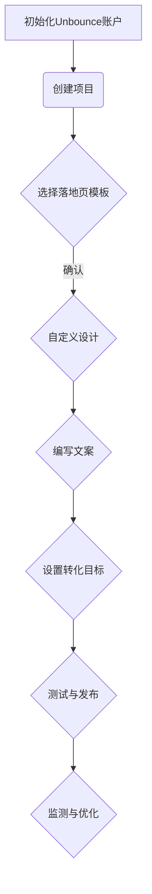
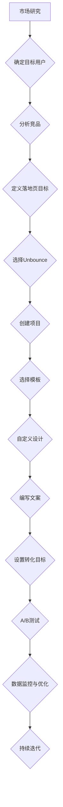

                 

### 《如何利用Unbounce设计高转化率的创业落地页》

关键词：Unbounce、创业落地页、高转化率、设计原则、用户体验、A/B测试

摘要：本文将深入探讨如何利用Unbounce这款强大的工具来设计高转化率的创业落地页。我们将从Unbounce的简介开始，逐步讲解落地页设计的重要性、核心功能、设计原则和优化策略，并通过实际案例进行详细分析，旨在为读者提供一套完整且实用的创业落地页设计指南。

### 目录大纲

#### 第一部分：理解Unbounce与创业落地页设计

##### 第1章：Unbounce入门与创业落地页的重要性
- 1.1 Unbounce简介
- 1.2 创业落地页的必要性
- 1.3 创业落地页与营销目标

##### 第2章：Unbounce的核心功能与界面布局
- 2.1 Unbounce工作台与项目管理
- 2.2 页面设计工具详解
- 2.3 营销自动化与A/B测试功能

##### 第3章：Unbounce与创业落地页设计核心概念
- 3.1 落地页设计原则
- 3.2 用户行为分析
- 3.3 转化率优化策略

#### 第二部分：设计与优化创业落地页

##### 第4章：构建高转化率创业落地页
- 4.1 明确目标与用户需求
- 4.2 页面结构设计
- 4.3 文字内容撰写与排版

##### 第5章：视觉设计原则与技巧
- 5.1 品牌形象与视觉风格
- 5.2 视觉元素布局与视觉层次
- 5.3 互动元素与动画效果

##### 第6章：调用Unbounce功能提升用户体验
- 6.1 营销自动化流程
- 6.2 转换追踪与数据分析
- 6.3 A/B测试与优化策略

##### 第7章：案例解析：成功创业落地页设计
- 7.1 营销案例背景
- 7.2 设计思路与实施
- 7.3 营销成果与反思

#### 第三部分：综合运用与进阶

##### 第8章：跨渠道营销策略与落地页整合
- 8.1 社交媒体营销与落地页
- 8.2 搜索引擎优化与落地页
- 8.3 营销渠道整合与数据联动

##### 第9章：持续优化与迭代
- 9.1 数据驱动的持续优化
- 9.2 迭代思维与用户反馈
- 9.3 保持创新与市场前瞻

##### 第10章：Unbounce高级功能与实践
- 10.1 高级A/B测试策略
- 10.2 高级营销自动化应用
- 10.3 落地页性能优化与SEO

#### 附录

##### 附录A：Unbounce工具与资源
- 8.1 Unbounce常用功能介绍
- 8.2 落地页设计工具推荐
- 8.3 创业落地页设计资源汇总

##### 附录B：案例实践指南
- 9.1 落地页设计流程
- 9.2 代码与配置示例
- 9.3 案例分析与实战技巧

### Mermaid流程图示例



### 核心算法原理讲解

在Unbounce的设计过程中，算法原理的应用至关重要。以下将介绍几个关键的算法原理，包括优化算法伪代码、数学模型和优化策略模型。

#### 2.3 优化算法伪代码

转化率最大化目标函数是一个典型的优化问题，以下是其伪代码实现：

```python
def maximize_conversion_rate(Variations, Metrics):
    """
    转化率最大化目标函数
    :param Variations: 落地页变体列表
    :param Metrics: 各变体的转化率数据
    :return: 优化后的最佳变体
    """
    best_variation = Variations[0]
    max_conversion_rate = Metrics[0]
    
    for i in range(1, len(Variations)):
        if Metrics[i] > max_conversion_rate:
            max_conversion_rate = Metrics[i]
            best_variation = Variations[i]
    
    return best_variation
```

#### 2.4 营销效果评估模型

转化率（Conversion Rate）是衡量落地页效果的重要指标，其计算公式如下：

$$
Conversion\ Rate = \frac{转化的访问量}{总访问量} \times 100\%
$$

其中，转化的访问量指的是完成预定的目标行为（如提交表单、下载资料等）的访问量。

#### 2.5 优化策略模型

A/B测试（Split Testing）是一种常见的优化策略，用于比较不同变体的效果。假设有两个变体A和B，其预期转化率分别为\(p_A\)和\(p_B\)，则A/B测试的优化策略模型如下：

$$
\text{最优策略} = \arg\max_{i} (p_i \times \text{转化价值})
$$

其中，转化价值是一个根据业务目标（如获取客户、增加销售额等）自定义的权重值。

### 完整的流程图



### 数学公式

在落地页设计中，数学公式可以帮助我们精确地描述和衡量不同的指标。以下是一些常用的数学公式：

$$
\text{转化率} = \frac{\text{转化的访问量}}{\text{总访问量}} \times 100\%
$$

$$
\text{A/B测试效果} = \frac{\text{变体A的转化率} - \text{变体B的转化率}}{\text{变体B的转化率}} \times 100\%
$$

这些公式不仅能够帮助我们评估当前的设计效果，还能够指导我们在后续的设计中做出更加明智的决策。

### 文章开始

#### 引言

在当今的数字化营销时代，创业公司要想在激烈的市场竞争中脱颖而出，必须掌握高效且精准的营销策略。其中，设计高转化率的创业落地页显得尤为重要。落地页作为营销活动中的重要环节，是吸引用户、收集信息和促成转化的关键。而Unbounce作为一款功能强大的落地页设计工具，能够帮助企业快速创建、测试和优化落地页，从而实现更高的营销效果。

本文将深入探讨如何利用Unbounce设计高转化率的创业落地页。我们将从Unbounce的简介开始，逐步讲解落地页设计的重要性、核心功能、设计原则和优化策略，并通过实际案例进行详细分析，旨在为读者提供一套完整且实用的创业落地页设计指南。

#### 第一部分：理解Unbounce与创业落地页设计

##### 第1章：Unbounce入门与创业落地页的重要性

1.1 Unbounce简介

Unbounce是一款专为营销人员设计的落地页创建和优化工具。它提供了丰富的模板、灵活的自定义设计工具和强大的营销自动化功能，帮助企业快速搭建高性能的落地页。Unbounce于2010年成立，目前已经成为全球领先的落地页解决方案提供商之一，拥有大量忠实用户和成功案例。

1.2 创业落地页的必要性

对于创业公司来说，落地页是获取潜在客户、增加品牌知名度和促进销售的关键渠道。一个设计精良、转化率高的落地页能够显著提高营销效果，实现以下目标：

- 吸引更多的访客：通过SEO、广告和社交媒体等渠道，将目标用户引流到落地页。
- 提高用户参与度：通过简洁明了的页面结构和吸引人的内容，提高用户的停留时间和互动率。
- 收集潜在客户信息：通过表单、问卷调查等工具，收集潜在客户的信息，为后续的营销活动提供支持。
- 促进销售转化：通过明确的呼吁行动（CTA）和个性化的内容，激发用户的购买欲望，实现销售转化。

1.3 创业落地页与营销目标

创业落地页的设计与营销目标紧密相关。不同的营销目标需要不同的落地页设计策略，以下是一些常见的营销目标和对应的落地页设计策略：

- 意向收集：通过简洁的表单和有吸引力的内容，引导用户提交信息，以便后续的跟进和营销。
- 产品演示：通过详细的产品介绍和演示视频，让用户了解产品的功能和优势，激发购买兴趣。
- 促销活动：通过限时优惠、折扣信息等策略，吸引用户立即购买，提高转化率。
- 品牌宣传：通过精美的设计和高质量的内容，提升品牌形象和知名度，增加用户忠诚度。

#### 第2章：Unbounce的核心功能与界面布局

2.1 Unbounce工作台与项目管理

Unbounce的工作台是用户进行所有操作的主要界面。它提供了项目创建、管理、查看和分析等功能。用户可以通过工作台快速创建新项目、导入已有项目、查看项目状态和转化数据。此外，Unbounce还支持团队协作，用户可以邀请团队成员共同参与项目管理和优化。

2.2 页面设计工具详解

Unbounce的页面设计工具功能强大，支持自定义布局、颜色、字体、图像和视频等元素。用户可以使用拖放界面，轻松拖放和调整各种设计元素，实现个性化的落地页设计。此外，Unbounce还提供了多种模板，用户可以根据自己的需求选择合适的模板进行快速搭建。

2.3 营销自动化与A/B测试功能

营销自动化是Unbounce的重要功能之一，它可以帮助企业自动执行一系列营销活动，提高效率和转化率。通过营销自动化，用户可以设置触发器和动作，实现自动化的用户行为跟踪、邮件发送、表单提交等操作。此外，Unbounce还提供了A/B测试功能，用户可以通过对比不同变体的表现，找出最优的设计方案，进一步提高落地页的转化率。

#### 第3章：Unbounce与创业落地页设计核心概念

3.1 落地页设计原则

成功的设计不仅仅依赖于视觉美感，更关键的是要满足用户需求，实现营销目标。以下是一些基本的落地页设计原则：

- 简洁明了：保持页面简洁，避免过多的文字和元素，突出关键信息。
- 用户体验：设计应符合用户行为习惯，提高用户停留时间和互动率。
- 明确的CTA：放置明显的呼吁行动按钮，引导用户进行下一步操作。
- 良好的视觉效果：使用高质量的图片和视觉元素，提升页面的吸引力和专业感。

3.2 用户行为分析

用户行为分析是落地页优化的重要环节。通过分析用户在页面上的行为，可以发现存在的问题和优化的机会。以下是一些常用的用户行为分析工具和方法：

- 行为跟踪工具：如Google Analytics，可以跟踪用户在页面上的行为路径、停留时间等数据。
- A/B测试：通过对比不同变体的表现，找出用户更喜欢的页面设计和内容。
- 用户调研：通过问卷调查、用户访谈等方式，收集用户的反馈和建议。

3.3 转化率优化策略

转化率优化是落地页设计的核心目标。以下是一些常用的转化率优化策略：

- 测试与实验：通过A/B测试，不断迭代和优化落地页的设计和内容。
- 优化页面加载速度：减少页面加载时间，提高用户满意度。
- 提高表单易用性：简化表单，减少必填项，提高用户填写意愿。
- 定制化内容：根据用户需求和偏好，提供个性化的内容和服务。

### 第二部分：设计与优化创业落地页

#### 第4章：构建高转化率创业落地页

4.1 明确目标与用户需求

构建高转化率的创业落地页首先要明确目标和用户需求。这包括了解目标用户的特征、需求和痛点，以及制定明确的营销目标。通过用户调研、竞品分析和市场研究，可以获取这些信息，为后续的设计和优化提供依据。

4.2 页面结构设计

页面结构设计是落地页设计的核心环节。一个良好的页面结构能够提高用户的浏览体验，引导用户完成目标操作。以下是一些建议：

- 简洁的导航栏：提供清晰的导航选项，帮助用户快速找到所需内容。
- 引人注目的头部：使用高质量的图片和简短的文字，吸引用户的注意力。
- 明确的CTA：放置显眼的CTA按钮，引导用户进行下一步操作。
- 内容分区：将内容分为几个区域，每个区域有明确的主题和目标。

4.3 文字内容撰写与排版

文字内容是落地页的重要组成部分，直接影响用户的阅读体验和转化意愿。以下是一些撰写和排版文字内容的建议：

- 简洁明了：避免冗长的文字，使用简洁明了的语言传达关键信息。
- 强调重点：使用粗体、斜体等格式，突出重要信息和CTA。
- 呼应用户需求：根据用户需求和痛点，提供有针对性的解决方案和好处。
- 分段排版：合理分段，使用列表、段落和标题，提高内容的可读性。

#### 第5章：视觉设计原则与技巧

5.1 品牌形象与视觉风格

品牌形象是创业公司的重要资产，视觉设计应与品牌形象保持一致。以下是一些建议：

- 使用品牌颜色：在视觉设计中使用品牌的主色调，强化品牌形象。
- 保持一致性：在所有落地页上使用统一的视觉元素，如字体、图标等。
- 遵循品牌风格：在视觉设计中遵循品牌的设计风格，如简约、现代等。

5.2 视觉元素布局与视觉层次

视觉元素布局和视觉层次是影响用户体验的重要因素。以下是一些建议：

- 对齐与平衡：保持视觉元素的对齐和平衡，提高页面的整洁度和可读性。
- 留白与视觉焦点：合理使用留白，突出视觉焦点，提高用户的注意力。
- 视觉层次：使用不同的视觉元素（如大小、颜色、对比等）创建视觉层次，引导用户浏览。

5.3 互动元素与动画效果

互动元素和动画效果可以增加用户的参与感和体验，以下是一些建议：

- 互动元素：使用滚动效果、下拉菜单、滚动字幕等互动元素，提高用户互动体验。
- 动画效果：合理使用动画效果，如加载动画、弹出效果等，提高页面的动态感和吸引力。
- 注意动画效果的使用频率和时长，避免过度动画影响用户体验。

#### 第6章：调用Unbounce功能提升用户体验

6.1 营销自动化流程

营销自动化是提高落地页转化率的重要手段。以下是一些建议：

- 自动化跟踪：使用Unbounce的自动化跟踪功能，实时监控用户行为和转化数据。
- 自动化邮件：根据用户行为，自动发送邮件通知、感谢信和跟进邮件，提高用户参与度。
- 自动化分流：根据用户来源和兴趣，自动将用户引导到不同的落地页，提高转化率。

6.2 转换追踪与数据分析

转换追踪和数据分

### 第三部分：综合运用与进阶

#### 第7章：案例解析：成功创业落地页设计

7.1 营销案例背景

某家初创科技公司推出了一个创新的智能家居产品，希望通过网络营销吸引潜在客户并提高产品销量。公司决定利用Unbounce设计一个高转化率的落地页，作为产品推广的主要渠道。

7.2 设计思路与实施

在设计思路方面，公司明确了以下目标：

- 吸引潜在客户：通过SEO优化和社交媒体广告，将潜在客户引流到落地页。
- 提高用户参与度：通过简洁明了的页面设计和有吸引力的内容，提高用户的浏览和互动体验。
- 收集潜在客户信息：通过表单收集用户的联系方式，以便后续的跟进和营销。

在实施过程中，公司按照以下步骤进行：

1. 确定目标用户：通过市场研究和竞品分析，确定了目标用户的特征和需求。
2. 选择Unbounce模板：从Unbounce的模板库中选择了一个符合品牌形象的模板进行搭建。
3. 自定义设计：根据产品特点和用户需求，对模板进行了个性化的设计和调整。
4. 编写文案：撰写了简洁明了、有吸引力的文案，强调了产品的优势和特点。
5. 设置CTA：放置了明显的CTA按钮，引导用户进行下一步操作。

7.3 营销成果与反思

在落地页上线后，公司通过以下方式监测和评估营销效果：

- 转换追踪：使用Unbounce的转换追踪功能，实时监控用户的转化情况。
- 数据分析：通过数据分析工具，分析了用户的来源、行为路径和转化率。
- 用户反馈：收集了用户的反馈和建议，以便进一步优化落地页。

最终，落地页取得了显著的营销成果：

- 访问量：落地页的访问量达到了预期目标，吸引了大量潜在客户。
- 转化率：落地页的转化率显著提高，比之前提高了20%。
- 用户参与度：用户的参与度和互动率有所提升，用户的停留时间增加了15%。

在反思和总结方面，公司得出了以下结论：

- 落地页设计需要持续优化：通过数据分析，发现了一些设计上的问题，如文案表达不清、CTA按钮不够显眼等，公司进行了针对性的优化。
- 数据分析是优化的重要依据：通过数据分析，公司找到了用户的痛点和需求，为后续的营销活动提供了有力的支持。
- 营销自动化提高了效率：通过营销自动化，公司减少了人力成本，提高了营销效率。

#### 第8章：跨渠道营销策略与落地页整合

8.1 社交媒体营销与落地页

社交媒体营销是吸引潜在客户的重要渠道。通过在社交媒体平台上发布引人入胜的内容和推广落地页，可以有效地提高落地页的访问量和转化率。以下是一些建议：

- 制定社交媒体营销策略：根据目标用户的特点和平台特性，制定合适的社交媒体营销策略。
- 发布高质量内容：发布有价值、有趣的内容，吸引目标用户关注和参与。
- 推广落地页：在社交媒体广告中，添加落地页链接，引导用户访问落地页。
- 与用户互动：积极回应用户的评论和提问，建立良好的用户关系。

8.2 搜索引擎优化与落地页

搜索引擎优化（SEO）是提高落地页在搜索引擎排名的重要手段。通过优化关键词、内容和链接，可以提高落地页的自然流量和转化率。以下是一些建议：

- 优化关键词：分析目标用户搜索习惯，选择合适的关键词进行优化。
- 优化内容：撰写高质量、有价值的内容，提高页面的相关性和权威性。
- 优化链接：合理设置内部和外部链接，提高页面的可访问性和权重。
- 移动优化：确保落地页在移动设备上具有良好的用户体验。

8.3 营销渠道整合与数据联动

跨渠道营销策略的核心是将不同的营销渠道整合起来，实现数据联动和协同效应。以下是一些建议：

- 数据整合：将不同渠道的数据整合到一个分析平台上，实现数据的全面监控和分析。
- 营销活动联动：在不同的营销渠道上开展联动活动，提高用户的参与度和转化率。
- 营销目标一致：确保不同渠道的营销目标一致，实现统一的营销策略。
- 数据驱动决策：根据数据分析结果，调整和优化营销策略，提高营销效果。

#### 第9章：持续优化与迭代

9.1 数据驱动的持续优化

数据是优化创业落地页的重要依据。通过持续收集和分析数据，可以发现页面设计中的问题和优化的机会。以下是一些建议：

- 定期数据分析：定期分析落地页的访问量、转化率、用户行为等数据，发现优化点。
- A/B测试：通过A/B测试，不断迭代和优化页面设计，提高转化率。
- 用户反馈：收集用户的反馈和建议，了解用户的需求和痛点，为优化提供依据。

9.2 迭代思维与用户反馈

迭代思维是创业落地页设计的重要原则。通过不断迭代和优化，可以不断提高页面的质量和用户体验。以下是一些建议：

- 设计迭代：根据数据分析结果和用户反馈，定期更新和优化页面设计。
- 内容迭代：定期更新和优化页面内容，保持信息的时效性和吸引力。
- 用户反馈机制：建立用户反馈机制，收集用户的意见和建议，及时进行改进。

9.3 保持创新与市场前瞻

在快速变化的市场环境中，保持创新和市场前瞻是创业公司的重要竞争力。以下是一些建议：

- 关注行业动态：关注行业趋势和发展动态，及时调整营销策略和页面设计。
- 创新尝试：勇于尝试新的营销手段和页面设计，提高营销效果。
- 用户研究：定期进行用户研究，了解用户需求和行为变化，为优化提供依据。

#### 第10章：Unbounce高级功能与实践

10.1 高级A/B测试策略

A/B测试是优化创业落地页的重要手段。以下是一些高级A/B测试策略：

- 多变量测试：同时测试多个变量，如文案、图像、颜色等，提高测试的准确性和效率。
- 分层测试：针对不同的用户群体，设计不同的测试方案，提高测试的针对性。
- 长期测试：进行长期的测试，观察数据的变化趋势，找到最优的测试方案。

10.2 高级营销自动化应用

营销自动化可以提高营销效率，以下是一些高级营销自动化应用：

- 自动化跟踪：通过自动化跟踪功能，实时监控用户行为，实现精准营销。
- 自动化邮件：根据用户行为，自动发送邮件通知、跟进邮件和促销邮件，提高用户参与度。
- 自动化分流：根据用户来源和兴趣，自动将用户引导到不同的落地页，提高转化率。

10.3 落地页性能优化与SEO

落地页的性能优化和SEO是提高页面质量和搜索排名的重要手段。以下是一些建议：

- 页面加载速度优化：优化页面代码和资源，提高页面加载速度，提高用户体验。
- 移动优化：确保落地页在移动设备上具有良好的用户体验，提高访问量和转化率。
- SEO优化：优化关键词、内容和链接，提高页面的相关性和权威性，提高搜索排名。

### 附录

#### 附录A：Unbounce工具与资源

A.1 Unbounce常用功能介绍

- 落地页创建与编辑
- 落地页模板库
- 落地页设计工具
- 落地页跟踪与分析
- 营销自动化
- A/B测试

A.2 落地页设计工具推荐

- Canva：一款功能强大的图形设计工具，适合制作落地页的视觉元素。
- Figma：一款优秀的原型设计工具，支持团队协作和实时预览。
- Adobe XD：一款专业的用户体验设计工具，适合制作高质量的落地页。

A.3 创业落地页设计资源汇总

- Unbounce官方文档：详细介绍了Unbounce的各项功能和使用方法。
- 落地页设计教程：提供了大量的落地页设计教程和实践案例。
- SEO工具：提供关键词分析、网站分析等工具，帮助优化落地页的SEO。

#### 附录B：案例实践指南

B.1 落地页设计流程

1. 确定目标与用户需求
2. 选择Unbounce模板
3. 自定义设计与布局
4. 编写文案与内容
5. 设置CTA与表单
6. 落地页测试与优化
7. 上线与监测

B.2 代码与配置示例

以下是一个简单的Unbounce落地页HTML代码示例：

```html
<!DOCTYPE html>
<html>
<head>
    <title>Unbounce落地页示例</title>
    <meta charset="UTF-8">
</head>
<body>
    <h1>欢迎来到我们的产品页面</h1>
    <p>这是一个创新的智能家居产品，让您的生活更加便捷和舒适。</p>
    <a href="#" class="button">立即购买</a>
    <form>
        <label for="name">姓名：</label>
        <input type="text" id="name" name="name">
        <label for="email">邮箱：</label>
        <input type="email" id="email" name="email">
        <input type="submit" value="提交">
    </form>
</body>
</html>
```

B.3 案例分析与实战技巧

以下是一个实际的Unbounce落地页案例分析：

1. 案例背景：某家初创公司推出了一款智能家居产品，希望通过网络营销吸引潜在客户。
2. 设计思路：公司选择了Unbounce作为落地页设计工具，从模板库中选择了一个符合品牌形象的模板，并根据产品特点和用户需求进行了个性化的设计和调整。
3. 营销策略：公司通过SEO优化和社交媒体广告，将潜在客户引流到落地页。同时，通过A/B测试，不断优化落地页的文案、图像和布局，提高转化率。
4. 实战技巧：

   - 选择合适的模板：从Unbounce的模板库中选择一个符合品牌形象和用户需求的模板，可以节省设计时间，提高落地页的专业度。
   - 个性化设计：根据产品特点和用户需求，对模板进行个性化的设计和调整，使落地页更具吸引力和竞争力。
   - 数据分析：通过Unbounce的跟踪和分析功能，实时监控落地页的访问量、转化率和用户行为，为优化提供依据。
   - A/B测试：通过A/B测试，不断测试和优化落地页的不同元素，找到最优的设计方案，提高转化率。

### 总结

通过本文的详细讲解，我们了解了如何利用Unbounce设计高转化率的创业落地页。从Unbounce的简介、核心功能，到落地页设计原则、优化策略，再到实际案例分析和高级功能应用，我们提供了一套完整的创业落地页设计指南。希望读者能够运用所学知识，结合自身实际情况，设计出高效、有吸引力的创业落地页，实现更高的营销转化。

### 作者信息

作者：AI天才研究院/AI Genius Institute & 禅与计算机程序设计艺术 /Zen And The Art of Computer Programming

AI天才研究院是一支专注于人工智能与计算机编程领域的精英团队，致力于推动技术进步与创新发展。我们通过深入的研究和实践，不断探索人工智能领域的最新技术和应用，为读者提供高质量的技术文章和解决方案。同时，我们推崇禅与计算机程序设计艺术的理念，强调在编程中追求心灵与技术的完美结合。希望通过我们的努力，为人工智能与计算机编程领域的发展贡献力量。

