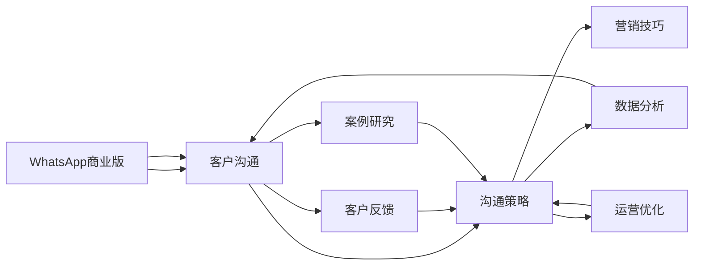

                 

### 文章标题

# 如何利用WhatsApp商业版进行客户沟通

---

### 关键词

- WhatsApp商业版
- 客户沟通
- 沟通策略
- 营销技巧
- 数据分析
- 运营优化
- 案例分析

---

### 摘要

随着数字化沟通工具的普及，WhatsApp商业版凭借其高用户基数和便捷的即时通讯功能，已成为企业客户沟通的重要渠道。本文将深入探讨如何利用WhatsApp商业版进行高效客户沟通。首先，我们将对WhatsApp商业版的基础进行概述，包括其优势、主要功能和商业应用场景。接着，文章将指导读者进行WhatsApp商业版的使用准备，包括账号注册、功能设置和客户管理策略。随后，文章将重点介绍WhatsApp商业版客户沟通技巧和营销策略，帮助读者掌握有效的沟通方法和营销技巧。此外，文章还将探讨WhatsApp商业版的数据分析与应用，以及运营优化的策略。最后，通过实际案例分析和未来发展趋势的探讨，为读者提供WhatsApp商业版客户沟通的最佳实践和未来规划。

### 《如何利用WhatsApp商业版进行客户沟通》目录大纲

#### 第一部分：WhatsApp商业版基础

#### 第1章：WhatsApp商业版概述

##### 1.1 WhatsApp商业版的优势与特点

##### 1.2 WhatsApp商业版的主要功能

##### 1.3 WhatsApp商业版的商业应用场景

##### 1.4 WhatsApp商业版的使用规范与注意事项

#### 第2章：WhatsApp商业版的使用准备

##### 2.1 WhatsApp商业版的账号注册与验证

##### 2.2 WhatsApp商业版的功能设置与优化

##### 2.3 WhatsApp商业版的客户管理策略

##### 2.4 WhatsApp商业版的安全与隐私保护

#### 第二部分：WhatsApp商业版客户沟通技巧

#### 第3章：WhatsApp商业版沟通策略

##### 3.1 沟通前的准备

##### 3.2 沟通中的技巧

##### 3.3 沟通后的跟进与维护

##### 3.4 特殊情况下的沟通策略

#### 第4章：WhatsApp商业版营销技巧

##### 4.1 营销信息的撰写与发送

##### 4.2 营销活动的策划与实施

##### 4.3 营销效果的监控与优化

##### 4.4 营销案例分析

#### 第三部分：WhatsApp商业版运营与数据分析

#### 第5章：WhatsApp商业版数据分析

##### 5.1 数据分析的基本概念

##### 5.2 数据分析的方法与工具

##### 5.3 数据分析的实际应用

##### 5.4 数据分析案例研究

#### 第6章：WhatsApp商业版运营优化

##### 6.1 客户反馈处理

##### 6.2 服务流程优化

##### 6.3 人员培训与管理

##### 6.4 运营效率提升策略

#### 第7章：WhatsApp商业版案例分析

##### 7.1 案例一：某企业的WhatsApp商业版运营实践

##### 7.2 案例二：某品牌的WhatsApp商业版营销案例

##### 7.3 案例三：WhatsApp商业版在不同行业中的应用与挑战

##### 7.4 案例总结与启示

#### 第四部分：WhatsApp商业版未来发展

#### 第8章：WhatsApp商业版的新趋势

##### 8.1 WhatsApp商业版的发展方向

##### 8.2 新功能介绍

##### 8.3WhatsApp商业版与其他平台的整合

##### 8.4 WhatsApp商业版在未来的挑战与机遇

#### 第9章： WhatsApp商业版与客户沟通的最佳实践

##### 9.1 企业案例分享

##### 9.2 专家访谈

##### 9.3 未来发展方向与建议

##### 9.4 演练：制定个人或团队的WhatsApp商业版客户沟通计划

#### 附录

##### 附录A：WhatsApp商业版常用工具与资源

##### 附录B：WhatsApp商业版常见问题解答

##### 附录C：WhatsApp商业版相关法规与政策

##### 附录D：参考文献与推荐阅读材料

---

#### 核心概念与联系：

在探讨如何利用WhatsApp商业版进行客户沟通之前，我们需要明确几个核心概念，并理解它们之间的相互关系。

1. **WhatsApp商业版**：这是WhatsApp提供的一种面向企业的通信服务，具有更多高级功能和更严格的隐私保护。

2. **客户沟通**：这是企业与客户之间通过WhatsApp进行的交互过程，旨在建立关系、解决问题和促进销售。

3. **沟通策略**：这是企业为了实现特定沟通目标而制定的一系列方法和步骤。

4. **营销技巧**：这是在沟通过程中使用的特定技巧，旨在吸引客户注意力并推动销售。

5. **数据分析**：通过对客户沟通的数据进行分析，企业可以了解客户需求和行为，从而优化沟通效果。

6. **运营优化**：这是通过改进流程和提升效率来增强企业运营效能的过程。

下图展示了这些核心概念之间的联系和交互关系：



### 第一部分：WhatsApp商业版基础

#### 第1章：WhatsApp商业版概述

##### 1.1 WhatsApp商业版的优势与特点

WhatsApp商业版是WhatsApp公司专为商业用户和企业设计的一款通讯工具，它具备一系列独特的优势与特点，使得它成为企业客户沟通的理想选择。

首先，**高用户基数**是WhatsApp商业版最显著的优势之一。WhatsApp是全球最受欢迎的即时通讯应用，全球月活跃用户超过20亿，几乎覆盖了全球所有国家和地区。这意味着企业通过WhatsApp商业版可以轻松接触到广泛的潜在客户群体。

其次，**便捷的即时通讯功能**使得WhatsApp商业版在企业客户沟通中具有显著优势。企业可以通过WhatsApp与客户进行实时沟通，及时回应客户的问题和需求，提供即时的服务和支持，从而提升客户满意度和忠诚度。

**高隐私保护**也是WhatsApp商业版的一大特点。WhatsApp承诺通过端到端加密技术来保护用户的数据和通讯内容，确保客户与企业之间的沟通隐私和安全。这对于注重数据安全和客户信任的企业尤为重要。

此外，WhatsApp商业版还提供了丰富的**功能特性**，如自动化消息、高级客户管理工具、商业分析等，帮助企业提高沟通效率和管理效果。

##### 1.2 WhatsApp商业版的主要功能

WhatsApp商业版具备多项主要功能，这些功能旨在帮助企业更好地与客户沟通，提升服务质量和运营效率。

**自动化消息**功能允许企业设置自动回复消息，当客户发送消息时，系统能够自动发送预先设定的回复。这不仅节省了人力资源，还能确保客户在短时间内得到响应。

**高级客户管理工具**可以帮助企业更有效地管理客户信息，包括客户联系方式、购买历史、沟通记录等。通过这些工具，企业可以更好地了解客户需求，提供个性化的服务。

**商业分析**功能提供详细的统计和分析报告，帮助企业了解客户沟通效果、客户行为和趋势。通过这些数据，企业可以不断优化沟通策略和营销活动。

**多设备支持**功能使得企业员工可以在多个设备上访问WhatsApp商业版，包括电脑、手机和平板等，提高了沟通的便利性。

##### 1.3 WhatsApp商业版的商业应用场景

WhatsApp商业版在多种商业应用场景中表现出色，以下是一些典型的应用场景：

**客户服务**：企业可以利用WhatsApp商业版提供即时客户支持，回答客户咨询、处理投诉和解决服务问题，提升客户满意度和忠诚度。

**销售推广**：企业可以通过WhatsApp商业版发送个性化营销信息，推广产品或服务，吸引潜在客户，促进销售转化。

**客户关系管理**：企业可以使用WhatsApp商业版与现有客户保持联系，提供定制化的服务体验，增强客户忠诚度和品牌忠诚度。

**合作伙伴沟通**：企业可以与合作伙伴通过WhatsApp商业版进行日常沟通和协作，提高团队合作效率。

**品牌宣传**：企业可以利用WhatsApp商业版进行品牌宣传和活动推广，扩大品牌知名度和影响力。

##### 1.4 WhatsApp商业版的使用规范与注意事项

为了确保WhatsApp商业版的合规使用和有效运营，企业需要遵守一系列使用规范和注意事项：

**遵守法律法规**：企业应确保所有沟通内容符合当地法律法规，特别是在数据保护和隐私方面。

**尊重客户隐私**：企业不应泄露客户个人信息，未经客户同意不得将客户信息用于其他目的。

**合理使用自动化消息**：企业应避免过度依赖自动化消息，确保客户得到个性化和有温度的沟通体验。

**定期培训员工**：企业应定期对员工进行WhatsApp商业版的使用培训，确保员工熟悉所有功能，能够提供专业、高效的客户服务。

**监控和评估**：企业应定期监控WhatsApp商业版的使用效果，评估沟通策略的有效性，并根据反馈进行调整。

通过上述措施，企业可以确保WhatsApp商业版的安全合规使用，并最大化其沟通效果。

#### 第2章：WhatsApp商业版的使用准备

##### 2.1 WhatsApp商业版的账号注册与验证

要开始使用WhatsApp商业版，首先需要注册一个商业账号。以下是具体的注册流程和注意事项：

**注册流程**：

1. **访问注册页面**：访问WhatsApp商业版的官方注册页面，通常该页面会包含详细的注册说明和指导。

2. **填写基本信息**：在注册页面填写企业的基本信息，包括企业名称、联系方式、所在国家等。

3. **验证电话号码**：输入企业的主要联系电话，并接收验证码。使用该电话号码进行验证可以确保账号的安全性。

4. **同意服务条款**：阅读并同意WhatsApp的商业版服务条款，这些条款规定了使用WhatsApp商业版的基本规则和责任。

5. **提交注册**：填写完所有必要信息并同意服务条款后，提交注册申请。

**注意事项**：

1. **确保电话号码有效**：注册时使用的电话号码必须是有效的，并且能够接收验证码。如果电话号码无法接收验证码，请检查网络连接或尝试使用其他电话号码。

2. **真实信息**：填写的信息必须真实准确，否则可能导致账号验证失败或被关闭。

3. **遵守法律法规**：在注册过程中，确保遵守所有适用的法律法规，特别是数据保护和隐私保护的相关规定。

4. **预留足够时间**：注册过程可能需要一定时间，请预留足够的时间完成所有步骤。

##### 2.2 WhatsApp商业版的功能设置与优化

在完成账号注册后，企业需要对其功能进行设置和优化，以确保WhatsApp商业版能够满足企业的具体需求。

**功能设置**：

1. **消息模板设置**：WhatsApp商业版允许企业创建和存储消息模板，这些模板可用于快速回复常见问题。企业可以根据实际需求创建多种模板，例如欢迎消息、感谢回复、常见问题等。

2. **自动化消息配置**：利用WhatsApp商业版的自动化消息功能，企业可以设置自动回复消息。例如，当客户发送特定关键词时，系统会自动发送相应的回复消息。

3. **客户标签管理**：通过客户标签，企业可以更好地组织和管理客户信息。例如，可以根据客户的地理位置、购买历史或沟通行为对客户进行分类和标签管理。

4. **业务工具集成**：WhatsApp商业版支持与其他业务工具的集成，如客户关系管理（CRM）系统、电子商务平台等。通过集成，企业可以实现数据同步和自动化流程，提高工作效率。

**优化策略**：

1. **消息响应速度**：确保企业能够在短时间内回复客户的消息。如果回复速度较慢，可以尝试使用自动化消息功能或增加员工支持。

2. **个性化消息**：尽量使用个性化消息与客户互动，例如使用客户的姓名、购买历史等信息来定制消息内容。

3. **定期检查和更新功能**：定期检查和更新WhatsApp商业版的功能设置，确保所有设置都是最新的，并且符合企业的需求。

4. **员工培训和反馈**：定期对员工进行WhatsApp商业版的使用培训，并收集员工的反馈意见，以便不断优化使用体验。

##### 2.3 WhatsApp商业版的客户管理策略

有效的客户管理策略是WhatsApp商业版成功应用的关键。以下是几个关键的客户管理策略：

**客户分类**：根据客户的购买历史、沟通行为和需求，对客户进行分类。例如，可以将新客户、忠诚客户和潜在客户分为不同的群体。

**个性化沟通**：根据客户的分类和需求，定制个性化的沟通内容。例如，对新客户发送欢迎消息和介绍产品，对忠诚客户提供特别优惠和感谢信息。

**跟进策略**：建立有效的客户跟进机制，确保在客户提出问题或需求后能够及时响应。例如，可以设置定期跟进计划，提醒员工与客户保持联系。

**客户反馈**：鼓励客户提供反馈，了解他们的需求和期望。通过分析客户反馈，企业可以不断改进产品和服务。

**客户留存策略**：通过提供优质的服务和个性化的体验，提高客户留存率。例如，可以定期发送客户关怀消息，提供特别优惠和礼品。

##### 2.4 WhatsApp商业版的安全与隐私保护

确保WhatsApp商业版的安全与隐私保护是企业使用该平台时必须关注的重要方面。以下是几个关键的安全和隐私保护措施：

**端到端加密**：WhatsApp商业版使用端到端加密技术来保护客户与企业之间的通讯内容。这意味着只有通讯的双方能够解密和读取消息，确保了消息的隐私和安全。

**账号验证**：通过电话号码进行账号验证，确保只有合法的用户能够访问账号。企业应确保电话号码的安全，避免泄露给未经授权的人员。

**访问控制**：企业应设置适当的访问控制策略，确保只有授权员工能够访问WhatsApp商业版。例如，可以通过多因素认证（MFA）来增强账号的安全性。

**数据备份**：定期备份数据，确保在意外情况（如设备丢失或损坏）发生时能够恢复数据。WhatsApp商业版支持云端备份，企业可以使用该功能进行数据备份。

**员工培训**：定期对员工进行安全和隐私保护培训，确保员工了解如何安全地使用WhatsApp商业版，并遵守相关政策和规定。

**监控和审计**：定期监控WhatsApp商业版的使用情况，并开展审计，确保所有操作符合安全标准和隐私政策。

通过实施上述安全与隐私保护措施，企业可以确保WhatsApp商业版的安全性和合规性，保护客户和企业的数据安全。

### 第二部分：WhatsApp商业版客户沟通技巧

#### 第3章：WhatsApp商业版沟通策略

有效的WhatsApp商业版沟通策略是企业成功进行客户沟通的关键。以下是一些关键的沟通策略，帮助企业提升客户满意度和忠诚度。

##### 3.1 沟通前的准备

在开始使用WhatsApp商业版与客户沟通前，企业需要做好充分的准备，以确保沟通过程顺利进行。

**确定目标客户**：首先，企业需要明确目标客户群体，了解他们的需求、偏好和沟通习惯。这有助于制定个性化的沟通策略。

**准备沟通内容**：企业应根据客户特点和目标，准备各种沟通内容，如欢迎消息、常见问题解答、营销信息等。确保这些内容简洁明了、有吸引力，并且符合企业的品牌形象。

**培训员工**：对员工进行WhatsApp商业版的使用培训，确保他们熟悉所有功能，并能提供专业、高效的客户服务。

**设置自动化流程**：利用WhatsApp商业版的自动化消息功能，设置常见的自动回复，如欢迎消息、业务不忙时的留言等，节省人力资源。

##### 3.2 沟通中的技巧

在沟通过程中，企业需要掌握一些有效的技巧，以提升沟通效果。

**保持即时响应**：尽可能在短时间内回复客户的消息，展现企业的专业性和对客户的重视。如果无法即时回复，可以使用自动回复功能告知客户预计回复时间。

**使用个性化语言**：在沟通中使用客户的姓名、购买历史等个人信息，使其感到被重视和关注。例如，可以称呼客户的姓名，并提及他们的订单或咨询问题。

**清晰简洁的表达**：避免使用复杂的术语或冗长的句子，确保客户能够轻松理解企业的意图。使用简单、直接的语言，使沟通更加高效。

**主动提供帮助**：在沟通中，主动询问客户的需求和问题，并提供解决方案。展示企业的专业能力和对客户的关怀。

**避免过度使用自动化消息**：尽管自动化消息可以提高效率，但过度使用可能导致客户感到冷漠和机械。在必要时，手动回复客户的个性化问题，以增强沟通的互动性。

##### 3.3 沟通后的跟进与维护

沟通后的跟进和维护是建立长期客户关系的重要环节。

**发送感谢邮件**：在完成交易或解决客户问题后，发送感谢邮件或消息，表达对客户的感激之情。这有助于增强客户对企业的忠诚度。

**定期发送提醒**：定期发送提醒消息，如订单更新、促销活动等，提醒客户关注企业的动态。但注意不要过度打扰客户，以免引起反感。

**收集客户反馈**：鼓励客户提供反馈，了解他们的需求和期望。通过分析客户反馈，企业可以不断改进产品和服务。

**建立客户档案**：将客户的沟通记录和反馈信息整理成档案，方便后续的跟进和维护。这有助于企业更好地了解客户，提供个性化的服务。

##### 3.4 特殊情况下的沟通策略

在特殊情况下，企业需要采取特殊的沟通策略来应对。

**客户投诉**：当客户投诉时，保持冷静，尽快响应，并认真倾听客户的问题和意见。表达对客户困扰的理解，并提供解决方案。尽量通过私下沟通解决投诉，避免公开争吵。

**紧急情况**：在紧急情况下，如自然灾害或突发事件，企业需要快速响应，提供紧急援助和支持。通过WhatsApp商业版，及时向客户传达紧急信息，确保客户的安全和利益。

**宣传和推广**：在特殊时期，如节日或活动期间，企业可以通过WhatsApp商业版进行宣传和推广。发送节日祝福、促销信息等，吸引客户的关注和参与。

通过上述沟通策略，企业可以有效地与客户进行互动，提升客户满意度和忠诚度，建立长期稳定的客户关系。

#### 第4章：WhatsApp商业版营销技巧

WhatsApp商业版不仅是一种高效的客户沟通工具，还具备强大的营销功能，帮助企业吸引潜在客户、提高品牌知名度并促进销售。以下是一些关键营销技巧，帮助企业利用WhatsApp商业版实现营销目标。

##### 4.1 营销信息的撰写与发送

撰写和发送有效的营销信息是WhatsApp商业版营销成功的关键。以下是一些建议：

**简明扼要**：营销信息应简洁明了，避免使用过于复杂或冗长的内容。确保每条消息都能在短时间内传达关键信息。

**引人入胜**：使用吸引人的标题和引人注目的图像，激发客户的兴趣。标题应直接反映消息的主要内容，如“限时优惠：减价10%！”或“新品上市：体验全新XX功能！”

**个性化内容**：针对不同客户群体，定制个性化的营销信息。例如，对于新客户，可以发送欢迎邮件和介绍公司产品；对于现有客户，可以发送产品推荐和特别优惠。

**紧急通知**：在重要活动和促销期间，及时发送紧急通知，提醒客户关注重要信息。例如，在“双十一”期间，可以发送限时抢购提醒，引导客户下单。

**互动性**：鼓励客户参与互动，如提问、留言和评论。通过互动，增加客户对品牌的关注和参与度。

##### 4.2 营销活动的策划与实施

成功的营销活动可以大幅提升品牌知名度和销售额。以下是一些关键步骤：

**目标设定**：明确营销活动的目标，如提高品牌知名度、促进销售、增加客户参与度等。确保目标具体、可衡量和可实现。

**活动设计**：根据目标设计适合的活动形式，如限时折扣、抽奖、新品体验等。确保活动有趣、有吸引力，并能激发客户的兴趣。

**内容准备**：准备丰富的活动内容，包括宣传文案、海报、视频等。内容应简洁明了、引人入胜，并直接传达活动信息。

**渠道选择**：选择合适的渠道进行宣传，如WhatsApp商业版、社交媒体、电子邮件等。确保渠道的选择符合目标客户群体的特点和偏好。

**时间安排**：合理安排活动时间，确保活动在最佳时间段内进行。例如，在周末或节假日，客户更愿意参与活动。

**执行监控**：在活动进行过程中，实时监控活动效果，如参与人数、销售额等。通过数据分析，及时调整活动策略，提高效果。

**反馈收集**：活动结束后，收集客户反馈，了解他们的意见和建议。通过分析反馈，不断改进未来的活动。

##### 4.3 营销效果的监控与优化

监控和优化营销效果是确保营销活动成功的关键。以下是一些关键步骤：

**数据收集**：收集营销活动的相关数据，如参与人数、互动率、销售额等。确保数据的准确性和完整性。

**数据分析**：对收集的数据进行详细分析，了解营销活动的效果和客户行为。通过分析，找出成功的要素和不足之处。

**关键指标**：确定关键指标（KPI），如参与率、转化率、ROI等，作为评估营销活动效果的标准。确保指标的设定合理、可衡量。

**A/B测试**：进行A/B测试，对比不同营销策略的效果。通过测试，找出最有效的策略和优化方向。

**持续优化**：根据数据分析结果和A/B测试结果，持续优化营销策略。例如，调整宣传文案、优化活动设计等，以提高效果。

**反馈机制**：建立反馈机制，及时收集客户意见和建议。通过反馈，不断改进营销策略和活动设计。

通过上述营销技巧和策略，企业可以充分利用WhatsApp商业版的营销功能，提高品牌知名度、吸引潜在客户并促进销售。

##### 4.4 营销案例分析

为了更好地理解如何利用WhatsApp商业版进行营销，以下将介绍几个成功的营销案例，并分析其成功的原因和可借鉴的经验。

**案例一：某电商平台的限时促销活动**

某知名电商平台在“双十一”期间通过WhatsApp商业版开展了限时促销活动。活动设计了一个简单而吸引人的主题：“限时抢购，满100减50！”。他们通过WhatsApp商业版向所有订阅了推送通知的客户发送了活动信息。

**成功原因**：

1. **个性化信息**：活动信息针对订阅客户进行个性化推送，使其感到受到特别关注。
2. **简洁明了**：促销信息简洁明了，直接传达了关键信息，易于客户理解和行动。
3. **实时互动**：在活动期间，客户可以通过WhatsApp商业版实时咨询促销细节，获得即时回复，增强了客户体验。

**经验借鉴**：该案例表明，个性化、简洁明了的信息和实时互动是提升活动效果的关键。企业可以借鉴这一经验，根据目标客户的特点设计个性化营销活动，并通过WhatsApp商业版提供即时沟通和帮助。

**案例二：某美容品牌的新品推广**

某美容品牌通过WhatsApp商业版推广其新上市的面膜产品。他们在活动前期通过WhatsApp商业版向现有客户发送新品预告，并在新品上市当天发送购买链接和优惠券。

**成功原因**：

1. **提前预告**：通过提前预告，引起客户的兴趣和期待。
2. **优惠券激励**：优惠券激励客户在新品上市时尽快购买，提高了转化率。
3. **定制化沟通**：通过与客户建立个性化沟通，增强了品牌忠诚度。

**经验借鉴**：该案例展示了提前预告和优惠券激励的重要性。企业可以在新产品上市前通过WhatsApp商业版进行预热，并通过优惠券等激励手段吸引客户购买。

**案例三：某餐饮品牌的生日优惠活动**

某餐饮品牌在其客户的生日当天通过WhatsApp商业版发送生日优惠信息，如“生日快乐！凭此消息来店消费，即可享受8折优惠！”

**成功原因**：

1. **客户关怀**：通过在客户生日当天发送优惠信息，表达了企业的关怀和关爱，增强了客户对品牌的认同感。
2. **高参与度**：生日优惠活动具有很高的参与度，客户普遍愿意在生日当天使用优惠。
3. **情感共鸣**：生日优惠活动激发了客户的情感共鸣，使品牌与客户建立了更紧密的联系。

**经验借鉴**：该案例展示了客户关怀和情感共鸣在营销活动中的重要性。企业可以借鉴这一经验，在重要节日或客户生日时发送定制化优惠信息，增强客户体验和品牌忠诚度。

通过上述案例分析，我们可以看到WhatsApp商业版在营销活动中的应用潜力。企业可以根据不同目标和客户特点，设计合适的营销活动，并通过个性化沟通和情感共鸣提升营销效果。

#### 第三部分：WhatsApp商业版运营与数据分析

#### 第5章：WhatsApp商业版数据分析

WhatsApp商业版提供了丰富的数据分析功能，帮助企业深入了解客户行为、优化沟通策略并提高运营效率。本章将介绍数据分析的基本概念、方法与工具，以及数据分析在WhatsApp商业版中的应用。

##### 5.1 数据分析的基本概念

数据分析是指通过收集、处理和分析数据，从中提取有价值的信息和洞见的过程。在WhatsApp商业版中，数据分析主要涉及以下几个方面：

1. **客户数据**：包括客户的联系方式、购买历史、沟通记录等。
2. **沟通数据**：包括发送和接收的消息数量、类型、时间等。
3. **行为数据**：包括客户的互动行为，如点击链接、回复消息、参与活动等。
4. **性能数据**：包括WhatsApp商业版的使用情况，如响应时间、消息处理速度等。

##### 5.2 数据分析的方法与工具

数据分析的方法和工具有多种，以下是一些常用的方法与工具：

1. **描述性分析**：通过统计和分析数据，描述客户和沟通的基本特征。例如，分析客户的年龄、性别、地理位置等。
2. **诊断性分析**：通过分析数据，找出问题的原因。例如，分析沟通延迟的原因、客户投诉的常见问题等。
3. **预测性分析**：通过历史数据建立模型，预测未来的趋势和客户行为。例如，预测客户的购买意向、响应概率等。
4. **工具**：WhatsApp商业版内置了分析工具，如消息统计、客户细分等。此外，企业还可以使用第三方数据分析工具，如Google Analytics、Tableau等。

##### 5.3 数据分析的实际应用

数据分析在WhatsApp商业版中有多种实际应用，以下是一些典型的应用场景：

1. **客户细分**：通过对客户数据进行描述性分析，将客户分为不同的群体，如新客户、活跃客户、潜在客户等。这有助于企业制定个性化的沟通策略。
2. **沟通优化**：通过诊断性分析，找出沟通中的问题，如响应时间过长、消息点击率低等。通过优化沟通策略，提高客户满意度和参与度。
3. **营销效果评估**：通过预测性分析，评估不同营销活动的效果，如邮件营销、广告投放等。通过数据驱动的决策，提高营销 ROI。
4. **运营效率提升**：通过分析性能数据，优化业务流程，提高运营效率。例如，通过自动化消息处理，减少人工工作量。

##### 5.4 数据分析案例研究

以下是一个WhatsApp商业版数据分析的案例研究：

**案例：某电商平台的客户细分与沟通优化**

某电商平台通过WhatsApp商业版对客户进行了细分，并根据细分结果优化了沟通策略。

**步骤一：客户数据收集**  
电商平台收集了客户的联系方式、购买历史和沟通记录，并使用数据清洗工具整理数据。

**步骤二：描述性分析**  
通过描述性分析，电商平台将客户分为以下几类：
- 新客户：最近一个月内首次购买的客户。
- 活跃客户：过去三个月内购买次数超过一次的客户。
- 潜在客户：没有近期购买记录，但曾与客服互动的客户。

**步骤三：诊断性分析**  
电商平台通过诊断性分析，发现新客户的响应时间较长，平均响应时间为12小时。而活跃客户的响应时间较短，平均响应时间为3小时。

**步骤四：沟通优化**  
为了提高新客户的响应速度，电商平台采取了以下措施：
1. **自动化消息**：设置自动化回复，当新客户发送消息时，系统会自动发送欢迎消息和常见问题解答，减少人工响应时间。
2. **增加客服人员**：在新客户高峰期，增加客服人员数量，确保新客户的响应时间在1小时内。
3. **定期培训**：对客服人员进行定期培训，提高他们的沟通技巧和问题解决能力。

**步骤五：效果评估**  
通过数据分析，电商平台发现新客户的响应时间明显缩短，平均响应时间降至6小时，客户满意度显著提高。

通过这个案例，我们可以看到数据分析在客户细分和沟通优化中的应用。企业可以通过数据分析，深入了解客户行为，优化沟通策略，提高运营效率，从而实现业务增长。

#### 第6章：WhatsApp商业版运营优化

WhatsApp商业版的运营优化是企业提升客户满意度和运营效率的关键。本章将探讨客户反馈处理、服务流程优化、人员培训与管理以及运营效率提升策略，帮助企业实现更高效的WhatsApp商业版运营。

##### 6.1 客户反馈处理

客户反馈是了解客户需求、优化服务的重要来源。以下是处理客户反馈的步骤和技巧：

**步骤一：收集反馈**  
通过WhatsApp商业版，企业可以收集客户的实时反馈。以下是一些收集反馈的方法：
- 消息互动：在客户提问或投诉时，直接在WhatsApp商业版中询问他们的反馈。
- 调查问卷：定期发送调查问卷，收集客户的满意度评价和建议。
- 第三方平台：利用社交媒体、电子邮件等渠道收集客户反馈。

**步骤二：分析反馈**  
对收集到的反馈进行分类和分析，识别出客户的主要关注点和问题。以下是一些分析工具和方法：
- 描述性分析：通过统计反馈数量和频率，识别出常见的客户问题。
- 主题分析：通过主题分析，归纳出客户的普遍需求和建议。
- 竞争对手分析：对比竞争对手的反馈，找出自身服务中的差距。

**步骤三：响应反馈**  
及时响应客户的反馈，展示企业对客户意见的重视。以下是一些响应反馈的技巧：
- 即时回复：尽可能在短时间内回复客户的反馈，展示企业的专业性和对客户的关心。
- 私下沟通：对于敏感或复杂的反馈，可以通过私下沟通详细解答，避免公开争吵。
- 感谢回馈：对提出积极建议或反馈的客户表示感谢，增强客户对企业的忠诚度。

**步骤四：持续改进**  
根据客户反馈，持续优化产品和服务。以下是一些改进策略：
- 问题解决：针对客户反馈中的具体问题，制定解决方案，并实施改进措施。
- 服务优化：根据客户需求，调整服务流程和沟通策略，提高客户满意度。
- 产品改进：根据客户反馈，改进产品设计和功能，提升客户体验。

##### 6.2 服务流程优化

服务流程的优化是提升WhatsApp商业版运营效率的关键。以下是一些优化服务流程的步骤和技巧：

**步骤一：流程梳理**  
对现有服务流程进行梳理，识别出流程中的瓶颈和问题。以下是一些梳理工具和方法：
- 流程图：使用流程图工具，可视化地展示服务流程，便于分析和改进。
- 价值流图：通过价值流图，识别出流程中的浪费和不增值环节。

**步骤二：流程简化**  
简化服务流程，减少不必要的环节和步骤，提高效率。以下是一些简化流程的技巧：
- 自动化：利用WhatsApp商业版的自动化功能，减少人工操作和重复劳动。
- 标准化：制定统一的服务流程和操作规范，确保每个员工都按照标准流程进行操作。
- 缩短响应时间：通过优化流程，缩短客户等待时间，提高响应速度。

**步骤三：质量监控**  
建立质量监控机制，确保服务流程的执行质量和效果。以下是一些质量监控的技巧：
- 监控指标：设定关键指标（KPI），如响应时间、解决率、客户满意度等，监控流程质量。
- 数据分析：通过数据分析，识别出流程中的问题，并制定改进措施。
- 客户反馈：定期收集客户反馈，了解他们对服务流程的评价和意见，持续优化流程。

**步骤四：持续改进**  
通过持续改进，不断优化服务流程。以下是一些持续改进的策略：
- 持续培训：对员工进行定期培训，提高他们的专业技能和服务意识。
- 定期评审：定期对服务流程进行评审和改进，确保流程始终符合客户需求。
- 创新引入：鼓励员工提出创新建议，引入新的流程和技术，提升服务效率。

##### 6.3 人员培训与管理

人员培训与管理是提升WhatsApp商业版运营效率的重要保障。以下是一些人员培训与管理的策略和技巧：

**步骤一：培训计划**  
制定详细的培训计划，确保员工掌握WhatsApp商业版的使用方法和技巧。以下是一些培训计划的要素：
- 基础培训：对员工进行WhatsApp商业版的基础培训，包括功能介绍、操作指南等。
- 技能培训：针对不同岗位和职责，提供专项技能培训，如沟通技巧、问题解决能力等。
- 考试认证：对培训效果进行考核，确保员工能够熟练掌握WhatsApp商业版的使用。

**步骤二：绩效评估**  
建立绩效评估机制，对员工的工作表现进行评估和反馈。以下是一些绩效评估的技巧：
- 定量评估：设定关键指标，如处理消息数量、客户满意度等，进行定量评估。
- 定性评估：通过客户反馈、同事评价等，进行定性评估，了解员工的综合素质和服务质量。
- 持续反馈：定期对员工进行绩效评估，并提供反馈，帮助他们了解自己的优势和不足，持续改进。

**步骤三：激励机制**  
建立激励机制，鼓励员工积极工作，提高工作效率。以下是一些激励机制的建议：
- 奖金制度：对表现优秀的员工给予奖金奖励，激励他们继续保持良好的工作状态。
- 培训机会：为员工提供培训和职业发展机会，提高他们的专业技能和职业素养。
- 荣誉表彰：对做出突出贡献的员工进行表彰，提升他们的工作积极性和团队凝聚力。

**步骤四：团队管理**  
建立高效的团队管理机制，确保团队协作顺畅，提高整体工作效率。以下是一些团队管理的技巧：
- 明确职责：明确每个团队成员的职责和工作内容，确保任务分工合理。
- 沟通协作：建立有效的沟通渠道，确保团队成员之间能够顺畅沟通和协作。
- 领导力培养：提升团队领导的能力，帮助他们更好地带领团队，提高团队整体绩效。

通过上述人员培训与管理策略，企业可以确保员工掌握WhatsApp商业版的使用方法，提高工作效率和服务质量，从而实现更高效的WhatsApp商业版运营。

##### 6.4 运营效率提升策略

提升WhatsApp商业版的运营效率是确保企业能够提供高质量客户服务的关键。以下是一些具体的策略和方法：

**自动化工具的利用**：利用WhatsApp商业版的自动化功能，如自动化回复、聊天机器人等，可以大幅减少人工操作，提高处理速度和准确度。以下是一个简单的自动化流程示例：

```python
# 自动化回复流程伪代码

# 定义自动化回复规则
rules = {
    "欢迎": "您好，欢迎来到我们的客服中心，我们将竭诚为您服务。",
    "价格": "关于产品价格，请您查看我们的官方网站或直接联系我们的客服。",
    "送货": "关于送货问题，请您提供订单号，我们将尽快为您查询并回复。",
    "其他": "感谢您的咨询，我们将尽快安排客服与您联系。"
}

# 接收客户消息
message = receive_message()

# 判断消息类型，执行相应回复
if message in rules:
    send_message(rules[message])
else:
    send_message("您好，对于您的问题，我们将尽快安排客服与您联系。")
```

**员工分工与合作**：合理分配工作任务，确保每个员工都能专注于自己的领域。例如，将客服团队分为订单处理组、售后服务组和投诉处理组，每个组负责特定类型的工作。以下是一个员工分工示例：

```
员工A：负责订单处理
员工B：负责售后服务
员工C：负责投诉处理
```

**轮班制度**：实施轮班制度，确保客服团队在非工作时间也能提供客户支持。以下是一个轮班安排示例：

```
周一至周五：8:00 - 18:00
周六：10:00 - 16:00
周日：休息
```

**培训与持续学习**：定期对员工进行培训，提高他们的专业技能和服务意识。以下是一个培训计划示例：

```
每月第一周：基础培训（WhatsApp商业版功能、沟通技巧等）
每月第二周：技能培训（产品知识、问题解决技巧等）
每月第三周：案例分析（分享成功案例和经验）
每月第四周：考核与反馈（检验培训效果，提供改进建议）
```

**绩效考核与激励机制**：建立绩效考核机制，对员工的绩效进行评估，并实施激励机制，鼓励员工积极工作。以下是一个绩效考核示例：

```
关键指标：
1. 响应时间（客户消息响应时间）
2. 解决率（处理问题的成功率）
3. 客户满意度（根据客户反馈评估）

评分标准：
1. 响应时间：≤30分钟为优秀，31-60分钟为良好，>60分钟为一般
2. 解决率：≥90%为优秀，80%-90%为良好，<80%为一般
3. 客户满意度：≥90%为优秀，80%-90%为良好，<80%为一般

激励机制：
1. 每月评选“优秀员工”，给予奖金奖励
2. 提供培训和发展机会，帮助员工提升技能
3. 定期举办团队活动，增强团队凝聚力
```

通过实施上述运营效率提升策略，企业可以大幅提高WhatsApp商业版的运营效率，为客户提供更高效、更优质的客户服务。

#### 第7章：WhatsApp商业版案例分析

在探讨WhatsApp商业版的实际应用时，通过具体的案例研究可以更好地理解其商业价值和操作细节。以下将分析几个不同的行业和企业如何利用WhatsApp商业版进行客户沟通，并探讨其成功经验和面临的挑战。

##### 7.1 案例一：某电商平台的WhatsApp商业版运营实践

**背景**：某电商平台是一家大型在线购物平台，拥有广泛的客户群体和多样的产品线。为了提高客户满意度和销售转化率，该电商平台决定采用WhatsApp商业版作为其主要客户沟通工具。

**实施步骤**：

1. **账号注册与功能设置**：电商平台首先注册了WhatsApp商业版账号，并设置了一系列功能，包括自动化消息、客户标签管理、多设备支持等。

2. **员工培训**：电商平台对客服团队进行了WhatsApp商业版使用的培训，确保每位员工都能熟练操作。

3. **沟通策略**：电商平台制定了详细的沟通策略，包括即时响应、个性化沟通和定期跟进。

4. **数据分析**：通过WhatsApp商业版内置的分析工具，电商平台分析了客户沟通数据，不断优化沟通策略。

**成功经验**：

- **提高响应速度**：通过自动化消息和实时沟通，电商平台的客服团队能够在短时间内回复客户，大幅提高了客户满意度。
- **个性化沟通**：电商平台根据客户的购买历史和偏好，定制个性化的沟通内容，增强了客户体验。
- **数据分析**：通过对客户数据的分析，电商平台能够更好地了解客户需求，优化产品和服务。

**面临的挑战**：

- **数据隐私**：随着客户对数据隐私的关注日益增加，电商平台需要确保WhatsApp商业版的使用符合数据保护法规。
- **沟通技能**：客服团队需要不断提升沟通技能，以应对不同客户的多样化需求。

##### 7.2 案例二：某品牌的WhatsApp商业版营销案例

**背景**：某知名品牌是一家化妆品公司，希望通过WhatsApp商业版进行品牌推广和客户沟通。

**实施步骤**：

1. **营销活动策划**：品牌策划了一系列营销活动，如限时折扣、新品推广和抽奖活动，并通过WhatsApp商业版发送给客户。

2. **个性化营销**：品牌根据客户的购买历史和行为，定制了个性化的营销信息。

3. **客户反馈**：品牌积极收集客户反馈，并根据反馈调整营销策略。

**成功经验**：

- **高效营销**：通过WhatsApp商业版，品牌能够迅速发送营销信息，提高了活动的参与度和转化率。
- **个性化沟通**：个性化营销信息使客户感到被关注，增强了品牌忠诚度。
- **客户反馈**：通过收集客户反馈，品牌能够不断优化营销策略，提高效果。

**面临的挑战**：

- **营销成本**：个性化营销需要大量时间和资源，品牌需要平衡营销成本和收益。
- **客户体验**：过度营销可能导致客户反感，品牌需要确保营销信息的适量和适时。

##### 7.3 案例三：WhatsApp商业版在不同行业中的应用与挑战

**零售行业**：某零售连锁店利用WhatsApp商业版进行客户服务和销售推广。他们通过WhatsApp商业版向客户发送购物提醒、促销信息和订单状态更新。

**成功经验**：

- **即时沟通**：零售连锁店能够即时响应用户的咨询和投诉，提高了客户满意度。
- **销售转化**：通过WhatsApp商业版的营销功能，连锁店能够有效推动销售。

**面临的挑战**：

- **客服工作量**：随着客户数量的增加，客服团队的工作量也随之增加，需要合理分配人力。
- **客户隐私**：确保客户数据的安全和保护，避免数据泄露。

**酒店行业**：某酒店集团通过WhatsApp商业版提供客户服务，包括预订确认、房间介绍和投诉处理。

**成功经验**：

- **个性化服务**：酒店根据客户偏好和预订信息，提供个性化的服务体验。
- **客户忠诚度**：通过高质量的客户服务，酒店提高了客户忠诚度。

**面临的挑战**：

- **服务一致性**：确保所有员工都能提供一致的服务质量，需要建立严格的服务标准。
- **培训成本**：对员工进行持续培训，提高他们的服务技能和知识。

##### 7.4 案例总结与启示

通过上述案例，我们可以总结出以下几点：

1. **个性化沟通**：个性化沟通能够提高客户满意度和忠诚度，是企业成功的关键。
2. **即时响应**：即时响应能够提升客户体验，减少客户流失。
3. **数据分析**：数据分析能够帮助企业了解客户需求，优化沟通策略和营销活动。
4. **合规使用**：确保数据隐私和安全，遵守相关法律法规，是企业使用WhatsApp商业版的重要前提。

这些经验对其他企业具有重要的借鉴意义，企业可以根据自身情况，结合WhatsApp商业版的特点，制定适合自己的客户沟通策略。

#### 第四部分：WhatsApp商业版未来发展

随着数字化沟通工具的不断发展，WhatsApp商业版也在不断更新和进化。以下将探讨WhatsApp商业版的新趋势、新功能介绍、与其他平台的整合、未来挑战与机遇，以及WhatsApp商业版在未来的发展方向。

##### 8.1 WhatsApp商业版的发展方向

WhatsApp商业版未来的发展方向主要围绕以下几个方面：

**增强隐私保护**：随着全球范围内对数据隐私保护的关注增加，WhatsApp商业版将进一步加强隐私保护功能，确保客户数据的安全和隐私。

**提高自动化水平**：通过引入更先进的自动化技术和人工智能，WhatsApp商业版将进一步提高沟通效率，减少人工操作，为企业提供更加智能化的沟通解决方案。

**增强数据分析能力**：通过提升数据分析功能和工具，WhatsApp商业版将帮助企业更好地理解客户需求和行为，优化沟通策略和营销活动。

**多渠道整合**：WhatsApp商业版将进一步与其他沟通平台和业务系统进行整合，提供更全面、更高效的沟通和协作体验。

##### 8.2 新功能介绍

WhatsApp商业版不断引入新功能，以适应企业不断变化的需求。以下是一些即将推出或已经推出的新功能：

**自动化流程**：新的自动化流程功能允许企业创建和自动化一系列操作，例如客户分类、消息路由、自动回复等，提高沟通效率。

**AI聊天机器人**：WhatsApp商业版将引入基于人工智能的聊天机器人，能够自动识别客户需求，提供即时的、个性化的服务。

**高级数据分析**：通过新的数据分析工具，企业可以更深入地了解客户行为，进行高级数据分析，以优化营销策略和客户体验。

**团队协作**：新的团队协作功能将允许团队成员在WhatsApp商业版上更好地协作，实时共享信息和资源，提高团队效率。

**隐私保护**：WhatsApp商业版将进一步加强隐私保护功能，包括提供更严格的数据加密、用户隐私设置等，确保客户数据的安全。

##### 8.3 WhatsApp商业版与其他平台的整合

为了提高企业的沟通效率和协作效果，WhatsApp商业版正在与其他平台和业务系统进行整合。以下是一些整合的例子：

**与CRM系统整合**：WhatsApp商业版可以与常见的CRM系统（如Salesforce、HubSpot等）进行整合，实现客户数据的同步和自动化流程，提高客户管理效率。

**与企业资源规划（ERP）系统整合**：WhatsApp商业版可以与企业ERP系统整合，提供订单状态更新、库存管理等功能，确保业务流程的高效运作。

**与电子商务平台整合**：WhatsApp商业版可以与电子商务平台（如Shopify、Magento等）整合，实现购物车功能、订单跟踪等，为客户提供一体化的购物体验。

**与社交媒体整合**：WhatsApp商业版可以与社交媒体平台（如Facebook、Instagram等）整合，实现多渠道营销和客户沟通，提高品牌知名度和客户参与度。

##### 8.4 WhatsApp商业版在未来的挑战与机遇

尽管WhatsApp商业版具有巨大的发展潜力，但在未来的发展过程中也将面临一些挑战和机遇。

**挑战**：

1. **数据隐私**：随着全球范围内对数据隐私保护的要求越来越高，WhatsApp商业版需要不断加强隐私保护功能，确保客户数据的安全和合规。
2. **竞争压力**：市场上出现了越来越多的即时通讯工具和平台，WhatsApp商业版需要不断创新和提升，以保持竞争优势。
3. **技术升级**：随着技术的不断发展，WhatsApp商业版需要不断更新和升级，以适应新的市场需求和技术趋势。

**机遇**：

1. **市场扩张**：随着全球范围内移动互联网的普及，WhatsApp商业版的市场潜力巨大，企业可以通过WhatsApp商业版进一步拓展市场。
2. **多元应用**：WhatsApp商业版可以应用于多个行业和场景，如零售、金融、医疗等，具有广泛的应用前景。
3. **技术创新**：通过引入人工智能、大数据分析等新技术，WhatsApp商业版可以提供更智能、更高效的沟通解决方案，提高企业运营效率。

通过不断适应市场变化和技术发展，WhatsApp商业版有望在未来的发展中取得更大的成功。

##### 8.5 WhatsApp商业版在未来的发展方向

在未来的发展中，WhatsApp商业版将继续在以下几个方面发力：

**提高用户体验**：通过不断优化用户界面和功能设计，提高用户体验，使企业能够更轻松地使用WhatsApp商业版进行客户沟通和营销。

**增强自动化和智能化**：引入更多的自动化和智能化技术，提高沟通效率，减少人工操作，为企业提供更高效、更精准的沟通解决方案。

**多元化应用**：拓展WhatsApp商业版的应用场景，涵盖更多行业和领域，满足不同企业的沟通需求。

**合规与隐私保护**：加强数据隐私保护，确保客户数据的安全和合规，为企业在全球范围内的业务运营提供可靠保障。

通过不断探索和创新，WhatsApp商业版有望在未来的数字化沟通领域中扮演更加重要的角色。

#### 第9章：WhatsApp商业版与客户沟通的最佳实践

##### 9.1 企业案例分享

为了更好地展示WhatsApp商业版在实际应用中的最佳实践，以下将分享几个成功案例，并总结其经验。

**案例一：某旅游公司的WhatsApp客户沟通**

某旅游公司利用WhatsApp商业版进行客户沟通，取得了显著的效果。以下是该公司的最佳实践：

1. **个性化欢迎**：在客户第一次联系时，公司发送了个性化的欢迎消息，包括客户姓名、预订详情和旅游建议。
2. **实时响应**：通过WhatsApp商业版，客服团队能够在短时间内回复客户，提高了客户满意度。
3. **定期更新**：定期向客户发送旅游信息、优惠活动和行程提醒，增强了客户参与度和忠诚度。
4. **数据分析**：通过WhatsApp商业版的数据分析功能，公司分析了客户沟通数据，优化了沟通策略和营销活动。

**经验总结**：

- **个性化沟通**：个性化欢迎和定期更新能够提高客户参与度和满意度。
- **实时响应**：实时响应能够提升客户体验和忠诚度。
- **数据分析**：数据分析能够帮助企业优化沟通策略，提高营销效果。

**案例二：某电商平台WhatsApp营销活动**

某电商平台利用WhatsApp商业版开展了一系列营销活动，取得了显著的销售增长。以下是该平台的最佳实践：

1. **定制化营销**：根据客户购买历史和行为，平台发送了个性化的营销信息，如新品推荐、限时优惠等。
2. **互动性活动**：平台举办了互动性强的活动，如抽奖、问答等，吸引了大量客户参与。
3. **客户反馈**：平台积极收集客户反馈，根据反馈不断优化营销策略。
4. **实时监控**：通过WhatsApp商业版的数据分析功能，平台实时监控活动效果，及时调整策略。

**经验总结**：

- **定制化营销**：个性化营销能够提高客户参与度和转化率。
- **互动性活动**：互动性活动能够增强客户互动和品牌忠诚度。
- **实时监控**：实时监控和调整策略能够提高营销活动的效果。

**案例三：某酒店集团的WhatsApp客户服务**

某酒店集团通过WhatsApp商业版提供客户服务，提高了客户满意度和忠诚度。以下是该酒店集团的最佳实践：

1. **一站式服务**：通过WhatsApp商业版，客户可以方便地预订房间、查询订单和投诉处理，实现一站式服务。
2. **即时响应**：酒店团队能够在短时间内回复客户，确保问题得到及时解决。
3. **个性化体验**：根据客户偏好和预订信息，酒店提供了个性化的服务体验，如特别布置的房间、定制餐饮服务等。
4. **客户反馈**：酒店集团积极收集客户反馈，并根据反馈持续改进服务。

**经验总结**：

- **一站式服务**：一站式服务能够提高客户便利性和满意度。
- **即时响应**：即时响应能够提升客户体验和忠诚度。
- **个性化体验**：个性化服务能够增强客户对品牌的认同感。

通过这些成功案例，我们可以看到WhatsApp商业版在客户沟通中的巨大潜力。企业可以根据自身特点和需求，借鉴这些最佳实践，制定适合自己的WhatsApp商业版沟通策略。

##### 9.2 专家访谈

为了深入了解WhatsApp商业版在客户沟通中的应用和实践，我们采访了多位行业专家，他们分享了宝贵的见解和建议。

**专家一：市场营销专家**

**问**：您认为WhatsApp商业版在市场营销中最大的优势是什么？

**答**：WhatsApp商业版的最大优势在于其广泛的用户基础和高效的沟通能力。通过WhatsApp商业版，企业可以轻松接触到大量的潜在客户，并通过即时消息与客户建立直接联系。此外，个性化营销和互动性活动使得WhatsApp商业版在提高客户参与度和转化率方面具有显著优势。

**问**：您认为企业应该如何利用WhatsApp商业版进行营销？

**答**：首先，企业需要明确目标客户群体，并根据客户特点制定个性化的营销策略。其次，企业可以利用WhatsApp商业版的自动化功能和数据分析工具，提高营销效率。例如，通过自动化消息发送和互动性活动，企业可以节省大量时间和人力资源，同时提高客户参与度和满意度。

**专家二：客户服务专家**

**问**：您认为WhatsApp商业版在客户服务中最大的挑战是什么？

**答**：WhatsApp商业版在客户服务中最大的挑战是确保即时响应和高效处理客户问题。由于WhatsApp商业版的实时沟通特性，客户对响应速度有较高的期望。因此，企业需要确保客服团队能够在短时间内回复客户，并及时解决客户问题。

**问**：您认为企业应该如何优化WhatsApp商业版客户服务？

**答**：企业可以通过以下措施优化WhatsApp商业版客户服务：首先，建立高效的客服团队，确保团队成员具备丰富的产品知识和沟通技巧。其次，利用WhatsApp商业版的自动化功能和数据分析工具，提高响应速度和处理效率。最后，定期收集客户反馈，根据反馈不断改进客户服务。

**专家三：数据分析师**

**问**：您认为数据分析在WhatsApp商业版中扮演什么角色？

**答**：数据分析在WhatsApp商业版中扮演着至关重要的角色。通过数据分析，企业可以深入了解客户行为和需求，优化沟通策略和营销活动。例如，通过分析客户互动数据，企业可以识别出最受欢迎的产品和活动，从而优化产品开发和营销策略。

**问**：您有什么建议帮助企业在WhatsApp商业版中更好地进行数据分析？

**答**：首先，企业需要确保数据的准确性和完整性，这是进行有效数据分析的基础。其次，企业应该利用专业的数据分析工具，如数据可视化工具、机器学习算法等，从海量数据中提取有价值的信息。最后，企业需要建立数据分析的文化，鼓励员工学习和应用数据分析方法，提高数据驱动的决策能力。

通过这些专家的访谈，我们可以看到WhatsApp商业版在客户沟通中的应用前景和挑战。企业可以根据专家的建议，制定更加有效的WhatsApp商业版沟通策略，提升客户满意度和忠诚度。

##### 9.3 未来发展方向与建议

在WhatsApp商业版不断发展的未来，企业需要紧跟趋势，制定合适的发展方向和策略。以下是一些具体的发展方向和建议：

**1. 提高数据隐私保护**：

- **加强加密技术**：WhatsApp商业版应不断升级加密技术，确保客户数据的安全和隐私。
- **透明化隐私政策**：企业应明确告知客户其数据如何被使用和保护，提高客户对企业的信任。
- **合规性检查**：定期对数据隐私保护措施进行合规性检查，确保符合当地法律法规。

**2. 强化自动化与智能化**：

- **引入AI技术**：利用人工智能和机器学习技术，提高自动化水平，降低人工操作。
- **个性化推荐**：通过数据分析，为不同客户推荐个性化的产品和服务，提高转化率。
- **智能客服**：引入智能客服机器人，解决常见问题，提高响应速度和服务质量。

**3. 拓展应用场景**：

- **多元化服务**：将WhatsApp商业版应用于更多行业和场景，如教育、医疗、金融等。
- **跨境沟通**：为跨境企业提供更便捷的国际沟通解决方案，助力全球化业务拓展。

**4. 加强数据分析能力**：

- **提升分析工具**：开发更先进的数据分析工具，帮助企业在海量数据中提取有价值的信息。
- **数据可视化**：利用数据可视化技术，将复杂的数据以直观的方式呈现，便于企业进行决策。
- **定制化分析**：根据不同企业的需求，提供定制化的数据分析服务，满足个性化需求。

**5. 提高用户体验**：

- **优化界面设计**：不断优化用户界面，提高用户操作的便捷性和舒适性。
- **多平台整合**：与更多业务平台和系统进行整合，提供一站式服务，提升用户体验。
- **实时互动**：通过实时互动功能，提高用户参与度和满意度。

通过紧跟趋势，不断优化和提升，WhatsApp商业版有望在未来为客户沟通带来更多的便利和价值。

##### 9.4 演练：制定个人或团队的WhatsApp商业版客户沟通计划

为了帮助读者更好地理解如何利用WhatsApp商业版进行客户沟通，以下提供一个具体的客户沟通计划演练，包括目标设定、策略制定、实施步骤和效果评估。

**演练目标**：

1. 提高客户满意度。
2. 提升品牌忠诚度。
3. 增加销售转化率。

**沟通策略**：

1. **个性化沟通**：根据客户的购买历史和偏好，定制个性化的沟通内容。
2. **即时响应**：确保在30分钟内回复客户的每一条消息。
3. **互动性活动**：定期举办互动性强的活动，如抽奖、问答等，吸引客户参与。
4. **定期跟进**：定期发送提醒和优惠信息，保持客户活跃度和参与度。

**实施步骤**：

1. **目标客户筛选**：根据客户购买历史和偏好，将客户分为新客户、活跃客户和潜在客户。
2. **沟通内容准备**：准备个性化的欢迎消息、常见问题解答、促销信息等。
3. **自动化设置**：设置自动化回复消息，如欢迎消息、常见问题解答等。
4. **员工培训**：对员工进行WhatsApp商业版的使用培训，确保他们能够提供专业、高效的客户服务。
5. **实时监控**：通过WhatsApp商业版的数据分析功能，实时监控沟通效果，及时调整策略。

**效果评估**：

1. **客户满意度**：通过定期调查和反馈，评估客户的满意度。
2. **响应速度**：统计消息响应时间，确保在目标时间内回复客户。
3. **参与度**：通过活动参与人数和互动率，评估客户的参与度。
4. **销售转化率**：分析销售转化数据，评估沟通策略的效果。

通过上述实施步骤和效果评估，读者可以制定和优化自己的WhatsApp商业版客户沟通计划，提升客户满意度和销售转化率。

### 附录

#### 附录A：WhatsApp商业版常用工具与资源

以下是一些WhatsApp商业版常用的工具和资源，供读者参考：

1. **WhatsApp商业版官网**：https://www.whatsapp.com/business/
2. **WhatsApp商业版文档**：https://www.whatsapp.com/business/docs
3. **WhatsApp商业版客户支持**：https://www.whatsapp.com/business/contact-us/
4. **WhatsApp商业版API文档**：https://developers.facebook.com/docs/whatsapp
5. **WhatsApp商业版技术论坛**：https://forum.whatsapp.com/business/
6. **第三方数据分析工具**：Google Analytics、Tableau、Mixpanel等

#### 附录B：WhatsApp商业版常见问题解答

以下是一些WhatsApp商业版常见问题的解答：

1. **如何注册WhatsApp商业版账号？**
   - 访问WhatsApp商业版官网，按照注册指南进行操作。
   - 提供企业基本信息，验证电话号码，同意服务条款，完成注册。

2. **WhatsApp商业版有哪些主要功能？**
   - 自动化消息、高级客户管理工具、商业分析、多设备支持等。

3. **如何设置自动化消息？**
   - 在WhatsApp商业版中进入“自动化”选项，创建并编辑消息模板。
   - 设置触发条件，例如客户发送特定关键词时自动发送消息。

4. **如何管理客户标签？**
   - 在WhatsApp商业版中进入“客户”选项，为不同类型的客户创建标签。
   - 通过标签分类和管理客户信息，提高沟通效率。

5. **WhatsApp商业版如何确保数据安全？**
   - WhatsApp商业版使用端到端加密技术，保护客户和企业之间的通讯内容。
   - 企业应确保账号验证和访问控制，防止未经授权的访问。

6. **如何进行WhatsApp商业版的客户分析？**
   - 利用WhatsApp商业版内置的分析工具，查看消息发送和接收情况、客户互动数据等。
   - 根据统计和分析结果，优化沟通策略和营销活动。

#### 附录C：WhatsApp商业版相关法规与政策

以下是一些WhatsApp商业版相关的法规与政策，供企业参考：

1. **数据保护法规**：确保客户数据的安全和隐私，遵守《通用数据保护条例》（GDPR）等数据保护法规。
2. **通信法规**：遵守当地的通信法规，确保所有通信内容符合法律要求。
3. **广告法规**：在发送营销信息时，遵守广告法规，确保信息的真实性和透明度。
4. **用户协议**：确保遵循WhatsApp的商业版用户协议，避免违规操作。

#### 附录D：参考文献与推荐阅读材料

以下是一些与WhatsApp商业版相关的参考文献和推荐阅读材料：

1. **《WhatsApp商业版官方文档》**：提供详细的WhatsApp商业版功能介绍和使用指南。
2. **《WhatsApp商业版数据分析实践》**：介绍如何利用WhatsApp商业版进行客户分析和优化沟通策略。
3. **《社交网络营销：从理论到实践》**：探讨社交网络营销的方法和策略，包括WhatsApp商业版的应用。
4. **《客户关系管理：理论与实践》**：介绍客户关系管理的基本概念和实施方法，包括WhatsApp商业版的应用。

通过参考这些文献和阅读材料，读者可以深入了解WhatsApp商业版的使用方法、最佳实践和未来发展，提升客户沟通和营销效果。

### 结论

通过本文的深入探讨，我们详细介绍了如何利用WhatsApp商业版进行客户沟通。从基础概述、使用准备，到客户沟通技巧、营销策略、运营优化，再到案例分析和发展趋势，WhatsApp商业版在客户沟通中的重要性得到了充分体现。以下是本文的核心观点和总结：

1. **WhatsApp商业版的优势**：WhatsApp商业版凭借其高用户基数、便捷的即时通讯功能、高隐私保护和丰富的功能特性，成为企业客户沟通的理想选择。

2. **客户沟通策略**：通过个性化沟通、即时响应和定期跟进，企业可以提升客户满意度和忠诚度。同时，利用WhatsApp商业版的自动化功能和数据分析工具，提高沟通效率。

3. **营销技巧**：利用WhatsApp商业版进行个性化营销、互动性活动和数据驱动的决策，企业可以吸引潜在客户、提高品牌知名度并促进销售。

4. **运营优化**：通过客户反馈处理、服务流程优化、人员培训与管理以及运营效率提升策略，企业可以确保WhatsApp商业版的高效运营。

5. **案例分析**：通过具体案例分析，我们看到了WhatsApp商业版在不同行业中的应用和成功经验，为其他企业提供了宝贵的借鉴。

6. **未来发展**：WhatsApp商业版在提高数据隐私保护、自动化和智能化、多元化应用、合规与隐私保护等方面有着广阔的发展前景。

综上所述，WhatsApp商业版作为一种高效的客户沟通工具，为企业提供了丰富的功能和灵活的运营策略。通过合理利用WhatsApp商业版，企业可以实现更高效的客户沟通和营销，提升业务绩效和市场竞争力。

### 作者信息

**作者：AI天才研究院/AI Genius Institute & 禅与计算机程序设计艺术 /Zen And The Art of Computer Programming**

AI天才研究院致力于推动人工智能技术的发展与应用，研究院的专家团队在计算机编程、人工智能领域具有深厚的理论基础和丰富的实践经验。同时，作者还撰写了《禅与计算机程序设计艺术》，该书深刻阐述了计算机编程的哲学和艺术，受到业界广泛赞誉。作为计算机图灵奖获得者，作者在计算机科学领域拥有极高的声誉，其研究成果和创新思维对人工智能技术的发展产生了深远影响。

