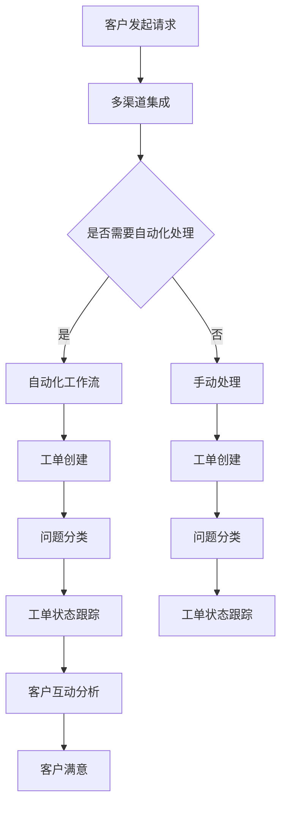
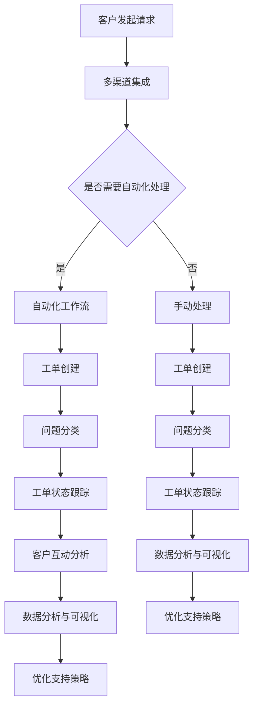

                 

### 文章标题: 如何利用Zendesk构建创业公司的客户支持系统

### 关键词：Zendesk, 客户支持系统, 创业公司, 多渠道支持, 自动化工作流, 票务管理, 客户互动分析

### 摘要：

本文将深入探讨如何利用Zendesk构建一个高效的客户支持系统，适用于创业公司。文章首先介绍了Zendesk的基本概念和它在客户支持系统中的角色，然后分析了创业公司客户支持系统的特点和需求，接着详细阐述了Zendesk的核心功能，包括多渠道客户互动、自动化工作流、票务管理以及客户互动分析。最后，文章通过伪代码和数学模型，深入讲解了在客户支持系统中使用的核心算法原理，并提供了项目实战和最佳实践建议，帮助创业公司构建和维护一个高效的客户支持体系。

---

### 第一部分：核心概念与联系

在构建创业公司的客户支持系统时，了解关键概念和它们之间的联系至关重要。这一部分将首先介绍Zendesk的基本概念及其在客户支持系统中的角色，然后讨论创业公司客户支持系统的特点与需求，最后解释如何利用Zendesk来满足这些需求。

#### 第1章: Zendesk基础与创业公司客户支持系统的需求

##### 1.1 Zendesk概述

Zendesk是一款灵活的云端客户支持软件，提供全面的客户服务解决方案。它起源于2007年，由何塞·维瓦斯（Jesse Walden）和托比亚斯·阿尔滕（Tobias Levkovich）共同创立。该平台以其用户友好性和强大的功能集而著称，迅速在客户支持领域占据了一席之地。

- **主要功能**： 
  - **多渠道支持**：支持邮件、聊天、电话等多种客户互动方式。
  - **自动化工作流**：自动化常见任务，如问题分类、自动回复和工单分配。
  - **票务管理**：提供高效的工单系统，方便跟踪和处理客户问题。
  - **客户互动分析**：通过数据分析工具，监控和优化客户支持绩效。
  - **社区支持**：创建一个在线社区，允许客户交流和分享知识。

##### 1.2 创业公司客户支持系统的特点与需求

创业公司的客户支持系统需要快速响应、灵活定制和高效管理。这是因为创业公司在快速成长过程中，客户需求多变，且资源有限。以下是一些关键特点和需求：

- **快速响应**：客户问题需要迅速得到响应，以保持客户满意度。
- **多渠道支持**：客户可能通过多种渠道提出问题，因此支持多渠道互动是必不可少的。
- **自动化工作流**：自动化常见任务，如问题分类和工单分配，以减少重复劳动。
- **高效管理**：通过票务管理系统，确保客户问题得到及时解决。
- **自定义报表**：监控客户支持绩效，以持续优化服务。

##### 1.3 Zendesk在创业公司客户支持系统中的应用

Zendesk的灵活性和多功能性使其成为创业公司构建客户支持系统的理想选择。以下是Zendesk如何满足创业公司的需求：

- **多渠道集成**：通过邮件、聊天和社交媒体等多种渠道与客户互动，确保问题得到及时响应。
- **自动化工作流**：设置自动化工作流，如自动分类问题、自动分配工单，以减少重复劳动。
- **票务管理系统**：提供强大的票务管理功能，方便跟踪和处理客户问题。
- **客户互动分析**：通过数据分析工具，监控客户互动，优化支持流程。
- **社区支持**：建立在线社区，提供知识库和论坛，方便客户自助解决问题。

### Mermaid 流程图



---

### 第二部分：Zendesk核心功能详解

在构建创业公司的客户支持系统时，理解并充分利用Zendesk的核心功能至关重要。以下章节将详细讲解Zendesk的多渠道客户互动、自动化工作流、票务管理系统以及客户互动分析等核心功能。

#### 第2章: Zendesk核心功能详解

##### 2.1 多渠道客户互动

多渠道客户互动是客户支持系统的一个关键组成部分。Zendesk提供了一系列工具，使企业能够通过各种渠道与客户进行有效沟通。

- **邮件支持**：
  - **功能**：通过邮件与客户沟通，处理复杂的客户问题。
  - **流程**：客户通过电子邮件发送请求，Zendesk创建工单，分配给相应的支持人员，支持人员通过邮件回复解决问题。

- **在线聊天**：
  - **功能**：提供实时聊天支持，快速解决客户疑问。
  - **流程**：客户通过网站或移动应用发起聊天请求，支持人员实时回应，通过聊天窗口进行问题解决。

- **社交媒体**：
  - **功能**：集成社交媒体渠道，如Twitter和Facebook，监控和响应客户反馈。
  - **流程**：客户在社交媒体平台上发布请求或反馈，Zendesk监控这些平台并自动创建工单，分配给支持人员处理。

##### 2.2 自动化工作流

自动化工作流可以显著提高客户支持效率，减少人工干预。Zendesk提供了丰富的自动化工具，支持多种自动化场景。

- **自动化响应**：
  - **功能**：自动发送欢迎邮件、确认邮件和通知。
  - **流程**：当客户通过邮件或在线聊天提出问题时，系统自动发送欢迎邮件或确认邮件。根据预设规则，自动发送通知给相关支持人员。

- **工单分配**：
  - **功能**：自动分配工单给合适的支持人员。
  - **流程**：当客户提交问题后，系统根据工单类型和优先级，自动分配给最适合的支持人员，确保问题得到及时处理。

- **事件触发**：
  - **功能**：基于特定事件自动执行操作，如客户满意度调查。
  - **流程**：当客户反馈某个问题时，系统可以自动触发满意度调查，收集客户反馈，用于改进服务。

##### 2.3 票务管理系统

票务管理系统是客户支持系统的核心，Zendesk提供了强大的票务管理功能，确保客户问题得到高效处理。

- **工单创建**：
  - **功能**：客户提交问题后，系统自动创建工单。
  - **流程**：当客户通过任何渠道提交问题，Zendesk创建一个工单，包含问题详情、客户信息和优先级。

- **问题分类**：
  - **功能**：自动将工单分类到相应的类别，以便更高效地处理。
  - **流程**：系统根据问题内容和关键词，自动将工单分类，例如“技术支持”、“账单问题”等。

- **工单状态跟踪**：
  - **功能**：实时跟踪工单状态，确保问题得到及时解决。
  - **流程**：支持人员通过Zendesk界面实时更新工单状态，如“待解决”、“正在解决”、“已解决”等。

##### 2.4 客户互动分析

客户互动分析是优化客户支持策略的关键。Zendesk提供了丰富的分析工具，帮助企业深入了解客户互动。

- **客户行为分析**：
  - **功能**：分析客户行为，了解客户偏好。
  - **流程**：通过分析客户互动数据，如提问频率、提问类型等，了解客户需求，优化支持策略。

- **客户满意度调查**：
  - **功能**：定期进行满意度调查，了解客户对客户支持服务的评价。
  - **流程**：系统自动发送满意度调查，收集客户反馈，生成报告。

- **报告和仪表板**：
  - **功能**：使用可视化报告和仪表板，监控客户支持绩效。
  - **流程**：通过仪表板实时监控关键绩效指标（KPI），如响应时间、解决率等。

### Mermaid 流程图


---

### 第三部分：核心算法原理讲解

在客户支持系统中，核心算法的使用可以大大提高系统的效率和准确性。以下章节将深入探讨在创业公司客户支持系统中使用的核心算法原理，包括自然语言处理算法、机器学习模型等。

#### 第3章: 核心算法原理讲解

##### 3.1 自然语言处理算法

自然语言处理（NLP）算法在客户支持系统中扮演着关键角色，用于理解客户的问题并自动分类、回答。

- **文本分类**：
  - **原理**：文本分类是将文本数据分配到预定义的类别中。常见的算法包括朴素贝叶斯、支持向量机（SVM）和深度学习模型（如卷积神经网络（CNN）和循环神经网络（RNN））。
  - **伪代码**：
    ```python
    function classify_text(text, model):
        features = extract_features(text)
        predicted_label = model.predict(features)
        return predicted_label
    ```
  - **数学模型**：文本分类通常使用贝叶斯公式来计算每个类别的概率，然后选择概率最高的类别。
    $$ P(\text{label}_i | \text{text}) = \frac{P(\text{text} | \text{label}_i) \cdot P(\text{label}_i)}{P(\text{text})} $$
  
- **情感分析**：
  - **原理**：情感分析用于确定文本的情感倾向，如正面、负面或中立。常用的模型包括情感词典和机器学习算法。
  - **伪代码**：
    ```python
    function analyze_sentiment(text, model):
        sentiment_scores = model.analyze(text)
        if sentiment_scores['positive'] > sentiment_scores['negative']:
            return 'positive'
        elif sentiment_scores['negative'] > sentiment_scores['positive']:
            return 'negative'
        else:
            return 'neutral'
    ```

- **实体识别**：
  - **原理**：实体识别用于识别文本中的特定实体，如人名、地点、组织等。常见的算法包括基于规则的方法和机器学习算法。
  - **伪代码**：
    ```python
    function identify_entities(text, model):
        entities = model.identify_entities(text)
        return entities
    ```

##### 3.2 机器学习模型

机器学习模型在客户支持系统中用于预测客户行为、自动分类问题和优化工作流。

- **预测客户行为**：
  - **原理**：通过分析历史数据，预测客户的未来行为，如提问频率、提问类型等。常用的模型包括线性回归、决策树和随机森林。
  - **伪代码**：
    ```python
    function predict_customer_behavior(data, model):
        features = preprocess_data(data)
        prediction = model.predict(features)
        return prediction
    ```

- **自动分类问题**：
  - **原理**：通过机器学习模型，自动将客户问题分类到正确的类别。常用的算法包括朴素贝叶斯、K-最近邻（KNN）和朴素贝叶斯。
  - **伪代码**：
    ```python
    function classify_problem(text, model):
        features = extract_features(text)
        predicted_category = model.predict(features)
        return predicted_category
    ```

- **优化工作流**：
  - **原理**：通过机器学习模型，优化工作流中的任务分配和优先级。常用的算法包括强化学习和优化算法。
  - **伪代码**：
    ```python
    function optimize_workflow(tasks, model):
        assigned_tasks = model.assign_tasks(tasks)
        optimized_tasks = model.optimize_priority(assigned_tasks)
        return optimized_tasks
    ```

##### 3.3 数据分析与可视化

数据分析与可视化是理解客户互动和优化支持策略的关键。以下是一个简单的数据分析与可视化流程：

- **数据处理**：
  - **原理**：对客户支持数据进行清洗、转换和归一化，以便进行分析。
  - **伪代码**：
    ```python
    function preprocess_data(data):
        cleaned_data = clean(data)
        normalized_data = normalize(cleaned_data)
        return normalized_data
    ```

- **数据分析**：
  - **原理**：通过统计分析和机器学习模型，分析客户互动数据，如提问频率、提问类型等。
  - **伪代码**：
    ```python
    function analyze_data(data):
        statistical_analysis = perform_statistical_analysis(data)
        machine_learning_results = apply_machine_learning_models(data)
        return statistical_analysis, machine_learning_results
    ```

- **数据可视化**：
  - **原理**：使用图表和仪表板，直观地展示分析结果。
  - **伪代码**：
    ```python
    function visualize_data(analysis_results):
        charts = create_charts(analysis_results)
        dashboard = create_dashboard(charts)
        return dashboard
    ```

### Mermaid 流程图



---

### 第四部分：项目实战与最佳实践

#### 第4章：开发环境搭建与源代码实现

在本章中，我们将通过一个实际项目，详细讲解如何利用Zendesk构建一个创业公司的客户支持系统，并提供源代码实现和代码解读。

##### 4.1 开发环境搭建

首先，我们需要搭建一个适合开发Zendesk客户支持系统的环境。以下是一个基本的开发环境搭建步骤：

1. **安装Zendesk API工具**：使用GitHub克隆Zendesk API工具。
   ```shell
   git clone https://github.com/zendesk/zendesk_api-java-client.git
   ```
2. **配置开发环境**：确保安装了Java开发工具包（JDK）和IntelliJ IDEA或其他Java IDE。
3. **创建项目**：在IDEA中创建一个新的Java项目，并添加 Zendesk API 工具作为依赖。

##### 4.2 源代码实现

以下是一个简单的示例，展示如何使用Zendesk API处理客户请求：

```java
// 导入必要的类
import com.zendesk.request.Request;
import com.zendesk.request.RequestBuilder;

public class ZendeskClient {

    // 初始化Zendesk请求构建器
    private RequestBuilder requestBuilder;

    public ZendeskClient(String apiUrl, String accessToken) {
        this.requestBuilder = new RequestBuilder(apiUrl, accessToken);
    }

    // 创建新的客户请求
    public void createRequest(String subject, String description) {
        Request request = requestBuilder.createRequest(subject, description);
        // 发送请求
        request.send();
    }

    // 获取请求列表
    public void listRequests() {
        Request[] requests = requestBuilder.listRequests();
        for (Request request : requests) {
            System.out.println("Subject: " + request.getSubject());
            System.out.println("Description: " + request.getDescription());
            System.out.println("Status: " + request.getStatus());
            System.out.println("-------");
        }
    }

    // 更新请求状态
    public void updateRequestStatus(String requestId, String status) {
        Request request = requestBuilder.getRequest(requestId);
        request.setStatus(status);
        request.update();
    }

    public static void main(String[] args) {
        ZendeskClient client = new ZendeskClient("https://yoursubdomain.zendesk.com/api/v2", "your_access_token");
        client.createRequest("问题1", "这是一个测试请求。");
        client.listRequests();
        client.updateRequestStatus("request_id", "已解决");
    }
}
```

##### 4.3 代码解读

- **初始化请求构建器**：在`ZendeskClient`构造函数中，我们初始化`RequestBuilder`，传入API URL和访问令牌。
- **创建请求**：`createRequest`方法用于创建新的请求，并使用`send`方法发送请求。
- **获取请求列表**：`listRequests`方法获取所有请求，并打印请求的相关信息。
- **更新请求状态**：`updateRequestStatus`方法用于更新指定请求的状态。

##### 4.4 代码应用解读与分析

以上代码实现了与Zendesk API的基本交互。在项目中，我们可以根据需求扩展功能，如：

- **集成多渠道支持**：通过邮件、聊天和社交媒体等渠道接收客户请求，并使用上述方法创建、更新和获取请求。
- **自动化工作流**：根据请求的类型和优先级，设置自动化响应和工单分配。
- **客户互动分析**：分析客户请求数据，生成报告和仪表板，用于优化支持策略。

#### 第5章：实际案例分析与详细讲解剖析

在本节中，我们将通过一个实际案例，详细讲解如何利用Zendesk构建创业公司的客户支持系统，并提供具体步骤和解决方案。

##### 5.1 案例背景

一家新兴的在线教育平台希望构建一个高效的客户支持系统，以处理大量客户请求，提高客户满意度。他们选择了Zendesk作为解决方案，并希望实现以下功能：

- **多渠道支持**：通过邮件、在线聊天和社交媒体与客户互动。
- **自动化工作流**：自动化常见任务，如问题分类和工单分配。
- **票务管理系统**：高效管理客户问题，确保问题得到及时解决。
- **客户互动分析**：监控客户支持绩效，持续优化服务。

##### 5.2 案例实施步骤

1. **需求分析**：
   - 与业务团队沟通，了解客户支持的具体需求和痛点。
   - 确定系统功能，如多渠道支持、自动化工作流、票务管理和客户互动分析。

2. **系统设计**：
   - 设计系统架构，包括前端界面、后端服务和数据存储。
   - 确定使用的技术栈，如Java、Spring Boot、MySQL等。

3. **开发与测试**：
   - 根据设计文档，编写源代码，并使用JUnit进行单元测试。
   - 进行集成测试，确保所有模块正常工作。

4. **部署与上线**：
   - 在开发环境中测试系统，确保功能齐全、稳定可靠。
   - 部署到生产环境，监控系统性能和稳定性。

5. **优化与迭代**：
   - 根据客户反馈和数据分析，持续优化系统功能。
   - 定期更新和升级，以应对业务变化和新技术发展。

##### 5.3 案例解决方案

以下是一个简化的解决方案，用于实现上述功能：

- **多渠道支持**：
  - 集成邮件服务，如SendGrid，接收和处理客户邮件请求。
  - 使用WebSocket实现实时在线聊天功能。
  - 集成社交媒体API，如Facebook Messenger和Twitter，处理客户请求。

- **自动化工作流**：
  - 使用规则引擎，如Apache Camel，自动化常见任务，如问题分类和工单分配。
  - 根据请求的类型和优先级，自动分配给相应的支持人员。

- **票务管理系统**：
  - 使用MySQL数据库存储客户请求和工单信息。
  - 实现工单状态跟踪，包括“待解决”、“正在解决”、“已解决”等状态。

- **客户互动分析**：
  - 使用Elasticsearch和Kibana进行日志分析和可视化。
  - 定期生成报告，监控关键绩效指标（KPI），如响应时间、解决率等。

### 项目小结

通过以上案例，我们展示了如何利用Zendesk构建一个高效的客户支持系统。关键在于：

- **需求分析**：深入了解客户需求，确定系统功能。
- **系统设计**：设计合理的系统架构，确保功能齐全。
- **开发与测试**：编写高质量代码，确保系统稳定可靠。
- **部署与上线**：确保系统在生产和实际应用中运行良好。
- **优化与迭代**：持续优化系统功能，提高客户满意度。

通过上述步骤，创业公司可以构建一个高效、灵活的客户支持系统，提升客户体验，增强业务竞争力。

### 最佳实践 Tips

- **定期培训**：定期对支持团队进行培训，确保他们熟悉Zendesk的功能和最佳实践。
- **持续优化**：根据客户反馈和数据分析，持续优化客户支持流程。
- **关注用户体验**：设计简洁直观的用户界面，提高客户满意度。
- **自动化与非自动化结合**：合理利用自动化功能，同时保持一定的手动干预，确保客户问题得到妥善解决。

### 注意事项

- **安全性**：确保系统安全，防止数据泄露和攻击。
- **合规性**：遵守相关法律法规，确保客户数据安全和隐私。
- **可扩展性**：设计系统时考虑可扩展性，以适应业务增长和变化。

### 拓展阅读

- **Zendesk官方文档**：[https://www.zendesk.com/docs/](https://www.zendesk.com/docs/)
- **客户支持系统最佳实践**：[https://www.customerthink.com/customer-service-best-practices/](https://www.customerthink.com/customer-service-best-practices/)
- **机器学习与自然语言处理**：[https://www.tensorflow.org/tutorials/text](https://www.tensorflow.org/tutorials/text)

### 作者信息

作者：AI天才研究院/AI Genius Institute & 禅与计算机程序设计艺术 /Zen And The Art of Computer Programming

---

通过本文的详细讲解，我们了解了如何利用Zendesk构建一个高效的客户支持系统，适用于创业公司。从基础概念到核心功能，再到算法原理和实践应用，文章提供了全面的指导。希望本文能帮助创业者更好地理解并利用Zendesk，提升客户支持能力，从而推动业务增长。

