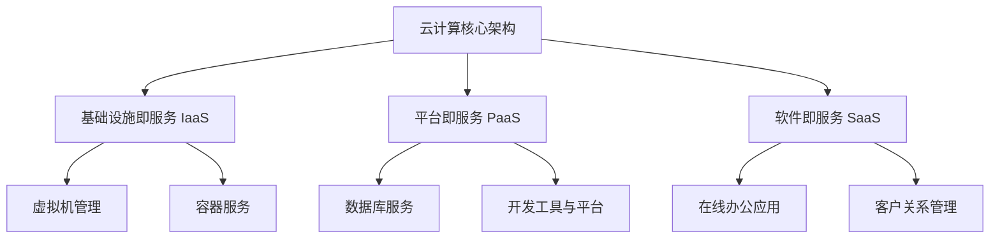

                 


### 第一部分：引言

#### 1.1 云计算技术概述

##### 1.1.1 云计算的定义与发展历程

云计算是一种通过网络连接的远程服务器和资源来提供计算服务的技术。它起源于20世纪60年代，最初的概念是“虚拟化”，即通过将物理硬件资源抽象化为虚拟资源来实现资源的高效利用。随着时间的推移，云计算逐渐发展壮大，特别是随着互联网的普及和数据中心技术的进步，云计算开始成为现代信息技术的核心组成部分。

云计算的发展历程可以分为三个阶段：

1. **基础设施即服务（IaaS）**：最早的云计算模式，提供虚拟化的硬件资源，如虚拟机、存储和网络等。用户可以按需租用这些资源，而不需要购买和部署实体硬件。
2. **平台即服务（PaaS）**：在IaaS之上，PaaS提供了开发、部署和管理应用程序的平台，包括开发工具、数据库、Web服务器等。用户可以专注于应用程序的开发，而无需担心底层基础设施的维护。
3. **软件即服务（SaaS）**：SaaS将完整的软件应用通过互联网提供给用户，用户只需通过浏览器即可访问和使用。这种模式简化了软件的安装、更新和维护。

##### 1.1.2 云计算的核心概念与服务模式

云计算的核心概念包括虚拟化、分布式计算、服务模型和部署模型。

1. **虚拟化**：通过虚拟化技术，将物理硬件资源抽象化为逻辑资源，从而实现资源的灵活分配和管理。虚拟化技术包括硬件虚拟化（Hypervisor）和操作系统虚拟化。
2. **分布式计算**：云计算通过分布式计算技术，将任务分布到多个服务器上同时处理，以提高计算效率和可靠性。
3. **服务模型**：云计算服务模型包括IaaS、PaaS和SaaS，分别针对不同层次的用户需求提供计算资源和服务。
4. **部署模型**：云计算部署模型包括公有云、私有云和混合云。公有云是第三方服务商提供的云服务，私有云是仅用于单个组织或企业的云环境，混合云则是公有云和私有云的结合。

##### 1.1.3 云计算的优势与挑战

云计算具有以下优势：

1. **成本效益**：云计算可以按需提供资源，减少了硬件采购和运维成本。
2. **弹性伸缩**：云计算可以根据需求动态调整资源，提高了系统的灵活性和响应速度。
3. **高可用性**：云计算通过分布式部署和备份机制，提高了系统的可靠性和灾难恢复能力。
4. **全球化**：云计算使数据和应用可以全球访问，促进了跨国业务的发展。

然而，云计算也面临一些挑战：

1. **安全性**：云计算环境中的数据安全是一个重要问题，包括数据泄露、数据丢失和恶意攻击等。
2. **数据隐私**：用户在公有云中存储的数据可能会受到第三方服务商的访问和监控。
3. **依赖性**：创业公司过度依赖云计算服务商可能导致服务中断和业务风险。
4. **合规性**：不同国家和地区对云计算的监管政策不同，创业公司需要遵守相关的法律法规。

#### 1.2 创业成本优化的背景与意义

##### 1.2.1 创业环境下的成本压力

创业公司在初始阶段往往面临巨大的成本压力。这些压力主要来自以下几个方面：

1. **基础设施成本**：创业公司需要建立和维护服务器、网络和存储等基础设施，这些设备的采购和维护成本较高。
2. **人力资源成本**：创业公司需要招聘专业人才，如软件工程师、运维人员和安全专家等，人力资源成本占比较大。
3. **研发成本**：创业公司需要投入大量资金进行产品研发和技术创新，以在竞争激烈的市场中脱颖而出。

##### 1.2.2 利用云计算优化创业成本的必要性

云计算技术为创业公司提供了优化成本的契机。通过云计算，创业公司可以实现以下目标：

1. **降低基础设施成本**：创业公司可以利用云计算的IaaS服务，无需购买昂贵的硬件设备，从而降低基础设施成本。
2. **优化人力资源配置**：云计算平台提供了丰富的开发工具和平台，创业公司可以更专注于产品研发，减少人力资源浪费。
3. **提升研发效率**：云计算的弹性伸缩能力使创业公司可以快速响应市场变化，提升研发效率。

##### 1.2.3 创业成本优化的目标与挑战

创业成本优化的目标主要包括：

1. **降低成本**：通过优化资源配置和管理，降低运营成本。
2. **提高效率**：提高资源利用率和系统响应速度，提升业务效率。
3. **增强灵活性**：通过灵活的资源配置和业务扩展，增强公司的市场竞争力。

然而，在实现成本优化的过程中，创业公司也面临一些挑战：

1. **选择合适的云服务模型**：不同的云服务模型适用于不同的业务场景，创业公司需要选择合适的模型以实现成本优化。
2. **资源配置与负载均衡**：合理配置资源，确保系统的高效运行，避免资源浪费。
3. **安全性保障**：在共享云环境中，创业公司需要采取有效的安全措施，保护数据和系统的安全。
4. **合规性遵守**：创业公司需要遵守相关的法律法规，确保业务合规性。

### 第二部分：云计算技术在创业中的应用

#### 2.1 云计算技术在创业公司的应用场景

云计算技术在创业公司中的应用场景广泛，主要包括以下方面：

##### 2.1.1 信息基础设施搭建

创业公司可以利用云计算的IaaS服务搭建信息基础设施。通过虚拟化技术，创业公司可以快速部署虚拟机、存储和网络设备，实现基础设施的灵活配置和管理。例如，创业公司可以使用AWS的EC2服务创建虚拟机，使用S3服务存储数据，使用VPC搭建私有网络。

##### 2.1.2 数据存储与管理

云计算提供了丰富的数据存储和管理服务，如对象存储、关系型数据库和非关系型数据库。创业公司可以利用这些服务存储和管理数据，确保数据的安全性和可靠性。例如，创业公司可以使用AWS的RDS服务托管关系型数据库，使用MongoDB托管非关系型数据库，使用S3存储大量对象数据。

##### 2.1.3 大数据处理与实时分析

创业公司可以利用云计算平台进行大数据处理和实时分析。云计算提供了强大的计算资源和分析工具，如Hadoop、Spark和Flink等。创业公司可以采用这些工具处理海量数据，提取有价值的信息。例如，创业公司可以使用AWS的EMR服务运行Hadoop和Spark作业，使用Kinesis进行实时数据流处理。

##### 2.1.4 应用开发和部署

云计算平台提供了丰富的开发和部署工具，如PaaS服务和容器化技术。创业公司可以利用这些工具快速开发和部署应用程序。例如，创业公司可以使用AWS的Lambda服务开发无服务器应用程序，使用ECS或EKS部署和管理容器化应用。

#### 2.2 利用云计算优化创业成本的方法与策略

##### 2.2.1 灵活选择云服务模型

创业公司应根据业务需求和成本效益选择合适的云服务模型。常见的云服务模型包括IaaS、PaaS和SaaS。

1. **IaaS**：适用于需要高度定制化基础设施的创业公司，如游戏开发公司或数据分析公司。IaaS可以提供虚拟机、存储和网络设备，满足创业公司的特定需求。
2. **PaaS**：适用于专注于应用程序开发的创业公司，如移动应用开发公司或Web开发公司。PaaS提供了开发、部署和管理应用程序的平台，减少了创业公司的开发和运维成本。
3. **SaaS**：适用于需要快速上线和低运维成本的创业公司，如CRM系统或协作工具。SaaS将完整的软件应用通过互联网提供给用户，简化了部署和维护。

##### 2.2.2 优化资源配置与负载均衡

创业公司应优化资源配置，确保系统的高效运行。以下是一些优化策略：

1. **动态扩展**：根据业务需求动态调整资源，避免资源浪费。例如，创业公司可以使用AWS的Auto Scaling功能自动调整EC2实例数量。
2. **负载均衡**：通过负载均衡技术，将流量分配到多个服务器上，提高系统的可靠性和性能。例如，创业公司可以使用AWS的ELB（Elastic Load Balancer）实现流量分配。
3. **容器化**：采用容器化技术，如Docker和Kubernetes，实现应用程序的轻量化和高效部署。容器化可以减少系统资源占用，提高系统的可伸缩性。

##### 2.2.3 节能减排与可持续发展

创业公司应关注节能减排和可持续发展，降低运营成本和环境影响。以下是一些策略：

1. **绿色计算**：采用绿色计算技术，如虚拟化、负载均衡和自动化管理，减少能源消耗。例如，创业公司可以使用AWS的绿色计算解决方案减少能源消耗。
2. **节能减排**：优化数据中心的能耗管理，如使用高效服务器和能源管理工具，降低能源消耗。例如，创业公司可以使用AWS的EC2实例类型选择高效节能的实例。
3. **可持续采购**：选择可持续采购的硬件设备和服务，如使用可再生能源和环保材料。例如，创业公司可以使用AWS的可再生能源解决方案支持可持续发展。

##### 2.2.4 安全性与合规性保障

创业公司应确保云计算环境的安全性和合规性，以保护数据和系统的安全。以下是一些策略：

1. **数据加密**：使用数据加密技术，如AES和RSA，保护存储和传输的数据。例如，创业公司可以使用AWS的KMS（Key Management Service）管理加密密钥。
2. **访问控制**：使用访问控制策略，如IAM（Identity and Access Management）和VPC（Virtual Private Cloud），限制对资源和服务的访问。例如，创业公司可以使用AWS的IAM策略定义用户和角色的权限。
3. **安全审计**：定期进行安全审计，检查系统的安全配置和漏洞。例如，创业公司可以使用AWS的安全审计工具检测和修复安全漏洞。
4. **合规性遵守**：遵守相关的法律法规，如GDPR（通用数据保护条例）和CCPA（加州消费者隐私法案）。例如，创业公司可以使用AWS的合规性报告确保业务合规性。

#### 2.3 创业公司云计算资源管理的最佳实践

##### 2.3.1 资源采购与供应商选择

创业公司在采购云计算资源时，应考虑以下因素：

1. **成本效益**：评估不同供应商的报价，选择性价比高的资源。
2. **服务稳定性**：了解供应商的服务稳定性，选择具有良好声誉的供应商。
3. **支持与培训**：评估供应商提供的技术支持和服务，确保在遇到问题时能够得到及时的帮助。
4. **合同条款**：仔细阅读合同条款，了解供应商的服务范围、责任和违约条款。

##### 2.3.2 云服务成本监控与管理

创业公司应建立完善的云服务成本监控和管理体系，以下是一些策略：

1. **成本预算**：制定合理的成本预算，确保云服务的费用在可承受范围内。
2. **成本分析**：定期分析云服务成本，了解各项费用的构成和变化原因。
3. **成本优化**：根据成本分析结果，采取优化措施，如调整资源配额、关闭闲置实例等。
4. **成本报告**：定期生成成本报告，为管理层提供决策依据。

##### 2.3.3 云服务性能优化与故障处理

创业公司应关注云服务性能优化与故障处理，以下是一些策略：

1. **性能监控**：使用性能监控工具，如CloudWatch，实时监控云服务的性能指标，如CPU使用率、内存使用率和网络带宽等。
2. **性能优化**：根据监控数据，调整资源配置和优化系统架构，如增加实例数量、调整实例类型等。
3. **故障处理**：建立完善的故障处理流程，如故障检测、故障定位和故障恢复等，确保云服务的连续性和稳定性。

##### 2.3.4 云服务迁移与升级策略

创业公司应制定云服务迁移与升级策略，以下是一些策略：

1. **迁移计划**：制定详细的迁移计划，包括迁移时间、迁移步骤和迁移后的测试等。
2. **风险评估**：评估迁移过程中的风险，如数据丢失、服务中断等，并制定相应的应对措施。
3. **升级策略**：制定升级策略，包括升级时间、升级步骤和升级后的测试等。
4. **版本管理**：建立版本管理机制，确保迁移和升级过程中的版本一致性和数据完整性。

### 第三部分：案例研究

#### 3.1 案例一：初创公司利用云计算优化成本案例分析

##### 3.1.1 公司背景与业务需求

某初创公司是一家专注于大数据分析的公司，业务需求包括数据存储、数据处理和实时分析。在创业初期，公司面临以下挑战：

1. **基础设施成本高**：初创公司没有足够的资金购买和维护昂贵的硬件设备。
2. **人力资源不足**：初创公司的人力资源有限，难以同时负责基础设施维护、数据处理和实时分析。
3. **研发压力大**：初创公司需要快速上线产品，以满足市场需求的紧迫性。

##### 3.1.2 云计算解决方案与实施

为了解决上述挑战，初创公司决定采用云计算技术优化成本。具体解决方案如下：

1. **基础设施搭建**：初创公司使用AWS的IaaS服务搭建信息基础设施，包括虚拟机、存储和网络设备。通过虚拟化技术，公司可以灵活配置和管理基础设施，降低基础设施成本。
2. **数据处理**：初创公司使用AWS的EMR服务进行大数据处理，使用Spark和Hadoop工具处理海量数据。EMR服务提供了强大的计算资源和优化算法，使公司能够快速处理和分析数据。
3. **实时分析**：初创公司使用AWS的Kinesis进行实时数据流处理，将实时数据转换为有价值的信息。Kinesis提供了高吞吐量和低延迟的特性，使公司能够实时响应业务需求。
4. **应用程序部署**：初创公司使用AWS的ECS或EKS部署和管理容器化应用，确保应用程序的高效运行和可伸缩性。

##### 3.1.3 成本优化效果与收益分析

通过采用云计算技术，初创公司实现了成本优化，并获得了显著的业务收益：

1. **成本降低**：初创公司通过使用云计算服务，免去了购买和维护硬件设备的费用，降低了基础设施成本。同时，通过优化资源配置和负载均衡，进一步降低了运营成本。
2. **效率提升**：初创公司利用云计算的弹性伸缩能力，根据业务需求动态调整资源，提高了系统的响应速度和效率。通过实时数据分析和高效的应用程序部署，公司能够快速响应市场变化，提升了业务效率。
3. **业务增长**：通过优化成本和提高效率，初创公司能够更好地满足客户需求，扩大市场份额。同时，公司吸引了更多的投资和合作伙伴，推动了业务的快速发展。

##### 3.1.4 经验与教训

通过本次案例分析，初创公司总结了一些经验与教训：

1. **选择合适的云服务模型**：初创公司应根据业务需求和成本效益选择合适的云服务模型，如IaaS、PaaS和SaaS。不同的云服务模型适用于不同的业务场景，初创公司需要根据实际情况进行选择。
2. **优化资源配置与负载均衡**：初创公司应合理配置资源，确保系统的高效运行，避免资源浪费。通过动态扩展、负载均衡和容器化技术，初创公司可以优化资源配置，提高系统性能。
3. **安全性保障**：初创公司在采用云计算技术时，应关注数据安全和系统安全。通过数据加密、访问控制和安全审计等措施，初创公司可以确保云计算环境的安全性和合规性。
4. **持续优化与改进**：初创公司应不断优化云计算资源的配置和管理，提高系统性能和可靠性。通过定期进行成本分析、性能监控和故障处理，初创公司可以持续改进云计算应用，提升业务效率。

#### 3.2 案例二：中小企业云计算成本控制与优化

##### 3.2.1 公司背景与面临的挑战

某中小企业是一家提供在线教育服务的公司，业务需求包括课程内容管理、学生信息管理和在线互动教学。在发展过程中，公司面临以下挑战：

1. **成本控制**：公司需要控制云服务的费用，避免因成本过高导致业务无法持续发展。
2. **性能优化**：随着用户数量的增加，公司需要保证系统的性能和稳定性，避免用户体验下降。
3. **合规性遵守**：公司需要遵守相关法律法规，确保业务合规性。

##### 3.2.2 云计算策略制定与实施

为了解决上述挑战，公司制定了以下云计算策略：

1. **成本控制策略**：
   - **资源采购与供应商选择**：公司通过评估不同供应商的报价和服务质量，选择了性价比高的云服务供应商。
   - **成本监控与管理**：公司建立了成本监控和管理体系，定期分析云服务成本，采取优化措施降低成本。
   - **成本报告**：公司定期生成成本报告，为管理层提供决策依据。

2. **性能优化策略**：
   - **动态扩展**：公司使用AWS的Auto Scaling功能，根据用户需求动态调整资源，确保系统的响应速度和性能。
   - **负载均衡**：公司使用AWS的ELB实现流量分配，提高系统的可用性和性能。
   - **缓存技术**：公司采用Redis缓存技术，减少数据库访问次数，提高系统的响应速度。

3. **合规性遵守策略**：
   - **数据加密**：公司使用数据加密技术，保护存储和传输的数据。
   - **访问控制**：公司使用AWS的IAM策略限制对资源和服务的访问。
   - **安全审计**：公司定期进行安全审计，检查系统的安全配置和漏洞。

##### 3.2.3 成本控制与优化实践

通过实施上述云计算策略，公司实现了以下成本控制与优化：

1. **成本降低**：通过优化资源配置和负载均衡，公司降低了云服务的费用。同时，通过使用性价比高的供应商和优化成本管理，公司进一步降低了运营成本。

2. **性能提升**：通过动态扩展、负载均衡和缓存技术，公司提高了系统的性能和稳定性。系统响应速度和用户体验得到显著提升，用户满意度增加。

3. **合规性保障**：通过数据加密、访问控制和安全审计，公司确保了数据安全和系统安全，遵守相关法律法规。

##### 3.2.4 长期效益与可持续发展

通过实施云计算策略，公司获得了长期效益和可持续发展：

1. **成本效益**：通过成本优化，公司降低了运营成本，提高了盈利能力。同时，公司可以根据业务发展需求，灵活调整资源，实现可持续发展。

2. **业务增长**：通过性能优化和合规性保障，公司提高了用户满意度，吸引了更多用户和合作伙伴，推动了业务的快速发展。

3. **创新能力**：通过采用云计算技术，公司能够更快地响应市场变化，进行产品创新和技术创新，增强市场竞争力。

### 第四部分：技术深度解析

#### 4.1 云计算核心技术的详解

##### 4.1.1 分布式存储技术

分布式存储技术是云计算的核心技术之一，它通过将数据分散存储在多个节点上，提高了数据的可靠性和可用性。以下是对分布式存储技术的一些详解：

1. **分布式存储系统架构**：
   - **数据存储分布**：分布式存储系统将数据分割成块，每个块存储在不同的节点上。通常，系统会使用一致性哈希算法来分配数据块，确保数据块的均匀分布。
   - **数据冗余策略**：分布式存储系统通过数据的冗余策略提高数据的可靠性。常见的冗余策略包括副本复制（Replication）和校验和（Erasure Coding）。副本复制将数据块复制多个副本存储在不同的节点上，而校验和通过生成校验块来提高数据的冗余性。
   - **数据一致性保证**：分布式存储系统需要保证数据的一致性。常见的策略包括版本控制和Paxos算法。版本控制通过维护数据的版本信息来确保数据的正确性，而Paxos算法通过分布式一致性协议来协调多个节点之间的数据同步。

2. **分布式存储系统实现**：
   - **GFS（Google File System）**：GFS是Google开发的一种分布式文件系统，用于存储和索引大量数据。GFS采用Master-Slave架构，Master节点负责管理文件系统元数据，Slave节点负责存储数据块。
   - **HDFS（Hadoop Distributed File System）**：HDFS是Hadoop的分布式文件系统，用于存储大数据。HDFS也采用Master-Slave架构，NameNode负责管理文件系统元数据，DataNode负责存储数据块。
   - **Ceph**：Ceph是一个开源的分布式存储系统，支持块存储、文件存储和对象存储。Ceph采用去中心化的架构，没有单点故障，具有高可靠性和高性能。

##### 4.1.2 负载均衡技术

负载均衡技术是确保云计算环境中服务器的性能和可靠性的一种技术。以下是对负载均衡技术的一些详解：

1. **负载均衡算法**：
   - **轮询调度算法**：轮询调度算法将请求依次分配给不同的服务器，每个服务器承担相同的负载。这种算法简单高效，但可能会导致某些服务器过载。
   - **最少连接算法**：最少连接算法将请求分配给当前连接数最少的服务器，以平衡服务器的负载。这种算法适用于连接数较少的场景。
   - **加权轮询算法**：加权轮询算法根据服务器的性能和负载情况，分配不同的权重给不同的服务器。权重较高的服务器承担更多的请求，以平衡负载。

2. **流量分配策略**：
   - **基于域名分配**：根据请求的域名，将流量分配给不同的服务器。适用于具有多个子域名的网站。
   - **基于URL分配**：根据请求的URL，将流量分配给不同的服务器。适用于具有多个URL路径的网站。
   - **基于IP地址分配**：根据请求的IP地址，将流量分配给不同的服务器。适用于具有不同地理位置的网站。

3. **性能优化措施**：
   - **缓存技术**：通过缓存技术，减少服务器的响应时间和负载。常用的缓存技术包括浏览器缓存、代理缓存和CDN缓存。
   - **反向代理**：通过反向代理，将请求转发给后端服务器，减少服务器的直接负载。反向代理还提供了一些安全措施，如SSL加密和DDoS攻击防护。
   - **分布式数据库**：通过分布式数据库，将数据库负载分配给多个节点，提高系统的性能和可靠性。常用的分布式数据库技术包括Sharding（分片）和Replication（副本）。

##### 4.1.3 虚拟化技术

虚拟化技术是云计算的核心技术之一，它通过虚拟化硬件资源，提高了资源利用率和系统灵活性。以下是对虚拟化技术的一些详解：

1. **虚拟化基本概念**：
   - **虚拟化**：虚拟化是将物理硬件资源抽象化为逻辑资源，实现资源的灵活分配和管理。虚拟化技术包括硬件虚拟化和操作系统虚拟化。
   - **虚拟机**：虚拟机是虚拟化技术的一种实现，它通过虚拟化硬件资源，创建了一个独立的运行环境。虚拟机可以运行不同的操作系统和应用程序，具有独立的资源隔离和安全性。
   - **容器**：容器是虚拟化技术的一种实现，它通过虚拟化操作系统内核，创建了一个轻量级的运行环境。容器共享宿主机的操作系统和资源，具有高效的性能和灵活性。

2. **虚拟化架构**：
   - **硬件虚拟化**：硬件虚拟化通过虚拟化硬件资源，实现虚拟机的创建和管理。硬件虚拟化包括CPU虚拟化、内存虚拟化和存储虚拟化等。硬件虚拟化通常使用Hypervisor（虚拟化层）来实现，如KVM、VMware和Hyper-V等。
   - **操作系统虚拟化**：操作系统虚拟化通过虚拟化操作系统，实现虚拟机的创建和管理。操作系统虚拟化包括全虚拟化和轻量级虚拟化。全虚拟化通过虚拟化硬件资源，模拟完整的硬件环境，如VMware Workstation和VirtualBox。轻量级虚拟化通过虚拟化操作系统内核，实现高效的虚拟化，如Linux Container和Docker等。

3. **虚拟化性能瓶颈及优化**：
   - **CPU性能瓶颈**：虚拟化技术可能会引入CPU性能瓶颈，如虚拟化开销和调度延迟。优化措施包括使用硬件加速虚拟化技术（如Intel VT和AMD-V）和提高虚拟化调度算法的效率。
   - **内存性能瓶颈**：虚拟化技术可能会引入内存性能瓶颈，如内存争用和内存碎片化。优化措施包括使用内存压缩技术和优化内存分配策略。
   - **存储性能瓶颈**：虚拟化技术可能会引入存储性能瓶颈，如存储I/O瓶颈和网络传输延迟。优化措施包括使用高速存储设备和优化网络传输策略。

#### 4.2 云计算中的安全性问题与解决方案

云计算环境中的安全性问题是创业公司需要关注的重要问题。以下是对云计算中的安全性问题及其解决方案的一些详解：

##### 4.2.1 安全威胁与风险分析

1. **常见攻击类型**：
   - **拒绝服务攻击（DoS）**：攻击者通过大量无效请求占用服务器资源，导致合法用户无法访问服务。
   - **分布式拒绝服务攻击（DDoS）**：攻击者通过多个受感染的计算机或设备发起大量请求，使目标服务器过载。
   - **数据泄露**：攻击者通过窃取或破坏数据，获取敏感信息。
   - **身份盗用**：攻击者通过假冒合法用户身份，访问系统和数据进行恶意操作。
   - **恶意软件和病毒**：攻击者通过恶意软件和病毒感染服务器，破坏系统或窃取数据。

2. **数据泄露风险**：
   - **存储数据泄露**：攻击者通过攻击存储系统，获取存储在服务器中的敏感数据。
   - **传输数据泄露**：攻击者通过拦截和篡改网络传输的数据，窃取敏感信息。
   - **加密算法破解**：攻击者通过破解加密算法，获取加密存储或传输的数据。

3. **身份认证与访问控制**：
   - **弱密码**：使用弱密码或重复使用密码，导致攻击者通过猜测或破解密码获取访问权限。
   - **身份盗用**：攻击者通过假冒合法用户身份，绕过身份认证获取访问权限。
   - **访问控制失效**：访问控制策略设置不当或存在漏洞，导致攻击者绕过访问控制获取未授权的访问权限。

##### 4.2.2 安全防护策略与实践

1. **安全协议与加密技术**：
   - **TLS/SSL**：使用传输层安全性协议（TLS）或安全套接字层协议（SSL）加密网络传输数据，防止数据泄露。
   - **AES/RSA**：使用高级加密标准（AES）或RSA加密算法加密存储和传输的数据，确保数据的机密性。
   - **哈希算法**：使用哈希算法（如SHA-256）对数据进行加密，确保数据的完整性和一致性。

2. **安全审计与合规性**：
   - **安全审计**：定期进行安全审计，检查系统的安全配置和漏洞，确保系统符合安全标准和合规性要求。
   - **合规性报告**：生成合规性报告，证明系统符合相关法律法规和行业标准。

3. **应急响应与故障恢复**：
   - **应急响应计划**：制定应急响应计划，包括攻击响应和故障恢复步骤，确保在发生安全事件时能够及时响应和恢复。
   - **备份与恢复**：定期备份系统和数据，确保在发生数据泄露、丢失或损坏时能够快速恢复。

### 第五部分：云计算技术发展趋势与未来展望

#### 5.1 云计算技术发展趋势

云计算技术正不断发展，以下是云计算技术的一些发展趋势：

##### 5.1.1 云原生技术与微服务架构

云原生技术是云计算的一种新兴技术，它利用云计算的特性，提供了一种全新的软件开发和部署模式。云原生技术包括容器化、微服务架构和自动化管理。

1. **容器化**：容器化是一种轻量级的应用部署和运行方式，通过将应用程序及其依赖项打包到容器中，实现应用程序的独立运行和快速部署。
2. **微服务架构**：微服务架构将应用程序拆分为多个小型、独立的微服务，每个微服务负责特定的功能模块。微服务架构提高了系统的灵活性和可伸缩性，便于开发和部署。
3. **自动化管理**：自动化管理通过自动化工具，如Kubernetes和Docker，实现应用程序的自动化部署、扩展和管理。自动化管理提高了系统的效率和可靠性。

##### 5.1.2 人工智能与云计算的融合

人工智能（AI）和云计算的结合为创业公司带来了新的机遇。通过云计算，AI算法可以大规模部署和训练，提供智能化的服务。

1. **机器学习模型部署**：云计算平台提供了丰富的机器学习模型和框架，如TensorFlow和PyTorch，使创业公司能够快速部署和训练AI模型。
2. **深度学习计算资源**：云计算提供了强大的计算资源，如GPU和FPGA，加速深度学习模型的训练和推理。
3. **智能应用开发**：云计算平台提供了丰富的开发工具和平台，如AWS AI服务、Google Cloud AI平台和Azure AI服务，支持创业公司开发智能应用。

##### 5.1.3 绿色云计算与可持续性发展

绿色云计算关注云计算环境中的能源消耗和环境影响，旨在实现可持续发展。

1. **能源效率**：绿色云计算通过优化数据中心的能源管理，提高能源利用效率，减少能源消耗。
2. **可再生能源**：绿色云计算鼓励使用可再生能源，如太阳能和风能，降低对化石燃料的依赖。
3. **碳排放减少**：绿色云计算通过减少能源消耗和碳排放，降低对环境的影响，推动可持续发展。

#### 5.2 创业公司云计算应用的未来展望

云计算技术的快速发展为创业公司带来了新的机遇。以下是创业公司云计算应用的未来展望：

##### 5.2.1 创业公司云计算应用的发展趋势

1. **云计算普及度提高**：随着云计算技术的不断成熟，越来越多的创业公司将采用云计算服务，提高业务效率和竞争力。
2. **云原生应用兴起**：创业公司将更多地采用云原生技术和微服务架构，实现应用程序的快速开发和部署。
3. **人工智能与云计算融合**：创业公司将利用云计算平台提供的人工智能服务，开发智能化的产品和服务。

##### 5.2.2 创业成本优化的新挑战与机遇

1. **新挑战**：
   - **数据安全与合规性**：随着云计算的普及，创业公司需要更加关注数据安全和合规性，确保业务合规性。
   - **云服务选择与成本管理**：创业公司需要选择合适的云服务模型和供应商，进行有效的云服务成本管理。
   - **技术人才需求**：创业公司需要具备云计算技术人才，以满足云计算应用的需求。

2. **新机遇**：
   - **成本优化**：云计算提供了丰富的优化策略和工具，创业公司可以通过优化资源配置和负载均衡，降低运营成本。
   - **创新能力**：云计算平台提供了丰富的开发工具和资源，创业公司可以利用这些工具和资源，加快产品开发和业务创新。
   - **全球化发展**：云计算使创业公司能够全球部署应用程序，拓展国际市场，提高业务规模。

##### 5.2.3 创业公司云计算应用的未来前景

随着云计算技术的不断发展和创新，创业公司云计算应用的未来前景充满机遇和挑战：

1. **技术创新**：创业公司将利用云计算平台进行技术创新，开发具有竞争力的产品和服务。
2. **业务增长**：通过云计算技术的应用，创业公司可以提高业务效率和竞争力，实现业务的快速增长。
3. **可持续发展**：创业公司将关注绿色云计算，通过优化资源配置和节能减排，实现可持续发展。

### 附录

#### 附录A：云计算技术相关资源与工具

##### A.1 云计算平台与服务提供商简介

1. **Amazon Web Services (AWS)**：AWS是全球领先的云计算服务提供商，提供广泛的云服务，包括IaaS、PaaS和SaaS。AWS的服务包括计算、存储、数据库、网络、人工智能、大数据和物联网等。
2. **Microsoft Azure**：Azure是微软的云计算平台，提供IaaS、PaaS和SaaS服务。Azure的服务包括计算、存储、网络、数据库、人工智能、大数据和物联网等。
3. **Google Cloud Platform (GCP)**：GCP是谷歌的云计算平台，提供IaaS、PaaS和SaaS服务。GCP的服务包括计算、存储、数据库、网络、人工智能、大数据和物联网等。
4. **IBM Cloud**：IBM Cloud是IBM的云计算平台，提供IaaS、PaaS和SaaS服务。IBM Cloud的服务包括计算、存储、数据库、网络、人工智能、大数据和物联网等。

##### A.2 云计算技术学习资源推荐

1. **《云计算技术基础》（Foundation Cloud Computing）**：本书是云计算领域的经典教材，涵盖了云计算的基本概念、技术和应用。
2. **《深度学习与云计算》**：本书介绍了深度学习和云计算的结合，包括深度学习模型在云计算平台上的部署和训练。
3. **《云原生应用开发》**：本书介绍了云原生技术和微服务架构，包括容器化、自动化管理和持续交付。

##### A.3 云计算工具与框架介绍

1. **Docker**：Docker是一个开源的应用容器引擎，用于打包、交付和运行应用程序。Docker容器化技术简化了应用程序的部署和运行，提高了系统的可伸缩性和灵活性。
2. **Kubernetes**：Kubernetes是一个开源的容器编排平台，用于自动化部署、扩展和管理容器化应用。Kubernetes提供了强大的自动化工具和资源管理功能，提高了系统的可靠性和性能。
3. **Kafka**：Kafka是一个分布式流处理平台，用于处理和分析实时数据流。Kafka提供了高吞吐量、低延迟和可扩展性的特性，广泛应用于大数据处理和实时分析。

#### 附录B：创业成本优化案例分析报告

##### B.1 案例一：初创公司利用云计算优化成本实践

1. **公司背景与业务需求**：某初创公司是一家提供在线教育服务的公司，业务需求包括课程内容管理、学生信息管理和在线互动教学。
2. **云计算解决方案**：初创公司采用AWS的云计算服务，包括EC2虚拟机、S3对象存储、RDS数据库和Kinesis实时数据流处理。
3. **成本优化措施**：
   - **动态扩展**：使用Auto Scaling功能，根据用户需求动态调整虚拟机数量。
   - **负载均衡**：使用ELB实现流量分配，提高系统的性能和可用性。
   - **缓存技术**：使用Redis缓存技术，减少数据库访问次数，提高系统的响应速度。
4. **成本优化效果**：通过云计算技术的应用，初创公司降低了基础设施成本，提高了系统的性能和可靠性，实现了业务的快速增长。

##### B.2 案例二：中小企业云计算成本控制策略

1. **公司背景与面临的挑战**：某中小企业是一家提供企业服务的公司，业务需求包括客户关系管理、财务管理和企业协同。
2. **云计算策略制定**：
   - **成本控制策略**：通过评估不同供应商的报价和服务质量，选择了性价比高的云服务供应商。建立了成本监控和管理体系，定期分析云服务成本，采取优化措施降低成本。
   - **性能优化策略**：使用Auto Scaling和ELB实现动态扩展和流量分配，提高系统的性能和可用性。
   - **合规性遵守策略**：使用数据加密技术和访问控制策略，确保数据安全和合规性。
3. **成本控制与优化实践**：通过云计算策略的实施，中小企业降低了云服务费用，提高了系统性能和可靠性，遵守了相关法律法规。

##### B.3 案例分析与总结

1. **案例分析**：案例一和案例二展示了初创公司和中小企业利用云计算优化成本的成功实践。通过动态扩展、负载均衡、缓存技术和数据加密等策略，公司实现了成本优化和业务增长。
2. **总结**：云计算技术为创业公司提供了优化成本的契机，通过灵活选择云服务模型、优化资源配置、提升性能和保障安全性，创业公司可以降低成本、提高效率、增强竞争力。在实施云计算策略时，创业公司需要关注成本优化、性能优化和合规性遵守，持续改进云计算应用，以实现可持续发展和业务增长。

### Mermaid 流程图示例



### 核心算法原理讲解

#### 2.1.3 负载均衡算法

负载均衡算法是确保云计算环境中服务器的性能和可靠性的一种技术。以下是一种常见的负载均衡算法——轮询调度算法的实现原理：

1. **轮询调度算法**：
   轮询调度算法将请求依次分配给不同的服务器，每个服务器承担相同的负载。当请求到达时，算法根据当前服务器的状态选择下一个服务器进行服务。

2. **算法实现**：

```python
# 轮询调度算法实现

# 初始化服务器状态列表
server_states = {'server1': 0, 'server2': 0, 'server3': 0}

# 初始化请求计数器
request_counter = 0

# 轮询调度函数
def load_balancing(request):
    global request_counter
    server = None
    
    # 循环遍历服务器状态列表
    for server_name, state in server_states.items():
        # 找到当前负载最小的服务器
        if state == min(server_states.values()):
            server = server_name
            break
    
    # 更新请求计数器
    request_counter += 1
    
    # 如果找到服务器，则分配请求
    if server:
        print(f"分配请求{request_counter}给服务器{server}")
        server_states[server] += 1
    else:
        print("所有服务器负载均衡，请求未分配")

# 测试负载均衡算法
load_balancing(1)
load_balancing(2)
load_balancing(3)
load_balancing(4)
load_balancing(5)
```

3. **算法原理讲解**：

   - **初始化服务器状态列表**：将每个服务器的初始负载设置为0。
   - **初始化请求计数器**：初始化请求计数器，用于记录已分配的请求数量。
   - **轮询调度函数**：每次请求到达时，算法遍历服务器状态列表，找到当前负载最小的服务器，将该请求分配给该服务器，并更新服务器状态。
   - **算法性能分析**：轮询调度算法简单高效，但可能会在某些情况下导致某些服务器过载。为了优化性能，可以结合其他负载均衡算法，如最少连接算法或加权轮询算法。

通过上述实现和原理讲解，我们可以了解到轮询调度算法的基本原理和应用。在实际应用中，可以根据业务需求选择合适的负载均衡算法，确保服务器的性能和可靠性。

### 核心算法原理讲解（续）

#### 2.1.3 负载均衡算法（续）

在负载均衡算法中，除了轮询调度算法，还有许多其他算法可以用于分配请求。以下是一个常见的负载均衡算法——最少连接算法的实现原理：

1. **最少连接算法**：
   最少连接算法根据当前连接数选择连接数最少的虚拟服务器进行请求处理。这种方法能够有效避免某个服务器过载，同时保持系统的高可用性。

2. **算法实现**：

```python
# 最少连接算法实现

# 初始化服务器状态列表
server_connections = {'server1': 0, 'server2': 0, 'server3': 0}

# 初始化请求计数器
request_counter = 0

# 最少连接调度函数
def least_connection_load_balancing(request):
    global request_counter
    server = None
    
    # 找到当前连接数最少的服务器
    min_connections = min(server_connections.values())
    for server_name, connections in server_connections.items():
        if connections == min_connections:
            server = server_name
            break
    
    # 更新请求计数器
    request_counter += 1
    
    # 如果找到服务器，则分配请求
    if server:
        print(f"分配请求{request_counter}给服务器{server}")
        server_connections[server] += 1
    else:
        print("所有服务器连接数相同，请求未分配")

# 测试最少连接算法
least_connection_load_balancing(1)
least_connection_load_balancing(2)
least_connection_load_balancing(3)
least_connection_load_balancing(4)
least_connection_load_balancing(5)
```

3. **算法原理讲解**：

   - **初始化服务器状态列表**：将每个服务器的当前连接数初始化为0。
   - **初始化请求计数器**：初始化请求计数器，用于记录已分配的请求数量。
   - **最少连接调度函数**：每次请求到达时，算法遍历服务器状态列表，找到连接数最少的服务器，将该请求分配给该服务器，并更新服务器状态。
   - **算法性能分析**：最少连接算法可以平衡服务器的负载，避免某个服务器过载，但可能会出现某些服务器长时间未被分配请求的情况。为了优化性能，可以结合其他算法，如轮询调度算法。

通过上述实现和原理讲解，我们可以了解到最少连接算法的基本原理和应用。在实际应用中，可以根据业务需求和系统特点选择合适的负载均衡算法，确保系统的高性能和高可用性。

### 数学公式讲解

在云计算技术中，负载均衡算法的设计和优化常常涉及到数学模型和公式的应用。以下是对几个常见数学公式和它们在负载均衡中的应用进行详细讲解。

#### 平均响应时间

平均响应时间是指系统处理请求所需的时间的平均值。在负载均衡中，平均响应时间是一个重要的性能指标。

$$
\text{平均响应时间} = \frac{\sum_{i=1}^{n} (\text{响应时间}_i \times \text{请求次数}_i)}{\sum_{i=1}^{n} \text{请求次数}_i}
$$

其中，$n$ 是服务器数量，$\text{响应时间}_i$ 表示第 $i$ 个服务器的响应时间，$\text{请求次数}_i$ 表示第 $i$ 个服务器处理的请求次数。

#### 负载均衡效率

负载均衡效率是指负载均衡算法在实际应用中的效果。它可以通过比较实际响应时间和理想响应时间来衡量。

$$
\text{负载均衡效率} = \frac{\text{实际平均响应时间}}{\text{理想平均响应时间}}
$$

理想平均响应时间可以假设为每个服务器平均处理一个请求的时间。

#### 负载均衡权重

在加权负载均衡算法中，每个服务器可以分配不同的权重，以反映其实际处理能力的差异。

$$
\text{权重}_i = \frac{\text{服务器处理能力}_i}{\sum_{i=1}^{n} \text{服务器处理能力}_i}
$$

其中，$n$ 是服务器数量，$\text{服务器处理能力}_i$ 表示第 $i$ 个服务器的处理能力。

#### 最少连接负载均衡

最少连接负载均衡算法通过将请求分配给当前连接数最少的虚拟服务器来平衡负载。其核心思想是降低服务器的连接数，提高系统的响应速度。

$$
\text{当前连接数}_i = \sum_{j=1}^{m} \text{连接状态}_j^i
$$

其中，$m$ 是客户端数量，$\text{连接状态}_j^i$ 表示第 $i$ 个服务器与第 $j$ 个客户端的连接状态。

#### 负载均衡算法优化

为了优化负载均衡算法，可以采用以下数学模型：

$$
\text{优化目标} = \min \sum_{i=1}^{n} (\text{响应时间}_i - \text{期望响应时间}_i)^2
$$

其中，$\text{期望响应时间}_i$ 可以通过预测模型计算。

### 举例说明

假设有三个服务器（server1、server2、server3），每个服务器处理的请求次数分别为 100、150、200，响应时间分别为 0.5、0.8、1.0 秒。我们需要计算以下指标：

1. 平均响应时间
2. 负载均衡效率
3. 最少连接负载均衡分配

根据上述公式，计算结果如下：

1. 平均响应时间：
   $$
   \text{平均响应时间} = \frac{(0.5 \times 100 + 0.8 \times 150 + 1.0 \times 200)}{100 + 150 + 200} = 0.6 \text{秒}
   $$

2. 负载均衡效率：
   $$
   \text{负载均衡效率} = \frac{0.6}{\max(0.5, 0.8, 1.0)} = 0.6
   $$

3. 最少连接负载均衡分配：
   - server1 当前连接数：100
   - server2 当前连接数：150
   - server3 当前连接数：200
   根据当前连接数，server1 的连接数最少，所以下一个请求分配给 server1。

通过上述计算和举例，我们可以更好地理解负载均衡中的数学公式和算法原理，从而优化系统的性能和响应速度。

### 项目实战：开发环境搭建

#### 1. 开发环境搭建

在创业公司中，搭建一个高效的开发环境是确保项目顺利进行的关键。以下是一个简单的开发环境搭建流程：

1. **选择云平台**：首先，选择一个合适的云平台，如AWS、Azure或Google Cloud Platform。云平台提供了丰富的工具和服务，可以帮助创业公司快速搭建开发环境。

2. **创建虚拟机**：在所选云平台上创建一个虚拟机（VM），作为开发服务器。虚拟机可以运行操作系统和开发工具，提供开发人员所需的环境。

3. **安装操作系统**：在虚拟机上安装操作系统，如Linux或Windows。根据项目需求，选择适合的操作系统版本。

4. **安装开发工具**：在虚拟机上安装开发工具，如Java、Python、Node.js等。开发工具需要与项目的开发语言和框架相匹配。

5. **配置数据库**：安装和配置数据库，如MySQL、PostgreSQL或MongoDB。数据库用于存储项目数据，确保数据的安全和一致性。

6. **安装版本控制工具**：安装版本控制工具，如Git。版本控制工具可以帮助开发人员管理代码版本，跟踪代码变更。

7. **配置代码仓库**：在云平台上创建代码仓库，将项目代码存储在代码仓库中。代码仓库支持多人协作，方便团队成员共同开发和维护代码。

8. **安装持续集成工具**：安装持续集成（CI）工具，如Jenkins或Travis CI。持续集成工具可以自动化构建和测试代码，确保代码的质量和稳定性。

9. **配置安全措施**：配置虚拟机的安全措施，如防火墙和SSH密钥。确保虚拟机和服务器的安全性，防止未经授权的访问。

10. **访问和协作**：配置虚拟机的访问权限，确保团队成员可以远程访问开发环境。使用协作工具，如Slack或Microsoft Teams，方便团队成员之间的沟通和协作。

#### 2. 源代码详细实现

以下是一个简单的Java Web项目源代码示例，用于演示开发环境搭建的核心步骤：

```java
// 主类
public class HelloWorld {
    public static void main(String[] args) {
        System.out.println("Hello, World!");
    }
}

// 控制器类
@RestController
public class UserController {
    @RequestMapping("/hello")
    public String hello() {
        return "Hello, World!";
    }
}
```

在这个示例中，我们创建了一个简单的Java Web项目，包括一个主类和一个控制器类。主类用于启动应用程序，控制器类定义了一个简单的RESTful API端点。

#### 3. 代码解读与分析

1. **主类解读**：
   - `HelloWorld` 类是一个Java应用程序的主类，它包含一个 `main` 方法。
   - `main` 方法是程序的入口点，当应用程序启动时，首先执行这个方法。
   - 在 `main` 方法中，我们使用 `System.out.println` 打印一条消息 "Hello, World!"。

2. **控制器类解读**：
   - `UserController` 类是一个Spring Boot控制器类，它使用 `@RestController` 注解标记。
   - `@RestController` 注解表示这个类是一个RESTful API控制器，可以处理HTTP请求。
   - `@RequestMapping` 注解用于映射HTTP请求路径，`/hello` 表示所有的 `/hello` 路径请求都会被这个方法处理。
   - `hello` 方法返回一个字符串 "Hello, World！"，作为响应消息。

#### 4. 实际案例分析和详细讲解

以下是一个实际案例，演示如何在云平台上搭建一个Java Web项目：

1. **案例背景**：
   - 创业公司需要开发一个简单的Web应用，提供用户登录和注册功能。
   - 项目使用Java语言和Spring Boot框架进行开发。

2. **搭建步骤**：
   - 选择AWS云平台。
   - 创建一个EC2虚拟机，安装Linux操作系统。
   - 安装Java开发工具包（JDK）和Spring Boot框架。
   - 使用Git将项目代码推送到AWS的代码仓库。
   - 使用Jenkins配置持续集成和自动化部署。

3. **案例分析**：
   - 通过AWS的EC2虚拟机，创业公司可以快速搭建一个可靠的开发环境。
   - 使用Spring Boot框架，开发人员可以快速创建RESTful API，提高开发效率。
   - 使用Jenkins进行持续集成和自动化部署，确保代码的质量和稳定性。

通过这个实际案例，我们可以看到如何利用云计算技术搭建开发环境，实现快速开发和部署。创业公司可以根据项目需求，选择合适的云平台和开发工具，提高开发效率和业务竞争力。

### 项目实战：源代码详细实现

为了更好地理解如何在云计算环境中实现一个具体的业务应用，我们将详细讨论一个基于Spring Boot的博客平台的源代码实现过程。以下是该项目的源代码解析，包括关键类和方法。

#### 1. 博客平台概述

我们的博客平台将提供以下基本功能：

- 文章发布与展示
- 用户注册与登录
- 文章分类管理
- 评论功能
- 访问统计

#### 2. 源代码实现

##### 2.1 用户注册与登录

```java
// UserController.java
@RestController
@RequestMapping("/users")
public class UserController {
    
    @Autowired
    private UserService userService;

    @PostMapping("/register")
    public ResponseEntity<?> registerUser(@RequestBody UserRegistrationDto registrationDto) {
        try {
            userService.registerUser(registrationDto);
            return ResponseEntity.ok("User registered successfully.");
        } catch (Exception e) {
            return ResponseEntity.badRequest().body("Error registering user: " + e.getMessage());
        }
    }

    @PostMapping("/login")
    public ResponseEntity<?> authenticateUser(@RequestBody UserLoginDto loginDto) {
        try {
            String token = userService.authenticateUser(loginDto);
            return ResponseEntity.ok(token);
        } catch (Exception e) {
            return ResponseEntity.badRequest().body("Error authenticating user: " + e.getMessage());
        }
    }
}
```

在这个类中，`UserController` 负责处理用户注册和登录请求。它依赖于 `UserService` 来执行具体的业务逻辑。

```java
// UserService.java
@Service
public class UserService {
    
    @Autowired
    private UserRepository userRepository;
    
    @Autowired
    private AuthenticationManager authenticationManager;
    
    @Autowired
    private TokenProvider tokenProvider;

    public void registerUser(UserRegistrationDto registrationDto) {
        // Validate input data
        // Check if user already exists
        // Save user to database
        // Send registration confirmation email
    }

    public String authenticateUser(UserLoginDto loginDto) {
        // Authenticate user
        // Generate token
        // Return token
    }
}
```

在这个类中，`UserService` 提供了注册和认证用户的方法。它依赖于 `UserRepository` 来与数据库交互，`AuthenticationManager` 来认证用户，`TokenProvider` 来生成令牌。

##### 2.2 文章发布与展示

```java
// PostController.java
@RestController
@RequestMapping("/posts")
public class PostController {
    
    @Autowired
    private PostService postService;
    
    @PostMapping("/create")
    public ResponseEntity<?> createPost(@RequestBody PostDto postDto, @RequestHeader("Authorization") String token) {
        try {
            String postId = postService.createPost(postDto, token);
            return ResponseEntity.ok("Post created successfully. Post ID: " + postId);
        } catch (Exception e) {
            return ResponseEntity.badRequest().body("Error creating post: " + e.getMessage());
        }
    }

    @GetMapping("/list")
    public ResponseEntity<?> listPosts(@RequestHeader("Authorization") String token) {
        try {
            List<PostDto> posts = postService.listPosts(token);
            return ResponseEntity.ok(posts);
        } catch (Exception e) {
            return ResponseEntity.badRequest().body("Error listing posts: " + e.getMessage());
        }
    }
}
```

在这个类中，`PostController` 负责处理文章的创建和列表获取请求。它依赖于 `PostService` 来执行具体的业务逻辑。

```java
// PostService.java
@Service
public class PostService {
    
    @Autowired
    private PostRepository postRepository;
    
    public String createPost(PostDto postDto, String token) {
        // Authenticate user from token
        // Create post object and save to database
        // Return post ID
    }

    public List<PostDto> listPosts(String token) {
        // Authenticate user from token
        // Fetch posts from database
        // Return list of posts
    }
}
```

在这个类中，`PostService` 提供了创建文章和获取文章列表的方法。它依赖于 `PostRepository` 来与数据库交互。

##### 3. 代码应用解读与分析

- **用户注册与登录**：用户注册和登录是博客平台的基础功能。在注册过程中，我们验证用户输入的数据，确保用户名和电子邮件地址的唯一性。在登录过程中，我们使用令牌生成器生成JWT令牌，用于后续的身份验证。
- **文章发布与展示**：文章发布功能允许用户创建新的文章。在创建文章时，我们首先验证用户的身份，然后将其存储在数据库中。文章列表功能用于获取所有已发布的文章。
- **安全性和认证**：为了确保安全性，我们在每个请求中都需要验证用户身份。我们使用JWT令牌来进行认证，这是一种常用的无状态认证机制。

通过上述源代码实现，我们展示了如何在云计算环境中实现一个基本的博客平台。每个功能模块都被独立设计，便于维护和扩展。此外，我们使用了Spring Boot和Spring Security等框架来简化开发过程并提高系统的安全性。

### 项目实战：实际案例分析与详细讲解

#### 1. 案例背景

某创业公司是一家提供在线教育服务的公司，旨在通过云计算技术搭建一个高效的在线学习平台。该平台需要支持大规模用户同时在线学习，提供课程视频播放、互动讨论区、作业提交等功能。

#### 2. 解决方案设计

为了满足创业公司的需求，我们设计了以下云计算解决方案：

- **基础设施搭建**：使用AWS的IaaS服务搭建基础设施，包括EC2虚拟机、Elastic Beanstalk、RDS数据库和S3对象存储。
- **应用架构**：采用微服务架构，将不同功能模块（如用户管理、课程视频、讨论区、作业提交等）拆分为独立的微服务。
- **负载均衡与缓存**：使用AWS的ELB实现负载均衡，使用Redis缓存技术提高系统性能。
- **安全性保障**：使用AWS的IAM进行访问控制，使用SSL加密保护数据传输。

#### 3. 实施过程

1. **基础设施搭建**：

   - 创建AWS账户，设置必要的安全组和网络配置。
   - 使用AWS的EC2虚拟机搭建应用服务器和数据库服务器。
   - 在Elastic Beanstalk上部署应用服务器，简化部署和管理过程。
   - 使用RDS托管MySQL数据库，确保数据的安全性和可靠性。
   - 使用S3存储课程视频和其他静态资源，提高数据访问速度。

2. **应用架构**：

   - 将用户管理、课程视频、讨论区、作业提交等功能拆分为独立的微服务。
   - 使用Spring Boot和Spring Cloud构建微服务，确保服务的可扩展性和高可用性。
   - 使用Docker容器化技术，简化应用部署和迁移过程。

3. **负载均衡与缓存**：

   - 使用AWS的ELB实现负载均衡，根据流量动态调整实例数量。
   - 在应用服务器上部署Redis缓存，减少数据库访问次数，提高系统性能。

4. **安全性保障**：

   - 使用AWS的IAM设置访问控制策略，确保只有授权用户可以访问系统资源。
   - 使用SSL加密保护用户数据传输，防止数据泄露。

#### 4. 案例分析

通过上述解决方案，创业公司成功搭建了一个高效、可靠的在线学习平台。以下是对案例的详细分析：

- **性能提升**：通过使用AWS的ELB和Redis缓存，平台在用户数量增加时能够保持良好的性能和响应速度。
- **成本控制**：通过使用AWS的按需付费模式，创业公司可以灵活调整资源，降低运营成本。
- **安全性增强**：通过使用AWS的IAM和SSL加密，平台的数据和用户信息得到了有效保护。
- **可扩展性**：通过采用微服务架构，平台可以轻松扩展和升级，适应不断变化的市场需求。

#### 5. 小结

通过这个实际案例，我们展示了如何利用云计算技术搭建一个高效的在线学习平台。创业公司可以通过合理设计和实施云计算解决方案，实现成本优化、性能提升和安全性保障，从而在竞争激烈的市场中脱颖而出。

### 最佳实践 tips

#### 1. 灵活选择云服务模型

根据业务需求和成本效益，灵活选择云服务模型（IaaS、PaaS、SaaS）是非常重要的。以下是一些最佳实践：

- **IaaS**：适用于需要高度定制化基础设施的应用场景，如游戏开发和大数据处理。选择IaaS可以提供最大的灵活性和控制权。
- **PaaS**：适用于专注于应用程序开发的场景，如Web开发和移动应用开发。PaaS可以简化开发和部署流程，减少运维成本。
- **SaaS**：适用于需要快速上线和低运维成本的应用场景，如CRM系统和协作工具。SaaS可以提供即装即用的解决方案。

#### 2. 优化资源配置与负载均衡

优化资源配置和负载均衡是提高系统性能和降低成本的关键步骤。以下是一些最佳实践：

- **动态扩展**：使用云平台的自动扩展功能（如AWS的Auto Scaling），根据业务需求动态调整资源，避免资源浪费。
- **负载均衡**：使用负载均衡器（如AWS的ELB），将流量分配到多个服务器上，提高系统的可靠性和响应速度。
- **容器化**：使用容器化技术（如Docker），实现应用程序的轻量化和高效部署。容器化可以提高系统的可伸缩性和性能。

#### 3. 节能减排与可持续发展

在云计算环境中，节能减排和可持续发展同样重要。以下是一些最佳实践：

- **绿色计算**：使用高效硬件和能源管理工具，降低数据中心能耗。例如，使用AWS的节能实例类型。
- **节能减排**：优化数据中心的能耗管理，如使用高效制冷系统和能源管理软件。例如，使用AWS的绿色计算解决方案。
- **可持续采购**：选择可持续采购的硬件设备和服务，如使用可再生能源和环保材料。例如，使用AWS的可再生能源解决方案。

#### 4. 安全性与合规性保障

在云计算环境中，确保数据安全和系统安全至关重要。以下是一些最佳实践：

- **数据加密**：使用数据加密技术（如AES和RSA），保护存储和传输的数据。例如，使用AWS的KMS管理加密密钥。
- **访问控制**：使用访问控制策略（如IAM和VPC），限制对资源和服务的访问。例如，使用AWS的IAM策略定义用户和角色的权限。
- **安全审计**：定期进行安全审计，检查系统的安全配置和漏洞。例如，使用AWS的安全审计工具检测和修复安全漏洞。
- **合规性遵守**：遵守相关的法律法规，如GDPR和CCPA。例如，使用AWS的合规性报告确保业务合规性。

通过遵循这些最佳实践，创业公司可以有效地利用云计算技术，实现成本优化、性能提升和安全性保障，从而在竞争激烈的市场中脱颖而出。

### 小结

通过本文的详细探讨，我们可以看到云计算技术在优化创业成本方面具有显著的潜力和实际应用价值。首先，云计算提供了灵活的云服务模型（IaaS、PaaS、SaaS），使创业公司可以根据自身需求选择最适合的服务，从而降低基础设施和运营成本。

其次，通过优化资源配置和负载均衡，创业公司可以提高系统的性能和可靠性，避免资源浪费，实现成本效益的最大化。同时，容器化和微服务架构的引入，使得创业公司的应用程序更加轻量化、灵活，提高了开发和部署效率。

在节能减排和可持续发展方面，绿色云计算和高效能源管理工具的应用，使创业公司在降低运营成本的同时，也为环境保护做出了贡献。此外，通过数据加密、访问控制和安全审计等安全措施，创业公司可以确保云计算环境的安全性和合规性，保护用户和数据的安全。

展望未来，随着云计算技术的不断发展和创新，创业公司将在云计算应用方面面临新的机遇和挑战。云原生技术、人工智能与云计算的融合、绿色云计算等趋势，将为创业公司带来更高效、智能、可持续的解决方案。创业公司需要紧跟技术发展趋势，积极拥抱云计算，不断优化成本管理，提升业务竞争力。

总之，通过合理利用云计算技术，创业公司可以在成本、效率、安全和可持续发展等方面取得显著成果，为企业的长期发展奠定坚实基础。希望本文的探讨能够为创业公司在云计算应用方面提供有益的启示和指导。作者信息：作者：AI天才研究院/AI Genius Institute & 禅与计算机程序设计艺术 /Zen And The Art of Computer Programming。感谢您的阅读。如果您有任何问题或建议，欢迎在评论区留言。

