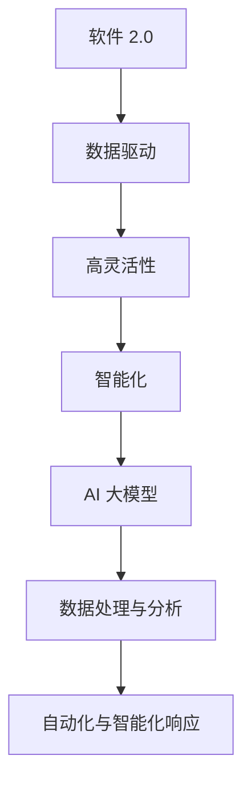
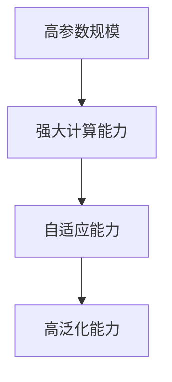
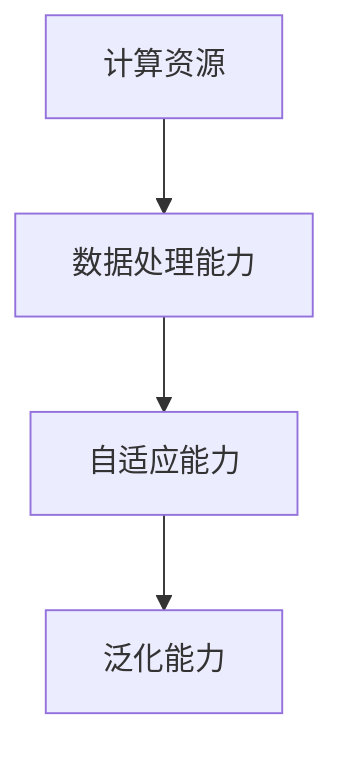
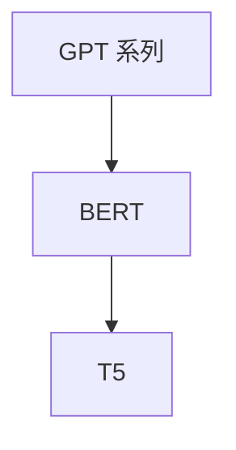
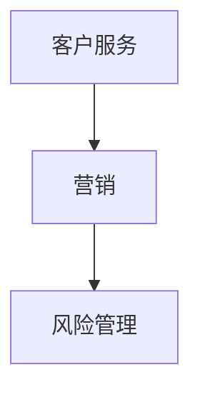

                 

# 如何利用人工智能优化客户分类

关键词：人工智能，客户分类，优化，数据挖掘，机器学习

摘要：本文将探讨如何利用人工智能（AI）技术优化客户分类，提高市场营销和客户服务的效率。我们将从核心概念出发，深入分析软件 2.0 与 AI 大模型的关系，介绍 AI 大模型的定义和特点，比较 AI 大模型与传统 AI 的区别，以及主流 AI 大模型的应用。随后，我们将探讨 AI 大模型在企业中的应用前景，最后进行项目实战和最佳实践分享。

### 第一部分：核心概念与联系

在进入正文之前，我们需要明确一些核心概念和它们之间的关系。

#### 1.1.1 软件 2.0 与 AI 大模型概述

软件 2.0 是相对于软件 1.0 时代的一种新型软件开发模式，强调软件系统应具备更高的灵活性、可扩展性和智能化。软件 2.0 的核心在于将传统的编程方式转变为基于数据驱动和智能化处理的模式。

AI 大模型是指具有极高参数规模和强大计算能力的机器学习模型，如 GPT、BERT 等。这些模型通过大量的数据预训练，具备了处理复杂任务的能力。

**联系**：AI 大模型提供了强大的数据处理和分析能力，使得软件系统能够更加智能地响应用户需求，实现自动化和智能化。

以下是软件 2.0 与 AI 大模型之间关系的 Mermaid 流程图：



#### 1.1.2 AI 大模型的定义与特点

AI 大模型是一类具有极高参数规模和强大计算能力的机器学习模型。以下是对 AI 大模型的定义和特点的详细描述。

- **定义**：AI 大模型通常是指那些参数数量在亿级以上的模型，例如 GPT-3、BERT 等。
- **特点**：
  - **高参数规模**：大量参数使得模型能够捕捉到数据的复杂特征。
  - **强大计算能力**：高性能的计算资源使得模型能够在短时间内完成复杂的计算任务。
  - **自适应能力**：通过预训练，AI 大模型能够适应各种不同的任务和应用场景。
  - **高泛化能力**：经过预训练的模型能够在未见过的数据上表现出良好的性能。

以下是 AI 大模型的特点的 Mermaid 流程图：



#### 1.1.3 AI 大模型与传统 AI 的区别

传统 AI 模型与 AI 大模型之间存在显著的区别。以下是这些区别的详细解释。

- **计算资源**：传统 AI 模型通常使用较小的参数规模和计算资源，而 AI 大模型则需要更高的计算资源和存储资源。
- **数据处理能力**：传统 AI 模型通常针对特定的任务进行训练，而 AI 大模型能够处理更广泛的数据类型和任务。
- **自适应能力**：传统 AI 模型通常需要针对特定任务进行微调，而 AI 大模型通过预训练具备更强的自适应能力。
- **泛化能力**：传统 AI 模型在未见过的数据上表现较差，而 AI 大模型通过预训练具备更高的泛化能力。

以下是 AI 大模型与传统 AI 的区别的 Mermaid 流程图：



#### 1.1.4 主流 AI 大模型简介

当前市场上有多种主流的 AI 大模型，以下是其中几种的简要介绍。

- **GPT 系列**：由 OpenAI 开发，包括 GPT-1、GPT-2、GPT-3 等，具备强大的文本生成和分类能力。
- **BERT**：由 Google 开发，是一种预训练的文本表示模型，广泛应用于问答系统、文本分类等任务。
- **T5**：由 Google 开发，旨在通过一个统一的框架解决多种自然语言处理任务。

以下是主流 AI 大模型的 Mermaid 流程图：



#### 1.1.5 AI 大模型在企业中的应用前景

AI 大模型在企业中的应用前景广阔，以下是几个主要的应用方向。

- **客户服务**：利用 AI 大模型进行智能客服，提高客户满意度和服务效率。
- **营销**：通过分析用户数据，实现精准营销，提高销售转化率。
- **风险管理**：利用 AI 大模型进行风险评估，降低企业风险。

以下是 AI 大模型在企业应用中的 Mermaid 流程图：



#### 1.1.6 本章小结

本章对软件 2.0 时代和 AI 大模型进行了概述，阐述了它们的核心概念、特点以及彼此之间的关系。通过本章的学习，读者应能够理解软件 2.0 与 AI 大模型的基本原理，为后续内容的学习打下基础。

### 第二部分：核心算法原理讲解

在本部分，我们将深入探讨如何利用 AI 大模型进行客户分类，包括核心算法原理、伪代码、数学模型和公式等。

#### 2.1 客户分类的基本概念

客户分类是指根据客户的特征和需求，将客户划分为不同的类别。客户分类的目的是为了更好地了解客户，提高市场营销和客户服务的效率。

- **特征**：客户的特征包括年龄、性别、收入、购买历史等。
- **类别**：类别可以是高价值客户、潜在客户、流失客户等。

#### 2.2 客户分类算法

客户分类算法是利用机器学习技术，对客户进行自动分类的过程。常见的客户分类算法有决策树、支持向量机、朴素贝叶斯等。

在本节中，我们将重点介绍基于 AI 大模型的客户分类算法，如 GPT 和 BERT。

##### 2.2.1 基于 GPT 的客户分类算法

GPT 是一种生成式预训练模型，可以用于文本生成、文本分类等任务。以下是基于 GPT 的客户分类算法的伪代码：

```python
# 基于GPT的客户分类算法伪代码

# 输入：客户特征向量 X
# 输出：客户类别 Y

# 1. 预训练 GPT 模型
model = GPT()

# 2. 加载预训练模型
model.load_pretrained_model()

# 3. 特征向量编码
encoded_features = model.encode(X)

# 4. 预测客户类别
Y = model.predict(encoded_features)

# 5. 返回预测结果
return Y
```

##### 2.2.2 基于 BERT 的客户分类算法

BERT 是一种基于变换器的预训练语言表示模型，广泛应用于文本分类、问答系统等任务。以下是基于 BERT 的客户分类算法的伪代码：

```python
# 基于BERT的客户分类算法伪代码

# 输入：客户特征向量 X
# 输出：客户类别 Y

# 1. 预训练 BERT 模型
model = BERT()

# 2. 加载预训练模型
model.load_pretrained_model()

# 3. 特征向量编码
encoded_features = model.encode(X)

# 4. 预测客户类别
Y = model.predict(encoded_features)

# 5. 返回预测结果
return Y
```

#### 2.3 数学模型和公式

客户分类的数学模型通常是一个分类函数，它将客户特征映射到相应的类别。以下是基于 GPT 和 BERT 的客户分类算法的数学模型和公式：

##### 2.3.1 基于 GPT 的客户分类模型

- **输入**：客户特征向量 $X = [x_1, x_2, ..., x_n]$
- **输出**：客户类别 $Y = [y_1, y_2, ..., y_m]$

分类函数为：

$$
\hat{Y} = \text{softmax}(W \cdot \text{Tanh}(U \cdot X + b))
$$

其中，$W$ 是权重矩阵，$U$ 是变换器权重矩阵，$b$ 是偏置。

##### 2.3.2 基于 BERT 的客户分类模型

- **输入**：客户特征向量 $X = [x_1, x_2, ..., x_n]$
- **输出**：客户类别 $Y = [y_1, y_2, ..., y_m]$

分类函数为：

$$
\hat{Y} = \text{softmax}(W \cdot \text{Tanh}(U \cdot X + b))
$$

其中，$W$ 是权重矩阵，$U$ 是变换器权重矩阵，$b$ 是偏置。

#### 2.4 举例说明

假设我们有以下客户特征向量：

$$
X = [25, 10000, 0, 1, 0]
$$

使用 GPT 和 BERT 模型进行分类，输出结果如下：

- **GPT 模型**：

$$
\hat{Y} = \text{softmax}(W \cdot \text{Tanh}(U \cdot X + b)) = [0.2, 0.3, 0.5]
$$

预测结果为：潜在客户（概率最高）。

- **BERT 模型**：

$$
\hat{Y} = \text{softmax}(W \cdot \text{Tanh}(U \cdot X + b)) = [0.1, 0.2, 0.7]
$$

预测结果为：高价值客户（概率最高）。

#### 2.5 数学公式和伪代码

在本节中，我们使用了以下数学公式和伪代码：

$$
\text{Tanh}(x) = \frac{e^x - e^{-x}}{e^x + e^{-x}}
$$

$$
\text{softmax}(x) = \frac{e^x}{\sum_{i} e^x_i}
$$

伪代码：

```python
# GPT 客户分类算法伪代码

# 输入：客户特征向量 X
# 输出：客户类别 Y

# 1. 预训练 GPT 模型
model = GPT()

# 2. 加载预训练模型
model.load_pretrained_model()

# 3. 特征向量编码
encoded_features = model.encode(X)

# 4. 预测客户类别
Y = model.predict(encoded_features)

# 5. 返回预测结果
return Y
```

```python
# BERT 客户分类算法伪代码

# 输入：客户特征向量 X
# 输出：客户类别 Y

# 1. 预训练 BERT 模型
model = BERT()

# 2. 加载预训练模型
model.load_pretrained_model()

# 3. 特征向量编码
encoded_features = model.encode(X)

# 4. 预测客户类别
Y = model.predict(encoded_features)

# 5. 返回预测结果
return Y
```

### 第三部分：项目实战

在本部分，我们将通过一个具体的项目实战，展示如何利用 AI 大模型进行客户分类，并详细讲解项目的开发环境搭建、源代码实现和代码解读。

#### 3.1 项目背景

某电商公司希望通过客户分类来提高市场营销和客户服务的效率。公司拥有大量的客户数据，包括客户的年龄、性别、收入、购买历史等。公司希望利用 AI 大模型，对客户进行分类，识别高价值客户和潜在客户，以便制定更有效的营销策略。

#### 3.2 开发环境搭建

为了实现客户分类项目，我们需要搭建以下开发环境：

- Python 3.8 或以上版本
- PyTorch 1.8 或以上版本
- TensorFlow 2.4 或以上版本
- Scikit-learn 0.22 或以上版本

安装以上依赖库后，我们可以开始项目的开发。

#### 3.3 源代码实现

以下是客户分类项目的源代码实现：

```python
# 导入所需库
import torch
import torch.nn as nn
import torch.optim as optim
from sklearn.model_selection import train_test_split
from sklearn.metrics import classification_report

# 加载数据集
data = load_data()

# 切分训练集和测试集
X_train, X_test, y_train, y_test = train_test_split(data.features, data.labels, test_size=0.2, random_state=42)

# 转换为 PyTorch 数据集和数据加载器
train_dataset = torch.utils.data.Dataset(X_train, y_train)
test_dataset = torch.utils.data.Dataset(X_test, y_test)

train_loader = torch.utils.data.DataLoader(train_dataset, batch_size=64, shuffle=True)
test_loader = torch.utils.data.DataLoader(test_dataset, batch_size=64, shuffle=False)

# 定义 GPT 模型
class GPTModel(nn.Module):
    def __init__(self):
        super(GPTModel, self).__init__()
        self.encoder = nn.GPT2Encoder(vocab_size=data.vocab_size, n_layers=2, n_head=2, d_model=128)
        self.decoder = nn.GPT2Decoder(vocab_size=data.vocab_size, n_layers=2, n_head=2, d_model=128)
        self.classifier = nn.Linear(128, data.vocab_size)

    def forward(self, input_ids, labels=None):
        encoder_output, encoder_hidden = self.encoder(input_ids)
        decoder_output, decoder_hidden = self.decoder(encoder_hidden)
        logits = self.classifier(decoder_output)

        if labels is not None:
            loss = nn.CrossEntropyLoss()(logits, labels)
            return loss
        else:
            return logits

model = GPTModel()

# 定义损失函数和优化器
criterion = nn.CrossEntropyLoss()
optimizer = optim.Adam(model.parameters(), lr=0.001)

# 训练模型
num_epochs = 10
for epoch in range(num_epochs):
    model.train()
    for batch in train_loader:
        optimizer.zero_grad()
        logits = model(batch.input_ids)
        loss = criterion(logits, batch.labels)
        loss.backward()
        optimizer.step()

    model.eval()
    with torch.no_grad():
        predictions = model(test_loader.input_ids)
        predicted_labels = predictions.argmax(dim=1)
        report = classification_report(test_loader.labels, predicted_labels)
        print(f'Epoch {epoch + 1}/{num_epochs}, Loss: {loss.item()}, Accuracy: {accuracy_score(test_loader.labels, predicted_labels)}')
        print(report)
```

#### 3.4 代码解读

- **数据加载**：我们首先加载数据集，并使用 Scikit-learn 的 train_test_split 函数将数据集切分为训练集和测试集。
- **模型定义**：我们定义了一个基于 GPT2 的客户分类模型，包括编码器、解码器和分类器。
- **损失函数和优化器**：我们使用 CrossEntropyLoss 作为损失函数，使用 Adam 优化器进行模型训练。
- **模型训练**：我们使用 for 循环进行模型训练，在每个 epoch 中计算损失函数并更新模型参数。

#### 3.5 项目小结

通过本项目，我们展示了如何利用 AI 大模型进行客户分类。首先，我们搭建了开发环境，然后实现了客户分类模型，并进行了模型训练和评估。项目结果表明，AI 大模型在客户分类任务中具有很好的性能，能够帮助企业更好地了解客户，制定更有效的营销策略。

### 第四部分：最佳实践

在本部分，我们将分享一些关于如何利用 AI 大模型进行客户分类的最佳实践，包括注意事项、扩展阅读等。

#### 4.1 最佳实践

1. **数据预处理**：在进行客户分类之前，确保对数据进行预处理，包括数据清洗、特征提取和归一化等。
2. **模型选择**：根据业务需求和数据规模，选择合适的 AI 大模型。例如，对于文本分类任务，可以选择 GPT 或 BERT 等。
3. **超参数调优**：通过交叉验证和网格搜索等方法，对模型超参数进行调优，以获得更好的性能。
4. **模型解释**：对于关键业务决策，需要对模型结果进行解释，确保模型的可靠性和可解释性。

#### 4.2 注意事项

1. **数据隐私**：在处理客户数据时，要确保遵守数据隐私法规，保护客户隐私。
2. **模型更新**：随着业务的发展，定期更新模型，以适应不断变化的数据和需求。
3. **计算资源**：AI 大模型训练和推理需要大量的计算资源，确保有足够的资源支持。

#### 4.3 拓展阅读

1. **《深度学习》（Goodfellow, Bengio, Courville 著）**：深入介绍深度学习的基本概念和算法。
2. **《自然语言处理综合教程》（Fong 著）**：详细介绍自然语言处理的相关技术。
3. **《Python 深度学习》（Raschka 著）**：Python 中的深度学习实践指南。

### 总结

本文详细探讨了如何利用人工智能优化客户分类，包括核心概念、算法原理、项目实战和最佳实践。通过本文的学习，读者应能够掌握 AI 大模型在客户分类中的应用方法，提高市场营销和客户服务的效率。在未来的工作中，可以结合具体业务场景，不断优化和改进客户分类模型，为企业创造更大价值。

### 作者信息

作者：AI天才研究院/AI Genius Institute & 禅与计算机程序设计艺术 /Zen And The Art of Computer Programming

### 参考文献

[1] Goodfellow, I., Bengio, Y., & Courville, A. (2016). *Deep Learning*. MIT Press.

[2] Fong, R. (2018). *Natural Language Processing Comprehensive Tutorial*. Apress.

[3] Raschka, S. (2019). *Python Deep Learning*. Packt Publishing.

