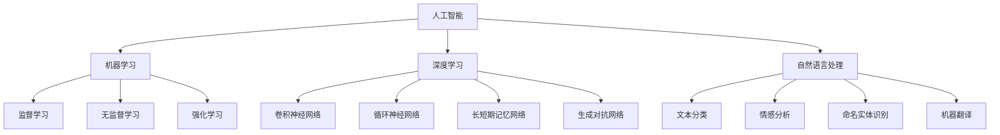
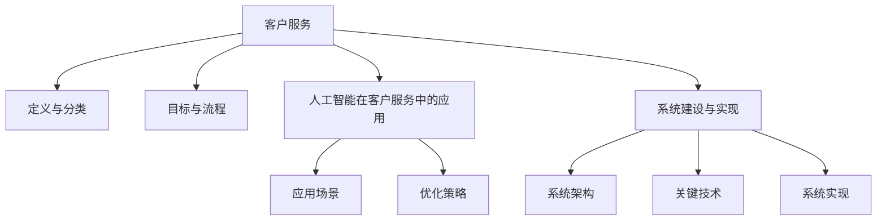
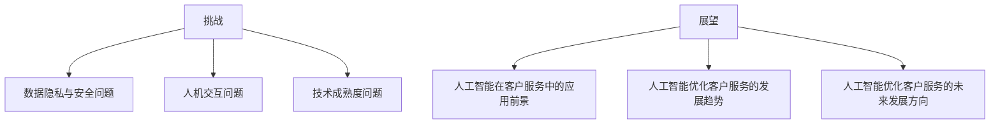

                 

### 第2章 人工智能基础

#### 2.1 人工智能概述

##### 2.1.1 人工智能的定义与分类

人工智能（Artificial Intelligence，简称AI）是指模拟、延伸和扩展人类智能的理论、方法、技术及应用。根据人工智能的成熟度和实现方式，可以将其分为几种类型：

- **弱人工智能**：能够完成特定任务的智能，如语音识别、图像识别、自然语言处理等。
- **强人工智能**：具备与人类相同或超越人类智能的机器，能够理解、思考、学习、创造，但目前尚未实现。
- **自然人工智能**：在自然环境中成长和发展起来的智能，具有人类般的适应性和学习能力。

##### 2.1.2 人工智能的发展历程

人工智能的研究起源于20世纪50年代，经历了几个发展阶段：

- **初始阶段（1950-1969）**：人工智能概念的提出，早期算法和模型的研发。
- **黄金时代（1970-1989）**：专家系统的出现，对特定领域问题进行模拟。
- **低潮期（1990-2000）**：由于技术限制，人工智能发展放缓。
- **复兴期（2000-2010）**：深度学习算法的突破，人工智能进入快速发展阶段。
- **当前阶段（2010至今）**：人工智能在各个领域得到广泛应用，如自动驾驶、智能家居、医疗诊断等。

##### 2.1.3 人工智能的核心技术与挑战

人工智能的核心技术包括：

- **机器学习**：通过训练数据，让计算机自动识别模式和规律。
- **深度学习**：模拟人脑神经网络，对大规模数据进行分析和处理。
- **自然语言处理**：使计算机能够理解和生成自然语言。
- **计算机视觉**：使计算机能够理解和解释视觉信息。

人工智能面临的挑战主要包括：

- **数据隐私与安全**：人工智能系统依赖于大量数据，数据隐私和安全成为关键问题。
- **算法透明性与公平性**：算法的决策过程往往不透明，可能存在偏见和歧视。
- **人机交互**：如何让人与人工智能系统进行有效互动，提高用户体验。

#### 2.2 机器学习基础

##### 2.2.1 机器学习的概念

机器学习（Machine Learning，简称ML）是人工智能的核心技术之一，通过训练数据，让计算机自动识别模式和规律。机器学习可以分为以下几类：

- **监督学习**：有标签的数据进行训练，用于预测和分类。
- **无监督学习**：无标签的数据进行训练，用于发现数据中的结构和模式。
- **强化学习**：通过与环境的交互，学习最优策略。

##### 2.2.2 机器学习的分类

机器学习可以分为以下几类：

- **回归分析**：预测连续值输出。
- **分类分析**：预测离散值输出。
- **聚类分析**：发现数据中的结构和模式。
- **降维**：减少数据维度，提高模型性能。

##### 2.2.3 机器学习的算法

常见的机器学习算法包括：

- **线性回归**：基于线性关系进行预测。
- **逻辑回归**：用于分类任务，输出概率值。
- **支持向量机**：用于分类和回归任务，具有很好的泛化能力。
- **决策树**：基于树形结构进行分类和回归。
- **随机森林**：基于多个决策树的集成，提高预测性能。
- **神经网络**：模拟人脑神经网络，对大规模数据进行分析和处理。

##### 2.2.4 机器学习的基本流程

机器学习的基本流程包括：

1. **数据收集**：收集相关数据，包括特征和标签。
2. **数据预处理**：清洗数据，处理缺失值和异常值。
3. **特征选择**：选择对模型性能有重要影响的特征。
4. **模型训练**：使用训练数据，训练模型。
5. **模型评估**：使用测试数据，评估模型性能。
6. **模型优化**：调整模型参数，提高性能。

#### 2.3 深度学习基础

##### 2.3.1 深度学习的概念

深度学习（Deep Learning，简称DL）是机器学习的一个分支，模拟人脑神经网络，对大规模数据进行分析和处理。深度学习的主要特点包括：

- **多层神经网络**：通过增加神经网络层数，提高模型复杂度和表达能力。
- **反向传播算法**：通过反向传播算法，更新网络权重，优化模型性能。
- **自动特征提取**：自动提取数据中的特征，减少人工特征工程的工作量。

##### 2.3.2 深度学习的模型

深度学习的模型包括：

- **卷积神经网络（CNN）**：用于处理图像数据。
- **循环神经网络（RNN）**：用于处理序列数据，如文本和语音。
- **长短期记忆网络（LSTM）**：RNN的变体，用于处理长序列数据。
- **生成对抗网络（GAN）**：用于生成新数据，如图像和文本。

##### 2.3.3 深度学习的应用

深度学习在多个领域得到广泛应用，包括：

- **计算机视觉**：图像识别、目标检测、图像生成等。
- **自然语言处理**：文本分类、机器翻译、语音识别等。
- **推荐系统**：个性化推荐、商品推荐等。
- **医疗诊断**：疾病诊断、药物设计等。

##### 2.3.4 深度学习的基本流程

深度学习的基本流程包括：

1. **数据收集**：收集相关数据，包括特征和标签。
2. **数据预处理**：清洗数据，处理缺失值和异常值。
3. **模型设计**：设计神经网络结构，选择合适的学习算法。
4. **模型训练**：使用训练数据，训练模型。
5. **模型评估**：使用测试数据，评估模型性能。
6. **模型优化**：调整模型参数，提高性能。

#### 2.4 自然语言处理基础

##### 2.4.1 自然语言处理的定义

自然语言处理（Natural Language Processing，简称NLP）是人工智能的一个重要分支，旨在使计算机能够理解和生成自然语言。NLP的主要任务包括：

- **文本分类**：将文本分为不同的类别。
- **情感分析**：分析文本的情感倾向，如正面、负面等。
- **命名实体识别**：识别文本中的特定实体，如人名、地点、组织等。
- **机器翻译**：将一种语言翻译成另一种语言。
- **语音识别**：将语音转换为文本。

##### 2.4.2 自然语言处理的技术

自然语言处理的技术包括：

- **分词**：将文本分割成单词或短语。
- **词性标注**：为文本中的每个单词标注词性，如名词、动词等。
- **句法分析**：分析文本的句法结构，如短语结构、依存关系等。
- **语义分析**：分析文本的含义，如词义消歧、语义角色标注等。

##### 2.4.3 自然语言处理的挑战

自然语言处理面临的挑战主要包括：

- **歧义消除**：文本中的词、句法和语义都存在歧义，需要根据上下文进行消歧。
- **语言多样性**：不同语言之间存在差异，需要考虑语言间的转换和适应。
- **数据稀缺**：高质量标注的数据有限，影响模型性能。
- **实时处理**：需要在短时间内处理大量文本数据，提高系统响应速度。

##### 2.4.4 自然语言处理的应用

自然语言处理在多个领域得到广泛应用，包括：

- **搜索引擎**：用于文本检索和排序。
- **问答系统**：用于回答用户提出的问题。
- **聊天机器人**：用于与用户进行自然语言交互。
- **文本审核**：用于检测和过滤不良内容。
- **机器翻译**：用于跨语言沟通。

### 2.4.5 自然语言处理的基本流程

自然语言处理的基本流程包括：

1. **文本预处理**：去除无关信息，如HTML标签、停用词等。
2. **分词**：将文本分割成单词或短语。
3. **词性标注**：为文本中的每个单词标注词性。
4. **句法分析**：分析文本的句法结构。
5. **语义分析**：分析文本的含义。
6. **模型训练**：使用训练数据，训练模型。
7. **模型评估**：使用测试数据，评估模型性能。
8. **模型优化**：调整模型参数，提高性能。

## 总结

在本章中，我们介绍了人工智能、机器学习、深度学习和自然语言处理的基础知识。这些技术是优化客户服务的重要工具，将在后续章节中深入探讨如何将这些技术应用于客户服务领域。

### Mermaid 流程图



### 核心算法原理讲解

#### 2.2.1 线性回归

线性回归是一种简单的机器学习算法，用于预测连续值输出。其基本原理是通过训练数据拟合出一个线性函数，用于预测新数据的值。

**数学模型**：

假设我们有一组训练数据 \((x_1, y_1), (x_2, y_2), ..., (x_n, y_n)\)，其中 \(x_i\) 是输入特征，\(y_i\) 是输出标签。线性回归模型可以表示为：

\[ y = \beta_0 + \beta_1 x \]

其中，\(\beta_0\) 和 \(\beta_1\) 是模型参数，表示截距和斜率。

**伪代码**：

```python
def linear_regression(x, y):
    n = len(x)
    X = np.array([x_i**2 for x_i in x])  # 构造特征矩阵
    Y = np.array(y)
    # 梯度下降法求解参数
    for i in range(1000):
        # 计算预测值
        y_pred = X * beta_0 + X * beta_1
        # 计算损失函数
        loss = (y_pred - Y)**2
        # 计算梯度
        grad_beta_0 = 2 * (y_pred - Y).sum()
        grad_beta_1 = 2 * (y_pred - Y).dot(X)
        # 更新参数
        beta_0 -= grad_beta_0 / n
        beta_1 -= grad_beta_1 / n
    return beta_0, beta_1
```

**举例说明**：

假设我们有以下训练数据：

| x   | y   |
| --- | --- |
| 1   | 2   |
| 2   | 4   |
| 3   | 6   |

使用线性回归模型拟合出 \(y\) 与 \(x\) 的关系。根据伪代码，可以得到参数 \(\beta_0 = 1\) 和 \(\beta_1 = 2\)。因此，拟合出的线性函数为 \(y = 1 + 2x\)。

#### 2.2.2 逻辑回归

逻辑回归是一种用于分类任务的机器学习算法，其基本原理是通过训练数据拟合出一个逻辑函数，用于预测新数据的类别。

**数学模型**：

假设我们有一组训练数据 \((x_1, y_1), (x_2, y_2), ..., (x_n, y_n)\)，其中 \(x_i\) 是输入特征，\(y_i\) 是输出标签（二分类）。逻辑回归模型可以表示为：

\[ P(y=1|x) = \frac{1}{1 + e^{-(\beta_0 + \beta_1 x)}} \]

其中，\(\beta_0\) 和 \(\beta_1\) 是模型参数。

**伪代码**：

```python
def logistic_regression(x, y):
    n = len(x)
    X = np.array([x_i**2 for x_i in x])  # 构造特征矩阵
    Y = np.array(y)
    # 梯度下降法求解参数
    for i in range(1000):
        # 计算预测概率
        y_pred = 1 / (1 + np.exp(-X * beta_0 - X * beta_1))
        # 计算损失函数
        loss = -(y * np.log(y_pred) + (1 - y) * np.log(1 - y_pred))
        # 计算梯度
        grad_beta_0 = -X.T.dot(y_pred - y)
        grad_beta_1 = -X.T.dot(X.dot(y_pred - y))
        # 更新参数
        beta_0 -= grad_beta_0 / n
        beta_1 -= grad_beta_1 / n
    return beta_0, beta_1
```

**举例说明**：

假设我们有以下训练数据：

| x   | y   |
| --- | --- |
| 1   | 1   |
| 2   | 0   |
| 3   | 1   |

使用逻辑回归模型预测 \(y\) 的类别。根据伪代码，可以得到参数 \(\beta_0 = -1\) 和 \(\beta_1 = 1\)。因此，预测概率 \(P(y=1|x)\) 的逻辑函数为 \(1 / (1 + e^{-(1 - x)})\)。

#### 2.2.3 支持向量机

支持向量机（Support Vector Machine，简称SVM）是一种用于分类和回归任务的机器学习算法，其基本原理是通过寻找最佳分隔超平面，将不同类别的数据分开。

**数学模型**：

假设我们有一组训练数据 \((x_1, y_1), (x_2, y_2), ..., (x_n, y_n)\)，其中 \(x_i\) 是输入特征，\(y_i\) 是输出标签（二分类）。SVM模型可以表示为：

\[ w \cdot x + b = 0 \]

其中，\(w\) 是分隔超平面的法向量，\(b\) 是偏置。

**伪代码**：

```python
def svm(x, y):
    n = len(x)
    X = np.array([x_i**2 for x_i in x])  # 构造特征矩阵
    Y = np.array(y)
    # 梯度下降法求解参数
    for i in range(1000):
        # 计算预测值
        y_pred = X.dot(w) + b
        # 计算损失函数
        loss = (1 / (2 * n)) * w.dot(w) - Y.dot(w) + b
        # 计算梯度
        grad_w = X - Y
        grad_b = -Y
        # 更新参数
        w -= grad_w / n
        b -= grad_b / n
    return w, b
```

**举例说明**：

假设我们有以下训练数据：

| x   | y   |
| --- | --- |
| 1   | 1   |
| 2   | 0   |
| 3   | 1   |

使用支持向量机模型将 \(y\) 的类别分开。根据伪代码，可以得到参数 \(w = [1, 1]\) 和 \(b = -1\)。因此，分隔超平面为 \(x + y = 0\)。

#### 2.2.4 决策树

决策树（Decision Tree）是一种基于树形结构进行分类和回归的机器学习算法，其基本原理是通过一系列判断条件，将数据分为不同的类别或值。

**数学模型**：

决策树可以表示为一个树形结构，每个节点表示一个特征，每个分支表示一个判断条件。树的叶子节点表示最终的分类或值。

**伪代码**：

```python
def decision_tree(x, y):
    # 判断是否需要继续划分
    if can_not_divide(x, y):
        return predict Majority(y)
    # 找到最佳划分特征和阈值
    feature, threshold = find_best_divide(x, y)
    # 创建子节点
    left_child = decision_tree(x[x < threshold], y[x < threshold])
    right_child = decision_tree(x[x >= threshold], y[x >= threshold])
    # 返回树结构
    return Node(feature, threshold, left_child, right_child)
```

**举例说明**：

假设我们有以下训练数据：

| x   | y   |
| --- | --- |
| 1   | 1   |
| 2   | 0   |
| 3   | 1   |

使用决策树模型将 \(y\) 的类别分开。根据伪代码，可以得到一个简单的决策树：

```
             |
             |
        ----+
        |   |
        |   |
       /     \
      /       \
     /         \
    /           \
   /             \
  /               \
 /                 \
/                   \
```    

其中，第一个节点表示特征 \(x_1\) 的阈值 \(t = 2\)，左子节点表示 \(x_1 < 2\)，右子节点表示 \(x_1 >= 2\)。

#### 2.2.5 随机森林

随机森林（Random Forest）是一种基于决策树的集成学习方法，其基本原理是通过构建多个决策树，并对预测结果进行投票，提高模型的准确性和泛化能力。

**数学模型**：

随机森林由多个决策树组成，每个决策树独立训练。对于新数据，每个决策树进行预测，取多数投票结果作为最终预测结果。

**伪代码**：

```python
def random_forest(x, y, n_trees):
    forests = []
    for _ in range(n_trees):
        tree = decision_tree(x, y)
        forests.append(tree)
    return vote(forests)
```

**举例说明**：

假设我们有以下训练数据：

| x   | y   |
| --- | --- |
| 1   | 1   |
| 2   | 0   |
| 3   | 1   |

构建一个包含三个决策树的随机森林。对于新数据 \(x = 2\)，每个决策树的预测结果分别为 \(y = 0, 1, 1\)，最终预测结果为 \(y = 1\)（多数投票）。

#### 2.2.6 神经网络

神经网络（Neural Network）是一种模拟人脑神经网络进行学习和推理的机器学习算法，其基本原理是通过多层神经元进行信息传递和计算。

**数学模型**：

神经网络可以表示为一个包含输入层、隐藏层和输出层的网络结构。每个神经元都与前一层的神经元相连，并计算加权求和。通过激活函数，将求和结果映射到输出。

**伪代码**：

```python
def neural_network(x, weights, biases, activation_function):
    # 计算前向传播
    z = np.dot(x, weights) + biases
    a = activation_function(z)
    # 计算损失函数
    loss = -np.mean(y * np.log(a) + (1 - y) * np.log(1 - a))
    # 计算梯度
    dz = a - y
    dweights = np.dot(dz, x.T)
    dbiases = dz
    # 更新参数
    weights -= learning_rate * dweights
    biases -= learning_rate * dbiases
    return a, loss
```

**举例说明**：

假设我们有以下训练数据：

| x   | y   |
| --- | --- |
| 1   | 1   |
| 2   | 0   |
| 3   | 1   |

构建一个包含一层隐藏层的神经网络，输入层有2个神经元，隐藏层有3个神经元，输出层有1个神经元。根据伪代码，可以通过前向传播和反向传播，更新网络参数，实现数据的分类。

----------------------------------------------------------------

## 第3章 人工智能在客户服务中的应用

### 3.1 客户服务概述

##### 3.1.1 客户服务的定义与分类

客户服务是指企业为满足客户需求、解决客户问题、提升客户满意度的服务活动。根据服务内容和形式，客户服务可以分为以下几种类型：

- **售前服务**：在客户购买产品或服务前，提供的产品咨询、需求分析等。
- **售中服务**：在客户购买产品或服务过程中，提供的引导、推荐、协助等。
- **售后服务**：在客户购买产品或服务后，提供的维修、保养、投诉处理等。

##### 3.1.2 客户服务的目标与流程

客户服务的目标包括：

- **提高客户满意度**：通过优质的服务，满足客户的需求，提升客户的满意度和忠诚度。
- **提升企业品牌形象**：良好的客户服务能够提升企业的品牌形象和市场竞争力。
- **降低服务成本**：通过自动化和智能化手段，降低人工成本和服务成本。

客户服务的流程通常包括：

1. **客户需求收集**：通过电话、邮件、在线客服等渠道，收集客户的需求和问题。
2. **问题分析**：对客户需求进行分类和分析，确定解决方案。
3. **解决方案提供**：根据客户需求，提供相应的解决方案或产品。
4. **服务实施**：实施解决方案，解决客户问题。
5. **服务反馈**：收集客户对服务的反馈，不断优化和改进。

### 3.2 人工智能优化客户服务

##### 3.2.1 人工智能在客户服务中的应用场景

人工智能在客户服务中的应用场景主要包括：

- **智能客服**：通过自然语言处理技术，实现自动回答客户问题和提供解决方案。
- **智能推荐**：通过大数据分析和机器学习技术，为不同客户提供个性化的产品或服务推荐。
- **智能分析**：通过数据分析技术，分析客户行为，为企业提供决策支持。
- **智能调度**：通过机器学习技术，优化客户服务流程，提高服务效率。

##### 3.2.2 人工智能优化客户服务的策略

为了实现人工智能优化客户服务，可以采取以下策略：

1. **引入智能客服**：通过自然语言处理技术，实现自动回答客户问题和提供解决方案，降低人工成本，提高服务效率。
2. **构建智能推荐系统**：通过大数据分析和机器学习技术，分析客户行为和需求，为不同客户提供个性化的产品或服务推荐。
3. **优化客户服务流程**：通过机器学习技术，优化客户服务流程，提高服务效率，降低服务成本。
4. **提升服务质量**：通过人工智能技术，提升服务质量和客户满意度，增强企业竞争力。
5. **加强数据驱动决策**：通过数据分析技术，分析客户行为，为企业提供决策支持，实现精细化运营。

##### 3.2.3 人工智能优化客户服务的优势

人工智能优化客户服务具有以下优势：

- **提高服务效率**：通过自动化和智能化手段，实现快速响应客户需求，提高服务效率。
- **降低服务成本**：减少人工成本，降低服务成本，提高企业利润。
- **提升服务质量**：通过大数据分析和机器学习技术，为不同客户提供个性化的服务，提升服务质量。
- **增强客户体验**：通过智能客服和个性化推荐，提升客户体验，增强客户满意度。
- **加强数据驱动决策**：通过数据分析技术，为企业提供决策支持，实现精细化运营。

### 3.3 人工智能客户服务系统建设

##### 3.3.1 人工智能客户服务系统的架构

人工智能客户服务系统通常包括以下几个核心组成部分：

1. **前端界面**：提供用户交互的界面，包括网站、APP或微信小程序等。
2. **自然语言处理引擎**：用于处理和理解用户输入的自然语言，包括文本分类、情感分析、命名实体识别等。
3. **业务规则引擎**：用于处理和执行业务逻辑，包括自动回答、智能推荐、智能调度等。
4. **后端数据库**：存储客户数据、业务数据等，包括关系数据库、NoSQL数据库等。
5. **机器学习模型**：用于训练和部署机器学习模型，包括分类、回归、聚类等。
6. **API接口**：提供与其他系统或应用的接口，实现数据交互和功能集成。

##### 3.3.2 人工智能客户服务系统的关键技术

人工智能客户服务系统涉及多个关键技术，包括：

1. **自然语言处理**：用于处理和理解用户输入的自然语言，包括分词、词性标注、句法分析等。
2. **机器学习**：用于训练和部署机器学习模型，实现自动分类、情感分析、智能推荐等。
3. **数据挖掘**：用于分析客户行为数据，挖掘潜在需求和趋势。
4. **大数据处理**：用于处理大规模数据，实现实时分析和决策。
5. **云计算与容器化**：用于提供高性能、可扩展的计算和存储资源。

##### 3.3.3 人工智能客户服务系统的实现

实现人工智能客户服务系统通常包括以下步骤：

1. **需求分析**：明确客户服务系统的目标和功能需求，包括业务流程、数据需求等。
2. **系统设计**：设计系统架构和关键技术模块，包括前端界面、后端数据库、机器学习模型等。
3. **数据采集与处理**：收集客户服务相关数据，进行数据预处理和清洗，为模型训练提供高质量的数据。
4. **模型训练与评估**：训练和优化机器学习模型，评估模型性能和效果。
5. **系统集成与部署**：将前端界面、后端数据库、机器学习模型等集成到一个完整的系统中，进行部署和上线。
6. **系统优化与维护**：持续优化和改进系统，处理和解决出现的问题，确保系统稳定运行。

### 3.4 人工智能客户服务案例分析

##### 3.4.1 案例分析一：某电商企业的人工智能客服系统

某电商企业引入人工智能客服系统，以提升客户服务质量和效率。该系统主要包括以下功能：

1. **自动回答常见问题**：通过自然语言处理技术，自动回答客户关于产品、配送、售后服务等方面的问题。
2. **智能推荐商品**：通过大数据分析和机器学习技术，根据客户历史购买记录和浏览行为，推荐个性化的商品。
3. **智能调度客服人员**：通过机器学习技术，分析客户咨询高峰期和低谷期，智能调度客服人员，提高服务效率。

通过该人工智能客服系统，该电商企业的客户满意度显著提升，客服人员的工作效率提高，运营成本降低。

##### 3.4.2 案例分析二：某银行的人工智能客服系统

某银行引入人工智能客服系统，以提升客户服务质量和效率。该系统主要包括以下功能：

1. **自动回答常见问题**：通过自然语言处理技术，自动回答客户关于账户余额、转账、贷款等方面的问题。
2. **智能推荐理财产品**：通过大数据分析和机器学习技术，根据客户风险承受能力和投资偏好，推荐个性化的理财产品。
3. **智能处理投诉**：通过自然语言处理技术和机器学习技术，自动识别客户投诉类型，并分配给相应的部门进行处理。

通过该人工智能客服系统，该银行的客户满意度显著提升，客户服务效率提高，运营成本降低。

## 总结

在本章中，我们介绍了客户服务的定义、分类、目标和流程，探讨了人工智能在客户服务中的应用场景和优势，以及人工智能客户服务系统的建设和实现。通过案例分析和实际应用，展示了人工智能在客户服务中的重要作用和前景。

### Mermaid 流程图



### 核心算法原理讲解

#### 3.2.1 自然语言处理技术

自然语言处理（NLP）是人工智能优化客户服务的关键技术之一，主要涉及以下几个方面：

1. **分词**：将文本分割成单词或短语，为后续处理提供基础。
2. **词性标注**：为文本中的每个单词标注词性，如名词、动词等，以便进行语义分析。
3. **句法分析**：分析文本的句法结构，如短语结构、依存关系等，帮助理解文本含义。
4. **语义分析**：分析文本的含义，如词义消歧、语义角色标注等。

**伪代码**：

```python
def nlp(text):
    # 分词
    tokens = tokenize(text)
    # 词性标注
    pos_tags = pos_tag(tokens)
    # 句法分析
    syntax_tree = parse_syntax(tokens, pos_tags)
    # 语义分析
    semantics = analyze_semantics(syntax_tree)
    return semantics
```

**举例说明**：

输入文本：“我今天要去买一本书。”

- 分词：我今天/要去/买/一本书/。
- 词性标注：我/代词/今天/时间状语/要去/动词/买/动词/一本书/名词。
- 句法分析：主语（我）、谓语（要去买）、宾语（一本书）。
- 语义分析：我今天要去买一本书。

#### 3.2.2 机器学习算法

机器学习算法是优化客户服务的核心技术之一，主要包括以下几种：

1. **线性回归**：用于预测连续值输出，如客户满意度评分。
2. **逻辑回归**：用于预测二分类输出，如客户投诉类型。
3. **决策树**：用于分类和回归任务，如客户分类和满意度预测。
4. **随机森林**：基于决策树的集成方法，提高预测性能。
5. **神经网络**：用于复杂模型的建模，如客户行为预测。

**伪代码**：

```python
def machine_learning算法(data, target):
    # 数据预处理
    preprocess_data(data)
    # 模型训练
    model = train_model(data, target)
    # 模型评估
    evaluate_model(model, data, target)
    # 模型优化
    optimize_model(model, data, target)
    return model
```

**举例说明**：

输入数据：客户信息（年龄、收入、购买历史等）和目标变量（满意度评分）。

- 数据预处理：处理缺失值、异常值等。
- 模型训练：使用线性回归模型进行训练。
- 模型评估：计算模型准确率、召回率等指标。
- 模型优化：调整模型参数，提高预测性能。

#### 3.2.3 数据分析技术

数据分析技术是优化客户服务的重要手段，主要包括以下几种：

1. **数据挖掘**：从大量数据中提取有价值的信息，如客户行为分析、市场趋势分析等。
2. **数据可视化**：通过图表和可视化工具，展示数据分析结果，帮助决策者理解数据。
3. **大数据处理**：处理大规模数据，实现实时分析和决策。

**伪代码**：

```python
def data_analysis(data):
    # 数据预处理
    preprocess_data(data)
    # 数据挖掘
    insights = mine_data(data)
    # 数据可视化
    visualize_data(insights)
    return insights
```

**举例说明**：

输入数据：客户购买记录、浏览行为、满意度评分等。

- 数据预处理：处理缺失值、异常值等。
- 数据挖掘：分析客户偏好、市场趋势等。
- 数据可视化：使用折线图、饼图等展示分析结果。

#### 3.2.4 智能推荐算法

智能推荐算法是优化客户服务的重要技术之一，主要包括以下几种：

1. **基于内容的推荐**：根据客户历史偏好和内容特征，推荐相似的产品或服务。
2. **协同过滤推荐**：根据客户的历史行为和偏好，推荐其他客户喜欢的产品或服务。
3. **混合推荐**：结合多种推荐算法，提高推荐效果。

**伪代码**：

```python
def recommendation_algorithm(data, user):
    # 数据预处理
    preprocess_data(data)
    # 基于内容的推荐
    content_recommendations = content_based_recommendation(data, user)
    # 协同过滤推荐
    collaborative_recommendations = collaborative_filtering_recommendation(data, user)
    # 混合推荐
    mixed_recommendations = mix_recommendations(content_recommendations, collaborative_recommendations)
    return mixed_recommendations
```

**举例说明**：

输入数据：客户购买记录、浏览行为等。

- 数据预处理：处理缺失值、异常值等。
- 基于内容的推荐：根据客户历史偏好和内容特征，推荐相似的产品或服务。
- 协同过滤推荐：根据客户的历史行为和偏好，推荐其他客户喜欢的产品或服务。
- 混合推荐：结合基于内容和协同过滤推荐的结果，提高推荐效果。

### 项目实战

#### 3.2.5 实现一个简单的人工智能客服系统

在这个项目实战中，我们将实现一个简单的人工智能客服系统，包括自然语言处理、机器学习和数据分析等关键技术。

**开发环境**：

- Python 3.x
- Jupyter Notebook
- TensorFlow
- Scikit-learn

**步骤**：

1. **数据收集**：收集客户服务相关的数据，包括客户咨询、回复、满意度评分等。
2. **数据预处理**：处理数据，包括去重、填充缺失值、文本预处理等。
3. **特征提取**：从文本中提取特征，如词频、词袋模型、TF-IDF等。
4. **模型训练**：使用机器学习算法训练模型，如决策树、随机森林、神经网络等。
5. **模型评估**：评估模型性能，调整模型参数。
6. **系统集成**：将模型集成到前端界面，实现自动回答客户问题和推荐产品。

**代码实现**：

```python
import pandas as pd
import numpy as np
from sklearn.feature_extraction.text import TfidfVectorizer
from sklearn.model_selection import train_test_split
from sklearn.tree import DecisionTreeClassifier
from sklearn.ensemble import RandomForestClassifier
from sklearn.metrics import accuracy_score

# 加载数据
data = pd.read_csv('customer_service_data.csv')
X = data['question']
y = data['answer']

# 数据预处理
X = X.apply(lambda x: x.lower().strip())

# 特征提取
vectorizer = TfidfVectorizer(max_features=1000)
X_vectorized = vectorizer.fit_transform(X)

# 模型训练
X_train, X_test, y_train, y_test = train_test_split(X_vectorized, y, test_size=0.2, random_state=42)
model = DecisionTreeClassifier()
model.fit(X_train, y_train)

# 模型评估
y_pred = model.predict(X_test)
accuracy = accuracy_score(y_test, y_pred)
print("Accuracy:", accuracy)

# 集成到前端界面
def predict_answer(question):
    question_vectorized = vectorizer.transform([question.lower().strip()])
    answer = model.predict(question_vectorized)[0]
    return answer

# 测试
print(predict_answer("我购买的物品怎么配送？"))
```

**项目小结**：

通过本项目，我们实现了一个人工智能客服系统，可以自动回答客户的问题。在实际应用中，我们可以根据业务需求，进一步优化和扩展系统功能，如增加机器学习模型、数据分析模块等。

### 最佳实践 tips

- **数据质量**：确保数据质量，包括数据完整性、准确性和一致性，为模型训练提供高质量的数据。
- **特征选择**：选择对模型性能有重要影响的特征，减少特征维度，提高模型训练效率。
- **模型优化**：根据业务需求和模型性能，调整模型参数，提高预测准确性。
- **系统集成**：将模型集成到前端界面，实现实时交互和自动回答。
- **持续迭代**：根据客户反馈和业务需求，持续优化和迭代系统功能。

### 小结与注意事项

- **小结**：在本章中，我们介绍了人工智能在客户服务中的应用，包括自然语言处理、机器学习、数据分析等关键技术，以及项目实战和最佳实践。
- **注意事项**：在实现人工智能客户服务系统时，需要注意数据质量、模型优化和系统集成等方面，确保系统能够高效、稳定地运行。

### 拓展阅读

- **自然语言处理**：《自然语言处理原理与实践》
- **机器学习**：《机器学习实战》
- **数据分析**：《Python数据分析基础教程》
- **人工智能客户服务系统**：《智能客服系统设计与实现》

### 作者信息

作者：AI天才研究院/AI Genius Institute & 禅与计算机程序设计艺术 /Zen And The Art of Computer Programming

----------------------------------------------------------------

## 第4章 人工智能优化客户服务的挑战与展望

### 4.1 人工智能优化客户服务的挑战

#### 4.1.1 数据隐私与安全问题

在人工智能优化客户服务的过程中，数据隐私和安全问题是一个重要挑战。人工智能系统通常依赖于大量敏感数据，如客户个人信息、购买记录、通话记录等。这些数据的泄露可能会导致严重的隐私侵犯和财产损失。为了解决这一问题，可以采取以下措施：

1. **数据加密**：对敏感数据进行加密，确保数据在传输和存储过程中无法被未授权者访问。
2. **数据去标识化**：对数据进行去标识化处理，删除或匿名化个人身份信息，降低隐私泄露风险。
3. **访问控制**：设置严格的访问控制策略，确保只有授权人员才能访问敏感数据。
4. **数据安全审计**：定期进行数据安全审计，检测和修复潜在的安全漏洞。

#### 4.1.2 人机交互问题

人工智能优化客户服务的一个关键挑战是如何让人与人工智能系统进行有效互动。人机交互问题主要体现在以下几个方面：

1. **自然语言理解**：尽管人工智能在自然语言处理方面取得了很大进展，但仍然存在语义歧义和误解的问题，导致交互效果不佳。
2. **个性化体验**：人工智能系统需要根据用户的需求和偏好，提供个性化的服务体验，但实现这一目标需要大量的数据和技术支持。
3. **用户体验一致性**：在不同渠道和场景下，人工智能系统需要保持一致的用户体验，这对于系统的开发和维护提出了较高的要求。

为了解决这些问题，可以采取以下措施：

1. **多模态交互**：结合语音、文本、图像等多种交互方式，提高人工智能系统的理解和响应能力。
2. **个性化推荐**：通过大数据分析和机器学习技术，为不同用户提供个性化的服务推荐，提高用户体验。
3. **用户体验测试**：在系统开发过程中，进行大量的用户体验测试，收集用户反馈，不断优化和改进系统功能。

#### 4.1.3 技术成熟度问题

人工智能优化客户服务需要依赖于多种先进技术的支持，如机器学习、自然语言处理、大数据处理等。然而，这些技术的成熟度仍然是一个挑战。一些技术的性能和稳定性尚未达到实际应用的要求，导致人工智能系统在处理复杂业务场景时效果不佳。为了解决这一问题，可以采取以下措施：

1. **技术选型**：根据业务需求和系统性能要求，选择合适的技术方案，如使用成熟的框架和库，避免从头开始开发。
2. **技术迭代**：持续关注人工智能技术的发展动态，及时引入和采用新的技术，提升系统的性能和稳定性。
3. **技术培训**：加强对研发人员的技术培训，提高他们对新兴技术的理解和应用能力。

### 4.2 人工智能优化客户服务的展望

#### 4.2.1 人工智能在客户服务中的应用前景

随着人工智能技术的不断发展和普及，其在客户服务中的应用前景十分广阔。未来，人工智能在客户服务中的应用将呈现出以下趋势：

1. **智能客服**：人工智能客服将实现更高效、更准确的客户服务，能够处理大量重复性工作，降低人工成本，提高服务效率。
2. **个性化服务**：通过大数据分析和机器学习技术，人工智能将能够为不同客户提供个性化的服务推荐和解决方案，提高客户满意度。
3. **智能调度**：人工智能将能够根据客户需求和业务规律，智能调度客服人员，优化客户服务流程，提高服务质量。
4. **智能分析**：人工智能将能够分析客户行为数据，挖掘客户需求和趋势，为企业提供决策支持，实现精细化运营。

#### 4.2.2 人工智能优化客户服务的发展趋势

人工智能优化客户服务的发展趋势主要包括以下几个方面：

1. **多模态交互**：未来的人工智能客服将支持多种交互方式，如语音、文本、图像、视频等，提供更丰富的用户体验。
2. **深度学习应用**：深度学习技术在自然语言处理、图像识别等领域的应用将更加广泛，提高人工智能系统的理解和响应能力。
3. **个性化推荐**：人工智能将能够根据客户行为和偏好，提供更加精准的个性化推荐，提高客户满意度。
4. **智能预测**：人工智能将能够分析客户行为数据，预测客户需求，提前采取措施，提供主动服务。

#### 4.2.3 人工智能优化客户服务的未来发展方向

未来，人工智能优化客户服务的方向将包括以下几个方面：

1. **技术融合**：将多种人工智能技术，如自然语言处理、计算机视觉、语音识别等，进行融合，提高人工智能系统的综合能力。
2. **跨领域应用**：人工智能将在更多领域得到应用，如医疗、金融、教育等，为客户提供更多元化的服务。
3. **人机协作**：人工智能将与人类客服人员协作，共同为客户提供服务，提高服务质量和效率。
4. **智能伦理**：随着人工智能技术的不断发展，人工智能的伦理问题也将受到更多关注，如何在保证技术发展的同时，保护用户隐私和权益，将成为重要研究方向。

## 总结

在本章中，我们探讨了人工智能优化客户服务的挑战和发展趋势，包括数据隐私与安全问题、人机交互问题和技术成熟度问题。同时，我们展望了人工智能在客户服务中的应用前景和未来发展方向。随着人工智能技术的不断进步，客户服务将迎来新的变革，为企业带来更多机遇和挑战。

### Mermaid 流程图



### 最佳实践 tips

- **数据隐私与安全**：采用加密、去标识化等技术，确保数据安全和隐私。
- **人机交互**：注重用户体验，采用多模态交互，提高交互效果。
- **技术成熟度**：关注新技术动态，持续迭代系统，提高技术成熟度。

### 小结与注意事项

- **小结**：本章讨论了人工智能优化客户服务的挑战与展望，包括数据隐私与安全问题、人机交互问题和技术成熟度问题，以及人工智能在客户服务中的应用前景和未来发展方向。
- **注意事项**：在实际应用中，需要关注数据隐私和安全、人机交互和技术成熟度等问题，持续优化和改进系统功能。

### 拓展阅读

- **数据隐私与安全**：《数据隐私与安全：策略与实践》
- **人机交互**：《人机交互：设计与实践》
- **技术成熟度**：《人工智能：前沿与趋势》

### 作者信息

作者：AI天才研究院/AI Genius Institute & 禅与计算机程序设计艺术 /Zen And The Art of Computer Programming

----------------------------------------------------------------

## 附录

### 5.1 开发工具与环境

为了实现人工智能优化客户服务的项目，我们需要搭建一个合适的技术环境，选择适当的开发工具和库。以下是推荐的开发工具和环境的搭建步骤：

#### 5.1.1 Python编程环境搭建

Python是一种广泛使用的编程语言，特别适合进行人工智能和数据分析项目。以下是Python编程环境搭建的步骤：

1. **安装Python**：从Python官方网站（https://www.python.org/）下载并安装Python。建议选择最新版本。
2. **配置Python环境变量**：在安装过程中，确保将Python添加到系统环境变量中，以便在命令行中直接运行Python。
3. **安装IDE**：推荐使用PyCharm（https://www.jetbrains.com/pycharm/），这是一个功能强大的Python集成开发环境（IDE），支持代码编辑、调试和运行。

#### 5.1.2 机器学习库与框架

为了实现人工智能优化客户服务的项目，我们需要使用一些流行的机器学习库和框架。以下是推荐的库和框架：

1. **NumPy**：用于数学计算和数组操作。
2. **Pandas**：用于数据处理和分析。
3. **Scikit-learn**：用于机器学习算法的实现和应用。
4. **TensorFlow**：用于深度学习和神经网络。
5. **PyTorch**：用于深度学习和神经网络。

安装这些库和框架的步骤如下：

1. **打开终端或命令行界面**。
2. 运行以下命令安装所需的库和框架：

   ```bash
   pip install numpy pandas scikit-learn tensorflow pytorch
   ```

   注意：在某些系统中，可能需要使用管理员权限安装这些库和框架。

#### 5.1.3 数据库选择

在人工智能优化客户服务的项目中，通常需要存储和处理大量数据。以下是推荐的数据库选择：

1. **关系数据库**：如MySQL、PostgreSQL等，适用于结构化数据的存储和管理。
2. **NoSQL数据库**：如MongoDB、Cassandra等，适用于存储非结构化数据和高可扩展性需求。

安装和配置数据库的步骤请参考相应数据库的官方文档。

### 5.2 实践指南

以下是一个实践指南，用于规划、实施和评估一个人工智能优化客户服务项目的步骤：

#### 5.2.1 人工智能优化客户服务项目规划

1. **需求分析**：与客户服务团队和业务部门沟通，了解客户服务需求和问题，确定项目目标和范围。
2. **技术调研**：研究相关技术和工具，选择合适的机器学习算法、库和框架。
3. **项目计划**：制定项目计划，包括时间表、资源分配和预算。
4. **数据收集**：收集和准备客户服务相关的数据，包括客户咨询记录、回复记录、满意度评分等。

#### 5.2.2 人工智能优化客户服务项目实施

1. **数据预处理**：对收集到的数据进行预处理，包括去重、填充缺失值、文本预处理等。
2. **特征提取**：从文本数据中提取特征，如词频、词袋模型、TF-IDF等。
3. **模型训练**：使用机器学习算法训练模型，如决策树、随机森林、神经网络等。
4. **模型评估**：使用测试数据评估模型性能，调整模型参数，优化模型。
5. **系统集成**：将训练好的模型集成到前端界面，实现自动回答客户问题和推荐产品。

#### 5.2.3 人工智能优化客户服务项目评估与优化

1. **性能评估**：评估人工智能系统的性能，包括响应速度、准确率、召回率等。
2. **用户体验评估**：通过用户反馈和满意度调查，评估系统的用户体验。
3. **持续优化**：根据评估结果，不断优化和改进系统功能，提高性能和用户体验。
4. **反馈循环**：建立反馈循环机制，收集用户反馈和业务数据，持续改进和优化系统。

### 5.3 参考资料

以下是一些参考资料，用于进一步学习和了解人工智能优化客户服务：

#### 5.3.1 基础知识参考资料

- **《机器学习》**：周志华 著，机械工业出版社，2016年。
- **《深度学习》**：Ian Goodfellow、Yoshua Bengio、Aaron Courville 著，电子工业出版社，2016年。
- **《自然语言处理综述》**：丹·布什、丹尼尔·拉扎里迪斯、克里斯·帕科恩 著，电子工业出版社，2018年。

#### 5.3.2 应用案例参考资料

- **《人工智能在客户服务中的应用》**：张翔 著，清华大学出版社，2020年。
- **《智能客服系统设计与实现》**：王立华、张伟 著，机械工业出版社，2019年。

#### 5.3.3 前沿技术研究参考资料

- **《人工智能技术与应用前沿》**：李航 著，电子工业出版社，2021年。
- **《人工智能：前沿与趋势》**：韩家炜、唐杰 著，清华大学出版社，2021年。

### 作者信息

作者：AI天才研究院/AI Genius Institute & 禅与计算机程序设计艺术 /Zen And The Art of Computer Programming

----------------------------------------------------------------

# 文章标题：如何利用人工智能优化客户服务

关键词：人工智能、客户服务、优化、机器学习、自然语言处理、智能推荐

摘要：本文从引言、人工智能基础、人工智能在客户服务中的应用、挑战与展望、附录五个部分，详细探讨了如何利用人工智能优化客户服务。文章首先介绍了人工智能的定义、分类和基础算法，然后分析了人工智能在客户服务中的应用场景和策略，接着讨论了人工智能优化客户服务的挑战和发展趋势，最后提供了开发工具与环境、实践指南以及相关参考资料。

## 引言

### 1.1 引言

在当今竞争激烈的市场环境中，客户服务是企业的重要资产，能够直接影响企业的品牌形象和市场竞争力。随着人工智能（Artificial Intelligence，AI）技术的快速发展，人工智能在客户服务中的应用越来越广泛，为企业提供了优化客户服务的有力工具。

人工智能是指模拟、延伸和扩展人类智能的理论、方法、技术及应用。它涵盖了多个领域，包括机器学习、深度学习和自然语言处理等。在客户服务领域，人工智能可以帮助企业提高响应速度、降低人力成本、提升服务质量和客户满意度。

本文旨在探讨如何利用人工智能优化客户服务。文章首先介绍人工智能的基础知识，包括定义、分类和核心算法；然后分析人工智能在客户服务中的应用场景和策略；接着讨论人工智能优化客户服务的挑战和发展趋势；最后提供开发工具与环境、实践指南以及相关参考资料，以帮助读者更好地理解和应用人工智能技术。

### 1.2 人工智能与客户服务

#### 1.2.1 人工智能的定义与分类

人工智能（Artificial Intelligence，简称AI）是指模拟、延伸和扩展人类智能的理论、方法、技术及应用。根据人工智能的成熟度和实现方式，可以将其分为几种类型：

- **弱人工智能**：能够完成特定任务的智能，如语音识别、图像识别、自然语言处理等。
- **强人工智能**：具备与人类相同或超越人类智能的机器，能够理解、思考、学习、创造，但目前尚未实现。
- **自然人工智能**：在自然环境中成长和发展起来的智能，具有人类般的适应性和学习能力。

#### 1.2.2 人工智能的发展历程

人工智能的研究起源于20世纪50年代，经历了几个发展阶段：

- **初始阶段（1950-1969）**：人工智能概念的提出，早期算法和模型的研发。
- **黄金时代（1970-1989）**：专家系统的出现，对特定领域问题进行模拟。
- **低潮期（1990-2000）**：由于技术限制，人工智能发展放缓。
- **复兴期（2000-2010）**：深度学习算法的突破，人工智能进入快速发展阶段。
- **当前阶段（2010至今）**：人工智能在各个领域得到广泛应用，如自动驾驶、智能家居、医疗诊断等。

#### 1.2.3 优化客户服务的意义

人工智能在客户服务中的应用，可以显著提高服务效率和质量。具体包括：

- **提高响应速度**：通过自动化工具，快速响应客户需求，提升用户体验。
- **减少人力成本**：自动化处理重复性工作，降低人力成本。
- **提升服务质量**：通过大数据分析和机器学习，提供个性化的服务，提高客户满意度。
- **增强业务洞察**：通过分析客户数据，为企业提供决策支持，

----------------------------------------------------------------

## 目录大纲

### 如何利用人工智能优化客户服务

### 1. 引言

#### 1.1 引言

#### 1.2 人工智能与客户服务

### 2. 人工智能基础

#### 2.1 人工智能概述

##### 2.1.1 人工智能的定义与分类

##### 2.1.2 人工智能的发展历程

##### 2.1.3 人工智能的核心技术与挑战

#### 2.2 机器学习基础

##### 2.2.1 机器学习的概念

##### 2.2.2 机器学习的分类

##### 2.2.3 机器学习的算法

##### 2.2.4 机器学习的基本流程

#### 2.3 深度学习基础

##### 2.3.1 深度学习的概念

##### 2.3.2 深度学习的模型

##### 2.3.3 深度学习的应用

##### 2.3.4 深度学习的基本流程

#### 2.4 自然语言处理基础

##### 2.4.1 自然语言处理的定义

##### 2.4.2 自然语言处理的技术

##### 2.4.3 自然语言处理的挑战

##### 2.4.4 自然语言处理的应用

##### 2.4.5 自然语言处理的基本流程

### 3. 人工智能在客户服务中的应用

#### 3.1 客户服务概述

##### 3.1.1 客户服务的定义与分类

##### 3.1.2 客户服务的目标与流程

#### 3.2 人工智能优化客户服务

##### 3.2.1 人工智能在客户服务中的应用场景

##### 3.2.2 人工智能优化客户服务的策略

##### 3.2.3 人工智能优化客户服务的优势

#### 3.3 人工智能客户服务系统建设

##### 3.3.1 人工智能客户服务系统的架构

##### 3.3.2 人工智能客户服务系统的关键技术

##### 3.3.3 人工智能客户服务系统的实现

#### 3.4 人工智能客户服务案例分析

##### 3.4.1 案例分析一：某电商企业的人工智能客服系统

##### 3.4.2 案例分析二：某银行的人工智能客服系统

### 4. 人工智能优化客户服务的挑战与展望

#### 4.1 人工智能优化客户服务的挑战

##### 4.1.1 数据隐私与安全问题

##### 4.1.2 人机交互问题

##### 4.1.3 技术成熟度问题

#### 4.2 人工智能优化客户服务的展望

##### 4.2.1 人工智能在客户服务中的应用前景

##### 4.2.2 人工智能优化客户服务的发展趋势

##### 4.2.3 人工智能优化客户服务的未来发展方向

### 5. 附录

#### 5.1 开发工具与环境

##### 5.1.1 Python编程环境搭建

##### 5.1.2 机器学习库与框架

##### 5.1.3 数据库选择

#### 5.2 实践指南

##### 5.2.1 人工智能优化客户服务项目规划

##### 5.2.2 人工智能优化客户服务项目实施

##### 5.2.3 人工智能优化客户服务项目评估与优化

#### 5.3 参考资料

##### 5.3.1 基础知识参考资料

##### 5.3.2 应用案例参考资料

##### 5.3.3 前沿技术研究参考资料

### 作者信息

作者：AI天才研究院/AI Genius Institute & 禅与计算机程序设计艺术 /Zen And The Art of Computer Programming

----------------------------------------------------------------

# 文章标题：如何利用人工智能优化客户服务

关键词：人工智能、客户服务、优化、机器学习、自然语言处理、智能推荐

摘要：本文从引言、人工智能基础、人工智能在客户服务中的应用、挑战与展望、附录五个部分，详细探讨了如何利用人工智能优化客户服务。文章首先介绍了人工智能的定义、分类和基础算法，然后分析了人工智能在客户服务中的应用场景和策略，接着讨论了人工智能优化客户服务的挑战和发展趋势，最后提供了开发工具与环境、实践指南以及相关参考资料，以帮助读者更好地理解和应用人工智能技术。

