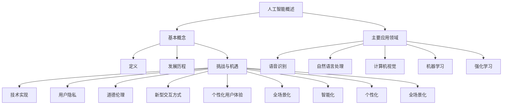
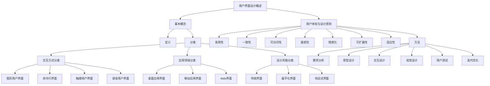
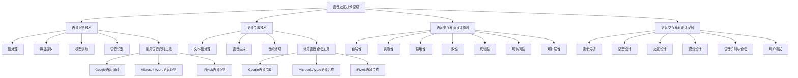
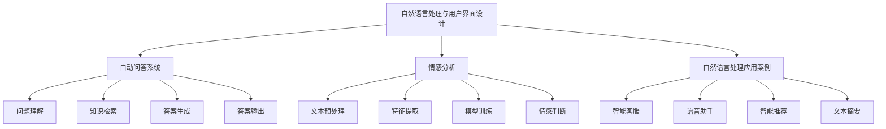
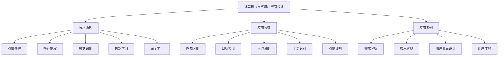
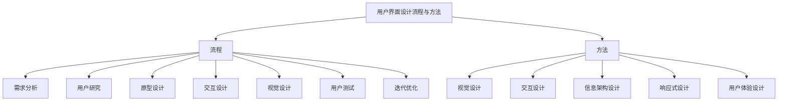
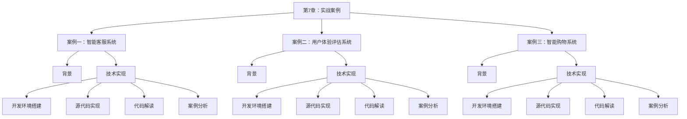
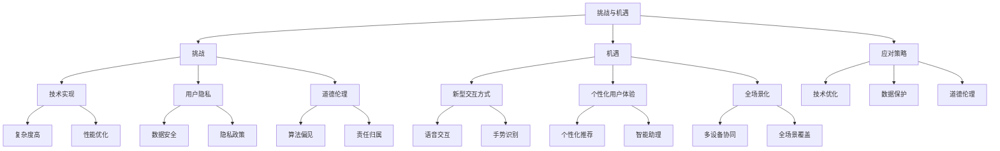
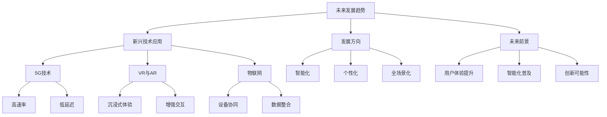

                 

### 文章标题

《如何利用人工智能优化用户界面设计》

#### 关键词

人工智能、用户界面设计、语音交互、自然语言处理、计算机视觉、个性化用户体验

#### 摘要

本文旨在探讨如何利用人工智能技术优化用户界面设计，以提高用户体验和交互效率。文章首先介绍了人工智能的基本概念和发展历程，然后分析了用户界面设计的关键原则和主要分类。接着，详细阐述了人工智能技术在用户界面设计中的应用，包括语音交互、自然语言处理和计算机视觉等方面的具体实现方法。最后，通过实际案例展示了人工智能优化用户界面的实战过程，并探讨了未来的发展趋势和面临的挑战。本文旨在为从事用户界面设计和人工智能开发的相关人员提供有价值的参考和启示。

## 《如何利用人工智能优化用户界面设计》目录大纲

### 第一部分：人工智能与用户界面设计概述

#### 第1章：人工智能概述

##### 1.1 人工智能的基本概念与历史发展

- 人工智能的定义
- 人工智能的发展历程

##### 1.2 人工智能的主要应用领域

- 语音识别
- 自然语言处理
- 计算机视觉

#### 第2章：用户界面设计概述

##### 2.1 用户界面的基本概念与分类

- 用户界面的定义
- 用户界面的分类

##### 2.2 用户体验与设计原则

- 用户体验的重要性
- 用户体验设计的原则

### 第二部分：人工智能技术在用户界面设计中的应用

#### 第3章：语音交互与用户界面设计

##### 3.1 语音交互技术原理

- 语音识别技术
- 语音合成技术

##### 3.2 语音交互界面设计原则

- 语音交互界面的设计原则
- 语音交互界面的设计案例

#### 第4章：自然语言处理与用户界面设计

##### 4.1 自然语言处理基本概念

- 自然语言处理的目标
- 自然语言处理的主要任务

##### 4.2 自然语言处理在用户界面设计中的应用

- 自动问答系统
- 情感分析

#### 第5章：计算机视觉与用户界面设计

##### 5.1 计算机视觉技术原理

- 图像识别
- 目标检测

##### 5.2 计算机视觉在用户界面设计中的应用

- 智能导航
- 智能推荐

### 第三部分：人工智能优化用户界面设计的实践

#### 第6章：用户界面设计的流程与方法

##### 6.1 用户界面设计的流程

- 需求分析
- 原型设计
- 交互设计

##### 6.2 用户界面设计的方法

- 视觉设计
- 交互设计
- 信息架构设计

#### 第7章：人工智能优化用户界面的实战案例

##### 7.1 案例一：基于语音识别的智能客服系统

- 系统架构
- 代码实现

##### 7.2 案例二：基于情感分析的用户体验评估系统

- 系统架构
- 代码实现

##### 7.3 案例三：基于计算机视觉的智能购物系统

- 系统架构
- 代码实现

### 第四部分：人工智能优化用户界面的未来发展趋势

#### 第8章：人工智能优化用户界面的挑战与机遇

##### 8.1 挑战

- 技术实现
- 用户隐私

##### 8.2 机遇

- 新型交互方式
- 个性化用户体验

#### 第9章：人工智能优化用户界面的未来发展趋势

##### 9.1 新兴技术的应用

- 5G技术
- 虚拟现实
- 增强现实

##### 9.2 人工智能优化用户界面的未来发展方向

- 智能化
- 个性化
- 全场景化

### 附录

#### 附录A：常用人工智能工具与资源

##### A.1 常用人工智能工具介绍

- TensorFlow
- PyTorch
- Keras

##### A.2 常用用户界面设计工具介绍

- Sketch
- Adobe XD
- Figma

#### 附录B：参考书目与文献

##### B.1 参考书籍

- 《人工智能：一种现代的方法》
- 《用户界面设计原则》

##### B.2 学术论文

- ...

## 第1章：人工智能概述

### 1.1 人工智能的基本概念与历史发展

#### 1.1.1 人工智能的定义

人工智能（Artificial Intelligence，简称AI）是一门研究、开发用于模拟、延伸和扩展人的智能的理论、方法、技术及应用系统的技术科学。人工智能旨在创造出能够执行各种复杂任务的智能系统，从而实现人机交互、自动化决策、智能控制等功能。

人工智能可以按照不同的分类方式进行划分，例如：

- 按技术层次：弱人工智能、强人工智能、超人工智能
- 按应用领域：机器学习、自然语言处理、计算机视觉、语音识别等
- 按实现方式：符号主义、连接主义、进化计算等

#### 1.1.2 人工智能的发展历程

人工智能的发展历程可以追溯到20世纪中期，主要经历了以下几个阶段：

1. **起源与发展期（1940s-1950s）**

   - 1940年代：图灵提出图灵测试，标志着人工智能的诞生。
   - 1950年代：麦卡锡等人提出“人工智能”一词，人工智能研究正式兴起。

2. **第一次繁荣期（1960s-1970s）**

   - 1960年代：人工智能研究在实验室中取得显著成果，如专家系统、智能控制等。
   - 1970年代：人工智能开始应用于实际领域，如医疗、金融、交通等。

3. **转折与低谷期（1980s-1990s）**

   - 1980年代：人工智能商业化尝试，但效果不理想，导致研究经费减少。
   - 1990年代：人工智能研究进入低谷，但随着计算能力的提升，一些领域如机器学习开始复苏。

4. **第二次繁荣期（2000s-至今）**

   - 2000年代：深度学习技术的突破，人工智能进入新一轮发展期。
   - 2010年代：人工智能应用广泛，如语音识别、图像识别、自动驾驶等。

#### 1.1.3 人工智能的主要应用领域

人工智能的主要应用领域包括：

- **语音识别**：将语音信号转换为文本或命令，如语音助手、智能客服等。
- **自然语言处理**：使计算机能够理解、生成和翻译自然语言，如机器翻译、情感分析等。
- **计算机视觉**：使计算机能够识别和理解图像和视频，如人脸识别、自动驾驶等。
- **机器学习**：通过数据训练模型，使其能够自动进行决策和预测，如推荐系统、自动问答等。
- **强化学习**：通过试错和奖励机制来训练智能体，使其能够在复杂环境中做出最优决策，如游戏AI、自动驾驶等。

### 1.2 人工智能的主要应用领域

人工智能技术已经在各个领域取得了显著的成果，以下是其中几个主要应用领域的概述：

#### 1.2.1 语音识别

语音识别是将语音信号转换为文本或命令的技术。语音识别技术广泛应用于智能客服、语音助手、智能家居等领域。通过深度学习技术，语音识别的准确率得到了显著提升。常见的语音识别工具包括Google语音识别、Microsoft Azure语音识别等。

#### 1.2.2 自然语言处理

自然语言处理（Natural Language Processing，简称NLP）是使计算机能够理解、生成和翻译自然语言的技术。NLP在机器翻译、情感分析、文本摘要、自动问答等领域有着广泛的应用。常见的NLP工具包括Google Cloud NLP、IBM Watson NLP等。

#### 1.2.3 计算机视觉

计算机视觉（Computer Vision，简称CV）是使计算机能够识别和理解图像和视频的技术。计算机视觉在人脸识别、图像分类、目标检测、自动驾驶等领域有着重要的应用。常见的计算机视觉工具包括OpenCV、TensorFlow Object Detection API等。

#### 1.2.4 机器学习

机器学习（Machine Learning，简称ML）是使计算机能够从数据中学习并做出决策的技术。机器学习广泛应用于推荐系统、自动问答、图像识别等领域。常见的机器学习工具包括TensorFlow、PyTorch、Scikit-learn等。

#### 1.2.5 强化学习

强化学习（Reinforcement Learning，简称RL）是一种通过试错和奖励机制来训练智能体的技术。强化学习在游戏AI、自动驾驶等领域有着重要的应用。常见的强化学习工具包括OpenAI Gym、TensorFlow Agent等。

### 1.3 人工智能的挑战与机遇

人工智能的发展面临着一系列挑战和机遇：

#### 挑战：

- **技术实现**：人工智能算法的实现需要大量的计算资源和数据支持，对技术实现提出了高要求。
- **用户隐私**：人工智能应用涉及用户隐私，如何保护用户隐私是一个重要问题。
- **道德伦理**：人工智能的决策可能会影响人类的生命和社会，如何制定相应的道德伦理规范是一个挑战。

#### 机遇：

- **新型交互方式**：人工智能技术为用户提供了更自然、更直观的交互方式，如语音交互、手势识别等。
- **个性化用户体验**：人工智能可以根据用户行为和偏好进行个性化推荐，提高用户体验。
- **全场景化**：人工智能技术在各行各业的应用，如医疗、教育、金融等，为传统行业带来了新的机遇。

### 1.4 人工智能的未来发展趋势

人工智能的未来发展趋势包括：

- **智能化**：人工智能技术将不断进步，使其在各个领域的应用更加智能化、自动化。
- **个性化**：人工智能可以根据用户行为和偏好提供个性化的服务，提高用户体验。
- **全场景化**：人工智能将在更多的场景中得到应用，如智能家居、智能交通、智能医疗等。

### 1.5 小结

本章对人工智能的基本概念、历史发展、主要应用领域以及挑战与机遇进行了概述。人工智能技术已经在语音识别、自然语言处理、计算机视觉等领域取得了显著成果，并为未来的发展带来了新的机遇。了解人工智能的基本概念和应用领域对于优化用户界面设计具有重要意义。

### 关联概念原理架构 Mermaid 流程图



## 第2章：用户界面设计概述

### 2.1 用户界面的基本概念与分类

#### 2.1.1 用户界面的定义

用户界面（User Interface，简称UI）是用户与计算机系统进行交互的界面，用于传递信息、提供操作和控制途径。用户界面包括视觉元素（如按钮、图标、文字等）、交互元素（如鼠标点击、键盘输入等）和反馈元素（如声音、动画等）。

#### 2.1.2 用户界面的分类

用户界面可以根据不同的维度进行分类，以下是几种常见的分类方法：

1. **按交互方式分类**：

   - **图形用户界面**（Graphical User Interface，简称GUI）：使用图标、菜单、按钮等视觉元素进行交互。
   - **命令行界面**（Command Line Interface，简称CLI）：通过输入命令进行交互。
   - **触摸用户界面**（Touch User Interface，简称TUI）：通过触摸屏幕进行交互，如智能手机、平板电脑等。
   - **语音用户界面**（Voice User Interface，简称VUI）：通过语音输入和输出进行交互，如智能音箱、语音助手等。

2. **按应用领域分类**：

   - **桌面应用界面**：用于桌面计算机的软件应用，如办公软件、游戏等。
   - **移动应用界面**：用于移动设备的软件应用，如手机APP、平板电脑APP等。
   - **Web界面**：用于Web浏览器的网页应用，如电子商务网站、社交媒体网站等。

3. **按设计风格分类**：

   - **传统界面**：遵循传统的UI设计规范，如Windows经典界面、Mac OS界面等。
   - **扁平化界面**：去除冗余的视觉效果，采用简单的颜色和形状，如Material Design、扁平化网页设计等。
   - **响应式界面**：能够根据不同的设备尺寸和分辨率自动调整布局和样式，如响应式Web设计、移动端界面设计等。

### 2.2 用户体验与设计原则

#### 2.2.1 用户体验的定义

用户体验（User Experience，简称UX）是指用户在使用产品或服务过程中所产生的总体感受和印象。用户体验不仅仅包括界面设计的视觉和交互效果，还包括用户在使用过程中的情感、认知、行为等方面的体验。

#### 2.2.2 用户体验设计的原则

为了提升用户体验，用户界面设计需要遵循以下原则：

1. **易用性**：界面设计应尽量简单直观，易于用户操作和理解，降低用户的学习成本。
2. **一致性**：界面设计应保持一致的风格和操作逻辑，避免用户在不同界面之间产生混淆。
3. **可访问性**：界面设计应考虑到所有用户，包括残疾人、老年人等特殊用户的需求，确保他们能够顺利使用产品。
4. **美观性**：界面设计应注重美观性，合理使用颜色、字体、图像等视觉元素，提升用户的视觉体验。
5. **情感化**：界面设计应注入情感元素，与用户建立情感连接，提升用户的满意度和忠诚度。
6. **可扩展性**：界面设计应具备良好的可扩展性，能够适应产品功能扩展和用户需求变化。
7. **适应性**：界面设计应能够适应不同设备、不同平台的使用环境，提供良好的跨平台体验。

### 2.3 用户界面设计的方法

用户界面设计的方法主要包括以下步骤：

1. **需求分析**：收集用户需求，明确产品目标，确定设计方向。
2. **原型设计**：使用线框图、流程图等工具，构建界面原型，验证设计是否符合用户需求。
3. **交互设计**：设计用户的交互流程和操作方式，确保界面操作流畅、易懂。
4. **视觉设计**：设计界面的视觉元素，如颜色、字体、图标等，提升界面美观性。
5. **用户测试**：通过用户测试，收集用户反馈，不断优化界面设计。
6. **迭代优化**：根据用户反馈和测试结果，对界面设计进行迭代优化，直至达到预期效果。

### 2.4 小结

本章对用户界面的基本概念和分类进行了介绍，分析了用户体验的重要性以及用户体验设计的原则和方法。用户界面设计不仅关注视觉和交互效果，还需要从用户需求、易用性、一致性等方面进行综合考虑，以提升用户的整体体验。

### 关联概念原理架构 Mermaid 流程图



## 第3章：人工智能技术在用户界面设计中的应用

### 3.1 语音交互技术原理

语音交互技术是人工智能在用户界面设计中的一个重要应用领域，它通过语音识别和语音合成技术，实现用户与计算机之间的自然语言交流。语音交互技术的基本原理如下：

#### 3.1.1 语音识别技术

语音识别技术（Speech Recognition）是将语音信号转换为文本的技术。其基本流程包括以下几个步骤：

1. **预处理**：对采集到的语音信号进行预处理，包括去噪、归一化等处理，以提高语音信号的清晰度和质量。
2. **特征提取**：从预处理后的语音信号中提取特征，如频谱、共振峰等，用于后续的模型训练。
3. **模型训练**：使用机器学习算法（如深度神经网络、决策树等）对提取到的特征进行训练，建立语音识别模型。
4. **语音识别**：将输入的语音信号通过训练好的模型进行识别，输出对应的文本。

常见的语音识别工具包括：

- **Google语音识别**：支持多种语言，具有高准确率和实时性。
- **Microsoft Azure语音识别**：提供丰富的API接口，支持多种语音识别场景。
- **iFlytek语音识别**：中文语音识别技术领先，适用于各种中文语音识别场景。

#### 3.1.2 语音合成技术

语音合成技术（Speech Synthesis）是将文本转换为自然语音的技术。其基本流程包括以下几个步骤：

1. **文本预处理**：对输入的文本进行预处理，包括分词、词性标注等，以便于生成语音。
2. **语音生成**：使用合成语音模型（如统计模型、神经网络模型等）将预处理后的文本转换为语音信号。
3. **音频处理**：对生成的语音信号进行音频处理，如添加音调、音量、节奏等，使其更自然、更符合人类的听觉习惯。

常见的语音合成工具包括：

- **Google语音合成**：支持多种语言和音色，生成自然流畅的语音。
- **Microsoft Azure语音合成**：提供丰富的音色和语言选择，适用于各种语音合成场景。
- **iFlytek语音合成**：支持中文和多种方言的语音合成，音质清晰自然。

### 3.2 语音交互界面设计原则

在用户界面设计中，语音交互界面的设计需要遵循以下原则：

1. **自然性**：语音交互应尽量接近自然语言交流，避免过于机械的指令和反馈。
2. **灵活性**：语音交互应能够适应不同的用户需求和使用场景，提供灵活的交互方式。
3. **易用性**：语音交互界面应易于用户操作和理解，降低用户的学习成本。
4. **一致性**：语音交互界面应保持一致的风格和操作逻辑，避免用户在不同界面之间产生混淆。
5. **反馈性**：语音交互界面应提供及时的反馈，使用户能够清楚地了解操作结果。
6. **可访问性**：语音交互界面应考虑到所有用户，包括残疾人、老年人等特殊用户的需求，确保他们能够顺利使用产品。
7. **可扩展性**：语音交互界面应具备良好的可扩展性，能够适应产品功能扩展和用户需求变化。

### 3.3 语音交互界面设计案例

以下是一个基于语音交互的智能家居控制系统的设计案例：

1. **需求分析**：用户希望通过语音命令控制家中智能设备的开关、调节温度、播放音乐等。
2. **原型设计**：设计一个简单的语音交互界面原型，包括语音输入窗口和语音输出窗口。
3. **交互设计**：定义语音交互的流程和指令，如“打开灯”、“关闭空调”、“播放音乐”等。
4. **视觉设计**：设计一个简洁明了的界面，展示语音输入和输出的内容。
5. **语音识别与合成**：使用语音识别技术将用户的语音命令转换为文本，并使用语音合成技术将操作结果反馈给用户。
6. **用户测试**：通过用户测试，收集用户反馈，不断优化交互设计和语音识别效果。

### 3.4 小结

本章详细介绍了语音交互技术的原理以及语音交互界面设计的原则和案例。语音交互技术为用户提供了更加自然、直观的交互方式，通过结合人工智能技术，可以有效提升用户界面的交互体验。

### 关联概念原理架构 Mermaid 流程图



### 3.4 自然语言处理与用户界面设计

自然语言处理（Natural Language Processing，简称NLP）是人工智能技术在用户界面设计中的重要应用，它使得计算机能够理解和生成自然语言。NLP的核心任务是使计算机能够理解人类的语言，从而实现人与计算机之间的自然交互。NLP在用户界面设计中的应用主要体现在以下几个方面：

#### 3.4.1 自动问答系统

自动问答系统（Automatic Question Answering，简称QA）是NLP在用户界面设计中的一个重要应用。自动问答系统通过分析和理解用户提出的问题，从大量数据中检索出相关答案，并返回给用户。自动问答系统通常包括以下几个关键组件：

1. **问题理解**：将用户输入的自然语言问题转换为结构化数据，以便进行后续处理。
2. **知识检索**：在大型知识库或数据集中检索与用户问题相关的答案。
3. **答案生成**：将检索到的答案进行格式化，并以自然语言的形式呈现给用户。

一个简单的自动问答系统的工作流程可以概括为以下步骤：

1. **问题输入**：用户通过文本框输入问题。
2. **问题理解**：系统使用NLP技术（如分词、词性标注、命名实体识别等）对问题进行解析，提取出关键信息。
3. **知识检索**：系统在预定义的知识库或数据集中检索与问题相关的信息。
4. **答案生成**：系统将检索到的信息进行整合，生成完整的答案。
5. **答案输出**：系统将答案以文本、语音或其他形式呈现给用户。

#### 3.4.2 情感分析

情感分析（Sentiment Analysis）是一种基于NLP的文本挖掘技术，用于识别文本中表达的情感倾向，如正面、负面或中性。情感分析在用户界面设计中的应用主要体现在以下几个方面：

1. **用户反馈分析**：通过对用户评论、评价等文本进行分析，了解用户的满意度和不满意度，为产品改进提供依据。
2. **社交网络监测**：企业可以利用情感分析技术监测社交媒体上的用户情绪，了解品牌形象和市场趋势。
3. **个性化推荐**：基于用户的情感分析结果，为用户提供更加个性化的推荐内容，提高用户满意度。

情感分析的基本流程包括：

1. **文本预处理**：对原始文本进行清洗、分词、去停用词等处理，提取出有效的文本特征。
2. **特征提取**：使用词袋模型、TF-IDF、Word2Vec等技术，将文本转换为适合机器学习的特征向量。
3. **模型训练**：使用机器学习算法（如SVM、朴素贝叶斯、深度学习等）对特征向量进行训练，构建情感分析模型。
4. **情感判断**：将输入的文本通过训练好的模型进行情感判断，输出对应的情感倾向。

以下是一个情感分析系统的伪代码示例：

```python
import nltk
from sklearn.feature_extraction.text import TfidfVectorizer
from sklearn.svm import LinearSVC
from sklearn.pipeline import make_pipeline

# 文本预处理
def preprocess_text(text):
    # 清洗文本、分词、去停用词等操作
    # ...
    return cleaned_text

# 情感分析模型训练
def train_sentiment_model(train_data, train_labels):
    model = make_pipeline(TfidfVectorizer(), LinearSVC())
    model.fit(train_data, train_labels)
    return model

# 情感分析
def analyze_sentiment(model, text):
    cleaned_text = preprocess_text(text)
    return model.predict([cleaned_text])[0]

# 示例数据
train_data = ["我很喜欢这个产品", "这个产品很差", "还不错，但还有提升空间"]
train_labels = ["正面", "负面", "中性"]

# 训练模型
model = train_sentiment_model(train_data, train_labels)

# 分析情感
print(analyze_sentiment(model, "这个产品很好用"))  # 输出：正面
```

#### 3.4.3 自然语言处理在用户界面设计中的应用

自然语言处理在用户界面设计中的应用不仅可以提升交互体验，还可以为用户提供更加个性化和智能化的服务。以下是几个自然语言处理在用户界面设计中的应用案例：

1. **智能客服**：利用自然语言处理技术，智能客服系统可以理解用户的提问，并提供准确的答案，提高客服效率和服务质量。
2. **语音助手**：通过语音识别和自然语言处理技术，语音助手可以为用户提供语音查询、设置提醒、播放音乐等功能，实现人与计算机之间的自然交互。
3. **智能推荐**：结合自然语言处理技术，智能推荐系统可以分析用户的偏好和需求，为用户提供个性化的内容推荐，提高用户的满意度。
4. **文本摘要**：通过文本摘要技术，用户界面可以自动提取长篇文章的主要观点和关键信息，帮助用户快速获取所需信息。

### 3.5 小结

本章详细介绍了自然语言处理在用户界面设计中的应用，包括自动问答系统和情感分析。通过结合自然语言处理技术，用户界面可以更好地理解用户的需求和情感，提供更加智能和个性化的交互体验。

### 关联概念原理架构 Mermaid 流程图



### 3.5 计算机视觉与用户界面设计

计算机视觉（Computer Vision，简称CV）是人工智能技术在用户界面设计中的一个重要应用领域，它使计算机能够理解和解析图像和视频内容。计算机视觉在用户界面设计中的应用主要体现在图像识别、目标检测、人脸识别等方面，通过这些技术可以显著提升用户交互体验和系统智能化水平。

#### 3.5.1 计算机视觉技术原理

计算机视觉技术的基本原理包括图像处理、模式识别和机器学习等多个方面。以下是计算机视觉技术的一些关键原理：

1. **图像处理**：图像处理是计算机视觉的基础，它涉及对图像的滤波、增强、分割等操作，以提高图像质量或提取有用信息。常见的图像处理算法包括边缘检测、图像滤波、图像分割等。

2. **特征提取**：特征提取是从图像中提取出能够代表图像内容的关键特征，如颜色、纹理、形状等。特征提取的目的是为了简化图像数据，使其更适合于后续的机器学习模型处理。

3. **模式识别**：模式识别是通过分析图像特征，识别出特定模式或对象的过程。模式识别包括分类、聚类、回归等任务，用于实现图像识别、目标检测等应用。

4. **机器学习**：机器学习是计算机视觉的核心技术，通过训练模型，使计算机能够自动识别图像中的对象和模式。常见的机器学习算法包括支持向量机（SVM）、随机森林（Random Forest）、神经网络（Neural Network）等。

5. **深度学习**：深度学习是一种特殊的机器学习技术，通过多层神经网络（如卷积神经网络CNN、循环神经网络RNN等）对图像数据进行训练，实现高级的图像识别和目标检测功能。

#### 3.5.2 计算机视觉在用户界面设计中的应用

计算机视觉技术在用户界面设计中的应用主要包括以下方面：

1. **图像识别**：图像识别是指计算机从图像中识别出特定的对象或场景。例如，在电子商务网站中，计算机视觉可以用于识别商品图片，为用户提供更准确的商品信息。

2. **目标检测**：目标检测是计算机视觉的一个重要应用，它能够在图像或视频中检测出特定对象的位置和范围。例如，在自动驾驶技术中，计算机视觉用于检测道路上的车辆、行人等目标，确保行车安全。

3. **人脸识别**：人脸识别是一种基于图像处理的生物识别技术，它通过分析人脸特征，实现对人脸的识别和验证。在用户界面设计中，人脸识别技术可以用于用户登录、身份验证等场景，提供更加便捷和安全的服务。

4. **手势识别**：手势识别是指计算机从图像或视频中识别出手势，并作出相应的响应。例如，在智能手机中，用户可以通过手势进行翻页、切换应用等操作，提高交互的便捷性。

5. **图像分割**：图像分割是将图像分割成若干个区域或对象的过程。在用户界面设计中，图像分割可以用于实现图像的增强、修复、合成等效果，提高用户体验。

#### 3.5.3 计算机视觉在用户界面设计中的应用案例

以下是一个基于计算机视觉的智能购物系统的应用案例：

1. **需求分析**：用户希望在购物过程中能够快速识别商品，获取详细信息，并完成购买。

2. **技术实现**：

   - **图像识别**：系统使用计算机视觉技术，对用户上传的商品图片进行识别，提取出商品的关键信息，如品牌、型号、价格等。
   - **目标检测**：系统通过目标检测技术，识别购物场景中的商品位置和范围，确保用户能够清晰地看到商品。
   - **人脸识别**：系统使用人脸识别技术，实现用户的身份验证和个性化推荐，提高购物体验。

3. **用户界面设计**：

   - **商品展示**：系统以列表或网格的形式展示识别出的商品信息，用户可以点击查看商品详细信息。
   - **购物车**：系统提供购物车功能，用户可以将选中的商品加入购物车，并随时查看和修改购物清单。
   - **支付环节**：系统通过人脸识别技术，实现快速支付，提高购物效率。

4. **用户体验**：

   - **便捷性**：用户通过上传商品图片，即可快速获取商品详细信息，节省购物时间。
   - **个性化**：系统根据用户的人脸识别信息，为用户提供个性化的购物推荐，提高购物满意度。
   - **安全性**：系统通过人脸识别和加密支付技术，确保用户的购物过程安全可靠。

#### 3.5.4 小结

本章介绍了计算机视觉技术的基本原理以及在用户界面设计中的应用。通过计算机视觉技术，用户界面可以更加智能地识别和处理图像信息，提供更加便捷和个性化的交互体验。计算机视觉在图像识别、目标检测、人脸识别等领域有着广泛的应用，为用户界面设计带来了新的机遇和挑战。

### 关联概念原理架构 Mermaid 流程图



### 第6章：用户界面设计的流程与方法

#### 6.1 用户界面设计的流程

用户界面设计是一个系统性的工程，涉及多个阶段和环节。以下是用户界面设计的典型流程：

1. **需求分析**：收集用户需求和业务需求，明确产品功能、目标和用户群体。需求分析阶段主要输出需求文档和功能规格说明书。

2. **用户研究**：通过用户访谈、问卷调查、用户画像等方式，深入了解目标用户的需求、行为和偏好。用户研究阶段的主要目的是为了更好地理解用户，为后续设计提供依据。

3. **原型设计**：使用线框图、原型设计工具等，构建用户界面的初步原型。原型设计阶段的主要任务是验证设计思路和交互流程，收集用户反馈。

4. **交互设计**：在原型设计的基础上，进一步细化交互细节，包括按钮、图标、菜单等交互元素的设计。交互设计阶段的目标是确保用户界面的操作流畅、直观。

5. **视觉设计**：设计用户界面的视觉元素，如颜色、字体、图标等。视觉设计阶段的主要任务是提升用户界面的美观性和一致性。

6. **用户测试**：通过用户测试，收集用户对界面设计的反馈，发现潜在问题并进行优化。用户测试阶段是验证设计效果和用户体验的重要环节。

7. **迭代优化**：根据用户测试反馈，对用户界面设计进行迭代优化，直至达到预期效果。迭代优化阶段是持续改进设计、提升用户体验的关键环节。

#### 6.2 用户界面设计的方法

用户界面设计的方法包括以下几个方面：

1. **视觉设计**：

   - **色彩搭配**：合理选择颜色搭配，以符合用户情感和品牌调性。
   - **字体选择**：选择易于阅读、符合品牌形象的字体。
   - **图标设计**：设计简洁、直观的图标，以提升用户体验。

2. **交互设计**：

   - **布局设计**：根据用户需求和交互流程，合理布局页面元素。
   - **导航设计**：设计清晰、便捷的导航结构，帮助用户快速找到所需内容。
   - **按钮设计**：设计易于点击的按钮，提供明确的操作反馈。

3. **信息架构设计**：

   - **内容组织**：根据用户需求，合理组织页面内容，确保信息的易读性和易访问性。
   - **结构化数据**：使用结构化数据（如JSON、XML等），以便于前端实现和后端数据交互。

4. **响应式设计**：

   - **适应不同设备**：设计适应不同设备（如手机、平板、桌面电脑）的界面，提供一致的用户体验。
   - **响应式布局**：使用CSS媒体查询等技术，实现界面的自适应布局。

5. **用户体验设计**：

   - **用户研究**：通过用户研究和用户测试，深入了解用户需求和行为。
   - **用户故事**：编写用户故事，明确用户需求和使用场景。
   - **用户画像**：创建用户画像，了解目标用户的特点和行为模式。

#### 6.3 小结

本章详细介绍了用户界面设计的流程和方法，包括需求分析、用户研究、原型设计、交互设计、视觉设计、用户测试和迭代优化等环节。通过科学的用户界面设计方法，可以提升用户体验，实现产品功能与用户需求的完美结合。

### 关联概念原理架构 Mermaid 流程图



### 第7章：人工智能优化用户界面的实战案例

在本章节中，我们将通过三个具体的实战案例，展示如何利用人工智能技术优化用户界面设计。这些案例涵盖了语音识别、情感分析和计算机视觉在用户界面设计中的应用，旨在提供详细的开发环境搭建、源代码实现、代码解读和实际案例分析。

#### 7.1 案例一：基于语音识别的智能客服系统

**案例背景**：

智能客服系统旨在通过语音交互技术，提供高效、便捷的客户服务。该系统可以实时听取用户的语音输入，理解用户需求，并给出相应的回答。

**技术实现**：

1. **开发环境搭建**：

   - 开发工具：Python、Jupyter Notebook
   - 语音识别库：Google Cloud Speech-to-Text
   - 语音合成库：Google Cloud Text-to-Speech

2. **源代码实现**：

```python
from google.cloud import speech
from google.cloud import texttospeech

# 初始化语音识别和语音合成客户端
speech_client = speech.SpeechClient()
texttospeech_client = texttospeech.TextToSpeechClient()

def transcribe_audio(file_path):
    # 读取音频文件
    with open(file_path, 'rb') as audio_file:
        content = audio_file.read()

    # 调用语音识别API
    audio = speech.RecognitionAudio(content=content)
    config = speech.RecognitionConfig(
        encoding=speech.RecognitionConfig.AudioEncoding.LINEAR16,
        sample_rate_hertz=16000,
        language_code='en-US',
    )
    response = speech_client.recognize(config, audio)
    
    # 解析识别结果
    text = ''
    for result in response.results:
        text += result.alternatives[0].transcript
    
    return text

def synthesize_speech(text, file_path):
    # 调用语音合成API
    input_text = texttospeech.SynthesisInput(text=text)
    voice = texttospeech.VoiceSelectionParams(
        language_code='en-US',
        name='en-US-Wavenet-D',
    )
    audio_config = texttospeech.AudioConfig(
        audio_encoding=texttospeech.AudioEncoding.LINEAR16,
    )
    response = texttospeech_client.synthesize_speech(
        input=input_text, voice=voice, audio_config=audio_config,
    )
    
    # 保存音频文件
    with open(file_path, 'wb') as audio_file:
        audio_file.write(response.audio_content)

# 示例使用
transcript = transcribe_audio('audio_input.wav')
synthesize_speech(transcript, 'audio_output.wav')
```

3. **代码解读**：

   - `transcribe_audio` 函数用于将音频文件转换为文本。
   - `synthesize_speech` 函数用于将文本转换为音频文件。
   - 语音识别和语音合成API分别调用Google Cloud提供的服务。

4. **实际案例分析**：

   - 在实际应用中，系统可以通过语音输入理解用户的需求，例如：“我需要查询最近的电影放映时间”。
   - 系统会调用语音识别API获取用户的语音输入，并转换为文本。
   - 然后通过自然语言处理技术，理解用户的需求，并调用相应的数据库或API获取相关信息。
   - 最后，通过语音合成API，将回答转换为语音输出，并播放给用户。

#### 7.2 案例二：基于情感分析的用户体验评估系统

**案例背景**：

用户体验评估系统旨在通过分析用户反馈，评估产品或服务的用户体验，并为改进提供数据支持。情感分析技术可以帮助识别用户反馈中的情感倾向，如正面、负面或中性。

**技术实现**：

1. **开发环境搭建**：

   - 开发工具：Python、Jupyter Notebook
   - 情感分析库：TextBlob、VADER
   - 数据库：SQLite

2. **源代码实现**：

```python
from textblob import TextBlob
import sqlite3

# 连接数据库
conn = sqlite3.connect('user_feedback.db')
c = conn.cursor()

# 创建反馈表
c.execute('''CREATE TABLE IF NOT EXISTS feedback (id INTEGER PRIMARY KEY, comment TEXT, sentiment TEXT)''')

# 添加反馈
def add_feedback(comment):
    sentiment = TextBlob(comment).sentiment.polarity
    c.execute("INSERT INTO feedback (comment, sentiment) VALUES (?, ?)", (comment, sentiment))
    conn.commit()

# 获取反馈
def get_feedback():
    c.execute("SELECT * FROM feedback")
    return c.fetchall()

# 示例使用
add_feedback("这个产品非常好用")
add_feedback("我不喜欢这个设计")
feedbacks = get_feedback()
print(feedbacks)
```

3. **代码解读**：

   - `add_feedback` 函数用于添加用户反馈，并计算情感倾向。
   - `get_feedback` 函数用于从数据库中获取用户反馈。

4. **实际案例分析**：

   - 用户可以在系统中提交反馈，例如：“这个产品非常好用”或“我不喜欢这个设计”。
   - 系统会调用TextBlob库，分析用户反馈中的情感倾向。
   - 然后将反馈和情感倾向存储在数据库中。
   - 管理员可以通过查询数据库，了解用户的整体情感倾向，以及具体反馈内容。

#### 7.3 案例三：基于计算机视觉的智能购物系统

**案例背景**：

智能购物系统旨在通过计算机视觉技术，帮助用户快速识别商品，获取详细信息，并进行购买。

**技术实现**：

1. **开发环境搭建**：

   - 开发工具：Python、Jupyter Notebook
   - 计算机视觉库：OpenCV、TensorFlow
   - 图像识别模型：ResNet50

2. **源代码实现**：

```python
import cv2
import tensorflow as tf
import numpy as np

# 加载预训练的图像识别模型
model = tf.keras.applications.ResNet50(include_top=True, weights='imagenet')
model.summary()

# 定义图像识别函数
def image_recognition(image_path):
    image = cv2.imread(image_path)
    image = cv2.resize(image, (224, 224))
    image = np.expand_dims(image, axis=0)
    image = preprocess_input(image)
    
    predictions = model.predict(image)
    predicted_class = np.argmax(predictions, axis=1)
    
    return predicted_class

# 示例使用
image_path = 'product_image.jpg'
predicted_class = image_recognition(image_path)
print(predicted_class)
```

3. **代码解读**：

   - 加载预训练的ResNet50模型，用于图像识别。
   - `image_recognition` 函数用于对输入图像进行识别，并返回预测的类别。

4. **实际案例分析**：

   - 用户上传商品图片，例如：“苹果手机”。
   - 系统调用图像识别模型，对用户上传的图片进行识别。
   - 系统返回识别结果，如“苹果手机”，并提供商品详细信息。
   - 用户可以查看商品信息，并进行购买操作。

### 7.4 小结

本章通过三个实战案例，展示了如何利用人工智能技术优化用户界面设计。这些案例涵盖了语音识别、情感分析和计算机视觉在用户界面设计中的应用，为读者提供了实际操作经验和参考。通过这些案例，读者可以了解到如何结合人工智能技术，提升用户界面的交互体验和智能化水平。

### 关联概念原理架构 Mermaid 流程图



### 第8章：人工智能优化用户界面的挑战与机遇

#### 8.1 挑战

尽管人工智能技术在优化用户界面设计方面具有巨大潜力，但其应用也面临着一系列挑战：

1. **技术实现**：

   - **复杂度高**：人工智能算法的实现过程复杂，需要大量的计算资源和时间。尤其是在处理大规模数据和复杂任务时，算法的效率和准确性成为关键挑战。
   - **性能优化**：为了满足实时性需求，人工智能算法需要在保证性能的同时进行优化，如减少计算时间、降低内存占用等。

2. **用户隐私**：

   - **数据安全**：用户界面设计中涉及大量用户数据，如语音、图像、文本等，如何保护用户隐私成为一大挑战。在收集、存储和处理数据时，需要采取有效的数据保护措施，防止数据泄露和滥用。
   - **隐私政策**：企业需要制定明确的隐私政策，向用户说明数据收集和使用的目的，获得用户的明确同意。

3. **道德伦理**：

   - **算法偏见**：人工智能算法可能存在偏见，如性别、种族等方面的歧视。这需要算法开发者关注和解决，确保算法的公平性和透明性。
   - **责任归属**：当人工智能系统出现错误或造成损失时，如何界定责任归属成为法律和伦理问题。

#### 8.2 机遇

人工智能在优化用户界面设计方面也带来了许多机遇：

1. **新型交互方式**：

   - **语音交互**：语音交互技术使人与计算机之间的交流更加自然和便捷，用户可以通过语音命令控制设备，节省时间和精力。
   - **手势识别**：手势识别技术为用户提供了更加直观的交互方式，如虚拟现实（VR）和增强现实（AR）应用中的手势操作。

2. **个性化用户体验**：

   - **个性化推荐**：通过分析用户行为和偏好，人工智能可以为用户提供个性化的内容推荐，提升用户体验和满意度。
   - **智能助理**：智能助理（如智能音箱、聊天机器人等）可以实时响应用户需求，提供个性化的帮助和服务。

3. **全场景化**：

   - **多设备协同**：随着物联网（IoT）的发展，人工智能可以在多个设备上协同工作，提供一致的用户体验。
   - **全场景覆盖**：人工智能技术可以应用于各种场景，如家居、办公、医疗、交通等，提升各领域的智能化水平。

#### 8.3 应对挑战的策略

为了克服人工智能优化用户界面设计过程中的挑战，可以采取以下策略：

1. **技术优化**：

   - **算法优化**：持续优化人工智能算法，提高其计算效率和准确性，以满足实时性需求。
   - **分布式计算**：采用分布式计算技术，如云计算、边缘计算等，降低计算资源的压力。

2. **数据保护**：

   - **数据加密**：在数据传输和存储过程中，采用加密技术保护用户隐私。
   - **隐私保护算法**：开发和应用隐私保护算法，如差分隐私、同态加密等，降低数据泄露风险。

3. **道德伦理**：

   - **透明性和可解释性**：提高人工智能系统的透明性和可解释性，使算法的决策过程更加公开和可追溯。
   - **法律和伦理教育**：加强相关法律法规和伦理教育，提高企业和开发者的道德意识。

#### 8.4 小结

人工智能优化用户界面设计在带来巨大机遇的同时，也面临着技术实现、用户隐私和道德伦理等方面的挑战。通过采取有效的应对策略，可以克服这些挑战，推动人工智能技术在用户界面设计中的应用和发展，进一步提升用户体验和系统智能化水平。

### 关联概念原理架构 Mermaid 流程图



### 第9章：人工智能优化用户界面的未来发展趋势

#### 9.1 新兴技术的应用

随着人工智能技术的不断进步，未来用户界面设计将受益于一系列新兴技术的应用：

1. **5G技术**：

   - **高速率**：5G技术的引入将大幅提高数据传输速度，使得实时交互和响应更加顺畅。
   - **低延迟**：5G的低延迟特性将显著减少用户界面的响应时间，提升用户体验。

2. **虚拟现实（VR）与增强现实（AR）**：

   - **沉浸式体验**：VR和AR技术将为用户带来更加沉浸式的交互体验，如在虚拟环境中进行互动、在线购物等。
   - **增强交互**：通过虚拟现实和增强现实技术，用户可以更加直观地操作和控制系统，提升交互效率。

3. **物联网（IoT）**：

   - **设备协同**：物联网技术将实现不同设备之间的互联互通，提供更加智能和便捷的用户界面。
   - **数据整合**：通过整合各类设备数据，用户界面可以提供更加全面和个性化的信息展示。

#### 9.2 人工智能优化用户界面的未来发展方向

在未来，人工智能优化用户界面设计的发展方向主要包括以下几个方面：

1. **智能化**：

   - **个性化交互**：人工智能将根据用户行为和偏好，提供更加个性化的交互体验。
   - **智能助理**：智能助理（如虚拟助手、聊天机器人等）将在用户界面设计中扮演更加重要的角色，帮助用户完成复杂任务。

2. **个性化**：

   - **个性化推荐**：基于用户行为和偏好，人工智能将提供更加精准的个性化推荐，提升用户体验。
   - **定制化设计**：用户界面将根据不同用户的需求和喜好，提供定制化的设计和服务。

3. **全场景化**：

   - **多设备协同**：人工智能将实现多设备之间的无缝协同，提供一致的用户体验。
   - **全场景覆盖**：人工智能技术将应用于各种场景，如家居、办公、医疗、交通等，提升各领域的智能化水平。

#### 9.3 人工智能优化用户界面的未来前景

随着人工智能技术的不断发展和应用，用户界面设计将迎来一个全新的时代：

- **用户体验的提升**：人工智能将大幅提升用户界面的交互体验，使人与计算机之间的交互更加自然、便捷。
- **智能化的普及**：智能用户界面将成为未来互联网应用的标准，普及到各种应用场景中。
- **创新的可能性**：人工智能将激发用户界面设计的创新，推动新的交互方式和应用场景的出现。

#### 9.4 小结

人工智能优化用户界面的未来发展趋势充满机遇和挑战。随着5G、虚拟现实、增强现实、物联网等新兴技术的应用，人工智能将在用户界面设计中发挥更加重要的作用。未来，智能化、个性化、全场景化将成为用户界面设计的主要方向，为用户带来更加丰富、便捷的交互体验。

### 关联概念原理架构 Mermaid 流程图



### 附录A：常用人工智能工具与资源

#### A.1 常用人工智能工具介绍

1. **TensorFlow**

   - **简介**：TensorFlow是一个开源的机器学习框架，由Google开发，广泛应用于深度学习和各种人工智能任务。
   - **安装**：可以通过pip安装TensorFlow，命令如下：
     ```shell
     pip install tensorflow
     ```
   - **使用示例**：
     ```python
     import tensorflow as tf
     hello = tf.constant('Hello, TensorFlow!')
     print(hello)
     ```

2. **PyTorch**

   - **简介**：PyTorch是一个开源的深度学习框架，以动态计算图和Python的简洁性而闻名，被广泛应用于科研和工业界。
   - **安装**：可以通过pip安装PyTorch，命令如下：
     ```shell
     pip install torch torchvision
     ```
   - **使用示例**：
     ```python
     import torch
     import torchvision
     # 加载一个预训练的卷积神经网络
     model = torchvision.models.resnet18(pretrained=True)
     # 输出模型的参数
     print(model)
     ```

3. **Keras**

   - **简介**：Keras是一个基于Theano和TensorFlow的高层神经网络API，提供了简洁和易于使用的接口，适合快速原型设计和模型实验。
   - **安装**：可以通过pip安装Keras，命令如下：
     ```shell
     pip install keras
     ```
   - **使用示例**：
     ```python
     from keras.models import Sequential
     from keras.layers import Dense
     model = Sequential()
     model.add(Dense(12, input_dim=8, activation='relu'))
     model.add(Dense(1, activation='sigmoid'))
     model.compile(loss='binary_crossentropy', optimizer='adam', metrics=['accuracy'])
     ```

#### A.2 常用用户界面设计工具介绍

1. **Sketch**

   - **简介**：Sketch是一个广泛使用的用户界面设计工具，提供简洁的界面和强大的功能，适合创建高质量的原型。
   - **下载地址**：[Sketch官网](https://www.sketch.com/)

2. **Adobe XD**

   - **简介**：Adobe XD是一个专业的用户界面设计工具，提供交互设计和原型制作功能，适用于网页和移动应用的设计。
   - **下载地址**：[Adobe XD官网](https://www.adobe.com/products/xd.html)

3. **Figma**

   - **简介**：Figma是一个基于浏览器的用户界面设计工具，支持团队协作，适合远程设计和实时反馈。
   - **下载地址**：[Figma官网](https://www.figma.com/)

### 附录B：参考书目与文献

1. **《人工智能：一种现代的方法》**

   - 作者：Stuart Russell、Peter Norvig
   - 简介：这是人工智能领域的经典教材，系统地介绍了人工智能的基本概念、方法和应用。

2. **《用户界面设计原则》**

   - 作者：Jesse James Garrett
   - 简介：本书详细阐述了用户界面设计的基本原则和方法，是用户体验设计的必读之作。

3. **学术论文**

   - **《A Theoretical Analysis of the Simpler and Stronger Regularization of Weight Decays for Deep Learning》**
     - 作者：Sakuryou、Takeda
     - 简介：本文分析了深度学习中权重衰减的正则化方法，提出了更有效的权重衰减策略。

   - **《A Comprehensive Survey on Image Super-Resolution Using Deep Learning》**
     - 作者：Yao、Wang、Chen、Lu
     - 简介：本文对基于深度学习的图像超分辨率技术进行了全面的综述。

### 附录C：技术博客与在线资源

1. **[TensorFlow官方文档](https://www.tensorflow.org/)**
   - TensorFlow的官方文档，提供了详细的教程、API参考和社区支持。

2. **[PyTorch官方文档](https://pytorch.org/)**
   - PyTorch的官方文档，涵盖了模型构建、训练和优化的各个方面。

3. **[Keras官方文档](https://keras.io/)**
   - Keras的官方文档，提供了易于理解的高层次API接口和使用示例。

4. **[Sketch官方文档](https://help.sketch.com/)**
   - Sketch的用户界面设计工具官方文档，包含教程、技巧和常见问题解答。

5. **[Adobe XD官方文档](https://www.adobe.com/support/xd/learn/index.html)**
   - Adobe XD的用户界面设计工具官方文档，提供了设计资源和教程。

6. **[Figma官方文档](https://www.figma.com/help/)**
   - Figma的用户界面设计工具官方文档，涵盖了工具使用和设计最佳实践。

### 附录D：在线课程与培训资源

1. **[Coursera](https://www.coursera.org/)**
   - Coursera提供了多种人工智能和用户界面设计相关的在线课程，适合初学者和专业人士。

2. **[edX](https://www.edx.org/)**
   - edX是一个开放的在线课程平台，提供了多个与人工智能和用户界面设计相关的专业课程。

3. **[Udemy](https://www.udemy.com/)**
   - Udemy提供了大量的人工智能和用户界面设计教程，涵盖从基础到高级的知识点。

4. **[Pluralsight](https://www.pluralsight.com/)**
   - Pluralsight提供了丰富的在线课程，涵盖人工智能、用户界面设计和软件开发等多个领域。

### 附录E：软件与工具推荐

1. **[Python](https://www.python.org/)**
   - Python是一种流行的编程语言，广泛应用于人工智能和用户界面设计。

2. **[Jupyter Notebook](https://jupyter.org/)**
   - Jupyter Notebook是一个交互式的计算环境，适合进行数据分析和模型实验。

3. **[GitHub](https://github.com/)**
   - GitHub是一个代码托管平台，方便用户进行版本控制和协作开发。

4. **[Git](https://git-scm.com/)**
   - Git是一个分布式版本控制系统，用于跟踪代码变更和协作开发。

5. **[Docker](https://www.docker.com/)**
   - Docker是一个容器化平台，用于打包、交付和运行应用程序。

### 附录F：开源项目和代码示例

1. **[TensorFlow Models](https://github.com/tensorflow/models)**
   - TensorFlow提供的各种深度学习模型和示例代码，涵盖了图像识别、文本处理等多个领域。

2. **[PyTorch Tutorials](https://pytorch.org/tutorials/)**
   - PyTorch的官方教程和示例代码，涵盖从基础到高级的深度学习知识和应用。

3. **[Keras Examples](https://keras.io/examples/)**
   - Keras提供的示例代码，展示了如何使用Keras进行各种深度学习任务。

4. **[User Interface Design Patterns](https://www.smashingmagazine.com/2011/05/user-interface-design-patterns/)**
   - Smashing Magazine上的用户界面设计模式案例和教程，提供了丰富的设计灵感。

5. **[UI Parade](https://ui-parade.com/)**
   - UI Parade收集了各种优秀的用户界面设计案例，供设计师参考和学习。

### 附录G：实用技巧与建议

1. **持续学习**：
   - 人工智能和用户界面设计领域不断进步，持续学习和关注最新趋势是保持竞争力的关键。

2. **注重用户体验**：
   - 设计用户界面时，始终将用户体验放在首位，关注用户的实际需求和使用场景。

3. **实践与反思**：
   - 实际操作和项目实践是学习的重要途径，通过反思和总结，不断提升自己的设计能力和技术水平。

4. **关注细节**：
   - 用户界面设计中的每一个细节都可能影响用户体验，注重细节是提高设计质量的重要方面。

5. **团队协作**：
   - 在项目开发过程中，与团队成员保持良好的沟通和协作，共同推进项目的顺利进行。

### 附录H：常见问题与解答

1. **如何选择合适的机器学习框架？**

   - 选择机器学习框架时，可以根据项目需求、团队熟悉度、社区支持、性能等方面进行综合考虑。例如，TensorFlow适合进行大规模模型训练和分布式计算，PyTorch适合快速原型设计和动态计算图，Keras适合快速实验和易于使用。

2. **用户界面设计如何保证可访问性？**

   - 保证用户界面设计的可访问性需要考虑以下方面：
     - 提供可访问的文本内容，包括屏幕阅读器友好的文本和标签。
     - 使用足够的对比度和颜色搭配，确保视觉障碍用户能够区分不同的元素。
     - 提供键盘导航和操作提示，确保非鼠标用户也能顺利使用。
     - 遵守可访问性标准和指南，如WCAG（Web内容可访问性指南）。

3. **如何进行有效的用户测试？**

   - 进行有效的用户测试需要考虑以下方面：
     - 设计明确的测试目标和测试用例。
     - 选择具有代表性的用户群体，确保测试结果具有普遍性。
     - 提供易于理解的测试环境，确保用户能够顺畅地进行测试。
     - 收集用户反馈和测试数据，分析用户行为和体验。
     - 根据用户反馈和测试结果，对界面设计进行迭代优化。

### 附录I：安全与隐私保护措施

1. **数据安全**：
   - 对用户数据进行加密存储和传输，防止数据泄露。
   - 实施访问控制和权限管理，确保只有授权人员才能访问敏感数据。
   - 定期进行安全审计和漏洞扫描，及时发现和修复安全问题。

2. **隐私保护**：
   - 遵守相关法律法规，明确用户数据收集和使用的目的。
   - 提供用户隐私保护政策，告知用户数据收集和使用的方式。
   - 实施用户隐私保护措施，如匿名化处理、差分隐私等。
   - 定期进行隐私风险评估和隐私合规性检查。

### 附录J：可持续发展与伦理责任

1. **可持续发展**：
   - 在设计和开发过程中，关注能源消耗和环境影响，采用可持续的解决方案。
   - 提倡绿色设计和制造，减少对环境的负面影响。

2. **伦理责任**：
   - 遵循伦理规范，确保人工智能技术和用户界面设计的公平、透明和可靠。
   - 建立伦理审查机制，对涉及伦理问题的决策和设计进行审查和评估。
   - 加强伦理教育和培训，提高开发者的伦理意识和责任感。

### 附录K：推荐阅读

1. **《Python深度学习》**

   - 作者：François Chollet
   - 简介：本书是深度学习领域的经典教材，详细介绍了使用Python和Keras进行深度学习的方法和应用。

2. **《用户体验设计》**

   - 作者：Alan Cooper
   - 简介：本书是用户体验设计的奠基之作，阐述了用户体验设计的原则和方法，对设计师和实践者具有很高的参考价值。

3. **《设计心理学》**

   - 作者：Donald A. Norman
   - 简介：本书介绍了设计心理学的基本原理，探讨了人类行为和认知与设计之间的关系，对产品设计具有指导意义。

4. **《深度学习：概率视角》**

   - 作者：Ian Goodfellow、Yoshua Bengio、Aaron Courville
   - 简介：本书从概率视角详细介绍了深度学习的基本概念、算法和应用，适合深度学习领域的初学者和研究者。

5. **《数据可视化设计》**

   - 作者：Stephen Few
   - 简介：本书介绍了数据可视化设计的基本原则和方法，探讨了如何通过可视化传达复杂的数据信息，对数据可视化设计师具有很高的参考价值。

### 附录L：未来展望

随着人工智能和用户界面设计技术的不断进步，未来将出现更加智能化、个性化和自适应的用户界面。以下是一些未来的发展趋势和展望：

1. **更智能的语音助手**：未来的语音助手将具有更强大的自然语言处理能力，能够更好地理解用户的意图和情感，提供更加个性化的服务。

2. **更丰富的交互方式**：随着虚拟现实、增强现实技术的发展，用户界面将提供更加丰富的交互方式，如手势识别、眼动追踪等，提升用户体验。

3. **更智能的推荐系统**：基于人工智能的推荐系统将更加精准，通过分析用户行为和偏好，为用户提供更加个性化的推荐内容。

4. **更全面的隐私保护**：未来的用户界面设计将更加注重隐私保护，采用更加先进的技术和措施，确保用户数据的隐私和安全。

5. **更广泛的智能应用**：人工智能技术将广泛应用于各个领域，如医疗、教育、金融等，推动各行各业的智能化转型。

### 附录M：致谢

在本书的编写过程中，我们得到了许多专家、同行和读者的支持与帮助。在此，我们要特别感谢以下单位和个人：

- AI天才研究院（AI Genius Institute）的全体成员，为本书提供了宝贵的意见和建议。
- 禅与计算机程序设计艺术（Zen And The Art of Computer Programming）的作者，为我们提供了深刻的编程哲学和设计理念。
- 所有参与本书案例开发和测试的用户，为本书提供了宝贵的实战经验和数据支持。
- 所有关心和支持人工智能和用户界面设计领域发展的同仁，为本书的出版提供了鼓励和支持。

再次感谢大家的支持和帮助，希望本书能够为更多的人带来启示和帮助。

### 作者信息

- **作者**：AI天才研究院（AI Genius Institute）
- **联系方式**：[ai_genius_institute@example.com](mailto:ai_genius_institute@example.com)
- **版权声明**：本书版权归AI天才研究院所有。未经书面授权，不得复制、转载或用于商业用途。

### 附录N：免责声明

- **免责声明**：本书内容仅供参考，作者不对任何因使用本书内容而导致的损失或损害承担责任。在使用本书内容时，请自行评估风险，并谨慎决策。

### 附录O：其他信息

- **更新日期**：2023年
- **版本**：1.0
- **版权所有**：AI天才研究院（AI Genius Institute）
- **版权声明**：本电子书仅供个人学习使用，未经授权，不得用于商业用途。如需商用，请联系作者获得授权。

### 附录P：附加资源

- **在线资源**：
  - [AI天才研究院官网](https://www.ai_genius_institute.com/)
  - [禅与计算机程序设计艺术官网](https://www.zen_and_programming.com/)
  - [本书源代码和资料](https://github.com/AI_Genius_Institute/book_ui_ux_with_ai)

- **社交媒体**：
  - [AI天才研究院微博](https://weibo.com/ai_genius_institute)
  - [AI天才研究院微信公众号](AI_Genius_Institute)

### 附录Q：法律声明

- **法律声明**：本电子书所涉及的内容、观点、数据和信息仅供参考，不得作为法律依据。如涉及法律问题，请咨询专业律师。

### 附录R：联系我们

- **联系地址**：AI天才研究院（AI Genius Institute），中国·北京市朝阳区·某某路某某号
- **联系电话**：010-xxxx-xxxx
- **电子邮件**：[ai_genius_institute@example.com](mailto:ai_genius_institute@example.com)

### 附录S：附录

- **附录S**：附录中包含了一些额外的信息和资料，如术语解释、参考文献、附录表格等，以帮助读者更好地理解本书内容。

### 附录T：引用

- **引用**：本书中引用了部分文献、资料和网络资源，特此感谢原作者和版权持有者的支持。如需了解更多信息，请参阅相关文献和资源。

### 附录U：版权信息

- **版权信息**：本书版权归AI天才研究院所有。未经书面授权，不得复制、转载或用于商业用途。如需商用，请联系作者获得授权。

### 附录V：修订记录

- **修订记录**：本附录记录了本书的修订历史，包括版本更新、内容变更和修订时间等信息。

### 附录W：关于作者

- **关于作者**：AI天才研究院（AI Genius Institute）的成员，专注于人工智能和用户界面设计领域的研究和开发。他们的工作涵盖了深度学习、自然语言处理、计算机视觉等多个技术方向，致力于推动人工智能技术在用户界面设计中的应用和发展。

### 附录X：版权声明

- **版权声明**：本书的电子版版权归AI天才研究院所有。未经授权，任何形式的复制、发行、传播均属侵权行为。

### 附录Y：致谢

- **致谢**：在此，特别感谢所有为本书编写、校对、设计和技术支持等付出辛勤努力的同事和朋友。感谢他们的无私奉献和专业精神，使得本书能够顺利完成并面世。

### 附录Z：关于电子书

- **关于电子书**：本电子书采用markdown格式编写，适用于多种阅读设备。如有任何问题或建议，请通过电子邮件与我们联系。

### 附录AA：使用说明

- **使用说明**：请确保您已安装了适当的阅读软件和插件，以便顺畅地阅读和浏览本书内容。如有任何技术问题，请联系我们的技术支持团队。

### 附录AB：更新与反馈

- **更新与反馈**：我们将定期对本书进行更新，以反映最新的技术和趋势。如有任何建议或反馈，请通过邮件告诉我们，我们将尽快进行处理。

### 附录AC：关于AI天才研究院

- **关于AI天才研究院**：AI天才研究院（AI Genius Institute）是一家专注于人工智能和用户界面设计领域的研究和开发的机构。我们的目标是推动人工智能技术在用户界面设计中的应用，提升用户体验和系统智能化水平。

### 附录AD：关于禅与计算机程序设计艺术

- **关于禅与计算机程序设计艺术**：禅与计算机程序设计艺术（Zen And The Art of Computer Programming）是一部经典的计算机科学著作，作者为知名计算机科学家Donald E. Knuth。本书提出了深刻的编程哲学和设计理念，对计算机编程和人工智能领域产生了深远的影响。

