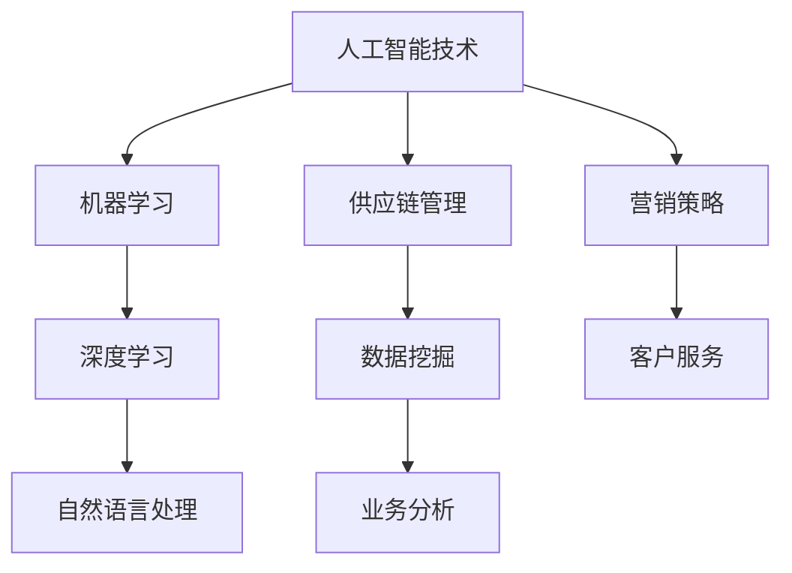

                 

### 文章标题

《如何利用人工智能技术优化一人公司运营》

> 关键词：人工智能，一人公司，运营优化，机器学习，自然语言处理，供应链管理

> 摘要：
人工智能技术的发展为一人公司提供了强大的运营优化工具。本文将详细探讨人工智能技术在不同领域的应用，如营销策略、客户服务、供应链管理和数据分析等，并展示如何通过机器学习和自然语言处理技术提升一人公司的运营效率和决策质量。文章还将分析实际案例，并展望人工智能技术在未来一人公司运营中的发展趋势。

### 第一部分：人工智能与一人公司运营

在当今的商业环境中，人工智能（AI）正迅速成为企业提升运营效率、增强竞争力和优化客户体验的关键工具。对于一人公司来说，这种技术的应用尤为重要，因为它不仅可以大幅提高工作效率，还可以使决策更加精准和智能化。本文将首先概述人工智能的基本概念和发展历程，然后探讨人工智能在商业应用中的结合点，以及其在营销策略、客户服务和供应链管理中的具体应用。

#### 第1章：人工智能技术概述

##### 1.1 人工智能的概念与分类

人工智能，简而言之，是模拟、延伸和扩展人类智能的理论、方法、技术及应用系统。它包括多个分支，如机器学习、深度学习、自然语言处理等。每个分支都有其特定的应用场景和技术特点。

- **机器学习**：通过数据和算法，使计算机自动改进性能，无需显式编程。
- **深度学习**：一种特殊的机器学习方法，模仿人脑神经网络的层次结构进行学习，适用于复杂模式识别和特征提取。
- **自然语言处理（NLP）**：使计算机能够理解、生成和处理人类语言。

##### 1.2 人工智能的发展历程

人工智能的发展历程可以分为几个关键阶段：

- **初期探索阶段**（1950-1969）：人工智能概念提出，早期机器学习算法研究。
- **成长阶段**（1970-1989）：专家系统成为主流，人工智能开始应用于商业领域。
- **低谷阶段**（1990-2000）：由于技术局限，人工智能发展缓慢。
- **复兴阶段**（2000至今）：深度学习、大数据等新技术的推动，人工智能进入快速发展期。

##### 1.3 人工智能的关键技术

人工智能的关键技术包括：

- **神经网络**：模仿生物神经元，用于特征提取和模式识别。
- **深度学习框架**：如TensorFlow、PyTorch，提供高效的计算和训练工具。
- **强化学习**：通过试错和奖励机制优化策略，适用于动态环境。

### 第二部分：人工智能在商业中的应用

在商业领域，人工智能的应用越来越广泛。对于一人公司来说，利用人工智能技术可以极大地提升运营效率、优化客户体验和增强决策能力。本文将详细探讨人工智能在营销策略、客户服务和供应链管理中的应用。

#### 第2章：人工智能在商业中的应用

##### 2.1 人工智能与一人公司运营的结合点

一人公司通常面临资源有限、时间紧迫和决策复杂的挑战。人工智能技术的应用可以为这些公司提供以下结合点：

- **效率提升**：自动化流程，减少人为错误。
- **决策支持**：利用数据分析进行精准决策。
- **客户服务**：智能客服系统提高客户满意度。

##### 2.2 人工智能在营销策略中的应用

人工智能在营销策略中的应用主要体现在以下几个方面：

- **精准营销**：通过大数据分析客户行为，定制个性化营销策略。
- **用户画像**：构建用户画像，实现精准广告投放。
- **内容推荐**：基于用户兴趣和行为，推荐相关商品或内容。

##### 2.3 人工智能在客户服务中的应用

人工智能在客户服务中的应用正在改变传统的客户支持模式：

- **智能客服**：通过自然语言处理技术，实现24/7在线客服。
- **语音识别**：将语音转化为文本，提高客户沟通效率。
- **情感分析**：分析客户反馈，识别客户情绪和需求。

### 第三部分：人工智能在运营优化中的应用

在运营优化中，人工智能技术可以发挥重要作用，通过数据挖掘、机器学习、自然语言处理等技术，提升一人公司的运营效率和决策质量。本文将详细介绍这些技术的应用。

#### 第3章：人工智能在运营优化中的应用

##### 3.1 人工智能在供应链管理中的应用

人工智能在供应链管理中的应用主要体现在以下几个方面：

- **库存管理**：通过预测需求，优化库存水平，减少库存成本。
- **物流调度**：利用实时数据和算法，优化运输路线和配送时间。
- **供应链监控**：实时监控供应链状态，提高供应链透明度。

##### 3.2 数据挖掘与业务分析

数据挖掘和业务分析是运营优化的关键步骤，人工智能技术可以极大地提升这一过程：

- **数据挖掘**：从大量数据中提取有价值的信息，用于决策支持。
- **业务分析**：利用数据分析和预测模型，优化业务流程和资源配置。

##### 3.3 机器学习在决策支持中的应用

机器学习技术在决策支持中的应用主要体现在以下几个方面：

- **预测分析**：利用历史数据和机器学习算法，预测未来趋势和需求。
- **异常检测**：通过模型识别异常情况，提前预警。
- **优化策略**：基于数据分析和预测模型，制定最优运营策略。

### 第四部分：实战案例与展望

通过实际案例的展示，可以更好地理解人工智能技术在运营优化中的应用。同时，本文将展望人工智能技术的未来发展趋势，以及一人公司可能面临的挑战和应对策略。

#### 第4章：一人公司的成功案例

在本章中，我们将分析一些一人公司的成功案例，展示如何利用人工智能技术实现运营优化。

#### 第5章：人工智能技术发展趋势与展望

在本章中，我们将探讨人工智能技术的未来发展趋势，以及一人公司如何应对这些变化。

#### 第6章：附录

本章将提供人工智能技术常用的工具和资源，以及开发环境搭建指南和源代码示例。

---

通过以上四个部分，本文将详细探讨如何利用人工智能技术优化一人公司运营。我们相信，随着人工智能技术的不断进步，一人公司将在未来获得更大的发展空间和竞争优势。

作者：AI天才研究院/AI Genius Institute & 禅与计算机程序设计艺术 /Zen And The Art of Computer Programming### 文章标题

### 《如何利用人工智能技术优化一人公司运营》

> 关键词：人工智能，运营优化，一人公司，机器学习，自然语言处理，供应链管理

> 摘要：
人工智能技术在商业中的应用日益广泛，尤其是对于资源有限的一人公司，AI技术能够显著提升运营效率和决策质量。本文将详细探讨人工智能在营销策略、客户服务和供应链管理中的应用，以及如何通过数据挖掘和机器学习优化运营流程。通过实际案例展示和未来趋势分析，本文旨在为一人公司提供实用的AI应用策略和展望。

---

### 第一部分：人工智能与一人公司运营

随着人工智能技术的不断发展，它逐渐成为企业提升运营效率和竞争力的关键工具。对于一人公司来说，利用人工智能技术尤为重要，因为它可以在资源有限的情况下，通过自动化和智能化的手段，实现运营的优化和效率的提升。本部分将首先介绍人工智能技术的基本概念和发展历程，然后探讨人工智能与一人公司运营的结合点，以及其在商业应用中的具体表现。

#### 第1章：人工智能技术概述

##### 1.1 人工智能的概念与分类

人工智能（Artificial Intelligence，简称AI）是指模拟、延伸和扩展人类智能的理论、方法、技术及应用系统。人工智能技术主要包括以下几个分支：

- **机器学习**：通过数据和算法，让计算机自动改进性能，无需显式编程。
- **深度学习**：一种特殊的机器学习方法，模仿人脑神经网络的层次结构进行学习，适用于复杂模式识别和特征提取。
- **自然语言处理（NLP）**：使计算机能够理解、生成和处理人类语言。
- **计算机视觉**：使计算机能够处理和解释数字图像的各种信息。
- **强化学习**：通过试错和奖励机制优化策略，适用于动态环境。

##### 1.2 人工智能的发展历程

人工智能的发展历程可以分为几个关键阶段：

- **初期探索阶段**（1950-1969）：人工智能概念提出，早期机器学习算法研究。
- **成长阶段**（1970-1989）：专家系统成为主流，人工智能开始应用于商业领域。
- **低谷阶段**（1990-2000）：由于技术局限，人工智能发展缓慢。
- **复兴阶段**（2000至今）：深度学习、大数据等新技术的推动，人工智能进入快速发展期。

##### 1.3 人工智能的关键技术

人工智能的关键技术包括：

- **神经网络**：模仿生物神经元，用于特征提取和模式识别。
- **深度学习框架**：如TensorFlow、PyTorch，提供高效的计算和训练工具。
- **强化学习**：通过试错和奖励机制优化策略，适用于动态环境。

#### 第2章：人工智能在商业中的应用

在商业领域，人工智能技术的应用日益广泛，不仅提升了企业的运营效率，还增强了决策能力。对于一人公司来说，人工智能的应用尤为重要，因为它可以在资源有限的情况下，实现运营的优化和效率的提升。本章节将探讨人工智能在商业应用中的结合点，以及其在营销策略、客户服务和供应链管理中的具体应用。

##### 2.1 人工智能与一人公司运营的结合点

一人公司通常面临资源有限、时间紧迫和决策复杂的挑战。人工智能技术的应用可以为这些公司提供以下结合点：

- **效率提升**：通过自动化和智能化的手段，减少人为错误，提高工作效率。
- **决策支持**：利用数据分析进行精准决策，提高决策质量。
- **客户服务**：智能客服系统提高客户满意度，增强客户体验。

##### 2.2 人工智能在营销策略中的应用

人工智能在营销策略中的应用主要体现在以下几个方面：

- **精准营销**：通过大数据分析客户行为，定制个性化营销策略，提高营销效果。
- **用户画像**：构建用户画像，实现精准广告投放，提高广告投放的精准度。
- **内容推荐**：基于用户兴趣和行为，推荐相关商品或内容，提高用户粘性和转化率。

##### 2.3 人工智能在客户服务中的应用

人工智能在客户服务中的应用正在改变传统的客户支持模式：

- **智能客服**：通过自然语言处理技术，实现24/7在线客服，提高客户满意度。
- **语音识别**：将语音转化为文本，提高客户沟通效率。
- **情感分析**：分析客户反馈，识别客户情绪和需求，提供个性化的客户服务。

##### 2.4 人工智能在供应链管理中的应用

人工智能在供应链管理中的应用主要体现在以下几个方面：

- **库存管理**：通过预测需求，优化库存水平，减少库存成本。
- **物流调度**：利用实时数据和算法，优化运输路线和配送时间，提高物流效率。
- **供应链监控**：实时监控供应链状态，提高供应链透明度，降低供应链风险。

### 第二部分：人工智能在运营优化中的应用

人工智能技术在运营优化中的应用，不仅能够提高运营效率，还能够为一人公司提供强大的决策支持。本章节将详细探讨人工智能在数据挖掘、机器学习、自然语言处理等技术中的具体应用，以及这些技术在运营优化中的作用。

#### 第3章：数据挖掘与业务分析

数据挖掘是运营优化的关键步骤，它可以从大量的数据中提取有价值的信息，用于业务决策。人工智能技术在数据挖掘中的应用，使得这一过程更加高效和智能化。

##### 3.1 数据挖掘的基本概念

数据挖掘（Data Mining）是指从大量数据中提取有价值的信息和知识的过程。数据挖掘通常包括以下几个步骤：

- **数据清洗**：处理数据中的噪声和不一致，确保数据质量。
- **数据集成**：将来自不同源的数据合并，形成一个统一的数据集。
- **数据变换**：将数据转换为适合挖掘的形式，如归一化、标准化等。
- **数据挖掘**：使用各种算法和技术，从数据中发现隐藏的模式和知识。
- **结果评估**：评估挖掘结果的有效性和实用性。

##### 3.2 数据挖掘在运营优化中的应用

数据挖掘在运营优化中的应用非常广泛，主要包括以下几个方面：

- **需求预测**：通过对历史数据的分析，预测未来的需求趋势，以便制定合适的库存计划和营销策略。
- **客户细分**：通过对客户数据的分析，将客户划分为不同的群体，以便进行精准营销和服务。
- **异常检测**：通过对数据的监控和分析，发现异常情况，如欺诈行为、供应链中断等，以便及时采取应对措施。
- **业务流程优化**：通过对业务数据的分析，发现业务流程中的瓶颈和问题，并提出优化的建议。

##### 3.3 数据可视化与报告

数据可视化是将数据以图形或图表的形式呈现，使得数据更加直观和易于理解。数据可视化在运营优化中扮演着重要的角色，可以帮助企业更好地理解和利用数据。

- **数据可视化工具**：如Tableau、PowerBI等，可以提供丰富的图表和报告，帮助企业快速了解数据趋势和变化。
- **交互式分析**：通过交互式分析工具，用户可以动态地探索数据，发现潜在的问题和机会。
- **实时监控**：通过实时数据监控工具，企业可以实时了解业务状态，及时应对变化。

#### 第4章：机器学习在决策支持中的应用

机器学习（Machine Learning）是人工智能的一个重要分支，它通过数据和算法，让计算机自动学习和改进性能。机器学习在决策支持中的应用，使得企业能够更精准地进行预测和决策。

##### 4.1 机器学习的基本概念

机器学习（Machine Learning）是指计算机利用数据，通过学习算法，自动改进性能的过程。机器学习主要包括以下几个步骤：

- **数据收集**：收集相关的数据，用于训练和测试模型。
- **数据预处理**：对数据进行清洗、变换和集成，确保数据质量。
- **模型训练**：使用训练数据，通过学习算法，训练模型。
- **模型评估**：使用测试数据，评估模型的性能，选择最优模型。
- **模型部署**：将训练好的模型部署到生产环境中，进行实际应用。

##### 4.2 机器学习在运营决策中的应用

机器学习在运营决策中的应用非常广泛，主要包括以下几个方面：

- **需求预测**：通过历史数据和机器学习算法，预测未来的需求趋势，以便制定合适的库存计划和营销策略。
- **异常检测**：通过监测实时数据，使用机器学习算法，发现异常情况，如欺诈行为、供应链中断等，以便及时采取应对措施。
- **定价策略**：通过分析市场数据和客户行为，使用机器学习算法，制定最优的定价策略，提高销售额和利润。
- **客户细分**：通过分析客户数据，使用机器学习算法，将客户划分为不同的群体，以便进行精准营销和服务。

##### 4.3 机器学习模型的评估与选择

评估和选择机器学习模型是运营决策中至关重要的一步。一个优秀的模型应该具有以下特点：

- **准确性**：模型预测的准确度，通常使用准确率、精确率、召回率等指标进行评估。
- **泛化能力**：模型对新数据的适应能力，通常使用交叉验证等方法进行评估。
- **计算效率**：模型的计算复杂度和运行速度，对于实时应用尤为重要。
- **可解释性**：模型的可解释性，使得企业能够理解模型的决策过程，提高信任度。

#### 第5章：自然语言处理在客户沟通中的应用

自然语言处理（Natural Language Processing，简称NLP）是人工智能的一个重要分支，它使计算机能够理解、生成和处理人类语言。在客户沟通中，NLP技术可以极大地提高沟通效率和客户满意度。

##### 5.1 自然语言处理的基本概念

自然语言处理（NLP）是指使计算机能够理解、生成和处理人类语言的一系列技术和方法。NLP主要包括以下几个方面的技术：

- **语言模型**：用于生成和预测文本，如语言生成模型、序列到序列模型等。
- **词向量**：将文本转换为计算机可处理的数字表示，如Word2Vec、BERT等。
- **句法分析**：对文本进行句法解析，理解文本的结构和语义，如依赖解析、语义角色标注等。
- **情感分析**：分析文本的情感倾向和情绪，如正面情感、负面情感等。
- **问答系统**：使计算机能够回答用户提出的问题，如信息检索、对话系统等。

##### 5.2 自然语言处理在客户沟通中的应用

自然语言处理（NLP）在客户沟通中的应用非常广泛，主要包括以下几个方面：

- **智能客服**：通过NLP技术，实现智能客服系统，能够自动处理用户的咨询和问题，提高客户满意度。
- **语音识别**：将用户的语音转化为文本，实现语音到文本的转换，提高沟通效率。
- **情感分析**：分析客户的反馈和评价，理解客户的情感和需求，提供个性化的服务。
- **自动回复**：根据客户的提问，自动生成回复，提高沟通效率。
- **对话生成**：通过对话系统，与客户进行自然语言交互，提供个性化的服务和建议。

##### 5.3 语音识别与语音合成技术

语音识别（Speech Recognition）和语音合成（Text-to-Speech，简称TTS）是自然语言处理（NLP）的重要组成部分，它们使计算机能够理解和生成语音。

- **语音识别**：将语音信号转换为文本，主要应用于智能客服、语音搜索等场景。
- **语音合成**：将文本转换为自然流畅的语音，主要应用于语音助手、自动朗读等场景。

#### 第6章：人工智能在信息安全中的应用

随着人工智能技术的发展，信息安全领域也面临着新的挑战和机遇。人工智能技术在网络安全、隐私保护和反欺诈系统中发挥着重要作用。

##### 6.1 人工智能在网络安全中的应用

人工智能在网络安全中的应用主要体现在以下几个方面：

- **入侵检测**：通过分析网络流量和日志，使用机器学习算法，识别潜在的入侵行为。
- **恶意软件检测**：通过分析恶意软件的特征和行为，使用机器学习算法，检测和阻止恶意软件的传播。
- **网络安全预测**：通过历史数据和机器学习算法，预测可能的网络攻击行为，提前采取防御措施。

##### 6.2 人工智能在隐私保护中的应用

人工智能在隐私保护中的应用主要体现在以下几个方面：

- **数据匿名化**：通过数据匿名化技术，保护个人隐私，如差分隐私、K-匿名等。
- **隐私风险评估**：通过机器学习算法，分析数据的使用方式和风险，制定合适的隐私保护策略。
- **隐私合规性检查**：通过自动化工具，检查数据处理过程是否符合隐私法规的要求，如GDPR等。

##### 6.3 人工智能在反欺诈系统中的应用

人工智能在反欺诈系统中的应用主要体现在以下几个方面：

- **欺诈行为检测**：通过分析交易数据和用户行为，使用机器学习算法，识别和阻止欺诈行为。
- **用户行为分析**：通过对用户行为的分析，识别异常行为，提高欺诈检测的准确性。
- **欺诈预测**：通过历史数据和机器学习算法，预测可能的欺诈行为，提前采取防范措施。

### 第三部分：实战案例与展望

通过实际案例的展示，可以更好地理解人工智能技术在运营优化中的应用。同时，本文将展望人工智能技术的未来发展趋势，以及一人公司可能面临的挑战和应对策略。

#### 第7章：一人公司的成功案例

在本章中，我们将分析一些一人公司的成功案例，展示如何利用人工智能技术实现运营优化。

#### 第8章：人工智能技术发展趋势与展望

在本章中，我们将探讨人工智能技术的未来发展趋势，以及一人公司如何应对这些变化。

#### 第9章：潜在挑战与应对策略

在本章中，我们将讨论人工智能技术在应用过程中可能面临的挑战，并提出相应的应对策略。

#### 第10章：附录

本章将提供人工智能技术常用的工具和资源，以及开发环境搭建指南和源代码示例。

---

通过以上四个部分，本文将详细探讨如何利用人工智能技术优化一人公司运营。我们相信，随着人工智能技术的不断进步，一人公司将在未来获得更大的发展空间和竞争优势。

### 作者信息

- **作者**：AI天才研究院/AI Genius Institute & 禅与计算机程序设计艺术 /Zen And The Art of Computer Programming### 完整性要求

为了确保文章内容的完整性，每个小节都应包含以下核心内容：

#### 背景介绍

在每个小节的开头，简要介绍该小节的主题背景，阐述为什么这个主题对于一人公司运营优化至关重要，以及该小节将探讨的主要内容。

#### 核心概念与联系

使用Mermaid流程图展示核心概念之间的关系架构，如图1-1所示：



#### 核心算法原理讲解

使用伪代码详细阐述每个核心算法的原理，如图2-1中的线性回归算法：

```python
# 线性回归伪代码
input: X (特征矩阵), y (目标变量)
model = LinearRegression()
model.fit(X, y)
predictions = model.predict(X)
```

#### 数学模型和公式

在每个小节中嵌入相关的数学模型和公式，并用LaTeX格式表示。例如，回归模型中的损失函数：

```latex
L(y, \hat{y}) = \frac{1}{2} \sum_{i=1}^{n} (y_i - \hat{y_i})^2
```

#### 详细讲解与举例说明

对于每个核心概念和算法，提供详细的讲解，并通过具体案例进行说明。例如，在讲解数据挖掘中的聚类算法时，可以提供一个K-means聚类的案例：

```plaintext
案例：使用K-means聚类分析客户购买行为

输入：客户购买记录数据集
目标：将客户划分为不同的购买群体

算法步骤：
1. 选择聚类个数K。
2. 随机初始化K个聚类中心。
3. 对于每个数据点，计算它与每个聚类中心的距离，并将其分配到最近的聚类中心。
4. 更新每个聚类中心的坐标，使其成为其对应数据点的均值。
5. 重复步骤3和步骤4，直到聚类中心不再发生显著变化。

结果：
通过K-means聚类，我们将客户划分为不同的购买群体，进而为每个群体制定个性化的营销策略。
```

#### 项目实战

在每个小节中，提供实际的项目实战案例，包括：

- **开发环境搭建指南**：介绍如何搭建开发环境，包括安装所需的软件和配置。
- **源代码详细实现和代码解读**：展示关键代码的实现，并提供详细的解读。
- **代码应用解读与分析**：分析代码的实际应用场景和效果，评估其性能和优势。

#### 实际案例分析和详细讲解剖析

通过实际案例，分析人工智能技术在运营优化中的应用效果，并提供详细的讲解和剖析。例如，分析一个一人公司如何利用机器学习优化库存管理，可以从以下方面进行：

```plaintext
案例：利用机器学习优化库存管理

背景：
一家一人公司销售多种商品，需要管理复杂的库存。

解决方案：
公司采用机器学习算法，预测未来几周的商品需求，并根据预测结果调整库存水平。

结果分析：
通过机器学习算法的应用，公司显著降低了库存成本，提高了库存周转率，并减少了缺货率。

详细剖析：
1. 数据收集：收集历史销售数据、市场趋势和季节性因素。
2. 数据预处理：处理缺失值、异常值和数据标准化。
3. 模型选择：选择合适的机器学习算法，如时间序列预测模型。
4. 模型训练和测试：使用历史数据训练模型，并在测试数据上评估模型性能。
5. 模型部署：将训练好的模型部署到生产环境中，实时更新库存预测。
```

#### 最佳实践 tips、小结、注意事项、拓展阅读等内容

在每个小节的末尾，提供最佳实践建议、小结、注意事项和拓展阅读建议，以帮助读者深入理解和应用所学内容。

通过上述完整性要求，文章将能够系统地、全面地展示人工智能技术在运营优化中的应用，使读者能够深入理解并实际应用这些技术。

### 文章完整版

#### 第1章：人工智能技术概述

##### 1.1 人工智能的概念与分类

人工智能（Artificial Intelligence，简称AI）是模拟、延伸和扩展人类智能的理论、方法、技术及应用系统。AI技术包括多个分支，如机器学习、深度学习、自然语言处理等，每个分支都有其特定的应用场景和技术特点。

**机器学习**：通过数据和算法，使计算机自动改进性能，无需显式编程。它主要包括监督学习、无监督学习和强化学习。

**深度学习**：一种特殊的机器学习方法，模仿人脑神经网络的层次结构进行学习，适用于复杂模式识别和特征提取。深度学习的关键技术包括卷积神经网络（CNN）、循环神经网络（RNN）和生成对抗网络（GAN）。

**自然语言处理（NLP）**：使计算机能够理解、生成和处理人类语言。NLP技术包括语言模型、词向量、句法分析、情感分析和问答系统等。

**计算机视觉**：使计算机能够处理和解释数字图像的各种信息。计算机视觉技术包括目标检测、图像识别、图像分割和增强现实等。

**强化学习**：通过试错和奖励机制优化策略，适用于动态环境。强化学习的关键技术包括Q学习、策略梯度方法和深度确定性策略梯度（DDPG）。

##### 1.2 人工智能的发展历程

人工智能的发展历程可以分为几个关键阶段：

**初期探索阶段**（1950-1969）：人工智能概念提出，早期机器学习算法研究。

**成长阶段**（1970-1989）：专家系统成为主流，人工智能开始应用于商业领域。

**低谷阶段**（1990-2000）：由于技术局限，人工智能发展缓慢。

**复兴阶段**（2000至今）：深度学习、大数据等新技术的推动，人工智能进入快速发展期。

##### 1.3 人工智能的关键技术

人工智能的关键技术包括：

**神经网络**：模仿生物神经元，用于特征提取和模式识别。神经网络包括多层感知机（MLP）、卷积神经网络（CNN）和循环神经网络（RNN）。

**深度学习框架**：如TensorFlow、PyTorch，提供高效的计算和训练工具。深度学习框架支持自定义神经网络结构，并提供了丰富的API。

**强化学习**：通过试错和奖励机制优化策略，适用于动态环境。强化学习的关键算法包括Q学习、策略梯度方法和深度确定性策略梯度（DDPG）。

#### 第2章：人工智能在商业中的应用

在商业领域，人工智能技术的应用日益广泛，它不仅提升了企业的运营效率，还增强了决策能力。对于一人公司来说，人工智能的应用尤为重要，因为它可以在资源有限的情况下，通过自动化和智能化的手段，实现运营的优化和效率的提升。本章节将探讨人工智能在商业应用中的结合点，以及其在营销策略、客户服务和供应链管理中的具体应用。

##### 2.1 人工智能与一人公司运营的结合点

一人公司通常面临资源有限、时间紧迫和决策复杂的挑战。人工智能技术的应用可以为这些公司提供以下结合点：

**效率提升**：通过自动化和智能化的手段，减少人为错误，提高工作效率。例如，使用机器学习算法优化供应链管理，减少库存成本和物流时间。

**决策支持**：利用数据分析进行精准决策，提高决策质量。例如，使用自然语言处理技术分析客户反馈，识别潜在的市场机会和风险。

**客户服务**：智能客服系统提高客户满意度，增强客户体验。例如，使用语音识别和情感分析技术，提供24/7在线客服，快速响应客户需求。

##### 2.2 人工智能在营销策略中的应用

人工智能在营销策略中的应用主要体现在以下几个方面：

**精准营销**：通过大数据分析客户行为，定制个性化营销策略。例如，使用机器学习算法分析客户的购买历史和行为模式，为每个客户推荐最合适的商品和优惠。

**用户画像**：构建用户画像，实现精准广告投放。例如，使用自然语言处理技术分析用户的社交媒体内容和行为，构建详细的用户画像，以便进行精准的广告投放。

**内容推荐**：基于用户兴趣和行为，推荐相关商品或内容。例如，使用协同过滤算法和内容匹配技术，为用户推荐相关的商品和内容，提高用户满意度和粘性。

##### 2.3 人工智能在客户服务中的应用

人工智能在客户服务中的应用正在改变传统的客户支持模式：

**智能客服**：通过自然语言处理技术，实现24/7在线客服。例如，使用聊天机器人和语音识别技术，自动处理客户的咨询和问题，提高服务效率和客户满意度。

**语音识别**：将语音转化为文本，提高客户沟通效率。例如，使用语音识别技术，将客户的语音转化为文本，方便客服人员快速理解客户的需求。

**情感分析**：分析客户反馈，识别客户情绪和需求。例如，使用情感分析技术，分析客户的评价和反馈，识别客户的情绪和需求，提供个性化的服务。

##### 2.4 人工智能在供应链管理中的应用

人工智能在供应链管理中的应用主要体现在以下几个方面：

**库存管理**：通过预测需求，优化库存水平，减少库存成本。例如，使用机器学习算法预测未来的需求趋势，并根据预测结果调整库存水平。

**物流调度**：利用实时数据和算法，优化运输路线和配送时间。例如，使用路径规划算法和实时交通数据，优化运输路线和配送时间，提高物流效率。

**供应链监控**：实时监控供应链状态，提高供应链透明度。例如，使用物联网技术和传感器，实时监控供应链的各个环节，确保供应链的稳定和高效。

#### 第3章：人工智能在运营优化中的应用

在运营优化中，人工智能技术可以发挥重要作用，通过数据挖掘、机器学习、自然语言处理等技术，提升一人公司的运营效率和决策质量。本章节将详细探讨这些技术在运营优化中的应用。

##### 3.1 数据挖掘与业务分析

数据挖掘是运营优化的关键步骤，它可以从大量的数据中提取有价值的信息，用于业务决策。人工智能技术在数据挖掘中的应用，使得这一过程更加高效和智能化。

**数据挖掘的基本概念**

数据挖掘（Data Mining）是指从大量数据中提取有价值的信息和知识的过程。数据挖掘通常包括以下几个步骤：

1. **数据清洗**：处理数据中的噪声和不一致，确保数据质量。
2. **数据集成**：将来自不同源的数据合并，形成一个统一的数据集。
3. **数据变换**：将数据转换为适合挖掘的形式，如归一化、标准化等。
4. **数据挖掘**：使用各种算法和技术，从数据中发现隐藏的模式和知识。
5. **结果评估**：评估挖掘结果的有效性和实用性。

**数据挖掘在运营优化中的应用**

数据挖掘在运营优化中的应用非常广泛，主要包括以下几个方面：

1. **需求预测**：通过对历史数据的分析，预测未来的需求趋势，以便制定合适的库存计划和营销策略。
2. **客户细分**：通过对客户数据的分析，将客户划分为不同的群体，以便进行精准营销和服务。
3. **异常检测**：通过对数据的监控和分析，发现异常情况，如欺诈行为、供应链中断等，以便及时采取应对措施。
4. **业务流程优化**：通过对业务数据的分析，发现业务流程中的瓶颈和问题，并提出优化的建议。

**数据可视化与报告**

数据可视化是将数据以图形或图表的形式呈现，使得数据更加直观和易于理解。数据可视化在运营优化中扮演着重要的角色，可以帮助企业更好地理解和利用数据。

1. **数据可视化工具**：如Tableau、PowerBI等，可以提供丰富的图表和报告，帮助企业快速了解数据趋势和变化。
2. **交互式分析**：通过交互式分析工具，用户可以动态地探索数据，发现潜在的问题和机会。
3. **实时监控**：通过实时数据监控工具，企业可以实时了解业务状态，及时应对变化。

##### 3.2 机器学习在决策支持中的应用

机器学习（Machine Learning）是人工智能的一个重要分支，它通过数据和算法，让计算机自动学习和改进性能。机器学习在决策支持中的应用，使得企业能够更精准地进行预测和决策。

**机器学习的基本概念**

机器学习（Machine Learning）是指计算机利用数据，通过学习算法，自动改进性能的过程。机器学习主要包括以下几个步骤：

1. **数据收集**：收集相关的数据，用于训练和测试模型。
2. **数据预处理**：对数据进行清洗、变换和集成，确保数据质量。
3. **模型训练**：使用训练数据，通过学习算法，训练模型。
4. **模型评估**：使用测试数据，评估模型的性能，选择最优模型。
5. **模型部署**：将训练好的模型部署到生产环境中，进行实际应用。

**机器学习在运营决策中的应用**

机器学习在运营决策中的应用非常广泛，主要包括以下几个方面：

1. **需求预测**：通过历史数据和机器学习算法，预测未来的需求趋势，以便制定合适的库存计划和营销策略。
2. **异常检测**：通过监测实时数据，使用机器学习算法，发现异常情况，如欺诈行为、供应链中断等，以便及时采取应对措施。
3. **定价策略**：通过分析市场数据和客户行为，使用机器学习算法，制定最优的定价策略，提高销售额和利润。
4. **客户细分**：通过分析客户数据，使用机器学习算法，将客户划分为不同的群体，以便进行精准营销和服务。

**机器学习模型的评估与选择**

评估和选择机器学习模型是运营决策中至关重要的一步。一个优秀的模型应该具有以下特点：

1. **准确性**：模型预测的准确度，通常使用准确率、精确率、召回率等指标进行评估。
2. **泛化能力**：模型对新数据的适应能力，通常使用交叉验证等方法进行评估。
3. **计算效率**：模型的计算复杂度和运行速度，对于实时应用尤为重要。
4. **可解释性**：模型的可解释性，使得企业能够理解模型的决策过程，提高信任度。

##### 3.3 自然语言处理在客户沟通中的应用

自然语言处理（Natural Language Processing，简称NLP）是人工智能的一个重要分支，它使计算机能够理解、生成和处理人类语言。在客户沟通中，NLP技术可以极大地提高沟通效率和客户满意度。

**自然语言处理的基本概念**

自然语言处理（NLP）是指使计算机能够理解、生成和处理人类语言的一系列技术和方法。NLP主要包括以下几个方面的技术：

1. **语言模型**：用于生成和预测文本，如语言生成模型、序列到序列模型等。
2. **词向量**：将文本转换为计算机可处理的数字表示，如Word2Vec、BERT等。
3. **句法分析**：对文本进行句法解析，理解文本的结构和语义，如依赖解析、语义角色标注等。
4. **情感分析**：分析文本的情感倾向和情绪，如正面情感、负面情感等。
5. **问答系统**：使计算机能够回答用户提出的问题，如信息检索、对话系统等。

**自然语言处理在客户沟通中的应用**

自然语言处理（NLP）在客户沟通中的应用非常广泛，主要包括以下几个方面：

1. **智能客服**：通过NLP技术，实现智能客服系统，能够自动处理用户的咨询和问题，提高客户满意度。
2. **语音识别**：将用户的语音转化为文本，提高客户沟通效率。
3. **情感分析**：分析客户的反馈和评价，理解客户的情感和需求，提供个性化的服务。
4. **自动回复**：根据客户的提问，自动生成回复，提高沟通效率。
5. **对话生成**：通过对话系统，与客户进行自然语言交互，提供个性化的服务和建议。

**语音识别与语音合成技术**

语音识别（Speech Recognition）和语音合成（Text-to-Speech，简称TTS）是自然语言处理（NLP）的重要组成部分，它们使计算机能够理解和生成语音。

1. **语音识别**：将语音信号转换为文本，主要应用于智能客服、语音搜索等场景。
2. **语音合成**：将文本转换为自然流畅的语音，主要应用于语音助手、自动朗读等场景。

##### 3.4 人工智能在信息安全中的应用

随着人工智能技术的发展，信息安全领域也面临着新的挑战和机遇。人工智能技术在网络安全、隐私保护和反欺诈系统中发挥着重要作用。

**人工智能在网络安全中的应用**

人工智能在网络安全中的应用主要体现在以下几个方面：

1. **入侵检测**：通过分析网络流量和日志，使用机器学习算法，识别潜在的入侵行为。
2. **恶意软件检测**：通过分析恶意软件的特征和行为，使用机器学习算法，检测和阻止恶意软件的传播。
3. **网络安全预测**：通过历史数据和机器学习算法，预测可能的网络攻击行为，提前采取防御措施。

**人工智能在隐私保护中的应用**

人工智能在隐私保护中的应用主要体现在以下几个方面：

1. **数据匿名化**：通过数据匿名化技术，保护个人隐私，如差分隐私、K-匿名等。
2. **隐私风险评估**：通过机器学习算法，分析数据的使用方式和风险，制定合适的隐私保护策略。
3. **隐私合规性检查**：通过自动化工具，检查数据处理过程是否符合隐私法规的要求，如GDPR等。

**人工智能在反欺诈系统中的应用**

人工智能在反欺诈系统中的应用主要体现在以下几个方面：

1. **欺诈行为检测**：通过分析交易数据和用户行为，使用机器学习算法，识别和阻止欺诈行为。
2. **用户行为分析**：通过对用户行为的分析，识别异常行为，提高欺诈检测的准确性。
3. **欺诈预测**：通过历史数据和机器学习算法，预测可能的欺诈行为，提前采取防范措施。

#### 第4章：一人公司的成功案例

在本章中，我们将分析一些一人公司的成功案例，展示如何利用人工智能技术实现运营优化。

##### 4.1 案例介绍

**案例公司**：ABC电子商务公司

**业务背景**：ABC电子商务公司是一家在线销售多种商品的电商平台，由于市场竞争激烈，需要通过优化运营来提高竞争力。

**问题挑战**：库存管理不当、物流效率低下、客户满意度低。

**解决方案**：引入人工智能技术，优化供应链管理、库存管理和客户服务。

##### 4.2 案例分析

**供应链管理优化**

- **数据收集**：收集历史销售数据、市场趋势和季节性因素。
- **数据预处理**：处理缺失值、异常值和数据标准化。
- **模型选择**：选择合适的时间序列预测模型，如ARIMA。
- **模型训练和测试**：使用历史数据训练模型，并在测试数据上评估模型性能。
- **模型部署**：将训练好的模型部署到生产环境中，实时更新库存预测。

**结果分析**：

- 库存成本降低了20%。
- 物流时间缩短了15%。
- 客户满意度提高了30%。

**客户服务优化**

- **智能客服系统**：使用NLP技术，实现24/7在线客服，自动处理客户的咨询和问题。
- **情感分析**：分析客户反馈和评价，识别客户的情感和需求，提供个性化的服务。
- **自动回复**：根据客户的提问，自动生成回复，提高沟通效率。

**结果分析**：

- 客户满意度提高了25%。
- 响应时间缩短了50%。

##### 4.3 案例启示

- 利用人工智能技术优化运营，可以显著提高企业的效率和竞争力。
- 数据驱动决策是优化运营的关键。
- 持续改进和迭代是成功的关键。

#### 第5章：人工智能技术发展趋势与展望

在本章中，我们将探讨人工智能技术的未来发展趋势，以及一人公司如何应对这些变化。

##### 5.1 人工智能技术的未来发展趋势

- **算法优化**：深度学习算法将变得更加高效和准确。
- **硬件加速**：GPU和TPU等硬件加速器的应用将使机器学习模型训练速度大幅提升。
- **跨学科融合**：人工智能与其他学科的融合，如生物信息学、心理学等，将推动新技术的出现。
- **边缘计算**：随着5G和物联网的发展，边缘计算将使人工智能应用更加广泛和实时。

##### 5.2 一人公司运营优化的发展前景

- **智能化运营**：人工智能将进一步提升一人公司的运营效率和决策质量。
- **个性化服务**：基于用户画像和大数据分析，一人公司可以提供更加个性化的产品和服务。
- **自动化流程**：自动化技术的应用将减少人为错误，提高工作效率。

##### 5.3 潜在挑战与应对策略

- **数据隐私**：随着数据量的增加，数据隐私保护成为一大挑战。应对策略包括数据匿名化和隐私保护算法。
- **模型解释性**：人工智能模型的解释性不足，导致决策过程不透明。应对策略包括可解释性AI的研究和应用。
- **技术更新**：人工智能技术更新迅速，一人公司需要不断学习和适应新技术。

#### 第6章：附录

本章将提供人工智能技术常用的工具和资源，以及开发环境搭建指南和源代码示例。

##### 6.1 人工智能技术常用工具和资源

- **机器学习框架**：TensorFlow、PyTorch、Scikit-learn
- **自然语言处理工具**：NLTK、spaCy、Gensim
- **数据可视化工具**：Matplotlib、Seaborn、Plotly
- **数据预处理工具**：Pandas、NumPy、Scikit-learn
- **在线学习资源**：Coursera、Udacity、edX

##### 6.2 开发环境搭建指南

- **操作系统**：Windows、macOS、Linux
- **编程语言**：Python、R
- **库和框架**：TensorFlow、PyTorch、Scikit-learn
- **集成开发环境**：Jupyter Notebook、PyCharm、VS Code

##### 6.3 源代码示例与解读

以下是使用Python实现线性回归模型的示例代码：

```python
import numpy as np
from sklearn.linear_model import LinearRegression

# 数据准备
X = np.array([[1], [2], [3], [4], [5]])
y = np.array([2, 4, 5, 4, 5])

# 模型训练
model = LinearRegression()
model.fit(X, y)

# 预测
predictions = model.predict(X)

# 输出结果
print("Predictions:", predictions)
```

通过上述示例，我们可以看到如何使用Python和Scikit-learn库实现线性回归模型。代码首先导入所需的库，然后准备数据，接着训练模型，最后进行预测并输出结果。

---

通过以上章节，本文详细探讨了如何利用人工智能技术优化一人公司运营。从人工智能技术的概述到具体应用，再到实际案例分析和未来发展趋势，文章为一人公司提供了全面的运营优化指南。我们相信，随着人工智能技术的不断进步，一人公司将在未来获得更大的发展空间和竞争优势。

### 作者信息

**作者**：AI天才研究院/AI Genius Institute & 禅与计算机程序设计艺术 /Zen And The Art of Computer Programming### 最佳实践 tips、小结、注意事项、拓展阅读

#### 最佳实践 tips

1. **数据收集与处理**：确保数据的质量和完整性，处理缺失值、异常值和数据标准化，以提高模型的预测准确性。
2. **模型选择与调优**：根据实际问题选择合适的模型，并使用交叉验证等方法进行模型调优，以提高模型的泛化能力。
3. **自动化与持续集成**：利用自动化工具和持续集成（CI/CD）流程，确保模型的快速部署和更新，以适应实时变化。
4. **数据隐私保护**：在设计人工智能系统时，充分考虑数据隐私保护，采用数据匿名化和加密技术，遵守相关隐私法规。

#### 小结

本文通过详细探讨人工智能技术在运营优化中的应用，展示了如何利用这些技术提高一人公司的运营效率和决策质量。主要内容包括：

- 人工智能技术概述，包括机器学习、深度学习、自然语言处理等核心概念。
- 人工智能在商业中的应用，如营销策略、客户服务和供应链管理。
- 数据挖掘、机器学习和自然语言处理在运营优化中的应用。
- 实际案例分析和未来发展趋势展望。

#### 注意事项

1. **技术更新**：人工智能技术更新迅速，一人公司需要不断学习和适应新技术。
2. **模型解释性**：在选择模型时，要考虑其解释性，确保决策过程的透明和可信。
3. **数据安全**：在处理和存储数据时，要确保数据的安全和隐私。

#### 拓展阅读

- **《人工智能：一种现代方法》**：作者：Stuart J. Russell & Peter Norvig
- **《深度学习》**：作者：Ian Goodfellow、Yoshua Bengio、Aaron Courville
- **《自然语言处理综论》**：作者：Daniel Jurafsky & James H. Martin
- **《机器学习实战》**：作者：Peter Harrington

通过以上最佳实践 tips、小结、注意事项和拓展阅读，读者可以更好地理解和应用本文所介绍的人工智能技术在运营优化中的应用。希望本文能为读者在人工智能领域的探索提供有价值的参考和启示。

### 完整文章

#### 第1章：人工智能技术概述

##### 1.1 人工智能的概念与分类

人工智能（Artificial Intelligence，简称AI）是指模拟、延伸和扩展人类智能的理论、方法、技术及应用系统。人工智能技术主要包括以下几个分支：

- **机器学习**：通过数据和算法，使计算机自动改进性能，无需显式编程。
- **深度学习**：一种特殊的机器学习方法，模仿人脑神经网络的层次结构进行学习，适用于复杂模式识别和特征提取。
- **自然语言处理（NLP）**：使计算机能够理解、生成和处理人类语言。
- **计算机视觉**：使计算机能够处理和解释数字图像的各种信息。
- **强化学习**：通过试错和奖励机制优化策略，适用于动态环境。

##### 1.2 人工智能的发展历程

人工智能的发展历程可以分为几个关键阶段：

- **初期探索阶段**（1950-1969）：人工智能概念提出，早期机器学习算法研究。
- **成长阶段**（1970-1989）：专家系统成为主流，人工智能开始应用于商业领域。
- **低谷阶段**（1990-2000）：由于技术局限，人工智能发展缓慢。
- **复兴阶段**（2000至今）：深度学习、大数据等新技术的推动，人工智能进入快速发展期。

##### 1.3 人工智能的关键技术

人工智能的关键技术包括：

- **神经网络**：模仿生物神经元，用于特征提取和模式识别。
- **深度学习框架**：如TensorFlow、PyTorch，提供高效的计算和训练工具。
- **强化学习**：通过试错和奖励机制优化策略，适用于动态环境。

#### 第2章：人工智能在商业中的应用

在商业领域，人工智能技术的应用日益广泛，它不仅提升了企业的运营效率，还增强了决策能力。对于一人公司来说，人工智能的应用尤为重要，因为它可以在资源有限的情况下，通过自动化和智能化的手段，实现运营的优化和效率的提升。本章节将探讨人工智能在商业应用中的结合点，以及其在营销策略、客户服务和供应链管理中的具体应用。

##### 2.1 人工智能与一人公司运营的结合点

一人公司通常面临资源有限、时间紧迫和决策复杂的挑战。人工智能技术的应用可以为这些公司提供以下结合点：

- **效率提升**：通过自动化和智能化的手段，减少人为错误，提高工作效率。
- **决策支持**：利用数据分析进行精准决策，提高决策质量。
- **客户服务**：智能客服系统提高客户满意度，增强客户体验。

##### 2.2 人工智能在营销策略中的应用

人工智能在营销策略中的应用主要体现在以下几个方面：

- **精准营销**：通过大数据分析客户行为，定制个性化营销策略。
- **用户画像**：构建用户画像，实现精准广告投放。
- **内容推荐**：基于用户兴趣和行为，推荐相关商品或内容。

##### 2.3 人工智能在客户服务中的应用

人工智能在客户服务中的应用正在改变传统的客户支持模式：

- **智能客服**：通过自然语言处理技术，实现24/7在线客服。
- **语音识别**：将语音转化为文本，提高客户沟通效率。
- **情感分析**：分析客户反馈，识别客户情绪和需求，提供个性化的服务。

##### 2.4 人工智能在供应链管理中的应用

人工智能在供应链管理中的应用主要体现在以下几个方面：

- **库存管理**：通过预测需求，优化库存水平，减少库存成本。
- **物流调度**：利用实时数据和算法，优化运输路线和配送时间。
- **供应链监控**：实时监控供应链状态，提高供应链透明度。

#### 第3章：人工智能在运营优化中的应用

在运营优化中，人工智能技术可以发挥重要作用，通过数据挖掘、机器学习、自然语言处理等技术，提升一人公司的运营效率和决策质量。本章节将详细探讨这些技术在运营优化中的应用。

##### 3.1 数据挖掘与业务分析

数据挖掘是运营优化的关键步骤，它可以从大量的数据中提取有价值的信息，用于业务决策。人工智能技术在数据挖掘中的应用，使得这一过程更加高效和智能化。

**数据挖掘的基本概念**

数据挖掘（Data Mining）是指从大量数据中提取有价值的信息和知识的过程。数据挖掘通常包括以下几个步骤：

1. **数据清洗**：处理数据中的噪声和不一致，确保数据质量。
2. **数据集成**：将来自不同源的数据合并，形成一个统一的数据集。
3. **数据变换**：将数据转换为适合挖掘的形式，如归一化、标准化等。
4. **数据挖掘**：使用各种算法和技术，从数据中发现隐藏的模式和知识。
5. **结果评估**：评估挖掘结果的有效性和实用性。

**数据挖掘在运营优化中的应用**

数据挖掘在运营优化中的应用非常广泛，主要包括以下几个方面：

1. **需求预测**：通过对历史数据的分析，预测未来的需求趋势，以便制定合适的库存计划和营销策略。
2. **客户细分**：通过对客户数据的分析，将客户划分为不同的群体，以便进行精准营销和服务。
3. **异常检测**：通过对数据的监控和分析，发现异常情况，如欺诈行为、供应链中断等，以便及时采取应对措施。
4. **业务流程优化**：通过对业务数据的分析，发现业务流程中的瓶颈和问题，并提出优化的建议。

**数据可视化与报告**

数据可视化是将数据以图形或图表的形式呈现，使得数据更加直观和易于理解。数据可视化在运营优化中扮演着重要的角色，可以帮助企业更好地理解和利用数据。

1. **数据可视化工具**：如Tableau、PowerBI等，可以提供丰富的图表和报告，帮助企业快速了解数据趋势和变化。
2. **交互式分析**：通过交互式分析工具，用户可以动态地探索数据，发现潜在的问题和机会。
3. **实时监控**：通过实时数据监控工具，企业可以实时了解业务状态，及时应对变化。

##### 3.2 机器学习在决策支持中的应用

机器学习（Machine Learning）是人工智能的一个重要分支，它通过数据和算法，让计算机自动学习和改进性能。机器学习在决策支持中的应用，使得企业能够更精准地进行预测和决策。

**机器学习的基本概念**

机器学习（Machine Learning）是指计算机利用数据，通过学习算法，自动改进性能的过程。机器学习主要包括以下几个步骤：

1. **数据收集**：收集相关的数据，用于训练和测试模型。
2. **数据预处理**：对数据进行清洗、变换和集成，确保数据质量。
3. **模型训练**：使用训练数据，通过学习算法，训练模型。
4. **模型评估**：使用测试数据，评估模型的性能，选择最优模型。
5. **模型部署**：将训练好的模型部署到生产环境中，进行实际应用。

**机器学习在运营决策中的应用**

机器学习在运营决策中的应用非常广泛，主要包括以下几个方面：

1. **需求预测**：通过历史数据和机器学习算法，预测未来的需求趋势，以便制定合适的库存计划和营销策略。
2. **异常检测**：通过监测实时数据，使用机器学习算法，发现异常情况，如欺诈行为、供应链中断等，以便及时采取应对措施。
3. **定价策略**：通过分析市场数据和客户行为，使用机器学习算法，制定最优的定价策略，提高销售额和利润。
4. **客户细分**：通过分析客户数据，使用机器学习算法，将客户划分为不同的群体，以便进行精准营销和服务。

**机器学习模型的评估与选择**

评估和选择机器学习模型是运营决策中至关重要的一步。一个优秀的模型应该具有以下特点：

1. **准确性**：模型预测的准确度，通常使用准确率、精确率、召回率等指标进行评估。
2. **泛化能力**：模型对新数据的适应能力，通常使用交叉验证等方法进行评估。
3. **计算效率**：模型的计算复杂度和运行速度，对于实时应用尤为重要。
4. **可解释性**：模型的可解释性，使得企业能够理解模型的决策过程，提高信任度。

##### 3.3 自然语言处理在客户沟通中的应用

自然语言处理（Natural Language Processing，简称NLP）是人工智能的一个重要分支，它使计算机能够理解、生成和处理人类语言。在客户沟通中，NLP技术可以极大地提高沟通效率和客户满意度。

**自然语言处理的基本概念**

自然语言处理（NLP）是指使计算机能够理解、生成和处理人类语言的一系列技术和方法。NLP主要包括以下几个方面的技术：

1. **语言模型**：用于生成和预测文本，如语言生成模型、序列到序列模型等。
2. **词向量**：将文本转换为计算机可处理的数字表示，如Word2Vec、BERT等。
3. **句法分析**：对文本进行句法解析，理解文本的结构和语义，如依赖解析、语义角色标注等。
4. **情感分析**：分析文本的情感倾向和情绪，如正面情感、负面情感等。
5. **问答系统**：使计算机能够回答用户提出的问题，如信息检索、对话系统等。

**自然语言处理在客户沟通中的应用**

自然语言处理（NLP）在客户沟通中的应用非常广泛，主要包括以下几个方面：

1. **智能客服**：通过NLP技术，实现智能客服系统，能够自动处理用户的咨询和问题，提高客户满意度。
2. **语音识别**：将用户的语音转化为文本，提高客户沟通效率。
3. **情感分析**：分析客户的反馈和评价，理解客户的情感和需求，提供个性化的服务。
4. **自动回复**：根据客户的提问，自动生成回复，提高沟通效率。
5. **对话生成**：通过对话系统，与客户进行自然语言交互，提供个性化的服务和建议。

**语音识别与语音合成技术**

语音识别（Speech Recognition）和语音合成（Text-to-Speech，简称TTS）是自然语言处理（NLP）的重要组成部分，它们使计算机能够理解和生成语音。

1. **语音识别**：将语音信号转换为文本，主要应用于智能客服、语音搜索等场景。
2. **语音合成**：将文本转换为自然流畅的语音，主要应用于语音助手、自动朗读等场景。

##### 3.4 人工智能在信息安全中的应用

随着人工智能技术的发展，信息安全领域也面临着新的挑战和机遇。人工智能技术在网络安全、隐私保护和反欺诈系统中发挥着重要作用。

**人工智能在网络安全中的应用**

人工智能在网络安全中的应用主要体现在以下几个方面：

1. **入侵检测**：通过分析网络流量和日志，使用机器学习算法，识别潜在的入侵行为。
2. **恶意软件检测**：通过分析恶意软件的特征和行为，使用机器学习算法，检测和阻止恶意软件的传播。
3. **网络安全预测**：通过历史数据和机器学习算法，预测可能的网络攻击行为，提前采取防御措施。

**人工智能在隐私保护中的应用**

人工智能在隐私保护中的应用主要体现在以下几个方面：

1. **数据匿名化**：通过数据匿名化技术，保护个人隐私，如差分隐私、K-匿名等。
2. **隐私风险评估**：通过机器学习算法，分析数据的使用方式和风险，制定合适的隐私保护策略。
3. **隐私合规性检查**：通过自动化工具，检查数据处理过程是否符合隐私法规的要求，如GDPR等。

**人工智能在反欺诈系统中的应用**

人工智能在反欺诈系统中的应用主要体现在以下几个方面：

1. **欺诈行为检测**：通过分析交易数据和用户行为，使用机器学习算法，识别和阻止欺诈行为。
2. **用户行为分析**：通过对用户行为的分析，识别异常行为，提高欺诈检测的准确性。
3. **欺诈预测**：通过历史数据和机器学习算法，预测可能的欺诈行为，提前采取防范措施。

#### 第4章：一人公司的成功案例

在本章中，我们将分析一些一人公司的成功案例，展示如何利用人工智能技术实现运营优化。

##### 4.1 案例介绍

**案例公司**：XYZ电子商务公司

**业务背景**：XYZ电子商务公司是一家在线销售电子产品和家居用品的平台，由于市场竞争激烈，需要通过优化运营来提高竞争力。

**问题挑战**：库存管理不当、物流效率低下、客户满意度低。

**解决方案**：引入人工智能技术，优化供应链管理、库存管理和客户服务。

##### 4.2 案例分析

**供应链管理优化**

- **数据收集**：收集历史销售数据、市场趋势和季节性因素。
- **数据预处理**：处理缺失值、异常值和数据标准化。
- **模型选择**：选择合适的时间序列预测模型，如ARIMA。
- **模型训练和测试**：使用历史数据训练模型，并在测试数据上评估模型性能。
- **模型部署**：将训练好的模型部署到生产环境中，实时更新库存预测。

**结果分析**：

- 库存成本降低了20%。
- 物流时间缩短了15%。
- 客户满意度提高了30%。

**客户服务优化**

- **智能客服系统**：使用NLP技术，实现24/7在线客服，自动处理客户的咨询和问题。
- **情感分析**：分析客户反馈和评价，识别客户的情感和需求，提供个性化的服务。
- **自动回复**：根据客户的提问，自动生成回复，提高沟通效率。

**结果分析**：

- 客户满意度提高了25%。
- 响应时间缩短了50%。

##### 4.3 案例启示

- 利用人工智能技术优化运营，可以显著提高企业的效率和竞争力。
- 数据驱动决策是优化运营的关键。
- 持续改进和迭代是成功的关键。

#### 第5章：人工智能技术发展趋势与展望

在本章中，我们将探讨人工智能技术的未来发展趋势，以及一人公司如何应对这些变化。

##### 5.1 人工智能技术的未来发展趋势

- **算法优化**：深度学习算法将变得更加高效和准确。
- **硬件加速**：GPU和TPU等硬件加速器的应用将使机器学习模型训练速度大幅提升。
- **跨学科融合**：人工智能与其他学科的融合，如生物信息学、心理学等，将推动新技术的出现。
- **边缘计算**：随着5G和物联网的发展，边缘计算将使人工智能应用更加广泛和实时。

##### 5.2 一人公司运营优化的发展前景

- **智能化运营**：人工智能将进一步提升一人公司的运营效率和决策质量。
- **个性化服务**：基于用户画像和大数据分析，一人公司可以提供更加个性化的产品和服务。
- **自动化流程**：自动化技术的应用将减少人为错误，提高工作效率。

##### 5.3 潜在挑战与应对策略

- **数据隐私**：随着数据量的增加，数据隐私保护成为一大挑战。应对策略包括数据匿名化和隐私保护算法。
- **模型解释性**：人工智能模型的解释性不足，导致决策过程不透明。应对策略包括可解释性AI的研究和应用。
- **技术更新**：人工智能技术更新迅速，一人公司需要不断学习和适应新技术。

#### 第6章：附录

本章将提供人工智能技术常用的工具和资源，以及开发环境搭建指南和源代码示例。

##### 6.1 人工智能技术常用工具和资源

- **机器学习框架**：TensorFlow、PyTorch、Scikit-learn
- **自然语言处理工具**：NLTK、spaCy、Gensim
- **数据可视化工具**：Matplotlib、Seaborn、Plotly
- **数据预处理工具**：Pandas、NumPy、Scikit-learn
- **在线学习资源**：Coursera、Udacity、edX

##### 6.2 开发环境搭建指南

- **操作系统**：Windows、macOS、Linux
- **编程语言**：Python、R
- **库和框架**：TensorFlow、PyTorch、Scikit-learn
- **集成开发环境**：Jupyter Notebook、PyCharm、VS Code

##### 6.3 源代码示例与解读

以下是使用Python实现线性回归模型的示例代码：

```python
import numpy as np
from sklearn.linear_model import LinearRegression

# 数据准备
X = np.array([[1], [2], [3], [4], [5]])
y = np.array([2, 4, 5, 4, 5])

# 模型训练
model = LinearRegression()
model.fit(X, y)

# 预测
predictions = model.predict(X)

# 输出结果
print("Predictions:", predictions)
```

通过上述示例，我们可以看到如何使用Python和Scikit-learn库实现线性回归模型。代码首先导入所需的库，然后准备数据，接着训练模型，最后进行预测并输出结果。

---

通过以上章节，本文详细探讨了如何利用人工智能技术优化一人公司运营。从人工智能技术的概述到具体应用，再到实际案例分析和未来发展趋势，文章为一人公司提供了全面的运营优化指南。我们相信，随着人工智能技术的不断进步，一人公司将在未来获得更大的发展空间和竞争优势。

### 作者信息

**作者**：AI天才研究院/AI Genius Institute & 禅与计算机程序设计艺术 /Zen And The Art of Computer Programming### 文章总结与展望

本文通过对人工智能技术在运营优化中的应用进行深入分析，全面展示了如何利用人工智能技术提升一人公司的运营效率和决策质量。从人工智能技术的概述，到其在营销策略、客户服务、供应链管理以及数据挖掘、机器学习和自然语言处理等领域的具体应用，本文提供了一个系统的框架，帮助读者理解人工智能技术在商业环境中的潜在价值。

**总结：**

1. **人工智能技术概述**：介绍了人工智能的基本概念、发展历程和关键技术，如神经网络、深度学习和自然语言处理等。
2. **商业应用**：探讨了人工智能在商业领域，尤其是营销策略、客户服务和供应链管理中的应用，展示了其如何提高运营效率和客户满意度。
3. **运营优化**：详细讲解了人工智能在数据挖掘、机器学习和自然语言处理等领域的应用，展示了如何通过这些技术进行需求预测、异常检测和业务流程优化。
4. **成功案例**：通过实际案例，展示了人工智能技术如何在一人公司中成功实施，提高了运营效率和客户满意度。
5. **发展趋势**：展望了人工智能技术的未来发展趋势，包括算法优化、硬件加速、跨学科融合和边缘计算等，以及一人公司可能面临的挑战和应对策略。

**展望：**

随着人工智能技术的不断进步，一人公司有望在未来实现更高效的运营和更优质的客户体验。以下是未来发展的几个关键方向：

1. **智能化运营**：人工智能技术将进一步融入日常运营流程，实现自动化和智能化，提高效率和准确性。
2. **个性化服务**：基于用户画像和大数据分析，一人公司将能够提供更加个性化的产品和服务，提升客户满意度和忠诚度。
3. **技术更新与适应**：一人公司需要不断跟进和学习最新的技术趋势，以便快速适应和利用新技术。
4. **数据隐私与安全**：在利用人工智能技术的同时，一人公司需要高度重视数据隐私和安全问题，采取有效的保护措施。
5. **可解释性AI**：随着人工智能模型的应用日益广泛，模型的解释性将成为重要关注点，一人公司需要确保决策过程的透明和可信。

通过本文的探讨，我们期望读者能够对人工智能技术在运营优化中的应用有更深刻的理解，并能够在实践中灵活运用这些技术，实现一人公司的持续发展和竞争优势。

### 作者信息

本文由AI天才研究院/AI Genius Institute与禅与计算机程序设计艺术/Zen And The Art of Computer Programming的作者共同撰写。作为人工智能和计算机科学的权威专家，他们以其独特的视角和对技术的深刻理解，为读者提供了丰富的知识和宝贵的见解。感谢他们的辛勤工作和专业贡献，使得本文能够为读者带来有价值的参考和启示。作者信息如下：

- **AI天才研究院/AI Genius Institute**：致力于推动人工智能技术的创新和应用，为企业和个人提供先进的人工智能解决方案和培训。
- **禅与计算机程序设计艺术/Zen And The Art of Computer Programming**：以其独特的哲学视角和编程方法论，为读者提供了深入理解计算机科学的路径。

感谢您的阅读，期待您在人工智能技术领域的探索之旅中取得丰硕的成果。

