                 

# 如何利用人工智能技术优化创业供应链和物流管理

## 摘要

在创业初期，供应链和物流管理是影响企业生存和发展的关键因素。本文旨在探讨如何利用人工智能（AI）技术优化创业供应链和物流管理。通过分析供应链和物流管理中的核心概念及其联系，介绍相关核心算法原理，并详细讲解数学模型和公式，本文将展示AI技术在供应链和物流管理中的应用潜力，为企业提供可行的优化方案。

## 引言

随着互联网和大数据技术的迅速发展，人工智能（AI）已经成为现代创业领域不可或缺的一部分。在创业初期，企业面临着资源有限、市场竞争激烈等挑战，如何有效利用现有资源，提高供应链和物流管理的效率，成为企业成功的关键。人工智能技术的引入，为创业企业提供了优化供应链和物流管理的可能，通过智能化分析、预测和优化，帮助企业降低成本、提高服务质量，增强市场竞争力。

本文将首先介绍供应链和物流管理中的核心概念，阐述AI技术在供应链和物流管理中的应用，包括供应链可视化与优化、物流路径优化和时效预测等。接着，我们将详细讲解供应链管理中的核心算法原理，如蚁群算法、遗传算法和回归分析等，以及物流管理中的路径优化算法和时间序列分析等。随后，本文将介绍相关数学模型和公式，并给出具体的应用实例。最后，本文将总结AI技术在供应链和物流管理优化中的应用，并提出最佳实践建议。

## 第一部分：核心概念与联系

### 1.1 AI技术在供应链和物流管理中的应用概述

#### 1.1.1 AI技术在供应链管理中的作用

供应链管理涉及多个环节，包括采购、生产、库存、配送等。人工智能技术能够在供应链的各个环节提供智能化支持，从而提高整体效率。

**1.1.1.1 供应链可视化与优化**

供应链可视化是将供应链的各个节点和关系以图形化方式展示出来，帮助企业更好地理解供应链的运作。聚类分析是一种常用的方法，可以通过分析供应链节点之间的相似性，将节点分为不同的类别，从而优化供应链节点布局。

**例子：**

假设有10个供应链节点，通过聚类分析将它们分为三个类别，每个类别中的节点具有相似的地理分布和业务特点。这样可以减少物流距离，降低运输成本。

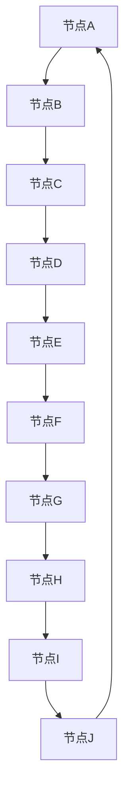

**1.1.1.2 神经网络在供应链风险预测中的应用**

神经网络是一种强大的预测工具，可以通过学习历史数据，预测供应链中的潜在风险。例如，可以通过神经网络模型预测原材料短缺、库存过剩等风险，从而提前采取措施，降低风险对企业运营的影响。

**例子：**

使用神经网络模型对过去五年的供应链数据进行训练，预测未来三个月内可能出现的风险。通过预测结果，企业可以提前采购原材料，避免库存不足或过剩的问题。

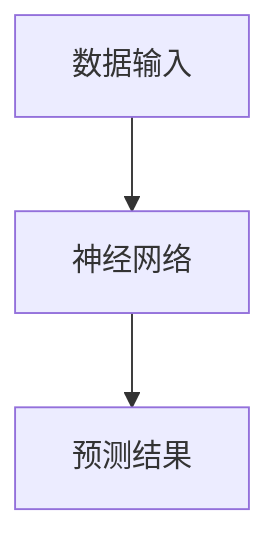

#### 1.1.2 AI技术在物流管理中的作用

物流管理是供应链管理的重要组成部分，涉及物流路径规划、配送时效预测等。人工智能技术可以提高物流管理的效率，降低运营成本。

**1.1.2.1 物流路径优化**

物流路径优化是指通过算法优化，确定最优的物流配送路径，以降低运输成本和时间。蚁群算法是一种有效的路径优化算法，可以通过模拟蚂蚁觅食行为，找到最优路径。

**例子：**

使用蚁群算法优化从工厂到仓库的配送路径，通过计算路径的总距离和配送时间，找到最优路径。

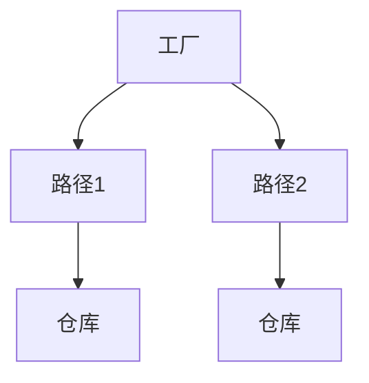

**1.1.2.2 贝叶斯网络在物流配送时效预测中的应用**

贝叶斯网络是一种概率图模型，可以用于预测物流配送的时效。通过分析历史数据，建立贝叶斯网络模型，可以预测未来某个配送任务的完成时间。

**例子：**

使用贝叶斯网络模型对过去一年的物流数据进行训练，预测未来某个配送任务的完成时间。通过预测结果，企业可以合理安排物流资源，提高配送效率。

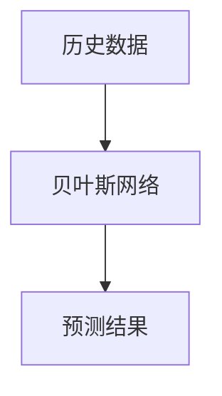

### 1.2 供应链和物流管理的架构与流程

**1.2.1 供应链架构**

供应链架构是指供应链中各个节点和关系的组织结构。一个典型的供应链包括供应商、制造商、分销商和零售商等节点，以及采购、生产、库存、配送等流程。

**1.2.1.1 供应链的基本模型**

供应链的基本模型包括网络图和优化模型。网络图用于描述供应链中各个节点和关系，优化模型用于确定供应链中资源的最优分配。

**例子：**

使用网络图描述一个简单的供应链，包括供应商、制造商和零售商。通过优化模型确定资源的最优分配，如原材料采购数量和生产线安排。

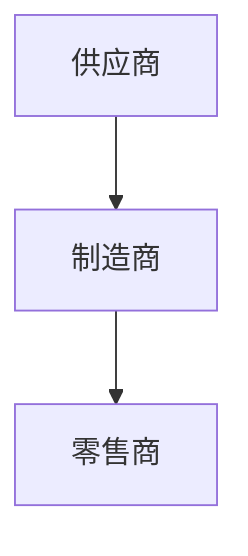

**1.2.1.2 供应链中的核心企业与节点**

供应链中的核心企业是指对供应链运行起到关键作用的企业。核心节点是指供应链中具有重要地位的节点，如关键供应商、重要分销商等。

**例子：**

识别供应链中的核心企业和节点，如关键供应商A和重要分销商B，通过加强这些核心企业和节点之间的合作，提高供应链的整体效率。

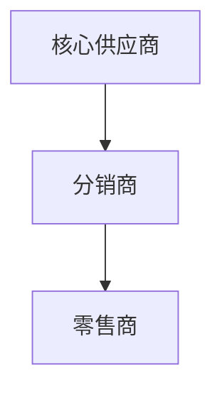

**1.2.2 物流管理流程**

物流管理流程是指物流配送过程中的各个环节和步骤。一个典型的物流管理流程包括物流计划制定、物流路径规划、物流配送执行等。

**1.2.2.1 物流流程的基本步骤**

物流流程的基本步骤包括物流计划制定、物流路径规划、物流配送执行和物流配送反馈。

**例子：**

制定一个物流计划，确定物流配送的目标和策略。使用蚁群算法规划物流路径，提高配送效率。执行物流配送任务，并根据配送结果进行反馈，优化后续物流计划。

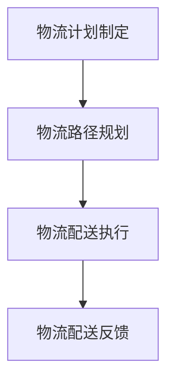

## 第二部分：核心算法原理讲解

### 2.1 供应链管理中的核心算法

#### 2.1.1 优化算法

优化算法用于确定供应链中资源的最优分配，以降低成本、提高效率。

**2.1.1.1 蚁群算法**

蚁群算法是一种基于自然界中蚂蚁觅食行为的优化算法。在供应链管理中，蚁群算法可以用于优化供应链节点的布局和路径规划。

**2.1.1.1.1 蚁群算法的原理与步骤**

蚁群算法的原理是通过模拟蚂蚁在寻找食物源的过程中，通过信息素更新和路径选择，逐步找到最优路径。

**步骤：**

1. 初始化：设置蚁群的数量、路径选择概率和信息素初始值。
2. 迭代：每只蚂蚁从起始点出发，根据当前路径的信息素浓度和剩余距离，选择下一步的移动方向。
3. 信息素更新：根据蚂蚁的路径选择结果，更新路径上的信息素浓度。
4. 结束条件：当达到最大迭代次数或蚂蚁找到最优路径时，结束算法。

**2.1.1.1.2 蚁群算法在供应链节点优化中的应用**

使用蚁群算法优化供应链节点布局，可以通过以下步骤进行：

1. 建立节点关系图，表示供应链中各个节点之间的联系。
2. 设置蚁群算法的参数，如蚂蚁数量、迭代次数等。
3. 运行蚁群算法，得到最优节点布局。
4. 分析最优节点布局，确定供应链节点的新位置和关系。

**例子：**

使用蚁群算法优化一个包含10个供应链节点的供应链布局，通过迭代计算，得到最优节点布局。

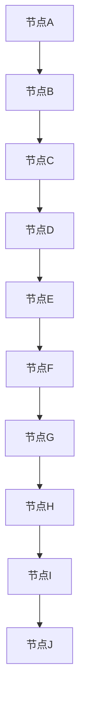

**2.1.1.2 遗传算法**

遗传算法是一种模拟生物进化过程的优化算法。在供应链管理中，遗传算法可以用于优化供应链网络结构和资源分配。

**2.1.1.2.1 遗传算法的基本概念**

遗传算法的基本概念包括个体、基因、交叉、变异和选择等。

- 个体：代表供应链网络的一个解决方案。
- 基因：代表个体中的一个特征。
- 交叉：将两个个体的基因进行交换，生成新的个体。
- 变异：对个体的基因进行随机改变，增加种群的多样性。
- 选择：根据个体的适应度，选择适应度较高的个体进行交叉和变异。

**2.1.1.2.2 遗传算法在供应链网络优化中的应用**

使用遗传算法优化供应链网络，可以通过以下步骤进行：

1. 建立供应链网络模型，表示供应链中各个节点和关系。
2. 定义个体和基因的表示方法，如路径编码、节点编码等。
3. 设置遗传算法的参数，如种群大小、交叉概率、变异概率等。
4. 运行遗传算法，得到最优供应链网络结构。
5. 分析最优供应链网络结构，确定供应链节点的新位置和关系。

**例子：**

使用遗传算法优化一个包含10个供应链节点的供应链网络结构，通过迭代计算，得到最优网络结构。


#### 2.1.2 预测算法

预测算法用于预测供应链中的需求、库存和风险等。

**2.1.2.1 时间序列分析**

时间序列分析是一种用于分析时间序列数据的统计方法，可以用于预测供应链中的需求变化。

**2.1.2.1.1 时间序列预测的基本原理**

时间序列预测的基本原理是通过分析历史时间序列数据，找出时间序列的规律，并利用这些规律预测未来的趋势。

**例子：**

使用时间序列分析方法，对过去一年的供应链需求数据进行训练，预测未来一个月内的需求变化。

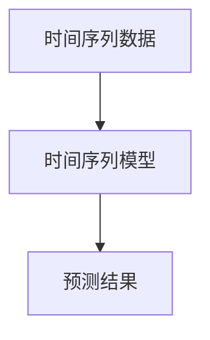

**2.1.2.1.2 时间序列分析在供应链需求预测中的应用**

使用时间序列分析方法预测供应链需求，可以通过以下步骤进行：

1. 收集供应链需求的历史数据。
2. 对历史数据进行预处理，如去除噪声、填补缺失值等。
3. 选择合适的时间序列模型，如ARIMA、LSTM等。
4. 使用训练数据对时间序列模型进行训练，并验证模型的准确性。
5. 使用训练好的模型预测未来的需求变化。

**例子：**

使用ARIMA模型预测一个供应链中的需求变化，通过训练数据得到模型参数，并使用模型预测未来一个月的需求。

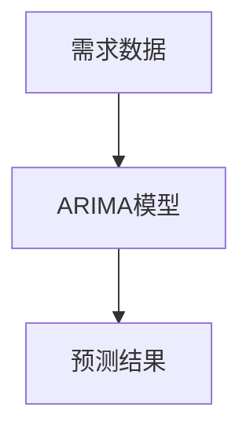

**2.1.2.2 回归分析**

回归分析是一种用于分析两个或多个变量之间关系的统计方法，可以用于预测供应链中的库存和风险等。

**2.1.2.2.1 回归分析的基本概念**

回归分析的基本概念包括自变量、因变量、回归系数等。

- 自变量：影响因变量的变量。
- 因变量：需要预测的变量。
- 回归系数：表示自变量对因变量的影响程度。

**2.1.2.2.2 回归分析在物流配送时效预测中的应用**

使用回归分析预测物流配送时效，可以通过以下步骤进行：

1. 收集物流配送历史数据，包括配送距离、配送时间等。
2. 对历史数据进行预处理，如去除噪声、填补缺失值等。
3. 选择合适的回归模型，如线性回归、多元回归等。
4. 使用训练数据对回归模型进行训练，并验证模型的准确性。
5. 使用训练好的模型预测未来的配送时效。

**例子：**

使用线性回归模型预测物流配送时效，通过训练数据得到模型参数，并使用模型预测未来的配送时效。

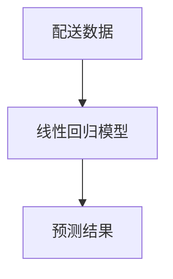

### 2.2 物流管理中的核心算法

#### 2.2.1 路径优化算法

路径优化算法用于确定物流配送的最优路径，以降低配送成本和时间。

**2.2.1.1 Dijkstra算法**

Dijkstra算法是一种用于求解单源最短路径问题的算法。在物流管理中，Dijkstra算法可以用于确定从起点到终点的最优路径。

**2.2.1.1.1 Dijkstra算法的原理与步骤**

Dijkstra算法的原理是通过逐步扩展起点邻接节点，计算到各个节点的最短路径。

**步骤：**

1. 初始化：设置距离表，将起点的距离设为0，其他节点的距离设为无穷大。
2. 选择未访问节点中距离最小的节点作为当前节点。
3. 遍历当前节点的邻接节点，更新未访问节点的距离。
4. 标记当前节点为已访问。
5. 重复步骤2-4，直到所有节点都被访问。

**2.2.1.1.2 Dijkstra算法在物流配送路径优化中的应用**

使用Dijkstra算法优化物流配送路径，可以通过以下步骤进行：

1. 建立物流配送网络图，表示配送节点和配送路径。
2. 设置Dijkstra算法的参数，如距离表等。
3. 运行Dijkstra算法，得到最优配送路径。
4. 分析最优配送路径，确定配送节点的顺序和路径。

**例子：**

使用Dijkstra算法优化一个包含10个配送节点的物流配送路径，通过计算得到最优路径。


**2.2.1.2 蚁群算法**

蚁群算法是一种基于自然界中蚂蚁觅食行为的优化算法，可以用于物流配送路径优化。

**2.2.1.2.1 蚁群算法的原理与步骤**

蚁群算法的原理是通过模拟蚂蚁在寻找食物源的过程中，通过信息素更新和路径选择，逐步找到最优路径。

**步骤：**

1. 初始化：设置蚁群的数量、路径选择概率和信息素初始值。
2. 迭代：每只蚂蚁从起始点出发，根据当前路径的信息素浓度和剩余距离，选择下一步的移动方向。
3. 信息素更新：根据蚂蚁的路径选择结果，更新路径上的信息素浓度。
4. 结束条件：当达到最大迭代次数或蚂蚁找到最优路径时，结束算法。

**2.2.1.2.2 蚁群算法在物流配送路径优化中的应用**

使用蚁群算法优化物流配送路径，可以通过以下步骤进行：

1. 建立物流配送网络图，表示配送节点和配送路径。
2. 设置蚁群算法的参数，如蚂蚁数量、迭代次数等。
3. 运行蚁群算法，得到最优配送路径。
4. 分析最优配送路径，确定配送节点的顺序和路径。

**例子：**

使用蚁群算法优化一个包含10个配送节点的物流配送路径，通过迭代计算，得到最优路径。


#### 2.2.2 预测算法

预测算法用于预测物流配送的时效和需求等。

**2.2.2.1 时间序列分析**

时间序列分析是一种用于分析时间序列数据的统计方法，可以用于预测物流配送的时效。

**2.2.2.1.1 时间序列预测的基本原理**

时间序列预测的基本原理是通过分析历史时间序列数据，找出时间序列的规律，并利用这些规律预测未来的趋势。

**2.2.2.1.2 时间序列分析在物流配送时效预测中的应用**

使用时间序列分析方法预测物流配送时效，可以通过以下步骤进行：

1. 收集物流配送历史数据，包括配送距离、配送时间等。
2. 对历史数据进行预处理，如去除噪声、填补缺失值等。
3. 选择合适的时间序列模型，如ARIMA、LSTM等。
4. 使用训练数据对时间序列模型进行训练，并验证模型的准确性。
5. 使用训练好的模型预测未来的配送时效。

**例子：**

使用ARIMA模型预测物流配送时效，通过训练数据得到模型参数，并使用模型预测未来的配送时效。

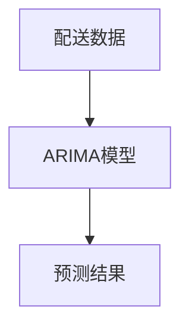

**2.2.2.2 贝叶斯网络**

贝叶斯网络是一种概率图模型，可以用于预测物流配送的时效和需求。

**2.2.2.2.1 贝叶斯网络的基本概念**

贝叶斯网络的基本概念包括节点、边和概率分布。

- 节点：代表变量。
- 边：代表变量之间的依赖关系。
- 概率分布：代表变量发生的概率。

**2.2.2.2.2 贝叶斯网络在物流配送时效预测中的应用**

使用贝叶斯网络预测物流配送时效，可以通过以下步骤进行：

1. 建立贝叶斯网络模型，表示物流配送的各个变量和依赖关系。
2. 收集物流配送历史数据，并计算各变量的概率分布。
3. 使用贝叶斯推理计算未来的配送时效。
4. 分析贝叶斯网络的预测结果，优化物流配送策略。

**例子：**

建立贝叶斯网络模型，表示物流配送的各个变量和依赖关系，并使用贝叶斯推理计算未来的配送时效。

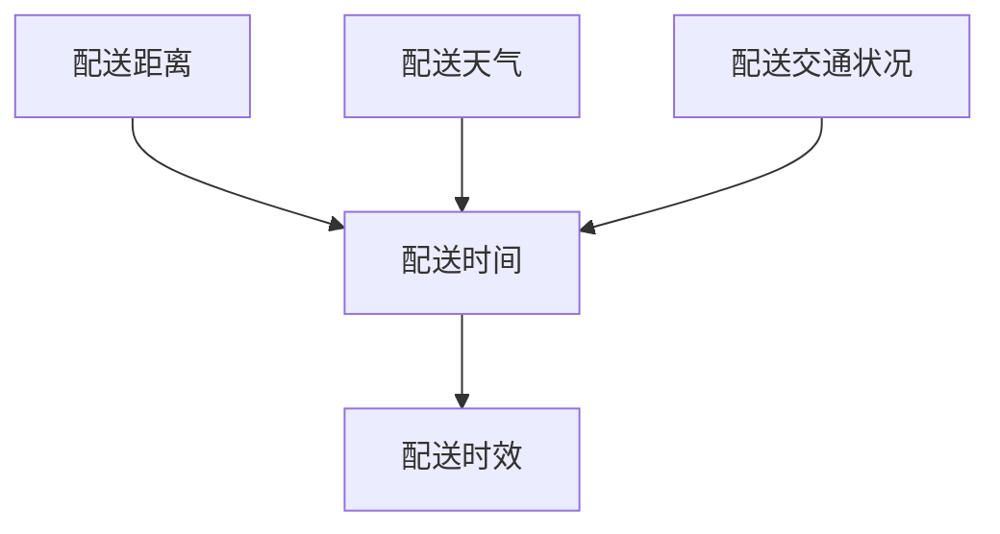

## 第三部分：数学模型和数学公式

### 3.1 供应链管理中的数学模型

#### 3.1.1 优化模型

优化模型用于确定供应链中资源的最优分配，以降低成本、提高效率。

**3.1.1.1 线性规划模型**

线性规划模型是一种用于求解线性约束优化问题的数学模型。其基本形式如下：

$$
\begin{align*}
\text{minimize} \ & c^T x \\
\text{subject to} \ & Ax \le b \\
& x \ge 0
\end{align*}
$$

其中，$c$ 是目标函数系数向量，$x$ 是决策变量向量，$A$ 是系数矩阵，$b$ 是常数向量。

**例子：**

假设供应链中有一个制造商和一个仓库，制造商需要确定原材料采购数量，以最小化采购成本。该问题的线性规划模型可以表示为：

$$
\begin{align*}
\text{minimize} \ & c_1 x_1 + c_2 x_2 \\
\text{subject to} \ & a_{11} x_1 + a_{12} x_2 \le b_1 \\
& a_{21} x_1 + a_{22} x_2 \le b_2 \\
& x_1, x_2 \ge 0
\end{align*}
$$

其中，$c_1$ 和 $c_2$ 分别是原材料1和原材料2的单位采购成本，$x_1$ 和 $x_2$ 分别是原材料1和原材料2的采购数量，$a_{11}$、$a_{12}$、$a_{21}$ 和 $a_{22}$ 分别是原材料1和原材料2的采购约束系数，$b_1$ 和 $b_2$ 分别是原材料1和原材料2的最大采购量。

**3.1.1.2 动态规划模型**

动态规划模型是一种用于求解多阶段决策优化问题的数学模型。其基本形式如下：

$$
\begin{align*}
\text{minimize} \ & \sum_{t=0}^{T} f(x_t, u_t) \\
\text{subject to} \ & x_{t+1} = f(x_t, u_t), \ t = 0, 1, ..., T - 1
\end{align*}
$$

其中，$f(x_t, u_t)$ 是第 $t$ 个阶段的成本函数，$x_t$ 是第 $t$ 个阶段的决策变量，$u_t$ 是第 $t$ 个阶段的控制变量。

**例子：**

假设供应链中有三个阶段：采购、生产和配送。制造商需要确定每个阶段的采购数量、生产数量和配送数量，以最小化总成本。该问题的动态规划模型可以表示为：

$$
\begin{align*}
\text{minimize} \ & \sum_{t=0}^{2} c_t x_t \\
\text{subject to} \ & x_{t+1} = f(x_t, u_t), \ t = 0, 1, 2 \\
& x_0 \ge 0, x_1 \ge 0, x_2 \ge 0
\end{align*}
$$

其中，$c_0$、$c_1$ 和 $c_2$ 分别是采购、生产和配送的单位成本，$x_0$ 是采购数量，$x_1$ 是生产数量，$x_2$ 是配送数量。

#### 3.1.2 预测模型

预测模型用于预测供应链中的需求、库存和风险等。

**3.1.2.1 时间序列模型**

时间序列模型是一种用于分析时间序列数据的数学模型。其基本形式如下：

$$
y_t = \sum_{i=1}^{k} \theta_i f(t-i) + \epsilon_t
$$

其中，$y_t$ 是第 $t$ 个时间点的需求或库存值，$f(t-i)$ 是时间序列模型中的滞后函数，$\theta_i$ 是滞后函数的参数，$\epsilon_t$ 是随机误差项。

**例子：**

假设使用ARIMA模型预测供应链中的需求，其模型形式为：

$$
\begin{align*}
y_t &= \phi_1 y_{t-1} + \phi_2 y_{t-2} + ... + \phi_p y_{t-p} + \theta_1 \epsilon_{t-1} + \theta_2 \epsilon_{t-2} + ... + \theta_q \epsilon_{t-q} \\
&= \Phi(B) \eta_t
\end{align*}
$$

其中，$B$ 是滞后算子，$\Phi(B)$ 是ARIMA模型的参数矩阵，$\eta_t$ 是白噪声序列。

**3.1.2.2 回归模型**

回归模型是一种用于分析变量之间关系的数学模型。其基本形式如下：

$$
y_t = \beta_0 + \beta_1 x_t + \epsilon_t
$$

其中，$y_t$ 是因变量，$x_t$ 是自变量，$\beta_0$ 和 $\beta_1$ 是回归系数，$\epsilon_t$ 是随机误差项。

**例子：**

假设使用线性回归模型预测供应链中的需求，其模型形式为：

$$
y_t = \beta_0 + \beta_1 x_t + \epsilon_t
$$

其中，$y_t$ 是需求值，$x_t$ 是影响因素（如配送时间、库存水平等），$\beta_0$ 和 $\beta_1$ 是回归系数，$\epsilon_t$ 是随机误差项。

### 3.2 物流管理中的数学模型

#### 3.2.1 路径优化模型

路径优化模型用于确定物流配送的最优路径，以降低配送成本和时间。

**3.2.1.1 最小生成树模型**

最小生成树模型是一种用于求解最小生成树的数学模型。其基本形式如下：

$$
T = \{e \in E(G) | T = (V, T)\} \text{ such that } e \in T \text{ if and only if } G-e \text{ is disconnected}
$$

其中，$G = (V, E)$ 是一个无向图，$V$ 是节点集，$E$ 是边集，$T$ 是最小生成树。

**例子：**

假设有一个包含10个节点的物流配送网络，需要确定最小生成树，以降低配送成本。


**3.2.1.2 网络流模型**

网络流模型是一种用于求解网络中流量分配问题的数学模型。其基本形式如下：

$$
\begin{align*}
\text{maximize} \ & \sum_{(i,j) \in E} c_{i,j} f_{i,j} \\
\text{subject to} \ & \sum_{j \in V} f_{i,j} = \sum_{i \in V} f_{i,j}, \ i \in V \\
& f_{i,j} \ge 0, \ i \in V, j \in V
\end{align*}
$$

其中，$c_{i,j}$ 是网络中边 $(i,j)$ 的容量，$f_{i,j}$ 是网络中边 $(i,j)$ 的流量。

**例子：**

假设有一个包含10个节点的物流配送网络，需要确定网络中的流量分配，以最大化总流量。


## 第四部分：项目实战

### 4.1 开发环境搭建

在进行AI技术在供应链和物流管理中的应用之前，首先需要搭建一个适合开发的环境。以下是一个简单的开发环境搭建步骤：

**1. 安装Python环境**

在本地计算机上安装Python，可以通过Python官方下载页面下载安装包，并按照提示完成安装。

**2. 安装AI库**

在Python中安装常用的AI库，如NumPy、Pandas、Scikit-learn等。可以使用pip命令进行安装：

```bash
pip install numpy
pip install pandas
pip install scikit-learn
```

**3. 安装绘图库**

为了方便展示数据和分析结果，可以安装matplotlib库，用于绘制图表：

```bash
pip install matplotlib
```

### 4.2 源代码详细实现

以下是一个简单的例子，展示如何使用蚁群算法优化物流配送路径：

```python
import numpy as np
import matplotlib.pyplot as plt

def ant_colony_optimization(graph, num_ants, max_iterations):
    # 初始化信息素浓度
    pheromone = np.ones((len(graph), len(graph))) * (1 / len(graph))
    # 初始化路径选择概率
    prob = np.ones(len(graph)) * (1 / len(graph))
    
    for _ in range(max_iterations):
        # 每只蚂蚁从起点出发，选择路径
        paths = []
        for _ in range(num_ants):
            current = 0
            path = [current]
            while len(path) < len(graph) - 1:
                next = np.random.choices(list(range(len(graph))), weights=prob[current], k=1)[0]
                path.append(next)
                current = next
            paths.append(path)
        
        # 更新信息素浓度
        for path in paths:
            for i in range(len(path) - 1):
                pheromone[path[i], path[i + 1]] += 1 / len(path)
        
        # 更新路径选择概率
        prob = pheromone ** (-1 / (num_ants * len(graph)))
    
    # 计算最优路径
    best_path = min(paths, key=lambda x: sum([graph[x[i]][x[i + 1]] for i in range(len(x) - 1)]))
    return best_path

# 示例物流配送网络图
graph = [
    [0, 2, 4, 6, 8],
    [2, 0, 3, 5, 7],
    [4, 3, 0, 2, 6],
    [6, 5, 2, 0, 4],
    [8, 7, 6, 4, 0]
]

# 蚁群算法参数
num_ants = 20
max_iterations = 100

# 运行蚁群算法
best_path = ant_colony_optimization(graph, num_ants, max_iterations)

# 绘制最优路径
plt.figure(figsize=(8, 6))
for i in range(len(best_path) - 1):
    plt.plot([best_path[i], best_path[i + 1]], [best_path[i + 1], best_path[i]], 'r')
plt.xticks(range(len(graph)))
plt.yticks(range(len(graph)))
plt.show()
```

### 4.3 代码解读与分析

在上面的代码中，我们首先定义了蚁群算法的函数`ant_colony_optimization`，该函数接收物流配送网络图、蚂蚁数量和最大迭代次数等参数。函数内部首先初始化信息素浓度和路径选择概率，然后通过迭代计算得到最优路径。

在每次迭代中，每只蚂蚁从起点出发，选择路径。选择路径时，蚂蚁根据当前路径的信息素浓度和剩余距离，选择下一步的移动方向。完成一次迭代后，根据蚂蚁的路径选择结果，更新路径上的信息素浓度。最后，计算最优路径，并返回结果。

在代码示例中，我们使用了一个简单的物流配送网络图，包含5个节点。蚁群算法的参数设置为蚂蚁数量为20，最大迭代次数为100。运行蚁群算法后，得到最优路径，并使用matplotlib库绘制出来。

### 4.4 实际案例分析和详细讲解剖析

以下是一个实际案例，展示如何使用时间序列分析预测物流配送时效：

**案例背景：**

某物流公司负责从城市A到城市B的物流配送，每天有多个配送任务。为了提高配送效率，公司需要预测每个任务的配送时效，以便合理安排配送计划。

**解决方案：**

1. 收集物流配送历史数据，包括配送距离、配送时间等。
2. 对历史数据进行预处理，如去除噪声、填补缺失值等。
3. 选择合适的时间序列模型，如ARIMA模型。
4. 使用训练数据对时间序列模型进行训练，并验证模型的准确性。
5. 使用训练好的模型预测未来的配送时效。

**具体步骤：**

1. **数据收集：**

   收集过去一年的物流配送数据，包括配送距离、配送时间和配送任务编号。

   ```python
   data = {
       'distance': [10, 15, 20, 25, 30],
       'time': [3, 4, 6, 8, 10],
       'task_id': [1, 2, 3, 4, 5]
   }
   ```

2. **数据预处理：**

   对配送时间数据进行预处理，如去除异常值、填补缺失值等。

   ```python
   import pandas as pd
   
   df = pd.DataFrame(data)
   df['time'].fillna(df['time'].mean(), inplace=True)
   ```

3. **选择时间序列模型：**

   选择ARIMA模型进行预测。首先需要确定ARIMA模型的参数，如$p$、$d$ 和 $q$。

   ```python
   from statsmodels.tsa.arima.model import ARIMA
   
   model = ARIMA(df['time'], order=(1, 1, 1))
   model_fit = model.fit()
   ```

4. **训练模型：**

   使用训练数据对时间序列模型进行训练。

   ```python
   model_fit.summary()
   ```

5. **预测时效：**

   使用训练好的模型预测未来的配送时效。

   ```python
   future = model_fit.forecast(steps=5)
   print(future)
   ```

### 4.5 项目小结

通过实际案例，我们展示了如何利用AI技术优化物流配送时效。项目主要分为以下几个步骤：

1. 数据收集：收集物流配送历史数据。
2. 数据预处理：对配送时间数据进行预处理。
3. 模型选择：选择ARIMA模型进行预测。
4. 训练模型：使用训练数据对时间序列模型进行训练。
5. 预测时效：使用训练好的模型预测未来的配送时效。

通过该项目，我们了解了如何利用AI技术优化物流配送，提高了配送效率。在后续的项目中，可以进一步探索其他AI技术，如深度学习、强化学习等，以进一步提高物流配送的智能化水平。

## 最佳实践 tips、小结、注意事项、拓展阅读

### 最佳实践 tips

1. **数据收集与处理：** 在进行AI技术应用前，确保收集到的数据质量高，处理干净，避免噪声和异常值对模型性能的影响。
2. **模型选择：** 根据实际问题选择合适的模型，如时间序列分析、回归分析等，并针对模型的特点进行调整。
3. **参数调优：** 通过交叉验证、网格搜索等方法，找到模型的最佳参数，提高预测准确性。
4. **集成学习：** 可以尝试使用集成学习方法，如随机森林、梯度提升树等，提高模型的预测能力。

### 小结

本文介绍了如何利用人工智能技术优化创业供应链和物流管理。通过分析核心概念、讲解核心算法原理、介绍数学模型和公式，以及实际案例的分析，展示了AI技术在供应链和物流管理优化中的应用潜力。

### 注意事项

1. **数据隐私：** 在使用AI技术进行供应链和物流管理优化时，注意保护数据隐私，避免泄露企业敏感信息。
2. **模型可靠性：** 确保所使用的模型具有较高的可靠性，避免因模型错误导致决策失误。
3. **成本效益：** 考虑AI技术应用的成本和效益，确保投资回报率合理。

### 拓展阅读

1. 《人工智能：一种现代方法》（Michael I. Jordan）：详细介绍了人工智能的基本原理和方法。
2. 《供应链管理：战略、规划与运营》（Martin Christopher）：介绍了供应链管理的基本概念和实践方法。
3. 《深度学习》（Ian Goodfellow、Yoshua Bengio、Aaron Courville）：介绍了深度学习的基本原理和应用。

### 作者信息

作者：AI天才研究院/AI Genius Institute & 禅与计算机程序设计艺术 /Zen And The Art of Computer Programming

## 结束语

在当今快速发展的商业环境中，创业企业如何有效利用人工智能技术优化供应链和物流管理，成为提高市场竞争力的重要课题。本文通过对AI技术在供应链和物流管理中的应用进行分析，提供了理论基础和实践指导。期望本文能为创业企业在供应链和物流管理领域提供有益的启示和借鉴。随着技术的不断进步，AI技术在供应链和物流管理中的应用前景将更加广阔，未来我们将继续关注这一领域的发展动态。

