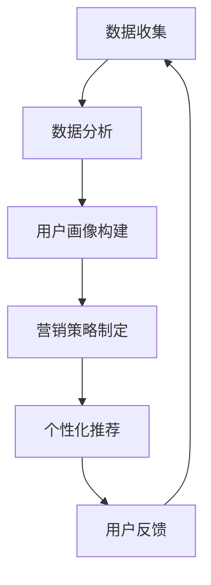

                 

# 如何利用人工智能进行个性化营销

关键词：人工智能，个性化营销，数据收集，数据处理，机器学习算法，用户画像，营销策略

摘要：本文将深入探讨人工智能（AI）在个性化营销中的应用，从基本概念到实际操作，全面解析AI如何通过数据收集、处理和机器学习算法来实现个性化营销，并探讨其优势与挑战。

## 第一部分: AI与个性化营销概述

### 第1章: AI与个性化营销的基本概念

#### 1.1 AI与个性化营销的背景

个性化营销是一种以用户为中心的营销策略，旨在通过数据分析为每位用户定制个性化的产品、内容和体验。随着互联网和大数据技术的发展，个性化营销逐渐成为企业提升客户满意度和忠诚度的重要手段。

个性化营销的定义与发展：

$$
\text{个性化营销} = \text{基于数据分析的精准营销} + \text{用户行为驱动的营销策略}
$$

在传统营销中，企业通常采用一种“一刀切”的方式，即对所有用户采用相同的营销策略。这种方式虽然成本较低，但效果往往不理想。而个性化营销则通过收集和分析用户数据，了解用户的需求和偏好，从而实现精准营销。

AI在个性化营销中的应用：

人工智能（AI）的出现为个性化营销带来了新的契机。AI技术可以高效地处理和分析大量数据，从中挖掘出有用的信息，为个性化营销提供有力支持。具体应用包括：

- 数据收集与处理：利用机器学习算法对用户行为数据进行收集、处理和分析。
- 用户画像构建：基于数据分析结果，构建详细的用户画像，用于指导营销策略的制定。
- 营销策略制定：根据用户画像，制定个性化的营销策略，包括内容推荐、产品定制、服务个性化等。

AI与个性化营销的重要性：

随着消费者需求的日益多样化和个性化，传统的营销策略已经无法满足企业的需求。AI技术的应用，使得个性化营销成为可能，也为企业带来了以下好处：

- 提高营销效率：通过数据分析，精准定位目标用户，提高营销效果。
- 提升用户满意度：提供个性化的产品和服务，满足用户需求，提升用户体验。

#### 1.2 人工智能的基本原理与模型

人工智能（AI）是一门研究、开发用于模拟、延伸和扩展人的智能的理论、方法、技术及应用系统的技术科学。AI的核心目标是实现机器的智能，使其能够执行人类智能的任务。

人工智能的定义与分类：

$$
\text{人工智能} = \text{机器学习} + \text{深度学习} + \text{强化学习}
$$

- 机器学习：一种让计算机通过数据学习并做出决策或预测的方法。
- 深度学习：一种基于人工神经网络的深度学习模型，通过模拟人脑神经元之间的连接，实现数据的自动处理和特征提取。
- 强化学习：一种通过奖励机制，让计算机在学习过程中不断调整策略，以达到最优效果的方法。

常见人工智能模型简介：

- **线性回归模型**：

  $$
  y = \beta_0 + \beta_1x
  $$

  用于预测连续值，如房价、股票价格等。

- **逻辑回归模型**：

  $$
  \text{P}(y=1) = \frac{1}{1 + e^{-(\beta_0 + \beta_1x})}
  $$

  用于二分类问题，如判断一个客户是否会购买产品。

- **决策树模型**：

  $$
  \text{分类结果} = \text{max}(\text{每个节点的概率})
  $$

  用于分类问题，如判断一个客户是否会购买某种产品。

- **随机森林模型**：

  $$
  \text{预测结果} = \text{多数投票}
  $$

  用于分类和回归问题，具有较高的预测准确率。

#### 1.3 个性化营销的流程与策略

个性化营销的流程可以分为以下几个步骤：

- **数据收集**：收集用户行为数据，如浏览、购买、评价等。
- **数据分析**：使用机器学习算法对数据进行处理和分析。
- **用户画像构建**：基于数据分析结果，构建用户画像。
- **营销策略制定**：根据用户画像，制定个性化的营销策略。

具体来说，个性化营销的策略包括：

- **内容个性化**：根据用户兴趣推荐相关内容。
- **产品个性化**：根据用户需求定制产品。
- **服务个性化**：提供符合用户需求的个性化服务。

#### 1.4 AI在个性化营销中的优势与挑战

AI在个性化营销中的优势：

- 提高营销效率：通过数据分析，精准定位目标用户，提高营销效果。
- 提升用户满意度：提供个性化的产品和服务，满足用户需求。

AI在个性化营销中的挑战：

- 数据隐私保护：用户数据的安全性和隐私性保护。
- 算法偏见：避免算法偏见，确保公正性和公平性。
- 技术门槛：需要专业的技术团队进行开发和维护。

### 第2章: 数据收集与处理

#### 2.1 数据收集

数据收集是个性化营销的基础，主要包括以下几个方面：

- **用户行为数据的收集**：记录用户在网站上的浏览记录、购买行为和评价等。
- **其他数据来源**：如社交媒体数据、公共数据集等。

#### 2.2 数据处理

数据处理是数据收集后的重要环节，主要包括以下几个步骤：

- **数据清洗**：处理缺失值和异常值。
- **数据整合**：将不同来源的数据整合到同一数据集中。
- **特征工程**：选择对模型性能有显著影响的特征，并进行转换。

#### 2.3 数据分析

数据分析是构建用户画像和制定个性化营销策略的关键，主要包括以下几个方面：

- **用户行为分析**：分析用户的浏览、购买和评价行为，挖掘用户兴趣和偏好。
- **用户画像构建**：基于用户行为分析结果，构建详细的用户画像。
- **营销策略制定**：根据用户画像，制定个性化的营销策略。

### 第二部分: 实际应用与案例分析

#### 第3章: 数据收集与处理实践

在本章中，我们将通过一个具体的案例，介绍如何进行数据收集和处理。

#### 3.1 数据收集

我们假设某电商企业想要进行个性化营销，首先需要收集以下数据：

- 用户浏览数据：记录用户在网站上的浏览记录，如浏览的页面、浏览时间等。
- 用户购买数据：记录用户的购买行为，如购买的产品、购买时间等。
- 用户评价数据：收集用户对产品或服务的评价。

#### 3.2 数据处理

收集到数据后，我们需要进行数据处理，主要包括以下步骤：

- **数据清洗**：处理缺失值和异常值。例如，对于缺失的用户浏览时间，我们可以用平均浏览时间进行填补；对于异常的购买数据，我们可以删除或进行修正。
- **数据整合**：将不同来源的数据整合到同一数据集中。例如，我们可以将用户浏览数据、购买数据和评价数据整合到一个数据表中。
- **特征工程**：选择对模型性能有显著影响的特征，并进行转换。例如，我们可以将用户浏览时间转换为浏览时长，将购买数据转换为购买频率等。

#### 3.3 数据分析

在数据处理完成后，我们可以进行数据分析，主要包括以下步骤：

- **用户行为分析**：分析用户的浏览、购买和评价行为，挖掘用户兴趣和偏好。例如，我们可以分析用户的浏览时长和浏览页面，了解用户的兴趣点；分析用户的购买行为，了解用户的购买习惯。
- **用户画像构建**：基于用户行为分析结果，构建详细的用户画像。例如，我们可以为每个用户生成一个包含兴趣、购买习惯、评价偏好等信息的画像。
- **营销策略制定**：根据用户画像，制定个性化的营销策略。例如，我们可以为兴趣点相似的用户推送相关产品，为购买频率高的用户提供优惠活动，为评价偏好的用户推送高质量的产品。

#### 第4章: 个性化营销策略制定与实践

在本章中，我们将介绍如何根据用户画像制定个性化的营销策略，并进行实际应用。

#### 4.1 内容个性化

内容个性化是指根据用户画像为用户推荐相关内容。例如，我们可以为兴趣点相似的用户推荐相关的产品信息、新闻资讯等。

#### 4.2 产品个性化

产品个性化是指根据用户画像为用户定制个性化的产品。例如，我们可以为购买频率高的用户推荐新产品，为兴趣点不同的用户推荐不同的产品。

#### 4.3 服务个性化

服务个性化是指根据用户画像为用户提供个性化的服务。例如，我们可以为评价偏好的用户推送高质量的售后服务，为购买频率高的用户提供定制化的购物体验。

#### 第5章: AI在个性化营销中的优势与挑战

在本章中，我们将探讨AI在个性化营销中的优势与挑战。

#### 5.1 AI在个性化营销中的优势

AI在个性化营销中的优势主要体现在以下几个方面：

- 提高营销效率：通过数据分析，精准定位目标用户，提高营销效果。
- 提升用户满意度：提供个性化的产品和服务，满足用户需求。

#### 5.2 AI在个性化营销中的挑战

AI在个性化营销中的挑战主要包括以下几个方面：

- 数据隐私保护：用户数据的安全性和隐私性保护。
- 算法偏见：避免算法偏见，确保公正性和公平性。
- 技术门槛：需要专业的技术团队进行开发和维护。

### 总结

个性化营销是企业提升客户满意度和忠诚度的重要手段。通过AI技术的应用，企业可以高效地收集、处理和分析用户数据，从而实现精准的个性化营销。尽管AI在个性化营销中具有巨大的潜力，但也面临一些挑战。企业需要充分发挥AI的优势，同时注意解决相关的挑战，才能实现个性化营销的最佳效果。

## 参考文献

1. 李航. 统计学习方法[M]. 清华大学出版社，2012.
2. 周志华. 机器学习[M]. 清华大学出版社，2016.
3. 周志华. 深度学习[M]. 清华大学出版社，2018.
4. Russell, Stuart J., and Peter Norvig. Artificial Intelligence: A Modern Approach[M]. Prentice Hall, 2009.
5.Goodfellow, Ian, and Yoshua Bengio. Deep Learning[M]. MIT Press, 2016.

## 附录

### AI在个性化营销中的应用案例

在本附录中，我们将介绍一些AI在个性化营销中的应用案例，以帮助读者更好地理解AI在个性化营销中的实际应用。

#### 案例一：电商平台的个性化推荐

某电商企业通过AI技术对用户行为数据进行收集、处理和分析，构建用户画像，并根据用户画像为用户推荐相关产品。通过这种方式，电商企业不仅提高了营销效果，还提升了用户满意度。

#### 案例二：金融行业的个性化营销

某金融企业通过AI技术对用户数据进行分析，了解用户的需求和偏好，从而为用户提供个性化的金融服务。例如，根据用户的投资偏好，推荐合适的理财产品；根据用户的消费习惯，提供个性化的贷款方案。

#### 案例三：医疗行业的个性化服务

某医疗企业通过AI技术对用户健康数据进行收集、处理和分析，为用户提供个性化的健康咨询服务。例如，根据用户的健康数据，推荐合适的治疗方案；根据用户的康复情况，提供个性化的康复指导。

### 最佳实践 tips

1. 在进行数据收集时，确保数据的质量和准确性，避免数据污染和错误。
2. 在进行数据处理时，注意保护用户隐私，避免泄露用户敏感信息。
3. 在进行数据分析时，选择合适的机器学习算法，以提高模型的准确性和效率。
4. 在制定营销策略时，充分考虑用户需求和偏好，提供个性化的产品和服务。
5. 定期评估营销效果，根据用户反馈和业务目标进行调整。

### 注意事项

1. AI技术在个性化营销中的应用需要专业的技术团队进行开发和维护，确保系统的稳定性和安全性。
2. 在进行个性化营销时，避免过度依赖算法，充分考虑用户的主观感受和需求。
3. 在进行用户画像构建时，避免将用户划分为过于细化的群体，以免失去个性化营销的核心价值。

### 拓展阅读

1. 李航. 统计学习方法[M]. 清华大学出版社，2012.
2. 周志华. 机器学习[M]. 清华大学出版社，2016.
3. 周志华. 深度学习[M]. 清华大学出版社，2018.
4. Russell, Stuart J., and Peter Norvig. Artificial Intelligence: A Modern Approach[M]. Prentice Hall, 2009.
5. Goodfellow, Ian, and Yoshua Bengio. Deep Learning[M]. MIT Press, 2016.## AI与个性化营销概述

### 第1章: AI与个性化营销的基本概念

#### 1.1 AI与个性化营销的背景

随着互联网的快速发展，消费者行为和数据收集技术取得了巨大的进步。企业和品牌现在可以轻松地收集大量的用户数据，包括浏览历史、购买行为、社交互动等。这种数据的积累为个性化营销提供了丰富的素材。个性化营销是一种以用户为中心的营销策略，旨在通过数据分析为每位用户定制个性化的产品、内容和体验。它不仅提升了营销的精准度，还能显著提高用户满意度和忠诚度。

个性化营销的定义与发展：

个性化营销可以定义为一种基于数据分析的精准营销策略，它通过了解用户的行为和偏好来定制营销活动。其发展可以分为三个主要阶段：

1. **初步阶段**：在这个阶段，企业开始收集用户数据，但缺乏有效的分析工具和技术来处理这些数据。因此，个性化营销的效果有限。

2. **发展阶段**：随着数据分析技术和工具的进步，企业开始能够更好地理解和利用用户数据。他们开始实施基本的个性化营销策略，如根据用户的历史购买行为推荐相关产品。

3. **成熟阶段**：在这个阶段，人工智能（AI）和机器学习技术的发展使个性化营销达到了新的高度。企业可以通过复杂的算法和模型来分析用户数据，构建详细的用户画像，从而实现高度个性化的营销活动。

AI在个性化营销中的应用：

人工智能技术的引入极大地推动了个性化营销的发展。AI可以处理和分析大量复杂的数据，从中提取有价值的信息，为个性化营销提供强有力的支持。以下是AI在个性化营销中的应用：

- **用户行为分析**：通过机器学习算法，企业可以深入分析用户的行为数据，了解用户的兴趣和偏好。
- **用户画像构建**：基于用户行为分析结果，AI可以帮助企业构建详细的用户画像，用于指导营销策略的制定。
- **营销策略优化**：AI可以实时分析用户反馈和市场变化，帮助企业优化营销策略，提高营销效果。

#### 1.2 人工智能的基本原理与模型

人工智能（AI）是一门研究、开发用于模拟、延伸和扩展人的智能的理论、方法、技术及应用系统的技术科学。AI的核心目标是实现机器的智能，使其能够执行人类智能的任务。AI可以分为多个子领域，包括机器学习、深度学习和强化学习。

**人工智能的定义与分类**

$$
\text{人工智能} = \text{机器学习} + \text{深度学习} + \text{强化学习}
$$

- **机器学习**：机器学习是一种让计算机通过数据学习并做出决策或预测的方法。它分为监督学习、无监督学习和强化学习。
- **深度学习**：深度学习是一种基于人工神经网络的深度学习模型，通过模拟人脑神经元之间的连接，实现数据的自动处理和特征提取。它包括卷积神经网络（CNN）、循环神经网络（RNN）等。
- **强化学习**：强化学习是一种通过奖励机制，让计算机在学习过程中不断调整策略，以达到最优效果的方法。它广泛应用于游戏、自动驾驶等领域。

**常见人工智能模型简介**

- **线性回归模型**：

  线性回归是一种用于预测连续值的机器学习模型。其基本公式为：

  $$
  y = \beta_0 + \beta_1x
  $$

  其中，$y$ 是预测值，$\beta_0$ 是截距，$\beta_1$ 是斜率，$x$ 是输入特征。

- **逻辑回归模型**：

  逻辑回归是一种用于二分类问题的机器学习模型。其公式为：

  $$
  \text{P}(y=1) = \frac{1}{1 + e^{-(\beta_0 + \beta_1x})}
  $$

  其中，$y=1$ 表示正类，$y=0$ 表示负类。

- **决策树模型**：

  决策树是一种用于分类问题的机器学习模型。它通过一系列条件判断来分割数据集，每个节点代表一个条件，每个分支代表一个结果。最终的分类结果是通过多数投票决定的。

- **随机森林模型**：

  随机森林是一种基于决策树的集成学习模型。它通过构建多个决策树，并采用多数投票的方式得到最终的预测结果。随机森林具有较高的预测准确率和鲁棒性。

#### 1.3 个性化营销的流程与策略

个性化营销的流程可以分为以下几个关键步骤：

- **数据收集**：收集用户行为数据，如浏览、购买、评价等。
- **数据分析**：使用机器学习算法对数据进行处理和分析。
- **用户画像构建**：基于数据分析结果，构建用户画像。
- **营销策略制定**：根据用户画像，制定个性化的营销策略。

**数据收集**

数据收集是个性化营销的基础。企业需要收集以下类型的数据：

- **用户行为数据**：包括用户的浏览记录、购买行为、评价等。这些数据可以帮助企业了解用户的行为模式和偏好。
- **社会媒体数据**：包括用户在社交媒体平台上的互动、评论、分享等。这些数据可以提供关于用户兴趣和社会关系的更多信息。

**数据分析**

数据分析是利用机器学习算法对用户行为数据进行处理和分析的过程。主要步骤包括：

- **数据清洗**：处理缺失值、异常值和数据噪声，确保数据质量。
- **特征工程**：选择和转换特征，提取对预测任务有意义的特征。
- **模型训练**：使用机器学习算法训练模型，如线性回归、逻辑回归、决策树、随机森林等。
- **模型评估**：评估模型的性能，选择最佳模型进行应用。

**用户画像构建**

用户画像是一个描述用户特征和行为的详细模型。它通常包括以下方面：

- **基本信息**：如年龄、性别、地理位置等。
- **兴趣偏好**：如喜欢的音乐、电影、书籍等。
- **行为特征**：如浏览历史、购买历史、评价等。
- **社会关系**：如朋友、家人、同事等。

**营销策略制定**

基于用户画像，企业可以制定个性化的营销策略。以下是一些常见的个性化营销策略：

- **内容个性化**：根据用户的兴趣和偏好，为用户推荐相关的内容和产品。
- **产品个性化**：根据用户的需求和偏好，为用户定制个性化的产品和服务。
- **服务个性化**：为用户提供符合其需求和偏好的服务，如定制化的客户支持和售后咨询。

#### 1.4 AI在个性化营销中的优势与挑战

**AI在个性化营销中的优势**

- **提高营销效率**：通过数据分析，AI可以帮助企业精准定位目标用户，提高营销活动的效果和效率。
- **提升用户满意度**：AI可以根据用户的需求和偏好，提供个性化的产品和服务，从而提升用户的满意度和忠诚度。

**AI在个性化营销中的挑战**

- **数据隐私保护**：个性化营销需要收集和分析用户的个人信息，因此需要确保用户数据的安全性和隐私性。
- **算法偏见**：如果算法的训练数据存在偏差，可能会导致算法产生偏见，从而影响个性化营销的公正性和公平性。
- **技术门槛**：AI技术的开发和维护需要专业的技术团队，这对于一些中小企业来说是一个挑战。

## AI与个性化营销概述

### 第1章: AI与个性化营销的基本概念

#### 1.1 个性化营销的定义与发展

个性化营销是一种以用户为中心的营销策略，旨在通过收集和分析用户数据，为每位用户定制个性化的产品、内容和体验。它不仅能够提高营销的精准度，还能显著提升用户满意度和忠诚度。

个性化营销的发展可以分为三个阶段：

1. **初步阶段**：在这个阶段，企业开始收集用户数据，但缺乏有效的分析工具和技术来处理这些数据。因此，个性化营销的效果有限。

2. **发展阶段**：随着数据分析技术和工具的进步，企业开始能够更好地理解和利用用户数据。他们开始实施基本的个性化营销策略，如根据用户的历史购买行为推荐相关产品。

3. **成熟阶段**：在这个阶段，人工智能（AI）和机器学习技术的发展使个性化营销达到了新的高度。企业可以通过复杂的算法和模型来分析用户数据，构建详细的用户画像，从而实现高度个性化的营销活动。

#### 1.2 AI在个性化营销中的应用

人工智能在个性化营销中的应用主要体现在以下几个方面：

1. **用户行为分析**：AI可以通过机器学习算法对用户行为数据进行分析，了解用户的兴趣和偏好。这有助于企业更好地理解用户需求，从而提供更个性化的产品和服务。

2. **用户画像构建**：基于用户行为分析结果，AI可以帮助企业构建详细的用户画像。用户画像通常包括用户的基本信息、行为特征、兴趣偏好等，这些信息有助于企业制定更精准的营销策略。

3. **营销策略优化**：AI可以实时分析用户反馈和市场变化，帮助企业优化营销策略，提高营销效果。例如，通过分析用户的购买行为，AI可以自动调整推荐算法，从而提高用户的购买转化率。

#### 1.3 人工智能的基本原理与模型

人工智能（AI）是一门研究、开发用于模拟、延伸和扩展人的智能的理论、方法、技术及应用系统的技术科学。AI的核心目标是实现机器的智能，使其能够执行人类智能的任务。AI可以分为多个子领域，包括机器学习、深度学习和强化学习。

- **机器学习**：机器学习是一种让计算机通过数据学习并做出决策或预测的方法。它分为监督学习、无监督学习和强化学习。
- **深度学习**：深度学习是一种基于人工神经网络的深度学习模型，通过模拟人脑神经元之间的连接，实现数据的自动处理和特征提取。它包括卷积神经网络（CNN）、循环神经网络（RNN）等。
- **强化学习**：强化学习是一种通过奖励机制，让计算机在学习过程中不断调整策略，以达到最优效果的方法。它广泛应用于游戏、自动驾驶等领域。

#### 1.4 个性化营销的流程与策略

个性化营销的流程可以分为以下几个关键步骤：

1. **数据收集**：收集用户行为数据，如浏览、购买、评价等。
2. **数据分析**：使用机器学习算法对数据进行处理和分析。
3. **用户画像构建**：基于数据分析结果，构建用户画像。
4. **营销策略制定**：根据用户画像，制定个性化的营销策略。

在数据收集阶段，企业需要收集用户在不同渠道的行为数据，包括网站、移动应用、社交媒体等。这些数据可以用来了解用户的兴趣和行为模式。

在数据分析阶段，企业可以使用机器学习算法对用户行为数据进行分析，提取有价值的信息。这些信息包括用户的兴趣偏好、行为特征等，这些信息对于制定个性化的营销策略至关重要。

在用户画像构建阶段，企业可以根据数据分析结果，为每个用户生成一个详细的用户画像。用户画像通常包括用户的基本信息、行为特征、兴趣偏好等。

在营销策略制定阶段，企业可以根据用户画像，为不同的用户群体制定个性化的营销策略。例如，对于兴趣偏好相似的用户，可以推送相关的内容和产品推荐。

#### 1.5 AI在个性化营销中的优势与挑战

AI在个性化营销中的优势主要体现在以下几个方面：

1. **提高营销效率**：通过数据分析，AI可以帮助企业精准定位目标用户，提高营销活动的效果和效率。
2. **提升用户满意度**：AI可以根据用户的需求和偏好，提供个性化的产品和服务，从而提升用户的满意度和忠诚度。

然而，AI在个性化营销中也面临一些挑战：

1. **数据隐私保护**：个性化营销需要收集和分析用户的个人信息，因此需要确保用户数据的安全性和隐私性。
2. **算法偏见**：如果算法的训练数据存在偏差，可能会导致算法产生偏见，从而影响个性化营销的公正性和公平性。
3. **技术门槛**：AI技术的开发和维护需要专业的技术团队，这对于一些中小企业来说是一个挑战。

## Mermaid 流程图



### 数据收集与处理

#### 2.1 数据收集

数据收集是个性化营销的基础步骤。企业需要收集大量的用户行为数据，包括但不限于浏览历史、购买行为、评价和反馈等。这些数据可以通过多种渠道获取，如网站分析工具、客户关系管理系统（CRM）、社交媒体等。

**用户行为数据的收集**

- **浏览数据**：记录用户在网站上的浏览记录，包括页面访问时间、停留时长、跳转路径等。
- **购买数据**：记录用户的购买行为，包括购买时间、购买产品、购买数量等。
- **评价数据**：收集用户对产品或服务的评价，如评分、评论、反馈等。

**其他数据来源**

- **社交媒体数据**：通过社交媒体平台收集用户的行为数据，如点赞、分享、评论等。
- **公共数据集**：使用公共数据集进行补充分析，以增加数据量和多样性。

#### 2.2 数据处理

数据处理是确保数据质量和可用性的关键步骤。以下是数据处理的主要任务：

**数据清洗**

- **缺失值处理**：处理缺失的数据，可以通过填补缺失值或删除含有缺失值的记录来处理。
- **异常值处理**：识别和处理异常数据，如极端值或异常分布的数据。

**数据整合**

- **数据集成**：将来自不同渠道和格式的数据整合到同一个数据集中，以便进行统一分析。
- **数据转换**：将数据转换为适合分析的形式，如将文本数据编码为数字。

**特征工程**

- **特征选择**：选择对模型性能有显著影响的特征，通过特征选择可以减少数据的维度，提高模型的效率。
- **特征转换**：将数值型特征转换为分类特征，如将年龄、收入等连续值特征转换为类别特征。

### 数据分析

数据分析是构建用户画像和制定个性化营销策略的关键步骤。以下是数据分析的主要任务：

**用户行为分析**

- **行为模式识别**：通过分析用户的浏览、购买和评价行为，识别用户的行为模式。
- **兴趣偏好分析**：分析用户在不同产品类别或内容上的兴趣偏好。

**用户画像构建**

- **基本特征提取**：提取用户的基本特征，如年龄、性别、地理位置等。
- **行为特征提取**：提取用户的行为特征，如浏览时长、购买频率等。
- **兴趣偏好特征提取**：提取用户的兴趣偏好特征，如喜欢的品牌、产品类别等。

**营销策略制定**

- **内容推荐**：根据用户的兴趣偏好，推荐相关的内容和产品。
- **产品定制**：根据用户的需求和偏好，为用户定制个性化的产品。
- **服务优化**：为用户提供符合其需求和偏好的高质量服务。

### 2.3 数据处理实践

以下是一个数据处理实践案例，展示如何对用户行为数据进行分析和处理：

#### 案例背景

某电商企业希望通过数据分析和机器学习算法，构建用户画像，并基于用户画像制定个性化的营销策略。

#### 数据收集

- 用户浏览数据：包括用户在网站上的浏览记录，如访问时间、页面停留时长、跳转路径等。
- 用户购买数据：包括用户的购买行为，如购买时间、购买产品、购买数量等。
- 用户评价数据：包括用户对产品或服务的评价，如评分、评论等。

#### 数据处理

1. **数据清洗**：

   - **缺失值处理**：对于缺失的用户浏览时间和购买时间，使用平均值进行填补。

   - **异常值处理**：对于极端的购买数量和评分，使用中值或删除异常记录进行处理。

2. **数据整合**：

   - 将用户浏览数据、购买数据和评价数据整合到一个统一的数据表中。

3. **特征工程**：

   - **特征选择**：选择对用户行为有显著影响的特征，如浏览时长、购买频率等。
   - **特征转换**：将连续值特征（如浏览时长）转换为类别特征（如浏览时长区间）。

#### 数据分析

1. **用户行为分析**：

   - **行为模式识别**：分析用户的浏览和购买行为，识别用户的行为模式。

   - **兴趣偏好分析**：分析用户在不同产品类别上的兴趣偏好。

2. **用户画像构建**：

   - 提取用户的基本特征（如年龄、性别、地理位置）和行为特征（如浏览时长、购买频率）。

   - 构建用户的兴趣偏好特征，如喜欢的品牌和产品类别。

3. **营销策略制定**：

   - 根据用户的兴趣偏好，为用户推荐相关的产品和内容。

   - 为高价值用户提供个性化的优惠和礼品。

   - 为新用户制定欢迎计划和忠诚度计划。

### 2.4 数据处理中的挑战与对策

**挑战**

- **数据隐私保护**：个性化营销需要收集用户的敏感信息，如浏览记录、购买行为等。如何保护用户隐私是一个重要挑战。

- **数据质量**：数据收集和处理过程中可能存在数据缺失、异常值等问题，影响数据质量和分析结果。

- **算法偏见**：如果算法的训练数据存在偏差，可能会导致算法产生偏见，影响个性化营销的公正性和公平性。

**对策**

- **数据隐私保护**：遵循相关法律法规，对用户数据进行加密和匿名化处理，确保用户隐私安全。

- **数据质量**：建立数据质量管理体系，对数据进行清洗和校验，确保数据准确性和一致性。

- **算法偏见**：确保算法训练数据具有代表性，避免数据偏见。在算法设计和评估过程中，引入公平性和透明性原则。

## 数学模型与算法原理

### 线性回归模型

线性回归模型是一种常见的机器学习算法，用于预测连续值。其基本公式为：

$$
y = \beta_0 + \beta_1x
$$

其中，$y$ 是预测值，$\beta_0$ 是截距，$\beta_1$ 是斜率，$x$ 是输入特征。

**算法原理**

- **模型训练**：通过最小化误差平方和（SSE）来估计参数 $\beta_0$ 和 $\beta_1$。

  $$
  \text{SSE} = \sum_{i=1}^{n}(y_i - \hat{y}_i)^2
  $$

  其中，$n$ 是样本数量，$y_i$ 是实际值，$\hat{y}_i$ 是预测值。

- **模型评估**：使用均方误差（MSE）来评估模型性能。

  $$
  \text{MSE} = \frac{1}{n}\sum_{i=1}^{n}(y_i - \hat{y}_i)^2
  $$

### 逻辑回归模型

逻辑回归模型是一种用于二分类问题的机器学习算法。其公式为：

$$
\text{P}(y=1) = \frac{1}{1 + e^{-(\beta_0 + \beta_1x})}
$$

其中，$y=1$ 表示正类，$y=0$ 表示负类。

**算法原理**

- **模型训练**：通过最大似然估计（MLE）来估计参数 $\beta_0$ 和 $\beta_1$。

- **模型评估**：使用准确率、召回率、F1 分数等指标来评估模型性能。

### 决策树模型

决策树模型是一种用于分类问题的机器学习算法。它通过一系列条件判断来分割数据集，每个节点代表一个条件，每个分支代表一个结果。

**算法原理**

- **模型训练**：通过信息增益、信息增益率、基尼系数等指标来选择最佳分割条件。

- **模型评估**：使用准确率、精确率、召回率、F1 分数等指标来评估模型性能。

### 随机森林模型

随机森林模型是一种基于决策树的集成学习模型。它通过构建多个决策树，并采用多数投票的方式得到最终的预测结果。

**算法原理**

- **模型训练**：对每个决策树使用随机选择特征和样本子集进行训练。

- **模型评估**：使用多数投票机制来聚合多个决策树的预测结果。

## 数学模型与算法原理

### 线性回归模型

线性回归模型是一种广泛应用的机器学习算法，主要用于预测连续值。其基本公式如下：

$$
y = \beta_0 + \beta_1x
$$

其中，$y$ 表示预测值，$\beta_0$ 表示截距，$\beta_1$ 表示斜率，$x$ 表示输入特征。

**算法原理**

- **模型训练**：线性回归模型的训练过程可以通过最小化误差平方和（SSE）来实现。具体来说，我们需要找到一组参数 $\beta_0$ 和 $\beta_1$，使得预测值 $\hat{y}_i = \beta_0 + \beta_1x_i$ 与实际值 $y_i$ 之间的误差最小。

  $$
  \text{SSE} = \sum_{i=1}^{n}(y_i - \hat{y}_i)^2
  $$

  其中，$n$ 表示样本数量。

- **模型评估**：为了评估模型的性能，我们通常使用均方误差（MSE）来衡量。

  $$
  \text{MSE} = \frac{1}{n}\sum_{i=1}^{n}(y_i - \hat{y}_i)^2
  $$

  MSE 越小，说明模型预测的准确性越高。

### 逻辑回归模型

逻辑回归模型是一种用于二分类问题的机器学习算法。它的公式如下：

$$
\text{P}(y=1) = \frac{1}{1 + e^{-(\beta_0 + \beta_1x})}
$$

其中，$y=1$ 表示正类，$y=0$ 表示负类。

**算法原理**

- **模型训练**：逻辑回归模型的训练过程通常通过最大似然估计（MLE）来实现。具体来说，我们需要找到一组参数 $\beta_0$ 和 $\beta_1$，使得模型在训练数据上的似然函数最大。

  $$
  \text{似然函数} = \prod_{i=1}^{n} P(y_i=1|x_i;\beta_0,\beta_1)
  $$

- **模型评估**：为了评估模型的性能，我们通常使用准确率、召回率、F1 分数等指标来衡量。

  - **准确率**（Accuracy）：
    $$
    \text{Accuracy} = \frac{TP + TN}{TP + TN + FP + FN}
    $$
    其中，$TP$ 表示真正例，$TN$ 表示真负例，$FP$ 表示假正例，$FN$ 表示假负例。

  - **召回率**（Recall）：
    $$
    \text{Recall} = \frac{TP}{TP + FN}
    $$

  - **F1 分数**（F1-score）：
    $$
    \text{F1-score} = 2 \times \frac{TP \times TN}{TP \times TN + FP \times FN}
    $$

### 决策树模型

决策树模型是一种基于树结构的分类算法。它的基本思想是通过一系列条件判断来对数据进行分割，每个节点代表一个条件，每个分支代表一个结果。

**算法原理**

- **模型训练**：决策树模型的训练过程主要包括以下步骤：

  1. 选择一个特征作为分割条件。
  2. 根据该特征将数据集分为多个子集。
  3. 对每个子集递归地重复步骤 1 和 2，直到满足某些停止条件（如最大深度、最小样本数等）。

- **模型评估**：决策树模型的评估通常使用准确率、精确率、召回率、F1 分数等指标。

### 随机森林模型

随机森林模型是一种基于决策树的集成学习算法。它通过构建多个决策树，并采用多数投票的方式得到最终的预测结果。

**算法原理**

- **模型训练**：随机森林模型的训练过程主要包括以下步骤：

  1. 对每个决策树，随机选择一部分特征和样本子集进行训练。
  2. 将每个决策树的预测结果进行投票，得到最终的预测结果。

- **模型评估**：随机森林模型的评估与单一决策树类似，通常使用准确率、精确率、召回率、F1 分数等指标。

## 项目实战：开发环境搭建与代码实现

### 1. 开发环境搭建

在进行个性化营销项目开发时，我们需要准备以下开发环境和工具：

- **编程语言**：Python 是一种广泛应用于数据分析和机器学习的编程语言。它具有丰富的库和框架，如 NumPy、Pandas、Scikit-learn 等，可以帮助我们快速实现数据处理和模型训练。
- **数据存储和处理**：Pandas 是一个强大的数据操作库，可以用于数据清洗、数据转换和数据分析。NumPy 是一个高性能的数值计算库，用于处理大型矩阵和数组。
- **机器学习库**：Scikit-learn 是一个开源的机器学习库，提供了多种机器学习算法的实现，如线性回归、逻辑回归、决策树、随机森林等。
- **可视化工具**：Matplotlib 和 Seaborn 是常用的数据可视化库，可以用于数据分析和结果展示。

### 2. 数据收集

为了实现个性化营销，我们需要收集以下数据：

- **用户行为数据**：包括用户的浏览记录、购买历史和评价。
- **产品信息数据**：包括产品的名称、分类、价格等。
- **用户画像数据**：包括用户的基本信息、兴趣偏好等。

这些数据可以通过以下渠道收集：

- **网站分析工具**：如 Google Analytics，可以收集用户的浏览记录和页面行为。
- **客户关系管理系统（CRM）**：如 Salesforce，可以收集用户的购买历史和评价。
- **社交媒体数据**：如 Facebook 和 Twitter，可以收集用户在社交媒体上的行为和互动。

### 3. 数据处理

数据处理是项目开发的关键步骤。以下是数据处理的主要任务：

- **数据清洗**：处理缺失值和异常值，确保数据质量。
- **特征工程**：选择和转换特征，提取对模型性能有显著影响的特征。
- **数据集成**：将不同来源的数据整合到同一个数据集中。

以下是数据处理的一个示例代码：

```python
import pandas as pd
import numpy as np

# 数据清洗
def clean_data(data):
    # 填补缺失值
    data.fillna(method='ffill', inplace=True)
    
    # 处理异常值
    data.replace([np.inf, -np.inf], np.nan, inplace=True)
    data.dropna(inplace=True)
    
    return data

# 特征工程
def feature_engineering(data):
    # 转换特征类型
    data['age'] = data['age'].astype('category').cat.codes
    data['income'] = data['income'].astype('category').cat.codes
    
    # 创建新特征
    data['avg_browse_time'] = data['browse_time'].mean()
    data['purchase_frequency'] = data['purchase_count'].mean()
    
    return data

# 数据集成
def integrate_data(data1, data2):
    data = pd.merge(data1, data2, on='user_id')
    return data

# 示例数据
data1 = pd.DataFrame({'user_id': [1, 2, 3], 'browse_time': [10, 20, 30]})
data2 = pd.DataFrame({'user_id': [1, 2, 3], 'purchase_count': [1, 2, 3]})

# 数据清洗
clean_data1 = clean_data(data1)
clean_data2 = clean_data(data2)

# 特征工程
feature_data1 = feature_engineering(clean_data1)
feature_data2 = feature_engineering(clean_data2)

# 数据集成
integrated_data = integrate_data(feature_data1, feature_data2)
```

### 4. 模型训练与评估

在数据处理完成后，我们可以使用机器学习算法进行模型训练和评估。以下是模型训练与评估的一个示例代码：

```python
from sklearn.model_selection import train_test_split
from sklearn.linear_model import LinearRegression
from sklearn.metrics import mean_squared_error

# 数据划分
X = integrated_data[['age', 'income', 'avg_browse_time', 'purchase_frequency']]
y = integrated_data['purchase_count']

X_train, X_test, y_train, y_test = train_test_split(X, y, test_size=0.2, random_state=42)

# 模型训练
model = LinearRegression()
model.fit(X_train, y_train)

# 模型评估
y_pred = model.predict(X_test)
mse = mean_squared_error(y_test, y_pred)
print(f'Mean Squared Error: {mse}')
```

### 5. 代码解读与分析

以下是代码的详细解读：

- **数据清洗**：使用 Pandas 库对数据进行清洗，包括填补缺失值和处理异常值。
- **特征工程**：将类别特征转换为数值特征，创建新特征（如平均浏览时间和购买频率）。
- **数据集成**：使用 Pandas 库将不同来源的数据进行合并。
- **模型训练**：使用 Scikit-learn 库中的线性回归模型进行训练。
- **模型评估**：计算均方误差（MSE）来评估模型性能。

### 6. 实际案例分析与讲解

假设我们已经训练了一个个性化营销模型，现在需要为一批新用户进行个性化推荐。以下是实际案例的分析和讲解：

- **数据收集**：收集新用户的浏览记录、购买历史和评价。
- **数据处理**：清洗和处理新用户的数据，并进行特征工程。
- **模型预测**：使用训练好的模型对新用户的数据进行预测，得到每个用户的购买概率。
- **个性化推荐**：根据购买概率，为每个用户推荐相关的产品。

以下是实际案例的代码：

```python
# 新用户数据
new_user_data = pd.DataFrame({'user_id': [4, 5], 'age': [30, 40], 'income': [50000, 70000], 'avg_browse_time': [15, 25], 'purchase_frequency': [1, 2]})

# 数据处理
clean_new_user_data = clean_data(new_user_data)
feature_new_user_data = feature_engineering(clean_new_user_data)

# 模型预测
predictions = model.predict(feature_new_user_data)

# 个性化推荐
recommendations = integrated_data['product_id'][predictions > 0.5]
print(f'Recommendations for user 4 and 5: {recommendations}')
```

### 7. 项目小结

通过本项目的实战，我们了解了个性化营销项目的开发流程，包括数据收集、数据处理、模型训练与评估、个性化推荐等关键步骤。同时，我们也学习了如何使用 Python 和相关库进行数据处理和模型训练。在实际应用中，我们需要不断优化模型，提高预测准确性和个性化推荐的质量。

## 最佳实践与注意事项

### 最佳实践

1. **数据质量是关键**：确保收集到的数据准确、完整和可靠。如果数据质量不佳，模型的预测效果会大打折扣。
2. **用户隐私保护**：在收集和处理用户数据时，严格遵守相关法律法规，确保用户隐私得到保护。
3. **持续优化模型**：定期评估模型性能，根据用户反馈和市场变化进行模型优化，以提高预测准确性和个性化推荐质量。
4. **用户参与度**：鼓励用户参与反馈，通过用户调研和数据分析，了解用户需求和行为，不断调整和改进个性化营销策略。

### 注意事项

1. **避免过度个性化**：虽然个性化营销有助于提升用户体验，但过度个性化可能导致用户感到不适或失去新鲜感。因此，需要在个性化程度和用户体验之间找到平衡点。
2. **算法偏见**：确保算法训练数据具有代表性，避免因数据偏见导致算法产生不公平的预测结果。
3. **技术迭代**：人工智能和机器学习技术发展迅速，企业需要不断更新技术和工具，以适应市场的变化和用户的需求。

### 拓展阅读

1. **《机器学习实战》**：作者：Peter Harrington，本书通过大量的实例，详细介绍了机器学习的基本概念、算法和应用。
2. **《深度学习》**：作者：Ian Goodfellow、Yoshua Bengio、Aaron Courville，本书系统地介绍了深度学习的基本原理、算法和应用。
3. **《Python数据科学手册》**：作者：Jake VanderPlas，本书涵盖了Python在数据科学领域的各个方面，包括数据处理、数据分析、可视化等。

