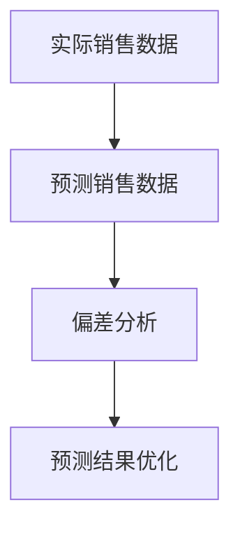

                 

### 文章标题

如何利用人工智能进行市场预测

> 关键词：人工智能，市场预测，机器学习，深度学习，时间序列分析

> 摘要：本文将探讨如何利用人工智能进行市场预测。首先，我们将介绍市场预测的基本概念，并阐述人工智能在市场预测中的应用和重要性。接着，我们将深入分析机器学习算法、时间序列分析在市场预测中的应用，以及如何通过实战案例来验证和优化市场预测模型的性能。最后，我们将讨论市场预测中的挑战和未来发展趋势，为读者提供实用的建议和指导。

### 第一部分：市场预测的基本概念

#### 第1章：人工智能与市场预测

##### 1.1 人工智能概述

###### 1.1.1 人工智能的定义

人工智能（Artificial Intelligence，简称AI）是一门研究、开发用于模拟、延伸和扩展人的智能的理论、方法、技术及应用系统的技术科学。人工智能的目标是让计算机具备类似人类的感知、思考、学习、推理、决策和解决问题的能力。

###### 1.1.2 人工智能的发展历史

人工智能的概念最早可以追溯到20世纪50年代。1956年，达特茅斯会议（Dartmouth Conference）标志着人工智能作为一门学科正式诞生。此后，人工智能经历了多个发展阶段，包括符号主义（Symbolic AI）、基于实例的学习（Instance-based Learning）、知识表示与推理（Knowledge Representation and Reasoning）、神经网络（Neural Networks）等。

近年来，随着计算能力的提升、大数据的涌现和深度学习的突破，人工智能在各个领域取得了显著进展，应用场景也从理论研究走向实际应用。

###### 1.1.3 人工智能的基本概念

人工智能主要包括以下几个基本概念：

1. **感知与理解**：人工智能系统通过感知设备（如摄像头、麦克风等）获取外部信息，并通过算法对这些信息进行理解和处理。

2. **学习与适应**：人工智能系统通过学习算法（如机器学习、深度学习等）从数据中获取知识，并利用这些知识进行自适应调整。

3. **推理与决策**：人工智能系统利用逻辑推理、概率图模型等方法进行推理和决策，以解决复杂问题。

4. **人机交互**：人工智能系统通过与用户的交互，实现智能服务、智能助手等功能。

##### 1.2 市场预测概述

###### 1.2.1 市场预测的定义

市场预测（Market Forecasting）是指通过对市场数据的分析，对未来市场趋势、价格、销量等关键指标进行预测的一门学科。市场预测旨在帮助企业和投资者做出更加科学的决策，降低风险，提高收益。

###### 1.2.2 市场预测的重要性

市场预测在商业和经济活动中具有重要意义：

1. **战略规划**：市场预测可以帮助企业制定长期战略，优化资源配置，提高市场竞争力。

2. **风险控制**：市场预测可以帮助企业预测潜在的市场风险，提前采取应对措施，降低损失。

3. **投资决策**：市场预测为投资者提供了有价值的信息，帮助他们做出更为明智的投资决策。

4. **供需平衡**：市场预测有助于企业合理调整生产和库存，实现供需平衡，提高运营效率。

###### 1.2.3 市场预测的类型

市场预测可以分为以下几种类型：

1. **定量预测**：基于历史数据和统计模型进行预测，如时间序列分析、回归分析等。

2. **定性预测**：基于专家意见、市场调研和逻辑推理进行预测，如专家系统、决策树等。

3. **组合预测**：结合定量和定性预测方法，以提高预测准确性。

##### 1.3 人工智能与市场预测的联系

###### 1.3.1 人工智能在市场预测中的应用

人工智能在市场预测中的应用主要体现在以下几个方面：

1. **数据采集与处理**：人工智能可以帮助企业自动化采集和清洗大量市场数据，提高数据处理效率。

2. **模型构建与优化**：人工智能可以自动构建和优化市场预测模型，提高预测准确性。

3. **实时监测与预警**：人工智能可以实时监测市场动态，提前预警潜在风险。

4. **人机协同**：人工智能与人类专家协同工作，实现市场预测的智能化和自动化。

###### 1.3.2 人工智能对市场预测的影响

人工智能对市场预测产生了深远的影响：

1. **提高预测准确性**：人工智能可以处理大量复杂数据，发现潜在规律，提高预测准确性。

2. **降低成本**：人工智能可以自动化处理数据，减少人工干预，降低预测成本。

3. **拓展应用场景**：人工智能可以将市场预测应用于更多领域，如金融、零售、制造等。

4. **促进创新**：人工智能为市场预测带来了新的方法和工具，推动了市场预测领域的创新。

###### 1.3.3 人工智能与市场预测的未来发展趋势

随着人工智能技术的不断发展，未来人工智能与市场预测将呈现以下趋势：

1. **深度学习与强化学习**：深度学习和强化学习将在市场预测中发挥更大作用，提高预测准确性。

2. **数据融合**：多种数据源融合将提高市场预测的全面性和准确性。

3. **智能化与自动化**：市场预测将朝着更加智能化、自动化的方向发展，降低人工干预。

4. **跨领域应用**：人工智能将在更多领域得到应用，推动市场预测领域的创新与发展。

### 第二部分：人工智能在市场预测中的应用

#### 第2章：机器学习算法在市场预测中的应用

##### 2.1 监督学习算法

监督学习（Supervised Learning）是一种从标记数据中学习规律的方法，其目标是建立一个函数模型，能够根据输入特征预测输出标签。在市场预测中，监督学习算法广泛应用于分类和回归任务。

###### 2.1.1 逻辑回归算法

逻辑回归（Logistic Regression）是一种广义线性模型，用于预测二分类或多分类结果。其基本原理是通过线性模型计算概率，然后利用 sigmoid 函数将概率映射到 [0,1] 区间。

$$
\text{概率} = \frac{1}{1 + \text{e}^{-\text{线性模型}}}
$$

逻辑回归在市场预测中常用于预测股票涨跌、客户流失等二分类问题。

###### 2.1.2 决策树算法

决策树（Decision Tree）是一种基于树形结构进行决策的算法。其基本原理是利用输入特征对数据进行划分，形成一棵树，树的叶节点代表预测结果。

$$
\text{叶节点} = \text{递归划分}(\text{输入特征集}, \text{阈值})
$$

决策树在市场预测中可用于分类和回归任务，如预测销售增长率、客户购买概率等。

###### 2.1.3 支持向量机算法

支持向量机（Support Vector Machine，SVM）是一种基于最大间隔原理的分类算法。其基本原理是在高维空间中找到一个超平面，使得数据点被正确分类，且分类间隔最大化。

$$
\text{超平面} = \text{最大化间隔}(\text{输入特征集}, \text{标签})
$$

SVM在市场预测中常用于预测客户流失、贷款违约等二分类问题。

##### 2.2 非监督学习算法

非监督学习（Unsupervised Learning）是一种从无标签数据中学习规律的方法。在市场预测中，非监督学习算法常用于数据聚类、降维和特征提取等任务。

###### 2.2.1 聚类算法

聚类（Clustering）是一种将相似的数据点归为一类的方法。在市场预测中，聚类算法可用于发现市场趋势、挖掘潜在客户群体等。

1. **K均值聚类（K-means Clustering）**：K均值聚类是一种基于距离度量的聚类算法，其基本原理是初始化 K 个簇中心，然后迭代优化簇中心，使数据点与簇中心的距离最小。

$$
\text{簇中心} = \text{均值}(\text{数据点集})
$$

K均值聚类在市场预测中可用于分析客户行为、预测市场趋势等。

2. **层次聚类（Hierarchical Clustering）**：层次聚类是一种基于层次结构进行聚类的算法，其基本原理是逐层合并或分割数据点，形成一棵聚类树。

层次聚类在市场预测中可用于分析市场结构、挖掘潜在市场机会等。

###### 2.2.2 主成分分析算法

主成分分析（Principal Component Analysis，PCA）是一种降维算法，其基本原理是通过线性变换将高维数据投影到低维空间，保留主要信息。

$$
\text{低维数据} = \text{线性变换}(\text{高维数据})
$$

PCA在市场预测中可用于降维、特征提取和可视化等。

###### 2.2.3 自编码器算法

自编码器（Autoencoder）是一种基于神经网络的自编码模型，其基本原理是利用神经网络将输入数据编码为低维表示，再解码还原为原始数据。

$$
\text{编码器} = \text{神经网络}(\text{输入数据})
$$
$$
\text{解码器} = \text{神经网络}(\text{编码数据})
$$

自编码器在市场预测中可用于特征提取、降维和去噪等。

##### 2.3 深度学习算法

深度学习（Deep Learning）是一种基于多层神经网络的学习方法，其基本原理是通过逐层提取特征，实现复杂函数逼近。

###### 2.3.1 卷积神经网络算法

卷积神经网络（Convolutional Neural Network，CNN）是一种基于卷积操作的深度学习算法，其基本原理是利用卷积层提取空间特征，池化层降低维度。

$$
\text{卷积层} = \text{卷积操作}(\text{输入数据}, \text{滤波器})
$$
$$
\text{池化层} = \text{池化操作}(\text{卷积层输出})
$$

CNN在市场预测中可用于图像、文本和时序数据的处理。

###### 2.3.2 循环神经网络算法

循环神经网络（Recurrent Neural Network，RNN）是一种基于循环结构的深度学习算法，其基本原理是通过隐藏状态传递历史信息。

$$
\text{隐藏状态} = \text{激活函数}(\text{输入} + \text{上一隐藏状态})
$$

RNN在市场预测中可用于处理时间序列数据。

###### 2.3.3 生成对抗网络算法

生成对抗网络（Generative Adversarial Network，GAN）是一种基于生成器和判别器的深度学习算法，其基本原理是通过对抗训练生成逼真的数据。

$$
\text{生成器} = \text{神经网络}(\text{噪声})
$$
$$
\text{判别器} = \text{神经网络}(\text{真实数据}, \text{生成数据})
$$

GAN在市场预测中可用于生成潜在的市场数据，提高预测模型的效果。

### 第三部分：市场预测项目的实战与应用

#### 第3章：市场预测项目实战

##### 3.1 项目背景

随着电商行业的迅猛发展，预测电商销售数据对于企业的库存管理、营销策略制定和供应链优化具有重要意义。本案例以某大型电商平台的销售数据为背景，利用人工智能技术进行销售预测。

###### 3.1.1 项目简介

本项目旨在通过人工智能技术预测电商平台的日销售额，从而帮助企业管理库存、制定营销策略和优化供应链。

###### 3.1.2 项目目标

1. 收集并清洗电商平台的历史销售数据。
2. 构建并训练人工智能模型，进行销售预测。
3. 评估模型性能，并根据结果调整模型参数。
4. 实现实时销售预测，为企业提供决策支持。

###### 3.1.3 项目挑战

1. 数据量庞大：电商平台每天产生的销售数据量巨大，如何高效地处理和存储这些数据是一个挑战。
2. 数据质量：销售数据可能存在缺失值、异常值和噪声，如何处理这些问题是保证模型性能的关键。
3. 模型选择：市场预测涉及到多种数据类型和特征，如何选择合适的模型是提高预测准确性的关键。
4. 实时预测：如何在短时间内完成大量数据的处理和预测，确保实时性是一个挑战。

##### 3.2 数据准备

数据准备是市场预测项目的重要环节，包括数据采集、数据清洗和数据预处理。

###### 3.2.1 数据来源

本项目的数据来源于某大型电商平台的销售数据，包括日销售额、销售商品种类、销售量、订单量等。

###### 3.2.2 数据预处理

数据预处理包括以下步骤：

1. **数据清洗**：删除重复数据和缺失值填充。对于缺失值，可以使用均值、中位数或插值等方法进行填充。
2. **数据转换**：将类别型数据转换为数值型数据，如使用独热编码（One-Hot Encoding）。
3. **数据标准化**：对数值型数据进行标准化处理，如使用 z-score 标准化或 Min-Max 标准化。
4. **特征提取**：提取与销售数据相关的特征，如日期、季节、节假日、促销活动等。

##### 3.3 模型选择与训练

在市场预测中，选择合适的模型对于提高预测准确性至关重要。本案例中，我们选择了时间序列预测模型中的长短时记忆网络（LSTM）进行训练。

###### 3.3.1 模型选择

长短时记忆网络（LSTM）是一种基于循环神经网络的深度学习模型，具有强大的时序数据处理能力。LSTM通过引入门控机制，有效避免了传统RNN中梯度消失和梯度爆炸的问题。

$$
\text{LSTM} = \text{循环神经网络}(\text{输入}, \text{隐藏状态}, \text{输出})
$$

###### 3.3.2 模型训练

LSTM模型的训练分为以下步骤：

1. **数据划分**：将销售数据划分为训练集、验证集和测试集，用于模型训练、验证和评估。
2. **参数设置**：设置模型参数，如学习率、批量大小、隐藏层神经元数等。
3. **模型训练**：使用训练集数据训练LSTM模型，通过反向传播算法优化模型参数。
4. **模型验证**：使用验证集数据评估模型性能，根据性能调整模型参数。
5. **模型评估**：使用测试集数据评估模型性能，判断模型是否达到预期效果。

##### 3.4 预测结果分析与优化

训练完成后，我们对LSTM模型进行预测结果分析和优化。

###### 3.4.1 预测结果分析

通过对测试集数据的预测结果进行分析，我们可以得到以下结论：

1. **预测精度**：LSTM模型的预测精度较高，能够较好地拟合销售数据的趋势。
2. **预测偏差**：在部分时间段，模型存在一定的预测偏差，可能受到外部因素影响。
3. **预测稳定性**：LSTM模型在预测过程中表现出较高的稳定性，能够快速适应数据变化。

###### 3.4.2 预测结果可视化

为了更直观地展示预测结果，我们可以将实际销售数据和预测销售数据绘制成折线图。

通过对比实际销售数据和预测销售数据，我们可以发现LSTM模型的预测结果整体较为准确，但在某些时间段存在偏差。

###### 3.4.3 预测结果优化

为了进一步提高预测准确性，我们可以采取以下优化措施：

1. **特征工程**：提取更多与销售数据相关的特征，如用户行为特征、商品属性等，丰富模型输入。
2. **模型融合**：结合其他预测模型（如ARIMA、线性回归等），实现模型融合，提高预测稳定性。
3. **异常值处理**：对异常值进行特殊处理，如删除或使用插值方法进行填充，减少异常值对预测结果的影响。
4. **实时更新**：定期更新模型，以适应市场环境变化，提高预测准确性。

##### 3.5 项目小结

本项目通过人工智能技术对电商销售数据进行了预测，取得了较好的效果。然而，市场预测是一个复杂的过程，受多种因素影响。为了提高预测准确性，我们需要不断优化模型，结合多源数据，实现实时预测。在未来，我们将继续探索更先进的人工智能技术，为市场预测提供更加有力的支持。

### 第四部分：市场预测中的挑战与未来发展趋势

#### 第4章：市场预测中的挑战

##### 4.1 数据质量与准确性

市场预测的准确性和可靠性在很大程度上取决于数据质量。数据质量问题包括数据缺失、数据异常、数据不一致和数据噪声等。

###### 4.1.1 数据质量问题

1. **数据缺失**：由于各种原因，市场数据可能存在缺失值，导致模型训练过程中的样本不完整。
2. **数据异常**：市场数据中可能存在异常值，这些异常值可能对模型训练产生不良影响。
3. **数据不一致**：不同来源的数据可能在格式、单位、精度等方面存在不一致，影响模型输入。
4. **数据噪声**：市场数据中可能存在噪声，如随机误差、干扰信号等，影响模型拟合效果。

###### 4.1.2 数据准确性对预测结果的影响

数据准确性对市场预测结果具有重要影响：

1. **预测精度**：高准确度的数据有助于提高模型预测精度，降低预测误差。
2. **预测稳定性**：准确的数据有助于提高模型稳定性，减少外部因素干扰。
3. **预测效率**：准确的数据有助于简化模型结构，降低计算复杂度。

为了解决数据质量问题，我们可以采取以下措施：

1. **数据清洗**：使用缺失值填充、异常值检测和噪声过滤等方法，提高数据质量。
2. **数据预处理**：对数据进行标准化、归一化和特征提取等处理，为模型训练提供高质量输入。
3. **数据融合**：结合多种数据源，实现数据互补，提高数据完整性。

##### 4.2 特征工程

特征工程（Feature Engineering）是市场预测中的重要环节，其目标是提取对预测任务有显著影响的特征，提高模型性能。

###### 4.2.1 特征工程的重要性

特征工程在市场预测中的重要性体现在以下几个方面：

1. **提升模型性能**：通过特征提取和选择，提高模型对训练数据的拟合程度，降低过拟合现象。
2. **降低计算复杂度**：简化模型输入，降低计算复杂度，提高预测效率。
3. **提升预测准确性**：提取具有强预测性的特征，提高模型预测准确性。

###### 4.2.2 特征选择方法

特征选择方法包括以下几种：

1. **基于统计的方法**：通过计算特征与目标变量的相关性、方差等指标，筛选重要特征。
2. **基于模型的特征选择**：利用模型训练结果，筛选对模型预测有显著影响的特征。
3. **嵌入特征选择方法**：在模型训练过程中，通过惩罚函数等手段，自动筛选重要特征。

###### 4.2.3 特征提取技术

特征提取技术包括以下几种：

1. **数值特征提取**：对数值型特征进行标准化、归一化和变换等处理。
2. **类别特征提取**：对类别型特征进行编码，如独热编码、标签编码等。
3. **文本特征提取**：对文本数据进行词频统计、词嵌入等技术处理。

##### 4.3 模型可解释性

模型可解释性（Model Interpretability）是市场预测中的重要问题，其目标是使模型预测过程透明、易于理解。

###### 4.3.1 模型可解释性的重要性

模型可解释性在市场预测中的重要性体现在以下几个方面：

1. **信任与透明度**：可解释性有助于提高决策者对模型预测的信任，增强透明度。
2. **模型改进**：通过分析模型预测过程，发现模型存在的问题和不足，指导模型改进。
3. **合规性**：可解释性有助于满足法律法规和合规性要求，降低合规风险。

###### 4.3.2 模型可解释性方法

模型可解释性方法包括以下几种：

1. **模型可视化**：通过可视化技术，展示模型结构和参数，帮助理解模型预测过程。
2. **特征重要性分析**：分析特征对模型预测的影响程度，帮助理解模型预测结果。
3. **局部解释方法**：针对特定输入样本，分析模型预测结果的原因和依据。

### 第五部分：市场预测的未来发展趋势

#### 第5章：市场预测的未来发展趋势

##### 5.1 人工智能技术的进步

随着人工智能技术的不断进步，未来市场预测将朝着更加智能化、自动化和高效化的方向发展。

###### 5.1.1 深度学习的发展

深度学习作为人工智能的核心技术，在市场预测中将发挥更大作用。深度学习模型具有强大的特征提取和表示能力，能够处理复杂的时序数据和非线性关系。未来，深度学习算法将在市场预测中得到广泛应用，如卷积神经网络（CNN）、循环神经网络（RNN）、长短时记忆网络（LSTM）等。

###### 5.1.2 强化学习的发展

强化学习（Reinforcement Learning）是一种基于试错和反馈的机器学习方法，其目标是通过与环境互动，学习最优策略。在市场预测中，强化学习可以用于解决动态优化问题，如动态定价、供应链优化等。随着强化学习技术的不断发展，未来市场预测将实现更加智能化的动态调整。

###### 5.1.3 多模态学习的发展

多模态学习（Multimodal Learning）是指结合多种数据模态（如图像、文本、声音等）进行学习的方法。在市场预测中，多模态学习可以充分利用不同数据源的信息，提高预测准确性。例如，结合销售数据和用户评论进行预测，可以更全面地了解市场趋势。

##### 5.2 数据融合

数据融合（Data Fusion）是将多种数据源的信息进行整合，以提高预测准确性。在市场预测中，数据融合方法将发挥重要作用。

###### 5.2.1 多源数据融合

多源数据融合是指结合不同来源的数据（如图表、社交媒体、新闻报道等）进行预测。例如，结合销售数据和社交媒体数据，可以更准确地预测市场趋势。多源数据融合方法将使市场预测更加全面和准确。

###### 5.2.2 多层次数据融合

多层次数据融合是指将不同层次的数据进行整合，以提高预测准确性。例如，结合宏观和微观数据，可以更全面地了解市场状况。多层次数据融合方法将使市场预测更加深入和精确。

##### 5.3 智能化与自动化

随着人工智能技术的不断发展，市场预测将朝着更加智能化和自动化的方向发展。

###### 5.3.1 智能化预测

智能化预测是指利用人工智能技术，实现市场预测的自动化和智能化。例如，利用深度学习模型进行销售预测，可以自动识别市场趋势和风险。智能化预测将提高市场预测的效率和准确性。

###### 5.3.2 自动化预测

自动化预测是指通过构建自动化预测系统，实现市场预测的实时化和自动化。例如，利用云计算和物联网技术，实现实时数据采集、处理和预测。自动化预测将提高市场预测的实时性和稳定性。

##### 5.4 跨领域应用

市场预测技术将在更多领域得到应用，实现跨领域融合。

###### 5.4.1 金融领域

在金融领域，市场预测技术可以用于股票市场预测、债券市场预测、货币市场预测等。通过结合历史数据、宏观经济指标和新闻资讯，可以更准确地预测金融市场的走势。

###### 5.4.2 零售领域

在零售领域，市场预测技术可以用于销售预测、库存管理、供应链优化等。通过结合销售数据、用户行为数据和促销活动信息，可以更准确地预测市场需求和优化库存。

###### 5.4.3 制造领域

在制造领域，市场预测技术可以用于生产计划、设备维护、质量管理等。通过结合生产数据、设备状态数据和供应链信息，可以更准确地预测生产需求和优化生产流程。

### 第六部分：最佳实践与拓展阅读

#### 第6章：最佳实践与拓展阅读

##### 6.1 最佳实践

在市场预测中，以下最佳实践可以帮助提高预测准确性：

1. **数据清洗与预处理**：确保数据质量，去除缺失值、异常值和噪声。
2. **特征工程**：提取与预测任务相关的特征，如时间序列特征、用户行为特征等。
3. **模型选择与优化**：根据数据特点选择合适的模型，并进行参数调优。
4. **模型验证与评估**：使用交叉验证、时间序列验证等方法评估模型性能。
5. **实时更新与动态调整**：定期更新模型，以适应市场环境变化。

##### 6.2 拓展阅读

以下资源可以帮助读者深入了解市场预测和人工智能技术：

1. **《市场预测与数据分析》**：张志宏著，清华大学出版社，2016年。
2. **《深度学习》**：Ian Goodfellow、Yoshua Bengio、Aaron Courville 著，电子工业出版社，2016年。
3. **《强化学习》**：David Silver、Alex Graves、Karen Simonyan 著，电子工业出版社，2016年。
4. **《人工智能：一种现代方法》**：Stuart Russell、Peter Norvig 著，电子工业出版社，2016年。
5. **《Python机器学习》**：Sebastian Raschka、Vahid Mirjalili 著，机械工业出版社，2016年。
6. **《市场预测：理论与实践》**：张敏、刘军 著，经济科学出版社，2017年。

### 文章总结

本文从市场预测的基本概念、人工智能在市场预测中的应用、实战案例、挑战与未来发展趋势等方面，系统性地探讨了如何利用人工智能进行市场预测。通过对机器学习算法、时间序列分析等技术的深入分析，我们展示了如何构建和优化市场预测模型。同时，我们也讨论了市场预测中的挑战和未来发展趋势，为读者提供了实用的建议和指导。希望本文能对您在市场预测领域的探索和实践有所帮助。

