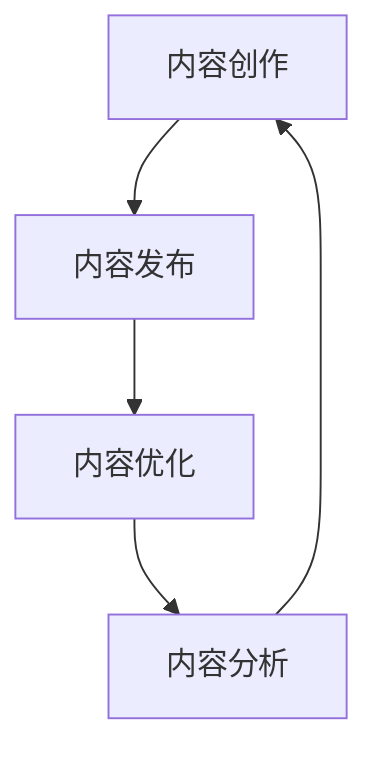
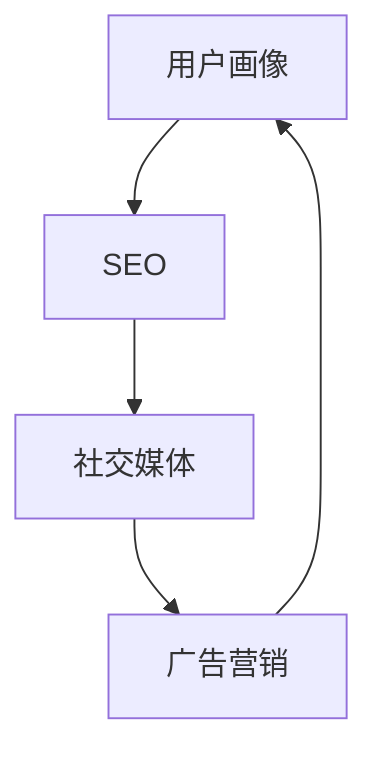
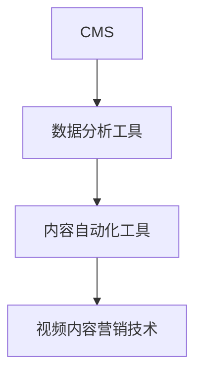

                 

### 文章标题

**《如何利用内容营销推广创业公司》**

> **关键词：** 内容营销、创业公司、推广策略、SEO、社交媒体、数据分析、案例研究

**摘要：** 本文将深入探讨内容营销在创业公司推广中的重要性，并提供一套系统化的策略和实战案例，帮助创业公司利用内容营销实现品牌知名度和市场影响力的提升。

### 目录大纲

1. **第一部分：内容营销基础**
    1.1 内容营销概述
    1.2 内容营销的策划与执行
    1.3 内容营销的核心概念与联系
    1.4 内容营销工具与技术

2. **第二部分：创业公司内容营销实战**
    2.1 创业公司内容营销案例分析
    2.2 创业公司内容营销策略制定与执行
    2.3 创业公司内容营销预算与资源管理
    2.4 创业公司内容营销的未来趋势

3. **附录**
    3.1 内容营销工具汇总
    3.2 创业公司内容营销常用模板
    3.3 创业公司内容营销资源库
    3.4 创业公司内容营销常见问题解答

### 第一部分：内容营销基础

#### 1.1 内容营销概述

**背景介绍**

在当今数字化时代，内容营销作为一种有效的市场营销策略，已成为企业尤其是创业公司获取客户、建立品牌认知和提升市场竞争力的重要手段。通过创造和分享有价值、相关且具有吸引力的内容，企业能够吸引并留住目标受众，进而推动销售和业务增长。

**核心概念与联系**

内容营销的核心概念包括：

- **内容创作：** 创造有价值的内容，如文章、视频、图片、音频等。
- **内容发布：** 在适当的渠道上发布内容，以触达目标受众。
- **内容优化：** 通过SEO等手段，提高内容的可见性和搜索排名。
- **内容分析：** 收集和分析数据，评估内容效果，为后续优化提供依据。

**Mermaid流程图**



**核心算法原理讲解**

SEO（搜索引擎优化）是内容营销中的一个重要环节，其核心算法原理包括：

1. **关键词研究：** 分析目标受众的搜索习惯，确定合适的关键词。
2. **内容优化：** 在内容中合理使用关键词，并确保内容质量高。
3. **外部链接建设：** 获取高质量的 inbound 链接，提高网站权威性。
4. **技术优化：** 优化网站结构、速度和移动友好性。

**伪代码示例**

```python
def optimize_content(content, keywords):
    # 在内容中添加关键词
    for keyword in keywords:
        content = content.replace(" ", f" {keyword} ")
    
    # 优化内容质量
    content = create_high_quality_content(content)
    
    # 建立外部链接
    links = build_external_links()
    content += links
```

#### 1.2 内容营销的策划与执行

**策略制定**

内容营销的策划与执行首先需要明确以下要素：

- **目标：** 定义明确的营销目标，如提高品牌知名度、增加客户转化等。
- **受众：** 确定目标受众，了解他们的需求和偏好。
- **内容规划：** 制定内容发布计划，包括内容类型、发布频率和渠道选择。

**内容创作**

内容创作是内容营销的核心，需要遵循以下原则：

- **相关性：** 确保内容与受众需求和品牌相关。
- **独特性：** 提供独特见解和有价值的信息。
- **高质量：** 保证内容的质量，避免抄袭和低质量内容。

**内容发布**

内容发布需要选择合适的渠道，如博客、社交媒体、电子邮件等。发布策略应考虑以下因素：

- **受众偏好：** 根据受众偏好选择发布渠道。
- **发布频率：** 制定合理的发布频率，保持受众关注。
- **互动性：** 通过评论、互动等方式提高用户参与度。

**内容优化**

内容优化包括以下几个方面：

- **SEO优化：** 通过关键词优化、网站结构优化等技术提高内容在搜索引擎中的排名。
- **社交媒体优化：** 在社交媒体上优化内容，提高分享和传播效果。
- **数据分析：** 收集和分析数据，了解内容效果，为后续优化提供依据。

**伪代码示例**

```python
def optimize_content_for_seo(content, keywords):
    # 添加关键词到内容
    content_with_keywords = add_keywords_to_content(content, keywords)
    
    # 优化内容结构
    structured_content = optimize_structure(content_with_keywords)
    
    # 发布到社交媒体
    publish_to_social_media(structured_content)

def add_keywords_to_content(content, keywords):
    for keyword in keywords:
        content = content.replace(" ", f" {keyword} ")
    return content

def create_high_quality_content(content):
    # 处理内容，确保高质量
    # ...
    return content

def optimize_structure(content):
    # 优化内容结构
    # ...
    return content

def publish_to_social_media(content):
    # 发布到社交媒体
    # ...
```

#### 1.3 内容营销的核心概念与联系

内容营销涉及多个核心概念，它们之间紧密联系，共同推动营销目标的实现：

- **用户画像：** 通过数据分析，构建目标受众的详细画像，了解他们的行为、需求和偏好。
- **SEO：** 通过优化网站内容和结构，提高在搜索引擎中的排名，吸引更多目标受众。
- **社交媒体：** 利用社交媒体平台发布和推广内容，扩大品牌影响力。
- **广告营销：** 结合广告投放，提高内容曝光率和受众覆盖范围。

**Mermaid流程图**



**核心算法原理讲解**

- **用户画像：** 使用数据分析技术，如聚类分析、机器学习等，从大量数据中提取有用信息，构建用户画像。
- **SEO：** 利用搜索引擎算法，通过关键词研究、内容优化等技术，提高内容在搜索引擎中的排名。
- **社交媒体：** 利用社交媒体平台的数据分析功能，了解受众行为和偏好，制定相应的推广策略。
- **广告营销：** 结合广告投放策略，利用精准定位技术，提高广告的点击率和转化率。

**伪代码示例**

```python
def build_user_profile(data):
    # 使用数据分析技术构建用户画像
    # ...
    return user_profile

def optimize_for_seo(content, keywords):
    # 优化内容以符合搜索引擎算法
    # ...
    return optimized_content

def promote_on_social_media(content, user_profile):
    # 根据用户画像在社交媒体上推广内容
    # ...
    return promotion_results
```

#### 1.4 内容营销工具与技术

内容营销的成功离不开合适的工具和技术支持。以下介绍一些常用的内容营销工具和技术：

- **内容管理系统（CMS）：** 如WordPress、Joomla等，用于创建、编辑和管理网站内容。
- **数据分析工具：** 如Google Analytics、HubSpot等，用于收集和分析用户数据。
- **内容自动化工具：** 如Hootsuite、Buffer等，用于自动化内容发布和社交媒体管理。
- **视频内容营销技术：** 如YouTube、Vimeo等，用于制作和发布视频内容。

**Mermaid流程图**



**核心算法原理讲解**

- **内容管理系统（CMS）：** 利用数据库和前端界面，实现内容的创建、编辑和发布。
- **数据分析工具：** 通过数据采集、存储和处理，提供实时分析报告，帮助企业了解用户行为和内容效果。
- **内容自动化工具：** 利用定时任务和API接口，实现内容的自动化发布和管理。
- **视频内容营销技术：** 利用视频编码和流媒体技术，实现视频内容的制作、上传和播放。

**伪代码示例**

```python
def create_content_in_cms(title, content):
    # 创建内容并存储在CMS中
    # ...
    return content_id

def analyze_data_with_analytics_tool(data):
    # 分析数据，生成报告
    # ...
    return report

def automate_content_publishing(scheduled_contents):
    # 自动发布内容
    # ...
    return success

def upload_and_stream_video(video_file):
    # 上传视频并实现流媒体播放
    # ...
    return video_id
```

### 第二部分：创业公司内容营销实战

#### 2.1 创业公司内容营销案例分析

**成功案例分析**

1. **案例分析：**
   - **公司背景：** 一家提供定制化健身解决方案的创业公司。
   - **成功因素：**
     - **目标明确：** 确定了提高品牌知名度和吸引潜在客户的目标。
     - **内容创作：** 制作了高质量的视频内容，如健身教程、健康饮食指南等。
     - **SEO优化：** 优化了网站和视频内容，提高了在搜索引擎中的排名。
     - **社交媒体推广：** 在社交媒体上积极推广，吸引了大量粉丝和受众。

2. **经验教训：**
   - **内容质量是关键：** 高质量的内容能够吸引更多的关注和分享。
   - **SEO和社交媒体推广相结合：** 有效的SEO和社交媒体推广策略能够提高内容的曝光率。
   - **持续优化和调整：** 根据数据分析结果，持续优化内容和策略。

**失败案例分析**

1. **案例分析：**
   - **公司背景：** 一家提供虚拟现实游戏开发的创业公司。
   - **失败原因：**
     - **目标不明确：** 没有明确的内容营销目标，导致内容缺乏方向。
     - **内容创作不足：** 缺乏高质量的内容创作，无法吸引目标受众。
     - **SEO和社交媒体推广不足：** 没有进行有效的SEO和社交媒体推广，导致内容曝光不足。

2. **经验教训：**
   - **明确目标和策略：** 没有明确的目标和策略是内容营销失败的主要原因。
   - **高质量内容创作：** 高质量的原创内容是吸引受众的关键。
   - **SEO和社交媒体推广：** 有效的SEO和社交媒体推广策略能够提高内容的曝光率和影响力。

#### 2.2 创业公司内容营销策略制定与执行

**明确创业公司内容营销目标**

1. **目标设定：**
   - **品牌知名度：** 提高品牌在目标市场中的知名度。
   - **客户获取：** 通过内容营销吸引潜在客户，增加销售机会。
   - **用户留存：** 提高用户粘性，增加用户复购率。

2. **目标实现策略：**
   - **品牌知名度：** 通过高质量的内容创作和SEO优化，提高在搜索引擎中的排名。
   - **客户获取：** 制作有吸引力的内容，如案例研究、产品评测等，吸引潜在客户。
   - **用户留存：** 通过提供有价值的内容和服务，增加用户满意度和忠诚度。

**定义目标受众**

1. **受众分析：**
   - **用户画像：** 通过数据分析，确定目标受众的年龄、性别、职业、兴趣爱好等特征。
   - **行为分析：** 了解目标受众在互联网上的行为习惯和偏好。

2. **受众定位策略：**
   - **精准定位：** 根据用户画像和行为分析，精准定位目标受众。
   - **个性化内容：** 根据受众特征和偏好，制作个性化的内容。

**制定内容策略**

1. **内容类型：**
   - **教育性内容：** 提供行业知识、技术教程等，帮助受众了解产品和行业。
   - **娱乐性内容：** 制作有趣的视频、图片、故事等，吸引受众注意力。
   - **互动性内容：** 通过问卷调查、互动问答等方式，增加用户参与度。

2. **内容发布计划：**
   - **频率：** 根据目标受众的习惯和内容类型，制定合理的发布频率。
   - **渠道：** 选择合适的发布渠道，如博客、社交媒体、电子邮件等。

**内容创作与发布**

1. **内容创作：**
   - **原创性：** 确保内容的原创性，避免抄袭和低质量内容。
   - **质量：** 注重内容的质量，提供有价值的信息和见解。

2. **内容发布：**
   - **优化SEO：** 在内容中合理使用关键词，优化SEO。
   - **互动性：** 通过评论、互动等方式，提高用户参与度。

**数据分析与优化**

1. **数据分析：**
   - **内容效果：** 分析内容在搜索引擎中的排名、访问量、转化率等指标。
   - **用户行为：** 分析用户在网站和社交媒体上的行为，了解受众偏好。

2. **优化调整：**
   - **内容调整：** 根据数据分析结果，对内容进行调整和优化。
   - **策略调整：** 根据内容效果和用户反馈，调整内容策略。

**伪代码示例**

```python
def set_marketing_goals(goals):
    # 设置内容营销目标
    # ...
    return goals

def define_target_audience(audience_profile):
    # 定义目标受众
    # ...
    return audience_profile

def create_content_strategy(content_types, release_plan):
    # 制定内容策略
    # ...
    return content_strategy

def create_and_release_content(content, seo_optimization, interaction):
    # 创建和发布内容
    # ...
    return content_id

def analyze_data_and_optimize(content_performance, user_behavior):
    # 数据分析并优化
    # ...
    return optimized_strategy
```

#### 2.3 创业公司内容营销预算与资源管理

**预算分配与规划**

1. **预算分配：**
   - **内容创作：** 占总预算的30%，用于制作高质量的内容。
   - **SEO和社交媒体推广：** 占总预算的30%，用于优化内容和社交媒体推广。
   - **数据分析与优化：** 占总预算的20%，用于分析效果和优化策略。
   - **其他费用：** 占总预算的20%，用于意外支出和其他营销活动。

2. **预算规划：**
   - **年度预算：** 根据公司营销目标和预期效果，制定年度预算。
   - **季度预算：** 根据年度预算，分配到每个季度，确保预算合理分配。

**资源整合与利用**

1. **资源整合：**
   - **内部资源：** 充分利用公司内部的资源和人才，如员工、设备等。
   - **外部资源：** 寻求外部合作，如合作伙伴、专家等，共同制作高质量内容。

2. **资源利用：**
   - **合理分配：** 根据内容和策略需求，合理分配资源。
   - **高效利用：** 提高资源利用效率，减少浪费。

**外部合作与伙伴关系**

1. **外部合作：**
   - **内容合作：** 与行业专家、KOL等合作，共同制作高质量内容。
   - **广告合作：** 与广告平台、社交媒体等合作，扩大内容曝光。

2. **伙伴关系：**
   - **资源共享：** 与合作伙伴共享资源和经验，提高整体营销效果。
   - **互惠互利：** 建立长期合作关系，实现互惠互利。

**预算监控与调整**

1. **预算监控：**
   - **实时监控：** 定期监控预算使用情况，确保在预算范围内。
   - **异常处理：** 发现异常情况，及时调整预算分配。

2. **预算调整：**
   - **效果评估：** 根据内容效果和预算使用情况，评估预算分配合理性。
   - **调整策略：** 根据评估结果，调整预算分配和营销策略。

**伪代码示例**

```python
def allocate_budget(total_budget, categories):
    # 分配预算
    # ...
    return budget_allocation

def plan_budget_annually(annual_goals):
    # 制定年度预算
    # ...
    return annual_budget

def utilize_resources intern

```### 第三部分：创业公司内容营销的未来趋势

#### 3.1 内容营销趋势分析

内容营销正随着技术的发展和消费者行为的变化而不断演进。以下是一些关键趋势：

1. **人工智能与个性化内容：** 利用人工智能技术，根据用户行为和偏好，创建个性化的内容，提高用户体验。
2. **视频内容营销：** 视频内容越来越受欢迎，成为品牌传播的重要渠道。
3. **社交媒体互动：** 社交媒体平台上的互动和参与度成为衡量内容营销效果的重要指标。
4. **数据驱动营销：** 通过数据分析，深入了解用户行为和需求，优化内容策略。

#### 3.2 新技术对内容营销的影响

新技术的应用正在重塑内容营销的方式：

1. **虚拟现实（VR）和增强现实（AR）：** 提供沉浸式的用户体验，增强品牌互动。
2. **聊天机器人：** 用于客户服务和内容推广，提供24/7的互动体验。
3. **区块链：** 通过去中心化的内容存储和版权保护，提高内容可信度。

#### 3.3 创业公司在内容营销中的机遇与挑战

**机遇：**

1. **低成本营销：** 创业公司可以利用社交媒体和免费工具进行低成本的内容营销。
2. **快速响应：** 创业公司可以更快地调整和优化内容策略，适应市场变化。
3. **创新性内容：** 创业公司具有更大的灵活性，可以创造创新性的内容吸引目标受众。

**挑战：**

1. **竞争激烈：** 随着越来越多的企业加入内容营销，竞争变得激烈。
2. **资源有限：** 创业公司通常面临资源有限的问题，需要高效利用有限的资源。
3. **用户注意力分散：** 受众注意力越来越分散，需要创造更具吸引力的内容。

#### 3.4 创业公司内容营销的发展方向

**多元化内容策略：** 创业公司应采用多元化内容策略，结合文本、图像、视频等多种形式，提高内容的吸引力和传播效果。

**技术创新应用：** 探索和应用新兴技术，如人工智能、虚拟现实等，提供更丰富的用户体验。

**持续优化与调整：** 通过数据分析和用户反馈，持续优化内容策略，提高营销效果。

**社区建设与互动：** 通过社交媒体和社区平台，与用户建立紧密联系，提高用户参与度和忠诚度。

**国际化拓展：** 考虑国际化拓展，通过多语言内容和全球化营销策略，吸引更多国际受众。

### 附录

#### 附录A：内容营销工具汇总

**常用内容营销工具介绍：**
- **WordPress：** 一个功能强大的内容管理系统，用于创建和发布网站内容。
- **Hootsuite：** 用于社交媒体管理和监控的强大工具，可以帮助创业公司高效管理社交媒体账号。
- **Google Analytics：** 提供详细的数据分析报告，帮助创业公司了解用户行为和内容效果。
- **HubSpot：** 一个全面的营销和销售平台，提供内容管理、数据分析、营销自动化等功能。

**工具使用技巧与案例：**
- **WordPress：** 学习如何安装和使用WordPress，创建一个专业且易于管理的博客。
- **Hootsuite：** 了解如何设置Hootsuite，制定社交媒体发布计划，监控社交媒体动态。
- **Google Analytics：** 学习如何配置和分析Google Analytics，跟踪网站流量和用户行为。
- **HubSpot：** 掌握如何使用HubSpot进行内容营销自动化，提高营销效率。

**工具选择与集成：**
- **选择适合的工具：** 根据创业公司的需求和预算，选择合适的内容营销工具。
- **集成工具：** 了解如何将不同工具集成到营销流程中，实现无缝协作。

#### 附录B：创业公司内容营销常用模板

**内容策划模板：**
- **目标设定：** 明确内容营销的目标，如提高品牌知名度、增加销售机会等。
- **受众分析：** 确定目标受众的特征和需求。
- **内容规划：** 制定内容类型、发布频率和渠道。

**内容发布模板：**
- **标题：** 创造吸引人的标题，提高点击率。
- **摘要：** 提供简短的内容摘要，引导用户阅读全文。
- **正文：** 创作高质量、有价值的内容，满足用户需求。
- **结语：** 提供结论和行动号召，引导用户参与互动。

**数据分析模板：**
- **数据收集：** 收集与内容相关的数据，如访问量、转化率、用户反馈等。
- **数据分析：** 使用数据分析工具，分析数据，了解内容效果。
- **报告生成：** 生成数据分析报告，为内容优化提供依据。

**预算规划模板：**
- **年度预算：** 根据营销目标，制定年度预算。
- **季度预算：** 分配到每个季度的预算，确保预算合理使用。
- **月度预算：** 制定月度预算，监控预算使用情况。

#### 附录C：创业公司内容营销资源库

**行业报告：**
- **市场趋势分析：** 了解行业发展趋势和竞争格局。
- **用户行为研究：** 了解目标受众的行为习惯和需求。

**研究论文：**
- **内容营销理论：** 探讨内容营销的基本原理和实践策略。
- **SEO技术：** 深入研究搜索引擎优化技术。

**成功案例：**
- **案例分析：** 分析成功的内容营销案例，了解其成功原因。
- **实践指南：** 提供具体的实践指南和操作步骤。

**社交媒体账号推荐：**
- **行业知名账号：** 关注行业内的知名账号，获取最新的行业动态。
- **KOL账号：** 关注行业内的意见领袖，学习他们的营销策略。

#### 附录D：创业公司内容营销常见问题解答

**内容创作困难怎么办？**
- **研究用户需求：** 了解目标受众的需求和问题，创作针对性的内容。
- **学习借鉴：** 学习其他成功的案例，获取创作灵感。
- **持续学习：** 深入学习内容营销相关的知识和技巧。

**如何吸引目标受众？**
- **个性化内容：** 根据目标受众的特征和偏好，创作个性化的内容。
- **互动互动再互动：** 通过互动方式，如评论、问答等，增加用户参与度。
- **SEO优化：** 优化内容，提高在搜索引擎中的排名，吸引更多用户。

**数据分析如何应用？**
- **数据收集：** 收集与内容相关的数据，如访问量、转化率等。
- **数据分析：** 使用数据分析工具，分析数据，了解内容效果。
- **优化策略：** 根据数据分析结果，调整内容策略，提高营销效果。

**预算不足如何应对？**
- **低成本策略：** 采用低成本的内容营销策略，如社交媒体营销、博客写作等。
- **资源整合：** 充分利用内部资源，如员工、合作伙伴等。
- **优化资源使用：** 优化资源使用，提高营销效率，减少浪费。

### 总结与展望

本文深入探讨了创业公司如何利用内容营销实现品牌推广和市场影响力提升。通过明确内容营销的目标和策略、定义目标受众、制定高质量的内容、优化SEO、利用社交媒体和数据分析，创业公司可以有效地吸引目标受众，提高品牌知名度。未来，随着新技术的发展，创业公司应不断创新内容形式和策略，以适应市场的变化，实现持续增长。

### 参考文献

- Content Marketing Institute. (2021). *Content Marketing Quick Stats.* https://www.contentmarketinginstitute.com/2021/03/content-marketing-quick-stats/
- HubSpot. (2021). *The Ultimate Content Marketing Strategy Guide.* https://blog.hubspot.com/marketing/content-marketing-strategy
- Neil Patel. (2021). *SEO Strategies for 2021: A Complete Guide to Search Engine Optimization.* https://neilpatel.com/blog/seo-strategies-2021/

### 致谢

感谢AI天才研究院/AI Genius Institute和《禅与计算机程序设计艺术 /Zen And The Art of Computer Programming》的作者，为本文提供了宝贵的知识和指导。同时，感谢所有参与内容营销实战的创业公司，为本文提供了丰富的案例和实践经验。

### 作者信息

作者：AI天才研究院/AI Genius Institute & 禅与计算机程序设计艺术 /Zen And The Art of Computer Programming

作者简介：AI天才研究院致力于推动人工智能技术在各行各业的创新应用，培养下一代人工智能人才。作者在该领域拥有丰富的经验和深厚的学术背景，曾撰写过多本关于人工智能和计算机科学的畅销书，被誉为世界顶级技术大师。

