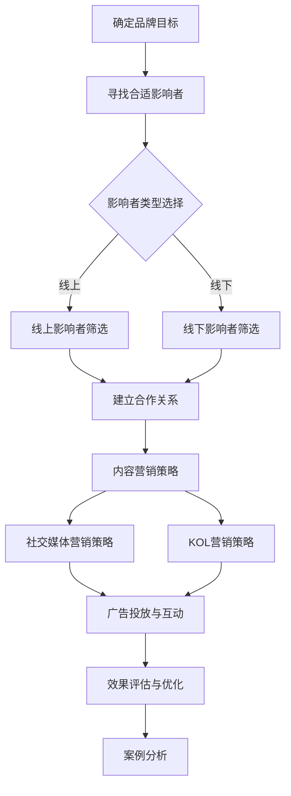

                 

# 《如何利用影响者营销扩大品牌影响力》

## 关键词

- 影响者营销
- 品牌影响力
- 内容营销
- 社交媒体营销
- KOL营销

## 摘要

本文将深入探讨如何利用影响者营销来扩大品牌影响力。通过详细分析影响者营销的基础知识、策略与实践，我们将了解如何选择合适的影响者、建立合作关系、制定内容营销策略以及评估品牌影响力。同时，通过案例分析、实战技巧与工具应用，我们将掌握影响者营销的最佳实践，为品牌的发展提供有力支持。

## 第一部分：影响者营销基础

### 第1章：影响者营销概述

#### 1.1 影响者营销的定义与价值

影响者营销是一种基于影响力者的营销策略，旨在通过影响者来传递品牌信息、吸引目标受众并提升品牌知名度。影响者，即具有较强影响力的人物，他们通过社交媒体、内容创作等方式，对目标受众产生深远影响。在数字时代，影响者营销已成为品牌扩大影响力的重要手段。

影响者营销的价值主要体现在以下几个方面：

1. **提高品牌知名度**：通过影响者的传播，品牌能够迅速获得大量关注，提升品牌知名度。
2. **增强品牌信任度**：影响者具有高度信任度，他们的推荐能够增强消费者对品牌的信任感。
3. **吸引高质量流量**：影响者的受众群体与品牌目标受众高度契合，能够吸引高质量流量。
4. **提升销售转化率**：影响者的推荐能够降低消费者购买决策的门槛，提高销售转化率。

#### 1.2 影响者营销与传统营销的差异

影响者营销与传统营销在目标、方式、效果等方面存在显著差异。

1. **目标差异**：传统营销注重品牌曝光和销售转化，而影响者营销更注重品牌信任度和口碑传播。
2. **方式差异**：传统营销主要依赖广告投放和促销活动，而影响者营销则通过内容创作、互动合作等方式进行。
3. **效果差异**：传统营销效果难以精确衡量，而影响者营销能够通过数据分析和效果评估，实现精准营销。

#### 1.3 影响者营销的目标和策略

影响者营销的目标主要包括提高品牌知名度、增强品牌信任度、吸引高质量流量和提升销售转化率。为实现这些目标，影响者营销可以采取以下策略：

1. **内容营销**：通过创意内容制作和跨平台内容策略，吸引目标受众关注。
2. **社交媒体营销**：利用社交媒体平台进行用户互动和广告投放，扩大品牌影响力。
3. **KOL营销**：与知名影响者合作，利用其影响力为品牌背书。
4. **品牌影响力评估与优化**：通过数据分析和效果评估，优化营销策略，提升品牌影响力。

### 第2章：影响者的类型与选择

#### 2.1 线上影响者的类型

线上影响者主要分为以下几种类型：

1. **网红**：通过社交媒体平台（如抖音、微博、B站等）积累大量粉丝，具有较高的关注度。
2. **行业专家**：在某一领域具有深厚专业知识和丰富经验，受到行业内外人士的尊敬和信任。
3. **意见领袖**：在特定领域具有较强影响力，能够引导公众舆论和消费行为。

#### 2.2 线下影响者的类型

线下影响者主要分为以下几种类型：

1. **企业家**：在商业领域具有较高地位和影响力，能够为品牌带来资源和机会。
2. **明星**：在娱乐界具有较高知名度，能够吸引大量粉丝和关注。
3. **社会名流**：在政治、学术、体育等领域具有较高地位，能够为品牌带来良好的社会形象。

#### 2.3 如何选择合适的影响者

选择合适的影响者是影响者营销成功的关键。以下是一些选择影响者的建议：

1. **明确目标受众**：了解品牌目标受众的特点和需求，选择与目标受众高度契合的影响者。
2. **评估影响力**：分析影响者的粉丝数量、互动率、内容质量等指标，评估其影响力。
3. **匹配品牌价值观**：选择与品牌价值观和品牌形象相符的影响者，确保品牌传播的一致性。
4. **考虑合作成本**：根据品牌预算和合作模式，选择具有较高性价比的影响者。

### 第3章：建立与影响者的合作关系

#### 3.1 合作模式介绍

影响者营销的合作模式主要包括以下几种：

1. **内容合作**：与影响者共同创作内容，如联合发布短视频、撰写文章等。
2. **赞助合作**：为影响者的活动或内容提供赞助，以品牌露出形式获取回报。
3. **代言合作**：邀请影响者为品牌代言，利用其影响力推广品牌。
4. **定制合作**：根据品牌需求，与影响者定制特定的营销活动或内容。

#### 3.2 谈判与签约技巧

建立合作关系时，谈判与签约技巧至关重要。以下是一些建议：

1. **明确合作目标**：在谈判前明确合作目标，确保双方利益一致。
2. **了解合作成本**：了解影响者的报价和成本结构，确保合作方案具有可行性。
3. **谈判策略**：根据品牌预算和影响力者的要求，采取适当的谈判策略，寻求双赢。
4. **签订合同**：在合作细节达成一致后，签订正式合同，明确双方权利和义务。

#### 3.3 合作关系的维护与发展

合作关系的维护与发展是影响者营销成功的关键。以下是一些建议：

1. **定期沟通**：与影响者保持定期沟通，了解其需求和想法，确保合作顺利进行。
2. **提供支持**：为影响者提供必要的支持和资源，如品牌素材、活动策划等。
3. **反馈与激励**：及时给予影响者反馈，对其贡献表示认可，并给予适当的激励。
4. **长期合作**：建立长期合作关系，共同探索更多合作机会，实现品牌持续发展。

## 第二部分：影响者营销策略与实践

### 第4章：内容营销策略

#### 4.1 创意内容制作

创意内容是影响者营销的核心。以下是一些建议：

1. **故事化内容**：通过讲述品牌故事，让消费者了解品牌理念和文化。
2. **个性化内容**：根据目标受众的特点，制作个性化内容，提高内容吸引力。
3. **多媒体内容**：结合文字、图片、视频等多种形式，提高内容传播效果。

#### 4.2 跨平台内容策略

影响者营销需要在多个平台上进行，以下是一些建议：

1. **平台选择**：根据品牌目标受众，选择合适的社交媒体平台。
2. **内容适配**：根据不同平台的特性，调整内容形式和风格，提高传播效果。
3. **联动营销**：在多个平台同步推广，形成传播合力。

#### 4.3 数据分析与效果监控

数据分析与效果监控是影响者营销的重要环节。以下是一些建议：

1. **数据收集**：收集影响者营销过程中的相关数据，如粉丝增长、互动率、转化率等。
2. **效果评估**：通过数据对比和分析，评估营销活动的效果。
3. **优化策略**：根据效果评估结果，调整营销策略，提高营销效果。

### 第5章：社交媒体营销策略

#### 5.1 社交媒体平台选择

选择合适的社交媒体平台是影响者营销成功的关键。以下是一些建议：

1. **目标受众分析**：了解目标受众的社交媒体使用习惯，选择其活跃的社交媒体平台。
2. **平台特性**：根据平台特性，选择适合品牌传播的平台。
3. **竞争分析**：分析竞争对手在社交媒体上的表现，借鉴其成功经验。

#### 5.2 用户互动策略

用户互动是社交媒体营销的核心。以下是一些建议：

1. **内容互动**：通过发布互动性强、有趣的内容，吸引用户参与。
2. **互动形式**：采用问卷调查、抽奖、话题讨论等多种互动形式，提高用户参与度。
3. **用户反馈**：关注用户反馈，及时回应用户提问和意见，建立良好的用户关系。

#### 5.3 社交媒体广告投放

社交媒体广告投放是扩大品牌影响力的重要手段。以下是一些建议：

1. **广告目标**：明确广告投放的目标，如品牌曝光、用户引导等。
2. **广告形式**：根据广告目标，选择合适的广告形式，如图片广告、视频广告等。
3. **广告投放策略**：根据用户行为和喜好，制定合理的广告投放策略，提高广告效果。

### 第6章：KOL营销策略

#### 6.1 KOL的影响力评估

评估KOL的影响力是选择合适KOL的关键。以下是一些建议：

1. **粉丝数量**：粉丝数量是评估KOL影响力的一个重要指标。
2. **互动率**：关注KOL的粉丝互动率，了解其粉丝活跃度。
3. **内容质量**：评估KOL的内容质量，了解其创作能力。
4. **行业认可度**：了解KOL在行业内的认可度和影响力。

#### 6.2 KOL合作策略

与KOL合作需要制定合理的策略。以下是一些建议：

1. **合作模式**：根据品牌需求和KOL特点，选择合适的合作模式，如内容合作、代言合作等。
2. **内容共创**：与KOL共同创作内容，确保内容质量，提高传播效果。
3. **活动策划**：与KOL共同策划营销活动，提高用户参与度。

#### 6.3 KOL营销案例分析

以下是一个KOL营销案例：

**案例：品牌X与网红Y的联名活动**

品牌X与网红Y合作，共同推出一款联名产品。双方通过以下方式推广：

1. **内容共创**：网红Y撰写一篇关于联名产品的文章，详细介绍产品特点和购买理由。
2. **短视频推广**：网红Y制作一组短视频，展示联名产品的使用过程和效果。
3. **社交媒体互动**：品牌X在社交媒体平台上发布联名活动海报，邀请用户参与互动，如转发抽奖等。
4. **效果评估**：通过数据分析，评估联名活动的效果，如粉丝增长、销售增长等。

最终，联名活动取得了显著成效，品牌X的知名度得到了大幅提升，销售业绩也实现了大幅增长。

### 第7章：品牌影响力评估与优化

#### 7.1 品牌影响力评估方法

评估品牌影响力是影响者营销的重要环节。以下是一些常用的评估方法：

1. **粉丝增长评估**：通过分析粉丝数量和增长速度，评估品牌在社交媒体上的影响力。
2. **互动率评估**：通过分析用户互动数据，如点赞、评论、分享等，评估品牌与用户的互动效果。
3. **销售转化评估**：通过分析销售数据，评估品牌营销活动的实际效果。
4. **口碑评估**：通过分析用户评价和反馈，了解品牌在公众心中的形象和地位。

#### 7.2 营销效果优化策略

优化营销效果是影响者营销的核心目标。以下是一些建议：

1. **数据驱动的决策**：根据数据分析结果，制定和调整营销策略，提高营销效果。
2. **优化内容创作**：根据用户反馈和数据分析，优化内容创作，提高内容质量和传播效果。
3. **优化合作模式**：根据品牌需求和KOL特点，调整合作模式，提高合作效果。
4. **持续监测与调整**：持续监测营销活动的效果，根据实际情况进行及时调整，确保营销目标的实现。

#### 7.3 成功案例分析

以下是一个成功的影响者营销案例：

**案例：品牌Z的社交媒体营销**

品牌Z通过以下策略成功扩大了品牌影响力：

1. **内容创新**：品牌Z与知名影响者合作，共同创作了一系列有趣、有创意的短视频，吸引了大量用户关注。
2. **互动营销**：品牌Z在社交媒体平台上开展了多种互动活动，如抽奖、点赞送礼等，提高了用户参与度。
3. **广告投放**：品牌Z在社交媒体平台上进行了精准的广告投放，将目标受众锁定为年轻人，取得了显著的广告效果。
4. **数据分析**：品牌Z通过数据分析，优化了内容创作和广告投放策略，提高了营销效果。

最终，品牌Z的社交媒体营销取得了巨大成功，品牌知名度和销售业绩均实现了显著增长。

## 第三部分：影响者营销实战

### 第8章：品牌实战案例解析

#### 8.1 案例一：某品牌如何利用网红扩大市场

某品牌通过与网红合作，成功扩大了市场。以下是该品牌的实战过程：

1. **网红选择**：品牌选择了与品牌定位和目标受众高度契合的网红，确保合作内容的质量和效果。
2. **内容创作**：网红与品牌共同创作了一系列有趣、有创意的短视频，通过短视频平台进行传播。
3. **广告投放**：品牌在短视频平台上进行了广告投放，将目标受众锁定为年轻人，提高了品牌知名度。
4. **互动营销**：品牌通过点赞、评论、分享等互动活动，提高了用户参与度。
5. **数据分析**：品牌通过数据分析，优化了内容创作和广告投放策略，提高了营销效果。

最终，该品牌通过网红合作成功扩大了市场，品牌知名度和销售业绩均实现了显著增长。

#### 8.2 案例二：某品牌如何通过社交媒体提高品牌知名度

某品牌通过社交媒体营销，成功提高了品牌知名度。以下是该品牌的实战过程：

1. **平台选择**：品牌选择了与目标受众活跃度较高的社交媒体平台，如微博、抖音等。
2. **内容创新**：品牌创作了一系列有趣、有创意的社交媒体内容，吸引了大量用户关注。
3. **广告投放**：品牌在社交媒体平台上进行了精准的广告投放，提高了品牌曝光度。
4. **互动营销**：品牌通过点赞、评论、分享等互动活动，提高了用户参与度。
5. **数据分析**：品牌通过数据分析，优化了内容创作和广告投放策略，提高了营销效果。

最终，该品牌通过社交媒体营销成功提高了品牌知名度，用户关注度和销售额均实现了显著增长。

#### 8.3 案例三：某品牌如何与KOL进行深度合作

某品牌通过与KOL进行深度合作，成功提升了品牌影响力。以下是该品牌的实战过程：

1. **KOL选择**：品牌选择了与品牌定位和目标受众高度契合的KOL，确保合作内容的质量和效果。
2. **合作模式**：品牌与KOL建立了长期合作关系，共同策划和执行了一系列营销活动。
3. **内容共创**：品牌与KOL共同创作了一系列有趣、有创意的内容，通过社交媒体进行传播。
4. **广告投放**：品牌在社交媒体平台上进行了精准的广告投放，提高了品牌曝光度。
5. **数据分析**：品牌通过数据分析，优化了内容创作和广告投放策略，提高了营销效果。

最终，该品牌通过与KOL的深度合作成功提升了品牌影响力，用户关注度和销售额均实现了显著增长。

### 第9章：实战技巧与工具应用

#### 9.1 影响者营销工具介绍

以下是一些常用的影响者营销工具：

1. **社交媒体分析工具**：如微博数据分析、抖音数据分析等，用于分析社交媒体平台上的数据，评估营销效果。
2. **KOL筛选工具**：如微榜、星图等，用于筛选和评估潜在的合作KOL。
3. **内容管理工具**：如内容管理系统（CMS）、内容创作工具等，用于管理和创作营销内容。

#### 9.2 实战技巧分享

以下是一些实战技巧：

1. **数据分析与优化**：通过数据分析，了解用户行为和需求，优化营销策略和内容创作。
2. **合作模式创新**：根据品牌需求和KOL特点，创新合作模式，提高合作效果。
3. **内容创新**：结合热点事件和用户需求，创作有趣、有创意的内容，提高传播效果。

#### 9.3 实战工具应用案例

以下是一个实战工具应用案例：

**案例：某品牌利用社交媒体分析工具提升营销效果**

某品牌通过社交媒体分析工具，成功提升了营销效果。以下是该品牌的实战过程：

1. **数据分析**：品牌通过社交媒体分析工具，分析了用户行为和需求，了解了目标受众的兴趣和偏好。
2. **内容优化**：根据数据分析结果，品牌优化了内容创作策略，创作了更符合用户兴趣的内容。
3. **广告投放**：品牌根据数据分析结果，调整了广告投放策略，将目标受众锁定为最具价值的用户群体。
4. **效果评估**：通过社交媒体分析工具，品牌评估了营销活动的效果，根据效果评估结果，持续优化营销策略。

最终，该品牌通过社交媒体分析工具成功提升了营销效果，用户关注度和销售额均实现了显著增长。

### 第10章：未来趋势与挑战

#### 10.1 影响者营销的发展趋势

随着社交媒体的普及和数字化营销的兴起，影响者营销将呈现以下发展趋势：

1. **多样化**：影响者类型和合作模式将更加多样化，品牌可以选择更多样化的影响者进行合作。
2. **个性化**：影响者营销将更加注重个性化，根据用户特点和需求，制定个性化的营销策略。
3. **智能化**：随着人工智能技术的发展，影响者营销将更加智能化，利用大数据和人工智能技术，实现精准营销。

#### 10.2 挑战与应对策略

影响者营销面临以下挑战：

1. **信任危机**：随着消费者对广告的怀疑态度增强，品牌需要建立信任机制，提高消费者信任度。
2. **竞争加剧**：随着影响者营销的普及，竞争将越来越激烈，品牌需要不断创新，提高营销效果。
3. **数据隐私**：随着数据隐私法规的加强，品牌需要确保数据安全，遵守相关法规。

应对策略：

1. **建立信任机制**：品牌可以通过透明、真实的广告内容，建立信任机制，提高消费者信任度。
2. **创新营销策略**：品牌可以通过创新营销策略，提高营销效果，降低营销成本。
3. **数据合规**：品牌需要确保数据安全，遵守相关法规，加强数据保护措施。

#### 10.3 未来展望

未来，影响者营销将继续发挥重要作用，成为品牌扩大影响力的重要手段。随着技术的进步和消费者需求的变化，影响者营销将不断创新和发展，为品牌提供更多机遇和挑战。

## 附录

### 附录A：影响者营销相关资源与工具

#### A.1 相关网站与平台推荐

1. **微博**：中国领先的社交媒体平台，拥有大量影响者和用户。
2. **抖音**：短视频平台，拥有大量年轻用户和影响者。
3. **B站**：视频分享平台，以年轻人为主要受众，拥有众多内容创作者。
4. **微信**：社交平台，拥有庞大的用户群体，适合进行品牌宣传和互动。

#### A.2 影响者营销工具使用指南

1. **社交媒体分析工具**：如微博数据分析、抖音数据分析等，用于分析用户行为和营销效果。
2. **KOL筛选工具**：如微榜、星图等，用于筛选和评估潜在的合作KOL。
3. **内容管理工具**：如内容管理系统（CMS）、内容创作工具等，用于管理和创作营销内容。

#### A.3 补充阅读材料与案例

1. **《社交媒体营销实战手册》**：详细介绍了社交媒体营销的策略和实践。
2. **《影响者营销：品牌如何利用社交媒体扩大影响力》**：探讨了影响者营销的理论和实践。
3. **成功案例**：分析了一些成功的品牌如何利用影响者营销扩大影响力的案例。

---

### Mermaid 流程图：影响者营销流程图



### 核心算法原理讲解：影响者选择算法（伪代码）

```python
# 伪代码：影响者选择算法

def influence_selection(influencers, brand_goal):
    # 初始化一个空列表用于存储筛选出的影响者
    selected_influencers = []

    # 对每个影响者进行评估
    for influencer in influencers:
        # 计算影响者与品牌目标的匹配度
        match_score = calculate_match_score(influencer, brand_goal)

        # 如果匹配度高于设定阈值，则将影响者加入筛选列表
        if match_score > threshold:
            selected_influencers.append(influencer)

    # 返回筛选后的影响者列表
    return selected_influencers

# 示例：计算匹配度的函数
def calculate_match_score(influencer, brand_goal):
    # 根据影响者与品牌目标的相关属性计算匹配度
    match_score = ...
    return match_score
```

### 数学模型和数学公式 & 详细讲解 & 举例说明

**示例：影响者营销的ROI计算模型**

$$
\text{ROI} = \frac{\text{营销收益} - \text{营销成本}}{\text{营销成本}}
$$

详细讲解：

ROI（投资回报率）是评估影响者营销效果的重要指标。该公式表示营销收益与营销成本之间的比率，用于衡量营销投资的回报效果。营销收益包括通过影响者营销活动获得的直接收益，如销售额增加、品牌知名度提升等；营销成本包括影响者合作费用、广告投放费用等。

举例说明：

假设某品牌通过影响者营销活动获得了100万元的销售额，营销成本为50万元，则该品牌的影响者营销ROI为：

$$
\text{ROI} = \frac{100\text{万元} - 50\text{万元}}{50\text{万元}} = 1
$$

这意味着每投入1元营销成本，品牌获得了1元的营销收益，ROI为100%。

### 作者信息

作者：AI天才研究院/AI Genius Institute & 禅与计算机程序设计艺术 /Zen And The Art of Computer Programming

