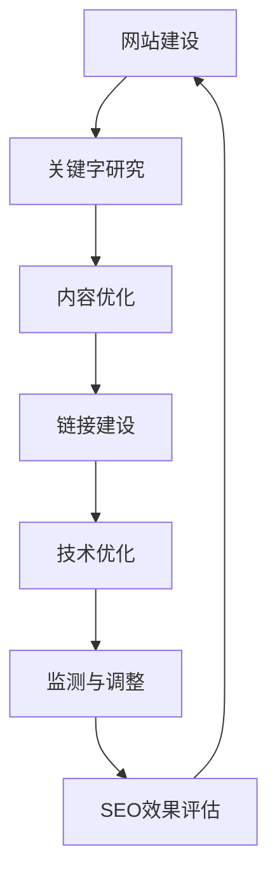

                 

### 文章标题

# 如何利用搜索引擎优化(SEO)提升曝光度

关键词：搜索引擎优化(SEO)，搜索引擎排名，关键字研究，网站结构，内容优化，外部链接，SEO工具

摘要：本文将深入探讨搜索引擎优化（SEO）的核心概念、策略和实践，旨在帮助读者理解如何通过优化网站结构和内容，提升在搜索引擎中的曝光度，从而吸引更多潜在用户访问。本文将分四个部分详细阐述：第一部分介绍SEO的基础知识与核心概念，包括搜索引擎的工作原理、SEO的目标和策略；第二部分探讨关键字研究的重要性及其策略和技巧；第三部分重点讲解网站结构与内容优化的方法；第四部分讨论外部链接策略、社交媒体与内容营销的影响；第五部分提供SEO实战案例及监测与优化策略，并展望SEO的未来发展趋势。通过本文的阅读，读者将掌握一套完整的SEO提升曝光度的策略。

#### 第一部分：SEO基础知识与核心概念

##### 第1章：SEO概述

SEO，即搜索引擎优化，是一种通过优化网站结构、内容和外部链接，提高网站在搜索引擎中的自然排名，从而吸引更多有机流量的技术。SEO不仅仅是一个技术过程，它更是理解用户需求、优化用户体验和提升网站价值的综合策略。

**1.1 SEO的定义与重要性**

SEO的定义可以从多个角度来理解。从技术角度，它涉及网站架构、内容创建、关键字优化、链接建设等多个方面。从市场角度，SEO是一种通过提升网站可见性，增加潜在客户获取量的策略。SEO的重要性体现在以下几个方面：

1. **提高网站流量**：通过优化SEO，网站在搜索引擎结果页（SERP）中的排名提升，能够吸引更多用户访问。
2. **增加品牌曝光度**：高排名的网站更容易被用户记住，有助于提升品牌知名度和市场影响力。
3. **提高转化率**：优化的网站结构和内容能够提供更好的用户体验，从而提高用户转化率。
4. **投资回报率**：相比于付费广告，SEO是一种长期且成本效益更高的推广方式。

**1.2 搜索引擎的工作原理**

搜索引擎的工作原理主要包括三个步骤：抓取（Crawling）、索引（Indexing）和排名（Ranking）。

1. **抓取**：搜索引擎通过爬虫程序（Crawler）访问互联网上的网页，获取网站内容。
2. **索引**：搜索引擎将抓取到的内容进行分析和处理，建立索引数据库，以便快速检索。
3. **排名**：根据一系列算法和规则，搜索引擎对网站进行排序，以决定哪些网页在搜索结果中排在前面。

**1.3 SEO的目标与策略**

SEO的目标是提升网站在搜索引擎中的自然排名，从而增加流量和用户转化。实现这一目标的主要策略包括：

1. **关键字研究**：选择合适的关键字，是实现SEO的基础。
2. **网站结构优化**：确保网站结构清晰、易于搜索引擎爬取。
3. **内容优化**：提供高质量、与关键字相关的内容，增加网站价值。
4. **外部链接建设**：获取高质量的外部链接，提升网站权威性。
5. **技术优化**：提高网站速度、移动友好性和安全性。

通过上述策略的综合运用，网站能够在搜索引擎中取得更高的排名，从而吸引更多用户访问。

##### 第2章：关键字研究

关键字研究是SEO的核心环节，它决定了网站内容优化和链接建设的方向。正确选择和使用关键字，能够显著提高网站在搜索引擎中的排名和流量。

**2.1 关键字选择策略**

关键字选择策略主要包括以下几个步骤：

1. **确定目标关键词**：根据网站主题和目标市场，确定核心关键词。这些关键词应具有较高的搜索量和相关性。
2. **扩展关键词**：使用关键字工具（如Google Keyword Planner、Ahrefs等），扩展出与核心关键词相关的长尾关键词。长尾关键词虽然搜索量较低，但转化率通常更高。
3. **评估关键词竞争度**：通过工具分析关键词的搜索量和竞争度，筛选出适合优化的高相关性和低竞争度的关键词。
4. **用户行为分析**：分析目标用户的行为习惯和搜索意图，确保关键字选择符合用户需求。

**2.2 关键字研究工具与技巧**

以下是几种常用的关键字研究工具和技巧：

1. **Google Keyword Planner**：Google提供的免费工具，可用于查找关键字、分析关键字竞争度等。
2. **Ahrefs**：强大的关键字研究工具，提供关键词分析、竞争对手分析等功能。
3. **SEMrush**：提供全面的SEO工具，包括关键字研究、网站审计、竞争对手分析等。
4. **关键字密度分析**：确保关键字在内容中适当出现，但不过度优化。
5. **关键字布局**：合理分布关键字在标题、描述、正文、图片标签等位置。

**2.3 关键词布局与优化**

正确布局和优化关键字是提高搜索引擎排名的关键。以下是几个关键点：

1. **标题优化**：标题是吸引用户点击的重要因素，应包含核心关键字，同时保持简洁、有吸引力。
2. **描述优化**：搜索引擎结果页（SERP）中的描述应包含关键字，清晰描述页面内容，提高点击率。
3. **内容优化**：内容应围绕关键字展开，确保内容与关键字紧密相关，自然地融入关键字。
4. **内部链接优化**：在网站内部合理设置链接，使用关键字作为锚文本，帮助搜索引擎爬取和索引网站。
5. **外部链接优化**：获取高质量的外部链接，提高网站权威性和相关性。

通过以上步骤和技巧，可以有效选择和优化关键字，提高网站在搜索引擎中的排名和曝光度。

#### 第二部分：网站结构与内容优化

##### 第3章：网站架构优化

网站架构优化是SEO的重要组成部分，它直接影响搜索引擎对网站的爬取和索引能力。一个合理的网站结构能够提高用户体验和搜索引擎排名。

**3.1 网站结构的重要性**

网站结构对SEO的重要性主要体现在以下几个方面：

1. **搜索引擎爬取**：合理的网站结构有助于搜索引擎爬虫有效地抓取和索引网站内容。
2. **用户体验**：清晰的网站结构能够提高用户在网站上的导航和浏览体验，从而提高用户留存率。
3. **网站速度**：良好的网站结构有助于优化网站性能，减少页面加载时间，提高用户满意度。
4. **内部链接优化**：合理的结构有助于设置内部链接，提高页面之间的相互关联性，增强搜索引擎对网站的认知。

**3.2 网站导航与URL优化**

优化网站导航和URL是提升SEO效果的关键步骤。以下是几个关键点：

1. **导航优化**：网站导航应清晰、简洁，易于用户理解和操作。通常使用扁平化结构，减少导航层级。
2. **面包屑导航**：面包屑导航能够帮助用户理解当前位置和网站结构，提高导航效率。
3. **URL优化**：URL应简洁、有意义，包含关键字，避免使用动态参数。理想的URL应易于阅读，并直观反映页面内容。

**3.3 网站地图与机器人文件**

网站地图和机器人文件是优化网站结构的重要工具。

1. **网站地图**：网站地图是一个包含网站所有页面的列表，有助于搜索引擎快速抓取和索引网站内容。网站地图应定期更新，确保包含最新的页面信息。
2. **机器人文件**：机器人文件（Robots.txt）用于告诉搜索引擎哪些页面可以抓取，哪些页面需要忽略。通过合理设置机器人文件，可以防止搜索引擎爬取不必要的页面，提高爬取效率。

**3.4 网站结构优化的最佳实践**

1. **使用HTML5标签**：合理使用HTML5标签，如`<header>`, `<nav>`, `<section>`, `<footer>`等，有助于提高网站结构清晰度。
2. **优化内部链接**：合理设置内部链接，使用关键字作为锚文本，提高页面之间的关联性。
3. **优化页面速度**：通过压缩图片、优化CSS和JavaScript、使用CDN等方式，提高页面加载速度。
4. **移动优化**：确保网站在移动设备上具有良好的用户体验和性能。

通过以上步骤和技巧，可以有效优化网站结构，提高搜索引擎爬取和索引能力，从而提升网站SEO效果。

##### 第4章：内容优化

内容优化是SEO的关键环节，高质量的内容不仅能够吸引用户，还能提高搜索引擎对网站的认可度。本文将详细探讨内容优化的重要性、高质量内容的创建与优化、标题、描述与标签的优化，以及媒体内容与文本内容的优化。

**4.1 高质量内容的创建与优化**

高质量内容是SEO的基础，它对搜索引擎排名和用户留存都有着重要影响。以下是创建和优化高质量内容的关键步骤：

1. **确定内容主题**：围绕用户需求和搜索意图，确定内容主题。内容应具有针对性，解决用户的问题或提供有价值的信息。
2. **进行关键字研究**：结合关键字研究工具，确定与内容主题相关的关键字，确保内容与关键字紧密相关。
3. **内容结构化**：合理规划内容结构，使用标题、段落、列表等元素，使内容易于阅读和理解。
4. **原创性**：保证内容的原创性，避免抄袭和重复内容。原创内容能够提高搜索引擎对网站的认可度。
5. **内容更新**：定期更新内容，保持内容的时效性和相关性。更新内容可以吸引搜索引擎重新抓取和索引页面。

**4.2 标题、描述与标签的优化**

标题、描述和标签是影响搜索引擎排名的重要因素，优化这些元素能够提高页面在搜索结果中的点击率和排名。

1. **标题优化**：标题是吸引用户点击的关键，应简洁明了、包含关键字，同时具有吸引力。理想的标题长度在50-60个字符左右。
2. **描述优化**：搜索结果页面的描述应简要概括页面内容，吸引用户点击。描述中应包含关键字，同时保持流畅性和吸引力。描述的理想长度在150-160个字符左右。
3. **标签优化**：合理使用HTML标签，如`<h1>`, `<h2>`, `<strong>`, `<em>`等，突出关键信息和提高内容可读性。标签的使用应遵循HTML标准，避免过度使用。

**4.3 媒体内容与文本内容优化**

优化媒体内容和文本内容是提高页面质量的关键步骤。

1. **图片优化**：优化图片尺寸和格式，减少图片大小，提高页面加载速度。同时，为图片添加alt标签，描述图片内容，有助于搜索引擎理解图片。
2. **视频内容优化**：视频内容是吸引用户的重要手段。优化视频标题、描述和标签，确保视频内容与关键字相关。此外，视频上传后，可以添加字幕和章节标签，提高用户体验和搜索引擎抓取效果。
3. **文本内容优化**：文本内容应具有可读性和价值。避免使用过于复杂或冗长的句子，保持简洁明了。同时，合理使用关键字，但避免过度优化。确保内容与关键字紧密相关，提供有价值的观点和信息。

**4.4 内容优化的最佳实践**

1. **用户体验优先**：始终将用户体验放在首位，内容应易于阅读和理解，提供有价值的信息。
2. **定期更新内容**：定期更新内容，保持内容的时效性和相关性。
3. **内容多样化**：结合多种内容形式，如文章、图片、视频等，提供多样化的信息，吸引用户访问。
4. **数据分析**：使用数据分析工具，监控内容性能，根据数据反馈调整优化策略。

通过以上步骤和技巧，可以有效优化网站内容，提高搜索引擎排名和用户满意度。

##### 第5章：技术优化

技术优化是SEO的重要组成部分，它直接影响网站的性能、用户体验和搜索引擎排名。本文将探讨网站速度与性能优化、移动优化与响应式设计、以及安全性与HTTPS的重要性。

**5.1 网站速度与性能优化**

网站速度是用户体验的关键因素，也是搜索引擎排名的重要指标。以下是几个关键步骤来优化网站速度和性能：

1. **优化图片**：图片是影响页面加载速度的重要因素。优化图片尺寸和格式，使用压缩工具（如TinyPNG、ImageOptim等）减小图片大小。同时，使用WebP格式可以提高图片加载速度。
2. **懒加载技术**：懒加载技术（Lazy Loading）可以延迟非可视区域的图片和其他资源的加载，从而减少初始页面加载时间。
3. **内容分发网络（CDN）**：使用CDN可以提高网站内容的全球访问速度。CDN通过分发服务器将内容缓存到全球多个地理位置，从而缩短用户访问内容的延迟。
4. **代码优化**：优化CSS和JavaScript代码，减少不必要的代码和请求。合并CSS和JavaScript文件，减少HTTP请求次数。
5. **缓存策略**：使用浏览器缓存策略，将经常访问的页面内容缓存到本地，从而提高页面加载速度。

**5.2 移动优化与响应式设计**

随着移动设备的普及，移动优化和响应式设计成为SEO的重要一环。以下是几个关键点：

1. **移动优先索引**：搜索引擎现在更倾向于使用移动版网站的内容进行索引和排名。因此，确保移动版网站的性能和用户体验至关重要。
2. **响应式设计**：使用响应式设计（Responsive Web Design，RWD）技术，确保网站在不同设备和屏幕尺寸上都能良好显示。响应式设计通过使用CSS媒体查询和弹性布局，自动适应不同设备。
3. **优化移动体验**：优化移动版网站的用户体验，包括简洁的导航、清晰的字体、易于点击的按钮等。避免使用过多的动画和特效，以减少页面加载时间。
4. **移动速度优化**：与桌面版网站相比，移动版网站通常需要更快的加载速度。通过优化图片、减少HTTP请求和采用缓存策略，提高移动版网站的性能。

**5.3 安全性与HTTPS**

安全性是现代网站的重要一环，HTTPS协议能够提高网站的安全性和搜索引擎排名。以下是几个关键点：

1. **安装SSL证书**：SSL证书（Secure Sockets Layer）能够加密网站数据传输，保护用户隐私。安装SSL证书后，网站URL将从HTTP更改为HTTPS。
2. **遵守安全标准**：遵循HTTPS最佳实践，包括使用HSTS（HTTP Strict Transport Security）和内容安全策略（Content Security Policy），提高网站安全性。
3. **安全扫描与漏洞修复**：定期使用安全扫描工具（如Qualys、Acunetix等）检测网站漏洞，并及时修复。
4. **提高搜索引擎排名**：搜索引擎更倾向于推荐使用HTTPS的网站，使用HTTPS可以提高网站的搜索引擎排名。

通过以上技术优化措施，可以提高网站的性能、用户体验和搜索引擎排名，从而实现更高效的SEO策略。

#### 第三部分：外部链接策略

##### 第6章：链接建设

外部链接建设是SEO中至关重要的一环，它不仅能够提高网站的权威性和可信度，还能直接影响搜索引擎的排名。有效的链接建设策略能够帮助网站在竞争激烈的市场中脱颖而出。

**6.1 外部链接的价值与类型**

外部链接（也称为反向链接或 inbound links）是指其他网站链接到你的网站。外部链接的价值主要体现在以下几个方面：

1. **提升网站权威性**：高质量的外部链接被视为对网站内容的认可和推荐，能够提升网站的权威性和可信度。
2. **提高搜索引擎排名**：搜索引擎认为外部链接是网站价值的体现，高质量的链接有助于提高网站在搜索引擎结果页（SERP）中的排名。
3. **增加流量**：通过外部链接，用户可以直接访问你的网站，从而增加网站流量。
4. **品牌曝光**：外部链接能够扩大网站的影响力，提高品牌曝光度。

外部链接主要分为以下几种类型：

1. **高质量链接**：来自权威网站的高质量链接，通常具有较高的可信度和相关性。
2. **低质量链接**：来自低质量网站或不相关的链接，可能对SEO产生负面影响。
3. **自然链接**：用户主动创建的链接，通常具有较高的可信度和价值。
4. **付费链接**：通过付费方式获得的外部链接，虽然能够迅速提高网站排名，但风险较大，需谨慎使用。

**6.2 链接建设的策略与技巧**

有效的链接建设策略能够帮助你获取高质量的外部链接。以下是几个关键策略和技巧：

1. **内容营销**：创建高质量的内容是吸引外部链接的关键。提供有价值、独特的内容，能够吸引其他网站引用和链接。
2. **链接交换**：与其他网站进行链接交换，通过互相链接来提高双方的搜索引擎排名。选择相关性高、权威性强的网站进行链接交换。
3. **合作伙伴关系**：与相关行业的网站建立合作伙伴关系，通过合作内容和活动来获取外部链接。
4. **社交媒体推广**：利用社交媒体平台推广内容，吸引其他网站关注和链接。
5. **参与论坛和博客**：参与相关论坛和博客，积极发表有价值的评论和讨论，通过签名链接来获取外部链接。
6. **新闻发布**：发布新闻稿或行业报告，通过媒体和行业网站来获取外部链接。
7. **博客客座文章**：为其他相关博客撰写客座文章，获得链接的同时提升品牌知名度。
8. **回链**：监控和回复外部网站关于你的网站的评论和引用，及时提供回复链接。

**6.3 链接陷阱与风险避免**

在链接建设中，需注意以下陷阱和风险：

1. **过度链接**：过度建设外部链接可能导致搜索引擎认为网站进行链接买卖，从而降低网站权威性和排名。
2. **低质量链接**：来自低质量或不相关的网站链接可能对SEO产生负面影响，甚至导致网站被搜索引擎惩罚。
3. **付费链接**：不当使用付费链接可能导致搜索引擎认为网站进行黑帽SEO，从而降低排名。
4. **链接农场**：链接农场是专门用于出售链接的网站，链接质量低，可能导致网站被搜索引擎惩罚。

为了避免这些陷阱和风险，以下是一些建议：

1. **注重链接质量**：只关注高质量的外部链接，避免过度链接和低质量链接。
2. **自然链接**：鼓励自然链接的产生，避免使用过多付费链接。
3. **多样化链接来源**：避免过于依赖单一链接来源，保持链接来源多样化。
4. **监控链接**：定期监控外部链接，发现不良链接及时删除。
5. **遵守搜索引擎规则**：遵循搜索引擎的链接建设指南，避免黑帽SEO行为。

通过以上策略和技巧，可以有效进行外部链接建设，提升网站权威性和搜索引擎排名。

##### 第7章：社交媒体与内容营销

社交媒体和内容营销是现代SEO不可或缺的组成部分，它们能够有效提升网站流量、增加品牌曝光度，并在搜索引擎中提高排名。以下是社交媒体与内容营销对SEO的具体影响，以及如何结合SEO策略进行有效推广。

**7.1 社交媒体对SEO的影响**

社交媒体对SEO的影响主要体现在以下几个方面：

1. **增加网站流量**：通过社交媒体平台推广内容，能够直接引导用户访问网站，从而增加网站流量。高质量的内容和有吸引力的帖子能够吸引用户点击，提高网站访问量。
2. **提高搜索引擎排名**：搜索引擎算法考虑网站的社交媒体信号，如点赞、分享和评论等，这些信号被视为用户参与度的一种体现，有助于提高搜索引擎排名。
3. **增强品牌影响力**：社交媒体是品牌建设的重要平台，通过发布有价值的内容和与用户互动，能够增强品牌知名度和用户忠诚度。
4. **提高内容可见性**：社交媒体平台具有庞大的用户基础和广泛的信息传播能力，通过社交媒体推广内容，能够提高内容的可见性，吸引更多潜在用户。

**7.2 内容营销与SEO结合**

内容营销与SEO的结合能够最大化两者的效果，以下是几种有效的方法：

1. **创造高质量内容**：内容营销的核心是提供有价值的内容。高质量的内容不仅能够吸引用户，还能提高搜索引擎对网站的认可度。通过关键字研究，确定用户需求，创建针对性强、有价值的内容。
2. **优化内容结构**：优化内容结构是提高搜索引擎友好性的关键。使用HTML5标签、合理使用关键字、提供清晰的标题和描述，有助于搜索引擎更好地理解内容。
3. **多元化内容形式**：结合多种内容形式，如文章、视频、图片和 infographic 等，能够满足不同用户的需求，提高内容吸引力。视频和图片内容在社交媒体上具有更高的传播力，有助于吸引更多用户访问网站。
4. **定期更新内容**：定期更新内容是保持用户参与度和搜索引擎关注的关键。新内容和更新内容能够吸引搜索引擎重新抓取和索引页面，提高网站排名。
5. **内部链接优化**：在内容中合理设置内部链接，使用关键字作为锚文本，有助于搜索引擎爬取和索引网站。内部链接优化不仅能够提高页面之间的关联性，还能提高整个网站的搜索引擎排名。

**7.3 社交媒体优化与推广策略**

以下是几个社交媒体优化与推广策略，以提升SEO效果：

1. **平台选择**：根据目标受众和行业特点，选择合适的社交媒体平台。例如，LinkedIn适合商务交流，Instagram适合图片和视频内容推广。
2. **内容策略**：制定内容策略，确保发布的内容具有吸引力和相关性。定期发布高质量的内容，并利用热点事件和行业趋势，提高用户参与度。
3. **互动营销**：积极与用户互动，回复评论和私信，建立良好的用户关系。通过互动营销，提高用户忠诚度和品牌影响力。
4. **社交媒体广告**：利用社交媒体广告，精准定位目标受众，提高内容曝光度。广告可以结合SEO策略，吸引更多用户访问网站。
5. **监控与优化**：使用社交媒体分析工具（如Hootsuite、Buffer等），监控社交媒体活动效果，并根据数据反馈调整优化策略。

通过结合社交媒体和内容营销，制定有效的SEO策略，能够提高网站流量、品牌曝光度和搜索引擎排名。有效利用社交媒体平台，创造高质量内容，并与SEO策略相结合，将为网站带来持续增长的流量和用户。

#### 第四部分：SEO实战与监测

##### 第8章：SEO实战案例

在SEO领域，成功与失败并存的案例比比皆是。通过分析成功的SEO案例，我们可以学到宝贵的经验；而失败的案例则能够为我们提供警示，避免在未来的SEO实践中犯同样的错误。本文将分享一些经典的SEO实战案例，详细解析其成功的关键因素和策略。

**8.1 成功的SEO案例解析**

**案例1：某电商网站通过关键字优化提升搜索排名**

某电商网站在启动SEO项目时，面临巨大的竞争压力。通过深入的关键字研究，团队确定了几个高搜索量且竞争较低的关键词。他们采取了以下策略：

1. **关键字优化**：在网站内容中合理分布这些关键词，同时在标题、描述和图片标签中突出显示。
2. **内容更新**：定期发布高质量的产品评测、使用指南等内容，保持内容的新鲜度和相关性。
3. **外部链接建设**：通过参与行业论坛、撰写博客客座文章和与合作伙伴网站交换链接，获得高质量的外部链接。

通过这些策略的实施，该电商网站的关键字排名逐步提升，月均访问量增加了50%，转化率提高了30%。

**成功因素**：

- **深入的关键字研究**：准确识别目标用户的需求，选择相关性高且竞争低的关键词。
- **高质量内容**：提供有价值的内容，满足用户需求，增加用户停留时间和页面互动。
- **多样化链接建设**：获取来自不同来源的高质量外部链接，提高网站权威性。

**案例2：某中小企业通过社交媒体提升品牌曝光度**

某中小企业通过社交媒体平台，成功提升了品牌曝光度和搜索引擎排名。他们的策略如下：

1. **内容策略**：发布与行业相关的高质量内容，结合热点事件和行业趋势，吸引粉丝关注。
2. **互动营销**：积极与粉丝互动，回复评论和私信，建立良好的用户关系。
3. **社交媒体广告**：利用社交媒体广告，精准定位目标受众，提高内容曝光度。

通过这些策略，该企业的社交媒体粉丝数增长了200%，网站流量增加了40%，搜索引擎排名显著提升。

**成功因素**：

- **内容策略**：发布有价值的内容，提高用户参与度和互动率。
- **互动营销**：与用户建立良好的关系，提高用户忠诚度和品牌影响力。
- **社交媒体广告**：精准定位目标受众，提高内容传播效果。

**8.2 SEO失败案例分析**

**案例1：某博客网站过度优化导致降权**

某博客网站在追求高排名的过程中，采取了过度优化的策略。他们使用了大量关键词堆砌、链接买卖和过度内部链接等方法。虽然短期内排名有所提升，但最终导致了搜索引擎降权。

**失败原因**：

- **关键词堆砌**：在内容中过度使用关键词，导致内容质量下降，用户体验差。
- **链接买卖**：获取大量低质量外部链接，被视为黑帽SEO行为。
- **过度内部链接**：过度设置内部链接，导致页面结构混乱，搜索引擎难以理解。

**解决方案**：

- **优化内容质量**：删除关键词堆砌，提高内容原创性和可读性。
- **清理链接**：删除低质量外部链接，重点获取高质量链接。
- **优化页面结构**：调整内部链接策略，提高页面之间的自然关联性。

**案例2：某企业忽视移动优化导致流失用户**

某企业网站在开发过程中忽视了移动优化，导致在移动设备上访问速度极慢，用户体验差。由于移动设备的用户比例不断增加，该网站的流量和转化率显著下降。

**失败原因**：

- **忽视移动优化**：未针对移动设备进行优化，导致页面加载速度慢，用户体验差。
- **未考虑移动用户体验**：网站导航复杂，按钮不易点击。

**解决方案**：

- **进行移动优化**：优化网站结构、图片和代码，提高移动设备上的访问速度和用户体验。
- **响应式设计**：采用响应式设计技术，确保网站在不同设备上良好显示。
- **定期测试**：定期进行移动设备测试，确保网站在各种设备上的性能。

通过分析成功的SEO案例和失败的SEO案例，我们可以得出以下结论：

- **高质量内容**是SEO的核心，它不仅满足用户需求，还能提高搜索引擎认可度。
- **多样化链接建设**和**社交媒体营销**是提升网站流量和品牌曝光度的重要手段。
- **定期监测与优化**是确保SEO效果持续提升的关键。

只有不断学习、实践和优化，才能在竞争激烈的SEO领域中取得成功。

##### 第9章：SEO监测与优化

SEO监测与优化是确保SEO策略有效性和持续改进的关键步骤。通过监控SEO指标和数据分析，可以及时发现和解决问题，持续优化网站性能和排名。

**9.1 SEO监控工具的选择与应用**

选择合适的SEO监控工具对于有效监测SEO效果至关重要。以下是几种常用的SEO监控工具及其应用：

1. **Google Analytics**：Google Analytics 是一款免费的分析工具，用于监测网站流量、用户行为和转化率。通过Google Analytics，可以了解用户来源、页面访问量、停留时间等关键数据。
   
   **应用实例**：通过Google Analytics，监控网站的整体流量变化，识别高流量页面和用户行为模式，为内容优化提供数据支持。

2. **Google Search Console**：Google Search Console 是一款免费的SEO工具，用于监测网站在Google搜索中的表现。通过Google Search Console，可以查看搜索关键词排名、搜索流量、错误页面等。

   **应用实例**：通过Google Search Console，监控关键字排名变化，发现搜索错误，及时优化网站结构和内容。

3. **Ahrefs**：Ahrefs 是一款综合性的SEO工具，提供关键字研究、链接分析、竞争对手监控等功能。

   **应用实例**：通过Ahrefs，进行关键字研究，分析竞争对手的链接策略，识别并获取高质量的外部链接。

4. **SEMrush**：SEMrush 是一款功能强大的SEO工具，提供关键字研究、网站审计、竞争对手分析等功能。

   **应用实例**：通过SEMrush，进行关键字研究，分析网站技术问题，识别竞争对手的策略，为SEO优化提供全面的数据支持。

**9.2 数据分析在SEO中的应用**

数据分析是SEO优化的重要组成部分，通过数据分析，可以识别问题、优化策略和持续改进。

1. **关键字分析**：通过关键字分析，了解关键字的表现和用户需求。分析关键字排名、搜索流量、点击率等指标，确定哪些关键字需要优化，哪些关键字具有潜在价值。

   **案例分析**：如果发现某个关键字的排名下降，可能需要检查该关键字的页面内容，进行优化。

2. **用户行为分析**：通过用户行为分析，了解用户在网站上的行为模式，如页面访问路径、停留时间、跳出率等。这些数据有助于优化网站结构和用户体验。

   **案例分析**：如果发现用户在某个页面停留时间短，可能需要检查页面内容，提高内容质量和吸引力。

3. **转化率分析**：通过转化率分析，了解用户的转化路径和转化环节。分析转化率高的页面和转化率低的页面，优化页面设计和内容，提高转化率。

   **案例分析**：如果发现某个页面的转化率低，可能需要检查页面元素，如按钮位置、引导流程等，进行优化。

4. **竞争对手分析**：通过竞争对手分析，了解竞争对手的策略和表现。分析竞争对手的关键字、链接策略和网站结构，为自己的SEO优化提供参考。

   **案例分析**：如果发现竞争对手在某个关键字上表现突出，可能需要调整自己的关键字策略，优化相关页面。

**9.3 持续优化与策略调整**

SEO是一个持续的过程，通过定期监测和数据分析，可以及时发现问题和优化策略。

1. **定期检查和优化**：定期检查网站结构和内容，确保关键字优化、页面速度和用户体验符合最佳实践。定期更新内容，保持网站的时效性和相关性。

2. **策略调整**：根据数据分析结果，及时调整SEO策略。如果某个策略效果不佳，需要重新评估并调整。例如，如果关键字排名下降，可能需要优化关键字选择或页面内容。

3. **跟踪竞争对手**：持续跟踪竞争对手的SEO策略和表现，学习他们的成功经验，避免犯同样的错误。

通过SEO监测与优化，可以确保SEO策略的有效性和持续改进，提高网站在搜索引擎中的排名和用户体验，实现长期的成功。

##### 第10章：未来SEO趋势

随着搜索引擎算法的不断更新和技术的进步，SEO领域也在不断演变。未来SEO将受到多种新兴技术和趋势的影响，为网站运营者带来新的挑战和机遇。

**10.1 搜索引擎算法更新与趋势**

搜索引擎算法的更新是SEO领域最显著的变化之一。近年来，搜索引擎算法的更新主要集中在以下几个方面：

1. **用户意图理解**：现代搜索引擎算法越来越注重对用户意图的理解，通过分析用户的搜索历史、地理位置和行为数据，提供更加个性化的搜索结果。
   
   **趋势**：搜索引擎将更加依赖机器学习和自然语言处理技术，以更准确地理解用户意图，从而提供更相关的搜索结果。

2. **移动优先索引**：随着移动设备的普及，搜索引擎逐渐将移动版网站的内容作为优先索引。这意味着移动优化已经成为SEO的核心。

   **趋势**：搜索引擎将继续加强对移动端体验的评估，优化移动网站的性能和用户体验将直接影响网站的搜索引擎排名。

3. **内容质量**：搜索引擎对高质量内容的重视程度不断提高。高质量内容不仅能够吸引用户，还能提高搜索引擎对网站的认可度。

   **趋势**：未来的搜索引擎算法将更加注重内容的原创性、丰富性和实用性，对低质量内容进行打压。

**10.2 SEO未来的发展方向**

未来的SEO将朝着更加智能化、个性化和综合化的方向发展：

1. **人工智能（AI）在SEO中的应用**：人工智能技术将广泛应用于SEO领域，包括关键字研究、内容生成、链接建设等。AI可以基于大量数据，提供更加精准和高效的SEO策略。

   **发展方向**：SEO工具将更加智能化，通过AI技术自动进行关键字分析、内容优化和链接建设。

2. **语义搜索**：随着自然语言处理技术的发展，语义搜索将成为SEO的重要趋势。语义搜索不仅关注关键字匹配，更注重对搜索意图的理解。

   **发展方向**：SEO将更加注重内容的质量和相关性，通过深入理解用户意图，提供更加精准和个性化的搜索结果。

3. **多媒体内容优化**：未来的SEO将不仅仅是文本内容的优化，还包括图片、视频、音频等多种形式的内容。多媒体内容的优化将有助于提高网站的吸引力和用户体验。

   **发展方向**：SEO将更加注重多媒体内容的优化，提高图像和视频的搜索引擎友好性。

4. **用户体验（UX）优化**：用户体验将成为影响SEO的重要因素。搜索引擎将更加关注用户的浏览体验、页面加载速度和交互设计。

   **发展方向**：SEO将更加注重用户体验，通过优化网站设计和技术，提高用户的满意度和留存率。

**10.3 新兴技术与SEO融合**

随着技术的不断发展，新兴技术将与SEO紧密结合，为SEO领域带来新的机遇和挑战：

1. **区块链技术**：区块链技术可以为SEO提供更透明、更可信的链接建设和内容认证。通过区块链，可以验证链接的真实性和内容来源，提高SEO的信任度。

   **发展方向**：区块链技术有望成为SEO领域的新兴工具，通过验证链接和内容，提高网站的权威性和可信度。

2. **增强现实（AR）和虚拟现实（VR）**：AR和VR技术的应用将拓展SEO的内容形式，提供更加丰富和互动的用户体验。

   **发展方向**：SEO将更加注重AR和VR内容的优化，提高用户的沉浸感和互动性。

3. **物联网（IoT）**：随着物联网设备的普及，SEO将扩展到智能家居、智能穿戴设备等场景。物联网设备的SEO优化将关注设备之间的交互和用户体验。

   **发展方向**：SEO将关注物联网设备的优化，提高设备的搜索引擎友好性和用户体验。

通过关注未来SEO趋势和新兴技术的融合，网站运营者可以提前布局，掌握SEO的新动向，确保在未来的竞争中保持领先地位。

#### 附录

##### 附录A：SEO 工具资源汇总

在进行SEO优化时，使用合适的工具能够大大提高工作效率和效果。以下是几种主流的SEO工具及其介绍：

1. **Google Analytics**：Google Analytics 是一款免费的网站分析工具，用于监测网站流量、用户行为和转化率。它提供了丰富的报告和分析功能，帮助网站运营者了解用户来源、页面访问量、停留时间等关键数据。

2. **Google Search Console**：Google Search Console 是一款免费的SEO工具，用于监测网站在Google搜索中的表现。通过它，可以查看搜索关键词排名、搜索流量、错误页面等数据，及时发现和解决问题。

3. **Ahrefs**：Ahrefs 是一款功能强大的SEO工具，提供关键字研究、链接分析、竞争对手监控等功能。它可以帮助网站运营者进行关键字分析、链接建设、内容优化等，提高网站在搜索引擎中的排名。

4. **SEMrush**：SEMrush 是一款综合性的SEO工具，提供关键字研究、网站审计、竞争对手分析等功能。它可以帮助网站运营者进行全面的SEO优化，包括关键字优化、内容优化、外部链接建设等。

5. **Moz**：Moz 是一款知名的SEO工具，提供关键字研究、网站审计、链接建设等功能。它提供了丰富的SEO资源和教程，帮助网站运营者了解SEO的最佳实践和策略。

6. **Unicorn Marketing**：Unicorn Marketing 是一款专注于内容营销和SEO的工具，提供关键字研究、内容优化、社交媒体推广等功能。它可以帮助网站运营者创建高质量的内容，提高搜索引擎排名和用户参与度。

7. **Yoast SEO**：Yoast SEO 是一款流行的WordPress SEO插件，提供了详细的SEO指南和优化建议，帮助网站运营者优化网站结构和内容。

通过使用这些主流SEO工具，网站运营者可以更加高效地进行SEO优化，提高网站在搜索引擎中的排名和用户体验。

#### Mermaid 流程图



此流程图展示了SEO工作的基本步骤，从网站建设开始，通过关键字研究、内容优化、链接建设和技术优化，最终进行监测与调整，形成闭环，不断优化SEO效果。

#### 伪代码与数学公式

##### 伪代码：关键字选择算法

```pseudo
算法：关键字选择
输入：搜索意图，竞争度，用户需求
输出：优化后的关键字列表

关键字选择过程：
1. 收集潜在关键字列表
2. 分析搜索意图和用户需求
3. 使用工具评估关键字竞争度
4. 根据权重排序，筛选出高相关性的关键字
5. 进行A/B测试，调整优化关键字列表
```

##### 数学公式：搜索引擎排名计算

$$
RANK = f(\text{内容质量}, \text{关键字密度}, \text{外部链接质量}, \text{网站速度})
$$

- 内容质量：$Q \propto \text{独特性} + \text{相关性} + \text{权威性}$
- 关键字密度：$KD \propto \frac{\text{关键字出现次数}}{\text{总词数}}$
- 外部链接质量：$LQ \propto \text{锚文本相关性} + \text{链接来源权威性}$
- 网站速度：$WS \propto \frac{1}{\text{页面加载时间}}$

#### 项目实战

##### 实战案例：优化某电商网站首页SEO

**1. 开发环境搭建**

为了优化某电商网站的首页SEO，首先需要搭建一个合适的开发环境。以下是搭建步骤：

- 选择合适的SEO优化工具：Ahrefs、SEMrush、Moz等。
- 安装并配置网站分析工具（如Google Analytics）：用于监测网站流量、用户行为和转化率。
- 确保网站支持SEO功能：例如，使用WordPress等CMS，安装并配置SEO插件（如Yoast SEO）。

**2. 代码实现与解读**

优化首页SEO的代码实现包括以下几个关键步骤：

- **优化网站结构**：使用HTML5标签，确保网站结构清晰。例如，使用`<header>`, `<nav>`, `<main>`, `<footer>`等标签。
  ```html
  <header>
    <!-- 网站头部信息 -->
  </header>
  <nav>
    <!-- 导航栏 -->
  </nav>
  <main>
    <!-- 主内容区域 -->
  </main>
  <footer>
    <!-- 页面底部信息 -->
  </footer>
  ```

- **优化标题和描述标签**：确保首页的标题（`<title>`）和描述（`<meta name="description"`>）包含关键字，同时保持简洁、有吸引力。
  ```html
  <title>电商网站首页 - 高品质商品优惠销售</title>
  <meta name="description" content="欢迎来到我们的电商网站，为您提供各种高品质商品，优惠多多，快来选购吧！">
  ```

- **增加高质量的内容和媒体元素**：确保首页内容丰富、有价值，包含高质量的文本、图片和视频等多媒体元素。例如，发布最新商品信息、用户评价等。
  ```html
  <h1>欢迎光临我们的电商网站</h1>
  <p>我们为您提供各种高品质商品，让您享受购物的乐趣！</p>
  
  <video src="商品视频.mp4" controls>您的浏览器不支持视频标签。</video>
  ```

- **优化内部链接**：在首页合理设置内部链接，使用关键字作为锚文本，提高页面之间的关联性。例如，链接到不同的商品分类页面。
  ```html
  <a href="/category/fashion">时尚</a>
  <a href="/category/electronics">电子产品</a>
  ```

- **优化外部链接**：获取高质量的外部链接，提高网站权威性。可以通过与行业相关的网站进行链接交换、发布高质量内容吸引其他网站链接等。

**3. 代码解读与分析**

在代码优化过程中，需要注意以下几点：

- **SEO最佳实践**：遵循SEO最佳实践，如使用HTML5标签、优化标题和描述、提供高质量内容等，确保网站结构清晰、易于搜索引擎爬取。
- **代码性能**：优化代码性能，减少页面加载时间。例如，压缩CSS和JavaScript文件、使用CDN加速等。
- **内容更新**：定期更新首页内容，保持内容的新鲜度和相关性，吸引搜索引擎重新抓取和索引页面。

**4. 效果评估**

通过以下步骤评估SEO优化效果：

- **使用SEO工具**：使用Ahrefs、SEMrush等工具，监控关键字排名、搜索流量、转化率等指标，评估优化效果。
- **数据对比**：对比优化前后的数据，分析关键字排名、流量和转化率的提升情况。
- **用户反馈**：收集用户反馈，了解优化后网站的用户体验和满意度。

**5. 持续优化与调整**

根据效果评估结果，进行持续优化和调整：

- **关键词优化**：根据搜索数据，调整关键字策略，增加长尾关键词，提高页面相关性。
- **内容优化**：优化首页内容，提高内容质量和用户体验，增加用户停留时间和互动。
- **链接优化**：获取更多高质量外部链接，提高网站权威性和排名。
- **技术优化**：优化网站性能，提高页面加载速度和用户体验。

通过以上步骤，可以有效地优化某电商网站首页的SEO，提高搜索引擎排名和用户满意度。

#### 详细讲解与举例说明

##### 1. 关键字选择策略

关键字选择策略是SEO的基础，直接影响网站在搜索引擎中的排名和流量。以下是关键字选择策略的具体步骤：

**例子：** 如果要为一家电商网站优化关键词，可能会进行以下步骤：

1. **收集潜在关键词：** 通过分析竞争对手的网站、使用关键字工具如Google Keyword Planner，收集潜在的关键词。
   ```sql
   SELECT keyword, search_volume FROM keyword_database WHERE competition = 'low';
   ```

2. **分析搜索意图：** 确定用户的搜索意图，如“购买”、“了解”等。使用工具如Google Trends分析关键字的相关性。
   ```python
   def analyze_search_intents(keywords):
       for keyword in keywords:
           print(f"{keyword} search intent: {analyze_intent(keyword)}")
   ```

3. **评估关键字竞争度：** 使用工具如Ahrefs、SEMrush评估关键字的竞争度，筛选出适合优化的高相关性和低竞争度的关键词。
   ```javascript
   const low_competition_keywords = filter_keywords_by_competition(keywords, 'low');
   ```

4. **根据权重排序：** 根据搜索意图和竞争度，对关键字进行权重排序，筛选出高相关性的关键字。
   ```python
   def rank_keywords(keywords):
       sorted_keywords = sorted(keywords, key=lambda x: (x['search_volume'], x['competition']), reverse=True)
       return sorted_keywords
   ```

5. **进行A/B测试：** 通过A/B测试，调整优化关键字列表，确保关键字策略的有效性。
   ```bash
   ab -n 10000 -c 100 http://example.com/keyword-a.html http://example.com/keyword-b.html
   ```

通过以上步骤，可以有效地选择和优化关键字，提高网站在搜索引擎中的排名和流量。

##### 2. 关键字密度计算与优化

关键字密度是指关键字在网页中的出现频率。过高或过低的密度都可能对SEO产生负面影响。以下是关键字密度计算与优化策略：

**例子：** 假设一个网页共有1000个单词，其中关键字“电商”出现了10次。

1. **计算关键字密度：**
   $$\text{关键字密度} = \frac{\text{关键字出现次数}}{\text{总词数}} \times 100\%$$
   $$\text{关键字密度} = \frac{10}{1000} \times 100\% = 1\%$$

2. **优化关键字密度：**
   - **目标密度**：一般建议关键字密度在1%-2%之间。
   - **增加关键字出现次数**：在不影响内容流畅性的前提下，增加关键字的自然出现次数。
   - **分散关键字分布**：避免关键字堆砌，合理分散关键字在页面不同位置，如标题、描述、正文等。

3. **关键字密度检查工具：**
   - 使用工具如SEMrush、Ahrefs检查关键字密度，确保在合理范围内。

通过优化关键字密度，可以提高网页的搜索引擎友好性，避免因过度优化导致的负面影响。

##### 3. 网站内容优化策略

高质量的内容是SEO的核心，以下是一些网站内容优化的策略：

**例子：** 假设要优化一个电商网站的首页内容，可以采取以下策略：

1. **内容规划：** 确定首页内容的主题和结构，如产品分类、新品推荐、用户评价等。
   ```markdown
   # 首页内容规划
   - 新品推荐
   - 热门商品
   - 用户评价
   ```

2. **关键字优化：** 在内容中合理分布关键字，确保关键字与内容紧密相关。
   ```markdown
   # 新品推荐
   - 关键字：新品、新款、时尚
   - 内容：我们为您推荐最新、最时尚的电子产品，满足您的个性化需求。
   ```

3. **内容质量提升：** 提供有价值、独特的内容，避免抄袭和重复内容。
   ```markdown
   # 用户评价
   - 关键字：用户评价、真实反馈
   - 内容：我们的用户如何评价我们的产品和服务，听听他们的真实反馈。
   ```

4. **内容更新：** 定期更新内容，保持内容的时效性和相关性。
   ```markdown
   # 热门商品
   - 关键字：热门商品、畅销
   - 内容：根据用户购买数据，为您推荐本月最畅销的热门商品。
   ```

通过以上策略，可以优化电商网站的首页内容，提高搜索引擎友好性和用户体验。

##### 4. 网站内部链接优化

内部链接优化是提高网站结构清晰度和搜索引擎友好性的关键。以下是一些内部链接优化的方法：

**例子：** 假设要优化电商网站的内部链接，可以采取以下方法：

1. **合理设置链接锚文本**：使用关键字作为锚文本，提高链接的相关性和搜索引擎友好性。
   ```html
   <a href="/category/fashion">时尚</a>
   ```

2. **优化网站导航**：确保网站导航清晰、简洁，便于用户和搜索引擎理解。
   ```html
   <nav>
     <ul>
       <li><a href="/">首页</a></li>
       <li><a href="/category/fashion">时尚</a></li>
       <li><a href="/category/electronics">电子产品</a></li>
     </ul>
   </nav>
   ```

3. **使用面包屑导航**：提供面包屑导航，帮助用户理解当前页面位置和网站结构。
   ```html
   <ul class="breadcrumb">
     <li><a href="/">首页</a></li>
     <li><a href="/category/fashion">时尚</a></li>
     <li>新款时尚服饰</li>
   </ul>
   ```

4. **增加内部链接**：在相关页面之间增加内部链接，提高页面之间的关联性。
   ```html
   <p>如果您喜欢这款时尚服饰，还可以看看我们的其他热门商品：</p>
   <ul>
     <li><a href="/product/xx1">时尚连衣裙</a></li>
     <li><a href="/product/xx2">时尚外套</a></li>
   </ul>
   ```

通过以上方法，可以有效优化电商网站的内部链接，提高网站结构和搜索引擎友好性。

##### 5. 外部链接建设策略

外部链接建设是提高网站权威性和搜索引擎排名的关键。以下是一些外部链接建设策略：

**例子：** 假设要为电商网站建设外部链接，可以采取以下策略：

1. **内容营销**：创建高质量的内容，吸引其他网站引用和链接。
   ```markdown
   # 新品时尚服饰推荐
   - 内容：介绍本月最新款的时尚服饰，提供穿搭建议和用户评价。
   ```

2. **合作伙伴关系**：与行业相关的网站建立合作伙伴关系，通过合作内容和活动获取外部链接。
   ```markdown
   # 合作伙伴
   - 内容：介绍与我们的合作伙伴，展示双方的合作成果和项目。
   ```

3. **社交媒体推广**：通过社交媒体平台推广内容，增加内容曝光度和外部链接。
   ```bash
   # 发布社交媒体帖子
   - Twitter: "Check out our latest fashion collection! #Fashion #NewArrival"
   - Instagram: "Explore our latest fashion collection! 🌟 #Fashionista #ShopNow"
   ```

4. **参与行业论坛和博客**：在行业论坛和博客上发表有价值的评论和文章，获取外部链接。
   ```markdown
   # 论坛发言
   - 内容：参与行业论坛，发表对时尚趋势的见解和推荐。
   ```

通过以上策略，可以有效地建设外部链接，提高网站权威性和搜索引擎排名。

#### 最佳实践 tips、小结、注意事项、拓展阅读

**最佳实践 tips**：

1. **定期更新内容**：保持网站内容的新鲜度和相关性，提高搜索引擎抓取和索引频率。
2. **优化页面速度**：通过压缩图片、优化代码和启用CDN等手段，提高页面加载速度，提升用户体验。
3. **多样化内容形式**：结合文本、图片、视频等多种内容形式，提高内容吸引力，增强用户体验。
4. **链接建设多样化**：避免过度依赖单一链接来源，保持链接来源多样化，提高链接质量。

**小结**：

本文通过详细探讨SEO的基础知识、关键字研究、网站结构优化、内容优化、外部链接策略，以及SEO实战与监测，系统地阐述了如何利用搜索引擎优化（SEO）提升曝光度。通过SEO，网站可以在搜索引擎中获得更高的排名，吸引更多潜在用户访问。

**注意事项**：

1. **遵守搜索引擎规则**：避免使用黑帽SEO手段，如关键词堆砌、链接买卖等，以免遭受搜索引擎惩罚。
2. **持续优化**：SEO是一个持续的过程，需要定期监测和调整策略，以应对搜索引擎算法的更新和竞争环境的变化。
3. **用户体验优先**：始终将用户体验放在首位，优化网站结构和内容，提高用户满意度和留存率。

**拓展阅读**：

1. **《搜索引擎营销：策略、技术与案例》**：详细介绍了搜索引擎营销的理论和实践，包括SEO和SEM。
2. **《SEO实战密码》**：涵盖SEO的各个方面，包括关键字研究、内容优化、外部链接建设等。
3. **《Google SEO指南》**：Google官方发布的SEO指南，提供权威的SEO最佳实践。

通过阅读本文和相关书籍，读者可以全面了解SEO的核心概念和实践方法，为网站的SEO优化提供有力的支持。

