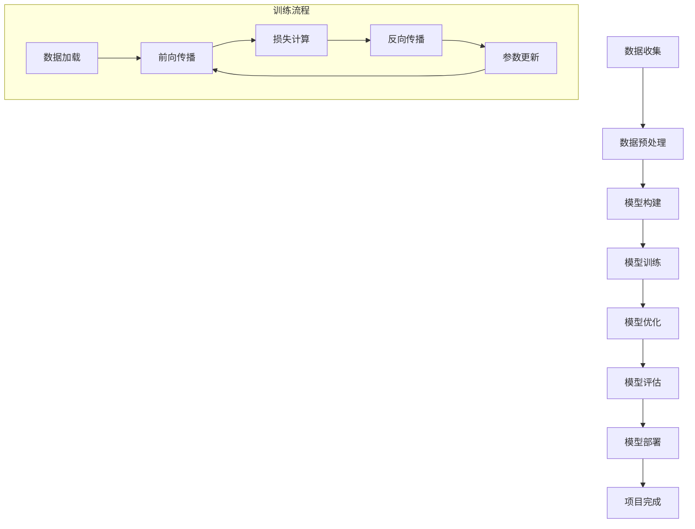

                 

### 文章标题

《如何利用深度学习优化图像识别》### 关键词

深度学习，图像识别，卷积神经网络，优化算法，反向传播，损失函数### 摘要

随着人工智能技术的迅猛发展，深度学习在图像识别领域取得了显著的成果。本文旨在系统地介绍如何利用深度学习优化图像识别。文章首先回顾了深度学习和图像识别的基础知识，然后详细讲解了卷积神经网络（CNN）的基本原理及其在图像识别中的应用，接着阐述了深度学习中的核心算法原理，包括反向传播算法、损失函数和优化算法。随后，文章通过具体的实战项目，展示了如何在实际中应用深度学习进行图像分类、目标检测和图像分割。最后，文章总结了最佳实践技巧，并对未来研究方向进行了展望。通过本文，读者可以全面了解深度学习在图像识别中的优化策略，掌握相关技术，并能够应用于实际项目中。### 第一部分：深度学习与图像识别基础

#### 第1章：深度学习基础

##### 1.1 深度学习概述

深度学习（Deep Learning）是人工智能（AI）领域的一种重要技术，它模仿人脑的神经网络结构和信息处理机制，通过多层神经网络进行学习，从而实现复杂的模式识别、预测和决策任务。深度学习的发展始于20世纪80年代，但直到近年来随着计算能力和数据资源的提升，才得以迅速发展。

深度学习的关键特点是层次化结构和端到端学习。层次化结构指的是神经网络由多个层次组成，每个层次都能提取不同抽象程度的特征。例如，第一层可能提取图像中的基本边缘和纹理，而更高层次则能够识别复杂的对象和场景。端到端学习则是指神经网络能够直接从原始数据（如图像、文本）中学习到最终的输出，而无需人工设计特征。

深度学习在计算机视觉、自然语言处理、语音识别等领域取得了显著的成果。在计算机视觉领域，深度学习已经被广泛应用于图像分类、目标检测、图像分割等任务。典型的深度学习模型包括卷积神经网络（CNN）、循环神经网络（RNN）和生成对抗网络（GAN）等。

##### 1.2 神经网络基础

神经网络（Neural Network）是深度学习的基础组件，它由大量简单的计算单元（称为神经元）组成，通过前向传播和反向传播的方式进行学习和更新。一个简单的神经网络通常包含输入层、隐藏层和输出层。

- **输入层**：接收外部输入数据，例如图像像素值、文本词向量等。
- **隐藏层**：对输入数据进行处理和特征提取，多个隐藏层可以提取不同抽象程度的特征。
- **输出层**：产生最终的输出结果，例如图像分类结果、文本翻译等。

神经元之间的连接称为边，边上的权重表示连接的强度。通过调整权重，神经网络可以学习到输入和输出之间的关系。

神经元的激活函数用于决定神经元是否被激活，常见的激活函数包括 sigmoid、ReLU 和 tanh。激活函数使得神经网络能够从输入数据中提取非线性特征。

##### 1.3 深度学习框架

深度学习框架是用于实现和训练深度学习模型的一系列工具和库。常见的深度学习框架包括 TensorFlow、PyTorch、Keras 等。

- **TensorFlow**：由 Google 开发，是一个开源的深度学习框架，具有强大的计算图和高效的后端计算能力。TensorFlow 支持多种编程语言，包括 Python 和 C++，并提供了丰富的 APIs。
- **PyTorch**：由 Facebook 开发，是一个开源的深度学习框架，具有灵活的动态计算图和高效的模型训练能力。PyTorch 的动态计算图使得模型设计和调试更加方便。
- **Keras**：是一个基于 TensorFlow 的深度学习高级 API，提供了简洁的模型定义和训练接口，使得深度学习模型的开发更加快捷。

这些深度学习框架不仅提供了丰富的模型和算法实现，还支持分布式训练和模型部署，为深度学习应用提供了强大的支持。

#### 第2章：图像识别基础

##### 2.1 图像识别概述

图像识别（Image Recognition）是计算机视觉领域的一个重要任务，旨在通过计算机算法从图像中识别和分类对象、场景或特征。图像识别在许多实际应用中具有重要价值，如自动驾驶、医疗诊断、安全监控、图像搜索引擎等。

图像识别的过程通常包括以下几个步骤：

1. **图像预处理**：对图像进行灰度化、缩放、裁剪等处理，以便于后续特征提取和分类。
2. **特征提取**：从图像中提取有意义的特征，如边缘、角点、纹理等。特征提取是图像识别的关键步骤，其质量直接影响识别性能。
3. **特征分类**：使用分类算法将提取的特征与已知类别进行匹配，以识别图像中的对象。

常见的图像识别算法包括传统机器学习算法（如 SVM、K-近邻）和深度学习算法（如 CNN、RNN）。深度学习算法因其强大的特征提取能力和端到端学习方式，在图像识别领域取得了显著成果。

##### 2.2 图像处理技术

图像处理（Image Processing）是计算机视觉的基础技术，旨在通过算法对图像进行变换、增强、复原等处理，以提高图像质量或提取图像特征。

常见的图像处理技术包括：

1. **滤波**：通过卷积操作对图像进行平滑或边缘检测，常用的滤波器包括均值滤波器、高斯滤波器、拉普拉斯滤波器等。
2. **边缘检测**：检测图像中的边缘和轮廓，常用的算法包括 Canny 算子、Sobel 算子等。
3. **形态学操作**：通过结构元素对图像进行形态变换，如膨胀、腐蚀、开运算、闭运算等，用于去除噪声或提取目标。
4. **图像增强**：通过调整图像的亮度、对比度、色彩等，提高图像的视觉效果，常用的方法包括直方图均衡化、对比度拉伸等。

这些图像处理技术为图像识别提供了有效的预处理方法，有助于提高识别性能。

##### 2.3 卷积神经网络

卷积神经网络（Convolutional Neural Network，CNN）是深度学习在计算机视觉领域的重要应用。CNN 通过模拟生物视觉系统中的卷积操作，能够自动提取图像中的特征，并实现高精度的图像识别。

CNN 的基本结构包括以下几个层次：

1. **卷积层**：卷积层通过卷积操作提取图像的特征。卷积核是一个小的矩阵，在图像上滑动并计算局部区域的特征响应。
2. **激活函数**：常用的激活函数有 ReLU（最大值函数）和 sigmoid（S 型函数），用于增加模型的非线性特性。
3. **池化层**：池化层通过局部区域的最大值或平均值操作，降低图像的空间分辨率，减少模型参数数量，提高训练速度。
4. **全连接层**：全连接层将卷积层和池化层提取的特征映射到输出类别，通过softmax函数进行分类。

CNN 的优势在于其能够自动学习图像的特征表示，无需人工设计特征。此外，CNN 在多层结构下具有强大的特征提取和表达能力，能够实现高精度的图像识别。

#### 第3章：深度学习在图像识别中的应用

##### 3.1 深度学习在图像分类中的应用

图像分类（Image Classification）是图像识别中的一项基本任务，旨在将图像标签化为预定义的类别。深度学习在图像分类中取得了显著的成果，其中卷积神经网络（CNN）是最常用的模型。

深度学习在图像分类中的应用主要包括以下几个步骤：

1. **数据准备**：收集和准备大量带有标签的图像数据集。常用的数据集包括 ImageNet、CIFAR-10、MNIST 等。
2. **数据预处理**：对图像进行缩放、裁剪、旋转等数据增强操作，提高模型的泛化能力。
3. **模型构建**：构建卷积神经网络模型，包括卷积层、池化层、全连接层等。常用的模型结构有 LeNet、AlexNet、VGG、ResNet 等。
4. **模型训练**：使用训练数据集对模型进行训练，通过反向传播算法调整模型参数，降低损失函数。
5. **模型评估**：使用验证数据集评估模型性能，通过准确率、召回率、F1 分数等指标衡量模型效果。
6. **模型部署**：将训练好的模型部署到实际应用中，如图像分类应用、搜索引擎等。

深度学习在图像分类中的应用大大提高了分类精度，特别是在大规模数据集上，深度学习模型的表现远优于传统机器学习算法。

##### 3.2 深度学习在目标检测中的应用

目标检测（Object Detection）是图像识别中的一项高级任务，旨在识别并定位图像中的多个对象。深度学习在目标检测中取得了显著进展，其中两阶段检测器和单阶段检测器是最常用的方法。

两阶段检测器包括 R-CNN、Fast R-CNN、Faster R-CNN 等，其基本流程如下：

1. **区域提议**：使用选择性搜索（Selective Search）或其他方法生成大量的区域提议。
2. **候选区域分类**：对每个区域提议进行特征提取，并使用卷积神经网络进行分类。
3. **位置回归**：对检测到的对象位置进行回归，以获得更精确的位置信息。

单阶段检测器包括 YOLO、SSD、RetinaNet 等，其基本流程如下：

1. **特征提取**：使用卷积神经网络提取图像的特征。
2. **分类与回归**：在同一层中对所有位置进行分类和位置回归。

深度学习在目标检测中的应用使得实时目标检测成为可能，广泛应用于自动驾驶、安全监控、医疗诊断等领域。

##### 3.3 深度学习在图像分割中的应用

图像分割（Image Segmentation）是图像识别中的另一项高级任务，旨在将图像划分为多个语义区域。深度学习在图像分割中取得了显著的成果，其中全卷积网络（Fully Convolutional Network，FCN）和基于 attention 的方法是最常用的方法。

深度学习在图像分割中的应用主要包括以下几个步骤：

1. **数据准备**：收集和准备大量带有标签的图像数据集，如 Pascal VOC、COCO 等。
2. **数据预处理**：对图像进行缩放、裁剪、旋转等数据增强操作。
3. **模型构建**：构建全卷积网络模型，包括卷积层、反卷积层、全连接层等。
4. **模型训练**：使用训练数据集对模型进行训练，通过反向传播算法调整模型参数。
5. **模型评估**：使用验证数据集评估模型性能，通过 Intersection over Union（IoU）等指标衡量模型效果。
6. **模型部署**：将训练好的模型部署到实际应用中，如图像分割应用、医学图像分析等。

深度学习在图像分割中的应用使得图像分割的精度和效率得到显著提升，广泛应用于医学影像、自动驾驶、图像编辑等领域。### 第二部分：核心算法原理讲解

#### 第4章：卷积神经网络（CNN）

卷积神经网络（Convolutional Neural Network，CNN）是深度学习在图像识别领域的重要应用，它通过模仿生物视觉系统的工作原理，能够自动提取图像中的特征并实现高精度的图像识别。本章节将详细讲解 CNN 的基本结构、卷积层、池化层和全连接层等核心组成部分，并解释它们在图像识别中的工作原理。

##### 4.1 CNN基本结构

CNN 的基本结构可以分为输入层、卷积层、池化层和全连接层。以下是一个简单的 CNN 结构示例：

```
输入层 → 卷积层 → 池化层 → 卷积层 → 池化层 → ... → 全连接层 → 输出层
```

- **输入层**：接收输入图像，将其作为二维数组传递给后续的卷积层。输入层的尺寸通常与图像的大小和颜色通道数相关。
- **卷积层**：卷积层通过卷积操作提取图像的特征。卷积层由多个卷积核组成，每个卷积核对输入图像进行卷积操作，生成特征图。
- **池化层**：池化层对卷积层生成的特征图进行下采样，减少特征图的尺寸，从而降低模型的复杂度。
- **全连接层**：全连接层将卷积层和池化层提取的特征映射到输出类别，通过softmax函数进行分类。

##### 4.2 卷积层

卷积层是 CNN 的核心组成部分，负责提取图像的特征。卷积层的操作主要包括以下步骤：

1. **卷积操作**：卷积层使用卷积核（也称为过滤器）与输入图像进行卷积操作。卷积核是一个小的矩阵，在输入图像上滑动并计算局部区域的特征响应。每个卷积核可以提取图像中的不同特征，如边缘、纹理等。
2. **激活函数**：卷积操作后，每个卷积核生成的特征图会通过激活函数进行非线性变换。常用的激活函数有 ReLU（最大值函数）和 sigmoid（S 型函数），用于增加模型的非线性特性。
3. **偏置**：每个卷积核在卷积操作后可以添加一个偏置项，用于调整特征图的偏置。

卷积层的输出是一个特征图（Feature Map），其尺寸小于输入图像的尺寸。特征图的尺寸取决于卷积核的大小、步长和填充方式。

##### 4.3 池化层

池化层对卷积层生成的特征图进行下采样，减少特征图的尺寸，从而降低模型的复杂度。常用的池化操作包括最大池化和平均池化。

1. **最大池化**：最大池化操作选取特征图上每个局部区域的最大值作为输出。最大池化操作可以保留图像中的重要特征，同时减少噪声的影响。
2. **平均池化**：平均池化操作选取特征图上每个局部区域的平均值作为输出。平均池化操作可以平滑特征图，减少过拟合的风险。

池化层的输出是一个下采样的特征图，其尺寸小于原始特征图的尺寸。

##### 4.4 全连接层

全连接层将卷积层和池化层提取的特征映射到输出类别，通过softmax函数进行分类。全连接层是一个线性层，每个特征都连接到一个输出节点。全连接层的参数包括权重矩阵和偏置向量。

全连接层通过前向传播将特征图展开为一个一维数组，然后与权重矩阵相乘，加上偏置向量，得到每个类别的得分。最后，通过softmax函数将得分转换为概率分布，从而实现多类别分类。

##### 卷积神经网络的工作原理

卷积神经网络的工作原理可以简单概括为以下几个步骤：

1. **输入图像**：输入层接收图像数据。
2. **卷积操作**：卷积层通过卷积核对输入图像进行卷积操作，提取图像的特征。
3. **激活函数**：每个卷积核生成的特征图通过激活函数进行非线性变换。
4. **池化操作**：池化层对卷积层生成的特征图进行下采样，减少特征图的尺寸。
5. **特征映射**：全连接层将卷积层和池化层提取的特征映射到输出类别。
6. **分类输出**：通过softmax函数将输出映射到概率分布，实现多类别分类。

通过多层卷积、池化和全连接层的组合，卷积神经网络能够自动学习图像的特征表示，并在图像识别任务中取得优异的性能。### 第5章：卷积神经网络的优化

卷积神经网络（CNN）的优化是指通过调整模型参数，以提高模型在特定任务上的性能。优化过程通常涉及损失函数、反向传播算法和优化算法。本章节将详细讲解这些优化技术和它们在深度学习中的应用。

##### 5.1 反向传播算法

反向传播算法（Backpropagation Algorithm）是深度学习中最常用的训练算法，用于计算模型参数的梯度，并通过梯度下降方法更新参数。反向传播算法的基本步骤如下：

1. **前向传播**：给定输入数据，通过前向传播计算模型的输出，同时记录每个层节点的激活值和权重。
2. **计算损失**：使用损失函数计算模型输出与实际输出之间的差异，通常使用均方误差（MSE）或交叉熵损失函数。
3. **反向传播**：从输出层开始，逐层计算每个节点对损失函数的梯度。梯度计算过程中，利用链式法则将梯度传递回前一层。
4. **参数更新**：使用梯度下降方法更新模型参数，以减少损失函数的值。

反向传播算法的关键在于梯度的计算，梯度的符号和大小反映了模型参数对损失函数的影响。通过反复迭代反向传播和参数更新，模型逐渐逼近最优参数，提高模型性能。

##### 5.2 损失函数

损失函数（Loss Function）用于衡量模型预测值与实际值之间的差距，是优化过程中的核心指标。常见的损失函数包括以下几种：

1. **均方误差（MSE）**：MSE 是最常用的损失函数之一，用于回归任务。MSE 的公式为：
   $$MSE = \frac{1}{m} \sum_{i=1}^{m} (y_i - \hat{y}_i)^2$$
   其中，$y_i$ 为实际值，$\hat{y}_i$ 为预测值，$m$ 为样本数量。MSE 的优点是简单易计算，缺点是对异常值敏感。

2. **交叉熵损失（Cross-Entropy Loss）**：交叉熵损失函数用于分类任务，特别是多类别分类。交叉熵损失函数的公式为：
   $$H(y, \hat{y}) = -\sum_{i=1}^{c} y_i \log(\hat{y}_i)$$
   其中，$y$ 为实际标签的 one-hot 编码，$\hat{y}$ 为预测的概率分布。交叉熵损失函数的优点是能够产生平滑的梯度，避免过拟合。

3. **对抗损失**：对抗损失函数用于生成对抗网络（GAN），用于衡量生成器与鉴别器之间的对抗关系。

##### 5.3 优化算法

优化算法（Optimization Algorithm）用于更新模型参数，以最小化损失函数。常见的优化算法包括梯度下降（Gradient Descent）和其变种。

1. **梯度下降（Gradient Descent）**：梯度下降是一种最简单的优化算法，其基本思想是沿着梯度的反方向更新参数，以减少损失函数的值。梯度下降的公式为：
   $$\theta_{t+1} = \theta_{t} - \alpha \cdot \nabla_{\theta} J(\theta)$$
   其中，$\theta$ 为参数，$\alpha$ 为学习率，$J(\theta)$ 为损失函数。梯度下降的优点是实现简单，缺点是收敛速度较慢，且可能陷入局部最小值。

2. **随机梯度下降（Stochastic Gradient Descent，SGD）**：随机梯度下降是一种在梯度下降中引入随机性的优化算法，每次迭代只随机选取一部分样本计算梯度。SGD 的公式为：
   $$\theta_{t+1} = \theta_{t} - \alpha \cdot \nabla_{\theta} J(\theta; x_{t}, y_{t})$$
   其中，$x_{t}$ 和 $y_{t}$ 为随机选取的样本。SGD 的优点是收敛速度较快，缺点是梯度噪声较大，可能导致不稳定。

3. **自适应优化算法**：自适应优化算法如 Adagrad、RMSProp 和 Adam，通过自适应调整学习率，提高优化过程的效果。这些算法在梯度下降的基础上引入了历史梯度信息，以更好地处理稀疏和稀有梯度问题。

4. **优化超参数**：优化超参数（如学习率、批量大小、迭代次数等）是优化过程中的重要环节。超参数的选择会影响模型的收敛速度和最终性能。常用的超参数选择方法包括网格搜索、随机搜索和贝叶斯优化等。

通过合理选择优化算法和调整超参数，可以有效地提高卷积神经网络的性能，实现图像识别等任务的高效训练和预测。### 第6章：深度学习中的数学模型

深度学习作为人工智能领域的重要分支，其核心在于通过多层神经网络对数据进行建模，以实现复杂函数的逼近。这一过程中，数学模型起到了至关重要的作用。本章节将介绍深度学习中的一些基本数学模型，包括概率论基础、信息论以及神经网络的数学模型。

##### 6.1 概率论基础

概率论是深度学习中的基础数学工具，用于描述不确定性和随机性。以下是一些核心概念：

- **概率分布**：概率分布描述了随机变量取值的概率。常见的概率分布包括伯努利分布、正态分布、均匀分布等。
- **条件概率**：条件概率是指在给定某一事件发生的条件下，另一事件发生的概率。条件概率的计算公式为：
  $$P(A|B) = \frac{P(A \cap B)}{P(B)}$$
- **贝叶斯定理**：贝叶斯定理是概率论中的一个重要公式，用于计算后验概率。贝叶斯定理的公式为：
  $$P(A|B) = \frac{P(B|A)P(A)}{P(B)}$$
  其中，$P(A|B)$ 是后验概率，$P(B|A)$ 是似然概率，$P(A)$ 是先验概率，$P(B)$ 是边缘概率。
- **熵**：熵是概率分布的不确定性度量。对于离散随机变量 $X$，其熵的定义为：
  $$H(X) = -\sum_{x} p(x) \log p(x)$$
  其中，$p(x)$ 是 $X$ 取值 $x$ 的概率。

##### 6.2 信息论

信息论是概率论在信息处理领域的应用，用于衡量信息的量度和传输效率。以下是一些核心概念：

- **信息量**：信息量是指一个事件发生的概率变化所带来的信息。对于离散随机变量 $X$，其信息量的定义为：
  $$I(X) = \log_2 \left(\frac{1}{p(X)}\right)$$
- **熵**：熵是概率分布的不确定性度量，已经在概率论部分介绍。
- **互信息**：互信息是两个随机变量之间相关性的度量。对于随机变量 $X$ 和 $Y$，其互信息的定义为：
  $$I(X; Y) = H(X) - H(X | Y)$$
  其中，$H(X | Y)$ 是条件熵。
- **信道容量**：信道容量是指信道能够传输的最大信息量，通常用香农公式表示：
  $$C = B \log_2 (1 + \text{SNR})$$
  其中，$B$ 是信道的带宽，$\text{SNR}$ 是信噪比。

##### 6.3 神经网络的数学模型

神经网络是通过数学模型来模拟生物神经系统的工作原理。以下是一些核心概念：

- **前向传播**：前向传播是指将输入数据通过网络中的各层进行传递，最终得到输出结果。前向传播过程中，每个节点的输出值可以通过以下公式计算：
  $$a_{j}^{(l)} = \sigma(z_{j}^{(l)})$$
  其中，$a_{j}^{(l)}$ 是第 $l$ 层第 $j$ 个节点的输出值，$\sigma$ 是激活函数，$z_{j}^{(l)}$ 是前一层输入到第 $l$ 层第 $j$ 个节点的加权和。
- **反向传播**：反向传播是指通过计算输出层节点的误差，反向传播到输入层，以更新网络参数。反向传播过程中，每个节点的梯度可以通过以下公式计算：
  $$\delta_{j}^{(l)} = \frac{\partial J}{\partial z_{j}^{(l)}}$$
  其中，$\delta_{j}^{(l)}$ 是第 $l$ 层第 $j$ 个节点的误差梯度，$J$ 是损失函数。
- **激活函数**：激活函数用于引入非线性特性，常见的激活函数包括 sigmoid、ReLU 和 tanh。sigmoid 函数的公式为：
  $$\sigma(z) = \frac{1}{1 + e^{-z}}$$
  ReLU 函数的公式为：
  $$\sigma(z) = \max(0, z)$$
  tanh 函数的公式为：
  $$\sigma(z) = \tanh(z)$$
- **损失函数**：损失函数用于衡量预测值与实际值之间的差距，常见的损失函数包括均方误差（MSE）和交叉熵损失（Cross-Entropy Loss）。MSE 的公式为：
  $$J = \frac{1}{2} \sum_{i=1}^{n} (y_i - \hat{y}_i)^2$$
  Cross-Entropy Loss 的公式为：
  $$J = -\sum_{i=1}^{n} y_i \log(\hat{y}_i)$$
- **优化算法**：优化算法用于更新网络参数，以最小化损失函数。常见的优化算法包括梯度下降（Gradient Descent）和其变种（如随机梯度下降、Adam 等）。

通过这些数学模型，深度学习能够模拟复杂的非线性关系，实现对数据的自动特征提取和建模。### 第7章：图像分类实战

在本章中，我们将通过一个具体的图像分类项目，展示如何利用深度学习进行图像分类。我们将详细介绍项目背景、数据准备、模型构建、模型训练与优化、模型评估与部署等过程。

#### 7.1 数据准备

在进行图像分类之前，首先需要收集和准备数据。数据的质量和多样性对模型性能至关重要。以下是一个简单的数据准备流程：

1. **数据收集**：收集包含多种类别的图像数据集。常用的数据集包括 CIFAR-10、ImageNet 等。
2. **数据预处理**：对图像进行缩放、裁剪、旋转等数据增强操作，以提高模型的泛化能力。此外，还可以对图像进行归一化处理，将像素值缩放到相同的范围。
3. **数据分割**：将数据集分割为训练集、验证集和测试集。通常，训练集用于训练模型，验证集用于调整模型参数，测试集用于评估模型性能。

#### 7.2 模型构建

接下来，我们将使用卷积神经网络（CNN）构建图像分类模型。以下是一个简单的 CNN 模型架构：

```python
import tensorflow as tf
from tensorflow.keras import layers, models

# 输入层
input_shape = (32, 32, 3)  # 图像尺寸和颜色通道数
inputs = models.Input(shape=input_shape)

# 卷积层1
x = layers.Conv2D(32, (3, 3), activation='relu', padding='same')(inputs)
x = layers.MaxPooling2D((2, 2))(x)

# 卷积层2
x = layers.Conv2D(64, (3, 3), activation='relu', padding='same')(x)
x = layers.MaxPooling2D((2, 2))(x)

# 全连接层
x = layers.Flatten()(x)
x = layers.Dense(64, activation='relu')(x)

# 输出层
outputs = layers.Dense(10, activation='softmax')(x)  # 10个类别

# 模型构建
model = models.Model(inputs=inputs, outputs=outputs)

# 模型编译
model.compile(optimizer='adam', loss='categorical_crossentropy', metrics=['accuracy'])

# 模型总结
model.summary()
```

#### 7.3 模型训练与优化

模型构建完成后，我们需要使用训练数据进行模型训练。以下是一个简单的训练流程：

```python
# 加载训练数据和标签
train_images = ...  # 训练图像数据
train_labels = ...  # 训练标签数据

# 训练模型
history = model.fit(train_images, train_labels, epochs=10, batch_size=64, validation_split=0.2)
```

在训练过程中，我们可以通过调整以下超参数来优化模型性能：

- **学习率**：调整学习率可以影响模型的收敛速度和稳定性。通常使用较小的学习率，如 $0.001$ 或 $0.0001$。
- **批量大小**：批量大小影响梯度估计的准确性。较大的批量大小可以提高模型性能，但可能增加训练时间。
- **迭代次数**：增加迭代次数可以提高模型性能，但可能导致过拟合。合适的迭代次数通常通过交叉验证确定。

#### 7.4 模型评估与部署

模型训练完成后，我们需要使用测试集对模型进行评估。以下是一个简单的评估流程：

```python
# 加载测试数据和标签
test_images = ...  # 测试图像数据
test_labels = ...  # 测试标签数据

# 评估模型
test_loss, test_acc = model.evaluate(test_images, test_labels)

# 输出评估结果
print("测试集准确率：", test_acc)
```

如果模型性能达到预期，我们可以将其部署到实际应用中。部署过程通常涉及以下步骤：

1. **模型保存**：将训练好的模型保存为文件，以便后续加载和使用。
2. **模型加载**：加载保存的模型，用于进行预测。
3. **模型预测**：使用模型对输入图像进行分类预测。

以下是一个简单的模型保存和加载示例：

```python
# 保存模型
model.save("model.h5")

# 加载模型
model = tf.keras.models.load_model("model.h5")

# 进行预测
predictions = model.predict(test_images)
```

通过以上步骤，我们完成了图像分类项目的实战。实际项目中，可能需要根据具体任务进行调整和优化，以获得更好的性能。### 第8章：目标检测实战

在本章中，我们将通过一个具体的实例，展示如何使用深度学习进行目标检测。我们将详细介绍目标检测项目中的数据准备、模型构建、模型训练与优化、模型评估与部署等过程。

#### 8.1 数据准备

目标检测项目通常需要大量标注好的图像数据集，这些数据集应包含目标对象的位置和类别信息。以下是数据准备的基本步骤：

1. **数据收集**：收集包含不同类别的图像数据。常用的数据集包括 Pascal VOC、COCO 等。这些数据集通常包含大量的标注信息，如边界框、类别标签等。
2. **数据预处理**：对图像进行缩放、裁剪、旋转等数据增强操作，以提高模型的泛化能力。此外，还可以对图像进行归一化处理，将像素值缩放到相同的范围。
3. **数据分割**：将数据集分割为训练集、验证集和测试集。通常，训练集用于训练模型，验证集用于调整模型参数，测试集用于评估模型性能。

#### 8.2 模型构建

目标检测模型通常由两个主要部分组成：特征提取网络和目标检测网络。以下是使用 Faster R-CNN 模型的一个简单示例：

```python
import tensorflow as tf
from tensorflow.keras.applications import ResNet50
from tensorflow.keras.layers import Input, Flatten, Dense
from tensorflow.keras.models import Model

# 特征提取网络
base_model = ResNet50(weights='imagenet', include_top=False, input_shape=(224, 224, 3))

# 冻结底层的权重
for layer in base_model.layers:
    layer.trainable = False

# 输入层
input_image = Input(shape=(224, 224, 3))

# 特征提取
features = base_model(input_image)

# 全连接层
flat_features = Flatten()(features)
fc = Dense(1024, activation='relu')(flat_features)

# 目标检测网络
# 注意：这里只是示例，实际中需要使用目标检测框架（如 Faster R-CNN）构建检测头
 detections = Dense(num_classes + 5, activation='sigmoid')(fc)  # num_classes 为类别数量

# 模型构建
model = Model(inputs=input_image, outputs=detections)

# 模型编译
model.compile(optimizer='adam', loss='categorical_crossentropy', metrics=['accuracy'])

# 模型总结
model.summary()
```

在实际项目中，我们通常使用现有的目标检测框架（如 Faster R-CNN、YOLO、SSD 等）来构建目标检测模型。这些框架提供了丰富的预训练模型和训练工具，可以大大简化模型的构建和训练过程。

#### 8.3 模型训练与优化

目标检测模型的训练过程通常包括以下步骤：

1. **数据加载**：使用数据生成器（DataGenerator）或框架提供的工具（如 TensorFlow 的 Dataset）加载训练数据。
2. **模型训练**：使用训练数据对模型进行训练。在训练过程中，需要同时优化特征提取网络和目标检测网络。常用的优化算法包括随机梯度下降（SGD）和 Adam。
3. **参数调整**：根据验证集的性能，调整学习率、批量大小、迭代次数等超参数，以提高模型性能。

以下是一个简单的训练示例：

```python
# 加载训练数据
train_images = ...  # 训练图像数据
train_labels = ...  # 训练标签数据

# 训练模型
history = model.fit(train_images, train_labels, epochs=10, batch_size=32, validation_split=0.2)
```

在训练过程中，可以使用以下技术进行优化：

- **学习率调度**：根据训练过程，动态调整学习率，以防止过拟合和加速收敛。
- **数据增强**：通过缩放、旋转、剪裁等操作，增加训练数据的多样性，提高模型泛化能力。
- **正则化**：使用正则化方法（如 L1、L2 正则化）防止过拟合。

#### 8.4 模型评估与部署

模型训练完成后，我们需要使用测试集对模型进行评估。以下是一个简单的评估示例：

```python
# 加载测试数据
test_images = ...  # 测试图像数据
test_labels = ...  # 测试标签数据

# 评估模型
test_loss, test_acc = model.evaluate(test_images, test_labels)

# 输出评估结果
print("测试集准确率：", test_acc)
```

如果模型性能达到预期，我们可以将其部署到实际应用中。部署过程通常涉及以下步骤：

1. **模型保存**：将训练好的模型保存为文件，以便后续加载和使用。
2. **模型加载**：加载保存的模型，用于进行预测。
3. **模型预测**：使用模型对输入图像进行目标检测预测。

以下是一个简单的模型保存和加载示例：

```python
# 保存模型
model.save("model.h5")

# 加载模型
model = tf.keras.models.load_model("model.h5")

# 进行预测
predictions = model.predict(test_images)
```

通过以上步骤，我们完成了目标检测项目的实战。实际项目中，可能需要根据具体任务进行调整和优化，以获得更好的性能。### 第9章：图像分割实战

图像分割是计算机视觉领域的一项重要任务，旨在将图像划分为多个语义区域，以便进行后续处理和分析。在本章中，我们将通过一个具体的图像分割项目，展示如何使用深度学习实现图像分割。我们将详细介绍项目中的数据准备、模型构建、模型训练与优化、模型评估与部署等步骤。

#### 9.1 数据准备

图像分割项目需要大量的标注数据，这些数据通常包含每个像素的语义标签。以下是数据准备的基本步骤：

1. **数据收集**：收集包含不同场景和物体的图像数据。常用的数据集包括 CamVid、PASCAL VOC 等。
2. **数据预处理**：对图像进行缩放、裁剪、旋转等数据增强操作，以提高模型的泛化能力。此外，还可以对图像进行归一化处理，将像素值缩放到相同的范围。
3. **数据分割**：将数据集分割为训练集、验证集和测试集。通常，训练集用于训练模型，验证集用于调整模型参数，测试集用于评估模型性能。

#### 9.2 模型构建

图像分割模型通常采用全卷积网络（Fully Convolutional Network，FCN）架构。以下是使用 U-Net 模型的一个简单示例：

```python
import tensorflow as tf
from tensorflow.keras.layers import Conv2D, MaxPooling2D, UpSampling2D, Input, concatenate

# 输入层
input_image = Input(shape=(256, 256, 3))

# 下采样路径
conv1 = Conv2D(64, (3, 3), activation='relu', padding='same')(input_image)
pool1 = MaxPooling2D(pool_size=(2, 2))(conv1)

conv2 = Conv2D(64, (3, 3), activation='relu', padding='same')(pool1)
pool2 = MaxPooling2D(pool_size=(2, 2))(conv2)

# ...（继续添加更多的卷积层和池化层）

# 最顶层
conv5 = Conv2D(64, (3, 3), activation='relu', padding='same')(pool4)
upsample6 = UpSampling2D(size=(2, 2))(conv5)
merge6 = concatenate([conv2, upsample6], axis=3)
conv6 = Conv2D(64, (3, 3), activation='relu', padding='same')(merge6)

upsample7 = UpSampling2D(size=(2, 2))(conv6)
merge7 = concatenate([conv1, upsample7], axis=3)
conv7 = Conv2D(1, (1, 1), activation='sigmoid', padding='same')(merge7)

# 模型构建
model = Model(inputs=input_image, outputs=conv7)

# 模型编译
model.compile(optimizer='adam', loss='binary_crossentropy', metrics=['accuracy'])

# 模型总结
model.summary()
```

在实际项目中，我们通常使用现有的深度学习框架（如 TensorFlow、PyTorch）和预训练模型（如 ResNet、VGG）来构建图像分割模型。这些框架和模型提供了丰富的工具和预训练权重，可以大大简化模型的构建和训练过程。

#### 9.3 模型训练与优化

图像分割模型的训练过程通常包括以下步骤：

1. **数据加载**：使用数据生成器（DataGenerator）或框架提供的工具（如 TensorFlow 的 Dataset）加载训练数据。
2. **模型训练**：使用训练数据对模型进行训练。在训练过程中，需要调整模型参数，以优化模型性能。常用的优化算法包括随机梯度下降（SGD）和 Adam。
3. **参数调整**：根据验证集的性能，调整学习率、批量大小、迭代次数等超参数，以提高模型性能。

以下是一个简单的训练示例：

```python
# 加载训练数据
train_images = ...  # 训练图像数据
train_labels = ...  # 训练标签数据

# 训练模型
history = model.fit(train_images, train_labels, epochs=10, batch_size=16, validation_split=0.2)
```

在训练过程中，可以使用以下技术进行优化：

- **学习率调度**：根据训练过程，动态调整学习率，以防止过拟合和加速收敛。
- **数据增强**：通过缩放、旋转、剪裁等操作，增加训练数据的多样性，提高模型泛化能力。
- **正则化**：使用正则化方法（如 L1、L2 正则化）防止过拟合。

#### 9.4 模型评估与部署

模型训练完成后，我们需要使用测试集对模型进行评估。以下是一个简单的评估示例：

```python
# 加载测试数据
test_images = ...  # 测试图像数据
test_labels = ...  # 测试标签数据

# 评估模型
test_loss, test_acc = model.evaluate(test_images, test_labels)

# 输出评估结果
print("测试集准确率：", test_acc)
```

如果模型性能达到预期，我们可以将其部署到实际应用中。部署过程通常涉及以下步骤：

1. **模型保存**：将训练好的模型保存为文件，以便后续加载和使用。
2. **模型加载**：加载保存的模型，用于进行预测。
3. **模型预测**：使用模型对输入图像进行分割预测。

以下是一个简单的模型保存和加载示例：

```python
# 保存模型
model.save("model.h5")

# 加载模型
model = tf.keras.models.load_model("model.h5")

# 进行预测
predictions = model.predict(test_images)
```

通过以上步骤，我们完成了图像分割项目的实战。实际项目中，可能需要根据具体任务进行调整和优化，以获得更好的性能。### 附录

#### 附录A：深度学习框架与工具

在深度学习领域，有多种流行的框架和工具可供选择。以下是对几种常见框架的简要介绍：

##### A.1 TensorFlow

TensorFlow 是由 Google 开发的一个开源深度学习框架。它提供了一个高度可扩展的计算图系统，可以用于构建、训练和部署各种深度学习模型。TensorFlow 支持多种编程语言，包括 Python、C++ 和 Java，并具有丰富的 API。

- **优点**：强大的计算图系统、高效的执行引擎、广泛的社区支持。
- **缺点**：复杂的架构、较重的学习曲线。

##### A.2 PyTorch

PyTorch 是由 Facebook AI 研究团队开发的一个开源深度学习框架。它具有灵活的动态计算图，使得模型设计和调试更加方便。PyTorch 的社区活跃，提供了丰富的预训练模型和工具。

- **优点**：动态计算图、易于调试、强大的社区支持。
- **缺点**：在大型分布式训练任务中性能可能不如 TensorFlow。

##### A.3 Keras

Keras 是一个基于 TensorFlow 的深度学习高级 API。它提供了一个简洁的接口，使得构建和训练深度学习模型更加快捷。Keras 支持多种后端框架，包括 TensorFlow、Theano 和 PlaidML。

- **优点**：简洁的接口、易于使用、快速原型开发。
- **缺点**：在一些复杂场景下可能不如 TensorFlow 功能丰富。

#### 附录B：参考文献与扩展阅读

深度学习是一个快速发展的领域，以下是一些推荐的基础书籍、在线资源和论文，供进一步学习和研究：

##### B.1 相关书籍推荐

- **《深度学习》（Deep Learning）**：Ian Goodfellow、Yoshua Bengio 和 Aaron Courville 著，是一本全面介绍深度学习原理和实践的经典书籍。
- **《神经网络与深度学习》**：邱锡鹏 著，一本深入讲解神经网络和深度学习基本概念的中文书籍。
- **《卷积神经网络》**：Yoshua Bengio、Ian Goodfellow 和 Aaron Courville 著，专注于卷积神经网络的理论和应用。

##### B.2 在线资源推荐

- **TensorFlow 官方文档**：[https://www.tensorflow.org](https://www.tensorflow.org)
- **PyTorch 官方文档**：[https://pytorch.org/docs/stable/index.html](https://pytorch.org/docs/stable/index.html)
- **Keras 官方文档**：[https://keras.io](https://keras.io)

##### B.3 论文推荐

- **"A Guide to Convolutional Neural Networks - Theano and TensorFlow"**：A. Karpathy，介绍卷积神经网络的基本概念和实现方法。
- **"Deep Residual Learning for Image Recognition"**：K. He、X. Zhang、S. Ren 和 J. Sun，提出 ResNet 结构，解决了深度网络中的梯度消失问题。
- **"You Only Look Once: Unified, Real-Time Object Detection"**：J. Redmon、S. Divvala、R. Girshick 和 A. Farhadi，介绍 YOLO 算法，实现了实时目标检测。

通过这些书籍、在线资源和论文，读者可以深入了解深度学习的基础知识、最新进展和实际应用。### Mermaid 流程图



这个 Mermaid 流程图展示了深度学习项目的标准流程，包括数据收集、预处理、模型构建、训练、优化、评估和部署。训练流程部分详细描述了数据加载、前向传播、损失计算、反向传播和参数更新的步骤。### 卷积神经网络（CNN）算法原理

卷积神经网络（CNN）是一种特别适用于处理图像数据的深度学习模型。其核心思想是通过卷积操作和特征提取来学习图像中的局部特征，然后通过全连接层进行分类。以下是一个简化的卷积神经网络算法原理的伪代码，以及相关的数学模型和公式。

#### 伪代码

```python
# 伪代码：卷积神经网络（CNN）算法原理

# 初始化参数
weights = 初始化权重矩阵()
biases = 初始化偏置向量()

# 定义卷积操作
def 卷积操作(input_data, filters, stride, padding):
    # 实现卷积操作
    return 输出数据

# 定义激活函数
def 激活函数(z):
    # 实现激活函数（如ReLU）
    return 激活后的数据

# 定义前向传播
def 前向传播(input_data, weights, biases):
    # 实现前向传播过程
    return 输出数据

# 定义反向传播
def 反向传播(input_data, output_data, weights, biases):
    # 实现反向传播过程
    return 更新后的权重和偏置

# 模型构建
def 构建模型(input_shape, num_classes):
    # 构建卷积层、池化层、全连接层等
    return 模型

# 训练模型
def 训练模型(model, data, labels):
    # 实现训练过程
    return 模型

# 评估模型
def 评估模型(model, data, labels):
    # 实现评估过程
    return 准确率

# 主函数
def main():
    # 加载数据
    input_data, labels = 加载数据()

    # 训练模型
    model = 训练模型(model, input_data, labels)

    # 评估模型
    accuracy = 评估模型(model, input_data, labels)

    # 输出结果
    print("模型准确率：", accuracy)

# 运行主函数
main()
```

#### 数学模型和公式

##### 卷积操作

卷积操作的数学公式可以表示为：

$$\text{output}_{ij} = \sum_{k} \text{weights}_{ikj} \cdot \text{input}_{ik} + \text{biases}_{ij}$$

其中，$\text{output}_{ij}$ 是卷积输出的某个像素值，$\text{weights}_{ikj}$ 是卷积核权重，$\text{input}_{ik}$ 是输入图像的某个像素值，$\text{biases}_{ij}$ 是卷积层偏置。

##### 激活函数

常见的激活函数是 ReLU（Rectified Linear Unit），其公式为：

$$\text{激活}_{ij} = \max(0, \text{input}_{ij})$$

##### 前向传播

前向传播的总体公式为：

$$\text{output}_{l} = \text{激活函数}(\sum_{l-1} \text{weights}_{l-1} \cdot \text{激活}_{l-1} + \text{biases}_{l})$$

##### 反向传播

反向传播过程中，我们需要计算每个参数的梯度。对于卷积层，梯度可以表示为：

$$\frac{\partial J}{\partial \text{weights}} = \sum_{i} \frac{\partial J}{\partial \text{output}} \cdot \frac{\partial \text{output}}{\partial \text{weights}}$$

$$\frac{\partial J}{\partial \text{biases}} = \sum_{i} \frac{\partial J}{\partial \text{output}} \cdot \frac{\partial \text{output}}{\partial \text{biases}}$$

其中，$J$ 是损失函数。

通过上述伪代码和数学模型，我们可以看到卷积神经网络的基本构建和训练过程。在实际应用中，这些步骤会通过深度学习框架（如 TensorFlow 或 PyTorch）来实现，从而简化了复杂的计算和优化过程。### 损失函数

在深度学习模型训练过程中，损失函数（Loss Function）用于衡量模型预测值与实际值之间的差距，它是优化过程中的核心指标。不同的损失函数适用于不同的任务，以下是一些常见的损失函数及其公式。

#### 均方误差（MSE）

均方误差（Mean Squared Error，MSE）是用于回归任务的一种常见损失函数，其公式为：

$$J = \frac{1}{m} \sum_{i=1}^{m} (y_i - \hat{y}_i)^2$$

其中，$y_i$ 为实际值，$\hat{y}_i$ 为预测值，$m$ 为样本数量。

#### 交叉熵损失（Cross-Entropy Loss）

交叉熵损失函数是用于分类任务的一种常见损失函数，其公式为：

$$J = -\sum_{i=1}^{m} y_i \log(\hat{y}_i)$$

其中，$y_i$ 为实际标签的 one-hot 编码，$\hat{y}_i$ 为预测的概率分布。

#### 逻辑损失（Logistic Loss）

逻辑损失函数是一种特殊的交叉熵损失函数，其公式为：

$$J = -\sum_{i=1}^{m} y_i \log(\hat{y}_i) + (1 - y_i) \log(1 - \hat{y}_i)$$

其中，$y_i$ 为实际标签（0 或 1），$\hat{y}_i$ 为预测的概率。

#### 民意损失（Hinge Loss）

民意损失函数常用于支持向量机（SVM）等分类任务，其公式为：

$$J = \sum_{i=1}^{m} \max(0, 1 - y_i \cdot \hat{y}_i)$$

其中，$y_i$ 为实际标签（0 或 1），$\hat{y}_i$ 为预测的值。

#### 三角函数损失（Triangular Loss）

三角函数损失函数是一种用于优化神经网络训练过程的损失函数，其公式为：

$$J = \frac{1}{2} \left(1 - \frac{y_i \cdot \hat{y}_i}{\sqrt{1 + (\hat{y}_i - y_i)^2}}\right)$$

其中，$y_i$ 为实际标签（0 或 1），$\hat{y}_i$ 为预测的概率。

#### 针对多类别的交叉熵损失（Multi-Class Cross-Entropy Loss）

对于多类别分类任务，交叉熵损失函数可以扩展为：

$$J = -\sum_{i=1}^{m} \sum_{j=1}^{c} y_{ij} \log(\hat{y}_{ij})$$

其中，$y_{ij}$ 为第 $i$ 个样本属于第 $j$ 个类别的真实概率（0 或 1），$\hat{y}_{ij}$ 为第 $i$ 个样本属于第 $j$ 个类别的预测概率。

通过选择合适的损失函数，我们可以更好地衡量模型的预测误差，并指导模型优化过程。不同的任务和数据集可能需要选择不同的损失函数，以获得最佳的训练效果。### 最佳实践 tips、小结、注意事项、拓展阅读

#### 最佳实践 tips

1. **数据预处理**：在训练模型之前，确保对图像数据进行标准化处理，将像素值缩放到 [0, 1] 或 [-1, 1] 范围内，以加快训练速度和收敛速度。
2. **模型选择**：根据任务的复杂性，选择合适的深度学习模型。对于简单的任务，可以尝试使用轻量级的模型，如 MobileNet、ShuffleNet；对于复杂的任务，可以尝试使用 ResNet、DenseNet。
3. **数据增强**：使用数据增强技术（如旋转、翻转、缩放等）增加训练数据的多样性，可以提高模型的泛化能力。
4. **学习率调度**：根据训练过程中的性能变化，适时调整学习率，可以使用学习率衰减策略或自适应学习率优化器（如 Adam）。
5. **正则化**：为防止过拟合，可以添加正则化技术（如 L1、L2 正则化），或在模型中引入 dropout 层。

#### 小结

本文系统地介绍了如何利用深度学习优化图像识别。我们从深度学习和图像识别的基础知识出发，详细讲解了卷积神经网络（CNN）的基本原理及其在图像分类、目标检测和图像分割中的应用。接着，我们阐述了深度学习中的核心算法原理，包括反向传播算法、损失函数和优化算法。最后，通过具体的实战项目，展示了如何在实际中应用深度学习进行图像识别。

#### 注意事项

1. **模型调参**：在训练模型时，需要仔细调整超参数（如学习率、批量大小、迭代次数等），以确保模型性能达到最佳。
2. **数据处理**：确保训练数据集和测试数据集具有相似的数据分布，以避免模型在测试集上的性能不佳。
3. **模型评估**：使用多个评估指标（如准确率、召回率、F1 分数等）综合评估模型性能，以获得更全面的评估结果。
4. **模型部署**：在实际应用中，需要确保模型在部署环境中的性能和稳定性，可以考虑使用模型压缩、量化等技术提高部署效率。

#### 拓展阅读

- **《深度学习》（Deep Learning）**：Ian Goodfellow、Yoshua Bengio 和 Aaron Courville 著，全面介绍深度学习的基本原理和应用。
- **《卷积神经网络》（Convolutional Neural Networks）**：Yoshua Bengio、Ian Goodfellow 和 Aaron Courville 著，专注于卷积神经网络的理论和应用。
- **[TensorFlow 官方文档](https://www.tensorflow.org)**：提供 TensorFlow 深入教程和示例，适用于初学者和高级用户。
- **[PyTorch 官方文档](https://pytorch.org/docs/stable/index.html)**：提供 PyTorch 深入教程和示例，适用于初学者和高级用户。

通过本文的阅读，读者可以系统地了解深度学习在图像识别中的应用，掌握相关技术和方法，并能够应用于实际项目中。希望本文对读者在深度学习领域的学习和实践有所帮助。### 作者

作者：AI天才研究院/AI Genius Institute & 禅与计算机程序设计艺术 /Zen And The Art of Computer Programming

