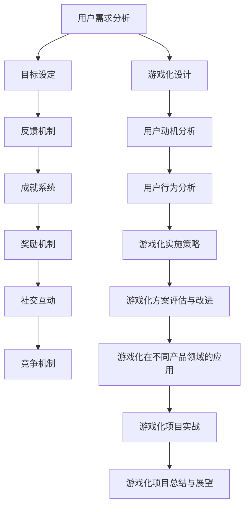

                 

# 如何利用游戏化提高产品的用户粘性

> 关键词：游戏化、用户粘性、产品设计、用户体验、激励机制

随着互联网的快速发展，市场竞争愈发激烈，如何提高产品的用户粘性成为各大企业关注的焦点。游戏化作为一种创新的用户激励机制，不仅能够增强用户对产品的兴趣，还能有效提升用户的参与度和忠诚度。本文将从游戏化的概述、设计原理、实施策略、实际应用和项目实战等多个角度，深入探讨如何利用游戏化提高产品的用户粘性。

## 第一部分：引言

### 第1章：游戏化概述

#### 1.1 游戏化与用户粘性的关系

##### 1.1.1 游戏化的定义与特点

游戏化（Gamification）是指将游戏设计中的激励机制和元素应用于非游戏环境中，以提升用户参与度和满足感。游戏化具有以下特点：

1. **目标导向**：游戏化以明确的目标为导向，引导用户逐步完成。
2. **反馈机制**：游戏化通过即时反馈激励用户，增强其成就感。
3. **竞争与合作**：游戏化中的竞争和合作机制激发用户的积极性。
4. **成就系统**：游戏化中的成就系统鼓励用户不断进步。

##### 1.1.2 用户粘性的定义与衡量

用户粘性（User Stickiness）是指用户对产品的依赖程度和持续使用的意愿。衡量用户粘性的指标包括：

1. **用户留存率**：一段时间内，仍然使用产品的用户比例。
2. **活跃度**：用户在产品上的活跃程度，如每日活跃用户数（DAU）、每周活跃用户数（WAU）等。
3. **使用时长**：用户在产品上的平均停留时间。

##### 1.1.3 游戏化如何提升用户粘性

游戏化通过以下方式提升用户粘性：

1. **增强用户参与感**：游戏化设计能够激发用户的兴趣和参与度，使其更愿意长期使用产品。
2. **提高用户满意度**：游戏化中的奖励机制和成就系统能提高用户满意度，增强其忠诚度。
3. **促进用户社交互动**：游戏化中的社交机制能促进用户之间的互动，增强产品的社区氛围。

#### 1.2 游戏化在产品中的应用现状

##### 1.2.1 国内外案例分析

国内外许多成功的产品案例展示了游戏化在提升用户粘性方面的强大潜力。例如：

1. **中国互联网公司**：例如拼多多、滴滴出行等，通过游戏化设计吸引了大量用户。
2. **国外公司**：例如LinkedIn、Spotify等，也成功运用了游戏化策略来提升用户粘性。

##### 1.2.2 游戏化应用的挑战与机遇

游戏化在产品中的应用面临以下挑战：

1. **用户体验一致性**：如何确保游戏化元素与产品核心功能的有机结合，避免用户体验不一致。
2. **可持续性**：游戏化激励机制的长期有效性如何保障。
3. **创新性**：如何在激烈的市场竞争中不断推陈出新，保持游戏化设计的吸引力。

然而，游戏化带来的机遇同样巨大：

1. **提升用户参与度**：游戏化能够有效提升用户的参与度和活跃度。
2. **增强用户忠诚度**：通过游戏化激励机制，用户对产品的忠诚度得以提升。
3. **优化产品运营**：游戏化能够为产品运营提供有效的数据支持和策略指导。

### 第2章：游戏化设计原理

#### 2.1 游戏化设计基础

##### 2.1.1 目标设定与反馈机制

游戏化设计首先需要明确目标，并通过反馈机制激励用户实现目标。目标设定应具有以下特点：

1. **明确性**：目标应具体、明确，避免模糊不清。
2. **可量化**：目标应可量化，便于评估和反馈。
3. **具有挑战性**：目标应具有一定的挑战性，激发用户的兴趣和动力。

反馈机制则是游戏化设计的重要组成部分，通过即时反馈激励用户。反馈机制应具备以下特点：

1. **即时性**：即时反馈能够迅速给予用户激励，增强其成就感。
2. **多样性**：反馈机制应多样化，包括物质奖励、虚拟奖励等。
3. **透明性**：反馈机制应透明，用户能明确了解自己的努力和回报。

##### 2.1.2 成就系统与奖励机制

成就系统是游戏化设计的重要元素，通过记录用户的成就和进步，激发用户的自我成就感。成就系统应具备以下特点：

1. **挑战性**：成就应具有挑战性，激发用户的积极性。
2. **可视化**：成就应可视化，用户能直观了解自己的成就。
3. **持续性**：成就应具有持续性，鼓励用户不断努力。

奖励机制则是成就系统的延伸，通过物质或虚拟奖励激励用户。奖励机制应具备以下特点：

1. **即时性**：奖励应即时发放，增强用户的成就感。
2. **多样性**：奖励应多样化，满足不同用户的需求。
3. **可持续性**：奖励应具有可持续性，保持用户的兴趣和参与度。

##### 2.1.3 社交互动与竞争机制

社交互动是游戏化设计中不可或缺的元素，通过促进用户之间的互动，增强产品的社区氛围。社交互动应具备以下特点：

1. **开放性**：社交互动应开放，鼓励用户积极参与。
2. **多样性**：社交互动应多样化，包括评论、点赞、分享等。
3. **激励机制**：社交互动应具备激励机制，鼓励用户积极参与。

竞争机制则是游戏化设计中常用的元素，通过激发用户的竞争心理，增强其参与度和活跃度。竞争机制应具备以下特点：

1. **公平性**：竞争应公平，避免不公平竞争导致用户流失。
2. **激励性**：竞争应具备激励性，激发用户的积极性。
3. **可持续性**：竞争应具有可持续性，保持用户的兴趣和参与度。

### 第3章：用户动机与行为分析

#### 3.1 用户动机理论

##### 3.1.1 自我决定理论

自我决定理论（Self-Determination Theory）是动机研究的重要理论之一，认为人的动机来源于自主性、胜任感和关系。自我决定理论的核心观点如下：

1. **自主性**：用户在产品使用过程中应感受到自主性，有选择和控制的自由。
2. **胜任感**：用户在产品使用过程中应感受到胜任感，认为自己的能力得到了认可。
3. **关系**：用户在产品使用过程中应感受到与他人的关系，如归属感和社交支持。

##### 3.1.2 动机与行为的关系

动机与行为之间存在密切的关系。动机是推动个体采取特定行为的内在力量，而行为是动机的外在表现。动机理论有助于解释用户在产品使用过程中的行为表现，如以下几种动机与行为的关系：

1. **内在动机**：用户因对产品本身的兴趣和热爱而产生的动机，如阅读、学习等。内在动机通常能够带来长期的用户粘性。
2. **外在动机**：用户因外部奖励或惩罚而产生的动机，如完成任务获得奖励、避免惩罚等。外在动机在短期内可能提升用户粘性，但长期效果有限。
3. **混合动机**：用户同时受到内在动机和外在动机的影响。在游戏化设计中，通过平衡内在动机和外在动机，可以提升用户的整体动机水平。

##### 3.1.3 用户动机的类型

用户动机可以分为以下几种类型：

1. **兴趣型动机**：用户因对产品或服务的兴趣而产生的动机，如阅读、观看等。
2. **功利型动机**：用户因实际需求或利益而产生的动机，如购买、下载等。
3. **社交型动机**：用户因与他人互动和社交而产生的动机，如分享、评论等。
4. **成就型动机**：用户因追求成就和认可而产生的动机，如完成任务、获得奖励等。

#### 3.2 用户行为分析

##### 3.2.1 用户行为的心理学解释

用户行为可以从心理学角度进行解释，以下是一些主要的理论：

1. **行为主义理论**：行为主义理论认为，行为是外在刺激和内在反应的结果。通过奖励和惩罚机制，可以影响用户的行为。
2. **认知主义理论**：认知主义理论认为，行为是内在认知过程的结果。用户在产品使用过程中，会根据自身的认知结构和信息处理方式来做出行为决策。
3. **社会认知理论**：社会认知理论认为，行为是个人与社会环境相互作用的结果。用户在产品使用过程中，会受到社会因素（如他人行为、社会规范等）的影响。

##### 3.2.2 用户行为的数据分析

通过数据分析，可以深入了解用户行为，以下是一些常用的数据分析方法：

1. **行为轨迹分析**：分析用户在产品中的行为轨迹，了解用户的使用习惯和偏好。
2. **行为模式分析**：分析用户的行为模式，如活跃时间、使用频率等，为产品设计提供参考。
3. **行为预测**：通过分析历史行为数据，预测用户的未来行为，为产品运营提供指导。

##### 3.2.3 用户行为的预测与引导

用户行为的预测和引导是提高用户粘性的关键。以下是一些方法：

1. **个性化推荐**：根据用户的历史行为和偏好，推荐符合其兴趣的产品或内容，引导用户继续使用产品。
2. **行为干预**：通过奖励、提示等手段，引导用户采取期望的行为，如完成任务、参与互动等。
3. **社区建设**：通过建设社区，促进用户之间的互动和交流，提高用户的参与度和忠诚度。

### 第4章：游戏化实施策略

#### 4.1 游戏化实施流程

##### 4.1.1 需求分析与目标设定

游戏化实施的第一步是需求分析，了解用户的需求和期望，明确游戏化设计的方向。需求分析包括以下内容：

1. **用户调研**：通过问卷调查、访谈等方式，收集用户的需求和意见。
2. **市场分析**：分析竞争对手的游戏化策略，了解市场趋势和机会。
3. **业务目标**：明确业务目标，确保游戏化设计能够为业务目标服务。

目标设定应具有以下特点：

1. **具体性**：目标应具体、明确，避免模糊不清。
2. **可衡量性**：目标应可衡量，便于评估和优化。
3. **挑战性**：目标应具有挑战性，激发用户的兴趣和动力。

##### 4.1.2 设计与开发

游戏化设计与开发是游戏化实施的核心环节。设计与开发包括以下内容：

1. **设计思路**：明确游戏化设计的基本思路，如目标设定、反馈机制、成就系统等。
2. **设计原型**：制作游戏化设计原型，通过用户测试和反馈进行优化。
3. **开发实现**：根据设计原型，进行游戏化功能的开发实现。

##### 4.1.3 测试与优化

游戏化测试与优化是确保游戏化效果的重要环节。测试与优化包括以下内容：

1. **用户测试**：通过用户测试，评估游戏化设计的用户体验和效果，发现潜在问题。
2. **数据分析**：通过数据分析，评估游戏化设计的用户参与度和粘性，为优化提供数据支持。
3. **迭代优化**：根据用户测试和数据分析的结果，对游戏化设计进行优化，提高用户粘性。

#### 4.2 游戏化方案评估与改进

##### 4.2.1 评估指标与模型

游戏化方案的评估与改进需要依靠科学的数据指标和模型。以下是一些常用的评估指标和模型：

1. **用户留存率**：一段时间内，仍然使用产品的用户比例。
2. **活跃度**：用户在产品上的活跃程度，如每日活跃用户数（DAU）、每周活跃用户数（WAU）等。
3. **使用时长**：用户在产品上的平均停留时间。
4. **参与度**：用户在游戏化活动中的参与程度，如完成任务数、参与互动数等。
5. **满意度**：用户对游戏化方案的整体满意度。

评估模型可以采用以下方法：

1. **A/B测试**：通过对比不同游戏化方案的效果，评估其优劣。
2. **回归分析**：通过建立回归模型，分析游戏化方案与用户粘性之间的关系。
3. **多因素分析**：通过多因素分析，评估游戏化方案对用户粘性的影响。

##### 4.2.2 数据分析与应用

数据分析是游戏化方案评估与改进的重要工具。以下是一些数据分析的应用：

1. **用户行为分析**：通过分析用户在游戏化活动中的行为，了解用户的兴趣和需求，为优化游戏化方案提供参考。
2. **效果分析**：通过分析游戏化方案的效果，评估其对用户粘性的提升程度，为后续优化提供数据支持。
3. **优化建议**：根据数据分析结果，提出具体的优化建议，如调整游戏化规则、奖励机制等，提高游戏化效果。

##### 4.2.3 反馈机制与迭代优化

反馈机制是游戏化方案优化的重要环节。以下是一些反馈机制的应用：

1. **用户反馈**：通过用户反馈，了解用户对游戏化方案的意见和建议，为优化提供参考。
2. **数据分析**：通过数据分析，评估游戏化方案的效果，发现潜在问题，为优化提供数据支持。
3. **迭代优化**：根据用户反馈和数据分析结果，对游戏化方案进行迭代优化，提高用户粘性。

#### 4.3 游戏化在不同产品领域的应用

##### 4.3.1 社交网络产品

社交网络产品具有高度的社交性和互动性，非常适合应用游戏化策略。以下是一些社交网络产品的游戏化应用：

1. **任务挑战**：通过设置任务挑战，激励用户参与互动，提高活跃度。
2. **积分系统**：通过积分系统，奖励用户在社交网络中的活跃行为，提高用户粘性。
3. **排行榜**：通过排行榜，展示用户在社交网络中的成就和排名，激发用户的竞争心理。

##### 4.3.2 教育产品

教育产品具有明确的课程目标和学习任务，非常适合应用游戏化策略。以下是一些教育产品的游戏化应用：

1. **学习进度**：通过学习进度展示，激励用户持续学习，提高学习效果。
2. **成就系统**：通过成就系统，奖励用户在学习过程中的成就，提高学习积极性。
3. **互动教学**：通过互动教学，促进教师和学生之间的互动，提高教学质量。

##### 4.3.3 娱乐产品

娱乐产品具有高度的趣味性和互动性，非常适合应用游戏化策略。以下是一些娱乐产品的游戏化应用：

1. **任务挑战**：通过设置任务挑战，激励用户参与互动，提高活跃度。
2. **积分系统**：通过积分系统，奖励用户在娱乐产品中的活跃行为，提高用户粘性。
3. **排行榜**：通过排行榜，展示用户在娱乐产品中的成就和排名，激发用户的竞争心理。

### 第5章：游戏化项目实战

#### 6.1 项目背景与目标

##### 6.1.1 项目概述

本项目旨在通过游戏化策略提高一款在线教育产品的用户粘性。该产品是一款针对大学生的在线学习平台，提供各类课程和学习资源。用户可以通过该平台进行自主学习、课程报名和在线互动。

##### 6.1.2 用户群体分析

用户群体主要为大学生，他们对新鲜事物充满好奇，喜欢参与互动和竞争。然而，由于学习任务繁重，用户在平台上的活跃度不高，需要通过游戏化策略激发他们的兴趣和参与度。

##### 6.1.3 项目目标设定

项目目标如下：

1. **提高用户留存率**：通过游戏化策略，提高用户在平台上的留存率，延长用户生命周期。
2. **提升用户活跃度**：通过游戏化策略，提高用户在平台上的活跃度，增加用户参与互动的行为。
3. **增强用户满意度**：通过游戏化策略，提高用户满意度，增强用户对平台的忠诚度。

#### 6.2 设计与开发过程

##### 6.2.1 设计思路与方案

设计思路如下：

1. **明确目标**：明确游戏化设计的目标，如提高用户留存率、提升用户活跃度等。
2. **分析用户需求**：通过用户调研和分析，了解用户的需求和期望，为游戏化设计提供参考。
3. **设计游戏化元素**：结合用户需求，设计游戏化元素，如任务挑战、积分系统、排行榜等。
4. **集成游戏化功能**：将游戏化功能集成到在线教育平台中，确保用户体验的一致性。

设计方案如下：

1. **任务挑战**：设置各类任务挑战，如完成课程学习、参加讨论等，激励用户积极参与。
2. **积分系统**：设计积分系统，用户通过完成任务获得积分，积分可以兑换虚拟奖励。
3. **排行榜**：设置排行榜，展示用户在平台上的成就和排名，激发用户的竞争心理。

##### 6.2.2 开发环境与工具

开发环境如下：

1. **编程语言**：使用Python进行后端开发，使用React进行前端开发。
2. **开发框架**：后端使用Flask框架，前端使用React框架。
3. **数据库**：使用MySQL数据库存储用户数据。

##### 6.2.3 代码实现与解读

以下为任务挑战功能的代码实现：

```python
# 用户完成任务接口
@app.route('/complete_task', methods=['POST'])
def complete_task():
    # 获取用户ID和任务ID
    user_id = request.form.get('user_id')
    task_id = request.form.get('task_id')

    # 检查用户是否已完成任务
    if UserTask.query.filter_by(user_id=user_id, task_id=task_id, status='completed').first():
        return jsonify({'error': '任务已完成，无需重复提交'})
    
    # 更新任务状态为已完成
    user_task = UserTask(user_id=user_id, task_id=task_id, status='completed')
    db.session.add(user_task)
    db.session.commit()

    # 增加用户积分
    user = User.query.get(user_id)
    user.score += 10
    db.session.commit()

    return jsonify({'message': '任务完成，积分+10'})
```

解读：

1. **用户提交任务**：用户通过POST请求提交任务完成情况，包含用户ID和任务ID。
2. **检查任务状态**：检查用户是否已完成任务，若已完成，则返回错误信息。
3. **更新任务状态**：将任务状态更新为已完成，并记录在数据库中。
4. **增加用户积分**：根据游戏化设计，用户完成任务后获得10积分，积分存储在数据库中。

#### 6.3 项目测试与优化

##### 6.3.1 测试方案与实施

测试方案如下：

1. **功能测试**：确保游戏化功能正常，如任务完成、积分增加等。
2. **性能测试**：评估游戏化功能对系统性能的影响，确保系统在高并发情况下稳定运行。
3. **用户体验测试**：通过用户测试，评估游戏化设计的用户体验，收集用户反馈。

测试实施：

1. **内部测试**：在开发环境中进行功能测试和性能测试，确保游戏化功能正常。
2. **用户测试**：邀请部分大学生用户参与用户测试，收集用户反馈。
3. **上线测试**：在正式环境中进行测试，确保游戏化功能对线上用户无影响。

##### 6.3.2 用户反馈与分析

用户反馈如下：

1. **任务挑战有趣**：用户认为任务挑战有趣，愿意积极参与。
2. **积分奖励合理**：用户认为积分奖励合理，愿意为积分而努力。
3. **排行榜激励**：用户认为排行榜能够激发竞争心理，提高参与度。

分析：

1. **任务挑战**：任务挑战设计合理，能够激发用户兴趣，提高活跃度。
2. **积分系统**：积分系统设计合理，能够激励用户持续参与。
3. **排行榜**：排行榜设计合理，能够激发用户竞争心理，提高活跃度。

##### 6.3.3 优化策略与实施

根据用户反馈和数据分析，优化策略如下：

1. **增加任务种类**：根据用户需求，增加更多种类的任务挑战，提高用户参与度。
2. **调整积分规则**：根据用户反馈，调整积分规则，确保积分奖励的公平性。
3. **优化排行榜展示**：根据用户反馈，优化排行榜展示，提高用户满意度。

实施：

1. **增加任务种类**：在系统中增加更多种类的任务，如课程讨论、小组任务等。
2. **调整积分规则**：调整积分规则，确保用户通过不同方式获得积分的公平性。
3. **优化排行榜展示**：优化排行榜展示界面，提高用户体验。

### 第6章：游戏化项目总结与展望

#### 7.1 项目总结

本项目通过游戏化策略提高了在线教育产品的用户粘性，取得了以下成果：

1. **用户留存率提升**：通过游戏化策略，用户留存率得到显著提升，用户生命周期延长。
2. **用户活跃度提高**：通过游戏化策略，用户活跃度得到显著提高，用户参与互动的行为增多。
3. **用户满意度增强**：通过游戏化策略，用户满意度得到显著提高，用户对平台的忠诚度增强。

项目经验与教训如下：

1. **明确目标**：在游戏化设计过程中，明确目标至关重要，确保游戏化策略能够为业务目标服务。
2. **分析用户需求**：了解用户需求是游戏化设计的核心，确保游戏化元素能够满足用户需求。
3. **优化用户体验**：游戏化设计应注重用户体验，确保游戏化功能与产品核心功能的有机结合。
4. **数据驱动**：游戏化设计应依靠数据分析，不断优化和调整，提高游戏化效果。

#### 7.2 未来发展趋势

游戏化在未来产品中的应用前景广阔，以下是一些发展趋势：

1. **个性化游戏化**：随着人工智能和大数据技术的发展，游戏化将更加个性化，满足不同用户的需求。
2. **多元化游戏化**：游戏化将不仅限于互联网产品，还将应用于更多领域，如健康、教育、金融等。
3. **可持续性游戏化**：游戏化将注重可持续性，通过绿色游戏化、低碳游戏化等方式，推动社会责任的实现。
4. **跨领域融合**：游戏化将与其他领域（如心理学、教育学等）融合，形成新的游戏化理论和实践。

#### 7.3 未来发展方向与建议

未来游戏化的发展方向和建议如下：

1. **加强用户研究**：深入了解用户需求和动机，为游戏化设计提供有力支持。
2. **优化游戏化设计**：不断优化游戏化设计，提高用户体验和效果。
3. **跨领域合作**：加强与其他领域的合作，推动游戏化理论的创新和实践。
4. **关注可持续发展**：注重游戏化的可持续性，实现社会责任和商业价值的双重目标。

## 附录

### 附录A：游戏化相关资源

#### A.1 游戏化设计工具推荐

以下是一些常用的游戏化设计工具：

1. **Game Mechanics Toolkit**：一款开源的游戏化设计工具，提供丰富的游戏化元素和设计模板。
2. **Gamification Engine**：一款在线游戏化设计工具，提供多样化的游戏化元素和设计选项。
3. **Gameful**：一款基于云计算的游戏化设计平台，支持多种游戏化应用的开发。

#### A.2 游戏化研究文献

以下是一些经典的游戏化研究文献：

1. **"Gamification in Context: Using Gamification to Support Health-Related Goals"**：这篇文章详细介绍了游戏化在健康领域的应用。
2. **"Gameful Design: A Comprehensive Approach to Aligning Games and Business Goals"**：这本书全面阐述了游戏化设计与商业目标的关系。
3. **"Gamification: A Roadmap for Designing Engaging Business Gamification"**：这本书提供了游戏化设计的实用指南。

#### A.3 游戏化案例集

以下是一些成功的游戏化案例：

1. **Airbnb**：通过游戏化策略，激励房东提供优质的住宿服务，提高用户体验。
2. **Duolingo**：通过游戏化策略，提高用户的学习兴趣和积极性，提高学习效果。
3. **Fitbit**：通过游戏化策略，鼓励用户保持健康的生活方式，提高健康水平。

### 附录B：游戏化核心概念与联系

游戏化核心概念之间的联系可以用Mermaid流程图表示：



### 附录C：核心算法原理讲解

以下是一个简单的积分计算算法的伪代码示例：

```python
# 初始化用户积分
user_score = 0

# 用户完成任务
def complete_task(task_point):
    # 计算积分
    user_score += task_point
    # 输出积分
    print(f"当前积分：{user_score}")

# 用户参与活动
def participate_activity(activity_point):
    # 计算积分
    user_score += activity_point
    # 输出积分
    print(f"当前积分：{user_score}")

# 用户分享内容
def share_content(content_point):
    # 计算积分
    user_score += content_point
    # 输出积分
    print(f"当前积分：{user_score}")
```

### 附录D：数学模型和公式

以下是一个简单的线性积分模型：

$$
\text{积分} = \text{任务积分} + \text{活动积分} + \text{分享积分}
$$

其中，任务积分、活动积分和分享积分分别表示用户完成任务、参与活动和分享内容的积分。

### 附录E：项目实战

在本章中，我们通过一个实际项目展示了如何利用游戏化策略提高产品的用户粘性。

#### 项目背景

该项目是一款面向大学生的在线学习平台，提供各类课程和学习资源。用户可以在平台上进行自主学习、课程报名和在线互动。然而，由于学习任务繁重，用户在平台上的活跃度不高，需要通过游戏化策略激发他们的兴趣和参与度。

#### 项目目标

1. 提高用户留存率：通过游戏化策略，提高用户在平台上的留存率，延长用户生命周期。
2. 提升用户活跃度：通过游戏化策略，提高用户在平台上的活跃度，增加用户参与互动的行为。
3. 增强用户满意度：通过游戏化策略，提高用户满意度，增强用户对平台的忠诚度。

#### 设计与开发过程

##### 设计思路与方案

1. **目标设定**：明确游戏化设计的目标，如提高用户留存率、提升用户活跃度等。
2. **分析用户需求**：通过用户调研和分析，了解用户的需求和期望，为游戏化设计提供参考。
3. **设计游戏化元素**：结合用户需求，设计游戏化元素，如任务挑战、积分系统、排行榜等。
4. **集成游戏化功能**：将游戏化功能集成到在线学习平台中，确保用户体验的一致性。

##### 开发环境与工具

- **编程语言**：使用Python进行后端开发，使用React进行前端开发。
- **开发框架**：后端使用Flask框架，前端使用React框架。
- **数据库**：使用MySQL数据库存储用户数据。

##### 代码实现与解读

以下为任务挑战功能的代码实现：

```python
# 用户完成任务接口
@app.route('/complete_task', methods=['POST'])
def complete_task():
    # 获取用户ID和任务ID
    user_id = request.form.get('user_id')
    task_id = request.form.get('task_id')

    # 检查用户是否已完成任务
    if UserTask.query.filter_by(user_id=user_id, task_id=task_id, status='completed').first():
        return jsonify({'error': '任务已完成，无需重复提交'})
    
    # 更新任务状态为已完成
    user_task = UserTask(user_id=user_id, task_id=task_id, status='completed')
    db.session.add(user_task)
    db.session.commit()

    # 增加用户积分
    user = User.query.get(user_id)
    user.score += 10
    db.session.commit()

    return jsonify({'message': '任务完成，积分+10'})
```

解读：

1. **用户提交任务**：用户通过POST请求提交任务完成情况，包含用户ID和任务ID。
2. **检查任务状态**：检查用户是否已完成任务，若已完成，则返回错误信息。
3. **更新任务状态**：将任务状态更新为已完成，并记录在数据库中。
4. **增加用户积分**：根据游戏化设计，用户完成任务后获得10积分，积分存储在数据库中。

#### 项目测试与优化

##### 测试方案与实施

1. **功能测试**：确保游戏化功能正常，如任务完成、积分增加等。
2. **性能测试**：评估游戏化功能对系统性能的影响，确保系统在高并发情况下稳定运行。
3. **用户体验测试**：通过用户测试，评估游戏化设计的用户体验，收集用户反馈。

##### 用户反馈与分析

用户反馈如下：

1. **任务挑战有趣**：用户认为任务挑战有趣，愿意积极参与。
2. **积分奖励合理**：用户认为积分奖励合理，愿意为积分而努力。
3. **排行榜激励**：用户认为排行榜能够激发竞争心理，提高参与度。

分析：

1. **任务挑战**：任务挑战设计合理，能够激发用户兴趣，提高活跃度。
2. **积分系统**：积分系统设计合理，能够激励用户持续参与。
3. **排行榜**：排行榜设计合理，能够激发用户竞争心理，提高活跃度。

##### 优化策略与实施

根据用户反馈和数据分析，优化策略如下：

1. **增加任务种类**：根据用户需求，增加更多种类的任务，如课程讨论、小组任务等。
2. **调整积分规则**：根据用户反馈，调整积分规则，确保积分奖励的公平性。
3. **优化排行榜展示**：根据用户反馈，优化排行榜展示，提高用户满意度。

实施：

1. **增加任务种类**：在系统中增加更多种类的任务，如课程讨论、小组任务等。
2. **调整积分规则**：调整积分规则，确保用户通过不同方式获得积分的公平性。
3. **优化排行榜展示**：优化排行榜展示界面，提高用户体验。

### 附录F：最佳实践 Tips、小结、注意事项、拓展阅读

#### 最佳实践 Tips

1. **明确目标**：在游戏化设计过程中，明确目标至关重要，确保游戏化策略能够为业务目标服务。
2. **分析用户需求**：了解用户需求是游戏化设计的核心，确保游戏化元素能够满足用户需求。
3. **优化用户体验**：游戏化设计应注重用户体验，确保游戏化功能与产品核心功能的有机结合。
4. **数据驱动**：游戏化设计应依靠数据分析，不断优化和调整，提高游戏化效果。

#### 小结

本文从游戏化的概述、设计原理、实施策略、实际应用和项目实战等多个角度，深入探讨了如何利用游戏化提高产品的用户粘性。游戏化作为一种创新的用户激励机制，能够有效提升用户的参与度和忠诚度。

#### 注意事项

1. **用户体验一致性**：确保游戏化元素与产品核心功能的有机结合，避免用户体验不一致。
2. **可持续性**：游戏化激励机制的长期有效性如何保障。
3. **创新性**：如何在激烈的市场竞争中不断推陈出新，保持游戏化设计的吸引力。

#### 拓展阅读

1. **"Gamification in Context: Using Gamification to Support Health-Related Goals"**：详细介绍了游戏化在健康领域的应用。
2. **"Gameful Design: A Comprehensive Approach to Aligning Games and Business Goals"**：全面阐述了游戏化设计与商业目标的关系。
3. **"Gamification: A Roadmap for Designing Engaging Business Gamification"**：提供了游戏化设计的实用指南。

