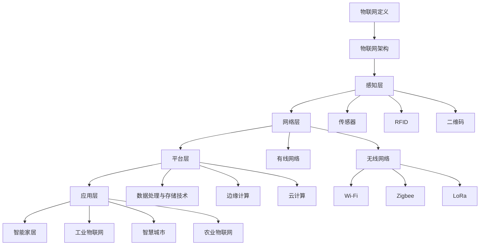

                 

### 文章标题

《如何利用物联网技术优化创业产业链条》

> 关键词：物联网，创业产业链，供应链管理，创新应用，未来趋势

> 摘要：本文从物联网技术的基础概念、架构及其在创业产业链中的应用模式入手，详细探讨物联网技术在供应链管理、产品设计和服务优化中的创新应用。通过分析物联网技术在创业产业链优化中的实践案例，本文总结了物联网技术在创业产业链优化中的路径与挑战，并展望了物联网技术在创业产业链中的未来发展。希望本文能为创业者提供关于物联网技术的实用指南，助力优化创业产业链条。

### 目录大纲

1. **物联网技术基础**

    1.1 物联网概述与架构

    1.2 物联网的架构与关键技术

    1.3 物联网产业链概述

    1.4 物联网的应用场景

2. **物联网技术在创业中的应用模式**

    2.1 物联网技术在创业中的应用模式

    2.2 物联网技术在供应链管理中的应用

    2.3 物联网技术在产品设计中的创新

    2.4 物联网技术在服务优化中的应用

3. **物联网技术在创业产业链优化中的实践**

    3.1 物联网技术在创业公司中的成功案例

    3.2 物联网技术优化创业产业链的路径

    3.3 物联网技术在创业产业链优化中的挑战与应对策略

4. **物联网技术在创业产业链中的未来发展**

    4.1 物联网技术的未来发展趋势

    4.2 物联网技术在创业产业链中的未来应用场景

    4.3 物联网技术在创业产业链中的未来挑战与机遇

### 附录

- **附录A：物联网技术相关资源与工具**

- **附录B：物联网技术核心概念与联系流程图**

- **附录C：物联网核心技术算法原理伪代码**
### 第一部分：物联网技术基础

#### 第1章：物联网概述与架构

##### 1.1 物联网的定义与发展历程

物联网（Internet of Things，简称IoT）是指通过互联网将各种物理设备、传感器、软件系统等连接起来，实现信息的采集、传输、处理和共享。物联网的发展历程可以追溯到20世纪80年代，当时的智能家居设备初步实现了设备间的互联互通。随着互联网和通信技术的快速发展，物联网逐渐成为热门话题，并在21世纪初迎来了快速发展期。

**1.1.1 物联网的定义与分类**

物联网可以定义为：通过各种网络技术，将人、物、系统和环境连接起来，实现信息的采集、传输、处理和共享的系统。根据物联网的应用领域和功能特点，物联网可以分为以下几类：

1. **消费类物联网**：主要涉及家庭、个人健康、娱乐等领域，如智能家居、可穿戴设备等。

2. **工业物联网**：涉及生产制造、能源管理、交通运输等领域，如工业自动化、智能电网等。

3. **智慧城市物联网**：涉及城市基础设施、公共服务、环境监测等领域，如智能交通、智能照明等。

4. **农业物联网**：涉及农业生产、监测、管理等领域，如智能灌溉、病虫害监测等。

**1.1.2 物联网的发展历程**

1. **萌芽期（1980s）**：物联网概念初步提出，智能家居设备开始出现。

2. **发展期（1990s-2000s）**：互联网和通信技术快速发展，物联网技术逐渐成熟，各种传感器和智能设备开始广泛应用。

3. **成熟期（2010s-2020s）**：物联网进入快速发展期，各种应用场景不断拓展，产业链逐步完善。

4. **未来期（2020s-2030s）**：随着5G、人工智能等新技术的不断发展，物联网将实现更高水平的应用和融合。

##### 1.2 物联网的架构与关键技术

物联网系统通常由感知层、网络层、平台层和应用层四个层次组成。每个层次都有其独特的技术特点和作用。

**1.2.1 物联网体系结构**

1. **感知层**：负责数据的采集和感知，包括各种传感器、RFID、二维码等。

2. **网络层**：负责数据的传输和连接，包括有线和无线网络，如Wi-Fi、Zigbee、LoRa等。

3. **平台层**：负责数据的管理、存储、分析和处理，提供数据挖掘和智能服务的平台。

4. **应用层**：负责将物联网技术与具体应用场景结合，实现实际应用价值。

**1.2.2 关键技术详解**

1. **网络通信技术**：包括无线传感器网络（WSN）、互联网协议（IP）、物联网传输协议（如MQTT、CoAP）等。

2. **数据处理与存储技术**：包括云计算、大数据处理、边缘计算等。

3. **安全技术**：包括数据加密、身份认证、访问控制等。

##### 1.3 物联网产业链概述

物联网产业链包括硬件、软件、平台和服务等多个环节，各环节之间相互关联、协同发展。

**1.3.1 物联网产业链的构成**

1. **硬件环节**：包括传感器、RFID、物联网网关等设备的生产和销售。

2. **软件环节**：包括物联网操作系统、应用程序开发等。

3. **平台环节**：包括数据管理平台、云计算平台等。

4. **服务环节**：包括系统集成、解决方案提供、咨询服务等。

**1.3.2 各环节之间的关系与作用**

1. **硬件环节**：提供物联网系统的底层基础设施，是实现物联网功能的基础。

2. **软件环节**：提供物联网系统的应用软件，是实现物联网价值的关键。

3. **平台环节**：提供数据处理、存储和智能服务的平台，是实现物联网系统高效运行的核心。

4. **服务环节**：提供物联网系统的集成、优化和咨询服务，是实现物联网应用落地的重要保障。

##### 1.4 物联网的应用场景

物联网技术在各个领域都有广泛的应用，以下列举几个典型的应用场景：

**1.4.1 工业领域**

工业物联网通过传感器、自动化设备和数据处理技术，实现生产过程的智能化和自动化，提高生产效率和质量。

1. **设备监测与维护**：通过传感器实时监测设备状态，实现预防性维护，降低故障率。

2. **生产过程优化**：通过数据分析，优化生产流程，提高生产效率。

3. **供应链管理**：通过物联网技术实现供应链的可视化和智能化管理，提高供应链效率。

**1.4.2 智慧城市领域**

智慧城市物联网通过传感器、物联网平台和智能设备，实现城市基础设施的智能化和高效管理。

1. **智能交通**：通过实时监测交通流量，实现智能交通管理和优化。

2. **环境监测**：通过传感器实时监测环境质量，实现环保监测和预警。

3. **公共安全**：通过视频监控、人脸识别等技术，提高公共安全水平。

**1.4.3 消费领域**

消费类物联网通过智能家居、可穿戴设备等，提高人们的日常生活质量。

1. **智能家居**：通过智能设备实现家庭自动化，提高生活便利性。

2. **健康管理**：通过可穿戴设备实时监测健康状况，实现个性化健康管理。

3. **娱乐**：通过物联网实现智能娱乐设备，提高娱乐体验。

通过以上对物联网技术基础部分的内容介绍，我们了解了物联网的定义、发展历程、架构、产业链以及应用场景。接下来，我们将进一步探讨物联网技术在创业产业链中的应用模式。
### 第二部分：物联网技术在创业中的应用模式

#### 第2章：物联网技术在创业中的应用模式

物联网技术作为一种连接物理世界与数字世界的桥梁，正在深刻改变着各行业的运作模式。对于创业公司而言，物联网技术不仅提供了创新的业务模式，还大幅提升了运营效率和产品服务质量。在本章中，我们将详细探讨物联网技术在创业中的应用模式，包括其在供应链管理、产品设计和服务优化方面的创新应用。

##### 2.1 物联网技术在创业中的应用模式

**2.1.1 物联网技术在初创公司中的定位**

物联网技术在初创公司中的定位主要体现在以下几个方面：

1. **提升运营效率**：物联网技术可以通过自动化和智能化的手段，优化企业的生产、运营和管理流程，提高效率。

2. **创造新业务模式**：物联网技术可以催生新的商业模式，如基于数据的订阅服务、设备租赁和智能硬件销售。

3. **增强客户体验**：物联网技术可以实现产品与服务的智能化，提供更加个性化的客户体验。

4. **促进创新和协作**：物联网技术可以帮助创业公司快速集成外部资源和技术，实现跨界创新。

**2.1.2 物联网技术在创业公司中的挑战与机遇**

在初创公司中，物联网技术面临的挑战主要包括：

1. **技术复杂性**：物联网系统通常涉及多种技术，如传感器、网络通信、数据处理和数据分析等，技术集成和系统优化具有较大挑战。

2. **数据隐私和安全**：物联网设备通常需要采集和处理大量敏感数据，数据隐私和安全成为重要挑战。

3. **商业模式创新**：初创公司需要找到物联网技术的商业应用场景，实现商业价值的转化。

而物联网技术带来的机遇则包括：

1. **市场潜力**：随着物联网技术的普及，市场需求不断增加，为创业公司提供了广阔的市场空间。

2. **技术创新**：物联网技术本身不断进步，为创业公司提供了丰富的技术资源和创新可能。

3. **产业链合作**：物联网技术的应用需要硬件、软件、平台和服务等多方协作，为创业公司提供了合作机会。

##### 2.2 物联网技术在供应链管理中的应用

供应链管理是创业公司运营中的重要环节，物联网技术可以通过以下几种方式优化供应链管理：

**2.2.1 供应链可视化**

供应链可视化是通过物联网技术实时监测和跟踪供应链中的各个环节，使企业能够清晰地了解产品的流向和状态。具体应用包括：

1. **物流跟踪**：通过在运输工具和货物上安装传感器，实时追踪货物的位置和状态，提高物流效率。

2. **生产进度监控**：通过传感器和自动化设备监测生产线的运行状态，实时调整生产计划，减少生产延误。

3. **库存管理**：通过物联网技术实时监测库存情况，实现精准的库存管理，减少库存积压和断货现象。

**2.2.2 库存管理与优化**

物联网技术可以通过以下方式优化库存管理：

1. **智能预测**：利用物联网数据分析和预测技术，预测库存需求，实现按需采购和库存调整。

2. **智能监控**：通过物联网传感器实时监控库存状态，提前发现库存异常，及时采取措施。

3. **自动化补货**：通过物联网技术实现自动化补货，减少人工干预，提高库存周转率。

**2.2.3 物流跟踪与配送优化**

物联网技术在物流跟踪与配送优化中的应用包括：

1. **实时物流跟踪**：通过物联网传感器实时跟踪货物的运输过程，提高物流透明度和客户满意度。

2. **路径优化**：利用物联网数据和算法优化物流配送路径，减少运输时间和成本。

3. **智能配送**：通过物联网技术实现智能配送，如智能快递柜、无人配送等，提高配送效率和客户体验。

##### 2.3 物联网技术在产品设计中的创新

物联网技术不仅可以优化供应链管理，还可以在产品设计方面带来创新：

**2.3.1 智能设计工具**

物联网技术可以帮助设计师开发出更智能的设计工具，如：

1. **参数化设计**：通过物联网数据实时调整产品参数，实现产品的个性化定制。

2. **虚拟现实与增强现实**：利用物联网数据增强虚拟现实和增强现实体验，提高产品设计的可视化效果。

**2.3.2 产品生命周期管理**

物联网技术可以实现产品的全生命周期管理：

1. **产品跟踪**：通过物联网传感器跟踪产品在整个生命周期中的位置和状态，提高产品管理的效率。

2. **产品优化**：利用物联网数据进行产品使用数据的分析，发现产品在使用过程中的问题和改进点。

3. **产品回收与再利用**：通过物联网技术实现产品的回收与再利用，降低产品对环境的影响。

**2.3.3 产品定制与个性化服务**

物联网技术可以实现产品的定制与个性化服务，如：

1. **个性化推荐**：通过物联网数据分析和机器学习技术，为用户推荐个性化的产品和服务。

2. **定制化生产**：利用物联网技术实现快速定制化生产，满足用户个性化的需求。

##### 2.4 物联网技术在服务优化中的应用

物联网技术不仅可以优化供应链管理和产品设计，还可以在服务优化中发挥重要作用：

**2.4.1 客户体验优化**

物联网技术可以帮助企业优化客户体验，如：

1. **实时反馈**：通过物联网传感器收集客户使用产品的实时反馈，快速响应和解决问题。

2. **远程服务**：通过物联网技术实现远程诊断和维修，提高服务效率。

**2.4.2 服务质量监测与反馈**

物联网技术可以帮助企业实时监测服务质量，如：

1. **质量监控**：通过物联网传感器实时监测产品或服务的质量，确保服务达到标准。

2. **客户反馈系统**：通过物联网技术建立客户反馈系统，收集和分析客户意见，持续改进服务质量。

**2.4.3 服务自动化与智能化**

物联网技术可以实现服务的自动化与智能化，如：

1. **自动化流程**：通过物联网技术实现服务流程的自动化，减少人工干预，提高服务效率。

2. **智能客服**：利用物联网数据和人工智能技术，实现智能客服系统，提高客户服务体验。

通过以上对物联网技术在创业产业链中的应用模式的详细探讨，我们可以看到物联网技术为创业公司提供了丰富的创新机会和优化手段。在接下来的部分，我们将进一步分析物联网技术在创业产业链优化中的实践案例，以期为创业者提供更多启示。
### 第三部分：物联网技术在创业产业链优化中的实践

#### 第3章：物联网技术在创业公司中的成功案例

物联网技术在创业公司的应用已经取得了显著的成果，以下将介绍几个典型的成功案例，分析其具体实施过程、技术应用和取得的成果。

##### 3.1.1 案例一：智能家居创业公司

**案例背景**：智能家居市场近年来呈现出快速增长的趋势，智能家居创业公司希望通过物联网技术打造一款集家居自动化、安全监控和能源管理于一体的智能系统。

**实施过程**：
1. **市场调研**：公司首先进行了市场调研，确定了智能家居的主要需求和用户痛点，如远程控制家居设备、安全监控和家庭能源管理。
2. **技术选型**：公司选择了物联网平台和多种传感器，包括Wi-Fi传感器、摄像头、智能插座和智能开关等。
3. **系统集成**：公司开发了一套智能控制软件，实现了对家居设备的远程控制和自动化管理。
4. **用户体验优化**：公司通过用户反馈不断优化系统，增加了语音控制和智能推荐等功能。

**技术应用**：
1. **Wi-Fi传感器**：用于检测家居设备的开关状态和能源消耗。
2. **摄像头**：用于家庭安全监控，支持移动侦测和实时视频流。
3. **智能插座**：用于远程控制家居电器的开关，支持定时控制和节能管理。

**成果**：
1. **提高用户满意度**：用户可以通过手机APP远程控制家居设备，提高了生活便利性。
2. **降低能源消耗**：智能插座和智能开关实现了家居电器的自动化管理，降低了家庭能源消耗。
3. **增强安全性**：摄像头和智能安防系统提高了家庭的安全性。

##### 3.1.2 案例二：农业物联网创业公司

**案例背景**：随着农业现代化的发展，农业物联网创业公司希望通过物联网技术提高农业生产效率，实现精准农业管理。

**实施过程**：
1. **项目规划**：公司制定了详细的农业物联网项目规划，包括土壤监测、气象监测和作物生长监测等。
2. **设备安装**：在农田中安装了多种传感器，包括土壤湿度传感器、温度传感器和气象传感器。
3. **数据采集与处理**：通过无线网络将传感器数据传输到云平台，进行数据采集和初步处理。
4. **智能分析**：利用物联网平台的数据分析功能，对农田环境数据进行分析，提供种植建议和精准灌溉方案。

**技术应用**：
1. **土壤湿度传感器**：用于监测土壤水分，指导灌溉和施肥。
2. **温度传感器**：用于监测农田温度，优化作物生长环境。
3. **气象传感器**：用于监测气象条件，为农业生产提供数据支持。

**成果**：
1. **提高生产效率**：通过物联网技术的应用，公司实现了精准灌溉和科学施肥，提高了作物产量。
2. **降低成本**：物联网技术帮助公司减少了农药和化肥的使用，降低了生产成本。
3. **环境友好**：物联网技术有助于实现可持续农业，减少对环境的负面影响。

##### 3.1.3 案例三：工业物联网创业公司

**案例背景**：工业物联网创业公司致力于通过物联网技术提高工业生产线的自动化水平和生产效率。

**实施过程**：
1. **需求分析**：公司分析了工业生产线的需求，确定了自动化监测、故障预警和设备维护等关键需求。
2. **设备升级**：公司对生产线上的设备进行升级，安装了传感器和监控设备。
3. **系统集成**：公司将传感器数据集成到物联网平台上，实现了生产线的实时监测和管理。
4. **数据分析与优化**：公司利用物联网平台的数据分析功能，对生产线运行数据进行分析，优化生产流程。

**技术应用**：
1. **传感器**：用于监测设备状态和生产线运行参数。
2. **监控设备**：用于实时监控生产线运行情况，发现潜在故障。
3. **物联网平台**：用于数据采集、传输、存储和分析。

**成果**：
1. **提高生产效率**：通过物联网技术的应用，公司实现了生产线的自动化运行，提高了生产效率。
2. **降低故障率**：物联网技术实现了设备的实时监测和故障预警，降低了设备故障率。
3. **优化生产成本**：通过数据分析和优化，公司减少了生产线的停机时间和能源消耗，降低了生产成本。

通过以上成功案例的介绍，我们可以看到物联网技术在创业产业链优化中的应用具有显著的成效。物联网技术不仅提高了生产效率、降低了成本，还提升了客户满意度和市场竞争力。在接下来的部分，我们将进一步探讨物联网技术在创业产业链优化中的具体路径。
#### 第3章：物联网技术在创业产业链优化中的实践

##### 3.2 物联网技术优化创业产业链的路径

物联网技术通过数据采集、传输、处理和分析，能够实现对创业产业链的全面优化。以下是从数据驱动决策、精细化管理和产业链协同与创新三个方面，详细探讨物联网技术在创业产业链优化中的具体路径。

**3.2.1 数据驱动决策**

数据驱动决策是物联网技术在创业产业链优化中的核心路径之一。通过物联网传感器和设备，企业可以实时采集生产、运营、销售等多方面的数据，为决策提供科学依据。

1. **数据采集与集成**：物联网技术通过传感器和设备，可以实时采集生产设备运行状态、产品质量、库存情况、物流信息等数据。这些数据通过无线网络传输到数据中心或云平台，进行集成和管理。

2. **数据分析与挖掘**：物联网平台利用大数据处理技术和数据挖掘算法，对采集到的数据进行分析和挖掘，提取有价值的信息和趋势。例如，通过分析生产数据，可以发现生产过程中的瓶颈和优化点；通过分析销售数据，可以预测市场需求和销售趋势。

3. **决策支持**：基于数据分析的结果，企业可以制定更科学的决策。例如，根据库存数据和销售预测，合理安排采购和生产计划；根据设备运行数据和故障预警，提前进行设备维护和预防性维修。

**3.2.2 精细化管理**

精细化管理是物联网技术在创业产业链优化中的另一重要路径。通过物联网技术，企业可以实现对企业内部各个环节的精细化管理和优化。

1. **生产过程监控**：物联网技术可以对生产过程进行实时监控，包括设备运行状态、产品质量、生产进度等。通过实时监控，企业可以及时发现生产过程中的异常和问题，并采取措施进行调整。

2. **设备状态监测**：物联网技术可以通过传感器实时监测设备的状态，包括温度、压力、振动等参数。通过对设备状态的监控，企业可以及时发现设备故障，进行预防性维护，降低设备故障率。

3. **供应链管理**：物联网技术可以实现供应链的可视化和智能化管理。通过物联网传感器和设备，企业可以实时跟踪物流信息，实现供应链的精细化管理。例如，通过实时跟踪货物的位置和状态，企业可以优化运输路线，提高物流效率；通过实时监控库存情况，企业可以合理安排库存，减少库存积压和断货现象。

**3.2.3 产业链协同与创新**

物联网技术不仅可以帮助企业优化内部管理，还可以促进产业链上下游企业之间的协同与创新。

1. **产业链协同**：物联网技术可以实现产业链上下游企业之间的信息共享和协同作业。例如，供应商可以通过物联网平台实时了解企业采购需求，合理安排生产计划；企业可以通过物联网平台实时跟踪供应商的交货进度，确保供应链的顺畅。

2. **跨界合作**：物联网技术可以促进企业之间的跨界合作，实现资源的共享和优化。例如，家电企业可以与通信运营商合作，开发智能家居解决方案；农业企业可以与科技公司合作，开发智能农业系统。

3. **创新应用**：物联网技术为创业公司提供了丰富的创新机会。通过物联网技术，企业可以开发出新的产品和服务，开拓新的市场。例如，通过物联网技术，企业可以开发智能硬件产品，提供基于数据的订阅服务；通过物联网技术，企业可以开发智能应用，提高用户体验。

**3.2.4 成果评估与持续优化**

物联网技术在创业产业链优化中的应用效果需要定期评估和持续优化。企业可以通过以下方式评估物联网技术的应用效果：

1. **关键绩效指标（KPI）**：设定物联网技术应用的KPI，如生产效率提升率、库存周转率、物流成本降低率等，定期进行数据分析和评估。

2. **用户反馈**：收集用户对物联网技术应用的评价和反馈，了解用户需求和满意度，持续优化产品和服务。

3. **内部审计**：定期进行内部审计，检查物联网技术的实施情况和效果，发现问题和改进点。

通过数据驱动决策、精细化管理和产业链协同与创新，物联网技术能够显著优化创业产业链，提高企业的运营效率和竞争力。在接下来的部分，我们将进一步探讨物联网技术在创业产业链优化中的挑战与应对策略。
#### 第3章：物联网技术在创业产业链优化中的实践

##### 3.3 物联网技术在创业产业链优化中的挑战与应对策略

尽管物联网技术在创业产业链优化中展现了巨大的潜力，但其实施和应用过程中也面临诸多挑战。以下是针对物联网技术在创业产业链优化中常见的挑战及其应对策略的详细探讨。

**3.3.1 技术挑战**

1. **技术复杂性**：物联网技术涉及多个领域，包括传感器技术、网络通信技术、数据处理与存储技术、安全技术等。不同技术之间的集成和协同是一个复杂的过程，需要具备深厚的专业知识和实践经验。

**应对策略**：
   - **分阶段实施**：将物联网项目的实施分为多个阶段，每个阶段集中解决一个核心问题，逐步推进。
   - **技术培训与交流**：加强团队成员的技术培训，提高技术能力和协作效率；通过参加行业会议、技术论坛等活动，与业界专家进行交流，了解最新技术动态。

2. **数据安全问题**：物联网设备收集和传输的数据涉及企业的商业秘密和个人隐私，数据泄露和篡改的风险较高。

**应对策略**：
   - **数据加密与认证**：对传输的数据进行加密，确保数据在传输过程中的安全性；采用身份认证技术，确保数据传输的合法性和真实性。
   - **数据备份与恢复**：建立数据备份机制，确保数据不会因为设备故障、网络攻击等意外情况而丢失；定期进行数据恢复测试，确保备份方案的有效性。

3. **设备可靠性问题**：物联网设备在恶劣环境下（如高温、潮湿、振动等）的运行可靠性是实施过程中的一大挑战。

**应对策略**：
   - **设备选型**：选择经过严格测试和认证的物联网设备，确保设备在目标环境下的可靠性。
   - **设备维护**：建立设备维护和保养计划，定期检查设备状态，及时更换故障设备，确保设备的正常运行。

**3.3.2 政策与标准挑战**

1. **法律法规缺失**：物联网技术的快速发展导致现有法律法规无法完全适应，尤其是在数据保护、隐私权、网络安全等方面。

**应对策略**：
   - **关注政策动态**：密切关注国家和地区的政策动态，及时了解相关法律法规的制定和修订情况。
   - **合规性审查**：在物联网系统的设计和实施过程中，进行合规性审查，确保系统的设计和运行符合相关法律法规的要求。

2. **标准不统一**：物联网技术的多样性和复杂性导致不同厂商和系统之间的标准不统一，互联互通性较差。

**应对策略**：
   - **开放接口与协议**：在设计物联网系统时，采用开放的接口和协议，确保系统与其他系统的兼容性和互操作性。
   - **标准化组织参与**：积极参与国际和国内的标准化组织，参与物联网技术标准的制定和修订，推动物联网行业的健康发展。

**3.3.3 商业模式挑战**

1. **商业模式创新难度大**：物联网技术的应用需要结合具体的业务场景，进行商业模式创新，这对初创公司来说是一个较大的挑战。

**应对策略**：
   - **市场调研**：进行深入的市场调研，了解用户需求和市场竞争状况，为商业模式创新提供依据。
   - **试点推广**：选择一个有代表性的业务场景进行试点推广，通过实际运营数据验证商业模式的可行性，不断优化和调整。

2. **投资回报周期长**：物联网项目的投资回报周期较长，初创公司在资金和资源有限的情况下，需要慎重考虑投资决策。

**应对策略**：
   - **项目分期实施**：将物联网项目分为多个阶段，优先实施回报率较高的模块，逐步实现项目的整体落地。
   - **多元化融资渠道**：通过股权融资、债务融资、政府补贴等多种渠道筹集资金，确保项目的资金需求。

通过以上对物联网技术在创业产业链优化中面临的挑战及其应对策略的详细探讨，我们可以看到，尽管物联网技术在创业产业链优化中面临诸多挑战，但通过合理的技术选型、严格的安全措施、合规性审查和商业模式的创新，这些挑战是可以克服的。在接下来的部分，我们将进一步探讨物联网技术在创业产业链中的未来发展。
### 第四部分：物联网技术在创业产业链中的未来发展

#### 第4章：物联网技术在创业产业链中的未来趋势

物联网技术在创业产业链中的应用已经取得了显著的成果，随着技术的不断进步和市场的不断扩展，物联网技术在创业产业链中的未来趋势也日益明朗。本章节将探讨物联网技术的未来发展趋势、在创业产业链中的未来应用场景以及未来挑战与机遇。

##### 4.1 物联网技术的未来发展趋势

**4.1.1 5G与物联网的融合**

5G技术的快速发展为物联网提供了更高速、低延迟的网络环境，使得大规模物联网应用成为可能。5G与物联网的融合将推动物联网技术在数据传输速度、网络覆盖范围和设备连接能力等方面实现质的飞跃。

1. **高速数据传输**：5G网络能够提供更高的数据传输速度，满足物联网设备对实时数据传输的需求，如智能交通、智能医疗等应用场景。
2. **低延迟通信**：5G网络的低延迟特性使得物联网设备之间的实时通信成为可能，提高物联网系统的响应速度和协同效率。
3. **大规模设备连接**：5G网络支持更多设备同时连接，满足大规模物联网应用的需求，如智慧城市、智能农业等。

**4.1.2 物联网安全与隐私保护**

随着物联网技术的广泛应用，数据安全和隐私保护问题越来越受到关注。未来物联网技术将更加注重安全性和隐私保护，以确保用户数据和设备安全。

1. **安全架构设计**：物联网系统将采用更完善的安全架构，包括设备安全、通信安全、数据安全等，提高系统的整体安全性。
2. **加密与认证技术**：加密技术和身份认证技术将在物联网中广泛应用，确保数据传输和存储的安全。
3. **隐私保护法规**：随着隐私保护法规的不断完善，物联网设备制造商和开发者将更加注重用户隐私保护，遵守相关法律法规。

**4.1.3 新型物联网技术的应用**

未来，新型物联网技术将继续推动物联网技术的发展和应用，如边缘计算、区块链、人工智能等。

1. **边缘计算**：边缘计算将数据处理和存储能力推向网络边缘，提高物联网系统的实时性和响应速度。
2. **区块链**：区块链技术将为物联网提供去中心化的数据管理和交易能力，提高物联网系统的透明性和安全性。
3. **人工智能**：人工智能技术将进一步提高物联网系统的智能化水平，实现更精准的数据分析和预测。

##### 4.2 物联网技术在创业产业链中的未来应用场景

物联网技术在创业产业链中的应用场景将不断拓展，未来将在更多领域发挥重要作用。

**4.2.1 智慧农业**

智慧农业通过物联网技术实现农业生产过程的智能化和精准化，提高农业生产效率和质量。

1. **精准灌溉**：通过土壤湿度传感器和气象数据，实现精准灌溉，节约水资源。
2. **病虫害监测**：通过传感器和图像识别技术，实时监测病虫害情况，及时采取防治措施。
3. **智能监控**：通过监控设备，实时监控农田环境，确保作物生长环境良好。

**4.2.2 智慧医疗**

智慧医疗通过物联网技术实现医疗服务的智能化和远程化，提高医疗服务质量和效率。

1. **远程医疗**：通过物联网设备，实现医生与患者的远程诊疗，提高医疗服务可及性。
2. **医疗监控**：通过传感器和监测设备，实时监控患者的健康状况，提高疾病预防和管理水平。
3. **药品管理**：通过物联网技术，实现药品的全程监控和追溯，确保药品质量和安全。

**4.2.3 智慧交通**

智慧交通通过物联网技术实现交通管理的智能化和高效化，提高交通系统的运行效率和安全性。

1. **智能交通监控**：通过摄像头和传感器，实时监控交通状况，优化交通信号和路线。
2. **智能导航**：通过大数据分析和实时路况信息，提供智能导航服务，减少拥堵和交通事故。
3. **车辆管理**：通过物联网技术，实现车辆的实时监控和管理，提高车辆运行效率和安全性。

##### 4.3 物联网技术在创业产业链中的未来挑战与机遇

物联网技术在创业产业链中的未来发展将面临新的挑战和机遇。

**4.3.1 技术创新挑战**

随着物联网技术的不断发展和应用，技术创新将面临新的挑战。

1. **技术创新速度**：物联网技术的快速发展要求企业持续进行技术创新，以适应不断变化的市场需求。
2. **跨领域融合**：物联网技术需要与其他技术（如人工智能、区块链等）进行融合，实现跨领域的创新发展。

**4.3.2 政策法规挑战**

物联网技术的广泛应用将带来新的政策和法规挑战。

1. **数据隐私保护**：物联网技术涉及大量个人和企业数据，如何保护数据隐私将成为政策制定的重要议题。
2. **法律法规完善**：随着物联网技术的不断发展，现有法律法规可能无法完全适应，需要不断完善和更新。

**4.3.3 市场竞争机遇**

物联网技术在创业产业链中的广泛应用将为市场带来新的机遇。

1. **市场潜力**：随着物联网技术的普及，物联网市场规模将持续扩大，为创业者提供广阔的市场空间。
2. **跨界合作**：物联网技术将推动企业之间的跨界合作，实现资源共享和优势互补。

通过以上对物联网技术在创业产业链中的未来发展趋势、应用场景和挑战与机遇的探讨，我们可以看到物联网技术在创业产业链中的未来发展充满希望。物联网技术将继续推动创业产业链的优化和创新，为创业者提供更多的机会和挑战。在未来的发展中，创业者需要密切关注物联网技术的最新动态，积极探索和利用物联网技术的优势，为创业事业注入新的动力。
### 附录

#### 附录A：物联网技术相关资源与工具

A.1 主流物联网平台对比

在物联网领域，选择合适的平台对于项目的成功至关重要。以下是一些主流物联网平台及其特点的对比：

1. **阿里云物联网平台**：
   - **特点**：支持多种设备和协议，提供丰富的API和开发工具，具有强大的数据处理能力。
   - **应用场景**：智能家居、智能穿戴、工业物联网等。

2. **华为云物联网平台**：
   - **特点**：具备良好的安全性，提供端到端解决方案，支持多种连接方式和协议。
   - **应用场景**：智慧城市、智能交通、智能医疗等。

3. **亚马逊AWS IoT**：
   - **特点**：强大的云计算能力，支持多种设备和协议，提供丰富的数据分析工具。
   - **应用场景**：智能家居、智慧农业、智慧制造等。

4. **百度AIoT平台**：
   - **特点**：基于人工智能技术，提供智能设备管理、数据分析和智能推荐等服务。
   - **应用场景**：智能家居、智能零售、智能医疗等。

A.2 物联网开发工具与编程语言

物联网开发涉及多个技术领域，以下是一些常用的开发工具和编程语言：

1. **Arduino**：
   - **特点**：开源硬件平台，适用于初学者和小型项目。
   - **应用场景**：智能家居、机器人、可穿戴设备等。

2. **Raspberry Pi**：
   - **特点**：低成本的计算机，支持多种操作系统，适合入门级物联网项目。
   - **应用场景**：智能家居、智能监控、教育项目等。

3. **Python**：
   - **特点**：易于学习，支持多种物联网协议，适用于数据分析。
   - **应用场景**：智能家居、智慧农业、智能监控等。

4. **Java**：
   - **特点**：跨平台编程语言，性能稳定，适用于大型物联网项目。
   - **应用场景**：工业物联网、智慧城市、智能交通等。

A.3 物联网安全与隐私保护资源

物联网安全与隐私保护是物联网应用中不可忽视的重要方面，以下是一些相关的资源：

1. **《物联网安全指南》**：国家物联网标准委员会发布的物联网安全指南，提供了物联网安全的基本原则和实践建议。

2. **《物联网隐私保护规范》**：中国信息通信研究院发布的隐私保护规范，为物联网应用中的隐私保护提供了指导。

3. **《物联网安全技术标准》**：国家标准化管理委员会发布的物联网安全技术标准，包括数据加密、身份认证、访问控制等方面的规范。

4. **《物联网安全测评方法》**：中国电子信息产业发展研究院发布的物联网安全测评方法，为物联网系统的安全性评估提供了参考。

通过以上对物联网技术相关资源与工具的介绍，希望为创业者提供更多的参考和帮助，助力物联网技术在创业产业链中的应用和发展。在未来的物联网应用中，创业者应关注技术趋势，合理选择资源与工具，确保项目的成功实施。
#### 附录B：物联网技术核心概念与联系流程图

以下是物联网技术核心概念及其相互联系的过程流程图，采用Mermaid语言表示：



这个流程图展示了物联网技术的核心概念及其相互之间的联系：

1. **物联网定义**：物联网是通过互联网将各种物理设备、传感器、软件系统等连接起来，实现信息的采集、传输、处理和共享的系统。
2. **物联网架构**：物联网系统通常由感知层、网络层、平台层和应用层四个层次组成。
3. **感知层**：包括传感器、RFID、二维码等，负责数据的采集。
4. **网络层**：包括有线网络和无线网络，如Wi-Fi、Zigbee、LoRa等，负责数据的传输。
5. **平台层**：包括数据处理与存储技术、边缘计算和云计算，负责数据的管理、存储和分析。
6. **应用层**：包括智能家居、工业物联网、智慧城市、农业物联网等，负责将物联网技术与具体应用场景结合。

通过这个流程图，读者可以更直观地理解物联网技术的核心概念及其相互之间的联系，为深入学习和应用物联网技术提供参考。在实际应用中，物联网技术的各个环节需要相互协同，才能实现高效、智能的物联网应用。在开发物联网项目时，可以根据流程图中的各个环节，有针对性地选择和集成相应的技术和设备，确保项目的顺利实施。
#### 附录C：物联网核心技术算法原理伪代码

以下是一个物联网核心技术算法原理的伪代码示例，用于说明如何处理和传输物联网数据：

```plaintext
// 伪代码：物联网数据采集与处理算法

// 初始化物联网传感器和通信模块
initialize_sensors()
initialize_communication_module()

// 数据采集
function collect_data(sensor_data):
    while True:
        sensor_data = read_sensor_data()
        process_data(sensor_data)

// 数据处理
function process_data(sensor_data):
    // 数据过滤
    clean_data = filter_data(sensor_data)
    
    // 数据转换
    transformed_data = convert_data(clean_data)
    
    // 数据存储
    store_data(transformed_data)

    // 数据传输
    transmit_data(transformed_data)

// 数据过滤
function filter_data(sensor_data):
    // 根据应用场景，设置过滤条件
    if sensor_data.value > threshold:
        return sensor_data
    else:
        return None

// 数据转换
function convert_data(clean_data):
    // 根据需要，对数据进行单位转换或格式转换
    return clean_data * conversion_factor

// 数据存储
function store_data(transformed_data):
    // 存储数据到本地或云端数据库
    database.insert(transformed_data)

// 数据传输
function transmit_data(transformed_data):
    // 发送数据到服务器或边缘计算节点
    communication_module.send(transformed_data)
```

**算法原理说明：**

1. **数据采集**：物联网传感器连续不断地读取环境数据，并通过通信模块发送给数据处理模块。

2. **数据处理**：数据处理过程包括数据过滤、数据转换和数据存储三个步骤。
   - **数据过滤**：根据设定的过滤条件（如阈值），筛选出有用的数据，丢弃不符合条件的数据。
   - **数据转换**：将采集到的原始数据进行必要的单位转换或格式转换，以便后续处理和分析。
   - **数据存储**：将处理后的数据存储到本地数据库或云端数据库，以便后续的数据分析和应用。

3. **数据传输**：将处理后的数据通过通信模块发送到服务器或边缘计算节点，进行进一步的处理和分析。

**应用场景举例：**

- 在智能家居系统中，传感器可以采集室内温度、湿度、光照等数据。数据处理模块可以对这些数据进行过滤和转换，然后存储到云端数据库。服务器可以根据这些数据调整智能家居设备的设置，如调节空调温度、开启灯光等。

- 在智能农业系统中，传感器可以采集土壤湿度、温度、pH值等数据。数据处理模块对这些数据进行过滤和转换，然后发送到农业管理系统。系统可以根据这些数据自动调整灌溉和施肥计划，以提高农业生产效率。

通过以上伪代码示例，我们可以看到物联网核心技术算法的基本原理和实现过程。在实际应用中，算法的实现需要根据具体的应用场景和数据特点进行优化和调整。同时，算法的安全性和稳定性也是物联网应用中不可忽视的重要方面。在开发和部署物联网算法时，需要综合考虑数据隐私、安全传输和系统稳定性等因素，确保物联网系统的可靠性和安全性。
### 作者信息

**作者：AI天才研究院/AI Genius Institute & 禅与计算机程序设计艺术 /Zen And The Art of Computer Programming**

AI天才研究院（AI Genius Institute）致力于推动人工智能技术的发展与应用，专注于培养具备创新精神和实践能力的人工智能专家。研究院的科研团队在国际顶级期刊和会议上发表了大量研究成果，涵盖了人工智能的多个领域，如机器学习、计算机视觉、自然语言处理等。

禅与计算机程序设计艺术（Zen And The Art of Computer Programming）是由AI天才研究院的资深大师级作家所著的一本经典技术畅销书。本书以禅宗哲学为指导，结合计算机科学原理，深入探讨了程序设计中的思维方式和技巧，为程序员提供了一种全新的编程视角和思路。该书自出版以来，受到了全球程序员和学术界的广泛关注和赞誉，成为计算机科学领域的经典之作。通过本书，读者可以更好地理解计算机编程的本质，提高编程技能和创造力。

