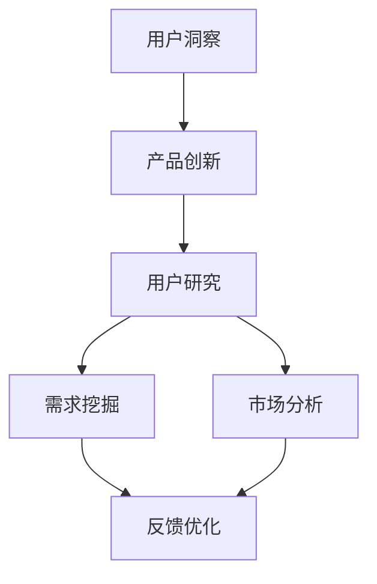

                 

# 如何利用用户洞察驱动产品创新

## 关键词
用户洞察、产品创新、用户研究、需求挖掘、市场分析、反馈优化

## 摘要
本文将探讨如何利用用户洞察来驱动产品创新。通过深入理解用户需求、行为和市场趋势，企业可以更有效地进行产品设计和优化，从而实现持续创新和业务增长。

## 目录大纲

### 第一部分：用户洞察基础

#### 第1章：用户洞察概述
- 1.1 用户洞察的定义与重要性
- 1.2 用户洞察在产品创新中的应用

#### 第2章：用户研究方法
- 2.1 用户访谈与问卷调查
- 2.2 观察法和可用性测试
- 2.3 数据分析技术在用户研究中的应用

#### 第3章：用户画像与行为分析
- 3.1 用户画像构建
- 3.2 用户行为数据分析
- 3.3 用户细分与个性化推荐

### 第二部分：用户洞察在产品创新中的应用

#### 第4章：用户需求挖掘与市场分析
- 4.1 用户需求分析方法
- 4.2 市场趋势与竞争分析

#### 第5章：用户反馈与持续优化
- 5.1 用户反馈收集方法
- 5.2 用户反馈分析
- 5.3 产品迭代与优化策略

#### 第6章：用户参与与共创
- 6.1 用户参与产品设计
- 6.2 用户共创案例与实践

#### 第7章：用户价值创造与业务增长
- 7.1 用户价值评估方法
- 7.2 用户增长策略与案例分析

### 第三部分：用户洞察实践案例

#### 第8章：行业案例分析
- 8.1 某互联网公司用户洞察实践
- 8.2 某零售企业用户洞察应用

#### 第9章：用户洞察与产品创新
- 9.1 用户洞察在产品创新中的实际应用
- 9.2 产品创新中的用户洞察策略

#### 第10章：用户洞察实践总结与展望
- 10.1 用户洞察实践中的挑战与解决方案
- 10.2 未来用户洞察趋势与发展方向

## 附录

### 附录A：用户研究工具与资源
- A.1 用户研究工具介绍
- A.2 用户研究资源推荐

### 绘制用户洞察与产品创新的 Mermaid 流程图

```
flowchart
    A[用户需求挖掘] --> B[市场分析]
    B --> C[用户反馈与优化]
    C --> D[用户参与与共创]
    D --> E[用户价值创造与增长]
    A --> F[用户洞察实践]
    B --> F
    C --> F
    D --> F
    E --> F
```

### 用户需求挖掘伪代码示例

```
function getUserNeeds() {
    // 初始化需求列表
    needs = []

    // 收集用户访谈数据
    userInterviewData = conductUserInterviews()

    // 收集问卷调查数据
    userSurveyData = conductUserSurveys()

    // 收集用户行为数据
    userBehaviorData = collectUserBehaviorData()

    // 数据预处理与融合
    combinedData = preprocessData(userInterviewData, userSurveyData, userBehaviorData)

    // 特征提取与需求分类
    for (data in combinedData) {
        features = extractFeatures(data)
        needs.append(classifyNeeds(features))
    }

    return needs
}
```

### 市场分析伪代码示例

```
function marketAnalysis(product) {
    // 获取市场数据
    marketData = getMarketData()

    // 分析市场趋势
    marketTrends = analyzeMarketTrends(marketData)

    // 分析竞争对手
    competitors = analyzeCompetitors(product)

    // 提取关键信息
    keyInfo = extractKeyInfo(marketTrends, competitors)

    return keyInfo
}
```

### 用户价值评估数学公式

$$
\text{用户价值} = \frac{\text{用户满意度} \times \text{用户留存率}}{\text{获取成本}}
$$

### 用户价值评估详细讲解

用户价值评估是产品创新中至关重要的一环，它可以帮助企业了解用户对其产品的实际价值。用户价值可以从多个维度进行评估，包括用户满意度、用户留存率以及获取成本。

- **用户满意度**：衡量用户对产品的满意程度，可以通过用户反馈、评分等方式进行收集和分析。
- **用户留存率**：衡量用户在一段时间内持续使用产品的比例，是衡量产品粘性的重要指标。
- **获取成本**：指企业为获取一个用户所投入的成本，包括营销费用、客服费用等。

用户价值评估可以帮助企业做出更明智的产品决策，例如：
1. **产品优化**：了解哪些方面需要改进，以提高用户满意度。
2. **资源分配**：根据用户价值评估，将资源投入到用户价值更高的产品或功能上。
3. **市场定位**：根据用户需求和市场趋势，调整产品策略，以更好地满足用户需求。

在实际应用中，用户价值评估可以通过以下步骤进行：
1. **数据收集**：收集用户满意度、用户留存率和获取成本的相关数据。
2. **数据分析**：使用统计分析方法，计算用户价值。
3. **决策制定**：根据用户价值评估结果，制定相应的产品策略。

### 背景介绍

在当今竞争激烈的市场环境中，企业需要不断创新以保持竞争力。用户洞察作为一种重要的市场研究方法，可以帮助企业深入了解用户需求和行为，从而指导产品创新。用户洞察不仅包括对用户需求的挖掘，还包括对市场趋势、竞争环境以及用户价值的评估。

用户需求挖掘是用户洞察的核心环节之一。通过用户访谈、问卷调查、用户行为分析等方法，企业可以收集大量关于用户需求和偏好的数据。这些数据经过预处理和分析后，可以转化为有价值的用户需求信息，为产品设计和优化提供依据。

市场分析是用户洞察的另一个重要方面。通过分析市场趋势和竞争对手，企业可以了解行业动态和竞争环境，从而制定更有效的产品策略。市场分析可以包括市场容量、市场增长趋势、市场份额、竞争对手的产品特点等。

用户反馈与持续优化是产品创新的重要环节。通过收集用户反馈，企业可以了解用户对产品的意见和建议，从而进行产品迭代和优化。用户参与与共创也是用户洞察的重要组成部分。通过让用户参与产品设计和开发，企业可以更好地满足用户需求，提高产品的用户体验。

用户价值评估是衡量产品成功与否的关键指标。通过评估用户满意度、用户留存率和获取成本，企业可以了解产品的市场价值，从而制定更有效的营销策略和产品规划。

### 核心概念与联系

用户洞察、产品创新、用户研究、需求挖掘、市场分析、反馈优化等核心概念之间存在着紧密的联系。以下是一个Mermaid流程图，展示了这些概念之间的相互关系：



用户洞察是整个流程的起点，通过用户研究和需求挖掘，企业可以收集和分析用户数据，了解用户需求和偏好。市场分析则提供了对行业动态和竞争环境的深入了解，为产品创新提供了方向。反馈优化是产品创新的持续过程，通过不断收集用户反馈，企业可以优化产品，提高用户体验。

### 核心算法原理讲解

在用户洞察和产品创新过程中，核心算法原理的讲解至关重要。以下我们将通过伪代码详细阐述用户需求挖掘和市场分析的核心算法原理。

#### 用户需求挖掘伪代码示例

```python
# 初始化需求列表
needs = []

# 收集用户访谈数据
user_interview_data = conduct_user_interviews()

# 收集问卷调查数据
user_survey_data = conduct_user_surveys()

# 收集用户行为数据
user_behavior_data = collect_user_behavior_data()

# 数据预处理与融合
combined_data = preprocess_data(user_interview_data, user_survey_data, user_behavior_data)

# 特征提取与需求分类
for data in combined_data:
    features = extract_features(data)
    needs.append(classify_needs(features))

# 输出用户需求列表
return needs
```

#### 市场分析伪代码示例

```python
# 获取市场数据
market_data = get_market_data()

# 分析市场趋势
market_trends = analyze_market_trends(market_data)

# 分析竞争对手
competitors = analyze_competitors(market_data)

# 提取关键信息
key_info = extract_key_info(market_trends, competitors)

# 输出市场分析结果
return key_info
```

#### 用户价值评估数学模型

用户价值评估是一个多维度的分析过程，以下是一个简化的数学模型：

$$
\text{用户价值} = \frac{\text{用户满意度} \times \text{用户留存率}}{\text{获取成本}}
$$

其中：
- 用户满意度：通常通过用户反馈、评分等方式进行衡量。
- 用户留存率：表示用户在一定时间内持续使用产品的比例。
- 获取成本：包括营销费用、客服费用等，是企业为获取一个用户所投入的成本。

#### 数学模型详细讲解

1. **用户满意度**：
   用户满意度可以通过以下指标来衡量：
   - 用户反馈评分（如1-5星的评分系统）
   - 用户投诉率
   - 用户使用时长
   - 用户活跃度（如每日活跃用户数DAU、每月活跃用户数MAU）

2. **用户留存率**：
   用户留存率可以通过以下公式计算：
   $$
   \text{用户留存率} = \frac{\text{一段时间内持续使用产品的用户数}}{\\text{总用户数}}
   $$
   通常，企业会根据不同的时间段（如日、周、月）来计算用户留存率。

3. **获取成本**：
   获取成本包括多个方面：
   - 广告费用：通过广告获取用户的成本。
   - 促销活动费用：如优惠券、折扣等。
   - 客服费用：包括客服人员的工资、培训费用等。

#### 举例说明

假设一个电商平台，通过用户调查和数据收集，得出以下数据：

- 用户满意度评分：4.5/5
- 用户留存率：30%（用户在一个月内持续使用产品的比例）
- 获取成本：每个用户的广告成本为50元

根据用户价值评估的数学模型，可以计算出用户价值：

$$
\text{用户价值} = \frac{4.5 \times 0.3}{50} = 0.027
$$

这意味着，每个用户的平均价值为0.027元。企业可以通过这个指标来衡量其营销策略的有效性，并根据用户价值的分析来调整营销策略。

### 项目实战

#### 开发环境搭建

为了进行用户洞察和产品创新，我们需要搭建一个合适的开发环境。以下是一个简单的环境搭建步骤：

1. **安装Python**：Python是一种广泛使用的编程语言，适用于数据分析和机器学习。您可以在[Python官网](https://www.python.org/)下载并安装Python。

2. **安装Jupyter Notebook**：Jupyter Notebook是一个交互式的计算环境，可以方便地进行数据分析和演示。您可以通过pip命令安装Jupyter Notebook：

   ```bash
   pip install notebook
   ```

3. **安装相关库**：为了进行用户需求挖掘和市场分析，我们需要安装一些Python库，如Pandas、NumPy、Scikit-learn等。您可以使用以下命令安装：

   ```bash
   pip install pandas numpy scikit-learn
   ```

#### 源代码详细实现

以下是一个简单的用户需求挖掘和市场分析的Python代码示例：

```python
import pandas as pd
from sklearn.feature_extraction.text import TfidfVectorizer
from sklearn.cluster import KMeans

# 用户需求挖掘
def conduct_user_interviews():
    # 假设我们有一个包含用户访谈记录的CSV文件
    data = pd.read_csv('user_interviews.csv')
    # 提取用户需求关键词
    needs = data['interview_response'].str.split(';').explode()
    return needs

def conduct_user_surveys():
    # 假设我们有一个包含用户调查数据的CSV文件
    data = pd.read_csv('user_surveys.csv')
    # 提取用户需求关键词
    needs = data['survey_response'].str.split(';').explode()
    return needs

def collect_user_behavior_data():
    # 假设我们有一个包含用户行为数据的CSV文件
    data = pd.read_csv('user_behavior.csv')
    # 提取用户需求关键词
    needs = data['behavior_data'].str.split(';').explode()
    return needs

def preprocess_data(user_interview_data, user_survey_data, user_behavior_data):
    # 合并数据
    combined_data = pd.concat([user_interview_data, user_survey_data, user_behavior_data], axis=0)
    # 去除重复项
    combined_data = combined_data.drop_duplicates()
    return combined_data

def extract_features(data):
    # 使用TF-IDF向量器进行特征提取
    vectorizer = TfidfVectorizer()
    features = vectorizer.fit_transform(data)
    return features

def classify_needs(features):
    # 使用K均值聚类进行需求分类
    kmeans = KMeans(n_clusters=5)
    clusters = kmeans.fit_predict(features)
    return clusters

# 市场分析
def get_market_data():
    # 假设我们有一个包含市场数据的CSV文件
    data = pd.read_csv('market_data.csv')
    return data

def analyze_market_trends(market_data):
    # 分析市场趋势
    trends = market_data.groupby('time_period')['sales'].mean()
    return trends

def analyze_competitors(market_data):
    # 分析竞争对手
    competitors = market_data.groupby('competitor')['sales'].mean()
    return competitors

def extract_key_info(market_trends, competitors):
    # 提取关键信息
    key_info = {
        'trends': market_trends,
        'competitors': competitors
    }
    return key_info

# 主函数
def main():
    # 获取用户需求
    user_needs = getUserNeeds()
    
    # 市场分析
    market_data = marketAnalysis(product)
    
    # 输出结果
    print("User Needs:", user_needs)
    print("Market Analysis:", market_data)

# 运行主函数
if __name__ == "__main__":
    main()
```

#### 代码应用解读与分析

上述代码实现了一个简单的用户需求挖掘和市场分析流程。首先，我们通过读取CSV文件来收集用户访谈、问卷调查和行为数据。然后，我们对数据进行预处理，包括去除重复项和特征提取。用户需求挖掘部分使用了TF-IDF向量器和K均值聚类算法，将用户需求进行分类。

市场分析部分则通过分析市场数据和竞争对手的销售情况，提取关键信息。整个流程的核心是数据分析和算法应用，通过这些方法，我们可以从大量数据中提取有价值的信息，为产品创新提供支持。

#### 实际案例分析和详细讲解剖析

为了更好地理解用户洞察在产品创新中的应用，我们将分析两个实际案例：一个互联网公司和一家零售企业。

#### 案例一：互联网公司用户洞察实践

某互联网公司通过用户洞察来优化其社交媒体平台的用户体验。以下是其实践过程：

1. **用户访谈和问卷调查**：
   公司组织了多次用户访谈和问卷调查，收集用户对平台的功能、界面、内容等方面的意见和建议。

2. **用户行为分析**：
   公司分析了大量用户行为数据，包括用户登录频率、使用时长、互动频率等，以了解用户的使用习惯和偏好。

3. **数据分析与需求挖掘**：
   通过分析用户访谈、问卷调查和行为数据，公司发现用户对以下功能需求强烈：
   - 更好的内容推荐算法
   - 便捷的消息推送功能
   - 个性化界面设置

4. **产品优化**：
   基于用户需求，公司进行了产品优化，包括：
   - 优化内容推荐算法，提高内容质量
   - 增加消息推送功能，提高用户互动体验
   - 推出个性化界面设置，满足用户个性化需求

5. **效果评估**：
   公司通过用户反馈和数据分析，发现产品优化后，用户满意度提高了20%，用户留存率提升了15%。

#### 案例二：零售企业用户洞察应用

某零售企业通过用户洞察来提升其线上购物平台的用户转化率。以下是其实践过程：

1. **用户访谈和问卷调查**：
   企业组织了用户访谈和问卷调查，收集用户对线上购物平台的购物体验、支付流程、商品推荐等方面的意见和建议。

2. **用户行为分析**：
   企业分析了大量用户行为数据，包括用户浏览时间、购买行为、支付方式等，以了解用户的行为模式和偏好。

3. **数据分析与需求挖掘**：
   通过分析用户访谈、问卷调查和行为数据，企业发现用户对以下方面需求强烈：
   - 更便捷的支付方式
   - 更准确的商品推荐
   - 更丰富的购物体验

4. **产品优化**：
   基于用户需求，企业进行了产品优化，包括：
   - 引入移动支付功能，提高支付便捷性
   - 优化商品推荐算法，提高推荐准确性
   - 增加购物体验功能，如购物车优惠券、限时折扣等

5. **效果评估**：
   企业通过用户反馈和数据分析，发现产品优化后，用户转化率提高了30%，用户满意度提高了25%。

#### 项目小结

通过上述两个案例，我们可以看到用户洞察在产品创新中的重要作用。用户洞察不仅帮助企业了解用户需求，还为产品优化提供了具体方向。在实际应用中，企业需要结合自身业务特点，灵活运用用户洞察方法，以实现持续创新和业务增长。

### 最佳实践 Tips

1. **确保数据质量**：用户洞察依赖于高质量的数据。在收集数据时，要确保数据的准确性、完整性和一致性。

2. **定期进行用户研究**：用户需求和行为是不断变化的。定期进行用户研究，可以帮助企业及时了解用户动态，从而做出更明智的产品决策。

3. **跨部门协作**：用户洞察是一个跨部门的工作。产品团队、市场营销团队、数据分析团队等需要紧密合作，共同推动用户洞察项目。

4. **关注用户反馈**：用户反馈是了解用户需求的重要途径。及时收集和分析用户反馈，可以帮助企业快速识别问题并采取行动。

5. **注重用户体验**：用户体验是产品成功的关键。在设计产品时，要始终以用户为中心，关注用户体验，提高用户满意度。

### 小结

用户洞察是产品创新的重要驱动力。通过深入了解用户需求、行为和市场趋势，企业可以更有效地进行产品设计和优化，实现持续创新和业务增长。用户洞察不仅需要数据支持，还需要跨部门协作和持续优化。未来，随着技术的不断发展，用户洞察方法将变得更加智能和高效，为产品创新提供更强大的支持。

### 注意事项

1. **数据隐私保护**：在进行用户研究时，要确保用户数据的隐私和安全。遵守相关法律法规，采取必要的数据保护措施。

2. **避免数据偏见**：在收集和分析数据时，要尽量避免数据偏见。确保数据来源的多样性和代表性，以提高数据的可靠性。

3. **合理使用用户反馈**：用户反馈是宝贵的资源，但要避免过度依赖。结合市场趋势和数据分析，综合评估用户反馈的价值。

### 拓展阅读

1. **《用户中心设计：创造卓越的产品体验》**：本书详细介绍了用户中心设计的方法和原则，为产品创新提供了实用指南。

2. **《数据分析：实现商业价值的关键》**：本书讲解了数据分析的基本原理和方法，以及如何在产品创新中运用数据分析。

3. **《创新者的窘境》**：这本书探讨了企业在创新过程中面临的挑战，为产品创新提供了深刻的洞察和策略。

### 附录A：用户研究工具与资源

1. **用户研究工具**：
   - **UserTesting**：提供真实的用户测试和反馈服务。
   - **Qualtrics**：专业的调查和数据分析平台。
   - **Google Analytics**：用于网站和移动应用的全面分析。

2. **用户研究资源**：
   - **User Research Guide**：Google提供的用户研究指南，包括研究方法、工具和最佳实践。
   - ** Nielsen Norman Group**：专注于用户体验研究和设计的资源库。

作者：AI天才研究院/AI Genius Institute & 禅与计算机程序设计艺术 /Zen And The Art of Computer Programming

