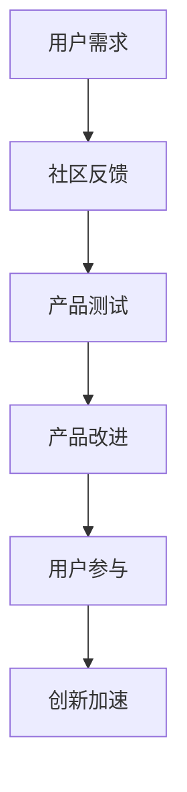
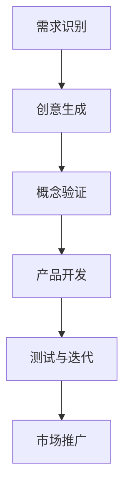

                 

### 文章标题：如何利用用户社区促进产品创新

关键词：用户社区、产品创新、用户反馈、共创活动、用户参与设计

摘要：本文从用户社区与产品创新的关系出发，详细阐述了如何利用用户社区促进产品创新的方法和策略。通过用户反馈、共创活动和用户参与设计等手段，企业可以更好地了解用户需求，加速产品迭代，提升产品品质，从而在激烈的市场竞争中脱颖而出。

----------------------------------------------------------------

#### 第一部分：用户社区与产品创新概述

##### 第1章：用户社区的基本概念与重要性

**1.1 用户社区的定义与类型**

用户社区是指由一组对某个产品、服务或主题有共同兴趣、需求或目标的用户组成的群体。这些用户通过在线论坛、社交媒体、博客等平台进行交流和互动，共同分享经验和知识。

用户社区的类型多种多样，主要包括以下几种：

1. **基于兴趣或爱好的社区**：例如技术论坛、摄影社区等，用户因为共同的兴趣爱好而聚集在一起。
2. **域特定社区**：例如医疗健康论坛、电子商务社区等，用户因为特定的需求或领域而聚集在一起。
3. **基于地域或文化的社区**：例如城市论坛、文化社区等，用户因为地理位置或文化背景而聚集在一起。
4. **基于行业或职业的社区**：例如软件开发社区、市场营销社区等，用户因为行业或职业背景而聚集在一起。

**1.2 用户社区在产品创新中的作用**

用户社区在产品创新中发挥着至关重要的作用，主要体现在以下几个方面：

1. **信息源**：用户社区提供了丰富的用户反馈和需求信息，有助于产品团队深入了解用户需求，从而进行针对性的创新。

   $$
   \text{用户反馈} = \{f_1, f_2, ..., f_n\} \\
   \text{产品创新} = \{\text{需求分析}, \text{功能设计}, \text{用户体验}\}
   $$

2. **测试场**：用户社区提供了一个相对独立且真实的市场环境，可以帮助产品团队进行产品的测试和迭代，获取真实的用户反馈，降低产品开发风险。

   $$
   \text{测试与迭代} = \{\text{测试环境}, \text{用户反馈}, \text{产品改进}\}
   $$

3. **市场研究工具**：用户社区可以作为一个市场研究工具，帮助产品团队预测产品的市场潜力，制定相应的市场策略。

   $$
   \text{市场研究} = \{\text{用户需求分析}, \text{市场趋势分析}, \text{竞争对手分析}\}
   $$

**1.3 用户社区的优势分析**

用户社区在产品创新中的优势主要体现在以下几个方面：

1. **降低创新成本**：用户社区可以提供低成本的测试环境和反馈渠道，降低产品开发的成本。

   $$
   \text{成本降低} = \{\text{用户测试}, \text{反馈收集}, \text{改进实施}\}
   $$

2. **提高创新效率**：用户社区可以快速响应市场变化，提供及时有效的反馈，提高产品创新的效率。

   $$
   \text{创新效率} = \{\text{市场变化检测}, \text{用户反馈处理}, \text{产品迭代}\}
   $$

3. **增强用户忠诚度**：用户社区的参与感可以增强用户的品牌忠诚度，为产品带来长期的收益。

   $$
   \text{用户忠诚度} = \{\text{用户参与度}, \text{品牌认知度}, \text{用户留存率}\}
   $$

4. **提升产品品质**：用户社区的参与可以确保产品在功能、性能、用户体验等方面得到持续优化。

   $$
   \text{产品品质提升} = \{\text{功能完善}, \text{性能优化}, \text{用户体验优化}\}
   $$

**Mermaid 流程图：用户社区在产品创新中的作用**

----------------------------------------------------------------

在接下来的部分，我们将深入探讨产品创新的基本理论，并详细介绍如何利用用户社区进行产品创新的各种策略。通过具体的案例和实践，我们将帮助读者更好地理解并应用这些方法，以实现产品创新的目标。

### 第一部分：用户社区与产品创新概述

#### 第2章：产品创新的基本理论

**2.1 产品创新的概念与过程**

产品创新是指通过引入新的或改进的产品、服务、技术或业务模式，以满足市场需求、提高竞争力或创造新的价值。产品创新的过程通常包括以下几个阶段：

1. **需求识别**：通过市场调研、用户反馈等方式，识别潜在的市场需求和用户痛点。
2. **创意生成**：基于需求识别的结果，提出新的创意或改进方案。
3. **概念验证**：对创意进行初步验证，确定其可行性和市场潜力。
4. **产品开发**：进行详细设计和开发，将创意转化为实际产品。
5. **测试与迭代**：对产品进行测试和迭代，确保其满足市场需求和用户期望。
6. **市场推广**：将产品推向市场，进行推广和销售。

**2.2 产品创新的基本模型**

产品创新的基本模型包括以下几种：

1. **技术推动模型**：基于技术的进步和突破，推动产品的创新。
   $$
   \text{技术推动模型} = \{\text{技术创新}, \text{产品改进}, \text{市场应用}\}
   $$

2. **需求拉动模型**：基于用户需求和市场趋势，引导产品的创新。
   $$
   \text{需求拉动模型} = \{\text{市场需求分析}, \text{用户需求满足}, \text{产品创新}\}
   $$

3. **混合模型**：结合技术推动和需求拉动，实现产品的创新。
   $$
   \text{混合模型} = \{\text{技术创新}, \text{市场需求分析}, \text{产品改进}\}
   $$

**2.3 产品创新的关键要素**

产品创新的成功离不开以下几个关键要素：

1. **用户需求**：了解用户需求是产品创新的核心。只有深入了解用户需求，才能设计出满足用户期望的产品。
2. **技术创新**：技术的进步是推动产品创新的重要动力。通过技术创新，可以提高产品的性能、降低成本、提升用户体验。
3. **市场机会**：市场机会是产品创新的驱动因素。发现并把握市场机会，可以加速产品的商业化进程。
4. **资源整合**：产品创新需要跨部门、跨领域的资源整合。只有整合各类资源，才能实现产品创新的目标。
5. **团队协作**：产品创新需要团队的协作和共同努力。只有团队成员相互协作，才能高效完成产品创新任务。

**Mermaid 流�程图：产品创新的基本过程**

在理解了产品创新的基本理论后，我们将进一步探讨如何利用用户社区进行产品创新。在下一章中，我们将详细分析用户社区在产品创新中的作用，并介绍几种有效的利用用户社区促进产品创新的策略。

### 第二部分：利用用户社区促进产品创新的策略

#### 第3章：用户反馈与产品改进

**3.1 用户反馈的收集与处理**

用户反馈是产品改进的重要信息来源。通过有效的用户反馈收集和处理，企业可以更好地了解用户需求，及时发现问题并进行改进。以下是用户反馈收集与处理的步骤：

1. **确定反馈渠道**：选择合适的反馈渠道，如在线论坛、社交媒体、问卷调查等。不同的反馈渠道适用于不同的用户群体和场景。

   $$
   \text{反馈渠道} = \{\text{在线论坛}, \text{社交媒体}, \text{问卷调查}\}
   $$

2. **设计反馈机制**：设计简洁、易于操作的反馈机制，鼓励用户积极参与。例如，提供用户反馈模板、设置奖励机制等。

   $$
   \text{反馈机制} = \{\text{反馈模板}, \text{奖励机制}, \text{反馈流程}\}
   $$

3. **收集反馈数据**：定期收集和分析用户反馈数据，识别用户需求和问题。

   $$
   \text{反馈数据} = \{\text{用户需求}, \text{问题反馈}, \text{改进建议}\}
   $$

4. **处理反馈信息**：对收集到的反馈信息进行分类、优先级排序，制定改进计划。

   $$
   \text{处理反馈信息} = \{\text{分类}, \text{排序}, \text{改进计划}\}
   $$

**3.2 用户反馈驱动的产品改进流程**

用户反馈驱动的产品改进流程包括以下几个步骤：

1. **需求分析**：根据用户反馈，分析用户需求，确定产品改进的方向。

   $$
   \text{需求分析} = \{\text{用户需求}, \text{市场趋势}, \text{技术可行性}\}
   $$

2. **创意生成**：基于需求分析结果，提出改进方案或创新点。

   $$
   \text{创意生成} = \{\text{功能改进}, \text{用户体验优化}, \text{业务模式创新}\}
   $$

3. **概念验证**：对创意进行初步验证，评估其可行性。

   $$
   \text{概念验证} = \{\text{原型设计}, \text{用户测试}, \text{反馈收集}\}
   $$

4. **产品开发**：根据验证结果，进行详细设计和开发。

   $$
   \text{产品开发} = \{\text{功能设计}, \text{界面设计}, \text{开发实施}\}
   $$

5. **测试与迭代**：对产品进行测试和迭代，确保改进措施的有效性。

   $$
   \text{测试与迭代} = \{\text{功能测试}, \text{性能测试}, \text{用户体验测试}\}
   $$

6. **市场推广**：将改进后的产品推向市场，进行推广和销售。

   $$
   \text{市场推广} = \{\text{营销策略}, \text{渠道推广}, \text{销售促进}\}
   $$

**3.3 用户反馈驱动的产品改进案例分析**

以下是一个用户反馈驱动的产品改进案例：

- **案例背景**：某企业开发了一款智能助手应用，用户在使用过程中反馈了一些功能问题，如响应速度慢、功能不完善等。

- **需求分析**：通过对用户反馈的分析，发现用户最关注的是应用的速度和功能的完整性。

- **创意生成**：针对用户反馈，企业决定优化应用的响应速度，增加新的功能，提高用户体验。

- **概念验证**：企业设计了一个原型，进行了用户测试，发现优化后的应用在速度和功能方面得到了用户的认可。

- **产品开发**：企业根据用户测试结果，进行了详细的设计和开发，优化了应用性能，增加了新功能。

- **测试与迭代**：企业在内部进行了多轮测试，确保应用性能和功能的稳定性。

- **市场推广**：企业将优化后的应用推向市场，通过营销策略和渠道推广，取得了良好的市场反响。

通过这个案例，我们可以看到用户反馈在产品改进过程中的重要作用。企业通过有效收集和处理用户反馈，及时发现问题并进行改进，从而提高了产品的市场竞争力。

在下一章中，我们将探讨用户共创与产品设计的方法，并分析如何通过用户共创活动实现产品创新。

### 第4章：用户共创与产品设计

**4.1 用户共创的概念与原则**

用户共创是指企业通过开放合作的方式，邀请用户参与到产品设计和开发的过程中，共同创造和改进产品。用户共创的核心在于充分发挥用户的创造力，实现产品与用户需求的完美结合。以下是用户共创的一些基本原则：

1. **开放性**：企业应开放产品设计和开发过程，让用户能够充分了解产品的各个方面，并提供反馈和建议。

   $$
   \text{开放性} = \{\text{透明度}, \text{互动性}, \text{参与度}\}
   $$

2. **合作性**：用户和企业在共创过程中应建立合作关系，共同面对挑战和解决问题。

   $$
   \text{合作性} = \{\text{互信}, \text{协作}, \text{共赢}\}
   $$

3. **创新性**：用户共创应鼓励创新思维，通过多样化的观点和解决方案，推动产品创新。

   $$
   \text{创新性} = \{\text{创意生成}, \text{解决方案}, \text{创新文化}\}
   $$

**4.2 用户共创活动的设计与实施**

用户共创活动的设计与实施是确保共创过程顺利进行的关键。以下是用户共创活动的一些常见类型和实施步骤：

1. **用户研讨会**：通过组织用户研讨会，邀请用户代表参与讨论，共同探讨产品需求和改进方案。

   $$
   \text{用户研讨会} = \{\text{主题讨论}, \text{反馈收集}, \text{决策制定}\}
   $$

2. **用户调研**：通过在线调研、电话访谈等方式，收集用户的真实需求和意见，为产品改进提供依据。

   $$
   \text{用户调研} = \{\text{调研工具}, \text{数据分析}, \text{反馈报告}\}
   $$

3. **用户测试**：邀请用户参与产品的测试，收集用户反馈，验证产品功能和用户体验。

   $$
   \text{用户测试} = \{\text{测试环境}, \text{测试工具}, \text{反馈分析}\}
   $$

4. **用户共创工作坊**：通过用户共创工作坊，让用户与企业团队成员一起工作，共同设计和改进产品。

   $$
   \text{用户共创工作坊} = \{\text{工作流程}, \text{共创工具}, \text{成果展示}\}
   $$

**实施步骤**：

1. **确定共创目标**：明确共创活动的主要目标和预期成果，为后续活动提供方向。

   $$
   \text{共创目标} = \{\text{用户需求分析}, \text{产品改进目标}, \text{创新文化建设}\}
   $$

2. **设计共创活动**：根据共创目标，设计具体的共创活动方案，包括活动类型、时间、地点、参与人员等。

   $$
   \text{共创活动设计} = \{\text{活动类型}, \text{活动时间}, \text{参与人员}, \text{活动流程}\}
   $$

3. **准备共创资源**：准备好共创所需的工具、设备、资料等，确保共创活动的顺利进行。

   $$
   \text{共创资源准备} = \{\text{会议场地}, \text{演示工具}, \text{共创工具}, \text{调研问卷}\}
   $$

4. **邀请用户参与**：通过多种渠道邀请用户参与共创活动，确保用户的广泛参与和代表性。

   $$
   \text{用户邀请} = \{\text{邀请渠道}, \text{邀请对象}, \text{邀请方式}, \text{参与反馈}\}
   $$

5. **实施共创活动**：按照活动方案，组织并实施共创活动，确保用户与企业团队成员的有效互动和协作。

   $$
   \text{共创活动实施} = \{\text{活动组织}, \text{用户参与}, \text{互动交流}, \text{活动记录}\}
   $$

6. **收集共创成果**：对共创活动进行总结和评估，收集共创的成果和用户反馈，为产品改进提供参考。

   $$
   \text{共创成果收集} = \{\text{反馈报告}, \text{改进方案}, \text{成果展示}, \text{后续行动}\}
   $$

**4.3 用户共创案例研究**

以下是一个用户共创的案例：

- **案例背景**：某企业开发了一款智能家居产品，希望通过用户共创活动，提高产品的用户体验和功能完善度。

- **共创目标**：通过用户共创，了解用户对智能家居产品的需求，收集用户反馈，优化产品功能和用户体验。

- **共创活动设计**：企业组织了一次用户共创工作坊，邀请了30名用户代表参与。活动分为三个阶段：需求调研、功能讨论、原型设计。

- **共创活动实施**：在用户共创工作坊中，用户与企业团队成员进行了深入的互动和交流，共同讨论了产品的需求和建议。企业团队根据用户的反馈，进行了详细的功能设计和原型制作。

- **共创成果收集**：共创活动结束后，企业收集了用户的反馈和建议，整理了一份详细的报告。根据报告，企业进行了产品的优化和改进，并再次邀请用户进行测试和反馈。

- **后续行动**：企业根据用户的反馈，持续优化产品功能，并在后续的产品迭代中，继续邀请用户参与共创活动，实现了产品与用户需求的良性互动。

通过这个案例，我们可以看到用户共创在产品创新中的重要作用。企业通过开放合作的方式，充分发挥用户的创造力，实现了产品与用户需求的完美结合，提高了产品的市场竞争力。

在下一章中，我们将探讨用户参与设计与产品创新的关系，并介绍用户参与设计的流程和方法。

### 第5章：用户参与与产品设计

**5.1 用户参与设计的理论与实践**

用户参与设计（User-Participation Design，UPD）是一种将用户融入产品设计和开发过程中的方法，旨在确保产品设计满足用户的需求和期望。用户参与设计的理论基础主要包括以下几个方面：

1. **用户体验中心论**：用户体验是产品设计的核心，用户参与设计可以确保产品设计真正满足用户的需求。

   $$
   \text{用户体验中心论} = \{\text{用户需求}, \text{用户体验}, \text{产品设计}\}
   $$

2. **社会建构主义**：用户参与设计强调用户和设计师之间的互动和合作，通过共同构建产品知识，提高产品设计的有效性。

   $$
   \text{社会建构主义} = \{\text{用户参与}, \text{互动合作}, \text{知识构建}\}
   $$

3. **服务设计思维**：用户参与设计强调将用户融入整个服务流程中，从需求识别、产品设计到使用反馈，实现产品与服务的无缝衔接。

   $$
   \text{服务设计思维} = \{\text{用户参与}, \text{服务流程}, \text{产品优化}\}
   $$

**5.2 用户参与设计的流程与方法**

用户参与设计的过程可以分为以下几个阶段：

1. **需求识别**：通过市场调研、用户访谈、问卷调查等方式，了解用户的需求和痛点。

   $$
   \text{需求识别} = \{\text{市场调研}, \text{用户访谈}, \text{问卷调查}\}
   $$

2. **设计草案**：根据需求识别的结果，设计出初步的产品原型和设计方案。

   $$
   \text{设计草案} = \{\text{原型设计}, \text{方案制定}, \text{设计评审}\}
   $$

3. **用户反馈**：将设计草案展示给用户，收集用户的反馈和建议。

   $$
   \text{用户反馈} = \{\text{用户测试}, \text{反馈收集}, \text{问题识别}\}
   $$

4. **设计迭代**：根据用户的反馈，对设计进行修改和优化，形成最终的设计方案。

   $$
   \text{设计迭代} = \{\text{方案修改}, \text{用户测试}, \text{最终设计}\}
   $$

5. **产品开发**：根据最终的设计方案，进行产品的开发和生产。

   $$
   \text{产品开发} = \{\text{开发实施}, \text{质量控制}, \text{生产上线}\}
   $$

用户参与设计的方法主要包括以下几种：

1. **用户访谈**：通过与用户进行一对一的深入访谈，了解用户的需求和痛点。

   $$
   \text{用户访谈} = \{\text{访谈计划}, \text{访谈记录}, \text{数据整理}\}
   $$

2. **用户测试**：邀请用户参与产品的测试，收集用户的反馈和建议。

   $$
   \text{用户测试} = \{\text{测试计划}, \text{测试环境}, \text{反馈收集}\}
   $$

3. **用户共创**：组织用户参与产品设计的过程，共同讨论和解决问题。

   $$
   \text{用户共创} = \{\text{共创活动}, \text{用户参与}, \text{合作设计}\}
   $$

4. **用户调查**：通过问卷调查等方式，收集用户的需求和反馈。

   $$
   \text{用户调查} = \{\text{问卷设计}, \text{数据收集}, \text{数据分析}\}
   $$

**5.3 用户参与设计的成功案例**

以下是一个用户参与设计的成功案例：

- **案例背景**：某企业开发了一款智能家居产品，希望通过用户参与设计，提高产品的用户体验和满意度。

- **需求识别**：企业通过用户访谈和问卷调查，收集了用户对智能家居产品的需求和期望，主要包括：方便的控制方式、智能化的功能、美观的设计等。

- **设计草案**：根据用户需求，企业设计了一款智能家居产品的初步原型，包括智能控制中心、智能灯光、智能音响等功能。

- **用户反馈**：企业将设计草案展示给用户，邀请用户参与测试和反馈。用户对产品的控制方式、功能布局和设计风格提出了很多宝贵的意见和建议。

- **设计迭代**：根据用户的反馈，企业对产品设计进行了多次修改和优化，最终形成了一款用户满意度高的智能家居产品。

- **产品开发**：企业根据最终的设计方案，进行了产品的开发和生产，并在市场上取得了良好的销售业绩。

通过这个案例，我们可以看到用户参与设计在产品创新中的重要作用。企业通过用户参与设计，不仅能够更好地满足用户的需求，提高产品的市场竞争力，还能够增强用户的参与感和满意度，实现产品与用户的共赢。

在下一章中，我们将探讨用户社区管理与产品创新的关系，并介绍用户社区管理的核心要素和策略。

### 第6章：用户社区管理与产品创新

**6.1 用户社区管理的核心要素**

用户社区管理是确保用户社区健康、活跃和持续发展的关键。以下是一些用户社区管理的核心要素：

1. **社区文化**：建立积极、友好、开放的社区文化，鼓励用户分享、互动和贡献。

   $$
   \text{社区文化} = \{\text{开放性}, \text{互助性}, \text{友好性}\}
   $$

2. **社区规则**：制定明确的社区规则，规范用户行为，维护社区秩序。

   $$
   \text{社区规则} = \{\text{行为规范}, \text{言论自由}, \text{版权保护}\}
   $$

3. **社区活动**：定期组织社区活动，如线上讨论、线下聚会、比赛等，增强用户粘性和活跃度。

   $$
   \text{社区活动} = \{\text{讨论活动}, \text{聚会活动}, \text{比赛活动}\}
   $$

4. **用户激励**：通过奖励机制、积分系统等方式，激励用户积极参与社区互动和贡献。

   $$
   \text{用户激励} = \{\text{奖励机制}, \text{积分系统}, \text{贡献奖励}\}
   $$

5. **社区运营**：建立专业的社区运营团队，负责社区内容管理、用户互动、活动策划等。

   $$
   \text{社区运营} = \{\text{内容管理}, \text{用户互动}, \text{活动策划}\}
   $$

**6.2 用户社区管理策略与实践**

以下是一些用户社区管理策略和实践：

1. **内容管理**：

   - **内容审核**：定期审核社区内容，确保内容符合社区规则和法律法规。
   - **内容推送**：根据用户兴趣和需求，推送有价值的内容，提高用户粘性。
   - **内容互动**：鼓励用户参与内容创作和评论，增加社区互动性。

   $$
   \text{内容管理} = \{\text{内容审核}, \text{内容推送}, \text{内容互动}\}
   $$

2. **用户互动**：

   - **互动激励**：通过奖励机制，激励用户参与社区互动。
   - **话题引导**：组织有针对性的话题讨论，引导用户积极参与。
   - **用户反馈**：及时收集用户反馈，改进社区服务和产品。

   $$
   \text{用户互动} = \{\text{互动激励}, \text{话题引导}, \text{用户反馈}\}
   $$

3. **活动策划**：

   - **活动类型**：根据社区特点和用户需求，策划多样化的活动，如线上讨论、线下聚会、比赛等。
   - **活动宣传**：通过社区渠道、社交媒体等，宣传活动信息，提高活动知名度。
   - **活动执行**：确保活动顺利进行，提高用户参与度和满意度。

   $$
   \text{活动策划} = \{\text{活动类型}, \text{活动宣传}, \text{活动执行}\}
   $$

**6.3 用户社区管理的挑战与解决方案**

用户社区管理面临一些挑战，如用户活跃度低、内容质量差、社区氛围不良等。以下是一些解决方案：

1. **提升用户活跃度**：

   - **内容质量**：提高社区内容的质量，吸引更多用户参与。
   - **互动激励**：增加互动激励机制，鼓励用户积极参与社区互动。
   - **用户引导**：通过新手教程、互动指南等方式，引导用户快速融入社区。

   $$
   \text{活跃度提升} = \{\text{内容质量}, \text{互动激励}, \text{用户引导}\}
   $$

2. **改善内容质量**：

   - **内容审核**：加强社区内容审核，确保内容符合社区规则和法律法规。
   - **内容推荐**：根据用户兴趣和需求，推荐有价值的内容，提高内容质量。
   - **用户监督**：鼓励用户举报不良内容，共同维护社区质量。

   $$
   \text{内容质量改善} = \{\text{内容审核}, \text{内容推荐}, \text{用户监督}\}
   $$

3. **营造良好社区氛围**：

   - **社区文化**：建立积极、友好、开放的社区文化，鼓励用户分享、互动和贡献。
   - **规则制定**：明确社区规则，规范用户行为，维护社区秩序。
   - **社区监督**：设立社区监督员，负责监督社区行为，维护社区氛围。

   $$
   \text{社区氛围营造} = \{\text{社区文化}, \text{规则制定}, \text{社区监督}\}
   $$

通过有效的用户社区管理，企业可以打造一个健康、活跃和有价值的用户社区，从而更好地促进产品创新。

在下一章中，我们将通过实际案例展示如何利用用户社区进行产品创新，并分析这些案例的成功经验和教训。

### 第7章：利用用户社区进行产品创新的实战案例

**7.1 案例一：如何通过用户社区改进产品功能**

**案例背景**：某知名互联网公司开发了一款办公协作工具，但用户反馈中提到的一些功能不够完善，如文件共享速度慢、文件管理复杂等。为了提高用户满意度，公司决定通过用户社区收集用户反馈，改进产品功能。

**实施过程**：

1. **用户反馈收集**：公司通过在线论坛、社交媒体和用户问卷调查等多种渠道，收集用户对产品功能的建议和意见。

   $$
   \text{反馈渠道} = \{\text{在线论坛}, \text{社交媒体}, \text{问卷调查}\}
   $$

2. **反馈处理**：公司对收集到的用户反馈进行分类、优先级排序，并根据用户需求制定改进计划。

   $$
   \text{反馈处理} = \{\text{分类}, \text{排序}, \text{改进计划}\}
   $$

3. **功能改进**：公司根据用户反馈，对产品功能进行改进，如优化文件共享速度、简化文件管理流程等。

   $$
   \text{功能改进} = \{\text{文件共享优化}, \text{文件管理简化}\}
   $$

4. **用户测试**：公司邀请用户参与功能改进的测试，收集用户的反馈和意见。

   $$
   \text{用户测试} = \{\text{测试环境}, \text{测试工具}, \text{反馈收集}\}
   $$

5. **反馈迭代**：根据用户测试结果，公司对功能改进进行迭代和优化，确保改进措施的有效性。

   $$
   \text{反馈迭代} = \{\text{测试与优化}, \text{用户反馈处理}, \text{功能更新}\}
   $$

**案例结果**：通过用户社区收集用户反馈，公司成功改进了产品的功能，提高了用户满意度。产品在市场上取得了良好的口碑，用户活跃度和留存率显著提高。

**成功经验**：

1. **及时响应**：公司能够迅速收集和处理用户反馈，及时改进产品功能，满足了用户的需求。
2. **用户参与**：用户在产品改进过程中积极参与，提供了宝贵的建议和意见，增强了用户对产品的认同感。
3. **持续迭代**：公司持续收集用户反馈，对产品进行迭代和优化，确保产品始终处于最佳状态。

**7.2 案例二：如何利用用户共创实现产品创新**

**案例背景**：某互联网公司希望推出一款全新的智能家居产品，但市场调研和用户需求分析表明，现有的智能家居产品功能过于复杂，用户体验不佳。为了实现产品创新，公司决定通过用户共创活动，与用户共同探讨和设计智能家居产品。

**实施过程**：

1. **共创活动设计**：公司组织了一次用户共创工作坊，邀请了30名用户代表参与。活动分为三个阶段：需求调研、功能讨论、原型设计。

   $$
   \text{共创活动设计} = \{\text{需求调研}, \text{功能讨论}, \text{原型设计}\}
   $$

2. **用户参与**：用户在共创工作坊中积极参与讨论，提出了许多创新的功能和设计理念。

   $$
   \text{用户参与} = \{\text{讨论活动}, \text{互动交流}, \text{合作设计}\}
   $$

3. **原型设计**：根据用户的反馈和需求，公司设计了一款智能家居产品的原型，并邀请用户进行测试和反馈。

   $$
   \text{原型设计} = \{\text{功能设计}, \text{界面设计}, \text{原型测试}\}
   $$

4. **反馈迭代**：根据用户测试结果，公司对产品设计进行了多次迭代和优化，确保产品功能完善、用户体验良好。

   $$
   \text{反馈迭代} = \{\text{用户测试}, \text{反馈收集}, \text{功能优化}\}
   $$

**案例结果**：通过用户共创活动，公司成功设计出了一款用户体验极佳的智能家居产品。产品在市场上取得了巨大成功，用户满意度大幅提高。

**成功经验**：

1. **开放合作**：公司通过用户共创活动，充分发挥了用户的创造力，实现了产品与用户需求的完美结合。
2. **持续迭代**：公司持续收集用户反馈，对产品进行迭代和优化，确保产品始终处于最佳状态。
3. **用户参与**：用户在产品设计和开发过程中全程参与，增强了用户对产品的认同感和忠诚度。

**7.3 案例三：如何通过用户参与设计提升产品体验**

**案例背景**：某科技公司推出了一款智能手表，用户反馈中提到操作复杂、交互不友好。为了提升产品体验，公司决定通过用户参与设计，优化智能手表的操作界面和交互设计。

**实施过程**：

1. **用户调研**：公司通过用户访谈和问卷调查，收集用户对智能手表操作的反馈和需求。

   $$
   \text{用户调研} = \{\text{用户访谈}, \text{问卷调查}, \text{需求分析}\}
   $$

2. **设计草案**：根据用户调研结果，公司设计了一款新的智能手表界面和交互设计草案。

   $$
   \text{设计草案} = \{\text{界面设计}, \text{交互设计}, \text{用户评审}\}
   $$

3. **用户测试**：公司邀请用户参与测试，收集用户的反馈和建议。

   $$
   \text{用户测试} = \{\text{测试环境}, \text{测试工具}, \text{反馈收集}\}
   $$

4. **设计迭代**：根据用户测试结果，公司对界面设计和交互设计进行多次迭代和优化，确保用户体验良好。

   $$
   \text{设计迭代} = \{\text{用户测试}, \text{反馈处理}, \text{功能更新}\}
   $$

**案例结果**：通过用户参与设计，公司成功优化了智能手表的操作界面和交互设计，用户满意度大幅提高。

**成功经验**：

1. **用户参与**：用户在产品设计过程中全程参与，提供了宝贵的反馈和建议，确保产品设计满足用户需求。
2. **持续迭代**：公司持续收集用户反馈，对产品设计进行迭代和优化，确保用户体验始终处于最佳状态。
3. **重视反馈**：公司重视用户反馈，及时处理和回应用户的问题，增强了用户对品牌的信任和忠诚度。

通过以上实战案例，我们可以看到，利用用户社区进行产品创新具有显著的优势。企业通过用户社区收集用户反馈、进行共创活动和用户参与设计，能够更好地满足用户需求，提高产品品质，从而在激烈的市场竞争中脱颖而出。

### 第四部分：附录与资源

#### 附录1：用户社区建设工具

1. **论坛系统**：如Discourse、phpBB等，适用于构建基于论坛的讨论社区。
2. **社交媒体平台**：如Facebook、Twitter等，适用于搭建以社交互动为主的社区。
3. **专业社区平台**：如 slack、trello等，适用于团队协作和项目管理。

#### 附录2：产品创新方法论参考

1. **TRIZ**：一种基于矛盾解决的创新方法，适用于解决复杂问题。
2. **设计思考**：一种以用户为中心的创新方法，强调用户研究和原型设计。
3. **开放式创新**：一种将外部创意和资源引入产品开发的方法。

#### 附录3：相关研究文献推荐

1. **《用户参与设计：理论与实践》**：介绍了用户参与设计的方法和应用。
2. **《用户社区管理：策略与实践》**：探讨了用户社区的建设和管理方法。
3. **《产品创新与管理》**：系统阐述了产品创新的理论和实践。

### 结语

本文通过详细的案例分析和理论探讨，展示了如何利用用户社区促进产品创新。用户社区在产品创新中具有重要作用，通过用户反馈、共创活动和用户参与设计，企业可以更好地满足用户需求，提高产品品质，从而实现产品创新。我们希望本文能够为读者提供有价值的参考和启示，助力企业在激烈的市场竞争中取得成功。

### 作者信息

**作者：AI天才研究院/AI Genius Institute & 禅与计算机程序设计艺术 /Zen And The Art of Computer Programming**

本文由AI天才研究院撰写，AI天才研究院致力于推动人工智能技术的发展和普及。同时，作者还著有《禅与计算机程序设计艺术》，深入探讨了计算机编程的哲学和艺术。感谢您的阅读和支持。

