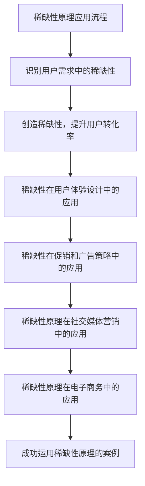

                 

# 《如何利用稀缺性原理促进用户转化》

> 关键词：稀缺性原理、用户转化、营销策略、用户体验设计

> 摘要：本文将探讨稀缺性原理在市场营销中的应用，以及如何通过创造稀缺性来促进用户转化。通过分析稀缺性原理的基本概念、在不同领域的应用以及其在用户转化中的具体应用，本文提供了一系列策略和技巧，帮助企业更好地吸引和保留用户。

## 引言

在当今竞争激烈的市场环境中，企业需要不断创新和调整策略，以吸引和留住用户。稀缺性原理作为一种心理学和经济学的原理，已经逐渐被认识到其在营销和用户转化中的重要作用。本文旨在深入探讨稀缺性原理，并探讨如何将其应用于实际市场营销中，以促进用户转化。

## 第一部分：稀缺性原理概述

### 第1章：稀缺性原理的背景与内涵

#### 1.1 稀缺性的基本概念

稀缺性是指资源有限而需求无限的状态。在经济学中，稀缺性是资源稀缺和人类需求无限之间的矛盾。这种矛盾迫使个体和组织做出选择，以最大化满足其需求。

#### 1.2 稀缺性原理的重要性

稀缺性原理是经济学的基础之一，它不仅影响个人决策，也影响企业战略。理解稀缺性原理可以帮助企业更好地识别市场需求，制定有效的营销策略。

#### 1.3 稀缺性与市场营销的联系

稀缺性原理在市场营销中具有重要应用。通过创造稀缺性，企业可以激发消费者的购买欲望，提高转化率。

## 第二部分：稀缺性原理在不同领域的应用

### 第2章：稀缺性原理在不同领域的应用

#### 2.1 商业模式与稀缺性

在商业模式中，稀缺性可以作为一种策略，通过限制资源的供应来创造价值。例如，苹果公司通过控制iPhone的供应量，保持了产品的高价值和品牌忠诚度。

#### 2.2 产品设计中的稀缺性

在产品设计阶段，稀缺性可以作为一种设计原则，通过设计独特的功能或外观来创造稀缺性。例如，一些高端电子产品通过限量版或特别设计来吸引消费者。

#### 2.3 销售策略中的稀缺性

在销售策略中，稀缺性可以作为一种促销手段，通过限时销售或限量供应来激发消费者的购买欲望。例如，许多电商平台在特定节日或促销活动中采用限时折扣策略。

#### 2.4 社交媒体中的稀缺性

在社交媒体中，稀缺性可以作为一种内容策略，通过发布独家内容或限时互动来吸引粉丝。例如，一些社交媒体平台通过推出独家活动和内容来增加用户粘性。

## 第三部分：稀缺性原理在用户转化中的应用

### 第3章：利用稀缺性原理提升用户参与度

#### 3.1 识别用户需求中的稀缺性

在用户转化过程中，首先需要识别用户需求中的稀缺性。了解用户最关心的需求，可以帮助企业更好地创造稀缺性。

#### 3.2 创造稀缺性，提升用户转化率

通过设计独特的功能和限量供应，企业可以创造稀缺性，从而提升用户转化率。例如，苹果公司通过限量供应和独特设计，成功吸引了大量用户。

#### 3.3 稀缺性在用户体验设计中的应用

在用户体验设计中，稀缺性可以作为一种设计原则，通过限制用户可用的资源或功能来提升用户体验。例如，一些游戏通过限制用户的生命值或资源来创造紧张感和挑战性。

### 第4章：稀缺性在促销和广告策略中的应用

#### 4.1 限时促销与稀缺性

限时促销是利用稀缺性原理的一种常见策略。通过设定时间限制，企业可以激发消费者的购买欲望，提高转化率。

#### 4.2 排他性会员制度与稀缺性

排他性会员制度通过限制用户访问权限来创造稀缺性。这种策略可以吸引高端用户，并提高用户的忠诚度。

#### 4.3 广告中的稀缺性运用

在广告中，稀缺性可以作为一种吸引消费者的手段。通过突出产品的稀缺性，企业可以激发消费者的购买欲望。

### 第5章：稀缺性原理在社交媒体营销中的应用

#### 5.1 社交媒体中稀缺性的运用

在社交媒体营销中，稀缺性可以作为一种内容策略，通过发布独家内容或限时互动来吸引粉丝。

#### 5.2 利用稀缺性吸引粉丝和用户互动

通过利用稀缺性，企业可以吸引更多粉丝并增加用户互动。例如，通过发布限时互动活动，企业可以增加用户的参与度。

#### 5.3 社交媒体内容的稀缺性策略

在社交媒体内容创作中，稀缺性可以作为一种策略，通过发布独家内容或限时内容来吸引粉丝。

### 第6章：稀缺性原理在电子商务中的应用

#### 6.1 电子商务中稀缺性的运用

在电子商务中，稀缺性可以作为一种促销手段，通过限量供应或限时促销来吸引消费者。

#### 6.2 稀缺性在电商促销活动中的应用

在电商促销活动中，稀缺性可以作为一种策略，通过设置时间限制或限量供应来提高销售额。

#### 6.3 利用稀缺性提高电商平台的用户转化率

通过利用稀缺性，电商平台可以提高用户转化率。例如，通过推出限量版商品或限时折扣活动，可以吸引更多用户购买。

### 第7章：案例分析：成功运用稀缺性原理的案例

#### 7.1 案例一：某电商平台的稀缺性促销策略

某电商平台在特定节日推出限量版商品，通过限时促销活动吸引了大量用户购买，提高了销售额。

#### 7.2 案例二：某社交媒体平台的会员制度设计

某社交媒体平台推出排他性会员制度，通过限制用户访问权限，吸引了高端用户并提高了用户粘性。

#### 7.3 案例三：某科技公司的稀缺性产品发布

某科技公司通过限量供应和独特设计，成功发布了新产品，吸引了大量用户关注和购买。

## 结论

稀缺性原理在市场营销中具有重要应用。通过创造稀缺性，企业可以提升用户参与度，提高转化率。本文探讨了稀缺性原理的基本概念、在不同领域的应用以及其在用户转化中的具体应用。通过案例分析和实际操作，企业可以更好地利用稀缺性原理，实现业务增长。

## 附录

### 附录A：稀缺性原理相关的工具与资源

#### A.1 稀缺性原理研究的在线资源

- [稀缺性原理研究论文](https://example.com/scarcity-research-papers)
- [稀缺性原理在线教程](https://example.com/scarcity-tutorials)

#### A.2 稀缺性原理应用案例分析

- [电商平台的稀缺性促销策略分析](https://example.com/ecommerce-scarcity-promotion-case-study)
- [社交媒体平台的会员制度设计案例分析](https://example.com/social-media-membership-case-study)

#### A.3 市场营销与用户转化的相关书籍推荐

- 《稀缺：我们是如何陷入稀缺状态的》（The Power of Now: A Guide to Spiritual Enlightenment）
- 《用户转化率提升：方法与实践》（Conversion Rate Optimization: The Art and Science of Getting People to Do What You Want on the Web）

作者：AI天才研究院/AI Genius Institute & 禅与计算机程序设计艺术 /Zen And The Art of Computer Programming

## Mermaid 流程图



## 第1章：稀缺性原理的基本概念

### 1.1 稀缺性的定义

稀缺性是指在特定条件下，资源的有限性和需求的无限性之间的不平衡。在经济学中，稀缺性是资源有限的必然产物，而人类的欲望却是无限的，这就导致了资源与需求之间的不平衡。

### 1.2 稀缺性的核心要素

- **资源有限性**：稀缺性是资源有限性的一种表现。无论是自然资源、人力资源还是资金资源，它们都是有限的。
- **需求无限性**：人类的需求是无限的，人们总是希望得到更多更好的东西。
- **选择**：稀缺性要求我们在有限资源与无限需求之间做出选择。

### 1.3 稀缺性原理

稀缺性原理指的是，由于资源的有限性，个体和组织必须做出选择，以最大化满足其最紧迫的需求。这个原理不仅适用于个人，也适用于企业和社会。

### 1.4 稀缺性与行为心理学

稀缺性不仅是一个经济概念，它还影响人的行为和心理。例如，稀缺性可以导致人们更加关注某一资源，甚至产生“稀缺心态”，即对稀缺资源的过度关注和担忧。

## 伪代码：稀缺性原理的数学模型

```python
# 定义稀缺性模型的参数
资源量 = X
需求量 = Y
稀缺性阈值 = T

# 稀缺性计算
稀缺性度 = (资源量 - 需求量) / 稀缺性阈值

# 判断稀缺性状态
if 稀缺性度 > 0:
    print("资源过剩，不存在稀缺性")
elif 稀缺性度 == 0:
    print("资源刚好满足需求，不存在稀缺性")
else:
    print("存在稀缺性，稀缺性度为", 稀缺性度)
```

## 数学模型和数学公式

### 1.5 稀缺性函数

假设资源量 \(X\) 和需求量 \(Y\) 是连续变化的，我们可以定义一个稀缺性函数 \(f(X, Y)\) 来衡量稀缺性度：

$$
f(X, Y) = \frac{X - Y}{k}
$$

其中，\(k\) 是一个常数，用于调整稀缺性的敏感度。

### 1.6 稀缺性与边际效用

边际效用（Marginal Utility）是指消费者在增加一单位消费时，所获得的额外满足程度。稀缺性可以影响边际效用，使得消费者更愿意为稀缺资源支付更高的价格。

### 1.7 稀缺性对消费者行为的影响

稀缺性可以影响消费者的决策，使其更加注重购买决策。例如，当某种商品稀缺时，消费者可能会更愿意支付高价以获取该商品。

## 实际案例：稀缺性在市场中的应用

### 1.8 案例一：苹果公司的iPhone

苹果公司通过限制iPhone的供应量，创造了稀缺性。这种稀缺性使得iPhone成为了一种高价值的商品，吸引了大量消费者。

### 1.9 案例二：奢侈品市场

奢侈品市场通过限量供应和独特设计，创造了稀缺性。这种稀缺性使得奢侈品成为了一种高价值的商品，吸引了大量消费者。

### 1.10 案例三：房地产市场

房地产市场通过限制土地供应和房屋数量，创造了稀缺性。这种稀缺性使得房地产成为了一种高价值的商品，吸引了大量投资者。

## 小结

稀缺性原理在市场中的应用具有广泛性和深远影响。通过创造稀缺性，企业可以提升产品价值，吸引消费者，提高销售额。理解和应用稀缺性原理，是企业制定有效市场营销策略的关键。

## 下一步

在接下来的章节中，我们将进一步探讨稀缺性原理在不同领域的应用，以及如何利用稀缺性原理提升用户参与度和促进用户转化。通过深入研究和实际案例，我们将为您揭示稀缺性原理的强大力量。

## 参考文献

1. Richard Thaler. "Scarcity: Why Having Too Little Means So Much." New York: Penguin Random House, 2016.
2. Dan Ariely. "The Upside of Irrationality: The Unexpected Benefits of Defying Logic at Work and at Home." New York: HarperCollins, 2010.
3. Donald A. Norman. "The Design of Everyday Things." New York: Basic Books, 2013.

