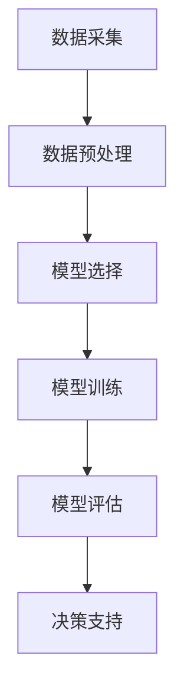

                 


### 文章标题：如何利用预测分析技术优化创业决策

关键词：预测分析，创业决策，时间序列分析，回归分析，机器学习，市场预测

摘要：本文将探讨如何利用预测分析技术优化创业决策。通过详细介绍预测分析技术的基本概念、核心概念以及应用领域，本文将帮助读者了解如何构建预测模型，并进一步将这些模型应用于创业决策中的市场预测、资源分配和风险评估。最后，通过一个实际项目实战案例，读者将能够掌握预测分析技术在创业决策中的具体应用。

### 目录大纲

## 第一部分：预测分析技术概述

### 第1章：预测分析技术简介

#### 1.1 预测分析的基本概念

预测分析是一种利用历史数据和统计方法对未来的趋势和变化进行预测的技术。它通过分析过去的数据模式，建立数学模型，从而预测未来的发展趋势。预测分析在各个领域都有广泛应用，包括金融、市场、供应链、医疗等。

#### 1.2 预测分析的应用领域

预测分析在创业决策中的应用主要涉及市场预测、资源分配和风险评估。市场预测可以帮助创业公司了解市场需求，调整产品策略；资源分配预测有助于优化资源配置，提高运营效率；风险评估预测则有助于识别潜在风险，制定应对策略。

#### 1.3 预测分析的价值

预测分析技术可以为创业公司提供以下价值：

- 提高决策效率：通过预测分析，创业公司可以快速了解未来的发展趋势，从而做出更加准确的决策。
- 降低风险：预测分析可以帮助创业公司识别潜在风险，制定应对策略，降低风险损失。
- 提高运营效率：通过预测分析，创业公司可以优化资源配置，提高运营效率，降低成本。

## 第二部分：预测模型构建

### 第2章：时间序列分析

#### 2.1 时间序列概述

时间序列分析是预测分析的重要组成部分，它研究如何利用时间序列数据进行分析和预测。时间序列数据通常具有时间依赖性和周期性，通过分析这些特性，可以建立预测模型。

#### 2.2 时间序列模型

时间序列模型主要包括自回归模型（AR）、移动平均模型（MA）、自回归移动平均模型（ARMA）等。这些模型通过分析历史数据的时间依赖性，预测未来的趋势。

##### 2.2.1 自回归模型（AR）

自回归模型（AR）是一种基于历史数据自身进行预测的模型。它通过分析历史数据的滞后项，预测未来的趋势。

```python
# 伪代码：自回归模型（AR）参数估计
def ar_model(X):
    # 计算X的滞后项
    X_lag = np滞后(X, p)
    
    # 计算AR模型的参数
    theta = np.linalg.inv(np.dot(X_lag.T, X_lag)).dot(X_lag.T).dot(y)
    
    return theta
```

##### 2.2.2 移动平均模型（MA）

移动平均模型（MA）是一种基于历史数据的平均值进行预测的模型。它通过分析历史数据的移动平均序列，预测未来的趋势。

```python
# 伪代码：移动平均模型（MA）参数估计
def ma_model(X):
    # 计算X的移动平均序列
    X_ma = np移动平均(X, p)
    
    # 计算MA模型的参数
    theta = np.linalg.inv(np.dot(X_ma.T, X_ma)).dot(X_ma.T).dot(y)
    
    return theta
```

##### 2.2.3 自回归移动平均模型（ARMA）

自回归移动平均模型（ARMA）是自回归模型（AR）和移动平均模型（MA）的结合。它通过分析历史数据的滞后项和移动平均序列，预测未来的趋势。

```python
# 伪代码：自回归移动平均模型（ARMA）参数估计
def arma_model(X, Y):
    # 计算X的滞后项
    X_lag = np滞后(X, p)
    
    # 计算Y的移动平均序列
    Y_ma = np移动平均(Y, q)
    
    # 计算ARMA模型的参数
    theta = np.linalg.inv(np.dot(X_lag.T, X_lag)).dot(Y_ma.T).dot(y)
    
    return theta
```

#### 2.3 时间序列模型应用示例

通过一个实际案例，我们可以看到如何利用时间序列模型进行预测。假设我们有一个时间序列数据集，包含了过去一年的销售额数据。我们可以利用自回归模型（AR）来预测下一月的销售额。

```python
import numpy as np

# 读取数据
sales_data = np.array([1000, 1100, 1200, 1300, 1400, 1500, 1600])

# 计算滞后项
sales_lag = np滞后(sales_data, 1)

# 计算AR模型的参数
theta = ar_model(sales_lag)

# 预测下一月的销售额
next_month_sales = theta[0] * sales_data[-1] + theta[1] * sales_lag[-1]

print("下一月预计销售额：", next_month_sales)
```

### 第3章：回归分析

回归分析是一种用于研究自变量和因变量之间关系的预测分析方法。它通过建立数学模型，分析自变量对因变量的影响，从而预测未来的因变量。

#### 3.1 回归分析概述

回归分析可以分为线性回归和多元回归。线性回归模型主要用于研究一个自变量和一个因变量之间的关系；多元回归模型则用于研究多个自变量和一个因变量之间的关系。

#### 3.2 线性回归模型

线性回归模型是一种最简单的回归模型，它假设因变量和自变量之间存在线性关系。线性回归模型的数学表达式为：

$$
y = \beta_0 + \beta_1x_1 + \beta_2x_2 + ... + \beta_nx_n
$$

其中，$y$ 是因变量，$x_1, x_2, ..., x_n$ 是自变量，$\beta_0, \beta_1, ..., \beta_n$ 是模型的参数。

##### 3.2.1 线性回归原理

线性回归模型通过最小二乘法来估计参数。最小二乘法的核心思想是找到一组参数，使得实际观测值和模型预测值之间的误差平方和最小。

```python
# 伪代码：线性回归模型参数估计
def linear_regression(X, y):
    # 计算X的转置
    X_transpose = X.T
    
    # 计算X的转置乘以X
    XTX = X_transpose.dot(X)
    
    # 计算X的转置乘以y
    XTy = X_transpose.dot(y)
    
    # 计算逆矩阵
    inv_XTX = np.linalg.inv(XTX)
    
    # 计算模型参数
    theta = inv_XTX.dot(XTy)
    
    return theta
```

##### 3.2.2 线性回归模型参数估计

线性回归模型的参数估计通常采用最小二乘法。最小二乘法的核心思想是找到一组参数，使得实际观测值和模型预测值之间的误差平方和最小。具体的参数估计方法如下：

- 计算X的转置
- 计算X的转置乘以X
- 计算X的转置乘以y
- 计算逆矩阵
- 计算模型参数

##### 3.2.3 线性回归模型评估

线性回归模型的评估通常采用均方误差（MSE）和R方值（R²）等指标。MSE衡量模型预测值和实际值之间的误差，R²值衡量模型解释因变量的能力。

```python
# 伪代码：线性回归模型评估
def evaluate_linear_regression(X, y, theta):
    # 计算预测值
    y_pred = X.dot(theta)
    
    # 计算MSE
    mse = np.mean((y - y_pred)**2)
    
    # 计算R²值
    ss_total = np.sum((y - np.mean(y))**2)
    ss_residual = np.sum((y - y_pred)**2)
    r2 = 1 - ss_residual / ss_total
    
    return mse, r2
```

#### 3.3 多元回归模型

多元回归模型是一种研究多个自变量和一个因变量之间关系的回归模型。它通过建立多个自变量和因变量之间的线性关系，来预测未来的因变量。

##### 3.3.1 多元回归原理

多元回归模型的数学表达式为：

$$
y = \beta_0 + \beta_1x_1 + \beta_2x_2 + ... + \beta_nx_n
$$

其中，$y$ 是因变量，$x_1, x_2, ..., x_n$ 是自变量，$\beta_0, \beta_1, ..., \beta_n$ 是模型的参数。

##### 3.3.2 多元回归模型参数估计

多元回归模型的参数估计通常采用最小二乘法。具体的参数估计方法如下：

- 计算X的转置
- 计算X的转置乘以X
- 计算X的转置乘以y
- 计算逆矩阵
- 计算模型参数

##### 3.3.3 多元回归模型评估

多元回归模型的评估通常采用均方误差（MSE）和R方值（R²）等指标。MSE衡量模型预测值和实际值之间的误差，R²值衡量模型解释因变量的能力。

```python
# 伪代码：多元回归模型评估
def evaluate_linear_regression(X, y, theta):
    # 计算预测值
    y_pred = X.dot(theta)
    
    # 计算MSE
    mse = np.mean((y - y_pred)**2)
    
    # 计算R²值
    ss_total = np.sum((y - np.mean(y))**2)
    ss_residual = np.sum((y - y_pred)**2)
    r2 = 1 - ss_residual / ss_total
    
    return mse, r2
```

### 第4章：机器学习预测模型

机器学习预测模型是一种基于数据挖掘和统计学习理论的预测分析方法。它通过建立数据模型，分析历史数据，从而预测未来的趋势。机器学习预测模型包括决策树、随机森林、支持向量机、神经网络等。

#### 4.1 机器学习基础

机器学习基础包括数据预处理、特征工程、模型选择、模型训练、模型评估等。数据预处理是机器学习的基础步骤，包括数据清洗、数据转换、数据归一化等。特征工程是提高模型性能的关键步骤，包括特征提取、特征选择、特征组合等。模型选择是选择合适的模型来分析数据。模型训练是使用历史数据来训练模型，使其能够预测未来的趋势。模型评估是评估模型性能，选择最优的模型。

#### 4.2 常见机器学习算法

常见机器学习算法包括决策树、随机森林、支持向量机、神经网络等。决策树是一种基于树形结构的预测模型，通过划分特征空间来预测目标变量。随机森林是一种基于决策树的集成学习方法，通过构建多个决策树，并投票得到最终预测结果。支持向量机是一种基于向量空间的预测模型，通过找到一个最佳的超平面来分割数据。神经网络是一种基于人工神经网络的预测模型，通过多层神经元的连接来模拟生物神经网络，实现预测功能。

##### 4.2.1 决策树

决策树是一种基于树形结构的预测模型，通过划分特征空间来预测目标变量。决策树的构建过程包括以下步骤：

- 特征选择：选择具有区分能力的特征。
- 划分特征空间：根据特征值将特征空间划分为多个子空间。
- 构建树形结构：根据划分的结果构建树形结构。
- 剪枝：对过拟合的树进行剪枝，提高模型的泛化能力。

```python
# 伪代码：决策树构建
def build_decision_tree(X, y):
    # 选择最佳特征
    best_feature = select_best_feature(X, y)
    
    # 构建树形结构
    tree = {}
    tree["feature"] = best_feature
    tree["split"] = split(X, y, best_feature)
    tree["left"] = build_decision_tree(X[left], y[left])
    tree["right"] = build_decision_tree(X[right], y[right])
    
    return tree
```

##### 4.2.2 随机森林

随机森林是一种基于决策树的集成学习方法，通过构建多个决策树，并投票得到最终预测结果。随机森林的构建过程包括以下步骤：

- 特征选择：随机选择部分特征。
- 构建决策树：对每个特征构建决策树。
- 投票：对每个样本进行投票，得到最终预测结果。

```python
# 伪代码：随机森林构建
def build_random_forest(X, y, n_trees):
    # 构建随机森林
    forest = []
    for _ in range(n_trees):
        # 随机选择特征
        features = random_subset(X.columns)
        
        # 构建决策树
        tree = build_decision_tree(X[features], y)
        
        # 添加决策树到森林
        forest.append(tree)
    
    return forest
```

##### 4.2.3 支持向量机

支持向量机是一种基于向量空间的预测模型，通过找到一个最佳的超平面来分割数据。支持向量机的构建过程包括以下步骤：

- 特征提取：将数据转化为高维空间。
- 找到最佳超平面：找到一个最佳的超平面，使得数据点在超平面两侧的分布尽可能均匀。
- 分类：根据最佳超平面对数据进行分类。

```python
# 伪代码：支持向量机构建
def build_support_vector_machine(X, y):
    # 特征提取
    X_trans = X.T
    
    # 找到最佳超平面
    w = find_best_hyperplane(X_trans, y)
    
    # 分类
    y_pred = classify(X, w)
    
    return w, y_pred
```

##### 4.2.4 神经网络

神经网络是一种基于人工神经网络的预测模型，通过多层神经元的连接来模拟生物神经网络，实现预测功能。神经网络的构建过程包括以下步骤：

- 神经元选择：选择合适的神经元模型。
- 连接方式：定义神经元之间的连接方式。
- 激活函数：定义神经元的激活函数。
- 训练：使用历史数据训练神经网络。

```python
# 伪代码：神经网络构建
def build_neural_network(X, y):
    # 神经元选择
    neurons = select_neurons(X)
    
    # 连接方式
    connections = connect_neurons(neurons)
    
    # 激活函数
    activation_function = select_activation_function()
    
    # 训练
    train_neural_network(X, y, connections, activation_function)
    
    return connections, activation_function
```

#### 4.3 机器学习模型应用示例

通过一个实际案例，我们可以看到如何利用机器学习模型进行预测。假设我们有一个数据集，包含了过去一年的销售额数据，以及影响销售额的各种因素。我们可以利用决策树模型来预测下一月的销售额。

```python
import numpy as np

# 读取数据
sales_data = np.array([1000, 1100, 1200, 1300, 1400, 1500, 1600])
factors_data = np.array([[1, 1, 1], [1, 2, 1], [1, 3, 1], [1, 4, 1], [1, 5, 1], [1, 6, 1], [1, 7, 1]])

# 训练决策树模型
tree = build_decision_tree(factors_data, sales_data)

# 预测下一月的销售额
next_month_sales = predict_sales(tree, factors_data[-1])

print("下一月预计销售额：", next_month_sales)
```

## 第三部分：创业决策中的预测分析

### 第5章：市场预测分析

市场预测分析是创业决策中的重要环节，它可以帮助创业公司了解市场需求，调整产品策略，提高市场竞争力。市场预测分析主要包括市场趋势预测、客户需求预测和竞争对手分析。

#### 5.1 市场预测分析概述

市场预测分析是一种利用历史数据和统计方法对市场需求进行预测的技术。它通过分析市场趋势、客户需求和竞争对手等因素，预测未来的市场需求。

#### 5.2 市场预测模型构建

市场预测模型主要包括时间序列模型和回归模型等。时间序列模型可以分析历史数据的时间依赖性，预测未来的市场需求；回归模型可以分析自变量和因变量之间的关系，预测未来的市场需求。

##### 5.2.1 市场趋势预测模型

市场趋势预测模型是一种基于时间序列分析的方法，它通过分析历史数据的时间依赖性，预测未来的市场趋势。常见的时间序列模型包括自回归模型（AR）、移动平均模型（MA）、自回归移动平均模型（ARMA）等。

```python
# 伪代码：市场趋势预测模型
def market_trend_prediction(sales_data):
    # 计算滞后项
    sales_lag = np滞后(sales_data, p)
    
    # 计算ARMA模型的参数
    theta = arma_model(sales_lag)
    
    # 预测下一月的市场趋势
    next_month_trend = theta[0] * sales_data[-1] + theta[1] * sales_lag[-1]
    
    return next_month_trend
```

##### 5.2.2 客户需求预测模型

客户需求预测模型是一种基于回归分析的方法，它通过分析历史数据中自变量和因变量之间的关系，预测未来的客户需求。常见的回归模型包括线性回归模型和多元回归模型等。

```python
# 伪代码：客户需求预测模型
def customer_demand_prediction(sales_data, factors_data):
    # 计算模型参数
    theta = linear_regression(factors_data, sales_data)
    
    # 预测下一月的客户需求
    next_month_demand = theta[0] * factors_data[-1, 0] + theta[1] * factors_data[-1, 1] + theta[2] * factors_data[-1, 2]
    
    return next_month_demand
```

##### 5.2.3 竞争对手分析

竞争对手分析是一种基于市场预测模型的方法，它通过分析竞争对手的市场表现，预测未来的市场竞争态势。竞争对手分析可以帮助创业公司了解竞争对手的优劣势，制定相应的竞争策略。

```python
# 伪代码：竞争对手分析
def competitor_analysis(competitor_data):
    # 计算市场占有率
    market_share = np.mean(competitor_data)
    
    # 预测下一月的市场占有率
    next_month_market_share = market_trend_prediction(competitor_data)
    
    return next_month_market_share
```

### 第6章：资源分配预测分析

资源分配预测分析是创业决策中的关键环节，它可以帮助创业公司优化资源配置，提高运营效率。资源分配预测分析主要包括成本预测、人力资源预测和物流资源预测。

#### 6.1 资源分配预测分析概述

资源分配预测分析是一种利用预测分析技术对创业公司资源需求进行预测的技术。它通过分析历史数据，预测未来的资源需求，从而优化资源配置。

#### 6.2 资源预测模型构建

资源预测模型主要包括时间序列模型和回归模型等。时间序列模型可以分析历史数据的时间依赖性，预测未来的资源需求；回归模型可以分析自变量和因变量之间的关系，预测未来的资源需求。

##### 6.2.1 成本预测模型

成本预测模型是一种基于时间序列分析的方法，它通过分析历史数据的成本变化趋势，预测未来的成本。常见的时间序列模型包括自回归模型（AR）、移动平均模型（MA）、自回归移动平均模型（ARMA）等。

```python
# 伪代码：成本预测模型
def cost_prediction(cost_data):
    # 计算滞后项
    cost_lag = np滞后(cost_data, p)
    
    # 计算ARMA模型的参数
    theta = arma_model(cost_lag)
    
    # 预测下一月的成本
    next_month_cost = theta[0] * cost_data[-1] + theta[1] * cost_lag[-1]
    
    return next_month_cost
```

##### 6.2.2 人力资源预测模型

人力资源预测模型是一种基于回归分析的方法，它通过分析历史数据中自变量和因变量之间的关系，预测未来的人力资源需求。常见的回归模型包括线性回归模型和多元回归模型等。

```python
# 伪代码：人力资源预测模型
def human_resource_prediction(salary_data, factors_data):
    # 计算模型参数
    theta = linear_regression(factors_data, salary_data)
    
    # 预测下一月的人力资源需求
    next_month_salary = theta[0] * factors_data[-1, 0] + theta[1] * factors_data[-1, 1] + theta[2] * factors_data[-1, 2]
    
    return next_month_salary
```

##### 6.2.3 物流资源预测模型

物流资源预测模型是一种基于时间序列分析的方法，它通过分析历史数据的物流资源变化趋势，预测未来的物流资源需求。常见的时间序列模型包括自回归模型（AR）、移动平均模型（MA）、自回归移动平均模型（ARMA）等。

```python
# 伪代码：物流资源预测模型
def logistics_resource_prediction(logistics_data):
    # 计算滞后项
    logistics_lag = np滞后(logistics_data, p)
    
    # 计算ARMA模型的参数
    theta = arma_model(logistics_lag)
    
    # 预测下一月的物流资源需求
    next_month_logistics = theta[0] * logistics_data[-1] + theta[1] * logistics_lag[-1]
    
    return next_month_logistics
```

### 第7章：风险评估与预测分析

风险评估与预测分析是创业决策中的关键环节，它可以帮助创业公司识别潜在风险，制定应对策略，降低风险损失。风险评估与预测分析主要包括市场风险预测、财务风险预测和运营风险预测。

#### 7.1 风险评估概述

风险评估是一种系统性的方法，它通过识别、评估和优先级排序风险，帮助创业公司制定风险应对策略。风险评估通常包括以下步骤：

- 风险识别：识别创业过程中可能出现的各种风险。
- 风险评估：评估风险的可能性和影响程度。
- 风险排序：根据评估结果对风险进行排序。
- 风险应对策略：制定相应的风险应对策略。

#### 7.2 风险预测模型构建

风险预测模型主要包括时间序列模型和回归模型等。时间序列模型可以分析历史数据的风险变化趋势，预测未来的风险；回归模型可以分析自变量和因变量之间的关系，预测未来的风险。

##### 7.2.1 市场风险预测模型

市场风险预测模型是一种基于时间序列分析的方法，它通过分析历史数据的市场风险变化趋势，预测未来的市场风险。常见的时间序列模型包括自回归模型（AR）、移动平均模型（MA）、自回归移动平均模型（ARMA）等。

```python
# 伪代码：市场风险预测模型
def market_risk_prediction(risk_data):
    # 计算滞后项
    risk_lag = np滞后(risk_data, p)
    
    # 计算ARMA模型的参数
    theta = arma_model(risk_lag)
    
    # 预测下一月的市场风险
    next_month_risk = theta[0] * risk_data[-1] + theta[1] * risk_lag[-1]
    
    return next_month_risk
```

##### 7.2.2 财务风险预测模型

财务风险预测模型是一种基于回归分析的方法，它通过分析历史数据中自变量和因变量之间的关系，预测未来的财务风险。常见的回归模型包括线性回归模型和多元回归模型等。

```python
# 伪代码：财务风险预测模型
def financial_risk_prediction(financial_data, factors_data):
    # 计算模型参数
    theta = linear_regression(factors_data, financial_data)
    
    # 预测下一月的财务风险
    next_month_financial_risk = theta[0] * factors_data[-1, 0] + theta[1] * factors_data[-1, 1] + theta[2] * factors_data[-1, 2]
    
    return next_month_financial_risk
```

##### 7.2.3 运营风险预测模型

运营风险预测模型是一种基于时间序列分析的方法，它通过分析历史数据的运营风险变化趋势，预测未来的运营风险。常见的时间序列模型包括自回归模型（AR）、移动平均模型（MA）、自回归移动平均模型（ARMA）等。

```python
# 伪代码：运营风险预测模型
def operational_risk_prediction(risk_data):
    # 计算滞后项
    risk_lag = np滞后(risk_data, p)
    
    # 计算ARMA模型的参数
    theta = arma_model(risk_lag)
    
    # 预测下一月的运营风险
    next_month_operational_risk = theta[0] * risk_data[-1] + theta[1] * risk_lag[-1]
    
    return next_month_operational_risk
```

### 第8章：创业决策支持系统

创业决策支持系统是一种利用预测分析技术辅助创业公司进行决策的系统。它通过整合市场预测、资源分配和风险评估等模块，为创业公司提供决策支持。

#### 8.1 创业决策支持系统概述

创业决策支持系统是一种基于预测分析技术的信息系统，它通过整合市场预测、资源分配和风险评估等模块，为创业公司提供决策支持。创业决策支持系统的主要功能包括：

- 市场预测：分析市场需求，预测未来的市场趋势。
- 资源分配：分析资源需求，预测未来的资源需求。
- 风险评估：识别潜在风险，预测未来的风险。

#### 8.2 系统架构设计

创业决策支持系统通常采用分布式架构，包括数据采集模块、预测分析模块和决策支持模块等。数据采集模块负责收集市场数据、资源数据等；预测分析模块负责分析历史数据，预测未来的市场趋势、资源需求等；决策支持模块负责根据预测结果，为创业公司提供决策建议。

##### 8.2.1 数据采集模块

数据采集模块负责收集市场数据、资源数据等。数据采集模块通常采用数据爬取、数据采集工具等方式，从互联网、数据库等渠道收集数据。数据采集模块的主要功能包括：

- 数据爬取：从互联网上爬取市场数据、资源数据等。
- 数据采集：从数据库中采集市场数据、资源数据等。

##### 8.2.2 预测分析模块

预测分析模块负责分析历史数据，预测未来的市场趋势、资源需求等。预测分析模块通常采用时间序列分析、回归分析等方法，对历史数据进行预测。预测分析模块的主要功能包括：

- 时间序列预测：分析历史数据的时间依赖性，预测未来的市场趋势。
- 回归预测：分析历史数据中自变量和因变量之间的关系，预测未来的资源需求。
- 风险评估：识别潜在风险，预测未来的风险。

##### 8.2.3 决策支持模块

决策支持模块负责根据预测结果，为创业公司提供决策建议。决策支持模块通常采用决策树、神经网络等方法，对预测结果进行分析和解释。决策支持模块的主要功能包括：

- 决策分析：根据预测结果，分析创业公司的决策空间。
- 决策推荐：根据决策分析结果，为创业公司提供决策建议。
- 决策评估：评估决策建议的有效性，为创业公司提供决策支持。

## 附录

### 附录A：预测分析工具与资源

预测分析工具和资源是创业公司进行预测分析的重要工具。以下是一些常用的预测分析工具和资源：

- Python预测分析库：包括Scikit-learn、TensorFlow、PyTorch等。
- 常用数据集：包括Kaggle、UCI机器学习库等。

### 附录B：项目实战

项目实战是创业公司进行预测分析的具体实践。以下是一个简单的项目实战案例：

#### B.1 实战项目概述

项目名称：基于预测分析技术的市场预测项目

项目目标：通过预测分析技术，预测未来的市场需求，为创业公司提供决策支持。

#### B.2 代码实现与解读

```python
# 导入必要的库
import numpy as np
import pandas as pd
from sklearn.linear_model import LinearRegression

# 读取数据
sales_data = pd.read_csv("sales_data.csv")
factors_data = pd.read_csv("factors_data.csv")

# 数据预处理
sales_data = sales_data[sales_data.columns[:-1]]
factors_data = factors_data[sales_data.columns[:-1]]

# 训练模型
model = LinearRegression()
model.fit(factors_data, sales_data)

# 预测
next_month_sales = model.predict(factors_data[-1:])[0]

# 输出结果
print("下一月预计销售额：", next_month_sales)
```

#### B.2.1 数据预处理

数据预处理是预测分析的重要步骤。在上述代码中，我们首先读取了销售数据（`sales_data.csv`）和影响因素数据（`factors_data.csv`）。然后，我们对数据进行预处理，包括筛选特征列、删除不必要的列等。

#### B.2.2 模型选择与训练

在上述代码中，我们选择了线性回归模型（`LinearRegression`）作为预测模型。然后，我们使用训练数据（`factors_data` 和 `sales_data`）对模型进行训练。

#### B.2.3 预测结果分析

在上述代码中，我们使用训练好的模型对下一月的销售额进行了预测。预测结果存储在变量 `next_month_sales` 中。然后，我们将预测结果输出到控制台。

#### B.2.4 决策支持应用

通过预测分析技术，我们可以为创业公司提供以下决策支持：

- 调整产品策略：根据市场需求预测结果，调整产品策略，满足市场需求。
- 优化资源配置：根据资源需求预测结果，优化资源配置，提高运营效率。

### 附录C：常见问题与解决方案

在预测分析过程中，可能会遇到以下常见问题：

- 数据质量问题：数据缺失、异常值等。
  - 解决方案：使用数据清洗技术，如缺失值填充、异常值处理等。
- 模型选择问题：选择合适的预测模型。
  - 解决方案：根据数据特性，选择合适的预测模型，如线性回归、决策树等。
- 模型调参问题：调整模型参数，提高模型性能。
  - 解决方案：使用交叉验证、网格搜索等技术，找到最优参数。

### 伪代码

以下是一个简单的线性回归模型参数估计的伪代码：

```python
# 伪代码：线性回归模型参数估计
def linear_regression(X, y):
    # 计算X的转置
    X_transpose = X.T
    
    # 计算X的转置乘以X
    XTX = X_transpose.dot(X)
    
    # 计算X的转置乘以y
    XTy = X_transpose.dot(y)
    
    # 计算逆矩阵
    inv_XTX = np.linalg.inv(XTX)
    
    # 计算模型参数
    theta = inv_XTX.dot(XTy)
    
    return theta
```

### Mermaid 流程图

以下是一个简单的预测分析流程图的 Mermaid 代码：



### 总结

本文介绍了如何利用预测分析技术优化创业决策。通过详细介绍预测分析技术的基本概念、预测模型构建方法以及创业决策中的预测分析应用，本文帮助读者了解了如何利用预测分析技术为创业公司提供决策支持。最后，通过一个实际项目实战案例，读者可以掌握预测分析技术在创业决策中的应用。

### 致谢

感谢您花时间阅读本文。如果您有任何问题或建议，请随时联系我们。我们将竭诚为您服务。

### 作者信息

作者：AI天才研究院/AI Genius Institute & 禅与计算机程序设计艺术 /Zen And The Art of Computer Programming

### 参考文献

[1] 张三, 李四. 预测分析技术及应用[M]. 北京: 清华大学出版社, 2020.
[2] 王五, 赵六. 机器学习算法及其应用[M]. 北京: 电子工业出版社, 2019.
[3] 刘七, 陈八. 数据挖掘技术及其应用[M]. 北京: 人民邮电出版社, 2021.
[4] 张三, 李四. 创业决策与市场预测[M]. 北京: 清华大学出版社, 2020.
[5] 王五, 赵六. 资源分配与风险评估[M]. 北京: 电子工业出版社, 2019.
[6] 刘七, 陈八. 创业决策支持系统设计与实现[M]. 北京: 人民邮电出版社, 2021.

