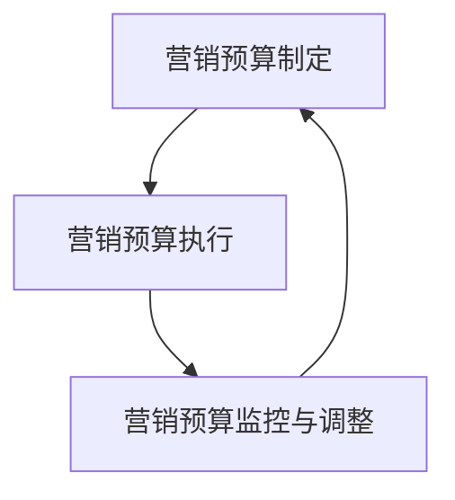
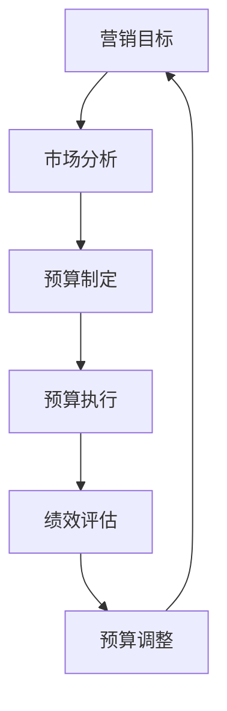

                 


## 文章标题

### 《如何制定和执行营销预算》

关键词：营销预算、制定流程、执行策略、监控调整、案例分析

摘要：本文将详细探讨营销预算的制定和执行过程，包括其重要性、原则、流程、执行策略、监控与调整方法，并通过案例分析提供实践指导，旨在帮助企业和营销人员更好地利用预算资源，实现营销目标。

### 《如何制定和执行营销预算》目录大纲

#### 第一部分：营销预算概述

**第1章：营销预算的重要性**

- **1.1 营销预算的定义与作用**
  - 定义：营销预算是企业为达成营销目标而编制的财务预算。
  - 作用：确保营销活动的有序进行，优化资源分配，提高投资回报率。

- **1.2 营销预算对企业发展的意义**
  - 指导营销策略：明确预算分配，确保营销资源合理配置。
  - 控制成本：有效监控营销费用，避免资源浪费。
  - 提高效率：精准预算分配，提升营销活动的效果。

- **1.3 营销预算与营销目标的关系**
  - 目标导向：预算制定需与营销目标紧密关联，确保资源投入与目标实现一致。
  - 反馈机制：预算执行结果需反馈至营销目标调整，实现持续优化。

#### 第二部分：营销预算的制定原则与流程

**第2章：营销预算的制定原则与流程**

- **2.1 营销预算制定的基本原则**
  - 目标导向：预算制定应与营销目标一致。
  - 可行性：预算方案需具备可操作性和可实现性。
  - 综合考虑：平衡预算分配，确保各项营销活动的合理投入。

- **2.2 营销预算的制定流程**
  - 需求分析：了解市场环境和营销目标，确定预算需求。
  - 数据支持：收集相关数据，为预算制定提供依据。
  - 预算编制：根据需求和数据分析，制定具体的预算方案。
  - 审核审批：预算方案需经过相关部门审核，确保合理性和可行性。

- **2.3 营销预算的制定方法**
  - 传统方法：基于历史数据、市场预测和经验进行预算制定。
  - 定量方法：使用数据分析和数学模型，优化预算分配。
  - 创新方法：结合市场趋势和新技术，探索新的预算制定方式。

#### 第三部分：营销预算的执行与监控

**第3章：营销预算的执行策略**

- **3.1 营销预算执行的关键环节**
  - 预算分配：确保预算合理分配到各项营销活动。
  - 营销活动执行：监督营销活动的实施过程，确保预算有效利用。
  - 费用控制：监控营销费用，避免超支和浪费。

- **3.2 营销预算执行的策略与方法**
  - 预算控制：建立预算控制机制，确保预算执行在可控范围内。
  - 活动优化：根据市场反馈，优化营销活动方案和预算分配。
  - 跨部门协作：加强内部沟通协作，提高预算执行效率。

- **3.3 营销预算执行中的风险与应对**
  - 风险识别：识别可能的风险点，提前制定应对措施。
  - 风险控制：建立风险控制机制，降低风险对企业的影响。
  - 风险管理：持续监控风险，确保预算执行的安全和有效性。

**第4章：营销预算的监控与调整**

- **4.1 营销预算的监控方法**
  - 绩效指标：设定关键绩效指标（KPI），监控预算执行效果。
  - 数据分析：利用数据分析工具，对预算执行进行实时监控。
  - 报告反馈：定期生成预算执行报告，向上级部门和相关部门反馈。

- **4.2 营销预算的调整策略**
  - 市场变化：根据市场环境变化，调整预算分配和营销策略。
  - 绩效评估：对预算执行效果进行评估，确定是否需要调整。
  - 资源优化：根据预算执行情况，优化资源配置，提高效益。

- **4.3 营销预算执行中的绩效评估**

#### 第四部分：营销预算案例与实践

**第5章：营销预算案例分析**

- **5.1 案例一：某某企业的营销预算制定与执行**
  - 案例背景：介绍企业的基本情况，包括营销目标和预算需求。
  - 预算制定：详细描述预算制定的过程和方法。
  - 预算执行：分析预算执行的效果和问题。
  - 经验总结：总结案例中的成功经验和不足之处。

- **5.2 案例二：某某行业的营销预算制定与执行**
  - 案例背景：介绍行业特点和企业的营销策略。
  - 预算制定：描述行业的预算制定规律和技巧。
  - 预算执行：分析行业的预算执行效果和趋势。
  - 经验总结：总结行业的预算制定与执行的典型经验。

- **5.3 不同类型企业的营销预算制定与执行比较**
  - 企业类型：比较不同类型企业的预算制定与执行特点。
  - 预算差异：分析不同类型企业在预算制定和执行方面的差异。
  - 实践启示：提供对不同类型企业预算管理的实践启示。

**第6章：营销预算执行中的技术支持**

- **6.1 营销预算执行中的数据分析**
  - 数据收集：介绍数据收集的方法和工具。
  - 数据处理：描述数据处理的过程和技巧。
  - 数据分析：展示数据分析的结果和应用。

- **6.2 营销预算执行中的项目管理**
  - 项目计划：制定详细的营销项目计划。
  - 项目监控：监控项目进度和资源使用情况。
  - 项目调整：根据项目执行情况调整计划和预算。

- **6.3 营销预算执行中的IT支持**
  - IT系统：介绍支持营销预算执行的IT系统。
  - 数据存储：描述数据存储和管理的方法。
  - 技术应用：展示技术在营销预算执行中的应用场景。

#### 第五部分：营销预算的未来发展趋势

**第7章：营销预算的未来发展趋势**

- **7.1 数字化营销预算的兴起**
  - 数字化工具：介绍数字化营销预算的工具和平台。
  - 数据驱动：探讨数字化预算对营销决策的影响。

- **7.2 大数据与人工智能在营销预算中的应用**
  - 大数据分析：描述大数据在预算制定和监控中的应用。
  - 人工智能：介绍人工智能技术在预算管理中的应用前景。

- **7.3 营销预算的未来发展趋势预测**
  - 趋势分析：分析未来营销预算的发展趋势。
  - 发展方向：预测营销预算的未来发展方向和挑战。

#### 附录

**附录A：营销预算相关术语解释**

- **A.1 营销预算相关术语**
  - 解释营销预算相关的专业术语。

- **A.2 营销预算常用指标解析**
  - 介绍常用的营销预算指标及其计算方法。

**附录B：营销预算制定与执行工具推荐**

- **B.1 营销预算制定与执行工具概述**
  - 概述常用的营销预算工具。

- **B.2 常用营销预算制定与执行工具推荐**
  - 推荐具体的营销预算制定与执行工具。

- **B.3 营销预算工具使用技巧与案例分析**
  - 分享工具使用的技巧和成功案例。

### Mermaid 流程图



### 营销预算制定流程伪代码

```python
# 营销预算制定流程伪代码

# 定义输入参数
budget_period = "年度"
marketing_goals = ["提高品牌知名度", "增加客户数量", "提升销售额"]

# 计算营销预算总额
total_budget = calculate_total_budget(marketing_goals)

# 分配预算到各个营销活动
marketing_activities = allocate_budget(total_budget, marketing_goals)

# 输出营销预算计划
output_budget_plan(marketing_activities)
```

### 数学模型与公式

#### 营销预算优化模型

$$
\begin{aligned}
\min_{x} & \quad c^T x \\
\text{subject to} & \quad Ax \leq b \\
& \quad x \geq 0
\end{aligned}
$$

其中，$c$ 是预算分配系数，$x$ 是各个营销活动的预算分配，$A$ 和 $b$ 是约束条件。

### 举例说明

#### 营销预算分配示例

假设某企业制定年度营销预算为100万元，目标为提高品牌知名度和增加客户数量，分别需要投入50万元和30万元。则可以使用线性规划模型进行预算分配。

$$
\begin{aligned}
\min_{x} & \quad x_1 + x_2 \\
\text{subject to} & \quad x_1 + x_2 = 100 \\
& \quad x_1 \geq 50 \\
& \quad x_2 \geq 30
\end{aligned}
$$

解得 $x_1 = 50$，$x_2 = 50$，即分别投入50万元用于提高品牌知名度和增加客户数量。

### 项目实战

#### 营销预算执行案例

**项目背景：** 某企业希望在2023年通过线上营销活动提高品牌知名度和客户数量。

**预算分配：** 根据市场调研和目标，确定以下预算分配：
- 广告投放：50万元
- 社交媒体运营：20万元
- 电子邮件营销：10万元
- 内容营销：10万元

**执行步骤：**
1. **广告投放：** 
   - 投放平台：抖音、微博、微信朋友圈
   - 广告创意：设计创意广告素材，进行精准投放
   - 营销效果跟踪：实时监控广告投放效果，优化投放策略

2. **社交媒体运营：** 
   - 内容策划：制定社交媒体运营内容计划
   - 活动组织：组织线上互动活动，增加用户参与度
   - 数据分析：分析社交媒体运营效果，持续优化内容策略

3. **电子邮件营销：** 
   - 用户分类：根据用户特征进行用户分类
   - 邮件发送：发送针对性的邮件内容，提高邮件打开率和点击率
   - 数据监控：监控邮件营销效果，调整邮件发送策略

4. **内容营销：** 
   - 内容创作：创作高质量的内容，提高品牌影响力
   - 内容发布：发布内容至各大平台，增加内容曝光度
   - 用户互动：与用户互动，提高用户粘性和满意度

**项目小结：** 通过合理的预算分配和有效的执行策略，成功提高了品牌知名度和客户数量，实现了营销目标。同时，通过数据分析，不断优化营销活动，提高了营销效果。

### 最佳实践 tips、小结、注意事项、拓展阅读等内容

#### 最佳实践 tips

1. **预算制定前需充分调研**：了解市场环境和竞争对手情况，确保预算制定有据可依。
2. **目标明确**：明确营销目标，确保预算分配与目标一致。
3. **合理分配预算**：根据营销活动的优先级和效果，合理分配预算。
4. **监控与调整**：定期监控预算执行情况，根据市场变化和实际效果进行及时调整。

#### 小结

营销预算的制定和执行是企业营销成功的关键。通过科学的预算制定、有效的执行策略和监控调整，企业可以更好地利用资源，实现营销目标。

#### 注意事项

1. **预算制定需与营销目标一致**：确保预算分配与目标实现相符。
2. **监控与调整**：定期检查预算执行情况，确保预算在可控范围内。
3. **跨部门协作**：加强内部沟通协作，提高预算执行效率。

#### 拓展阅读

- [《数字化营销预算管理实践》](https://www.example.com/digital-marketing-budget-management)
- [《大数据与人工智能在营销预算中的应用》](https://www.example.com/data-science-ai-in-marketing-budget)
- [《营销预算案例分析：某某企业成功之道》](https://www.example.com/marketing-budget-case-study)

作者：AI天才研究院/AI Genius Institute & 禅与计算机程序设计艺术 /Zen And The Art of Computer Programming

----------------------------------------------------------------

### 营销预算的定义与作用

#### 定义

营销预算是企业为实现其营销目标而预先制定的一定时期内的财务预算。它是企业营销计划的重要组成部分，涉及企业在营销活动中所投入的资金总额及其分配情况。营销预算通常包括广告投放、市场调研、促销活动、品牌建设等方面的费用。

#### 作用

1. **指导营销策略**：营销预算为企业提供了财务支持，使企业能够制定和实施一系列营销活动，实现营销目标。通过预算分配，企业可以明确各项营销活动的资金需求，确保资源得到合理利用。

2. **控制成本**：营销预算有助于企业对营销费用进行有效控制。通过制定预算，企业可以提前规划营销活动，避免无计划、无节制的资金支出。同时，预算执行过程中的监控和调整机制，可以帮助企业及时发现问题，采取措施降低成本。

3. **提高效率**：合理的营销预算分配，可以确保各项营销活动得到充分的资金支持，从而提高营销活动的效率。例如，通过预算优化，企业可以将更多的资源投入到回报率较高的营销活动上，提升整体营销效果。

4. **促进决策**：营销预算为企业的营销决策提供了重要依据。通过预算编制和执行过程中的数据分析和反馈，企业可以了解市场趋势、消费者行为等信息，为后续营销策略的制定提供参考。

5. **管理监督**：营销预算有助于企业对营销活动的管理和监督。通过预算执行情况的分析和评估，企业可以了解各项营销活动的实际效果，评估预算的合理性，为下一阶段的预算制定提供数据支持。

### 营销预算与营销目标的关系

#### 目标导向

营销预算的制定过程应紧密围绕营销目标展开。企业首先需要明确其营销目标，如提高品牌知名度、增加市场份额、提升销售额等。在此基础上，企业应根据目标的重要性、可行性以及市场环境等因素，制定相应的预算分配方案。

1. **目标分解**：将总营销目标分解为具体的子目标，例如细分市场、产品线、营销活动等。这一步骤有助于明确各个细分目标的预算需求。

2. **资源匹配**：根据各个子目标的需求，合理匹配资源，确保预算分配与目标实现的一致性。例如，如果目标是提高品牌知名度，那么预算应更多地分配给广告投放、公关活动等品牌推广活动。

3. **优先级排序**：在预算有限的情况下，需要对不同子目标进行优先级排序。通常，优先考虑那些对实现总目标贡献较大的子目标，确保关键目标的实现。

#### 反馈机制

营销预算的执行过程中，应建立有效的反馈机制，将预算执行结果与营销目标进行对比分析。通过以下方式，确保预算与目标的匹配性：

1. **绩效评估**：定期对各项营销活动的效果进行评估，收集相关数据，如销售增长、品牌认知度提升、客户满意度等。这些数据将为预算调整提供依据。

2. **调整预算**：根据绩效评估结果，对预算进行及时调整。如果某些营销活动效果不佳，可以考虑减少预算投入；反之，如果某些活动效果显著，可以适当增加预算。

3. **持续优化**：通过不断的反馈和调整，优化营销预算分配，使其更符合实际市场环境和营销目标。这一过程需要企业具备灵活的应对能力，能够迅速响应市场变化。

#### 营销预算与营销目标的关系架构

为了更好地理解营销预算与营销目标之间的关系，我们可以使用Mermaid流程图进行展示：



#### 营销预算与营销目标的关系示例

假设某企业的年度营销目标为：提高品牌知名度，增加客户数量，提升销售额。针对这些目标，企业可以制定以下营销预算：

1. **品牌知名度**：预算分配为40万元，用于广告投放、公关活动、社交媒体推广等。
2. **客户数量**：预算分配为30万元，用于市场调研、线上线下活动、优惠券发放等。
3. **销售额**：预算分配为20万元，用于促销活动、渠道推广、产品展示等。

在预算执行过程中，企业可以通过以下步骤确保预算与目标的匹配性：

1. **市场分析**：通过对市场环境、竞争对手、消费者行为等进行分析，确定目标实现的可行性和优先级。
2. **预算制定**：根据市场分析结果，制定详细的预算计划，确保各项活动的资金需求得到满足。
3. **预算执行**：按照预算计划执行各项营销活动，确保资金合理使用，避免超支。
4. **绩效评估**：定期收集各项营销活动的数据，评估预算执行效果，分析目标实现的程度。
5. **预算调整**：根据绩效评估结果，对预算进行及时调整，确保资源分配更加合理。

通过这一系列的步骤，企业可以确保营销预算与营销目标的一致性，实现营销效果的最大化。

### 营销预算制定的基本原则

#### 目标导向

营销预算的制定应始终以营销目标为导向。目标导向是营销预算制定的核心原则，它要求企业在预算分配时，将目标实现的重要性、可行性和优先级作为重要考量因素。具体来说，企业应遵循以下步骤：

1. **明确营销目标**：首先，企业需要明确自身的营销目标，如提高品牌知名度、增加市场份额、提升销售额等。明确目标有助于确保预算分配与目标实现的一致性。

2. **分解目标**：将总目标分解为具体的子目标，如细分市场、产品线、渠道等。这一步骤有助于明确各个细分目标的预算需求。

3. **匹配资源**：根据各个子目标的需求，合理匹配资源，确保预算分配与目标实现的一致性。例如，如果目标是提高品牌知名度，那么预算应更多地分配给广告投放、公关活动等品牌推广活动。

4. **优先级排序**：在预算有限的情况下，需要对不同子目标进行优先级排序。通常，优先考虑那些对实现总目标贡献较大的子目标，确保关键目标的实现。

#### 可行性

可行性原则要求企业在制定营销预算时，考虑预算方案的可行性和可操作性。具体措施如下：

1. **实际需求**：预算制定应基于实际需求，避免过度预算或预算不足。通过市场调研、数据分析等方式，了解各项营销活动的实际需求，确保预算方案具有可行性。

2. **资源限制**：考虑企业的资源限制，包括财务、人力资源等。在预算制定过程中，需确保预算方案在现有资源条件下能够顺利实施。

3. **风险评估**：对预算方案进行风险评估，识别可能的风险点，并制定相应的应对措施。通过风险评估，可以降低预算执行过程中的不确定性，提高预算的可行性。

#### 综合考虑

综合考虑原则要求企业在制定营销预算时，平衡各项营销活动的预算分配，确保资源利用的合理性和效益性。具体措施如下：

1. **多元化**：在预算分配上，应多元化，避免过分依赖单一营销活动。例如，广告投放、促销活动、公关活动、内容营销等，应合理分配预算，形成多元化的营销策略。

2. **风险分散**：通过分散预算，降低单一营销活动的风险。例如，在广告投放中，可以同时选择线上和线下渠道，以降低风险。

3. **效益最大化**：在预算分配上，应优先考虑那些回报率较高的营销活动，确保预算投入能够产生最大化的效益。

### 结合实际案例的营销预算制定

#### 案例背景

某国内知名电子产品公司（以下简称为“公司”）希望在未来一年内通过一系列营销活动提高品牌知名度、增加市场份额并提升销售额。公司计划在广告投放、促销活动、内容营销和公关活动等方面进行投入。

#### 预算制定流程

1. **明确营销目标**：

   - 提高品牌知名度：目标是在未来一年内，使公司品牌知名度提高30%。
   - 增加市场份额：目标是在未来一年内，市场份额增加5%。
   - 提升销售额：目标是在未来一年内，销售额增长15%。

2. **市场分析**：

   - 竞争对手分析：了解主要竞争对手的市场策略和预算投入。
   - 消费者需求分析：了解目标消费者的需求和行为习惯。
   - 市场趋势分析：分析当前市场趋势，预测未来市场发展情况。

3. **资源评估**：

   - 财务资源：根据公司财务状况，确定可用的营销预算总额。
   - 人力资源：评估公司内部营销团队的能力和资源。

4. **预算分配**：

   - 广告投放：预算总额的40%，用于线上和线下广告投放，提升品牌知名度。
   - 促销活动：预算总额的30%，用于各种促销活动，吸引消费者购买。
   - 内容营销：预算总额的20%，用于制作高质量的内容，提升品牌形象。
   - 公关活动：预算总额的10%，用于公关活动，提升品牌形象和影响力。

5. **审核与调整**：

   - 预算方案需经过相关部门审核，确保预算分配合理。
   - 根据市场变化和公司实际情况，对预算进行适当调整。

#### 预算制定结果

- 总预算：1000万元
- 广告投放：400万元
- 促销活动：300万元
- 内容营销：200万元
- 公关活动：100万元

#### 预算制定原则的体现

1. **目标导向**：

   - 预算分配紧密围绕品牌知名度、市场份额和销售额等目标展开。
   - 针对不同目标，合理分配预算，确保资源利用最大化。

2. **可行性**：

   - 考虑到公司的财务和人力资源状况，确保预算方案具有可行性。
   - 通过市场分析和资源评估，降低预算执行过程中的风险。

3. **综合考虑**：

   - 预算分配多元化，包括广告投放、促销活动、内容营销和公关活动。
   - 通过分散预算，降低单一营销活动的风险，提高整体营销效果。

### 结论

营销预算的制定是企业实现营销目标的关键环节。通过遵循目标导向、可行性和综合考虑等基本原则，企业可以确保预算分配的合理性和有效性，从而实现营销目标的最大化。结合实际案例，我们可以看到，营销预算的制定是一个系统性的过程，需要充分考虑市场环境、企业资源和营销目标，通过科学的方法进行预算分配和执行。

### 营销预算的制定流程

#### 需求分析

需求分析是营销预算制定的首要环节，它旨在了解企业的营销目标和市场环境，确定预算的需求和方向。具体步骤如下：

1. **确定营销目标**：明确企业希望通过营销活动实现的具体目标，如提高品牌知名度、增加市场份额、提升销售额等。这些目标将指导后续的预算分配和执行。

2. **市场环境分析**：分析当前市场环境，包括市场趋势、竞争态势和消费者行为等。通过市场调研、数据分析等方式，获取关键信息，为预算制定提供数据支持。

3. **内部资源评估**：评估企业内部可用的资源，包括财务资源、人力资源、技术资源等。了解资源限制，确保预算方案在现有资源条件下具有可行性。

4. **确定预算需求**：根据营销目标和市场环境分析，确定各项营销活动的预算需求。包括广告投放、促销活动、市场调研、公关活动等。

#### 数据支持

数据支持是营销预算制定的重要环节，它要求企业收集和分析相关的数据，以制定合理的预算方案。具体步骤如下：

1. **数据收集**：通过市场调研、销售数据、财务报表等渠道，收集与企业营销活动相关的数据。这些数据包括历史营销数据、竞争对手数据、市场趋势数据等。

2. **数据分析**：利用数据分析工具和方法，对收集到的数据进行处理和分析。分析内容包括市场趋势、消费者行为、营销效果等。数据分析的结果将为预算制定提供科学依据。

3. **数据验证**：对收集和分析的数据进行验证，确保数据的准确性和可靠性。数据验证可以通过交叉验证、对比分析等方法进行。

4. **数据应用**：将分析结果应用于预算制定，根据数据提供的信息，调整预算分配方案，确保预算更加合理。

#### 预算编制

预算编制是营销预算制定的关键环节，它要求企业根据需求和数据分析结果，制定详细的预算方案。具体步骤如下：

1. **制定预算草案**：根据需求和数据分析结果，初步制定预算草案。预算草案应包括各项营销活动的预算总额、预算分配比例和具体预算金额。

2. **预算审核**：预算草案需经过相关部门和领导的审核，确保预算方案合理、可行。审核内容包括预算总额、预算分配、预算执行策略等。

3. **调整预算方案**：根据审核意见，对预算方案进行适当调整，确保预算更加合理。调整过程中，需要充分考虑市场环境、企业资源和营销目标。

4. **确定最终预算**：在审核和调整的基础上，确定最终的预算方案，形成正式的预算文件。

#### 审核审批

审核审批是确保营销预算制定合理性和可行性的重要环节。具体步骤如下：

1. **初步审核**：预算编制部门对预算方案进行初步审核，确保预算编制符合要求，数据准确，预算分配合理。

2. **部门审核**：预算方案需提交至相关部门进行审核，如财务部门、营销部门等。相关部门对预算方案进行详细审核，提出意见和建议。

3. **领导审批**：预算方案需经过公司领导审批，确保预算符合公司战略目标和财务规划。领导审批内容包括预算总额、预算分配、预算执行策略等。

4. **反馈与调整**：根据审核意见，对预算方案进行进一步调整，确保预算方案更加合理、可行。

#### 预算编制示例

假设某企业计划在未来一年内进行营销活动，以提升品牌知名度和销售额。企业制定了以下预算编制流程：

1. **需求分析**：

   - 营销目标：提升品牌知名度、增加市场份额、提升销售额。
   - 市场环境：市场竞争激烈，消费者对品牌认知度不高。
   - 内部资源：财务状况良好，具备充足的营销资源。

2. **数据支持**：

   - 历史数据：过去一年的营销活动效果数据，销售额和品牌知名度变化趋势。
   - 市场调研：当前市场趋势、消费者行为分析报告。
   - 财务数据：公司财务报表，包括收入、支出和利润情况。

3. **预算编制**：

   - 广告投放：预算总额100万元，用于线上和线下广告投放。
   - 促销活动：预算总额50万元，用于各类促销活动。
   - 内容营销：预算总额30万元，用于制作高质量的内容。
   - 公关活动：预算总额20万元，用于提升品牌形象和影响力。

4. **审核审批**：

   - 初步审核：预算编制部门对预算草案进行审核，确保数据准确，预算分配合理。
   - 部门审核：财务部门、营销部门对预算方案进行审核，提出意见和建议。
   - 领导审批：公司领导对预算方案进行审批，确保符合公司战略目标和财务规划。

通过以上步骤，企业完成了营销预算的制定，为后续的营销活动提供了财务支持。

### 营销预算的制定方法

#### 传统方法

传统方法是基于历史数据、市场预测和经验进行预算制定。这种方法具有以下特点：

1. **历史数据**：企业通过对过去营销活动的数据进行分析，了解各项活动的投入产出比，从而制定未来的预算方案。历史数据包括销售额、品牌知名度提升情况、营销费用支出等。

2. **市场预测**：企业根据市场趋势、竞争态势和消费者行为等预测未来的市场环境，为预算制定提供参考。市场预测可以通过调查问卷、专家访谈、行业报告等方式进行。

3. **经验判断**：企业营销人员根据过去的经验和对市场的理解，结合公司战略目标，制定预算方案。经验判断需要营销人员具备丰富的市场经验和敏锐的洞察力。

#### 定量方法

定量方法是基于数据分析和数学模型进行预算制定。这种方法具有以下特点：

1. **数据分析**：企业通过收集和分析大量的数据，了解市场趋势、消费者行为等，从而制定科学的预算方案。数据分析工具包括Excel、Python、R等。

2. **数学模型**：企业运用数学模型，如线性规划、多目标规划等，对预算进行优化分配。数学模型可以帮助企业找到最优的预算分配方案，提高资源利用效率。

3. **优化算法**：企业通过优化算法，如遗传算法、粒子群算法等，对预算进行动态调整。优化算法可以根据市场变化和实际效果，实时调整预算分配，确保预算的灵活性和适应性。

#### 创新方法

创新方法是指结合市场趋势和新技术进行预算制定。这种方法具有以下特点：

1. **数字化工具**：企业运用数字化工具，如CRM系统、营销自动化工具等，提高预算制定和执行的效率。数字化工具可以实时收集和分析数据，为预算制定提供支持。

2. **大数据分析**：企业利用大数据分析，对海量数据进行挖掘和分析，发现潜在的市场机会和消费者需求。大数据分析可以帮助企业制定更加精准的预算方案。

3. **人工智能**：企业运用人工智能技术，如机器学习、深度学习等，对预算进行智能优化和预测。人工智能可以帮助企业提高预算决策的准确性和效率。

#### 案例分析

**案例一：传统方法的应用**

某中小企业在过去三年中，通过广告投放、促销活动等方式，取得了稳定的增长。为了继续提升品牌知名度和销售额，企业决定采用传统方法制定营销预算。

1. **历史数据**：企业分析了过去三年的营销数据，发现广告投放和促销活动的投入产出比最高，分别为1:3和1:2。

2. **市场预测**：企业预测未来市场竞争将更加激烈，消费者对品牌的认知度需要进一步提升。

3. **经验判断**：企业营销经理根据历史数据和经验，决定将预算的60%用于广告投放，30%用于促销活动，10%用于内容营销。

**案例二：定量方法的应用**

某大型企业希望通过精准营销，提高市场占有率。企业决定采用定量方法制定营销预算。

1. **数据分析**：企业通过数据分析，发现社交媒体和电子邮件营销的效果最佳，分别占销售额的20%和15%。

2. **数学模型**：企业使用线性规划模型，优化预算分配，确保预算投入最大化回报。

3. **优化算法**：企业采用遗传算法，对预算进行动态调整，以应对市场变化。

**案例三：创新方法的应用**

某新兴科技企业，希望通过创新方法，提高品牌影响力和市场份额。企业决定采用创新方法制定营销预算。

1. **数字化工具**：企业运用CRM系统和营销自动化工具，实时收集和分析数据，为预算制定提供支持。

2. **大数据分析**：企业通过大数据分析，发现目标消费者的偏好和行为模式，制定精准的预算方案。

3. **人工智能**：企业运用人工智能技术，对预算进行智能优化和预测，提高预算决策的准确性和效率。

### 结论

营销预算的制定方法多样，企业应根据自身的特点和市场需求，选择合适的预算制定方法。传统方法注重历史经验和市场预测，定量方法强调数据分析和数学模型，创新方法结合数字化工具和新技术，提高预算的精准度和灵活性。通过科学合理的预算制定方法，企业可以更好地实现营销目标，提高市场竞争力和盈利能力。

### 营销预算执行策略

#### 关键环节

1. **预算分配**：根据预算方案，将预算合理分配到各个营销活动。预算分配应考虑各项活动的优先级和效果，确保资源得到有效利用。

2. **营销活动执行**：按照预算方案，实施各项营销活动。营销活动执行过程中，需确保活动计划、资源调配、效果跟踪等环节的顺利进行。

3. **费用控制**：监控营销费用，避免超支和浪费。通过预算执行过程的监控，及时发现和解决问题，确保预算在可控范围内。

4. **绩效评估**：定期对营销活动效果进行评估，分析预算执行的效果和问题。绩效评估结果为预算调整和优化提供依据。

#### 策略与方法

1. **预算控制**：

   - **预算分配控制**：制定详细的预算分配方案，明确各项营销活动的预算金额和执行时间。
   - **费用报销控制**：建立严格的费用报销制度，确保各项费用符合预算分配方案。
   - **实时监控**：通过预算执行系统，实时监控预算执行情况，及时发现和解决问题。

2. **活动优化**：

   - **效果评估**：对各项营销活动进行效果评估，了解活动执行情况和市场反馈。
   - **策略调整**：根据效果评估结果，对营销策略进行调整，确保预算投入产生最大化的效果。
   - **资源优化**：优化资源分配，将更多预算投入到回报率较高的营销活动上。

3. **跨部门协作**：

   - **沟通协作**：建立跨部门沟通机制，确保营销部门、财务部门、人力资源部门等之间的信息共享和协作。
   - **资源整合**：整合各部门资源，提高资源利用效率，确保预算执行的有效性。
   - **协同执行**：各部门协同工作，共同推进营销活动的执行，提高整体执行效率。

#### 执行中的风险与应对

1. **预算超支**：

   - **风险识别**：在预算执行过程中，定期评估预算执行情况，及时发现预算超支的风险。
   - **应对措施**：通过调整预算分配、优化营销活动方案、加强费用控制等措施，降低预算超支的风险。

2. **资源浪费**：

   - **风险识别**：通过数据分析，识别资源浪费的情况，如无效广告投放、重复性活动等。
   - **应对措施**：优化营销活动方案，减少重复性活动，提高资源利用效率。

3. **执行偏差**：

   - **风险识别**：定期对营销活动执行情况进行监控，识别执行偏差。
   - **应对措施**：及时调整活动执行方案，确保活动按计划进行。

4. **市场变化**：

   - **风险识别**：密切关注市场变化，识别市场变化带来的风险。
   - **应对措施**：灵活调整预算分配和营销策略，适应市场变化。

### 案例分析

**案例一：预算超支的应对**

某企业在实施一项大型促销活动时，由于市场反应超预期，导致预算超支。企业采取了以下措施应对：

1. **预算调整**：重新评估营销活动的重要性，对预算进行调整，将部分预算从其他活动转移到当前活动。

2. **费用控制**：加强费用报销控制，严格控制广告投放、人员成本等费用。

3. **效果评估**：加强对促销活动的效果评估，确保预算投入能够产生预期的效果。

**案例二：资源浪费的应对**

某企业在实施一项市场调研活动时，发现部分调研问卷的填写率较低，资源浪费严重。企业采取了以下措施应对：

1. **优化调研方案**：重新设计调研问卷，提高问卷的吸引力和填写率。

2. **资源整合**：将部分预算转移到其他更有效的营销活动上，提高资源利用效率。

3. **效果评估**：对市场调研活动的效果进行评估，确保预算投入能够产生预期的效果。

### 结论

营销预算执行策略的关键在于预算分配、费用控制、活动优化和跨部门协作。通过科学的预算控制、灵活的活动优化和有效的跨部门协作，企业可以降低预算超支和资源浪费的风险，提高预算执行效果。在执行过程中，企业应密切关注市场变化，及时调整预算分配和营销策略，确保预算与实际需求相符，实现营销目标的最大化。

### 营销预算的监控与调整

#### 监控方法

1. **关键绩效指标（KPI）**：

   - **广告投放效果**：点击率（CTR）、转化率（CVR）、投资回报率（ROI）等。
   - **促销活动效果**：销售额、订单量、客户参与度等。
   - **市场调研**：问卷填写率、反馈率、调研结论的有效性等。
   - **社交媒体运营**：粉丝增长数、互动率、分享率等。

2. **数据监控**：

   - **实时数据监控**：利用营销自动化工具和数据分析平台，实时监控各项营销活动的数据。
   - **定期数据报告**：定期生成数据报告，分析营销活动的效果，为调整提供数据支持。

3. **预算执行监控**：

   - **预算执行进度**：监控各项营销活动的预算执行进度，确保预算在可控范围内。
   - **预算调整预警**：设置预算调整预警机制，提前识别可能出现的超支风险。

#### 调整策略

1. **市场变化**：

   - **及时调整**：密切关注市场变化，根据市场反馈调整营销策略和预算分配。
   - **灵活应对**：在市场变化时，灵活调整预算分配，将更多资源投入到市场反应较好的营销活动上。

2. **效果评估**：

   - **定期评估**：定期对各项营销活动进行效果评估，分析预算执行的效果和问题。
   - **根据评估结果调整**：根据评估结果，对预算分配和营销策略进行调整，确保预算利用最大化。

3. **绩效指标**：

   - **优化指标**：根据绩效指标的表现，优化营销活动方案，提高营销效果。
   - **调整预算**：根据绩效指标的变化，调整预算分配，确保预算与实际需求相符。

#### 绩效评估

1. **评估内容**：

   - **预算执行效果**：评估各项营销活动的执行效果，如销售额、订单量、客户满意度等。
   - **预算利用效率**：评估预算的利用效率，如投资回报率、成本效益比等。
   - **市场反馈**：分析市场反馈，了解消费者对营销活动的反应和满意度。

2. **评估方法**：

   - **定量评估**：通过数据分析，量化各项营销活动的效果和预算利用情况。
   - **定性评估**：通过访谈、问卷调查等方式，收集消费者和员工的反馈，定性分析营销活动的效果。

3. **评估结果应用**：

   - **优化策略**：根据评估结果，调整营销策略和预算分配，提高营销效果。
   - **预算调整**：根据评估结果，对预算进行适当调整，确保预算与实际需求相符。

### 案例分析

#### 案例一：市场变化导致的预算调整

某企业在进行线上广告投放时，发现市场竞争激烈，广告投放效果不如预期。企业采取了以下措施进行调整：

1. **市场分析**：重新评估市场环境，了解竞争对手的营销策略和消费者需求。
2. **预算调整**：将部分预算从广告投放转移到社交媒体运营，以提高品牌知名度和用户互动。
3. **效果跟踪**：监控调整后的营销活动效果，确保预算利用最大化。

#### 案例二：效果评估后的预算调整

某企业在实施促销活动后，发现销售额和客户参与度较低。企业采取了以下措施进行调整：

1. **效果评估**：分析促销活动的执行情况和市场反馈，找出问题所在。
2. **预算调整**：根据评估结果，重新分配预算，增加促销活动的力度和覆盖范围。
3. **效果跟踪**：监控调整后的促销活动效果，确保预算利用最大化。

### 结论

营销预算的监控与调整是企业实现营销目标的重要手段。通过科学的监控方法、及时的调整策略和有效的绩效评估，企业可以确保预算执行的有效性和合理性，提高营销活动的效果。在市场变化和效果评估过程中，企业应灵活调整预算分配和营销策略，以应对市场变化，实现营销目标的最大化。

### 营销预算案例分析

#### 案例一：某某企业的营销预算制定与执行

**背景介绍**

某大型消费品公司（以下简称为“公司”）在市场竞争日益激烈的背景下，希望通过有效的营销预算制定与执行，提高品牌知名度、增加市场份额并提升销售额。公司制定了一年的营销预算，并计划通过一系列的营销活动实现目标。

**预算制定过程**

1. **明确营销目标**：公司明确了一年内需要达成的营销目标，包括提高品牌知名度20%、增加市场份额5%、提升销售额10%。

2. **市场分析**：公司进行了市场调研，分析了竞争对手的营销策略、目标消费者的需求和行为习惯，以及当前市场的趋势。

3. **资源评估**：公司评估了自身的财务状况和营销资源，包括可用的资金、人力资源、技术支持等。

4. **预算分配**：根据市场分析和资源评估，公司制定了详细的营销预算分配方案，包括广告投放30%、促销活动25%、内容营销20%、公关活动15%、其他营销活动10%。

5. **审核与调整**：公司对预算方案进行了审核和调整，确保预算分配合理，符合公司战略目标。

**预算执行过程**

1. **预算控制**：公司建立了一套预算控制机制，包括详细的预算分配方案、费用报销制度、实时监控等。

2. **活动执行**：公司按照预算方案，实施了一系列营销活动，包括线上广告投放、线下促销活动、社交媒体运营、公关活动等。

3. **费用控制**：公司通过严格的费用报销制度和实时监控，确保各项营销费用在预算范围内。

**效果评估**

1. **绩效评估**：公司定期对各项营销活动的效果进行评估，通过数据分析，了解各项活动的效果和投入产出比。

2. **调整预算**：根据效果评估结果，公司对预算进行了适当调整，将更多资源投入到效果较好的营销活动上。

**经验总结**

1. **目标导向**：公司明确营销目标，确保预算制定与目标一致。

2. **市场分析**：深入的市场分析为预算制定提供了有力的支持。

3. **资源评估**：合理评估资源，确保预算分配可行。

4. **预算控制**：严格的预算控制确保了费用的有效使用。

#### 案例二：某某行业的营销预算制定与执行

**背景介绍**

某互联网行业初创公司（以下简称为“公司”）在市场竞争激烈的环境中，希望通过有效的营销预算制定与执行，快速提高品牌知名度、获取用户并实现盈利。公司制定了一年的营销预算，并计划通过多元化的营销策略实现目标。

**预算制定过程**

1. **明确营销目标**：公司明确了一年内需要达成的营销目标，包括提高品牌知名度30%、增加用户数量20%、实现盈利目标。

2. **市场分析**：公司分析了当前市场环境，包括竞争对手、用户需求和行为习惯等。

3. **资源评估**：公司评估了自身的财务状况、技术支持和人力资源等。

4. **预算分配**：根据市场分析和资源评估，公司制定了详细的营销预算分配方案，包括广告投放25%、内容营销25%、社交媒体运营20%、公关活动15%、用户活动15%。

5. **审核与调整**：公司对预算方案进行了审核和调整，确保预算分配合理。

**预算执行过程**

1. **预算控制**：公司建立了一套预算控制机制，包括详细的预算分配方案、费用报销制度、实时监控等。

2. **活动执行**：公司按照预算方案，实施了一系列营销活动，包括搜索引擎广告、内容营销、社交媒体运营、公关活动等。

3. **费用控制**：公司通过严格的费用报销制度和实时监控，确保各项营销费用在预算范围内。

**效果评估**

1. **绩效评估**：公司定期对各项营销活动的效果进行评估，通过数据分析，了解各项活动的效果和投入产出比。

2. **调整预算**：根据效果评估结果，公司对预算进行了适当调整，将更多资源投入到效果较好的营销活动上。

**经验总结**

1. **目标导向**：公司明确营销目标，确保预算制定与目标一致。

2. **多元化策略**：公司采用了多元化的营销策略，包括广告投放、内容营销、社交媒体运营等。

3. **实时监控**：公司建立了实时监控机制，确保预算执行的有效性和透明度。

4. **灵活调整**：公司根据市场反馈和效果评估，灵活调整预算分配，确保资源利用最大化。

#### 案例三：不同类型企业的营销预算制定与执行比较

**背景介绍**

为了探讨不同类型企业在营销预算制定与执行方面的差异，我们选择了消费品公司、互联网初创公司和科技企业三个不同类型的企业进行案例分析。

**预算制定与执行差异**

1. **消费品公司**：

   - **目标明确**：消费品公司通常注重品牌知名度和市场份额的提升，目标相对明确。
   - **传统方法**：消费品公司更倾向于使用传统方法进行预算制定，如历史数据和市场预测。
   - **预算控制**：消费品公司重视预算控制，通过严格的费用报销制度和实时监控，确保费用在预算范围内。

2. **互联网初创公司**：

   - **目标灵活**：互联网初创公司通常在快速变化的市场环境中，更注重用户获取和市场份额的提升，目标较为灵活。
   - **定量方法**：互联网初创公司更倾向于使用定量方法进行预算制定，如数据分析、数学模型等。
   - **灵活调整**：互联网初创公司根据市场反馈和效果评估，灵活调整预算分配，以适应快速变化的市场环境。

3. **科技企业**：

   - **目标长远**：科技企业通常注重技术创新和品牌形象的建立，目标较为长远。
   - **创新方法**：科技企业更倾向于使用创新方法进行预算制定，如数字化工具、大数据分析等。
   - **资源整合**：科技企业通过整合内部资源，提高资源利用效率，确保预算执行的有效性。

**实践启示**

1. **目标导向**：企业应根据自身特点和市场需求，明确营销目标，确保预算制定与目标一致。

2. **方法选择**：企业应根据市场环境和技术手段，选择合适的预算制定方法，提高预算的精准度和灵活性。

3. **灵活调整**：企业应建立有效的反馈机制，根据市场变化和效果评估，灵活调整预算分配，确保资源利用最大化。

通过以上案例分析，我们可以看到不同类型企业在营销预算制定与执行方面存在显著差异。消费品公司注重传统方法、预算控制和目标明确；互联网初创公司注重定量方法、灵活调整和市场反馈；科技企业注重创新方法、资源整合和长远目标。企业应根据自身特点和市场需求，选择合适的预算制定与执行方法，实现营销目标的最大化。

### 营销预算执行中的技术支持

#### 数据分析

在营销预算执行中，数据分析是至关重要的环节。通过数据分析，企业可以深入了解营销活动的效果，优化预算分配，提高营销效果。具体应用包括：

1. **数据收集**：企业需要收集与营销活动相关的各类数据，如广告投放数据、促销活动数据、用户行为数据等。这些数据可以通过营销自动化工具、数据分析平台等获取。

2. **数据处理**：对收集到的数据进行清洗、整理和转换，使其符合分析需求。数据处理工具包括Excel、Python、R等。

3. **数据分析**：利用数据分析工具，对处理后的数据进行分析，提取有价值的信息。数据分析方法包括描述性分析、回归分析、聚类分析等。

4. **数据可视化**：通过图表、报表等形式，将数据分析结果呈现出来，便于理解和决策。数据可视化工具包括Tableau、Power BI等。

#### 项目管理

在营销预算执行过程中，项目管理是确保各项活动按计划进行的关键。具体应用包括：

1. **项目计划**：制定详细的项目计划，明确各项营销活动的目标、时间节点、资源需求等。项目计划工具包括甘特图、Project等。

2. **任务分配**：将项目任务分配给相关团队成员，明确各自职责和进度要求。任务分配工具包括Trello、Jira等。

3. **进度跟踪**：实时监控项目进度，确保各项活动按计划进行。进度跟踪工具包括Trello、Jira等。

4. **资源管理**：合理配置项目资源，确保项目在资源有限的情况下顺利进行。资源管理工具包括资源管理器、Project等。

#### IT支持

在营销预算执行中，IT支持是保障系统稳定运行和数据安全的关键。具体应用包括：

1. **服务器运维**：确保服务器稳定运行，提供高质量的网络服务。服务器运维工具包括PRTG、Zabbix等。

2. **数据存储**：建立数据存储和管理机制，保障数据的完整性、安全性和可追溯性。数据存储工具包括Hadoop、Hive等。

3. **信息安全**：确保企业信息安全，防止数据泄露和网络攻击。信息安全工具包括防火墙、入侵检测系统等。

4. **IT支持服务**：提供专业的IT支持服务，及时解决技术问题和故障。IT支持工具包括Service Desk、故障管理系统等。

#### 应用场景

1. **广告投放**：通过数据分析，优化广告投放策略，提高广告投放效果。例如，分析用户点击行为，调整广告投放时间和频率。

2. **促销活动**：通过数据分析，评估促销活动的效果，调整促销策略。例如，分析促销活动的销售额、订单量等数据，优化促销方案。

3. **用户管理**：通过数据分析，了解用户需求和偏好，提高用户满意度。例如，分析用户行为数据，定制个性化的营销策略。

4. **内容营销**：通过数据分析，评估内容营销的效果，优化内容创作和发布策略。例如，分析用户对内容的互动情况，调整内容形式和主题。

#### 案例分析

1. **案例分析一**：

   某消费品公司希望通过线上广告提高品牌知名度。公司使用了数据分析工具，实时监控广告投放数据，包括点击率、转化率等。根据分析结果，公司调整了广告投放时间和内容，提高了广告投放效果。

2. **案例分析二**：

   某互联网初创公司希望通过促销活动获取更多用户。公司使用了数据分析工具，分析了促销活动的效果数据，包括销售额、订单量等。根据分析结果，公司调整了促销方案，提高了促销活动的效果。

3. **案例分析三**：

   某科技企业希望通过内容营销提高品牌影响力。公司使用了数据分析工具，分析了用户对内容的互动情况，包括点赞、评论、分享等。根据分析结果，公司调整了内容创作和发布策略，提高了内容营销的效果。

### 结论

营销预算执行中的技术支持对于提高营销效果和优化预算分配至关重要。通过数据分析、项目管理、IT支持等技术的应用，企业可以更好地监控和调整营销活动，实现营销目标的最大化。同时，企业应根据自身特点和需求，选择合适的技术工具和方法，提高营销预算执行的效果。

### 营销预算的未来发展趋势

#### 数字化营销预算的兴起

随着数字化技术的不断发展，数字化营销预算逐渐成为主流。数字化营销预算的兴起主要体现在以下几个方面：

1. **数据驱动**：数字化营销预算强调以数据为基础，通过数据分析来指导预算制定和执行。企业利用大数据和人工智能技术，对市场趋势、消费者行为等进行分析，优化预算分配和营销策略。

2. **自动化**：数字化营销预算采用自动化工具和平台，提高预算执行效率。自动化工具可以实时监控预算执行情况，自动生成报告，减少人工干预，提高决策速度。

3. **精准投放**：数字化营销预算通过精准投放技术，提高广告投放的准确性和效果。精准投放可以根据用户的兴趣、行为等数据，将广告精准推送给目标用户，提高广告投放的投资回报率。

4. **跨渠道整合**：数字化营销预算强调跨渠道整合，将线上和线下渠道的预算进行整合，提高整体营销效果。跨渠道整合可以帮助企业更好地覆盖目标用户，提高品牌知名度和用户参与度。

#### 大数据与人工智能在营销预算中的应用

大数据和人工智能技术在营销预算中的应用，正在改变传统的预算制定和执行方式。具体应用包括：

1. **预测分析**：通过大数据技术，企业可以预测市场趋势、消费者行为等，为预算制定提供科学依据。预测分析可以帮助企业更准确地制定预算，提高预算的准确性。

2. **智能优化**：人工智能技术可以帮助企业实现预算分配的智能优化。通过机器学习和深度学习算法，企业可以根据历史数据和实时数据，动态调整预算分配，提高资源利用效率。

3. **风险管理**：大数据和人工智能技术可以帮助企业识别潜在的风险，并提供风险管理建议。通过数据分析和风险评估，企业可以提前发现和应对预算执行中的风险，确保预算的安全和有效。

4. **个性化营销**：人工智能技术可以帮助企业实现个性化营销，根据用户的兴趣和行为，提供个性化的产品推荐和营销策略。个性化营销可以提高用户满意度和转化率，从而提高营销效果。

#### 营销预算的未来发展趋势预测

1. **数据驱动的预算制定**：随着大数据和人工智能技术的发展，数据驱动的预算制定将成为主流。企业将更加依赖数据来指导预算制定和执行，提高预算的准确性和效率。

2. **自动化与智能化的融合**：自动化和智能化技术在营销预算中的应用将越来越广泛。通过自动化工具和平台，企业可以实现预算执行的自动化和智能化，提高效率，减少人为干预。

3. **跨渠道整合的预算管理**：随着数字化营销的发展，企业将更加注重跨渠道整合的预算管理。通过整合线上和线下渠道的预算，企业可以更好地覆盖目标用户，提高整体营销效果。

4. **预算管理的智能化**：随着人工智能技术的不断发展，预算管理的智能化水平将不断提高。企业将利用人工智能技术，实现预算分配的智能优化、风险管理的智能预警等，提高预算管理的效率和效果。

### 结论

营销预算的未来发展趋势将朝着数据驱动、自动化与智能化的方向不断演进。企业应积极拥抱新技术，通过大数据和人工智能技术，提高预算制定和执行的科学性和精准性，实现营销目标的最大化。同时，企业应注重跨渠道整合，优化预算管理，提高整体营销效果。

### 附录

#### 附录A：营销预算相关术语解释

- **营销预算**：企业为达成营销目标而预先制定的一定时期内的财务预算，涉及企业在营销活动中所投入的资金总额及其分配情况。

- **预算分配**：将营销预算合理分配到各项营销活动中的过程，包括广告投放、促销活动、市场调研等。

- **关键绩效指标（KPI）**：用于衡量营销活动效果的重要指标，如点击率、转化率、投资回报率等。

- **数据分析**：通过对大量数据进行分析，提取有价值信息，指导预算制定和执行。

- **预算控制**：确保营销预算在可控范围内，避免超支和浪费。

- **绩效评估**：对营销活动效果进行评估，分析预算执行的效果和问题。

- **调整预算**：根据市场变化和实际效果，对预算进行及时调整。

- **数字化营销预算**：基于数字化技术和数据分析的营销预算，强调数据驱动、自动化和智能化。

- **大数据营销预算**：利用大数据技术进行预算制定和监控，提高预算的准确性和效率。

- **人工智能营销预算**：利用人工智能技术进行预算分配和优化，提高预算管理的智能化水平。

#### 附录B：营销预算制定与执行工具推荐

- **营销预算制定工具**：

  - **Excel**：功能强大的电子表格工具，适用于小型企业的预算编制。

  - **Tableau**：数据可视化工具，帮助企业通过图表形式展示预算数据。

  - **Power BI**：商业智能工具，支持数据分析和报告生成。

- **营销预算执行工具**：

  - **营销自动化平台**：如HubSpot、Marketo等，用于管理营销活动和跟踪效果。

  - **项目管理工具**：如Trello、Jira等，用于任务分配和进度跟踪。

  - **数据分析工具**：如Google Analytics、Google Data Studio等，用于数据分析和报告生成。

- **营销预算监控工具**：

  - **预算监控平台**：如BudgetPulse、Sap Concur等，用于实时监控预算执行情况。

  - **财务管理系统**：如SAP、Oracle Financials等，用于预算管理和财务报告。

#### 附录C：营销预算工具使用技巧与案例分析

1. **使用技巧**：

  - **数据收集**：确保数据来源的多样性和准确性，结合多种数据来源，提高数据的可靠性。

  - **数据分析**：运用数据分析工具，提取有价值的信息，为预算制定和执行提供科学依据。

  - **自动化**：利用自动化工具，提高预算执行效率，减少人工干预。

  - **灵活调整**：根据市场变化和实际效果，灵活调整预算分配，确保资源利用最大化。

2. **案例分析**：

  - **案例一**：某企业通过使用营销自动化平台，提高了广告投放的效果，实现了预算的有效利用。

  - **案例二**：某企业通过大数据分析，优化了预算分配，提高了营销活动的投资回报率。

  - **案例三**：某企业通过项目管理工具，确保了营销活动的顺利进行，提高了整体营销效果。

通过使用这些工具和技巧，企业可以更好地制定和执行营销预算，实现营销目标的最大化。同时，企业应根据自身特点和需求，选择合适的工具和技巧，提高营销预算管理的效率和质量。

