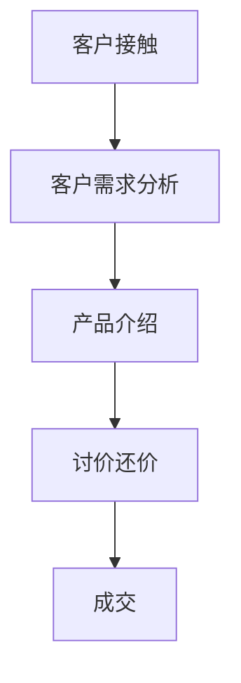
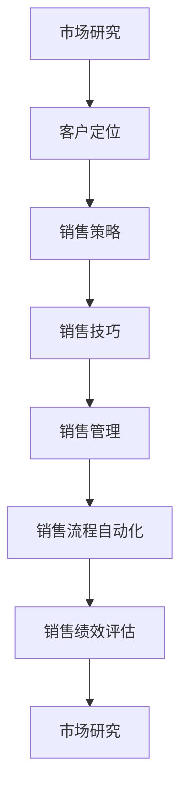

                 

### 文章标题

《如何在一人公司中建立高效的销售流程》

### 关键词

销售流程、一人公司、高效销售、市场研究、客户定位、销售策略、自动化、绩效评估

### 摘要

本文旨在探讨如何在一人公司中建立高效的销售流程。通过分析销售流程的基本概念，结合一人公司的特点，本文详细阐述了市场研究、客户定位、销售策略、销售管理、自动化以及绩效评估等核心要素。同时，通过实战案例的分析，提供了具体操作指南，帮助读者理解并实践高效的销售流程。

## 目录大纲

1. **第一部分：销售流程概述与核心概念**
   - **第1章：销售流程的基本概念与一人公司的挑战**
     - **1.1 销售流程概述**
     - **1.2 一人公司的特点与优势**
   - **第2章：高效销售流程的核心要素**
     - **2.1 市场研究**
     - **2.2 客户定位与画像**
     - **2.3 销售策略与技巧**
   - **第3章：销售管理与自动化**
     - **3.1 销售管理的基础**
     - **3.2 销售流程自动化**
   - **第4章：销售绩效评估与优化**
     - **4.1 销售绩效评估**
     - **4.2 销售流程优化**

2. **第二部分：高效销售流程的实战案例**
   - **第5章：实战案例一：如何通过社交媒体进行销售**
   - **第6章：实战案例二：如何通过电子邮件进行销售**
   - **第7章：实战案例三：如何通过电话销售**
   - **第8章：高效销售流程的持续改进**

3. **第三部分：总结与展望**
   - **第9章：总结与展望**
   - **第10章：附录**
     - **10.1 销售流程相关的工具与资源**
     - **10.2 销售技巧提升资源**
     - **10.3 销售流程自动化工具推荐**

### 第一部分：销售流程概述与核心概念

#### 第1章：销售流程的基本概念与一人公司的挑战

##### 1.1 销售流程概述

销售流程是企业与客户之间进行商业交易的一系列步骤，它通常包括以下几个基本环节：

1. **客户接触**：通过各种渠道（如广告、促销活动、社交媒体、线下展会等）吸引潜在客户。
2. **客户需求分析**：通过与客户的沟通，了解其需求，以便提供合适的产品或服务。
3. **产品介绍**：向客户介绍产品或服务的特点、优势和应用场景。
4. **讨价还价**：双方就价格、交付时间等进行协商，以达成双方均满意的条件。
5. **成交**：最终达成交易，客户支付款项，企业交付产品或服务。

销售流程对于企业的运营至关重要，它是连接企业产品与服务与最终客户的桥梁。高效的销售流程能够提高客户满意度，增加销售转化率，提升企业的市场竞争力。

##### 1.2 一人公司的特点与优势

一人公司，顾名思义，是指由一个人创立和运营的公司。这种公司形式在当前的市场环境中越来越受到青睐，原因如下：

1. **灵活性高**：一人公司的决策流程简单，能够快速响应市场变化，灵活调整经营策略。
2. **运营成本低**：由于人员较少，一人公司的运营成本相对较低，可以更好地控制成本。
3. **管理简单**：一人公司不需要复杂的管理结构和流程，使得运营更加高效。

然而，一人公司也面临一些挑战：

1. **资源有限**：由于只有一个人负责公司的全部运营，一人公司可能在资源和精力上存在一定的局限性。
2. **角色冲突**：一人公司创始人需要同时扮演多个角色（如销售、运营、财务等），可能导致精力分散。
3. **市场扩展难度**：一人公司在市场扩展方面可能面临更大的挑战，需要更多的资源和时间。

##### 1.3 销售流程在高效销售中的重要性

对于一人公司来说，建立高效的销售流程尤为重要。以下是一些关键点：

1. **资源最大化利用**：高效的销售流程能够帮助一人公司最大限度地利用有限的资源，提高销售业绩。
2. **提高客户满意度**：通过系统的销售流程，一人公司能够更好地了解客户需求，提供个性化的服务，从而提高客户满意度。
3. **快速响应市场**：高效的销售流程能够帮助一人公司快速响应市场变化，抓住商机。
4. **成本控制**：通过优化销售流程，一人公司可以降低运营成本，提高盈利能力。

### Mermaid 流程图

以下是一个简化的销售流程图，展示了销售流程的基本环节和核心概念之间的联系：



在这个流程中，每个环节都是销售成功的关键。一人公司需要确保每个环节都能高效运作，以实现整体销售目标。

#### 1.4 销售流程的核心概念与联系

为了更好地理解销售流程，我们需要明确以下几个核心概念：

1. **市场研究**：市场研究是销售流程的起点，通过收集和分析市场数据，企业可以了解目标市场的需求、趋势和竞争状况，从而制定相应的销售策略。
2. **客户定位**：客户定位是指明确目标客户群体，通过对客户的特征、需求和行为进行分析，企业可以更精准地定位市场，提高销售效率。
3. **销售策略**：销售策略是指企业为实现销售目标所采取的一系列行动和计划，包括定价策略、促销策略、渠道策略等。
4. **销售技巧**：销售技巧是指销售人员在与客户互动过程中所使用的方法和技巧，包括沟通技巧、演讲技巧、处理异议技巧等。
5. **销售管理**：销售管理是指对销售过程进行有效监控、管理和调整，以确保销售目标的实现。
6. **销售流程自动化**：销售流程自动化是指通过使用技术工具和系统，自动化销售流程中的某些环节，提高销售效率。
7. **销售绩效评估**：销售绩效评估是指对销售过程和结果进行评估，以确定销售策略的有效性，并为未来的销售提供参考。

这些核心概念之间紧密联系，共同构成了一个完整的销售流程。以下是一个简化的销售流程图，展示了这些概念之间的联系：



通过这个流程图，我们可以清晰地看到销售流程的各个环节是如何相互联系和影响的。对于一人公司来说，理解这些核心概念之间的关系，有助于制定出更加高效的销售策略。

#### 1.5 一人公司的特点与优势

一人公司，顾名思义，是指由一个人创立和运营的公司。这种公司形式在当前的市场环境中越来越受到青睐，原因如下：

1. **灵活性高**：一人公司的决策流程简单，能够快速响应市场变化，灵活调整经营策略。
    - **例子**：一位创业者在看到市场上某个产品供不应求时，可以迅速调整自己的产品线，以满足市场需求。

2. **运营成本低**：由于人员较少，一人公司的运营成本相对较低，可以更好地控制成本。
    - **例子**：一家小型软件公司，由创始人一人负责所有运营工作，通过远程办公和自动化工具，大幅度降低了运营成本。

3. **管理简单**：一人公司不需要复杂的管理结构和流程，使得运营更加高效。
    - **例子**：一位独立顾问，通过在线项目管理工具和自动化系统，有效地管理自己的工作流程，提高了工作效率。

##### 一人公司面临的挑战

然而，一人公司也面临一些挑战：

1. **资源有限**：由于只有一个人负责公司的全部运营，一人公司可能在资源和精力上存在一定的局限性。
    - **例子**：一位创业者可能需要同时处理销售、市场、运营和财务等事务，很难将精力集中在某个特定的领域。

2. **角色冲突**：一人公司创始人需要同时扮演多个角色（如销售、运营、财务等），可能导致精力分散。
    - **例子**：一位独立销售人员，可能需要在销售的同时处理订单、客户服务和售后支持等工作，难以专注于销售本身。

3. **市场扩展难度**：一人公司在市场扩展方面可能面临更大的挑战，需要更多的资源和时间。
    - **例子**：一家初创公司，在需要扩展市场时，可能缺乏足够的资金和人力资源来支持市场推广和渠道建设。

##### 一人公司的优势与挑战的关系

一人公司的优势与挑战之间存在着密切的关系：

1. **优势转化为挑战**：一人公司的灵活性高和管理简单，在市场环境变化较快或竞争激烈时，可能成为优势；但在需要大量资源和长期投入的市场环境中，这些优势可能转化为挑战。

2. **挑战中孕育机会**：一人公司面临的资源有限和市场扩展难度，可能会促使创始人更加注重效率和创新，从而在市场中找到独特的竞争优势。

3. **平衡优势与挑战**：一人公司需要通过合理分配时间和资源，平衡自身优势与挑战，以实现可持续发展。

#### 1.6 销售流程在高效销售中的重要性

对于一人公司来说，建立高效的销售流程尤为重要。以下是一些关键点：

1. **资源最大化利用**：高效的销售流程能够帮助一人公司最大限度地利用有限的资源，提高销售业绩。
    - **例子**：通过自动化工具和系统，一人公司可以在有限的资源下，实现高效的客户管理和订单处理。

2. **提高客户满意度**：通过系统的销售流程，一人公司能够更好地了解客户需求，提供个性化的服务，从而提高客户满意度。
    - **例子**：通过详细的客户需求和反馈分析，一人公司可以不断优化产品和服务，满足客户的期望。

3. **快速响应市场**：高效的销售流程能够帮助一人公司快速响应市场变化，抓住商机。
    - **例子**：在市场上出现新的趋势时，一人公司可以迅速调整销售策略，推出符合市场需求的产品。

4. **成本控制**：通过优化销售流程，一人公司可以降低运营成本，提高盈利能力。
    - **例子**：通过减少重复性工作和提高效率，一人公司可以在不增加人力成本的情况下，实现销售业绩的提升。

#### 1.7 一人公司的销售流程特点

对于一人公司而言，建立高效的销售流程需要考虑其独特的运营模式和市场定位。以下是一些具体特点：

1. **灵活性与创新**：一人公司通常具有更高的灵活性，这要求销售流程能够快速适应市场变化，允许创新和调整。例如，通过社交媒体和在线营销工具，可以迅速推广新产品和服务。

2. **成本控制**：由于运营成本较低，一人公司需要优化销售流程，以减少不必要的开支。例如，采用电子邮件营销和自动化销售系统来降低营销成本。

3. **个人品牌建设**：作为公司唯一的运营者，个人品牌对于一人公司的销售至关重要。因此，销售流程中需要注重个人品牌的塑造和推广。

4. **高效沟通**：一人公司通常依赖于高效的沟通来实现销售目标。无论是与客户沟通，还是内部协调，都需要建立畅通的沟通渠道。

5. **持续学习与改进**：一人公司需要持续关注市场和行业动态，通过不断学习和改进销售流程，以保持竞争力。

#### 1.8 建立高效销售流程的步骤

要在一人公司中建立高效的销售流程，可以遵循以下步骤：

1. **市场研究**：通过市场研究，了解目标市场和潜在客户的需求。使用调查问卷、社交媒体分析和竞争对手研究等方法。

2. **客户定位**：明确目标客户群体，创建客户画像，以便更好地满足客户需求。

3. **销售策略制定**：根据市场研究和客户定位，制定合适的销售策略。包括定价策略、促销策略和渠道策略。

4. **销售技巧培训**：培训销售人员掌握有效的销售技巧，如沟通技巧、演讲技巧和谈判技巧。

5. **销售管理**：建立销售管理系统，监控销售进度，确保销售目标的实现。

6. **销售流程自动化**：使用自动化工具，如CRM系统和营销自动化软件，简化销售流程，提高效率。

7. **绩效评估与优化**：定期评估销售绩效，识别问题和机会，持续优化销售流程。

### 总结

在一人公司中建立高效的销售流程是提升市场竞争力和盈利能力的关键。通过灵活适应市场变化、注重客户需求和持续优化销售流程，一人公司可以充分发挥自身优势，克服面临的挑战，实现可持续发展。

### 伪代码：销售流程基本环节

以下是一个简化的伪代码示例，用于展示销售流程的基本环节：

```plaintext
1. 开始
2. 客户接触（通过各种渠道吸引潜在客户）
3. 客户需求分析（与客户沟通，了解其需求）
4. 产品介绍（向客户介绍产品或服务的特点）
5. 讨价还价（就价格、交付时间等进行协商）
6. 成交（达成交易，完成销售）
7. 销售记录（记录销售数据，如销售额、客户反馈等）
8. 销售评估（评估销售业绩，发现机会和问题）
9. 结束
```

这个伪代码提供了一个基本框架，帮助一人公司理解和实施销售流程。在实际操作中，可以根据具体情况进行调整和优化。

### 实际案例分析：一家成功的一人公司

为了更好地理解如何在实践中建立高效的销售流程，我们可以通过一个实际案例来分析。以下是一个关于一家成功的一人公司的案例：

#### 案例背景

张先生是一位资深的技术专家，他在某个细分市场中发现了客户对特定软件解决方案的需求。于是，他决定创立一家名为“智能软件解决方案”的公司，专注于为客户提供定制化的软件服务。

#### 案例步骤

1. **市场研究**：张先生首先进行了详细的市场研究，通过社交媒体、行业论坛和竞争对手网站等渠道，收集了目标市场的数据。他发现，许多中小企业在信息化建设过程中，面临软件定制成本高、实施周期长等问题。

2. **客户定位**：基于市场研究的结果，张先生明确了目标客户群体：具有信息化需求的中型和小型企业。

3. **销售策略制定**：张先生制定了以下销售策略：
   - **定价策略**：提供灵活的定价方案，根据客户需求和预算，提供不同的软件解决方案。
   - **促销策略**：通过社交媒体和行业会议等渠道，推广公司的服务和优势。
   - **渠道策略**：与当地的IT咨询公司建立合作关系，通过合作伙伴拓展客户资源。

4. **销售技巧培训**：张先生意识到，自己需要掌握有效的销售技巧。于是，他参加了一些销售培训课程，学习了沟通技巧、演讲技巧和谈判技巧。

5. **销售管理**：张先生使用了一款CRM系统来管理销售流程，记录客户信息、销售进度和反馈。这帮助他更好地了解客户需求，调整销售策略。

6. **销售流程自动化**：为了提高效率，张先生使用了自动化工具，如营销自动化软件，来自动化客户跟进和邮件发送流程。

7. **绩效评估与优化**：张先生定期评估销售绩效，通过分析销售数据，找出问题和机会。例如，他发现某些客户群体的转化率较低，于是调整了促销策略，提供了更个性化的服务。

#### 案例总结

通过以上步骤，张先生成功地建立了一人公司的销售流程，并在市场中取得了良好的业绩。以下是一些关键点：

- **市场研究**：了解目标市场和客户需求是成功销售的基础。
- **客户定位**：明确目标客户群体，有助于制定更精准的销售策略。
- **销售策略**：灵活的定价策略和个性化的服务可以提高客户满意度。
- **销售技巧**：掌握有效的销售技巧，有助于提高销售成功率。
- **销售管理**：使用CRM系统和自动化工具，可以更好地管理销售流程。
- **绩效评估与优化**：定期评估销售绩效，持续优化销售流程，以适应市场变化。

通过这个案例，我们可以看到，即使是在一人公司中，建立高效的销售流程也是可行的。关键在于了解市场需求、灵活调整策略、掌握销售技巧，并不断优化销售流程。

### 总结与展望

#### 1.9 销售流程的重要性

销售流程是企业与客户之间进行商业交易的一系列步骤，它不仅关系到销售的成功与否，也直接影响到企业的市场竞争力。对于一人公司而言，建立高效的销售流程尤为重要。这是因为一人公司的资源有限，需要通过高效的运营来最大化利用现有资源，提高销售业绩。

高效的销售流程有助于：

1. **提高客户满意度**：通过系统的销售流程，一人公司能够更好地了解客户需求，提供个性化的服务，从而提高客户满意度。
2. **快速响应市场**：高效的销售流程能够帮助一人公司快速响应市场变化，抓住商机。
3. **降低运营成本**：通过优化销售流程，一人公司可以减少不必要的开支，提高盈利能力。

#### 1.10 销售流程的未来趋势

随着技术的不断发展，销售流程也在不断演变。以下是几个未来销售流程的发展趋势：

1. **数字化和自动化**：越来越多的企业将采用数字化工具和自动化系统来简化销售流程，提高效率。例如，使用CRM系统进行客户管理，使用营销自动化工具进行客户跟进。
2. **个性化服务**：基于大数据和人工智能技术，销售流程将更加个性化，能够更好地满足客户需求。例如，通过客户数据分析，提供定制化的产品推荐和服务。
3. **社交媒体营销**：社交媒体已成为重要的销售渠道，未来的销售流程将更加依赖于社交媒体的推广和互动。
4. **数据分析与优化**：通过对销售数据的分析，企业可以不断优化销售流程，提高销售效率。例如，通过分析客户行为数据，调整销售策略和定价策略。

#### 1.11 一人公司建立高效销售流程的建议

对于一人公司来说，建立高效的销售流程需要以下几个关键步骤：

1. **明确目标市场和客户群体**：通过市场研究，明确目标市场和客户需求，以便制定相应的销售策略。
2. **制定合适的销售策略**：根据市场研究和客户定位，制定灵活的定价策略、促销策略和渠道策略。
3. **掌握销售技巧**：参加销售培训课程，掌握有效的销售技巧，如沟通技巧、演讲技巧和谈判技巧。
4. **使用自动化工具**：采用CRM系统和营销自动化工具，简化销售流程，提高效率。
5. **持续优化销售流程**：定期评估销售绩效，通过分析销售数据，找出问题和机会，持续优化销售流程。

通过以上步骤，一人公司可以建立高效的销售流程，提高市场竞争力和盈利能力。

### 附录

#### 附录A：销售流程相关的工具与资源

为了帮助读者更好地建立和优化销售流程，以下是一些常用的工具和资源：

1. **CRM系统**：
   - **Salesforce**：一款功能强大的客户关系管理（CRM）系统，支持自动化销售流程和客户管理。
   - **Zoho CRM**：一款价格亲民的CRM系统，提供了丰富的功能，适合小型企业使用。

2. **营销自动化工具**：
   - **HubSpot**：一款集营销自动化、CRM和内容管理于一体的平台，帮助用户简化营销流程。
   - **Marketo**：一款专业的营销自动化工具，提供了丰富的营销资源和策略。

3. **社交媒体营销工具**：
   - **Hootsuite**：一款社交媒体管理工具，帮助用户自动化社交媒体内容发布和数据分析。
   - **Buffer**：一款社交媒体发布和管理工具，方便用户规划社交媒体内容。

4. **销售培训资源**：
   - **书籍推荐**：《销售的艺术》（The Art of Selling）、《关键对话》（Crucial Conversations）。
   - **在线课程**：Coursera、Udemy、LinkedIn Learning提供了丰富的销售技能培训课程。

5. **市场研究工具**：
   - **Google Analytics**：一款强大的数据分析工具，帮助用户了解网站流量和用户行为。
   - **Surveymonkey**：一款在线调查工具，方便用户收集客户反馈和市场数据。

通过使用这些工具和资源，一人公司可以更好地管理销售流程，提高销售效率，实现业务增长。

### 附录A：销售流程相关的工具与资源

为了帮助读者更好地理解和实施高效的销售流程，以下是一些常用的工具和资源：

1. **销售管理工具**：
   - **HubSpot CRM**：一款功能强大的客户关系管理工具，支持自动化销售流程、客户管理和数据分析。
   - **Zoho CRM**：一款适合中小企业的CRM系统，提供了丰富的功能模块，如销售自动化、市场营销和客户服务。
   - **Pipedrive**：一款以销售过程为核心的销售管理工具，界面直观，适合快速浏览和跟进销售机会。

2. **市场营销自动化工具**：
   - **Marketo**：一款专业的营销自动化平台，支持营销自动化、内容管理、电子邮件营销等。
   - **HubSpot Marketing Hub**：集营销自动化、SEO、社交媒体管理等功能于一体，适合中小企业。
   - **Mailchimp**：一款易于使用的电子邮件营销平台，提供了丰富的模板和自动化功能。

3. **社交媒体管理工具**：
   - **Buffer**：一款社交媒体发布和管理工具，帮助用户自动化社交媒体内容发布，节省时间。
   - **Hootsuite**：一款功能全面的社交媒体管理平台，支持多个社交媒体账号的管理和分析。
   - **Sprout Social**：一款专业的社交媒体管理工具，提供了全面的社交媒体分析功能。

4. **市场研究工具**：
   - **Google Analytics**：一款免费的网站分析工具，帮助用户了解网站流量、用户行为和转化率。
   - **Surveymonkey**：一款在线调查工具，提供了多种问卷设计和数据分析功能。
   - **Qualtrics**：一款专业的市场研究工具，支持复杂的调查设计和数据分析。

5. **销售技巧提升资源**：
   - **书籍推荐**：
     - 《关键对话》（Crucial Conversations）：提供沟通技巧和解决冲突的方法。
     - 《销售的艺术》（The Art of Selling）：讲解销售技巧和策略。
     - 《影响力》（Influence）：介绍影响他人行为和决策的心理学技巧。
   - **在线课程**：
     - Coursera上的《销售与谈判技巧》课程：由经验丰富的教授授课，涵盖销售策略、客户管理和谈判技巧。
     - Udemy上的《高级销售技巧》课程：提供了实用的销售技巧和案例分析。

6. **销售流程自动化工具**：
   - **Pabbly Connect**：一款集成自动化工具，支持多个应用程序之间的数据同步和任务自动化。
   - **Integromat**：一款功能强大的集成自动化平台，提供了多种应用程序的集成和自动化流程。
   - ** Zapier**：一款易于使用的自动化工具，支持数百种应用程序的集成。

通过使用这些工具和资源，一人公司可以更加高效地管理销售流程，优化客户关系，提升销售业绩。以下是一些具体的使用方法和建议：

1. **CRM系统**：
   - **实施步骤**：首先，选择适合自己公司的CRM系统，然后进行数据导入，培训员工使用系统，最后制定一套标准化的销售流程。
   - **注意事项**：确保数据的安全性和隐私，定期备份数据，根据公司业务的变化调整CRM系统设置。

2. **营销自动化工具**：
   - **实施步骤**：首先，设置邮件模板和自动化流程，然后根据客户行为触发相应的营销活动，最后分析营销效果，调整策略。
   - **注意事项**：确保邮件内容符合用户需求和预期，避免过度营销引起用户反感。

3. **社交媒体管理工具**：
   - **实施步骤**：首先，选择适合的社交媒体平台，然后设置自动化发布计划和社交媒体广告，最后监控社交媒体活动效果。
   - **注意事项**：确保社交媒体内容与品牌形象一致，定期更新内容，保持活跃度。

4. **市场研究工具**：
   - **实施步骤**：首先，设计调查问卷，然后收集和整理数据，最后分析数据，得出结论。
   - **注意事项**：确保调查问卷的设计合理，问题清晰，数据真实有效。

5. **销售技巧提升资源**：
   - **学习建议**：选择适合自己的学习资源，如书籍、课程或研讨会，定期学习和实践销售技巧。

6. **销售流程自动化工具**：
   - **实施步骤**：首先，识别需要自动化的任务和流程，然后选择合适的自动化工具，最后制定自动化策略，监控自动化效果。
   - **注意事项**：确保自动化流程符合公司业务需求，避免过度依赖自动化工具，仍需关注客户需求和服务质量。

通过这些工具和资源，一人公司可以更加高效地管理销售流程，提高客户满意度，实现业务增长。在应用这些工具时，需要根据实际情况进行调整和优化，以适应不断变化的市场环境。

