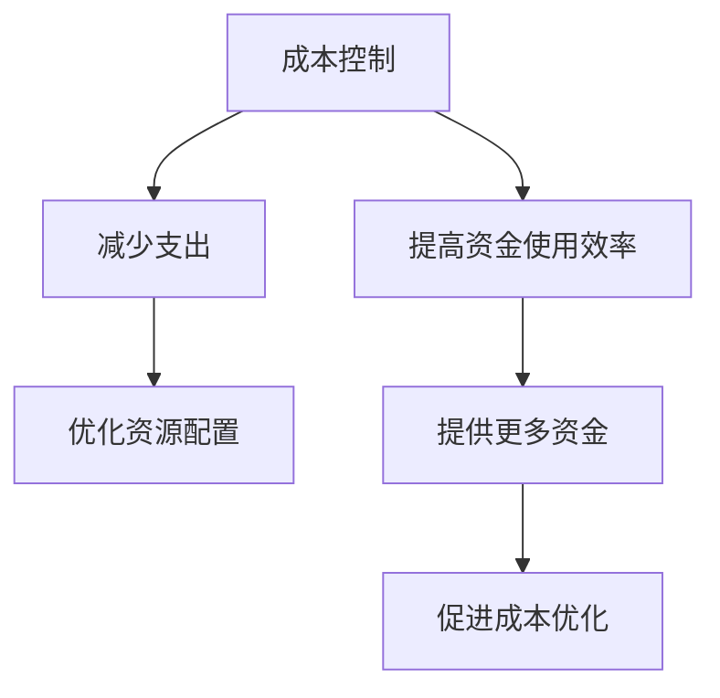

                 

### 第1章: 成本控制与资金使用效率概述

#### 1.1 成本控制的基本概念

**1.1.1 成本的分类**

在成本控制中，我们需要首先了解成本的分类。成本可以分为直接成本和间接成本。

- **直接成本**：直接与产品或服务生产相关的成本，如原材料成本、人工成本等。
- **间接成本**：不直接与产品或服务生产相关的成本，如管理费用、销售费用等。

**1.1.2 成本控制的意义**

成本控制对于企业来说具有重要意义：

- **提高盈利能力**：通过控制成本，减少不必要的支出，从而提高企业的盈利能力。
- **增强竞争力**：在相同的产品质量和服务水平下，降低成本可以为企业带来价格优势，提高市场竞争力。
- **促进可持续发展**：合理控制成本有助于企业实现长期可持续发展。

#### 1.2 资金使用效率的基本概念

**1.2.1 资金使用效率的定义**

资金使用效率是指企业在一定时间内利用资金进行经营活动的能力和效果。具体而言，它衡量的是企业在投入资金后所获得的收益与投入资金的比例。

**1.2.2 提高资金使用效率的重要性**

提高资金使用效率具有以下重要意义：

- **增加企业经济效益**：提高资金使用效率可以为企业带来更多的经济收益，从而提升企业的整体效益。
- **提高投资回报率**：资金使用效率的提升意味着企业在投入一定资金后，能够获得更高的回报率，这有助于吸引更多的投资。
- **促进企业创新能力**：充足的资金可以为企业提供更多的资源，从而推动企业的创新和发展。

### 1.3 成本控制与资金使用效率的关系

**1.3.1 成本控制对资金使用效率的影响**

成本控制对资金使用效率有直接影响：

- **减少不必要的支出**：通过成本控制，企业可以减少不必要的支出，从而释放出更多的资金用于其他更有价值的投资或经营活动。
- **优化资源配置**：成本控制有助于优化企业的资源配置，提高资金的使用效率。

**1.3.2 资金使用效率对成本控制的作用**

资金使用效率的提升有助于成本控制的实现：

- **提供更多的资金**：提高资金使用效率意味着企业在投入相同资金的情况下可以获得更多的收益，这为企业提供了更多的资金用于成本控制。
- **促进成本优化**：高效的资金使用可以为企业提供更多的资源和空间，从而更好地进行成本优化和降低成本。

#### 1.3.3 成本控制与资金使用效率的Mermaid流程图

为了更直观地理解成本控制与资金使用效率之间的关系，我们可以使用Mermaid流程图来展示：

### 1.4 成本控制与资金使用效率的实践案例

为了更好地理解成本控制与资金使用效率在实际中的应用，我们可以看看以下几个案例：

#### 案例一：互联网创业公司

某互联网创业公司在成立初期，通过严格控制成本，包括优化采购流程、减少不必要的开支等，成功地提高了资金使用效率。在资金使用效率提升后，公司有更多的资金用于研发和市场推广，从而在短时间内取得了显著的市场份额。

#### 案例二：制造业企业

一家制造业企业通过引入精益生产理念，对生产流程进行优化，降低了生产成本，提高了资金使用效率。在资金使用效率提升后，企业有更多的资金用于技术改造和设备更新，进一步提高了生产效率和产品质量。

#### 案例三：零售行业

某零售行业企业通过实施数字化管理，对库存、销售等环节进行实时监控和分析，降低了库存成本和运营成本。在资金使用效率提升后，企业有更多的资金用于拓展市场和提高服务水平，从而提升了市场竞争力。

### 1.5 小结

通过以上分析，我们可以看到，成本控制与资金使用效率密切相关。有效的成本控制可以提高资金使用效率，而高效的资金使用又可以促进成本控制的实现。企业在创业初期，通过合理控制成本和提高资金使用效率，可以更好地应对市场挑战，实现可持续发展。

---

在下一章中，我们将深入探讨成本控制的方法，包括成本分类与预算编制、成本控制工具与技术，以及一些成功和失败的案例分析。通过这些方法的学习，我们将为创业初期的成本控制提供实际操作指导。敬请期待！

