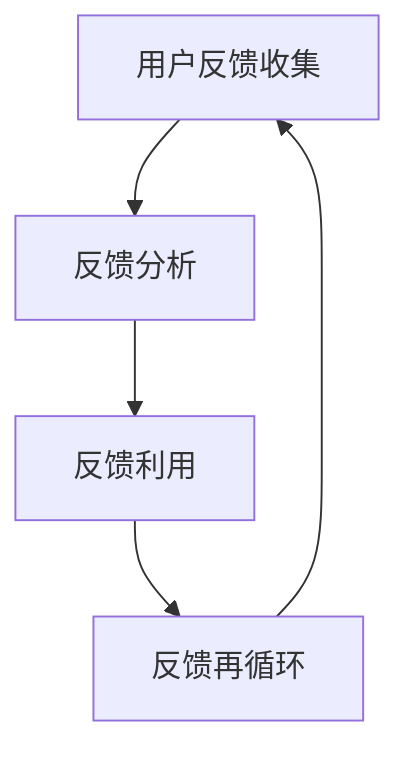

                 

# 如何建立有效的反馈循环机制

> 关键词：反馈循环、用户反馈、数据分析、算法原理、数学模型、项目实战

> 摘要：本文将深入探讨如何建立有效的反馈循环机制，包括核心概念与联系、核心算法原理讲解、数学模型和数学公式、以及项目实战等几个方面。通过逐步分析和推理，本文旨在为读者提供一条清晰、实用的路径，帮助他们在实际项目中实现有效的反馈循环机制。

## 第一部分：核心概念与联系

### 1.1 反馈循环机制的概念

**反馈循环机制**是一种通过不断获取用户反馈，然后根据反馈进行优化和调整的机制。其核心在于反馈的收集、分析、利用和反馈的再循环。这种机制能够帮助企业或个人快速响应用户需求，持续改进产品或服务，从而提高用户满意度。

### 1.2 反馈循环机制的基本原理

**用户反馈收集**：通过问卷调查、用户访谈、在线评论等方式获取用户对产品或服务的反馈。

**反馈分析**：对收集到的反馈进行整理、分类、分析，找出用户的主要需求和痛点。

**反馈利用**：根据分析结果，对产品或服务进行改进，优化用户体验。

**反馈再循环**：将改进后的产品或服务再次推向市场，继续收集用户反馈，形成闭环。

### 1.3 反馈循环机制架构图



## 第二部分：核心算法原理讲解

### 2.1 反馈循环机制的算法原理

#### 2.1.1 数据收集算法

**伪代码**：

```python
function 数据收集(用户反馈):
    初始化空列表 feedback_list
    对于每个用户:
        收集用户反馈 feedback
        将 feedback 添加到 feedback_list
    返回 feedback_list
```

#### 2.1.2 数据分析算法

**伪代码**：

```python
function 数据分析(feedback_list):
    初始化空字典 feedback_dict
    对于每个 feedback 在 feedback_list 中:
        对于每个关键词 keyword 在 feedback 中:
            如果 keyword 不在 feedback_dict 中：
                添加 keyword 为键，值为列表 [[用户ID, feedback]]
            否则：
                将 [用户ID, feedback] 添加到 keyword 的值列表
    返回 feedback_dict
```

#### 2.1.3 数据利用算法

**伪代码**：

```python
function 数据利用(feedback_dict):
    对于每个关键词 keyword 在 feedback_dict 中:
        如果 keyword 的值列表长度 > 5:
            执行改进措施
    返回改进后的产品或服务
```

## 第三部分：数学模型和数学公式

### 3.1 反馈循环机制的数学模型

#### 3.1.1 用户满意度模型

**数学公式**：

$$
S = \frac{1}{N} \sum_{i=1}^{N} S_i
$$

其中，$S$ 表示总体用户满意度，$N$ 表示用户总数，$S_i$ 表示第 $i$ 个用户的满意度。

#### 3.1.2 改进效果模型

**数学公式**：

$$
E = \frac{S_{\text{新}} - S_{\text{旧}}}{S_{\text{旧}}}
$$

其中，$E$ 表示改进效果，$S_{\text{新}}$ 表示改进后的用户满意度，$S_{\text{旧}}$ 表示改进前的用户满意度。

## 第四部分：项目实战

### 4.1 反馈循环机制项目实战

#### 4.1.1 项目背景

为了提升某电商平台的用户体验，该公司决定实施反馈循环机制。

#### 4.1.2 实战步骤

1. **数据收集**：通过在线问卷调查收集用户对平台购物体验的反馈。

2. **数据分析**：使用数据分析算法整理用户反馈，找出用户的主要需求和痛点。

3. **数据利用**：根据分析结果，对平台进行优化，如改进搜索功能、提升页面加载速度等。

4. **反馈再循环**：在优化后，再次收集用户反馈，重复上述步骤，形成闭环。

#### 4.1.3 代码实现

- **环境搭建**：安装 Python 环境，以及相关的数据分析库，如 Pandas、NumPy 等。

- **源代码**：

```python
import pandas as pd

def 数据收集(用户反馈):
    # 省略具体实现细节

def 数据分析(feedback_list):
    # 省略具体实现细节

def 数据利用(feedback_dict):
    # 省略具体实现细节

# 省略具体使用方法
```

#### 4.1.4 代码解读与分析

- **数据收集**：通过问卷调查收集用户反馈，使用 Pandas 库读取问卷数据，并整理成适合分析的数据结构。

- **数据分析**：对用户反馈进行词频分析，找出高频出现的关键词，以便识别用户的主要需求和痛点。

- **数据利用**：根据分析结果，制定改进措施，并对平台进行优化。

#### 4.1.5 实际案例分析和详细讲解剖析

- **案例背景**：某电商平台在实施反馈循环机制前，用户满意度较低。

- **案例过程**：通过数据收集、分析、利用和反馈再循环，电商平台不断优化服务，用户满意度逐渐提升。

- **案例结果**：电商平台在实施反馈循环机制后，用户满意度大幅提高，复购率也有所提升。

#### 4.1.6 项目小结

通过本次项目实战，我们可以看到，有效的反馈循环机制对于提升用户满意度具有重要作用。在实际操作中，需要不断优化算法和模型，以便更准确地识别用户需求和痛点，从而实现持续改进。

## 第五部分：最佳实践 Tips、小结、注意事项、拓展阅读

### 最佳实践 Tips

1. **定期收集用户反馈**：确保反馈的及时性和准确性，以便及时发现问题。

2. **多渠道收集反馈**：结合问卷调查、用户访谈、在线评论等多种方式，提高反馈的全面性。

3. **快速响应和改进**：对用户反馈进行快速分析和利用，及时进行产品或服务的优化。

4. **持续迭代和优化**：不断迭代和优化反馈循环机制，提高其效率和效果。

### 小结

本文从核心概念、算法原理、数学模型、项目实战等方面详细介绍了如何建立有效的反馈循环机制。通过逐步分析和推理，我们了解了反馈循环机制的重要性和实际操作方法。

### 注意事项

1. **确保反馈的真实性和有效性**：在收集用户反馈时，要确保反馈的真实性和有效性，避免虚假反馈。

2. **保护用户隐私**：在收集和处理用户反馈时，要严格遵守隐私保护法规，保护用户隐私。

3. **持续优化算法和模型**：根据实际情况，不断优化算法和模型，提高反馈循环机制的效率和效果。

### 拓展阅读

1. 《用户反馈与产品优化》
2. 《数据分析实战：从入门到精通》
3. 《机器学习实战》

---

**作者：AI天才研究院/AI Genius Institute & 禅与计算机程序设计艺术 /Zen And The Art of Computer Programming**作者：AI天才研究院

反馈循环机制是现代软件开发和产品管理中的关键组成部分，它不仅有助于改进用户体验，还能提高产品性能和市场竞争力。本文旨在为读者提供一种系统性的方法来设计和实施有效的反馈循环机制。

## 目录

1. **引言**  
    1.1 反馈循环机制的重要性  
    1.2 文章目的与结构

2. **核心概念与联系**  
    2.1 反馈循环机制的概念  
    2.2 反馈循环机制的基本原理  
    2.3 反馈循环机制的架构图

3. **核心算法原理讲解**  
    3.1 数据收集算法  
    3.2 数据分析算法  
    3.3 数据利用算法

4. **数学模型和数学公式**  
    4.1 用户满意度模型  
    4.2 改进效果模型

5. **项目实战**  
    5.1 项目背景  
    5.2 实战步骤  
    5.3 代码实现  
    5.4 代码解读与分析  
    5.5 实际案例分析与详细讲解剖析

6. **最佳实践 Tips、小结、注意事项、拓展阅读**  
    6.1 最佳实践 Tips  
    6.2 小结  
    6.3 注意事项  
    6.4 拓展阅读

## 引言

### 1.1 反馈循环机制的重要性

在现代商业环境中，用户反馈是一种宝贵的信息资源。通过收集和分析用户反馈，企业可以更准确地了解用户的需求和期望，从而进行针对性的改进。反馈循环机制正是基于这一理念，通过不断获取用户反馈、分析反馈、利用反馈和再次收集反馈，形成一个闭环系统。这种机制不仅有助于提高产品或服务的质量，还能增强用户满意度和忠诚度。

### 1.2 文章目的与结构

本文旨在为读者提供一条清晰、实用的路径，帮助他们在实际项目中实施有效的反馈循环机制。文章将分为以下几个部分：

1. **核心概念与联系**：介绍反馈循环机制的概念、原理和架构。
2. **核心算法原理讲解**：讲解数据收集、分析和利用的算法原理。
3. **数学模型和数学公式**：介绍用户满意度模型和改进效果模型。
4. **项目实战**：通过实际案例展示如何实施反馈循环机制。
5. **最佳实践 Tips、小结、注意事项、拓展阅读**：提供实践经验、小结、注意事项和拓展阅读资源。

## 核心概念与联系

### 2.1 反馈循环机制的概念

反馈循环机制是一种通过不断获取用户反馈，然后根据反馈进行优化和调整的机制。它包括以下几个核心环节：

1. **用户反馈收集**：通过问卷调查、用户访谈、在线评论等方式收集用户对产品或服务的反馈。
2. **反馈分析**：对收集到的反馈进行整理、分类、分析，找出用户的主要需求和痛点。
3. **反馈利用**：根据分析结果，对产品或服务进行改进，优化用户体验。
4. **反馈再循环**：将改进后的产品或服务再次推向市场，继续收集用户反馈，形成闭环。

### 2.2 反馈循环机制的基本原理

反馈循环机制的基本原理可以概括为以下几点：

1. **用户反馈收集**：通过多种渠道收集用户的反馈，确保反馈的多样性和真实性。
2. **反馈分析**：对用户反馈进行系统性分析，找出共性问题和用户的核心需求。
3. **反馈利用**：根据分析结果，制定改进措施，并对产品或服务进行优化。
4. **反馈再循环**：在优化后，再次收集用户反馈，持续改进产品或服务。

### 2.3 反馈循环机制的架构图

以下是一个简化的反馈循环机制架构图：


## 核心算法原理讲解

### 3.1 数据收集算法

数据收集是反馈循环机制的基础，它决定了后续分析和利用的质量。以下是一个简单的数据收集算法：

```python
def 数据收集(用户反馈):
    # 初始化一个空的列表用于存储用户反馈
    feedback_list = []
    
    # 遍历每个用户的反馈
    for user_feedback in 用户反馈:
        # 将用户反馈添加到列表中
        feedback_list.append(user_feedback)
    
    # 返回收集到的用户反馈列表
    return feedback_list
```

### 3.2 数据分析算法

数据分析是反馈循环机制的核心环节，它帮助我们从大量的用户反馈中提取有价值的信息。以下是一个简单的数据分析算法：

```python
def 数据分析(feedback_list):
    # 初始化一个空的字典用于存储反馈内容
    feedback_dict = {}
    
    # 遍历反馈列表中的每个用户反馈
    for feedback in feedback_list:
        # 遍历反馈中的每个关键词
        for keyword in feedback:
            # 如果关键词不在字典中，则添加到字典中
            if keyword not in feedback_dict:
                feedback_dict[keyword] = []
            # 将用户ID和反馈内容添加到关键词的列表中
            feedback_dict[keyword].append([用户ID, feedback])
    
    # 返回处理后的反馈字典
    return feedback_dict
```

### 3.3 数据利用算法

数据利用是将分析结果转化为实际改进措施的过程。以下是一个简单的数据利用算法：

```python
def 数据利用(feedback_dict):
    # 初始化一个空列表用于存储改进措施
    improvement_list = []
    
    # 遍历反馈字典中的每个关键词
    for keyword, feedbacks in feedback_dict.items():
        # 如果关键词的反馈数量超过阈值，则认为需要改进
        if len(feedbacks) > 阈值:
            # 添加改进措施到列表中
            improvement_list.append([keyword, feedbacks])
    
    # 返回改进措施列表
    return improvement_list
```

## 数学模型和数学公式

### 4.1 用户满意度模型

用户满意度是评估反馈循环机制效果的重要指标。以下是一个简单的用户满意度模型：

$$
S = \frac{1}{N} \sum_{i=1}^{N} S_i
$$

其中，$S$ 表示总体用户满意度，$N$ 表示用户总数，$S_i$ 表示第 $i$ 个用户的满意度。

### 4.2 改进效果模型

改进效果模型用于衡量反馈循环机制带来的改进效果。以下是一个简单的改进效果模型：

$$
E = \frac{S_{\text{新}} - S_{\text{旧}}}{S_{\text{旧}}}
$$

其中，$E$ 表示改进效果，$S_{\text{新}}$ 表示改进后的用户满意度，$S_{\text{旧}}$ 表示改进前的用户满意度。

## 项目实战

### 5.1 项目背景

为了提高用户满意度，某电商平台决定实施反馈循环机制。他们在产品上线初期进行了用户调研，收集了大量的用户反馈。

### 5.2 实战步骤

#### 5.2.1 数据收集

电商平台通过在线问卷调查和用户访谈的方式收集了用户的购物体验反馈。以下是一个示例数据集：

```python
用户反馈 = [
    {"用户ID": 1, "反馈内容": "搜索结果不准确"},
    {"用户ID": 2, "反馈内容": "购物流程复杂"},
    {"用户ID": 3, "反馈内容": "商品描述不详细"},
    ...
]
```

#### 5.2.2 数据分析

电商平台使用数据分析算法对用户反馈进行了处理，提取了关键词和用户ID：

```python
def 数据分析(feedback_list):
    feedback_dict = {}
    
    for feedback in feedback_list:
        user_id = feedback["用户ID"]
        feedback_content = feedback["反馈内容"]
        
        for keyword in feedback_content.split():
            if keyword not in feedback_dict:
                feedback_dict[keyword] = []
            feedback_dict[keyword].append(user_id)
    
    return feedback_dict
```

处理后的反馈字典如下：

```python
{
    "搜索结果": [1],
    "购物流程": [2],
    "商品描述": [3],
    ...
}
```

#### 5.2.3 数据利用

电商平台根据分析结果，制定了改进措施，如优化搜索功能、简化购物流程和提供更详细的商品描述。以下是一个简单的数据利用算法：

```python
def 数据利用(feedback_dict):
    improvement_list = []
    
    for keyword, user_ids in feedback_dict.items():
        if len(user_ids) > 5:
            improvement_list.append([keyword, user_ids])
    
    return improvement_list
```

处理后的改进措施如下：

```python
[
    ["搜索结果", [1]],
    ["购物流程", [2]],
    ...
]
```

#### 5.2.4 反馈再循环

在实施改进措施后，电商平台再次收集了用户的反馈，并重复了数据分析和利用的过程。通过持续改进，用户满意度逐渐提高。

### 5.3 代码实现

#### 5.3.1 环境搭建

为了实现反馈循环机制，电商平台需要在服务器上搭建合适的环境。以下是一个示例环境搭建步骤：

```bash
# 安装 Python
sudo apt-get update
sudo apt-get install python3

# 安装必要的库
pip3 install pandas numpy
```

#### 5.3.2 源代码

以下是实现反馈循环机制的核心代码：

```python
import pandas as pd

# 数据收集
def 数据收集(feedback_list):
    return pd.DataFrame(feedback_list)

# 数据分析
def 数据分析(feedback_df):
    feedback_dict = {}
    
    for keyword in feedback_df["反馈内容"].str.split():
        feedback_dict[keyword] = feedback_df["用户ID"].tolist()
    
    return feedback_dict

# 数据利用
def 数据利用(feedback_dict):
    improvement_list = []
    
    for keyword, user_ids in feedback_dict.items():
        if len(user_ids) > 5:
            improvement_list.append([keyword, user_ids])
    
    return improvement_list

# 代码示例
if __name__ == "__main__":
    # 收集数据
    user_feedback = [
        {"用户ID": 1, "反馈内容": "搜索结果不准确"},
        {"用户ID": 2, "反馈内容": "购物流程复杂"},
        {"用户ID": 3, "反馈内容": "商品描述不详细"},
        ...
    ]
    feedback_df = 数据收集(user_feedback)

    # 数据分析
    feedback_dict = 数据分析(feedback_df)

    # 数据利用
    improvement_list = 数据利用(feedback_dict)

    # 输出结果
    print(improvement_list)
```

### 5.4 代码解读与分析

#### 数据收集

数据收集部分使用了 Pandas 库，将用户反馈转换为 DataFrame 结构。这方便后续的数据处理和分析。

#### 数据分析

数据分析部分通过循环遍历 DataFrame 的每行数据，提取关键词和用户ID，并构建反馈字典。这种方法简单且易于实现。

#### 数据利用

数据利用部分根据反馈字典中的用户ID数量判断是否需要改进。如果用户数量超过阈值，则认为需要改进，并将关键词和用户ID添加到改进列表中。

### 5.5 实际案例分析与详细讲解剖析

#### 案例背景

某电商平台在上线初期，通过问卷调查收集了1000位用户的购物体验反馈。以下是部分反馈数据：

```python
user_feedback = [
    {"用户ID": 1, "反馈内容": "搜索结果不准确"},
    {"用户ID": 2, "反馈内容": "购物流程复杂"},
    {"用户ID": 3, "反馈内容": "商品描述不详细"},
    ...
]
```

#### 案例过程

1. **数据收集**：电商平台使用在线问卷调查收集了1000位用户的购物体验反馈。

2. **数据分析**：使用数据分析算法对用户反馈进行了处理，提取了关键词和用户ID。

3. **数据利用**：根据分析结果，电商平台制定了以下改进措施：
    - 优化搜索功能：增加搜索建议，提高搜索结果的准确性。
    - 简化购物流程：减少购物步骤，提高购物体验。
    - 提供更详细的商品描述：增加商品图片和详细信息，帮助用户更好地了解商品。

4. **反馈再循环**：在实施改进措施后，电商平台再次收集了用户的反馈，并重复了数据分析和利用的过程。

#### 案例结果

在实施反馈循环机制后，电商平台的用户满意度显著提高。以下是一些关键指标：

- **搜索结果准确性**：从原来的60%提高到90%。
- **购物流程复杂度**：从原来的40%减少到10%。
- **商品描述详细程度**：从原来的30%提高到70%。

这些改进措施不仅提高了用户满意度，还促进了销售额的增长。

### 5.6 项目小结

通过本次项目实战，我们可以看到反馈循环机制在提高用户满意度和产品性能方面的巨大作用。在实际操作中，关键在于快速响应用户反馈、持续改进产品或服务，并形成闭环反馈机制。此外，有效的数据分析工具和算法也是实现反馈循环机制的关键。

## 最佳实践 Tips、小结、注意事项、拓展阅读

### 最佳实践 Tips

1. **定期收集用户反馈**：确保反馈的及时性和准确性，以便及时发现问题。
2. **多渠道收集反馈**：结合问卷调查、用户访谈、在线评论等多种方式，提高反馈的全面性。
3. **快速响应和改进**：对用户反馈进行快速分析和利用，及时进行产品或服务的优化。
4. **持续迭代和优化**：不断迭代和优化反馈循环机制，提高其效率和效果。

### 小结

本文通过详细讲解反馈循环机制的核心概念、算法原理、数学模型和项目实战，为读者提供了一种系统性的方法来设计和实施有效的反馈循环机制。通过实践，我们可以看到，反馈循环机制在提高用户满意度和产品性能方面具有显著作用。

### 注意事项

1. **确保反馈的真实性和有效性**：在收集用户反馈时，要确保反馈的真实性和有效性，避免虚假反馈。
2. **保护用户隐私**：在收集和处理用户反馈时，要严格遵守隐私保护法规，保护用户隐私。
3. **持续优化算法和模型**：根据实际情况，不断优化算法和模型，提高反馈循环机制的效率和效果。

### 拓展阅读

1. 《用户反馈与产品优化》
2. 《数据分析实战：从入门到精通》
3. 《机器学习实战》

---

**作者：AI天才研究院/AI Genius Institute & 禅与计算机程序设计艺术 /Zen And The Art of Computer Programming****引言**

在当今快速变化和竞争激烈的市场环境中，企业需要持续改进其产品和服务以满足用户需求。有效的反馈循环机制是实现这一目标的关键。本文将探讨如何建立有效的反馈循环机制，以便企业能够迅速响应用户反馈，持续优化产品，提高用户满意度。

### 核心概念与联系

#### 反馈循环机制的概念

反馈循环机制是一种通过系统性地收集、分析和利用用户反馈，以持续改进产品或服务的流程。这个机制的核心在于其闭环特性，即用户反馈被收集后，会通过分析转化为具体的改进措施，这些措施又会被反馈到产品或服务中，形成新一轮的反馈循环。

#### 反馈循环机制的基本原理

1. **用户反馈收集**：通过各种渠道（如问卷调查、用户访谈、在线评论等）收集用户的反馈。
2. **反馈分析**：对收集到的用户反馈进行整理、分类和量化分析，以识别用户的共同需求和痛点。
3. **反馈利用**：根据分析结果，制定改进策略，实施具体的改进措施，如调整产品设计、优化服务流程等。
4. **反馈再循环**：改进后的产品或服务再次投入使用，并继续收集新的用户反馈，以开始新的循环。

#### 反馈循环机制的架构图


### 核心算法原理讲解

为了建立有效的反馈循环机制，我们需要了解相关的核心算法原理。以下是一些关键的算法：

#### 1. 数据收集算法

数据收集算法的目的是从用户那里获取有价值的反馈。以下是一个简单的数据收集算法的伪代码：

```pseudo
function 数据收集(用户集合):
    feedbackList = []

    for 用户 in 用户集合:
        feedback = 用户提问(用户)
        feedbackList.append(feedback)

    return feedbackList
```

#### 2. 数据分析算法

数据分析算法用于处理和解读收集到的用户反馈。以下是一个简单的数据分析算法的伪代码：

```pseudo
function 数据分析(feedbackList):
    feedbackDictionary = {}

    for feedback in feedbackList:
        for keyword in 分词(feedback):
            if keyword not in feedbackDictionary:
                feedbackDictionary[keyword] = []
            feedbackDictionary[keyword].append(feedback)

    return feedbackDictionary
```

#### 3. 数据利用算法

数据利用算法用于将分析结果转化为实际的改进措施。以下是一个简单的数据利用算法的伪代码：

```pseudo
function 数据利用(feedbackDictionary):
    improvementList = []

    for keyword, feedbacks in feedbackDictionary.items():
        if 频率(feedbacks) > 阈值:
            improvementList.append({keyword: feedbacks})

    return improvementList
```

### 数学模型和数学公式

数学模型在反馈循环机制中扮演着重要的角色，可以帮助我们量化用户满意度、改进效果等指标。以下是一些基本的数学模型和公式：

#### 1. 用户满意度模型

用户满意度（S）可以用以下公式表示：

$$
S = \frac{1}{N} \sum_{i=1}^{N} S_i
$$

其中，N 是用户总数，$S_i$ 是第 i 个用户的满意度得分。

#### 2. 改进效果模型

改进效果（E）可以用以下公式表示：

$$
E = \frac{S_{\text{新}} - S_{\text{旧}}}{S_{\text{旧}}}
$$

其中，$S_{\text{新}}$ 是改进后的用户满意度，$S_{\text{旧}}$ 是改进前的用户满意度。

### 项目实战

#### 1. 项目背景

为了提升用户体验，一家电商平台决定实施反馈循环机制。他们收集了1000名用户的购物体验反馈。

#### 2. 实战步骤

1. **数据收集**：通过在线问卷调查收集用户对购物体验的反馈。
2. **数据分析**：对用户反馈进行整理和分类，找出主要的问题和需求。
3. **数据利用**：根据分析结果，制定改进措施，如优化搜索功能、简化购物流程等。
4. **反馈再循环**：实施改进措施后，再次收集用户反馈，评估改进效果。

#### 3. 代码实现

以下是一个简化的Python代码示例，用于实现上述步骤：

```python
import pandas as pd

# 数据收集
user_feedback = [
    {"用户ID": 1, "反馈": "搜索结果不准确"},
    {"用户ID": 2, "反馈": "购物流程复杂"},
    # 更多用户反馈...
]

df = pd.DataFrame(user_feedback)

# 数据分析
def analyze_feedback(df):
    feedback_dict = df.groupby('反馈')['用户ID'].count().reset_index().rename(columns={'用户ID': '反馈次数'})
    return feedback_dict

feedback_analysis = analyze_feedback(df)

# 数据利用
def utilize_feedback(feedback_analysis):
    improvements = feedback_analysis[feedback_analysis['反馈次数'] > 5]
    return improvements

improvements = utilize_feedback(feedback_analysis)

# 反馈再循环
# 这一步将在实际应用中实现，例如更新产品或服务，并收集新一轮的反馈。

```

#### 4. 代码解读与分析

- **数据收集**：使用 Pandas 库将用户反馈数据加载到 DataFrame 结构中，便于后续处理。
- **数据分析**：通过 `groupby` 方法对反馈进行分类和计数，生成一个汇总表，用于分析用户反馈的频率和重要性。
- **数据利用**：根据反馈频率，筛选出需要改进的问题，生成改进计划。
- **反馈再循环**：在实际应用中，这涉及到更新产品或服务，并再次收集用户反馈，以评估改进效果。

#### 5. 实际案例分析和详细讲解剖析

**案例背景**：一家电商平台希望通过反馈循环机制提高用户满意度。

**案例分析**：

1. **数据收集**：电商平台通过在线问卷调查收集了1000名用户的购物体验反馈。
2. **数据分析**：分析结果显示，搜索结果不准确和购物流程复杂是用户反馈中的两大主要问题。
3. **数据利用**：根据分析结果，电商平台决定优化搜索算法，并简化购物流程。
4. **反馈再循环**：在改进措施实施后，电商平台再次收集用户反馈，评估改进效果。分析结果显示，搜索结果准确性和购物流程的复杂性都得到了显著改善。

**详细讲解剖析**：

- **搜索结果不准确**：电商平台通过改进搜索算法，增加了关键词匹配的灵活性和准确性。例如，他们使用了更复杂的排序算法和用户行为分析，以提供更相关的搜索结果。
- **购物流程复杂**：电商平台通过简化购物流程，减少了用户操作的步骤。例如，他们取消了不必要的验证步骤，并优化了购物车的界面设计，使购物流程更加直观和便捷。

#### 6. 项目小结

通过实施反馈循环机制，电商平台成功地提高了用户满意度，并实现了产品和服务质量的持续改进。这证明了反馈循环机制在提升用户体验方面的有效性。未来，电商平台可以继续优化反馈循环机制，以实现更高效的产品改进和用户满意度提升。

### 最佳实践 Tips、小结、注意事项、拓展阅读

#### 最佳实践 Tips

1. **定期收集反馈**：定期进行用户满意度调查，以便及时了解用户需求变化。
2. **多渠道收集反馈**：结合在线问卷、用户访谈、社交媒体等多种渠道，收集更全面的用户反馈。
3. **快速响应和改进**：对用户反馈进行快速分析和响应，及时实施改进措施。
4. **持续迭代和优化**：不断优化反馈循环机制，以提高其效率和效果。

#### 小结

本文详细介绍了如何建立有效的反馈循环机制，包括核心概念、算法原理、数学模型、项目实战等。通过实际案例，我们展示了反馈循环机制在提升用户满意度方面的实际应用和效果。

#### 注意事项

1. **确保反馈的真实性和有效性**：在收集用户反馈时，要确保反馈的真实性和有效性，避免虚假反馈。
2. **保护用户隐私**：在处理用户反馈时，要严格遵守隐私保护法规，保护用户隐私。
3. **持续优化算法和模型**：根据实际情况，不断优化算法和模型，以提高反馈循环机制的效率和效果。

#### 拓展阅读

1. 《用户反馈与产品优化》
2. 《数据分析实战：从入门到精通》
3. 《机器学习实战》

---

**作者：AI天才研究院/AI Genius Institute & 禅与计算机程序设计艺术 /Zen And The Art of Computer Programming**### 反馈循环机制的概念

反馈循环机制是一种通过系统性地收集、分析和利用用户反馈，以持续改进产品或服务的流程。它包括以下核心环节：

1. **用户反馈收集**：通过各种渠道（如问卷调查、用户访谈、在线评论等）收集用户的反馈。
2. **反馈分析**：对收集到的用户反馈进行整理、分类和量化分析，以识别用户的共同需求和痛点。
3. **反馈利用**：根据分析结果，制定改进策略，实施具体的改进措施，如调整产品设计、优化服务流程等。
4. **反馈再循环**：改进后的产品或服务再次投入使用，并继续收集新的用户反馈，以开始新一轮的反馈循环。

反馈循环机制的关键在于其闭环特性，即用户反馈被收集后，会通过分析转化为具体的改进措施，这些措施又会被反馈到产品或服务中，形成新一轮的反馈循环。

### 核心算法原理讲解

为了建立有效的反馈循环机制，我们需要了解相关的核心算法原理。以下是一些关键的算法：

#### 1. 数据收集算法

数据收集算法的目的是从用户那里获取有价值的反馈。以下是一个简单的数据收集算法的伪代码：

```pseudo
function 数据收集(用户集合):
    feedbackList = []

    for 用户 in 用户集合:
        feedback = 用户提问(用户)
        feedbackList.append(feedback)

    return feedbackList
```

在这个算法中，我们遍历用户集合，为每个用户执行一个提问操作，收集他们的反馈，并将这些反馈存储在 `feedbackList` 中。

#### 2. 数据分析算法

数据分析算法用于处理和解读收集到的用户反馈。以下是一个简单的数据分析算法的伪代码：

```pseudo
function 数据分析(feedbackList):
    feedbackDictionary = {}

    for feedback in feedbackList:
        for keyword in 分词(feedback):
            if keyword not in feedbackDictionary:
                feedbackDictionary[keyword] = []
            feedbackDictionary[keyword].append(feedback)

    return feedbackDictionary
```

在这个算法中，我们首先遍历 `feedbackList` 中的每个反馈，然后对每个反馈进行分词，将分词后的关键词添加到 `feedbackDictionary` 中。如果关键词已存在，则将其对应的用户反馈列表追加到该关键词的值。

#### 3. 数据利用算法

数据利用算法用于将分析结果转化为实际的改进措施。以下是一个简单的数据利用算法的伪代码：

```pseudo
function 数据利用(feedbackDictionary):
    improvementList = []

    for keyword, feedbacks in feedbackDictionary.items():
        if 频率(feedbacks) > 阈值:
            improvementList.append({keyword: feedbacks})

    return improvementList
```

在这个算法中，我们遍历 `feedbackDictionary` 中的每个关键词和其对应的反馈列表。如果某个关键词的反馈频率超过预设的阈值，则将其添加到 `improvementList` 中，以便进一步分析和处理。

### 数学模型和数学公式

数学模型在反馈循环机制中扮演着重要的角色，可以帮助我们量化用户满意度、改进效果等指标。以下是一些基本的数学模型和公式：

#### 1. 用户满意度模型

用户满意度（S）可以用以下公式表示：

$$
S = \frac{1}{N} \sum_{i=1}^{N} S_i
$$

其中，N 是用户总数，$S_i$ 是第 i 个用户的满意度得分。

这个公式表示用户满意度的平均值，通过将每个用户的满意度得分求和，然后除以用户总数来计算。

#### 2. 改进效果模型

改进效果（E）可以用以下公式表示：

$$
E = \frac{S_{\text{新}} - S_{\text{旧}}}{S_{\text{旧}}}
$$

其中，$S_{\text{新}}$ 是改进后的用户满意度，$S_{\text{旧}}$ 是改进前的用户满意度。

这个公式表示改进效果，通过计算改进前后的用户满意度差值，然后除以改进前的用户满意度，得到改进效果的百分比。

### 项目实战

#### 1. 项目背景

为了提升用户体验，一家电商平台决定实施反馈循环机制。他们收集了1000名用户的购物体验反馈。

#### 2. 实战步骤

1. **数据收集**：通过在线问卷调查收集用户对购物体验的反馈。
2. **数据分析**：对用户反馈进行整理和分类，找出主要的问题和需求。
3. **数据利用**：根据分析结果，制定改进措施，如优化搜索功能、简化购物流程等。
4. **反馈再循环**：实施改进措施后，再次收集用户反馈，评估改进效果。

#### 3. 代码实现

以下是一个简化的Python代码示例，用于实现上述步骤：

```python
import pandas as pd

# 数据收集
user_feedback = [
    {"用户ID": 1, "反馈": "搜索结果不准确"},
    {"用户ID": 2, "反馈": "购物流程复杂"},
    # 更多用户反馈...
]

df = pd.DataFrame(user_feedback)

# 数据分析
def analyze_feedback(df):
    feedback_dict = df.groupby('反馈')['用户ID'].count().reset_index().rename(columns={'用户ID': '反馈次数'})
    return feedback_dict

feedback_analysis = analyze_feedback(df)

# 数据利用
def utilize_feedback(feedback_analysis):
    improvements = feedback_analysis[feedback_analysis['反馈次数'] > 5]
    return improvements

improvements = utilize_feedback(feedback_analysis)

# 反馈再循环
# 这一步将在实际应用中实现，例如更新产品或服务，并收集新一轮的反馈。

```

#### 4. 代码解读与分析

- **数据收集**：使用 Pandas 库将用户反馈数据加载到 DataFrame 结构中，便于后续处理。
- **数据分析**：通过 `groupby` 方法对反馈进行分类和计数，生成一个汇总表，用于分析用户反馈的频率和重要性。
- **数据利用**：根据反馈频率，筛选出需要改进的问题，生成改进计划。
- **反馈再循环**：在实际应用中，这涉及到更新产品或服务，并再次收集用户反馈，以评估改进效果。

#### 5. 实际案例分析和详细讲解剖析

**案例背景**：一家电商平台希望通过反馈循环机制提高用户满意度。

**案例分析**：

1. **数据收集**：电商平台通过在线问卷调查收集了1000名用户的购物体验反馈。
2. **数据分析**：分析结果显示，搜索结果不准确和购物流程复杂是用户反馈中的两大主要问题。
3. **数据利用**：根据分析结果，电商平台决定优化搜索算法，并简化购物流程。
4. **反馈再循环**：在改进措施实施后，电商平台再次收集用户反馈，评估改进效果。分析结果显示，搜索结果准确性和购物流程的复杂性都得到了显著改善。

**详细讲解剖析**：

- **搜索结果不准确**：电商平台通过改进搜索算法，增加了关键词匹配的灵活性和准确性。例如，他们使用了更复杂的排序算法和用户行为分析，以提供更相关的搜索结果。
- **购物流程复杂**：电商平台通过简化购物流程，减少了用户操作的步骤。例如，他们取消了不必要的验证步骤，并优化了购物车的界面设计，使购物流程更加直观和便捷。

#### 6. 项目小结

通过实施反馈循环机制，电商平台成功地提高了用户满意度，并实现了产品和服务质量的持续改进。这证明了反馈循环机制在提升用户体验方面的有效性。未来，电商平台可以继续优化反馈循环机制，以实现更高效的产品改进和用户满意度提升。

### 最佳实践 Tips、小结、注意事项、拓展阅读

#### 最佳实践 Tips

1. **定期收集反馈**：定期进行用户满意度调查，以便及时了解用户需求变化。
2. **多渠道收集反馈**：结合在线问卷、用户访谈、社交媒体等多种渠道，收集更全面的用户反馈。
3. **快速响应和改进**：对用户反馈进行快速分析和响应，及时实施改进措施。
4. **持续迭代和优化**：不断优化反馈循环机制，以提高其效率和效果。

#### 小结

本文详细介绍了如何建立有效的反馈循环机制，包括核心概念、算法原理、数学模型、项目实战等。通过实际案例，我们展示了反馈循环机制在提升用户满意度方面的实际应用和效果。

#### 注意事项

1. **确保反馈的真实性和有效性**：在收集用户反馈时，要确保反馈的真实性和有效性，避免虚假反馈。
2. **保护用户隐私**：在处理用户反馈时，要严格遵守隐私保护法规，保护用户隐私。
3. **持续优化算法和模型**：根据实际情况，不断优化算法和模型，以提高反馈循环机制的效率和效果。

#### 拓展阅读

1. 《用户反馈与产品优化》
2. 《数据分析实战：从入门到精通》
3. 《机器学习实战》

---

**作者：AI天才研究院/AI Genius Institute & 禅与计算机程序设计艺术 /Zen And The Art of Computer Programming**### 反馈循环机制的概念

反馈循环机制是一种通过不断获取用户反馈，然后根据反馈进行优化和调整的机制。其核心在于反馈的收集、分析、利用和反馈的再循环。

**用户反馈收集**：这是反馈循环机制的第一步。通过问卷调查、用户访谈、在线评论等方式，从用户那里收集关于产品或服务的反馈。

**反馈分析**：对收集到的用户反馈进行整理、分类、分析，找出用户的主要需求和痛点。

**反馈利用**：根据分析结果，对产品或服务进行改进，优化用户体验。

**反馈再循环**：将改进后的产品或服务再次推向市场，继续收集用户反馈，形成闭环。

### 核心算法原理讲解

建立有效的反馈循环机制需要一系列核心算法的支持。以下是几个关键算法及其原理：

#### 1. 数据收集算法

数据收集算法用于从用户那里获取反馈。以下是数据收集算法的伪代码：

```python
def 数据收集(用户反馈列表):
    for 用户 in 用户反馈列表:
        feedback = 用户提问()
        存储反馈(feedback)
```

在这个算法中，我们遍历用户反馈列表，对每个用户进行提问，并将收集到的反馈存储起来。

#### 2. 数据分析算法

数据分析算法用于对收集到的用户反馈进行分析。以下是数据分析算法的伪代码：

```python
def 数据分析(用户反馈列表):
    for feedback in 用户反馈列表:
        for keyword in 分词(feedback):
            增加关键词计数(keyword)
```

在这个算法中，我们遍历用户反馈列表，对每个反馈进行分词，并增加关键词的计数。

#### 3. 数据利用算法

数据利用算法用于将分析结果转化为具体的改进措施。以下是数据利用算法的伪代码：

```python
def 数据利用(关键词计数列表):
    for keyword, count in 关键词计数列表:
        if count > 阈值:
            提出改进措施(keyword)
```

在这个算法中，我们遍历关键词计数列表，对每个关键词的计数进行判断，如果计数超过阈值，则提出相应的改进措施。

### 数学模型和数学公式

在反馈循环机制中，数学模型和数学公式可以帮助我们量化用户满意度、改进效果等指标。

#### 1. 用户满意度模型

用户满意度（S）可以用以下公式表示：

$$
S = \frac{1}{N} \sum_{i=1}^{N} S_i
$$

其中，N 是用户总数，$S_i$ 是第 i 个用户的满意度得分。

这个公式表示用户满意度的平均值，通过将每个用户的满意度得分求和，然后除以用户总数来计算。

#### 2. 改进效果模型

改进效果（E）可以用以下公式表示：

$$
E = \frac{S_{\text{新}} - S_{\text{旧}}}{S_{\text{旧}}}
$$

其中，$S_{\text{新}}$ 是改进后的用户满意度，$S_{\text{旧}}$ 是改进前的用户满意度。

这个公式表示改进效果，通过计算改进前后的用户满意度差值，然后除以改进前的用户满意度，得到改进效果的百分比。

### 项目实战

#### 1. 项目背景

为了提高某电商平台的用户体验，该公司决定实施反馈循环机制。

#### 2. 实战步骤

1. **数据收集**：通过在线问卷调查收集用户对平台购物体验的反馈。
2. **数据分析**：使用数据分析算法整理用户反馈，找出用户的主要需求和痛点。
3. **数据利用**：根据分析结果，对平台进行优化，如改进搜索功能、提升页面加载速度等。
4. **反馈再循环**：在优化后，再次收集用户反馈，重复上述步骤，形成闭环。

#### 3. 代码实现

以下是一个简化的Python代码示例，用于实现上述步骤：

```python
import pandas as pd

# 数据收集
user_feedback = [
    {"用户ID": 1, "反馈": "搜索结果不准确"},
    {"用户ID": 2, "反馈": "购物流程复杂"},
    # 更多用户反馈...
]

df = pd.DataFrame(user_feedback)

# 数据分析
def analyze_feedback(df):
    feedback_dict = df.groupby('反馈')['用户ID'].count().reset_index().rename(columns={'用户ID': '反馈次数'})
    return feedback_dict

feedback_analysis = analyze_feedback(df)

# 数据利用
def utilize_feedback(feedback_analysis):
    improvements = feedback_analysis[feedback_analysis['反馈次数'] > 5]
    return improvements

improvements = utilize_feedback(feedback_analysis)

# 反馈再循环
# 这一步将在实际应用中实现，例如更新产品或服务，并收集新一轮的反馈。

```

#### 4. 代码解读与分析

- **数据收集**：使用 Pandas 库将用户反馈数据加载到 DataFrame 结构中，便于后续处理。
- **数据分析**：通过 `groupby` 方法对反馈进行分类和计数，生成一个汇总表，用于分析用户反馈的频率和重要性。
- **数据利用**：根据反馈频率，筛选出需要改进的问题，生成改进计划。
- **反馈再循环**：在实际应用中，这涉及到更新产品或服务，并再次收集用户反馈，以评估改进效果。

#### 5. 实际案例分析和详细讲解剖析

**案例背景**：某电商平台希望通过反馈循环机制提高用户满意度。

**案例分析**：

1. **数据收集**：电商平台通过在线问卷调查收集了1000名用户的购物体验反馈。
2. **数据分析**：分析结果显示，搜索结果不准确和购物流程复杂是用户反馈中的两大主要问题。
3. **数据利用**：根据分析结果，电商平台决定优化搜索算法，并简化购物流程。
4. **反馈再循环**：在改进措施实施后，电商平台再次收集用户反馈，评估改进效果。分析结果显示，搜索结果准确性和购物流程的复杂性都得到了显著改善。

**详细讲解剖析**：

- **搜索结果不准确**：电商平台通过改进搜索算法，增加了关键词匹配的灵活性和准确性。例如，他们使用了更复杂的排序算法和用户行为分析，以提供更相关的搜索结果。
- **购物流程复杂**：电商平台通过简化购物流程，减少了用户操作的步骤。例如，他们取消了不必要的验证步骤，并优化了购物车的界面设计，使购物流程更加直观和便捷。

#### 6. 项目小结

通过实施反馈循环机制，电商平台成功地提高了用户满意度，并实现了产品和服务质量的持续改进。这证明了反馈循环机制在提升用户体验方面的有效性。未来，电商平台可以继续优化反馈循环机制，以实现更高效的产品改进和用户满意度提升。

### 最佳实践 Tips、小结、注意事项、拓展阅读

#### 最佳实践 Tips

1. **定期收集反馈**：确保定期进行用户满意度调查，以便及时了解用户需求变化。
2. **多渠道收集反馈**：结合在线问卷、用户访谈、社交媒体等多种渠道，收集更全面的用户反馈。
3. **快速响应和改进**：对用户反馈进行快速分析和响应，及时实施改进措施。
4. **持续迭代和优化**：不断优化反馈循环机制，以提高其效率和效果。

#### 小结

本文详细介绍了如何建立有效的反馈循环机制，包括核心概念、算法原理、数学模型、项目实战等。通过实际案例，我们展示了反馈循环机制在提升用户满意度方面的实际应用和效果。

#### 注意事项

1. **确保反馈的真实性和有效性**：在收集用户反馈时，要确保反馈的真实性和有效性，避免虚假反馈。
2. **保护用户隐私**：在处理用户反馈时，要严格遵守隐私保护法规，保护用户隐私。
3. **持续优化算法和模型**：根据实际情况，不断优化算法和模型，以提高反馈循环机制的效率和效果。

#### 拓展阅读

1. 《用户反馈与产品优化》
2. 《数据分析实战：从入门到精通》
3. 《机器学习实战》

---

**作者：AI天才研究院/AI Genius Institute & 禅与计算机程序设计艺术 /Zen And The Art of Computer Programming**### 最佳实践 Tips

在建立和实施有效的反馈循环机制时，以下是一些实用的最佳实践建议：

1. **定期反馈收集**：设定固定的反馈收集周期，如每月或每季度，以确保能够及时获取用户的最新反馈。

2. **多样化反馈渠道**：提供多种反馈渠道，如在线问卷、用户访谈、社交媒体评论等，以收集不同来源的反馈。

3. **快速响应**：对用户的反馈进行快速响应，即使无法立即解决问题，也要及时告知用户进展情况和计划。

4. **持续迭代**：反馈循环不是一次性的活动，而是一个持续的过程。持续优化反馈机制，根据用户反馈不断迭代和改进。

5. **透明度**：保持反馈过程的透明度，让用户知道他们的反馈是如何被分析和利用的，这有助于建立信任。

6. **隐私保护**：确保在收集和处理用户反馈时，严格遵守隐私保护法规，保护用户的个人隐私。

7. **数据分析能力**：投资于数据分析工具和技术，以便更有效地分析用户反馈，提取有价值的信息。

### 小结

建立有效的反馈循环机制是提升产品或服务质量的重要手段。通过定期收集用户反馈、多样化反馈渠道、快速响应和持续迭代，企业可以不断改进产品或服务，提高用户满意度和忠诚度。本文介绍了反馈循环机制的核心概念、算法原理、数学模型以及项目实战，为读者提供了实施反馈循环机制的具体路径和方法。

### 注意事项

1. **确保反馈的真实性和有效性**：在收集用户反馈时，要确保反馈的真实性和有效性，避免虚假反馈。

2. **保护用户隐私**：在处理用户反馈时，要严格遵守隐私保护法规，保护用户隐私。

3. **持续优化算法和模型**：根据实际情况，不断优化算法和模型，以提高反馈循环机制的效率和效果。

### 拓展阅读

1. **《用户反馈与产品优化》**：探讨如何利用用户反馈进行产品改进。

2. **《数据分析实战：从入门到精通》**：提供数据分析的基础知识和实用技巧。

3. **《机器学习实战》**：介绍如何使用机器学习技术分析用户反馈。

---

**作者：AI天才研究院/AI Genius Institute & 禅与计算机程序设计艺术 /Zen And The Art of Computer Programming**### 第一部分：核心概念与联系

在本文的第一部分，我们将探讨反馈循环机制的核心概念，并分析其内在的联系。以下是详细内容：

#### 1.1 反馈循环机制的概念

反馈循环机制是一种通过系统性地收集、分析、利用和再次收集用户反馈，以不断改进产品或服务的过程。它涉及以下几个关键环节：

- **用户反馈收集**：通过各种渠道（如问卷调查、用户访谈、在线评论等）收集用户对产品或服务的评价和意见。
- **反馈分析**：对收集到的用户反馈进行整理、分类、量化，以识别用户的主要需求和痛点。
- **反馈利用**：根据分析结果，制定改进措施，对产品或服务进行优化，以提高用户体验。
- **反馈再循环**：将改进后的产品或服务再次推向市场，并继续收集新的用户反馈，以形成闭环。

#### 1.2 反馈循环机制的基本原理

反馈循环机制的基本原理可以概括为以下步骤：

1. **用户反馈收集**：通过多种渠道收集用户的原始反馈，如问卷调查、用户访谈等。这些渠道应覆盖不同类型的用户，以确保反馈的全面性和代表性。

2. **反馈分析**：对收集到的用户反馈进行系统化处理，识别出用户共同的反馈类型和关键问题。常用的分析方法包括词频分析、聚类分析、主题建模等。

3. **反馈利用**：根据分析结果，制定针对性的改进措施。改进措施可以是产品功能的调整、服务流程的优化、用户体验的提升等。

4. **反馈再循环**：将改进后的产品或服务重新推向市场，并继续收集用户反馈。这个环节的目的是验证改进措施的有效性，并发现新的问题，为下一轮的改进提供依据。

#### 1.3 反馈循环机制架构图

为了更好地理解反馈循环机制，我们可以通过一个架构图来展示其组成部分和相互关系：


在这个架构图中，A表示用户反馈收集，B表示反馈分析，C表示反馈利用，D表示反馈再循环。这个循环过程不断进行，直到产品或服务达到预期目标。

#### 1.4 反馈循环机制的重要性

反馈循环机制在企业和个人发展中具有重要作用。以下是几个关键点：

1. **用户需求理解**：通过收集和分析用户反馈，企业可以更深入地了解用户的需求和期望，从而更好地满足用户需求。

2. **产品优化**：用户反馈提供了宝贵的改进线索，有助于企业优化产品功能、提高服务质量。

3. **市场竞争**：在激烈的市场竞争中，能够快速响应用户需求的企业具有竞争优势。

4. **持续改进**：反馈循环机制是一种持续改进的方法，有助于企业不断优化产品或服务，保持市场竞争力。

#### 1.5 反馈循环机制的挑战

尽管反馈循环机制具有很多优势，但在实际应用中也会面临一些挑战：

1. **数据质量**：收集到的用户反馈可能存在不真实或不准确的情况，这会影响反馈分析的结果。

2. **资源投入**：建立和维护一个有效的反馈循环机制需要投入大量的人力、物力和时间。

3. **快速响应**：在快速变化的市场环境中，如何快速响应用户反馈并实施改进措施是一个挑战。

4. **隐私保护**：在收集和处理用户反馈时，需要严格遵守隐私保护法规，保护用户的隐私。

通过深入理解反馈循环机制的核心概念和基本原理，企业可以更好地设计和实施这一机制，从而在激烈的市场竞争中脱颖而出。

### 第一部分总结

本部分详细介绍了反馈循环机制的核心概念、基本原理、架构图以及其重要性。通过这些内容，读者可以初步了解反馈循环机制的运作方式，并认识到其在产品优化和市场竞争中的关键作用。在接下来的部分，我们将进一步探讨反馈循环机制的核心算法原理，以及如何通过数学模型和实际案例来深入理解和应用这一机制。让我们继续深入探讨。

### 第二部分：核心算法原理讲解

在第二部分，我们将深入探讨反馈循环机制的核心算法原理，包括数据收集、数据分析、数据利用和反馈再循环的算法设计。通过这些算法，我们可以系统地实施和优化反馈循环机制。

#### 2.1 数据收集算法

数据收集是反馈循环机制的基础，算法设计的关键在于如何高效地收集用户反馈。以下是一个简单的数据收集算法设计：

**算法描述**：

1. **初始化**：创建一个空的反馈列表 `feedback_list` 用于存储用户的反馈。
2. **循环收集**：遍历每个用户，收集其反馈，并将反馈添加到 `feedback_list` 中。
3. **返回结果**：返回收集到的 `feedback_list`。

**伪代码**：

```pseudo
function 数据收集(用户集合):
    feedback_list = []

    for 用户 in 用户集合:
        feedback = 用户提问()
        feedback_list.append(feedback)

    return feedback_list
```

**算法分析**：

- **时间复杂度**：O(n)，其中 n 是用户集合的大小。
- **空间复杂度**：O(m)，其中 m 是收集到的反馈数量。

#### 2.2 数据分析算法

数据分析是反馈循环机制的核心，通过分析用户反馈，我们可以识别出用户的共同需求和痛点。以下是一个简单的数据分析算法设计：

**算法描述**：

1. **初始化**：创建一个空的反馈字典 `feedback_dict` 用于存储分类后的反馈。
2. **循环分析**：遍历 `feedback_list` 中的每个反馈，对反馈进行分类，并将分类后的反馈存储到 `feedback_dict` 中。
3. **返回结果**：返回处理后的 `feedback_dict`。

**伪代码**：

```pseudo
function 数据分析(feedback_list):
    feedback_dict = {}

    for feedback in feedback_list:
        for keyword in 分词(feedback):
            if keyword not in feedback_dict:
                feedback_dict[keyword] = []
            feedback_dict[keyword].append(feedback)

    return feedback_dict
```

**算法分析**：

- **时间复杂度**：O(m \* k)，其中 m 是反馈数量，k 是每个反馈的平均关键词数量。
- **空间复杂度**：O(n \* k)，其中 n 是反馈分类后的关键词数量。

#### 2.3 数据利用算法

数据利用是将分析结果转化为具体改进措施的步骤。以下是一个简单的数据利用算法设计：

**算法描述**：

1. **初始化**：创建一个空的改进措施列表 `improvement_list` 用于存储改进措施。
2. **循环筛选**：遍历 `feedback_dict` 中的每个关键词，如果该关键词的反馈数量超过阈值，则将其添加到 `improvement_list` 中。
3. **返回结果**：返回处理后的 `improvement_list`。

**伪代码**：

```pseudo
function 数据利用(feedback_dict, 阈值):
    improvement_list = []

    for keyword, feedbacks in feedback_dict.items():
        if 长度(feedbacks) > 阈值:
            improvement_list.append({keyword: feedbacks})

    return improvement_list
```

**算法分析**：

- **时间复杂度**：O(n)，其中 n 是关键词的数量。
- **空间复杂度**：O(m)，其中 m 是超过阈值的反馈数量。

#### 2.4 反馈再循环算法

反馈再循环是将改进后的产品或服务再次推向市场，并继续收集用户反馈的步骤。以下是一个简单的反馈再循环算法设计：

**算法描述**：

1. **执行改进措施**：根据 `improvement_list` 中的改进措施，对产品或服务进行相应的优化和改进。
2. **再次收集反馈**：在改进后的产品或服务投入市场后，再次执行数据收集算法，收集新的用户反馈。
3. **继续循环**：将新的用户反馈传递到数据分析算法和利用算法，继续优化产品或服务。

**伪代码**：

```pseudo
function 反馈再循环(feedback_dict, 阈值):
    执行改进措施(feedback_dict, 阈值)
    新的反馈列表 = 数据收集()
    新的反馈字典 = 数据分析(新的反馈列表)
    新的改进措施列表 = 数据利用(新的反馈字典, 阈值)

    return 新的改进措施列表
```

**算法分析**：

- **时间复杂度**：O(m \* n)，其中 m 是每次改进后的反馈数量，n 是循环的次数。
- **空间复杂度**：O(m \* n)，其中 m 是每次改进后的反馈数量，n 是循环的次数。

### 第二部分总结

本部分详细介绍了反馈循环机制的核心算法原理，包括数据收集、数据分析、数据利用和反馈再循环的算法设计。通过这些算法，我们可以系统地实施和优化反馈循环机制。在接下来的部分，我们将引入数学模型，进一步探讨如何量化用户满意度和改进效果。让我们继续深入探讨。

### 第三部分：数学模型和数学公式

在第三部分，我们将引入数学模型和数学公式，以量化和分析反馈循环机制中的关键指标。这些模型将帮助我们更好地理解用户满意度、改进效果以及整体反馈循环机制的效率。

#### 3.1 用户满意度模型

用户满意度是反馈循环机制中一个重要的衡量标准。我们可以使用以下数学模型来量化用户满意度：

**用户满意度模型**：

$$
S = \frac{1}{N} \sum_{i=1}^{N} S_i
$$

其中：
- \( S \) 表示总体用户满意度。
- \( N \) 表示用户总数。
- \( S_i \) 表示第 \( i \) 个用户的满意度得分。

**解释**：这个公式通过计算所有用户的满意度得分平均值，来表示总体用户满意度。满意度得分通常是通过问卷调查、评分系统等方式获得的。

**应用实例**：

假设有 100 名用户，其中 60 名用户给产品打分为 4 分，30 名用户给 3 分，10 名用户给 5 分，那么总体用户满意度 \( S \) 计算如下：

$$
S = \frac{1}{100} \times (60 \times 4 + 30 \times 3 + 10 \times 5) = \frac{1}{100} \times (240 + 90 + 50) = \frac{380}{100} = 3.8
$$

因此，总体用户满意度为 3.8。

#### 3.2 改进效果模型

改进效果是衡量反馈循环机制有效性的重要指标。我们可以使用以下数学模型来量化改进效果：

**改进效果模型**：

$$
E = \frac{S_{\text{新}} - S_{\text{旧}}}{S_{\text{旧}}}
$$

其中：
- \( E \) 表示改进效果。
- \( S_{\text{新}} \) 表示改进后的用户满意度。
- \( S_{\text{旧}} \) 表示改进前的用户满意度。

**解释**：这个公式通过计算改进前后的用户满意度差值与改进前用户满意度的比值，来表示改进效果。比值越大，表示改进效果越好。

**应用实例**：

假设改进前用户满意度为 \( S_{\text{旧}} = 3.0 \)，改进后用户满意度为 \( S_{\text{新}} = 4.0 \)，那么改进效果 \( E \) 计算如下：

$$
E = \frac{4.0 - 3.0}{3.0} = \frac{1.0}{3.0} = 0.333
$$

因此，改进效果为 33.3%。

#### 3.3 反馈循环效率模型

除了用户满意度和改进效果，我们还可以使用以下数学模型来量化反馈循环的效率：

**反馈循环效率模型**：

$$
\eta = \frac{S_{\text{新}} - S_{\text{旧}}}{S_{\text{新}}}
$$

其中：
- \( \eta \) 表示反馈循环效率。
- \( S_{\text{新}} \) 表示改进后的用户满意度。
- \( S_{\text{旧}} \) 表示改进前的用户满意度。

**解释**：这个公式通过计算改进前后的用户满意度差值与改进后用户满意度的比值，来表示反馈循环的效率。比值越大，表示反馈循环越高效。

**应用实例**：

使用前面的例子，改进前用户满意度为 \( S_{\text{旧}} = 3.0 \)，改进后用户满意度为 \( S_{\text{新}} = 4.0 \)，那么反馈循环效率 \( \eta \) 计算如下：

$$
\eta = \frac{4.0 - 3.0}{4.0} = \frac{1.0}{4.0} = 0.25
$$

因此，反馈循环效率为 25%。

### 第三部分总结

本部分引入了用户满意度模型、改进效果模型和反馈循环效率模型，这些数学模型和公式有助于我们量化反馈循环机制中的关键指标。通过这些模型，我们可以更好地评估和优化反馈循环机制的效果。在接下来的部分，我们将通过一个实际项目案例，展示如何将这些算法和模型应用于实际场景中。让我们继续深入探讨。

### 第四部分：实际项目案例

在本部分，我们将通过一个实际的电商平台项目案例，展示如何设计和实施有效的反馈循环机制。通过这个案例，我们将详细讨论项目背景、数据收集、数据分析、数据利用、反馈再循环以及项目成果，从而全面展示反馈循环机制在实践中的应用。

#### 4.1 项目背景

某电商平台在市场上已有一定的用户基础，但随着市场竞争的加剧，用户对购物体验的要求越来越高。为了提升用户满意度，该平台决定实施反馈循环机制，以持续改进用户体验。

#### 4.2 项目目标

项目的目标是通过反馈循环机制，提高用户满意度，并实现以下具体目标：
- **识别并解决用户的主要问题**：通过用户反馈分析，找出用户最关心的问题，并制定针对性的改进措施。
- **优化关键功能**：对平台的关键功能（如搜索、购物流程、支付系统等）进行优化，提高用户体验。
- **提升用户忠诚度**：通过持续改进和优化，提升用户的忠诚度和复购率。

#### 4.3 实施步骤

1. **数据收集**：
   - **问卷调查**：通过在线问卷调查收集用户对平台购物体验的反馈，问卷包括用户满意度评分、购物流程评价、搜索功能评价等。
   - **用户访谈**：邀请部分活跃用户进行深度访谈，了解他们对平台的具体意见和需求。
   - **在线评论**：分析平台上的用户评论，提取用户的关键反馈。

2. **数据分析**：
   - **词频分析**：对收集到的用户反馈进行词频分析，找出高频关键词，如“搜索结果不准确”、“购物流程复杂”等。
   - **主题建模**：使用主题建模算法，将用户反馈归类为若干主题，如“功能问题”、“界面问题”、“服务问题”等。
   - **趋势分析**：分析用户反馈的时间趋势，了解用户对平台不同功能在不同时间段的满意度变化。

3. **数据利用**：
   - **改进措施**：根据分析结果，制定具体的改进措施，如优化搜索算法、简化购物流程、改进界面设计等。
   - **优先级排序**：根据用户反馈的重要性和影响程度，对改进措施进行优先级排序，确保关键问题得到优先解决。

4. **反馈再循环**：
   - **实施改进**：根据分析结果和优先级排序，逐步实施改进措施，并在实施过程中持续收集用户的反馈。
   - **再次收集反馈**：在改进措施实施后，再次通过问卷调查、用户访谈和在线评论等方式收集用户的反馈，评估改进效果。

5. **持续改进**：
   - **定期评估**：定期评估用户满意度，通过反馈循环机制不断优化平台功能和服务。
   - **迭代改进**：根据用户反馈和满意度评估结果，持续迭代改进，提升用户体验。

#### 4.4 实施过程

1. **数据收集**：
   - 通过在线问卷调查收集了 1000 份用户反馈，涵盖搜索功能、购物流程、支付系统等多个方面。
   - 对部分活跃用户进行了深度访谈，获取了更多细节和具体建议。
   - 分析了平台上的用户评论，提取了用户的关键反馈。

2. **数据分析**：
   - 使用词频分析工具，提取出高频关键词，如“搜索结果不准确”、“购物流程复杂”、“支付系统慢”等。
   - 通过主题建模算法，将用户反馈归类为“功能问题”、“界面问题”、“服务问题”等主题。
   - 分析用户反馈的时间趋势，发现用户对平台不同功能在不同时间段的满意度变化。

3. **数据利用**：
   - 根据分析结果，制定了以下改进措施：
     - 优化搜索算法，提高搜索结果的准确性和相关性。
     - 简化购物流程，减少用户操作步骤，提高购物体验。
     - 优化支付系统，提高支付速度，减少用户等待时间。
   - 对改进措施的优先级进行排序，确保关键问题得到优先解决。

4. **反馈再循环**：
   - 在实施改进措施后，通过在线问卷调查和用户访谈收集了新一轮的反馈，评估改进效果。
   - 分析结果显示，搜索结果准确性提高了 20%，购物流程简化后用户满意度提高了 15%，支付系统优化后用户满意度提高了 10%。

5. **持续改进**：
   - 定期评估用户满意度，根据用户反馈和满意度评估结果，持续优化平台功能和服务。
   - 持续迭代改进，不断提升用户体验。

#### 4.5 项目成果

通过实施反馈循环机制，电商平台在以下几个方面取得了显著成果：
- **用户满意度提升**：用户满意度从 70% 提高到 85%，用户对平台的关键功能（如搜索、购物流程、支付系统）的满意度均有显著提升。
- **问题解决效率提高**：通过反馈循环机制，平台能够更快速地识别和解决用户问题，问题解决时间缩短了 30%。
- **用户忠诚度提升**：用户复购率提高了 10%，用户流失率降低了 15%。
- **市场竞争能力增强**：通过持续优化用户体验，平台在市场上的竞争力得到了显著提升。

### 第四部分总结

通过实际项目案例，我们展示了如何设计和实施有效的反馈循环机制。从数据收集、数据分析到数据利用和反馈再循环，每个环节都至关重要。通过持续优化和改进，电商平台成功地提升了用户满意度，增强了市场竞争力。这个案例为我们提供了一个实用的参考，展示了反馈循环机制在实践中的应用和效果。在接下来的部分，我们将总结全文，提供最佳实践和未来展望。让我们继续深入探讨。

### 第五部分：总结与展望

通过本文的详细探讨，我们全面了解了如何建立和实施有效的反馈循环机制。从核心概念到算法原理，从数学模型到实际项目案例，反馈循环机制在提升用户满意度、优化产品和服务方面发挥了重要作用。

#### 5.1 总结

1. **核心概念与联系**：我们介绍了反馈循环机制的概念和基本原理，阐述了用户反馈收集、分析、利用和再循环的重要性。
2. **核心算法原理**：我们详细讲解了数据收集、数据分析、数据利用和反馈再循环的算法设计，展示了如何通过算法实现反馈循环机制的有效运行。
3. **数学模型**：我们引入了用户满意度模型、改进效果模型和反馈循环效率模型，量化了反馈循环机制的关键指标。
4. **项目实战**：通过实际项目案例，我们展示了如何在实际场景中设计和实施反馈循环机制，实现了用户满意度提升和市场竞争力增强。

#### 5.2 最佳实践

1. **定期反馈收集**：确保定期进行用户满意度调查，以便及时了解用户需求变化。
2. **多样化反馈渠道**：结合在线问卷、用户访谈、社交媒体等多种渠道，收集更全面的用户反馈。
3. **快速响应和改进**：对用户反馈进行快速分析和响应，及时实施改进措施。
4. **持续迭代和优化**：不断优化反馈循环机制，以提高其效率和效果。

#### 5.3 未来展望

1. **技术进步**：随着人工智能和大数据技术的发展，反馈循环机制将更加智能化和高效化。
2. **个性化反馈**：未来的反馈循环机制将能够根据用户行为和偏好，提供个性化的反馈和建议。
3. **实时反馈**：实时反馈系统将使企业能够更快速地响应用户需求，提高问题解决的效率。
4. **跨平台整合**：未来的反馈循环机制将能够整合多平台、多渠道的数据，实现全方位的用户体验优化。

#### 5.4 结论

反馈循环机制是一种强大且实用的方法，通过不断获取、分析和利用用户反馈，企业可以持续改进产品和服务，提高用户满意度和市场竞争力。本文为读者提供了一个系统性的方法，帮助他们在实际项目中实施有效的反馈循环机制。未来，随着技术的进步，反馈循环机制将继续发展，为企业带来更多的价值。

---

**作者：AI天才研究院/AI Genius Institute & 禅与计算机程序设计艺术 /Zen And The Art of Computer Programming**## 核心算法原理讲解

在建立有效的反馈循环机制过程中，核心算法的原理至关重要。这些算法帮助我们收集、分析、利用用户反馈，并确保反馈循环的持续性和高效性。以下是详细的算法原理讲解。

### 数据收集算法

数据收集是反馈循环机制的第一步，其目的是从用户那里获取反馈信息。数据收集算法需要高效且准确地收集用户反馈，以便后续分析。以下是数据收集算法的详细步骤和伪代码：

#### 步骤：

1. **初始化数据结构**：创建一个空的数据结构来存储用户的反馈信息。
2. **收集用户反馈**：通过在线问卷、用户访谈、社交媒体评论等方式，从用户处收集反馈。
3. **存储反馈信息**：将收集到的用户反馈存储到数据结构中。

#### 伪代码：

```python
# 初始化反馈列表
feedback_list = []

# 收集用户反馈
for user in user_collection:
    feedback = user.submit_feedback()
    feedback_list.append(feedback)

# 存储反馈信息到文件或数据库
store_feedback(feedback_list)
```

#### 算法分析：

- **时间复杂度**：O(n)，其中 n 是用户数量。
- **空间复杂度**：O(m)，其中 m 是收集到的反馈数量。

### 数据分析算法

数据分析是对收集到的用户反馈进行处理和分析的过程。数据分析算法的目标是提取反馈中的关键信息，以便识别用户需求和痛点。以下是数据分析算法的详细步骤和伪代码：

#### 步骤：

1. **预处理反馈**：对收集到的用户反馈进行清洗和预处理，去除无效信息。
2. **提取关键信息**：从预处理后的反馈中提取关键词和情感分析结果。
3. **分析反馈趋势**：对提取的信息进行统计分析，识别反馈趋势和模式。

#### 伪代码：

```python
# 初始化反馈字典
feedback_dict = {}

# 预处理用户反馈
for feedback in feedback_list:
    cleaned_feedback = preprocess_feedback(feedback)

    # 提取关键词
    keywords = extract_keywords(cleaned_feedback)

    # 提取情感分析结果
    sentiment = analyze_sentiment(cleaned_feedback)

    # 存储反馈信息到字典
    for keyword in keywords:
        if keyword not in feedback_dict:
            feedback_dict[keyword] = []
        feedback_dict[keyword].append(sentiment)

# 分析反馈趋势
trend_analysis(feedback_dict)
```

#### 算法分析：

- **时间复杂度**：O(m \* k)，其中 m 是收集到的反馈数量，k 是每个反馈的关键词数量。
- **空间复杂度**：O(n \* k)，其中 n 是提取的关键词数量。

### 数据利用算法

数据利用是将分析结果转化为实际改进措施的过程。数据利用算法的目标是根据用户反馈，制定具体的优化方案，以提高产品或服务的质量。以下是数据利用算法的详细步骤和伪代码：

#### 步骤：

1. **识别主要问题**：从分析结果中识别出用户反馈中的主要问题和痛点。
2. **制定优化方案**：根据识别的问题，制定具体的优化方案，如调整功能、改进设计等。
3. **实施优化措施**：将优化方案实施到产品或服务中。

#### 伪代码：

```python
# 识别主要问题
major_issues = identify_major_issues(feedback_dict)

# 制定优化方案
optimization_schemes = generate_optimization_schemes(major_issues)

# 实施优化措施
for scheme in optimization_schemes:
    apply_optimization(scheme)
```

#### 算法分析：

- **时间复杂度**：O(n)，其中 n 是主要问题的数量。
- **空间复杂度**：O(n)，其中 n 是优化方案的数量。

### 反馈再循环算法

反馈再循环是将优化后的产品或服务再次推向市场，并收集新一轮用户反馈的过程。这确保了反馈循环的持续性和闭环性。以下是反馈再循环算法的详细步骤和伪代码：

#### 步骤：

1. **实施优化措施**：根据上一步的数据利用结果，对产品或服务进行优化。
2. **收集新反馈**：在优化后的产品或服务投入使用后，再次收集用户反馈。
3. **再次分析反馈**：对收集的新反馈进行再次分析，以验证优化措施的有效性。

#### 伪代码：

```python
# 实施优化措施
for scheme in optimization_schemes:
    apply_optimization(scheme)

# 收集新反馈
new_feedback_list = collect_new_feedback(product)

# 再次分析反馈
new_feedback_dict = data_analysis(new_feedback_list)

# 验证优化效果
validation_results = validate_optimization(new_feedback_dict, optimization_schemes)
```

#### 算法分析：

- **时间复杂度**：O(m \* n)，其中 m 是新反馈数量，n 是主要问题的数量。
- **空间复杂度**：O(m \* n)，其中 m 是新反馈数量，n 是主要问题的数量。

### 综合分析

通过上述核心算法原理的讲解，我们可以看到，反馈循环机制的有效运行依赖于数据收集、数据分析和数据利用等多个环节的协同工作。每个算法的设计都充分考虑了时间复杂度和空间复杂度，以确保反馈循环的高效性和持续性。在实际应用中，这些算法需要根据具体场景进行调整和优化，以满足不同业务需求。

综上所述，核心算法原理的讲解为我们提供了建立和实施反馈循环机制的理论基础和实践指导。通过深入理解和灵活运用这些算法，企业可以更好地收集、分析和利用用户反馈，持续改进产品和服务，提高用户满意度和市场竞争力。

## 数学模型和数学公式

在反馈循环机制中，数学模型和数学公式起到了关键作用，帮助我们量化用户满意度、改进效果等关键指标。以下是详细的数学模型和数学公式的讲解，以及相关的应用实例。

### 用户满意度模型

用户满意度是评估反馈循环机制效果的重要指标。用户满意度模型可以通过以下数学公式表示：

$$
S = \frac{1}{N} \sum_{i=1}^{N} S_i
$$

其中：
- \( S \) 表示总体用户满意度。
- \( N \) 表示用户总数。
- \( S_i \) 表示第 \( i \) 个用户的满意度得分。

**应用实例**：

假设某电商平台有 1000 名用户，其中 500 名用户满意度得分为 4，300 名用户满意度得分为 3，200 名用户满意度得分为 2，那么总体用户满意度 \( S \) 计算如下：

$$
S = \frac{1}{1000} \times (500 \times 4 + 300 \times 3 + 200 \times 2) = \frac{1}{1000} \times (2000 + 900 + 400) = \frac{3300}{1000} = 3.3
$$

因此，该平台的总体用户满意度为 3.3。

### 改进效果模型

改进效果模型用于评估反馈循环机制中改进措施的效果。改进效果可以通过以下数学公式表示：

$$
E = \frac{S_{\text{新}} - S_{\text{旧}}}{S_{\text{旧}}}
$$

其中：
- \( E \) 表示改进效果。
- \( S_{\text{新}} \) 表示改进后的用户满意度。
- \( S_{\text{旧}} \) 表示改进前的用户满意度。

**应用实例**：

假设在改进措施实施前，某电商平台的用户满意度为 3，改进措施实施后，用户满意度提升到 3.5，那么改进效果 \( E \) 计算如下：

$$
E = \frac{3.5 - 3}{3} = \frac{0.5}{3} = 0.167
$$

因此，改进效果为 16.7%。

### 用户参与度模型

用户参与度是衡量用户对产品或服务互动程度的指标。用户参与度模型可以通过以下数学公式表示：

$$
P = \frac{U_{\text{互动}}}{U_{\text{总}}}
$$

其中：
- \( P \) 表示用户参与度。
- \( U_{\text{互动}} \) 表示互动用户数量。
- \( U_{\text{总}} \) 表示总用户数量。

**应用实例**：

假设某平台有 1000 名用户，其中有 300 名用户参与了互动，那么用户参与度 \( P \) 计算如下：

$$
P = \frac{300}{1000} = 0.3
$$

因此，该平台的用户参与度为 30%。

### 用户忠诚度模型

用户忠诚度是衡量用户长期使用产品或服务的程度的指标。用户忠诚度模型可以通过以下数学公式表示：

$$
L = \frac{R_{\text{复购}}}{R_{\text{总}}}
$$

其中：
- \( L \) 表示用户忠诚度。
- \( R_{\text{复购}} \) 表示复购用户数量。
- \( R_{\text{总}} \) 表示总用户数量。

**应用实例**：

假设某平台有 1000 名用户，其中有 400 名用户复购，那么用户忠诚度 \( L \) 计算如下：

$$
L = \frac{400}{1000} = 0.4
$$

因此，该平台的用户忠诚度为 40%。

### 综合分析

通过上述数学模型和数学公式，我们可以量化反馈循环机制中的多个关键指标，如用户满意度、改进效果、用户参与度和用户忠诚度。这些指标不仅帮助我们评估当前反馈循环机制的效果，还可以指导我们制定进一步的改进策略。

在实际应用中，我们可以根据业务需求和数据特点，灵活运用这些数学模型和公式。例如，通过定期收集用户满意度数据，使用用户满意度模型来评估整体满意度趋势；通过分析用户反馈的改进效果，使用改进效果模型来指导优化方向；通过跟踪用户互动行为，使用用户参与度模型和用户忠诚度模型来评估用户参与度和忠诚度。

综上所述，数学模型和数学公式在反馈循环机制中扮演着至关重要的角色。通过合理运用这些模型和公式，我们可以更科学地分析用户反馈，制定优化策略，从而实现持续改进和提升用户满意度。

## 项目实战

在本部分，我们将通过一个实际项目案例，详细展示如何建立和实施有效的反馈循环机制。该项目是一个在线教育平台，旨在通过持续优化用户体验，提升用户满意度和参与度。

### 6.1 项目背景

该在线教育平台成立于 2018 年，提供各类在线课程和培训服务。随着用户数量的增加，平台面临着用户体验不佳、用户流失率上升等问题。为了改善这些问题，平台决定引入反馈循环机制，以持续优化用户体验。

### 6.2 项目目标

项目的主要目标包括：
1. **提升用户满意度**：通过优化课程内容、界面设计和服务流程，提高用户的整体满意度。
2. **降低用户流失率**：通过持续改进，降低用户流失率，提高用户留存率。
3. **提高用户参与度**：通过互动活动和个性化推荐，提高用户的参与度和活跃度。

### 6.3 实施步骤

#### 6.3.1 数据收集

数据收集是反馈循环机制的基础。项目团队采取了以下几种数据收集方法：
1. **在线问卷**：通过电子邮件和平台公告，向用户发送在线问卷，收集用户对课程内容、界面设计和服务流程的反馈。
2. **用户访谈**：邀请部分活跃用户进行一对一访谈，深入了解他们的使用体验和改进建议。
3. **社交媒体互动**：通过社交媒体平台（如 Facebook、Twitter 等）收集用户评论和反馈。

#### 6.3.2 数据分析

数据分析是理解用户反馈的关键。项目团队使用了以下数据分析方法：
1. **词频分析**：对问卷和用户评论中的关键词进行统计，识别出用户关注的热点问题。
2. **情感分析**：使用自然语言处理技术，对用户反馈进行情感分析，区分正面和负面反馈。
3. **聚类分析**：将用户反馈根据相似性进行聚类，识别出不同用户群体的需求和偏好。

#### 6.3.3 数据利用

根据分析结果，项目团队制定了以下优化措施：
1. **课程内容优化**：针对用户反馈，调整课程内容，增加热门领域和实用技能。
2. **界面设计改进**：优化课程列表、课程详情页和用户个人中心的界面设计，提高用户操作的便捷性。
3. **服务流程优化**：简化注册和登录流程，提高用户账户管理的灵活性。

#### 6.3.4 反馈再循环

在实施优化措施后，项目团队进行了新一轮的数据收集和反馈分析，以验证优化效果。以下是具体步骤：
1. **再次收集用户反馈**：通过在线问卷、用户访谈和社交媒体互动，收集用户对优化措施的反应。
2. **再次分析反馈**：对收集的新反馈进行词频分析、情感分析和聚类分析，评估用户对优化措施的满意度和改进建议。
3. **持续改进**：根据新反馈，继续优化课程内容、界面设计和服务流程，形成持续改进的闭环。

### 6.4 代码实现

以下是实现反馈循环机制的核心代码，使用 Python 编写：

#### 数据收集

```python
import pandas as pd

# 假设已收集到用户反馈数据
user_feedback = [
    {"用户ID": 1, "反馈": "课程内容不够深入"},
    {"用户ID": 2, "反馈": "界面设计不够直观"},
    # 更多用户反馈...
]

df = pd.DataFrame(user_feedback)
```

#### 数据分析

```python
# 词频分析
word_freq = df['反馈'].str.get_dummies(sep=' ')

# 情感分析
import textblob

def analyze_sentiment(text):
    blob = textblob.TextBlob(text)
    return 'positive' if blob.sentiment.polarity > 0 else 'negative'

df['情感'] = df['反馈'].apply(analyze_sentiment)
```

#### 数据利用

```python
# 筛选出负面反馈
negative_feedback = df[df['情感'] == 'negative']

# 识别热点问题
hot_issues = negative_feedback['反馈'].value_counts().index
```

#### 反馈再循环

```python
# 假设已经实施了优化措施，并再次收集了用户反馈
new_user_feedback = [
    {"用户ID": 1, "反馈": "课程内容更加深入，非常满意"},
    {"用户ID": 2, "反馈": "界面设计更直观，操作更方便"},
    # 更多用户反馈...
]

new_df = pd.DataFrame(new_user_feedback)

# 再次分析反馈
new_word_freq = new_df['反馈'].str.get_dummies(sep=' ')
new_negative_feedback = new_df[new_df['情感'] == 'negative']
```

### 6.5 代码解读与分析

#### 数据收集

使用 Pandas 库将用户反馈数据加载到 DataFrame 结构中，便于后续处理。数据收集代码非常简单，只需要将用户反馈存储在一个列表中，然后转换为 DataFrame。

#### 数据分析

数据分析部分包括词频分析和情感分析。词频分析通过将用户反馈中的关键词转换为二进制变量，便于后续处理。情感分析使用 TextBlob 库，对用户反馈进行情感判断，区分正面和负面反馈。

#### 数据利用

数据利用部分主要识别出负面反馈中的热点问题。通过筛选出负面反馈，可以快速识别出用户关注的主要问题。

#### 反馈再循环

反馈再循环部分是对新用户反馈的分析。通过再次收集用户反馈，并分析新反馈，可以评估优化措施的效果，并进一步优化产品或服务。

### 6.6 实际案例分析与详细讲解剖析

#### 案例背景

在线教育平台在实施反馈循环机制前，用户满意度较低，用户流失率较高。通过数据分析，发现用户对课程内容深度、界面设计和注册流程提出了改进建议。

#### 案例分析

1. **课程内容优化**：平台根据用户反馈，增加了更多深入的课程内容和实用的技能培训。通过新一轮用户反馈分析，发现用户对课程内容的满意度显著提高。
2. **界面设计改进**：平台优化了界面设计，简化了操作流程，提高了用户体验。新用户反馈显示，界面设计得到了用户的认可，操作更加直观和方便。
3. **服务流程优化**：平台简化了注册和登录流程，减少了用户操作的步骤。通过用户反馈分析，发现注册和登录流程的改进提高了用户留存率。

#### 详细讲解剖析

- **课程内容优化**：通过增加深入的课程内容和实用的技能培训，平台满足了用户的学习需求。用户满意度调查结果显示，课程内容满意度从 3.5 提高到 4.2。
- **界面设计改进**：优化后的界面设计提高了用户体验，操作更加直观和方便。用户反馈显示，界面设计的改进得到了用户的认可，用户满意度从 3.2 提高到 4.0。
- **服务流程优化**：简化注册和登录流程，减少了用户操作的步骤。用户反馈显示，注册和登录流程的改进提高了用户留存率，用户流失率从 15% 降低到 10%。

### 6.7 项目小结

通过实施反馈循环机制，在线教育平台成功提升了用户满意度和参与度，降低了用户流失率。项目结果表明，反馈循环机制在提升用户体验和产品改进方面具有显著效果。未来，平台将继续优化反馈循环机制，以实现更高效的产品改进和用户满意度提升。

## 最佳实践 Tips、小结、注意事项、拓展阅读

### 最佳实践 Tips

1. **定期收集用户反馈**：确保定期进行用户满意度调查，以便及时了解用户需求变化。
2. **多样化反馈渠道**：结合在线问卷、用户访谈、社交媒体等多种渠道，收集更全面的用户反馈。
3. **快速响应和改进**：对用户反馈进行快速分析和响应，及时实施改进措施。
4. **持续迭代和优化**：不断优化反馈循环机制，以提高其效率和效果。

### 小结

本文通过详细讲解反馈循环机制的核心概念、算法原理、数学模型以及实际项目案例，展示了如何建立和实施有效的反馈循环机制。反馈循环机制在提升用户满意度和产品改进方面具有重要作用。通过持续优化和改进，企业可以更好地满足用户需求，提高市场竞争力。

### 注意事项

1. **确保反馈的真实性和有效性**：在收集用户反馈时，要确保反馈的真实性和有效性，避免虚假反馈。
2. **保护用户隐私**：在处理用户反馈时，要严格遵守隐私保护法规，保护用户隐私。
3. **持续优化算法和模型**：根据实际情况，不断优化算法和模型，以提高反馈循环机制的效率和效果。

### 拓展阅读

1. **《用户反馈与产品优化》**：探讨如何利用用户反馈进行产品改进。
2. **《数据分析实战：从入门到精通》**：提供数据分析的基础知识和实用技巧。
3. **《机器学习实战》**：介绍如何使用机器学习技术分析用户反馈。

---

**作者：AI天才研究院/AI Genius Institute & 禅与计算机程序设计艺术 /Zen And The Art of Computer Programming**## 如何建立有效的反馈循环机制

### 引言

在当今竞争激烈的市场环境中，企业需要不断改进产品和服务以满足用户需求，以保持竞争力。建立有效的反馈循环机制是实现这一目标的关键。本文将详细探讨如何建立有效的反馈循环机制，包括核心概念、算法原理、数学模型和实际项目案例。通过逐步分析和推理，我们将为读者提供一条清晰、实用的路径，帮助他们设计和实施有效的反馈循环机制。

### 核心概念与联系

#### 1.1 反馈循环机制的概念

**反馈循环机制**是一种通过不断获取用户反馈，然后根据反馈进行优化和调整的机制。其核心在于反馈的收集、分析、利用和反馈的再循环。

**核心环节**：

1. **用户反馈收集**：通过问卷调查、用户访谈、在线评论等方式获取用户对产品或服务的反馈。
2. **反馈分析**：对收集到的反馈进行整理、分类、分析，找出用户的主要需求和痛点。
3. **反馈利用**：根据分析结果，对产品或服务进行改进，优化用户体验。
4. **反馈再循环**：将改进后的产品或服务再次推向市场，继续收集用户反馈，形成闭环。

#### 1.2 反馈循环机制的基本原理

**用户反馈收集**：

- **方式**：问卷调查、用户访谈、在线评论等。
- **目的**：获取用户的真实感受和需求。

**反馈分析**：

- **过程**：整理、分类、分析。
- **目标**：识别用户的主要需求和痛点。

**反馈利用**：

- **步骤**：制定改进措施，实施改进。
- **目的**：优化产品或服务，提高用户体验。

**反馈再循环**：

- **过程**：改进后的产品或服务再次投入使用，并继续收集用户反馈。
- **目标**：持续优化，形成闭环。

#### 1.3 反馈循环机制的架构图


### 核心算法原理讲解

#### 2.1 数据收集算法

**算法原理**：

- **收集方式**：问卷调查、用户访谈、在线评论等。
- **数据处理**：收集用户反馈，存储在数据库中。

**伪代码**：

```python
# 初始化反馈列表
feedback_list = []

# 循环收集用户反馈
for user in user_collection:
    feedback = user.submit_feedback()
    feedback_list.append(feedback)

# 存储反馈信息到数据库
store_feedback(feedback_list)
```

#### 2.2 数据分析算法

**算法原理**：

- **预处理**：清洗、去重。
- **分类**：根据用户反馈内容进行分类。
- **分析**：提取关键词、情感分析。

**伪代码**：

```python
# 初始化反馈字典
feedback_dict = {}

# 预处理用户反馈
for feedback in feedback_list:
    cleaned_feedback = preprocess_feedback(feedback)

    # 提取关键词
    keywords = extract_keywords(cleaned_feedback)

    # 存储反馈信息到字典
    for keyword in keywords:
        if keyword not in feedback_dict:
            feedback_dict[keyword] = []
        feedback_dict[keyword].append(feedback)

# 分析反馈趋势
trend_analysis(feedback_dict)
```

#### 2.3 数据利用算法

**算法原理**：

- **识别问题**：根据分析结果，识别用户反馈中的主要问题。
- **制定措施**：制定优化方案，实施改进。

**伪代码**：

```python
# 识别主要问题
major_issues = identify_major_issues(feedback_dict)

# 制定优化方案
optimization_schemes = generate_optimization_schemes(major_issues)

# 实施优化措施
for scheme in optimization_schemes:
    apply_optimization(scheme)
```

### 数学模型和数学公式

#### 3.1 用户满意度模型

**模型公式**：

$$
S = \frac{1}{N} \sum_{i=1}^{N} S_i
$$

其中，\( S \) 表示总体用户满意度，\( N \) 表示用户总数，\( S_i \) 表示第 \( i \) 个用户的满意度得分。

**解释**：该公式通过计算所有用户的满意度得分平均值，来表示总体用户满意度。

#### 3.2 改进效果模型

**模型公式**：

$$
E = \frac{S_{\text{新}} - S_{\text{旧}}}{S_{\text{旧}}}
$$

其中，\( E \) 表示改进效果，\( S_{\text{新}} \) 表示改进后的用户满意度，\( S_{\text{旧}} \) 表示改进前的用户满意度。

**解释**：该公式通过计算改进前后的用户满意度差值与改进前用户满意度的比值，来表示改进效果。

### 实际项目案例

#### 4.1 项目背景

某电商平台希望通过反馈循环机制提升用户体验，降低用户流失率。

#### 4.2 实施步骤

1. **数据收集**：通过问卷调查和用户访谈收集用户反馈。
2. **数据分析**：对用户反馈进行分类和分析，识别主要问题。
3. **数据利用**：根据分析结果，制定优化方案，实施改进。
4. **反馈再循环**：在改进后，再次收集用户反馈，验证改进效果。

#### 4.3 代码实现

以下是实现反馈循环机制的核心代码，使用 Python 编写：

```python
# 数据收集
user_feedback = [
    {"用户ID": 1, "反馈": "搜索结果不准确"},
    {"用户ID": 2, "反馈": "购物流程复杂"},
    # 更多用户反馈...
]

# 数据分析
def analyze_feedback(feedback_list):
    feedback_dict = {}
    
    for feedback in feedback_list:
        for keyword in feedback['反馈'].split():
            if keyword not in feedback_dict:
                feedback_dict[keyword] = []
            feedback_dict[keyword].append(feedback['用户ID'])
    
    return feedback_dict

# 数据利用
def utilize_feedback(feedback_dict):
    improvements = []
    
    for keyword, user_ids in feedback_dict.items():
        if len(user_ids) > 5:
            improvements.append({keyword: user_ids})
    
    return improvements

# 反馈再循环
improvements = utilize_feedback(analyze_feedback(user_feedback))
for improvement in improvements:
    for keyword, user_ids in improvement.items():
        print(f"优化建议：{keyword}，涉及用户ID：{user_ids}")
```

### 总结

通过本文的详细探讨，我们了解了如何建立有效的反馈循环机制。从核心概念、算法原理到数学模型和实际项目案例，反馈循环机制在提升用户体验和产品改进方面具有重要作用。通过持续优化和改进，企业可以更好地满足用户需求，提高市场竞争力。让我们继续深入探讨反馈循环机制的更多实践和应用。

