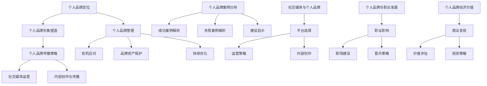
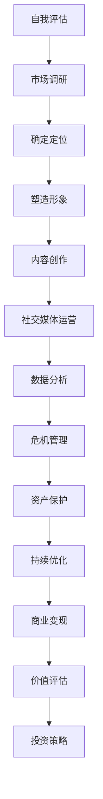

                 

# 如何打造个人品牌增加影响力

## 关键词

- 个人品牌
- 影响力
- 品牌构建
- 职业发展
- 社交媒体

## 摘要

在数字化时代，个人品牌已成为职业发展和影响力提升的重要工具。本文将详细探讨如何打造个人品牌，增加影响力。首先，我们将了解个人品牌的概念、重要性及其与影响力的关系。接着，我们将深入分析个人品牌的构建策略、管理方法以及案例分析。此外，本文还将探讨社交媒体在个人品牌建设中的角色，以及个人品牌对职业发展的影响和商业变现途径。通过一步步的逻辑推理和实际案例，我们希望能为广大读者提供一套切实可行的个人品牌构建策略。

## 第一部分: 个人品牌概述

### 1. 个人品牌概念解析

#### 1.1 个人品牌的定义

个人品牌，顾名思义，是指个人在公众心目中的形象和声誉。它不仅包含了个人的专业技能、个性特点，还包括了个人在某个领域的权威性和影响力。个人品牌是个人价值的体现，也是个人在职场和社会中的一种资产。

#### 1.2 个人品牌的重要性

在当今社会，个人品牌的重要性日益凸显。首先，个人品牌能够显著提升个人的职业竞争力。一个有影响力的个人品牌可以让你在求职、升职等方面占据优势。其次，个人品牌有助于扩大个人影响力。一个成功的个人品牌能够在某一领域内形成较强的号召力和公信力。最后，个人品牌还可以带来商业机会。许多知名的个人品牌因其独特的价值，能够吸引投资和合作机会。

#### 1.3 个人品牌与影响力的关系

个人品牌与影响力之间有着密切的联系。个人品牌是影响力的基础，而影响力则是个人品牌的外在表现。一个成功的个人品牌可以带来广泛的影响，从而增强个人的社会地位和职业声望。同时，影响力又可以反哺个人品牌，使其更加成熟和稳固。

### 2. 个人品牌构建策略

#### 2.1 确立个人品牌定位

构建个人品牌的第一个步骤是明确个人品牌定位。定位决定了个人品牌的发展方向，需要充分考虑个人的专业技能、兴趣爱好、市场需求等因素。一个清晰的定位有助于树立独特的个人形象，从而在竞争激烈的市场中脱颖而出。

#### 2.2 个人品牌形象塑造

个人品牌形象塑造是个人品牌构建的核心。这包括对外展示的专业形象、个性特质以及价值观念。一个鲜明、一致的个人品牌形象能够吸引目标受众，增强个人的影响力和认可度。

#### 2.3 个人品牌传播策略

传播策略是个人品牌建设的重要一环。有效的传播策略可以扩大个人品牌的影响力，提高公众对个人品牌的认知。这包括社交媒体运营、内容创作、公关活动等多种方式。

### 3. 个人品牌管理

#### 3.1 个人品牌危机应对

在个人品牌建设过程中，危机管理至关重要。一旦发生负面事件，需要及时采取有效的应对措施，以保护个人品牌形象。

#### 3.2 个人品牌资产保护

个人品牌资产保护是长期品牌建设的基础。这包括知识产权保护、隐私管理、形象维护等多个方面。

#### 3.3 个人品牌持续优化

个人品牌不是一成不变的，需要不断优化和更新。通过持续学习、技能提升和市场适应，个人品牌能够保持活力和竞争力。

### 4. 个人品牌案例分析

#### 4.1 成功的个人品牌案例解析

通过分析成功案例，我们可以了解个人品牌建设的成功要素。这些案例通常具有明确的定位、独特的形象和有效的传播策略。

#### 4.2 失败的个人品牌案例分析

失败的个人品牌案例同样具有教育意义。这些案例可以帮助我们避免常见的品牌建设错误，提高品牌建设的成功率。

#### 4.3 个人品牌建设的启示

成功和失败的个人品牌案例都为我们提供了宝贵的建设经验。通过这些经验，我们可以更好地理解和实践个人品牌建设。

### 5. 社交媒体与个人品牌

#### 5.1 社交媒体平台选择

选择合适的社交媒体平台对于个人品牌建设至关重要。不同的平台具有不同的用户群体和功能特点，需要根据个人品牌定位和目标受众进行选择。

#### 5.2 社交媒体运营策略

社交媒体运营策略包括内容创作、互动管理、数据分析等多个方面。有效的运营策略可以提高个人品牌的曝光率和影响力。

#### 5.3 社交媒体内容创作

社交媒体内容创作是个人品牌传播的核心。高质量的内容能够吸引受众，增强个人品牌的认知度和影响力。

### 6. 个人品牌与职业发展

#### 6.1 个人品牌对职业发展的影响

个人品牌对职业发展具有显著的推动作用。一个成功的个人品牌可以提升个人的职业竞争力，为职业晋升提供有力支持。

#### 6.2 职场个人品牌建设

在职场中，个人品牌建设尤为重要。通过不断提升专业技能、加强人际沟通和管理能力，个人品牌可以逐步建立并巩固。

#### 6.3 个人品牌与职业晋升策略

个人品牌与职业晋升策略密切相关。一个有影响力的个人品牌可以带来更多的职业机会，加速职业晋升。

### 7. 个人品牌经济价值

#### 7.1 个人品牌商业变现

个人品牌可以转化为商业价值，包括代言、咨询、培训等多种形式。有效的商业变现策略可以带来可观的收益。

#### 7.2 个人品牌价值评估

个人品牌价值评估是商业变现的基础。通过科学的评估方法，可以确定个人品牌的市场价值。

#### 7.3 个人品牌投资策略

个人品牌投资策略是个人品牌建设的延续。通过合理投资，可以进一步提升个人品牌的价值和影响力。

## 第二部分: 个人品牌构建实战

### 8. 个人品牌定位与塑造

#### 8.1 明确个人品牌定位

明确个人品牌定位是个人品牌构建的第一步。这需要深入分析自身优势、市场需求以及目标受众，确定一个清晰、有差异化的品牌定位。

#### 8.2 塑造个人品牌形象

个人品牌形象塑造是个人品牌构建的关键。这包括对外展示的专业形象、个性特质以及价值观念。一个鲜明、一致的个人品牌形象能够吸引目标受众，增强个人品牌的认知度和影响力。

#### 8.3 个人品牌定位案例分析

通过分析成功案例，我们可以了解如何进行有效的个人品牌定位和形象塑造。这些案例通常具有明确的定位、独特的形象和有效的传播策略。

### 9. 个人品牌内容创作与传播

#### 9.1 内容创作策略

内容创作策略是个人品牌传播的核心。高质量的内容能够吸引受众，增强个人品牌的认知度和影响力。内容创作策略需要充分考虑受众需求、市场趋势以及个人品牌定位。

#### 9.2 内容传播途径

内容传播途径是扩大个人品牌影响力的重要手段。这包括社交媒体、博客、电子书、演讲等多种形式。选择合适的传播途径，可以提高内容传播的效率和效果。

#### 9.3 内容效果评估

内容效果评估是个人品牌建设的重要环节。通过科学的评估方法，可以了解内容传播的效果，及时调整内容创作和传播策略。

### 10. 个人品牌社交媒体运营

#### 10.1 社交媒体账号管理

社交媒体账号管理是个人品牌运营的基础。这包括账号注册、内容发布、互动管理等多个方面。有效的账号管理可以提高个人品牌的影响力和公信力。

#### 10.2 社交媒体互动策略

社交媒体互动策略是增强个人品牌与受众互动的关键。这包括回复评论、参与讨论、发起活动等多种方式。有效的互动策略可以增强个人品牌的亲和力和影响力。

#### 10.3 社交媒体营销案例分析

通过分析成功的社交媒体营销案例，我们可以了解如何进行有效的社交媒体运营。这些案例通常具有创新的互动形式、精准的受众定位以及高效的内容传播。

### 11. 个人品牌与公共关系

#### 11.1 建立良好的公共关系

建立良好的公共关系是个人品牌建设的重要组成部分。这包括与媒体、合作伙伴、公众建立良好的沟通和互动。良好的公共关系可以增强个人品牌的信任度和影响力。

#### 11.2 媒体关系管理

媒体关系管理是公共关系的重要环节。这包括与媒体建立联系、提供新闻素材、回应媒体询问等多个方面。有效的媒体关系管理可以提高个人品牌在媒体上的曝光率和影响力。

#### 11.3 公关危机应对策略

公关危机应对策略是处理突发事件的重要手段。在危机发生时，需要及时采取有效的应对措施，以保护个人品牌形象。有效的危机应对策略可以降低危机影响，甚至转危为安。

### 12. 个人品牌商业变现

#### 12.1 个人品牌商业模式

个人品牌商业模式是个人品牌变现的基础。这包括代言、咨询、培训、产品销售等多种形式。不同的商业模式具有不同的盈利模式和发展路径。

#### 12.2 个人品牌产品与服务

个人品牌产品与服务是个人品牌变现的重要手段。通过提供高质量的产品和服务，可以吸引更多的客户和粉丝，实现商业变现。

#### 12.3 个人品牌商业案例解析

通过分析成功的个人品牌商业案例，我们可以了解如何进行有效的个人品牌商业变现。这些案例通常具有创新的商业模式、精准的市场定位以及高效的品牌运营。

### 13. 个人品牌构建经验分享

#### 13.1 成功的个人品牌构建经验

成功构建个人品牌需要积累丰富的经验。这些经验包括定位策略、内容创作、社交媒体运营、公共关系管理等多个方面。通过分享成功经验，我们可以更好地理解和实践个人品牌建设。

#### 13.2 失败的个人品牌构建教训

失败的个人品牌构建教训同样具有重要的教育意义。通过总结失败教训，我们可以避免常见的品牌建设错误，提高品牌建设的成功率。

#### 13.3 个人品牌建设实用技巧

个人品牌建设实用技巧是品牌建设的重要支撑。这些技巧包括时间管理、内容创作、社交媒体运营、公关危机应对等多个方面。通过掌握实用技巧，我们可以更加高效地推进个人品牌建设。

## 第三部分: 个人品牌扩展与影响力提升

### 14. 个人品牌影响力评估

#### 14.1 个人品牌影响力指标

个人品牌影响力评估需要考虑多个指标，包括社交媒体关注度、内容传播效果、商业变现能力等。通过科学的评估方法，可以全面了解个人品牌的影响力。

#### 14.2 个人品牌影响力评估方法

个人品牌影响力评估方法包括定量评估和定性评估。定量评估主要依靠数据分析和统计，定性评估则依赖于专家评审和用户反馈。

#### 14.3 个人品牌影响力提升策略

个人品牌影响力提升策略包括内容创新、社交媒体运营优化、商业变现能力提升等多个方面。通过有效的策略，可以显著提升个人品牌的影响力。

### 15. 个人品牌跨平台扩展

#### 15.1 跨平台品牌传播策略

跨平台品牌传播策略是扩展个人品牌影响力的重要手段。通过在多个平台上进行品牌传播，可以扩大个人品牌的影响范围。

#### 15.2 跨平台个人品牌管理

跨平台个人品牌管理需要充分考虑不同平台的特性，制定个性化的运营策略。有效的跨平台管理可以增强个人品牌的一致性和影响力。

#### 15.3 跨平台个人品牌案例

通过分析成功的跨平台个人品牌案例，我们可以了解如何进行有效的跨平台品牌传播。这些案例通常具有创新的跨平台策略、高效的内容创作以及精准的用户定位。

### 16. 个人品牌与跨界合作

#### 16.1 跨界合作的策略

跨界合作是扩展个人品牌影响力的重要途径。通过与其他领域的企业、品牌或个人进行合作，可以拓宽个人品牌的发展空间。

#### 16.2 个人品牌跨界案例解析

通过分析成功的个人品牌跨界案例，我们可以了解如何进行有效的跨界合作。这些案例通常具有创新的合作模式、互补的优势资源以及高效的执行能力。

#### 16.3 跨界合作中的个人品牌管理

跨界合作中的个人品牌管理需要充分考虑品牌的一致性和差异性。通过有效的品牌管理，可以确保跨界合作的成功和品牌的长久发展。

### 17. 个人品牌持续发展

#### 17.1 个人品牌持续发展的意义

个人品牌持续发展是品牌建设的重要环节。只有不断适应市场变化，提升个人品牌价值，才能保持品牌的活力和竞争力。

#### 17.2 个人品牌更新与优化

个人品牌更新与优化是持续发展的关键。通过不断学习、技能提升和市场适应，个人品牌可以保持创新和竞争力。

#### 17.3 个人品牌长期发展规划

个人品牌长期发展规划是品牌建设的蓝图。通过明确的发展目标和策略，个人品牌可以持续、稳定地发展。

### 18. 个人品牌与人生规划

#### 18.1 个人品牌与人生规划的关系

个人品牌与人生规划密切相关。一个成功的个人品牌可以为人生规划提供有力支持，帮助个人实现职业和生活目标。

#### 18.2 人生规划中的个人品牌建设

在人生规划中，个人品牌建设是不可或缺的一部分。通过明确个人品牌定位、塑造品牌形象、提升品牌影响力，个人可以更好地实现人生目标。

#### 18.3 个人品牌对人生规划的影响

个人品牌对人生规划具有重要影响。一个成功的个人品牌可以提升个人的职业竞争力，为职业发展提供有力支持。同时，个人品牌还可以为个人带来更多的人生机会和选择。

## 附录

### 附录 A: 个人品牌构建工具与资源

#### A.1 个人品牌建设工具介绍

个人品牌建设工具包括社交媒体管理工具、内容创作工具、数据分析工具等。这些工具可以帮助个人高效地管理品牌、创作内容和分析数据。

#### A.2 个人品牌资源推荐

个人品牌资源包括书籍、课程、在线平台等。这些资源提供了丰富的知识和经验，帮助个人更好地进行品牌建设。

#### A.3 个人品牌建设相关书籍和课程推荐

书籍和课程是个人品牌建设的重要资源。通过学习和实践，个人可以不断提升品牌建设和运营能力。

# Mermaid 流程图：个人品牌构建流程

---

**作者：AI天才研究院/AI Genius Institute & 禅与计算机程序设计艺术 /Zen And The Art of Computer Programming**# 如何打造个人品牌增加影响力

## 摘要

在数字化时代，个人品牌已成为职业发展和影响力提升的重要工具。本文将深入探讨如何打造个人品牌，增加影响力。通过分析个人品牌的概念、重要性、构建策略、管理方法以及案例分析，我们将提供一套切实可行的个人品牌构建策略，包括定位与塑造、内容创作与传播、社交媒体运营、公共关系管理、商业变现和跨平台扩展等多个方面。希望通过本文，读者能够对个人品牌建设有更深入的理解，并能够运用到实际中。

## 第一部分: 个人品牌概述

### 1.1 个人品牌的定义

个人品牌是指个人在公众心目中的形象和声誉，它反映了个人在某一领域的专业能力、个性特质和社会影响力。个人品牌不仅是个人形象的体现，更是个人价值的体现，是个人在职场和社会中的一种无形资产。

### 1.2 个人品牌的重要性

个人品牌的重要性在于它能够为个人带来多方面的优势：

1. **职业竞争力提升**：一个强大的个人品牌能够在求职、升职等方面提供优势，使个人在职场中脱颖而出。
2. **社会影响力扩大**：个人品牌有助于扩大个人在社会中的影响力，使个人成为某一领域的意见领袖。
3. **商业机会增加**：个人品牌可以转化为商业价值，如代言、咨询、培训等，带来额外的收入来源。
4. **品牌认知度提升**：个人品牌有助于提升个人在公众心目中的认知度，增强个人影响力。

### 1.3 个人品牌与影响力的关系

个人品牌与影响力之间存在密切的联系。个人品牌是影响力的基础，而影响力则是个人品牌的外在表现。一个成功的个人品牌通常能够在某一领域内形成较强的号召力和公信力，进而提升个人影响力。而影响力又可以反哺个人品牌，使其更加成熟和稳固。

## 第二部分: 个人品牌构建策略

### 2.1 确立个人品牌定位

确立个人品牌定位是个人品牌构建的第一步。定位决定了个人品牌的发展方向，需要充分考虑个人的专业技能、兴趣爱好、市场需求等因素。一个清晰的定位有助于树立独特的个人形象，从而在竞争激烈的市场中脱颖而出。

**步骤**：

1. **自我评估**：分析个人的专业技能、经验和兴趣，确定自己在某个领域的专长和优势。
2. **市场调研**：了解市场需求和竞争态势，确定个人品牌定位与市场需求的契合点。
3. **目标受众分析**：明确目标受众的特点和需求，确保个人品牌定位能够吸引和满足目标受众。

### 2.2 个人品牌形象塑造

个人品牌形象塑造是个人品牌构建的核心。这包括对外展示的专业形象、个性特质以及价值观念。一个鲜明、一致的个人品牌形象能够吸引目标受众，增强个人品牌的认知度和影响力。

**策略**：

1. **专业形象**：通过专业知识的积累和展示，树立专业、权威的个人形象。
2. **个性特质**：通过独特的个性特质，如幽默、真诚、创新等，塑造个人品牌的差异化形象。
3. **价值观念**：明确并传递个人的价值观念，如诚信、创新、客户至上等，增强个人品牌的吸引力。

### 2.3 个人品牌传播策略

个人品牌传播策略是扩大个人品牌影响力的重要手段。有效的传播策略可以提升个人品牌在公众中的认知度和影响力。

**途径**：

1. **社交媒体**：利用社交媒体平台，如微博、微信、LinkedIn等，进行内容发布和互动，扩大个人品牌的传播范围。
2. **内容创作**：通过博客、电子书、演讲等形式，创作高质量的内容，传递个人品牌的核心价值。
3. **公关活动**：参与行业会议、论坛、展览等活动，增强个人品牌的曝光度和影响力。
4. **合作伙伴**：与行业内的合作伙伴建立良好的关系，通过合作推广个人品牌。

## 第三部分: 个人品牌管理

### 3.1 个人品牌危机应对

个人品牌危机应对是个人品牌管理的重要环节。在面临负面事件时，需要采取有效的措施来保护个人品牌形象。

**策略**：

1. **及时应对**：在危机发生的第一时间，采取积极的应对措施，防止事态扩大。
2. **透明沟通**：保持与公众的透明沟通，公开、诚实地回应公众关切，增强信任感。
3. **媒体关系管理**：与媒体建立良好的关系，及时提供准确的信息，避免误解和谣言的传播。
4. **危机公关**：通过专业的危机公关团队，制定详细的应对方案，降低危机影响。

### 3.2 个人品牌资产保护

个人品牌资产保护是个人品牌管理的长期任务。这包括知识产权保护、隐私管理、形象维护等多个方面。

**措施**：

1. **知识产权保护**：申请专利、商标等知识产权，防止他人侵犯自己的品牌权益。
2. **隐私管理**：保护个人隐私信息，避免信息泄露对个人品牌造成负面影响。
3. **形象维护**：通过持续的努力和良好的表现，维护个人品牌形象，防止负面事件的发生。

### 3.3 个人品牌持续优化

个人品牌不是一成不变的，需要不断优化和更新。通过持续学习、技能提升和市场适应，个人品牌能够保持活力和竞争力。

**方法**：

1. **持续学习**：不断学习新知识、新技术，提升个人专业能力，保持品牌的竞争力。
2. **市场适应**：密切关注市场动态和行业趋势，调整品牌定位和传播策略，适应市场需求。
3. **品牌更新**：定期评估个人品牌的状态，及时调整品牌形象和传播内容，保持品牌的活力。

## 第四部分: 个人品牌案例分析

### 4.1 成功的个人品牌案例解析

通过分析成功案例，我们可以了解个人品牌建设的成功要素。这些案例通常具有以下几个特点：

1. **明确的定位**：成功个人品牌通常具有明确的定位，能够在某一领域内形成独特的价值主张。
2. **独特的形象**：成功个人品牌通常具有鲜明的个性特质，能够吸引目标受众的注意力。
3. **有效的传播策略**：成功个人品牌通常采用多样化的传播策略，如社交媒体运营、内容创作、公关活动等，提高品牌曝光度和影响力。
4. **持续的学习和成长**：成功个人品牌通常保持持续的学习和成长，不断提升个人专业能力和品牌价值。

### 4.2 失败的个人品牌案例分析

失败的个人品牌案例同样具有教育意义。这些案例通常存在以下问题：

1. **定位不清**：缺乏明确的品牌定位，导致品牌形象模糊，难以吸引目标受众。
2. **形象不当**：品牌形象过于夸张或不适合市场需求，导致公众反感和排斥。
3. **传播不足**：缺乏有效的传播策略，导致品牌曝光度低，影响力有限。
4. **忽视危机管理**：在面临负面事件时，缺乏有效的应对措施，导致品牌形象受损。

### 4.3 个人品牌建设的启示

通过成功和失败的个人品牌案例，我们可以得出以下启示：

1. **明确定位**：成功品牌建设需要明确个人品牌定位，确保品牌形象和市场需求的契合。
2. **塑造独特形象**：成功品牌建设需要塑造独特的个人形象，吸引目标受众的注意力。
3. **制定有效的传播策略**：成功品牌建设需要采用多样化的传播策略，提高品牌曝光度和影响力。
4. **重视危机管理**：成功品牌建设需要重视危机管理，确保品牌形象不受负面影响。

## 第五部分: 社交媒体与个人品牌

### 5.1 社交媒体平台选择

选择合适的社交媒体平台对于个人品牌建设至关重要。不同的社交媒体平台具有不同的用户群体和功能特点，需要根据个人品牌定位和目标受众进行选择。

**策略**：

1. **微博**：适合实时传播和互动，适合关注时事热点和快速传播信息。
2. **微信**：适合深度交流和内容分享，适合建立用户社群和传播专业知识。
3. **LinkedIn**：适合职业发展和商业交流，适合建立专业形象和拓展商业机会。
4. **抖音/快手**：适合短视频传播和娱乐化内容，适合吸引年轻受众和进行品牌营销。

### 5.2 社交媒体运营策略

社交媒体运营策略是个人品牌传播的核心。有效的运营策略可以提高个人品牌的影响力和认知度。

**方法**：

1. **内容创作**：制定内容创作计划，发布高质量、有价值的内容，吸引目标受众。
2. **互动管理**：积极与受众互动，回复评论和私信，增强用户粘性。
3. **数据分析**：定期分析数据，了解受众喜好和传播效果，调整运营策略。
4. **合作推广**：与其他品牌或个人合作，通过跨平台推广，扩大品牌影响力。

### 5.3 社交媒体内容创作

社交媒体内容创作是个人品牌传播的重要组成部分。高质量的内容能够吸引受众，增强个人品牌的认知度和影响力。

**技巧**：

1. **标题党**：制作吸引人的标题，提高点击率和阅读量。
2. **图文并茂**：结合文字、图片和视频等多种形式，提高内容可读性和吸引力。
3. **内容差异化**：根据不同平台的特点和受众需求，创作差异化内容，提高内容质量。
4. **持续更新**：保持内容更新频率，保持受众关注和兴趣。

## 第六部分: 个人品牌与职业发展

### 6.1 个人品牌对职业发展的影响

个人品牌对职业发展具有显著的推动作用。一个成功的个人品牌可以提升个人的职业竞争力，为职业晋升提供有力支持。

**影响**：

1. **求职优势**：一个强大的个人品牌可以在求职过程中提供优势，使个人在众多候选人中脱颖而出。
2. **晋升机会**：一个有影响力的个人品牌可以增强个人在职场中的竞争力，提高晋升机会。
3. **薪资待遇**：一个成功的个人品牌可以提升个人的市场价值，带来更高的薪资待遇。
4. **职业发展路径**：一个明确的个人品牌定位可以帮助个人规划职业发展路径，实现职业目标。

### 6.2 职场个人品牌建设

在职场中，个人品牌建设尤为重要。通过不断提升专业技能、加强人际沟通和管理能力，个人品牌可以逐步建立并巩固。

**策略**：

1. **专业技能提升**：不断学习新知识、新技术，提升个人专业能力，为个人品牌建设提供基础。
2. **人际沟通**：加强人际沟通能力，建立良好的人际关系网络，提高个人在职场中的影响力。
3. **管理能力**：提升管理能力，包括时间管理、团队管理、项目管理等，增强个人在职场中的领导力。
4. **持续贡献**：在工作中持续贡献价值，展现个人专业能力和团队合作精神，提升个人品牌形象。

### 6.3 个人品牌与职业晋升策略

个人品牌与职业晋升策略密切相关。一个有影响力的个人品牌可以带来更多的职业机会，加速职业晋升。

**方法**：

1. **展示专业能力**：在职场中积极展示个人专业能力，参与重要项目，取得显著成果。
2. **建立个人网络**：通过参加行业活动、建立专业人脉，扩大个人在行业中的影响力。
3. **提升领导力**：通过参与团队管理、项目管理等，提升个人领导力，为职业晋升奠定基础。
4. **积极沟通**：与上级和同事保持良好的沟通，争取更多的晋升机会和资源支持。

## 第七部分: 个人品牌经济价值

### 7.1 个人品牌商业变现

个人品牌可以转化为商业价值，通过多种形式实现变现，如代言、咨询、培训、产品销售等。

**形式**：

1. **代言**：作为品牌的代言人，通过个人的影响力为品牌代言，获取代言费用。
2. **咨询**：凭借个人在某一领域的专业知识和经验，提供咨询服务，获取咨询费用。
3. **培训**：利用个人的专业知识和经验，开展培训课程，收取培训费用。
4. **产品销售**：开发个人品牌相关的产品或服务，通过销售实现商业变现。

### 7.2 个人品牌价值评估

个人品牌价值评估是商业变现的基础。通过科学的评估方法，可以确定个人品牌的市场价值。

**方法**：

1. **财务指标**：通过个人品牌的盈利能力、市场占有率等财务指标进行评估。
2. **社会指标**：通过个人品牌的社会影响力、认知度等社会指标进行评估。
3. **市场分析**：通过对市场趋势、竞争状况等市场因素进行分析，评估个人品牌的价值。
4. **专家评审**：邀请行业专家对个人品牌进行评审，综合评估个人品牌的价值。

### 7.3 个人品牌投资策略

个人品牌投资策略是个人品牌建设的延续。通过合理投资，可以进一步提升个人品牌的价值和影响力。

**策略**：

1. **时间投资**：将时间和精力投入到个人品牌建设中，提升个人专业能力和影响力。
2. **金钱投资**：通过投资金钱，如购买培训课程、参加行业活动等，提升个人品牌的价值。
3. **资源投资**：利用社会资源和人际网络，为个人品牌建设提供支持，扩大品牌影响力。
4. **风险管理**：合理评估风险，制定风险应对策略，确保个人品牌投资的安全性和可持续性。

## 总结

个人品牌是数字化时代的重要资产，通过明确的定位、有效的传播策略和持续的管理，个人品牌可以成为职业发展和影响力提升的重要工具。本文从个人品牌概述、构建策略、管理方法、案例分析、社交媒体运营、职业发展影响和经济价值等多个方面，系统地探讨了如何打造个人品牌，增加影响力。希望本文能为读者提供有价值的参考和启示，帮助读者在个人品牌建设道路上取得成功。

---

**作者：AI天才研究院/AI Genius Institute & 禅与计算机程序设计艺术 /Zen And The Art of Computer Programming**## 个人品牌构建流程的Mermaid流程图

为了更好地理解个人品牌构建的过程，我们使用Mermaid语言绘制了一个流程图。以下是一个简化的个人品牌构建流程，展示各步骤之间的关系和顺序：

这个流程图概括了个人品牌构建的主要步骤，从自我评估、市场调研、确定定位，到内容创作、社交媒体运营、数据分析和危机管理，再到资产保护、持续优化、商业变现、价值评估和投资策略。每个步骤都是构建成功个人品牌的重要环节，它们相互关联，共同构成了一个完整的品牌构建流程。

### 自我评估

自我评估是个人品牌构建的第一步，它帮助你了解自己的专业能力、兴趣和目标。这个过程需要你深入思考以下几个问题：

- 你擅长什么？你的专业技能是什么？
- 你对什么领域充满热情？
- 你的长期职业目标是什么？

通过自我评估，你可以更清晰地认识自己，确定个人品牌的定位。

### 市场调研

市场调研是了解目标市场的重要步骤。在这个过程中，你需要收集以下信息：

- 目标市场的需求是什么？
- 目标市场的竞争状况如何？
- 你的目标受众是谁？他们的需求和偏好是什么？

市场调研可以帮助你确定个人品牌的定位，确保你的品牌定位与市场需求相契合。

### 确定定位

确定个人品牌定位是品牌构建的关键一步。一个清晰的定位可以帮助你在市场中脱颖而出。定位需要考虑以下几个因素：

- 你的独特价值主张是什么？
- 你的目标受众是谁？
- 你的品牌个性如何？

明确的定位有助于塑造独特的品牌形象。

### 塑造形象

个人品牌形象是品牌塑造的核心。它需要体现你的专业能力、个性特质和价值观念。塑造形象可以通过以下几个方面实现：

- 设计个性化的品牌标识。
- 创建专业的个人资料。
- 在社交媒体上展示你的专业知识和经验。

### 内容创作

内容创作是个人品牌传播的重要手段。通过创作高质量、有价值的内容，你可以吸引目标受众，增强个人品牌的影响力。内容创作可以包括：

- 写作博客文章。
- 制作视频教程。
- 发布行业见解。
- 参与讨论和评论。

### 社交媒体运营

社交媒体运营可以帮助你扩大个人品牌的影响力。在社交媒体上，你可以：

- 发布和分享高质量的内容。
- 与粉丝互动，回复评论和私信。
- 参与社交媒体挑战和活动。

### 数据分析

数据分析是了解品牌传播效果的重要工具。通过分析数据，你可以了解：

- 内容的表现如何？
- 受众的反馈是什么？
- 哪些渠道最有效？

数据分析可以帮助你优化品牌传播策略。

### 危机管理

危机管理是个人品牌保护的重要环节。在面临负面事件时，你需要：

- 及时应对，避免事态扩大。
- 透明沟通，增强信任感。
- 与媒体保持良好关系。
- 制定详细的危机应对方案。

### 资产保护

资产保护是确保个人品牌长期发展的重要措施。你需要：

- 保护知识产权。
- 管理个人隐私。
- 维护品牌形象。

### 持续优化

个人品牌不是一成不变的，需要持续优化和更新。通过不断学习和市场适应，你可以：

- 提升专业技能。
- 调整品牌定位。
- 优化内容创作和传播策略。

### 商业变现

商业变现是个人品牌价值实现的重要途径。你可以通过以下方式实现商业变现：

- 代言和咨询。
- 开发个人品牌相关的产品或服务。
- 参与商业合作。

### 价值评估

价值评估是了解个人品牌市场价值的重要步骤。通过科学的评估方法，你可以：

- 评估品牌的盈利能力。
- 评估品牌的社会影响力。
- 制定合理的商业策略。

### 投资策略

投资策略是个人品牌发展的延续。通过合理投资，你可以：

- 提升个人品牌的价值。
- 扩大品牌的影响力。
- 实现长期的商业回报。

通过这个流程图，我们可以清晰地看到个人品牌构建的步骤和各个环节之间的相互关系。每个步骤都是构建成功个人品牌的关键，通过合理的规划和执行，你可以打造一个有影响力的个人品牌。

