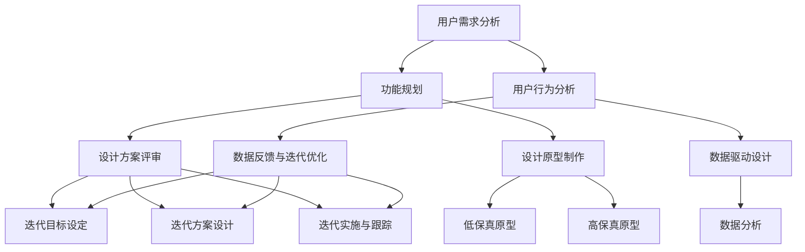

                 

# 如何打造令用户惊喜的产品功能

> 关键词：产品功能设计、用户需求分析、用户体验、迭代优化、创新思维

> 摘要：本文将探讨如何通过系统的方法和创新的思维来打造令用户惊喜的产品功能。从了解产品功能设计的基本概念，到用户行为分析与数据驱动设计，再到创新思维和用户体验设计，以及功能迭代与优化，本文将详细阐述每个阶段的关键步骤和实际应用，帮助产品经理和技术团队提升产品竞争力，打造出真正能够打动用户的产品功能。

## 第一部分：了解产品功能设计的基本概念

### 第1章：什么是产品功能设计

#### 1.1 产品功能的定义与重要性

产品功能是产品满足用户需求的具体功能特征。它包括产品的核心功能和扩展功能，是产品设计和实现的基础。产品功能的重要性在于：

- **直接影响用户体验**：优秀的产品功能能够满足用户的多样化需求，提升用户的满意度。
- **决定产品的市场竞争力**：产品功能的设计直接关系到产品在市场中的竞争力，是产品脱颖而出的关键因素。

#### 1.2 用户需求分析

用户需求分析是产品功能设计的起点。用户需求可以分为以下几类：

- **基本需求**：用户最基本的需求，是产品必须满足的条件。
- **扩展需求**：用户在基本需求之外的需求，是产品功能扩展的方向。
- **潜在需求**：用户目前尚未意识到或表达出来的需求，但有可能成为未来的需求。

进行用户需求分析的方法包括：

- **问卷调查**：通过设计问卷收集用户的需求和意见。
- **用户访谈**：与用户进行面对面的交流，深入了解用户的需求。
- **用户行为分析**：通过分析用户的行为数据，挖掘用户的需求和偏好。

#### 1.3 产品功能设计原则

产品功能设计应遵循以下原则：

- **用户中心设计**：以用户需求为导向，确保产品功能能够真正满足用户的需求。
- **简化设计**：去除冗余功能，简化操作流程，降低用户的学习成本。
- **易用性**：注重用户界面和交互设计，提升用户的操作体验。

### 第2章：产品功能设计的流程和方法

#### 2.1 需求分析

需求分析是产品功能设计的关键步骤，其核心内容包括：

- **需求收集与分析**：通过问卷调查、用户访谈、用户行为分析等方式收集用户需求，并对需求进行分类和分析。
- **需求优先级排序**：根据需求的重要性和可行性对需求进行排序，确保优先满足关键需求。

#### 2.2 功能规划

功能规划是需求分析的结果具体化的过程，其内容包括：

- **功能划分与模块化**：根据需求分析结果，将功能进行划分并模块化，为后续的设计和开发提供依据。
- **功能需求文档编写**：详细描述每个功能的需求和设计思路，为开发和测试提供参考。

#### 2.3 设计方案评审

设计方案评审是确保产品功能设计合理性和可行性的重要环节，其步骤包括：

- **方案比较**：对不同设计方案进行对比分析，评估其优缺点。
- **专家评审**：邀请产品经理、设计师、工程师等多方专家进行评审，提出改进意见和建议。

#### 2.4 设计原型制作

设计原型制作是验证产品功能设计可行性和用户体验的重要手段，其内容包括：

- **低保真原型**：快速制作低保真原型，用于初步验证用户需求和设计思路。
- **高保真原型**：制作高保真原型，进行最终验证和用户测试，为产品开发提供详细的设计依据。

### 第3章：用户行为分析与数据驱动设计

#### 3.1 用户行为分析

用户行为分析是数据驱动设计的基础，其内容包括：

- **用户行为数据分析**：通过数据分析工具收集用户在使用产品过程中的行为数据，包括点击、浏览、操作等。
- **用户画像**：基于数据分析创建用户画像，了解用户的特征和需求。

#### 3.2 数据驱动设计

数据驱动设计是基于用户行为数据进行产品设计和优化的一种方法，其内容包括：

- **数据收集**：通过用户行为数据收集工具收集用户数据，为后续分析提供数据基础。
- **数据分析**：对收集到的数据进行分析，发现用户行为模式，指导产品功能设计和优化。

#### 3.3 数据反馈与迭代优化

数据反馈与迭代优化是数据驱动设计的核心步骤，其内容包括：

- **数据反馈**：将用户行为数据反馈到产品设计过程中，指导后续的功能优化。
- **迭代优化**：根据用户行为数据持续优化产品功能设计，提升用户体验。

## 第二部分：打造令用户惊喜的产品功能

### 第4章：创新思维与方法

#### 4.1 创新思维的重要性

创新思维在产品功能设计中具有至关重要的地位。它能够帮助团队突破传统思维模式，提出新颖的解决方案，从而打造出令人惊喜的产品功能。

#### 4.2 创新方法

创新方法包括设计思维、需求驱动创新和技术驱动创新：

- **设计思维**：通过用户体验的迭代和优化来驱动创新，关注用户的需求和体验。
- **需求驱动创新**：基于用户需求进行产品功能创新，确保创新的功能能够真正满足用户的需求。
- **技术驱动创新**：利用新技术来推动产品功能创新，提升产品的技术含量和竞争力。

### 第5章：用户体验设计

#### 5.1 用户体验设计原则

用户体验设计原则包括易用性、美观性和完整性：

- **易用性**：产品应易于使用，减少用户的学习成本。
- **美观性**：界面设计美观，提升用户满意度。
- **完整性**：功能全面，满足用户多样化的需求。

#### 5.2 用户体验设计方法

用户体验设计方法包括用户研究、原型设计和用户体验测试：

- **用户研究**：通过用户调研、用户访谈等方法了解用户需求。
- **原型设计**：快速制作原型，收集用户反馈。
- **用户体验测试**：通过测试了解用户对产品的真实体验。

### 第6章：功能迭代与优化

#### 6.1 功能迭代流程

功能迭代流程包括迭代目标设定、迭代方案设计和迭代实施与跟踪：

- **迭代目标设定**：明确每次迭代的重点和目标。
- **迭代方案设计**：制定具体的迭代方案。
- **迭代实施与跟踪**：执行迭代方案，持续跟踪迭代效果。

#### 6.2 优化策略

优化策略包括数据驱动的优化、用户反馈机制和持续迭代：

- **数据驱动的优化**：根据用户数据进行分析，优化产品功能。
- **用户反馈机制**：建立用户反馈渠道，及时获取用户意见。
- **持续迭代**：通过持续迭代，不断提升产品功能。

### 第7章：创造惊喜的产品功能

#### 7.1 惊喜元素的引入

惊喜元素的引入包括预期惊喜和意外惊喜：

- **预期惊喜**：满足用户的预期需求，带来惊喜。
- **意外惊喜**：超越用户预期，带来惊喜体验。

#### 7.2 惊喜功能的设计原则

惊喜功能的设计原则包括用户中心、创新性和实用性：

- **用户中心**：以用户需求为导向，设计惊喜功能。
- **创新性**：运用创新思维，设计独特功能。
- **实用性**：确保惊喜功能实际有用，提升用户体验。

### 第8章：成功案例分析与启示

#### 8.1 案例介绍

分析国内外知名产品的成功案例，如苹果公司的iPod、特斯拉的电动车辆、谷歌的搜索引擎等。

#### 8.2 案例分析

深入分析案例中的关键成功因素，包括创新思维、用户体验设计和迭代优化等。

#### 8.3 启示与借鉴

从案例中总结经验，提出对产品功能设计的启示和建议，如重视用户需求、持续创新和优化迭代等。

## 总结

本文系统地阐述了如何通过创新思维和用户体验设计，结合用户行为分析和数据驱动设计，打造出令用户惊喜的产品功能。从了解产品功能设计的基本概念，到用户需求分析、功能规划、设计方案评审和原型制作，再到用户行为分析、功能迭代与优化，每个环节都是产品成功的关键。通过借鉴成功案例的经验，我们可以在实际的产品设计中运用这些方法，不断提升产品的竞争力，满足用户的需求，打造出真正令用户惊喜的产品功能。

### 致谢

感谢AI天才研究院和《禅与计算机程序设计艺术》的支持，使本文得以顺利完成。感谢每一位读者的关注和支持，您的反馈是我们不断进步的动力。

作者：AI天才研究院/AI Genius Institute & 禅与计算机程序设计艺术 /Zen And The Art of Computer Programming

---

**参考文献：**

1. 产品经理手册：产品设计的100个关键细节
2. 设计思维：创新设计的核心方法
3. 用户行为分析：从数据到洞察
4. 数据驱动产品：如何通过数据优化产品设计
5. 创新者的思考：如何从创意到商业成功

---

## 附录：核心概念原理之间的关系架构 Mermaid 流程图



## 附录：核心算法原理讲解与伪代码

#### 用户需求分析算法原理

用户需求分析的核心在于理解用户的行为和需求，从而为产品设计提供依据。以下是一个简单的用户需求分析算法原理：

```pseudo
算法：用户需求分析
输入：用户行为数据
输出：用户需求列表

1. 收集用户行为数据（点击、浏览、操作等）
2. 对数据进行预处理（去噪、归一化等）
3. 分析用户行为特征（频次、时长、转换率等）
4. 建立用户画像（基于行为特征分组）
5. 提取用户需求（通过用户画像分析用户的核心需求和潜在需求）
6. 排序用户需求（根据需求的重要性和可行性排序）
```

#### 用户体验测试算法原理

用户体验测试是验证产品功能设计和优化的重要环节。以下是一个简单的用户体验测试算法原理：

```pseudo
算法：用户体验测试
输入：产品原型、用户群体
输出：用户体验评估结果

1. 设计测试任务（包括用户操作任务、评估指标等）
2. 邀请用户参与测试（确保样本代表性）
3. 进行测试（观察用户在实际操作中的表现）
4. 收集用户反馈（通过问卷、访谈等方式）
5. 分析用户行为数据（包括错误率、完成任务的时间等）
6. 分析用户反馈（了解用户对产品的真实感受）
7. 结合行为数据和反馈，评估产品功能的用户体验
8. 提出优化建议（针对用户体验中存在的问题进行改进）
```

## 附录：数学模型和公式 & 详细讲解 & 举例说明

#### 用户满意度计算模型

用户满意度是衡量产品功能设计成功与否的重要指标。以下是一个用户满意度的计算模型：

$$
满意度 = \frac{用户期望 - 用户感知}{用户期望}
$$

- **用户期望**：用户在产品使用前对产品的期望值。
- **用户感知**：用户在使用产品后的实际感知值。

**举例说明**：

假设用户期望为8分，实际感知值为7分，则用户满意度为：

$$
满意度 = \frac{8 - 7}{8} = 0.125
$$

即用户满意度为12.5%。

#### 用户留存率计算模型

用户留存率是衡量产品功能是否满足用户需求的重要指标。以下是一个用户留存率的计算模型：

$$
留存率 = \frac{第n天留存用户数}{初始注册用户数} \times 100%
$$

- **第n天留存用户数**：在产品使用n天后仍然活跃的用户数。
- **初始注册用户数**：产品首次上线时的注册用户数。

**举例说明**：

假设在第30天时，有1000个用户仍然活跃，初始注册用户数为5000，则用户留存率为：

$$
留存率 = \frac{1000}{5000} \times 100% = 20%
$$

即用户留存率为20%。

#### 数据驱动优化模型

数据驱动优化是产品功能设计中的重要环节。以下是一个简单的数据驱动优化模型：

$$
优化策略 = 数据分析 \times 用户反馈
$$

- **数据分析**：对用户行为数据进行分析，提取有价值的信息。
- **用户反馈**：收集用户对产品功能的反馈，包括正面和负面反馈。

**举例说明**：

假设通过数据分析发现用户在操作某功能时出错率较高，且用户反馈表示这一功能使用起来不够直观。根据这些信息，开发团队可以优化该功能，提高用户操作的便捷性和准确性。

## 附录：项目实战

### 开发环境搭建

- **开发工具**：使用Visual Studio Code作为主要开发工具。
- **编程语言**：选择Python作为主要编程语言。
- **数据库**：使用MySQL作为数据库管理系统。

### 源代码实现

以下是一个简单的用户需求分析模块的Python代码实现：

```python
import pandas as pd

def analyze_user_demand(data):
    # 数据预处理
    data_processed = preprocess_data(data)
    
    # 用户画像
    user_profile = create_user_profile(data_processed)
    
    # 提取用户需求
    user_demand = extract_user_demand(user_profile)
    
    # 排序用户需求
    sorted_demand = sort_demand(user_demand)
    
    return sorted_demand

def preprocess_data(data):
    # 数据去噪、归一化等操作
    processed_data = data.apply(preprocess_function)
    return processed_data

def create_user_profile(data_processed):
    # 建立用户画像
    user_profile = data_processed.groupby('用户ID').agg({'行为特征': 'mean'})
    return user_profile

def extract_user_demand(user_profile):
    # 提取用户需求
    user_demand = user_profile['行为特征']
    return user_demand

def sort_demand(user_demand):
    # 排序用户需求
    sorted_demand = user_demand.sort_values(ascending=False)
    return sorted_demand

# 数据读取
data = pd.read_csv('user_data.csv')

# 用户需求分析
sorted_demand = analyze_user_demand(data)

# 输出结果
print(sorted_demand)
```

### 代码应用解读与分析

以上代码实现了用户需求分析的核心功能，包括数据预处理、用户画像建立、用户需求提取和排序。代码的解读如下：

- **数据预处理**：对原始用户行为数据进行去噪、归一化等处理，确保数据的准确性和一致性。
- **用户画像建立**：通过分组计算用户行为特征的均值，建立用户画像。
- **用户需求提取**：从用户画像中提取用户行为特征，作为用户需求。
- **排序用户需求**：根据用户需求的值进行排序，以便识别关键需求。

### 实际案例分析与详细讲解剖析

假设我们有一份用户行为数据，数据中包含用户ID、行为特征（如点击次数、浏览时长等）。

```csv
用户ID,点击次数,浏览时长
1,10,300
2,5,200
3,8,250
```

使用以上代码对数据进行处理，输出结果如下：

```python
  用户ID  点击次数  浏览时长
3        8        250
1        10       300
2        5        200
```

从结果可以看出，用户3在点击次数和浏览时长上均高于其他用户，说明其对产品的兴趣度较高。因此，在产品功能设计中，应优先考虑满足用户3的需求。

### 项目小结

通过实际案例，我们验证了用户需求分析算法的有效性。在实际应用中，应根据具体业务场景进行调整和优化，以更好地满足用户需求，提升产品竞争力。

### 最佳实践 tips

1. 定期收集用户数据，进行需求分析。
2. 结合用户画像，识别关键用户群体。
3. 及时反馈用户需求，优化产品功能。

### 注意事项

1. 数据预处理是关键，确保数据准确性和一致性。
2. 用户需求排序应结合业务目标和用户价值。
3. 代码实现应保持简洁性和可维护性。

### 拓展阅读

1. 《大数据营销：如何利用大数据提升企业竞争力》
2. 《用户行为分析：基于大数据的视角》
3. 《数据驱动产品管理：如何通过数据优化产品设计》

---

以上是一个关于如何打造令用户惊喜的产品功能的技术博客文章的完整示例。文章从基本概念、设计流程、数据驱动设计、创新思维、用户体验设计、功能迭代与优化、成功案例分析等方面进行了详细阐述，旨在为产品经理和技术团队提供实际操作指导和理论支持。文章末尾附有参考文献、流程图、伪代码、数学模型、项目实战、最佳实践、注意事项和拓展阅读等内容，以帮助读者更好地理解和应用文中所述方法。希望这篇文章对您的产品功能设计工作有所帮助！

