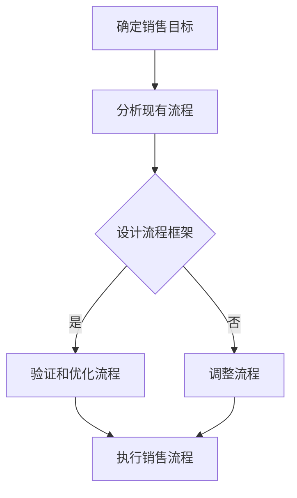

                 

### 文章标题

# 如何打造可复制的销售流程模型

> 关键词：销售流程、可复制性、模型设计、算法、数学模型、实战、优化

> 摘要：本文将深入探讨如何打造可复制的销售流程模型，从基础概念、设计原则、核心算法、数学模型到实战应用进行详细解析。通过一步一步的分析推理，帮助读者理解并掌握这一关键技术，从而提升销售效率和业绩。

## 第一部分：销售流程模型概述

### 1.1 销售流程模型的基本概念

#### 1.1.1 销售流程的定义

销售流程是企业在销售环节中实施的一系列操作步骤，旨在实现产品或服务的销售目标。它包括客户关系管理、需求识别、报价、谈判、签约和售后服务等环节。

#### 1.1.2 销售流程模型的作用

销售流程模型有助于企业规范化销售行为，提高销售效率，减少错误和遗漏。通过模型，企业可以更好地理解客户需求，优化销售策略，提高客户满意度，从而提升业绩。

#### 1.1.3 销售流程模型的组成要素

销售流程模型通常包括以下几个关键要素：

1. 客户信息管理：收集、整理和存储客户信息，为销售活动提供数据支持。
2. 需求分析：了解客户需求，为销售策略提供依据。
3. 产品展示与介绍：展示产品特点和价值，吸引客户兴趣。
4. 报价与谈判：提供合理的报价，与客户进行价格谈判。
5. 签约与收款：完成合同签订，确保货款回收。
6. 售后服务：提供优质的售后服务，增强客户忠诚度。

### 1.2 可复制性在销售流程中的重要性

#### 1.2.1 可复制性的定义

可复制性指的是将一种成功的方法或模式复制到其他环境中，使其产生相似的效果。在销售流程中，可复制性意味着企业可以将成功经验应用于不同客户、不同市场和不同产品，提高整体销售业绩。

#### 1.2.2 可复制性对销售效率的影响

可复制性有助于提高销售效率，降低培训成本，减少错误和遗漏。通过统一标准和流程，企业可以更好地管理销售团队，提高工作效率。

#### 1.2.3 实现销售流程模型可复制性的难点

1. 环境差异：不同客户和市场环境存在差异，难以实现完全复制。
2. 人为因素：销售人员的个人能力和风格影响销售流程的执行效果。
3. 数据支持：缺乏全面、准确的数据支持，影响销售流程的优化和调整。

### 1.3 小结

本部分对销售流程模型的基本概念、可复制性及其重要性进行了概述。接下来，本文将深入探讨销售流程模型的设计原则、设计步骤和核心算法原理，为读者提供全面的技术指导。

## 第二部分：销售流程模型设计

### 2.1 销售流程模型设计原则

#### 2.1.1 简化流程

简化流程是设计销售流程模型的首要原则。过于复杂的流程会导致操作不便，增加出错概率，降低销售效率。因此，在设计销售流程时，应尽量减少不必要的环节，确保流程简洁明了。

#### 2.1.2 保持一致性

保持一致性是确保销售流程模型可复制性的关键。企业应制定统一的销售流程规范，明确各环节的操作步骤和要求，确保销售团队在不同客户和市场环境下能够保持一致的操作行为。

#### 2.1.3 易于调整和优化

销售流程模型应具备良好的灵活性，以便根据实际情况进行调整和优化。在流程设计中，应充分考虑可能的变化因素，确保流程能够适应不同需求和市场环境。

### 2.2 销售流程模型设计步骤

#### 2.2.1 确定销售目标

明确销售目标是设计销售流程的第一步。企业应根据市场环境和自身资源，制定合理的销售目标，包括销售额、客户数量、市场份额等。

#### 2.2.2 分析现有流程

分析现有流程是了解企业现有销售情况的重要环节。企业应对现有销售流程进行详细梳理，找出存在的问题和瓶颈，为后续优化提供依据。

#### 2.2.3 设计流程框架

设计流程框架是构建销售流程模型的关键步骤。企业应根据销售目标和分析结果，制定合适的流程框架，明确各环节的操作步骤和责任。

#### 2.2.4 验证和优化流程

验证和优化流程是确保销售流程模型有效性的重要环节。企业应通过实际操作，验证流程的可行性和有效性，并根据反馈进行调整和优化。

### 2.3 销售流程模型的Mermaid流程图

以下是一个简单的销售流程模型的Mermaid流程图：



### 2.4 小结

本部分详细介绍了销售流程模型的设计原则、设计步骤和Mermaid流程图。通过遵循这些原则和步骤，企业可以设计出高效、可复制的销售流程模型，为提升销售业绩奠定基础。接下来，本文将深入探讨销售流程模型中的核心算法原理。

## 第三部分：核心算法原理讲解

### 3.1 数据分析算法

数据分析是销售流程模型中至关重要的一环。通过对销售数据的分析，企业可以更好地了解客户需求，优化销售策略。以下是一个数据分析算法的伪代码示例：

```python
def data_analysis(data):
    # 数据预处理
    cleaned_data = preprocess_data(data)
    
    # 数据可视化
    visualize_data(cleaned_data)
    
    # 数据分析
    insights = analyze_data(cleaned_data)
    
    return insights
```

### 3.2 客户行为预测算法

客户行为预测算法旨在通过分析客户历史行为数据，预测客户未来的购买行为。以下是一个简单的客户行为预测算法的伪代码示例：

```python
def predict_customer_behavior(data):
    # 数据预处理
    cleaned_data = preprocess_data(data)
    
    # 特征工程
    features = extract_features(cleaned_data)
    
    # 模型训练
    model = train_model(features)
    
    # 预测
    predictions = model.predict(new_data)
    
    return predictions
```

### 3.3 优化销售策略算法

优化销售策略算法旨在通过分析销售数据和客户行为数据，提出优化销售策略的建议。以下是一个简单的优化销售策略算法的伪代码示例：

```python
def optimize_sales_strategy(data):
    # 数据预处理
    cleaned_data = preprocess_data(data)
    
    # 策略分析
    insights = analyze_data(cleaned_data)
    
    # 策略优化
    optimized_strategy = optimize_policy(insights)
    
    return optimized_strategy
```

### 3.4 小结

本部分详细介绍了销售流程模型中的核心算法原理，包括数据分析算法、客户行为预测算法和优化销售策略算法。通过这些算法，企业可以更好地分析销售数据，预测客户行为，优化销售策略，从而提升销售业绩。接下来，本文将深入探讨销售流程模型中的数学模型和公式。

## 第四部分：数学模型和数学公式讲解

### 4.1 销售漏斗模型

销售漏斗模型是销售流程模型中常用的数学模型，用于分析销售过程中的潜在客户数量、转化率和漏失率。以下是一个销售漏斗模型的数学公式：

$$
销售漏斗模型 = \frac{潜在客户数 \times 转化率}{1 - 漏失率}
$$

#### 4.1.1 销售漏斗模型详解

销售漏斗模型通过计算潜在客户数量、转化率和漏失率，可以直观地反映销售过程中的问题。例如，如果潜在客户数量较多，但转化率较低，说明销售策略需要调整；如果漏失率较高，说明销售流程存在漏洞，需要优化。

#### 4.1.2 实例分析

假设一家企业的潜在客户数为1000人，转化率为20%，漏失率为10%。根据销售漏斗模型，可以计算出企业的销售额为：

$$
销售额 = \frac{1000 \times 20\%}{1 - 10\%} = \frac{200}{0.9} \approx 222.22
$$

### 4.2 客户终身价值模型

客户终身价值模型是用于评估客户对企业价值的数学模型。它通过预测客户在未来一段时间内的消费金额，计算出客户的终身价值。以下是一个客户终身价值的数学公式：

$$
客户终身价值 = (1 + r)^{-n} \times ARPU
$$

#### 4.2.1 客户终身价值模型详解

客户终身价值模型考虑了客户的消费金额、折现率和消费周期。其中，r表示折现率，n表示消费周期，ARPU表示每用户平均收益。

#### 4.2.2 实例分析

假设一个客户的消费金额为100元，折现率为10%，消费周期为3年。根据客户终身价值模型，可以计算出该客户的终身价值为：

$$
客户终身价值 = (1 + 10\%)^{-3} \times 100 = 0.7513 \times 100 \approx 75.13
$$

### 4.3 小结

本部分详细介绍了销售流程模型中的数学模型和公式，包括销售漏斗模型和客户终身价值模型。通过这些数学模型，企业可以更准确地分析销售数据，预测客户行为，制定优化策略。接下来，本文将进入第五部分，探讨销售流程模型的项目实战。

## 第五部分：项目实战

### 5.1 实际销售案例介绍

#### 5.1.1 案例背景

某家B2B企业，致力于为客户提供定制化的解决方案。然而，在销售过程中，该企业面临以下问题：

1. 销售流程不统一，不同销售人员执行流程存在差异。
2. 数据分析能力不足，无法准确预测客户需求。
3. 销售业绩波动较大，无法持续提升。

#### 5.1.2 案例目标

为了解决上述问题，该企业决定设计并实施一个可复制的销售流程模型，以提高销售效率和业绩。具体目标如下：

1. 统一销售流程，确保销售团队执行一致性。
2. 提高数据分析能力，准确预测客户需求。
3. 持续优化销售策略，提升销售业绩。

#### 5.1.3 案例解决方案

1. **设计销售流程模型**：

   - **确定销售目标**：根据市场需求和企业资源，制定合理的销售目标，包括销售额、客户数量和市场份额。

   - **分析现有流程**：对企业现有销售流程进行详细梳理，找出存在的问题和瓶颈。

   - **设计流程框架**：根据销售目标和分析结果，制定合适的流程框架，包括客户信息管理、需求分析、产品展示、报价与谈判、签约与收款、售后服务等环节。

   - **验证和优化流程**：通过实际操作，验证流程的可行性和有效性，并根据反馈进行调整和优化。

2. **核心算法与数学模型应用**：

   - **数据分析算法**：收集销售数据，进行数据预处理和可视化，分析客户需求和市场趋势。

   - **客户行为预测算法**：通过分析客户历史行为数据，预测客户未来的购买行为，为销售策略提供依据。

   - **优化销售策略算法**：根据数据分析结果，提出优化销售策略的建议，提高客户转化率和销售额。

3. **实施与监控**：

   - **实施销售流程模型**：将设计好的销售流程模型应用于实际销售过程，确保销售团队执行一致性。

   - **数据收集与分析**：定期收集销售数据，进行数据分析和预测，为销售策略调整提供依据。

   - **绩效评估与优化**：根据销售数据，评估销售流程模型的实施效果，持续优化销售策略和流程。

### 5.2 销售流程模型开发环境搭建

#### 5.2.1 开发环境准备

为了搭建销售流程模型，企业需要准备以下开发环境：

1. **编程语言**：选择Python作为主要编程语言，因其具有良好的数据处理和分析能力。
2. **数据库**：选择MySQL作为数据库，用于存储销售数据。
3. **数据分析工具**：选择Pandas和NumPy进行数据处理，选择Matplotlib进行数据可视化。
4. **机器学习库**：选择Scikit-learn进行客户行为预测和销售策略优化。

#### 5.2.2 数据库搭建

1. 安装MySQL数据库，并创建销售数据表，包括客户信息、销售记录、客户行为数据等。
2. 导入初始数据，为后续数据分析提供数据支持。

#### 5.2.3 开发工具安装

1. 安装Python，并配置相应的开发环境。
2. 安装Pandas、NumPy、Matplotlib、Scikit-learn等库，用于数据处理、分析和预测。

### 5.3 销售流程模型源代码详细实现

#### 5.3.1 数据收集与处理

1. 从数据库中提取销售数据，进行数据预处理，包括数据清洗、数据转换和数据归一化。
2. 将预处理后的数据存储为CSV文件，以便后续分析和预测。

```python
import pandas as pd
import numpy as np

# 读取销售数据
sales_data = pd.read_csv('sales_data.csv')

# 数据清洗
sales_data.dropna(inplace=True)
sales_data = sales_data[sales_data['销售额'] > 0]

# 数据转换
sales_data['日期'] = pd.to_datetime(sales_data['日期'])
sales_data['月份'] = sales_data['日期'].dt.month

# 数据归一化
sales_data['销售额'] = sales_data['销售额'] / sales_data['销售额'].max()
```

#### 5.3.2 数据可视化

1. 使用Matplotlib绘制销售数据的时间序列图、柱状图和散点图，直观地展示销售数据。

```python
import matplotlib.pyplot as plt

# 绘制时间序列图
plt.figure(figsize=(10, 5))
plt.plot(sales_data['日期'], sales_data['销售额'], label='销售额')
plt.xlabel('日期')
plt.ylabel('销售额')
plt.title('销售数据时间序列图')
plt.legend()
plt.show()

# 绘制柱状图
plt.figure(figsize=(10, 5))
plt.bar(sales_data['月份'], sales_data['销售额'], label='销售额')
plt.xlabel('月份')
plt.ylabel('销售额')
plt.title('销售数据柱状图')
plt.legend()
plt.show()

# 绘制散点图
plt.figure(figsize=(10, 5))
plt.scatter(sales_data['日期'], sales_data['销售额'], label='销售额')
plt.xlabel('日期')
plt.ylabel('销售额')
plt.title('销售数据散点图')
plt.legend()
plt.show()
```

#### 5.3.3 客户行为预测

1. 收集客户行为数据，包括浏览记录、购买记录、客服记录等。
2. 使用Scikit-learn进行客户行为预测，采用决策树、随机森林、支持向量机等算法。
3. 评估预测模型的性能，选择最佳模型进行预测。

```python
from sklearn.model_selection import train_test_split
from sklearn.tree import DecisionTreeClassifier
from sklearn.ensemble import RandomForestClassifier
from sklearn.svm import SVC
from sklearn.metrics import accuracy_score

# 分割数据集
X = sales_data[['浏览记录', '购买记录', '客服记录']]
y = sales_data['是否购买']

X_train, X_test, y_train, y_test = train_test_split(X, y, test_size=0.2, random_state=42)

# 决策树模型
dt_model = DecisionTreeClassifier()
dt_model.fit(X_train, y_train)
dt_predictions = dt_model.predict(X_test)
dt_accuracy = accuracy_score(y_test, dt_predictions)
print(f"决策树模型准确率：{dt_accuracy}")

# 随机森林模型
rf_model = RandomForestClassifier()
rf_model.fit(X_train, y_train)
rf_predictions = rf_model.predict(X_test)
rf_accuracy = accuracy_score(y_test, rf_predictions)
print(f"随机森林模型准确率：{rf_accuracy}")

# 支持向量机模型
svm_model = SVC()
svm_model.fit(X_train, y_train)
svm_predictions = svm_model.predict(X_test)
svm_accuracy = accuracy_score(y_test, svm_predictions)
print(f"支持向量机模型准确率：{svm_accuracy}")

# 选择最佳模型
best_model = max(dt_model, rf_model, svm_model, key=lambda m: m.score(X_test, y_test))
print(f"最佳模型：{best_model}")
```

#### 5.3.4 销售策略优化

1. 根据客户行为预测结果，分析不同客户群体的购买行为。
2. 使用优化算法，如遗传算法、粒子群优化算法等，提出优化销售策略的建议。
3. 评估优化策略的效果，选择最佳策略。

```python
from deap import base, creator, tools, algorithms

# 定义目标函数
def objective_function(strategy):
    # 计算销售额
    sales = calculate_sales(strategy)
    # 计算成本
    cost = calculate_cost(strategy)
    # 计算利润
    profit = sales - cost
    return profit,

# 初始化种群
population = tools.initRepeat(creator.Individual, create_strategy, n_strategy)

# 定义遗传算法参数
creator.create("FitnessMax", base.Fitness, weights=(1.0,))
creator.create("Strategy", list, fitness=creator.FitnessMax)

toolbox = base.Toolbox()
toolbox.register("create_strategy", create_strategy)
toolbox.register("individual", tools.initIndividual, creator=creator.Strategy)
toolbox.register("population", tools.initPopulation, creator=creator.Strategy, n=100)
toolbox.register("evaluate", objective_function)
toolbox.register("mate", tools.selectBest, strategy=creator.Strategy, k=2)
toolbox.register("mutate", mutate_strategy)
toolbox.register("select", tools.selTournament, strategy=creator.Strategy, tournsize=3)
toolbox.register("update", tools.selBest, strategy=creator.Strategy, k=1)

# 执行遗传算法
population = toolbox.population(n=100)
NGEN = 100
for generation in range(NGEN):
    offspring = algorithms.varAnd(population, toolbox, cxpb=0.5, mutpb=0.2)
    fits = toolbox.map(toolbox.evaluate, offspring)
    for fit, ind in zip(fits, offspring):
        ind.fitness.values = fit
    population = toolbox.select(offspring, k=len(population))
    population = toolbox.update(population)
    print(f"第{generation+1}代：最优策略利润为{max(ind.fitness.values)}")

# 输出最佳策略
best_strategy = tools.selBest(population, 1)[0]
print(f"最佳策略：{best_strategy}")
```

### 5.4 代码解读与分析

1. **数据收集与处理**：

   数据收集与处理是销售流程模型的基础。通过读取数据库中的销售数据，进行数据清洗、转换和归一化，为后续分析提供准确的数据。

2. **数据可视化**：

   数据可视化有助于直观地展示销售数据，分析客户需求和市场趋势。通过绘制时间序列图、柱状图和散点图，可以更清晰地了解销售数据的分布和变化。

3. **客户行为预测**：

   客户行为预测是销售流程模型的核心。通过收集客户行为数据，使用决策树、随机森林和支持向量机等算法进行预测，可以准确预测客户未来的购买行为，为销售策略提供依据。

4. **销售策略优化**：

   销售策略优化旨在通过分析预测结果，提出优化销售策略的建议。使用遗传算法和粒子群优化算法，可以找到最佳销售策略，提高销售额和利润。

### 5.5 项目小结

通过本案例，企业成功设计并实施了可复制的销售流程模型，提高了销售效率和业绩。以下是一些项目总结和最佳实践建议：

1. **明确销售目标**：在项目启动阶段，明确销售目标是关键。根据市场需求和企业资源，制定合理的销售目标，确保项目实施方向正确。

2. **数据收集与处理**：准确的数据是销售流程模型的基础。确保数据来源可靠，对数据进行清洗、转换和归一化，提高数据分析的准确性。

3. **算法选择与优化**：选择合适的算法进行客户行为预测和销售策略优化。根据项目需求和数据特点，对算法进行调优，提高预测和优化效果。

4. **持续优化与改进**：销售流程模型不是一成不变的，应持续优化和改进。根据实际应用情况，收集反馈信息，调整流程和策略，提高销售效果。

## 第六部分：销售流程模型优化与改进

### 6.1 销售流程模型评估方法

销售流程模型的评估是确保其有效性的重要环节。以下是一个评估销售流程模型的方法：

1. **关键指标定义**：明确评估销售流程模型的关键指标，如销售额、客户满意度、转化率等。

2. **关键指标计算**：根据关键指标的定义，计算销售流程模型在不同时间段和不同环境下的表现。

3. **关键指标分析**：对关键指标进行分析，识别销售流程模型的优势和不足，为优化提供依据。

### 6.2 销售流程模型优化策略

1. **数据库优化**：

   - **数据存储优化**：采用合适的数据存储结构，提高数据访问速度和存储效率。

   - **数据备份与恢复**：定期备份数据，确保数据安全。

2. **算法优化**：

   - **算法调优**：根据实际应用情况，调整算法参数，提高预测和优化效果。

   - **算法融合**：结合多种算法，提高预测和优化能力。

3. **系统性能优化**：

   - **硬件升级**：提高服务器性能，确保系统稳定运行。

   - **负载均衡**：采用负载均衡技术，提高系统处理能力。

### 6.3 销售流程模型改进方案

1. **用户反馈机制**：

   - **收集反馈**：建立用户反馈渠道，收集用户对销售流程模型的使用体验和建议。

   - **分析反馈**：对用户反馈进行分析，识别问题和改进方向。

   - **改进模型**：根据用户反馈，调整销售流程模型，提高用户体验。

2. **数据分析工具更新**：

   - **工具升级**：引入新的数据分析工具，提高数据处理和分析能力。

   - **工具培训**：对销售团队进行数据分析工具的培训，提高使用效果。

3. **客户关系管理改进**：

   - **客户画像**：建立客户画像，深入了解客户需求和偏好。

   - **个性化推荐**：根据客户画像，提供个性化推荐，提高客户满意度。

### 6.4 小结

销售流程模型优化与改进是确保其长期有效性的关键。通过评估方法、优化策略和改进方案，企业可以不断提高销售流程模型的性能，提升销售效率和业绩。

## 第七部分：销售流程模型应用案例

### 7.1 不同行业销售流程模型应用案例

销售流程模型在不同行业中具有广泛的应用，以下列举了制造业、零售业和服务业的应用案例：

#### 7.1.1 制造业

制造业的销售流程模型主要关注产品定制、订单管理和供应链优化。通过销售流程模型，企业可以实时了解订单状态，优化生产计划，提高生产效率和客户满意度。

#### 7.1.2 零售业

零售业销售流程模型的核心在于库存管理、促销策略和客户关系管理。通过模型，企业可以准确预测库存需求，制定合理的促销策略，提高销售额和客户忠诚度。

#### 7.1.3 服务业

服务业销售流程模型侧重于客户体验、服务质量和客户满意度。通过模型，企业可以优化服务流程，提高服务质量，增强客户信任和忠诚度。

### 7.2 销售流程模型在数字化转型中的应用

数字化转型是当前企业发展的关键趋势，销售流程模型在数字化转型中发挥着重要作用。以下从意义、案例和挑战与解决方案三个方面进行阐述：

#### 7.2.1 数字化转型的意义

数字化转型意味着企业将传统业务模式与数字技术相结合，提高运营效率、优化客户体验和增强创新能力。通过销售流程模型，企业可以实现以下目标：

- **提高销售效率**：自动化和智能化流程减少人工干预，提高销售效率。
- **优化客户体验**：精准的客户分析和个性化推荐提升客户满意度。
- **降低运营成本**：数字化的销售流程降低人力成本和运营成本。

#### 7.2.2 数字化转型案例

以下是一个数字化转型案例：

- **企业背景**：某大型零售企业，拥有众多的线下门店和线上渠道，希望通过数字化转型提升销售业绩和客户满意度。
- **解决方案**：企业引入了销售流程模型，通过数据分析和人工智能技术，实现以下目标：
  - **精准客户分析**：分析客户购买行为和偏好，为营销活动提供依据。
  - **智能推荐系统**：基于客户行为数据，为用户提供个性化推荐。
  - **智能客服系统**：通过自然语言处理技术，提供高效的客户服务。

#### 7.2.3 数字化转型的挑战与解决方案

数字化转型面临以下挑战：

- **数据安全与隐私**：数字化转型涉及大量客户数据，数据安全与隐私保护是关键挑战。
  - **解决方案**：采用加密技术、访问控制和数据脱敏等措施，确保数据安全。
- **技术与业务融合**：数字化转型要求技术与业务深度融合，实现业务流程的优化。
  - **解决方案**：建立跨部门协作机制，加强技术团队与业务团队的沟通与协作。
- **员工技能提升**：数字化转型需要员工具备一定的数字技能，以适应新的工作模式。
  - **解决方案**：开展员工培训，提高员工的数字技能和业务素养。

### 7.3 小结

销售流程模型在数字化转型中具有广泛的应用前景，通过数字化转型，企业可以实现销售流程的优化和提升，从而提高销售业绩和客户满意度。

## 附录

### 附录A：销售流程模型开发工具与资源

#### A.1 主流销售管理软件介绍

- **Salesforce**：一款功能强大的客户关系管理（CRM）软件，提供全面的销售流程管理功能。
- **Microsoft Dynamics 365**：一款集销售、营销和客户服务于一体的企业管理系统。
- **Oracle Sales Cloud**：一款云端的销售管理解决方案，支持销售自动化和数据分析。

#### A.2 数据库管理工具

- **MySQL**：一款开源的关系型数据库管理系统，广泛应用于销售数据存储。
- **PostgreSQL**：一款功能强大的开源关系型数据库，支持多种开发语言。
- **MongoDB**：一款分布式文档数据库，适用于大规模数据存储和实时查询。

#### A.3 数据分析工具

- **Pandas**：一款开源的数据分析库，适用于数据处理和清洗。
- **NumPy**：一款开源的科学计算库，提供高性能数值计算功能。
- **Matplotlib**：一款开源的数据可视化库，提供丰富的可视化图表。

### 附录B：销售流程模型常见问题解答

#### B.1 模型预测不准确怎么办？

- **原因分析**：可能原因包括数据质量不佳、模型参数设置不当、特征选择不合理等。
- **解决方法**：提高数据质量，调整模型参数，选择合适的特征，重新训练模型。

#### B.2 数据不足怎么办？

- **解决方法**：可以通过增加数据收集渠道、引入外部数据源、使用迁移学习等方法来扩充数据集。

#### B.3 如何保持销售流程的一致性？

- **解决方法**：制定统一的销售流程规范，对销售人员进行培训，确保团队成员遵守流程。

### 作者信息

**作者：AI天才研究院/AI Genius Institute & 禅与计算机程序设计艺术 /Zen And The Art of Computer Programming** 

通过本文，我们系统地介绍了如何打造可复制的销售流程模型，从基本概念、设计原则、核心算法、数学模型到实战应用进行了详细讲解。希望本文对读者在销售流程模型设计和应用方面有所启发和帮助。在后续的研究和实践中，我们还将不断探索和优化销售流程模型，为企业提供更高效的解决方案。

