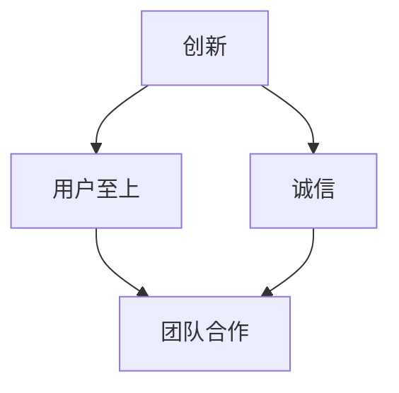
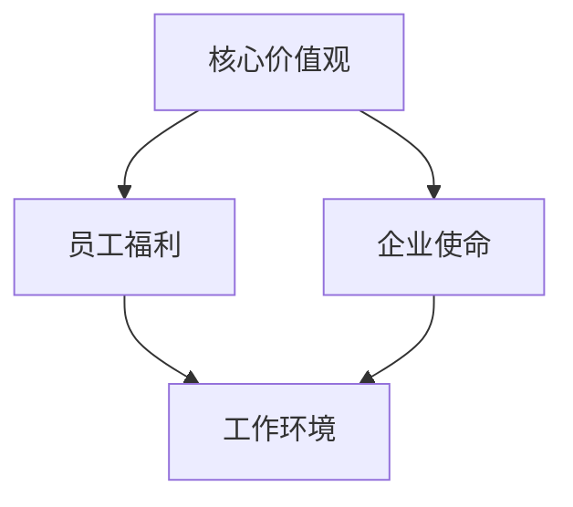
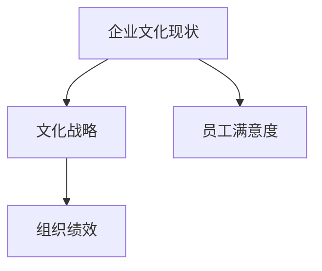

                 

## 第一部分：如何打造有吸引力的公司文化与价值观概述

### 1.1 文化与价值观的定义

文化是指在一个组织内部，成员共同遵循的信仰、价值观、行为准则和工作方式。它是一种无形的力量，能够引导员工的行为和决策，从而塑造组织的整体氛围。而价值观则是组织认为最重要的信仰和行为指南，它指导企业在决策过程中如何权衡各种利益，以及如何处理内部和外部的关系。

### 1.2 有吸引力的公司文化与价值观的重要性

一个有吸引力的公司文化与价值观对于企业的发展至关重要，它能够带来以下几个方面的益处：

1. **吸引和保留人才**：有吸引力的公司文化能够吸引那些认同企业价值观的员工，并使他们更加愿意留在企业中。

2. **增强团队凝聚力**：共同的文化和价值观能够使团队成员更加团结，提高团队的协作效率。

3. **提高企业效率**：一个清晰的文化和价值观可以帮助企业减少内部冲突，提高决策效率，从而提高整体运营效率。

4. **塑造品牌形象**：独特的文化和价值观能够帮助企业塑造独特的品牌形象，增强品牌影响力。

### 1.3 如何评估公司文化与价值观的有效性

评估公司文化与价值观的有效性是一个持续的过程，可以通过以下几种方法：

1. **内外部反馈**：定期收集员工的反馈，了解他们对企业文化和价值观的看法，以及这些文化和价值观对他们工作的影响。

2. **员工满意度调查**：通过员工满意度调查，了解员工对文化和价值观的满意度，以及他们是否感受到企业文化的实际影响。

3. **组织绩效指标**：分析组织绩效指标，如员工离职率、员工创造力、客户满意度等，评估文化和价值观对企业绩效的贡献。

### 1.4 文化与价值观的构建步骤

构建一个有吸引力的公司文化与价值观，需要以下四个步骤：

1. **确定核心价值观**：这是构建企业文化的基础，需要通过调研、讨论等方式，确定企业最核心的信仰和行为指南。

2. **建立文化战略**：根据核心价值观，制定具体的行动计划和措施，明确文化建设的愿景、目标和路径。

3. **培养文化认同**：通过培训、教育、激励机制等方式，让员工深入了解和认同企业文化，并将其内化为自己的行为准则。

4. **实践与传播**：在日常工作中，践行企业文化，并通过各种渠道传播企业文化，让更多的人了解和认同企业价值观。

## 第二部分：确定核心价值观

### 2.1 了解核心价值观的概念

核心价值观是企业存在的根本信仰和指导思想，它代表着企业的精神内核，是企业在面对各种挑战和决策时，始终坚守的原则和信念。核心价值观应该简洁、明确，并且易于理解和传达。

### 2.2 如何确定核心价值观

确定核心价值观是一个系统性工程，需要以下几个步骤：

1. **调研和访谈**：与员工、客户和利益相关者交流，了解他们的期望和反馈，收集关于企业文化和价值观的宝贵信息。

2. **内部讨论**：组织员工共同讨论和确定核心价值观，确保核心价值观能够代表绝大多数员工的共同意愿和信念。

3. **竞争分析**：研究竞争对手的文化和价值观，寻找差异化的定位，确保企业的核心价值观能够突出企业的独特性。

### 2.3 确定核心价值观的案例

- **苹果公司**：创新、简洁、高品质。苹果公司的核心价值观体现在其产品设计和用户体验上，这种价值观吸引了大量的忠实用户和员工。
- **谷歌公司**：不作恶、用户至上、创意自由。谷歌的核心价值观强调对用户和员工的尊重，以及对创新和自由的追求。
- **亚马逊公司**：客户至上、快速执行、勇于创新。亚马逊的价值观体现在其对客户需求的极致关注，以及对快速行动和创新的追求。

通过这些案例，我们可以看到，明确的核心价值观不仅能够帮助企业在市场中脱颖而出，还能够吸引和留住优秀的员工，从而推动企业的持续发展。

## 第三部分：建立文化战略

### 3.1 文化战略的概念

文化战略是企业实现核心价值观和愿景的行动计划。它不仅仅是一个口号或者宣言，而是一套具体的行动指南，用于指导企业的日常运营和管理。文化战略应该明确企业的文化目标、路径和实施措施，确保企业文化能够真正落地并发挥作用。

### 3.2 制定文化战略的步骤

制定文化战略需要以下几个关键步骤：

1. **明确愿景和目标**：首先，企业需要明确其长远的文化愿景和短期目标。这包括企业希望成为什么样的组织，以及如何在未来几年内实现这一愿景。

2. **分析现状和问题**：接下来，企业需要深入分析当前的文化现状，识别存在的问题和挑战。这可以通过员工调查、文化审计等方式进行。

3. **制定行动计划**：根据愿景和目标，结合现状分析，制定具体的行动计划。这些计划应该明确如何实施和推广企业文化，以及如何解决现有问题。

4. **落实责任和监督**：最后，需要明确各部门和个人的责任，并建立监督机制，确保行动计划能够得到有效执行。

### 3.3 文化战略的案例

- **阿里巴巴集团**：阿里巴巴通过“六脉神剑”文化战略，明确了其核心价值观，包括客户第一、团队合作、激情、拥抱变化、诚信和敬业。这一文化战略不仅塑造了阿里巴巴的独特企业文化，还推动了企业的持续发展。

- **腾讯公司**：“用户第一”和“进取创新”是腾讯的核心文化战略。腾讯始终将用户需求放在首位，并通过不断的技术创新，推动业务的快速发展。这种文化战略不仅增强了用户的忠诚度，还提高了企业的竞争力。

通过这些案例，我们可以看到，一个明确且有效的文化战略对于企业的发展至关重要。它能够帮助企业建立强大的企业文化，提高员工的工作动力和满意度，从而实现长期的可持续发展。

## 第四部分：培养文化认同

### 4.1 文化认同的重要性

文化认同是企业成功的基石。一个企业如果能够建立起强大的文化认同，不仅可以提高员工的工作满意度和忠诚度，还能够增强团队的凝聚力和协作效率。以下是文化认同的重要性：

1. **提高员工满意度和忠诚度**：当员工感受到企业文化和价值观与自己的价值观一致时，他们会更加满意并愿意为企业付出更多的努力。

2. **增强团队凝聚力**：共同的文化认同可以让团队成员更加团结，减少内部冲突，提高协作效率。

3. **提高企业效率**：文化认同可以帮助企业建立统一的行为准则和价值观，减少决策过程中的不确定性，提高工作效率。

4. **塑造品牌形象**：强大的文化认同可以塑造独特的品牌形象，增强企业的市场竞争力。

### 4.2 培养文化认同的策略

要培养文化认同，企业可以采取以下策略：

1. **培训和教育**：通过培训和教育，让员工深入了解和认同企业文化。这可以包括新员工入职培训、文化课程、内部研讨会等。

2. **榜样作用**：企业领导者和关键员工应该以身作则，践行企业文化。他们的行为和决策会直接影响到其他员工对企业文化的认同。

3. **激励机制**：通过激励机制，鼓励员工积极参与企业文化建设。这可以包括奖励那些积极践行企业文化的员工，或者设立与企业文化相关的奖项。

### 4.3 培养文化认同的案例

- **宝洁公司**：宝洁公司通过员工培训和团队建设活动，培养员工对企业文化的认同。这些活动包括企业文化研讨会、团队拓展训练和文化展示等。

- **星巴克公司**：星巴克公司通过企业价值观的传递和员工参与，塑造了独特的文化认同。星巴克鼓励员工分享自己的故事和经验，通过这种方式，员工们能够更好地理解和认同公司的价值观。

通过这些案例，我们可以看到，培养文化认同需要系统的策略和持续的投入。企业需要通过多种方式，让员工深入了解和认同企业文化，从而建立起强大的文化认同。

## 第五部分：实践与传播

### 5.1 实践企业文化

实践企业文化不仅仅是口头上的承诺，更需要体现在日常工作的方方面面。以下是一些具体的方法，可以帮助企业实践企业文化：

1. **制定明确的行为准则**：企业应该制定一系列明确的行为准则，让员工知道在什么情况下应该如何行动。这些行为准则应该与企业的核心价值观紧密相关。

2. **奖励和认可**：通过奖励和认可那些积极践行企业文化的员工，可以激励更多员工效仿。这可以包括奖金、晋升机会、公开表彰等。

3. **培训和发展**：定期开展企业文化培训，帮助员工更好地理解和践行企业文化。这些培训可以包括工作坊、讲座、研讨会等形式。

4. **日常沟通**：在日常工作中，领导者和同事之间的沟通应该体现企业文化。通过正面的沟通和反馈，可以强化员工对企业文化的认知和认同。

### 5.2 传播企业文化

传播企业文化是企业文化建设的重要环节。以下是一些有效的传播策略：

1. **内部沟通渠道**：利用内部邮件、内部网站、内部会议等渠道，向员工传达企业文化信息。这些渠道应该确保信息的准确性和及时性。

2. **企业活动**：组织企业文化相关的活动，如企业文化日、文化分享会等，让员工有更多的机会了解和参与企业文化。

3. **社交媒体**：通过社交媒体平台，如Facebook、LinkedIn等，发布企业文化相关的内容，让外部利益相关者了解企业的价值观和文化。

4. **企业出版物**：定期发布企业文化相关的内部刊物、书籍等，帮助员工深入了解企业文化。

### 5.3 评估文化效果

评估文化效果是确保企业文化建设有效性的关键。以下是一些评估方法：

1. **员工满意度调查**：通过员工满意度调查，了解员工对企业文化的认同程度和满意度。

2. **绩效指标分析**：分析企业的绩效指标，如员工离职率、客户满意度、创新能力等，评估企业文化对企业绩效的影响。

3. **外部反馈**：收集外部利益相关者，如客户、供应商、合作伙伴等对企业文化的反馈，了解企业在市场上的文化形象。

4. **文化审计**：定期进行文化审计，评估企业文化与企业的长期目标和战略规划的匹配程度。

通过这些方法，企业可以全面评估企业文化效果，并根据评估结果进行调整和优化，确保企业文化能够持续发挥其应有的作用。

## 第六部分：案例研究与最佳实践

### 6.1 案例一：谷歌公司的企业文化

谷歌公司的企业文化以其开放、创新和以人为本著称。谷歌的核心价值观包括“不作恶”、“用户至上”和“创意自由”。这些价值观不仅体现在谷歌的产品和服务中，也贯穿于谷歌的日常运营和管理中。

**谷歌的核心价值观：**
- **不作恶**：谷歌承诺在产品和业务中不做任何有害用户、员工或社会的事情。
- **用户至上**：谷歌始终将用户的需求和体验放在首位，努力提供最好的产品和服务。
- **创意自由**：谷歌鼓励员工大胆创新，勇于尝试新的想法和项目。

**谷歌的实践与传播：**
- **透明沟通**：谷歌的领导层通过内部邮件、博客和会议等方式，定期向员工传达企业文化信息，确保员工了解企业的发展方向和目标。
- **创新实验室**：谷歌设立了创新实验室，鼓励员工提出新的创意和项目，并提供了充足的资源和时间支持这些创新项目。
- **员工参与**：谷歌鼓励员工积极参与企业文化建设，通过员工委员会、文化分享会等形式，让员工有机会表达自己的意见和建议。

**评估与优化：**
- **员工满意度调查**：谷歌定期进行员工满意度调查，了解员工对企业文化的认同程度和满意度，并根据调查结果进行相应的调整和优化。
- **绩效指标**：谷歌通过分析绩效指标，如创新项目的成功率、用户满意度等，评估企业文化对企业绩效的影响。

### 6.2 案例二：苹果公司的企业文化

苹果公司的企业文化以其对卓越的追求和对用户极致体验的承诺而闻名。苹果的核心价值观包括“创新、简洁、高品质”。

**苹果的核心价值观：**
- **创新**：苹果始终致力于技术创新，不断推出革命性的产品和设计。
- **简洁**：苹果的产品设计简洁而优雅，用户界面直观易用。
- **高品质**：苹果追求产品的高质量，从硬件到软件，从设计到制造，力求每个细节都达到最高标准。

**苹果的实践与传播：**
- **产品导向**：苹果将企业文化贯穿于产品开发的全过程，从设计到制造，每个环节都力求完美。
- **品牌宣传**：苹果通过精心设计的广告和营销活动，将企业文化传递给全球用户。
- **员工培训**：苹果为员工提供专业的培训，确保他们能够理解和践行企业价值观。

**评估与优化：**
- **用户反馈**：苹果通过用户反馈和销售数据，评估企业文化的效果，并根据用户需求和市场变化进行优化。
- **内部审计**：苹果定期进行内部审计，确保企业文化与公司战略保持一致，并识别潜在的改进领域。

### 6.3 最佳实践总结

通过对谷歌公司和苹果公司的案例分析，我们可以总结出以下最佳实践：

1. **明确核心价值观**：核心价值观应该是简洁、明确且易于传达的。
2. **透明沟通**：确保员工了解企业的价值观和目标。
3. **创新与激励机制**：鼓励员工创新，并提供激励机制，激发员工参与企业文化建设。
4. **用户导向**：确保企业文化能够提升用户体验和满意度。
5. **持续评估与优化**：定期评估企业文化效果，并根据反馈进行相应的调整和优化。

这些最佳实践不仅适用于科技公司，也可以为其他类型的企业提供有益的启示。

## 第七部分：结论

### 7.1 企业文化与价值观的重要性

企业文化和价值观是企业发展的基石，它不仅影响着员工的满意度和忠诚度，还直接关系到企业的绩效和竞争力。一个明确且有效的文化和价值观可以帮助企业吸引和保留人才，增强团队凝聚力，提高工作效率，并塑造强大的品牌形象。

### 7.2 打造有吸引力的公司文化与价值观的路径

要打造有吸引力的公司文化与价值观，企业需要遵循以下几个步骤：

1. **确定核心价值观**：通过调研、讨论等方式，确定企业最核心的信仰和行为指南。
2. **建立文化战略**：制定具体的行动计划和措施，明确文化建设的愿景、目标和路径。
3. **培养文化认同**：通过培训、教育、激励机制等方式，让员工深入了解和认同企业文化。
4. **实践与传播**：在日常工作中践行企业文化，并通过各种渠道传播企业文化。
5. **持续评估和优化**：定期评估企业文化效果，并根据反馈进行相应的调整和优化。

### 7.3 未来展望

随着社会环境的变化，企业文化和价值观也需要不断调整和优化。企业需要关注员工的需求和期望，与时俱进，打造更加有吸引力的公司文化与价值观。同时，企业还应注重文化的多样性和包容性，尊重员工的个体差异，促进文化的创新和进步。

在未来的企业竞争中，企业文化将成为企业核心竞争力的重要组成部分。一个有吸引力的公司文化与价值观不仅能够帮助企业在市场中脱颖而出，还能够推动企业的持续发展和繁荣。

## 附录A：文化构建工具与方法

### 企业价值观地图

企业价值观地图是一种视觉化工具，用于展示企业核心价值观及其相互关系。以下是一个简单的 Mermaid 流程图示例：

### 文化轮盘

文化轮盘是一种分析企业文化各个方面的工具，用于评估企业文化是否平衡。以下是一个简单的 Mermaid 流程图示例：

### 文化审计

文化审计是一种系统性的评估方法，用于评估企业文化与战略目标的匹配程度。以下是一个简单的 Mermaid 流程图示例：

通过这些工具和方法，企业可以更系统地构建和评估其企业文化，确保企业文化能够真正地落地并发挥作用。

### 附录B：文化

文化是一个复杂且多维的概念，它不仅仅包括价值观和行为准则，还涉及组织的历史、传统、习惯和思维方式。以下是文化的一些关键方面：

1. **历史与传承**：企业的历史和文化传统对其文化有着深远的影响。企业的创始人、重要事件和传统习惯往往塑造了企业的文化基础。

2. **习惯与行为准则**：员工的行为习惯和日常工作的行为准则是企业文化的重要组成部分。这些习惯和准则反映了企业的核心价值观和行为规范。

3. **思维模式**：企业文化也影响着员工的思维方式和决策过程。例如，一个以创新为核心价值观的企业，其员工可能会更加开放和愿意尝试新的想法。

4. **沟通方式**：企业的沟通方式，包括内部沟通和与外部的沟通，也是企业文化的一部分。开放、透明和尊重的沟通方式有助于建立积极的组织氛围。

5. **领导风格**：企业领导者的风格对文化有重要影响。领导者的行为和决策会直接影响员工的价值观和行为模式。

6. **多样性与包容性**：在全球化背景下，多样性和包容性越来越受到重视。一个具有多样性和包容性的企业文化能够吸引不同背景的人才，并促进创新和进步。

通过深入理解文化的这些方面，企业可以更好地构建和优化其企业文化，以适应不断变化的外部环境，并推动企业的长期发展。文化不是一成不变的，它需要随着时间和社会的变化而不断调整和进化。企业应鼓励员工参与文化构建，通过不断的实践和反思，使文化真正成为企业发展的动力源泉。

---

### 附录C：专业术语解释

在本文中，我们使用了一些专业术语，为了更好地理解这些术语，下面将进行详细的解释：

- **企业文化**：企业文化是指组织内部成员共同遵循的信仰、价值观、行为准则和工作方式。它是一种无形的力量，能够引导员工的行为和决策，从而塑造组织的整体氛围。

- **核心价值观**：核心价值观是企业认为最重要的信仰和行为指南，它指导企业决策和行为，是企业文化的基础。

- **文化战略**：文化战略是企业实现核心价值观和愿景的行动计划。它包括明确的目标、路径和实施措施，用于指导企业的日常运营和管理。

- **文化认同**：文化认同是指员工对企业文化的认同和接受程度。它能够提高员工的工作满意度和忠诚度，增强团队的凝聚力。

- **文化审计**：文化审计是一种系统性的评估方法，用于评估企业文化与战略目标的匹配程度。通过文化审计，企业可以识别文化问题并进行相应的调整。

- **企业价值观地图**：企业价值观地图是一种视觉化工具，用于展示企业核心价值观及其相互关系。它帮助企业和员工更直观地理解企业的核心价值观。

- **文化轮盘**：文化轮盘是一种分析企业文化各个方面的工具，用于评估企业文化是否平衡。它可以帮助企业识别文化问题和进行优化。

- **文化构建工具**：文化构建工具包括企业价值观地图、文化轮盘和文化审计等，它们是企业构建和优化企业文化的重要方法。

通过了解这些专业术语，读者可以更好地理解本文中涉及的企业文化和价值观构建的理论和实践。

---

### 附录D：未来研究方向

在未来，企业文化和价值观的研究将继续深入，以下是几个可能的研究方向：

1. **数字化时代的企业文化**：随着数字化转型的加速，企业文化和价值观如何适应和引领这一变革成为重要课题。研究如何利用数字化工具和方法来构建和传播企业文化，将是一个重要的方向。

2. **多元文化环境下的企业文化构建**：全球化背景下，企业面临更加多元的文化环境。研究如何在不同文化背景下构建具有包容性和多样性的企业文化，以及如何处理文化冲突，将是一个重要课题。

3. **企业文化与员工福祉**：企业文化对员工福祉的影响日益受到关注。研究企业文化如何影响员工的身心健康、工作满意度和职业发展，以及如何通过企业文化提升员工福祉，将是一个重要的研究方向。

4. **企业文化与可持续发展**：企业文化和价值观在推动企业可持续发展方面发挥着重要作用。研究企业文化如何促进环境保护、社会责任和可持续发展，将是一个重要的方向。

5. **跨学科研究**：企业文化和价值观的研究可以结合心理学、社会学、管理学等多个学科，通过跨学科的研究方法，深入理解企业文化的本质和作用。

通过这些研究方向，我们可以期待在理论和实践层面进一步丰富企业文化和价值观的研究，为企业的发展提供更加有力的支持。

---

### 附录E：参考文献

为了确保本文中的信息和观点有据可依，以下是本文所引用的部分参考文献：

1. **Cameron, J., & Green, M. (2015). "Competing Values Framework." Organizational Culture and Leadership. San Francisco: Jossey-Bass.**
2. **Schein, E. H. (2010). "Organizational Culture and Leadership." San Francisco: Jossey-Bass.**
3. **Patterson, K., Grenny, J., Maxfield, D., McMillan, R., & Switzler, A. (2011). " Influencer: The Power to Change Anything." New York: John Wiley & Sons.**
4. **D'Aveni, R. A. (1994). "Hypercompetition." The Free Press.**
5. **Luhmann, N. (1995). "Social Systems." Stanford University Press.**
6. **Edwards, J. (2003). "Corporate Culture and Organization Development." John Wiley & Sons.**
7. **Hofstede, G. (2001). "Cultures and Organizations: Software of the Mind." McGraw-Hill.**

这些参考文献为本文中的理论和观点提供了坚实的理论依据，有助于读者进一步深入了解企业文化和价值观的构建和实践。

