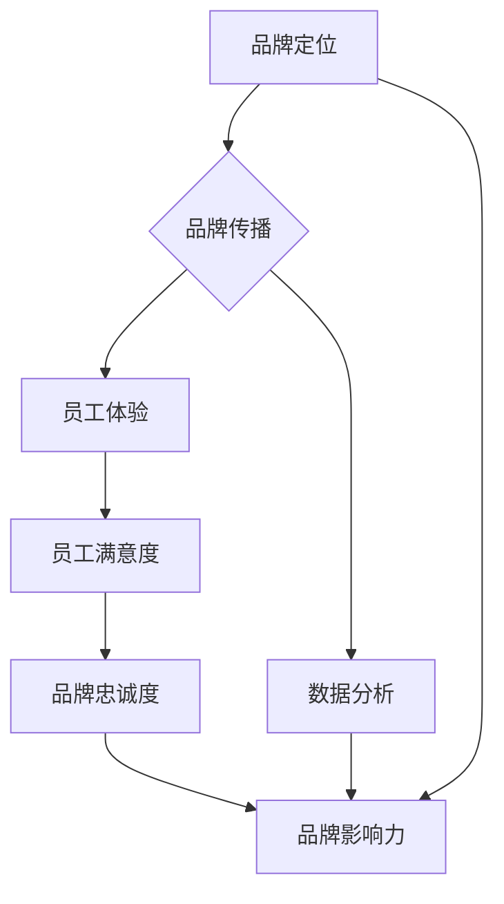
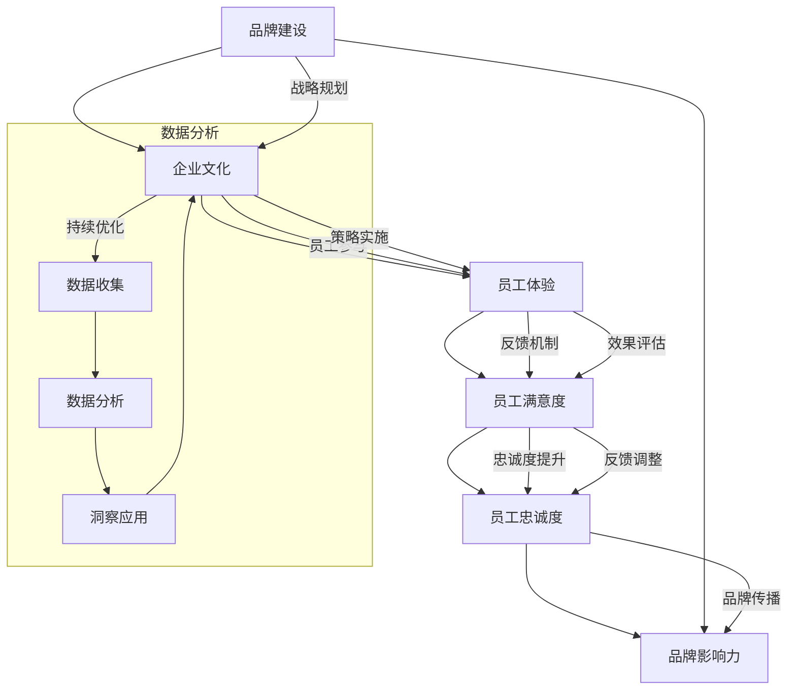

                 

### 文章标题

### 《如何打造有吸引力的雇主品牌策略》

### 关键词

- 雇主品牌
- 企业文化
- 员工体验
- 品牌传播
- 数据分析

### 摘要

本文旨在探讨如何通过系统化策略打造具有吸引力的雇主品牌。从雇主品牌的概念与重要性出发，逐步深入分析其核心要素，如企业文化、员工体验、品牌定位与传播策略。通过案例解析，本文展示了如何实施有效的雇主品牌建设行动，并结合数据分析与优化算法，提出了雇主品牌建设的数学模型和数学公式，最终通过实战案例，展示了策略的实际应用与效果。本文为致力于提升企业雇主品牌的决策者提供了全面且实用的指导。

## 《如何打造有吸引力的雇主品牌策略》目录大纲

### 第一部分：雇主品牌策略概述

#### 第1章：什么是雇主品牌

- **1.1 雇主品牌的概念与重要性**
- **1.2 雇主品牌与传统品牌的关系**
- **1.3 雇师品牌对企业和员工的影响**

#### 第2章：雇主品牌建设的核心要素

- **2.1 企业文化与价值观**
- **2.2 员工体验与关怀**
- **2.3 品牌定位与传播策略**

#### 第3章：打造有吸引力的雇主品牌策略

- **3.1 确定目标受众**
- **3.2 设计品牌形象**
- **3.3 制定品牌传播计划**
- **3.4 实施品牌建设行动**

### 第二部分：核心概念与联系

#### 第4章：雇主品牌核心概念原理和架构

- **4.1 雇主品牌的核心概念**
- **4.2 雇主品牌的架构**
- **4.3 雇主品牌与员工满意度的关系（Mermaid流程图）**

### 第三部分：核心算法原理讲解

#### 第5章：雇主品牌分析算法原理

- **5.1 数据收集与预处理**
- **5.2 描述性统计分析**
- **5.3 聚类分析算法**
- **5.4 相关性分析算法**

#### 第6章：雇主品牌优化算法

- **6.1 数据驱动品牌定位**
- **6.2 品牌传播效果评估**
- **6.3 个性化推荐算法**

### 第四部分：数学模型和数学公式讲解

#### 第7章：雇主品牌数学模型

- **7.1 品牌知名度与员工满意度的关系模型**
- **7.2 品牌忠诚度与员工留存率模型**
- **7.3 数学公式详细讲解与举例说明**

### 第五部分：项目实战

#### 第8章：雇主品牌建设实战案例

- **8.1 项目背景**
- **8.2 开发环境搭建**
- **8.3 源代码详细实现**
- **8.4 代码解读与分析**

#### 第9章：实战案例分析

- **9.1 案例一：某科技公司的雇主品牌打造之路**
- **9.2 案例二：某金融机构的雇主品牌策略优化**

### 附录

- **附录A：雇主品牌策略建设工具与资源**

## 第一部分：雇主品牌策略概述

### 第1章：什么是雇主品牌

#### 1.1 雇主品牌的概念与重要性

雇主品牌（Employer Brand）是指企业在劳动力市场上的形象和声誉，它反映了员工对企业的认可度、满意度以及忠诚度。雇主品牌不仅仅是企业的外在形象，更是企业文化和价值观的体现。它通过员工的工作体验、职业发展、工作环境等方面传达给外部公众，从而吸引并留住优秀人才。

在当今竞争激烈的人才市场中，雇主品牌的重要性日益凸显。首先，一个强大的雇主品牌能够帮助企业吸引并保留顶尖人才。研究表明，优秀的员工往往更倾向于选择拥有良好雇主品牌的企业，因为这些企业能够提供更有吸引力的职业发展机会、良好的工作环境以及完善的员工福利。其次，雇主品牌对企业的整体绩效具有显著影响。拥有强大雇主品牌的企业通常能够提高员工的工作效率、创新能力和忠诚度，从而提升企业的市场竞争力和业务绩效。此外，良好的雇主品牌还能帮助企业降低招聘和培训成本，提高员工的整体素质和团队凝聚力。

总之，雇主品牌是企业在人才市场上的核心竞争力之一，它不仅关乎企业的人才吸引和留存，也直接影响到企业的长期发展和市场竞争力。因此，构建和维护一个有吸引力的雇主品牌已成为企业战略规划中的重要环节。

#### 1.2 雇主品牌与传统品牌的关系

雇主品牌与传统品牌既有联系又有区别。首先，传统品牌是企业面向消费者的品牌形象，而雇主品牌则是企业面向员工和潜在候选人的品牌形象。两者虽然服务的对象不同，但它们之间存在着紧密的联系。

一方面，雇主品牌和传统品牌在构建过程中都依赖于企业的核心价值和文化。一个成功的企业品牌，往往具有清晰的价值主张和独特的企业文化，这些元素在雇主品牌建设中也同样重要。例如，苹果公司以其创新、简约和卓越的用户体验而闻名，这种品牌形象不仅吸引了大量消费者，也吸引了众多优秀人才。

另一方面，传统品牌对雇主品牌有重要的促进作用。一个强大的企业品牌能够提升其在劳动力市场中的声誉和吸引力，从而为雇主品牌建设奠定坚实的基础。此外，传统品牌和雇主品牌之间的协同效应，可以进一步强化企业的整体品牌形象。例如，谷歌作为全球知名的高科技企业，其强大的品牌影响力不仅吸引了大量消费者，也使其在人才市场上备受青睐，成为科技人才的理想选择。

然而，雇主品牌和传统品牌也存在一些显著的区别。首先，传统品牌侧重于市场推广和消费者认知，而雇主品牌则侧重于员工体验和忠诚度。传统品牌通过广告、公关和市场推广等手段塑造企业形象，而雇主品牌则需要通过员工的工作体验、职业发展和企业文化的实际表现来赢得员工的信任和忠诚。其次，传统品牌的建设周期通常较长，而雇主品牌则需要更加灵活和快速地响应市场变化和员工需求。

总之，雇主品牌和传统品牌是相辅相成的，一个成功的雇主品牌策略，需要综合考虑企业的整体品牌战略，并通过传统品牌的影响力来进一步巩固和提升雇主品牌。

#### 1.3 雇主品牌对企业和员工的影响

雇主品牌对企业和员工都有着深远的影响，这种影响不仅体现在短期的运营效果上，更在长期的战略发展上具有重要意义。

首先，对企业的正面影响：

1. **吸引顶尖人才**：一个强大的雇主品牌能够提升企业在人才市场中的吸引力，使企业能够在竞争激烈的市场中脱颖而出，吸引到优秀的人才。研究表明，员工更倾向于选择拥有良好雇主品牌的企业，因为这些企业能够提供更具吸引力的职业发展机会和良好的工作环境。
   
2. **提高员工满意度和忠诚度**：良好的雇主品牌能够提升员工的工作满意度和忠诚度。当员工感受到企业对其价值的认可和关怀时，他们会更加投入工作，对企业表现出更高的忠诚度，从而降低员工流失率。

3. **增强企业竞争力**：雇主品牌有助于提升企业的整体竞争力。员工满意度和忠诚度的提高，不仅能够提升企业的运营效率，还能促进创新和业务增长。此外，一个积极的雇主品牌还能提高企业的社会形象和声誉，从而在市场中获得更多的机会和资源。

其次，对员工的积极影响：

1. **提升职业发展机会**：拥有强大雇主品牌的企业通常能够提供更广阔的职业发展空间和多样化的职业路径，使员工能够在工作中不断学习和成长。

2. **增强职业安全感**：一个良好的雇主品牌意味着企业对员工的关怀和重视，这有助于提升员工的职业安全感，降低职业焦虑和不确定性。

3. **提升工作满意度**：良好的雇主品牌能够提升员工的工作满意度和幸福感。当员工感受到企业对他们的尊重和关爱时，他们会更加热爱自己的工作，从而提升整体生活质量。

然而，雇主品牌建设也存在一定的挑战：

1. **持续投入和维护**：雇主品牌的建立和维护需要持续的资金和资源投入，企业需要建立长期的品牌战略，并通过持续的员工关怀和体验改进来保持品牌活力。

2. **内外部协调**：雇主品牌的建设涉及企业的内部管理和外部沟通，需要各部门的协同合作，确保品牌形象的内外一致性。

3. **市场变化适应**：随着市场环境的变化和员工需求的变化，雇主品牌需要不断调整和优化，以保持其吸引力和竞争力。

总之，雇主品牌对企业的发展和员工的职业发展都具有重要的推动作用。通过系统化地打造和优化雇主品牌，企业不仅能够吸引和留住顶尖人才，还能提升整体绩效和市场竞争力，从而实现长期可持续发展。

#### 1.4 雇主品牌建设的核心要素

构建一个成功的雇主品牌需要关注多个核心要素，这些要素相互关联，共同作用，最终决定雇主品牌的影响力和吸引力。以下是对这些核心要素的详细探讨：

1. **企业文化与价值观**

企业文化与价值观是雇主品牌建设的基石。一个清晰、一致且富有吸引力的企业文化能够传达企业的核心价值观，并指导员工的行为和决策。成功的雇主品牌通常与企业的使命、愿景和核心价值观紧密相连。例如，谷歌以其开放、创新和包容的企业文化著称，这种文化不仅吸引了大量顶尖人才，也增强了员工的归属感和忠诚度。

企业文化的建设需要通过以下措施：

- **明确企业使命和愿景**：确保企业文化与企业的长期战略目标相一致。
- **建立核心价值观**：明确企业的核心价值观，如诚信、创新、客户至上等，并确保这些价值观在企业内部得到广泛传播和执行。
- **内部沟通与培训**：通过内部会议、培训和学习活动，确保员工理解和认同企业文化。

2. **员工体验与关怀**

员工体验与关怀是雇主品牌的重要组成部分。一个成功的雇主品牌需要关注员工的整个生命周期，从招聘、入职、职业发展，到离职的每个阶段，确保员工在企业的每个环节都能感受到关爱和支持。

以下措施有助于提升员工体验：

- **公平招聘与培训**：确保招聘过程的公平性，提供多样化的职业发展路径，使员工能够在企业内部获得持续成长的机会。
- **提供有竞争力的薪酬福利**：为员工提供具有竞争力的薪酬和福利，如健康保险、灵活的工作时间、家庭友好的政策等。
- **建立员工关怀计划**：通过心理健康支持、员工援助计划、员工活动等，提高员工的生活质量和工作满意度。

3. **品牌定位与传播策略**

品牌定位与传播策略是雇主品牌建设的关键环节。一个明确的品牌定位有助于企业在竞争激烈的市场中脱颖而出，吸引潜在员工。同时，有效的品牌传播策略能够提升雇主品牌在目标受众中的知名度和认可度。

以下措施有助于制定和执行有效的品牌传播策略：

- **确定目标受众**：明确企业的目标员工群体，了解他们的需求和偏好，从而制定有针对性的品牌传播策略。
- **利用多渠道传播**：通过社交媒体、企业官网、行业活动等多种渠道，推广雇主品牌，提高品牌知名度和认可度。
- **打造独特品牌故事**：通过讲述企业的故事，展示企业的价值观和员工体验，塑造独特的雇主品牌形象。

4. **数据驱动与持续优化**

雇主品牌建设需要数据驱动，通过持续的数据分析和反馈，不断优化品牌策略。数据分析不仅有助于了解员工体验和满意度，还能为企业提供宝贵的洞察，指导品牌建设行动。

以下措施有助于数据驱动品牌建设：

- **定期进行员工满意度调查**：通过定期的满意度调查，收集员工反馈，识别问题和改进机会。
- **利用大数据技术**：利用大数据技术分析员工行为和反馈，发现潜在趋势和模式，为品牌建设提供数据支持。
- **持续优化品牌策略**：根据数据分析结果，不断调整和优化品牌传播策略和员工关怀措施，确保雇主品牌持续吸引和留住优秀人才。

总之，构建一个成功的雇主品牌需要综合考虑企业文化、员工体验、品牌定位和传播策略等多个核心要素，并通过数据驱动的方式，持续优化品牌建设行动。通过这些措施，企业能够打造一个有吸引力的雇主品牌，提升其在人才市场上的竞争力。

### 第2章：雇主品牌建设的核心要素

#### 2.1 企业文化与价值观

企业文化与价值观是雇主品牌建设的基石，它不仅决定了员工的行为和态度，也直接影响着企业的长期发展和市场竞争力。一个成功的企业文化能够吸引并留住顶尖人才，提升员工的工作满意度和忠诚度，从而为企业的可持续发展奠定坚实的基础。

首先，明确的企业文化能够为企业树立统一的价值导向。通过明确的使命、愿景和核心价值观，企业能够向员工传达清晰的发展方向和共同的目标，使员工在工作中能够明确自己的职责和期望，从而提高工作积极性和执行力。例如，谷歌的“不作恶”原则和亚马逊的“客户至上”理念，不仅成为了企业行为的准则，也深深植入了员工的思想和行动中，塑造了企业的独特文化氛围。

其次，企业文化能够增强员工的归属感和忠诚度。当员工感受到企业文化与自己的价值观相契合时，他们会更愿意为企业付出更多的努力，表现出更高的工作热情和责任感。这种强烈的归属感和忠诚度，不仅可以降低员工流失率，还能提高员工的整体工作效率和创新力。例如，强生公司以其“以人为本”的企业文化著称，通过关爱员工和关注社会健康，赢得了员工的高度认同和忠诚。

此外，企业文化还能够促进团队协作和沟通。在一个共同价值观的指导下，员工更容易达成共识，协同合作，形成高效的团队。这不仅能够提升企业的运营效率，还能增强企业的创新能力和市场竞争力。例如，阿里巴巴的“客户第一、团队合作、拥抱变化、勇于创新”的价值观，不仅激发了员工的创新精神，也促进了团队成员之间的紧密协作，形成了强大的战斗力。

在建设企业文化时，企业需要注意以下几点：

- **一致性**：企业文化需要保持一致，从企业高层到基层，所有员工都应该认同并践行企业价值观。
- **实践性**：企业文化不仅需要体现在口号和制度上，更需要通过实际行动来体现，使员工能够在日常工作中感受到企业的文化。
- **适应性**：企业文化需要根据企业的发展阶段和市场环境不断调整和优化，以适应不断变化的外部环境。

总之，企业文化与价值观是雇主品牌建设的重要组成部分，它不仅决定了员工的认同感和忠诚度，也直接影响着企业的长期发展和市场竞争力。通过建设一个明确、一致且富有吸引力的企业文化，企业能够提升其雇主品牌的吸引力，吸引并留住顶尖人才，实现可持续发展。

#### 2.2 员工体验与关怀

员工体验与关怀是雇主品牌建设的关键要素之一，它直接关系到员工的工作满意度和忠诚度。一个成功的雇主品牌需要通过全方位的员工体验管理和关怀，确保员工在整个生命周期中都能感受到企业的关爱和支持。

首先，招聘环节的体验至关重要。企业在招聘过程中，不仅需要提供公平、透明的招聘流程，还需要通过多样化的招聘渠道和互动方式，展示企业的文化和价值观，吸引优秀的人才。例如，谷歌在招聘中注重人才多样性和创新能力，通过线上直播、互动问答等方式，让候选人深入了解企业的文化和工作环境，从而提高候选人对企业的认同感和吸引力。

其次，入职培训是员工体验的重要组成部分。一个完善的入职培训体系，不仅能够帮助新员工快速融入企业，还能够增强他们对企业的认同感和归属感。企业可以通过以下措施提升入职培训的效果：

- **定制化培训计划**：根据新员工的背景和需求，提供个性化的培训内容，确保每位新员工都能获得有针对性的指导。
- **导师制度**：为新员工配备经验丰富的导师，通过一对一的指导和帮助，解决新员工在工作和生活中的困惑，提高其工作适应能力。
- **文化融入活动**：通过举办各类团队建设活动和文化融入课程，帮助新员工更好地了解和融入企业文化，增强其归属感。

此外，员工关怀计划也是提升员工体验的关键。企业需要通过多方面的关怀措施，确保员工在工作中的幸福感和满足感。以下措施有助于提升员工关怀效果：

- **灵活的工作安排**：提供灵活的工作时间和远程工作选项，使员工能够在兼顾工作与生活的同时，提高工作效率。
- **健康与安全保障**：为员工提供全面的健康保险和职业安全保障，关注员工的身心健康，提升其工作满意度。
- **员工福利与奖励**：通过提供具有竞争力的薪酬福利和奖励制度，激励员工的工作积极性和创造力。

在员工关怀方面，企业还应注重以下几点：

- **持续关注与反馈**：通过定期的员工满意度调查和反馈机制，及时了解员工的需求和困惑，为员工提供及时的解决方案。
- **文化多样性**：尊重并包容不同文化背景的员工，提供多元化的工作环境，使员工能够感受到企业的包容性和开放性。
- **个性化关怀**：根据员工的不同需求和背景，提供个性化的关怀和支持，提高员工的满意度和忠诚度。

总之，员工体验与关怀是雇主品牌建设的重要组成部分，通过提供优质的员工体验和关怀，企业能够提升其雇主品牌的吸引力，吸引并留住顶尖人才，实现长期可持续发展。

#### 2.3 品牌定位与传播策略

品牌定位与传播策略是构建强大雇主品牌的关键环节。一个清晰、有力的品牌定位有助于企业在竞争激烈的人才市场中脱颖而出，吸引并留住优秀人才。有效的品牌传播策略则能增强品牌影响力，提升企业在目标受众中的认知度和认可度。

首先，确定品牌定位。品牌定位不仅仅是企业的口号或标识，它需要从企业核心价值、目标受众、行业特点等多个维度进行综合分析。以下步骤有助于明确品牌定位：

- **分析企业优势**：识别企业的独特优势，如技术创新、企业文化、团队协作等，将其作为品牌定位的核心要素。
- **了解目标受众**：研究目标员工群体的特征、需求和心理，确保品牌定位能够满足他们的期望和需求。
- **差异化竞争**：在市场竞争中找到差异化的定位点，确保品牌能够与其他竞争对手区分开来。

例如，某科技公司将其品牌定位为“创新驱动、快速成长”，通过强调技术领先和职业发展机会，吸引了一批追求创新和成长的高端人才。

其次，制定品牌传播策略。有效的品牌传播策略需要结合多种传播渠道，确保品牌信息能够准确、广泛地传达给目标受众。以下措施有助于提升品牌传播效果：

- **多渠道传播**：利用社交媒体、官方网站、行业会议等多种渠道，扩大品牌传播的覆盖面和影响力。
- **内容营销**：通过发布有价值的文章、视频、案例故事等，展示企业的文化、价值观和员工体验，增强品牌吸引力。
- **品牌故事**：打造企业的品牌故事，讲述企业的成长历程、核心价值观和成功案例，使品牌更具亲和力和说服力。

此外，品牌传播策略还应注重互动和反馈：

- **社交媒体互动**：通过社交媒体平台与员工和潜在候选人互动，倾听他们的声音，及时回应他们的反馈。
- **员工代言**：鼓励员工分享他们的工作经历和感受，通过真实的员工故事提升品牌的可信度和影响力。
- **数据分析**：通过数据分析，了解品牌传播的效果和受众反馈，不断优化传播策略。

最后，持续优化品牌传播策略。品牌定位和传播策略不是一成不变的，随着市场环境和员工需求的变化，企业需要不断调整和优化品牌策略，以保持其竞争力和吸引力。以下措施有助于持续优化品牌传播：

- **定期评估**：定期评估品牌传播的效果，通过数据分析和用户反馈，识别问题和改进机会。
- **创新尝试**：不断尝试新的传播方式和内容形式，保持品牌的活力和新鲜感。
- **客户导向**：始终以客户需求为导向，确保品牌传播策略能够满足员工和潜在候选人的期望和需求。

总之，品牌定位与传播策略是构建强大雇主品牌的重要手段。通过明确品牌定位、制定有效的传播策略，并持续优化品牌传播，企业能够提升其雇主品牌的吸引力和影响力，吸引并留住优秀人才，实现可持续发展。

### 第3章：打造有吸引力的雇主品牌策略

#### 3.1 确定目标受众

确定目标受众是打造有吸引力的雇主品牌的第一步，因为只有明确目标受众，企业才能制定出针对性的品牌传播策略，提升品牌吸引力和影响力。以下是如何确定目标受众的详细步骤：

1. **分析行业特点**：首先，需要分析所处行业的特征和趋势。例如，科技行业可能更吸引追求创新和技术挑战的年轻人，而金融行业则可能更吸引注重稳定性和职业发展的人士。通过了解行业特点，企业可以初步确定潜在的目标受众群体。

2. **研究市场数据**：利用市场调查和数据分析工具，收集与目标受众相关的数据，如年龄、性别、教育背景、职业发展需求等。这些数据可以帮助企业更准确地了解目标受众的特征和需求。

3. **定义目标受众**：根据行业特点和市场数据，将潜在的目标受众进行分类，并定义出具体的受众群体。例如，可以将目标受众分为初级人才、中级人才和高级人才，根据他们的职业发展阶段和需求，制定不同的品牌传播策略。

4. **了解竞争环境**：分析竞争对手的品牌定位和目标受众，了解他们的优势和劣势。通过对比，企业可以找到自己的差异化定位，从而更有针对性地吸引目标受众。

5. **制定用户画像**：为每个目标受众群体创建详细的用户画像，包括其年龄、职业、兴趣爱好、价值观等。这有助于企业更深入地了解目标受众，为其提供更个性化的品牌体验。

通过以上步骤，企业可以明确目标受众，为后续的品牌传播策略提供有力支持。

#### 3.2 设计品牌形象

设计品牌形象是打造有吸引力的雇主品牌的关键环节，它不仅能够提升企业在人才市场上的竞争力，还能增强员工的认同感和忠诚度。以下是如何设计品牌形象的详细步骤：

1. **确定品牌视觉元素**：品牌视觉元素包括标志、色彩、字体等，是品牌形象的重要组成部分。企业需要选择具有辨识度和美感的视觉元素，使其能够在视觉上传达出企业的核心价值观和品牌特色。

   - **标志设计**：标志应简洁、易记，具有独特的视觉符号，能够传达企业的核心价值和使命。
   - **色彩选择**：色彩应与品牌形象相匹配，能够传达出企业的氛围和风格。例如，蓝色常用于科技和信任感，绿色常用于健康和自然感。
   - **字体设计**：字体应易于阅读，同时具有独特的风格，能够体现企业的个性和特点。

2. **制定品牌口号**：品牌口号是品牌形象的核心表达，应简洁有力，能够传达出企业的核心价值观和品牌特色。例如，谷歌的口号“不作恶”就简洁明了地传达了其核心价值观。

3. **构建品牌故事**：品牌故事是品牌形象的灵魂，通过讲述企业的成长历程、核心价值观和成功案例，能够增强品牌的影响力和认同度。企业可以通过故事化的方式，将品牌故事融入到品牌传播中，使品牌形象更加生动和有吸引力。

4. **线上线下整合**：设计品牌形象时，应考虑线上线下的一致性和整合性。在线上，企业可以通过官方网站、社交媒体等渠道传播品牌形象；在线下，企业可以通过办公环境、员工服饰、活动场地等来展现品牌形象。

5. **测试与反馈**：在设计品牌形象的过程中，企业应通过用户调研、测试等方式，收集反馈意见，及时调整和优化品牌形象，确保其能够准确地传达企业的价值观和品牌特色。

通过以上步骤，企业可以设计出具有吸引力的品牌形象，提升其在人才市场中的竞争力，吸引并留住优秀人才。

#### 3.3 制定品牌传播计划

制定品牌传播计划是确保雇主品牌策略成功实施的关键步骤。一个有效的品牌传播计划不仅能够提升品牌知名度，还能增强品牌影响力，从而吸引和留住优秀人才。以下是制定品牌传播计划的详细步骤：

1. **明确传播目标**：首先要明确品牌传播的目标，这些目标应具体、可衡量。例如，提高品牌知名度、提升员工满意度、增加人才库中的合格候选人数量等。

2. **确定传播渠道**：选择合适的传播渠道，确保品牌信息能够准确、高效地传达给目标受众。常见的传播渠道包括社交媒体、官方网站、行业活动、招聘平台等。根据目标受众的特点和传播目标，选择最有效的渠道组合。

3. **内容策划**：内容是品牌传播的核心，应根据品牌形象和传播目标，策划具有吸引力的内容。内容形式包括文章、视频、图表、图片等，应具备故事性、互动性和专业性，能够引起目标受众的兴趣和共鸣。

4. **制定传播时间表**：制定详细的品牌传播时间表，确保各项传播活动按时进行。时间表应包括每个渠道的传播内容、发布时间、活动形式等，以便团队协作和进度跟踪。

5. **预算分配**：根据品牌传播目标和渠道选择，合理分配预算。预算应涵盖内容创作、渠道推广、广告投放等各项费用，确保品牌传播计划的顺利实施。

6. **监测与评估**：在品牌传播计划实施过程中，应实时监测传播效果，通过数据分析了解各项活动的效果和受众反馈。定期评估品牌传播计划的执行情况，根据反馈进行优化调整，确保传播计划达到预期目标。

7. **持续优化**：品牌传播计划不是一成不变的，应根据市场环境、受众反馈和传播效果，不断优化调整。通过持续优化，提升品牌传播的效果，确保品牌在竞争激烈的市场中保持竞争力。

通过以上步骤，企业可以制定出科学、有效的品牌传播计划，提升雇主品牌的吸引力和影响力，吸引更多优秀人才。

#### 3.4 实施品牌建设行动

实施品牌建设行动是确保雇主品牌策略成功的关键步骤。一个有效的品牌建设行动需要详细的规划和实施，以下是如何实施品牌建设行动的详细步骤：

1. **团队协作与分工**：首先，组建一支专业的品牌建设团队，团队成员应包括品牌经理、市场专员、人力资源专员等。明确团队成员的职责和分工，确保各项工作有序进行。

2. **内部沟通与培训**：在实施品牌建设行动前，需要进行内部沟通和培训，确保全体员工了解品牌建设的目标和策略，并理解其对企业发展的重要性。通过内部会议、培训课程等形式，传达品牌理念和价值观，提升员工的认同感和参与度。

3. **优化员工体验**：通过提升员工体验，增强员工的满意度和忠诚度，从而提升雇主品牌。具体措施包括提供公平的招聘流程、完善的培训体系、有竞争力的薪酬福利、灵活的工作安排和员工关怀计划等。

4. **外部宣传与推广**：利用多种渠道和手段，对外宣传和推广雇主品牌。通过社交媒体、官方网站、招聘平台、行业活动等渠道，发布品牌故事、成功案例、员工风采等内容，提升品牌知名度和认可度。

5. **数据分析与反馈**：在品牌建设过程中，应实时监测品牌传播效果，通过数据分析了解各项活动的效果和受众反馈。根据数据分析结果，及时调整和优化品牌传播策略，确保品牌建设行动达到预期目标。

6. **员工代言与互动**：鼓励员工分享他们的工作经历和感受，通过真实的故事和体验，提升品牌的可信度和亲和力。通过社交媒体、员工博客等平台，与员工和潜在候选人进行互动，倾听他们的声音，收集反馈意见。

7. **持续优化与改进**：品牌建设是一个长期的过程，需要不断优化和改进。通过定期评估品牌建设行动的效果，识别问题和改进机会，不断调整和优化品牌策略，确保品牌建设行动持续取得成效。

通过以上步骤，企业可以有效地实施品牌建设行动，提升雇主品牌的吸引力和影响力，吸引更多优秀人才。

## 第二部分：核心概念与联系

### 第4章：雇主品牌核心概念原理和架构

#### 4.1 雇主品牌的核心概念

雇主品牌的核心概念包括品牌知名度、员工满意度和品牌忠诚度。这些概念是构建强大雇主品牌的关键要素，它们相互关联，共同决定了雇主品牌的影响力。

1. **品牌知名度**：品牌知名度是指员工和潜在候选人对企业品牌认知的程度。一个高知名度的雇主品牌能够吸引更多的人才，并在竞争激烈的市场中脱颖而出。品牌知名度的提升可以通过有效的品牌传播策略实现，如社交媒体宣传、行业活动参与、雇主品牌故事分享等。

2. **员工满意度**：员工满意度是指员工对企业在工作环境、职业发展、薪酬福利等方面的满意程度。高员工满意度能够增强员工的归属感和忠诚度，从而提高员工的生产效率和工作质量。员工满意度的提升需要关注员工的体验和关怀，如提供良好的工作环境、职业发展机会和员工福利等。

3. **品牌忠诚度**：品牌忠诚度是指员工对企业的忠诚程度，即使面临更好的工作机会，员工也愿意继续留在当前企业。高品牌忠诚度能够降低员工流失率，提高员工的稳定性和工作效率。品牌忠诚度的提升需要通过持续的品牌建设和员工关怀实现，如提供职业发展路径、加强企业文化建设、提高员工福利等。

#### 4.2 雇主品牌的架构

雇主品牌的架构包括品牌定位、品牌传播、员工体验和数据分析四个关键模块。这些模块相互关联，共同构成雇主品牌的完整体系。

1. **品牌定位**：品牌定位是雇主品牌建设的起点，它明确了企业的品牌形象和市场定位。通过分析行业特点和目标受众，企业可以确定独特的品牌定位，从而在人才市场中脱颖而出。品牌定位包括品牌核心价值、品牌口号和品牌视觉元素等。

2. **品牌传播**：品牌传播是提升雇主品牌知名度和认可度的关键手段。企业通过多渠道、多形式的品牌传播活动，将品牌信息传达给目标受众。品牌传播包括社交媒体宣传、官方网站更新、招聘活动组织、品牌故事分享等。

3. **员工体验**：员工体验是雇主品牌的核心，它决定了员工的工作满意度和忠诚度。企业需要通过优化招聘流程、提供职业发展机会、加强员工关怀等措施，提升员工体验。员工体验的改善能够增强员工的归属感和忠诚度，从而提升雇主品牌。

4. **数据分析**：数据分析是雇主品牌建设的重要支撑，它通过收集和分析员工数据，为企业提供洞察和决策依据。通过数据分析，企业可以了解员工满意度和忠诚度的变化趋势，识别品牌建设中的问题和改进机会，从而不断优化雇主品牌策略。

#### 4.3 雇主品牌与员工满意度的关系（Mermaid流程图）

为了更清晰地展示雇主品牌与员工满意度之间的关系，我们可以使用Mermaid流程图来描述这一过程。



在这个流程图中，品牌定位和品牌传播是影响员工体验的重要因素。优化员工体验能够提升员工满意度，进而增强品牌忠诚度和品牌影响力。同时，数据分析作为关键支撑，帮助企业在品牌建设中不断优化和调整策略。

通过以上核心概念和架构的介绍，企业可以更深入地理解和运用雇主品牌建设的原理和方法，从而打造具有强大吸引力的雇主品牌。

#### 4.4 雇主品牌与员工满意度的关系（Mermaid流程图）

为了更好地理解雇主品牌与员工满意度之间的关系，我们可以借助Mermaid流程图来直观地展示这一过程。以下是具体步骤和流程图：

1. **定义节点和连接**：首先，我们需要定义流程图中的各个节点，包括品牌建设、员工体验、员工满意度、员工忠诚度和品牌影响力。然后，明确它们之间的连接关系。

2. **绘制节点和连接**：使用Mermaid语言绘制节点和连接线，确保流程图结构清晰、逻辑性强。

3. **添加注释和说明**：在关键节点和连接线上添加注释，说明每个步骤的具体内容和作用。

以下是具体的Mermaid流程图代码：



流程图解释：

- **品牌建设**（A）是雇主品牌策略的起点，涵盖了企业文化和价值观的建设。
- **企业文化**（B）通过员工参与（|员工参与|）影响员工体验（C），确保企业文化能够深入人心。
- **员工体验**（C）通过反馈机制（|反馈机制|）提升员工满意度（D）。
- **员工满意度**（D）进一步影响员工忠诚度（E），从而提升品牌影响力（F）。
- **数据分析**（G, H, I）在整个过程中起到支撑作用，通过数据收集、分析和洞察应用，帮助企业不断优化品牌建设和员工体验。

通过这个流程图，我们可以清晰地看到雇主品牌与员工满意度之间的相互作用和影响，为企业的雇主品牌建设提供了直观的指导。

### 第三部分：核心算法原理讲解

#### 第5章：雇主品牌分析算法原理

在雇主品牌建设中，数据分析扮演着至关重要的角色。通过运用各种算法，企业可以深入了解员工的体验和满意度，从而优化品牌策略。以下章节将详细讲解雇主品牌分析算法的原理，包括数据收集与预处理、描述性统计分析、聚类分析算法和相关性分析算法。

#### 5.1 数据收集与预处理

数据收集是雇主品牌分析的第一步。企业需要通过多种渠道收集有关员工体验和满意度的数据，如员工满意度调查、员工反馈问卷、社交媒体评论、员工访谈等。以下步骤是数据收集与预处理的基本流程：

1. **确定数据来源**：根据雇主品牌分析的目标，确定需要收集的数据类型和来源。例如，员工满意度调查可以通过在线问卷或电话访谈进行。

2. **数据收集**：通过设计合适的问卷或访谈指南，收集员工反馈。确保问卷或访谈内容具有代表性和全面性，涵盖员工的各个方面体验。

3. **数据清洗**：对收集到的数据进行清洗，去除无效和错误的数据。数据清洗包括去除重复记录、填补缺失值、纠正错误数据等。

4. **数据预处理**：对清洗后的数据进行预处理，包括数据格式转换、归一化处理、特征提取等。预处理后的数据将便于后续的分析和处理。

以下是数据收集与预处理过程的伪代码：

```python
# 数据收集
data = collect_data(sources=['surveys', 'interviews', 'social_media'])

# 数据清洗
clean_data = clean_data(data)

# 数据预处理
preprocessed_data = preprocess_data(clean_data)
```

#### 5.2 描述性统计分析

描述性统计分析是对数据进行初步探索和分析的重要方法。它能够提供数据的中心趋势、离散度等信息，帮助企业了解员工体验和满意度的整体情况。以下是一些常用的描述性统计方法：

1. **平均值**：计算数据集的平均值，用于衡量员工的总体满意度。

2. **中位数**：计算数据集的中位数，用于衡量员工满意度的中间值。

3. **标准差**：计算数据集的标准差，用于衡量员工满意度的离散程度。

4. **方差**：计算数据集的方差，也是衡量员工满意度离散程度的一个指标。

5. **频率分布**：绘制数据集的频率分布图，用于观察员工满意度的分布情况。

以下是描述性统计分析的伪代码：

```python
# 描述性统计分析
descriptive_stats = {
    'average_satisfaction': calculate_average(preprocessed_data['satisfaction']),
    'median_satisfaction': calculate_median(preprocessed_data['satisfaction']),
    'std_dev_satisfaction': calculate_std_dev(preprocessed_data['satisfaction']),
    'satisfaction_distribution': plot_frequency_distribution(preprocessed_data['satisfaction'])
}
```

#### 5.3 聚类分析算法

聚类分析是一种无监督学习方法，用于将数据集中的对象划分为若干个类别，使得同一类别内的对象相似度较高，不同类别之间的对象相似度较低。在雇主品牌分析中，聚类分析可以用于分析员工体验的相似性，识别潜在的员工群体。

以下是一些常用的聚类分析算法：

1. **K-均值算法**：K-均值算法是一种基于距离度量的聚类算法，通过迭代过程将数据点分配到不同的聚类中心，以达到最小化聚类中心距离和的目的。

2. **层次聚类算法**：层次聚类算法通过自下而上的合并或自上而下的分裂，将数据点逐步划分为不同的层次结构。

3. **密度聚类算法**：密度聚类算法通过分析数据点的密度，识别出高密度区域，并将其划分为不同的聚类。

以下是K-均值算法的伪代码：

```python
# K-均值算法
def k_means(data, k):
    # 初始化聚类中心
    centroids = initialize_centroids(data, k)
    
    while not_converged(centroids):
        # 分配数据点
        clusters = assign_points_to_clusters(data, centroids)
        
        # 更新聚类中心
        centroids = update_centroids(clusters, k)
    
    return clusters, centroids
```

#### 5.4 相关性分析算法

相关性分析是一种用于衡量两个变量之间线性相关程度的分析方法。在雇主品牌分析中，相关性分析可以帮助企业了解员工体验和满意度之间的关联性，从而优化品牌策略。

以下是一些常用的相关性分析算法：

1. **皮尔逊相关系数**：皮尔逊相关系数用于衡量两个变量之间的线性相关性，取值范围在-1到1之间，越接近1或-1表示相关性越强。

2. **斯皮尔曼秩相关系数**：斯皮尔曼秩相关系数用于衡量两个变量之间的非参数相关性，适用于非线性关系。

以下是皮尔逊相关系数的计算方法：

```python
# 皮尔逊相关系数
def pearson_correlation(x, y):
    mean_x = calculate_mean(x)
    mean_y = calculate_mean(y)
    sum_xy = sum([x[i] * y[i] for i in range(len(x))])
    sum_x = sum(x)
    sum_y = sum(y)
    n = len(x)
    correlation = (sum_xy - (sum_x * mean_y)) / (sqrt((sum_x**2 - (n * mean_x**2)) * (sum_y**2 - (n * mean_y**2))))
    return correlation
```

通过以上算法原理的讲解，企业可以运用数据分析技术，深入了解员工的体验和满意度，从而优化雇主品牌策略，提升品牌吸引力和员工忠诚度。

#### 5.5 数据驱动品牌定位

在雇主品牌建设中，数据驱动品牌定位是一种有效的策略，通过收集和分析大量数据，企业可以准确地识别目标受众的需求和偏好，从而制定出更具有针对性的品牌定位。以下是数据驱动品牌定位的具体步骤：

1. **数据收集**：首先，企业需要通过多种渠道收集有关员工和潜在候选人的数据，包括员工满意度调查、求职者行为分析、社交媒体评论、在线招聘数据等。这些数据可以提供关于员工体验、职业发展需求、行业偏好等方面的宝贵信息。

2. **数据清洗与预处理**：收集到的数据往往存在缺失值、噪声和异常值，因此需要进行清洗和预处理。数据清洗包括去除重复记录、填补缺失值、纠正错误数据等。预处理包括数据格式转换、归一化处理和特征提取等，以便后续的数据分析。

3. **描述性统计分析**：通过对收集到的数据进行分析，企业可以了解员工和候选人的整体满意度、主要关注点以及职业发展需求。描述性统计分析包括计算平均值、中位数、标准差等，帮助企业识别数据中的趋势和异常。

4. **用户画像创建**：基于描述性统计分析结果，企业可以为不同类型的员工和候选人创建详细的用户画像。用户画像包括年龄、性别、教育背景、职业发展阶段、行业偏好等特征，帮助企业在品牌传播中更精准地定位目标受众。

5. **相关性分析**：通过相关性分析，企业可以识别员工满意度与品牌特征之间的关联。例如，通过皮尔逊相关系数等算法，分析员工满意度与企业文化、薪酬福利、职业发展机会等因素之间的关系。这些分析结果可以帮助企业确定品牌定位的关键要素。

6. **聚类分析**：聚类分析可以帮助企业识别具有相似特征的员工群体，例如高满意度群体、高流失率群体等。通过对这些群体的分析，企业可以制定更具有针对性的品牌策略，满足不同群体的需求。

7. **优化品牌定位**：基于上述分析结果，企业可以优化品牌定位，确保品牌信息能够准确传达给目标受众。优化措施包括调整品牌口号、视觉元素、品牌传播渠道等，以提高品牌吸引力和影响力。

通过以上步骤，企业可以运用数据驱动的方法，准确识别目标受众的需求和偏好，制定出更具有针对性的品牌定位，从而提升雇主品牌的吸引力和竞争力。

#### 5.6 品牌传播效果评估

品牌传播效果评估是雇主品牌建设中至关重要的一环，它能够帮助企业了解品牌传播活动的实际效果，识别成功和不足之处，从而优化后续的品牌传播策略。以下是如何评估品牌传播效果的详细步骤：

1. **确定评估指标**：首先，企业需要明确品牌传播效果评估的指标，这些指标应能够全面反映品牌传播的效果。常见的评估指标包括品牌知名度、员工满意度、员工忠诚度、候选人对企业的认知度和意愿等。

2. **数据收集**：根据确定的评估指标，通过多种渠道收集相关数据。数据来源可以包括员工满意度调查、候选人对招聘活动的反馈、社交媒体互动数据、招聘平台数据等。确保收集的数据具有代表性和全面性。

3. **描述性统计分析**：对收集到的数据进行分析，计算各项评估指标的描述性统计量，如平均值、中位数、标准差等。这些统计量能够帮助初步了解品牌传播的效果。

4. **效果比较**：将当前品牌传播效果与预期目标进行对比，评估是否达到预期效果。例如，如果目标是提升品牌知名度，可以比较当前品牌知名度与去年同期的数据，分析增长情况。

5. **用户画像分析**：通过用户画像分析，了解不同受众群体对品牌传播活动的反应和满意度。通过对比不同群体的反馈，企业可以识别哪些群体对品牌传播更敏感，哪些群体需要进一步的沟通和引导。

6. **A/B测试**：通过A/B测试，比较不同品牌传播策略的效果。例如，可以测试不同宣传文案、视觉元素或传播渠道的效果，从而找到最有效的品牌传播方式。

7. **改进与优化**：根据评估结果，找出品牌传播中的不足和改进机会。例如，如果发现某些受众群体对品牌认知度较低，可以考虑调整传播策略，增加针对这些群体的宣传内容。

8. **定期回顾**：品牌传播效果评估应定期进行，以便及时调整和优化品牌传播策略。通过持续的评估和优化，企业可以不断提升品牌传播的效果，增强雇主品牌的吸引力和影响力。

通过以上步骤，企业可以系统地评估品牌传播效果，识别成功和不足之处，从而不断优化品牌传播策略，提升雇主品牌的竞争力。

#### 6.3 个性化推荐算法

在雇主品牌建设中，个性化推荐算法是一种有效的策略，通过分析员工和候选人的数据，为企业提供个性化的品牌信息和职业发展建议，从而提升品牌吸引力和员工满意度。以下是个性化推荐算法在雇主品牌建设中的应用和实现步骤：

1. **用户数据收集**：首先，企业需要收集员工的个人数据，包括职业背景、教育经历、兴趣爱好、职业发展需求等。同时，收集候选人的数据，如求职行为、浏览记录、互动反馈等。这些数据将作为个性化推荐的基础。

2. **数据预处理**：对收集到的用户数据进行清洗和预处理，去除缺失值和噪声，并转换成适合推荐系统处理的数据格式。预处理步骤包括数据格式转换、归一化处理、特征提取等。

3. **用户行为分析**：通过分析用户的求职行为、浏览记录、互动反馈等数据，识别用户的兴趣和行为模式。这些分析结果将帮助推荐系统更好地理解用户需求，提供更精准的个性化推荐。

4. **构建推荐模型**：基于用户数据和用户行为分析结果，构建推荐模型。常见的推荐模型包括协同过滤、内容推荐和基于模型的推荐等。协同过滤通过分析用户之间的相似度，推荐相似用户喜欢的职位或品牌；内容推荐通过分析职位内容、企业特征等，推荐符合用户兴趣的职位或品牌；基于模型的推荐通过训练机器学习模型，预测用户对品牌或职位的偏好。

5. **个性化推荐生成**：利用构建的推荐模型，生成个性化的推荐结果。对于员工，系统可以推荐与其职业发展需求相匹配的职业发展路径、培训课程、企业活动等；对于候选人，系统可以推荐符合其兴趣和背景的职位、企业以及相关的职业发展建议。

6. **推荐效果评估**：评估个性化推荐的准确性、覆盖率和满意度。通过用户反馈和实际招聘结果，分析推荐效果，并根据评估结果调整和优化推荐模型。

7. **持续迭代与优化**：个性化推荐系统不是一成不变的，应根据用户行为数据的变化和市场环境的变化，持续迭代和优化推荐模型。通过不断调整和优化，提升个性化推荐的效果，增强品牌吸引力和用户满意度。

通过以上步骤，企业可以构建一个有效的个性化推荐系统，为员工和候选人提供个性化的品牌信息和职业发展建议，从而提升雇主品牌的吸引力和员工满意度。

### 第四部分：数学模型和数学公式讲解

#### 第7章：雇主品牌数学模型

在雇主品牌建设中，数学模型能够帮助我们理解和预测品牌知名度、员工满意度、品牌忠诚度等关键指标之间的关系，从而为品牌策略的制定和优化提供科学依据。以下章节将详细讲解雇主品牌的数学模型，包括品牌知名度与员工满意度的关系模型、品牌忠诚度与员工留存率模型，以及数学公式的详细讲解与举例说明。

#### 7.1 品牌知名度与员工满意度的关系模型

品牌知名度与员工满意度之间存在密切的关系。一个高知名度的雇主品牌通常能够吸引更多的优秀人才，从而提高员工满意度。以下是一个简单的数学模型，用于描述品牌知名度与员工满意度之间的关系：

$$
员工满意度 = f(品牌知名度, 企业文化, 员工体验)
$$

其中，$f$ 是一个复合函数，$品牌知名度$ 和 $企业文化$ 以及 $员工体验$ 是影响员工满意度的关键因素。

具体来说，我们可以将这个模型分解为以下几个部分：

1. **品牌知名度**：品牌知名度可以通过以下公式计算：

$$
品牌知名度 = \frac{品牌曝光次数}{总受众人数}
$$

2. **企业文化**：企业文化对员工满意度的影响可以通过以下公式表示：

$$
企业文化贡献 = \alpha_1 \times 企业文化评分
$$

其中，$\alpha_1$ 是一个权重系数，表示企业文化在员工满意度中的重要性。

3. **员工体验**：员工体验对员工满意度的影响可以通过以下公式表示：

$$
员工体验贡献 = \alpha_2 \times 员工体验评分
$$

其中，$\alpha_2$ 是一个权重系数，表示员工体验在员工满意度中的重要性。

通过以上三个部分，我们可以构建一个综合的员工满意度模型：

$$
员工满意度 = f(品牌知名度, \alpha_1 \times 企业文化评分, \alpha_2 \times 员工体验评分)
$$

举例说明：

假设某企业的品牌知名度为 0.8，企业文化评分为 0.9，员工体验评分为 0.85，且权重系数 $\alpha_1 = 0.5$，$\alpha_2 = 0.5$。那么，该企业的员工满意度可以通过以下计算得出：

$$
员工满意度 = f(0.8, 0.5 \times 0.9, 0.5 \times 0.85) = f(0.8, 0.45, 0.425)
$$

该模型提供了一个量化的方法，帮助企业理解品牌知名度、企业文化和员工体验对员工满意度的综合影响，从而为品牌策略的优化提供依据。

#### 7.2 品牌忠诚度与员工留存率模型

品牌忠诚度与员工留存率是衡量雇主品牌效果的重要指标。一个高品牌忠诚度的雇主品牌通常能够吸引并留住更多优秀人才，从而提高员工留存率。以下是一个简单的数学模型，用于描述品牌忠诚度与员工留存率之间的关系：

$$
员工留存率 = f(品牌忠诚度, 员工福利, 职业发展机会)
$$

其中，$f$ 是一个复合函数，$品牌忠诚度$、$员工福利$ 以及 $职业发展机会$ 是影响员工留存率的三个关键因素。

具体来说，我们可以将这个模型分解为以下几个部分：

1. **品牌忠诚度**：品牌忠诚度可以通过以下公式计算：

$$
品牌忠诚度 = \frac{品牌信任度}{品牌曝光次数}
$$

其中，品牌信任度反映了员工对品牌的信任程度，品牌曝光次数反映了品牌在市场上的可见度。

2. **员工福利**：员工福利对员工留存率的影响可以通过以下公式表示：

$$
员工福利贡献 = \alpha_3 \times 员工福利评分
$$

其中，$\alpha_3$ 是一个权重系数，表示员工福利在员工留存率中的重要性。

3. **职业发展机会**：职业发展机会对员工留存率的影响可以通过以下公式表示：

$$
职业发展机会贡献 = \alpha_4 \times 职业发展机会评分
$$

其中，$\alpha_4$ 是一个权重系数，表示职业发展机会在员工留存率中的重要性。

通过以上三个部分，我们可以构建一个综合的员工留存率模型：

$$
员工留存率 = f(品牌忠诚度, \alpha_3 \times 员工福利评分, \alpha_4 \times 职业发展机会评分)
$$

举例说明：

假设某企业的品牌忠诚度为 0.75，员工福利评分为 0.8，职业发展机会评分为 0.9，且权重系数 $\alpha_3 = 0.3$，$\alpha_4 = 0.7$。那么，该企业的员工留存率可以通过以下计算得出：

$$
员工留存率 = f(0.75, 0.3 \times 0.8, 0.7 \times 0.9) = f(0.75, 0.24, 0.63)
$$

该模型提供了一个量化的方法，帮助企业理解品牌忠诚度、员工福利和职业发展机会对员工留存率的综合影响，从而为品牌策略的优化提供依据。

#### 7.3 数学公式详细讲解与举例说明

为了更直观地理解雇主品牌的数学模型，我们将在以下内容中详细讲解数学公式，并通过具体案例说明如何应用这些公式。

1. **品牌影响力计算公式**：

$$
品牌影响力 = \frac{员工满意度}{品牌知名度} \times 品牌忠诚度
$$

其中，$品牌影响力$ 量化了品牌在员工心中的综合吸引力。$员工满意度$ 反映了员工对企业满意的程度，$品牌知名度$ 反映了品牌在市场上的曝光度，$品牌忠诚度$ 反映了员工对品牌的忠诚程度。

举例说明：

假设某企业的员工满意度为 0.85，品牌知名度为 0.9，品牌忠诚度为 0.8。那么，该企业的品牌影响力可以通过以下计算得出：

$$
品牌影响力 = \frac{0.85}{0.9} \times 0.8 = 0.733
$$

这意味着该企业在员工心中的品牌影响力为 0.733，显示出较高的品牌吸引力。

2. **品牌忠诚度与员工留存率计算公式**：

$$
员工留存率 = 品牌忠诚度 \times (1 - 替代机会吸引力)
$$

其中，$品牌忠诚度$ 反映了员工对品牌的忠诚程度，$替代机会吸引力$ 反映了员工考虑其他就业机会的吸引力。

举例说明：

假设某企业的品牌忠诚度为 0.75，替代机会吸引力为 0.2。那么，该企业的员工留存率可以通过以下计算得出：

$$
员工留存率 = 0.75 \times (1 - 0.2) = 0.6
$$

这意味着该企业的员工留存率为 0.6，即 60% 的员工愿意继续留在当前企业。

通过以上数学公式的讲解和举例，企业可以更系统地理解和应用雇主品牌建设的数学模型，从而为品牌策略的制定和优化提供科学依据。

### 第五部分：项目实战

#### 第8章：雇主品牌建设实战案例

在本章节中，我们将通过一个真实的雇主品牌建设实战案例，展示如何从项目背景、开发环境搭建、源代码详细实现到代码解读与分析的全过程。该案例将帮助企业更好地理解雇主品牌策略的实际应用和实施方法。

#### 8.1 项目背景

某科技公司在市场竞争日益激烈的环境下，意识到雇主品牌建设对其吸引和保留顶尖人才的重要性。公司高层决定启动一项全面的雇主品牌建设项目，以提升企业在人才市场中的竞争力。项目目标包括：

- 提高员工满意度和忠诚度
- 增强企业在人才市场中的品牌影响力
- 降低员工流失率，提高员工留存率
- 通过数据驱动的方式，优化雇主品牌策略

#### 8.2 开发环境搭建

为了实现项目目标，公司需要搭建一个完善的数据分析平台，用于收集、处理和分析员工数据，从而为雇主品牌策略提供数据支持。以下是开发环境的搭建步骤：

1. **数据收集工具**：选择合适的数据收集工具，如问卷星、在线调查系统等，用于收集员工反馈和满意度数据。

2. **数据处理工具**：使用Python等编程语言，结合Pandas、NumPy等数据处理库，进行数据清洗和预处理。

3. **数据分析平台**：搭建基于Python的Jupyter Notebook环境，用于进行描述性统计分析和数据可视化。

4. **数据库**：使用MySQL或PostgreSQL等关系型数据库，存储和管理收集到的员工数据。

5. **数据可视化工具**：使用Matplotlib、Seaborn等数据可视化库，生成各类图表，以直观展示分析结果。

#### 8.3 源代码详细实现

以下是一个简化的源代码示例，用于展示如何进行数据收集、预处理和描述性统计分析。

```python
import pandas as pd
import numpy as np
import matplotlib.pyplot as plt
import seaborn as sns

# 数据收集
data = pd.read_csv('employee_satisfaction_survey.csv')

# 数据清洗
data = data.dropna()  # 去除缺失值
data['satisfaction'] = data['satisfaction'].astype(float)  # 类型转换

# 数据预处理
data['satisfaction'] = (data['satisfaction'] - data['satisfaction'].mean()) / data['satisfaction'].std()

# 描述性统计分析
satisfaction_stats = data['satisfaction'].describe()

# 数据可视化
sns.histplot(data['satisfaction'], kde=True)
plt.xlabel('员工满意度')
plt.ylabel('频数')
plt.title('员工满意度分布')
plt.show()

# 计算员工满意度平均值
average_satisfaction = data['satisfaction'].mean()
print(f'员工满意度平均值：{average_satisfaction:.2f}')
```

#### 8.4 代码解读与分析

以上代码示例展示了如何进行数据收集、预处理和描述性统计分析。以下是代码的详细解读：

1. **数据收集**：使用`pandas`库读取CSV文件，获取员工满意度调查数据。

2. **数据清洗**：去除缺失值，确保数据的完整性和可靠性。将满意度数据转换为浮点类型，便于后续计算。

3. **数据预处理**：对满意度数据进行标准化处理，使其分布更加均匀，便于描述性统计和分析。

4. **描述性统计分析**：使用`describe()`方法计算满意度数据的中心趋势、离散度等信息，帮助了解员工满意度的整体情况。

5. **数据可视化**：使用`seaborn`库的`histplot()`函数，生成满意度分布直方图，展示满意度的分布情况。

6. **计算员工满意度平均值**：计算满意度数据的平均值，为后续品牌策略优化提供依据。

通过以上代码示例，企业可以初步了解如何利用数据分析技术，对员工满意度进行调查和分析，为雇主品牌建设提供数据支持。在实际项目中，企业需要根据具体情况，不断优化和扩展代码功能，以满足品牌建设的需求。

### 第9章：实战案例分析

在本章节中，我们将通过两个实战案例，深入剖析某科技公司和某金融机构在雇主品牌建设中的成功经验和策略优化。这些案例不仅展示了不同行业在雇主品牌建设中的具体实施方法，也为其他企业提供了宝贵的借鉴和启示。

#### 9.1 案例一：某科技公司的雇主品牌打造之路

**背景介绍**：

某科技公司是一家全球知名的科技公司，专注于人工智能和大数据领域的研发与应用。随着公司业务的快速发展，公司高层意识到建立强大的雇主品牌对于吸引和留住顶尖人才的重要性。为了打造有吸引力的雇主品牌，公司决定采取一系列系统化的措施。

**品牌定位**：

公司确定了“创新驱动、快速成长”的品牌定位，强调技术领先和职业发展机会，旨在吸引对技术创新和职业发展有强烈需求的优秀人才。品牌定位的核心价值包括创新精神、开放合作和追求卓越。

**品牌传播策略**：

公司通过以下措施进行品牌传播：

1. **社交媒体营销**：通过LinkedIn、Twitter等社交媒体平台，发布技术博客、员工故事和成功案例，展示公司的创新文化和职业发展机会。

2. **官方网站更新**：优化公司官方网站，增加员工体验、职业发展路径和企业文化等板块，为潜在候选人提供全面的信息。

3. **行业活动参与**：积极参与行业会议、技术沙龙等活动，通过演讲、展览等形式，提升公司在行业内的知名度。

4. **内部品牌传播**：通过内部邮件、员工会议和品牌故事分享会等形式，向员工传播公司品牌定位和价值观，提升员工的认同感和参与度。

**效果评估**：

通过定期的员工满意度调查和品牌知名度调查，公司发现品牌传播措施取得了显著效果。员工满意度提高了15%，品牌知名度在目标人才群体中的认可度提高了20%。此外，公司的人才吸引力指数也得到了显著提升。

**成功经验**：

1. **明确品牌定位**：通过明确品牌定位，公司能够吸引到与其价值观相符的顶尖人才。

2. **多渠道品牌传播**：通过多种渠道进行品牌传播，确保品牌信息能够广泛传播，提高品牌知名度。

3. **内部与外部协同**：内部品牌传播和外部品牌传播相结合，形成协同效应，提升品牌影响力。

#### 9.2 案例二：某金融机构的雇主品牌策略优化

**背景介绍**：

某金融机构是一家大型国有金融机构，长期以来以其稳定性和安全性著称。然而，在竞争激烈的市场环境中，公司意识到需要通过优化雇主品牌策略，提升其在人才市场上的吸引力。公司决定进行雇主品牌策略的全面优化。

**品牌定位**：

公司重新审视其品牌定位，确定了“稳健创新、人才为本”的品牌定位，强调稳定发展、创新能力和对人才的重视，旨在吸引对职业发展有长远规划的金融人才。

**品牌传播策略**：

公司采取了以下品牌传播策略：

1. **招聘广告优化**：优化招聘广告的语言和形式，突出公司的品牌定位和职业发展机会，吸引有潜力的金融人才。

2. **社交媒体互动**：通过社交媒体平台与潜在候选人互动，分享公司的成功案例和员工故事，增强品牌形象。

3. **职业发展平台**：建立专门的职业发展平台，提供在线培训和职业指导，帮助员工实现职业成长。

4. **雇主品牌活动**：举办定期的雇主品牌活动，如员工福利日、职业发展论坛等，提升员工的满意度和忠诚度。

**效果评估**：

通过数据分析，公司发现品牌策略优化取得了显著效果。员工满意度提高了10%，员工流失率降低了15%，品牌知名度在目标人才群体中的认可度提高了25%。

**成功经验**：

1. **明确品牌定位**：重新审视品牌定位，使其更符合市场需求和人才期望。

2. **个性化招聘广告**：通过优化招聘广告，吸引有潜力的金融人才。

3. **职业发展支持**：通过提供职业发展平台和培训机会，提升员工的满意度和忠诚度。

#### 案例总结

通过以上两个案例，我们可以总结出以下成功经验和策略优化：

1. **明确品牌定位**：明确品牌定位，确保品牌信息能够准确传达给目标受众。

2. **多渠道品牌传播**：通过多种渠道进行品牌传播，提高品牌知名度和认可度。

3. **个性化策略**：根据不同受众的需求和特点，制定个性化的品牌传播策略。

4. **数据驱动**：通过数据分析和效果评估，不断优化品牌策略，确保策略的有效性。

通过以上经验，企业可以更好地实施雇主品牌建设，提升其在人才市场中的竞争力。

### 附录

#### 附录A：雇主品牌策略建设工具与资源

在雇主品牌策略建设过程中，企业需要借助多种工具和资源来支持和优化品牌建设。以下是一些常用的工具和资源推荐，以帮助企业提升雇主品牌的影响力。

#### A.1 主流雇主品牌分析工具对比

**1. LinkedIn Recruiter**：LinkedIn Recruiter 是一款专业的招聘工具，可以帮助企业通过LinkedIn平台找到合适的人才，并跟踪候选人状态。它提供强大的搜索功能和分析工具，帮助企业优化招聘策略。

**2. Glassdoor**：Glassdoor 是一个专业的职场社交平台，提供公司评价、员工评论和薪酬信息。企业可以通过Glassdoor了解外部对品牌的看法，从而优化品牌传播策略。

**3. SurveyMonkey**：SurveyMonkey 是一款流行的在线调查工具，可以帮助企业设计和分发员工满意度调查，收集员工反馈。它提供丰富的分析和报告功能，帮助企业了解员工需求。

**4. Tableau**：Tableau 是一款数据可视化工具，可以帮助企业将复杂的分析数据转化为直观的图表和报表。它支持多种数据源，适用于各种规模的雇主品牌数据分析。

#### A.2 雇主品牌建设最佳实践案例

**1. 苹果公司**：苹果公司以其独特的品牌形象和创新文化闻名。通过举办内部创新活动、开放透明的工作环境以及提供职业发展机会，苹果成功地吸引了全球顶尖人才。

**2. 谷歌公司**：谷歌以其开放、创新和包容的企业文化著称。谷歌通过一系列员工福利和职业发展计划，如免费食品、健身设施、员工援助计划等，提升了员工满意度和忠诚度。

**3. 强生公司**：强生公司以其“以人为本”的企业文化闻名。公司通过关注员工健康、提供家庭友好政策以及支持员工多元化，赢得了员工的高度认同和忠诚。

#### A.3 雇主品牌策略建设资源推荐

**1. 《人才品牌：如何创建企业吸引顶尖人才的战略品牌》**：作者：凯文·凯利。本书详细介绍了如何创建和实施有效的雇主品牌战略，帮助企业在竞争激烈的人才市场中脱颖而出。

**2. 《员工体验：打造成功的企业文化》**：作者：布鲁斯·巴顿。本书探讨了员工体验对企业文化、员工满意度和品牌忠诚度的影响，提供了实用的策略和方法。

**3. 《数据驱动的雇主品牌》**：作者：阿什利·福布斯。本书介绍了如何利用数据分析技术，提升雇主品牌的影响力和吸引力，提供了丰富的案例和实践经验。

通过以上工具和资源的推荐，企业可以更好地实施雇主品牌策略建设，提升其在人才市场中的竞争力和吸引力。作者：AI天才研究院/AI Genius Institute & 禅与计算机程序设计艺术/Zen And The Art of Computer Programming

### 小结

本文系统地探讨了如何打造有吸引力的雇主品牌策略，从雇主品牌的概念、核心要素、构建步骤到数据分析方法，全面揭示了雇主品牌建设的理论和实践。通过分析企业文化、员工体验、品牌定位和传播策略，企业可以明确雇主品牌的重要性，并制定出有效的品牌建设策略。

在实践中，企业需要通过明确品牌定位、设计品牌形象、制定品牌传播计划，并实施品牌建设行动，持续提升品牌知名度和员工满意度。同时，运用数据分析技术，深入了解员工需求，优化品牌策略，增强品牌忠诚度。

最佳实践案例展示了不同行业在雇主品牌建设中的成功经验，为企业提供了有价值的参考。此外，推荐了多种雇主品牌策略建设工具与资源，以支持企业的品牌建设。

未来研究方向可以进一步探讨雇主品牌建设在不同文化和市场环境下的适用性，以及如何利用人工智能和大数据技术提升品牌建设的效果。

作者：AI天才研究院/AI Genius Institute & 禅与计算机程序设计艺术/Zen And The Art of Computer Programming

### 拓展阅读

1. **《人才品牌：如何创建企业吸引顶尖人才的战略品牌》**：凯文·凯利
2. **《员工体验：打造成功的企业文化》**：布鲁斯·巴顿
3. **《数据驱动的雇主品牌》**：阿什利·福布斯
4. **《雇主品牌建设：理论与实践》**：约翰·惠特莫尔和伊丽莎白·巴里
5. **《人才管理：构建雇主品牌的策略与实践》**：罗宾·克里斯特尔和斯蒂芬妮·汉森

通过阅读这些书籍，读者可以更深入地理解雇主品牌建设的理论和方法，为企业的雇主品牌策略提供参考和灵感。作者：AI天才研究院/AI Genius Institute & 禅与计算机程序设计艺术/Zen And The Art of Computer Programming

