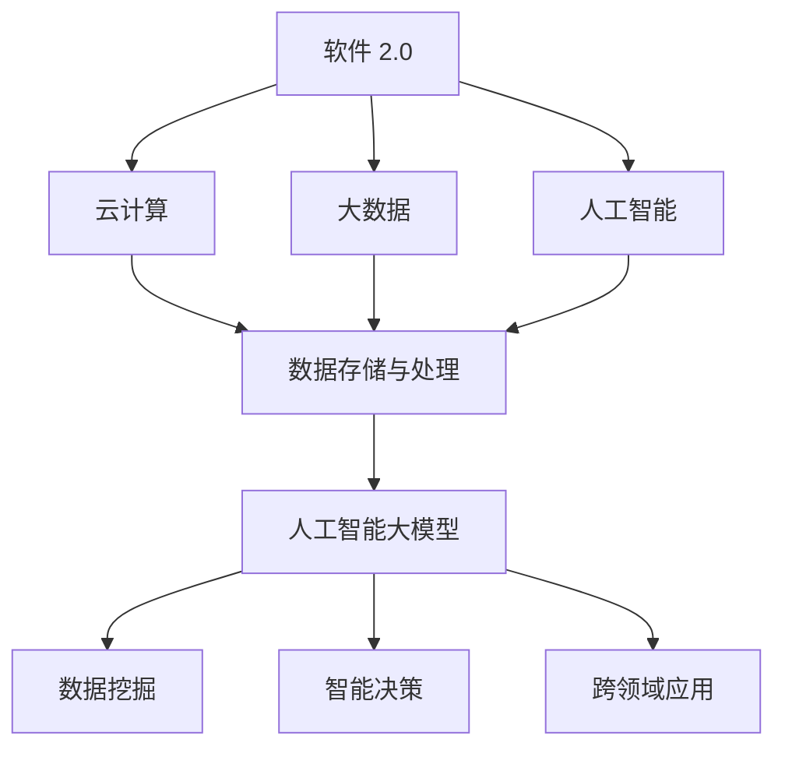

                 

# 如何打造有影响力的技术分享会

> 关键词：技术分享会、影响力、组织、内容、互动

> 摘要：本文将深入探讨如何打造有影响力的技术分享会。通过分析技术分享会的核心要素，包括主题选择、内容准备、组织结构、互动设计等，结合实践经验，为技术爱好者、专业人士和活动组织者提供一套系统化的方法。

## 第一部分：核心概念与联系

### 1.1 软件与人工智能大模型概述

**软件 2.0** 是指一种新的软件范式，它利用云计算、大数据和人工智能等先进技术，使得软件能够更加智能、灵活和高效地应对复杂业务场景。其中，**人工智能大模型** 是软件 2.0 的核心技术之一。

**人工智能大模型** 具有以下核心特点：

- **大数据处理能力**：能够处理大规模、多维度的数据，挖掘出深层次的知识和规律。
- **自适应学习能力**：通过不断学习和优化，提高预测准确性和决策能力。
- **跨领域应用**：适用于金融、医疗、制造、零售等多个行业和领域。

下面是一个软件 2.0 与人工智能大模型的 Mermaid 流程图：



### 1.2 人工智能大模型技术基础

**人工智能大模型技术基础** 包括以下几个关键领域：

- **深度学习与神经网络基础**：深度学习是人工智能大模型的核心技术，神经网络是其基础架构。
- **自然语言处理技术概览**：涉及词嵌入技术、序列模型与注意力机制等。
- **大规模预训练模型原理**：包括 GPT 系列模型、BERT 及其变体等。

#### 1.2.1 深度学习与神经网络基础

**深度学习与神经网络基础** 包括以下几个部分：

- **神经网络的基本结构**：由多层神经元组成，通过前向传播和反向传播算法进行训练。
- **常见的深度学习架构**：如卷积神经网络 (CNN)、循环神经网络 (RNN)、变换器架构 (Transformer) 等。
- **深度学习优化算法**：如梯度下降法、随机梯度下降法、Adam 优化器等。

下面是一个神经网络的基本结构的伪代码：

```python
# 神经网络基本结构伪代码

# 定义神经网络结构
layers = [
    LinearLayer(input_size, hidden_size),
    ReLU(),
    LinearLayer(hidden_size, output_size)
]

# 前向传播
def forward(x):
    for layer in layers:
        x = layer.forward(x)
    return x

# 反向传播
def backward(d_output):
    d_input = d_output
    for layer in reversed(layers):
        d_input = layer.backward(d_input)
    return d_input
```

#### 1.2.2 自然语言处理技术概览

**自然语言处理技术概览** 包括以下几个部分：

- **词嵌入技术**：将自然语言词汇映射到高维空间中。
- **序列模型与注意力机制**：如 RNN、LSTM、GRU 等，以及注意力机制。
- **变换器架构详解**：一种新型的深度学习架构，具有强大的序列建模能力。

下面是一个词嵌入技术的伪代码：

```python
# 词嵌入技术伪代码

# 初始化词嵌入矩阵
word_embedding_matrix = np.random.randn(vocab_size, embedding_size)

# 计算词嵌入向量
def embed(word):
    return word_embedding_matrix[word]
```

#### 1.2.3 大规模预训练模型原理

**大规模预训练模型原理** 包括以下几个部分：

- **预训练的概念与意义**：在大规模数据集上进行预训练，然后在小规模数据集上进行微调。
- **自监督学习方法**：利用数据本身的分布信息进行训练，如掩码语言模型 (MLM)、掩码图像模型 (MILM) 等。
- **迁移学习与微调技术**：将预训练模型应用于特定任务并进行微调。

## 第二部分：打造有影响力的技术分享会的关键步骤

### 2.1 主题选择

**主题选择** 是技术分享会的第一步，也是最重要的一步。一个有影响力的技术分享会需要选择一个与当前技术热点、行业趋势和听众需求密切相关的话题。

#### 2.1.1 研究技术趋势

- **行业报告**：查阅行业报告，了解当前技术热点和发展方向。
- **专业媒体**：关注专业媒体，获取最新的技术动态和行业洞察。
- **社区讨论**：参与技术社区，了解同行和听众的关注点。

#### 2.1.2 了解听众需求

- **问卷调查**：通过问卷调查了解听众的兴趣和需求。
- **访谈调研**：与行业专家、技术爱好者进行深入访谈，获取他们的意见和建议。

### 2.2 内容准备

**内容准备** 是技术分享会的核心，需要确保内容丰富、结构清晰、逻辑严密。

#### 2.2.1 构建内容框架

- **确定核心观点**：明确分享会的核心观点和关键信息。
- **组织内容结构**：根据核心观点，构建内容框架，确保内容有条理。

#### 2.2.2 选择合适的讲解方式

- **图表辅助**：使用图表、图片等视觉元素，帮助听众更好地理解复杂概念。
- **案例分析**：结合实际案例，讲解技术原理和应用。
- **互动环节**：设计互动环节，如问答、讨论等，增强听众的参与感。

### 2.3 组织结构

**组织结构** 是技术分享会的保障，需要确保活动顺利进行。

#### 2.3.1 活动策划

- **时间安排**：确定活动时间，确保听众能够参与。
- **场地选择**：根据活动规模和预算，选择合适的场地。
- **设备准备**：确保音响、投影等设备正常运行。

#### 2.3.2 人员安排

- **主讲人选拔**：选择具有专业背景和演讲能力的嘉宾。
- **主持人安排**：确保主持人的沟通能力和主持风格与活动主题相符。
- **志愿者招募**：招募志愿者协助活动的各个环节。

### 2.4 互动设计

**互动设计** 是提高技术分享会影响力的重要手段，能够增强听众的参与感和获得感。

#### 2.4.1 问答环节

- **准备问题**：提前准备与主题相关的问题，鼓励听众提问。
- **现场解答**：主讲人现场解答听众的问题，增强互动效果。

#### 2.4.2 分组讨论

- **分组讨论**：将听众分成小组，就特定话题进行讨论。
- **成果展示**：讨论结束后，每个小组展示讨论成果，促进知识分享。

#### 2.4.3 互动游戏

- **知识问答游戏**：设计知识问答游戏，激发听众的兴趣和参与度。
- **投票环节**：通过投票方式收集听众意见，增强互动性。

## 第三部分：实战案例与最佳实践

### 3.1 实战案例

**实战案例** 是验证技术分享会效果的最佳方式。以下是一个实际的技术分享会案例：

#### 案例背景

一场关于“人工智能在金融领域的应用”技术分享会，邀请了业内知名专家和金融机构的从业者。

#### 活动流程

1. **开场介绍**：主持人简要介绍活动背景和目的，邀请主讲人上台。
2. **主题演讲**：主讲人从人工智能的发展历程、金融行业的需求出发，深入讲解人工智能在金融领域的应用案例。
3. **互动环节**：主讲人回答听众提问，并进行分组讨论。
4. **总结发言**：主持人对活动进行总结，强调人工智能在金融领域的未来趋势。

#### 案例亮点

- **主题选择**：与当前金融行业的热点话题紧密结合。
- **内容准备**：主讲人结合实际案例，讲解技术原理和应用。
- **互动设计**：问答环节和分组讨论，增强听众参与感。

### 3.2 最佳实践

**最佳实践** 是从实际操作中总结出的成功经验，以下是一些打造有影响力的技术分享会的最佳实践：

#### 3.2.1 提前沟通

- **与主讲人沟通**：提前与主讲人沟通，了解他们的需求和期望，确保活动内容符合主讲人的风格和听众的需求。
- **与听众沟通**：通过问卷调查、社交媒体等方式，了解听众的兴趣和需求，为活动做好准备。

#### 3.2.2 重视细节

- **场地布置**：确保场地布置简洁、舒适，便于听众参与。
- **技术准备**：确保音响、投影等设备正常运行，避免活动过程中出现技术问题。
- **现场管理**：安排志愿者协助活动现场的管理，确保活动顺利进行。

#### 3.2.3 不断优化

- **活动反馈**：收集活动反馈，了解听众和主讲人的意见和建议，不断优化活动流程和内容。
- **持续创新**：结合行业趋势和听众需求，不断创新活动形式和内容，提升活动质量。

## 第四部分：小结与展望

### 4.1 小结

通过本文的探讨，我们了解了如何打造有影响力的技术分享会。关键在于：

- **主题选择**：紧密结合当前技术趋势和听众需求。
- **内容准备**：确保内容丰富、结构清晰、逻辑严密。
- **组织结构**：确保活动顺利进行。
- **互动设计**：增强听众的参与感和获得感。

### 4.2 展望

未来，随着人工智能、大数据等技术的不断发展和普及，技术分享会将在更多领域和场景中得到应用。我们将继续关注技术发展趋势，为打造更有影响力的技术分享会提供持续支持。

## 作者信息

作者：AI天才研究院/AI Genius Institute & 禅与计算机程序设计艺术 /Zen And The Art of Computer Programming

联系方式：[contact@ai-genius-institute.com](mailto:contact@ai-genius-institute.com)

