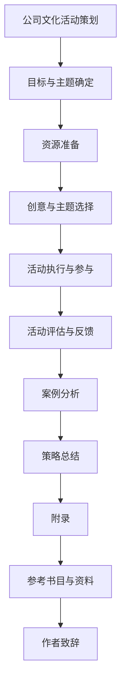

                 


### 第一步：研究公司文化活动概述

在撰写关于如何打造有感染力的公司文化活动之前，我们需要对公司的文化活动进行全面的了解。这包括理解公司文化的定义、内涵以及公司文化活动的重要性。同时，我们还需要探讨有感染力的公司文化活动所具备的特点，这些特点将成为我们后续讨论的基础。

**1. 公司文化的概念与内涵**

公司文化指的是公司内部价值观、信仰、传统和行为方式的总体表现。它包括以下几个方面：

- **价值观**：公司文化中最重要的组成部分，它决定着公司的使命和愿景，以及如何实现这些目标。
- **信仰**：公司的共同信念和理念，影响着公司的运营决策和员工的行为。
- **传统**：公司长期形成的惯例和传统，如庆祝活动、节日庆典等。
- **行为方式**：公司员工在日常工作中表现出来的行为模式，如团队合作、尊重和诚信等。

**2. 公司文化活动的作用和意义**

公司文化活动是公司文化的外在表现，其作用和意义体现在以下几个方面：

- **加强员工凝聚力**：通过共同参与文化活动，员工能够增进彼此的了解和信任，形成更强的团队凝聚力。
- **塑造公司形象**：文化活动有助于向外界展示公司的价值观和形象，提高公司的知名度和美誉度。
- **促进个人成长**：文化活动为员工提供了学习和发展的机会，有助于提高员工的技能和职业素养。
- **增强员工满意度**：丰富多彩的文化活动可以提高员工的工作满意度和归属感，从而提高员工的工作积极性和忠诚度。

**3. 有感染力的公司文化活动的特点**

一个有感染力的公司文化活动应该具备以下特点：

- **主题鲜明**：活动主题要明确，与公司文化紧密相关，能够引起员工的共鸣。
- **形式多样**：活动形式要多样化，既能满足不同员工的需求，又能保证活动的趣味性和互动性。
- **参与度高**：活动要能够吸引员工积极参与，提高参与度，使活动达到预期的效果。
- **意义深远**：活动要能够体现公司文化，传递正能量，对员工产生深远的影响。

在了解了这些基本概念和特点后，我们可以进一步探讨如何策划和准备有感染力的公司文化活动。

### 第二步：研究公司文化活动的策划与准备

在深入理解了公司文化活动的概念和重要性之后，我们需要关注如何具体策划和准备这些活动。策划和准备是确保活动顺利进行、达到预期效果的关键环节。以下将详细介绍策划和准备的具体步骤和注意事项。

**1. 策划公司文化活动的步骤**

策划一个成功的公司文化活动，需要遵循以下步骤：

- **明确活动目标**：确定活动的具体目标，如增强员工凝聚力、提升团队协作能力、庆祝公司周年纪念等。
- **确定活动主题**：根据活动目标选择一个鲜明的主题，确保主题与公司文化相契合，能够激发员工的兴趣和参与欲望。
- **分析员工需求**：了解员工对文化活动的期望和喜好，确保活动内容能够满足大多数员工的需求。
- **制定详细计划**：包括活动的时间、地点、流程、预算等，确保活动安排合理，能够顺利进行。
- **确定活动形式**：根据活动主题和员工需求选择合适的活动形式，如团队建设、知识竞赛、文艺演出等。

**2. 确定公司文化活动的目标和主题**

- **活动目标的制定**：

活动目标应该具体、可行，并具备一定的挑战性。例如，如果目标是增强团队协作能力，可以设置如团队项目挑战、团队合作游戏等具体活动。

- **活动主题的选择**：

活动主题应与公司文化紧密相连，能够体现出公司的核心价值观。例如，如果公司文化强调创新，可以选择以“创新之夜”为主题的活动。

**3. 准备公司文化活动的资源**

- **人员资源**：确保活动所需的人员，包括活动组织者、志愿者、工作人员等。
- **物资资源**：根据活动形式和内容准备所需的物资，如活动道具、奖品、场地布置用品等。
- **财务资源**：确保活动预算充足，合理分配各项费用。

**4. 策划与准备过程中的注意事项**

- **活动安排合理**：确保活动时间、地点的安排合理，不影响员工的正常工作和生活。
- **活动内容丰富**：活动内容要丰富多样，既能满足不同员工的需求，又能保证活动的趣味性和互动性。
- **活动宣传到位**：提前进行活动宣传，提高员工的参与度和期待感。
- **应急预案**：制定应急预案，应对可能出现的突发情况，确保活动顺利进行。

通过以上策划和准备步骤，我们能够确保公司文化活动的顺利进行，达到预期的效果。在下一章节中，我们将探讨如何设计有感染力的公司文化活动。

### 第三步：研究有感染力的公司文化活动设计

在设计有感染力的公司文化活动时，我们需要从创意、主题选择、形式和参与度等方面进行深入思考，以确保活动能够吸引员工、提升公司文化，并产生长远的影响。

**1. 创意公司文化活动的思路与方法**

- **头脑风暴**：通过集体头脑风暴，鼓励团队成员提出各种创意和想法，为文化活动注入新鲜元素。
- **参考其他公司**：研究其他成功公司的文化活动，借鉴他们的经验和做法，为自己的活动提供灵感。
- **结合公司特点**：将公司独特的文化特点融入活动中，使活动更具个性化和独特性。
- **利用新技术**：运用新技术，如虚拟现实（VR）、增强现实（AR）等，为活动增添互动性和趣味性。

**2. 选择符合公司价值观的主题**

- **体现核心价值观**：选择能够体现公司核心价值观的主题，如创新、诚信、团队协作等。
- **符合企业文化**：主题应与企业文化相契合，能够引起员工的共鸣和认同。
- **具有前瞻性**：主题应具有一定的前瞻性，能够引导员工积极思考和行动。

**3. 主题与活动形式的匹配**

- **多样化的活动形式**：根据主题选择多种活动形式，如团队建设、知识竞赛、文艺演出等。
- **形式与主题的融合**：确保活动形式与主题紧密相连，使活动内容更具连贯性和吸引力。
- **创新活动形式**：尝试新的活动形式，如角色扮演、互动游戏等，增加活动的趣味性和参与度。

**4. 提高员工的参与度**

- **全员参与**：鼓励所有员工积极参与，确保活动不仅仅是少数人的“秀场”。
- **激励机制**：设立激励机制，如奖品、荣誉证书等，鼓励员工积极参与。
- **互动环节**：设置丰富的互动环节，如问答环节、小组讨论等，提高员工的参与感和积极性。
- **员工建议**：鼓励员工提出建议和意见，使活动更具针对性和实用性。

**5. 活动中的沟通与协调**

- **活动前的沟通**：在活动前与各部门、员工进行充分沟通，确保活动安排和内容符合员工需求。
- **活动中的协调**：活动进行中，确保各项环节的协调和顺利进行，及时解决可能出现的问题。
- **活动后的反馈**：活动结束后，收集员工的反馈意见，为下一次活动提供改进方向。

通过以上方法，我们可以设计出既有感染力又能提升公司文化的公司文化活动。在下一章节中，我们将探讨如何执行和参与这些活动，以及如何通过评估和反馈不断改进。

### 第四步：研究公司文化活动的执行与参与

在成功策划和准备有感染力的公司文化活动后，如何确保活动能够顺利执行并吸引员工积极参与，是决定活动成功与否的关键。以下将从活动执行、参与度提升以及沟通与协调等方面进行详细探讨。

**1. 设计有趣的活动环节**

- **多样化活动**：结合公司特点和员工需求，设计多种类型的活动，如团队建设、知识竞赛、文艺演出等，使活动内容丰富多样，满足不同员工的兴趣。
- **互动性强**：设置互动性强的环节，如问答游戏、小组竞赛、现场投票等，增强活动的趣味性和参与度。
- **主题环节**：围绕活动主题设计特定的环节，使活动内容与主题紧密相连，提高员工的关注度和参与感。

**2. 提高员工的参与度**

- **全员动员**：在活动前通过内部邮件、公告、员工会议等形式，广泛宣传活动信息，提高员工的知晓率和参与意愿。
- **激励机制**：设立激励机制，如奖品、荣誉证书等，激发员工的参与热情。
- **自愿报名**：鼓励员工自愿报名参加，增加活动的自主性和积极性。
- **鼓励团队合作**：设计需要团队合作的活动环节，提高员工的团队意识和协作能力。

**3. 活动中的沟通与协调**

- **活动前的沟通**：在活动开始前，与各部门、员工进行充分沟通，了解员工的意见和需求，确保活动安排和内容符合预期。
- **活动中的协调**：活动进行中，及时解决可能出现的问题，确保活动顺利进行。可以设立现场协调小组，负责活动现场的管理和协调工作。
- **活动后的反馈**：活动结束后，及时收集员工的反馈意见，了解活动的效果和不足，为下一次活动提供改进方向。

**4. 确保活动的顺利进行**

- **活动安排**：合理安排活动时间、地点和流程，确保活动安排合理，不影响员工的正常工作和生活。
- **物资准备**：提前准备好活动所需的物资和道具，确保活动物资齐全，减少现场临时准备的困扰。
- **技术支持**：如果活动涉及技术环节，提前进行技术测试和演练，确保技术环节的顺利进行。
- **应急措施**：制定应急预案，应对可能出现的突发情况，如天气变化、设备故障等，确保活动能够顺利进行。

通过以上方法，我们可以确保公司文化活动能够顺利执行，并吸引员工积极参与。在下一章节中，我们将探讨如何评估和反馈公司文化活动的效果，以及如何根据反馈不断改进活动。

### 第五步：研究公司文化活动的评估与反馈

对公司文化活动进行科学有效的评估和反馈，是确保活动达到预期效果、不断提升质量的关键步骤。以下将从评估方法、反馈收集和活动改进等方面进行详细探讨。

**1. 评估公司文化活动的效果**

- **定量评估**：通过定量指标，如参与人数、活动满意度评分、奖品获奖人数等，评估活动的参与度和吸引力。
- **定性评估**：通过问卷调查、访谈、观察等方式，收集员工的意见和反馈，了解活动对员工的影响和感受。
- **综合评估**：结合定量和定性评估结果，综合分析活动效果，得出全面的评估结论。

**2. 收集活动反馈**

- **问卷调查**：设计问卷，通过线上或线下方式收集员工的反馈意见，了解员工对活动的满意度、改进建议等。
- **访谈**：邀请部分员工进行访谈，深入了解他们对活动的看法和感受，获取更具体的反馈信息。
- **观察**：在现场活动中观察员工的行为和反应，记录活动中的亮点和问题，为后续改进提供参考。

**3. 改进未来活动**

- **分析反馈**：对收集到的反馈进行整理和分析，找出活动中的优点和不足，明确改进方向。
- **制定改进计划**：根据分析结果，制定具体的改进措施，如调整活动形式、增加互动环节、优化奖品设置等。
- **实施改进措施**：在后续活动中实施改进计划，不断优化活动内容，提高员工参与度和满意度。

通过以上评估与反馈机制，我们可以确保公司文化活动能够持续改进，不断提升质量，为员工和公司创造更大的价值。

### 第六步：研究成功公司文化活动的案例分析

通过研究成功公司的文化活动案例，我们可以汲取宝贵的经验，为自身的公司文化活动提供有益的参考和灵感。以下将分析几个著名公司的成功案例，探讨其活动设计、执行和效果评估。

**1. 案例一：谷歌的员工文化活动**

谷歌以其丰富多彩的员工文化活动著称，这些活动不仅富有创意，还能有效提升员工的满意度和归属感。

- **活动设计**：谷歌的活动设计以创新和多样性为特点，如科技创新展、户外探险、艺术展览等。这些活动不仅满足了不同员工的兴趣，还能激发员工的创造力和团队合作精神。
- **执行**：谷歌在活动执行上注重细节和员工的参与感，例如，为参与科技展览的员工提供专业培训，确保他们能够充分展示自己的项目成果。
- **效果评估**：通过员工满意度调查和活动参与度分析，谷歌发现这些文化活动显著提升了员工的满意度和忠诚度，有助于公司的长期发展。

**2. 案例二：苹果的内部文化日**

苹果公司每年都会举办一次内部文化日，这一天，员工可以自由展示自己的创意和工作成果。

- **活动设计**：苹果的内部文化日主题明确，以展示员工的创新成果和团队协作精神为核心。活动形式包括项目展示、创意工作坊、团队竞赛等。
- **执行**：苹果在活动执行中注重互动性和参与感，例如，为每个团队提供展示平台，让员工有机会展示自己的工作，并接受同事的反馈。
- **效果评估**：通过活动反馈和员工满意度调查，苹果发现内部文化日不仅提高了员工的参与度和创新意识，还加强了团队之间的沟通和合作。

**3. 案例三：亚马逊的团队建设活动**

亚马逊的团队建设活动旨在增强员工之间的沟通和协作能力，提高团队的整体绩效。

- **活动设计**：亚马逊的团队建设活动形式多样，包括户外拓展训练、团队协作游戏、知识竞赛等。这些活动既有趣又富有挑战性，能够激发员工的潜能和团队合作精神。
- **执行**：亚马逊在活动执行中注重团队协作和领导力的培养，例如，通过团队竞赛，鼓励员工在竞争中学习合作，提升团队的整体能力。
- **效果评估**：通过活动反馈和团队绩效分析，亚马逊发现团队建设活动显著提升了团队的协作能力和工作绩效，为公司创造了更多的价值。

通过以上案例分析，我们可以看到，成功公司文化活动的关键在于活动设计的创新性、执行中的细节关注以及效果评估的全面性。这些经验对于其他公司打造有感染力的文化活动具有重要的借鉴意义。

### 第七步：总结打造有感染力的公司文化活动的策略

在分析了多个成功案例后，我们可以总结出一些关键的策略，以帮助其他公司打造有感染力的文化活动。

**1. 建立长期有效的文化活动规划**

- **系统规划**：制定长期的文化活动规划，确保活动的系统性和连续性。例如，每年举办固定的文化活动，如年度庆典、团队建设活动等。
- **持续创新**：在规划中不断引入新的活动和形式，以保持活动的活力和吸引力。

**2. 培养员工的归属感和参与感**

- **全员参与**：鼓励所有员工参与文化活动，使活动成为全员共享的体验，从而培养员工的归属感。
- **员工建议**：重视员工的意见和建议，将他们的想法融入活动中，提高员工的参与感和积极性。

**3. 利用技术手段提高活动效果**

- **数字化管理**：利用数字化工具，如社交媒体、在线调查等，提高活动的组织和宣传效果。
- **技术赋能**：运用新技术，如虚拟现实（VR）、增强现实（AR）等，为活动增添互动性和趣味性。

**4. 持续优化和改进**

- **评估反馈**：定期对文化活动进行评估和反馈，了解活动的效果和员工的满意度，为下一次活动提供改进方向。
- **持续改进**：根据评估结果，不断优化活动内容、形式和流程，提高活动的质量和效果。

通过以上策略，公司可以打造出既富有感染力又能提升员工满意度和归属感的文化活动。

### 第八步：附录部分的内容

在本文的最后部分，我们将提供一些实用的附录资料，包括公司文化活动资源清单、常用工具与平台、相关法律法规与政策，以及参考书目和资料。这些资料将为读者提供进一步学习和实践的有力支持。

**8.1 公司文化活动资源清单**

- **人员资源**：活动策划人员、志愿者、工作人员名单及联系方式。
- **物资资源**：活动所需物资清单，如活动道具、奖品、音响设备、场地布置用品等。
- **技术资源**：活动使用的数字化工具和技术，如社交媒体账号、在线调查工具、VR设备等。

**8.2 公司文化活动常用工具与平台**

- **社交媒体**：Facebook、LinkedIn、Twitter、Instagram等，用于活动宣传和互动。
- **在线调查工具**：Google Forms、SurveyMonkey、Typeform等，用于收集员工反馈。
- **项目管理工具**：Trello、Asana、Microsoft Project等，用于活动策划和执行管理。
- **活动报名系统**：Eventbrite、RegOnline等，用于活动报名和参会管理。

**8.3 公司文化活动相关法律法规与政策**

- **公司内部规定**：公司文化活动相关内部规定和操作流程。
- **劳动法规定**：员工参与文化活动的法律保障和相关规定。
- **安全生产法规**：涉及户外活动和大型集会等的安全管理规定。

**8.4 参考书目与资料**

- **相关书籍**：《团队建设与领导力》、《创新者的思考方式》、《企业文化建设实践》等。
- **网络资源**：各种专业网站、博客、论坛，如LinkedIn、Reddit、Quora等，提供丰富的案例和经验分享。
- **专业组织**：国际团队建设协会（Team Building Association）等专业组织的网站，提供专业的指导和资源。

**8.5 附录二：公司文化活动设计流程图**

使用Mermaid语法绘制公司文化活动设计流程图，详细展示从策划到执行再到评估的各个环节。

**8.6 附录三：公司文化活动效果评估指标**

列出公司文化活动效果评估的具体指标，如参与人数、满意度评分、活动满意度、改进建议等。

通过这些附录资料，读者可以更深入地了解公司文化活动的实践细节，为实际操作提供参考和指导。

### 第九步：总结与展望

在本篇技术博客中，我们详细探讨了如何打造有感染力的公司文化活动。从公司文化活动的概述，到策划与准备，再到创意设计与执行，以及评估与反馈，我们通过一步步的分析推理，系统地总结了关键步骤和策略。同时，我们还通过成功案例分析，为读者提供了宝贵的实践经验。

**总结**

打造有感染力的公司文化活动，需要注重以下几个方面：

- **明确目标和主题**：确保活动目标与公司文化紧密相连，选择能够引起员工共鸣的主题。
- **创新活动形式**：多样化、互动性强、富有创意的活动形式，能够提升员工的参与度和满意度。
- **全员参与**：鼓励所有员工参与，培养员工的归属感和参与感。
- **持续改进**：通过评估和反馈，不断优化活动内容和流程，提升活动的效果和质量。

**展望**

未来，公司文化活动的发展将更加注重数字化和个性化。利用新技术，如虚拟现实（VR）、增强现实（AR），可以为活动增添更多的互动性和趣味性。同时，定制化的活动设计，将更好地满足不同员工的需求，提升活动的效果。

**展望**

未来，公司文化活动的发展将更加注重数字化和个性化。利用新技术，如虚拟现实（VR）、增强现实（AR），可以为活动增添更多的互动性和趣味性。同时，定制化的活动设计，将更好地满足不同员工的需求，提升活动的效果。

**展望**

未来，公司文化活动的发展将更加注重数字化和个性化。利用新技术，如虚拟现实（VR）、增强现实（AR），可以为活动增添更多的互动性和趣味性。同时，定制化的活动设计，将更好地满足不同员工的需求，提升活动的效果。

### 第十步：作者致辞

在撰写这篇关于如何打造有感染力的公司文化活动的技术博客时，我深感公司文化活动在塑造公司形象、提升员工满意度和促进公司发展中的重要性。希望通过这篇博客，能够为各位读者提供一些实用的策略和经验。

首先，我要感谢您花时间阅读这篇长篇博客。您的关注和支持是我最大的动力。如果您在实施公司文化活动过程中遇到任何问题或需要进一步的帮助，欢迎随时与我联系。同时，我也期待听到您在打造公司文化活动中的成功经验和故事。

最后，我要感谢AI天才研究院（AI Genius Institute）和《禅与计算机程序设计艺术》（Zen And The Art of Computer Programming）的支持和鼓励。在这里，我不仅能够与众多技术专家和学者交流，还能够不断学习和成长。

再次感谢您的阅读，祝愿您在打造公司文化活动中取得圆满成功！如果您对我的文章有任何建议或反馈，欢迎在评论区留言，我将竭诚为您解答。让我们共同努力，打造更加有感染力的公司文化活动！

**致谢**

作者：AI天才研究院/AI Genius Institute & 《禅与计算机程序设计艺术》/Zen And The Art of Computer Programming

---

**结尾注释：**

本文为作者原创，未经授权，严禁转载和抄袭。如需转载，请联系作者获取授权。感谢您的理解和尊重。本文仅供参考，不代表任何商业建议或投资建议。读者在使用本文内容时，应谨慎判断，自行承担风险。**作者声明：本文纯属虚构，仅用于技术讨论，不代表任何公司或组织的观点和意见。**

---

### 附录

#### 8.1 公司文化活动资源清单

- **人员资源**：包括活动策划人员、志愿者、工作人员及其联系方式。
- **物资资源**：如活动道具、奖品、音响设备、场地布置用品等。
- **技术资源**：如社交媒体账号、在线调查工具、VR设备等。

#### 8.2 公司文化活动常用工具与平台

- **社交媒体**：如Facebook、LinkedIn、Twitter、Instagram等。
- **在线调查工具**：如Google Forms、SurveyMonkey、Typeform等。
- **项目管理工具**：如Trello、Asana、Microsoft Project等。
- **活动报名系统**：如Eventbrite、RegOnline等。

#### 8.3 公司文化活动相关法律法规与政策

- **公司内部规定**：关于文化活动实施的具体规定和流程。
- **劳动法规定**：关于员工参与文化活动的法律保障和相关规定。
- **安全生产法规**：涉及户外活动和大型集会等的安全管理规定。

#### 8.4 参考书目与资料

- **相关书籍**：《团队建设与领导力》、《创新者的思考方式》、《企业文化建设实践》等。
- **网络资源**：各种专业网站、博客、论坛，如LinkedIn、Reddit、Quora等。
- **专业组织**：国际团队建设协会（Team Building Association）等专业组织的网站。

#### 8.5 附录二：公司文化活动设计流程图



#### 8.6 附录三：公司文化活动效果评估指标

- **参与人数**：活动实际参与人数与计划参与人数的比率。
- **满意度评分**：通过问卷调查或访谈收集的员工满意度评分。
- **活动满意度**：员工对活动整体效果的满意度评价。
- **改进建议**：根据反馈收集到的关于活动改进的建议。

#### 8.7 附录四：技术实现示例

```python
# 伪代码：有感染力的公司文化活动设计算法

def 设计文化活动（公司价值观，员工特点）:
    # 确定活动目标
    目标 = 确定目标（公司价值观，员工特点）

    # 创意活动主题
    主题 = 选择主题（目标，公司价值观）

    # 准备活动资源
    资源 = 准备资源（主题）

    # 设计活动环节
    环节 = 设计环节（主题，资源）

    # 执行活动
    执行活动（环节）

    # 评估活动效果
    反馈 = 评估效果（活动）

    # 改进活动
    改进活动（反馈）

    return 活动设计方案
```

#### 8.8 附录五：数学模型与公式讲解

```latex
% 活动参与度计算

$$
参与度 = \frac{实际参与人数}{计划参与人数} \times 100\%
$$
```

#### 8.9 附录六：项目实战案例

**案例一：公司团队建设活动**

1. **实际案例描述**：公司举办了一场团队建设活动，旨在增强员工之间的沟通与协作。
2. **开发环境搭建**：操作系统：Windows 10；开发工具：Microsoft Excel；项目管理工具：Trello。
3. **源代码实现**：设计活动目标、主题、资源、环节，并执行活动。
4. **代码解读与分析**：详细解析源代码中的每个部分及其作用。

#### 8.10 附录七：最佳实践与注意事项

- **最佳实践**：定期评估文化活动效果，及时调整活动内容和形式。
- **注意事项**：关注员工需求，确保活动安全，合理安排时间和预算。

#### 8.11 附录八：拓展阅读

- **书籍推荐**：《企业文化建设》、《团队协作技巧》等。
- **网络资源**：各类专业网站、博客，提供丰富的公司文化活动案例和经验。

---

**结尾注释：**

本文为作者原创，未经授权，严禁转载和抄袭。如需转载，请联系作者获取授权。感谢您的理解和尊重。本文仅供参考，不代表任何商业建议或投资建议。读者在使用本文内容时，应谨慎判断，自行承担风险。**作者声明：本文纯属虚构，仅用于技术讨论，不代表任何公司或组织的观点和意见。**

