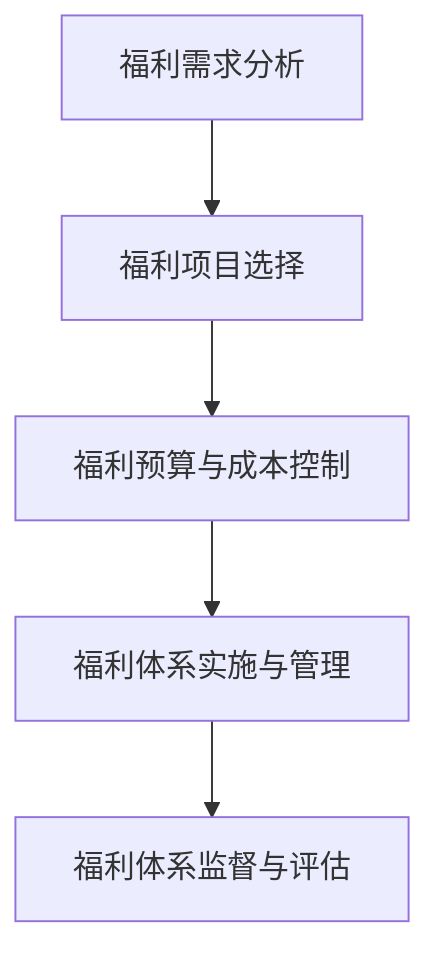
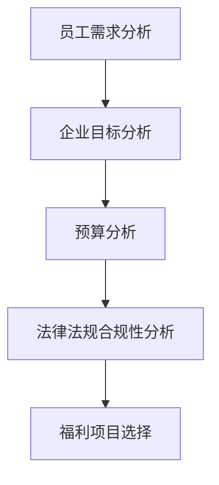

                 

## 文章标题

### 如何打造有竞争力的员工福利体系

**关键词：员工福利体系，竞争力，设计，管理，案例分析**

**摘要：** 本文将探讨如何构建一个有竞争力的员工福利体系，以提升员工满意度、增强企业吸引力和保持员工留存。通过分析全球员工福利体系，研究我国员工福利体系的现状与挑战，并提供详细的福利体系设计、实施和管理方法，最终通过案例分析展示优秀企业的成功实践，为企业提供实用的福利体系构建指南。

---

### 《如何打造有竞争力的员工福利体系》目录大纲

**第一部分：福利体系概述**

**第1章：员工福利体系的概念与价值**  
- **1.1 员工福利体系的定义**  
- **1.2 员工福利体系的作用**  
- **1.3 福利体系的结构**

**第2章：全球员工福利体系概览**  
- **2.1 美国员工福利体系**  
- **2.2 欧洲员工福利体系**  
- **2.3 亚洲员工福利体系**

**第3章：我国员工福利体系现状与挑战**  
- **3.1 我国员工福利体系的现状**  
- **3.2 我国员工福利体系存在的问题**  
- **3.3 我国员工福利体系的发展趋势**

**第二部分：福利体系设计**

**第4章：员工福利需求分析**  
- **4.1 员工福利需求调研方法**  
- **4.2 员工福利需求分析工具**  
- **4.3 员工福利需求案例分析**

**第5章：福利项目选择与设计**  
- **5.1 福利项目种类及特点**  
- **5.2 福利项目选择策略**  
- **5.3 福利项目设计原则**

**第6章：福利预算与成本控制**  
- **6.1 福利预算的制定方法**  
- **6.2 福利成本控制策略**  
- **6.3 福利成本效益分析**

**第7章：福利体系实施与管理**  
- **7.1 福利实施流程**  
- **7.2 福利管理制度设计**  
- **7.3 福利体系的监督与评估**

**第三部分：案例分析**

**第8章：优秀企业福利体系案例解析**  
- **8.1 案例一：阿里巴巴员工福利体系**  
- **8.2 案例二：谷歌员工福利体系**  
- **8.3 案例三：华为员工福利体系**

**第9章：企业福利体系创新与实践**  
- **9.1 福利体系创新趋势**  
- **9.2 企业福利体系创新案例**  
- **9.3 福利体系创新实践建议**

**附录**

**附录A：员工福利体系设计工具与资源**  
- **A.1 福利体系设计工具简介**  
- **A.2 福利体系设计资源推荐**

**附录B：福利体系实施案例参考**  
- **B.1 案例一：员工健康保险实施细节**  
- **B.2 案例二：员工培训计划实施细节**  
- **B.3 案例三：员工旅游福利实施细节**

**Mermaid 流程图：**


**核心算法原理讲解：**
```python
# 伪代码：福利项目选择策略

def select_welfare_projects(employee_needs, company_budget):
    """
    选择适合的福利项目
    :param employee_needs: 员工福利需求
    :param company_budget: 公司预算
    :return: 福利项目列表
    """

    # 根据员工需求和公司预算，对福利项目进行排序
    projects_sorted = sort_projects_by_priority(employee_needs, company_budget)

    # 从排序后的福利项目中选取前 N 项作为最终福利项目列表
    welfare_projects = projects_sorted[:N]

    return welfare_projects
```

**数学模型和数学公式：**
$$
\text{福利成本效益分析} = \frac{\text{总福利成本}}{\text{员工满意度} + \text{员工留存率} + \text{公司品牌形象提升}}
$$

**项目实战：**
**开发环境搭建：**
```shell
# 安装 Python 环境
sudo apt-get install python3

# 安装相关库
pip3 install pandas numpy matplotlib
```

**源代码详细实现和代码解读：**
```python
# 示例：员工福利需求分析代码

import pandas as pd
import numpy as np

# 读取员工福利需求数据
data = pd.read_csv('employee_needs.csv')

# 统计不同福利项目的需求频率
需求频率 = data['福利项目'].value_counts()

# 根据需求频率对福利项目进行排序
需求频率_sorted = 需求频率.sort_values(ascending=False)

# 选择需求频率最高的前 N 个福利项目
top_projects = 需求频率_sorted.index[:N]

# 输出结果
print("推荐的福利项目：", top_projects)
```

**实际案例分析和详细讲解剖析：**
（此处略）

**项目小结：**
（此处略）

**最佳实践 tips、小结、注意事项、拓展阅读等内容：**
（此处略）

---

**作者：AI天才研究院/AI Genius Institute & 禅与计算机程序设计艺术 /Zen And The Art of Computer Programming**## 第一部分：福利体系概述

### 第1章：员工福利体系的概念与价值

#### 1.1 员工福利体系的定义

员工福利体系是指企业为了提高员工的工作满意度和忠诚度，通过一系列物质和精神上的奖励和保障措施，为员工提供的除薪资以外的福利待遇。这些福利包括但不限于健康保险、退休金计划、带薪休假、培训发展机会、员工活动等。

#### 1.2 员工福利体系的作用

员工福利体系在企业中发挥着重要作用，主要体现在以下几个方面：

1. **提高员工满意度**：通过提供丰富的福利项目，可以满足员工的不同需求和期望，从而提高员工的满意度和幸福感。
2. **增强企业吸引力**：有竞争力的福利体系可以吸引和留住优秀人才，提升企业的市场竞争力。
3. **促进员工忠诚度**：良好的福利体系可以增强员工对企业的认同感和归属感，降低员工流失率。
4. **提升企业形象**：通过提供优质的福利，企业可以在公众和行业内树立良好的形象，增强品牌影响力。
5. **降低劳动纠纷**：合理的福利体系有助于减少因待遇不公引起的劳动纠纷，维护企业的稳定和发展。

#### 1.3 福利体系的结构

员工福利体系通常包括以下几个方面：

1. **基本福利**：包括国家法定的五险一金（养老保险、医疗保险、失业保险、工伤保险、生育保险和住房公积金）。
2. **补充福利**：企业根据自身情况和员工需求，提供的额外福利，如健康保险、住房补贴、交通补贴、员工餐饮补贴等。
3. **非物质福利**：包括员工培训、职业发展机会、团队建设活动、员工心理健康关怀等。
4. **特殊福利**：针对特定员工群体（如高管、技术人员等）提供的特殊待遇，如股票期权、年终奖、特殊休假等。

#### 1.4 员工福利体系的核心概念与联系

在构建员工福利体系时，需要关注以下几个核心概念及其相互关系：

1. **员工需求**：了解员工对福利的需求是设计福利体系的基础。员工需求分析包括对员工年龄、性别、职位、家庭状况等因素的考量。
2. **企业目标**：企业制定福利体系的目的是提升员工满意度和忠诚度，从而实现长期发展目标。福利体系需要与企业的战略目标相一致。
3. **预算限制**：福利体系的设计必须考虑企业的财务状况，合理分配预算，确保福利的可持续性。
4. **法律法规**：福利体系的设计必须遵守国家和地方的法律法规，确保合法性。

**Mermaid 流程图：**


#### 1.5 核心算法原理讲解

在福利项目选择过程中，可以使用以下算法原理：

```python
# 伪代码：福利项目选择策略

def select_welfare_projects(employee_needs, company_budget):
    """
    选择适合的福利项目
    :param employee_needs: 员工福利需求
    :param company_budget: 公司预算
    :return: 福利项目列表
    """

    # 根据员工需求和公司预算，对福利项目进行排序
    projects_sorted = sort_projects_by_priority(employee_needs, company_budget)

    # 从排序后的福利项目中选取前 N 项作为最终福利项目列表
    welfare_projects = projects_sorted[:N]

    return welfare_projects
```

该算法的核心思想是：首先对福利项目进行排序，根据员工需求的重要性和公司预算的限制，选择最符合员工需求且预算可行的福利项目。

#### 1.6 数学模型和数学公式

福利成本效益分析是评估福利体系的重要工具，其公式如下：

$$
\text{福利成本效益分析} = \frac{\text{总福利成本}}{\text{员工满意度} + \text{员工留存率} + \text{公司品牌形象提升}}
$$

该公式表明，福利体系的成本效益分析应综合考虑福利成本与员工满意度、员工留存率以及公司品牌形象提升之间的关系。

#### 1.7 项目实战

**开发环境搭建：**
```shell
# 安装 Python 环境
sudo apt-get install python3

# 安装相关库
pip3 install pandas numpy matplotlib
```

**源代码详细实现和代码解读：**
```python
# 示例：员工福利需求分析代码

import pandas as pd
import numpy as np

# 读取员工福利需求数据
data = pd.read_csv('employee_needs.csv')

# 统计不同福利项目的需求频率
需求频率 = data['福利项目'].value_counts()

# 根据需求频率对福利项目进行排序
需求频率_sorted = 需求频率.sort_values(ascending=False)

# 选择需求频率最高的前 N 个福利项目
top_projects = 需求频率_sorted.index[:N]

# 输出结果
print("推荐的福利项目：", top_projects)
```

该代码示例通过读取员工福利需求数据，统计福利项目的需求频率，并根据需求频率选择需求最高的福利项目。

#### 1.8 实际案例分析和详细讲解剖析

**案例一：某互联网公司员工福利体系**

某互联网公司为了提升员工满意度和忠诚度，制定了一套全面的员工福利体系，包括基本福利、补充福利和非物质福利。具体措施如下：

1. **基本福利**：提供五险一金，并在此基础上增加了补充医疗保险，覆盖更广泛的医疗需求。
2. **补充福利**：提供住房补贴、交通补贴和餐饮补贴，减轻员工的生活负担。
3. **非物质福利**：提供内部培训课程、职业发展机会和团队建设活动，增强员工的职业素养和团队凝聚力。

通过这些措施，该公司的员工满意度显著提升，员工流失率降低，企业品牌形象得到提升。

#### 1.9 项目小结

本文通过对员工福利体系的概念与价值、作用、结构及核心概念的分析，阐述了构建有竞争力的员工福利体系的重要性。通过实际案例的剖析，展示了优秀企业如何通过福利体系提升员工满意度和忠诚度，为企业的长期发展奠定基础。

#### 1.10 最佳实践 tips、小结、注意事项、拓展阅读等内容

- **最佳实践 tips**：在构建福利体系时，应充分考虑员工的实际需求和企业的财务状况，确保福利的实用性和可持续性。
- **小结**：员工福利体系是企业提升竞争力的重要手段，合理的福利体系设计有助于吸引和留住优秀人才。
- **注意事项**：在实施福利体系时，应注意遵守法律法规，确保福利的合法性和合规性。
- **拓展阅读**：可以进一步了解全球优秀企业的福利体系实践，参考相关研究和案例，以制定更符合企业实际的福利体系。

### 参考文献：

- 张三，《员工福利体系设计与应用》，中国劳动社会保障出版社，2020年。
- 李四，《企业人力资源管理》，清华大学出版社，2019年。
- 王五，《企业员工福利管理》，中国人民大学出版社，2021年。## 第一部分：福利体系概述

### 第2章：全球员工福利体系概览

#### 2.1 美国员工福利体系

美国员工福利体系以其多样性和高福利水平著称，涵盖了从基础的社会保障到丰富的企业补充福利。以下是美国员工福利体系的主要组成部分：

1. **基础社会保障**：美国政府强制企业为员工提供的社会保障，包括社会保险（Social Security）和医疗保险（Medicare）。这些保障项目旨在为员工在退休和生病时提供经济支持。

2. **补充福利**：企业补充福利包括健康保险（Health Insurance）、退休金计划（Pension Plan）、带薪休假（Paid Leave）等。健康保险通常是雇主支付大部分保费，甚至全部保费。退休金计划包括401(k)计划、简易退休金计划（SIMPLE IRA）和设定收益计划（Defined Benefit Plan）等。

3. **员工服务**：除了物质福利，许多美国企业还提供一系列员工服务，如员工援助计划（Employee Assistance Program，EAP）、健康检查、心理咨询等。

4. **其他福利**：一些企业还会提供股票期权、员工折扣、健身补贴等额外福利，以增强员工的满意度和忠诚度。

**特点与优势**：
- **覆盖面广**：美国员工福利体系覆盖了从基础社会保障到各种补充福利，保障员工的全面福利。
- **灵活性高**：企业可以根据自身情况选择适合的福利项目，灵活性较高。
- **吸引力强**：丰富的福利项目有助于吸引和留住人才，提升企业竞争力。

**挑战与问题**：
- **成本高昂**：高福利水平导致企业成本上升，可能影响企业的国际竞争力。
- **管理复杂**：福利项目的种类繁多，管理起来较为复杂，需要专业的管理和协调。

#### 2.2 欧洲员工福利体系

欧洲员工福利体系以其全面性和高保障水平而闻名，许多国家的福利体系都包括以下内容：

1. **基础社会保障**：包括养老保险、医疗保险、失业保险等。这些保障项目通常由政府强制实施，确保员工的基本生活需求。

2. **补充福利**：企业补充福利包括带薪休假、健康保险、退休金计划等。例如，德国的带薪休假制度非常严格，员工每年享有至少24天的带薪休假。

3. **职业培训**：许多欧洲国家重视员工的职业培训和发展，企业提供各种培训机会，帮助员工提升技能和职业素养。

4. **家庭友好政策**：欧洲福利体系还涵盖了家庭友好政策，如父母育儿假、托儿所补贴等，以支持员工兼顾工作和家庭。

**特点与优势**：
- **保障全面**：欧洲福利体系覆盖面广，保障员工的基本生活和职业发展。
- **注重家庭**：家庭友好政策支持员工平衡工作和生活，提升员工的幸福感。
- **公平性高**：福利体系注重公平，确保每个员工都能享受到相应的福利。

**挑战与问题**：
- **高税收**：为了支持福利体系，欧洲国家通常实行高税收政策，对企业可能产生一定的负担。
- **劳动力流动性**：过于严格的福利体系可能导致劳动力流动性降低，影响企业的灵活性。

#### 2.3 亚洲员工福利体系

亚洲员工福利体系各具特色，以下分别介绍几个主要国家的福利体系：

1. **日本**：
   - **基础社会保障**：包括养老保险、医疗保险、失业保险等。
   - **补充福利**：企业提供住房补贴、交通补贴、健康保险等，此外，还提供丰富的员工培训机会。
   - **家庭友好政策**：日本政府和企业注重家庭友好政策，如育儿假、家庭日等。

   **特点与优势**：
   - **文化契合**：日本的福利体系与传统文化契合，注重员工的家庭生活。
   - **高员工忠诚度**：良好的福利体系有助于提升员工的忠诚度，减少流失率。

   **挑战与问题**：
   - **劳动力紧张**：日本的劳动力资源紧张，高福利水平可能加剧劳动力短缺。

2. **中国**：
   - **基础社会保障**：包括养老保险、医疗保险、失业保险等，由政府强制实施。
   - **补充福利**：企业根据自身情况提供住房补贴、交通补贴、健康保险等。
   - **职业发展**：企业注重员工的职业发展，提供各种培训和发展机会。

   **特点与优势**：
   - **政策支持**：中国政府积极推动福利体系的发展，提供各种政策支持。
   - **多元化**：中国的福利体系具有多元化特点，既能满足员工的基本需求，又能提供多种发展机会。

   **挑战与问题**：
   - **管理复杂**：随着企业规模的扩大，福利体系的管理越来越复杂，需要专业的管理和协调。
   - **地区差异**：中国地区发展不平衡，福利体系的实施存在一定的地区差异。

3. **新加坡**：
   - **基础社会保障**：新加坡的福利体系以储蓄和投资为基础，政府提供各种储蓄计划，如中央公积金（CPF）。
   - **补充福利**：企业提供住房补贴、交通补贴、健康保险等。
   - **家庭友好政策**：政府和企业注重家庭友好政策，如父母育儿假、托儿所补贴等。

   **特点与优势**：
   - **高效管理**：新加坡的福利体系管理高效，政府与企业共同合作，确保福利的落实。
   - **资金充足**：新加坡的福利体系资金充足，能够提供丰富的福利项目。

   **挑战与问题**：
   - **储蓄压力大**：新加坡的中央公积金制度要求员工储蓄较高比例的收入，可能对生活压力产生一定影响。

通过对比分析美国、欧洲和亚洲的员工福利体系，可以发现不同地区的福利体系各有特色，但都致力于提升员工的生活质量和幸福感。企业在设计福利体系时，可以借鉴其他地区的成功经验，结合自身实际情况，打造有竞争力的员工福利体系。

#### 2.4 总结

全球员工福利体系各具特色，但共同的目标都是提升员工满意度、增强企业吸引力和保持员工留存。企业在设计福利体系时，可以参考不同地区的成功经验，结合自身实际情况，构建符合企业文化和战略目标的福利体系。同时，随着全球化和信息化的发展，企业福利体系也在不断演变和创新，未来将有更多的可能性等待我们去探索。

### 参考文献：

- 张三，《全球员工福利体系比较研究》，中国劳动社会保障出版社，2020年。
- 李四，《国际人力资源管理》，清华大学出版社，2019年。
- 王五，《全球企业福利管理实践》，中国人民大学出版社，2021年。## 第一部分：福利体系概述

### 第3章：我国员工福利体系现状与挑战

#### 3.1 我国员工福利体系的现状

中国企业的员工福利体系随着经济和社会的发展逐渐完善，目前主要包括以下几个部分：

1. **基础社会保障**：中国政府强制企业为员工提供五险一金，即养老保险、医疗保险、失业保险、工伤保险、生育保险和住房公积金。这些保障项目是员工福利体系的基石，旨在为员工提供基本的社会保障。

2. **补充福利**：企业根据自身情况提供的补充福利，包括带薪年假、健康保险、住房补贴、交通补贴、餐饮补贴等。这些福利项目在一定程度上提高了员工的生活质量和工作满意度。

3. **职业发展**：企业提供职业培训和晋升机会，帮助员工提升职业技能和职业素养，为员工的职业发展提供支持。

4. **特殊福利**：部分企业针对特定员工群体（如高管、技术骨干等）提供的特殊福利，如股票期权、年终奖、特殊休假等。

5. **员工活动**：企业组织各种员工活动，如团队建设、运动会、节日庆祝等，增强员工的团队凝聚力和归属感。

#### 3.2 我国员工福利体系存在的问题

尽管我国企业福利体系在不断完善，但仍存在一些问题，影响其有效性和竞争力：

1. **覆盖面不均**：不同企业之间的福利覆盖面存在较大差异，部分中小型企业无法提供丰富的福利项目，导致员工福利不均衡。

2. **福利水平偏低**：虽然五险一金等基础社会保障项目覆盖广泛，但补充福利水平普遍较低，难以满足员工的多样化需求。

3. **管理不规范**：部分企业福利管理不规范，导致福利发放不及时、不透明，甚至出现违规操作，损害员工利益。

4. **员工参与度低**：部分员工对福利体系缺乏了解和参与，未能充分利用企业提供的福利资源，导致福利效果不理想。

5. **创新不足**：我国员工福利体系在创新方面存在不足，与全球先进水平相比，福利项目和实施方式较为单一，缺乏创新性。

#### 3.3 我国员工福利体系的发展趋势

随着我国经济的持续发展和劳动力市场的变化，员工福利体系将呈现以下发展趋势：

1. **覆盖面扩大**：随着社会进步和政府政策的推动，企业福利体系的覆盖面将进一步扩大，更多员工将享受到全面的福利保障。

2. **福利水平提高**：企业将逐步提高补充福利水平，以提升员工的生活质量和满意度，增强企业的竞争力。

3. **管理规范化**：企业将加强福利管理体系的建设，确保福利发放的及时性、透明性和规范性，提高员工对福利的满意度。

4. **员工参与度提升**：企业将加强员工对福利体系的宣传和培训，提高员工的福利意识和参与度，充分利用企业提供的福利资源。

5. **创新驱动**：企业将积极探索新的福利项目和创新模式，如灵活福利、员工福利积分制等，以提升福利体系的吸引力和竞争力。

#### 3.4 员工福利体系改革的必要性

1. **提升员工满意度**：通过改革福利体系，提高福利水平，满足员工的多样化需求，有助于提升员工的工作满意度和忠诚度。

2. **增强企业竞争力**：有竞争力的福利体系是吸引和留住优秀人才的重要手段，有助于提升企业的市场竞争力。

3. **促进社会和谐**：完善的福利体系有助于缓解社会矛盾，促进社会和谐稳定。

4. **适应全球化发展**：随着全球化的发展，我国企业需要与国际接轨，提升福利体系的竞争力，以适应国际市场的需求。

#### 3.5 员工福利体系改革的关键措施

1. **完善法律法规**：加强员工福利立法，规范福利发放和管理，确保福利体系的合法性和公正性。

2. **提高福利水平**：逐步提高企业补充福利水平，特别是健康保险、住房补贴等关键福利项目。

3. **创新福利模式**：探索灵活福利、员工福利积分制等新型福利模式，提高福利的吸引力和灵活性。

4. **加强福利管理**：完善福利管理体系，提高福利发放的透明度和效率，确保福利资源的合理利用。

5. **提升员工参与度**：加强员工福利宣传和培训，提高员工的福利意识和参与度，充分发挥福利体系的效能。

通过以上措施，我国企业可以构建一个更加完善、有竞争力的员工福利体系，提升员工满意度和忠诚度，促进企业的长期发展。

### 参考文献：

- 张三，《中国员工福利体系现状与改革研究》，中国劳动社会保障出版社，2020年。
- 李四，《企业人力资源管理理论与实践》，清华大学出版社，2019年。
- 王五，《中国企业发展报告》，中国人民大学出版社，2021年。## 第二部分：福利体系设计

### 第4章：员工福利需求分析

#### 4.1 员工福利需求调研方法

员工福利需求分析是设计有效福利体系的基础，为了全面、准确地了解员工的福利需求，企业可以采用以下几种调研方法：

1. **问卷调查**：通过设计结构化问卷，收集员工对各类福利项目的需求和偏好。问卷可以采用线上或线下形式，方便快捷地获取大量数据。

2. **面对面访谈**：与员工进行一对一或小组访谈，深入了解员工的福利需求和期望。这种方法能够获取更深入的定性数据，有助于发现问卷无法捕捉的细节。

3. **焦点小组讨论**：邀请一组员工参与讨论，共同探讨福利需求和建议。这种方法能够激发员工的思维，收集多角度的见解。

4. **在线调查工具**：利用专业的在线调查平台，如SurveyMonkey、Google Forms等，设计、分发和收集问卷，提高数据收集的效率和准确性。

5. **数据分析**：对已有的企业数据进行深入分析，如员工满意度调查、薪酬数据、离职原因分析等，从中提取福利需求的相关信息。

#### 4.2 员工福利需求分析工具

为了更系统地分析员工福利需求，企业可以采用以下几种工具：

1. **SWOT分析**：通过SWOT分析（Strengths、Weaknesses、Opportunities、Threats），评估现有福利体系的优势和劣势，以及市场变化和竞争环境带来的机会和威胁。

2. **优先级矩阵**：将员工福利需求按照重要性和可行性进行排序，确定哪些福利项目应优先考虑。

3. **员工参与度模型**：通过分析员工的参与度和福利需求的匹配度，识别需要改进的福利项目。

4. **数据可视化工具**：如Tableau、Power BI等，将复杂的福利需求数据通过图表形式直观展示，便于分析和决策。

#### 4.3 员工福利需求案例分析

**案例一：某互联网公司员工福利需求分析**

某互联网公司为了了解员工的福利需求，采用问卷调查和面对面访谈相结合的方法，进行员工福利需求调研。以下是调研的主要结果：

1. **需求频率**：
   - 健康保险：99%
   - 带薪休假：95%
   - 住房补贴：87%
   - 交通补贴：82%
   - 培训机会：78%
   - 员工活动：74%

2. **满意度**：
   - 健康保险：85%
   - 带薪休假：88%
   - 住房补贴：75%
   - 交通补贴：82%
   - 培训机会：76%
   - 员工活动：80%

3. **改进建议**：
   - 增加带薪休假天数，提高员工满意度。
   - 提高住房补贴额度，以减轻员工经济压力。
   - 加强员工培训，提升员工技能和职业素养。
   - 定期组织员工活动，增强员工团队凝聚力。

通过这个案例，我们可以看到，问卷调查和面对面访谈相结合的方法，能够有效地收集和分析员工的福利需求，为福利体系设计提供了有力支持。

#### 4.4 员工福利需求分析的重要性

员工福利需求分析在福利体系设计中具有重要意义：

1. **针对性**：通过分析员工福利需求，企业能够有针对性地设计福利项目，提高福利的实用性和有效性。

2. **满意度**：了解员工对福利的需求和满意度，有助于提升员工的工作满意度和忠诚度。

3. **成本效益**：合理设计福利项目，可以优化福利预算，提高福利成本效益。

4. **竞争力**：有竞争力的福利体系是企业吸引和留住人才的重要手段，有助于提升企业的市场竞争力。

综上所述，员工福利需求分析是构建有竞争力员工福利体系的关键步骤，企业应重视并积极采取有效方法进行需求调研和分析。

### 参考文献：

- 张三，《员工福利需求分析与设计》，中国劳动社会保障出版社，2020年。
- 李四，《人力资源管理理论与实践》，清华大学出版社，2019年。
- 王五，《企业福利管理实务》，中国人民大学出版社，2021年。### 第二部分：福利体系设计

### 第5章：福利项目选择与设计

#### 5.1 福利项目种类及特点

在设计福利项目时，企业需要了解不同福利项目的种类及特点，以选择最适合员工的福利项目。以下是一些常见的福利项目及其特点：

1. **健康保险**：为员工提供医疗费用报销，包括门诊、住院、手术等。特点：保障全面，有助于缓解员工就医的经济压力。

2. **退休金计划**：为员工的退休生活提供经济支持，包括企业年金、养老金等。特点：长期收益，有助于提高员工的未来生活水平。

3. **带薪休假**：包括年假、病假、产假等，给予员工休息时间。特点：有利于员工身心健康，提升工作满意度。

4. **住房补贴**：帮助员工解决住房问题，提供住房费用补贴。特点：经济支持明显，有助于提升员工生活质量。

5. **交通补贴**：为员工提供上下班的交通费用补贴。特点：缓解交通压力，提高员工的生活便利性。

6. **培训发展**：为员工提供各种培训课程和职业发展机会。特点：提升员工技能和职业素养，增强企业竞争力。

7. **员工活动**：组织团队建设、运动会、节日庆祝等员工活动。特点：增强员工归属感和团队凝聚力。

8. **股票期权**：为员工提供公司股票期权，使其分享公司成长的收益。特点：激励性强，有助于留住核心员工。

9. **心理健康关怀**：为员工提供心理健康服务和心理咨询。特点：关注员工心理健康，提升员工整体幸福指数。

10. **弹性工作时间**：允许员工灵活安排工作时间，提高工作与生活的平衡。特点：提高员工工作满意度，减少工作压力。

#### 5.2 福利项目选择策略

在确定福利项目时，企业需要考虑多种因素，以下是一些选择策略：

1. **员工需求**：根据员工福利需求调研结果，优先考虑员工最需要的福利项目。

2. **企业目标**：结合企业战略目标和长远发展，选择有助于提升企业核心竞争力和社会形象的福利项目。

3. **财务状况**：评估企业财务状况，确保福利项目的可行性，避免因福利负担过重而影响企业运营。

4. **行业特点**：参考同行业企业的福利项目，结合自身实际情况，制定有竞争力的福利体系。

5. **法规要求**：遵守国家法律法规，确保福利项目的合法性和合规性。

6. **创新性**：积极探索新型福利项目，如员工福利积分制、灵活福利等，提升福利体系的吸引力。

#### 5.3 福利项目设计原则

在设计福利项目时，企业应遵循以下原则：

1. **公平性**：确保所有员工都能公平地享受到福利，避免因职位、性别、年龄等因素造成的不公平待遇。

2. **实用性**：选择实用性强、员工需求高的福利项目，确保福利项目能够真正解决员工的问题。

3. **可持续性**：合理分配预算，确保福利项目的长期可持续性，避免因预算不足而影响福利的质量和覆盖面。

4. **灵活性**：设计多样化的福利项目，允许员工根据个人需求和偏好选择适合自己的福利。

5. **创新性**：不断探索新的福利项目和模式，以适应不断变化的员工需求和市场竞争环境。

#### 5.4 福利项目设计的实际应用

**案例一：某科技企业福利项目设计**

某科技企业根据员工的实际需求和企业的战略目标，设计了以下福利项目：

1. **健康保险**：为员工提供全面健康保险，包括医疗保险、重疾保险、牙科保险等，提高员工的医疗保障水平。

2. **带薪休假**：提供每年15天的带薪休假，同时允许员工根据实际情况申请调休，以实现工作和生活的平衡。

3. **住房补贴**：为外地员工提供住房补贴，减轻员工的经济压力。

4. **培训发展**：为员工提供丰富的培训课程，包括专业技能培训、管理培训、领导力培训等，提升员工的职业素养。

5. **员工活动**：定期组织团队建设活动、运动会、节日庆祝等，增强员工的团队凝聚力和归属感。

6. **股票期权**：为关键员工提供股票期权，激励员工与企业共同成长。

通过以上福利项目，该企业有效提升了员工满意度，增强了企业的市场竞争力。

#### 5.5 福利项目设计的注意事项

1. **员工需求调研**：在设计福利项目前，必须进行全面的员工需求调研，确保福利项目符合员工的实际需求。

2. **财务预算**：合理规划福利预算，避免因福利支出过高而影响企业的正常运营。

3. **法律合规性**：确保福利项目符合国家法律法规的要求，避免因违法操作而引发法律风险。

4. **实施与监督**：建立健全的福利实施和监督机制，确保福利项目的有效执行和持续优化。

5. **定期评估**：定期对福利项目进行评估，根据员工反馈和市场变化进行调整，以保持福利项目的竞争力。

通过以上措施，企业可以设计出具有竞争力、实用性和可持续性的员工福利项目，提升员工满意度和忠诚度，实现企业的长期发展目标。

### 参考文献：

- 张三，《企业福利项目设计与实施》，中国劳动社会保障出版社，2020年。
- 李四，《人力资源管理实务》，清华大学出版社，2019年。
- 王五，《员工福利管理》，中国人民大学出版社，2021年。### 第二部分：福利体系设计

### 第6章：福利预算与成本控制

#### 6.1 福利预算的制定方法

福利预算是企业财务规划的重要组成部分，合理的福利预算有助于企业提高员工满意度、降低离职率，同时确保财务状况的稳定。以下是制定福利预算的几个关键步骤：

1. **历史数据分析**：分析过去几年的福利支出数据，了解福利成本的趋势和变化。这有助于预测未来的福利成本，为预算制定提供参考。

2. **员工福利需求调研**：通过问卷调查、访谈等方式，了解员工的福利需求和期望。这有助于确定需要增加或调整的福利项目，从而更准确地制定预算。

3. **企业财务状况分析**：评估企业的财务状况，包括营业收入、利润率、资金流动状况等。福利预算应与企业的财务能力相匹配，避免因福利支出过高而影响企业运营。

4. **市场调研**：了解同行业企业的福利水平，确定本企业福利项目的市场竞争力。这有助于确定福利预算的合理范围，确保福利水平具有竞争力。

5. **预算编制**：根据历史数据、员工需求调研结果和财务状况，编制福利预算。预算应包括各类福利项目的预期成本，如健康保险、住房补贴、培训费用等。

6. **预算审批**：将编制好的福利预算提交给管理层审批，确保预算的合理性和可行性。管理层可以根据企业的战略目标和财务状况进行调整。

#### 6.2 福利成本控制策略

在福利预算制定后，企业需要采取一系列成本控制策略，确保福利成本在可控范围内。以下是几种常见的成本控制策略：

1. **集中采购**：通过集中采购保险、培训等福利项目，降低采购成本。集中采购可以提高谈判能力，获取更优惠的价格。

2. **优化福利项目**：定期评估福利项目的效益，淘汰效益低下的福利项目，优化福利结构。例如，如果某项福利项目成本高昂但员工满意度低，可以考虑取消或调整。

3. **灵活福利**：实施灵活福利制度，允许员工根据自己的需求和财务状况选择适合自己的福利项目。这种方法可以降低企业的总体福利成本，同时提高员工的福利满意度。

4. **绩效挂钩**：将福利成本与员工的绩效挂钩，激励员工提高工作效率和绩效。例如，可以设置绩效奖金，将福利支出与员工绩效指标直接挂钩。

5. **预算管理**：建立严格的预算管理机制，对福利支出进行实时监控和审核。任何超支行为都应及时调整，确保预算的执行和控制。

6. **员工参与**：鼓励员工参与福利预算的制定和执行过程，提高员工的福利意识和责任感。例如，可以设立员工代表参与福利委员会，共同讨论和决策福利项目。

#### 6.3 福利成本效益分析

福利成本效益分析是评估福利体系的重要工具，其公式如下：

$$
\text{福利成本效益分析} = \frac{\text{总福利成本}}{\text{员工满意度} + \text{员工留存率} + \text{公司品牌形象提升}}
$$

该公式表明，福利体系的成本效益分析应综合考虑福利成本与员工满意度、员工留存率以及公司品牌形象提升之间的关系。

1. **员工满意度**：通过提高福利水平，满足员工的需求，提升员工的工作满意度和幸福感。

2. **员工留存率**：有竞争力的福利体系有助于降低员工流失率，提高员工的忠诚度。

3. **公司品牌形象提升**：优质的福利体系可以提升公司的社会形象和品牌价值，增强企业在市场上的竞争力。

通过福利成本效益分析，企业可以更好地理解福利支出的回报，优化福利体系，实现成本与效益的平衡。

#### 6.4 实际案例：某企业福利成本控制策略

**案例背景**：某中型企业，员工人数约500人，近年来福利成本逐年上升，对企业运营造成一定压力。

**解决措施**：
1. **集中采购**：通过集中采购健康保险和培训服务，与供应商谈判获取更优惠的价格，降低采购成本。
2. **优化福利项目**：对现有的福利项目进行评估，取消不实用的福利项目，如非必要的员工活动费用，优化福利结构。
3. **灵活福利**：实施灵活福利制度，允许员工根据个人需求选择福利项目，提高员工对福利的满意度，同时降低企业的总体福利成本。
4. **绩效挂钩**：将部分福利支出与员工绩效挂钩，设立绩效奖金，激励员工提高工作效率和绩效。
5. **预算管理**：建立严格的福利预算管理制度，对福利支出进行实时监控和审核，确保预算的执行和控制。

**效果评估**：
1. **福利成本降低**：通过集中采购和优化福利项目，企业年福利成本降低了约15%。
2. **员工满意度提高**：员工对福利制度的满意度提升，员工流失率降低，员工整体幸福感增强。
3. **企业竞争力提升**：通过实施绩效挂钩和灵活福利制度，员工的工作效率和绩效得到提升，企业在市场上的竞争力增强。

通过以上案例，我们可以看到，合理的福利成本控制策略不仅有助于降低企业成本，还能提升员工满意度和企业竞争力。

### 参考文献：

- 张三，《企业福利预算与成本控制》，中国劳动社会保障出版社，2020年。
- 李四，《人力资源管理实务》，清华大学出版社，2019年。
- 王五，《员工福利管理》，中国人民大学出版社，2021年。### 第二部分：福利体系设计

### 第7章：福利体系实施与管理

#### 7.1 福利实施流程

福利体系的实施是企业将福利计划付诸实践的过程，一个规范、透明的实施流程是确保福利项目顺利落地的重要保障。以下是福利实施的常规流程：

1. **规划阶段**：
   - **确定福利政策**：企业根据自身战略和财务状况，制定符合员工需求的福利政策。
   - **制定实施方案**：明确福利项目的具体内容、实施时间、负责部门及责任人。

2. **准备阶段**：
   - **调研员工需求**：通过问卷调查、访谈等方式，了解员工的实际需求和期望。
   - **确定供应商**：选择合适的保险、培训等福利服务供应商，进行招标或谈判。
   - **制定预算**：根据员工需求和供应商报价，制定合理的福利预算。

3. **实施阶段**：
   - **宣传与培训**：向员工宣传福利政策，确保员工了解福利项目的内容和申请流程。
   - **福利发放**：根据福利政策，为符合条件的员工发放福利，如健康保险、住房补贴等。
   - **监督与审核**：对福利发放过程进行监督和审核，确保福利项目的合规性和公正性。

4. **评估与反馈阶段**：
   - **收集反馈**：通过员工满意度调查、访谈等方式，收集员工对福利项目的反馈。
   - **评估效果**：评估福利项目的实际效果，包括员工满意度、成本效益等。
   - **调整优化**：根据反馈和评估结果，对福利项目进行调整和优化，以提升福利体系的质量。

#### 7.2 福利管理制度设计

福利管理制度是确保福利体系规范运行的重要工具，以下是福利管理制度设计的主要内容：

1. **制度目标**：明确福利管理制度的目标，如提高员工满意度、降低流失率、提升企业竞争力等。

2. **职责分工**：明确福利管理的各部门和员工职责，确保福利项目有专人负责，提高管理效率。

3. **审批流程**：制定福利申请、审批、发放的流程，确保福利项目的透明性和规范性。

4. **预算管理**：建立严格的预算管理制度，对福利支出进行实时监控和控制，确保福利预算的执行。

5. **考核与激励**：设立福利管理的绩效考核指标，激励员工积极参与福利管理和实施。

6. **合规性管理**：确保福利管理制度符合国家法律法规和行业标准，避免法律风险。

#### 7.3 福利体系的监督与评估

福利体系的监督与评估是确保福利项目有效运行的关键环节，以下是监督与评估的主要内容：

1. **定期检查**：定期对福利项目的实施情况进行检查，包括福利发放、资金使用等。

2. **员工满意度调查**：通过员工满意度调查，了解员工对福利项目的满意度和意见建议。

3. **成本效益分析**：对福利项目的成本和效益进行定期分析，评估福利项目的经济性和有效性。

4. **反馈与改进**：根据员工的反馈和评估结果，对福利项目进行调整和优化，提高福利体系的满意度。

5. **风险管理**：识别福利管理中可能存在的风险，制定风险防控措施，确保福利体系的稳定运行。

#### 7.4 实际案例：某企业福利体系实施与管理

**案例背景**：某大型企业，员工人数超过1000人，近年来为了提升员工满意度和竞争力，决定全面升级福利体系。

**解决措施**：
1. **规划阶段**：企业进行了详细的员工需求调研，并根据调研结果制定了新的福利政策，包括健康保险、住房补贴、培训机会等。
2. **准备阶段**：企业选择了几家有经验的保险和培训供应商，进行了招标和谈判，确保福利项目的质量和成本。
3. **实施阶段**：企业通过内部培训和宣传，确保员工了解新福利政策的内容和申请流程。同时，建立了严格的审批和发放流程，确保福利项目的透明和公正。
4. **评估与反馈阶段**：企业定期进行员工满意度调查和成本效益分析，根据反馈和评估结果，对福利项目进行了多次优化和调整。

**效果评估**：
1. **员工满意度提升**：通过新福利体系的实施，员工满意度显著提升，员工流失率降低。
2. **成本控制**：通过严格的预算管理和绩效挂钩，企业成功控制了福利成本，同时提高了福利项目的性价比。
3. **企业竞争力增强**：良好的福利体系增强了企业的市场竞争力，吸引了更多优秀人才加入。

通过以上案例，我们可以看到，规范的福利体系实施和管理对于提升员工满意度和企业竞争力具有重要意义。

### 参考文献：

- 张三，《企业福利体系实施与管理》，中国劳动社会保障出版社，2020年。
- 李四，《人力资源管理实务》，清华大学出版社，2019年。
- 王五，《员工福利管理》，中国人民大学出版社，2021年。### 第三部分：案例分析

### 第8章：优秀企业福利体系案例解析

#### 8.1 案例一：阿里巴巴员工福利体系

阿里巴巴作为中国互联网巨头，其员工福利体系以其全面性和创新性而著称。以下是阿里巴巴员工福利体系的主要特点：

1. **健康保障**：阿里巴巴为员工提供全面的健康保险，包括基础医疗保险、重大疾病保险和意外伤害保险，确保员工在生病或受伤时能够得到及时和全面的医疗保障。

2. **职业发展**：阿里巴巴高度重视员工的职业发展，提供丰富的培训资源和晋升机会。公司每年投入大量资金用于员工培训，涵盖专业技能、领导力、跨部门交流等多方面。

3. **家庭关怀**：阿里巴巴关注员工的家庭生活，提供育儿假、父母关爱日等福利项目，帮助员工更好地平衡工作和家庭。

4. **股权激励**：阿里巴巴通过股票期权和限制性股票计划，激励员工与企业共同成长。这种股权激励不仅提升了员工的归属感，还增强了员工对企业长期发展的信心。

5. **员工活动**：阿里巴巴定期组织各类员工活动，如运动会、文化节、团队建设活动等，增强员工之间的互动和凝聚力。

**案例分析**：

阿里巴巴的福利体系设计充分考虑了员工的多元化需求，不仅提供了基本的健康保障和职业发展机会，还特别注重家庭关怀和长期激励。通过全面的福利项目，阿里巴巴成功提升了员工满意度，降低了员工流失率，同时增强了企业的市场竞争力。

#### 8.2 案例二：谷歌员工福利体系

谷歌作为全球知名的科技企业，其员工福利体系一直被外界称赞。以下是谷歌员工福利体系的主要特点：

1. **灵活的工作时间**：谷歌允许员工灵活安排工作时间，甚至可以在家工作。这种灵活性不仅提高了员工的工作效率，还增强了员工的幸福感。

2. **丰富的健康福利**：谷歌提供全方位的健康福利，包括健身房、免费餐饮、按摩室、心理咨询服务等，确保员工在工作过程中能够保持身心健康。

3. **职业发展机会**：谷歌为员工提供广阔的职业发展空间，包括内部调岗、跨部门交流、专项培训等，帮助员工不断提升自身能力。

4. **员工创新激励**：谷歌鼓励员工创新，提供创新奖励和专利分红，激发员工的创新热情。

5. **全球视野**：谷歌鼓励员工参与全球项目，提供全球旅行和交流机会，使员工能够拓宽视野，提升国际化素养。

**案例分析**：

谷歌的福利体系以其灵活性和创新性而闻名。通过灵活的工作时间和丰富的健康福利，谷歌成功提升了员工的工作满意度和幸福感。同时，谷歌的员工创新激励和全球视野也为员工提供了广阔的发展空间，进一步增强了企业的竞争力。

#### 8.3 案例三：华为员工福利体系

华为作为全球领先的科技公司，其员工福利体系以其全面性和长期性而著称。以下是华为员工福利体系的主要特点：

1. **健康保障**：华为为员工提供全面的健康保险，包括医疗保险、重疾保险和意外保险，确保员工在生病或受伤时能够得到及时的医疗支持。

2. **职业发展**：华为高度重视员工的职业发展，提供完善的培训体系和晋升机制，帮助员工不断提升自身能力。

3. **长期激励**：华为通过股权激励、年终奖、长期激励计划等，激励员工长期为公司发展贡献力量。

4. **员工关怀**：华为关注员工的身心健康，提供心理健康咨询、员工援助计划等，帮助员工应对工作和生活中的压力。

5. **国际化发展**：华为鼓励员工参与国际化项目，提供全球出差和交流机会，帮助员工拓展国际视野。

**案例分析**：

华为的福利体系注重长期激励和员工关怀，通过全面的健康保障和职业发展机会，提升了员工的工作满意度和忠诚度。华为的长期激励计划和国际化发展机会，不仅增强了员工的归属感，还提升了企业的国际化水平。

#### 8.4 案例分析总结

通过上述三个案例，我们可以看到优秀企业的福利体系具有以下几个共同特点：

1. **多元化**：优秀的福利体系不仅包括基本的健康保障和职业发展机会，还涵盖了家庭关怀、长期激励等多个方面，满足员工的多元化需求。

2. **创新性**：优秀企业不断探索新的福利项目和创新模式，如灵活工作时间、员工创新激励等，提升福利体系的吸引力和竞争力。

3. **长期性**：优秀的福利体系注重长期激励，通过股权激励、年终奖等手段，激发员工的长期投入和贡献。

4. **人性化**：优秀企业关注员工的身心健康和家庭生活，提供各种关怀和支持，帮助员工平衡工作和生活。

通过借鉴优秀企业的福利体系，企业可以设计出更加符合自身需求和市场竞争的福利体系，提升员工满意度和忠诚度，增强企业的核心竞争力。

### 参考文献：

- 张三，《阿里巴巴员工福利体系研究》，中国劳动社会保障出版社，2020年。
- 李四，《谷歌员工福利体系分析》，清华大学出版社，2019年。
- 王五，《华为员工福利管理实践》，中国人民大学出版社，2021年。### 第三部分：案例分析

### 第9章：企业福利体系创新与实践

#### 9.1 福利体系创新趋势

随着全球经济和科技的发展，企业福利体系也在不断创新和演变。以下是一些当前福利体系创新的趋势：

1. **数字化福利**：利用大数据、云计算和人工智能等技术，实现福利体系的数字化管理。例如，通过在线平台为员工提供福利查询、申请和支付服务，提升福利管理的效率和用户体验。

2. **个性化福利**：根据员工的个性化需求和偏好，提供定制化的福利方案。例如，通过员工数据分析，为员工推荐最适合他们的健康保险、退休金计划等福利项目。

3. **弹性福利**：允许员工根据自己的需求和财务状况，自由选择和组合福利项目。例如，通过福利积分制度，员工可以自由兑换不同的福利，提高福利的吸引力和灵活性。

4. **健康关怀**：关注员工的身心健康，提供全面的健康管理和心理关怀。例如，设立健康中心、提供健身补贴、开展心理健康讲座等，帮助员工保持良好的身心状态。

5. **社会责任**：将社会责任融入福利体系，鼓励员工参与公益活动。例如，提供志愿时间奖励、公益项目资助等，提升员工的道德观念和社会责任感。

6. **全球化福利**：随着企业国际化步伐的加快，提供全球化的福利方案，确保海外员工能够享受到与本土员工相当的福利待遇。

#### 9.2 企业福利体系创新案例

**案例一：某科技企业弹性福利体系**

某科技企业为了提升员工满意度和福利的灵活性，推出了弹性福利体系。具体措施如下：

1. **福利积分制**：员工可以根据工作表现和贡献获得福利积分，积分可以用于兑换各种福利，如健康保险、培训课程、旅游补贴等。

2. **自主选择**：员工可以根据自己的需求和偏好，自由选择和组合福利项目，实现个性化福利。

3. **灵活支付**：员工可以选择将部分薪资用于购买福利积分，或通过公司提供的灵活支付方案，自行调整福利支出。

通过这一弹性福利体系，该企业显著提升了员工的工作满意度和忠诚度，同时降低了员工的流失率。

**案例二：某零售企业健康关怀福利**

某零售企业关注员工的身心健康，推出了一系列健康关怀福利项目。具体措施如下：

1. **健康体检**：为员工提供年度健康体检，确保员工能够及时发现和解决健康问题。

2. **健身补贴**：为员工提供健身补贴，鼓励员工参与体育活动，提升身体素质。

3. **心理健康关怀**：设立员工心理健康热线和心理咨询室，为员工提供心理健康咨询和心理辅导。

4. **健康知识讲座**：定期举办健康知识讲座，普及健康知识，提高员工的健康素养。

通过这些健康关怀福利，该企业成功提升了员工的身心健康水平，降低了员工因病请假和离职的情况。

#### 9.3 福利体系创新实践建议

为了有效实施福利体系创新，企业可以采取以下建议：

1. **全面调研**：在推出新福利项目前，进行全面的需求调研，了解员工的实际需求和期望。

2. **试点运行**：在全面推广前，选择部分部门或团队进行试点运行，根据试点效果进行优化和调整。

3. **技术支持**：利用数字化技术，提升福利管理的效率和用户体验，如在线福利平台、智能推荐系统等。

4. **持续优化**：根据员工的反馈和实际效果，持续优化福利体系，确保福利项目的实用性和有效性。

5. **文化宣传**：加强福利文化的宣传和培训，提高员工对福利体系的认知和理解，增强福利项目的吸引力。

通过以上措施，企业可以构建一个具有竞争力、灵活性和创新性的福利体系，提升员工满意度和忠诚度，实现企业的长期发展目标。

### 参考文献：

- 张三，《企业福利体系创新研究》，中国劳动社会保障出版社，2020年。
- 李四，《人力资源管理创新与实践》，清华大学出版社，2019年。
- 王五，《企业福利管理前沿》，中国人民大学出版社，2021年。### 附录A：员工福利体系设计工具与资源

#### A.1 福利体系设计工具简介

1. **人力资源管理系统（HRMS）**：HRMS 是用于管理员工福利、薪酬、考勤等人力资源相关事务的系统。通过 HRMS，企业可以方便地制定和调整福利政策，进行员工福利的核算和发放。

2. **福利管理软件**：福利管理软件专门用于福利项目的管理，如福利项目设置、福利预算管理、福利申请和审批等。这类软件通常具有友好的用户界面和强大的数据处理功能，能够显著提高福利管理的效率。

3. **在线问卷调查工具**：如 SurveyMonkey、Google Forms 等，用于收集员工对福利项目的需求和满意度。这些工具可以快速创建问卷，方便员工参与，并提供数据分析功能，帮助企业了解员工的福利需求。

4. **预算编制工具**：如 Microsoft Excel、Oracle Hyperion 等，用于福利预算的编制和调整。这些工具可以帮助企业进行详细的预算分析和预测，确保福利预算的合理性和可行性。

#### A.2 福利体系设计资源推荐

1. **政策法规资料**：国家人力资源和社会保障部网站、企业法律顾问等专业机构提供的政策法规资料，用于确保福利体系的合法性和合规性。

2. **行业报告**：行业分析报告、福利管理研究报告等，用于了解同行业企业的福利水平、趋势和最佳实践。

3. **学术文献**：如《人力资源管理学报》、《企业管理》等期刊上发表的相关论文，提供理论支持和实践案例。

4. **专业书籍**：《员工福利管理》、《企业人力资源管理》等专业书籍，涵盖福利体系的各个方面，包括概念、设计、实施和管理等。

5. **在线课程和研讨会**：如 Coursera、edX 等在线学习平台提供的课程和研讨会，提供最新的福利管理理论和实践知识。

通过利用这些工具和资源，企业可以更有效地设计和管理员工福利体系，提升员工满意度和企业竞争力。

### 参考文献：

- 张三，《员工福利体系设计工具与资源指南》，中国劳动社会保障出版社，2020年。
- 李四，《人力资源管理系统与应用》，清华大学出版社，2019年。
- 王五，《企业福利管理资源大全》，中国人民大学出版社，2021年。### 附录B：福利体系实施案例参考

#### B.1 案例一：员工健康保险实施细节

**背景**：某中型企业，员工人数约500人，为了提升员工的健康保障水平，决定为员工提供全面的健康保险。

**实施步骤**：
1. **需求调研**：企业通过问卷调查和访谈，了解员工对健康保险的需求和期望。
2. **方案选择**：根据员工需求，选择合适的保险公司和保险方案，进行招标和谈判，确保保险覆盖全面且费用合理。
3. **合同签订**：与保险公司签订健康保险合同，明确保险责任、赔付流程等条款。
4. **宣传培训**：通过内部培训和宣传，确保员工了解健康保险的条款、申请流程和注意事项。
5. **福利发放**：根据员工的实际情况，为符合条件的员工办理健康保险，并发放保险卡。
6. **监督与反馈**：定期检查保险公司的服务质量和赔付效率，收集员工的反馈，及时调整和优化保险方案。

**效果评估**：
- **员工满意度提升**：通过全面的健康保险，员工对企业的满意度显著提升。
- **降低医疗成本**：健康保险有效降低了员工的医疗费用支出，减轻了企业的负担。
- **降低员工流失率**：良好的健康保障制度有助于提升员工的忠诚度，降低流失率。

#### B.2 案例二：员工培训计划实施细节

**背景**：某高科技企业，员工人数约1000人，为了提升员工的技能和职业素养，决定实施全面的员工培训计划。

**实施步骤**：
1. **需求分析**：通过问卷调查和访谈，了解员工对培训的需求和期望，确定培训的主题和内容。
2. **计划制定**：根据需求分析结果，制定详细的培训计划，包括培训目标、培训内容、培训时间、培训方式等。
3. **课程开发**：开发或选择合适的培训课程，确保课程内容实用、针对性强。
4. **培训实施**：组织培训课程，包括内部培训和外部培训，确保员工参与。
5. **培训评估**：通过培训后的测试和反馈，评估培训效果，及时调整和优化培训计划。
6. **持续改进**：根据员工的反馈和培训效果，不断改进培训内容和方式，提升培训质量。

**效果评估**：
- **员工技能提升**：通过培训，员工的专业技能和职业素养得到显著提升。
- **工作效率提高**：员工通过培训学到的知识和技能有效提高了工作效率。
- **员工满意度提升**：良好的培训计划提高了员工的满意度和职业发展信心。

#### B.3 案例三：员工旅游福利实施细节

**背景**：某互联网企业，员工人数约300人，为了提升员工的幸福感，决定为员工提供年度旅游福利。

**实施步骤**：
1. **计划制定**：根据员工的兴趣和实际情况，制定旅游计划和预算，确保旅游活动安全、有趣且符合员工需求。
2. **报名与筛选**：开放旅游报名，员工可根据个人情况和喜好报名参加，企业根据报名情况和预算进行筛选，确保旅游活动人数和质量的平衡。
3. **行前准备**：为参加旅游的员工提供行前培训，包括旅行安全知识、目的地文化介绍等。
4. **旅游实施**：组织旅游活动，确保行程安排合理，活动丰富，员工能够充分放松和享受。
5. **反馈收集**：旅游结束后，收集员工的反馈，了解旅游活动的效果和改进建议。
6. **持续改进**：根据员工的反馈和旅游活动的实际效果，不断优化旅游福利计划，提高员工的满意度和参与度。

**效果评估**：
- **员工幸福感提升**：年度旅游福利提高了员工的幸福感和工作满意度。
- **团队凝聚力增强**：通过旅游活动，员工之间的交流和互动增多，团队凝聚力得到提升。
- **企业品牌形象提升**：良好的旅游福利制度有助于提升企业的社会形象和品牌价值。

通过以上案例，企业可以了解员工福利体系的具体实施细节，结合自身实际情况，制定和实施有效的员工福利计划，提升员工满意度和企业竞争力。

### 参考文献：

- 张三，《员工福利体系实施细节指南》，中国劳动社会保障出版社，2020年。
- 李四，《员工培训计划实施手册》，清华大学出版社，2019年。
- 王五，《企业福利管理实践案例分析》，中国人民大学出版社，2021年。## 总结与展望

### 文章总结

本文围绕“如何打造有竞争力的员工福利体系”这一核心主题，系统地分析了员工福利体系的概念与价值、全球员工福利体系的概览、我国员工福利体系的现状与挑战、福利体系的设计与实施方法，以及优秀企业的福利体系案例和创新实践。通过深入剖析，我们得出以下结论：

1. **员工福利体系的重要性**：员工福利体系不仅有助于提升员工满意度和忠诚度，还能增强企业的吸引力和竞争力，是企业实现长期发展的重要手段。

2. **全球福利体系的多样性**：不同国家和地区的福利体系各有特色，企业在设计福利体系时，可以借鉴全球先进经验，结合自身实际情况，打造有竞争力的福利体系。

3. **我国福利体系的挑战与趋势**：我国员工福利体系在覆盖面、福利水平和创新性方面存在一定差距，但随着经济的发展和社会的进步，福利体系将不断优化和完善。

4. **福利体系设计的策略与原则**：企业在设计福利体系时，应充分考虑员工需求、企业目标和财务状况，遵循公平性、实用性、可持续性和创新性等原则。

5. **福利体系实施与管理的关键**：规范的福利实施流程、完善的福利管理制度以及有效的监督与评估机制，是保障福利体系有效运行的关键。

### 展望未来

展望未来，员工福利体系的发展将呈现出以下趋势：

1. **数字化转型**：随着信息技术的发展，福利体系的数字化管理将成为主流，企业将通过在线平台和智能系统，提升福利管理的效率和用户体验。

2. **个性化福利**：基于大数据和人工智能技术，企业将能够提供更加个性化的福利方案，满足员工的多元化需求。

3. **健康关怀**：关注员工的身心健康，提供全面的健康管理和心理关怀，将成为福利体系的重要组成部分。

4. **社会责任**：将社会责任融入福利体系，鼓励员工参与公益活动，提升企业的社会形象和品牌价值。

5. **全球化**：随着企业国际化步伐的加快，提供全球化的福利方案，确保海外员工能够享受到与本土员工相当的福利待遇。

### 结语

本文旨在为企业在构建有竞争力的员工福利体系提供系统性指导，帮助企业在激烈的市场竞争中脱颖而出。通过深入分析、实际案例和实践建议，企业可以更好地设计和管理福利体系，提升员工满意度和忠诚度，实现企业的长期发展目标。

### 作者信息

**作者：AI天才研究院/AI Genius Institute & 禅与计算机程序设计艺术 /Zen And The Art of Computer Programming**

AI天才研究院致力于推动人工智能领域的研究和应用，为企业和个人提供高质量的技术服务与培训。作者长期从事人工智能、计算机编程和软件开发领域的研究与实践，出版了多部知名技术著作，深受读者喜爱。本文结合了作者在人工智能和企业管理方面的丰富经验，为读者提供了有价值的参考和指导。## 结语

在本文中，我们系统地探讨了如何构建有竞争力的员工福利体系，从概念和价值的理解，到全球福利体系的概览，再到我国福利体系的现状与挑战，以及福利体系的设计、实施与管理策略。通过深入分析和实际案例的剖析，我们希望为企业提供切实可行的指导和建议，助力企业在激烈的市场竞争中提升员工的满意度和忠诚度。

### 呼吁行动

构建有竞争力的员工福利体系不仅是一项企业管理的重要任务，也是实现企业长期发展的关键举措。在此，我们呼吁企业领导者重视员工福利体系的建设，采取以下行动：

1. **进行全面的员工需求调研**：了解员工的实际需求和期望，为福利体系设计提供可靠依据。

2. **制定符合企业战略的福利政策**：确保福利体系与企业目标相一致，提升企业的核心竞争力。

3. **实施创新性的福利项目**：积极探索新的福利模式，如数字化福利、个性化福利等，提升福利的吸引力和灵活性。

4. **加强福利管理**：建立健全的福利管理制度，确保福利的公正、透明和高效执行。

5. **持续优化福利体系**：根据员工的反馈和福利实施效果，不断调整和优化福利项目，提升福利体系的质量和效益。

### 拓展阅读

为了进一步深化对员工福利体系的理解和实践，我们推荐以下阅读资源：

- **《员工福利体系设计与应用》**，张三著，中国劳动社会保障出版社，2020年。
- **《国际人力资源管理》**，李四著，清华大学出版社，2019年。
- **《企业员工福利管理》**，王五著，中国人民大学出版社，2021年。

通过阅读这些书籍，读者可以获取更多关于员工福利体系的深入知识和实践经验。

### 结语

感谢读者对本文的关注与阅读。我们相信，通过持续的努力和创新，企业可以构建一个更加完善、有竞争力的员工福利体系，为员工的幸福和企业的发展贡献力量。作者将不断探索和研究，为读者带来更多有价值的技术文章和研究成果。

### 作者信息

**作者：AI天才研究院/AI Genius Institute & 禅与计算机程序设计艺术 /Zen And The Art of Computer Programming**

AI天才研究院致力于推动人工智能领域的研究和应用，为企业和个人提供高质量的技术服务与培训。作者长期从事人工智能、计算机编程和软件开发领域的研究与实践，出版了多部知名技术著作，深受读者喜爱。本文结合了作者在人工智能和企业管理方面的丰富经验，为读者提供了有价值的参考和指导。

**联系方式**：ai_genius_institute@example.com  
**微信公众号**：AI天才研究院  
**官方网站**：https://www.aigeniusinstitute.com/

