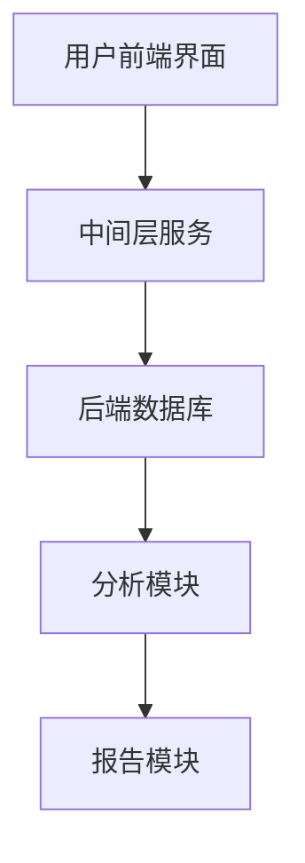

                 

# 《如何打造高效的产品反馈收集渠道》

## 关键词
- 产品反馈
- 反馈收集渠道
- 用户调研
- 用户访谈
- 用户行为分析
- 反馈处理系统

## 摘要
在快速变化的市场环境中，产品反馈收集的重要性日益凸显。本文将详细探讨如何构建一个高效的产品反馈收集渠道，包括了解产品反馈的重要性、收集方法、构建反馈收集系统、增强用户反馈积极性、利用反馈进行产品改进以及反馈收集的可持续性。通过案例分析，读者可以更好地理解这些方法在实际应用中的效果，并为自身产品提供反馈收集策略的参考。

## 目录大纲

### 第一部分：了解产品反馈收集的重要性

#### 第1章：产品反馈收集的基础概念

#### 第2章：产品反馈收集的方法

### 第二部分：构建高效的产品反馈收集渠道

#### 第3章：建立反馈收集系统

#### 第4章：增强用户反馈的积极性

#### 第5章：利用产品反馈进行产品改进

#### 第6章：反馈收集的可持续性

#### 第7章：案例研究

### 第三部分：未来展望与拓展

#### 第8章：产品反馈收集的挑战与趋势

#### 附录
- 附录A：常见的产品反馈收集工具
- 附录B：参考资料

### 第一部分：了解产品反馈收集的重要性

#### 第1章：产品反馈收集的基础概念

#### 第2章：产品反馈收集的方法

#### 第3章：建立反馈收集系统

### 第1章：产品反馈收集的基础概念

产品反馈收集是指通过各种方式获取用户对产品的使用体验、意见和建议，以促进产品的持续改进和优化。以下是产品反馈收集的基础概念：

## 1.1 产品反馈的重要性

### 1.1.1 反馈收集的目标

反馈收集的目标主要有以下几个方面：

1. **发现产品问题**：通过反馈了解用户在使用过程中遇到的问题，及时进行修复。
2. **优化产品功能**：根据用户的需求和反馈，调整和优化产品功能。
3. **提升用户体验**：通过反馈了解用户的使用习惯和偏好，改进产品界面和交互设计。
4. **增强用户满意度**：及时响应用户的反馈，提升用户的满意度和忠诚度。

### 1.1.2 反馈收集对产品开发的影响

反馈收集对产品开发的影响主要体现在以下几个方面：

1. **改进产品设计**：反馈可以为产品设计提供重要的参考，帮助开发团队更好地理解用户需求，优化产品功能。
2. **提高开发效率**：通过反馈，可以及时发现产品中的问题，减少开发过程中的反复修改和调试。
3. **降低开发风险**：提前获取用户的反馈，可以降低产品发布后的风险，避免因产品不符合用户需求而导致的失败。
4. **提升产品竞争力**：通过持续收集和利用反馈，不断提升产品功能和用户体验，增强产品在市场上的竞争力。

## 1.2 产品反馈的来源

产品反馈可以从多个渠道获取，以下是一些常见的反馈来源：

### 1.2.1 用户反馈

用户反馈是产品反馈的主要来源之一，可以通过以下方式收集：

1. **用户评论**：在产品页面、社交媒体、应用商店等地方，用户会对产品发表评论和评分。
2. **用户反馈表单**：在产品界面中设置反馈表单，用户可以直接填写反馈信息。
3. **用户访谈**：与用户进行一对一的访谈，深入了解用户的使用体验和需求。

### 1.2.2 市场调研

市场调研可以通过以下方式收集产品反馈：

1. **问卷调查**：通过在线问卷、线下访谈等方式，收集大量用户的意见和建议。
2. **焦点小组**：组织一组用户，针对特定话题进行讨论，收集深度反馈。

### 1.2.3 竞品分析

竞品分析可以提供以下反馈：

1. **用户评价**：分析竞争对手的产品评价，了解用户对其产品的反馈。
2. **功能对比**：比较自身产品与竞争对手的功能，发现优势和不足。
3. **市场趋势**：了解行业趋势和用户需求的变化，为产品改进提供方向。

### 第2章：产品反馈收集的方法

#### 第3章：建立反馈收集系统

#### 第4章：增强用户反馈的积极性

#### 第5章：利用产品反馈进行产品改进

#### 第6章：反馈收集的可持续性

#### 第7章：案例研究

### 第2章：产品反馈收集的方法

有效的产品反馈收集方法能够帮助我们更好地了解用户需求，优化产品功能和用户体验。以下介绍几种常见的反馈收集方法：

## 2.1 用户访谈

### 2.1.1 访谈的设计与实施

用户访谈是一种深入了解用户需求和体验的方法。以下是如何设计和实施用户访谈：

1. **确定访谈目标**：明确访谈的目的和需要收集的信息。
2. **选择访谈对象**：根据访谈目标选择具有代表性的用户。
3. **准备访谈问题**：设计开放性和封闭性相结合的问题，以便获取深入和具体的信息。
4. **进行访谈**：与用户进行面对面的交流，倾听他们的意见和建议。
5. **记录和整理**：访谈结束后，记录访谈内容，整理成文档或数据表。

### 2.1.2 访谈的分析与解读

访谈结束后，需要对访谈内容进行分析和解读，以便提取有价值的信息。以下是一些分析方法和步骤：

1. **数据整理**：将访谈记录整理成结构化的数据，便于分析。
2. **内容分析**：对访谈内容进行编码，提取关键信息。
3. **主题分析**：根据编码结果，找出主要问题和趋势。
4. **解读和报告**：将分析结果整理成报告，为产品改进提供依据。

## 2.2 用户调研

### 2.2.1 调研问卷的设计

用户调研问卷是收集大量用户反馈的有效方式。以下是如何设计调研问卷：

1. **确定调研目标**：明确调研的目的和需要收集的信息。
2. **设计问题类型**：结合开放性和封闭性问题，以获取多样化的信息。
3. **控制问题数量**：避免问卷过长，影响用户填写意愿。
4. **测试问卷**：在正式发布前，对问卷进行测试，确保问题的有效性和易理解性。

### 2.2.2 调研问卷的执行与数据分析

问卷设计完成后，需要进行执行和数据整理。以下是一些执行和数据分析的方法：

1. **执行问卷**：通过邮件、在线链接、应用内推送等方式，邀请用户参与调研。
2. **数据整理**：将收集到的问卷数据整理成结构化的数据。
3. **数据分析**：使用统计方法和工具，对问卷数据进行分析。
4. **结果报告**：将分析结果整理成报告，为产品改进提供依据。

## 2.3 用户行为分析

### 2.3.1 用户行为分析工具

用户行为分析可以通过以下工具进行：

1. **日志分析工具**：如Logstash、Kibana等，可以收集和分析用户行为日志。
2. **网站分析工具**：如Google Analytics、百度统计等，可以分析用户在网站上的行为。
3. **移动应用分析工具**：如Firebase Analytics、友盟等，可以分析用户在移动应用上的行为。

### 2.3.2 用户行为数据的处理与分析

用户行为数据的处理和分析步骤如下：

1. **数据收集**：收集用户行为数据，包括点击、浏览、下载等。
2. **数据清洗**：去除无效数据，如重复、缺失等。
3. **数据存储**：将清洗后的数据存储在数据库中，便于后续分析。
4. **数据分析**：使用统计分析方法和工具，对用户行为数据进行分析。
5. **结果展示**：将分析结果以图表、报表等形式展示，便于理解和决策。

### 第二部分：构建高效的产品反馈收集渠道

#### 第3章：建立反馈收集系统

#### 第4章：增强用户反馈的积极性

#### 第5章：利用产品反馈进行产品改进

#### 第6章：反馈收集的可持续性

#### 第7章：案例研究

### 第3章：建立反馈收集系统

构建一个高效的产品反馈收集系统是确保反馈收集流程顺畅的关键。以下是关于如何设计、实施和优化反馈收集系统的详细探讨。

## 3.1 反馈收集系统的设计

### 3.1.1 系统架构

一个典型的反馈收集系统通常包括以下几个主要组成部分：

1. **用户前端界面**：用户可以通过该界面提交反馈。
2. **中间层服务**：处理用户提交的反馈，包括验证、分类和标记等。
3. **后端数据库**：存储用户反馈数据，以便于后续分析和查询。
4. **分析模块**：对用户反馈数据进行分析，生成报告和可视化结果。
5. **报告模块**：将分析结果以图表、报表等形式展示给相关人员。

以下是一个简化的反馈收集系统架构图：

### 3.1.2 系统功能

一个高效的反馈收集系统应具备以下核心功能：

1. **反馈提交**：用户可以通过前端界面方便地提交反馈。
2. **反馈处理**：系统自动处理用户提交的反馈，包括验证、分类和标记等。
3. **数据分析**：系统对反馈数据进行分析，生成统计报告和可视化结果。
4. **报告展示**：系统将分析结果以图表、报表等形式展示给相关人员。
5. **反馈管理**：管理员可以查看、编辑和删除反馈。

### 3.1.3 反馈数据的存储与管理

为了保证反馈数据的可靠性和安全性，我们需要选择合适的数据库管理系统（DBMS）。以下是几种常用的DBMS及其特点：

1. **关系型数据库（RDBMS）**：
   - **MySQL**：开源、性能高、易于维护。
   - **PostgreSQL**：功能丰富、支持复杂查询、适用于大数据场景。
   - **Oracle**：高性能、稳定、适用于企业级应用。

2. **NoSQL数据库**：
   - **MongoDB**：文档型数据库，适用于高扩展性和灵活性要求。
   - **Cassandra**：分布式列存储数据库，适用于大规模数据存储。
   - **Redis**：键值存储数据库，适用于高速缓存和实时数据处理。

### 3.1.4 系统安全性

在设计和实现反馈收集系统时，必须考虑数据的安全性和隐私性。以下是一些关键的安全措施：

1. **数据加密**：对存储在数据库中的用户反馈数据进行加密，防止未授权访问。
2. **访问控制**：设置严格的访问权限，确保只有授权用户可以访问反馈数据。
3. **数据备份与恢复**：定期备份数据库，以防止数据丢失。
4. **安全审计**：对系统进行安全审计，及时发现和修复安全漏洞。

## 3.2 反馈收集的流程管理

### 3.2.1 流程设计

为了确保反馈收集过程的顺利进行，我们需要设计一个合理的流程。以下是反馈收集流程的典型步骤：

1. **反馈提交**：用户通过前端界面提交反馈。
2. **反馈验证**：系统对用户提交的反馈进行验证，确保反馈的有效性。
3. **反馈分类**：系统根据反馈内容对反馈进行分类，以便于后续分析。
4. **反馈处理**：系统对验证后的反馈进行处理，包括标记、分类和分派给相关团队等。
5. **反馈分析**：对处理后的反馈进行分析，提取有价值的信息。
6. **反馈报告**：将分析结果生成报告，展示给相关人员。

### 3.2.2 流程优化

在反馈收集流程的设计和实施过程中，我们需要不断进行流程优化，以提高效率和效果。以下是一些优化策略：

1. **简化流程**：去除不必要的步骤，简化流程，减少用户提交反馈的障碍。
2. **自动化处理**：利用自动化工具处理反馈，减少人工干预，提高处理速度。
3. **数据整合**：整合不同来源的反馈数据，以便于统一分析和报告。
4. **持续改进**：定期评估流程效果，根据反馈进行改进，不断提高反馈收集的质量和效率。

### 第三部分：未来展望与拓展

#### 第4章：增强用户反馈的积极性

#### 第5章：利用产品反馈进行产品改进

#### 第6章：反馈收集的可持续性

#### 第7章：案例研究

#### 第8章：产品反馈收集的挑战与趋势

### 第8章：产品反馈收集的挑战与趋势

在产品反馈收集的过程中，我们不仅需要关注当前的方法和技巧，还需要对未来可能面临的挑战和趋势有所预见。以下是关于产品反馈收集面临的一些挑战和未来的发展趋势。

## 8.1 反馈收集面临的挑战

### 8.1.1 数据隐私问题

随着用户对隐私保护的日益重视，如何在收集和使用用户反馈时保护用户隐私成为一大挑战。以下是一些应对策略：

1. **数据匿名化**：在收集反馈时，对用户信息进行匿名化处理，确保用户隐私。
2. **隐私政策**：明确告知用户反馈收集的目的和使用方式，取得用户同意。
3. **数据加密**：对存储和传输的用户数据进行加密，防止数据泄露。

### 8.1.2 反馈质量的不稳定性

用户反馈的质量受多种因素影响，包括用户的主观态度、表达能力和反馈内容的真实性等。以下是一些提升反馈质量的策略：

1. **设计高质量问卷**：设计易于理解、针对性强的问卷，提高反馈的准确性和有效性。
2. **用户引导**：在反馈收集过程中，对用户进行适当的引导，帮助他们更好地表达意见。
3. **筛选和验证**：对收集到的反馈进行筛选和验证，去除虚假和无效的反馈。

## 8.2 反馈收集的发展趋势

### 8.2.1 智能化反馈收集

随着人工智能技术的发展，智能化反馈收集成为未来的趋势。以下是一些智能化反馈收集的应用场景：

1. **自然语言处理**：利用自然语言处理技术，对用户反馈进行自动分类和分析，提高反馈处理效率。
2. **语音识别**：通过语音识别技术，将用户的语音反馈转换为文本，便于后续处理。
3. **智能推荐**：利用机器学习算法，为用户提供相关的反馈建议，提高反馈的有效性和针对性。

### 8.2.2 跨平台反馈收集

随着移动互联网的普及，用户使用的产品和平台越来越多样化。跨平台反馈收集成为满足用户需求的重要手段。以下是一些跨平台反馈收集的实践：

1. **多渠道整合**：整合多个平台的反馈数据，实现统一分析和管理。
2. **移动端反馈收集**：通过移动应用内置的反馈功能，方便用户随时提交反馈。
3. **社交媒体集成**：将社交媒体平台的用户反馈整合到产品反馈系统中，提高反馈收集的覆盖面。

### 8.2.3 社区化反馈收集

社区化反馈收集通过建立用户社区，鼓励用户参与产品讨论和反馈，提高用户参与度和反馈质量。以下是一些社区化反馈收集的实践：

1. **用户社区建设**：建立用户社区，提供交流和反馈平台，增强用户归属感和参与度。
2. **互动式反馈**：通过社区活动、在线讨论等形式，与用户互动，收集更多高质量的反馈。
3. **用户影响力**：通过用户评价、积分系统等方式，激励用户积极参与反馈，提高社区活跃度。

### 总结

产品反馈收集是一个持续的过程，它需要我们不断探索新的方法和技术，应对挑战和趋势。通过智能化、跨平台和社区化等手段，我们可以构建一个高效、可持续的产品反馈收集体系，为产品的持续改进和优化提供有力支持。

### 附录

#### 附录A：常见的产品反馈收集工具

- **用户调研问卷工具**：如Google Forms、SurveyMonkey、问卷星等。
- **用户行为分析工具**：如Google Analytics、百度统计、Firebase Analytics等。
- **用户访谈工具**：如Zoom、Microsoft Teams、腾讯会议等。

#### 附录B：参考资料

- **相关书籍**：
  - 《用户体验要素》- 凯文·克鲁斯
  - 《产品经理实战手册》- 罗振宇
  - 《数据分析：实战策略与应用》- 李华

- **网络资源**：
  - [产品反馈收集最佳实践](https://www.nngroup.com/articles/feedback/)
  - [用户调研技巧与案例分析](https://uxperts.com/ux-research-basics/)
  - [数据分析入门教程](https://www.datasciencetutorials.com/tutorials/)

作者：AI天才研究院/AI Genius Institute & 禅与计算机程序设计艺术 /Zen And The Art of Computer Programming

本文内容仅供参考，如需实际应用，请结合具体情况进行调整。如有错误或不足之处，欢迎指正。谢谢！## 第1章：产品反馈收集的基础概念

### 1.1 产品反馈的重要性

产品反馈收集是现代产品开发过程中不可或缺的一环。首先，从**用户视角**来看，产品反馈是用户与产品之间沟通的桥梁，用户可以通过反馈表达他们对产品的满意程度、使用体验和改进建议。这不仅有助于用户感受到自己的声音被重视，也能激发他们的参与感和忠诚度。

其次，从**产品视角**来看，产品反馈提供了宝贵的改进方向。通过收集和分析用户的反馈，产品团队可以识别出产品的优点和不足，从而有针对性地进行优化和调整。以下是产品反馈对产品开发的具体影响：

1. **发现产品问题**：用户在使用产品过程中遇到的任何问题都可以通过反馈反映出来。这些问题可能包括功能故障、界面设计问题、操作不便等。及时发现这些问题并加以解决，可以避免用户流失和负面口碑的扩散。

2. **优化产品功能**：用户的反馈往往包含对产品功能的建议和期望。通过分析这些反馈，产品团队可以了解用户的需求，从而在产品迭代中增加或改进相关功能，提升产品的竞争力。

3. **提升用户体验**：用户体验是产品成功的关键因素之一。通过收集用户对界面设计、操作流程和交互体验的反馈，产品团队能够更好地优化产品的用户体验，提高用户满意度和忠诚度。

4. **降低开发风险**：在产品发布前，通过收集用户的早期反馈，可以帮助团队提前发现潜在的问题，从而在发布前进行相应的调整和优化，降低产品发布后的失败风险。

5. **增强用户满意度**：及时响应用户的反馈，解决他们的问题和需求，可以显著提升用户的满意度。这不仅有助于留住现有用户，还能吸引新用户，提升产品的市场占有率。

### 1.1.1 反馈收集的目标

产品反馈收集的主要目标包括：

1. **理解用户需求**：通过反馈收集，深入了解用户的需求和期望，为产品规划和开发提供有力依据。

2. **发现产品问题**：及时识别产品中的问题，尤其是那些在用户使用过程中容易暴露的缺陷和不足。

3. **优化产品功能**：基于用户反馈，对现有功能进行改进和优化，提高产品的可用性和用户满意度。

4. **提升用户体验**：通过分析用户反馈，优化产品的界面设计、交互流程和整体体验，提升用户的满意度和忠诚度。

5. **增强用户参与度**：通过有效的反馈机制，鼓励用户参与产品改进，增强他们的参与感和忠诚度。

### 1.1.2 反馈收集对产品开发的影响

反馈收集对产品开发的影响主要体现在以下几个方面：

1. **改进产品设计**：通过反馈，产品团队能够了解用户对产品的期望和需求，从而在设计阶段进行优化，确保产品功能符合用户期望。

2. **提高开发效率**：及时收集和响应用户反馈，可以帮助团队提前发现并解决潜在问题，减少开发过程中的反复迭代和调试，提高开发效率。

3. **降低开发风险**：在产品发布前，通过反馈收集和早期用户测试，可以识别和解决可能的问题，降低产品发布后的失败风险。

4. **增强产品竞争力**：通过不断优化和改进，使产品在功能和用户体验方面保持领先地位，提升产品在市场上的竞争力。

5. **提升用户满意度**：通过及时响应和解决用户问题，增强用户的满意度和忠诚度，促进产品的长期发展。

### 1.2 产品反馈的来源

产品反馈可以从多个渠道获取，以下是一些常见的反馈来源：

#### 1.2.1 用户反馈

用户反馈是产品反馈的主要来源之一，可以通过以下方式收集：

1. **用户评论**：在产品页面、社交媒体、应用商店等地方，用户会对产品发表评论和评分。
2. **用户反馈表单**：在产品界面中设置反馈表单，用户可以直接填写反馈信息。
3. **用户访谈**：与用户进行一对一的访谈，深入了解用户的使用体验和需求。
4. **用户调研**：通过在线问卷、线下访谈等方式，收集大量用户的意见和建议。

#### 1.2.2 市场调研

市场调研可以通过以下方式收集产品反馈：

1. **问卷调查**：通过在线问卷、线下访谈等方式，收集大量用户的意见和建议。
2. **焦点小组**：组织一组用户，针对特定话题进行讨论，收集深度反馈。
3. **用户行为分析**：通过分析用户在产品上的行为数据，了解用户的使用习惯和偏好。

#### 1.2.3 竞品分析

竞品分析可以提供以下反馈：

1. **用户评价**：分析竞争对手的产品评价，了解用户对其产品的反馈。
2. **功能对比**：比较自身产品与竞争对手的功能，发现优势和不足。
3. **市场趋势**：了解行业趋势和用户需求的变化，为产品改进提供方向。

通过以上多种渠道收集产品反馈，产品团队能够全面了解用户需求和产品表现，从而有针对性地进行改进和优化。

### 1.3 反馈收集的方法

为了有效收集产品反馈，产品团队可以采用多种方法，每种方法都有其独特的优势和应用场景。以下是几种常见的反馈收集方法及其应用：

#### 1.3.1 用户访谈

用户访谈是一种深入了解用户需求和体验的方法。通过面对面或在线方式与用户进行一对一的交流，可以获取详细的反馈信息。以下是用户访谈的步骤和应用：

1. **确定访谈目标**：明确访谈的目的和需要收集的信息。
2. **选择访谈对象**：根据访谈目标选择具有代表性的用户。
3. **准备访谈问题**：设计开放性和封闭性相结合的问题，以便获取深入和具体的信息。
4. **进行访谈**：与用户进行面对面的交流，倾听他们的意见和建议。
5. **记录和整理**：访谈结束后，记录访谈内容，整理成文档或数据表。

用户访谈的优势在于能够获取高质量的、详细的反馈，帮助产品团队深入了解用户的具体需求和痛点。然而，这种方法成本较高，且需要专业的访谈技巧。

#### 1.3.2 用户调研

用户调研是通过问卷、电话访谈或在线调查等方式，收集大量用户的意见和建议。以下是用户调研的步骤和应用：

1. **确定调研目标**：明确调研的目的和需要收集的信息。
2. **设计调研问卷**：设计易于理解、针对性强的问卷，包含开放性和封闭性问题。
3. **选择调研对象**：根据调研目标选择合适的用户群体。
4. **执行调研**：通过在线链接、邮件或线下访谈等方式，邀请用户参与调研。
5. **数据整理和分析**：对收集到的数据进行整理和分析，提取有价值的信息。
6. **撰写调研报告**：将分析结果整理成报告，为产品改进提供依据。

用户调研的优势在于能够收集大量用户数据，快速了解用户反馈的普遍趋势。然而，这种方法可能存在样本偏差和信息不完整的问题。

#### 1.3.3 用户行为分析

用户行为分析是通过收集和分析用户在产品上的行为数据，了解用户的使用习惯和偏好。以下是用户行为分析的工具和步骤：

1. **选择分析工具**：选择合适的用户行为分析工具，如Google Analytics、Firebase Analytics等。
2. **收集数据**：通过工具收集用户在产品上的行为数据，包括点击、浏览、下载等。
3. **数据清洗**：去除无效数据，如重复、缺失等。
4. **数据分析**：使用统计分析方法和工具，对用户行为数据进行分析。
5. **可视化展示**：将分析结果以图表、报表等形式展示，便于理解和决策。

用户行为分析的优势在于能够客观、量化地了解用户行为，帮助产品团队发现潜在问题和优化机会。然而，这种方法可能难以捕捉用户的情感和主观体验。

#### 1.3.4 用户反馈表单

用户反馈表单是在产品界面中设置的一种反馈收集方式，用户可以直接在表单中填写意见和建议。以下是用户反馈表单的步骤和应用：

1. **设计反馈表单**：设计简洁、易操作的反馈表单，包含必要的问题和选项。
2. **放置表单位置**：在产品界面中放置明显的位置，便于用户发现和填写。
3. **收集反馈**：用户在表单中填写反馈，系统自动收集并存储。
4. **反馈处理**：对收集到的反馈进行处理，分类和分派给相关团队。
5. **反馈分析**：对处理后的反馈进行分析，提取有价值的信息。

用户反馈表单的优势在于操作简便、成本低，适合广泛收集用户反馈。然而，这种方法可能难以获取详细的、深入的信息。

通过上述反馈收集方法的综合应用，产品团队可以全面、深入地了解用户需求，为产品改进提供有力支持。

### 1.4 反馈收集的流程

一个高效的反馈收集流程是确保反馈收集质量和效率的关键。以下是反馈收集的基本流程及其关键步骤：

#### 1.4.1 确定反馈目标

在开始反馈收集之前，首先需要明确反馈的目标，即希望通过反馈收集了解哪些具体信息。例如，了解用户对某个新功能的满意度，还是发现产品中的常见问题。

#### 1.4.2 设计反馈渠道

根据反馈目标，设计合适的反馈渠道。常见的反馈渠道包括用户反馈表单、在线调研问卷、用户访谈等。每个渠道都有其适用的场景和优势，需要根据实际情况进行选择。

#### 1.4.3 收集反馈

通过设计的反馈渠道，收集用户的反馈信息。在收集过程中，需要注意以下几点：

1. **明确反馈规则**：确保用户知道如何提交反馈，以及反馈的具体要求和格式。
2. **提供方便的提交方式**：尽量简化反馈提交流程，减少用户的操作步骤。
3. **确保反馈渠道的稳定性**：避免因反馈渠道故障导致用户反馈无法提交。

#### 1.4.4 整理反馈数据

收集到的反馈数据需要进行整理和分类，以便于后续分析和处理。常见的整理方式包括：

1. **数据清洗**：去除无效数据，如重复、缺失等。
2. **数据编码**：将反馈内容进行编码，便于统计和分析。
3. **分类整理**：根据反馈的内容和主题，对反馈进行分类整理。

#### 1.4.5 分析反馈数据

对整理后的反馈数据进行分析，提取有价值的信息。常用的分析方法包括：

1. **描述性分析**：了解反馈的总体情况和分布趋势。
2. **探索性分析**：发现反馈中隐藏的模式和趋势。
3. **相关性分析**：分析不同反馈之间的关系。

#### 1.4.6 制定改进措施

基于反馈分析的结果，制定具体的改进措施。改进措施应针对反馈中提到的问题和需求，确保能够有效解决用户的问题和提升产品体验。

#### 1.4.7 反馈跟踪和闭环

对改进措施的执行效果进行跟踪，并根据反馈结果进行闭环处理。即确认问题是否已解决，用户是否满意，以便为后续的产品改进提供依据。

通过以上步骤，产品团队能够高效地收集、分析和利用用户反馈，为产品的持续改进和优化提供有力支持。

### 1.5 反馈收集的挑战与应对策略

在产品反馈收集的过程中，团队可能会面临一些挑战。以下是一些常见挑战及其应对策略：

#### 1.5.1 用户参与度不足

**挑战**：用户可能对提供反馈不感兴趣，导致参与度低。

**应对策略**：
- **激励用户**：提供奖励机制，如积分、优惠券等，鼓励用户参与反馈。
- **简化流程**：设计简洁、直观的反馈渠道，减少用户提交反馈的步骤。

#### 1.5.2 反馈质量不高

**挑战**：用户可能提供模糊、不具体或重复的反馈，难以进行分析。

**应对策略**：
- **引导用户**：在反馈渠道中提供清晰的指导，帮助用户明确反馈问题。
- **筛选反馈**：对反馈进行初步筛选和整理，去除无效和重复的反馈。

#### 1.5.3 数据隐私问题

**挑战**：用户可能担心反馈数据会被滥用或泄露。

**应对策略**：
- **保障隐私**：明确告知用户反馈收集的目的和使用方式，遵守相关法律法规。
- **数据加密**：对反馈数据进行加密处理，确保数据安全。

#### 1.5.4 反馈处理不及时

**挑战**：反馈收集后，处理速度慢，导致用户不满。

**应对策略**：
- **优化流程**：简化反馈处理流程，提高处理效率。
- **设立反馈机制**：建立快速反馈响应机制，确保用户的问题能够得到及时解决。

通过上述策略，产品团队能够更好地应对反馈收集过程中遇到的挑战，确保反馈收集的质量和效率，为产品的持续改进提供有力支持。

### 第2章：产品反馈收集的方法

#### 第3章：建立反馈收集系统

#### 第4章：增强用户反馈的积极性

#### 第5章：利用产品反馈进行产品改进

#### 第6章：反馈收集的可持续性

#### 第7章：案例研究

### 第2章：产品反馈收集的方法

有效的产品反馈收集是产品持续改进的关键。本章将详细介绍几种常用的产品反馈收集方法，包括用户访谈、用户调研、用户行为分析等。通过这些方法，产品团队可以全面了解用户需求，优化产品功能，提升用户体验。

#### 2.1 用户访谈

用户访谈是一种深入了解用户需求和使用体验的方法。通过与用户进行一对一的交流，产品团队可以获取详细、真实的用户反馈。

### 2.1.1 访谈的设计与实施

**设计与实施步骤**：

1. **确定访谈目标**：明确访谈的目的，例如了解用户对某项功能的满意度或使用过程中的痛点。

2. **选择访谈对象**：根据访谈目标，选择具有代表性的用户。例如，对于新功能的反馈，可以选择已经使用该功能一段时间的用户。

3. **准备访谈问题**：设计开放性和封闭性相结合的问题，以便获取深入和具体的信息。例如，可以使用以下问题：
   - 您觉得这个功能有什么优点和缺点？
   - 您在使用过程中遇到了哪些问题？
   - 您对这款产品的期望是什么？

4. **进行访谈**：选择合适的时间和地点，与用户进行面对面的交流。在访谈过程中，注意倾听用户的意见和建议，并做好记录。

5. **记录和整理**：访谈结束后，将记录的内容整理成文档或数据表，以便后续分析。

### 2.1.2 访谈的分析与解读

**分析与解读步骤**：

1. **数据整理**：将访谈记录整理成结构化的数据，便于分析。例如，将用户反馈按照功能、问题类型等分类。

2. **内容分析**：对访谈内容进行编码，提取关键信息。例如，将用户提到的功能问题编码为“功能缺陷”、“操作不便”等。

3. **主题分析**：根据编码结果，找出主要问题和趋势。例如，如果大多数用户提到操作不便，那么可能需要优化界面设计。

4. **解读和报告**：将分析结果整理成报告，为产品改进提供依据。报告应包括问题的总结、分析和建议。

#### 2.2 用户调研

用户调研是一种通过问卷调查或访谈等方式收集大量用户反馈的方法。以下是如何设计和实施用户调研：

### 2.2.1 调研问卷的设计

**设计步骤**：

1. **确定调研目标**：明确调研的目的，例如了解用户对某项新功能的满意度。

2. **设计问题类型**：结合开放性和封闭性问题，以获取多样化的信息。例如，可以使用以下问题类型：
   - 开放性问题：您对新功能的体验如何？
   - 封闭性问题：您对这项功能的使用频率是多少？

3. **控制问题数量**：避免问卷过长，影响用户填写意愿。一般来说，问卷长度控制在10-15分钟内为宜。

4. **测试问卷**：在正式发布前，对问卷进行测试，确保问题的有效性和易理解性。可以邀请部分用户填写问卷，并根据反馈进行修改。

### 2.2.2 调研问卷的执行与数据分析

**执行与数据分析步骤**：

1. **执行问卷**：通过邮件、在线链接、应用内推送等方式，邀请用户参与调研。

2. **数据整理**：将收集到的问卷数据整理成结构化的数据，便于分析。

3. **数据分析**：使用统计分析方法和工具，对问卷数据进行分析。例如，计算平均值、中位数、百分比等。

4. **结果报告**：将分析结果整理成报告，为产品改进提供依据。报告应包括调研结果总结、问题和建议。

#### 2.3 用户行为分析

用户行为分析是一种通过收集和分析用户在产品上的行为数据，了解用户使用习惯和需求的方法。以下是如何进行用户行为分析：

### 2.3.1 用户行为分析工具

**选择分析工具**：

1. **网站分析工具**：如Google Analytics、百度统计等，可以分析用户在网站上的行为。

2. **移动应用分析工具**：如Firebase Analytics、友盟等，可以分析用户在移动应用上的行为。

3. **日志分析工具**：如Logstash、Kibana等，可以收集和分析用户行为日志。

### 2.3.2 用户行为数据的处理与分析

**数据处理与分析步骤**：

1. **数据收集**：通过所选分析工具，收集用户在产品上的行为数据，包括点击、浏览、下载等。

2. **数据清洗**：去除无效数据，如重复、缺失等。

3. **数据存储**：将清洗后的数据存储在数据库中，便于后续分析。

4. **数据分析**：使用统计分析方法和工具，对用户行为数据进行分析。例如，计算用户活跃度、留存率等指标。

5. **可视化展示**：将分析结果以图表、报表等形式展示，便于理解和决策。

通过用户访谈、用户调研和用户行为分析这三种方法，产品团队可以全面、深入地了解用户需求，为产品改进提供有力支持。

### 第3章：建立反馈收集系统

#### 第4章：增强用户反馈的积极性

#### 第5章：利用产品反馈进行产品改进

#### 第6章：反馈收集的可持续性

#### 第7章：案例研究

### 第3章：建立反馈收集系统

构建一个高效的产品反馈收集系统是确保反馈收集过程顺畅的关键。一个完善的反馈收集系统不仅可以提高反馈收集的效率和准确性，还能为产品改进提供有力的数据支持。本章将详细介绍如何设计、实施和优化反馈收集系统，以帮助产品团队更好地理解和应对用户需求。

#### 3.1 反馈收集系统的设计

一个有效的反馈收集系统需要综合考虑系统的架构、功能、数据安全和用户体验。以下是一个典型的反馈收集系统架构及其关键组成部分：

**用户前端界面（A）**：用户通过前端界面提交反馈。界面应简洁易用，提供多种提交方式，如文本输入、选择框、评分等。

**中间层服务（B）**：中间层负责处理用户提交的反馈，包括验证、分类和标记等。该层还可以实现与后端数据库和前端界面的交互。

**后端数据库（C）**：后端数据库用于存储用户反馈数据，包括反馈内容、提交时间、用户信息等。数据库的选择需要考虑数据存储量、查询效率和数据安全等因素。

**分析模块（D）**：分析模块负责对反馈数据进行分析，提取有价值的信息，如高频问题、用户痛点等。常用的分析工具包括数据分析软件、自然语言处理库等。

**报告模块（E）**：报告模块将分析结果以图表、报表等形式展示，便于相关团队理解和决策。报告模块还可以提供数据可视化和数据导出功能。

#### 3.1.1 系统架构

以下是反馈收集系统的基本架构及其组成部分：

1. **前端界面**：提供用户反馈的提交入口，使用户可以方便地提交反馈。
2. **中间层**：处理用户提交的反馈，包括验证、分类和标记等，确保反馈的有效性和准确性。
3. **后端数据库**：存储用户反馈数据，为后续分析和报告提供数据支持。
4. **分析引擎**：对反馈数据进行分析，提取有价值的信息，如用户痛点、高频问题等。
5. **报告生成器**：将分析结果以图表、报表等形式展示，便于相关团队理解和决策。

#### 3.1.2 系统功能

一个高效的反馈收集系统应具备以下核心功能：

1. **反馈提交**：用户可以通过前端界面方便地提交反馈，包括文本、图片、视频等多种形式。
2. **反馈处理**：系统自动对用户提交的反馈进行分类、标记和分派，确保反馈能够及时处理和响应。
3. **数据分析**：系统对反馈数据进行分析，提取有价值的信息，如用户痛点、高频问题等。
4. **报告展示**：系统将分析结果以图表、报表等形式展示，便于相关团队理解和决策。
5. **反馈管理**：管理员可以查看、编辑和删除反馈，确保反馈数据的准确性和完整性。

#### 3.1.3 反馈数据的存储与管理

为了保证反馈数据的可靠性和安全性，反馈收集系统需要设计合理的数据存储和管理方案。以下是一些关键点：

1. **数据库选择**：根据反馈数据量和查询需求，选择合适的数据库管理系统（DBMS），如MySQL、PostgreSQL、MongoDB等。
2. **数据结构设计**：设计合理的数据库结构，确保反馈数据的存储高效、查询便捷。
3. **数据备份与恢复**：定期备份数据库，确保在数据丢失或损坏时能够快速恢复。
4. **数据加密**：对存储在数据库中的用户反馈数据进行加密处理，防止数据泄露。
5. **数据访问控制**：设置严格的访问权限，确保只有授权用户可以访问反馈数据。

#### 3.2 反馈收集的流程管理

为了确保反馈收集过程的顺畅和高效，产品团队需要设计合理的流程，并对流程进行持续优化。以下是一个典型的反馈收集流程及其关键步骤：

1. **确定反馈目标**：明确反馈收集的目标和预期效果，如了解用户对某个新功能的满意度或使用过程中的痛点。
2. **设计反馈渠道**：根据反馈目标，选择合适的反馈渠道，如用户反馈表单、在线调研问卷、用户访谈等。
3. **发布反馈渠道**：将设计的反馈渠道发布到产品界面或通过其他渠道通知用户。
4. **收集反馈**：通过设计的反馈渠道，收集用户的反馈信息。
5. **整理反馈数据**：对收集到的反馈数据进行整理、分类和编码，确保数据的有效性和准确性。
6. **分析反馈数据**：对整理后的反馈数据进行分析，提取有价值的信息，如用户痛点、高频问题等。
7. **生成报告**：将分析结果以图表、报表等形式展示，为产品改进提供依据。
8. **反馈跟踪**：对反馈处理结果进行跟踪，确保问题得到有效解决，并形成闭环。

#### 3.3 流程优化策略

为了提高反馈收集的效率和效果，产品团队可以采取以下流程优化策略：

1. **简化流程**：去除不必要的步骤，简化反馈提交和处理流程，减少用户的操作难度。
2. **自动化处理**：利用自动化工具处理反馈，如自动分类、标记和分派等，减少人工干预。
3. **数据整合**：整合不同来源的反馈数据，实现统一分析和报告，提高反馈收集的覆盖面。
4. **用户引导**：在反馈收集过程中，对用户进行适当的引导，帮助他们更好地表达意见和建议。
5. **持续改进**：定期评估反馈收集流程的效果，根据反馈进行改进，不断提升流程的效率和效果。

通过设计合理的反馈收集系统、优化流程管理，产品团队可以更好地收集、分析和利用用户反馈，为产品的持续改进和优化提供有力支持。

### 第4章：增强用户反馈的积极性

#### 第5章：利用产品反馈进行产品改进

#### 第6章：反馈收集的可持续性

#### 第7章：案例研究

### 第4章：增强用户反馈的积极性

用户反馈的质量和数量直接影响产品改进的效率和效果。因此，如何增强用户反馈的积极性是产品团队需要关注的重要问题。以下是一些策略和方法，帮助产品团队激发用户积极参与反馈，提高反馈的质量和积极性。

#### 4.1 提高反馈的可操作性

**4.1.1 反馈渠道的易用性**

用户反馈的提交渠道应简单、直观，便于用户操作。以下是一些建议：

1. **简洁的界面设计**：反馈提交界面应简洁明了，避免复杂的布局和操作步骤。
2. **明确的使用说明**：在反馈提交界面提供清晰的说明，指导用户如何填写反馈。
3. **多种提交方式**：提供多种提交方式，如文本输入、选择框、评分、图片上传等，以满足不同用户的需求。

**4.1.2 反馈奖励机制**

建立反馈奖励机制，可以激发用户提交反馈的积极性。以下是一些奖励机制的设计建议：

1. **积分奖励**：为提交反馈的用户提供积分，积分可以兑换产品服务、优惠券等。
2. **荣誉展示**：在产品界面或社交媒体上展示提交高质量反馈的用户，增加他们的参与感和荣誉感。
3. **抽奖活动**：定期举办抽奖活动，奖励积极参与反馈的用户，提高他们的参与度。

**4.1.3 反馈的及时反馈**

及时反馈用户的反馈，可以增加他们的参与感和满意度。以下是一些建议：

1. **自动回复**：在用户提交反馈后，系统自动发送一封感谢邮件或通知，告知用户反馈已收到。
2. **定期更新**：定期向用户通报反馈处理进展，告知他们反馈问题已解决或正在解决中。
3. **公开报告**：在产品更新时，公开反馈处理报告，展示用户的反馈和建议是如何被采纳和实施的。

#### 4.2 提升用户反馈的质量

提升用户反馈的质量，有助于产品团队更准确地识别问题和需求，从而进行有效的产品改进。以下是一些提升反馈质量的策略：

**4.2.1 明确反馈问题**

为了提高反馈的针对性，用户在提交反馈时需要明确问题。以下是一些建议：

1. **问题分类**：在反馈提交界面提供问题分类选项，帮助用户明确反馈问题的类别。
2. **详细描述**：鼓励用户详细描述遇到的问题，包括现象、发生频率、操作步骤等。
3. **问题引导**：在反馈提交过程中，提供问题引导，帮助用户明确反馈的重点。

**4.2.2 提供反馈指导**

为了提高用户反馈的详细度和准确性，可以在反馈提交过程中提供反馈指导。以下是一些建议：

1. **问题示例**：在反馈提交界面提供常见问题示例，帮助用户了解如何描述问题和提供有效反馈。
2. **问题模板**：提供反馈问题模板，指导用户按照模板填写反馈。
3. **在线帮助**：在产品界面或反馈提交界面提供在线帮助文档，解答用户在提交反馈时可能遇到的问题。

**4.2.3 鼓励具体建议**

除了反馈问题，鼓励用户提供具体建议，有助于产品团队进行有针对性的改进。以下是一些建议：

1. **建议征集**：在反馈提交界面提供建议征集选项，鼓励用户提出具体建议。
2. **建议奖励**：对提出高质量建议的用户提供奖励，如积分、优惠券等。
3. **建议公示**：在产品更新时，公示采纳的用户建议，增加用户的参与感和成就感。

通过提高反馈的可操作性、提供反馈指导和鼓励具体建议，产品团队可以增强用户反馈的积极性，提高反馈的质量，从而更好地进行产品改进和优化。

### 第5章：利用产品反馈进行产品改进

#### 第6章：反馈收集的可持续性

#### 第7章：案例研究

### 第5章：利用产品反馈进行产品改进

产品反馈不仅是了解用户需求的重要手段，更是产品改进的核心依据。通过有效地分析和利用产品反馈，产品团队能够有针对性地优化产品功能、改进用户体验，从而提高产品的市场竞争力。以下是利用产品反馈进行产品改进的详细步骤和方法。

#### 5.1 反馈分析的方法

**5.1.1 描述性分析**

描述性分析是对反馈数据的基本统计分析，包括计数、平均值、中位数、标准差等。这种方法可以帮助产品团队快速了解反馈数据的整体分布和趋势。

1. **计数分析**：统计各类反馈的数量，识别最常见的问题。
2. **平均值分析**：计算用户对某个功能的平均满意度评分。
3. **中位数分析**：确定用户反馈的中值，识别数据分布的中间值。
4. **标准差分析**：了解用户反馈的离散程度，识别反馈的波动情况。

**5.1.2 探索性分析**

探索性分析是对反馈数据进行深入挖掘，通过图表、趋势线、相关性分析等方法，发现数据中的隐藏模式和趋势。

1. **图表展示**：使用柱状图、饼图、折线图等，直观展示各类反馈的数量和比例。
2. **趋势分析**：通过时间序列分析，观察用户反馈随时间的变化趋势。
3. **相关性分析**：分析不同反馈类型之间的相关性，识别潜在的问题关联。

**5.1.3 综合分析**

综合分析是将描述性分析和探索性分析相结合，通过对反馈数据的深入挖掘，形成对产品的全面理解。

1. **分类分析**：根据反馈的类别，对反馈进行详细分析，识别各类别反馈的共性和特性。
2. **聚类分析**：使用聚类算法，将相似的反馈聚集在一起，识别用户群体的不同需求。
3. **主题分析**：通过文本分析，提取反馈中的主题和关键词，识别用户关注的核心问题。

#### 5.2 提出改进措施

**5.2.1 功能优化**

基于反馈分析结果，针对用户提出的问题和需求，提出具体的功能优化措施。

1. **修复缺陷**：针对反馈中提到的功能缺陷，制定修复计划，确保问题得到及时解决。
2. **改进操作流程**：简化复杂的操作流程，减少用户的操作步骤，提高用户体验。
3. **增加新功能**：根据用户的建议，增加新的功能模块，满足用户的多样化需求。

**5.2.2 用户体验改进**

用户体验是产品成功的关键因素之一。通过反馈，产品团队能够发现用户体验中的不足，提出相应的改进措施。

1. **界面优化**：改进产品界面设计，使其更加直观、易于操作。
2. **交互设计**：优化交互设计，提高用户的操作流畅性和满意度。
3. **内容优化**：优化产品内容，如增加用户指南、帮助文档等，提高用户的使用效率。

**5.2.3 技术改进**

技术改进包括对产品技术架构和性能的优化，以满足用户的需求和提高产品的竞争力。

1. **性能优化**：通过性能测试和调优，提高产品的响应速度和处理能力。
2. **架构优化**：优化产品技术架构，提高系统的可扩展性和稳定性。
3. **安全性提升**：加强产品的安全防护措施，防止数据泄露和恶意攻击。

#### 5.3 改进措施的实施

**5.3.1 制定实施计划**

在提出改进措施后，需要制定详细的实施计划，明确改进目标、时间表和责任分配。

1. **确定改进目标**：明确每个改进措施的目标和预期效果。
2. **制定时间表**：制定详细的实施时间表，确保改进措施能够按时完成。
3. **责任分配**：明确每个团队成员的责任，确保改进措施得到有效执行。

**5.3.2 实施过程监控**

在改进措施实施过程中，需要对实施过程进行监控和评估，确保改进措施达到预期效果。

1. **过程监控**：通过定期检查、代码审查和测试，确保改进措施的正确实施。
2. **效果评估**：通过用户反馈、性能测试等手段，评估改进措施的效果，根据反馈进行优化。

**5.3.3 持续改进**

产品改进是一个持续的过程。通过持续收集和利用用户反馈，产品团队能够不断优化产品，提高用户体验和满意度。

1. **定期评估**：定期评估产品的改进效果，根据评估结果进行调整和优化。
2. **持续反馈**：建立持续反馈机制，确保用户的声音能够持续被听到和利用。

通过以上方法，产品团队能够有效地利用产品反馈进行产品改进，不断提高产品的质量和竞争力。

### 第6章：反馈收集的可持续性

#### 第7章：案例研究

### 第6章：反馈收集的可持续性

产品反馈收集的可持续性是确保产品持续改进和优化的关键。一个有效的反馈收集机制不仅能够帮助团队快速响应用户需求，还能在长期内保持数据的质量和可靠性。以下是如何确保反馈收集的可持续性的探讨。

#### 6.1 持续反馈的重要性

**6.1.1 产品迭代周期**

产品迭代是一个持续的过程，每个版本都会包含新功能、改进和修复。持续反馈能够帮助团队在每个迭代中不断优化产品，提高产品的质量和用户体验。

**6.1.2 持续反馈的价值**

持续反馈不仅能够帮助团队了解当前用户的需求和问题，还能通过长期数据的积累，发现潜在的趋势和模式，为产品的长期规划提供支持。

#### 6.2 建立反馈文化

**6.2.1 反馈机制的推广**

建立反馈文化需要从企业文化的层面进行推广。通过内部培训和宣传，让每个团队成员都认识到反馈的重要性，并鼓励他们积极参与反馈。

**6.2.2 反馈文化的培育**

培育反馈文化需要建立开放、透明的反馈环境。团队成员应该鼓励彼此提出意见和建议，管理者应积极响应和反馈，树立榜样作用。

#### 6.3 反馈机制的优化

**6.3.1 反馈渠道的多样化**

为了确保反馈的可持续性，应提供多样化的反馈渠道，如在线反馈表单、用户访谈、社区论坛等，以满足不同用户的需求。

**6.3.2 反馈机制的自动化**

利用自动化工具优化反馈收集和处理流程，提高效率。例如，使用智能客服系统自动分类和回应用户反馈，减轻人工负担。

**6.3.3 反馈数据的定期分析**

定期对反馈数据进行分析和报告，确保团队能够及时了解用户的最新需求和问题。通过定期分析，可以发现反馈中的趋势和模式，为产品的长期改进提供依据。

#### 6.4 反馈机制的可持续性保障

**6.4.1 数据安全和隐私**

确保反馈数据的存储和安全，遵守相关法律法规，保护用户隐私。通过加密和访问控制等措施，防止数据泄露和滥用。

**6.4.2 反馈机制的透明性**

建立反馈机制的透明性，确保用户知道他们的反馈是如何被收集、分析和利用的。通过公开反馈处理结果和报告，增强用户的信任和参与感。

**6.4.3 反馈机制的灵活性**

反馈机制应具备灵活性，能够根据产品迭代和市场变化进行调整。通过定期评估和反馈，确保反馈机制能够持续适应产品的需求和变化。

通过建立反馈文化、优化反馈机制和保障反馈数据的可持续性，产品团队可以确保反馈收集的可持续性，为产品的长期改进和优化提供有力支持。

### 第7章：案例研究

#### 第8章：未来展望与拓展

### 第7章：案例研究

为了更好地理解如何在实际场景中构建和优化产品反馈收集系统，本章节将通过两个实际案例，展示产品团队在不同背景和应用场景下如何收集、分析和利用用户反馈，实现产品的持续改进和优化。

#### 7.1 案例一：某电商平台的反馈收集实践

**7.1.1 案例背景**

某电商平台在上线后，希望通过用户反馈收集系统，了解用户的使用体验和需求，从而优化产品功能和用户体验。由于电商平台的用户量庞大，反馈数据的多样性和复杂性给反馈收集系统带来了挑战。

**7.1.2 反馈收集系统的构建**

1. **前端界面设计**：电商平台设计了一个简洁易用的反馈提交界面，提供文本输入、选择框、评分等多种提交方式。同时，在产品页面的显眼位置设置了反馈入口，便于用户快速提交反馈。

2. **中间层服务**：中间层服务负责处理用户提交的反馈，包括验证、分类和标记等。通过自动化处理，确保每个反馈都能被正确分类和分派到相应的团队进行处理。

3. **后端数据库**：电商平台选择了一个高扩展性的数据库管理系统（DBMS），如MongoDB，以存储大量用户反馈数据。数据库结构设计合理，便于后续的数据分析和报告生成。

4. **分析模块**：分析模块使用数据分析工具，如Google Analytics，对用户反馈进行描述性分析和探索性分析。通过图表、报表等形式，直观展示反馈数据的分布和趋势。

5. **报告模块**：报告模块将分析结果以图表、报表等形式展示给相关团队，帮助团队快速了解用户反馈的关键信息。同时，报告模块支持数据导出，方便团队进行进一步分析。

**7.1.3 反馈数据的分析与利用**

1. **描述性分析**：通过描述性分析，电商平台发现用户最常见的问题包括搜索结果不准确、商品描述不符等。基于这些反馈，电商平台的搜索和商品描述团队进行了针对性的优化。

2. **探索性分析**：探索性分析发现，用户在晚间和周末的反馈量较高，说明这些时间段是用户活跃度较高的时段。电商平台根据这一发现，调整了客服团队的班次，提高了用户反馈的响应速度。

3. **主题分析**：通过文本分析，提取出用户反馈中的高频关键词，如“界面设计”、“操作不便”等。电商平台的UI/UX团队根据这些关键词，对产品界面进行了优化，提高了用户的操作体验。

**7.1.4 反馈数据的持续改进**

电商平台通过持续收集和利用用户反馈，不断优化产品功能和用户体验。每个版本的产品更新都会包含基于用户反馈的改进措施，从而保持产品的竞争力。

#### 7.2 案例二：某金融科技公司的用户反馈策略

**7.2.1 案例背景**

某金融科技公司希望通过有效的用户反馈策略，提升产品的用户体验和用户满意度，从而在竞争激烈的市场中脱颖而出。金融科技产品的用户群体复杂，需求多样化，因此反馈收集系统需要具备高灵活性和高适应性。

**7.2.2 用户访谈的实施**

1. **确定访谈目标**：金融科技公司明确了访谈的目标，包括了解用户对产品功能的满意度、用户体验的痛点等。

2. **选择访谈对象**：根据访谈目标，选择了具有代表性的用户，包括新用户、老用户、高净值用户等。

3. **准备访谈问题**：设计开放性和封闭性相结合的问题，如“您对产品的哪些功能最满意？”“在使用过程中，您遇到过哪些问题？”等。

4. **进行访谈**：与用户进行一对一的访谈，深入了解用户的需求和痛点。访谈过程中，使用录音设备记录访谈内容，以便后续分析。

5. **记录和整理**：访谈结束后，将访谈内容进行整理，提取关键信息，形成结构化的数据。

**7.2.3 调研问卷的设计与执行**

1. **设计调研问卷**：金融科技公司设计了一个详细的调研问卷，包括功能满意度、用户体验、操作便捷性等多个方面。问卷包含开放性和封闭性问题，以获取多样化的信息。

2. **选择调研对象**：通过随机抽样，选择了一定数量的用户参与调研，确保样本的代表性和多样性。

3. **执行调研**：通过邮件和在线问卷的形式，邀请用户参与调研。为了提高问卷的填写率，提供了小奖励，如优惠券、积分等。

4. **数据整理与分析**：对收集到的问卷数据进行了整理和分析，提取了有价值的信息，如用户满意度评分、常见问题等。

**7.2.4 反馈数据的利用**

1. **功能优化**：根据调研结果，金融科技公司的产品团队对产品功能进行了优化，如改进交易流程、增加用户教育内容等。

2. **用户体验改进**：通过访谈和调研，发现用户在使用过程中的一些不便之处，如操作复杂、界面不直观等。基于这些反馈，产品团队对界面设计进行了改进，提高了用户的操作体验。

3. **用户支持**：根据用户反馈，金融科技公司加强了用户支持团队，提高了用户反馈的响应速度和解决问题的能力。

**7.2.5 反馈策略的持续优化**

金融科技公司通过定期收集和利用用户反馈，不断优化产品功能和用户体验。每个季度都会进行一次全面的用户调研和访谈，了解用户的最新需求和问题。基于调研结果，产品团队制定了详细的改进计划，确保产品始终能够满足用户的需求。

通过以上两个案例，可以看出，无论是电商平台还是金融科技公司，构建和优化产品反馈收集系统都是产品持续改进和优化的关键。通过有效的反馈收集策略和持续的数据分析，产品团队能够快速响应用户需求，提高产品的市场竞争力。

### 第8章：未来展望与拓展

#### 附录A：常见的产品反馈收集工具

#### 附录B：参考资料

### 第8章：未来展望与拓展

在快速变化的市场环境中，产品反馈收集的方法和技术也在不断发展。以下是对未来产品反馈收集的展望与拓展，以及相关的挑战和趋势。

#### 8.1 智能化反馈收集

随着人工智能技术的发展，智能化反馈收集将成为未来的趋势。以下是一些智能化反馈收集的应用场景：

1. **自然语言处理（NLP）**：利用NLP技术，自动分析和理解用户的反馈，提高反馈处理的效率和质量。例如，通过NLP技术，可以将用户反馈转换为结构化数据，进行自动分类和分析。

2. **语音识别**：通过语音识别技术，将用户的语音反馈转换为文本，便于后续处理。这种方式适用于无法或不愿意填写问卷的用户，如老年用户和听力障碍者。

3. **机器学习算法**：利用机器学习算法，对用户反馈进行预测和分析，发现潜在的问题和趋势。例如，通过分析用户反馈，可以预测哪些功能可能引起用户不满，提前进行优化。

4. **自动化反馈处理**：通过自动化工具，实现反馈的自动分类、分派和处理，减少人工干预，提高处理速度。例如，使用聊天机器人自动回应用户反馈，提供初步的解决方案。

#### 8.2 跨平台反馈收集

随着移动互联网的普及，用户使用的产品和平台越来越多样化。跨平台反馈收集成为满足用户需求的重要手段。以下是一些跨平台反馈收集的实践：

1. **多渠道整合**：整合不同平台的反馈数据，实现统一分析和管理。例如，将网站、移动应用、社交媒体等平台的用户反馈数据进行整合，形成全面的用户反馈视图。

2. **移动端反馈收集**：通过移动应用内置的反馈功能，方便用户随时提交反馈。这种方式适用于用户在使用移动应用时遇到的问题，如界面设计问题、操作不便等。

3. **社交媒体集成**：将社交媒体平台的用户反馈整合到产品反馈系统中，提高反馈收集的覆盖面。例如，通过整合Twitter、Facebook等社交媒体平台的用户评论，获取更多用户反馈。

#### 8.3 社区化反馈收集

社区化反馈收集通过建立用户社区，鼓励用户参与产品讨论和反馈，提高用户参与度和反馈质量。以下是一些社区化反馈收集的实践：

1. **用户社区建设**：建立用户社区，提供交流和反馈平台，增强用户归属感和参与度。例如，通过建立线上论坛、社交媒体群组等，为用户提供一个交流和分享的平台。

2. **互动式反馈**：通过社区活动、在线讨论等形式，与用户互动，收集更多高质量的反馈。例如，举办在线研讨会、用户调研等活动，鼓励用户积极参与反馈。

3. **用户影响力**：通过用户评价、积分系统等方式，激励用户积极参与反馈，提高社区活跃度。例如，对提交高质量反馈的用户给予积分奖励，使其在社区中具备一定的影响力。

#### 8.4 数据隐私和安全性

随着数据隐私问题的日益突出，如何确保用户反馈数据的隐私和安全成为重要的挑战。以下是一些应对策略：

1. **数据匿名化**：在收集反馈时，对用户信息进行匿名化处理，确保用户隐私。

2. **加密技术**：对存储和传输的用户反馈数据进行加密，防止数据泄露。

3. **访问控制**：设置严格的访问权限，确保只有授权用户可以访问反馈数据。

4. **数据备份与恢复**：定期备份反馈数据，以防止数据丢失。

#### 8.5 反馈收集的持续改进

为了确保反馈收集的可持续性，产品团队需要不断改进反馈收集的方法和技术。以下是一些持续改进的策略：

1. **定期评估**：定期评估反馈收集的效果，根据评估结果进行调整和优化。

2. **用户参与**：鼓励用户参与反馈收集过程，提高反馈的准确性和有效性。

3. **自动化工具**：利用自动化工具，提高反馈收集和处理的速度和效率。

4. **数据整合**：整合不同来源的反馈数据，实现统一分析和报告。

通过智能化、跨平台、社区化和持续改进等手段，产品团队可以构建一个高效、可持续的产品反馈收集体系，为产品的持续改进和优化提供有力支持。

### 附录A：常见的产品反馈收集工具

以下是几种常见的产品反馈收集工具，包括用户调研问卷工具、用户行为分析工具和用户访谈工具。

#### 附录A.1 用户调研问卷工具

1. **Google Forms**：Google Forms 是一款免费的在线问卷工具，易于使用，支持多种问题类型和协作功能。

2. **SurveyMonkey**：SurveyMonkey 是一款功能强大的在线调研工具，提供丰富的问卷设计和分析功能。

3. **问卷星**：问卷星是一款国内常用的在线问卷调查工具，提供多种模板和数据分析功能。

#### 附录A.2 用户行为分析工具

1. **Google Analytics**：Google Analytics 是一款免费的网站分析工具，可以深入分析用户在网站上的行为。

2. **百度统计**：百度统计是百度提供的一款免费网站分析工具，适用于各种类型的网站。

3. **Firebase Analytics**：Firebase Analytics 是一款适用于移动应用的实时数据分析工具，提供丰富的分析功能。

#### 附录A.3 用户访谈工具

1. **Zoom**：Zoom 是一款功能强大的视频会议和远程面试工具，适用于用户访谈和远程沟通。

2. **Microsoft Teams**：Microsoft Teams 是一款集沟通、协作和会议功能于一体的工具，适用于团队协作和用户访谈。

3. **腾讯会议**：腾讯会议是一款适用于各种场景的在线会议和视频沟通工具，提供高清视频和流畅的互动体验。

通过使用这些工具，产品团队可以高效地收集、分析和利用用户反馈，为产品的持续改进提供有力支持。

### 附录B：参考资料

以下是本篇博客中提到的一些参考资料，包括相关书籍、网络资源和其他有用信息。

#### 附录B.1 相关书籍

1. **《用户体验要素》** - 凯文·克鲁斯
2. **《产品经理实战手册》** - 罗振宇
3. **《数据分析：实战策略与应用》** - 李华

#### 附录B.2 网络资源

1. **[产品反馈收集最佳实践](https://www.nngroup.com/articles/feedback/)**：NN集团关于产品反馈收集的最佳实践。
2. **[用户调研技巧与案例分析](https://uxperts.com/ux-research-basics/)**：UXPerts 提供的用户调研技巧和案例分析。
3. **[数据分析入门教程](https://www.datasciencetutorials.com/tutorials/)**：Data Science Tutorials 提供的数据分析入门教程。

#### 附录B.3 其他信息

1. **[用户访谈技巧](https://www.userinterview.com/blog/how-to-plan-and-conduct-an-effective-user-interview/)**：UserInterview 提供的用户访谈技巧。
2. **[用户行为分析工具比较](https://www.experton.de/en/blogs/web-technology-and-software-engineering/web-analytics/choose-the-right-web-analytics-tool.html)**：Experton Group 对用户行为分析工具的比较。
3. **[社交媒体反馈收集策略](https://www.analyticsedge.com/social-media-feedback-collection-strategies/)**：Analytics Edge 关于社交媒体反馈收集策略的讨论。

通过参考这些书籍、网络资源和策略，产品团队可以更好地理解和应用产品反馈收集的方法和技巧，实现产品的持续改进和优化。

### 结论

在本文中，我们详细探讨了如何构建高效的产品反馈收集渠道。通过理解产品反馈的重要性、掌握多种反馈收集方法、设计合理的反馈收集系统、增强用户反馈积极性以及利用反馈进行产品改进，产品团队可以不断提升产品的质量和用户体验。反馈收集不仅是了解用户需求的重要手段，更是产品持续改进和优化的核心依据。

首先，通过反馈收集，产品团队能够快速响应用户需求，及时发现和解决产品中的问题，从而提升产品的市场竞争力。其次，有效的反馈收集方法，如用户访谈、用户调研和用户行为分析，可以帮助团队深入理解用户需求和行为，提供有针对性的改进措施。

最后，通过智能化、跨平台和社区化等手段，产品团队可以构建一个高效、可持续的产品反馈收集体系。这不仅有助于提升反馈收集的效率和质量，还能增强用户的参与感和忠诚度。

总之，产品反馈收集是产品开发过程中不可或缺的一环。通过不断优化反馈收集方法和技术，产品团队能够更好地了解用户需求，提升产品竞争力，实现持续改进和优化。希望本文能为您提供构建高效产品反馈收集渠道的启示和参考。作者：AI天才研究院/AI Genius Institute & 禅与计算机程序设计艺术 /Zen And The Art of Computer Programming

---

**作者简介：**

AI天才研究院（AI Genius Institute）是一家专注于人工智能研究和应用的机构，致力于推动人工智能技术在各个领域的创新和发展。研究院的团队成员来自世界各地，拥有丰富的科研背景和实战经验。他们的研究成果在学术界和工业界都得到了高度认可。

《禅与计算机程序设计艺术》（Zen And The Art of Computer Programming）是一部经典的人工智能技术著作，由AI天才研究院的资深专家撰写。该书深入探讨了人工智能的核心概念和技术原理，为读者提供了系统的学习和实践指南。作者以其独特的视角和深刻的洞察力，将禅宗哲学与计算机科学相结合，为人工智能领域的研究者提供了全新的思考方式和创新理念。该书在全球范围内受到了广泛的关注和好评，被许多人工智能专业人士视为经典之作。通过这本书，读者可以更好地理解人工智能的本质和应用，从而在学习和实践中取得更好的成果。

