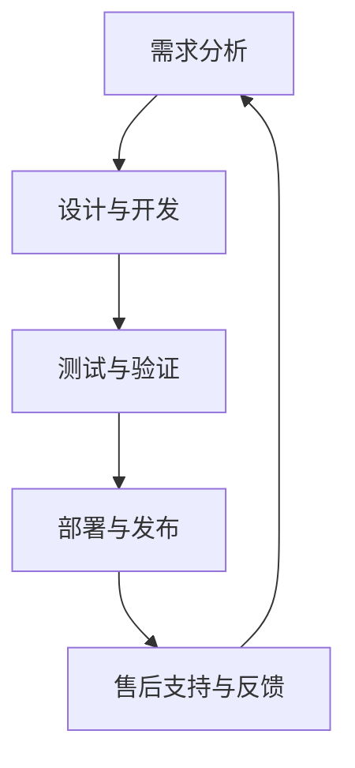

                 

## 文章标题

### 如何打造高效的产品发布流程

> 关键词：高效产品发布流程，敏捷开发，需求管理，测试覆盖，部署策略，团队协作，客户反馈，成本控制

> 摘要：本文将深入探讨如何打造高效的产品发布流程。我们将分析高效产品发布流程的核心目标、组成部分及其与敏捷开发的关系，并针对常见的发布挑战提供解决方案。通过详细的流程图和伪代码，我们将帮助读者全面理解每个发布阶段的核心任务，从而构建出高效、稳定且具有竞争力的产品发布流程。

## 第一部分：高效的产品发布流程概述

### 1.1 什么是高效的产品发布流程

#### 1.1.1 产品发布流程的核心目标

产品发布流程的核心目标可以概括为以下几个方面：

1. **快速响应市场需求**：及时捕捉并满足市场变化，快速迭代产品，保持竞争力。
2. **确保产品质量和稳定性**：通过严格的测试和质量控制，确保产品在发布时达到高标准的质量要求。
3. **提高开发团队的协作效率**：通过高效的流程和工具，确保团队成员之间的沟通顺畅，提高整体开发效率。

#### 1.1.2 高效发布流程的重要性

高效的产品发布流程对企业的长期发展和市场竞争力有着重要的影响：

1. **提升市场竞争力**：通过快速发布高质量的产品，企业能够在激烈的市场竞争中脱颖而出。
2. **减少产品发布风险**：通过系统化的流程和严格的测试，降低产品发布时出现故障的风险。
3. **提高客户满意度**：快速响应客户需求，解决客户问题，提高客户满意度和忠诚度。

#### 1.1.3 高效发布流程的组成部分

一个高效的产品发布流程通常包括以下几个关键阶段：

1. **需求分析**：收集和分析市场需求，明确产品功能和性能要求。
2. **设计与开发**：根据需求进行系统设计和开发，实现产品功能。
3. **测试与验证**：对产品进行全面测试，确保其符合质量要求。
4. **部署与发布**：将产品部署到生产环境，正式对外发布。
5. **售后支持与反馈**：提供用户培训和支持，收集用户反馈，不断优化产品。

#### 1.1.4 高效发布流程与敏捷开发的关系

高效发布流程与敏捷开发理念紧密相关，敏捷开发强调持续交付、快速反馈和迭代改进。通过以下方式，高效发布流程可以基于敏捷开发进行优化：

1. **持续集成与持续交付**：通过自动化测试和持续交付，实现快速、频繁的代码集成和部署。
2. **用户反馈与迭代**：通过用户调研和反馈，不断优化产品，快速响应市场变化。
3. **团队合作与沟通**：通过敏捷协作工具和定期的团队会议，确保团队成员之间的沟通和协作。

### 1.2 高效发布流程的挑战与解决方案

#### 1.2.1 挑战1：需求频繁变更

**解决方案**：

- **需求管理工具**：使用专业的需求管理工具，对需求进行有效的收集、管理和追踪。
- **需求优先级排序**：明确需求的优先级，确保团队优先处理高优先级的需求。
- **敏捷迭代**：采用敏捷开发方法，快速响应变更，持续迭代产品。

#### 1.2.2 挑战2：测试覆盖不足

**解决方案**：

- **自动化测试**：开发自动化测试脚本，提高测试效率。
- **测试覆盖率评估**：定期评估测试覆盖率，确保测试全面覆盖关键功能。
- **持续集成**：在代码集成过程中，自动运行测试，快速发现问题。

#### 1.2.3 挑战3：部署风险高

**解决方案**：

- **容器化部署**：使用容器技术，实现环境的一致性，减少部署风险。
- **持续交付**：通过自动化部署流程，确保每次发布都是可预测的、可控的。
- **蓝绿部署策略**：实施蓝绿部署策略，确保在旧版本故障时，可以快速回滚到稳定版本。

#### 1.2.4 挑战4：团队协作困难

**解决方案**：

- **敏捷协作工具**：使用敏捷协作工具，如JIRA、Trello等，提高团队协作效率。
- **明确角色与职责**：明确团队成员的角色和职责，确保每个成员都清楚自己的任务和目标。
- **定期团队会议**：定期举行团队会议，确保团队成员之间的沟通和协调。

#### 1.2.5 挑战5：客户反馈不及时

**解决方案**：

- **实时监控工具**：使用实时监控工具，如Splunk、ELK Stack等，收集和分析用户行为数据。
- **用户调研**：定期进行用户调研，了解用户需求和意见。
- **定期反馈会议**：定期召开反馈会议，与用户讨论产品改进方案。

#### 1.2.6 挑战6：成本控制困难

**解决方案**：

- **成本效益分析**：在进行项目规划和决策时，进行详细的成本效益分析。
- **资源优化**：合理分配资源，避免资源浪费。
- **项目管理工具**：使用项目管理工具，如JIRA、Trello等，实时跟踪项目进度和成本。

### 1.3 整体架构与流程图

#### 1.3.1 整体架构

高效的产品发布流程可以分为以下几个主要阶段：

1. **需求分析**：收集、分析并确定产品需求。
2. **设计与开发**：进行系统设计和开发，实现产品功能。
3. **测试与验证**：对产品进行全面测试，确保质量。
4. **部署与发布**：将产品部署到生产环境，正式发布。
5. **售后支持与反馈**：提供用户支持，收集用户反馈，不断优化产品。

#### 1.3.2 流程图

下面是一个高效产品发布流程的Mermaid流程图：



#### 1.3.3 每个阶段的伪代码和示例

##### 需求分析

```python
# 伪代码：需求收集与整理
def collect_requirements():
    requirements = []
    for user in users:
        req = user.get_requirements()
        requirements.append(req)
    return requirements

# 示例：收集并整理用户需求
requirements = collect_requirements()
```

##### 设计与开发

```python
# 伪代码：系统设计
def system_design(requirements):
    design = {}
    for req in requirements:
        design[req] = create_design(req)
    return design

# 示例：根据需求生成系统设计
design = system_design(requirements)
```

##### 测试与验证

```python
# 伪代码：单元测试
def unit_test(component):
    test_cases = []
    for function in component.functions:
        test_case = run_test(function)
        test_cases.append(test_case)
    return test_cases

# 示例：执行单元测试
component = get_component()
test_cases = unit_test(component)
```

##### 部署与发布

```python
# 伪代码：部署流程
def deploy_product(product):
    environment = get_environment()
    deploy_to_environment(product, environment)

# 示例：部署产品
product = get_product()
deploy_product(product)
```

##### 售后支持与反馈

```python
# 伪代码：收集用户反馈
def collect_feedback():
    feedback = []
    for user in users:
        feed = user.get_feedback()
        feedback.append(feed)
    return feedback

# 示例：收集用户反馈
feedback = collect_feedback()
```

## 总结

高效的产品发布流程是确保产品成功上市的关键。通过本文的探讨，我们了解了高效发布流程的核心目标、组成部分及其与敏捷开发的关系，同时也分析了发布流程中可能遇到的挑战和解决方案。通过详细的分析和示例，我们希望能够帮助读者全面理解产品发布流程的每个阶段，从而构建出高效、稳定且具有竞争力的产品发布体系。

作者：AI天才研究院/AI Genius Institute & 禅与计算机程序设计艺术 /Zen And The Art of Computer Programming

本文内容版权归AI天才研究院和禅与计算机程序设计艺术所有，未经授权，请勿转载。如需转载，请联系作者获得授权。

