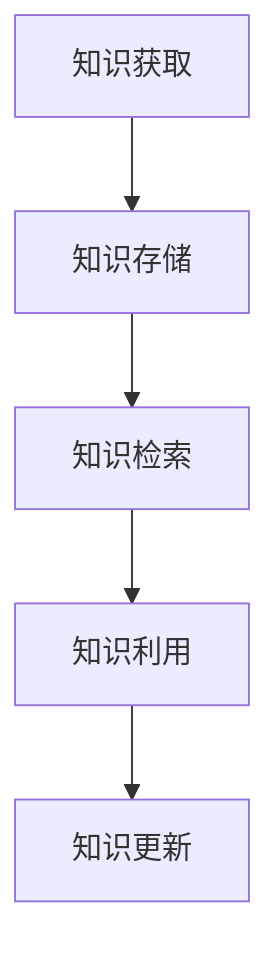
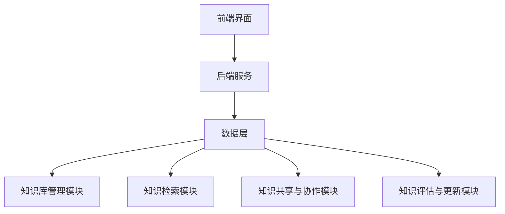

                 

## 文章标题

### 如何打造高效的客户支持知识管理系统

> 关键词：知识管理、客户支持、知识管理系统、效率优化、技术选型、实施与部署、案例分析

> 摘要：本文旨在探讨如何构建一个高效的客户支持知识管理系统。我们将详细分析知识管理的基础，探讨其在客户支持中的应用，阐述客户支持知识管理系统的架构和功能模块，提出提升系统效率的策略，并介绍系统设计原则、技术选型、实施与部署流程，以及通过案例分析，总结最佳实践和未来发展方向。

---

## 第一部分：知识管理基础

### 第1章：知识管理与客户支持的关系

#### 1.1 知识管理的定义与核心要素

**知识管理的概念**

知识管理是指通过系统的方法和工具，对知识进行识别、获取、共享、利用和创新，以提高组织效率和竞争力的过程。它不仅仅是一种技术手段，更是一种管理和战略思想。

**知识管理的核心要素**

1. **知识识别与获取**：识别组织内外的潜在知识源，获取对业务有帮助的知识。
2. **知识共享与传播**：建立知识共享平台，促进知识的传播和交流。
3. **知识利用与创新**：将知识应用于实际工作中，促进创新和业务改进。

**知识管理的重要性**

知识管理在现代企业中具有至关重要的地位。它不仅能够提高员工的工作效率，还能够增强组织的创新能力和竞争力。

#### 1.2 客户支持的挑战与机遇

**客户支持的挑战**

1. **客户需求多样化**：客户需求日益多样化，客户支持的难度增加。
2. **响应速度要求高**：客户期望能够快速得到解决问题的方案。
3. **知识更新速度快**：技术更新迅速，客户支持需要不断更新知识库。

**客户支持的知识管理需求**

1. **知识库建设**：建立丰富的知识库，以便快速响应客户需求。
2. **知识共享**：确保客户支持团队能够共享和利用知识。
3. **知识更新**：定期更新知识库，确保知识的准确性和时效性。

#### 1.3 知识管理在客户支持中的应用

知识管理在客户支持中的应用主要体现在以下几个方面：

1. **知识库管理**：建立和维护一个集中的知识库，存储各类客户问题和解决方案。
2. **自动化工具**：利用自动化工具，如聊天机器人，提供快速响应和解决方案。
3. **培训与支持**：通过知识管理平台，对客户支持团队进行培训和知识更新。

### 第2章：客户支持知识管理系统概述

#### 2.1 客户支持知识管理系统的定义

客户支持知识管理系统是一种综合性的信息系统，旨在支持客户支持团队的工作。它集成了知识库管理、知识检索、知识共享和协作等功能，帮助团队快速定位和利用知识，提高客户支持效率。

#### 2.2 客户支持知识管理系统的架构

**系统架构的组成部分**

1. **前端界面**：提供用户交互的界面，包括知识库浏览、搜索和知识分享等功能。
2. **后端服务**：负责数据存储、处理和检索，包括数据库、应用服务器和搜索服务器等。
3. **数据层**：存储各种知识数据和用户数据。

**系统架构的设计原则**

1. **可扩展性**：系统应能够适应业务规模的变化，支持数据量的增长。
2. **灵活性**：系统设计应灵活，便于功能的扩展和升级。
3. **用户友好性**：系统界面应简洁直观，易于用户操作。

#### 2.3 客户支持知识管理系统的功能模块

**知识库管理模块**

知识库管理模块负责知识的创建、存储、分类和标签化，确保知识的结构化和可检索性。

**知识检索模块**

知识检索模块提供快速、准确的搜索功能，帮助用户快速找到所需的知识。

**知识共享与协作模块**

知识共享与协作模块鼓励团队成员之间的知识交流和协作，提高知识利用效率。

**知识评估与更新模块**

知识评估与更新模块对知识进行评估和更新，确保知识的准确性和时效性。

### 第3章：效率提升策略

#### 3.1 知识获取与整理策略

**知识获取渠道**

1. **内部培训**：通过内部培训，获取最新知识和技能。
2. **外部学习**：通过参加行业会议、研讨会等，获取最新的行业动态。

**知识整理方法**

1. **文档化**：将口头和经验知识转化为文档，便于存储和传播。
2. **结构化**：对知识进行分类和标签化，便于检索和使用。

**知识分类与标签化**

1. **主题分类**：根据知识主题进行分类，便于用户查找。
2. **标签化**：为知识添加多个标签，提高知识检索的精确性。

#### 3.2 知识检索优化

**检索算法的选择**

1. **全文检索**：适用于大规模文本数据的检索。
2. **分类检索**：根据知识分类进行检索。

**检索策略的制定**

1. **索引策略**：优化索引结构，提高检索速度。
2. **模糊查询**：允许用户输入部分关键词，提高检索的灵活性。

**检索效果的评估**

1. **准确率**：评估检索结果的相关性。
2. **召回率**：评估检索结果是否包含所有相关内容。

#### 3.3 知识共享与协作机制

**内部沟通机制**

1. **定期会议**：定期召开团队会议，讨论知识共享和协作问题。
2. **内部论坛**：建立内部论坛，方便团队成员交流和分享知识。

**知识共享平台的设计**

1. **易用性**：平台应简洁直观，易于用户操作。
2. **互动性**：提供评论、点赞和分享功能，鼓励用户互动。

**知识协作工具的选择与应用**

1. **即时通讯工具**：如Slack、Microsoft Teams等，方便团队成员实时沟通。
2. **项目管理工具**：如Trello、JIRA等，帮助团队协作和管理任务。

## 第二部分：知识管理系统建设

### 第4章：知识管理系统设计原则

#### 4.1 设计原则概述

**系统的可扩展性和可维护性**

设计知识管理系统时，应考虑系统的可扩展性和可维护性。这包括数据库架构的设计、应用系统的模块化设计等。

**系统的灵活性和适应性**

系统应具备灵活性和适应性，以适应业务需求的变化。这包括支持多种数据格式、支持多语言等。

**用户友好性**

系统界面应简洁直观，易于用户操作。这包括提供友好的用户界面、简化操作流程等。

#### 4.2 知识管理系统需求分析

**企业业务需求分析**

分析企业业务需求，确定知识管理系统的目标和使用场景。这包括确定知识管理系统的功能模块、数据需求等。

**用户需求分析**

了解用户需求，包括用户的工作流程、操作习惯等。这有助于设计一个符合用户需求的知识管理系统。

**功能需求分析**

根据业务需求和用户需求，确定知识管理系统需要具备的功能。这包括知识库管理、知识检索、知识共享和协作等。

#### 4.3 知识管理系统架构设计

**系统架构设计概述**

系统架构设计应考虑系统的可扩展性、灵活性、可维护性等。这包括前端界面设计、后端服务设计、数据层设计等。

**数据存储方案设计**

数据存储方案设计应考虑数据的安全性、可靠性、性能等。这包括数据库的选择、数据备份和恢复策略等。

**系统集成方案设计**

系统集成方案设计应考虑系统的可扩展性、灵活性等。这包括与其他系统的集成、数据交换等。

### 第5章：技术选型与工具选择

#### 5.1 技术选型原则

**技术稳定性**

选择稳定可靠的技术，确保系统的稳定运行。

**技术成熟度**

选择成熟度高的技术，降低系统开发风险。

**技术适应性**

选择适应业务需求的技术，确保系统能够满足未来业务变化。

#### 5.2 常用技术选型分析

**数据库技术**

- **关系型数据库**：如MySQL、PostgreSQL等，适用于结构化数据存储。
- **NoSQL数据库**：如MongoDB、Cassandra等，适用于非结构化数据存储。

**搜索引擎技术**

- **全文搜索引擎**：如Elasticsearch、Solr等，适用于大规模文本数据检索。
- **搜索引擎框架**：如Lucene、Nutch等，适用于自定义搜索引擎开发。

**知识图谱技术**

- **图数据库**：如Neo4j、JanusGraph等，适用于知识图谱存储。
- **知识图谱框架**：如OpenKG、Weaviate等，适用于知识图谱构建和应用。

#### 5.3 常用工具选型分析

**知识库管理工具**

- **企业级知识库**：如Confluence、SharePoint等，适用于企业内部知识管理。
- **开源知识库**：如MediaWiki、GitLab等，适用于小型团队知识管理。

**知识共享工具**

- **文档共享工具**：如Google Docs、Microsoft Office 365等，适用于文档协作。
- **知识共享平台**：如Slack、Microsoft Teams等，适用于实时沟通和知识分享。

**知识协作工具**

- **项目管理工具**：如Trello、JIRA等，适用于任务协作和管理。
- **协作平台**：如Confluence、SharePoint等，适用于知识管理和团队协作。

### 第6章：系统实施与部署

#### 6.1 系统实施策略

**实施步骤**

1. **需求分析**：明确系统需求和目标。
2. **系统设计**：设计系统架构和数据库结构。
3. **编码实现**：根据设计文档进行系统开发。
4. **测试与调试**：进行功能测试和性能测试。
5. **部署上线**：将系统部署到生产环境。

**实施风险与应对措施**

- **技术风险**：选择成熟稳定的技术，降低技术风险。
- **业务风险**：确保系统功能符合业务需求，降低业务风险。
- **数据风险**：确保数据的安全性和完整性。

**实施效果评估**

1. **功能评估**：评估系统功能是否符合需求。
2. **性能评估**：评估系统性能是否达到预期。
3. **用户反馈**：收集用户反馈，评估用户体验。

#### 6.2 系统部署与上线

**系统部署方案**

1. **硬件部署**：选择合适的服务器和网络设备。
2. **软件部署**：安装操作系统、数据库和应用服务器。
3. **配置管理**：配置系统参数，确保系统稳定运行。

**系统上线流程**

1. **数据迁移**：将旧系统数据迁移到新系统。
2. **功能测试**：进行全面的功能测试。
3. **用户培训**：对用户进行系统操作培训。
4. **上线切换**：将旧系统切换到新系统。

**系统维护与升级**

1. **日常维护**：定期检查系统运行状况，确保系统稳定。
2. **升级策略**：根据业务需求和技术发展，制定系统升级策略。
3. **安全防护**：加强系统安全防护，防止数据泄露和攻击。

### 第7章：案例研究与分析

#### 7.1 案例选择与评估

**案例选择标准**

- **典型性**：选择具有代表性的案例，便于分析和推广。
- **完整性**：案例实施过程应完整，涵盖需求分析、系统设计、实施与部署等环节。
- **效果显著**：案例效果应显著，能够体现知识管理系统的作用。

**案例评估方法**

1. **数据评估**：通过数据分析，评估系统性能和效果。
2. **用户反馈**：收集用户反馈，评估用户体验和满意度。
3. **对比分析**：与同类案例进行对比，评估差异和优势。

#### 7.2 案例一：某大型企业的客户支持知识管理系统建设

**案例背景**

某大型企业面临着客户需求多样化、响应速度要求高等挑战。为了提高客户支持效率，企业决定建设一个客户支持知识管理系统。

**案例实施过程**

1. **需求分析**：明确客户支持知识管理系统的功能需求和使用场景。
2. **系统设计**：设计系统架构和数据库结构。
3. **编码实现**：根据设计文档进行系统开发。
4. **测试与调试**：进行功能测试和性能测试。
5. **部署上线**：将系统部署到生产环境。

**案例效果分析**

1. **效率提升**：客户支持团队的工作效率显著提升，客户满意度提高。
2. **知识共享**：知识共享和协作机制得到有效实施，知识利用效率提高。
3. **成本降低**：通过自动化工具和知识管理，降低客户支持成本。

#### 7.3 案例二：某中小型企业的客户支持知识管理系统优化

**案例背景**

某中小型企业现有客户支持知识管理系统，但由于系统设计和实施不够完善，存在效率低、知识共享不畅等问题。为了提升客户支持效率，企业决定对系统进行优化。

**案例实施过程**

1. **需求分析**：明确系统优化需求和目标。
2. **系统设计**：设计优化方案，包括功能模块调整、数据库结构优化等。
3. **编码实现**：根据设计文档进行系统开发。
4. **测试与调试**：进行功能测试和性能测试。
5. **部署上线**：将优化后的系统部署到生产环境。

**案例效果分析**

1. **效率提升**：系统优化后，客户支持团队的工作效率显著提升。
2. **知识共享**：知识共享和协作机制得到改进，知识利用效率提高。
3. **用户体验**：用户界面更加友好，用户体验得到改善。

### 附录

#### 附录A：相关资源与工具

**知识管理相关书籍推荐**

- **《知识管理：理论与实践》**：详细介绍了知识管理的基本概念、方法和技术。
- **《企业知识管理》**：从战略角度探讨了知识管理在企业中的应用。

**知识管理相关在线课程推荐**

- **Coursera上的《知识管理》课程**：由知名大学提供，涵盖知识管理的各个方面。
- **edX上的《知识管理基础》课程**：提供知识管理的基本知识和实践方法。

**知识管理社区与论坛推荐**

- **Knowledge Management Community**：全球最大的知识管理社区，提供丰富的知识和资源。
- **知乎上的知识管理话题**：国内知名的知识管理社区，聚集了大量知识管理领域的专家和从业者。

#### 附录B：Mermaid流程图示例

**知识管理流程图**



**客户支持知识管理系统架构图**



#### 附录C：伪代码示例

**知识检索算法伪代码**

```python
function searchKnowledge(keywords):
    # 初始化检索结果列表
    results = []

    # 检索数据库中的知识条目
    for knowledge in knowledgeDatabase:
        if contains(knowledge, keywords):
            results.append(knowledge)

    # 对检索结果进行排序
    sort(results, by='relevance')

    return results
```

**知识共享与协作机制伪代码**

```python
function shareKnowledge(knowledge):
    # 将知识添加到知识库
    addKnowledgeToDatabase(knowledge)

    # 通知其他团队成员
    notifyTeamMembers("New knowledge added: " + knowledge)

    # 记录知识共享日志
    logKnowledgeSharing(knowledge)
```

#### 附录D：数学公式与解释

**知识评估模型公式**

$$
E = \alpha \cdot R + \beta \cdot T + \gamma \cdot A
$$

- \(E\)：知识评估得分
- \(\alpha\)：相关性权重
- \(R\)：知识的相关性得分
- \(\beta\)：时效性权重
- \(T\)：知识的时效性得分
- \(\gamma\)：准确性权重
- \(A\)：知识的准确性得分

**知识更新模型公式**

$$
U = \delta \cdot R + \epsilon \cdot T
$$

- \(U\)：知识更新得分
- \(\delta\)：相关性权重
- \(R\)：知识的相关性得分
- \(\epsilon\)：时效性权重
- \(T\)：知识的时效性得分

#### 附录E：项目实战案例

**开发环境搭建**

1. 安装Python 3.8及以上版本。
2. 安装Elasticsearch 7.10版本。
3. 安装Docker 19.03及以上版本。

**源代码详细实现**

- **知识检索模块**：实现基于Elasticsearch的全文检索功能。
- **知识共享模块**：实现知识分享和协作功能。
- **知识评估模块**：实现知识评估和更新功能。

**代码解读与分析**

- **知识检索模块**：详细解析Elasticsearch的API调用和检索算法。
- **知识共享模块**：分析知识共享和协作的流程和机制。
- **知识评估模块**：解释知识评估模型和更新模型的实现。

**代码应用解读与分析**

- **知识检索模块**：展示如何使用代码进行实际检索操作。
- **知识共享模块**：展示如何使用代码进行知识共享和协作。
- **知识评估模块**：展示如何使用代码进行知识评估和更新。

**实际案例分析和详细讲解剖析**

- **案例一**：分析某大型企业的客户支持知识管理系统建设案例。
- **案例二**：分析某中小型企业的客户支持知识管理系统优化案例。

**项目小结**

- **总结经验**：总结项目实施过程中的成功经验和不足之处。
- **优化建议**：提出优化系统性能、用户体验等方面的建议。

### 结语

客户支持知识管理系统在现代企业中具有重要作用。通过本文的讨论，我们了解了知识管理的基础、客户支持知识管理系统的架构和功能模块，以及提升系统效率的策略。在系统建设过程中，我们需要遵循设计原则，进行技术选型和工具选择，确保系统的可扩展性、灵活性和用户友好性。通过实施和部署，我们能够将知识管理系统成功应用到实际业务中，为企业创造价值。

未来的发展方向包括：

1. **技术趋势**：随着人工智能和大数据技术的发展，知识管理系统将更加智能化和自动化。
2. **应用场景**：知识管理系统将应用于更多场景，如客户支持、市场营销、产品开发等。
3. **挑战与机遇**：面临数据安全、隐私保护等挑战，同时也有机会通过技术创新提升系统性能和用户体验。

总之，打造高效的客户支持知识管理系统是企业提高竞争力和用户体验的重要手段。通过不断优化和升级，知识管理系统将在未来发挥更大的作用。

---

**作者：AI天才研究院/AI Genius Institute & 禅与计算机程序设计艺术 /Zen And The Art of Computer Programming**

